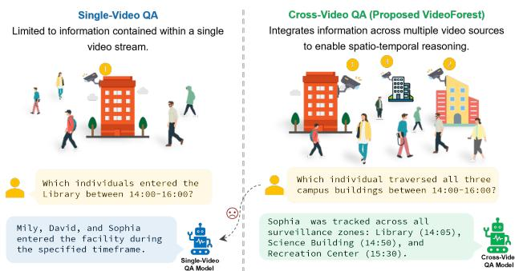
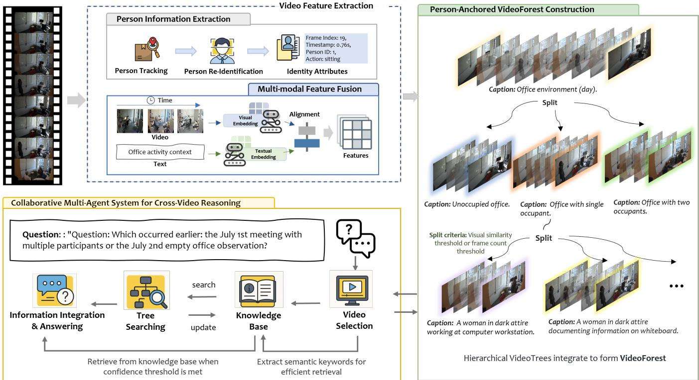
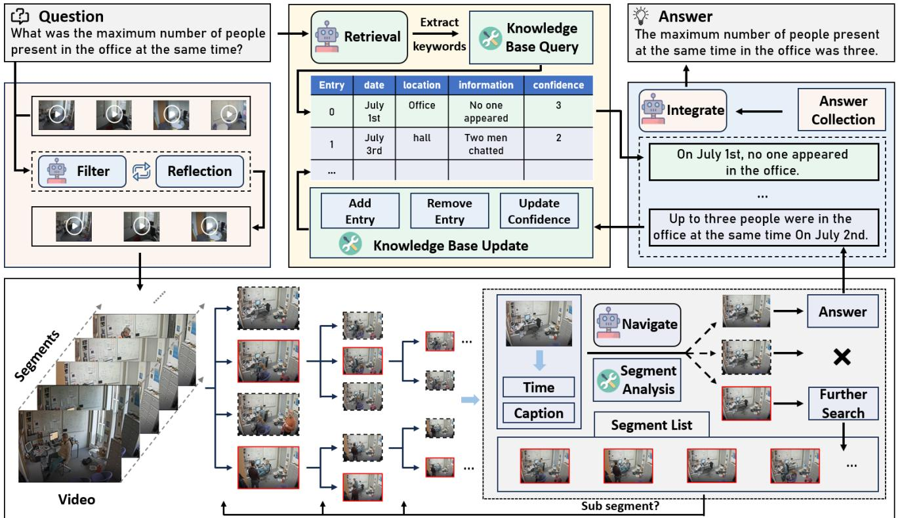
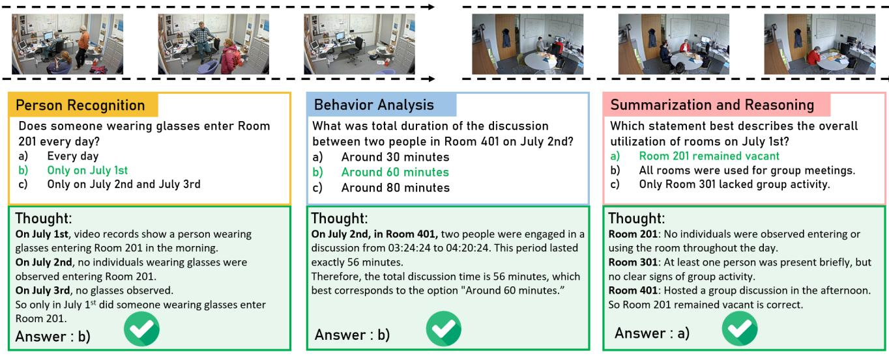

# 1. 论文基本信息 (Bibliographic Information)

*   <strong>标题 (Title):</strong> VideoForest: Person-Anchored Hierarchical Reasoning for Cross-Video Question Answering (VideoForest：基于人物锚点的跨视频问答分层推理)
*   <strong>作者 (Authors):</strong> Yiran Meng, Junhong Ye, Wei Zhou, Guanghui Yue, Xudong Mao, Ruomei Wang, and Baoquan Zhao. 作者主要来自中国的中山大学和深圳大学，以及英国的卡迪夫大学。
*   <strong>发表期刊/会议 (Journal/Conference):</strong> 论文拟发表于 MM '25 (The 33rd ACM International Conference on Multimedia)。ACM Multimedia 是多媒体领域的顶级国际会议，具有很高的学术声誉和影响力。
*   <strong>发表年份 (Publication Year):</strong> 2025 (根据论文信息)
*   <strong>摘要 (Abstract):</strong> 跨视频问答 (Cross-video question answering) 任务比传统的单视频理解更具挑战性，尤其是在建立跨视频流的有效连接和管理多源信息检索的复杂性方面。为此，论文提出了一个名为 `VideoForest` 的新颖框架，该框架通过<strong>基于人物锚点的分层推理 (person-anchored hierarchical reasoning)</strong> 来解决这些挑战。该方法利用<strong>人物级别的特征 (person-level features)</strong> 作为连接不同视频的天然“桥梁”，从而实现了高效的跨视频理解，并且<strong>无需端到端的训练 (end-to-end training)</strong>。`VideoForest` 集成了三大创新：1) 一种基于人物锚点的特征提取机制，使用人物重识别 (`ReID`) 和跟踪算法在多个视频源之间建立稳固的时空关系；2) 一种多粒度的生成树结构，围绕人物轨迹对视觉内容进行分层组织；3) 一个多智能体推理框架，高效地遍历该分层结构以回答复杂的跨视频查询。为了评估该方法，作者还开发了一个专为以人物为中心的跨视频分析设计的综合性基准数据集 `CrossVideoQA`。实验结果表明，`VideoForest` 在跨视频推理任务中表现出色，显著优于现有方法。
*   <strong>原文链接 (Source Link):</strong> https://arxiv.org/pdf/2508.03039 (这是一个在 arXiv 上的预印本 (Preprint)，尚未经过同行评审或正式发表。)

    ---

# 2. 整体概括 (Executive Summary)

*   <strong>研究背景与动机 (Background & Motivation - Why):</strong>
    *   <strong>核心问题：</strong> 现有的视频理解模型，如视频问答 (`VideoQA`) 系统，绝大多数被设计用于处理<strong>单个视频</strong>。它们无法有效处理那些需要整合<strong>多个不同视频源</strong>信息才能回答的问题。
    *   <strong>重要性与挑战：</strong> 在许多现实场景中，如城市监控、安全调查等，信息本身就是分散在不同摄像头、不同时间段的视频流中的。例如，要回答 “哪个人在下午2点到4点之间穿过了校园里所有三栋大楼？” (见下图 图像 4)，就需要系统能够首先在每个视频中识别和跟踪人，然后在不同视频之间确认是同一个人，最后整合其跨越空间和时间的行为轨迹。这是现有单视频模型无法完成的，它们存在一个根本的<strong>“单流处理范式”局限 (single-stream processing paradigm)</strong>。
    *   <strong>切入点与创新思路：</strong> 论文的核心洞察是，<strong>“人”是连接不同视频的最自然的锚点或桥梁</strong>。无论摄像头视角、光照条件如何变化，人的身份是相对不变的。因此，可以通过首先识别和跟踪视频中的每一个人，然后以这些人的时空轨迹为核心来组织和关联来自不同视频的信息，从而将原本孤立的视频数据整合成一个相互关联的“信息森林”，即 `VideoForest`。

        

*   <strong>核心贡献/主要发现 (Main Contribution/Findings - What):</strong>
    *   <strong>提出首个基于人物锚点的跨视频问答分层框架 (`VideoForest`)：</strong> 创新性地设计了一种树状架构，利用人物作为连接多个视频流的“桥梁”，实现了对分散视觉信息的统一理解。
    *   <strong>开发高效的多粒度视频组织与多智能体推理框架：</strong> 该框架将视频内容按不同粒度（从整个视频到细小的事件片段）进行分层组织，并结合一个多智能体系统进行高效推理，既保留了关键的时空关系，又保证了计算上的可行性。
    *   <strong>构建首个以人物为中心的跨视频问答基准数据集 (`CrossVideoQA`)：</strong> 为了评估和推动该领域的研究，作者创建了一个新的数据集和评估协议，为这一新兴研究方向设立了性能基准。

        ---

# 3. 预备知识与相关工作 (Prerequisite Knowledge & Related Work)

*   <strong>基础概念 (Foundational Concepts):</strong>
    *   <strong>视频问答 (Video Question Answering, VideoQA):</strong> 这是一项多模态任务，要求模型根据一个视频内容和一个自然语言问题，生成正确的答案。它需要模型深度理解视频中的物体、动作、事件以及它们之间的时空和因果关系。
    *   <strong>人物重识别 (Person Re-Identification, ReID):</strong> 这是一项计算机视觉技术，旨在确定一个出现在不同摄像头、不同时间或不同位置的行人是否是同一个人。`ReID` 是实现跨摄像头人物跟踪的关键技术，也是 `VideoForest` 框架的基石。
    *   <strong>多智能体系统 (Multi-Agent System):</strong> 这是一种计算系统，由多个自主的、可交互的“智能体” (Agent) 组成。每个智能体通常有专门的角色和任务，它们通过协作来解决单个智能体难以完成的复杂问题。在 `VideoForest` 中，不同的智能体分别负责解析问题、检索信息、遍历数据结构和整合答案。
    *   <strong>分层表示 (Hierarchical Representation):</strong> 指将数据组织成一种树状或金字塔状的结构，从顶层的粗粒度、概括性信息到底层的细粒度、具体信息。这种结构便于高效地进行信息检索，可以根据需要快速定位到相关层级，避免了对全部底层数据的详尽搜索。

*   <strong>前人工作 (Previous Works):</strong>
    *   <strong>单视频问答模型：</strong> 论文提到了 `VideoAgent` 和 `Chat-Video` 等先进模型。`VideoAgent` 使用了基于智能体的搜索策略，`Chat-Video` 则开创性地使用运动轨迹进行分析。但它们的共同局限是，所有操作都限制在<strong>单个视频</strong>内部，无法建立跨视频的语义连接。
    *   <strong>结构化视频表示：</strong> `VideoTree` 等工作通过将视频构建成层次结构来提升长视频理解的效率。`VideoForest` 借鉴了这种分层思想，但将其创新性地扩展到了<strong>多视频领域</strong>，并通过<strong>人物锚点</strong>来连接不同的“树”，形成“森林”。
    *   <strong>视频理解基准：</strong> 现有的基准如 `ActivityNet`, `Video-MME` 等主要评估单视频内的理解能力，如事件识别、时序定位等。这些基准缺乏专门为评估<strong>跨视频推理</strong>能力而设计的问题，无法衡量模型整合多源信息的能力。

*   <strong>技术演进 (Technological Evolution):</strong> 视频理解技术正从简单的分类、检测任务，发展到复杂的、需要深度推理的问答任务。同时，随着多模态大语言模型 (`MLLMs`) 的兴起，模型处理长视频和复杂逻辑的能力不断增强。然而，绝大多数研究的焦点仍然是“更长”和“更复杂”的<strong>单视频</strong>。本文的工作标志着一个重要的演进方向：从处理<strong>单个长视频 (long video)</strong> 转向处理<strong>多个分布式视频 (multiple distributed videos)</strong>。

*   <strong>差异化分析 (Differentiation):</strong> 与之前工作的核心区别在于：
    1.  <strong>问题域不同：</strong> `VideoForest` 专注于<strong>跨视频 (Cross-Video)</strong> 问答，而之前的工作基本都是<strong>单视频 (Single-Video)</strong> 问答。
    2.  <strong>核心机制不同：</strong> `VideoForest` 的核心是<strong>人物锚定 (Person-Anchoring)</strong>，利用 `ReID` 技术在不同视频间建立稳固的连接点。这是其他方法所没有的。
    3.  <strong>架构不同：</strong> `VideoForest` 采用了一种<strong>“森林”结构 (多棵树)</strong> 来组织多个视频，并使用<strong>多智能体系统</strong>进行协同推理，这在架构上比传统的端到端模型更加模块化和可解释。

        ---

# 4. 方法论 (Methodology - Core Technology & Implementation Details)

`VideoForest` 的方法论可以分解为四个核心步骤：特征提取与分割、分层表示构建、VideoForest 组织，以及多智能体协同推理。

*   <strong>方法原理 (Methodology Principles):</strong>
    *   核心思想是将分散、独立的多个视频，通过一个共同的、不变的实体——“人”，关联起来。然后，将每个视频的内容按照从粗到细的粒度组织成一棵“树”，最后将所有因包含同一个人而相关的“树”连接起来，形成一片“森林”。当需要回答问题时，派遣一组各司其职的智能体在这片森林中高效地搜索、整合信息。

*   <strong>方法步骤与流程 (Steps & Procedures):</strong>

    <strong>第一步：双流特征提取与自适应分割 (Dual-Stream Feature Extraction and Adaptive Segmentation)</strong>
    1.  <strong>双流特征提取：</strong> 对输入的每个视频帧 $f_{i,j}$，同时提取两种信息：
        *   <strong>视觉内容流：</strong> 使用一个强大的视觉编码器（如 `ViCLIP`）提取一个高维向量 $\mathbf{v}(f_{i,j})$，它代表了该帧的整体视觉语义。
        *   <strong>人物中心流：</strong> 使用一个专门的跟踪和 `ReID` 模型来检测帧中的每个人，并提取其结构化信息 $\mathbf{p}(f_{i,j})$，包括时间戳 $t_k$、空间坐标 $\mathbf{x}_k$ 和一个<strong>全局唯一的人物ID</strong> $\mathrm{id}_k$。这个 `ID` 是实现跨视频连接的关键。
    2.  <strong>自适应分割：</strong> 为了将长视频切分成有意义的短片段 (Segment)，论文设计了一个包含三个条件的分割准则。当任何一个条件满足时，就在当前帧创建一个切点：
        *   $C_1$: <strong>局部内容剧变</strong>，即相邻两帧的视觉特征差异过大（例如场景切换）。
        *   $C_2$: <strong>全局内容漂移</strong>，即当前帧的视觉特征与整个片段的代表性特征差异过大（例如场景内容逐渐发生重大变化）。
        *   $C_3$: <strong>人物集合变化</strong>，即当前帧出现的人员集合与上一帧相比发生了显著变化（例如有人进入或离开画面）。
            这个多标准方法确保了分割出的片段在内容和人物活动上都具有内部一致性。

    <strong>第二步：多级语义表示与 VideoTree 构建 (Multi-Level Semantic Representation & VideoTree Construction)</strong>
    1.  对于每个分割好的视频片段 $S_{i,k}$，提取一个综合的语义表示 $\mathbf{C}(S_{i,k})$。这个表示融合了片段关键帧的视觉信息和该片段内所有人物的轨迹信息。
    2.  基于这些片段，为每个视频 $V_i$ 构建一棵分层树 $\mathcal{T}_i$（即 `VideoTree`）。
        *   <strong>叶子节点 (Leaf Nodes):</strong> 对应于第一步分割出的最细粒度的视频片段。
        *   <strong>中间节点 (Internal Nodes):</strong> 递归地由其子节点合并而成，代表更长、更粗粒度的视频区间。
        *   <strong>根节点 (Root Node):</strong> 代表整个视频。
    3.  树中的每个节点 v 都存储了丰富的结构化信息：
        $$
        \boldsymbol{v} = (t_{\mathrm{start}}, t_{\mathrm{end}}, \mathcal{R}_v, \mathbf{C}_v, \Gamma_v)
        $$
        *   $t_{\mathrm{start}}, t_{\mathrm{end}}$: 节点覆盖的时间区间。
        *   $\mathcal{R}_v$: 该时间段内出现的所有人物的 ID 及其轨迹信息。<strong>这是关键的锚点信息。</strong>
        *   $\mathbf{C}_v$: 该时间段内容的综合语义表示。
        *   $\Gamma_v$: 该节点的子节点集合。
    
    <strong>第三步：VideoForest 构建 (VideoForest Construction)</strong>
    *   `VideoForest` 并非一个单一的数据结构，而是由多个视频对应的 `VideoTree` ($\mathcal{T}_1, \mathcal{T}_2, ..., \mathcal{T}_n$) 组成的集合。它们之间的关联是通过存储在每个节点中的人物ID $\mathcal{R}_v$ 隐式建立的。当一个查询涉及到特定人物时，系统可以快速地在所有树中定位到包含该人物ID的节点，从而实现跨树（即跨视频）的信息检索。

        

    <strong>第四步：协作式多智能体系统推理 (Collaborative Multi-Agent System)</strong>
    *   当用户提出一个跨视频问题时，一个由四个专业智能体组成的团队开始协作（见下图 图像 2）。
        1.  <strong>过滤智能体 ($\mathcal{A}_{\mathrm{filter}}$):</strong> 首先解析用户问题，提取出时间、空间、人物等关键约束，并利用这些约束从海量的视频库中筛选出可能相关的几棵 `VideoTree`。
        2.  <strong>检索智能体 ($\mathcal{A}_{\mathrm{retrieval}}$):</strong> 访问一个全局的<strong>知识库 ($\mathcal{K}$)</strong>。这个知识库存储了之前查询中推理出的高置信度事实（例如“7月1日办公室没人”）。如果知识库中已有答案，则直接返回，避免重复计算。同时，该智能体还负责更新知识库，增加新发现，或根据新证据调整已有条目的置信度。
        3.  <strong>导航智能体 ($\mathcal{A}_{\mathrm{navigate}}$):</strong> 在被选中的 `VideoTree` 中执行<strong>自顶向下 (top-down)</strong> 的搜索。它首先检查粗粒度的父节点，如果该节点与问题相关，就深入其子节点进行更精细的查找，直到定位到最相关的视频片段。如果查询包含人物信息，它会利用节点中的人物ID $\mathcal{R}_v$ 进行高效剪枝和定位。
        4.  <strong>整合智能体 ($\mathcal{A}_{\mathrm{integrate}}$):</strong> 收集来自知识库和 `VideoTree` 导航的所有相关信息片段，进行综合推理、总结，并生成最终的自然语言答案。

            

*   <strong>数学公式与关键细节 (Mathematical Formulas & Key Details):</strong>
    *   <strong>自适应分割准则公式：</strong>
        $$
        S(f_{i,j}) = \mathbb{I}[C_1(f_{i,j}) \lor C_2(f_{i,j}) \lor C_3(f_{i,j})]
        $$
        *   $S(f_{i,j})$: 一个指示函数，当值为1时表示在第 j 帧处进行分割。
        *   $\mathbb{I}[\cdot]$: 指示函数 (Indicator function)。
        *   $\lor$: 逻辑“或”运算，表示三个条件满足其一即可。
        *   $C_1(f_{i,j}): \|\mathbf{v}(f_{i,j}) - \mathbf{v}(f_{i,j+1})\|_2 > \epsilon_1$: 相邻帧视觉特征的欧氏距离大于阈值 $\epsilon_1$。
        *   $C_2(f_{i,j}): \|\mathbf{v}(f_{i,j}) - \mathbf{v}(f_{i,j}^{\mathrm{cent}})\|_2 > \epsilon_2$: 当前帧视觉特征与当前片段中心帧特征的距离大于阈值 $\epsilon_2$。
        *   $C_3(f_{i,j}): |\mathcal{P}(f_{i,j}) \triangle \mathcal{P}(f_{i,j-1})| \geq \Delta\varphi$: 相邻两帧的人物ID集合的对称差集 (Symmetric Difference) 的大小（即进出人数）大于等于阈值 $\Delta\varphi$。

            ---

# 5. 实验设置 (Experimental Setup)

*   <strong>数据集 (Datasets):</strong>
    *   论文构建了一个新的基准数据集 <strong>`CrossVideoQA`</strong>。
    *   <strong>来源：</strong> 该数据集整合了两个现有数据集：1) <strong>爱丁堡办公室监控数据集 (Edinburgh Office Surveillance Dataset, EOSD)</strong>，提供了一个结构化的室内环境中、跨越多个日期和地点的监控视频；2) <strong>HACS 数据集</strong>，提供了大量多样化的人类行为片段。
    *   <strong>特点与适用性：</strong> `CrossVideoQA` 专门为评估<strong>以人物为中心的跨视频推理</strong>而设计。它包含的问题需要模型追踪特定人物在不同时间、不同地点的行为，这与 `VideoForest` 的设计目标高度契合。

*   <strong>评估指标 (Evaluation Metrics):</strong>
    *   <strong>主要指标：</strong> 准确率 (Accuracy)。
    *   <strong>评估维度：</strong> 为了全面评估模型能力，`CrossVideoQA` 设计了两个维度的评估框架：
        1.  <strong>三大推理任务 (Reasoning Tasks):</strong>
            *   <strong>人物识别 (Person Recognition):</strong> 识别和追踪跨视频的特定个体。
            *   <strong>行为分析 (Behavior Analysis):</strong> 理解和解释跨视频的人类活动和互动。
            *   <strong>总结与推理 (Summarization and Reasoning):</strong> 对多个视频进行信息综合、因果推断。
        2.  <strong>四种时空配置 (Spatio-Temporal Configurations):</strong>
            *   `M_single`: 单视频问答（同一天、同一地点）。
            *   `M_cross-temporal`: 跨时间问答（同一地点、不同日期）。
            *   `M_cross-spatial`: 跨空间问答（同一天、不同地点）。
            *   `M_cross-spatiotemporal`: 跨时空问答（不同日期、不同地点），这是最具挑战性的场景。

*   <strong>对比基线 (Baselines):</strong>
    *   论文选择了一系列当前最先进的 (State-of-the-art) 视频理解大模型作为基线，如 `ShareGPT4Video`, `Video-CCAM`, `InternVL 2.5`, `LLaVA-OneVision` 等。
    *   <strong>代表性：</strong> 这些模型在各大单视频理解基准上都取得了顶尖性能，是该领域的强有力代表。
    *   <strong>公平性处理：</strong> 由于这些基线模型原生不支持跨视频任务，作者为它们设计了一个<strong>串行处理协议 (sequential processing protocol)</strong>：首先让模型判断每个视频与问题的相关性，然后从相关视频中提取信息，最后综合所有信息生成答案。这确保了在评估中尽可能公平地发挥这些基线模型的能力。

        ---

# 6. 实验结果与分析

*   <strong>核心结果分析 (Core Results Analysis):</strong>
    *   <strong>任务性能 (Table 1):</strong> `VideoForest` 在所有三个推理任务上都<strong>显著优于</strong>所有基线模型。
        *   在<strong>人物识别</strong>任务上，`VideoForest` 达到了 <strong>71.93%</strong> 的准确率，比表现第二好的基线 (`InternVL-2.5` 的 58.93%) 高出超过 13%。这强有力地证明了其<strong>人物锚定</strong>机制的有效性，显式地进行人物跟踪和 `ReID` 对于解决这类问题至关重要。
        *   在<strong>行为分析</strong>任务上，`VideoForest` 更是达到了 <strong>83.75%</strong> 的准确率，领先第二名 (`BIMBA-LLaVA` 和 `mPLUG-Owl3` 的 71.60%) 超过 12%。这表明其分层结构能够有效地整合人物在不同时空的活动片段。
        *   在最复杂的<strong>总结与推理</strong>任务上，`VideoForest` 同样取得了最高的 <strong>51.67%</strong> 准确率。
    *   <strong>时空配置性能 (Table 2):</strong> `VideoForest` 在所有四种时空配置下都表现出最强的性能和最好的<strong>均衡性</strong>。
        *   在跨时间 (`M_cross-temporal`) 和跨空间 (`M_cross-spatial`) 任务上，`VideoForest` 分别达到了 72.00% 和 69.23% 的准确率，再次验证了其分层树结构和人物锚点在连接时空信息上的优势。
        *   相比之下，其他基线模型表现出“偏科”现象。例如，`InternVL 2.5` 在单视频 (`M_single`) 任务上表现极佳 (73.08%)，但在跨时间任务上则大幅下滑 (52.00%)。这凸显了 `VideoForest` 专门为跨视频场景设计的架构优势。
    *   <strong>定性分析 (Qualitative Analysis, Figure 4):</strong> 从示例中可以看出 (见下图 图像 3)，`VideoForest` 的推理过程清晰可解释。它能够准确地从多个视频中定位相关证据（例如，7月1日某人进入房间，而7月2日和3日则没有），并基于这些证据进行逻辑推理，最终得出正确答案。失败案例主要集中在对<strong>细粒度动作</strong>的识别上，这受限于监控视频的分辨率和帧率，是底层视觉模型的问题，而非框架本身的逻辑缺陷。

        

*   <strong>消融实验/参数分析 (Ablation Studies / Parameter Analysis):</strong>
    *   <strong>核心组件消融 (Table 3):</strong>
        *   移除<strong>知识库检索 (`w/o Retrieval`)</strong>：性能平均下降超过 12%。这表明知识库对于缓存和复用推理结果、提高效率和准确性至关重要。
        *   移除<strong>反思机制 (`w/o Reflection`)</strong>：性能平均下降近 19%。这说明智能体系统中的反思和自我校正环节对于处理复杂的时空推理链条是必不可少的。
    *   <strong>搜索机制消融 (Table 4):</strong>
        *   <strong>搜索中不使用 ReID (`w/o ReID in Search`)</strong>: 平均性能下降超过 14%。在跨时间任务中下降了整整 20%。这决定性地证明了<strong>人物ID是实现高效、准确跨视频信息关联的核心信号</strong>。没有它，系统就失去了在“森林”中导航的关键“路标”。
        *   <strong>不使用视频过滤器 (`w/o Video Filter`)</strong>: 平均性能下降超过 16%，在最复杂的多跳 (`cross-spatio-temporal`) 场景中性能下降近 27%。这表明预先过滤掉不相关的视频对于减小搜索空间、避免干扰至关重要。
        *   <strong>不使用深度树遍历 (`w/o Deep Tree Traversal`)</strong>: 平均性能下降约 6.4%。这说明树的深层节点所包含的<strong>细粒度信息</strong>对于回答精确问题是必不可少的，仅靠顶层的粗略摘要是不够的。

            ---

# 7. 总结与思考 (Conclusion & Personal Thoughts)

*   <strong>结论总结 (Conclusion Summary):</strong>
    *   论文成功地识别并解决了现有视频理解模型在处理跨视频任务上的根本局限。
    *   提出了 `VideoForest` 框架，其核心创新在于<strong>使用人物作为锚点来连接和组织来自多个视频的信息</strong>，并构建了一个分层树状结构 (`VideoTree`) 和一个多智能体推理系统来实现高效、可解释的问答。
    *   通过构建新的基准 `CrossVideoQA` 并进行大量实验，论文有力地证明了 `VideoForest` 相对于当前顶级模型的显著优势，为跨视频理解领域建立了一个新的范式。

*   <strong>局限性与未来工作 (Limitations & Future Work):</strong>
    *   <strong>依赖底层模型性能：</strong> 整个框架的性能高度依赖于上游的人物跟踪和 `ReID` 模型的准确性。如果 `ReID` 模型出错（例如，将两个人识别为同一个人，或将同一个人识别为不同的人），会导致整个推理链的错误。
    *   <strong>细粒度动作识别不足：</strong> 如定性分析所示，模型在识别需要高分辨率和高帧率的细微动作（如“在纸上写字”）时表现不佳。这需要更强的底层视觉模型支持。
    *   <strong>场景泛化性：</strong> 目前的实验主要基于监控场景（办公室），该框架在其他类型的跨视频场景（如体育赛事多机位分析、电影多视角叙事理解）中的有效性有待进一步验证。
    *   <strong>未来方向：</strong> 作者可以探索更鲁棒的 `ReID` 技术，集成更强大的细粒度动作识别模型，并将该框架应用到更多样化的跨视频理解任务中。

*   <strong>个人启发与批判 (Personal Insights & Critique):</strong>
    *   <strong>启发：</strong>
        1.  <strong>“锚点”思想的价值：</strong> `VideoForest` 最大的亮点是“人物锚点”这个简单而强大的思想。它揭示了在处理复杂、分布式数据时，寻找一个稳定、可跨越不同数据源的“锚点”作为组织核心的重要性。这个思想可以迁移到其他领域，例如在多文档摘要中，可以用关键实体（人、组织、地点）作为锚点来组织信息。
        2.  <strong>模块化与可解释性：</strong> 与当前流行的端到端“黑箱”大模型不同，`VideoForest` 采用了一种高度模块化的架构（特征提取、树构建、多智能体推理）。这使得系统每一部分的职责都非常清晰，推理过程也更加透明和可解释，便于调试和改进。
        3.  <strong>无需端到端训练的优势：</strong> 该框架巧妙地组合了多个预训练好的专家模型（视觉编码器、ReID模型、LLM智能体），避免了对海量跨视频标注数据进行昂贵的端到端训练，使其更具实用性和可扩展性。
    *   <strong>批判性思考：</strong>
        1.  <strong>可扩展性问题 (Scalability):</strong> 当视频数量从几十个扩展到成千上万个（例如一个城市的监控系统）时，`VideoForest` 的构建和搜索效率可能会成为瓶颈。如何有效地索引和剪枝一个真正“森林”级别的数据量，是未来需要解决的工程和算法挑战。
        2.  <strong>对“人”的强依赖：</strong> 该框架的核心是“人”。对于那些不以人为中心的跨视频任务（例如，追踪一辆特定汽车的轨迹、分析多个工厂摄像头的物流流程），该框架需要进行泛化，将“锚点”从“人”扩展到“任意可重识别的物体 (Re-Identifiable Object)”。
        3.  <strong>知识库的构建与维护：</strong> 知识库的置信度更新机制虽然巧妙，但在面对冲突或模糊信息时，如何保证其一致性和准确性是一个长期挑战。错误的知识可能会被固化并误导后续的查询。