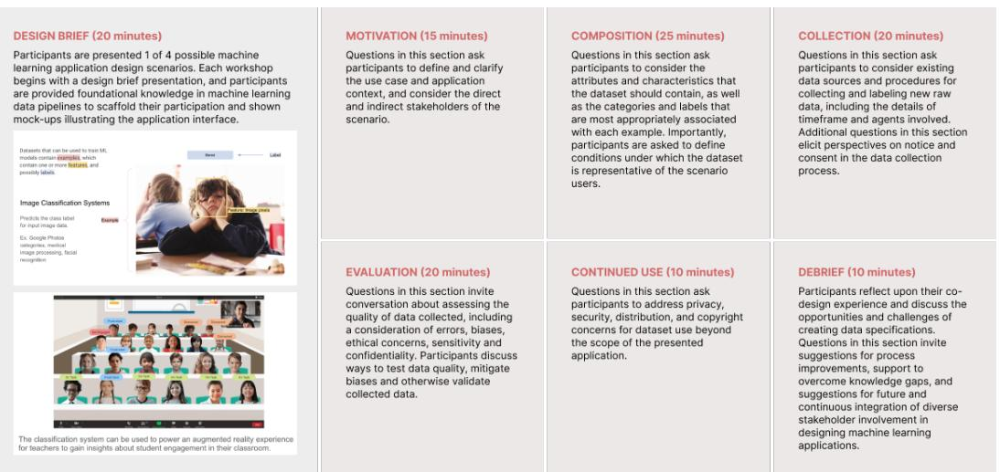
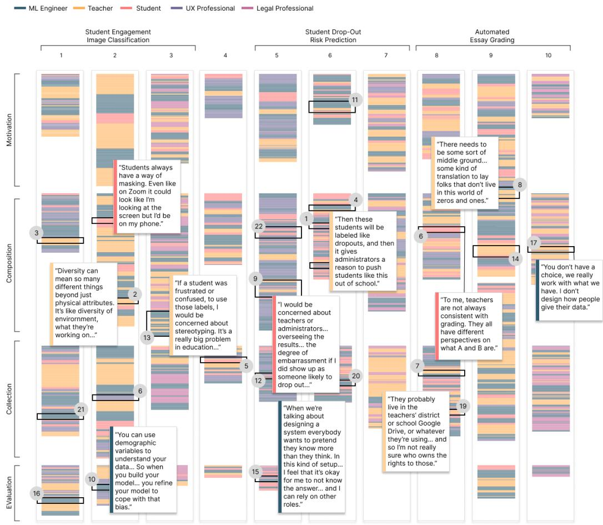

# 1. Bibliographic Information

*   **Title:** Is a Seat at the Table Enough? Engaging Teachers and Students in Dataset Specification for ML in Education
*   **Authors:** Mei Tan, Hansol Lee, Dakuo Wang, and Hariharan Subramonyam.
*   **Affiliations:** Stanford University, USA; Northeastern University, USA. The authors come from backgrounds in Computer Science, Learning Sciences, Education, and Human-Computer Interaction (HCI).
*   **Journal/Conference:** The paper is available on arXiv, which is a preprint server. The text mentions "Preprint, CSCW'24", indicating it was likely submitted to or accepted at the ACM Conference on Computer-Supported Cooperative Work and Social Computing (CSCW), a top-tier venue for research at the intersection of social and technical systems.
*   **Publication Year:** 2023 (based on the arXiv submission date).
*   **Abstract:** The paper addresses critical issues like fairness, accountability, and privacy in educational Machine Learning (ML) tools, which often stem from a poor understanding of the classroom context. To bridge this gap, the authors conducted ten co-design sessions where teachers, students, ML engineers, UX designers, and legal practitioners worked together to define dataset specifications for hypothetical ML applications. The key findings are: 1) Stakeholders use their specific domain knowledge to contextualize data requirements and proactively mitigate potential harms. 2) Different roles exhibit distinct collaborative strategies. 3) Simply giving stakeholders a "seat at the table" is insufficient. Meaningful participation requires structured supports like defined iterative processes, shared data quality standards, and "information scaffolds" to help technical and non-technical participants understand each other.
*   **Original Source Link:**
    *   arXiv page: https://arxiv.org/abs/2311.05792
    *   PDF link: https://arxiv.org/pdf/2311.05792v1.pdf
    *   Publication Status: Preprint.

# 2. Executive Summary

*   **Background & Motivation (Why):**
    *   **Core Problem:** Machine Learning applications are being increasingly adopted in education for tasks like predicting student dropout or grading essays. However, these tools often fail because they are built on a simplistic understanding of the complex educational environment. This leads to significant problems, including unfairness towards vulnerable students, lack of transparency in how decisions are made, and violations of data privacy.
    *   **Identified Gap:** A root cause of these issues is that the data used to train ML models is often collected and defined without input from the people who understand the context best: teachers and students. Traditional ML development pipelines engage domain experts too late, if at all, after crucial decisions about data have already been made.
    *   **Innovation:** This paper introduces a fresh approach by focusing on the very first step of the ML pipeline: **dataset specification**. Instead of co-designing a user interface, the research investigates whether and how a diverse group of stakeholders—including teachers and students—can collaboratively define the fundamental characteristics of the data itself (what to collect, how to label it, how to ensure it's representative).

*   **Main Contributions / Findings (What):**
    *   The paper provides empirical evidence from 10 co-design workshops demonstrating that teachers and students can make significant contributions to the technical process of dataset specification.
    *   It identifies **what** stakeholders bring to the table: teachers and students contextualize data with their real-world knowledge, identify potential biases engineers might miss, and ground abstract data requirements in the downstream impact on teaching and learning.
    *   It identifies **how** to support this collaboration. The central conclusion is that mere participation is not enough. Meaningful engagement requires **structured support**, including:
        1.  **Defined Processes:** Clear procedures for continuous iteration and evaluation.
        2.  **Shared Standards:** Mutually understood standards for what constitutes "good" data in a specific educational context.
        3.  **Information Scaffolds:** Tools and materials to help bridge the knowledge gap between technical experts (like ML engineers) and domain experts (like teachers).

# 3. Prerequisite Knowledge & Related Work

To understand this paper, a few foundational concepts are essential.

*   **Foundational Concepts:**
    *   **Machine Learning (ML) in Education:** The use of algorithms that learn from data to provide insights or automate tasks in educational settings. Examples include systems that recommend learning materials, predict student performance, or automatically grade assignments.
    *   **ML Data Pipeline:** The end-to-end process of creating an ML model. It starts with **data management** (acquiring, cleaning, and labeling data), followed by model training, verification, and deployment. This paper focuses on the earliest stage: defining the requirements for the data before it is even collected.
    *   **Model-Centric vs. Data-Centric AI:**
        *   `Model-Centric AI`: The traditional approach where the dataset is considered fixed, and engineers spend most of their time tweaking the model's architecture to improve performance.
        *   `Data-Centric AI`: A more recent paradigm shift that emphasizes improving the quality, quantity, and labeling of the training data as the primary way to build better models. This paper's work is situated within the `Data-Centric AI` movement.
    *   **Datasheets for Datasets:** A proposed framework for documenting datasets, much like a datasheet for an electronic component. It details a dataset's motivation, composition, collection process, and recommended uses to promote transparency and accountability. The authors use this concept as a starting point for their workshop protocol.
    *   **Participatory Design:** A design approach that actively involves end-users and other stakeholders in the design process to ensure the final product is useful, usable, and aligned with their needs and values.

*   **Previous Works & Differentiation:**
    *   The paper builds on prior work that has highlighted the ethical perils of ML in education (e.g., bias in automated grading) and the flaws in traditional, technology-focused engineering practices.
    *   It acknowledges the value of documentation frameworks like `Datasheets for Datasets` but points out a critical limitation: they are primarily for **downstream evaluation** (documenting a dataset *after* it's created). This paper's contribution is to explore the **upstream process** of proactively *specifying* the dataset *before* it's created.
    *   While other studies have used participatory design to get feedback on educational AI tools, they often engage teachers and students as end-users evaluating a nearly-finished product. This research is novel because it involves them as co-designers at the foundational data level, a stage typically reserved for technical experts.

# 4. Methodology (Core Technology & Implementation)

The core of the research is a qualitative study based on a series of structured co-design workshops. The goal was to observe and analyze the collaborative process of data specification.

*   **Participants:**
    *   The study involved 40 participants across 10 workshop sessions.
    *   Each session aimed to include one person from each of five key roles:
        1.  **ML Engineer (E):** The technical expert.
        2.  **Teacher (T):** The domain expert in pedagogy and classroom practice.
        3.  **Student (S):** The "data subject" and end-user, providing experiential knowledge.
        4.  **UX Designer (D):** Expert in user experience and human-centered design.
        5.  **Legal/Ethics Professional (L):** Expert on privacy, consent, and ethical constraints (this role was the hardest to recruit).
    *   The table below, transcribed from the paper's `Table 1`, shows the composition of each session.

        | Session | Design Scenario | Participants (Years of Experience) |
        | :--- | :--- | :--- |
        | 1 | Student Engagement Image Classification | E (25 yrs), T (18 yrs), S, D (2 yrs) |
        | 2 | Student Engagement Image Classification | E (3 yrs), T (30 yrs), S, D (2 yrs) |
        | 3 | Student Engagement Image Classification | E (15 yrs), T (2 yrs), S, L (7 yrs) |
        | 4 | Resume-based Career Recommendation | E (5 yrs), T (9 yrs), S, D (1 yrs) |
        | 5 | Student Drop-out Risk Prediction | E (3 yrs), T (3 yrs), S, D (5 yrs) |
        | 6 | Student Drop-out Risk Prediction | E (3 yrs), T (3 yrs), S, D (1 yrs) |
        | 7 | Student Drop-out Risk Prediction | E (3 yrs), T (8 yrs), S, D (2 yrs), L (5 yrs) |
        | 8 | Automated Essay Grading | E (2 yrs), T (5 yrs), S, D (1 yrs) |
        | 9 | Automated Essay Grading | E (7 yrs), T (7 yrs), S, D (2 yrs) |
        | 10 | Automated Essay Grading | E (1 yrs), T (3 yrs), L (2 yrs) |

*   **Workshop Protocol:**
    Each 120-minute virtual workshop followed a structured protocol inspired by `Datasheets for Datasets`. A facilitator guided the group through a shared document to define specifications for a given ML scenario. `Image 1` visually outlines this process.

    
    *该图像是一个流程示意图，展示了机器学习教育应用设计中的协同设计会话流程，包括设计简介、动机、组成、收集、评估、持续使用和总结等七个环节，配有相关文字说明和示意图片。*

    The protocol consisted of the following stages:
    1.  **Design Brief (20 min):** Participants were introduced to one of four ML scenarios (e.g., `Student Engagement Image Classification`, `Student Drop-out Risk Prediction`, `Automated Essay Grading`). This included mock-ups and a basic explanation of the data pipeline to establish common ground.
    2.  **Motivation (15 min):** The group defined the specific use case, context, and the direct and indirect stakeholders who would be affected by the system.
    3.  **Composition (25 min):** This was a critical stage where the group brainstormed the data attributes (features), defined the classification labels, and discussed what would make the dataset "representative" of the target user population.
    4.  **Collection (20 min):** The group designed the procedures for how the data would be collected (e.g., from school records, surveys, new recordings), how consent would be obtained, and how labeling would be performed.
    5.  **Evaluation (20 min):** Participants designed metrics to assess data quality and planned procedures for data cleaning, such as handling missing data or removing biased examples.
    6.  **Continued Use (10 min):** The group discussed long-term issues like data privacy, security, and distribution rights.
    7.  **Debrief (10 min):** Participants reflected on the collaborative process, its challenges, and opportunities for improvement.

*   **Data Analysis:**
    The researchers conducted a qualitative analysis of the workshop video recordings and transcripts. They used a `grounded theory` approach, which involves developing theories directly from the data. The process included:
    *   Transcribing all sessions.
    *   Using inductive open-coding to identify themes and patterns in the discussions.
    *   Developing a collaborative codebook with 53 codes related to data needs (e.g., `consent`, `bias mitigation`) and collaborative processes (e.g., `translation`, `making assumptions`).
    *   Iteratively grouping codes and writing memos to synthesize findings into higher-level themes.

# 5. Experimental Setup

This study's design is qualitative, so the "experimental setup" differs from a quantitative paper.

*   **Scenarios (Instead of Datasets):** The study did not use real datasets for training. Instead, it used four concrete design scenarios to anchor the discussions. These scenarios were chosen to represent popular applications of ML in education and to cover different data types:
    *   `Student Engagement Image Classification` (Image data)
    *   `Student Dropout Risk Prediction` (Tabular data)
    *   `Automated Essay Grading` (Text data)
    *   `Resume-based Career Recommendation` (Text data, later replaced by essay grading due to teacher unfamiliarity)
*   **Evaluation (Via Research Questions):** The success of the methodology was evaluated by its ability to answer the study's two central research questions:
    *   **RQ1:** What do diverse stakeholders bring to the table when co-designing data specifications?
    *   **RQ2:** How can we systematically support and amplify diverse stakeholder voices in the ML data specification process?
*   **Baselines:** The implicit baseline is the **traditional, siloed ML development process**, where data decisions are made primarily by engineers with limited input from domain experts or end-users. The paper contrasts the rich, context-aware discussions from its collaborative workshops against the known shortcomings of this baseline approach.

# 6. Results & Analysis

The findings reveal the dynamics and value of multi-stakeholder collaboration in dataset specification. The paper organizes them into three main themes.

## Finding 1: Contextualizing Upstream ML Tasks with Downstream Use

A key finding was that stakeholders did not follow the linear protocol rigidly. Instead, they constantly connected decisions at one stage (e.g., data composition) to their implications at later stages (e.g., application use and potential harms). Teachers and students were particularly skilled at this.

*   **Domain Context Shapes Specifications:** Teachers and students enriched the data specifications with nuanced, real-world context that engineers would likely miss.
    *   For example, when discussing dropout risk, a student (S6) pointed out that simply looking at grades is not enough: *"failing out of like AP classes versus like acing like non-AP classes... says different stories."*
    *   A teacher (T2), discussing student engagement, expanded the concept of diversity beyond demographics: *"Diversity can mean so many different things beyond just physical attributes. It's like diversity of environment, what they're working on..."*
*   **Anticipating Harms and Biases:** Non-technical stakeholders were proactive in identifying potential negative consequences. For the essay grading tool, teachers worried that an automated system might penalize students for using non-standard but culturally valid English. For the dropout prediction tool, they expressed concern that labeling a student as "at risk" could become a self-fulfilling prophecy, limiting their opportunities.

    The paper includes `Table 2`, which summarizes the rich domain contexts, concerns, and unmet support needs identified by stakeholders for each upstream task. Below is a transcription of the available portion of this table.

**Table 2: Summary of stakeholders' downstream considerations in the education domain associated with upstream data specification tasks and challenges faced by teachers and students in our design workshops.**

<table>
<thead>
<tr>
<th>Upstream Data Task</th>
<th>Domain Contexts</th>
<th>Concerns</th>
<th>Unmet Support Needs</th>
</tr>
</thead>
<tbody>
<tr>
<td colspan="4"><strong>Composition</strong></td>
</tr>
<tr>
<td>Features & Users</td>
<td>Training data should account for differences across diverse educational environments (e.g., public and private institutions, geographic location, grade level, subject of study, and mode of instruction). Representation of subgroups is required along demographic dimensions (e.g., race, gender, socio-economic status) as well as individual learning needs (e.g., language proficiencies, neurodiversity, disabilities).</td>
<td>Teachers and students are unsure about the feasibility and ethics of obtaining sensitive information (e.g., student perceptions on their relationships with their teachers). Both domain stakeholders express concern about the fairness and utility of the model given the numerous critical factors that data cannot capture about the student experience (e.g., administrative data does not indicate whether a student is experiencing homelessness or traumas outside of school).</td>
<td>Non-technical stakeholders lack technical knowledge about data use across the ML pipeline, including the relationship between training data, application data, and data used for validation (e.g., specifying variables for training data that may be infeasible to collect continuously in application data, hesitating to collect demographic variables under the assumption that they must be model inputs).</td>
</tr>
<tr>
<td>Labels & Attributes</td>
<td>Nuanced contextual interpretations of administrative variables (e.g., separating general absences from excused absences that involve medical leave), student out-of-school factors (e.g., family and community support), and self-reported perceptions (e.g., writing confidence, classroom trust) are impactful predictors.</td>
<td>Teachers worry about misinterpretation of causation as users attempt to make sense of model inputs and outputs and take subsequent misinformed action (e.g., administration blaming student drop-out on teaching quality).</td>
<td>Non-technical stakeholders struggle to conceptualize how variables influence prediction. This is complicated by technical handling of different data types and modeling choices.</td>
</tr>
<tr>
<td></td>
<td>Labels and attributes should align to pedagogical goals (e.g., standards-aligned rubric for essay evaluation) and signal actions toward improving teaching practices (e.g., identifying lesson activities with low-engagement rather than students who seem bored).</td>
<td>Teachers raise concerns about the complexity of administrative and professional development efforts required to specify followup action and accountability in response to predictions. Teachers caution against labels that cast assumptions about students and limit student agency (e.g., repercussions from classifying students as "drop-outs").</td>
<td>Stakeholders lack common ground, leaving domain stakeholders to advocate for and explain pedagogical goals, instructional practices, and sensitive issues in education.</td>
</tr>
<tr>
<td colspan="4"><strong>Collection</strong></td>
</tr>
<tr>
<td>Data Sources</td>
<td>School systems maintain administrative data and historical records. Teachers may also be able to assist with data collection. Educational systems include third-party partnerships (e.g., College Board, learning management systems).</td>
<td>Domain-stakeholders struggle with unknown data ownership and management (e.g., deferring to administration without knowing who is responsible for data, uncertainty about privacy laws). Stakeholders lack clarity about data collection terms from third-party systems.</td>
<td></td>
</tr>
<tr>
<td>Consent</td>
<td>Procedures must account for legal regulations that govern data collection in protected school-aged populations (e.g., COPPA). Collection may require multiple forms of data use agreements (e.g., informed consent from parents and students). Consent forms should build trust with transparency of purpose and assurances for data management.</td>
<td>Opt-in consent policies may result in sampling biases (e.g., only certain schools or students participating). Stakeholders worry about the privacy implications of maintaining student identifiers and sensitive information.</td>
<td>Teachers and students lack a frame of reference for what they can expect in terms of rights and disclosures in consent forms. Without knowing the highest standards for data privacy, they cannot evaluate the language of data agreements.</td>
</tr>
<tr>
<td>Labeling Process</td>
<td>Labeling should emphasize student agency and fairness through incorporating student perspectives (e.g., allowing students to self-identify engagement). Labelers should have domain expertise (e.g., experienced teachers, mental health professionals).</td>
<td>Teachers and students express concern about the subjective evaluations and biases that are unavoidable in the education domain (e.g., teacher biases in perceiving student behavior, inconsistent grading standards).</td>
<td></td>
</tr>
<tr>
<td colspan="4"><strong>Evaluation</strong></td>
</tr>
<tr>
<td>Data Quality</td>
<td>Data may be subject to missingness or collection limitations, including biased samples of included schools (e.g., participation from only urban charter schools) and data fields that cannot be collected (e.g., student health details).</td>
<td>Teachers worry about the transparency of flaws in the dataset and implications for interpreting model outputs. They note the lack of protocols for documentation and training to name the biases in the data.</td>
<td></td>
</tr>
</tbody>
</table>

## Finding 2: Collaborative Strategies and Role-Based Contributions

Different stakeholders contributed in distinct but complementary ways. `Image 2` visualizes these role-based contributions, where each horizontal line represents a sentence spoken by a participant.

*该图像是一张角色贡献在数据规范研讨工作坊不同阶段发言的可视化图，展示了包括机器学习工程师、教师、学生、用户体验专家和法律专家等在内的多角色在动机、构成和收集阶段的发言分布及部分引用内容。*

*   **Teachers (Yellow):** Consistently grounded the discussion in pedagogical practice and real-world classroom constraints. They often acted as advocates for students and translators of educational jargon. Quote #14 highlights a teacher's realism: *"To me, teachers are not always consistent with grading. They all have different perspectives on what A and B are."*
*   **Students (Green):** Provided firsthand experiential knowledge, often challenging assumptions made by other experts. Their contributions were crucial for identifying hidden nuances in data. Quote #3 shows a student correcting an assumption about on-screen behavior: *"Students always have a way of masking. Even like on Zoom it could look like I'm looking at the screen but I'd be on my phone."*
*   **ML Engineers (Blue):** Focused on technical feasibility, data requirements for the model, and potential solutions to problems raised by others. Quote #10 shows an engineer thinking about bias mitigation: *"You can use demographic variables to understand your data... to define your model... to cope with that bias."*
*   **UX Designers (Red):** Centered the conversation on the end-user's experience and the usability of the final application.
*   **Legal Professionals (Purple):** Raised issues of consent, privacy, and regulatory compliance (e.g., COPPA). Quote #8 highlights the need for translation: *"There needs to be some sort of middle ground... some kind of translation to lay folks that don't live in this world of zeros and ones."*

    The visualization shows that conversations were interactive, with different roles dominating different parts of the discussion, reflecting their expertise. For instance, teachers and students were highly active in the `Composition` stage, defining what data *mattered*, while engineers and legal experts guided discussions on `Evaluation` and `Collection` procedures.

## Finding 3: Beyond a Seat at the Table: Needs for Structured Support

The study's most significant conclusion is that simply bringing stakeholders together is not a panacea. Meaningful collaboration was often hindered by knowledge gaps and a lack of shared processes. The authors identified three critical areas for support:
1.  **Defined Processes for Iteration and Co-evaluation:** The workshop format was a good start, but a real-world project would need continuous feedback loops. Stakeholders need clear processes to revisit and revise data specifications as the project evolves and new information comes to light.
2.  **Shared Contextual Data Quality Standards:** What does a "high-quality" dataset look like for a specific educational goal? This is not just a technical question. The group needs to collaboratively define standards that blend technical requirements (e.g., low error rate) with contextual ones (e.g., fair representation of students with learning disabilities).
3.  **Information Scaffolds:** To bridge the expertise gap, stakeholders need "scaffolds"—tools, documents, or guided activities. For non-technical participants, this could mean simple explanations of how a model uses data. For technical participants, it could mean "context maps" that explain the social and ethical landscape of the educational environment they are designing for.

# 7. Conclusion & Reflections

*   **Conclusion Summary:** The paper convincingly argues that teachers and students are not just end-users but essential partners in the design of educational ML systems, even at the highly technical stage of dataset specification. They bring invaluable contextual knowledge that can prevent downstream harms and improve model utility. However, to unlock this potential, the ML community must move beyond tokenistic inclusion ("a seat at the table") and invest in building structured, supportive, and truly collaborative processes.

*   **Limitations & Future Work:**
    *   **Limitations:** The authors acknowledge that recruiting legal and ethics experts was difficult, indicating a potential gap in real-world development teams. The workshop setting is also an artificial environment; a long-term, high-stakes product development cycle would introduce different pressures and dynamics. The study's participants were also likely self-selected individuals already interested in AI and ethics.
    *   **Future Work:** The paper points toward a clear agenda for future research: designing and testing the very "structured supports" it calls for. This includes creating supportive tooling, developing effective information scaffolds, and refining collaborative methodologies for use in real-world ML projects.

*   **Personal Insights & Critique:**
    *   This is a highly impactful paper that provides concrete, empirical backing for a core principle of Human-Centered AI: involve stakeholders early and meaningfully. Its focus on the often-overlooked *upstream* stage of data specification is particularly novel and important.
    *   The paper's main strength is its practical and actionable conclusion. It doesn't just say "collaboration is good"; it identifies *why* it's hard and *what* specific supports are needed to make it work. The call for "information scaffolds" is a particularly insightful concept that could be applied far beyond the education domain.
    *   A potential critique is the generalizability of the findings. While the workshops provided a rich "proof of concept," translating this process into the fast-paced, budget-constrained reality of a tech company or a school district is a major challenge. The paper opens the door for this next crucial step: moving from the lab to the real world. Overall, it serves as a powerful guide for any practitioner or researcher aiming to build more responsible and effective AI systems.