# 课堂模拟：在在线教育中构建上下文学生生成代理以进行学习行为模拟

许松林  
加州大学圣地亚哥分校  
电气与计算机工程系  
美国加利福尼亚州圣地亚哥  
soxu@ucsd.edu  
温浩宁  
加州大学圣地亚哥分校  
电气与计算机工程系  
美国加利福尼亚州圣地亚哥  
hwen@ucsd.edu  
潘洪毅  
加州大学圣地亚哥分校  
电气与计算机工程系  
美国加利福尼亚州圣地亚哥  
h2pan@ucsd.edu  
达拉斯·多明格斯  
加州大学圣地亚哥分校  
电气与计算机工程系  
美国加利福尼亚州圣地亚哥  
dadoming@ucsd.edu

胡冬银 宾夕法尼亚大学 美国宾夕法尼亚州费城 dyhu@seas.upenn.edu

张新宇  
电气与计算机工程系  
加利福尼亚大学圣地亚哥分校  
美国加利福尼亚州圣地亚哥  
xyzhang@ucsd.edu

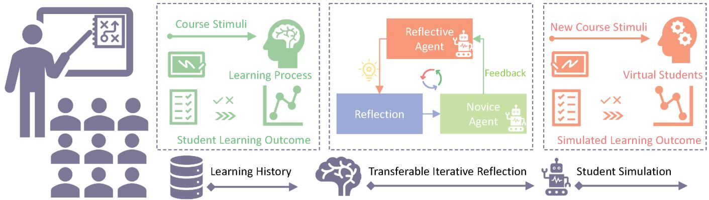  
F l simulation.

# 摘要

学生模拟支持教育工作者通过与虚拟学生互动来改善教学。然而，现有的大多数方法忽略了课程材料的调节效应，因为面临两个挑战：缺乏带有细粒度标注的课程材料的数据集，以及现有模拟模型在处理超长文本数据时的限制。为了解决这些挑战，我们首先举办了一个为期6周的教育研讨会，参与者为$N=60$名学生，通过定制的在线教育系统收集细粒度数据，该系统记录学生在与讲座材料互动过程中的学习行为。其次，我们提出了一种可转移的迭代反思（TIR）模块，增强了基于提示和微调的大型语言模型（LLMs）的学习行为模拟能力。我们的综合实验表明，即使在有限的演示数据下，TIR也使得LLMs在学生模拟方面的表现比经典的深度学习模型更为准确。我们的TIR方法更好地捕捉了学习表现的细粒度动态及课堂中学生之间的相关性，为在线教育的“数字双胞胎”铺平了道路。

# CCS概念

以人为中心的计算 人机交互 (HCI)。

# 关键词

学生模拟，生成代理，课堂数字双胞胎

# ACM 参考格式：

许松林，温浩宁，潘鸿益，达拉斯·多米格斯，胡冬吟，张欣宇。2025年。《课堂模拟：构建在线教育中上下文学生生成代理以进行学习行为模拟》。

在2025年4月26日至5月1日于日本横滨举行的计算机系统人因会议（CHI '25）上。美国纽约ACM，26页。https://doi.org/10.1145/3706598.3713773

# 1 引言

在在线教育环境中，准确模拟学生学习行为可以帮助建立“数字双胞胎”教室，为教师探索多样化的教学法提供一个高保真的沙盒。这反过来可以帮助提高学生的学习表现。随着生成性人工智能的快速发展，使用大型语言模型（LLMs）进行学生模拟正成为一种有前景的方法。例如，GPTeach使用基于GPT的虚拟学生进行互动TA培训，而MATHVC则使用基于LLMs的虚拟课堂进行数学教育。然而，这些方法并没有系统地评估虚拟学生的真实感。另一方面，基于LLMs的知识追踪模型显示出高准确性，但它们侧重于学生表现预测，而不是多方面的行为模拟。我们认为，准确的数字双胞胎应包含学生行为的情境模拟，捕捉课程材料对个别学生学习表现和学生之间关联的动态调节效应。这种动态性可以在各种情境因素中反映出来，诸如讲座内容、个人背景、问题、技能等。

然而，有两个主要挑战阻碍了课程材料效果与学生模拟的整合。第一个在于缺乏细粒度的数据集，这些数据集在注释课程材料的同时，也能记录学生的实时表现。大多数现有数据集（例如 Ednet [7]、Junyi [61] 和 Assistments 2009-2010 基准 1）仅包含测试题目，而没有课程材料。EduAgent 数据集 [86] 确实包含了课程内容，但讲座时间太短（5分钟），无法揭示学生在整场讲座中的学习过程。此外，学生在课程中可能容易感到疲倦，导致数据质量无法得到保障 [76]，不幸的是，这在大多数现有的数据收集工作中并未得到考虑 [7, 61]。

第二个挑战是，现有的语言模型在从示例演示中学习时只能处理有限的上下文数据。基于大型语言模型（LLM）的仿真通常采用基于微调或基于提示的方法。前者使预训练模型能够通过模型微调直接从新训练数据中学习，但需要大量的计算资源。因此，研究人员通常依赖更小的语言模型，如BERT，进行学生仿真。然而，这些较小的语言模型具有非常低的令牌限制（例如，512个令牌），只能处理短文本输入，但无法捕捉复杂的上下文信息，如课程材料。像GPT-4这样的高级LLM可以支持更长的上下文文本输入，但在长上下文下性能也会下降，并且微调时需要显著更多的计算资源。另一方面，基于提示的方法不需要模型训练，因为它们直接从上下文提示和示例演示中学习。然而，在存在长示例的情况下，模型的上下文学习能力显著下降。

为了应对第一个挑战，我们进行了一个新的用户研究，参与者为 $\mathrm{ \Delta N } = 6 0$ 名学生和 ${ \Nu } = 8$ 名讲师，以实时教学的形式进行为期6周的在线教育研讨会，包括12节讲座（每节讲座1小时）。我们收集了学生的学习表现以及课程材料的细粒度注释，并将这些注释映射到特定的后测问题。为了保证数据质量并提高学生在学习过程中的参与度，我们开发了一个新的在线教育系统，整合了多模态感知技术，以监测学生的认知状态，并及时提示讲师采取建议的行动，实时提高学生的学习参与度。

此外，为了解决第二个挑战，受到LLM自我反思能力的启发，我们提出了一种基于LLM的学生模拟框架，通过引入可转移的迭代反思（TIR）模块，引导LLM对特定课程材料进行反思，并压缩学习到的知识以增强LLM模拟。与直接的自我反思不同，我们的TIR架构包含新手代理与反思代理之间的迭代，以确保反思能够推广到新领域，从而实现可转移的反思（第3节）。因此，这个TIR模块可以增强并解决基于微调的模型和基于提示的模型的瓶颈。对于基于微调的模型，TIR通过将反思集中在特定课程材料上，克服了令牌限制问题，从而压缩学习到的知识。对于基于提示的模型，TIR提供了一种有效的方式，使LLM能够更有效地从示例演示中学习，其中学习到的知识可以在没有示例演示的情况下转移到新的模拟中。这确保了LLM学习到的是一般知识，而不是来自示例演示的局部最优知识。

我们评估了学生模拟在EduAgent公共数据集[86]和我们新收集的数据集中的表现。结果表明，我们的TIR模块增强了基于LLM的学生模拟，使其比训练并适应给定数据集的深度学习方法更为强大。具体而言，评估考察了我们的模型是否能够更好地捕捉学生行为的动态。现有研究通常将人类行为定义为对内部（遗传因素）和外部（环境因素）刺激的可观察行动和反应的集合[48]。因此，为了证明我们的模拟器复制了学生学习行为，我们对学生对这些刺激的反应进行了建模，通过与课程内容互动后的后测准确率来表示。课程知识通过讲义幻灯片传递，构成外部刺激，而内部刺激则源于诸如先前知识等个体差异。因此，我们评估模型在多个层面捕捉后测准确率变化的能力：个体（每个学生）、讲座（每节课）、问题（每个后测项目）和技能（每个知识概念）。此外，我们评估学生之间的相关性，以确定模拟模型是否准确反映学生对之间的反应模式。总的来说，结果表明我们的方法更好地捕捉了课堂学习表现的微观动态和学生间的相关性，指向在线课堂可能的“数字双胞胎”。

总结一下，本文的主要贡献包括：

• 我们进行了一项为期6周的新在线教育实验，共有$\mathbf { N } =$ 60名学生和$\Nu = 8$名教师，以收集学生学习表现及课程材料的细粒度注释。该实验依托我们新开发的在线教育系统，该系统整合了感知技术和反馈建议，以增加学生在实时在线教学中的学习参与度。在线教育系统的实现可在以下网址找到：https://github.com/cogteachadmin/CogTeach，而数据/模型的实现可在：https://github.com/songlinxu/ClassroomSimulacra 获取。我们提出了一种可转移的迭代反思模块，能够增强学生在基于微调模型和基于提示模型中的模拟表现。 • 我们系统地评估了学生模拟表现，并展示了如何通过揭示课堂中的讲座级、个体级、问题级、技能级差异和学生间的相关性，捕捉课程材料的动态调制效果。

# 2 相关文献

我们的工作从以下三类研究中汲取灵感并推动知识的发展。

# 2.1 人机交互中的生成代理

大规模语言模型（LLMs）的快速发展激发了广泛的人机交互（HCI）应用，包括社交行为（生成代理 [58]）、虚拟现实 [72] 及旅游指导（VirtuWander [79]）、人机协作（AI Chains [83], [77]）、创意任务（CharacterMeet [62]、Luminate [69]、C2Ideas [24]、ABScribe [64]、AngleKindling [59]、PopBlends [74]）、医疗保健（MindfulDiary [33]、ChaCha [67]、Narrating Fitness [68]、[63]）及健康干预（MindShift [82]、[5, 29, 30, 51]）、网页互动 [9] 及用户界面设计（ReactGenie [89]、[12]、[73]）、编码（CollabCoder [16]、[44]）、行为改变（CatAlyst [3],[4]）及人类增强（Memoro [98]、[26]）、商业（Marco [14]）等。

在教育领域，基于大语言模型（LLMs）的代理被用作可教代理（Mathemyths [93], [28], [43]），提供指导 [71]，推荐学习概念 [40]，并给出反馈 [54]。例如，DevCoach [75] 利用基于 LLMs 的生成代理支持学生的大规模软件开发学习。ReadingQizMaker [49] 提出了一个人机协作的系统，支持教师设计高质量的阅读测验。在编程教育中，CodeTailor [23] 使用基于 LLM 的个性化 Parsons 拼图来支持编程的参与度。PaTAT [17] 提出了一个使用 LLM 的人机协作定性编码系统，用于可解释的互动规则合成。

现有的工作要么使用生成代理作为指导教师直接教学生，要么作为学生代理来增强智能辅导系统。我们的工作侧重于第二个方面。接下来，我们将特别讨论在使用机器学习或生成代理进行学生模拟方面的相关工作。

# 2.2 学生模拟

学生模拟的目的是预测教育中的学生学习行为，从而为支持智能辅导系统提供见解 [19]。大多数现有研究将学生模拟公式化为知识追踪问题，即根据学生过去的记录预测他们未来的学习表现 [1]。这种学习表现通常通过课程中的回答准确性来表示，以衡量学生在特定课程概念上的技能水平。这个领域的早期工作采用了经典的贝叶斯模型 [91]。近年来，深度学习模型 [60] 成为知识追踪的主要方法，结合了图模型 [55]、认知理论 [97]、增强记忆组件 [94] 等等。

# 2.3 基于大语言模型的学生模拟

最近的研究探索了直接使用大型语言模型（LLMs）来预测学生学习表现[85, 95]或知识追踪[90]在开放性问题中的可行性[45]。由于LLMs能够揭示推理过程，这些方法比深度学习模型具有更好的可解释性[38]。它们还可以增强基于深度学习的知识追踪[15, 31]。在人机交互领域，研究人员开发了多智能体协作环境，以模拟完整的课堂互动[6, 96]，并使用LLM模拟的学生档案来支持问题项评估[50]。这些方法可以实现自适应和个性化的练习生成，以增强学生的学习表现[8]。例如，Sarshartehrani等[65]进一步利用具身人工智能辅导员进行个性化教育适应。GPTeach[53]也展示了使用基于GPT的虚拟学生进行互动助教培训的可行性。此外，MATHVC[92]探索了LLM模拟的多角色虚拟课堂在数学教育中的有效性。此外，LLMs能够帮助学生进行课后自我反思[34]，并支持语言学习和成长心态的培养[32]。

然而，也有证据[56]表明，与深度学习（DL）模型相比，LLMs在学生表现预测方面存在局限性。我们认为这主要是由于缺乏上下文课程材料。具体来说，现有基于LLM的方法[15, 31, 36, 37, 42]仅将学生模拟视为序列预测问题，基于过去记录预测未来测试表现，而忽略了课程材料的调制效应。在这种情况下，由于深度学习模型能够从历史数据中学习[35, 70]，它们更可能表现得比LLMs更好。相比之下，LLMs在基于其大型预训练知识库的少量上下文学习方面表现更佳[11]。因此，结合上下文课程材料可以更好地发挥LLMs的能力，以捕捉课程材料对学习表现的潜在影响，即使在数据有限的情况下，从而实现更准确的学生模拟。

在这方面，现有的工作相当有限，这既与模型的局限性有关，也与缺乏包含课程材料的数据集有关（第1节）。EduAgent [86] 集成了课程材料以模拟学生的认知状态和后测表现，但讲座的持续时间过短（5分钟），无法代表典型讲座中的学习过程。相比之下，我们的工作进行了更长期的实验（6周，12节讲座，每节1小时），以收集高质量的学习行为数据。我们的研究采用自开发的在线教育系统，结合感知技术和行动建议，帮助教师提高学生的学习参与度。此外，我们提出的可转移的迭代反思模块进一步增强了基于微调和基于提示的模型的学生模拟表现，这与现有的语言模型[36，37，42]和深度学习模型[60，94]的方法不同。

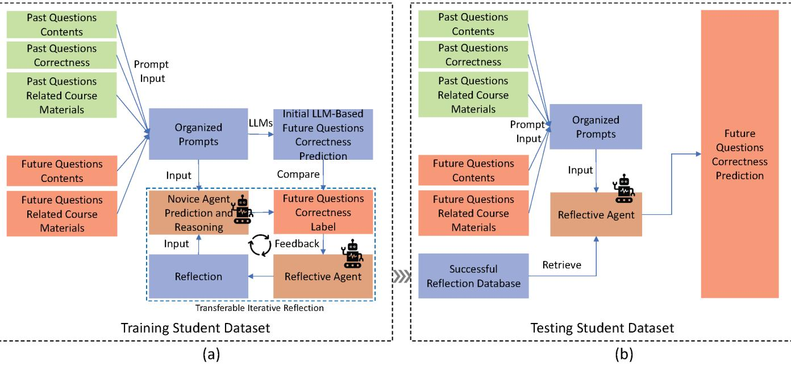  
Training/Testing Scheme for Prompting-Based (Standard/CoT) Models   

Figure 2: Training (left) and testing (right) schemes for prompting-based models.

# 3 模拟方法论

我们的课堂仿真框架旨在构建基于大语言模型的生成学生代理，这些代理能够根据学生的学习历史模拟真实学生的学习行为。然后，这些代理可以模拟学生未来的学习表现，通过课后测试中的答题正确性来表示。

# 3.1 问题定义

在我们的在线教育场景中，学生首先听取讲座，然后完成一项课程后测试，该测试根据他们答案的准确性评估他们的学习表现。如图3所示，我们模拟的输入包括过去的学习历史 $( l _ { f a s t } )$ 和未来的学习信息 $( l _ { f u t u r e } )$。这里 $l_{past}$ 包括过去问题的内容 $( q _ { P } \mathrm { { } } a s t )$、过去答案的正确性（即过去问题中的标签，表示为 $y _ { P a s t . }$）以及与特定问题相关的课程材料 $( c _ { p a s t } )$。未来的学习信息 $l _ { f u t u r e }$ 包括未来问题的内容 $( q _ { f u t u r e } )$ 和相应的课程材料 $( c _ { f u t u r e } )$。模型的输出是未来答案正确性的序列 $( \hat { y } _ { f u t u r e } )$，其对应的真实值表示为 $ue$。

请注意，课程材料输入仅以文本形式表示，以满足LLM的要求。尽管在实际讲座幻灯片中可能有图像，但我们在数据集注释过程中已将图像转换为文本描述。课程材料包括幻灯片上的标题/要点，或对幻灯片上图像的人为注释描述。讲师的教学内容通常与幻灯片一致，但并不是逐字朗读。因此，我们不将讲师的讲稿作为课程材料或模型输入。模型输入的示例可以在图4中找到。

# 3.2 模型训练与评估

我们总共拥有三种模拟模型：基于提示的LLM模拟、基于微调的LLM模拟和基于深度学习的模拟（基线）。为了以可比的方式评估模型，所有模型都使用相同的训练集来训练模型，以及相同的测试集来评估模拟性能。然而，一些基于提示的模型只需要部分训练集，这将在后面指定。对于每个数据集，我们首先按照个体的方式将其划分为训练集和测试集，并遵循特定比例$R\%$（详细比例将在每个实验中描述）。具体来说，$R\%$学生的所有测试性能被用作训练集，而另外$(1\% { R\% })$学生的所有测试性能则作为测试集。训练集进一步按照相同的个体方式划分为模型训练集和模型验证集，保持相同的$R\%$比例。我们使用个体方式的数据集划分的原因是我们的课堂模拟基于相应真实学生的过去学习历史实例化每个数字学生，并模拟该学生的未来学习过程。我们将前五个问题设置为学生历史的过去问题$( q_{P} \mathrm{{ } }ast)$，其他问题作为未来问题$( q_{future} )$进行预测。

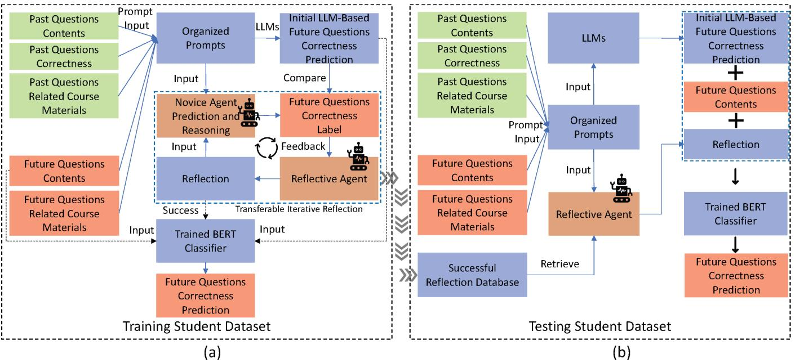  
Training/Testing Scheme for Finetuning-Based (BertKT) Models   

Figure 3: Training (left) and testing (right) scheme for finetuning-based models.

# 3.3 可转移的迭代反思 (TIR)

可转移迭代反思（TIR）的目标是通过更有效地学习学生的过去学习历史，来改进基于大型语言模型（LLM）的学生模拟。TIR与现有的基于反思的方法（如多轮反思）之间的主要区别在于模型设计中的可转移特征。传统的反思方法只是要求LLM根据其预测与标签之间的差异进行反思。相反，TIR模块通过与示例演示中的标签（即过去的学习历史）进行比较，迭代性地提示LLM反思其先前的模拟，使LLM能够生成可以轻松转移到没有示例演示的新手LLM的通用反思结果。这确保了这种反思结果的普遍性，可以应用于新的未来学习信息。因此，反思结果不仅可以通过提高数据利用效率直接改善基于简单提示的模拟，还可以在压缩信息的同时避免遗漏重要信息，以改进基于微调的模拟。在更高的层次上，TIR模块包括四个阶段：初始预测、反思、测试和迭代（图2）。

（初始预测：要求LLM（反思智能体）基于$l_{f past}$和$l_{future}$预测未来问题的正确性（即$\hat{y}_{future}$），并通过将$\hat{y}_{future}$与真实值$(y_{future})$进行比较来获得初始预测准确率$(acc_{0})$，如第3.1节和图3所示。）

反思：向反思代理提供未来问题正确性的真实情况（即标签：$y _ { f u t u r e }$），并要求其反思为什么未能预测某些未来答案的正确性。在第$k$次迭代中的反思表示为$r _ { k }$。

测试：使用 $r _ { k }$ 结合 $l _ { f r a s t }$ 和 $l _ { f u t u r e }$ 来询问另一位没有经历过真实情况的新手代理让其做出新的预测。将这一迭代中来自新手代理的预测记为 $\hat { y } _ { n o v i c e , k }$。

迭代：通过将 $\hat { y } _ { n o v i c e , k }$ 与真实值 $( y _ { f u t u r e } )$ 进行比较来获得预测准确率 $( a c c _ { k } )$。如果 $a c c _ { k }$ 低于初始预测准确率 $( a c c _ { 0 } )$，我们要求反思代理在下一次迭代中朝不同方向反思。否则，我们告知反思代理准确率确实有所提高，它可以朝相似方向反思。当新手代理在 $r _ { k }$ 的帮助下达到 $1 0 0 \%$ 准确率或我们达到最大迭代次数时，迭代结束。

最后，我们选择由新手代理产生的最高预测准确性的反射作为最佳反射 $( r _ { b e s t } =$ $r _ { a r g m a x ( a c c _ { k } ) } )$ 并将其记录到反射数据库中。这个数据库将用于通过提供示例演示来增强现有的基于提示的LLM，或者增强基于微调的模型以提供反射。

在TIR中的迭代反思通过调整LLM在反思过程中的推理过程来提高模拟性能。由于个体和课程内容的多样性，学生对课程刺激的反应差异很大。通过简单的反思，LLM的结果可能因其预训练语料库而产生偏差，并且无法很好地适应特定学生和课程刺激。迭代反思帮助LLM克服来自其预训练语料库的偏见，并在反思过程中迭代调整推理过程，考虑到课程刺激如何调节学生行为的因果关系，同时尊重学生的过去历史。图4中描述了一个例子。当LLM在$r_{1}$中进行了简单反思时，它高估了学生的理解能力，认为学生能够正确回答问题12。然而，在$r_{3}$中的迭代反思后，LLM发现了一个潜在的误解或疏忽，导致了错误的预测。这种经验被存储在成功反思数据库中。一旦被取出，它可以为未来新的反思代理提供灵感，以考虑测试集中的这种疏忽。

对于基于提示的模型，TIR可以在不进行微调的情况下直接提高LLMs的性能。对于基于微调的模型，TIR可以有效地压缩$l _ { f p a s t }$和$l _ { f u t u r e }$中溢出的信息，以应对令牌限制问题。更多细节将在以下章节中描述。

# 3.4 TIR增强标准提示

在这里，我们描述如何将TIR模块应用于增强基于标准提示的仿真模型。

标准的模拟模型简单地使用大语言模型（LLMs）将所有信息作为提示输入 $ ( l _ { f a s t }$ 和 $l _ { f u t u r e } )$，并预测未来问题的正确性序列 $ ( \hat { y } _ { f u t u r e } )$，如图18所示。直接将训练集中所有学生的数据作为示例演示输入，显然会带来挑战。这些数据包括课程材料，通常超过了LLMs的令牌限制，妨碍了它们提取有用信息的能力。

为此，我们应用TIR模块以使大型语言模型（LLM）有效地从训练数据集中学习。具体而言，在训练阶段，我们首先为训练集中的每个学生运行TIR模块，按照第3.3节中的程序进行。输出的反思结果存储到成功反思数据库中。在测试阶段，如图2所示，我们不运行TIR模块。相反，我们使用一个由LLMs驱动的新反思代理从成功反思数据库中检索反思。对于测试集中的每个模拟学生，我们从反思数据库中检索$M$个学生的反思。训练集中的$M$个学生是随机选择的，但我们确保他们与测试集中的模拟学生在同一课程中。这是检索反思的唯一标准，确保反思过程中的上下文一致性。随机选择确保示例演示没有人为偏见。然而，我们使用随机种子来确保可以复制这种随机选择，以增强结果的可重复性。我们的初步实验表明$M=4$足以实现合理的仿真性能。来自$M$个学生的检索反思作为同一课程中的示例演示，以便测试集中的新反思代理能够利用从检索反思中获得的经验来进行可转移的反思。基于检索到的反思和过去的学习历史$(l_{past})$以及未来的学习信息$(l_{future})$，新的反思代理对测试集中的特定学生进行仿真。为了防止标签泄漏，这个新的反思代理没有接触到任何其他训练数据。因此，它与训练集中的反思代理不同。

值得注意的是，迭代反思过程仅发生在训练集内。此外，我们并不将大型语言模型（LLMs）的反思限制为仅内容特定或元认知，以便给LLMs足够的自由空间进行反思。但我们通过评估反思是否可以转移到新手代理以进行预测，使其具有普遍适应性。此外，反思必须同时是内容特定和元认知的，因为课程调制效果通常在不同讲座之间是不同的。因此，内容特定的反思是适应特定课程背景的必要条件。然而，LLMs 也具有元认知反思，因为训练集中的示例演示学生与测试集中的模拟学生不同。在我们当前的设置中，我们只需在每次讲座中运行一次迭代反思，以生成该特定讲座的成功反思数据库。没有必要针对每个问题/知识概念/学生进行反思。对每个讲座离线运行反思是合理的，因为讲座材料通常是在实际教学场景中提前准备好并在课前可用的。我们尚未测试 TIR 是否可以通过使用单一讲座的反思数据库在不同讲座之间进行概括，但这可以是一个有前景的未来探索。不同的反思方向意味着LLMs被指示反思另一个推理，探讨为何做出错误预测。但我们并不限制特定的方向内容，以给LLMs足够的空间进行探索。有关这种不同方向的示例见图4和附录图18。

# 3.5 TIR 增强了基于 CoT 的模型

现有研究表明，使用思维链（CoT）提示策略可以提高大型语言模型（LLMs）的能力。CoT的理念是通过提示引导LLMs像人类一样逐步推理，而不是一次性解决问题。我们的TIR模块可以集成到CoT中，以进一步提高基于提示的模型的模拟准确性。集成的工作方式类似于第3.4节中标准基于提示的模型。附录图19中描绘了一个示例工作流程。唯一的区别是，在预测未来问题的正确性时，我们提供逐步指导，如下所示。

(1) 分析学生的过去表现：识别学生在过去问题中表现良好的课程概念以及他们挣扎的概念。考虑问题的复杂性和相关课程材料。

（2）回顾未来问题的课程概念和相关讲义材料：•根据相关课程概念和课程材料确定未来问题的难度水平。识别未来问题是否与学生之前在过去问题中挣扎或表现优异的概念相关。

（3）预测学生在未来问题中的表现：根据步骤（1）和（2）的分析，预测学生是否会正确回答每个未来的问题。

# 3.6 TIR增强微调模型

除了基于提示的方法，TIR 还可以通过压缩输入标记来避免标记溢出，从而改进基于微调的语言模型。我们微调了 BERT（双向编码器表示来自变换器），这是一个具有预训练权重的语言表示模型。输入为

<table><tr><td rowspan="2">指标</td><td colspan="3">GPT4o-Mini（无/有 TIR）</td><td colspan="5">深度学习模型</td></tr><tr><td>标准</td><td>CoT</td><td>BertKT</td><td>DKT</td><td>AKT</td><td>ATKT</td><td>DKVMN</td><td>SimpleKT</td></tr><tr><td>准确率</td><td>0.6025+0.0469</td><td>0.6222-0.0049</td><td>0.6074+0.0938</td><td>0.6351</td><td>0.6171</td><td>0.6396</td><td>0.6171</td><td>0.6772</td></tr><tr><td>F1 分数</td><td>0.5128+0.1346</td><td>0.5610+0.0341</td><td>0.6110+0.0770</td><td>0.6352</td><td>0.6051</td><td>0.6390</td><td>0.6051</td><td>0.6698</td></tr></table>

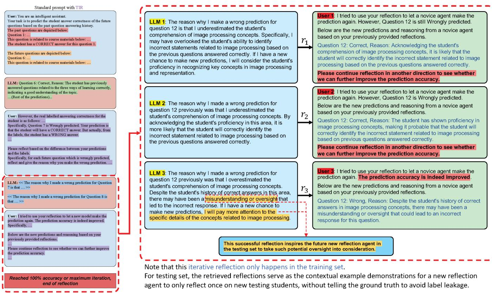  

Figure 4: Prompt examples in the Transferable Iterative Reflection process.

Table 1: Simulation results on EduAgent dataset   

BERT 是一个句子，输出可以是从问答到语义分类的任何内容。然而，BERT 的令牌限制非常低（512 个令牌），显然无法直接处理所有过去/未来的问题输入或相关的课程材料。TIR 模块通过从这些数据中提取有用的反思来解决这个问题，因此不需要将非常长的课程材料输入到 BERT 中。如图 3 所示，TIR 增强的 BERT 的输入由三个部分组成：未来问题内容 $q _ { f u t u r e }$、基于初始 LLM 的未来问题正确性预测结果，以及 TIR 模块的反思。模型输出是一个二元值，用于决定一个学生是否正确回答了一个未来问题。这是通过微调来自 HuggingFace 的基于 BERT 的分类器来实现的。在训练阶段，我们对训练集有标签，因此 TIR 模块直接在训练集上运行以生成成功的反思，如图 3(a) 和第 3.3 节所示。然而，在测试阶段，不能使用标签进行 TIR 以避免标签泄漏。因此，我们改为使用一个新的反思代理，根据成功反思数据库中作为示例演示的已检索反思生成新的反思。

为了展示我们的TIR模块在增强BERT模型方面的有效性，我们准备了另一个不含TIR的基线BERT模型，该模型直接将所有信息作为输入（过去问题$q_{P a s t}$及相关课程材料$c_{P a s t}$和真实的过去问题正确性标签$y_{P a s t}$，未来问题$q_{f u t u r e}$及相关课程材料$c_{f u t u r e}$）并预测未来问题的正确性。我们将不含TIR的BERT模型称为BertKT，与含TIR的模型$(BertKT + TIR)$形成对比。工作流程的一个示例如附录图20所示。

为了公平比较，微调数据与深度学习模型的训练集相同。因此，我们在我们的数据上只对BertKT进行了一次微调。然而，考虑到未来在外部数据集上扩展微调模型的潜在应用，有必要在这些新数据集上再次微调模型，这与使用训练数据更新模型权重的深度学习模型相似。

# 3.7 深度学习模型

我们还使用pyKT [47] 实现了五个深度学习模型作为基线模型，用于学生模拟，这些模型来自最近的最先进知识追踪模型。 这五个模型来自四个类别：基于注意力的模型（AKT [18]，SimpleKT [46]），基于对抗的模型（ATKT [21]），深度序列模型（DKT [60]），以及增强记忆模型（DKVMN [94]）。 这些模型在计算教育领域被广泛用于建模学生学习 [18，21，46，60，94]。例如，DKT 是第一个将深度学习应用于建模学生学习行为的架构 [60]，已成为计算教育领域基准测试的标准基线模型。AKT [18] 是第一个将单调注意力机制应用于学生建模的模型。附录A.1部分包含了每个模型的更多细节。

深度学习模型中的训练和测试方案与其他模型相同，以便进行公平比较，如第3.2节所示。模型输入与BertKT相同，即过去的问题 $q _ { P a s t }$ 及相关课程材料 $c _ { P a s t }$ 和真实的过去问题正确性标签 $y _ { P a s t }$，未来的问题 $q _ { f u t u r e }$ 及相关课程材料 $c _ { f u t u r e }$。模型输出是未来问题正确性的预测 $\hat { y } _ { f u t u r e }$。不同之处在于深度学习模型不能直接将文本数据作为输入。因此，我们再次使用BERT从文本数据（如问题内容和课程材料）中提取嵌入，作为深度学习模型的输入，这也是知识追踪模型预测学生表现的常见做法[46]。每个模型都使用pyKT中的默认配置进行初始化。模型使用二元交叉熵损失和AdamW优化器进行训练，学习率为1e-5。我们的初步实验表明，模型验证准确率在大约15个周期后稳定。因此，我们为每个模型训练30个周期，并在验证中选择最佳模型进行测试。

# 4 模拟研究

我们首先在名为EduAgent的公共数据集上探索了我们的框架与基准模型的可行性。

# 4.1 EduAgent 数据集

EduAgent 数据集是从 $\mathrm { N } = 3 0 1$ 名学生中收集的，学生们被要求观看 5 分钟的在线课程视频。在此之后，学生们被要求完成一份包含 10-12 个问题的后测试。该数据集包含了学生在每个后测试问题上的正确性，以及与每个问题具体相关的题目内容和课程材料。有关该数据集的更多详细信息可以从 [86] 获取。

# 4.2 实验设置

我们按照个体的方式将数据集拆分为训练集和测试集，比例为0.8。具体来说，所有80%学生的后测表现被用作训练集，而另外20%学生的后测表现则作为测试集。训练集进一步按照相同的个体方式和0.8的比例划分为模型训练集和模型验证集。我们将前五个问题设定为学生历史的过去问题，其他问题则作为未来问题进行预测。如图2所示，仿真模型的输入包括真实学生过去问题的正确性，以及与每个对应的过去问题相关的内容和课程材料。此外，模型输入还包括与每个未来问题具体相关的未来问题内容和课程材料。模型输出是每个未来问题的正确性，用于预测。

如第3节所示，我们的TIR模块可以增强基于提示的模拟（标准提示、CoT提示）和基于微调的模拟（BertKT）的性能。因此，在实验中，我们展示了集成或不集成TIR模块的两种模拟类型的结果。所有基于LLM的模型使用的是GPT4o-mini。我们还与五种基于深度学习的最先进知识追踪模型进行了比较，如第3节所示。

# 4.3 结果与分析

结果显示在表1中。我们发现，TIR模块的集成改善了模拟性能，使得模拟准确性和F1得分都优于所有深度学习基线模型。具体而言，最佳深度学习模型是SimpleKT，准确率为0.6772，F1得分为0.6698。不带TIR模块时，最佳基于LLMs的模型是CoT基于提示，准确率为0.6222，F1得分为0.5610。然而，在集成TIR模块后，最佳基于LLMs的模型是基于微调的BertKT模型，准确率为0.7012，F1得分为0.6880，优于最佳深度学习模型。

此外，我们发现TIR模块的集成能够改善所有基于LLM的模型，包括标准提示、CoT提示和BertKT，这得到了表1的支持。尽管CoT中的准确率略有下降，但其F1分数却明显提高。

这些结果证明了我们的TIR模块在增强现有基于LLM的方法以实现更真实的学生模拟方面的可行性和有效性，甚至比深度学习模型更优。

# 5个在线教育工作坊和数据集

虽然我们在EduAgent数据集上的仿真实验展示了我们的框架相较于基准模型的有效性，但EduAgent数据集本身仅包含5分钟的课程讲座。这种较短的时长可能无法捕捉到课程刺激对学生学习表现的细微影响。因此，有必要研究较长时长的讲座中的学生仿真，以揭示更多的见解。

# 5.1 工作坊设计

为此，我们进行了为期6周的在线教育研讨会，进行了12次讲座，每次讲座持续1小时。较长的讲座不仅可以验证模拟结果，还能揭示关于模拟模型如何捕捉学生在整个讲座中学习表现变化的新见解（见第6.8节）。研讨会的课程大纲见附录表2。

5.1.1 参与者。我们通过电子邮件和社交媒体招募了30名小学生、30名高中生和8名来自当地高中和大学的教师。出于隐私考虑，我们删除了人口统计信息（如年龄和性别）。我们的数据收集得到了机构审查委员会（IRB）的批准。所有参与的学生和教师都被告知实验形式，并签署了知情同意书。对于未满18岁的参与者，我们获得了参与者及其父母的书面同意书。

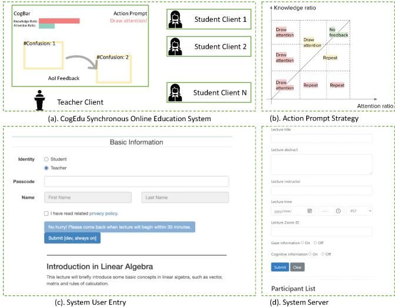  

Figure 5: (a). Illustration of our CogEdu system. (b). Our action prompt strategy for instructors based on attention ratio and knowledge ratio. $^ { ( \mathbf { c } , \mathbf { d } ) }$ . The UI of the user end (c) and server end (d) of CogEdu.

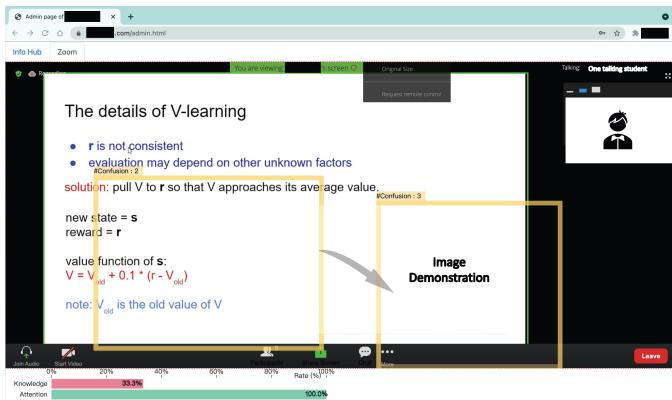  

Figure 6: A real online education example of our live CogEdu system shown in Fig. 5

5.1.2 任务和程序。我们首先提示学生和教师观看一段介绍视频，内容关于如何使用我们的在线教育系统来促进学习和教学，以及我们数据收集的详细程序（见图7）。之后，学生需要首先进行一个注视校准过程（详见第5.2.2节），以便进行准确的注视收集。然后要求学生表现出面部表情（包括困惑和中性表情），以训练一个用于认知信息检测的模型（更多细节见第5.2.2节）。之后，学生和教师同时在同一个在线视频会议系统中（第5.2节），教师向学生展示课程材料。讲座材料是由我们的研究团队准备的幻灯片。在讲座过程中，我们的在线教育系统向教师提供关于学生学习状态的视觉反馈，教师可以相应地调整他们的教学策略（详见第5.2.3节）。讲座结束后，学生需要完成一项由10-12个与每个具体讲座相关的问题组成的后测，以测量他们的学习成果。

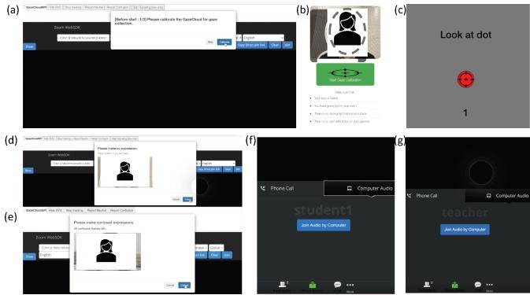  

Figure 7: The procedure to use our online learning system. (a)(b)(c). Gaze calibration process for gaze tracking. (d)(e). Facial expression model training data collection process. (f)(g). Students and teachers join in the online video calling from their own clients in class.

5.1.3 实验设计。我们的为期六周的研讨会由12个关于人工智能基础的讲座组成，涵盖机器学习、计算机视觉、自然语言处理、强化学习等不同主题。每个讲座持续一个小时。讲座的难度根据小学和高中学生的知识水平进行了调整。每周，讲师教授两节课。鼓励学生在所有学生中选择相同的时间段进行实时和同步教学（图5(a)）。如果学生与讲师的时间冲突，我们为这些学生安排了新的时间以进行额外的数据收集。鼓励每个学生尽可能参加更多的讲座。总体而言，每个学生平均参加了3节讲座。

5.1.4 测量。如上所示，我们主要收集了学生的注视、面部表情和测试后的答案。注视和面部表情主要用于生成学生状态反馈给教师，以便教师能够采取具体措施提高学生的参与度和改善收集数据的质量。测试后的答案用于衡量学生的学习成果。

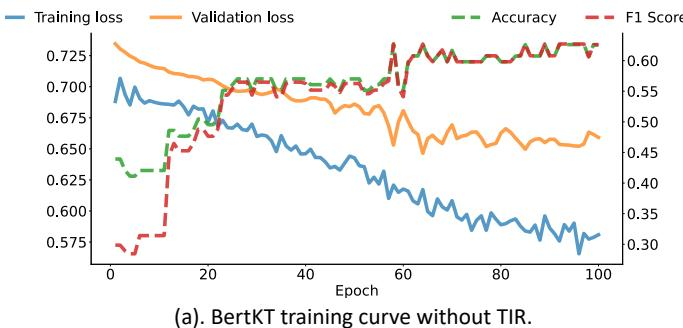  
value (solid lines). Vertical axis on the right is the metrics (accuracy and F1 score) value (dotted lines).

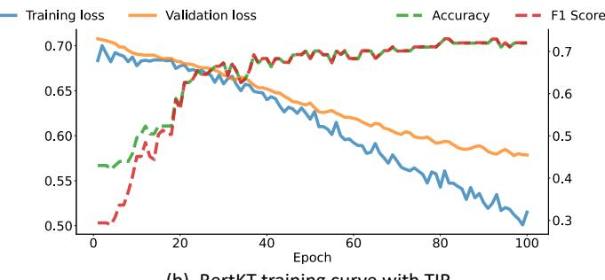  
(b). BertKT training curve with TIR.

# 5.2 在线教育系统

虽然现有的视频会议软件如 $\mathrm { Z o o m } ^ { 3 }$ 为在线教育提供了稳定的解决方案，但微妙的学生行为可能无法被捕捉，从而无法为教师提供洞察。此外，研究表明，与面对面授课相比，学生的学习表现可能变得更差[57]。因此，我们收集的数据质量可能会受到严重影响。因此，为了解决这个问题并促进学生与教师之间的微妙沟通，我们开发了一种在线教育系统名为 CogEdu，该系统可以支持学生与教师之间的同步教学，同时向教师提供实时的学生状态反馈，以增强教育过程。基于笔记本电脑上普遍存在的网络摄像头，我们收集了学生的注视信息和面部表情。通过分析收集的数据，我们向教师提供有关当前内容理解、注意状态以及学生关注内容的细致可视化的实时反馈。对内容的理解（或困惑）和注意力被称为认知信息。为了进一步帮助教师，该系统还根据收集的数据提供教学策略建议。

因此，该系统可以增强学生的学习参与度和教学有效性，从而实现高质量的数据收集。更多细节如下所示。

5.2.1 系统实施。我们在云服务器上实施了CogEdu系统。用户（学生和教师）可以通过他们的浏览器访问该系统（图5）。考虑到大多数用户对Zoom视频会议软件程序更为熟悉，我们基于Zoom API实现了视频会议功能。所有反馈都叠加在嵌入的Zoom界面上。为了支持讲座前后大量的面部表情数据流，并增强系统的稳健性，我们在谷歌云上采用Kubernetes进行部署、扩展和管理。当负载增加时，实例会自动扩展，以减少延迟并实现令人满意的实时性能。

5.2.2 学生客户端。在学生一侧，学生需要首先经历注视校准过程，然后收集面部表情以进行认知信息检测。为了从学生那里收集注视信息，我们使用了GazeRecorder6的服务。该服务每秒提供约28个注视位置，这些位置随后使用基于速度的方法被标记为注视或扫视[13]。与此同时，系统每秒将面部表情发送到服务器进行认知信息检测。学生端每五秒上传所有注视信息和认知信息。

我们用来将原始注视转换为凝视的算法来自[13]。基本思想是计算一个速度阈值，低于该阈值的注视点被标记为凝视。学生的困惑信息通过支持向量机（SVM）进行检测。在讲座开始前，学生们被要求做出困惑表情和中性表情。收集到的数据被裁剪以聚焦于眉眼区域，然后输入主成分分析（PCA）以提取特征。基于这些特征训练一个SVM，以分类困惑或中性表情。

注意力检测通过注视检测、困惑检测和浏览器内置属性得以实现。当用户切换到另一个标签页或应用程序时，浏览器中的document.visibilityState变为隐藏。这个属性与困惑检测一起进行检查。当服务器上的困惑检测算法未能检测到面孔时，意味着学生的面孔不在摄像头范围内，系统则断定该学生不专心。第三，当学生的注视离开屏幕时，学生也被标记为不专心。

5.2.3 教师客户端。在教师端，系统每五秒钟从服务器获取学生上传的所有信息，并处理这些信息以向教师提供反馈。提供给教师的反馈包括三个模块：兴趣区域（AoI）反馈、一般认知反馈和行动提示。

兴趣领域反馈：该模块以视线和认知信息为输入，并将反馈可视化为正在进行的讲座上的边界框。这些边界框（如图5和图6所示）是通过光谱聚类算法根据被标记为注视的视线进行聚类的。被界定的区域是学生们观看的地方。边界框的不透明度表示在所有学生中，观看该区域的学生的比例，而颜色表示在观看该区域的学生中，对该区域内容感到困惑的学生比例。关于光谱聚类方法的更多细节见附录A.2。

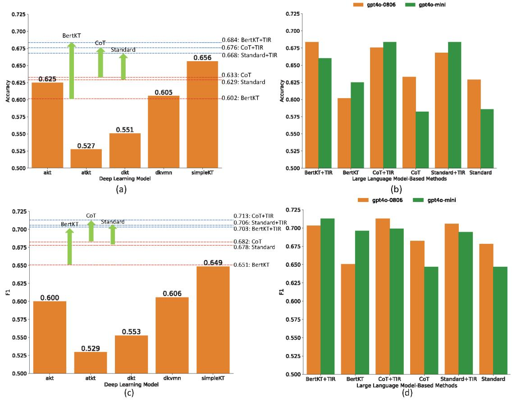  

Figure 9: Model accuracy and F1 score comparison on our newly collected dataset. Left $^ { ( \mathbf { a } , \mathbf { c } ) }$ shows comparison (a: accuracy, c: F1 score) among deep learning models and LLMs-based models using GPT-4o. Right $^ { ( \mathbf { b } , \mathbf { d } ) }$ shows comparison (b: accuracy, d: F1 score) of LLMs-based models using GPT-4o v.s. GPT-4o mini.

一般认知反馈：该模块以认知信息为输入，并将反馈可视化为总结柱状图（如图5和图6所示）。我们展示了对内容没有困惑的学生占所有学生的比例（知识比例），以及专注的学生占所有学生的比例（注意比例）。

行动提示：根据一般认知信息，系统向教师提供了教学建议（如图5和图6所示）。当注意力比率降低时，教师会被提示吸引学生的注意力。当知识比率降低时，建议重复当前内容（图5(b)）。

# 6 评估

根据我们工作坊收集的学生数据，我们不仅探讨了模拟性能的简单准确性比较，还研究了学生学习表现的动态模式，涉及更细化的层面。

# 6.1 模拟设置

模拟设置与EduAgent数据集中的设置相似。我们按照个体为单位将数据集以0.7的比例分为训练集和测试集。我们将前五个问题设为学生历史的过去问题，其他问题设为预测的未来问题。模型的输入和输出与EduAgent模拟实验相同（见图2和图3）。对于基于大型语言模型（LLMs）的模型，我们在有或没有我们的TIR模块的情况下获取了结果，包括基于提示的模型（标准和CoT提示）和基于微调的模型（BertKT），并与深度学习模型进行了比较。所有基于LLMs的模型均使用GPT-4o和GPT-4o mini。

# 6.2 TIR使LLMs优于深度学习模型

我们首先通过与真实学生表现的比较，比较了各种模型的模拟性能的准确性和F1-score。如图9(a)所示，未整合我们的TIR模块时，最佳模型是SimpleKT，其准确率为0.656，比所有基于LLM的模型都要好。然而，整合了我们的TIR模块后，所有基于LLM的模型的模拟准确率均有所提高，且都超过了SimpleKT模型的准确率。F1分数结果在图9(c)中也类似，即所有增强了TIR的LLM的F1分数均优于所有深度学习模型。这些结果令人鼓舞，因为所选的深度学习模型被证明是广泛接受的教育模型，广泛应用于教育领域[18, 21, 46, 60, 94]，以指导教学实践和支持自适应学习策略[66]。因此，我们模型的优越预测能力表明其在真实世界应用中的强大潜力。为了进一步展示我们模型的影响，我们选择了带有TIR的BertKT作为例子，进行统计分析，并与五个深度学习模型在个体水平、讲座水平和问题水平进行比较。不同模型对学生模拟表现的影响通过配对t检验的重复测量ANOVA进行评估。

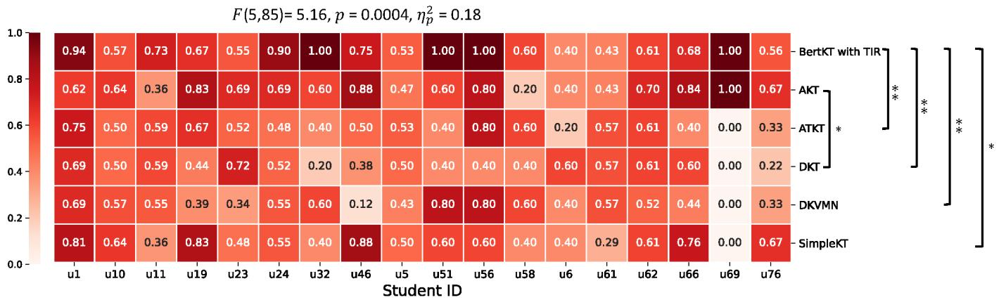  
F Heaa hove cura  rdividl sude si el

个体层面：我们计算了每个学生的平均模拟准确性，如图10所示。我们发现模型对模拟准确性有显著影响 $( F ( 5 , 8 5 ) =$ 5.16, $\mathnormal { p } = 0 . 0 0 0 4$ $\eta _ { p } ^ { 2 } = 0 . 1 8 )$，这表明效应大小较大。在成对比较中，观察到以下模型对之间存在显著差异：

AKT 与 DKT: $t ( 1 7 ) = 2 . 2 9$ $p = 0 . 0 3 5$ $\eta _ { p } ^ { 2 } = 0 . 1 6$ 。  
BertKT 与 TIR 对比 ATKT: $t ( 1 7 ) = 3 . 4 2$ $p = 0 . 0 0 3$，$\eta _ { p } ^ { 2 } = 0.24$。  
BertKT 与 TIR 对比 DKT: $t ( 1 7 ) = 3 . 2 4$，$p = 0 . 0 0 5$，$\eta _ { p } ^ { 2 } = 0 . 3 0$。  
BertKT 与 TIR 对比 DKVMN: $t ( 1 7 ) = 3 . 8 3$，$p = 0 . 0 0 1$，$\eta _ { \mathscr P } ^ { 2 } = 0.24$。  
BertT 与 TIR 对比 SimpleKT: $t ( 1 7 ) = 2 . 4 5$ $p = 0 . 0 2 5$ $\eta _ { \mathscr P } ^ { 2 } = 0.14$。

这些结果表明，BertKT（带TIR）在性能上显著优于大多数深度学习模型。尽管我们没有发现BertKT（带TIR）和AKT之间的显著性差异，但图10仍然显示对于大多数个体学生，BertKT（带TIR）的模拟准确性优于AKT。

讲座级别：我们随后计算了每个特定课程讲座ID的平均模拟准确性，如图11所示。

结果显示模型对仿真准确性有显著影响 $( F ( 5 , 55 ) = 4.53$ , $\mathnormal { p } = 0.002$ $\eta _ { p } ^ { 2 } = 0.20 )$，表明效应量较大。在以下模型对之间观察到了显著差异：

AKT 对 DKVMN: $t ( 1 1 ) = 2 . 4 9$ $\begin{array} { r } { p = 0 . 0 3 } \end{array}$ , $\eta _ { \mathscr P } ^ { 2 } = 0 . 2 1$ 。BertKT 与 TIR 对比 ATKT: $t ( 1 1 ) = 3 . 0 6$ $p = 0 . 0 1$ , $\eta _ { p } ^ { 2 } = 0 . 2 8$ 。BertKT 与 TIR 对比 DKT: $t ( 1 1 ) = 2 . 9 1$ $\mathnormal { p } = 0 . 0 1 4$ $\eta _ { \mathscr P } ^ { 2 } = 0 . 2 7$ 。BertKT 与 TIR 对比 DKVMN: $t ( 1 1 ) = 4 . 2 7$ $p = 0 . 0 0 1$ , $\eta _ { \mathscr P } ^ { 2 } = 0.35。

与个人层面的结果类似，这些结果表明BertKT（带TIR）优于这些深度学习模型。尽管我们没有发现BertKT（带TIR）与AKT/SimpleKT之间的显著性，但图11仍显示出BertKT（带TIR）对于大多数讲座的模拟准确性优于AKT/SimpleKT。

问题层级：然后我们计算了每个特定问题 $\mathrm { I D }$ 在后测中的平均模拟准确性，如图 12 所示。结果未发现模型对模拟准确性有显著影响 $( F ( 5 , 3 0 ) = 1 . 0 9$ $p = 0 . 3 8 7$ , $\eta _ { p } ^ { 2 } = 0 . 1 4 )$。然而，在以下模型对之间观察到了显著差异：

BertKT与TIR的比较 vs. DKVMN: $t(6) = 3.69$，$p = 0.01$，$\eta_{p}^{2} = 0.46$。BertKT与TIR的比较 vs. simpleKT: $t(6) = 2.59$，$p = 0.041$，$\eta_{\mathscr{P}}^{2} = 0.32$。

虽然我们没有发现BertKT（带TIR）与AKT/ATKT/DKT之间的显著性，图12仍然显示BertKT（带TIR）在大多数题目ID上比AKT/ATKT/DKT具有更好的模拟准确性。

# 6.3 TIR增强模型学习效率

尽管BertKT $^ { \cdot } +$ TIR模型的训练使用了所有的训练学生，但值得注意的是，对于其他基于提示的模型（标准和CoT），我们仅使用了四个示例学生作为上下文示例演示，而不是所有训练集中的学生。然而，在整合我们的TIR模块后，两个基于提示的模型（标准和CoT）的模拟性能均优于使用所有学生进行模型训练的深度学习模型（图9）。这表明我们的TIR模块能够提高基于提示模型的利用效率，以在更有限的训练数据中实现可比甚至更真实的学生模拟。

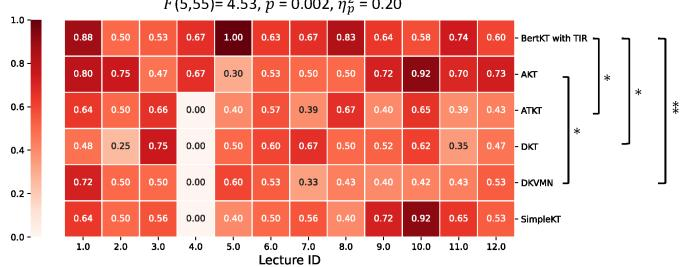  

Figure 11: Heatmap to show the average simulation accuracy (each cell) for each specific lecture using each model.

# 6.4 TIR 赋能更小的 LLMs

我们还比较了使用GPT-4o和GPT-4o mini的模拟性能。我们发现，TIR模块的整合提高了所有基于GPT-4o mini的模拟模型（标准、CoT、BertKT），这些模型的表现甚至优于没有TIR模块的GPT-4o模拟模型。值得注意的是，GPT-4o mini是一个比GPT ${ 4 0 } ^ { 7 }$ 小得多的模型。在没有TIR的情况下，GPT-4o在标准和CoT模型中的模拟性能明显优于GPT-4o mini，如图9(b)所示。然而，在整合TIR模块后，GPT-4o mini中的标准和CoT模型明显超越了GPT-4o（图9(b)）。这些结果表明，TIR模块能够更有效地帮助更小的LLM从训练集中的示例学生学习。因此，更小的LLM可以达到可比甚至更好的性能，消除了使用更大规模LLM的必要。

# 6.5 TIR 更好地捕捉个体差异

我们随后检查了模型是否能够捕捉模拟学生和真实学生之间的个体差异和相关性。具体而言，我们使用了带或不带TIR模块的BertKT（基线）进行模拟，并与标签（真实学生的真实数据）进行了比较。这通过模拟学生的测试准确性序列及学生ID与真实学生的数据之间的皮尔逊相关性进行定量衡量。如图13所示，我们发现TIR模块的整合能更好地捕捉模拟学生与真实学生之间关于学习表现序列及学生ID的相关性，比没有TIR的情况明显改善了皮尔逊相关性，从$r = 0 . 0 2$（无TIR）提高到$r = 0 . 4 2$（有TIR）。这些结果表明，我们的TIR模块通过更好地捕捉学生学习表现的个体差异，使得模拟更加真实。

我们进一步检查了每位学生在有无TIR模块（基线）情况下的平均模拟准确性差异的统计显著性。使用Shapiro-Wilk检验评估了两者之间差异的正态性，结果表明没有显著偏离正态性 $W = 0.9235$ $\mathnormal { p } = 0.1493$ . $\mathrm { d f } = 17$ . 进行了配对分析。

$$
F ( 5 , 3 0 ) \mathrm { = } 1 . 0 9 , p = 0 . 3 8 7 , \eta _ { p } ^ { 2 } = 0 . 1 4
$$

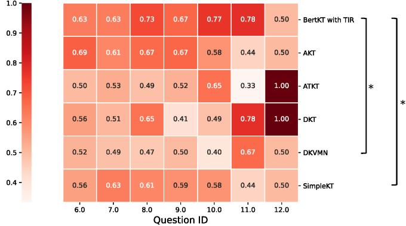  

Figure 12: Heatmap to show the average simulation accuracy (each cell) for each post-test question ID using each model.

随后进行了t检验，以评估TIR模块对预测性能的影响。结果显示，使用TIR模块的准确性较基线有统计学显著的提高，$\mathit { \check { t } } = 2 . 4 1 3 9$，$p = 0 . 0 2 7 3$，$\operatorname { d f } = 1 7$。Bland-Altman分析揭示了平均差异（偏倚）为0.0881（$9 5 \%$ CI: 0.0186至0.1577），一致性范围为-0.2069（$9 5 \%$ CI: -0.5100至0.0962）至0.3832（$9 5 \%$ CI: 0.0800至0.6863）。Bland-Altman图（图13(d)）可视化了这些结果，显示平均差异作为虚线红色线，一致性范围作为虚线蓝色线。围绕平均差异的点的散布相对一致，表明两个模型之间的一致性在预测准确性值的范围内没有显著变化。这些结果表明TIR模块对预测性能有持续的正面影响，同时与基线模型保持了可接受的一致性水平。

# 6.6 TIR 捕获更好的讲座相关性

我们接着检查了模型是否能够捕捉课堂之间的相关性和差异。具体来说，我们仍然使用了带有或不带TIR模块的BertKT（基线）进行模拟， 并与标签（真实学生的实际情况）进行了比较。由于不同的课堂有各自的难度，学生在不同课堂上的学习表现（后测问题准确率）也因此各不相同。因此，通过比较模拟和真实学生在各课堂上的学习表现趋势，我们可以观察模拟模型是否能够捕捉到课堂难度的变化和跨课堂的相关性。这一趋势通过模拟学生在各课堂上的测试准确率序列与真实学生序列之间的皮尔逊相关性进行了定量测量。如图14(a)所示，我们发现TIR模块的整合比没有TIR的情况下更好地捕捉到了模拟与真实学生在课堂学习表现序列之间的相关性，并且皮尔逊相关性明显从$r = 0.42$（无TIR）提升到了$r = 0.52$（有TIR）。为了使每个学生的可视化更加直观，我们展示了每位特定模拟和真实学生在每堂课中的平均问题回答准确率，如图14(b,c,d)所示。这一可视化也揭示了模拟学生（带TIR）与真实学生之间的相似性更大，相比于没有TIR的模拟相似性。这些结果表明我们的TIR模块通过更好地捕捉学生学习表现中的课堂相关性，使模拟更加真实。

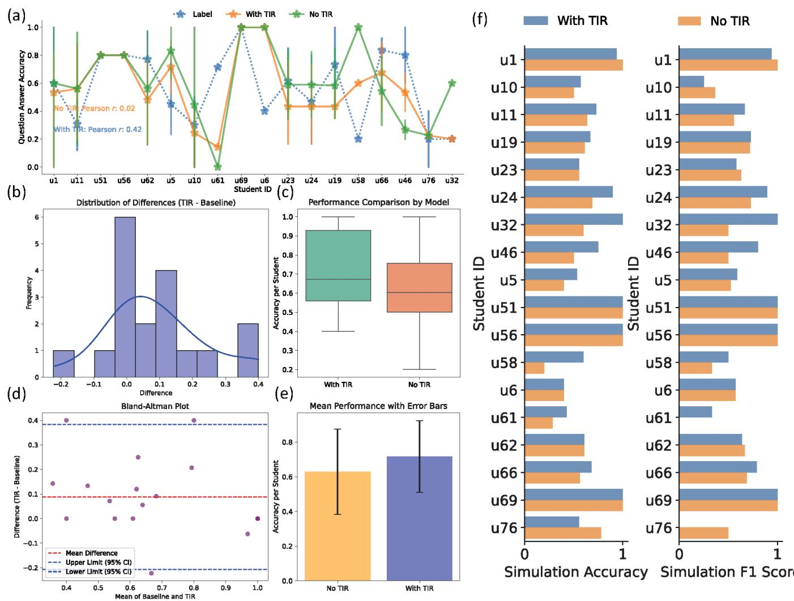  
vaveur (e) (error bar: $\mathbf { 9 5 \% }$ confidence interval) between two models. (f. Average simulation accuracy and F1 score for each individual student using two models.

我们进一步检查了每节课平均模拟准确度在有无TIR模块下的统计差异。使用Shapiro-Wilk检验评估了它们之间准确度差异的正态性，结果表明没有明显的正态性偏离 $\mathrm { ' } W = 0 . 9 7 3 6$ ，$\mathnormal { p } = 0 . 9 4 4 4$ ：$\operatorname { d f } { = } 1 1$）。然后进行了配对t检验，以评估TIR模块对模拟性能的影响。分析结果显示，与无TIR情况相比，使用TIR模块的准确度在统计上显著提高 $\prime = 2 . 5 1 7 3$ ，$p = 0 . 0 2 8 6$ 。$\operatorname { d f } { = } 1 1$）。Bland-Altman分析（图14(g)）显示均值差（偏差）为0.0764（ $9 5 \%$ CI：0.0195到0.1334），一致性限范围为-0.1209

$9 5 \%$ 置信区间：-0.3263 到 0.0845) 到 0.2738 ($9 5 \%$ 置信区间：0.0684 到 0.4792)。这些发现表明，TIR模块在增强预测性能的同时，与基准模型表现出良好的一致性。

# 6.7 TIR 更好地捕捉问题差异

此外，我们进一步探讨了模型是否能够捕捉不同问题之间的关联，使用带或不带TIR模块的BertKT。不同的问题对应于课程材料的特定知识概念。因此，通过比较模拟学生和真实学生在不同问题上的测试准确性趋势，我们可以看到模拟模型是否能够捕捉学生在细粒度和不同知识概念上的学习表现。这个趋势也通过模拟学生的问题准确性序列与问题ID的Pearson相关性与真实学生进行定量测量。如图15(a)所示，我们发现TIR模块的集成与真实案例（标签）的相关性相比于无TIR情况更好，并显著将Pearson相关性从$r = - 0 . 5 0$（无TIR）提高到$r = 0 . 3 7$（有TIR）。为了更直观地展示个别学生的数据，我们展示了每个具体模拟学生和真实学生在每个问题上的平均回答准确性，如图15(b,c,d)所示。这种可视化还显示了模拟学生（带TIR）与真实学生之间的相似性更大，而没有TIR的模拟相似性则较低。这些结果表明，我们的TIR模块通过更好地捕捉问题之间的关联（即知识概念之间的关联）在学生学习表现上实现了更为现实的模拟。

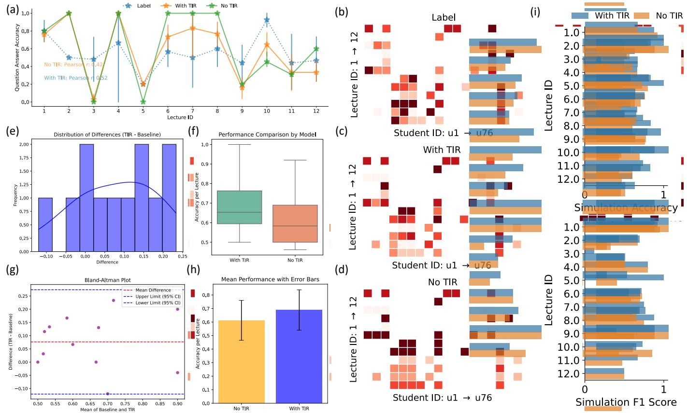  
FvB t question answer accuracy. $( \mathbf { e } , \mathbf { f } , \mathbf { g } , \mathbf { h } )$ . The distribution of simulation accuracy differences (e), boxplot (f), Bland-Altman plot to show the mean differences $\mathbf { \mu } ( \mathbf { g } )$ , and barplot (h) (error bar: $9 5 \%$ confidence interval) between two models. (i). Average simulation accuracy and F1 score for each lecture ID using two models.

然后，我们检查了每个问题的平均模拟准确性在有或没有TIR模块（基线）之间的统计差异。使用Shapiro-Wilk检验评估了两者之间差异的正态性，该检验表明显著偏离正态分布 $W = 0.7451$，$\mathbf{\mathit{p}} = 0.0113$，$\mathrm{df} = 6$。因此，进行了一项Wilcoxon符号秩检验（而不是配对t检验）以评估TIR模块对预测性能的影响。测试结果显示，与基线相比，使用TIR模块的准确性在统计上显著提高 $\mathbf{\mathit{p}} = 0.0277$，$\mathrm{df} = 6$。Bland-Altman分析（图15(g)）显示平均差异（偏差）为0.1437（$95\%$ CI：0.0306至0.2568），一致性限从-0.1555（$95\%$ CI：-0.4754至0.1644）到0.4429（$95\%$ CI：0.1230至0.7628）。这些结果表明TIR模块在预测性能上具有显著的积极影响，且两种模型之间的协议水平可以接受。

# 6.8 学习路径中的技能水平动态性

此外，我们探索了模拟是否捕捉到了学生在学习路径中的技能水平动态。这里的学习路径指的是从课程的第一张幻灯片到最后一张幻灯片的按时间顺序的学习过程。在我们的在线教育系统中，学生的技能水平通过与特定幻灯片对应的问题回答准确率的平均值来表示。这使我们能够衡量学生在每张幻灯片上掌握知识概念的程度。我们仍然使用了带或不带TIR模块的BertKT进行模拟，并与标签进行了比较。然后，我们比较了沿着幻灯片ID的模拟和真实学生技能水平的趋势。如图16(a)所示，我们发现，整合TIR模块比没有TIR的情况更好地捕捉了从第一张幻灯片到最后一张幻灯片的整个学习路径中技能水平的动态。为了更直观地展示每个学生的情况，我们还显示了每个特定模拟和真实学生在每张幻灯片上的平均问题回答准确率，如图$^{16(\mathrm{b}, \mathrm{c}, \mathrm{d})}$所示。此可视化还揭示了带TIR的模拟学生与真实学生之间的相似性更大，相比于没有TIR的模拟相似性。这个趋势也通过沿幻灯片ID的模拟技能水平序列与真实学生序列的Pearson相关性进行了定量测量。然而，由于不同的讲座有不同的幻灯片，我们对每个讲座分析了Pearson相关性。如图16(e)所示，我们的TIR模块在大多数讲座中捕捉到了更好的相关性。这些结果表明，我们的TIR模块通过更好地捕捉学生技能水平在学习路径中的动态，能够实现更加真实的模拟。

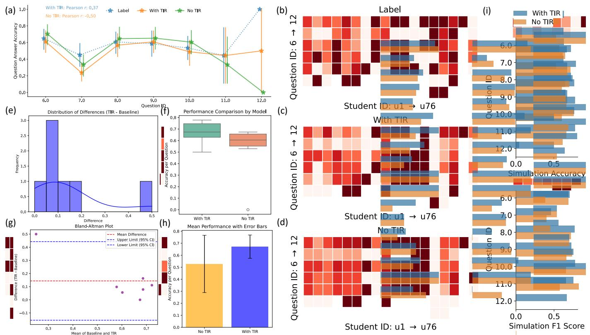  
: . Catw  s ur anar. (HaerBr r represents higher question answer accuracy. $( \mathbf { e } , \mathbf { f } , \mathbf { g } , \mathbf { h } )$ . The distribution of simulation accuracy differences (e), boxplot (f), Bland-Altman plot to show the mean differences $\mathbf { \rho } ( \mathbf { g } )$ , and barplot (h) (error bar: $\mathbf { 9 5 \% }$ confidence interval) between two models. (i). Average simulation accuracy and F1 score for each post-test question ID using two models.

# 6.9 细粒度学生间相关性

上下文模拟的一个重要方面不仅是捕捉学习中的个体差异，还要捕捉同一课程中的个体相关性。图17显示了模拟学生（使用或不使用TIR的BertKT）和真实学生之间的学生间相关性。每个节点代表一个学生，如果两个学生参加了相同的讲座，则两个节点连接。每个节点的颜色深度表示该学生参加的所有讲座的平均问题回答正确率。连接两个节点的边的权重表示学生间相关性，该相关性是通过两个学生在重叠讲座中对应的问题的回答正确性序列之间的皮尔逊相关性计算得出的。注意，每个学生参加了多场讲座，但两个学生可能并未参加相同的讲座。因此，边的权重仅考虑两个学生之间的重叠讲座。然而，每个节点的颜色深度考虑了一个学生参加的所有讲座。这就是为什么边的权重可能为1，而两个节点具有不同的颜色深度。这意味着学生在重叠讲座中的正确性序列是相同的，但每个学生参加的所有讲座的整体准确率是不同的。如图17所示，我们发现TIR模块的结合更好地捕捉了个别学生的学习表现（每个节点的颜色深度表示的平均问题回答正确率）和学生间相关性（两个学生间问题回答正确性序列的皮尔逊相关性，由两个节点之间的边的权重表示），相比于没有TIR模块的模型，这些更接近真实学生（标签）。这些结果表明，我们的TIR模块通过更好地捕捉学生学习表现中的学生间相关性，从而实现了更现实和更细致的模拟。

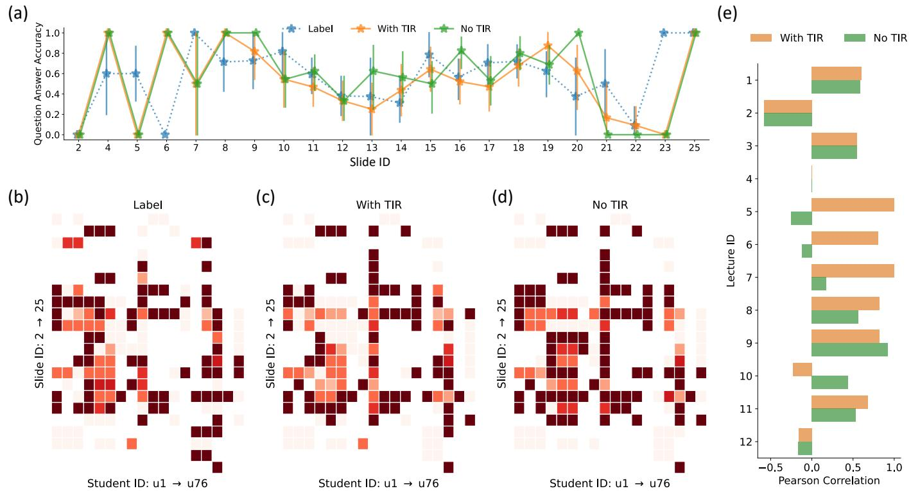  
r y real student sequence along with slide ID in each lecture on our newly collected dataset.

# 7 讨论

在这项工作中，我们进行了为期6周的在线教育研讨会，以收集课程材料和学生学习表现的细粒度注释。这使得我们能够进行上下文学生模拟，以考虑课程材料调制对学生学习的影响。我们进一步改进了学生模拟，提出了一个可转移的迭代反思模块，增强了基于提示的LLM模拟和基于微调的LLM模拟，在性能上甚至超过了深度学习模型。这一点在另一个公共数据集中也得到了验证。

# 7.1 应用场景

随着人工智能辅助教育和智能辅导系统的重要性日益增加，我们的工作可以作为支持教育背景下一系列应用的重要基础。

7.1.1 学生：增强自我学习。课堂模拟可以基于过去的学习历史为特定学生创建数字双胞胎。这个数字双胞胎进一步模拟学生在未来课程材料和测试中的学习表现。这可以支持学生的自我评估和反思，帮助他们根据学习节奏设定个性化目标。具体来说，学生可以跟踪自己的学习趋势和进展，查看自己的技能如何发展。因此，这可以帮助学生反思他们的优势和需要改进的弱点。学生还可以根据模拟结果设定更合适的学习目标、里程碑和学习优先级，以便激励他们实现更清晰的学习目标。这种在学习中的决策和反思也与学生的元认知技能有关，以发展学习策略和学习习惯。

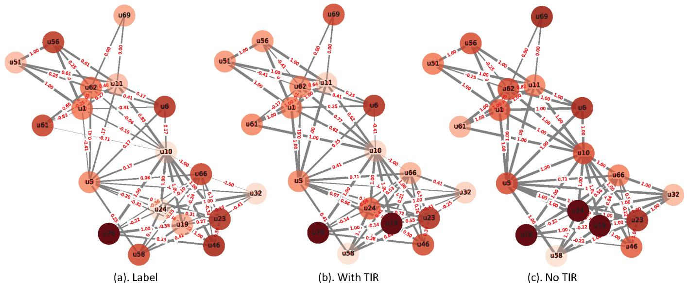  
b between two students.

7.1.2 教师：调整教学策略。使用该系统的教师将能够分析整个班级或群体的预测，以便在实际教授人类学生之前测试教学方法或课程结构。拥有如此具有代表性的数字课堂，可以让教师利用模拟结果来定制学习体验，为学生提供真正符合他们技能水平的课程内容。通过课堂模拟，教师可以通过分析整个班级的模拟结果，识别出共同的困难领域，从而优化课程设计。例如，学习速度较快的学生可以接受加速课程进度，而可能在即将到来的考试或课程内容中遇到困难的学生，则可以获得更多相关的课程资源，以建立个性化的学习路径。这也可以通过使教师更有效地分配教学资源，识别出可能需要更多时间让学生掌握的技能，从而改善教学资源的分配。最后但并非最不重要的是，该系统可以为教师的适应性干预提供洞察，以便在学生被识别为有落后风险时，能够为他们提供个性化的干预（如口头提醒或一对一辅导）。

7.1.3 家长：家庭支持。在家庭环境中，课堂模拟可以根据孩子的过去学习历史模拟特定儿童的学习表现。因此，父母可以获得关于他们的孩子在某些课程（优缺点）中表现如何的深入信息，从而能更好地做出决策，例如选择合适的学校、课外活动、选择高级课程以及明智地投资于能够针对孩子可能面临的特定困难领域的辅导服务。父母还可以通过获取有关必要家庭活动和资源的有针对性见解来支持课外学习，这些活动和资源与他们孩子的预测需求保持一致，并根据表现模拟的见解创造一个适合他们孩子学习风格的良好学习环境。

# 7.2 限制与未来工作

我们也承认这项工作的潜在局限性。

7.2.1 人口多样性。第一个限制是我们在线教育工作坊的人口多样性。我们决定从小学和高中招募学生，因为这些学生通常对与人工智能相关的课程材料没有先前的知识。因此，当他们学习新知识时，我们能够更好地捕捉到学生的学习表现和学习结果。然而，我们也承认，收集更具多样性的人口（例如不同年龄组）的数据可以更好地支持并进一步扩展我们实验的发现。

7.2.2 模拟行为类型。在我们的工作中，我们使用学生回答问题的正确性来代表他们的学习表现，这可以映射到学生在相关课程概念上的技能水平。通过进一步将其映射到课程中的特定幻灯片ID（例如第6.8节），这种模拟可以反映学生在课程中的学习行为。然而，我们承认学生的行为不仅限于问题的正确性。我们澄清认知状态的信息仅用于教师在数据收集期间获取学生的学习状态，并未用于行为模拟。现实世界场景中还有更多多样化的学习行为，如推理过程、学习反思、个人偏好、学习风格等。例如，学生在课程中的认知状态（如注意力、困惑）可以直接反映他们在课程中的学习风格和个人偏好。对这些额外学习行为的模拟可以提供进一步的见解和证据支持。我们还相信，鉴于强大的上下文学习能力和庞大的知识基础，LLMs在模拟这种多样化行为方面具有巨大的潜力。因此，对更多多样化学习行为类型的模拟可能是未来探索的方向。

7.2.3 泛化与成本差异。我们澄清我们的目标是展示 TIR 可以增强 LLM，使其在没有 TIR 和深度学习模型的情况下取得优于自身的性能。我们在每个基于 LLM 的模型中，使用相同的训练/测试数据进行公平比较，无论是否使用 TIR。但我们并不打算直接比较基于提示的 LLM 和基于微调的 LLM，因为两者各有优缺点。例如，基于提示的 LLM 需要较少的训练数据，但基于微调的 LLM 具有更好的模拟性能。然而，对于未来潜在应用而言，扩展在外部数据集中的微调模型，仍然需要在这些新数据集上重新微调模型，这类似于使用训练数据更新模型权重的深度学习模型。因此，直接比较两者在泛化性或训练时间/计算资源方面并不可比/不适用。在与深度学习的比较中，我们主要使用基于微调的 LLM 进行公平比较，因为它们使用相同的训练数据。然而，使用远远较少的训练数据，增强的 TIR 基于提示的 LLM 也可以实现与深度学习相当甚至更好的性能。这也证明了我们的 TIR 模块的有效性。

7.2.4 教育者的洞见。我们当前的课堂仿真系统作为学生模拟模型。将其整合到一个端到端的智能教学系统中需要付出相当大的努力。尽管如此，课堂仿真系统基于真实的学生-教师互动数据集。其预测能力与已经被验证的教育模型相一致，这些模型成功地指导了教学实践并支持适应性学习策略[66]。我们模型的基础准确性表明其在现实世界中的强大应用潜力，正如那些在实证测试之前已经影响教育策略的类似模拟所示[84]。该模拟器可以通过提供可操作的洞见来支持教育工作者，提高个性化干预、课程设计和基于证据的教学实践。它可以为个别学生识别特定的知识差距，使针对性干预成为可能，并允许教育工作者探索假设情景，以优化不同学习者背景的教学策略。此外，该模拟器通过模拟学生对于不同教学方法的反应来帮助优化课程，有助于精炼节奏和内容顺序。因此，该模拟器提供了一个有研究支持的工具，用于测试教学方法的影响和预测长期结果。除了学习分析外，它还整合了行为洞见，以检测学习问题，并为创新教学方法提供安全的实验环境。我们工作中的案例研究展示了其实际效用，例如根据学生在不同问题上的学习表现（问题级别）确定考前准备的影响话题，并基于学生在不同幻灯片上的学习表现（幻灯片级别）指导课堂时间分配。总之，尽管现实世界中的教育者经验将加强我们的发现，但本研究提供了一个坚实的基础，展示了模拟器的预测能力和实际潜力。未来包含教育者反馈的工作将进一步增强我们对其在真实课堂环境中有效性的理解和验证。

# 8 结论

我们推出了课堂模拟器，这是一个基于大语言模型的上下文学生生成代理环境，用于在线教育中的行为模拟学习。这样的学生代理模仿真实学生过去的学习历史，并在新的课程材料和测试问题中采取行动。该学生代理环境得益于我们新的细粒度数据集和强大的可转移迭代反思模块，以增强模拟性能。一系列实验证明了我们学生模拟的可行性和有效性。随着基于人工智能的教育和智能辅导系统的重要性日益增加，我们相信我们的工作可以作为支持教育背景下多样化应用的重要基础。

# 致谢

本工作得到了国家科学基金会CNS-2403124、CNS-2312715、CNS-2128588以及加利福尼亚大学圣地亚哥无线通信中心的支持。