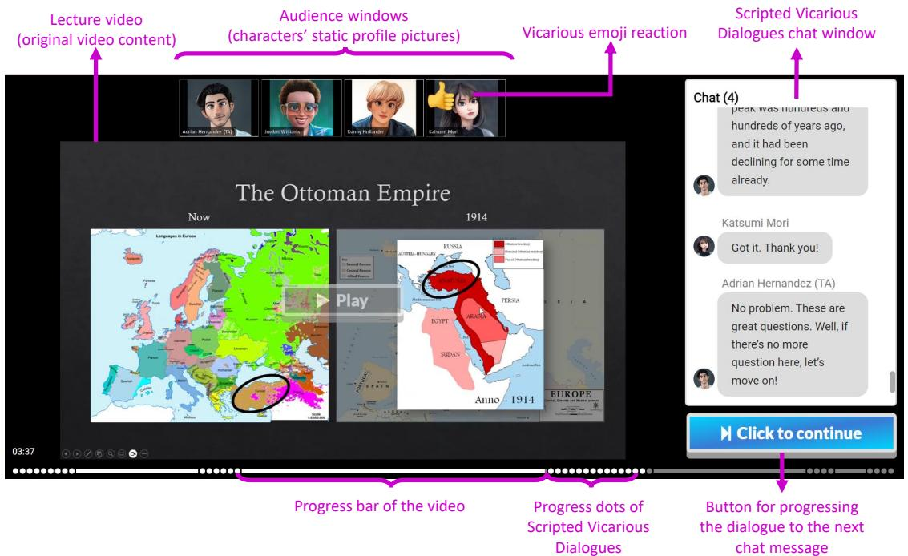
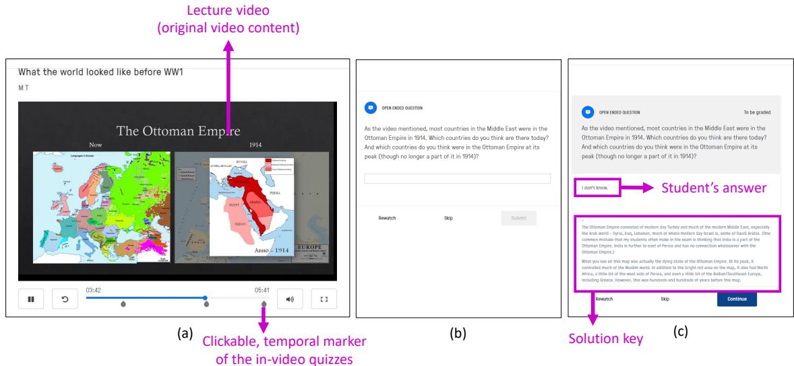
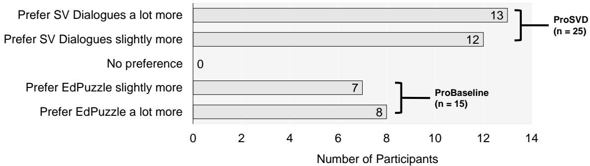
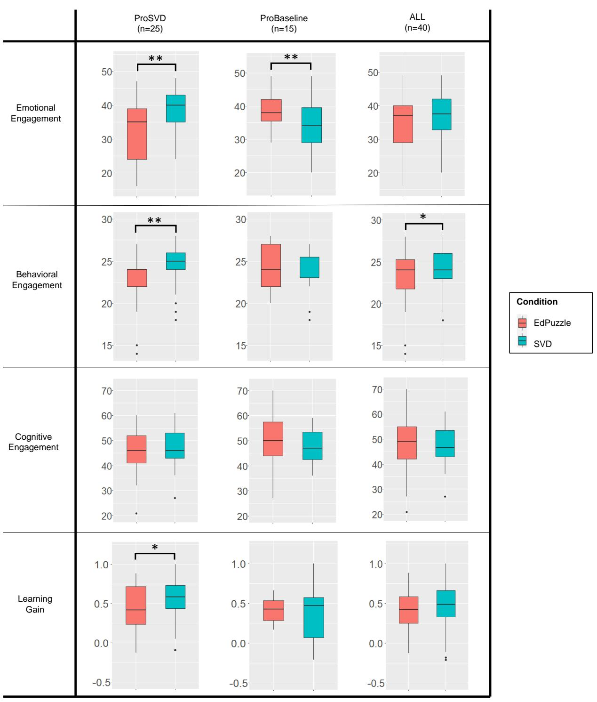

# 1. Bibliographic Information

*   **Title:** Scripted Vicarious Dialogues: Educational Video Augmentation Method for Increasing Isolated Students’ Engagement
*   **Authors:** Thitaree Tanprasert, Sidney Fels, Luanne Sinnamon, and Dongwook Yoon.
*   **Affiliations:** All authors are affiliated with the University of British Columbia, Canada, across the departments of Computer Science (CS), Electrical and Computer Engineering (ECE), and an unspecified department for Luanne Sinnamon.
*   **Journal/Conference:** Proceedings of the 2023 CHI Conference on Human Factors in Computing Systems (CHI '23). CHI is the premier international conference for Human-Computer Interaction (HCI), making it a highly reputable and competitive venue.
*   **Publication Year:** 2023
*   **Abstract:** The paper addresses the problem of low student engagement in asynchronous video-based learning due to the lack of interpersonal interaction. It introduces **Scripted Vicarious Dialogues (SVD)**, a technique where students watch scripted dialogues between virtual characters (TAs and students) layered on top of an educational video. A participatory design study was conducted to establish design guidelines, which highlighted the need to make the virtual components distinct and give students control over the dialogue pace. An interactive prototype was evaluated with 40 students against a direct-learning baseline (in-video quizzes). The results showed a polarized preference: 25 out of 40 participants preferred SVD. For this group, SVD led to significantly higher emotional and behavioral engagement compared to the baseline.
*   **Original Source Link:** [/files/papers/68f1e9964752e3ebe9d48556/paper.pdf](https://dl.acm.org/doi/pdf/10.1145/3544548.3581153) (The provided link is a relative path; the formal DOI link is https://doi.org/10.1145/3544548.3581153). The paper is formally published.

# 2. Executive Summary

*   **Background & Motivation (Why):**
    *   **Core Problem:** Asynchronous educational videos, while convenient, lack the social and interpersonal interactions of a live classroom. This social isolation can lead to low `emotional`, `behavioral`, and `cognitive engagement` among learners, which in turn can diminish learning outcomes.
    *   **Gaps in Prior Work:** Existing solutions have significant drawbacks.
        *   `Synchronous co-watching` sacrifices the convenience of learning anytime, anywhere.
        *   `Recordings of live classes` raise privacy concerns and offer no guarantee of high-quality, relevant student questions.
        *   `Timestamped comments` (like on YouTube or Danmaku) are often noisy, off-topic, and require heavy moderation by instructors.
    *   **Innovation:** The paper introduces "Scripted Vicarious Dialogues" (SVD) as a novel method to augment videos with a *pseudo-social* experience. SVD gives instructors full control over the dialogue content, ensuring it is pedagogically valuable, while still providing students with a sense of social connectedness in a convenient, asynchronous format.

*   **Main Contributions / Findings (What):**
    1.  **Conceptual Contribution:** The introduction and formalization of **Scripted Vicarious Dialogues (SVD)** as a new video augmentation technique.
    2.  **Design Guidelines:** A set of three actionable design guidelines for creating effective SVD experiences, derived from a participatory design study with educators.
    3.  **Design Artifact:** A fully implemented interactive prototype of the SVD system, demonstrating how the design guidelines can be realized in a functional interface.
    4.  **Empirical Evaluation:** An experimental study (N=40) showing that SVD is highly polarizing but can significantly increase `emotional` and `behavioral` engagement for the majority of users who prefer it, without negatively impacting `cognitive` engagement or `learning gain`. This also provides evidence that vicarious interaction benefits can be derived from observing purely virtual characters.

# 3. Prerequisite Knowledge & Related Work

This section sets the stage by defining key concepts and situating SVD within the existing landscape of educational technology.

*   **Foundational Concepts:**
    *   **Academic Engagement:** The paper adopts a widely used, multi-dimensional definition of engagement from Fredricks et al., which is crucial for understanding the evaluation.
        *   `Emotional Engagement`: Refers to a student's feelings about learning, such as interest, curiosity, enjoyment, and a sense of belonging.
        *   `Behavioral Engagement`: Involves a student's actions and participation, including attention, concentration, effort, and persistence.
        *   `Cognitive Engagement`: Pertains to a student's mental investment in learning, from shallow strategies like memorization to deep strategies like applying concepts and critical thinking.
    *   **Social Constructivism:** A learning theory stating that knowledge is not just individually absorbed but is **co-constructed** through social interactions with others. A key figure in this theory is the **More Knowledgeable Other (MKO)**, who can be an instructor, a TA, or a more capable peer that guides learning. SVD simulates this by having a virtual TA act as the MKO for virtual students.
    *   **Vicarious Interaction Theory:** This theory, derived from Social Cognitive Theory, posits that a passive observer (a "vicarious interactor") can gain similar benefits to an active participant by watching others interact. The observer actively processes the interactions, learning from the questions asked and answers given. SVD is built on the hypothesis that students can learn vicariously by observing the scripted dialogues.

*   **Previous Works:**
    *   **Adding Social Components:**
        *   `Empathetic Agents/Robots`: These can provide encouragement but are often purpose-built, costly, and raise ethical concerns about data privacy and AI-human relationships.
        *   `Timestamped Comments (e.g., Danmaku)`: While fostering community, these are often distracting, of low quality, and require instructor moderation.
        *   `Reaction Videos/Co-watching`: Effective for creating social presence but either require synchronous attendance (co-watching) or risk "affective deviance" where the reactor's emotion doesn't match the viewer's (reaction videos).
    *   **Non-Social Engagement Methods:**
        *   `Attention Cues`: Visual or acoustic prompts can boost behavioral engagement but typically not cognitive engagement.
        *   `ICAP Framework & Agent-based Tutors`: These adapt to student behavior to improve cognitive engagement but share the privacy and control issues of empathetic agents.

*   **Differentiation:**
    SVD stands apart from these alternatives in several key ways:
    *   **Instructor Control vs. User-Generated/AI-Generated:** Unlike comment systems or adaptive agents, SVD dialogues are **fully scripted by the instructor**. This guarantees the content is always relevant, pedagogically sound, and free of noise or inappropriate material.
    *   **Presentation vs. Generation:** SVD is not an AI that generates dialogue. It is a system for *presenting* pre-written dialogue in an engaging format.
    *   **Asynchronous & Social:** SVD combines the convenience of asynchronous learning with the social feeling of a synchronous classroom, bridging a critical gap left by other methods.
    *   **Multi-Character Virtual Interaction:** Unlike prior work that focused on single virtual students or real student interactions, SVD simulates a multi-student classroom dynamic with purely virtual characters, a novel setup for vicarious learning.

# 4. Methodology (Core Technology & Implementation)

The paper follows a two-phase research methodology to design and evaluate SVD.

*   **Principles:**
    The core idea is to simulate a classroom discussion to trigger vicarious learning.
    1.  **Apply Social Constructivism:** The scripted dialogue between the virtual TA (MKO) and virtual students creates a "pseudo-engaged" environment where knowledge is co-constructed.
    2.  **Transfer via Vicarious Interaction:** The real student, by observing this pseudo-engaged discussion, is expected to experience an increase in their own `emotional`, `behavioral`, and `cognitive` engagement. The study explicitly tests whether this transfer occurs with purely virtual characters.

*   **Steps & Procedures:**
    *   **Phase 1: Participatory Design:**
        *   A study was conducted with 6 university instructors and 3 TAs to gather expert input.
        *   Activities included interviews about teaching practices, brainstorming classroom interactions, and collaboratively designing low-fidelity sketches of the SVD interface.
        *   This phase yielded three types of key interactions and three core design guidelines.
    *   **Phase 2: Final Design & Evaluation:**
        *   Based on the findings, a preliminary prototype was built and tested with 10 students for feedback.
        *   The design was then finalized into an interactive prototype for the main evaluative study.

*   **Design Guidelines (DGs) from Participatory Design:**
    The study derived three critical guidelines for designing SVD:
    1.  **DG1: Balancing Virtuality and Realism:** The virtual characters' appearance should be **obviously virtual** (e.g., cartoon avatars) to prevent students from making unfair social comparisons with the "perfect" scripted questions. However, their voices should be natural, as synthesized text-to-speech (TTS) was found to be "robotic" and "uncanny," which harms emotional engagement.
    2.  **DG2: Create Relatable Characters:** To engage a wide range of learners, the virtual students should have diverse and inclusive identities (e.g., race, gender) and distinguishable personalities (e.g., some are more talkative, others use more emojis). The script should include common mistakes and naive questions to make the characters relatable and the learning environment feel non-judgmental.
    3.  **DG3: Allow Learners to Self-Pace:** An initial design that played the dialogue like a video failed because students have different reading speeds and thinking times. The final design must be interactive, allowing learners to control the pace of the dialogue, for example, by clicking a button to reveal each new message.

*   **Final Design Artifact:**
    The final SVD prototype, shown below, directly implements these guidelines.

    
    *该图像是一个界面示意图，展示了“Scripted Vicarious Dialogues”教育视频增强方法的交互界面，包含教学视频区、虚拟角色头像区、角色表情反馈、对话聊天窗口及进度控制按钮等元素。*

    *   **Zoom-like Layout:** The interface mimics a video conferencing tool to create a familiar classroom feel.
    *   **Virtual Characters:** Cartoon-style profile pictures are used for the virtual TA and students (`DG1`). Diverse names and appearances are used (`DG2`).
    *   **Text-Based Dialogue:** To avoid the "uncanny" TTS voice issue (`DG1`), all dialogue is presented as text in a chat window.
    *   **Self-Paced Interaction:** The user must click the `"Click to continue"` button to advance the dialogue one message at a time. The progress bar also contains clickable dots, allowing users to jump to specific points in the dialogue (`DG3`).

# 5. Experimental Setup

A within-subjects experiment was conducted to compare SVD with a baseline.

*   **Datasets & Materials:**
    *   Two 6-9 minute videos from Khan Academy on historical topics: **World War I** and the **Napoleonic War**. These topics were chosen to be unfamiliar to most participants.
    *   Maps and images from the videos illustrated historical contexts, such as the Ottoman Empire's territory in 1914.

        
        *该图像是一张示意图，展示了1914年奥斯曼帝国及其领地的区域分布，包括奥斯曼领土、名义上的奥斯曼领土和属国领土，区域以不同红色深浅区分。*

*   **Evaluation Metrics:**
    1.  **Learning Gain:** Measured the change in knowledge from a pre-test to a post-test. The paper uses the normalized change formula by Marx and Cummings.
        *   **Conceptual Definition:** Normalized gain measures the improvement in score relative to the maximum possible improvement. It accounts for the pre-test score, preventing a ceiling effect where students who already know a lot have less room to improve. A score of 1 means the student mastered everything they didn't know before, while a negative score indicates they knew less after the lesson.
        *   **Mathematical Formula:**
            $$
            g = \begin{cases} \frac{\text{Post-test} - \text{Pre-test}}{1 - \text{Pre-test}} & \text{if Post-test} > \text{Pre-test} \\ 0 & \text{if Post-test} = \text{Pre-test} \\ \frac{\text{Post-test} - \text{Pre-test}}{\text{Pre-test}} & \text{if Post-test} < \text{Pre-test} \end{cases}
            $$
        *   **Symbol Explanation:**
            *   $g$: The normalized learning gain.
            *   `Pre-test`: The score on the test before the lesson (scaled from 0 to 1).
            *   `Post-test`: The score on the same test after the lesson (scaled from 0 to 1).
    2.  **Engagement Scores:** `Emotional`, `behavioral`, and `cognitive` engagement were measured using a 7-point Likert scale questionnaire adapted from validated existing scales.

*   **Baselines:**
    The baseline condition was an in-video quiz system implemented using **EdPuzzle**. This was a strong baseline because it is a direct-learning, non-social method that can be controlled for content and timing to ensure a fair comparison with SVD.

    
    *该图像是论文中的示意图，展示了包含时间轴互动测验标记的讲座视频界面及学生回答与答案解析流程，图中突出显示了讲座视频、点击式时间标记及学生回答与解析的对应关系。*

*   **Experimental Procedure:**
    *   A $2 \times 2$ factorial design was used (Condition: SVD vs. EdPuzzle; Video: WWI vs. Napoleonic War).
    *   40 undergraduate students were recruited via Prolific.
    *   Each participant used both systems (within-subjects), but with different videos. The order of systems and video pairings were counterbalanced to prevent ordering effects.
    *   For each system, participants took a pre-test, watched the augmented video, took a post-test, and completed the engagement questionnaire.

*   **Data Analysis:**
    Linear mixed-effects models were used to analyze the data, accounting for the fact that each participant provided two data points (one for each condition). The model is specified as:
    $$
    L G = \beta _ { 0 } + \beta _ { 1 } \times S V D + \beta _ { 2 } \times W W I + \gamma _ { j } \times p a r t i c i p a n t _ { j } + \epsilon _ { i j }
    $$
    *   `LG`: The dependent variable (e.g., learning gain or engagement score).
    *   $\beta_0$: The baseline intercept.
    *   $\beta_1$: The fixed effect of the SVD condition (the variable of interest). A positive and significant $\beta_1$ means SVD performed better than the baseline.
    *   $\beta_2$: The fixed effect of the video topic (WWI vs. Napoleonic War).
    *   $\gamma_j$: A random effect for each participant $j$, which controls for individual differences.
    *   $\epsilon_{ij}$: The residual error term.

# 6. Results & Analysis

The study's most striking finding was a clear polarization in user preference.

*   **Core Results: Polarized Preference**
    When asked which system they preferred, **no participant was neutral**. As shown in the chart below, 25 participants preferred SVD (`ProSVD` group) and 15 preferred the EdPuzzle baseline (`ProBaseline` group). This polarization became the key factor in analyzing the quantitative results.

    
    *该图像是论文中展示参与者对比两种学习方式偏好的柱状图，显示了25名参与者偏好“Scripted Vicarious Dialogues”（ProSVD），15名偏好基线方法（ProBaseline），且无中立选项。*

    Qualitative feedback suggested three factors driving this preference:
    1.  **Interaction Style:** `ProSVD` users valued the interpersonal, conversational style, while `ProBaseline` users preferred concise, straightforward information.
    2.  **Comfort with Virtuality:** `ProSVD` users were comfortable with the scripted, virtual nature of the characters, whereas `ProBaseline` users found it "uncanny" or "fake."
    3.  **Interaction Pace:** `ProSVD` users were willing to click through the dialogue, while `ProBaseline` users found it tedious.

*   **Analysis of Engagement and Learning Gain:**
    The chart below shows the results for engagement and learning gain, broken down by preference group.

    
    *该图像是展示情感参与、行为参与、认知参与及学习收益四项指标的箱线图比较，区分支持SVD和对照组的表现差异，显示情感和行为参与及学习收益在支持SVD组中显著更高。*

    *   **Emotional Engagement:**
        *   For the **`ProSVD` group**, emotional engagement was **significantly higher** with SVD than with the baseline ($p = 0.002$). These users felt a sense of social connectedness and relatability to the virtual students, especially when they made common mistakes.
        *   For the **`ProBaseline` group**, emotional engagement was **significantly lower** with SVD ($p = 0.008$). These users found the "fake conversation" to be a distraction from learning.

    *   **Behavioral Engagement:**
        *   For the **`ProSVD` group**, behavioral engagement (e.g., concentration, attention) was also **significantly higher** with SVD. The interactive, conversational nature kept them more focused.
        *   For the `ProBaseline` and `ALL` groups, the difference was not statistically significant (though it approached significance for the `ALL` group, $p \approx 0.05-0.06$).

    *   **Cognitive Engagement:**
        *   There was **no significant difference** in cognitive engagement between SVD and the baseline for any group. This is a positive finding, as it suggests that the added social/emotional elements of SVD **do not come at the cost of cognitive investment**.

    *   **Learning Gain:**
        *   There was a **marginally significant** increase in learning gain for the **`ProSVD` group** ($p \approx 0.05-0.06$). For all other groups, there was no significant difference. This indicates that while SVD does not harm learning for anyone, it may provide a slight learning boost for those who are emotionally and behaviorally engaged by it.

# 7. Conclusion & Reflections

*   **Conclusion Summary:**
    The paper successfully introduces and validates **Scripted Vicarious Dialogues (SVD)** as a novel method for augmenting educational videos. The key takeaway is that while SVD is not for everyone, it is highly effective for a majority of students. For those who value social interaction and are comfortable with the format, SVD significantly boosts **emotional and behavioral engagement** without detracting from cognitive engagement or learning. The polarization of preference suggests that the ideal online learning platform might offer SVD as an *optional* mode, allowing students to choose the learning style that best suits them.

*   **Limitations & Future Work (Inferred):**
    The provided text cuts off before this section, but based on the study's design, we can infer several limitations and directions for future work:
    *   **Generalizability:** The study was conducted using history videos. Future research should explore SVD's effectiveness in other domains, such as STEM, where problem-solving might require different types of dialogue.
    *   **Long-Term Effects:** The study measured "in-the-moment" engagement. The long-term effects of using SVD over an entire course are unknown.
    *   **Scalability & Authoring Cost:** Scripting high-quality dialogues is time-consuming for instructors. The paper mentions the possibility of converting quiz prompts into SVD scripts, and future work could develop tools to automate or semi-automate this process, perhaps by leveraging large language models (LLMs) trained on pedagogical data.
    *   **Participant Demographics:** The study used participants from Prolific. While diverse, their motivations and learning contexts might differ from students enrolled in a specific university course.

*   **Personal Insights & Critique:**
    *   SVD is an elegant and practical solution to a well-known problem in online education. It cleverly balances instructor control with student engagement, avoiding the pitfalls of both purely passive videos and unmoderated social platforms.
    *   The most insightful finding is the **polarization of preference**. It serves as a powerful reminder that there is no one-size-fits-all solution for educational technology. Personalization and choice are paramount.
    *   The paper makes a notable theoretical contribution by demonstrating that **vicarious interaction theory can apply to purely virtual agents**. Students can feel connected to and learn from characters they know are not real, as long as the experience is designed thoughtfully.
    *   The design guidelines are concrete and immensely valuable for practitioners looking to build similar systems. `DG1` (Balancing Virtuality and Realism) is particularly nuanced and important for avoiding negative psychological effects like social comparison anxiety.