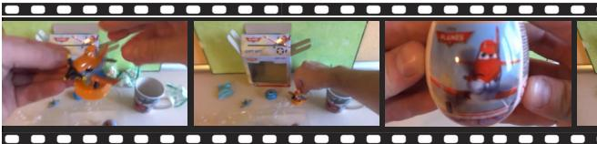

# 1. Bibliographic Information

*   **Title:** Fine-Grained Captioning of Long Videos through Scene Graph Consolidation
*   **Authors:** Sanghyeok Chu, Seonguk Seo, Bohyung Han. The authors are affiliated with Seoul National University, a leading institution for AI research in South Korea.
*   **Journal/Conference:** The paper is available as a preprint on arXiv. Preprints are research articles shared publicly before or during the peer-review process. The provided link points to a future publication date (February 2025), which is unusual but will be taken as the intended timeline for formal submission or publication.
*   **Publication Year:** 2025 (as indicated by the arXiv identifier).
*   **Abstract:** The paper addresses the challenge of generating coherent and detailed captions for long videos, a task where existing vision-language models (VLMs) fall short due to their limited temporal receptive fields. The authors propose a novel, computationally efficient framework that does not require supervised fine-tuning. Their method first uses an off-the-shelf VLM to generate captions for short video segments. These captions are then converted into structured `scene graphs`. The core innovation is a `graph consolidation` algorithm that merges these individual graphs into a single, unified graph representing the entire video. Finally, a lightweight `graph-to-text` decoder generates the final, comprehensive caption. The authors report that their method significantly outperforms existing Large Language Model (LLM)-based consolidation techniques in zero-shot settings while being much more computationally efficient.
*   **Original Source Link:**
    *   **arXiv Page:** [https://arxiv.org/abs/2502.16427](https://arxiv.org/abs/2502.16427)
    *   **PDF Link:** [https://arxiv.org/pdf/2502.16427v2.pdf](https://arxiv.org/pdf/2502.16427v2.pdf)
    *   **Status:** Preprint.

# 2. Executive Summary

*   **Background & Motivation (Why):** While modern AI can generate impressive descriptions for images and short videos, its ability to understand and summarize long videos (e.g., several minutes) is still limited. The primary reason is that most models can only process a small "window" of video at a time. Existing solutions to this problem are not ideal:
    1.  **Supervised Fine-tuning:** Training models on large, annotated long-video datasets is expensive, and such datasets are scarce. This approach also limits the model's ability to generalize to new types of videos.
    2.  **LLM-based Summarization:** Using powerful LLMs to summarize captions from video segments is a flexible zero-shot approach, but it is computationally very expensive and can sometimes "hallucinate" or miss fine-grained details.
    
        This paper aims to bridge this gap by creating a method that is both **zero-shot** (no fine-tuning on target datasets) and **computationally efficient**.

*   **Main Contributions / Findings (What):**
    1.  **A Novel Framework for Long Video Captioning:** The paper introduces a new pipeline, named `SGVC` (Scene Graph Video Captioning), which uses `scene graphs` as a structured intermediate representation to aggregate information over time.
    2.  **Graph Consolidation Algorithm:** The core technical innovation is an algorithm that can intelligently merge multiple scene graphs from different video segments into one cohesive graph, preserving key objects, their attributes, and relationships across the entire video.
    3.  **Strong Zero-Shot Performance with High Efficiency:** The proposed method is shown to outperform state-of-the-art LLM-based approaches on standard video captioning benchmarks, all while requiring significantly fewer computational resources (GPU memory and inference time).

# 3. Prerequisite Knowledge & Related Work

*   **Foundational Concepts:**
    *   **Vision-Language Models (VLMs):** These are AI models trained to understand connections between visual data (images, videos) and text. They can perform tasks like generating a caption for an image (`image captioning`) or answering questions about a video (`visual question answering`). Examples include BLIP and Flamingo.
    *   **Large Language Models (LLMs):** These are massive neural networks trained on vast amounts of text data, making them exceptionally good at understanding, generating, and reasoning with human language. Examples include GPT-4 and Mistral.
    *   **Scene Graph:** A scene graph is a structured data format that represents the contents of an image or scene. It consists of **nodes** (representing objects, e.g., "man," "ball") and **edges** (representing the relationships between them, e.g., "kicking"). Nodes can also have **attributes** (e.g., "man" has attribute "wearing red shirt"). This provides a more detailed and organized summary than a simple text sentence.
    *   **Zero-Shot Learning:** A challenging scenario in machine learning where a model is expected to perform a task without having seen any examples of that specific task during its training. For example, captioning a long video without ever being trained on a dataset of long videos and their corresponding captions.

*   **Previous Works:**
    *   **Supervised Video Captioning:** Early and powerful methods were trained on large datasets of video-caption pairs. While effective, they are data-hungry and struggle to generalize to video types not seen during training.
    *   **Zero-Shot Video Captioning:** To overcome the need for paired data, some methods use pre-trained models like CLIP to guide a language model to generate relevant text at inference time (`ZeroCap`, `MAGIC`) or train decoders on text-only data (`DeCap`). However, these methods often produce generic captions and struggle with complex, long videos.
    *   **Zero-Shot Long Video Captioning:** This is the most relevant area.
        *   *Recursive/Memory-based Methods:* These approaches process a video segment by segment, maintaining a "memory" of what has been seen. However, they typically require supervised fine-tuning on the target dataset, which violates the zero-shot principle.
        *   *LLM-based Consolidation:* Methods like `VidIL` and `Video ChatCaptioner` feed text descriptions from multiple video segments into an LLM and ask it to write a summary. `VidIL` creates complex prompts with objects, events, and frame captions. `Video ChatCaptioner` uses an interactive chat format where an LLM queries a VLM about different frames. While powerful, these methods are slow and computationally demanding.

*   **Differentiation:** The proposed `SGVC` method distinguishes itself by:
    1.  **Using a Structured Intermediate Representation:** Instead of feeding a long string of unstructured text captions to an LLM, `SGVC` converts captions into scene graphs. This structured format helps to explicitly track objects and their relationships over time, reducing information loss and hallucination.
    2.  **Employing a Lightweight Decoder:** Rather than relying on a massive, general-purpose LLM (with billions of parameters) for the final text generation, `SGVC` uses a much smaller, specialized `graph-to-text` model. This is the key to its computational efficiency.

# 4. Methodology (Core Technology & Implementation)

The `SGVC` framework is a four-stage pipeline, elegantly illustrated in Figure 1 of the paper.

**1. Generating Segment-Level Captions:**
*   The long input video is first divided into multiple temporal segments (e.g., by uniformly sampling frames or short clips).
*   An off-the-shelf VLM (the paper experiments with `BLIP`, `BLIP2`, and `InternVL2.5`) is used to generate a text caption for each segment. This step leverages the power of existing pre-trained models without needing to retrain them.

**2. Parsing Captions into Scene Graphs:**
*   Each text caption is then processed by a textual scene graph parser. The paper uses the `FACTUAL-MR` parser.
*   This parser converts a sentence like *"An elderly woman is cooking in a kitchen"* into a structured graph with nodes for "woman" (attribute: "elderly") and "kitchen," connected by an edge labeled "is cooking in."
*   Formally, a scene graph is $G = (\mathcal{O}, \mathcal{E})$, where $\mathcal{O}$ is the set of objects and $\mathcal{E}$ is the set of relationships (edges). An object $o_i$ has a class $c_i$ and attributes $\mathcal{A}_i$.

**3. Scene Graph Consolidation:**
This is the core contribution of the paper. The goal is to merge all the individual segment-level graphs into a single, comprehensive video-level graph. The process is detailed in Algorithm 1.

*   **Merging Two Scene Graphs:**
    *   Given two graphs, $G^s$ and $G^t$, the first step is to find which objects in $G^s$ correspond to which objects in $G^t$.
    *   This is framed as an optimal matching problem solved using the **Hungarian algorithm**. The matching score between objects is their cosine similarity in an embedding space produced by a graph encoder $\phi(\cdot)$.
    *   The formula for finding the optimal permutation $\pi^*$ that maximizes the sum of similarities is:
        $$
        \pi ^ { * } = \operatorname * { a r g m a x } _ { \pi \in \Pi } \sum _ { i } { \frac { \psi _ { i } ( \phi ( G ^ { s } ) ) } { \| \psi _ { i } ( \phi ( G ^ { s } ) ) \| } } \cdot { \frac { \psi _ { i } ( \phi ( G _ { \pi } ^ { t } ) ) } { \| \psi _ { i } ( \phi ( G _ { \pi } ^ { t } ) ) \| } }
        $$
        *   **Symbol Explanation:**
            *   $\pi^*$: The optimal matching (permutation) of objects.
            *   $\Pi$: The set of all possible permutations.
            *   $\phi(\cdot)$: A graph encoder that converts a graph into embeddings.
            *   $\psi_i(\cdot)$: A function that extracts the embedding for the $i$-th object from the encoded graph.
            *   $G^s, G^t$: The source and target scene graphs being merged.
            *   $G_\pi^t$: The target graph with its objects reordered according to permutation $\pi$.
            *   The formula essentially finds the object mapping that results in the highest total cosine similarity between corresponding object embeddings.
    *   A match is considered **valid** only if its similarity score is above a threshold $\tau$.
    *   For each valid pair of matched objects, they are merged into a single new object. The attributes of the merged object are the union of the attributes from the original two objects (e.g., if "woman" in frame 1 and "woman with glasses" in frame 2 are matched, the merged object is "woman with glasses").
*   **Iterative Consolidation:** The merging process is repeated. In each step, the two most similar graphs from the current set of graphs are merged. This continues until only one unified graph remains.
*   **Prioritized Subgraph Extraction:** For generating more concise captions, the authors propose an optional step. They track how many times each object node has been part of a merge. Nodes that appear and are merged frequently are considered more important. By selecting the top-$k$ most frequently merged nodes and their connected subgraphs, they can create a more focused scene graph that highlights the key entities in the video.

**4. Video Caption Generation:**
*   **Graph-to-Text Model:**
    *   The final consolidated scene graph is fed into a `graph-to-text` model to generate the final human-readable caption.
    *   This model uses a transformer architecture, with a graph encoder and a text decoder. The authors use `BERT-base` for the encoder and the decoder from `T5-base`, resulting in a relatively lightweight model (235M parameters).
    *   A key detail is that the encoder's attention mechanism is masked to respect the graph's structure. This means a node can only directly "attend" to its neighbors in the graph, enforcing the relational structure.
*   **Training:**
    *   The model is trained on a large dataset of ~2.5 million graph-text pairs, created by parsing captions from existing public datasets (like MS-COCO, Visual Genome) and model-generated captions for videos from Kinetics-400.
    *   The training objective is a standard language modeling loss, where the model learns to predict the next word of a caption given the input graph and the previously generated words.
        $$
        \mathcal { L } ( \theta ) = \sum _ { i = 1 } ^ { N } \log P _ { \theta } ( t _ { i } \mid t _ { 1 : i - 1 } , G )
        $$
        *   **Symbol Explanation:**
            *   $\mathcal{L}(\theta)$: The training loss for model parameters $\theta$.
            *   $t_i$: The $i$-th token (word) in the ground-truth caption.
            *   $N$: The total number of tokens in the caption.
            *   $G$: The input scene graph.
    *   Crucially, this training uses **no data from the target test datasets**, making the final evaluation a true zero-shot test.

# 5. Experimental Setup

*   **Datasets:**
    *   **Video Captioning:**
        *   `MSR-VTT`: Contains ~10k YouTube video clips, each about 10-30 seconds long, with 20 human-written captions per video.
        *   `MSVD`: Contains ~2k video clips of similar length, also with multiple captions each.
    *   **Video Paragraph Captioning:**
        *   `ActivityNet Captions`: A more challenging dataset with longer videos (averaging ~2 minutes). The task is to generate a detailed paragraph describing the sequence of events. The evaluation is on the `ae-val` set.
*   **Evaluation Metrics:**
    *   **BLEU-4 (B@4):**
        *   **Conceptual Definition:** Measures the precision of n-grams (sequences of n words) in the generated caption compared to a set of reference captions. A higher score means more overlapping phrases. `BLEU-4` specifically looks at 1, 2, 3, and 4-word phrases.
        *   **Formula:** $ \mathrm{BLEU} = \mathrm{BP} \cdot \exp\left(\sum_{n=1}^{N} w_n \log p_n\right) $
        *   **Symbol Explanation:** $\mathrm{BP}$ is a brevity penalty to penalize captions that are too short. $p_n$ is the modified n-gram precision. $w_n$ are weights, typically uniform ($1/N$). $N$ is usually 4.
    *   **METEOR:**
        *   **Conceptual Definition:** An improvement over BLEU that considers synonyms and stemming (matching "run" with "running"). It computes a score based on an alignment between the generated and reference captions. It balances precision and recall.
        *   **Formula:** $\text{METEOR} = (1 - \text{Penalty}) \cdot \frac{10 \cdot P \cdot R}{R + 9 \cdot P}$
        *   **Symbol Explanation:** $P$ is precision, $R$ is recall of unigram matches. The `Penalty` term is based on the "chunkiness" of the matches, penalizing fragmented matches.
    *   **CIDEr:**
        *   **Conceptual Definition:** Measures how similar a generated caption is to the consensus of a set of human-written captions. It gives more weight to n-grams that are important and descriptive (using tf-idf weighting). It is considered to correlate well with human judgment.
        *   **Formula:** $\text{CIDEr}_n(c_i, S_i) = \frac{1}{m} \sum_j \frac{g^n(c_i) \cdot g^n(s_{ij})}{\|g^n(c_i)\| \|g^n(s_{ij})\|}$
        *   **Symbol Explanation:** For a candidate caption $c_i$ and reference set $S_i$ with $m$ captions $s_{ij}$, it computes the average cosine similarity between their tf-idf weighted n-gram vectors $g^n(\cdot)$.
    *   **BERTScore:**
        *   **Conceptual Definition:** Measures semantic similarity instead of exact word matches. It uses contextual embeddings from a BERT model to compute the cosine similarity between tokens in the generated and reference captions. It provides scores for Precision (`P_BERT`), Recall (`R_BERT`), and F1-score (`F_BERT`).
        *   **Formulas:**
            $$ P _ { \mathrm { B E R T } } = \displaystyle \frac { 1 } { | \hat { \mathcal Z } | } \sum _ { \hat { z } _ { j } \in \hat { \mathcal Z } } \operatorname* { m a x } _ { z_i \in \mathcal Z } z _ { i } ^ { \top } \hat { z } _ { j } $$
            $$ R _ { \mathrm { B E R T } } = \displaystyle \frac { 1 } { | \mathcal Z | } \sum _ { z _ { i } \in \mathcal Z } \operatorname* { m a x } _ { \hat{z}_j \in \hat { \mathcal Z } } z _ { i } ^ { \top } \hat { z } _ { j } $$
            $$ F _ { \mathrm { B E R T } } = \displaystyle \frac { 2 \cdot P _ { \mathrm { B E R T } } \cdot R _ { \mathrm { B E R T } } } { P _ { \mathrm { B E R T } } + R _ { \mathrm { B E R T } } } $$
        *   **Symbol Explanation:** $\mathcal{Z}$ and $\hat{\mathcal{Z}}$ are the sets of token embeddings from the reference and generated captions, respectively. `P_BERT` finds for each token in the generated text its best match in the reference text, while `R_BERT` does the reverse.
*   **Baselines:**
    *   **LLM Summarization:** The most direct comparison. The same segment-level captions used by `SGVC` are fed directly to an LLM (`Mistral-7B` or `GPT-4o mini`) with a prompt asking it to summarize them into a single video caption.
    *   **LLM-based Video Understanding Methods:** `VidIL` and `Video ChatCaptioner`, which represent the state-of-the-art in zero-shot long video understanding using LLMs.

# 6. Results & Analysis

*   **Core Results:** The results consistently show that `SGVC` is superior to the baselines.

    **Zero-Shot Video Captioning (MSR-VTT & MSVD)**

    *   **Table 1: SGVC vs. Other LLM Methods:**
        This table is a transcription of the data from the paper.

        <table>
        <tr>
        <td>Dataset</td>
        <td>Method</td>
        <td>Backbone VLM</td>
        <td>B@4</td>
        <td>METEOR</td>
        <td>CIDEr</td>
        <td>PBERT</td>
        <td>RBERT</td>
        <td>FBERT</td>
        </tr>
        <tr>
        <td rowspan="4">MSR-VTT</td>
        <td>VidIL (Wang et al., 2022b)</td>
        <td rowspan="2">BLIP+CLIP</td>
        <td>3.2</td>
        <td>14.8</td>
        <td>3.1</td>
        <td>0.134</td>
        <td>0.354</td>
        <td>0.225</td>
        </tr>
        <tr>
        <td>VidIL† (Wang et al., 2022b)</td>
        <td>13.6</td>
        <td>20.0</td>
        <td>20.2</td>
        <td>0.461</td>
        <td>0.552</td>
        <td>0.490</td>
        </tr>
        <tr>
        <td>Video ChatCaptioner (Chen et al., 2023)</td>
        <td>BLIP2</td>
        <td>13.2</td>
        <td>22.0</td>
        <td>16.5</td>
        <td>0.396</td>
        <td>0.510</td>
        <td>0.436</td>
        </tr>
        <tr>
        <td>SGVC (Ours)</td>
        <td>BLIP / BLIP2</td>
        <td><b>17.7</b> / <b>18.4</b></td>
        <td><b>22.5</b> / <b>23.1</b></td>
        <td><b>24.0</b> / <b>26.1</b></td>
        <td><b>0.476</b> / 0.467</td>
        <td>0.539 / 0.542</td>
        <td><b>0.490</b> / 0.487</td>
        </tr>
        <tr>
        <td rowspan="5">MSVD</td>
        <td rowspan="2">VidIL (Wang et al., 2022b)</td>
        <td rowspan="2">BLIP+CLIP</td>
        <td>2.5</td>
        <td>16.5</td>
        <td>2.3</td>
        <td>0.124</td>
        <td>0.404</td>
        <td>0.238</td>
        </tr>
        <tr>
        <td>30.7</td>
        <td>32.0</td>
        <td>60.3</td>
        <td>0.656</td>
        <td>0.726</td>
        <td>0.674</td>
        </tr>
        <tr>
        <td>Video ChatCaptioner (Chen et al., 2023)</td>
        <td rowspan="2">BLIP2</td>
        <td>22.7</td>
        <td>31.8</td>
        <td>35.8</td>
        <td>0.496</td>
        <td>0.651</td>
        <td>0.550</td>
        </tr>
        <tr>
        <td rowspan="2">SGVC (Ours)</td>
        <td>22.6 / <b>25.3</b></td>
        <td>30.2 / 32.0</td>
        <td>50.2 / 53.3</td>
        <td>0.575 / 0.571</td>
        <td>0.646 / 0.669</td>
        <td>0.589 / <b>0.597</b></td>
        </tr>
        </table>

        *(Note: The `†` indicates a few-shot setting for VidIL, which uses examples from the training set, making it not truly zero-shot. `SGVC` outperforms even this stronger baseline on MSR-VTT.)*
        **Analysis:** `SGVC` consistently outperforms `VidIL` (in zero-shot) and `Video ChatCaptioner` across almost all metrics, especially the `CIDEr` score, which correlates well with human judgment. This indicates `SGVC`'s captions are more semantically relevant and human-like.

    *   **Table 2: SGVC vs. LLM Summarization:**
        This table is a transcription of the data from the paper.

        <table>
        <tr>
        <td>Dataset</td>
        <td>Method</td>
        <td>Backbone VLM</td>
        <td>B@4</td>
        <td>METEOR</td>
        <td>CIDEr</td>
        <td>PBERT</td>
        <td>RBERT</td>
        <td>FBERT</td>
        </tr>
        <tr>
        <td rowspan="2">MSR-VTT</td>
        <td>Summarization w/ Mistral-7B</td>
        <td>BLIP / BLIP2</td>
        <td>9.6 / 11.5</td>
        <td>21.6 / 23.1</td>
        <td>10.8 / 15.4</td>
        <td>0.313 / 0.308</td>
        <td>0.516 / 0.528</td>
        <td>0.395 / 0.397</td>
        </tr>
        <tr>
        <td>SGVC (Ours)</td>
        <td>BLIP / BLIP2</td>
        <td><b>17.7</b> / <b>18.4</b></td>
        <td>22.5 / 23.1</td>
        <td><b>24.0</b> / <b>26.1</b></td>
        <td><b>0.476</b> / <b>0.467</b></td>
        <td><b>0.539</b> / <b>0.542</b></td>
        <td><b>0.490</b> / <b>0.487</b></td>
        </tr>
        <tr>
        <td rowspan="2">MSVD</td>
        <td>Summarization w/ Mistral-7B</td>
        <td>BLIP / BLIP2</td>
        <td>15.2 / 22.5</td>
        <td>28.3 / 31.9</td>
        <td>30.3 / 41.6</td>
        <td>0.477 / 0.500</td>
        <td>0.623 / 0.664</td>
        <td>0.527 / 0.558</td>
        </tr>
        <tr>
        <td>SGVC (Ours)</td>
        <td>BLIP / BLIP2</td>
        <td><b>22.6</b> / <b>25.3</b></td>
        <td><b>30.2</b> / 32.0</td>
        <td><b>50.2</b> / <b>53.3</b></td>
        <td><b>0.575</b> / <b>0.571</b></td>
        <td><b>0.646</b> / <b>0.669</b></td>
        <td><b>0.589</b> / <b>0.597</b></td>
        </tr>
        </table>

        **Analysis:** This is a crucial comparison because both methods start with the exact same segment-level captions. `SGVC`'s massive lead (e.g., `CIDEr` of 26.1 vs. 15.4 on MSR-VTT) proves that consolidating information via structured scene graphs is far more effective than simply asking an LLM to summarize unstructured text.

    **Zero-Shot Video Paragraph Captioning (ActivityNet)**
    *   Tables 3 and 4 show similar trends on the more challenging `ActivityNet Captions` dataset. `SGVC` again outperforms all baselines, including summarization with the powerful `GPT-4o mini`. The use of a video-centric backbone VLM (`InternVL2.5`) further boosts `SGVC`'s performance, demonstrating its modularity.

*   **Efficiency Analysis (Table 5):**
    This table is a transcription of the data from the paper.

    <table>
    <tr>
    <td>Method</td>
    <td>VLM Backbone</td>
    <td>Params. (B)</td>
    <td>GPU (GB)</td>
    <td>Time (s)</td>
    <td>CIDEr</td>
    <td>Using reference</td>
    <td>Using GPT API</td>
    </tr>
    <tr>
    <td>VidIL†</td>
    <td>BLIP+CLIP</td>
    <td>0.67</td>
    <td>3.57</td>
    <td>1.32</td>
    <td>20.2</td>
    <td>✓</td>
    <td>✓</td>
    </tr>
    <tr>
    <td>Video ChatCaptioner</td>
    <td>BLIP2</td>
    <td>3.75</td>
    <td>14.53</td>
    <td>3.65</td>
    <td>16.5</td>
    <td>-</td>
    <td>✓</td>
    </tr>
    <tr>
    <td rowspan="2">Summarization w/ Mistral-7B</td>
    <td>BLIP</td>
    <td>7.50</td>
    <td>14.50</td>
    <td>1.27</td>
    <td>10.8</td>
    <td>-</td>
    <td>-</td>
    </tr>
    <tr>
    <td>BLIP2</td>
    <td>11.00</td>
    <td>28.20</td>
    <td>1.51</td>
    <td>15.4</td>
    <td>-</td>
    <td>-</td>
    </tr>
    <tr>
    <td rowspan="2">SGVC (Ours)</td>
    <td>BLIP</td>
    <td><b>0.74</b></td>
    <td><b>5.07</b></td>
    <td><b>1.14</b></td>
    <td><b>24.0</b></td>
    <td>-</td>
    <td>-</td>
    </tr>
    <tr>
    <td>BLIP2</td>
    <td>4.24</td>
    <td>18.40</td>
    <td>1.37</td>
    <td><b>26.1</b></td>
    <td>-</td>
    <td>-</td>
    </tr>
    </table>

    **Analysis:** The `SGVC` (Ours) with a `BLIP` backbone is remarkably efficient. It uses only 0.74B parameters and 5.07 GB of GPU memory, making it far lighter than LLM summarization, yet it achieves the second-highest `CIDEr` score. Even when paired with the larger `BLIP2` backbone for the best performance, it is still more efficient than the `Mistral-7B` summarization approach with the same backbone. This confirms the paper's claim of achieving high performance at a substantially lower computational cost.

*   **Ablations / Parameter Sensitivity:**
    *   **Impact of k (Table 6):** Analyzing the `prioritized subgraph extraction` parameter $k$ shows a trade-off. A smaller $k=1$ (focusing on the most central object) yields higher precision (`CIDEr`, `P_BERT`), while a larger $k=3$ (including more context) yields higher recall (`METEOR`, `R_BERT`). This is an intuitive and useful finding for tuning the output's level of detail.
    *   **Impact of τ (Table 7):** The model's performance is stable for the object matching similarity threshold $\tau$ in the range [0.80, 0.95], indicating that the method is not overly sensitive to this hyperparameter.

*   **Qualitative Results:**
    Figures 2 and 3 in the paper show visual examples.
    
    
    *该图像是视频帧的连续截图组，展示了手持玩具模型的不同视角和动作，反映了视频片段层面的动态场景变化。*
    
    In the example of the man opening a toy egg (top left), the ground truth is "A man opening a toy egg set."
    *   `LLM summ.` mentions a "toy box" and "toy airplane."
    *   `Video ChatCaptioner` hallucinates a "toy car" and "cup of water."
    *   `Ours` (SGVC) correctly identifies the "toy airplane" and "box," producing a coherent and accurate description: "A hand holding a toy airplane in front of a box with a surprised expression."
    
        In another example of runners on a track (top right), `SGVC`'s caption "A group of runners crouching down a line on a track competing in a race" is more detailed and accurate than the competitors' outputs. These examples visually confirm that the structured consolidation of `SGVC` helps it stay grounded in the video's content and avoid the factual errors that plague other methods.

# 7. Conclusion & Reflections

*   **Conclusion Summary:** The paper successfully introduces `SGVC`, a novel and effective framework for generating fine-grained captions for long videos. By converting segment-level captions into scene graphs and consolidating them into a unified representation, the method aggregates temporal information in a structured and robust way. This approach is not only more accurate than existing LLM-based summarization techniques but also significantly more computationally efficient, all while operating in a zero-shot setting.

*   **Limitations & Future Work:**
    *   **Error Propagation:** The pipeline is sequential. An error made by the initial VLM captioner or the scene graph parser will be passed down and could negatively impact the final output. The quality of the entire system is capped by the quality of its weakest component.
    *   **Parser Dependency:** The method relies heavily on a textual scene graph parser. The expressiveness and accuracy of the consolidated graph are limited by what the parser can extract from text.
    *   **Future Work (from paper):** The authors suggest that the CPU-based graph merging algorithm could be accelerated with a GPU implementation for even faster inference.

*   **Personal Insights & Critique:**
    *   **Novelty and Significance:** The core idea of using scene graphs as a "structured memory" for long-term video understanding is highly innovative. It provides a compelling alternative to simply concatenating text or using black-box memory mechanisms. This work highlights a promising direction for building more reliable and interpretable long-form video models.
    *   **Strengths:** The framework's **modularity** is a major advantage. One can easily swap in a better VLM captioner or a more advanced scene graph parser as they become available, continuously improving the system's performance. Its **efficiency** and **zero-shot** nature make it highly practical for real-world applications where fine-tuning for every new domain is infeasible.
    *   **Potential Improvements:** The current object matching is based on text embeddings. Integrating visual features directly into the graph consolidation process could make the object matching more robust, especially in cases where text descriptions are ambiguous. For example, if the caption says "a person," visual features could help distinguish between different people across frames.
    *   **Broader Impact:** This research could significantly advance applications in video search, summarization, and accessibility. By generating detailed, accurate descriptions of long videos, it can help users quickly understand video content without watching it in its entirety and enable new ways for visually impaired users to access video information.