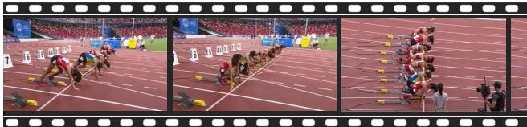
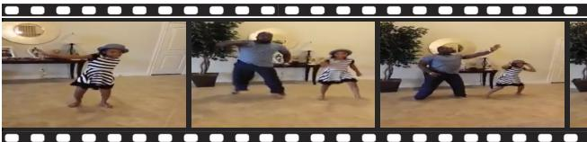
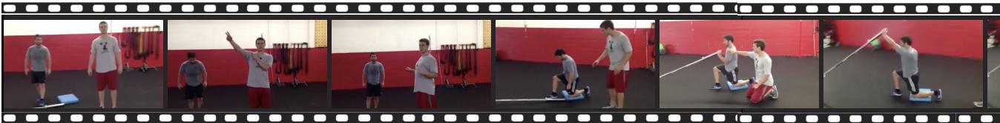

# 通过场景图整合对长视频进行细致标注

崔相赫 1 曹星旭† 1 韩博英 1 2

# 摘要

最近在视觉语言模型方面的进展使得图像和短视频片段的标题生成取得了显著进展。然而，这些模型仍然受到有限时间感受野的限制，难以为长视频生成连贯且全面的标题。虽然已经提出了几种方法来聚合跨视频段的信息，但它们往往依赖于监督微调或导致显著的计算开销。为了解决这些挑战，我们引入了一种基于图合并的长视频标题生成新框架。我们的方法首先使用现成的视觉标题生成模型生成与单独帧或短视频间隔对应的段级标题。然后将这些标题解析为单独的场景图，随后将其合并为一个统一的图表示，保留了整个视频的整体上下文和细粒度细节。一个轻量级的图到文本解码器随后生成最终的视频级标题。该框架有效地扩展了现有模型的时间理解能力，而无需在长视频数据集上进行任何额外的微调。实验结果表明，我们的方法显著优于现有的基于LLM的合并方法，取得了强大的零样本性能，同时大幅降低了计算成本。

# 1. 介绍

视觉-语言模型（VLMs）在各种视觉-语言任务中展现了令人印象深刻的能力，包括视觉问答、视觉对话、跨模态检索和时空理解（Alayrac et al., 2022；Dai et al., 2023；OpenAI, 2023；Chen et al., 2024b；Huang et al., 2024；Zhang et al., 2025；Xu et al., 2024；Maaz et al., 2024）。值得注意的是，在为图像和短视频片段生成字幕方面取得了显著进展（Liu et al., 2024；Chai et al., 2025；Zhao et al., 2024；Wang et al., 2024；Chen et al., 2024a；Mun et al., 2019）。

然而，为长视频生成字幕仍然是一项重大挑战。大多数现有模型是为短期视觉输入设计的，例如图像或短视频剪辑，缺乏对整个长视频进行整体编码的有效支持。因此，对超出模型时间窗口的视频进行字幕处理通常需要处理和整合来自多个时间段的信息。有几种方法被提出以整合这些段落中的信息，如基于记忆的方法（Zhou等，2024；Song等，2024；Balazevic等，2024）和递归框架（Zhou等，2024；Islam等，2024；Qian等，2024；Weng等，2024；Kahatapitiya等，2024）。然而，这些方法通常依赖于目标数据集的监督微调，这限制了它们对未见视频领域的适应性。最近，大型语言模型（LLMs）被用来生成跨多个视频片段的文本摘要（Wang等，2022b；Chen等，2023；Zhang等，2024a）。尽管这些基于LLM的方法消除了需要调整现有模型以适应长视频的需求，但它们通常会带来较高的推理开销，并需要大量的计算资源。

为了应对这些局限性，我们提出了一种新颖的框架，通过基于图的整合将段级字幕整合成统一的全局描述。我们首先使用现成的字幕算法获得段级字幕——每个字幕对应于单帧或短视频片段，具体取决于所选的视觉字幕模型。随后，每个字幕被解析成场景图，这些图被整合成一个统一的结构，捕捉整个视频的全面语义。最后，一个轻量级的图到文本解码器，仅在外部文本语料库上进行训练，将整合后的图转换为连贯的全局字幕。

所提议的方法增强了对长时间序列信息的理解和处理，而无需在长视频数据集上进行架构更改或微调。

特别是，我们的框架可以与任何现成的视觉语言模型（VLM）配对，有效地扩展其标题生成能力，超越模型固有的时间约束。与其他基于大型语言模型（LLM）的整合方法不同，它通过采用轻量级的图到文本解码器来最小化计算开销，显著减少了参数数量。我们的实验结果表明，我们的方法在零样本视频标题生成和零样本视频段落标题生成方面都表现出更优的性能，证明了其有效性和效率。

总之，我们的主要贡献组织如下：

• 我们提出了一种新颖的方法，通过跨多个时间段的信息生成长视频的细粒度字幕。 
• 我们引入了一种图形整合算法，将段级场景图合并为统一表示，捕捉整个视频的整体上下文和细粒度细节。 我们的方法在零-shot字幕生成性能上表现出色，与基于LLM的方法相比，计算成本显著降低。

# 2. 相关工作

视频字幕生成 最近在视频字幕生成方面的进展主要依赖于使用大规模数据集进行监督训练，在各类基准测试中取得了令人印象深刻的结果（Lei et al., 2021; Wang et al., 2022a; Yan et al., 2022; Liu et al., 2024; Zhao et al., 2024; Wang et al., 2024; Chen et al., 2024a）。然而，将这些监督方法扩展到更长的视频仍然面临挑战，主要是由于覆盖广泛时间上下文的注释数据稀缺，以及建模远程依赖关系所涉及的计算复杂性。虽然已经提出了各种方法来应对这些挑战，但针对特定目标数据集进行监督微调的需求限制了可扩展性和对未见视频领域的泛化能力（Yang et al., 2023; Islam et al., 2024; Song et al., 2024; Balazevic et al., 2024; Qian et al., 2024; Weng et al., 2024; Kahatapitiya et al., 2024）。

零-shot视频描述研究人员探索了在不使用配对视频文本注释的情况下进行视频描述的方法。一种方法涉及仅在测试时优化语言模型输出。ZeroCap (Tewel et al., 2022) 和相关方法 (Tewel et al., 2023) 使用由CLIP (Radford et al., 2021) 计算的图像文本对齐分数在梯度更新中调整语言模型特征，而MAGIC (Su et al., 2022) 则采用CLIP引导的解码策略以确保语义相关性。尽管最初是为图像开发的，这些方法通过将帧级特征聚合成一个单一表示来扩展到视频。另一种方法通常被称为零-shot，涉及仅使用文本进行训练，且没有配对的视频文本注释，此时文本解码器与图像文本对齐编码器如CLIP和ImageBind (Girdhar et al., 2023) 一起使用。方法如DeCap (Li et al., 2023b) 和 $C ^ { 3 }$ (Zhang et al., 2024b) 通过在共享嵌入空间中对齐视觉和文本特征来生成描述。然而，这些方法常常无法生成准确和连贯的描述，尤其是在应用于复杂事件的视频时。

无监督长视频字幕生成 在零-shot设置下为长上下文视频生成连贯且全面的字幕通常依赖于从多个时间段整合的信息。现有的整合技术，包括基于记忆的方法（Zhou et al., 2024; Song et al., 2024; Balazevic et al., 2024）和递归方法（Islam et al., 2024; Qian et al., 2024; Weng et al., 2024; Kahatapitiya et al., 2024），需要在目标数据集上进行监督微调，这限制了它们在零-shot场景中的适用性。最近，大型语言模型（LLMs）作为零-shot整合的有希望的工具而出现，利用其一般推理能力而不需要特定任务的微调。例如，VidIL（Wang et al., 2022b）通过整合来自图像-语言模型的多层次文本信息构建提示，包括对象、事件、属性、帧字幕和字幕。由于这些提示的复杂性，它还结合了来自训练数据集的示例，以指导LLMs解释和利用这些文本线索进行视频字幕生成。同样，Video ChatCaptioner（Chen et al., 2023）采用了一种交互框架，其中LLM查询图像VLM以获取单帧的字幕，并将其汇总生成视频字幕。虽然这些基于LLM的方法功能强大且灵活，但它们通常会产生高计算成本。

# 3. 视频场景图构建

为了实现长视频的有效字幕处理，我们提出了一种新颖的框架，该框架构建并整合从段级字幕中衍生的场景图，如图1所示。该框架包括四个主要阶段：(1) 使用视觉语言模型（VLMs）生成单个视频段的字幕，(2) 将这些字幕转化为场景图，(3) 将所有段的场景图合并为一个统一的图，(4) 从整合后的图中生成综合描述。通过汇聚各段的信息，所提方法生成的字幕更加连贯且具有上下文信息，捕捉视频中的细致细节。在本文中，我们使用“段”一词来表示视频的时间单位——可以是单帧或短时间间隔——具体取决于所使用的视觉语言模型的特性。

  
scene graph is transformed into an input for the graph-to-text model to generate a caption.

# 3.1. 生成段落级别的标题

给定一个输入视频，我们首先将其分为一系列时间段。然后，我们使用现成的 VLM 生成分段级别的字幕，使用提示引导模型生成适合场景图构建的描述性句子。虽然我们主要利用开源 VLM 作为我们的字幕生成基础，但我们的框架足够灵活，可以纳入任何 VLM，包括专有或闭源模型，只要可以访问 API。

# 3.2. 将标题解析为场景图

场景图 $G = ( { \mathcal { O } } , { \mathcal { E } } )$ 被定义为一个对象集合 $\mathcal { O } = \{ o _ { 1 } , o _ { 2 } , . . . \}$，以及对象之间的边集合 $\mathcal { E }$。每个对象 $o _ { i } = \left( c _ { i } , \mathcal { A } _ { i } \right)$ 由一个对象类别 $c _ { i } \in \mathcal { C }$ 和它的属性集 $\mathcal { A } _ { i } \subseteq \mathcal { A }$ 组成，其中 $\mathcal { C }$ 是对象类别的集合，$\mathcal { A }$ 是所有可能属性的集合。一个有向边 $e _ { i , j } \equiv ( o _ { i } , o _ { j } ) \in \mathcal { E }$ 具有标签 $r _ { i , j } \in \mathcal { R }$，指定从一个对象到另一个对象的关系。所有对象类别、属性和关系标签都用文本字符串表示。

我们将每个片段生成的标题转换为场景图，从而提供对每个片段更结构化的理解。通过文本场景图解析器将标题解析为场景图，而我们的实现中使用了FACTUAL-MR解析器（Li et al., 2023c）。该解析器首先将标题映射到一个中间语义表示，包括对象、属性和关系，然后确定性地将其转换为场景图。通过将每个片段表示为由对象及其关系组成的图，我们可以应用图合并技术来生成整个输入视频的整体表示。

# 3.3. 场景图整合

场景图整合步骤将所有个体结合在一起。

# 算法 1 场景图整合

1: 输入：  
2: ${ \mathcal { G } } = \{ G _ { 1 } , G _ { 2 } , \ldots , G _ { n } \}$ 场景图集合  
3: $\phi ( \cdot )$ : 一个图编码器  
4: EY $\psi _ { i } ( \cdot )$ : 返回图中第 $i ^ { \mathrm { { t h } } }$ 对象的函数  
5: $\pi$ : 一个排列函数  
6: $\tau$ : 一个阈值  
7: 输出：$G _ { \mathrm { v i d e o } }$ : 一个视频级场景图  
8: 当 $| \mathcal { G } | > 1$ 时  
9: 从 $\mathcal { G }$ 中检索最相似的对 $\{ G ^ { s } , G ^ { t } \}$  
10: $G ^ { s } = ( \mathcal { O } ^ { s } , \mathcal { E } ^ { s } )$ $G ^ { t } = ( \mathcal { O } ^ { t } , \mathcal { E } ^ { t } )$  
11: $G ^ { m } = ( \mathcal { O } ^ { m } , \mathcal { E } ^ { m } ) \gets ( \mathcal { O } ^ { s } \cup \mathcal { O } ^ { t } , \mathcal { E } ^ { s } \cup \mathcal { E } ^ { t } )$ EPY  
12: EY $\pi ^ { * }  \arg \operatorname* { m a x } _ { \pi \in \Pi } \sum _ { i } { \frac { \diamond \diamond } { \| \psi _ { i } ( \phi ( G ^ { s } ) ) \| } } \cdot { \frac { \surd \hat { \psi _ { i } } ( \phi ( G _ { \pi } ^ { t } ) ) } { \| \psi _ { i } ( \phi ( G _ { \pi } ^ { t } ) ) \| } }$  
13: 对于 $( p , q ) \in { \mathcal { M } }$ 使得 $s _ { p , q } > \tau$ do  
14: 设置合并对象的类别标签，$\hat { c }$ EMP  
15: $\begin{array} { l } { \hat { o } _ { m }  ( \hat { c } , \mathcal { A } _ { p } ^ { s } \cup \mathcal { A } _ { q } ^ { t } ) } \\ { \mathcal { O } ^ { m }  \{ \hat { o } _ { m } \} \cup ( \mathcal { O } ^ { m } \setminus \{ o _ { p } ^ { s } , o _ { q } ^ { t } \} ) } \end{array}$  
16:  
17: 更新 $\mathcal { E } ^ { m } : e _ { m , * } \gets e _ { p , * }$ 和 $e _ { * , m } \gets e _ { * , q }$ EY  
18: 结束循环  
19: EY $\mathcal { G }  \{ G ^ { m } \} \cup ( \mathcal { G } \setminus \{ G ^ { s } , G ^ { t } \} )$  
20: 结束循环  
21: $G _ { \mathrm { v i d e o } }  \mathrm { e x t r a c t } ( \mathcal { G } )$  
22: 返回 Gvideo

从每个片段提取的场景图合并为一个统一的图，表示视频的整体视觉内容。我们首先描述我们的图合并程序，然后介绍一种子图提取技术，旨在支持更集中和连贯的视频字幕生成。

# 3.3.1. 合并两个场景图

我们首先描述我们的场景图合并技术。给定两个场景图，$G ^ { s } = ( \mathcal { O } ^ { s } , \mathcal { E } ^ { s } )$ 和 $G ^ { t } = ( \mathcal { O } ^ { t } , \mathcal { E } ^ { t } )$，它们是根据两个不同片段的字幕构建的，我们运行匈牙利算法以获得两个物体集合 $\mathcal { O } ^ { s }$ 和 $\mathcal { O } ^ { t }$ 之间的最优匹配，形式上表示为

$$
\pi ^ { * } = \operatorname * { a r g m a x } _ { \pi \in \Pi } \sum _ { i } { \frac { \psi _ { i } ( \phi ( G ^ { s } ) ) } { \| \psi _ { i } ( \phi ( G ^ { s } ) ) \| } } \cdot { \frac { \psi _ { i } ( \phi ( G _ { \pi } ^ { t } ) ) } { \| \psi _ { i } ( \phi ( G _ { \pi } ^ { t } ) ) \| } } ,
$$

这里 $\phi ( \cdot )$ 表示图编码器，$\psi _ { i } ( \cdot )$ 是一个从嵌入图中提取第 $i ^ { \mathrm { { t h } } }$ 个对象的函数，$\pi \in \Pi$ 表示图中对象的一个排列。注意，对象匹配是基于它们的余弦相似度，我们引入了虚拟对象来处理匹配时对象数量不同的情况。

在使用匈牙利算法计算所有匹配对后，我们通过选择相似度得分 $s _ { p , q }$ 超过预定义阈值 $\tau$ 的物体对 $( o _ { p } ^ { s } , o _ { q } ^ { t } )$ 来识别有效匹配集 $\mathcal { M }$。对于每个有效匹配 $( p , q ) \in { \mathcal { M } }$，合并对象 $\hat { o } _ { m } \in \hat { \mathcal { O } }$ 被定义为

$$
\hat { o } _ { m } = ( \hat { c } , \mathcal { A } _ { p } ^ { s } \cup \mathcal { A } _ { q } ^ { t } ) \in \hat { \mathcal { O } } ,
$$

其中 $\hat { c }$ 表示合并物体的类别标签，$\hat { \mathcal { O } $ 表示通过有效匹配获得的所有合并物体的集合。请注意，$\hat { c }$ 可能与 $O _ { p } ^ { s }$ 或 $O _ { q } ^ { t }$ 的原始类别标签不同。该过程生成一个新的合并场景图 $G ^ { \acute { m } } = ( \mathcal { O } ^ { m } , \mathcal { E } ^ { m } )$，它结合了每一对有效匹配的物体，创建了一个新物体。

我们通过根据嵌入相似性迭代选择和合并图形来执行图形合并。在每次迭代中，两个最相似的图被合并为一个单一的图，替代原始对在图形集合中的位置。这个过程不断重复，直到只剩下一个统一的场景图。最终的场景图提供了整个视频的全面表示，保留了来自各个片段的详细信息。算法1描述了我们图形合并策略的详细过程。

# 3.3.2. 优先子图提取

当需要简洁且集中的视频标题时，我们应用子图提取，只保留最相关的信息。在图合并过程中，我们跟踪每个节点的合并计数，作为其在合并图中的重要性衡量标准。然后，我们识别出合并计数最高的前 $k$ 个节点，并提取相应的子图。这种方法优先考虑在多个帧中持续出现的对象，因为它们通常代表场景中的关键实体。通过关注显著元素并过滤掉无关细节，我们的方法构建了一个紧凑的场景图，以便更专注于视频标题。

# 4. 视频字幕生成

我们的最终目标是从一个合并的场景图生成标题。为此，我们开发了一种图到文本的解码模型，该模型在图文本对数据集上进行训练。在推理时，该模型将表示整个视频的合并场景图作为输入，生成描述视频整体的标题。

# 4.1. 图到文本模型

我们的图到文本模型由基于变换器的图编码器和文本解码器组成。编码器处理输入场景图以生成图嵌入，这为解码器生成最终的标题提供条件。为了在我们的模型中反映图的拓扑结构，我们在图编码器中设计了一个注意力掩码，限制注意力传播到场景图中定义的边。

为了构建图编码器的输入标记，我们将与每个图组件相关的文本值转换为嵌入向量序列，例如对象类 $c _ { i }$、属性集 $A _ { i }$ 和边标签 $r _ { i , j }$（例如，“老人”、“女性”、“在厨房做饭”），此外，我们还附加了一个可学习的嵌入标记，该标记关注所有其他标记，从而使全局上下文的聚合成为可能，并促进整个图中的信息流动，包括断开节点之间的信息流动。

# 4.2. 训练

我们在大规模的图文对数据集上训练图到文本模型。为了构建这个数据集，我们从多个图像描述数据集中整理了大约250万个标题，包括MS-COCO（Chen et al., 2015）、Flickr30k（Young et al., 2014）、TextCaps（Sidorov et al., 2020）、Visual Genome（Krishna et al., 2017b）和Visual Genome段落标题（Krause et al., 2017），以覆盖广泛的视觉场景上下文。为了进一步丰富数据集，我们还结合了Kinetics-400（Kay et al., 2017）中生成的模型视频标题，使用LLaVANeXT-7B（Liu et al., 2024）对每个视频均匀采样的四帧进行处理。然后，使用文本场景图解析器将每个标题解析为场景图，从而生成用于训练的图文对。

使用图形-文本对，我们训练图到文本解码器，目标是通过下一个标记预测，生成基于输入场景图的真实标签，具体定义如下：

$$
\mathcal { L } ( \theta ) = \sum _ { i = 1 } ^ { N } \log P _ { \theta } ( t _ { i } \mid t _ { 1 : i - 1 } , G ) ,
$$

其中 $t _ { i }$ 表示源文本中的第 $i ^ { \mathrm { { t h } } }$ 个标记，$N$ 表示标记的总数。

# 5. 实验

本节通过对视频字幕和视频段落字幕数据集的性能评估和分析，展示所提方法的有效性。

# 5.1. 实验设置

我们提供关于目标任务的详细信息，包括它们的数据集和基线。我们还讨论了在评估中使用的一系列性能指标。

# 5.1.1. 目标任务和基准线

我们的评估包含两个零样本任务：(1) 视频描述，使用 MSR-VTT（Xu 等，2016）和 MSVD（Chen & Dolan，2011）的标准测试集；(2) 视频段落描述，使用 ActivityNet Captions（Krishna 等，2017a）的 ae-val 集，包含多个事件的较长视频。

我们主要将我们的方法与基于LLM的方法进行比较。具体而言，我们首先建立了一个LLM摘要基准，该基准直接对我们方法使用的相同一组段级标题进行摘要。这个基准提供了建议的场景图整合与LLM对段级标题简单聚合之间的直接比较。我们在所有数据集上使用开源的Mistral-7B-Instruct- $\mathbf { v } 0 . 3 ^ { 1 }$。对于ActivityNet Captions数据集，我们还额外使用了GPT-4o mini，这是一个更强大的专有模型。有关用于LLM摘要基准的提示指令的详细信息见附录B。

我们还将我们的方法与基于大型语言模型(LLM)的视频理解方法进行比较，例如VidIL（Wang et al., 2022b）和Video ChatCaptioner（Chen et al., 2023），这些方法利用商业LLM和从视觉语言模型(VLM)派生的文本表示。VidIL通过结合各种文本线索（如从多个基于图像的VLM中提取的对象、事件和帧标题）构建丰富的输入序列，并结合少量示例来指导LLM生成视频标题。同样，Video ChatCaptioner采用图像VLM和LLM之间的互动问答框架。

请注意，我们主要关注基于LLM的方法，因为其他方法通常需要监督微调，使得直接的零-shot比较不可行。与更广泛的零-shot视频字幕方法的额外比较——例如，测试时优化、推理优化和仅文本训练方法——将在补充文件中包含。

# 5.1.2. 评估指标

根据视频字幕的标准性能评估协议，我们的实验采用了基于$n$ -gram的指标，包括BLEU-4 $( \mathrm { B } @ 4 )$（Papineni等，2002），METEOR（Banerjee & Lavie，2005）和CIDEr（Vedantam等，2015），这些指标测量生成字幕与参考字幕之间的重叠。由于这些基于$n$ -gram的指标在捕捉语义细节和上下文准确性方面有限，超出了字面短语匹配的范围，我们还采用了BERTScore（Zhang等，2020），这是一种在自然语言处理任务（如机器翻译和摘要）中广泛使用的基于嵌入的评估指标。BERTScore测量生成字幕与参考字幕之间的令牌级余弦相似度，捕捉超越$n$ -gram匹配的语义相似性如下：

$$
\begin{array} { r l } & { P _ { \mathrm { B E R T } } = \displaystyle \frac { 1 } { | \hat { \mathcal Z } | } \sum _ { \hat { z } _ { j } \in \hat { \mathcal Z } } \operatorname* { m a x } _ { i \in \mathcal Z } z _ { i } ^ { \top } \hat { z } _ { j } , } \\ & { R _ { \mathrm { B E R T } } = \displaystyle \frac { 1 } { | \mathcal Z | } \sum _ { z _ { i } \in \mathcal Z } \operatorname* { m a x } _ { i \in \hat { \mathcal Z } } z _ { i } ^ { \top } \hat { z } _ { j } , } \\ & { F _ { \mathrm { B E R T } } = \displaystyle \frac { 2 \cdot P _ { \mathrm { B E R T } } \cdot R _ { \mathrm { B E R T } } } { P _ { \mathrm { B E R T } } + R _ { \mathrm { B E R T } } } , } \end{array}
$$

其中 $\mathcal { Z } \equiv \{ z _ { 1 } , z _ { 2 } , . . . \}$ 和 $\hat { \mathcal { Z } } \equiv \{ \hat { z } _ { 1 } , \hat { z } _ { 2 } , \dots \}$ 分别表示参考和生成字幕中的令牌嵌入集合。

# 5.2. 实施细节

我们的图到文本模型由一个图编码器和一个文本解码器组成，总共有 $2 3 5 \mathbf { M }$ 个参数。我们的编码器采用 BERTbase 模型（Devlin 等，2019），使用第 4.1 节中描述的注意力掩蔽，仅使用 T5-base（Raffel 等，2020）的解码器部分作为我们的文本解码器。

图到文本模型在第4.2节构建的图-文本对上进行了$1 K$次迭代的训练，批量大小为512。我们采用AdamW（Loshchilov，2019）优化器，权重衰减为0.05，初始学习率为0.0001，并在训练步骤的前$1 \%$进行线性预热。对于视频段落标题生成，该模型在从Visual Genome段落标题生成数据集（Krause等，2017）获取的构建的图-文本对的子集上进一步微调了400次迭代。

分段级别的标题是使用现成的视觉语言模型（VLM）生成的。为了展示我们方法的灵活性，我们采用了图像中心的VLM，包括BLIP（Li et al.，2022）和BLIP2（Li et al.，2023a），以及视频中心的VLM，InternVL2.5（Chen et al.，2024a）。对于MSR-VTT和MSVD，我们对每个视频均匀抽取六帧来使用图像中心模型生成标题。对于ActivityNet Captions，我们在使用图像中心的VLM时选择每个视频的十二帧，而对于视频中心的模型，则提取十二个视频片段。

方法（SGVC）与基于LLM的视频理解方法。$^ \dagger$ 表示该方法利用了目标的参考标题。

<table><tr><td>数据集</td><td>方法</td><td>基础 VLM</td><td>B@4</td><td>METEOR</td><td>CIDEr</td><td>PBERT</td><td>RBERT</td><td>FBERT</td></tr><tr><td rowspan="4">MSR-VTT</td><td>VidIL (Wang et al., 2022b)</td><td rowspan="2">BLIP+CLIP</td><td>3.2</td><td>14.8</td><td>3.1</td><td>0.134</td><td>0.354</td><td>0.225</td></tr><tr><td>VidIL (Wang et al., 2022b)</td><td>13.6</td><td>20.0</td><td>20.2</td><td>0.461</td><td>0.552</td><td>0.490</td></tr><tr><td>Video ChatCaptioner (Chen et al., 2023)</td><td>BLIP2</td><td>13.2</td><td>22.0</td><td>16.5</td><td>0.396</td><td>0.510</td><td>0.436</td></tr><tr><td>SGVC (我们的)</td><td>BLIP BLIP2</td><td>17.7 18.4</td><td>22.5 23.1</td><td>24.0 26.1</td><td>0.476 0.467</td><td>0.539 0.542</td><td>0.490 0.487</td></tr><tr><td rowspan="5">MSVD</td><td rowspan="2">VidIL (Wang et al., 2022b)</td><td></td><td></td><td></td><td></td><td></td><td></td><td></td></tr><tr><td>BLIP+CLIP</td><td>2.5</td><td>16.5</td><td>2.3</td><td>0.124</td><td>0.404</td><td>0.238</td></tr><tr><td rowspan="2">VidIL (Wang et al., 2022b) Video ChatCaptioner (Chen et al., 2023)</td><td rowspan="2">BLIP2</td><td>30.7 22.7</td><td>32.0</td><td>60.3</td><td>0.656</td><td>0.726</td><td>0.674</td></tr><tr><td></td><td>31.8</td><td>35.8</td><td>0.496 0.575</td><td>0.651 0.646</td><td>0.550</td></tr><tr><td rowspan="2">SGVC (我们的)</td><td>BLIP BLIP2</td><td>22.6</td><td>30.2</td><td>50.2</td><td></td><td></td><td>0.589</td></tr><tr><td></td><td>25.3</td><td>32.0</td><td>53.3</td><td>0.571</td><td>0.669</td><td>0.597</td></tr></table>

GVC与LLM摘要基线。粗体数字表示最高分。

<table><tr><td>数据集</td><td>方法</td><td>骨干网络 VLM</td><td>B@4</td><td>METEOR</td><td>CIDEr</td><td>PBERT</td><td>RBERT</td><td>FBERT</td></tr><tr><td rowspan="3">MSR-VTT</td><td>使用 Mistral-7B 的摘要</td><td>BLIP BLIP2</td><td>9.6 11.5</td><td>21.6 23.1</td><td>10.8 15.4</td><td>0.313</td><td>0.516 0.528</td><td>0.395 0.397</td></tr><tr><td></td><td>BLIP</td><td>17.7</td><td>22.5</td><td>24.0</td><td>0.308 0.476</td><td>0.539</td><td>0.490</td></tr><tr><td>SGVC（我们的）</td><td>BLIP2</td><td>18.4</td><td>23.1</td><td>26.1</td><td>0.467</td><td>0.542</td><td>0.487</td></tr><tr><td rowspan="3">MSVD</td><td>使用 Mistral-7B 的摘要</td><td>BLIP</td><td>15.2</td><td>28.3</td><td>30.3</td><td>0.477</td><td>0.623</td><td>0.527</td></tr><tr><td></td><td>BLIP2</td><td>22.5</td><td>31.9</td><td>41.6</td><td>0.500</td><td>0.664</td><td>0.558</td></tr><tr><td>SGVC（我们的）</td><td>BLIP BLIP2</td><td>22.6 25.3</td><td>30.2 32.0</td><td>50.2 53.3</td><td>0.575 0.571</td><td>0.646 0.669</td><td>0.589 0.597</td></tr></table>

为生成最终的视频字幕，我们应用五束的束搜索，最大序列长度为32，长度惩罚为0.6。在MSRVTT上的视频字幕生成中，我们应用优先子图提取，$k = 1$以强调突出的视频信息。需要更详细描述的视频段落字幕是使用三束的束搜索生成的，最大序列长度为400，重复惩罚为3.0。

# 5.3. 主要结果

我们在表1和表2中展示了MSR-VTT和MSVD数据集上零样本视频字幕的定量结果，以及在表3和表4中展示了在ActivityNet Captions ae-val集上零样本视频段落字幕的结果。

# 5.3.1. 零样本视频字幕生成

表1比较了所提方法SGVC与现有基于LLM的视频理解方法VidIL和Video ChatCaptioner。SGVC在MSR-VTT和MSVD数据集上在大多数指标上始终实现强大的零-shot性能，超越了现有方法。虽然VidIL利用来自多个来源的多样文本提示，但在零-shot设置下表现有限。值得注意的是，SGVC在与VidIL的few-shot设置相比时也表现出竞争力，而后者严重依赖于特定数据集的示例。Video ChatCaptioner通过LLM和BLIP2之间的多轮问答聚合信息，常常遭遇幻觉或对无关细节的过度强调，从而未能有效捕捉视频的核心内容（例如，“公园场景中没有动物出现。”）。

表2提供了SGVC与基于LLM的摘要方法之间的受控比较，清晰地突显了我们场景图整合方法的有效性。两种方法都从相同的一组段落级标题开始，这项实验隔离了图形整合的影响。尽管LLM摘要产生流畅而富有表现力的标题，但有时会忽视场景中物体和事件的细节。相比之下，SGVC明确将段落级场景图整合为统一的表示，有助于在整个视频中一致地保留物体的身份和关系。

方法（SGVC）与基于LLM的视频理解方法。$^ \dagger$ 表示该方法利用了目标的参考标题。

<table><tr><td>方法</td><td>基础 VLM</td><td>B@4</td><td>METEOR</td><td>CIDEr</td><td>PBeRT</td><td>RBERT</td><td>FBERT</td></tr><tr><td>VidIL (Wang et al., 2022b)</td><td>BLIP+CLIP</td><td>1.0</td><td>5.8</td><td>4.6</td><td>0.122</td><td>0.135</td><td>0.125</td></tr><tr><td>VidIL† (Wang et al., 2022b)</td><td></td><td>2.9</td><td>7.6</td><td>3.3</td><td>0.414</td><td>0.243</td><td>0.323</td></tr><tr><td>视频 ChatCaptioner (Chen et al., 2023)</td><td>BLIP2</td><td>2.4</td><td>8.9</td><td>1.6</td><td>0.207</td><td>0.202</td><td>0.200</td></tr><tr><td>SGVC (我们的方法)</td><td>BLIP</td><td>6.7</td><td>11.6</td><td>16.6</td><td>0.367</td><td>0.285</td><td>0.322</td></tr><tr><td></td><td>BLIP2</td><td>7.4</td><td>12.4</td><td>20.9</td><td>0.367</td><td>0.304</td><td>0.331</td></tr></table>

与 LLM 摘要基准相比。粗体数字表示最高得分。

<table><tr><td>方法</td><td>基础模型 VLM</td><td>B@4</td><td>METEOR</td><td>CIDEr</td><td>PBERT</td><td>RBERT</td><td>FBERT</td></tr><tr><td rowspan="3">基于 Mistral-7B 的摘要</td><td>BLIP</td><td>3.4</td><td>9.4</td><td>7.5</td><td>0.292</td><td>0.268</td><td>0.276</td></tr><tr><td>BLIP2</td><td>4.1</td><td>10.4</td><td>9.6</td><td>0.307</td><td>0.293</td><td>0.295</td></tr><tr><td>InternVL2.5</td><td>4.5</td><td>10.8</td><td>11.6</td><td>0.333</td><td>0.318</td><td>0.319</td></tr><tr><td rowspan="3">基于 GPT-4o mini 的摘要</td><td>BLIP</td><td>4.6</td><td>10.2</td><td>10.3</td><td>0.325</td><td>0.284</td><td>0.300</td></tr><tr><td>BLIP2</td><td>5.0</td><td>10.6</td><td>12.1</td><td>0.343</td><td>0.301</td><td>0.317</td></tr><tr><td>InternVL2.5</td><td>5.8</td><td>11.4</td><td>15.3</td><td>0.352</td><td>0.332</td><td>0.336</td></tr><tr><td rowspan="3">SGVC (我们的)</td><td>BLIP</td><td>6.7</td><td>11.6</td><td>16.6</td><td>0.367</td><td>0.285</td><td>0.322</td></tr><tr><td>BLIP2</td><td>7.4</td><td>12.4</td><td>20.9</td><td>0.367</td><td>0.304</td><td>0.331</td></tr><tr><td>InternVL2.5</td><td>8.0</td><td>13.2</td><td>24.1</td><td>0.359</td><td>0.326</td><td>0.338</td></tr></table>

<table><tr><td>方法</td><td>VLM 基础模型</td><td>参数 (B)</td><td>GPU (GB)</td><td>时间 (s)</td><td>CIDEr</td><td>使用参考</td><td>使用 GPT API</td></tr><tr><td>VidIL</td><td>BLIP+CLIP</td><td>0.67</td><td>3.57</td><td>1.32</td><td>20.2</td><td>✓</td><td>✓</td></tr><tr><td>视频聊天字幕生成器</td><td>BLIP2</td><td>3.75</td><td>14.53</td><td>3.65</td><td>16.5</td><td>-</td><td>✓</td></tr><tr><td>基于 Mistral-7B 的摘要</td><td>BLIP</td><td>7.50</td><td>14.50</td><td>1.27</td><td>10.8</td><td></td><td>-</td></tr><tr><td rowspan="2">SGVC (我们的)</td><td>BLIP2</td><td>11.00</td><td>28.20</td><td>1.51</td><td>15.4</td><td></td><td></td></tr><tr><td>BLIP</td><td>0.74</td><td>5.07</td><td>1.14</td><td>24.0</td><td></td><td></td></tr><tr><td></td><td>BLIP2</td><td>4.24</td><td>18.40</td><td>1.37</td><td>26.1</td><td></td><td></td></tr></table>

Table 5. Comparison of computational costs between SGVC and LLM-based methods on the MSR-VTT test set.   

# 5.3.2. 零样本视频段落字幕生成

表3展示了SGVC与其他基于LLM的视频理解方法在ActivityNet Captions ae-val数据集上进行零-shot视频段落字幕生成的比较。与表1中观察到的零-shot视频字幕生成结果一致，SGVC明显优于竞争方法。在段落字幕生成任务中，性能差距更加明显，因为有效建模长距离上下文并在多个事件之间保持一致性至关重要。

表4比较了SGVC与LLM摘要技术，使用了Mistral-7B和更强的商业模型GPT-4o mini。尽管GPT-4o mini在性能上较Mistral-7B有显著提升，但仍不及SGVC，这突显了我们图形整合方法的有效性。此外，使用InternVL2.5替换骨干字幕生成器进一步提高了SGVC的性能，得益于其视频中心设计和强大的时间建模能力，尽管其参数数量明显少于BLIP2（938M对3.74B）。这些结果清晰地展示了SGVC的灵活性和与各种视觉-语言模型架构的即插即用兼容性。

# 5.4. 分析

效率表5提供了关于计算成本的详细比较，包括在单个NVIDIA A6000 GPU上的平均每视频推理时间和峰值GPU内存使用情况，以及在MSR-VTT测试集上的字幕性能（CIDEr）。SGVC在所有计算指标上始终优于基于LLM的摘要方法，无论其基础架构如何。此外，我们的场景图合并算法目前在CPU上运行，可以通过[真实数据]进一步加速，内容为一名男子正在打开一个玩具蛋套装。

[真实数据] 一名田径跑者正在准备参加比赛。

一只手打开一个玩具箱，露出一个礼品套装，里面有一架玩具飞机和一个橙色塑料玩具。

一个人正在拆箱并展示一个玩具手工艺套件。

[视频聊天标题者] 该视频显示一个人手里拿着玩具车和一杯水，穿着一件衬衫。

[我们的] 一只手拿着一架玩具飞机，在一个带着惊讶表情的盒子前。

一群跑步者，包括女性，拉伸，蹲在起跑线前。

[VidIL] 一组运动员在各种田径项目中竞技。

[视频聊天字幕生成器] 该视频显示一位女性参加田径比赛，穿着红色的衬衫和短裤。

[我们的] 一群跑步者在赛道上蹲成一排，参加比赛。

[真实情况] 一个孩子和一个男人正在随着音乐跳舞。

[真实情况] 一位妈妈和女儿在城里散步。

一家人正在房间里一起跳舞，里面有一个男人，一个女人和一个孩子。

一位女士和她的女儿，还有另外两位女士，正在街上走。

[VidIL] 父亲和女儿通过舞蹈分享一个特殊的瞬间。

[视频聊天字幕] 一个穿着条纹裙子的小女孩在客厅里跳舞，背景音乐未知。

[我们的] 一名男子和一个年轻女孩在客厅里跳舞。

一群人在日本的街道上走。

[视频聊天字幕] 视频显示一个穿着白衬衫的女孩手提一个包走在街上。包的颜色不详。

[我们的] 一名女性和她的女儿在街上走，背景中有一辆自行车。

[真实情况] 一名女兵谈论她的运动。

[真实场景] 人们坐在桌子旁吃东西。

一位穿着蓝色夹克的女性在户外摆姿势，身后是一位穿着军装的男性站立。

一名女性运动员参加军事主题的体育赛事。

[视频聊天字幕生成器] 视频中有一位穿着海军制服的女性站在一个写着“phili”的标志前，背景是一堵白色的墙。

[我们的] 一位穿着制服的女性站在标志前，手里拿着奖牌，面带微笑。

[LLM summ.] 一段电视节目场景，男士和一位长发紫发女性，后面跟着一位女性。   
[VidIL] 一群朋友正在举行晚宴派对，尝试不同的发型。   
[Video ChatCaptioner] 一群人坐在公园的桌子旁吃东西。公园场景中没有动物出现。   
[Ours] 一位穿着连衣裙的女性坐在一张摆满食物的桌子旁，周围有很多人。

你在训练的数据截止到2023年10月。

Table 6. Analysis on the hyperparameter $k$ in the prioritized subgraph extraction, on the MSR-VTT test set.   

<table><tr><td>k</td><td>METEOR</td><td>CIDEr</td><td>PBERT</td><td>RBERT</td><td>FBERT</td></tr><tr><td>1</td><td>23.1</td><td>26.1</td><td>0.467</td><td>0.542</td><td>0.487</td></tr><tr><td>3</td><td>23.8</td><td>24.9</td><td>0.454</td><td>0.554</td><td>0.486</td></tr></table>

<table><tr><td>τ</td><td>CIDEr</td><td>FBERT</td><td>τ</td><td>CIDEr</td><td>FBERT</td></tr><tr><td>0.95</td><td>50.0</td><td>0.589</td><td>0.85</td><td>49.9</td><td>0.589</td></tr><tr><td>0.90</td><td>50.2</td><td>0.589</td><td>0.80</td><td>49.9</td><td>0.589</td></tr></table>

Table 7. Analysis on the threshold $\tau$ used in graph consolidation, on the MSVD test set.   

GPU实现。VidIL和视频聊天字幕生成器表现出更慢的推理时间和较低的字幕准确性。虽然它们消耗的GPU内存较少，但对GPT API调用的依赖引入了额外的延迟。

子图，如第3.3.2节所述。如表6所示，较低的$k$值会导致更简洁的子图，强调突出对象，从而改善以精度为导向的指标，如CIDEr和$P _ { \mathrm { B E R T } }$。

超参数的影响 我们分析控制提取大小的超参数 $k$ 的影响。

相反，较高的 $k$ 值产生更丰富的子图，捕获更广泛的上下文信息，从而改善以召回为导向的指标，METEOR 和 $R _ { \mathrm { B E R T } }$。

保持警觉，神情紧张地看着镜头。

这个男人站在那个男人的背后。这个男人正在举着一个重物。这个男人的手臂抬起。

把它倒入一个杯子里，然后插上一根吸管。

卢

狗可以在浴室环境中看到。

您接受的训练数据截止到2023年10月。

和 4) SGVC (我们的方法)。

我们还通过改变余弦相似度阈值 $\tau$ 进行了评估，如表7所示。结果显示，在范围 $\tau \in [0.80, 0.95]$ 内表现稳定，因此我们在所有实验中设置 $\tau = 0.9$。

定性结果 图2和图3分别展示了在MSR-VTT测试集上进行零-shot视频字幕生成和在ActivityNet Captions ae-val集上进行视频段落字幕生成的定性示例。我们的方法生成详细且具有上下文丰富的字幕，准确捕捉了跨帧的事件、对象和关系。虽然LLM摘要和视频聊天字幕生成器产生流畅的句子，但它们偶尔会引入虚构内容，例如视频中实际上并不存在的对象或属性。

# 6. 结论

我们提出了一种新颖的框架，通过整合多个时间段的信息，实现长视频的细粒度字幕生成。我们的方法将从段级字幕中提取的场景图进行合并，以生成全面且连贯的视频描述。该框架提供了一种计算效率高且无需训练的替代现有方法。与基于大型语言模型（LLM）的方法相比，我们的方法通过利用参数更少的轻量级图到文本模型显著降低了计算需求。在视频字幕和视频段落字幕任务上的广泛实验验证了我们方法的有效性。这些结果突显了基于图的整合作为长视频字幕生成未来进展的基础的潜力。

# 致谢

我们感谢北卡罗来纳州立大学的恩斗勇教授提供的宝贵讨论。本研究部分得到了韩国国家研究基金会(NRF)资助[RS-2022-NR070855，可信赖的人工智能]，信息与通信技术规划与评估研究所(IITP)资助的项目[RS2022-II220959（编号：2022-0-00959），（第二部分）视觉和语言中因果推断的少样本学习用于决策；编号：RS-2021-II212068，人工智能创新中心（首尔国立大学）；编号：RS-2021-II211343，人工智能研究生院项目（首尔国立大学）]，以及由韩国政府（MSIT）和韩国国家研究基金会资助的脑池项目（编号：RS-2024-00408610）。

# 影响声明

这项研究的更广泛影响在于利用现有的视觉语言模型，无需在大规模标注视频数据集上进行额外的微调，从而实现对长视频的有效字幕生成。尽管这种技术可能产生社会影响，但我们尚未发现与我们的方法直接相关的重大负面后果。