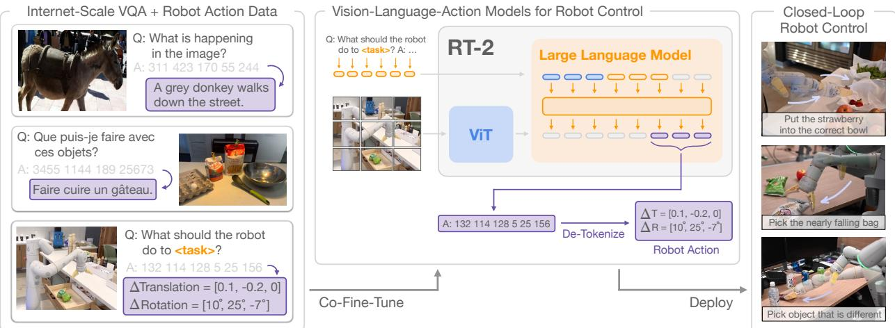
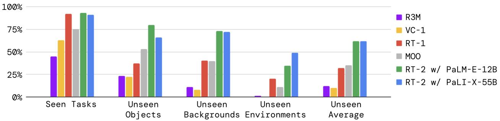
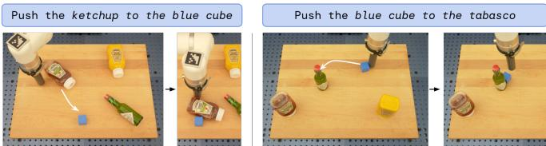
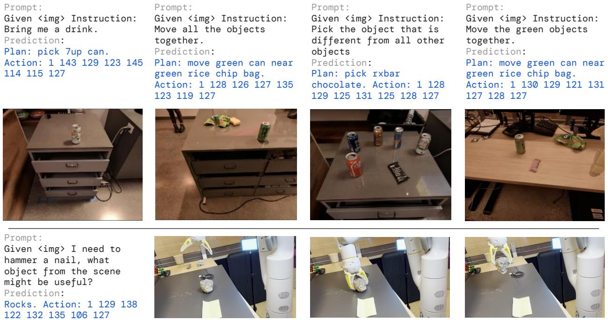
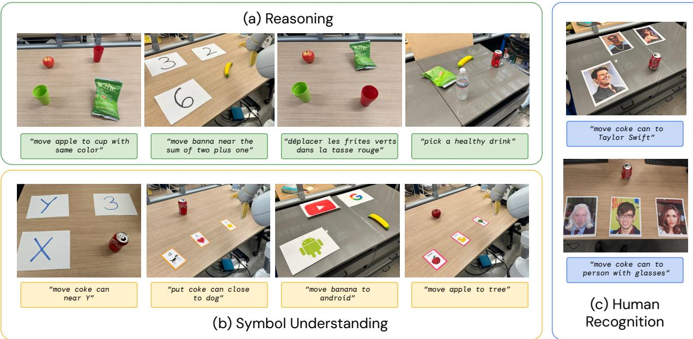

# 1. Bibliographic Information

*   **Title:** RT-2: Vision-Language-Action Models Transfer Web Knowledge to Robotic Control
*   **Authors:** Anthony Brohan, Noah Brown, Justice Carbajal, Yevgen Chebotar, Xi Chen, and a large team from Google DeepMind. The authors are listed alphabetically, with specific contributions detailed in the paper's appendix.
*   **Journal/Conference:** The paper is presented as a preprint on arXiv. Preprints are common in fast-moving fields like AI and robotics, allowing for rapid dissemination of research before formal peer review and publication.
*   **Publication Year:** 2023
*   **Abstract:** The authors investigate how large-scale Vision-Language Models (VLMs) trained on web data can be directly integrated into end-to-end robotic control systems. Their goal is to create a single model that learns to map robot observations to actions while benefiting from the vast knowledge in pre-trained web models. They propose a simple but effective method: representing robot actions as text tokens and training the VLM on a combined dataset of robotic trajectories and web-scale vision-language tasks (like Visual Question Answering). This new category of models is termed Vision-Language-Action (VLA) models, with their specific implementation called RT-2. Extensive evaluations (over 6,000 trials) show that RT-2 significantly improves a robot's ability to generalize to new objects and interpret commands not seen in its training data. The model exhibits emergent capabilities, such as basic reasoning (e.g., picking the smallest object) and even multi-stage semantic reasoning when prompted with a "chain of thought" (e.g., identifying a rock as an improvised hammer).
*   **Original Source Link:**
    *   **arXiv Link:** [https://arxiv.org/abs/2307.15818](https://arxiv.org/abs/2307.15818)
    *   **PDF Link:** [https://arxiv.org/pdf/2307.15818v1.pdf](https://arxiv.org/pdf/2307.15818v1.pdf)

# 2. Executive Summary

*   **Background & Motivation (Why):**
    *   **Core Problem:** Modern robots struggle with generalization. A robot trained to pick up a specific type of can in a specific kitchen may fail if the can's brand, the lighting, or the kitchen layout changes. Furthermore, they lack common-sense reasoning; they don't inherently understand abstract concepts like "the heaviest object," "something to quench your thirst," or "an improvised hammer."
    *   **Existing Gaps:** Large-scale models like Large Language Models (LLMs) and Vision-Language Models (VLMs), trained on internet data, possess this rich semantic knowledge. However, bridging the gap between their abstract understanding (text and images) and the physical world of robotics (concrete motor commands) is a major challenge. Previous approaches typically used VLMs as high-level planners that would delegate tasks to separate, pre-programmed low-level controllers. This meant the low-level controller itself did not benefit from the VLM's rich knowledge during execution.
    *   **Fresh Angle:** The paper asks: can we directly transfer a VLM's web-scale knowledge into a robot's low-level controller? The authors propose a radical and simple solution: **treat robot actions as a foreign language**. By converting robotic motor commands into text-like tokens, they can train a VLM to "speak" actions, just as it speaks English or answers questions about an image. This unifies vision, language, and action into a single end-to-end model.

*   **Main Contributions / Findings (What):**
    *   **A New Model Category (VLA):** The paper introduces Vision-Language-Action (VLA) models, which are VLMs fine-tuned to produce robot action sequences as text. Their implementation is named **RT-2 (Robotics Transformer 2)**.
    *   **A Novel Training Recipe:** The core contribution is the method of tokenizing robot actions and **co-fine-tuning** a pre-trained VLM on both its original web-scale vision-language data and new robotic trajectory data. This preserves the model's general knowledge while teaching it how to act.
    *   **State-of-the-Art Generalization:** Experiments show RT-2 dramatically outperforms previous models (by a factor of 2x-6x) in generalizing to unseen objects, backgrounds, and environments. Its performance on tasks it has seen before remains strong, indicating it learns robotics without "forgetting" its prior knowledge.
    *   **Emergent Semantic Capabilities:** RT-2 demonstrates capabilities it was never explicitly trained for in a robotic context. It can understand and act on concepts of symbolism (placing an object on the number '2'), spatial/logical reasoning (picking the object closest to the apple), and even abstract common-sense reasoning (identifying an energy drink as a good choice for someone who is tired).

# 3. Prerequisite Knowledge & Related Work

*   **Foundational Concepts:**
    *   **Vision-Language Models (VLMs):** These are AI models that can process and understand information from both images and text simultaneously. A typical VLM can take an image and a text prompt (e.g., "What color is the car?") and generate a text-based answer ("The car is red."). The models used in this paper, `PaLI-X` and `PaLM-E`, are examples of powerful VLMs.
    *   **End-to-End Robotic Control:** This is a control strategy where a single neural network takes raw sensor inputs (like a camera image) and directly outputs low-level robot actions (e.g., "move arm 5cm forward, 2cm left, rotate wrist 10 degrees"). This contrasts with modular pipelines, which have separate systems for perception, planning, and control.
    *   **Pre-training and Fine-tuning:** This is a standard two-step training process for large models.
        1.  **Pre-training:** A model is first trained on a massive, general dataset (e.g., billions of images and text snippets from the internet). This step is computationally expensive but imbues the model with broad knowledge about the world.
        2.  **Fine-tuning:** The pre-trained model is then further trained on a smaller, task-specific dataset (e.g., thousands of robot trajectories). This adapts the model's general knowledge to the specific task.
    *   **Co-fine-tuning:** A special kind of fine-tuning where the model is trained on a mix of the original pre-training data and the new task-specific data. This helps prevent the model from "forgetting" its general knowledge, a problem known as catastrophic forgetting.
    *   **Chain-of-Thought (CoT) Reasoning:** A technique that improves a model's reasoning ability by prompting it to generate a sequence of intermediate reasoning steps before producing a final answer. For example, instead of just answering a math problem, it would first write out the steps to solve it.

*   **Previous Works & Differentiation:**
    *   **VLMs for High-Level Planning:** Prior works like `SayCan` (Ahn et al., 2022) and `PaLM-E` (Driess et al., 2023) used VLMs to break down a high-level command ("bring me a snack") into a series of sub-tasks ("find the table," "pick up the chips," "bring to person"). However, the execution of each sub-task was handled by a separate, simpler policy. **RT-2's innovation is that a single, end-to-end model handles everything from understanding the command to outputting the fine-grained motor actions.**
    *   **Pre-trained Visual Representations:** Methods like `R3M` and `VC-1` used visual encoders pre-trained on large datasets to provide better visual features for a robot policy. However, they only pre-trained the vision part, not the language or reasoning parts. **RT-2 leverages a full VLM, transferring knowledge from vision, language, and the connection between them.**
    *   **Other End-to-End VLM Policies:** Models like `CLIPort` integrated VLMs into visuomotor policies but often with significant architectural constraints, such as a 2D action space (top-down view) and requiring calibrated cameras. **RT-2's method is more general: it works in 3D, requires no camera calibration, and doesn't add new, action-specific architectural components. It simply re-purposes the existing VLM architecture.**

        The key differentiator of RT-2 is its simplicity and elegance. By re-framing actions as text, it allows a powerful, off-the-shelf VLM to be directly transformed into a robot controller, inheriting its vast semantic knowledge.

# 4. Methodology (Core Technology & Implementation)

The core idea of RT-2 is to make a Vision-Language Model (VLM) output robot actions by representing those actions as a sequence of text-like tokens.

*   **Principles:** The central intuition is that if a VLM is powerful enough to understand and generate complex human language, it can also learn to "speak" the language of robot actions. By unifying the output space of language and action, the model can leverage its pre-trained semantic and visual understanding to inform its physical behavior.

*   **Model Architecture:**
    RT-2 is not a new architecture from scratch. It is an application of existing VLMs. The authors instantiate RT-2 using two different VLM backbones:
    1.  **PaLI-X:** A large multilingual vision and language model.
    2.  **PaLM-E:** An embodied multimodal language model.
        Both models have a similar structure: they take an image and a text prompt as input and autoregressively generate a sequence of output tokens. In RT-2, this output can be either a natural language response or a sequence of action tokens.

        
        *该图像是一个示意图，展示了RT-2模型如何结合大规模视觉问答数据和机器人动作数据，通过共同微调ViT和大型语言模型，实现视觉-语言-动作的机器人闭环控制。*

*   **Steps & Procedures: From Action to Text**
    The complete pipeline for turning a VLM into a VLA model (RT-2) is as follows:

    1.  **Action Space Definition:** The robot's action is defined by 8 continuous values:
        *   3D change in end-effector position ($\Delta \text{pos}_x, \Delta \text{pos}_y, \Delta \text{pos}_z$).
        *   3D change in end-effector rotation ($\Delta \text{rot}_x, \Delta \text{rot}_y, \Delta \text{rot}_z$).
        *   Gripper extension (how open/closed the gripper is).
        *   Episode termination (a special command to signal the task is complete).

    2.  **Discretization:** Each of the 7 continuous dimensions (position, rotation, gripper) is discretized into **256 uniform bins**. This converts each continuous value into an integer from 0 to 255. The termination command is a separate binary flag.

    3.  **Tokenization (The Core Trick):** The 8-dimensional action vector (now represented by integers) is converted into a string of tokens that the VLM can understand.
        *   A vocabulary of 256 "action tokens" is reserved.
        *   For `PaLI-X`, which already has unique tokens for integers 0-1000, the authors simply use the tokens corresponding to the integers 0-255.
        *   For `PaLM-E`, which does not have this feature, the authors overwrite the 256 least-frequently used tokens in its vocabulary to serve as the action tokens.
        *   The action vector is then represented as a string of these tokens, e.g., `"1 128 91 241 5 101 127"`.

    4.  **Co-Fine-Tuning:** The VLM is fine-tuned on a mixed dataset:
        *   **Robotics Data:** Each data point consists of a robot camera image, a natural language instruction, and the corresponding action. This is formatted as a visual question-answering pair:
            *   **Input Image:** The robot's camera view.
            *   **Input Prompt:** `"Q: what action should the robot take to [instruction]? A:"`
            *   **Target Output:** The tokenized action string, e.g., `"1 128 91 241 5 101 127"`.
        *   **Web Data:** The original VQA, image captioning, and other vision-language datasets the VLM was pre-trained on.
        *   By training on both simultaneously (**co-fine-tuning**), the model learns to map images to actions without forgetting the rich semantic concepts from the web data.

    5.  **Inference and Control:**
        *   During deployment, the robot captures an image.
        *   This image and the user's command are fed into the RT-2 model.
        *   To ensure the model outputs a valid action, its vocabulary is constrained during generation to only the 256 action tokens.
        *   The model generates an action string, which is de-tokenized back into 8 numerical values.
        *   These values are sent to the robot controller for execution.
        *   This process repeats in a closed loop (typically at 1-5 Hz), allowing the robot to continuously observe and react.

*   **Chain-of-Thought (CoT) Extension:**
    To elicit more complex reasoning, a variant of RT-2 was trained on data augmented to include an explicit planning step. The training data format becomes: `"Instruction: [user command]. Plan: [natural language reasoning]. Action: [action tokens]."`. For example:
    *   **Instruction:** "I'm hungry."
    *   **Plan:** "pick rxbar chocolate."
    *   **Action:** "1 128 124 136 121 158 111 255."
        This encourages the model to first reason about the abstract goal in natural language before committing to a physical action.

# 5. Experimental Setup

*   **Datasets:**
    *   **Robotics Data:** The primary robotics dataset is from the **RT-1** paper (Brohan et al., 2022). It was collected over 17 months using 13 robots in an office kitchen environment. It contains demonstrations of skills like "pick," "open," "place into," etc., annotated with natural language instructions.
    *   **Web Data:** The original massive web-scale datasets used to pre-train **PaLI-X** and **PaLM-E**. These include a mixture of image captioning, visual question answering (VQA), and general text data.
    *   **Language-Table:** A simulated 2D pushing environment from Lynch et al. (2022) used for supplementary experiments to compare with open-source baselines.

*   **Evaluation Metrics:**
    The primary metric used is **Success Rate**.
    1.  **Conceptual Definition:** This metric measures the percentage of trials in which the robot successfully accomplishes the task as described by the natural language instruction. A trial is marked as a success if the final state of the environment matches the goal (e.g., the apple is in the bowl).
    2.  **Mathematical Formula:**
        $$
        \text{Success Rate} (\%) = \frac{\text{Number of Successful Trials}}{\text{Total Number of Trials}} \times 100
        $$
    3.  **Symbol Explanation:**
        *   `Number of Successful Trials`: The count of evaluation episodes where the robot achieved the task's goal.
        *   `Total Number of Trials`: The total number of evaluation episodes attempted for a given task or category.

*   **Baselines:**
    The authors compare RT-2 against a strong set of baselines to validate different aspects of their approach:
    *   **`RT-1`:** A 35M parameter Transformer model designed for robotics. It represents the state-of-the-art in policies trained on the same robot data but **without** web-scale VLM pre-training.
    *   **`VC-1`** and **`R3M`:** These are policies that use pre-trained **vision-only** representations. They test whether the benefit comes just from a better vision encoder or from the full vision-language pre-training. The policy backbone is an RT-1 model.
    *   **`MOo`:** An alternative architecture for using VLMs in robotics, where the VLM generates a semantic map that is fed as an extra input channel to an RT-1 policy. This tests whether RT-2's end-to-end "action-as-text" formulation is superior to other ways of integrating VLMs.

# 6. Results & Analysis

The experiments systematically evaluate RT-2's performance, generalization, and emergent abilities across nearly 6,000 real-world trials.

*该图像是图表，展示了论文中RT-2模型及其变体与多个基线模型在训练任务及对新对象、新背景、新环境的泛化评估中的表现对比，体现RT-2在各项指标上显著优越。*

*   **Core Results: Generalization Performance (Figure 4)**
    The bar chart in Figure 4 compares the performance of RT-2 and baselines on tasks seen during training and on unseen generalization tasks.

    
    *该图像是图5，展示了语言桌面环境中机器人执行出分布行为的示意图。图中显示机器人根据语言指令推送不同颜色和位置的物体，演示RT-2模型的实际应用。*

    *   **Seen Tasks:** On tasks with objects and setups similar to the training data, RT-2 models (both PaLI-X and PaLM-E versions) perform comparably to the `RT-1` baseline (~62% success). This shows that the VLM pre-training does not degrade performance on the original robotics tasks.
    *   **Unseen Tasks (Generalization):** This is where RT-2 shines.
        *   **Unseen Objects:** RT-2 achieves 62% success, while the next best baseline (`RT-1`) gets only 32%.
        *   **Unseen Backgrounds:** RT-2 achieves 61% success, compared to 27% for `RT-1`.
        *   **Unseen Environments:** RT-2 achieves 62% success, compared to 33% for `RT-1`.
    *   **Conclusion:** The web-scale pre-training provides RT-2 with a much richer and more robust visual and semantic understanding, allowing it to generalize to new situations far more effectively than models trained only on robotics data. The improvement is dramatic, often doubling the success rate.

*   **Language Table Benchmark (Table 1)**
    To provide a reproducible comparison point, RT-2 was also tested in a simulated environment.

    *(Manual Transcription of Table 1)*

    | Model | Language-Table |
    | :--- | :--- |
    | BC-Zero (Jang et al., 2021) | 72 ± 3 |
    | RT-1 (Brohan et al., 2022) | 74 ± 13 |
    | LAVA (Lynch et al., 2022) | 77 ± 4 |
    | **RT-2-PaLI-3B (ours)** | **90 ± 10** |

    *   **Analysis:** A smaller 3B parameter version of RT-2 achieves a 90% success rate, significantly outperforming prior state-of-the-art methods in this benchmark. This confirms that the benefits of the VLA approach are not limited to one specific robot or environment.

*   **Emergent Capabilities (Figure 6a)**
    This experiment tests skills that are impossible to learn from the robot data alone and must "emerge" from the VLM's web knowledge.

    
    *该图像是图7示意图，展示了RT-2模型在链式思维推理下的多步骤执行过程，包含对任务的计划（Plan）和动作（Action）预测，体现了模型对复杂指令的理解和执行能力。*

    *   **Symbol Understanding:** (e.g., "move apple to the peace sign icon"). RT-2 models succeed ~60% of the time, while `RT-1` is near 0%. The robot has never seen a peace sign in its training data; it understands the symbol from web data.
    *   **Reasoning:** (e.g., "move the banana to the fruit that has the same color"). RT-2 models succeed over 60% of the time. This requires identifying the color of the banana and then finding another object with that same property.
    *   **Human Recognition:** (e.g., "move the coke can to the person with glasses"). RT-2 also shows a basic ability to recognize human attributes.
    *   **Conclusion:** RT-2 achieves an average success rate of **62%** on these emergent tasks, more than **3x higher** than the next best baseline (`RT-1` at 17%). This is strong evidence that RT-2 is not just memorizing tasks but is using its pre-trained knowledge to reason about novel commands.

*   **Ablations / Parameter Sensitivity (Figure 6b)**
    This study, shown in the right-hand chart of Figure 7, investigates which components of RT-2 are most important.
    *   **Pre-training is Crucial:** Training a 5B parameter model from scratch results in a success rate of only 5%. This confirms that the performance comes from transferring knowledge, not just from having a large model.
    *   **Co-Fine-Tuning is Better than Fine-tuning:** Simply fine-tuning the VLM on only robot data (forgetting web data) leads to worse generalization (38% average) than co-fine-tuning on both robot and web data (45% average). This shows the importance of continually refreshing the model's web knowledge.
    *   **Bigger is Better:** The 55B parameter RT-2 model consistently outperforms the 5B model across all generalization categories (54% vs. 45% average success), aligning with the scaling laws observed in LLMs.

*   **Chain-of-Thought Reasoning (Figure 7)**
    Qualitative results show that the CoT-trained RT-2 can handle multi-step, abstract instructions by first generating an explicit plan.

    
    *该图像是论文中图8，展示了用于评估RT-2模型多种涌现能力的场景示意图，分为(a)推理、(b)符号理解和(c)人类识别三类，图中展示了机器人执行相应指令的示例操作。*

    *   **Example 1:** Command "Find me a drink to give me energy." -> Plan: "pick energy drink" -> Action: picks the Red Bull can.
    *   **Example 2:** Command "I need an improvised hammer." -> Plan: "pick stone" -> Action: picks the rock.
    *   **Conclusion:** This demonstrates a nascent ability to combine high-level planning and low-level control within a single model, a promising direction for more sophisticated robot reasoning.

# 7. Conclusion & Reflections

*   **Conclusion Summary:**
    The paper successfully demonstrates that Vision-Language-Action (VLA) models, instantiated as RT-2, can effectively transfer knowledge from web-scale datasets to low-level robotic control. The core innovation is a simple yet powerful recipe: represent robot actions as text tokens and co-fine-tune a pre-trained VLM on a mix of web and robot data. This approach leads to policies with vastly improved generalization to new objects and scenes, and enables emergent semantic capabilities like symbol understanding and common-sense reasoning, which were absent in prior models. RT-2 shows that as VLMs become more capable, robotics can directly and immediately benefit from these advances.

*   **Limitations & Future Work:**
    The authors acknowledge several limitations:
    1.  **Limited Physical Skills:** While RT-2 can apply its *existing* physical skills (like picking and placing) in new semantic contexts, it does not learn *new physical motions* from the web data. Its motor skills are still constrained by the robot demonstration dataset. A key future direction is learning new skills from sources like human videos.
    2.  **Computational Cost:** The models are massive (up to 55 billion parameters) and require significant computational resources (cloud TPUs) to run, even at a low control frequency (1-5 Hz). This makes real-time deployment on on-board robot hardware a major challenge. Future work could explore model distillation or quantization to create smaller, faster versions.
    3.  **Model Availability:** The approach relies on access to large, pre-trained VLMs and the ability to fine-tune them. At the time of writing, many of the most powerful models are proprietary, limiting broader research and application.

*   **Personal Insights & Critique:**
    RT-2 represents a significant conceptual leap for robotics. The "actions as text" paradigm is an elegant solution to the long-standing problem of grounding abstract knowledge in physical action. It creates a direct bridge between the rapid progress in large-scale AI models and the slower, more data-hungry field of robotics.

    *   **Strength:** The primary strength is its simplicity and generality. It doesn't require complex new architectures or specialized modules. It suggests a clear path forward: as foundation models for vision and language improve, so too will robot capabilities, simply by applying this fine-tuning recipe.
    *   **Critique/Open Question:** The most significant open question, as the authors note, is the acquisition of new physical skills. The web is full of videos of humans performing complex manipulations (e.g., cooking, assembling furniture). While RT-2 learns "what" to do and "why," it doesn't learn "how" to perform new motions from this data. The next frontier for VLA models will be to bridge this gap, perhaps by learning to translate video demonstrations into action token sequences, thereby expanding the robot's physical skill repertoire in the same way RT-2 expands its semantic understanding.