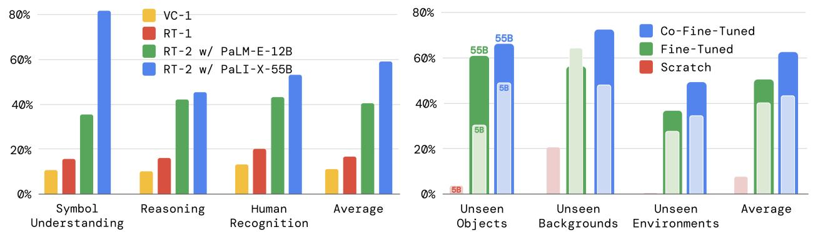

# 1. 论文基本信息 (Bibliographic Information)

*   **标题 (Title):** RT-2: Vision-Language-Action Models Transfer Web Knowledge to Robotic Control (RT-2: 视觉-语言-动作模型将网络知识迁移至机器人控制)
*   **作者 (Authors):** Anthony Brohan, Noah Brown, Justice Carbajal, 等 (共48位作者)。所有作者均来自 Google DeepMind。如此庞大的作者团队通常意味着这是一个大型的、需要跨多学科协作的工程项目，也反映了 Google DeepMind 在该领域的巨大投入。
*   **发表期刊/会议 (Journal/Conference):** arXiv 预印本。arXiv 是一个公开的学术论文预印本平台，意味着这篇论文尚未经过同行评审 (Peer Review)，但因其颠覆性的成果和强大的研究团队背景，一经发布便在学术界和工业界引起了广泛关注。
*   **发表年份 (Publication Year):** 2023
*   **摘要 (Abstract):** 论文研究如何将基于互联网规模数据训练的视觉-语言模型 (VLM) 直接整合到端到端的机器人控制中，以提升泛化能力并催生出语义推理能力。研究目标是让一个单一的端到端模型，既能学习将机器人观测映射到动作，又能从网页端大规模的视觉和语言数据预训练中获益。为此，作者提出将最先进的 VLM 在机器人轨迹数据和互联网规模的视觉-语言任务（如视觉问答）上进行“共同微调” (Co-fine-tuning)。该方法的核心是一个简单而通用的方案：将机器人动作表示为文本词元 (text tokens)，并像处理自然语言词元一样将其直接整合到模型的训练集中。作者将这类模型命名为视觉-语言-动作模型 (Vision-Language-Action Models, VLA)，并实现了一个具体实例，称为 `RT-2`。通过超过6000次的机器人评估试验证明，`RT-2` 策略性能优越，并从互联网规模的训练中获得了一系列“涌现能力” (emergent capabilities)，包括：显著提升对新物体的泛化能力、理解机器人训练数据中未出现的指令、以及响应用户命令执行初步的推理（如拾取最大/最小的物体）。此外，结合“思维链” (Chain of Thought) 推理，`RT-2` 还能执行多阶段语义推理，例如判断出应该用石头作为临时锤子。
*   **原文链接 (Source Link):**
    *   **arXiv 链接:** https://arxiv.org/abs/2307.15818
    *   **PDF 链接:** https://arxiv.org/pdf/2307.15818v1.pdf
    *   **发布状态:** 预印本 (Preprint)。

        ---

# 2. 整体概括 (Executive Summary)

*   **研究背景与动机 (Background & Motivation - Why):**
    *   **核心问题:** 现代的大型语言模型 (LLMs) 和视觉-语言模型 (VLMs) 在语义理解、推理和视觉识别方面展现出惊人的能力，这些能力对于需要与复杂真实世界交互的通用机器人至关重要。然而，如何将这些“大脑”的智慧有效地赋予机器人的“身体”是一个巨大的挑战。
    *   **现有研究的空白 (Gap):** 以前的方法通常将 LLMs/VLMs 用作“高层规划器”，即它们只负责理解指令并将其分解为一系列子任务（如“拿起杯子”，“放到桌上”）。而执行这些子任务的“底层控制器”是独立训练的，无法直接受益于 VLM 庞大的世界知识。这就好比一个聪明的大脑指挥着一个对世界一无所知的身体，大脑的智慧在执行层面大打折扣。
    *   **本文的切入点:** 论文提出了一个大胆而简单的设想：**我们能否让一个模型既是“大脑”又是“身体”？** 具体来说，能否将一个强大的预训练 VLM 直接改造为一个端到端的机器人控制器，让它直接输出底层的机器人动作，从而将从互联网学到的丰富知识无缝迁移到物理操作中？

*   **核心贡献/主要发现 (Main Contribution/Findings - What):**
    *   **提出了 VLA 模型概念:** 首次提出并系统验证了视觉-语言-动作 (Vision-Language-Action, VLA) 模型的概念。其核心思想是将机器人动作“翻译”成语言，让 VLM 像生成文本一样生成动作指令。
    *   **实现了 RT-2 模型:** 作为 VLA 概念的实例，作者基于两种强大的 VLM (`PaLI-X` 和 `PaLM-E`) 训练出了 `RT-2` 模型。这是首个将如此大规模（高达 550 亿参数）的模型直接用于闭环机器人控制的工作。
    *   **验证了知识迁移的巨大价值:** 实验证明，通过这种方式，`RT-2` 不仅在常规任务上表现出色，更在泛化能力上远超以往的模型。它能够理解并操作在机器人训练数据中从未见过的物体、场景和指令。
    *   **发现了“涌现能力”:** `RT-2` 展现了许多完全来自其互联网预训练知识的“涌现能力”。例如，它能理解符号（如数字“3”或“心形”图标）、进行简单的数学和逻辑推理（“把苹果移到两个杯子加一个杯子等于的数字上”）、甚至进行常识推理（“我累了，给我拿个能提神的饮料”，机器人会选择能量饮料）。这证明了 VLM 的抽象知识可以被成功地“接地” (grounded) 到物理世界中。

        ---

# 3. 预备知识与相关工作 (Prerequisite Knowledge & Related Work)

*   **基础概念 (Foundational Concepts):**
    *   **视觉-语言模型 (Vision-Language Model, VLM):** 这是一种能够同时理解图像和文本的模型。本文关注的 VLM 类别是生成式模型，其输入是图像和文本，输出是自由形式的文本。例如，你可以给它一张图片并提问“图片里的小狗是什么品种？”，它会生成文本答案“柯基犬”。`PaLI-X` 和 `PaLM-E` 就是这类模型的代表。
    *   **端到端控制 (End-to-End Control):** 这是一种机器人控制范式，指模型直接从原始传感器输入（如摄像头图像）映射到最终的执行器输出（如电机指令或末端执行器坐标），中间没有明确的、分阶段的模块（如物体检测、路径规划等）。`RT-2` 就是一个端到端模型。
    *   **共同微调 (Co-fine-tuning):** 这是一种模型训练策略。当我们用新的任务数据（如机器人动作数据）来训练一个已经预训练好的模型时，如果只用新数据，模型可能会忘记它原来学到的知识（这个现象被称为“灾难性遗忘”）。共同微调是指在微调过程中，将新数据和一部分原始预训练数据混合在一起进行训练，从而帮助模型在学习新技能的同时，保持原有的能力。
    *   **思维链 (Chain of Thought, CoT):** 这是一种激发大型语言模型推理能力的技术。通过在提示 (prompt) 中展示一步一步的推理过程，引导模型在回答复杂问题时，也先生成一个逻辑连贯的推理链条，然后再给出最终答案。这能显著提高模型在复杂推理任务上的表现。

*   **前人工作 (Previous Works):**
    *   **使用 LLM/VLM 进行高层规划:** 如 `SayCan` (Ahn et al., 2022) 和 `PaLM-E` (Driess et al., 2023) 的部分工作，它们将 VLM 用作任务规划器，将复杂的自然语言指令分解为机器人可以执行的简单动作序列。但这些方法的底层动作执行器是独立的，无法从 VLM 的知识中受益。
    *   **使用预训练表征:** 许多工作使用在 ImageNet 或其他视觉数据集上预训练好的模型作为视觉编码器（如 `R3M`, `VC-1`），以提取更好的图像特征。这些方法能提升视觉泛化能力，但它们缺乏 VLM 所拥有的丰富语义和常识知识。
    *   **集成 VLM 的端到端策略:** 如 `CLIPort` 和 `MOO`，这些工作尝试将 VLM（主要是 `CLIP`）集成到端到端策略中。但它们通常带有较强的结构限制，例如 `CLIPort` 的动作空间是二维的（俯视视角下的抓取），且需要相机标定。

*   **技术演进 (Technological Evolution):**
    机器人学习的技术路线正从“模块化”走向“一体化”。早期方法将任务分解为感知、规划、控制等多个独立模块，分别设计。近期，端到端学习成为主流，试图用一个神经网络解决所有问题。而 `RT-2` 代表了最新的趋势：不再从零开始训练这个端到端模型，而是直接“征用”在互联网数据上预训练好的、能力极强的基础模型 (Foundation Model)，并教会它如何“控制身体”。

*   **差异化分析 (Differentiation):**
    `RT-2` 与之前工作的最大区别在于其 **简洁性** 和 **彻底性**。
    1.  **统一的输出空间:** `RT-2` 不像 `CLIPort` 或 `MOO` 那样需要设计特殊的结构来融合 VLM 特征，也不需要为动作输出设计专门的模型组件。它直接将动作数据“伪装”成文本，让 VLM 在其原有的架构上学习输出动作。
    2.  **完全共享的参数:** 由于动作和语言被统一为文本词元，整个 VLM 的所有参数（从视觉编码器到语言解码器）都在机器人数据和网络数据上共同训练。这意味着模型在学习回答“什么是苹果？”和学习“如何拿起苹果？”时，使用的是同一套知识和推理机制。这使得知识迁移的路径最为直接和高效。

        ---

# 4. 方法论 (Methodology - Core Technology & Implementation Details)

`RT-2` 的核心方法论可以概括为：**将动作视为一种语言**。

*   **方法原理 (Methodology Principles):**
    *   **核心思想:** 既然 VLM 擅长根据图像和文本输入来生成文本输出，那么我们只要将机器人动作也编码成一种“文本”，就可以让 VLM 直接学会控制机器人。
    *   **直觉 (Intuition):** 机器人执行一个动作（如“向前移动10厘米”）和模型生成一个词（如“apple”）在本质上都是一种序列决策。通过将连续的动作空间离散化并映射到词元，VLM 可以利用其强大的序列建模能力来预测下一系列最合理的“动作词元”。

*   **方法步骤与流程 (Steps & Procedures):**

    1.  **选择一个强大的预训练 VLM:** `RT-2` 的基础是现成的、已在海量网络数据上训练好的 VLM，如 `PaLI-X` (5B 和 55B 参数) 和 `PaLM-E` (12B 参数)。这些模型已经具备了强大的视觉理解和语言能力。

    2.  **动作表示与文本化 (Action Representation & Tokenization):** 这是最关键的一步。
        *   **动作空间定义:** 机器人的动作被定义为一个8维向量，包括：末端执行器（机械手）的6自由度 (6-DoF) 位移（`x, y, z` 方向的平移和旋转），夹爪的开合程度，以及一个用于表示任务结束的特殊指令。
        *   **离散化 (Discretization):** 除了任务结束指令，其余7个连续的维度（如位移、旋转）都被均匀地离散化成 256 个档位 (bins)。例如，-1到1的位移可以被切分为256个小段，每个小段对应一个从0到255的整数。
        *   **文本化 (Tokenization):** 这样一个由8个整数组成的动作向量，被转换成一个字符串。例如，一个动作 $(1, 128, 91, 241, 5, 101, 127, 255)$（分别代表终止、x、y、z...）被简单地拼接成一个文本字符串，如：`"1 128 91 241 5 101 127 255"`。
        *   **词元映射:** 这个字符串中的数字需要被 VLM 的分词器 (tokenizer) 理解。
            *   对于 `PaLI-X`，它的分词器原生支持将 1000 以内的整数映射为唯一的词元，所以可以直接使用。
            *   对于 `PaLM-E`，它的分词器没有这种特性。作者采取了一个巧妙的方法：找出词汇表中最不常用的 256 个词元，然后“征用”它们，让它们分别代表 0 到 255 这 256 个动作值。这是一种被称为“符号微调” (Symbol Tuning) 的技术。

    3.  **数据格式统一:** 所有的训练数据都被统一成 VLM 熟悉的“问答”格式。
        *   **输入:** 一张机器人视角的图像，以及一条自然语言指令，格式化为 `"Q: what action should the robot take to [task instruction]? A:"` (问题：机器人应该采取什么动作来[任务指令]？回答：)。
        *   **输出 (目标):** 机器人应该执行的动作，即上一步生成的“动作字符串”。

    4.  **共同微调 (Co-Fine-Tuning):**
        *   将格式化后的机器人数据与 VLM 原始的网页训练数据（如视觉问答、图像描述等）混合。
        *   在训练时，提高机器人数据的采样权重，以确保模型能充分学习机器人控制任务，同时又不忘记从网络数据中学到的通用知识。

    5.  **推理与执行 (Inference & Execution):**
        *   **闭环控制:** 在实际运行时，机器人以一定频率（如1-5Hz）捕捉当前图像，连同任务指令一起输入到 `RT-2` 模型中。
        *   **输出约束:** 模型会生成一个“动作字符串”。为了确保生成的是有效的动作，推理时会限制模型的输出词汇表，只允许它从合法的动作词元中进行选择。
        *   **动作解码:** 生成的“动作字符串”被解码回8维的离散动作值，然后转换成机器人可以执行的物理指令。这个过程不断重复，形成闭环控制，直到模型输出“任务结束”指令。

            
            *该图像是一个示意图，展示了RT-2模型如何结合大规模视觉问答数据和机器人动作数据，通过共同微调ViT和大型语言模型，实现视觉-语言-动作的机器人闭环控制。*

    *   上图（原文图1）直观地展示了 `RT-2` 的核心流程。左侧是模型的输入：机器人摄像头图像和自然语言指令。中间是模型本身，它是一个预训练的 VLM。右侧是模型的输出，这个输出既可以是自然语言（用于回答 VQA 问题），也可以是代表机器人动作的文本词元。通过这种方式，`RT-2` 将视觉、语言和动作统一在一个框架内。

*   **数学公式与关键细节 (Mathematical Formulas & Key Details):**
    论文的核心方法不涉及复杂的数学公式，但其动作的文本化表示是关键。一个动作 $A$ 可以表示为一个8维整数向量：
    $$
    A = [a_{\text{term}}, a_{\Delta x}, a_{\Delta y}, a_{\Delta z}, a_{\Delta \text{rot}_x}, a_{\Delta \text{rot}_y}, a_{\Delta \text{rot}_z}, a_{\text{grip}}]
    $$
    其中：
    *   $a_{\text{term}} \in \{0, 1\}$: 表示是否终止任务。
    *   $a_{\Delta \text{pos}}, a_{\Delta \text{rot}}, a_{\text{grip}} \in \{0, 1, ..., 255\}$: 分别代表平移、旋转和夹爪开合的离散化档位值。

        这个向量被转换成一个目标字符串 $S_{target}$，用于模型训练：
    $$
    S_{target} = "\text{token}(a_{\text{term}}) \text{ token}(a_{\Delta x}) \dots \text{token}(a_{\text{grip}})"
    $$
    其中 $\text{token}(\cdot)$ 函数将整数值映射到 VLM 词汇表中的特定词元。

---

# 5. 实验设置 (Experimental Setup)

*   **数据集 (Datasets):**
    *   **机器人数据:** 来源于 `RT-1` (Brohan et al., 2022) 的数据集。该数据集由13台机器人在17个月内收集，场景主要是一个办公厨房环境。数据包含了机器人执行各种任务（如拾取、放置、开关抽屉等）的轨迹，每条轨迹都标注了描述任务的自然语言指令。
    *   **网络数据:** 即 `PaLI-X` 和 `PaLM-E` 的原始预训练数据集，包含海量的图像-文本对，如视觉问答 (VQA)、图像描述 (captioning) 等。
    *   **Language-Table 数据集:** 这是一个开源的模拟环境 (Lynch et al., 2022)，用于在标准化的基准上进行额外对比，验证方法的普适性。

*   **评估指标 (Evaluation Metrics):**
    *   **成功率 (Success Rate):**
        1.  **概念定义 (Conceptual Definition):** 这是评估机器人任务完成度的最直接指标。它衡量在所有尝试的实验中，机器人能够完全并正确地完成指定任务的次数所占的百分比。一次成功的尝试意味着机器人从开始状态出发，通过自主决策和执行，最终达到了任务指令所描述的目标状态。
        2.  **数学公式 (Mathematical Formula):**
            $$
            \text{Success Rate} = \frac{\text{Number of Successful Trials}}{\text{Total Number of Trials}} \times 100\%
            $$
        3.  **符号解释 (Symbol Explanation):**
            *   `Number of Successful Trials`: 机器人成功完成任务的次数。成功与否由人类评估员根据预定义的标准来判断。
            *   `Total Number of Trials`: 为评估该任务而进行的总实验次数。

*   **对比基线 (Baselines):**
    *   `RT-1`: 当时最先进的机器人策略之一，它是一个从零开始在机器人数据上训练的 Transformer 模型。它代表了不使用大规模网络数据预训练的 SOTA (State-of-the-Art) 水平。
    *   `VC-1` 和 `R3M`: 这两种方法使用预训练的视觉表征模型。它们的策略后端（一个 `RT-1` 架构）使用这些模型提取的视觉特征作为输入。这代表了仅利用预训练视觉知识的 SOTA 水平。
    *   `MOO`: 另一种利用 VLM 的方法，它使用 VLM 生成一个语义地图作为额外的输入通道，然后送入一个 `RT-1` 架构。这代表了另一种 VLM 与机器人控制结合的思路。
    *   `BC-Zero` 和 `LAVA`: 在 `Language-Table` 仿真环境中的基线模型。

        ---

# 6. 实验结果与分析 (Results & Analysis)

实验总共进行了约6000次真实机器人部署评估，规模宏大，结论可信度高。

*   **核心结果分析 (Core Results Analysis):**

    
    *该图像是图表，展示了论文中RT-2模型及其变体与多个基线模型在训练任务及对新对象、新背景、新环境的泛化评估中的表现对比，体现RT-2在各项指标上显著优越。*

    *   **泛化能力显著提升:**
        *   如上图（原文图4）所示，在“seen tasks”（即机器人训练数据中见过的任务类型）上，`RT-2` 的表现与 `RT-1` 相当（`RT-1`: 97%, `RT-2-PaLI-X`: 96%, `RT-2-PaLM-E`: 91%），说明 `RT-2` 至少学会了基本的机器人技能。
        *   **真正的优势体现在泛化任务上**。在面对“unseen objects”（新物体）、“unseen backgrounds”（新背景）和“unseen environments”（新环境）时，`RT-2` 的表现远超所有基线。平均而言，`RT-2` 的成功率（62%）几乎是 `RT-1`（32%）和 `MOO`（34%）的两倍，更是 `VC-1` 等模型的数倍。
        *   **这强有力地证明了 `RT-2` 的核心假设：从互联网数据中学到的通用视觉和语义知识，可以被有效迁移，以应对机器人从未见过的真实世界变化。**

    *   **涌现能力 (Emergent Capabilities) 的量化评估:**

        
        *该图像是两幅柱状图，比较了多种模型在不同任务和环境下的表现指标。左图展示了VC-1, RT-1以及两种RT-2模型在符号理解、推理、人类识别和平均指标上的百分比表现。右图显示了Co-Fine-Tuned、Fine-Tuned和Scratch训练方法在未见过对象、背景、环境及其平均表现上的准确率差异。*

        *   上图左半部分（原文图6a）展示了 `RT-2` 在三类涌现能力任务上的表现，这些任务的指令是所有模型在机器人训练阶段都从未见过的。
            *   **符号理解 (Symbol Understanding):** 如“把苹果移动到数字‘3’上”。`RT-2` 取得了约 60% 的成功率，而基线几乎为 0%。这表明 `RT-2` 理解了“3”这个符号的视觉和语义含义。
            *   **推理 (Reasoning):** 如“把苏打水罐移到离苹果最近的杯子旁”。`RT-2` 取得了约 75% 的成功率，而基线几乎为 0%。这表明 `RT-2` 能够进行空间关系和逻辑推理。
            *   **人类识别 (Human Recognition):** 如“把可乐罐递给戴眼镜的人”。`RT-2` 同样表现出色。
        *   **总体而言，`RT-2` 在这些涌现任务上的平均成功率达到了 67%，是表现最好的基线 `RT-1` (22%) 的三倍多。这清晰地表明，这些高级能力并非来自机器人数据，而是直接从 VLM 的预训练知识中“继承”而来。**

    *   **仿真环境中的验证:**
        *   以下是转录的原文 `Table 1` 的数据：

            | Model | Language-Table |
            | :--- | :--- |
            | BC-Zero (Jang et al., 2021) | 72 ± 3 |
            | RT-1 (Brohan et al., 2022) | 74 ± 13 |
            | LAVA (Lynch et al., 2022) | 77 ± 4 |
            | RT-2-PaLI-3B (ours) | 90 ± 10 |

        *   在 `Language-Table` 仿真环境中，一个较小版本的 `RT-2` (3B 参数) 取得了 90% 的成功率，显著高于所有其他基线，再次证明了该方法的有效性和普适性。

*   **消融实验/参数分析 (Ablation Studies / Parameter Analysis):**

    *   上图右半部分（原文图6b）对模型尺寸和训练策略进行了消融研究。
        *   **训练策略的影响:**
            *   `From Scratch`（从零开始训练）：即使是 5B 参数的模型，从零开始训练表现也极差（平均成功率 < 5%）。这说明对于复杂的机器人任务，没有大规模预训练是行不通的。
            *   `Fine-tuned`（仅用机器人数据微调）：表现好于从零训练，但明显不如 `Co-fine-tuned`。这证明了共同微调对于防止模型“遗忘”通用知识至关重要。
            *   `Co-fine-tuned`（共同微调）：表现最好，证实了这是最佳的训练策略。
        *   **模型规模的影响:**
            *   比较 5B 和 55B 参数的 `RT-2-PaLI-X` 模型，可以看到，**更大的模型带来了更好的泛化性能** (55B 模型的平均成功率比 5B 模型高出约 10 个百分点)。这与 LLM 和 VLM 领域“规模法则” (Scaling Law) 的发现一致：模型越大，能力越强。

    *   **思维链 (Chain-of-Thought) 的作用:**

        
        *该图像是图7示意图，展示了RT-2模型在链式思维推理下的多步骤执行过程，包含对任务的计划（Plan）和动作（Action）预测，体现了模型对复杂指令的理解和执行能力。*

        *   上图（原文图7）展示了 `RT-2` 结合思维链推理的例子。当面对一个模糊的指令如“我饿了”时，模型首先会生成一个计划 (Plan)，如“Plan: pick rxbar chocolate”（计划：拿起巧克力能量棒），然后再生成具体的动作 (Action) 字符串。
        *   这表明，通过简单的微调，可以让 VLA 模型具备“思考-行动”的能力，将高层语义规划和底层动作控制无缝地结合在同一个模型中，为解决更复杂、多步骤的任务提供了极具前景的方向。

            ---

# 7. 总结与思考 (Conclusion & Personal Thoughts)

*   **结论总结 (Conclusion Summary):**
    *   本文成功地提出并验证了一种简单、通用且高效的方法，通过将机器人动作表示为文本词元，将强大的预训练视觉-语言模型 (VLM) 转化为高性能的机器人控制策略 (`VLA` 模型)。
    *   实例化的 `RT-2` 模型不仅在泛化到新物体、新场景方面表现卓越，而且从其网络规模的预训练中继承了丰富的语义、常识和推理能力，展现出令人惊叹的“涌现”行为。
    *   该工作表明，机器人学习领域可以直接受益于视觉-语言模型领域的快速发展，为构建更通用、更智能的机器人提供了一条充满希望的新路径。

*   **局限性与未来工作 (Limitations & Future Work):**
    *   **动作空间的局限性:** `RT-2` 的物理技能完全受限于机器人训练数据的分布。它学会了如何在新情境下“部署”已有的技能（如拾取），但无法从网络数据（例如人类视频）中学习到全新的物理动作。未来的一个重要方向是研究如何从更多样化的数据源（如视频）中学习新的技能。
    *   **计算成本与实时性:** `RT-2` 这样的大模型计算成本高昂，推理速度较慢（1-5Hz），依赖于云端 TPU 集群。这对于需要高频控制（如快速动态任务）或需要在本地部署的场景构成了挑战。模型压缩、蒸馏等技术是未来值得探索的方向。
    *   **模型可及性:** 目前能够用于构建 `RT-2` 的大型 VLM 数量有限，且大多不开源或不提供微调 API。未来需要更多开放的基础模型来推动该领域的研究。

*   **个人启发与批判 (Personal Insights & Critique):**
    *   **启发:**
        1.  **范式转变:** `RT-2` 最具启发性的一点是它“化繁为简”的哲学。它绕过了传统机器人学中复杂的、模块化的感知-规划-控制流水线，直接诉诸于一个大模型的涌现能力。这标志着机器人学可能正在进入一个由“基础模型”驱动的新时代。
        2.  <strong>“语言”</strong>的泛化: 将动作视为一种语言，是一个极具洞察力的想法。它不仅统一了不同模态的表示，更重要的是，它将机器人控制问题转化为了一个 VLM 天然擅长的序列生成问题，从而解锁了 VLM 的全部潜力。
        3.  **知识接地的有效途径:** `RT-2` 为解决人工智能领域一个长期存在的难题——“符号接地” (Symbol Grounding) 问题——提供了一个非常具体的、可操作的解决方案。它展示了如何让模型理解的抽象符号（如“锤子”、“累了”）与物理世界的物体和状态真正关联起来。
    *   **批判:**
        1.  **黑箱问题:** `RT-2` 作为一个端到端的巨大模型，其决策过程是高度不透明的。当它失败时，很难判断问题出在视觉理解、逻辑推理还是动作生成上。这在安全攸关的应用中是一个巨大的隐患。
        2.  **数据依赖的“诅咒”:** 虽然 `RT-2` 极大地提升了泛化能力，但其基础物理技能仍然100%依赖于真实机器人收集的数据。而高质量机器人数据的收集成本依然高昂。如何降低对昂贵机器人数据的依赖，仍然是一个核心挑战。
        3.  **对“长尾问题”的处理能力:** 实验主要集中在桌面操作任务。在更开放、更不可预测的家庭或工业环境中，充满了无数“长尾”场景（低频但关键的意外情况）。`RT-2` 是否能稳健地处理这些情况，仍有待验证。其涌现的常识推理能力可能很强大，但也可能很“脆弱”。