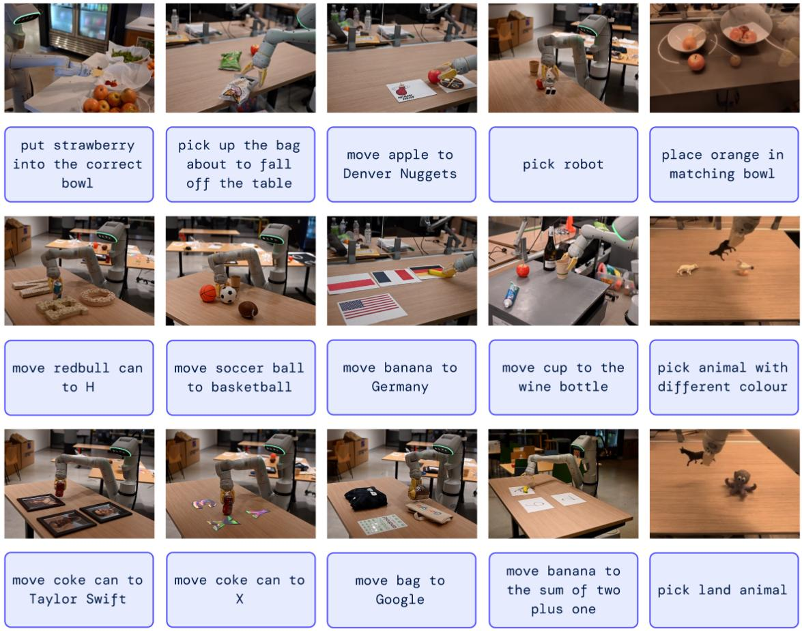
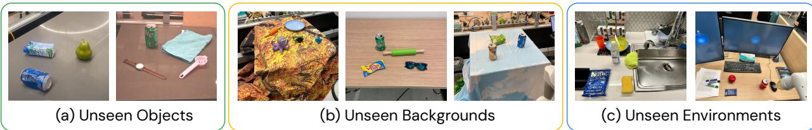
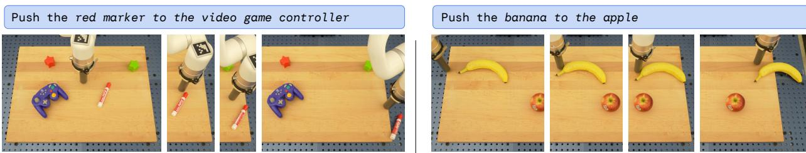
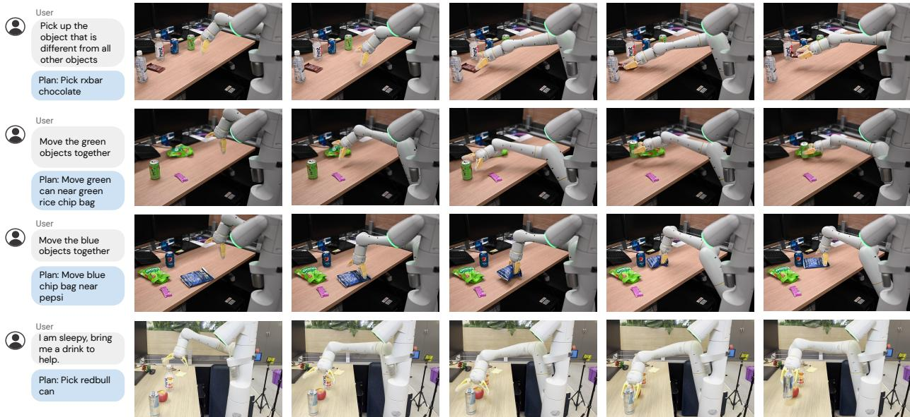

# RT-2：视觉-语言-行动模型将网络知识转移到机器人控制

Anthony Brohan、Noah Brown、Justice Carbajal、Yevgen Chebotar、Xi Chen、Krzysztof Choromanski、Tianli Ding、Danny Driess、Avinava Dubey、Chelsea Finn、Pete Florence、Chuyuan Fu、Montse Gonzalez Arenas、Keerthana Gopalakrishnan、Kehang Han、Karol Hausman、Alexander Herzog、Jasmine Hsu、Brian Ichter、Alex Irpan、Nikhil Joshi、Ryan Julian、Dmitry Kalashnikov、Yuheng Kuang、Isabel Leal、Lisa Lee、Tsang-Wei Edward Lee、Sergey Levine、Yao Lu、Henryk Michalewski、Igor Mordatch、Karl Pertsch、Kanishka Rao、Krista Reymann、Michael Ryoo、Grecia Salazar、Pannag Sanketi、Pierre Sermanet、Jaspiar Singh、Anikait Singh、Radu Soricut、Huong Tran、Vincent Vanhoucke、Quan Vuong、Ayzaan Wahid、tefan Welker、Paul Wohlhart、Jialin Wu、Fei Xia、Ted Xiao、Peng Xu、Sichun Xu、Tianhe Yu，以及 Brianna Zitkovich Google DeepMind。作者按字母顺序列出，贡献列在附录 A 中。

我们研究如何将基于互联网规模数据训练的视觉-语言模型直接整合到端到端的机器人控制中，以提升泛化能力并实现涌现的语义推理。我们的目标是让一个端到端训练的单一模型既能够学习将机器人观测映射到动作，又能够受益于来自网络的大规模语言和视觉-语言数据的预训练。为此，我们提出在机器人轨迹数据和互联网规模的视觉-语言任务（如视觉问答）上共同微调最先进的视觉-语言模型。与其他方法不同，我们提出一个简单、通用的实现方案：为了将自然语言响应与机器人动作统一为相同的格式，我们将动作表示为文本标记，并以与自然语言标记相同的方式直接并入模型的训练集。我们将这类模型称为视觉-语言-动作模型（VLA），并实现一个这类模型的实例，我们称之为 RT-2。我们广泛的评估（共 6,000 次评估试验）表明，我们的方法能够得到高性能的机器人策略，并使 RT-2 能从互联网规模的训练中获得一系列涌现的能力。这些能力包括对新对象的泛化能力显著提升、理解机器人训练数据中并不存在的指令的能力（例如将一个对象放在某个数字或图标上），以及对用户指令做出初步推理的能力（例如拾取最小或最大的对象，或离另一个对象最近的对象）。我们进一步显示，将“思维链”推理融入其中，RT-2 能进行多阶段的语义推理，例如弄清楚应当拾取哪一个对象以用作临时的锤子（如一块石头），或为疲惫的人最合适的饮品类型（能量饮料）。

# 1. 介绍

在广泛的网络规模数据集上进行预训练的高容量模型为广泛的下游任务提供了一个有效且强大的平台：大型语言模型不仅能够实现流畅的文本生成（Anil 等，2023；Brohan 等，2022；OpenAI，2023），还具备涌现性问题解决能力（Cobbe 等，2021；Lewkowycz 等，2022；Polu 等，2022）以及散文创作（Brown 等，2020；OpenAI，2023）和代码生成（Chen 等，2021），而视觉-语言模型则能够实现开放词汇的视觉识别（Kirillov 等，2023；Minderer 等，2022；Radford 等，2021），甚至可以对图像中的对象-代理交互进行复杂推理（Alayrac 等，2022；Chen 等，2023a,b；Driess 等，2023；Hao 等，2022；Huang 等，2023；Wang 等，2022）。这样的语义推理、问题解决能力以及视觉解读能力对于必须在现实世界环境中执行多种任务的通用机器人将极为有用。 
然而，目前尚不清楚机器人应如何获得这样的能力。尽管蛮力式的方法可能涉及收集数百万次机器人交互试验，但最强的语言模型和视觉-语言模型是在网络上数十亿个标记和图像上进行训练的（Alayrac 等，2022；Chen 等，2023a,b；Huang 等，2023），这一数量在不久的将来不太可能被机器人数据所匹配。另一方面，直接将此类模型应用于机器人任务也很困难：此类模型进行语义、标签和文本提示的推理，而机器人需要落地的低级动作，如笛卡尔末端执行器指令。 
尽管一些最新工作已尝试将语言模型（LLMs）和视觉-语言模型（VLMs）引入机器人领域（Ahn 等，2022；Driess 等，2023；Vemprala 等，2023），但这些方法通常只涉及机器人规划的“更高层次”方面，本质上充当一个状态机的角色，将命令解析为单独的原语（例如抓取和放置物体），随后由独立的低级控制器执行，而这些控制器在训练时本身并未从互联网规模模型的丰富语义知识中受益。 
因此，本文提出的问题是：大型预训练的视觉-语言模型是否可以直接集成到低级机器人控制中，以提升泛化能力并实现涌现性的语义推理？

  
Fiur1 RT- erviw eprent obo atins a noth nguae whic a e asint text okens n tigethe iteesnnggataurereceheextoken retoz ino robot actions, enabling closed loop control. This llows us to leverage the backbone and pretraining o vision-language models in learning robotic policies, transferring some of ther generalization, semantic understanding, and reasoning to robotic control. We demonstrate examples of RT-2 execution on the project website: robotics-transformer2.github.io.

为此，我们探索一种既简单又出人意料地有效的方法：直接训练面向开放词汇视觉问答与视觉对话的视觉-语言模型，让其输出底层机器人动作，并解决其他互联网规模的视觉-语言任务。尽管这类模型通常被训练为输出自然语言标记，我们也可以通过将动作标记为文本标记并创建「多模态句子」（Driess 等，2023），使其对与相机观测配对的机器人指令做出相应动作而「回应」。通过这种方式，视觉-语言模型可以直接训练成执行指令的机器人策略。这种简单的方法与此前将 VLMs 引入机器人策略的替代方法（Shridhar 等，2022a）或从零开始设计新的视觉-语言-动作架构（Reed 等，2022）形成对比；相反，已经投入了大量计算资源的现成视觉-语言模型，在不引入任何新参数的情况下输出文本编码的动作。我们将这类模型称为视觉-语言-动作（VLA）模型。我们通过建立在 RT-1（Brohan 等，2022）提出的协议之上来实现 VLA 模型，使用相似的数据集，但将模型扩展为使用一个大型的视觉-语言骨干网络。因此，我们将我们的模型称为 RT-2（Robotics Transformer 2，机器人变换器2）。我们在图1中给出概览。

我们观察到，由此类视觉-语言模型推导出的机器人策略展现出一系列显著能力，将从机器人数据中学习的物理动作与从网络数据中学习的图像和文本解读能力结合到一个模型中。

除了显著提升对新物体和语义上多样化指令的泛化能力这一预期收益外，我们还观察到一些新兴的能力。

虽然模型的物理技能仍然局限于机器人数据中所见技能的分布，但通过利用从网络获得的知识来解读图像和语言指令，模型获得了以新方式部署这些技能的能力。

一些示例亮点如图2所示。

该模型能够重新利用从机器人数据中学习的拣放技能，将对象放置在语义上指示的位置附近，如特定数字或图标，尽管这些线索在机器人数据中并不存在。

该模型还能够解读对象之间的关系，以确定应拾取哪个对象以及将其放置在何处，尽管在机器人演示中并未提供此类关系。

此外，如果我们在指令中加入连锁推理提示，模型能够进行更复杂的语义推断，例如弄清楚应当拾取哪个对象来用作即兴锤子（石头），或者最适合疲劳者的饮料类型（能量饮料）。

我们的主要贡献是 RT-2，一系列通过对在网络规模数据上训练的大型视觉-语言模型进行微调而得到的模型，能够直接作为具泛化性且具语义感知能力的机器人策略来执行。我们的实验研究了在互联网上的数据和来自先前工作（Brohan 等，2022）的带有指令注释的机器人轨迹上训练、参数量高达550亿的模型。在进行6,000次机器人评估的过程中，我们展示了 RT-2 能显著提升对对象、场景和指令的泛化能力，并展现出从网络规模的视觉-语言预训练中继承的广泛涌现能力。

# 2.相关工作

视觉-语言模型。存在若干类别的视觉-语言模型（VLMs）（Gan 等，2022），其中或许最相关的有两类：（1） 表征学习模型，例如 CLIP（Radford 等，2021），它为两种模态学习共用的嵌入；以及（2）形式为 { vision, text } -> { text } 的视觉语言模型，学习将视觉和语言作为输入并输出自由文本。这两类模型都已被用于为大规模预训练，应用于下游任务，如物体分类（Radford 等，2021）、检测（Gu 等，2021）和分割（Ghiasi 等，2021）。在本工作中，我们聚焦于后一类（Alayrac 等，2022；Chen 等，2023a,b；Driess 等，2023；Ha0 等，2022；Li 等，2023、2019；Lu 等，2019）。这些模型通常在多种不同的任务上进行训练，例如图像描述、视觉问答（VQA），以及在多个数据集上同时进行的通用语言任务。尽管以往的工作研究了 VLMs 在广泛问题与设置中的应用，包括机器人领域，但我们的重点在于如何通过赋予 VLMs 预测机器人动作的能力来将其能力扩展到机器人闭环控制，从而利用 VLMs 中已存在的知识，提升新的泛化水平。

机器人学习中的泛化。开发能够在各种情景中普遍取得成功的机器人控制器，是机器人研究领域长期的目标（Kaelbling, 2020；Smith and Coles, 1973）。在机器人操作中实现泛化的一个有前景的方法，是通过从大规模且多样化的数据集中学习（Dasari 等，2019；Levine 等，2018；Pinto 与 Gupta，2016）。通过这样做，现有方法已展示了机器人如何泛化到新颖的对象实例（Finn 与 Levine，2017；Levine 等，2018；Mahler 等，2017；Pinto 与 Gupta，2016；Young 等，2021），到涉及对象和技能的新组合的任务（Dasari 与 Gupta，2021；Finn 等，2017；James 等，2018；Jang 等，2021；Yu 等，2018），到新的目标或语言指令（Jang 等，2021；Jiang 等，2022；Liu 等，2022；Mees 等，2022；Nair 等，2022a；Pong 等，2019），到具有新颖语义对象类别的任务（Shridhar 等，2021；Stone 等，2023），以及到未见过的环境（Cui 等，2022；Du 等，2023a；Hansen 等，2020）。与大多数前述工作不同，我们的目标是开发并研究一个单一模型，能够在所有这些维度上的未见条件下实现泛化。我们方法的一个关键要素是利用已经暴露于比机器人所见数据更广泛的数据的预训练模型。

机器人操作的预训练。

预训练在机器人学习领域具有悠久的历史。大多数工作聚焦于可用于初始化机器人相机观测的编码器的预训练视觉表征，其途径包括有监督的 ImageNet 分类（Shah and Kumar, 2021）、数据增强（Kostrikov et al., 2020；Laskin et al., 2020a,b；Pari et al., 2021）或针对机器人控制而定制的学习目标（Karamcheti et al., 2023；Ma et al., 2022；Majumdar et al., 2023b；Nair et al., 2022b；Xiao et al., 2022b）。另有一些工作引入预训练语言模型，通常要么作为指令编码器（Brohan et al., 2022；Hill et al., 2020；Jang et al., 2021；Jiang et al., 2022；Lynch and Sermanet, 2020；Nair et al., 2022a；Shridhar et al., 2022b），要么用于高层次规划（Ahn et al., 2022；Driess et al., 2023；Huang et al., 2022；Mu et al., 2023；Singh et al., 2023；Wu et al., 2023）。与使用预训练的视觉模型或预训练的语言模型不同，我们专门考虑使用预训练的视觉-语言模型（VLMs），它们提供关于世界的丰富、可落地的知识。此前的研究已经探索在机器人领域使用 VLMs（Driess et al., 2023；Du et al., 2023b；Gadre et al., 2022；Karamcheti et al., 2023；Shah et al., 2023；Shridhar et al., 2021；Stone et al., 2023），并成为本工作灵感的来源之一。这些先前的方法将 VLMs 用于视觉状态表征（Karamcheti et al., 2023）、用于识别对象（Gadre et al., 2022；Stone et al., 2023）、用于高层次规划（Driess et al., 2023），或用于提供监督信号或成功检测（Du et al., 2023b；Ma et al., 2023；Sumers et al., 2023；Xiao et al., 2022a；Zhang et al., 2023）。尽管 CLIPort（Shridhar et al., 2021）和 MO0（Stone et al., 2023）将预训练的 VLMs 集成到端到端的视觉-运动操作策略中，但二者在策略中引入了显著的结构，从而限制了它们的适用性。值得注意的是，我们的工作并不依赖于受限的二维动作空间，也不需要经过标定的相机。此外，一个关键的区别在于，与这些工作不同，我们利用能够生成语言的 VLMs，并且我们公式中的统一输出空间使模型权重能够在语言和动作任务之间完全共享，而无需引入仅用于动作的模型层组件。

# 3. 视觉-语言-行动模型

在本节中，我们将介绍我们的模型族及为让训练中的视觉-语言模型能够直接实现闭环机器人控制所做的设计选择。首先，我们描述我们模型的通用架构，以及它们如何从常用于视觉-语言任务的模型推导而来。接着，我们介绍对在网络规模数据上预训练的大型视觉-语言模型进行微调、以直接输出机器人动作并从而形成视觉-语言-行动（VLA）模型的做法与挑战。最后，我们描述如何使这些模型在机器人任务中变得实用，解决模型大小和推理速度等挑战，以实现实时控制。

# 3.1. 预训练的视觉-语言模型

本研究所依托的视觉-语言模型（Chen 等人，2023a；Driess 等人，2023）以一张或多张图像作为输入，生成一串标记，通常代表自然语言文本。这类模型能够执行广泛的视觉理解与推理任务，从推断图像的组成到回答关于单个对象及其与其他对象关系的问题（Alayrac 等人，2022；Chen 等人，2023a；Driess 等人，2023；Huang 等人，2023）。要具备完成如此广泛任务所需的知识，需要大型模型和网络规模的数据集。在本工作中，我们将两种先前提出的视觉-语言模型改编为视觉-语言-行动模型：PaLI-X（Chen 等人，2023a）和 PaLM-E（Driess 等人，2023）。我们将这些模型的视觉-语言-行动版本称为 RT-2-PaLI-X 与 RT-2-PaLM-E。我们利用参数规模从十亿级到数十亿级别的这些模型实例。我们在附录 D 对这两种模型的体系结构进行了详细描述。

  
Figure 2 | RT-2 is able to generalize to a variety of real-world situations that require reasoning, symbol understanding, and human recognition. We study these challenging scenarios in detail in Section 4.

# 3.2. 机器人动作微调

为了让视觉-语言模型能够控制机器人，它们必须经过训练来输出动作。我们对这个问题采取直接的方法，将动作表示为模型输出中的令牌，并像对待语言令牌一样对待。我们将动作编码建立在 Brohan 等人（2022）为 RT-1 模型提出的离散化基础之上。动作空间包括机器人末端执行器的六自由度位置与姿态的位移，以及夹爪的伸展程度，以及一个用于终止任务的特殊离散命令，该命令应由策略触发以表示任务的成功完成。连续维度（除离散终止命令之外的所有维度）被均匀离散化为256个箱。因此，机器人动作可以用离散箱的序数表示为8个整数。为了使用这些离散化的动作来对视觉-语言模型进行微调，使其成为视觉-语言-动作模型，我们需要将模型已有的分词令牌与离散动作箱关联起来。这需要预留256个令牌作为动作令牌。选择哪些令牌取决于各个视觉-语言模型所使用的具体分词方案，后文本节中将讨论。为了为视觉-语言模型的微调定义目标，我们将动作向量通过简单地将每个维度的动作令牌以空格字符连接起来，转换成一个单一字符串：

终止 Δposx ∆posy Δpos_z Δrot_x Δroty Δrot_z 夹持器伸展

一个此类目标的一个可能实现可以是：“1 128 91 241 5 101 127”。在我们实验中对两种进行微调的视觉语言模型（VLMs），PaLI-X（Chen 等，2023a）和 PaLM-E（Driess 等，2023），使用了不同的标记化方法。对于 PaLI-X，直到 1000 的整数每个都有一个唯一的标记，因此我们只需将动作区间与表示相应整数的标记相关联。对于 PaLM-E 模型，它并不提供这种便捷的数字表示，我们只是用来表示动作词汇表的 256 个使用频率最低的标记来覆盖它们。值得注意的是，训练 VLMs 用动作标记覆盖现有标记是一种符号微调（symbol tuning，Wei 等，2023）的形式，先前的工作已显示这对 VLMs 有良好效果。

采用上述动作表示，我们将机器人数据转换为适用于视觉-语言模型（VLM）微调的格式，其中输入包括机器人相机图像和文本任务描述（采用标准的VQA格式“Q: 机器人应采取何种行动以完成 [任务指令]？A:”），输出格式为一个由数字/出现频率最低的标记组成的字符串，表示一个机器人动作。

共同微调（Co-Fine-Tuning）。正如我们在实验中将展示的那样，提升机器人性能的训练方案的一个关键技术细节，是将机器人数据与原始网络数据共同进行微调，而不是仅对机器人数据进行天真微调。我们注意到共同微调会带来更具泛化性的策略，因为在微调过程中，策略暴露于来自网络大规模数据的抽象视觉概念，以及低级别机器人动作，而不仅仅是机器人动作。在共同微调期间，我们通过在每个训练批次中增加对机器人数据集的采样权重来平衡机器人数据与网页数据的比例。

输出约束。RT-2 与标准视觉-语言模型（VLMs）之间的一个重要区别在于，RT-2 需要输出可用于在真实机器人上执行的有效动作令牌。因此，为了在解码时确保 RT-2 输出有效的动作令牌，我们在模型被提示执行机器人动作任务时，通过仅采样有效动作令牌来约束其输出词汇表；而在标准视觉-语言任务中，模型仍然可以输出自然语言令牌的全部范围。

# 3.3. 实时推断

现代视觉语言模型（VLM）的规模可以达到数十亿至数千亿个参数（Chen et al., 2023a; Driess et al., 2023）。本研究中训练的最大模型使用55B参数。直接在用于实时机器人控制的标准桌面式计算机或机器人上的GPU上运行这类模型是不可行的。据我们所知，我们的模型在直接闭环机器人控制方面的规模有史以来最大，超过一个数量级，因此需要一整套新的解决方案以实现高效的实时推断。我们开发了一种协议，通过将RT-2模型部署在多TPU云服务中并通过网络对该服务进行查询，使其能够在机器人上运行。借助此解决方案，我们可以在合适的控制频率下实现，并且在同一云服务中为多台机器人提供服务。我们评估的最大模型，即55B参数的 RT-2-PaLI-X-55B 模型，可以以1–3 Hz的频率运行。该模型的较小版本，含有5B参数，运行频率约为5 Hz。

# 4. 实验

我们的实验聚焦于 RT-2 的现实世界泛化能力与涌现能力，并旨在回答以下问题：

1. RT-2 在已见任务上的表现如何？更重要的是，它在新对象、背景和环境上的泛化能力如何？

2. 我们是否能够观察并衡量 RT-2 的任何涌现能力？

3. 泛化能力如何随参数数量和其他设计决策而变化？

4. RT-2 能否像视觉-语言模型那样表现出链式推理的迹象？

我们在大约 6,000 条评估轨迹上，在各种条件下评估我们的方法及若干基线，相关内容将在下文各节中描述。除非另有说明，否则我们使用第3.2节所述动作空间的七自由度移动机械臂。我们还在项目网站 robotics-transformer2.github.io 上展示 RT-2 的执行示例。我们训练了两种利用预训练视觉语言模型的 RT-2 的具体实例：(1) RT-2-PaLI-X，基于 PaLI-X 的 5B 与 55B（Chen et al., 2023a）；(2) RT-2-PaLM-E，基于 12B PaLM-E（Driess et al., 2023）。

在训练中，我们利用 Chen 等人（2023a）与 Driess 等人（2023）的原始网络规模数据，这些数据包含视觉问答、图像描述，以及非结构化的交错图像与文本示例。我们将其与 Brohan 等人（2022）的机器人演示数据结合起来，该数据是在办公室厨房环境中，使用13台机器人、历时17个月收集的。每个机器人演示轨迹都附有一个描述要执行任务的自然语言指令，该指令包含要执行的技能描述词，例如“pick”、“open”、“placeinto”，以及一个或多个描述被操作对象的名词（如“7up can”、“drawer”、“napkin”）（有关所用数据集的更多细节，请参见附录B）。对于所有 RT-2 的训练运行，我们采用原始 PaLI-X（Chen 等人，2023a）与 PaLM-E（Driess 等人，2023）的论文中的超参数设置，包括学习率调度和正则化。更多训练细节请见附录E。

基线方法。我们将我们的方法与多种最先进的基线进行比较，这些基线挑战我们方法的不同方面。所有基线都使用完全相同的机器人数据。为了与最先进的策略进行比较，我们使用 RT-1（Brohan 等，2022），一个拥有 3500 万参数的基于 Transformer 的模型。为了与最先进的预训练表示进行比较，我们使用 VC-1（Majumdar 等，2023a）和 R3M（Nair 等，2022b），其策略通过训练一个 RT-1 主干以将它们的表示作为输入来实现。为了与使用 VLM 的其他架构进行比较，我们使用 MOo（Stone 等，2023），它使用一个 VLM 为语义地图创建一个额外的图像通道，然后将其输入到 RT-1 主干。更多信息见附录 C。

4.1. RT-2在已见任务上的表现如何？更重要的是，在新对象、背景和环境上能否实现泛化？

  
Figure 3 | Example generalization scenarios used for evaluation in Figures 4 and 6b and Tables 4 and 6.

为了评估分布内性能以及泛化能力，我们将 RT-2-PaLI-X 和 RT-2-PaLM-E 模型与前面各节所列的四个基线进行比较。对于已知任务类别，我们使用与 RT-1（Brohan 等，2022）中相同的已知指令集，在本次评估中包含超过 200 项任务：36 项用于挑选物体，35 项用于敲击物体，35 项用于将物体直立放置，48 项用于移动物体，18 项用于打开和关闭各种抽屉，以及 36 项用于从抽屉中挑出并将物体放入抽屉。需要注意的是，这些“分布内”评估仍然会改变物体的放置位置，以及诸如一天中的时间和机器人位置等因素，要求相关技能能够对环境中的现实变异进行泛化。

图3 展示了示例泛化评估，这些评估被分为未见的类别（对象、背景和环境），并进一步分为易和难两种情形。对于未见对象，难的情形包括更难以抓取和更独特的对象（如玩具）。对于未见背景，难的情形包括背景更加多样化以及新颖的对象。最后，对于未见环境，难的情形对应一个视觉上更具辨识度的办公桌环境，配有显示器和配件；相对容易的环境是一个厨房水槽。这些评估包含超过280项任务，主要聚焦于在多样化场景中的抓取与放置技能。未见类别的指令清单在附录 F.2 中给出。

  
Figure 4 |Over performanc  tw instantiations of RT-2 and baselines across seen training task as wel as unseen evaluations measuring generalization to novel objects, novel backgrounds, and novel environments. Appendix Table 4 details the full results.

评估结果如图4和附录表4所示。在已观测任务上的表现，RT-2模型与RT-1相近，其他基线的成功率较低。RT-2模型与基线之间的差异在各类泛化实验中最为显著，表明视觉-语言-行动模型的强项在于从其互联网大规模预训练数据中迁移出更具泛化性的视觉和语义概念。这里，平均来看，RT-2的两种实现形式表现相似，带来对前两个基线RT-1和MOO约2倍的提升，且比其他基线高出约6倍。RT-2 的 PaLM-E 版本在更难的泛化情景中似乎比 RT-2-PaLI-X表现更好，而在较易的情景下表现不佳，因此平均性能相近。

开源 Language Table 基准测试。为提供一个使用开源基线和环境的额外对比点，我们利用 Lynch 等人（2022 年）的开源 Language-Table 仿真环境。我们在 Language-Table 数据集上对一个较小的 PaLI 3B 模型进行若干预测任务的微调，包括领域内的 VQA 任务，并在仿真中评估得到的策略。对于动作预测任务，我们将动作离散化并以文本格式编码，格式为 $^{ \mathfrak { s v } }$，其中 ${ \tt X }$ 和 Y 的取值范围为 $\{ -10 , -9 , \ldots , +9 , +10 \}$，表示末端执行器的二维笛卡尔设定点的增量。由于规模较小，得到的模型在推理速度上可以达到与其他基线相近的水平（约 5 Hz）。该实验的结果在表 1 中给出。我们观察到在使用我们的模型时相对于基线有显著的性能提升，这表明基于 VLM 的预训练结合大型 PaLI 模型的表达能力在其他场景中也可能有益，在本例中，是对另一种机器人进行的仿真。我们还在图 5 中展示了现实世界中分布外的定性行为，演示了在该环境中此前未见过的新型推动任务和目标对象。关于 Language Table 实验的更多细节，可以在附录 B 和 D 中找到。

# 4.2. 我们是否能够观察并测量 RT-2 的任何涌现能力？

除了评估视觉-语言-动作模型的泛化能力外，我们还旨在评估此类模型在多大程度上能够实现超出已展示能力的新能力。

<table><tr><td>模型</td><td>语言-表格</td></tr><tr><td>BC-Zero (Jang 等，2021)</td><td>72 ± 3</td></tr><tr><td>RT-1 (Brohan 等，2022)</td><td>74 ± 13</td></tr><tr><td>LAVA (Lynch 等，2022)</td><td>77 ± 4</td></tr><tr><td>RT-2-PaLI-3B（本工作）</td><td>90 ± 10</td></tr></table>

  
Figure 5 | Real-world out-of-distribution behaviors in the Language Table environment. Identical RT-2-PaLI-3B model checkpoint is used as in Tab. 1.

表 1 | 在模拟的语言-表格任务上的表现（Lynch and Sermanet, 2020）。

通过将来自网络的知识转移到机器人数据中，我们将此类能力称为涌现现象，其意义在于它们通过转移互联网规模的预训练而显现。我们不指望此类迁移能够使机器人获得新的运动能力，但我们确实预期语义和视觉概念（包括关系和名词）能够有效迁移，即使这些概念在机器人数据中并未出现过。

定性评估。首先，我们对 RT-2-PaLI-X 模型进行实验，以确定从视觉-语言概念中转移过来的各种新兴能力。我们在图2中演示了一些此类交互的示例。通过我们的探索，我们发现 RT-2 在场景语义理解和基本推理方面具备新的能力。例如，完成任务“把草莓放入正确的碗中”不仅需要对草莓和碗是什么有细致的理解，还需要在场景的上下文中进行推理，以知道草莓应该与同类水果在一起。对于任务“拿起桌子快要掉下来的包”，RT-2 展示了物理理解能力，能够在两个包之间进行消歧并识别放置得很不稳定的物体。我们在这些场景中测试的所有交互在机器人数据中从未出现过，这指向从视觉-语言数据中转移出的语义知识。

定量评估。为量化这些涌现能力，我们取先前评估中的前两个基线 RT-1 和 VC-1，并将它们与我们的两个模型 RT-2-PaLI-X 和 RT-2-PaLM-E 进行比较。为降低这些实验的方差，我们采用 A/B 测试框架（Fisher, 1936）对所有方法进行评估，即这四个模型在完全相同的条件下按顺序逐一评估。

我们将 RT-2 的新兴能力分为三类，覆盖推理与语义理解的维度（每类的示例见附录图 8）。第一类称为符号理解，明确测试 RT-2 策略是否能将来自视觉-语言预训练的语义知识迁移到机器人数据中本不存在的部分。此类别的示例指令包括“move apple to 3 ^ { \mathfrak { N } }” 或 “push coke can on top of heart”。第二类称为推理，展示将底层视觉-语言模型的各种推理能力应用于控制任务。这些任务需要视觉推理（如“move the apple to cup with same color”）、数学（如“move X near the sum of two plus one”）以及多语言理解（如“mueve la manzana al vaso verde”）。我们将最后一类称为以人为本的识别任务，包含诸如“move the coke can to the person with glasses”等任务，以展示对人类的理解与识别。用于本次评估的全部指令清单见附录 F.2。

我们在图6a中给出本次实验的结果，所有数值结果均列在附录H.2。

我们观察到，我们的VLA模型在所有类别上显著优于基线，其中我们最好的RT-2-PaLI-X模型的平均成功率比次佳基线（RT-1）高出超过3倍。

我们还注意到，尽管基于 PaLI-X 的更大模型在符号理解、推理和人物识别方面的平均表现更好，基于 PaLM-E 的较小模型在涉及数学推理的任务上却具备优势。

我们将这一有趣的结果归因于 PaLM-E 所使用的不同预训练混合方式，这使得该模型在数学计算方面比大多数以视觉为主进行预训练的 PaLI-X 更具能力。

  
ations (Figure 8) between RT-2 and two baselines. eter count and training strategy on generalization.

图6 | RT-2 在以下方面的定量表现：(a) 新兴技能；(b) 尺寸与训练消融。附录表5和表6详细列出完整的数值结果。

# 4.3. 泛化如何随参数数量及其他设计决策而变化？

在本次比较中，我们选择 RT-2-PaLI-X 模型，因为在模型规模方面具有灵活性（由于 PaLM-E 的特性，RT-2-PaLM-E 仅限于某些 PaLM 与 ViT 模型的尺寸）。具体而言，我们比较两种不同的模型规模，分别为 5B 与 55B，以及三种不同的训练方案：从头开始训练一个模型，在训练中不使用 VLM 预训练中的任何权重；对一个预训练模型进行微调，仅使用机器人动作数据；以及协同微调（协同训练与微调），这是本研究中使用的主要方法，在该方法中我们同时使用原始的 VLM 训练数据以及机器人数据来对 VLM 进行微调。由于我们主要关注这些模型的泛化方面，因此从这组实验中删除了对“已见任务”的评估。

消融结果如图6b及附录表6所示。首先，我们观察到从头开始训练一个非常大的模型，即使是5B模型，也会导致性能非常差。鉴于这一结果，我们决定在从头训练时跳过对更大尺寸的55B PaLI-X模型的评估。其次，我们注意到对模型进行共同微调（无论其大小如何）在泛化性能上优于仅用机器人数据对其进行微调。我们将此归因于在微调阶段保留原始数据，使模型不会遗忘在VLM训练中学到的先前概念。最后，多少有些不出乎意料地，我们注意到模型规模的增大会带来更好的泛化性能。

# 4.4. RT-2 是否能够展现出与视觉-语言模型类似的链式推理迹象？

受大语言模型（LLMs）中的链式推理提示方法启发（Wei 等，2022），我们对 RT-2 的一个变体进行微调，结合 PaLM-E，仅进行几百步梯度更新，以提高其联合利用语言和动作的能力，并希望它能够引发更为复杂的推理行为。我们对数据进行了扩充，增加了一个额外的“Plan”步骤，先用自然语言描述机器人即将执行的动作的目的，随后再跟随实际的动作令牌，例如：“Instruction: I'm hungry. Plan: pick rxbar chocolate. Action: 1 128 124 136 121 158 111 255.” 这种数据增强方案在视觉问答数据集（视觉推理）与操作数据集（生成动作）之间充当桥梁。

我们定性地观察到，具备链式推理的 RT-2 能够回答更复杂的指令，因为它首先获得了一个用自然语言来规划其行动的阶段。这是一条有前景的方向，提供了一些初步证据，表明将大语言模型或视觉-语言模型作为规划者（Ahn 等，2022；Driess 等，2023）可以与单一的 VLA 模型中的低级策略相结合。具备链式推理的 RT-2 的 rollout 如图 7 与附录 I 所示。

  
Figure7 |Rollouts of RT-2 with chain-of-thought reasoning, where RT-2 generates both a plan and an action

# 5. 局限性

尽管 RT-2 展现出有希望的泛化能力，但这一方法仍存在若干局限。首先，尽管我们表明通过 VLMs 进行网络规模的预训练能够提升对语义和视觉概念的泛化，机器人并不能因此获得执行新动作的能力。该模型的物理技能仍受限于机器人数据中所见技能的分布（见附录 G），但它学会以新的方式部署这些技能。我们认为这是因为数据集在技能维度上的变化性不足。未来一个令人兴奋的研究方向是通过新的数据收集范式（如人类视频）来研究如何获得新技能。

其次，尽管我们已经证明可以实时运行大型 VLA 模型，但这些模型的计算成本很高，且当这些方法应用于需要高频控制的场景时，实时推断可能成为一个主要瓶颈。一个令人兴奋的未来研究方向是探索量化和蒸馏技术，可能使这类模型以更高的速率运行或在成本更低的硬件上运行。这也与另一个当前的限制有关——目前可用于创建 RT-2 的普遍可用的 VLM 模型数量很少。我们希望未来能够出现更多开源模型（例如 https://1lava-v1.github.io/），并且专有模型也将开放其微调 API，这为构建 VLA 模型提供了充足的条件。

# 第六章 结论

在本文中，我们描述了如何通过将视觉-语言模型（VLM）预训练与机器人数据相结合，来训练视觉-语言-行动（VLA）模型。随后，我们基于 PaLM-E 和 PaLI-X 给出两种 VLA 的实现，并将其命名为 RT-2-PaLM-E 与 RT-2-PaLI-X。这些模型与机器人轨迹数据进行联合微调，以输出机器人动作，这些动作以文本标记表示。我们展示了该方法不仅能够产生非常高效的机器人策略，更重要的是，显著提升了泛化性能，以及从基于大规模网络的视觉-语言预训练中继承的涌现能力。我们相信这一简单且通用的方法有望让机器人直接受益于更强的视觉-语言模型，从而使机器人学习领域处于一个具有战略意义的位置，能够随着其他领域的进步而进一步改进。

# 致谢

我们要感谢以下人员：Fred Alcober、Jodi Lynn Andres、Carolina Parada、Joseph Dabis、Rochelle Dela Cruz、Jessica Gomez、Gavin Gonzalez、John Guilyard、Tomas Jackson、Jie Tan、Scott Lehrer、Dee M、Utsav Malla、Sarah Nguyen、Jane Park、Emily Perez、Elio Prado、Jornell Quiambao、Clayton Tan、Jodexty Therlonge、Eleanor Tomlinson、Wenxuan Zhou，以及 Google DeepMind 的广大团队，感谢他们的反馈与贡献。

参考文献

M. Ahn, A. Brohan, N. Brown, Y. Chebotar, O. Cortes, B. David, C. Finn, K. Gopalakrishnan, K. Hausman, A. Herzog 等。尽我所能，而非我所言：在机器人可供性中对语言进行落地。arXiv 预印本 arXiv:2204.01691, 2022。

J.-B. Alayrac, J. Donahue, P. Luc, A. Miech, I. Barr, Y. Hasson, K. Lenc, A. Mensch, K. Millican, M. Reynolds 等。Flamingo：一种用于少样本学习的视觉语言模型。arXiv 预印本 arXiv:2204.14198, 2022。

R.Anil A.M. Dai, O.Firat, M. Johnson, D.Lepikhin, A. Passos, S.Shaker E. Tarop, P. Bailey, Z.Chen 等。Palm 2 技术报告。arXiv 预印本 arXiv:2305.10403, 2023。

A. Brohan, N. Brown, J. Carbajal, Y. Chebotar, J. Dabis, C. Finn, K. Gopalakrishnan, K. Hausman, A. Herzog, J. Hsu 等。Rt-1：用于大规模现实世界控制的机器人Transformer。arXiv 预印本 arXiv:2212.06817, 2022。

T. Brown, B. Mann, N. Ryder, M. Subbiah, J. D. Kaplan, P. Dhariwal, A. Neelakantan, P. Shyam, G. Sastry, A. Askell 等。语言模型是少样本学习者。神经信息处理系统进展，33:18771901, 2020。

D. Cer, Y. Yang, S. Kong, N. Hua, N. Limtiaco, R. S. John, N. Constant, M. Guajardo-Cespedes, S. Yuan, C. Tar, Y. Sung, B. Strope, 与 R. Kurzweil。通用句子编码器。CoRR，abs/1803.11175, 2018。URL http://arxiv.org/abs/1803.11175。

M. Chen, J. Tworek, H. Jun, Q. Yuan, H. P. d. O. Pinto, J. Kaplan, H. Edwards, Y. Burda, N. Joseph, G. Brockman 等。评估在代码上训练的大型语言模型。arXiv 预印本 arXiv:2107.03374, 2021。

X.Chen, J. Djolonga, P. Padlewski, B. Mustafa, S. Changpinyo, J. Wu, C. R. Rui, S. Goodman, X. Wang, Y. Tay, S. Shakeri, M. Dehghani, D. Salz, M. Lucic, M. Tschannen, A. Nagrani, H. Hu, M. Joshi, B. Pang, C. Montgomery, P. Pietrzyk, M. Ritter, A. Piergiovanni, M. Minderer, F. Pavetic, A. Waters, G. Li, I. Alabdulmohsin, L. Beyer, J. Amelot, K. Lee, A. P. Steiner, Y. Li, D. Keysers, A. Arnab, Y. Xu, K. Rong, A. Kolesnikov, M. Seyedhosseini, A. Angelova, X. Zhai, N. Houlsby, 与 R. Soricut。Pali-x：在扩展一个多语言视觉与语言模型方面，2023a。

X. Chen, X. Wang, S. Changpinyo, A. Piergiovanni, P. Padlewski, D. Salz, S. Goodman, A. Grycner, B. Mustafa, L. Beyer, A. Kolesnikov, J. Puigcerver, N. Ding, K. Rong, H. Akbari, G. Mishra, L. Xue, A. Thapliyal, J. Bradbury, W. Kuo, M. Seyedhosseini, C. Jia, B. K. Ayan, C. Riquelme, A. Steiner, .H 模型，2023b。

K. Cobbe, V. Kosaraju, M. Bavarian, M. Chen, H. Jun, L. Kaiser, M. Plappert, J. Tworek, J. Hilton, R. Nakano 等。训练验证器以解决数学文字题。arXiv 预印本 arXiv:2110.14168, 2021。

Z. J. Cui, Y. Wang, N. Muhammad, L. Pinto 等。从游戏到策略：来自未整理机器人数据的条件行为生成。arXiv 预印本 arXiv:2210.10047, 2022。

D.a. pT otvisalm. eRobo 页面 20712084。PMLR，2021。

S. Dasari, F. Ebert, S. Tian, S. Nair, B. Bucher, K. Schmeckpeper, S. Singh, S. Levine, 与 C. Finn。Robonet：大规模多机器人学习。机器人学习会议论文集，2019。

M. Dehghani, J. Djolonga, B. Mustafa, P. Padlewski, J. Heek, J. Gilmer, A. Steiner, M. Caron, R. Geirhos, I. Aladulm Osin, R. Jnatto, L. Beye, M. Tschae, A. Ara, X. Wan, C. Riquelme, M. Minderr, J. Puigcerver, U. Evci, M. Kumar, S. van Steenkiste, G. F. Elsayed, A. Mahendran, F. Yu, A. Oliver, F. Huot, J. Bastings, M. P. Collier, A. Gritsenko, V. Birodkar, C. Vasconcelos, Y. Tay, T. Mensink, A. Kolesikov, F. Pave, D. Tran, T. Kip, M. Lu, X. Zhai, D. Keysrs, J. Har, 与 . Houlsy。将视觉变换器扩展到220亿参数，2023。

D. Driss, F. Xia, M. Sajdi, C. Lynch, A. Chowery, B. Ichter, A. Wahid, J. Tpson, Q. Von, T. Yu 等。Palm-e：一个具身的多模态语言模型。arXiv 预印本 arXiv:2303.03378, 2023。

. . Na D. Sdigh, an C. FiBeavi ril：Fe-hot ita learg y qu 未标注数据集。arXiv 预印本 arXiv:2304.08742, 2023a。

Y.u K.Kouova M. Deni A.Ra J. Lan, F. Hil . e rea, and abi。Vis[e] 模型作为成功检测器。arXiv 预印本 arXiv:2303.07280, 2023b。

C. Finn 与 S. Levine。用于规划机器人运动的深度视觉前瞻性。2017 年 IEEE 国际机器人与自动化会议（ICRA）论文集，页 2786-2793。IEEE，2017。

C .u T.  . Leveoi  - 机器人学习大会，页 357-368。PMLR，2017。

R. A. Fisher。实验设计。英国医学期刊，1(3923):554，1936。

S. Y. Gadre, M. Wortsman, G. Ilharco, L. Schmidt, S. Song。Clip on wheels：零样本对象导航即对象定位与探索。arXiv 预印本 arXiv:2203.10421, 2022。

Z. Li, J. Le, L. J. VeB 等及未来趋势。在计算机图形与视觉 Foundations and Trends®，14(34):163352, 2022。

G. Ghiasi, X. Gu, Y. Cui, 与 T.-Y. Lin。开放词汇图像分割。arXiv 预印本 arXiv:2112.12143, 2021。

K. Grauman, A. Westbury, E. Byrne, Z. Chavis, A. Furnari, R. Girdhar, J. Hamburger, H. Jiang, M. Liu, X. Liu, M. Martin, T. Nagarajan, I. Radosavovic, S. K. Ramakrishnan, F. Ryan, J. Sharma 等。Ego4d：全球3,000小时的第一人称视频。2022。

X. Gu, T.-Y. Lin, W. Kuo, Y. Cui。通过视觉与语言知识蒸馏实现开放词汇对象检测。arXiv 预印本 arXiv:2104.13921, 2021。

N. Hanse, R. Jangir, Y. Sun, G. Aleny, P. Abbeel, A. A. Efros, L. Pinto, X. Wan。部署期间的自监督策略自适应。arXiv 预印本 arXiv:2007.04309, 2020。

Y. Hao, H. Song, L. Dong, S. Huang, Z. Chi, W. Wang, S. Ma, F. Wei。语言模型是通用接口。arXiv 预印本 arXiv:2206.06336, 2022。

F. Hill, S. Mokra, N. Wong, T. Harley。通过从文本进行迁移学习实现的人类指令遵循的深度强化学习。arXiv 预印本 arXiv:2005.09382, 2020。

S. Huang, L. Dong, W. Wang, Y. Hao, S. Singhal, S. Ma, T. Lv, L. Cui, O. K. Mohammed, Q. Liu 等。语言并非全部你所需要的：将感知与语言模型对齐。arXiv 预印本 arXiv:2302.14045, 2023。

W. Huang, P. Abbeel, D. Pathak, 与 I. Mordatch。语言模型作为零-shot 计划器：为具身智能体提取可执行知识。国际机器学习大会论文集，页 9118-9147。PMLR，2022。

S. James, M. Bloesh, A. J. Davison。用于少样本模仿学习的任务嵌入式控制网络。机器人学习会议论文集，页 783-795。PMLR，2018。

E. Jang, A. Irpan, M. Khansari, D. Kappler, F. Ebert, C. Lynch, S. Levine, 与 C. Finn。Bc-z：通过机器人模仿学习实现零-shot 任务泛化。机器人学习会议论文集，页 991-1002。PMLR，2021。

Y. Jian, A. Gupta, Z. Zhan, G. Wang, Y. Dou, Y. Chen, L. Fei-Fei, A. Anakuar, Y. Zhu, L. Fan。Vima：通过多模态提示实现通用机器人操作。arXiv 预印本 arXiv:2210.03094, 2022。

L. P. Kaelbling。高效机器人学习的基础。Science，369(6506):915-916，2020。

S. Karamcheti, S. Nair, A. S. Chen, T. Kollar, C. Finn, D. Sadigh, P. Liang。语言驱动的机器人表示学习。arXiv 预印本 arXiv:2302.12766, 2023。

A. Kirillov, E. Mintun, N. Ravi, H. Mao, C. Rolland, L. Gustafson, T. Xio, S. Whithead, A. C. Berg, W.-Y. Lo 等。Segment anything。arXiv 预印本 arXiv:2304.02643, 2023。

I. Kostrikov, D. Yarats, 与 R. Fergus。图像增强就是你所需要的一切：从像素对深度强化学习进行正则化。arXiv 预印本 arXiv:2004.13649, 2020。

M. Laskin, K. Lee, A. Stooke, L. Pinto, P. Abbeel, 与 A. Srinivas。带增强数据的强化学习。神经信息处理系统进展，33:19884-19895, 2020a。

M. Laskin, A. Srinivas, 与 P. Abbeel。Curl：用于强化学习的对比学习的无监督表示。国际机学习会议论文集，页 5639-5650。PMLR，2020b。

S. Levine, P. Pastor, A. Krizhevsky, J. Ibarz, D. Quillen。通过深度学习和大规模数据收集学习机器人抓取的手眼协调。国际机器人研究杂志，37(4-5):421-436，2018。

A. Lewkowycz, A. Andreassen, D. Dohan, E. Dyer, H. Michalewski, V. Ramasesh, A. Slone, C. Anil, I. Schlag, T. Gutman-Solo 等。用语言模型解决定量推理问题。arXiv 预印本 arXiv:2206.14858, 2022。

J. Li, D. Li, S. Savarese, 与 S. Hoi。Blip-2：以冻结的图像编码器和大型语言模型对语言-图像进行预训练自举。arXiv 预印本 arXiv:2301.12597, 2023。

L. H. Li, M. Yatskar, D. Yin, C.-J. Hsieh, 与 K.-W. Chang。Visualbert：一个简单且高效的视觉与语言基线。arXiv 预印本 arXiv:1908.03557, 2019。

H. Liu, L. Lee, K. Lee, 与 P. Abbeel。具有联合预训练视觉-语言模型的指令跟随代理。arXiv 预印本 arXiv:2210.13431, 2022。

J. Lu、D. Batra、D. Parikh、S. Lee。Vilbert：用于视觉与语言任务的任务无关的预训练视觉-语言表征。Advances in Neural Information Processing Systems，第32卷，2019年。

C. Lynch 与 P. Sermanet。基于语言条件的模仿学习在非结构化数据上的研究。arXiv 预印本 arXiv:2005.07648，2020。

C. Lynch、A. Wahid、J. Tompson、T. Dig、J. Betke、R. Baruch、T. Arstron 和 P. Floren。交互式语言：实时与机器人对话。arXiv 预印本，编号 arXiv:2210.06407，2022 年。

Y. J. Ma、S. Sodhani、D. Jayaraman、O. Bastani、V. Kumar 和 A. Zhang。Vip：通过价值隐式预训练走向通用的视觉奖励与表示。arXiv 预印本 arXiv:2210.00030，2022 年。

Y. J. Ma、W. Liang、V. Som、V. Kumar、A. Zhang、O. Bastani 与 D. Jayaraman。Liv：用于机器人控制的语言-图像表示与奖励。arXiv 预印本 arXiv:2306.00958，2023 年。

J. Mahler、J. Liang、S. Niyaz、M. Laskey、R. Doan、X. Liu、J. A. Ojea 和 K. Goldberg。Dex-net 2.0：使用合成点云和解析抓取度量来规划鲁棒抓取的深度学习方法。arXiv 预印本 arXiv:1703.09312，2017。

AMaK.Ya SrY. J.MaC.Ch .SilaA.JaiV.P.Ber P. JM 等。我们在为具身智能寻找人工视觉皮层的探索中走到了什么阶段？arXiv 预印本 arXiv:2303.18240，2023a。

AMa K.Yaa Sr. J.MaC.Che .SilaA.Jai V.P.Bere P.be JM 等人。在面向具身智能的人工视觉皮层的研究中，我们现在处于何处？arXiv 预印本 arXiv:2303.18240，2023b。

O. Mees、L. Hermann 与 W. Burgard。 在非结构化数据上的语言条件机器人模仿学习中，哪些因素最重要？IEEE机器人与自动化快报，7(4):1120511212，2022年。

M. Minderer、A. Gritsenko、A. Stone、M. Neumann、D. Weissenborn、A. Dosovitskiy、A. Mahendran、A. Arnab、M. Dehghani、Z. Shen 等。基于视觉变换器的简单开放词汇对象检测。arXiv 预印本 arXiv:2205.06230，2022。

Y. Mu、Q. Zhang、M. Hu、W. Wang、M. Ding、J. Jin、B. Wang、J. Dai、Y. Qiao 与 P. Luo。Embodiegpt：通过具身思维链进行视觉-语言预训练。arXiv 预印本 arXiv:2305.15021，2023。

S. Nair、E. Mitchell、K. Chen、S. Savarese、C. Finn 等。通过离线数据与众包标注学习语言条件化的机器人行为。收录于机器人学习大会（Conference on Robot Learning）论文集，页码 1303–1315。PMLR，2022a。

S. Nair、A. Rajeswaran、V. Kumar、C. Finn 与 A. Gupta。R3m：一种用于机器人操控的通用视觉表示。arXiv 预印本 arXiv:2203.12601，2022b。

OpenAI。GPT-4 技术报告，2023年。

J. Pari N. M. Shafiullah、S. P. Arunachalam 和 L. Pinto。表示学习在视觉模仿中的惊人有效性。arXiv 预印本 arXiv:2112.01511，2021年。

L. Pinto 与 A. Gupta. 超大规模自监督学习：从5万次尝试和700个机器人工作小时学习抓取。发表于2016年IEEE机器人与自动化国际会议（ICRA），页码为34063413。IEEE，2016。

S. Polu、J. M. Han、K. Zheng、M. Baksys、I. Babuschkin 和 I. Sutskever。形式化数学陈述的课程学习。arXiv 预印本 arXiv:2202.01344，2022年。

V.H. Pong、M. Dalal、S. Lin、A. Nair、S. Bahl、S. Levine。Skew-fit：覆盖状态的自监督强化学习。arXiv预印本 arXiv:1903.03698，2019年。

A. Radford, J. W. Kim, C. Hallacy, A. Ramesh, G. Goh, S. Agarwal, G. Sastry, A. Askell, P. Mishkin, J. Clark 等。 从自然语言监督学习可迁移的视觉模型。发表于国际机器学习大会（ICML）论文集中，页码8748-8763。PMLR，2021。

S. Reed、K. Zolna、E. Parisotto、S. G. Colmenarejo、A. Novikov、G. Barth-Maron、M. Gimenez、Y. Sulsky、J. Kay、J. T. Springenberg 等人。 《通用智能体》。arXiv 预印本 arXiv:2205.06175，2022。

M. Ryoo、A. Piergiovanni、A. Arnab、M. Dehghani 和 A. Angelova。Tokenlearner：自适应时空标记化用于视频。Advances in Neural Information Processing Systems，34:1278612797，2021。

D. Shah、B. Osiski、b. ichter 与 S. Levine。Lm-nav：基于语言、视觉与行动的大型预训练模型的机器人导航。收录于 K. Liu、D. Kulic 与 J. Ichnowski 编辑的《机器人学习第六届会议论文集》，PMLR 系列第 205 卷，页面 492–504。PMLR，2023 年 12 月 14–18 日。网址 https://proceedings.mlr.press/v205/shah23b.html。

R. Shah 与 V. Kumar。Rrl：Resnet 作为强化学习的表示。arXiv 预印本 arXiv:2107.03380，2021。

M. Shridhar、L. Manuelli 和 D. Fox。Cliport：机器人操作中的 What 与 Where 路径。收录于第五届机器人学习会议（CoRL）论文集，2021 年。

M. Shridhar、L. Manuelli 与 D. Fox。Cliport：机器人操作中的 What 与 Where 路径。发表于机器人学习会议（Conference on Robot Learning）论文集，页码 894–906。PMLR，2022a。

M. Shridhar、L. Manuelli、D. Fox。Perceiver-actor：一种用于机器人操作的多任务 Transformer。arXiv 预印本 arXiv:2209.05451，2022b。

I. Singh、V. Blukis、A. Mousavian、A. Goyal、D. Xu、J. Tremblay、D. Fox、J. Thomason 与 A. Garg。Progprompt：使用大语言模型生成情境化机器人任务计划。发表于 ICRA，2023 年。

M. H. Smith 与 L. S. Coles。低成本通用型机器人的设计。收录于 IJCAI 论文集，页码 324–336，1973 年。

A. Stone、T. Xiao、Y. Lu、K. Gopalakrishnan、K.-H. Lee、Q. Vuong、P. Wohlhart、B. Zitkovich、F. Xia、C. Finn 等人。开放世界对象操作：使用预训练的视觉-语言模型。arXiv 预印本 arXiv:2303.00905，2023 年。

T. Sumers、K. Marino、A. Ahuja、R. Fergus 与 I. Dasgupta。将互联网规模的视觉-语言模型蒸馏为具身代理。arXiv 预印本 arXiv:2301.12507，2023。

Y. Tay、M. Dehghani、V. Q. Tran、X. Garcia、J. Wei、X. Wang、H. W. Chung、S. Shakeri、D. Bahri、T. Schuster、H. S. Zheng、D. Zhou、N. Houlsby 与 D. Metzler。U2：统一语言学习范式，2023 年。

S. Vemprala、R. Bonatti、A. Bucker 与 A. Kapoor。ChatGPT 用于机器人技术：设计原则与模型能力。微软自动化系统与机器人研究，2:20，2023。

JW Z. Ya X. Hu L. Li K. Li Z.Gan Z. Li C. Liu anLWan。 Gi:ev-x Transformer 用于视觉和语言。 arXiv 预印本 arXiv:2205.14100，2022。

J Wi、X. Wan、D. Schuurans、M. Bosma、E. Chi、Q. Le、和 D. Zhou。链式思维提示能在大型语言模型中引出推理。arXiv 预印本 arXiv:2201.11903，2022 年。

J. Wei、L. Hou、A. Lampinen、X. Chen、D. Huang、Y. Tay、X. Chen、Y. Lu、D. Zhou、T. Ma，以及 Q.V. Le。符号调优提升语言模型的上下文学习能力，2023。

J. Wu、R. Antonova、A. Kan、M. Lepert、A. Zeng、S. Song、J. Bohg、S. Rusinkiewicz、T. Funkhouser。Tidybot：带有大型语言模型的个性化机器人辅助。arXiv 预印本 arXiv:2305.05658，2023。

T. Xiao、H. Chan、P. Sermanet、A. Wahid、A. Brohan、K. Hausman、S. Levine、J. Tompson。通过视觉-语言模型的指令增强实现机器人技能获取。arXiv 预印本 arXiv:2211.11736，2022a。

T. Xiao、I. Radosavovic、T. Darrell、J. Malik。用于运动控制的掩蔽视觉预训练。arXiv 预印本 arXiv:2203.06173，2022b。

S. Young、D. Gandhi、S. Tulsiani、A. Gupta、P. Abbeel、L. Pinto。视觉模仿变得更简单。在机器人学习会议论文集，页码 1992–2005。PMLR，2021。

K.-T. Yu、M. Bauza、N. Fazeli、A. Rodriguez。超过一百万种被推动的方式：一个高保真平面推动实验数据集。在 2016 IEEE/RSJ 国际机器人与系统会议 (IROS) 上，页码 3037。IEEE，2016。

T. Yu、C. Finn、A. Xie、S. Dasari、T. Zhang、P. Abbeel、S. Levine。通过领域自适应元学习从观察人类实现一次性模仿学习。arXiv 预印本 arXiv:1802.01557，2018。

X. Zhai、A. Kolesnikov、N. Houlsby、L. Beyer。对视觉 Transformer 的尺度化。IEEE/CVF 计算机视觉与模式识别大会论文集，页码 12104–12113，2022。

X. Zhang、Y. Ding、S. Amiri、H. Yang、A. Kaminski、C. Esselink、S. Zhang。通过视觉-语言模型对经典任务规划器进行对齐。arXiv 预印本 arXiv:2304.08587，2023。

# A. 贡献

•训练与评估（为训练模型设计并执行流程，在仿真和现实世界中评估模型，针对算法设计选择进行消融实验）：Yevgen Chebotar、Krzysztof Choromanski、Tianli Ding、Danny Driess、Avinava Dubey、Pete Florence、Chuyuan Fu、Montse Gonzalez Arenas、Keerthana Gopalakrishnan、Kehang Han、Alexander Herzog、Brian Ichter、Alex Irpan、Isabel Leal、Lisa Lee、Yao Lu、Henryk Michalewski、Igor Mordatch、Karl Pertsch、Michael Ryoo、Anikait Singh、Quan Vuong、Ayzaan Wahid、Paul Wohlhart、Fei Xia、Ted Xiao、以及 Tianhe Yu。

网络架构（设计与实现模型网络模块，开展动作的标记化工作，使在实验中能够对模型网络进行推理）：Yevgen Chebotar、Xi Chen、Krzysztof Choromanski、Danny Driess、Pete Florence、Keerthana Gopalakrishnan、Kehang Han、Karol Hausman、Brian Ichter、Alex Irpan、Isabel Leal、Lisa Lee、Henryk Michalewski、Igor Mordatch、Kanishka Rao、Michael Ryoo、Anikait Singh、Quan Vuong、Ayzaan Wahid、Jialin Wu、Fei Xia、Ted Xiao、以及 Tianhe Yu。

数据收集（在真实机器人上收集数据、进行真实机器人评估、执行运行真实机器人所需的操作）：Noah Brown、Justice Carbajal、Tianli Ding、Krista Reymann、Grecia Salazar、Pierre Sermanet、Jaspiar Singh、Huong Tran、Stefan Welker 和 Sichun Xu。

领导力（负责领导项目工作、管理项目人员、就项目方向提供建议）：Yevgen Chebotar、Chelsea Finn、Karol Hausman、Brian Ichter、Sergey Levine、Yao Lu、Igor Mordatch、Kanishka Rao、Pannag Sanketi、Radu Soricut、Vincent Vanhoucke 和 Tianhe Yu。

论文（正在撰写论文手稿，设计论文的可视化与图表）：Yevgen Chebotar、Danny Driess、Chelsea Finn、Pete Florence、Karol Hausman、Brian Ichter、Lisa Lee、Sergey Levine、Igor Mordatch、Karl Pertsch、Quan Vuong、Fei Xia、Ted Xiao 以及 Tianhe Yu。

基础设施（致力于用于训练模型、运行实验、存储与访问数据的基础设施和代码库骨干）：Anthony Brohan、Yevgen Chebotar、Danny Driess、Kehang Han、Jasmine Hsu、Brian Ichter、Alex Irpan、Nikhil Joshi、Ryan Julian、Dmitry Kalashnikov、Yuheng Kuang、Isabel Leal、Lisa Lee、Tsang-Wei Edward Lee、Yao Lu、Igor Mordatch、Quan Vuong、Ayzaan Wahid、Fei Xia、Ted Xiao、Peng Xu、以及 Tianhe Yu。

# B. 数据集

视觉-语言数据集基于 Chen 等人（2023b）和 Driess 等人（2023）的数据集混合。大部分数据来自 WebLI 数据集，覆盖约 100 亿对图像-文本对，跨 109 种语言，通过筛选得到前 10% 的跨模态相似度得分样本，从而提供 10 亿个训练样本。还包含了许多其他的图像描述与视觉问答数据集，关于数据集混合的更多信息可在 Chen 等人（2023b）的 RT-2-PaLI-X 中找到，以及在 Driess 等人（2023）的 RT-2-PaLM-E 中找到。在对 RT-2-PaLI-X 进行联合微调时，我们不使用 Chen 等人（2023a）所描述的 Episodic WebLI 数据集。

该机器人数据集基于 Brohan 等人（2022）的数据集。它由使用移动操控机器人收集的演示片段组成。每个演示都被标注了来自七种技能之一的自然语言指令：'Pick Object'、'Move Object Near Object'、'Place Object Upright'、'Knock Object Over'、'Open Drawer'、'Close Drawer'、'Place Object into Receptacle'，以及 'Pick Object from Receptacle and place on the counter'。更多细节可参见 Brohan 等人（2022）。

RT-2-PaLI-X 将机器人数据集赋予权重，使其在联合微调的训练混合中约占 50% 的份额。RT-2-PaLM-E 将机器人数据集的权重设定为在训练混合中约占 66% 的份额。

对于表1中 Language-Table 的结果，我们的模型是在 Lynch 等人（2022）提出的 Language-Table 数据集上进行训练。我们的模型在若干预测任务上进行联合微调：（1）给定两帧相邻的图像和一条文本指令，预测动作；（2）给定图像帧，预测指令；（3）给定图像帧，预测机械臂位置；（4）预测给定图像帧之间的时间步数；（5）在给定图像帧和指令的条件下，预测任务是否成功。

C. 基线

我们将我们的方法与多种最先进的基线方法进行比较，这些基线挑战我们方法的不同方面。所有基线都使用完全相同的机器人数据。

RT-1：机器人变换器1（Robotics Transformer 1）是一个基于变换器的模型，在发表时在一组相似任务上取得了最先进的性能。该模型没有使用基于VLM的预训练，因此提供了一个重要的数据点，来证明基于VLM的预训练是否重要。

•VC-1：VC-1 Majumdar 等人（2023a）是一个视觉基础模型，使用专为机器人任务设计的预训练视觉表示。我们使用来自 VC-1 ViT-L 模型的预训练表示。由于 VC-1 不包含语言条件，我们通过对语言指令进行单独嵌入来添加语言条件，使用 Universal Sentence Encoder（Cer 等人，2018）以便能够与我们的方法进行比较。具体地，我们将得到的语言嵌入标记拼接到 VC-1 生成的图像标记上，并将拼接后的标记序列输入到 token learner（标记学习器）Ryoo 等人（2021）中。token learner 生成的标记序列随后被一个仅含解码器的 Transformer 模型 RT-1 使用来预测机器人动作标记。我们对 VC-1 基线进行端到端的训练，并在训练过程中对 VC-1 的权重进行解冻，因为这比使用冻结的 VC-1 权重得到的结果要好得多。

R3M：Nair 等人（2022b）的方法与 VC-1 类似，因为 R3M 使用预训练的视觉-语言表示来改进策略训练。在这种情况下，作者使用 Ego4D 数据集 Grauman 等人（2022）中的人类活动数据来学习供策略使用的表示。VC-1 和 R3M 都测试了不同的最先进表示学习方法，作为替代直接使用视觉-语言模型（VLM）的方法。为了从 R3M 预训练的表示中获得语言条件的策略，我们遵循与 VC-1 相同的过程，唯一区别是我们使用 R3M 的 ResNet50 模型来获取图像标记，并在训练过程中对其进行解冻。

MOO：Stone 等人（2023）提出的、以对象为中心的方法，是一种先使用视觉语言模型（VLM）来以原始图像中一个单独的彩色像素的形式指定感兴趣对象的办法。这个像素经修改后的图像随后通过端到端策略进行训练，以完成一组操作任务。这个基线对应于一种情形，即将 VLM 作为一个独立的模块来增强感知，但其表示并不用于策略学习。

# D. 面向 RT-2 的视觉语言模型

PaLI-X 模型架构包括一个 ViT-22B（Dehghani 等，2023）用于处理图像，该模型可以接受长度为 n 的图像序列，每张图像产生 k 个 patch，因此总共有 n × k 个 token。通过投影层的图像 token 将被一个参数量为 32B、50 层的编码器-解码器主干网络处理，该主干网络类似于 UL2（Tay 等，2023），它将文本和图像作为嵌入进行联合处理，以自回归的方式生成输出 token。文本输入通常包括任务类型及任何额外上下文（例如，对于字幕任务，“以某语言生成字幕”），或对于 VQA 任务为 “用 {lang} 回答：问题”。

在 Language-Table（表1）上训练的 PaLI-3B 模型使用更小的 ViT-G/14（Zhai 等，2022）（20亿参数）来处理图像，并使用 UL2-3B（Tay 等，2023）作为编码器-解码器网络。

PaLM-E 模型基于一个仅解码的大型语言模型，它将机器人数据（如图像和文本）投影到语言标记空间，并输出诸如高层计划之类的文本。就所使用的 PaLM-E-12B 而言，用于将图像投影到语言嵌入空间的视觉模型是 ViT-4B Chen 等人（2023b）。连续变量与文本输入的拼接使 PaLM-E 能够实现完全的多模态性，能够接受广泛的输入，例如多传感器模态、面向对象的表示、场景表示以及对象实体引用。

# E. 训练细节

我们对来自 PaLI-X (Chen 等, 2023a) 的 5B 与 55B 模型、PaLI (Chen 等, 2023b) 的 3B 模型，以及 PaLM-E (Driess 等, 2023) 的 12B 模型进行了共微调。对于 RT-2-PaLI-x-55B，我们使用学习率 1e-3、批量大小 2048，并对模型进行 80K 梯度步的共微调；对于 RT-2-PaLI-X-5B，使用相同的学习率与批量大小，但对模型进行 270K 梯度步的共微调。对于 RT-2-PaLM-E-12B，我们使用学习率 4e-4、批量大小 512，并对模型进行 1M 梯度步的共微调。两者都采用下一令牌预测作为训练目标，这对应机器人学习中的行为克隆损失。对于用于表1中语言-表格结果的 RT-2-PaLI-3B 模型，我们使用学习率 1e-3、批量大小 128，并对模型进行 300K 梯度步的共微调。

# F. 评估细节

# F.1. 评估场景

为了以定量方式研究 RT-2 的新兴能力，我们研究各种具有挑战性的语义评估场景，旨在衡量诸如推理、符号理解和对人类的识别等能力。对其中一部分场景的可视化概览如图8所示，用于定量评估的完整指令清单见表3。

# F.2. 评估说明

表2列出用于对未见对象、背景和环境进行模型评估的自然语言指令。根据该评估集中的指令总数，每条指令的执行次数在1到5次之间。表3列出用于评估定量涌现的自然语言指令。每条指令执行5次。

  
Figure 8 | An overview of some of the evaluation scenarios used to study the emergent capabilities of RT-2. They focus on three broad categories, which are (a) reasoning, (b) symbol understanding, and (c) human reitThalizstucins ar  ubs heustrs, whic aristpenF.

表 3 | 用于对涌现现象进行定量评估的自然语言指令。

<table><tr><td>任务组</td><td>任务</td></tr><tr><td>推理：符号 1</td><td>符号理解- 将可乐罐移动到靠近 X、将可乐罐移动到靠近 3、将可乐罐移动到靠近 Y</td></tr><tr><td>推理：符号 2</td><td>符号理解- 将苹果移动到树、将苹果移动到鸭子、将苹果移动到苹果、将苹果移动到匹配的卡片</td></tr><tr><td>符号理解- 符号 3</td><td>把可乐罐放近狗旁，将可乐罐推到心形之上，将可乐罐放在星形之上</td></tr><tr><td>推理：数学</td><td>将香蕉移动到 2 的附近，将香蕉移到二加一的和附近，将香蕉移动到三乘以二的结果附近，将香蕉移动到最小的数字附近</td></tr><tr><td>推理：商标</td><td>将杯子移动到谷歌，将杯子移动到安卓，将杯子移动到 YouTube，将杯子移动到一个搜索引擎，将杯子移动到一部手机</td></tr><tr><td>推理：营养</td><td>给我一份健康零食，选一份健康饮品，拿起一杯甜饮料，将健康零食移动到健康饮品上，拿起一份咸味零食</td></tr><tr><td>推理：颜色与多语言</td><td>将苹果移至颜色相同的杯子，将苹果移至颜色不同的杯子，将绿色薯片移至颜色匹配的杯子，将苹果移至绿色杯子，将苹果移入红色杯子，将绿色薯片移至红色杯子，将苹果移至绿色杯子，将绿色薯片移入红色杯子</td></tr><tr><td>人物识别：名人</td><td>将可乐罐移动到泰勒·斯威夫特旁边，将可乐罐移动到汤姆·克鲁斯旁边，将可乐罐移动到斯诺普·道格旁边</td></tr><tr><td>人物识别：CelebA</td><td>将可乐罐移动到戴眼镜的人旁边，将可乐罐移动到白发男子旁边，将可乐罐移动到棕发女士旁边</td></tr></table>

G. 失败案例示例

在图9中，我们给出了一类在语言桌面（Language Table）设定中的显著失败案例，其中RT-2模型对未见对象的动力学没有泛化能力。在这些情况下，尽管模型能够正确地关注语言指令并移动到第一个正确对象，但它无法控制这些对象的具有挑战性的动力学，这些动力学与该环境中已看到的少量积木对象（Lynch et al. 2022）有显著不同。然后笔就直接从桌子上滚落（图9，左图），而香蕉的质心远离机器人接触点（图9，右图）。我们注意到，推动动力学在预测和控制方面是臭名昭著的困难（Yu et al. 2016）。我们假设，通过进一步扩大跨多样环境和对象的数据集规模，可能在机器人与环境交互动力学方面实现更强的泛化，例如，在本案例中，数据集应包含类似类型的更为多样化的推动动力学（Dasari et al. 2019）。

此外，尽管 RT-2 在现实世界的操控任务中，在定性与定量的新兴评估中表现出潜力，我们仍然发现大量显著的失败案例。举例来说，在当前的训练数据集组成和训练方法下，RT-2 在以下方面的表现似乎不佳：

• 用特定部位抓取物体，例如把手  
• 超出机器人数据中所观察到的新颖动作，例如用毛巾擦拭或使用工具  
• 灵巧或精确的动作，例如折叠毛巾  
• 需要多层次间接推理的扩展推理

  
FiurQualitativxamleailur caehel-wor ailng neraliz nsbj.

# H. 定量实验结果

H.1. 整体性能，适用于第4.1节

表4列出了我们的定量总体评估结果。我们发现，RT-2在已观察到的任务上的表现与基线相当，甚至更好；在对未见物体、背景和环境的泛化方面，显著优于基线。

<table><tr><td>模型</td><td>已见任务</td><td colspan="2">未见对象</td><td colspan="2">未见背景</td><td colspan="2">未见环境</td><td>未见平均值</td></tr><tr><td></td><td></td><td>简单</td><td>困难</td><td>简单</td><td>困难</td><td>简单</td><td>困难</td><td></td></tr><tr><td>R3M (Nair et al., 2022b)</td><td>45</td><td>32</td><td>14</td><td>13</td><td>9</td><td>0</td><td>2</td><td>12</td></tr><tr><td>VC-1 (Majumdar et al., 2023a)</td><td>63</td><td>34</td><td>10</td><td>13</td><td>3</td><td>0</td><td>0</td><td>10</td></tr><tr><td>RT-1 (Brohan et al., 2022)</td><td>92</td><td>31</td><td>43</td><td>71</td><td>9</td><td>26</td><td>14</td><td>32</td></tr><tr><td>MOO (Stone et al., 2023)</td><td>75</td><td>58</td><td>48</td><td>38</td><td>41</td><td>19</td><td>3</td><td>35</td></tr><tr><td>RT-2-PaLI-X-55B (ours)</td><td>91</td><td>70</td><td>62</td><td>96</td><td>48</td><td>63</td><td>35</td><td>62</td></tr><tr><td>RT-2-PaLM-E-12B1 (ours)</td><td>93</td><td>84</td><td>76</td><td>75</td><td>71</td><td>36</td><td>33</td><td>62</td></tr></table>

表4 | RT-2 的两种实现及基线在已观察到的训练任务上的总体表现，以及对未观察到的对象、背景和环境的泛化能力的评估。

# H.2. 新兴评估，适用于第4.2节

表5列出了我们所有定量涌现评估的结果。我们发现，在这些新指令上，RT-2的表现比RT-1高出2到3倍，且无须任何额外的机器人示范。这展示了我们的方法如何使我们能够利用在大规模视觉‑语言数据集上的预训练所获得的能力。

<table><tr><td>模型</td><td colspan="4">符号理解</td><td colspan="6">推理</td><td colspan="3">人物识别</td><td>平均值</td></tr><tr><td></td><td></td><td>符号 1 符号 2 符号 3 平均值</td><td></td><td></td><td></td><td></td><td></td><td>数学 徽标 营养 颜色/多语言 平均值</td><td></td><td>名人</td><td></td><td>CelebA 平均值</td><td></td></tr><tr><td>VC-1（Majumdar 等，2023a）</td><td>7</td><td>25</td><td>0</td><td>11</td><td>0</td><td>8</td><td>20</td><td>13</td><td>10</td><td>20</td><td>7</td><td>13</td><td>11</td></tr><tr><td>RT-1（Brohan 等，2022）</td><td>27</td><td>20</td><td>0</td><td>16</td><td>5</td><td>0</td><td>32</td><td>28</td><td>16</td><td>20</td><td>20</td><td>20</td><td>17</td></tr><tr><td>RT-2-PaLI-X-55B（本研究）</td><td>93</td><td>60</td><td>93</td><td>82</td><td>25</td><td>52</td><td>48</td><td>58</td><td>46</td><td>53</td><td>53</td><td>53</td><td>60</td></tr><tr><td>RT-2-PaLM-E-12B（本研究）</td><td>67</td><td>20</td><td>20</td><td>36</td><td>35</td><td>56</td><td>44</td><td>35</td><td>43</td><td>33</td><td>53</td><td>43</td><td>40</td></tr></table>

表5 | RT-2及基线在定量涌现评估中的性能。

H.3. 尺寸与训练消融分析，供第 4.3 节使用

表6详细给出模型规模与训练方法的消融实验的定量结果。对每种情况，我们发现模型规模对性能有重要影响，而且联合微调优于微调，微调又优于从头开始训练。

<table><tr><td>模型</td><td>大小</td><td>训练</td><td colspan="2">未见对象</td><td colspan="2">未见背景</td><td colspan="2">未见环境</td><td>平均值</td></tr><tr><td></td><td></td><td></td><td>简单</td><td>困难</td><td>简单</td><td>困难</td><td>简单</td><td>困难</td><td></td></tr><tr><td>RT-2-PaLI-X</td><td>5B</td><td>从零开始</td><td>0</td><td>10</td><td>46</td><td>0</td><td>0</td><td>0</td><td>9</td></tr><tr><td>RT-2-PaLI-X</td><td>5B</td><td>微调</td><td>24</td><td>38</td><td>79</td><td>50</td><td>36</td><td>23</td><td>42</td></tr><tr><td>RT-2-PaLI-X</td><td>5B</td><td>联合微调</td><td>60</td><td>38</td><td>67</td><td>29</td><td>44</td><td>24</td><td>44</td></tr><tr><td>RT-2-PaLI-X</td><td>55B</td><td>微调</td><td>60</td><td>62</td><td>75</td><td>38</td><td>57</td><td>19</td><td>52</td></tr><tr><td>RT-2-PaLI-X</td><td>55B</td><td>联合微调</td><td>70</td><td>62</td><td>96</td><td>48</td><td>63</td><td>35</td><td>63</td></tr></table>

表 6 消融分析 RT- howcasin hepac 参数数量以及训练策略的泛化

# 一、额外的链式推理结果

我们在图 10 中展示了通过 RT-2-PaLME 实现的更多链式推理推演示例，正如第 4.4 节所述。

  
Figure 10 | Additional examples of RT-2 with chain-of-thought reasoning

Table2 自然语言指示用于或评估在新对象、新环境和新背景维度上的受控分布偏移测试。对于每个类别，我们引入变体

<table><tr><td>Unseen Objects</td><td>捡香蕉，将香蕉移到可乐罐附近，将橙色罐移到香蕉附近，</td></tr><tr><td>(Easy)</td><td>拿奥利奥，将奥利奥移至苹果附近，将红牛罐靠近奥利奥，拿梨，拿椰子水，将梨移至椰子水附近，将百事可乐罐移近梨</td></tr><tr><td>Unseen Objects (Hard)</td><td>拿冷萃罐，拿大号橙色盘子，拿咀嚼玩具，拿大型网球，拿鸟形装饰品，拿鱼形玩具，拿姜味柠檬康普茶，拿蛋清分离器，拿手表，拿绿色Sprite罐，拿蓝色超细纤维布，拿黄色梨，拿椒盐脆片袋，拿消毒湿巾，拿菠萝味Hint水，拿绿色杯，拿腌黄瓜小吃，拿小蓝色盘子，拿小橙色擀面杖，拿章鱼玩具，拿</td></tr><tr><td>Unseen Back- grounds (Easy)</td><td>猫薄荷玩具，拿绿色辣椒玉米片袋，拿橙色罐，拿百事可乐罐，拿7up罐，拿苹果，拿蓝色薯片袋，拿橙子，拿7up罐，将橙子移近水槽，拿可口可乐罐，拿海绵，拿rxbar蓝莓味</td></tr><tr><td>Unseen Back- grounds (Hard)</td><td>拿手表，拿蛋清分离器，拿绿色Sprite罐，拿蓝色超细纤维布，拿黄色梨，拿椒盐脆片袋，拿消毒湿巾，拿菠萝味Hint水，拿绿色杯，拿腌黄瓜小吃，拿小蓝盘，拿小橙色擀面杖，拿章鱼玩具，拿猫薄荷玩具，拿瑞典鱼糖果袋，拿大型绿色擀面杖，拿黑色太阳镜</td></tr><tr><td>Unseen Environ- ments (Easy)</td><td>拿可口可乐罐，拿苹果，拿 rxbar 蓝莓味，将苹果移近可口可乐罐，将 rxbar 蓝莓味移近苹果，将可口可乐罐移近 rxbar 蓝莓味，拿蓝色塑料瓶，拿海绵，拿蓝色薯片袋，将海绵移近蓝色塑料瓶，将蓝色薯片袋移近海绵，将蓝色塑料瓶移近蓝色薯片袋，将可口可乐罐移近白色杯，将海绵移近白色杯，将可口可乐罐移近黄色碗，将海绵移近黄色碗，将可口可乐罐移近绿色布，将海绵移近绿色布，将可口可乐罐移近盘子，将海绵移近盘子，将可口可乐罐移近勺子，将海绵移近勺子，将可口可乐罐移近橙色杯，将海绵移近橙色杯，拿白色杯，拿黄色碗，拿绿色布，将白色杯移近海绵，将黄色碗移近海绵，将绿色布移近海绵，拿盘子，拿勺子，拿橙色杯，将盘子移近海绵，将勺子移近海绵，将橙色杯移近海绵，将可口可乐罐放入水槽，放入水槽，将可口可乐罐推进水槽，将海绵放入水槽，放入水槽，将海绵推进水槽，将绿色布放入水槽，放入水槽</td></tr><tr><td>Unseen Environ- ments (Hard)</td><td>拿可口可乐罐，拿苹果，拿 rxbar 蓝莓味，将苹果移近可口可乐罐，将 rxbar 蓝莓味移近苹果，将可口可乐罐移近 rxbar 蓝莓味，将可口可乐罐移近订书机，将苹果移近订书机，将可口可乐罐移近键盘，将苹果移近键盘，将可口可乐罐移近纸巾盒，将苹果移近纸巾盒，将可口可乐罐移近纸张，将苹果移近纸张，将可口可乐罐移近鼠标，将苹果移近鼠标，将可口可乐罐移近书，将苹果移近书，拿记号笔，拿订书机，拿鼠标，将记号笔移近苹果，将订书机移近苹果，将鼠标移近苹果，向左推可口可乐罐，向右推可口可乐罐，向左推海绵，向右推海绵，向左推纸巾盒，</td></tr><tr><td>tissue box</td><td>将纸巾盒向右推，指向可口可乐罐，指向海绵，指向</td></tr></table>