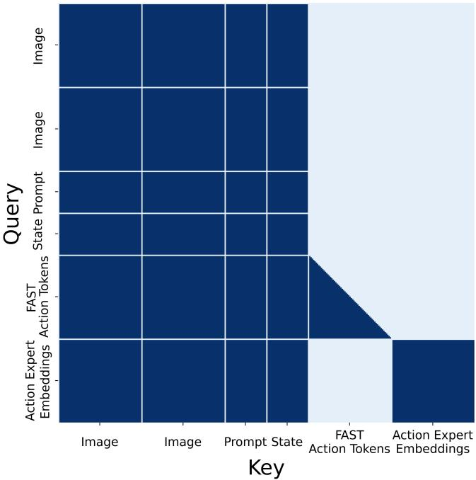

# 1. 论文基本信息 (Bibliographic Information)

*   **标题 (Title):** $π_{0.5}$: 一个具备开放世界泛化能力的视觉-语言-动作模型 ($π_{0.5}$: a Vision-Language-Action Model with Open-World Generalization)
*   **作者 (Authors):** Kevin Black, Noah Brown, James Darpinian, Karan Dhabalia, Danny Driess, Adnan Esmail, Michael Equi, Chelsea Finn, 等 (共30位作者)。作者列表非常长，均隶属于 Physical Intelligence，这通常表明该研究出自一个大型的企业研究团队（例如 Google DeepMind），致力于解决大规模的机器人学习问题。
*   **发表期刊/会议 (Journal/Conference):** 论文提交于 arXiv，这是一个开放获取的预印本平台。
*   **发表年份 (Publication Year):** 2025年 (根据 arXiv ID `2504.16054`，这可能是一个占位符或笔误，通常应为2024年，但在此遵循原文提供的信息)。
*   **摘要 (Abstract):** 为了让机器人真正有用，它们必须能在实验室之外的真实世界中执行实际任务。尽管视觉-语言-动作 (VLA) 模型在端到端机器人控制方面取得了显著成果，但这些模型在野外（真实、多变的环境）的泛化能力仍是一个悬而未决的问题。本文描述了一个名为 $π_{0.5}$ 的新模型，它基于 $π_{0}$ 模型，通过在异构任务上进行协同训练 (co-training) 来实现广泛的泛化能力。$π_{0.5}$ 利用来自多种机器人、高层语义预测、网络数据及其他来源的数据，以实现泛化能力强的真实世界机器人操作。该系统结合了协同训练和混合多模态样本，这些样本融合了图像观测、语言指令、物体检测、语义子任务预测和底层动作。实验表明，这种知识迁移对于有效的泛化至关重要，并且本文首次证明了一个端到端学习的机器人系统能够在全新的家庭环境中执行长时程、灵巧的操作技能，例如打扫厨房或卧室。
*   **原文链接 (Source Link):**
    *   **原文链接:** https://arxiv.org/abs/2504.16054
    *   **PDF 链接:** https://arxiv.org/pdf/2504.16054v1.pdf
    *   **发布状态:** 预印本 (Preprint)。

# 2. 整体概括 (Executive Summary)

*   **研究背景与动机 (Background & Motivation - Why):**
    *   **核心问题：** 如何让机器人在实验室之外的、从未见过的“开放世界” (Open World) 中，像人一样理解指令并完成复杂的、长时程的任务？这个问题被称为**开放世界泛化 (Open-World Generalization)**。
    *   **当前挑战 (Gap)：** 现有的机器人学习系统，包括先进的视觉-语言-动作 (VLA) 模型，虽然在特定或已知的环境中表现出色，但一旦进入全新的、充满未知物体和布局的真实家庭环境，其性能会急剧下降。仅仅通过在目标机器人上收集更多数据来覆盖所有可能场景是不切实际的。现有方法缺少一个能够融合多种知识来源、从而获得强大泛化能力的有效训练配方 (training recipe)。
    *   **创新思路：** 作者认为，正如人类从多种渠道（亲身实践、书本知识、他人指导）学习一样，机器人也应如此。本文的切入点是设计一个**协同训练 (co-training)** 框架，让一个统一的 VLA 模型能够从极其**异构 (heterogeneous)** 的数据源中学习。这些数据源不仅包括目标机器人的操作数据，还包括其他形态的机器人数据、网络上的图文数据、高层级的语义任务标注，甚至是人类的口头指导。

*   **核心贡献/主要发现 (Main Contribution/Findings - What):**
    *   **提出了 $π_{0.5}$ 模型及其训练配方：** 这是本文最核心的贡献。$π_{0.5}$ 是一个视觉-语言-动作 (VLA) 模型，其关键创新在于其训练方法。该方法包含一个**两阶段训练流程**（预训练和后训练），并系统性地整合了多种异构数据源。
    *   **首次实现了在全新家庭中的长时程复杂任务：** 论文通过实验证明，$π_{0.5}$ 能够控制移动操作机器人在**完全未见过的真实家庭**中，执行长达10-15分钟的复杂任务，例如“打扫厨房”或“整理卧室”。这是端到端学习机器人在泛化能力上取得的重大突破。
    *   **验证了异构数据协同训练的有效性：** 实验明确表明，从其他机器人、网络数据、高层语义预测等多种来源迁移知识，对于实现这种强大的泛化能力是**必不可少**的。如果没有这些额外的数据源，即使在大量环境中训练，模型性能也会显著下降。

# 3. 预备知识与相关工作 (Prerequisite Knowledge & Related Work)

*   **基础概念 (Foundational Concepts):**
    *   **视觉-语言-动作模型 (Vision-Language-Action Model, VLA):** 这是一种基于大型语言模型 (LLM) 或视觉语言模型 (VLM) 架构的机器人策略模型。它能够同时处理三种模态的信息：**视觉** (Vision, 来自机器人摄像头的图像)、**语言** (Language, 人类给出的自然语言指令，如“把桌子上的苹果拿给我”) 和**动作** (Action, 机器人需要执行的物理操作，如关节角度、末端执行器位置等)。通过将这三者都编码为统一的序列格式（通常是 `token`），VLA 可以利用强大的 Transformer 架构进行端到端的学习，直接从图像和指令映射到动作。
    *   **端到端学习 (End-to-End Learning):** 这是一种机器学习方法，指模型直接从原始输入（如图像像素）学习并输出最终结果（如机器人动作），中间没有明确划分的功能模块（如物体识别、路径规划、动作控制等）。这种方法的优点是能够学习到各部分之间复杂的协同关系，但缺点是需要大量数据且模型内部决策过程不透明。
    *   **协同训练 (Co-training):** 指使用一个模型同时在多个不同但相关的任务或数据集上进行训练。其核心思想是，通过学习多样化的任务，模型可以掌握更具泛化性的知识和表征，从而在主任务上表现更好。本文中的协同训练是指将机器人动作数据、网络图文数据、高层语义数据等混合在一起训练 $π_{0.5}$ 模型。
    *   **开放世界泛化 (Open-World Generalization):** 指智能体（如机器人）在训练期间从未见过的、充满未知和变化的真实环境中有效执行任务的能力。这是衡量机器人智能实用性的一个关键标准。

*   **前人工作 (Previous Works):**
    *   **通用机器人操作策略 (Generalist robot manipulation policies):** 近期研究通过在多样化的任务和场景上训练，提升了机器人的泛化能力。VLA 模型是其中的一个热门方向，它们通过微调预训练的视觉语言模型来利用其从网络数据中学到的丰富语义知识。然而，这些模型通常在与训练环境相似的场景中进行评估，难以应对真正“开放世界”的挑战。
    *   **非机器人数据协同训练 (Non-robot data co-training):** 一些工作尝试利用非机器人数据（如计算机视觉数据集、网络图文数据）来提升机器人策略的泛化能力。例如，VLA 模型通常会利用在网络数据上预训练好的 VLM 进行初始化。本文的工作将协同训练的概念推向了更广的范围，不仅包括 VLM 训练数据，还系统性地融入了来自**其他机器人**的数据、**高层语义预测**和**口头指令**。
    *   **机器人语言推理与规划 (Robot reasoning and planning with language):** 为了解决长时程任务，许多工作采用分层方法：一个高层模型（通常是 LLM 或 VLM）负责将复杂指令分解为简单的子任务（如“打扫厨房”->“拿起盘子”->“放入水槽”），再由一个底层策略执行这些子任务。这些方法通常使用两个独立的模型。

*   **技术演进 (Technological Evolution):**
    机器人学习从早期针对单一任务、在固定环境中训练的策略，逐步发展到能够在多任务、多场景下工作的通用策略。VLA 模型的出现是一个重要里程碑，它将机器人控制问题与大模型技术相结合，极大地提升了机器人的语言理解和语义泛化能力。本文正是在这一技术脉络上，探索如何通过更丰富、更多样的数据和训练范式，将 VLA 模型的泛化能力从“实验室内的多样性”推向“真实世界的开放性”。

*   **差异化分析 (Differentiation):**
    与之前的工作相比，本文的核心区别在于：
    1.  **数据异构性的广度：** 以前的工作可能使用网络数据或多任务数据，但 $π_{0.5}$ 系统性地整合了**移动机器人、非移动机器人、实验室机器人、网络数据、人工标注的高层子任务、人类口头指令**等多种来源，其数据多样性前所未有。
    2.  **统一的分层推理架构：** 与使用两个独立模型进行高层规划和底层控制的方法不同，$π_{0.5}$ 使用**同一个模型**来完成这两项任务。它首先生成高层子任务文本，然后将该文本作为条件，继续生成底层动作。这种类似“思维链” (`Chain-of-Thought`) 的方式使得整个系统更加简洁和高效。
    3.  **对开放世界泛化的严格验证：** 本文的实验评估**全部在全新的、未见过的真实家庭环境中进行**，这为模型的泛化能力提供了迄今为止最强有力的证明之一。

# 4. 方法论 (Methodology - Core Technology & Implementation Details)

$π_{0.5}$ 的核心是一个基于 Transformer 的 VLA 模型，其训练和推理过程经过精心设计，以最大化泛化能力。

*该图像是论文中图3的示意图，展示了π0.5模型的训练及推理流程。模型先通过预训练视觉语言模型处理多模态数据，再在后训练阶段进行子任务预测，最终由动作专家输出连续动作，用于执行高层指令。*

上图展示了 $π_{0.5}$ 的整体架构。模型首先进行高层推理，预测出语义子任务，然后基于该子任务进行底层推理，预测出机器人的具体动作。

*   **方法原理 (Methodology Principles):**
    *   **分层推理 (Hierarchical Inference):** 模型在推理时采用两步走策略。第一步，接收高层指令（如“打扫卧室”）和当前视觉观察，生成一个具体的、短期的子任务指令（如“捡起枕头”）。第二步，将这个子任务指令和视觉观察作为输入，生成机器人执行该子任务所需的连续动作序列。这种分层结构有助于模型处理长时程、多步骤的复杂任务。
    *   **统一模型 (Unified Model):** 整个分层推理过程由**同一个 $π_{0.5}$ 模型**完成，而不是两个独立的模型。这使得高层规划和底层执行之间可以共享知识和表征，提高了效率和一致性。
    *   **混合动作表示 (Hybrid Action Representation):** 为了兼顾训练效率和推理速度，模型在不同阶段使用不同的动作表示方法。在预训练阶段，使用计算效率高的**离散动作词元 (discrete action tokens)**；在后训练和推理阶段，使用表达能力更强、更适合实时控制的**连续动作表示 (continuous actions)**，通过流匹配 (flow matching) 生成。

*   **方法步骤与流程 (Steps & Procedures):**
    **1. 模型架构 ($π_{0.5}$ architecture):**
    模型的目标是学习一个联合概率分布 $\pi _ { \boldsymbol { \theta } } ( \mathbf { a } _ { t : t + H } , \hat { \ell } | \mathbf { o } _ { t } , \ell )$，并将其分解为：
    $$
    \pi _ { \boldsymbol { \theta } } ( \mathbf { a } _ { t : t + H } , \hat { \ell } | \mathbf { o } _ { t } , \ell ) = \pi _ { \boldsymbol { \theta } } ( \mathbf { a } _ { t : t + H } | \mathbf { o } _ { t } , \hat { \ell } ) \pi _ { \boldsymbol { \theta } } ( \hat { \ell } | \mathbf { o } _ { t } , \ell )
    $$
    *   **符号解释:**
        *   $\mathbf{o}_t$: $t$ 时刻的观测，包括来自多个摄像头的图像 $\mathbf{I}_t$ 和机器人自身状态（关节角度、基座速度等）$\mathbf{q}_t$。
        *   $\ell$: 人类给出的高层任务指令，如 "clean the kitchen"。
        *   $\hat{\ell}$: 模型预测的子任务指令，如 "pick up the plate"。
        *   $\mathbf{a}_{t:t+H}$: 模型预测的从 $t$ 到 $t+H$ 时刻的动作序列（一个动作块）。
        *   $\pi_{\boldsymbol{\theta}}$: 由参数 $\boldsymbol{\theta}$ 控制的模型。
    *   **流程解释:**
        *   第一部分 $\pi _ { \boldsymbol { \theta } } ( \hat { \ell } | \mathbf { o } _ { t } , \ell )$ 是**高层推理**，模型根据当前观察和总任务目标，预测下一步该做什么（生成 $\hat{\ell}$）。
        *   第二部分 $\pi _ { \boldsymbol { \theta } } ( \mathbf { a } _ { t : t + H } | \mathbf { o } _ { t } , \hat { \ell } )$ 是**底层推理**，模型根据当前观察和预测出的子任务，生成具体的执行动作（生成 $\mathbf{a}_{t:t+H}$）。
    *   模型内部使用了一个特殊的“**动作专家 (action expert)**”，即一部分具有独立权重的 Transformer 层，专门用于处理和生成动作相关的 `token`，这可以使动作生成更专业、更高效。

    **2. 训练流程 (Training Recipe):**
    训练分为两个主要阶段：

    *   **预训练 (Pre-training):**
        *   **目标：** 让模型从极其广泛的数据中学习通用的视觉、语言和行为知识。
        *   **方法：** 在这个阶段，所有动作都被编码为离散的 `FAST` 词元，与文本词元一样处理。模型被训练为一个标准的自回归 Transformer，进行下一词元预测。
        *   <strong>数据源 (<code>Figure 4</code>)：</strong>

            
            *该图像是论文中图4的示意图，展示了$\pi_{0.5}$模型在预训练和后训练阶段所用的多种任务示例，涵盖了多机器人动作、多模态数据、高层次子任务以及语言指令等多样化输入形式。*

            *   `MM` (Diverse Mobile Manipulator data): 约400小时，来自在100个不同家庭中执行任务的移动操作机器人。这是与最终任务最相关的数据。
            *   `ME` (Diverse Multi-Environment non-mobile robot data): 来自在更多家庭环境中部署的非移动机械臂（单臂或双臂）的数据。由于它们更易于部署，因此覆盖的环境更多样。
            *   `CE` (Cross-Embodiment laboratory data): 来自实验室环境中多种不同形态的机器人（单臂、双臂、移动、静态）执行各种任务的数据，还包括了开源的 `OXE` 数据集。
            *   `HL` (High-Level subtask prediction): 在 `MM`, `ME`, `CE` 数据中，对多步骤任务进行人工标注，提供语义子任务标签（如 "pick up pillow"）。模型被训练来预测这些标签。
            *   `WD` (Multi-modal Web Data): 来自网络的多种多模态数据，包括图像描述、视觉问答 (VQA)、物体定位（边界框）等。

    *   **后训练 (Post-training):**
        *   **目标：** 使模型专门化于家庭移动操作任务，并引入更高效的连续动作生成机制。
        *   **方法：** 在此阶段，模型中加入了一个随机初始化的**动作专家**，并采用**流匹配 (Flow Matching)** 来生成连续动作。训练目标是同时优化文本/离散词元预测（交叉熵损失）和连续动作预测（流匹配损失）。
        *   **数据源：** 主要使用高质量的 `MM` 和 `ME` 数据，并保留 `WD` 和 `HL` 数据以维持模型的语义和推理能力。此外，还引入了一种新数据：
            *   `VI` (Verbal Instruction demonstrations): 人类专家通过实时发送语言子任务指令来“遥控”机器人完成任务。这为模型提供了高质量的“高层策略”示范数据。

*   **数学公式与关键细节 (Mathematical Formulas & Key Details):**
    *   **混合损失函数 (Combined Loss Function):**
        在后训练阶段，模型优化的组合损失函数为：
    $$
    \begin{array} { r l } & { \mathbb { E } _ { \mathcal { D } , \tau , \omega } \Big [ H \big ( x _ { 1 : M } , f _ { \theta } ^ { \ell } ( \mathbf { o } _ { t } , \ell ) \big ) } \\ & { \qquad + \alpha \left\| \omega - \mathbf { a } _ { t : t + H } - f _ { \theta } ^ { a } ( \mathbf { a } _ { t : t + H } ^ { \tau , \omega } , \mathbf { o } _ { t } , \ell ) \right\| ^ { 2 } \Big ] , } \end{array}
    $$
    *   **符号解释:**
        *   $H(\cdot)$: 交叉熵损失 (Cross-Entropy Loss)，用于文本和离散动作词元的预测。
        *   $x_{1:M}$: 真实的文本和离散动作词元序列。
        *   $f_{\theta}^{\ell}(\cdot)$: 模型主干部分对文本词元的预测 logits。
        *   $\alpha$: 权衡两种损失的超参数。
        *   $\|\cdot\|^2$: L2 范数平方，即均方误差损失 (Mean Squared Error)。
        *   $\omega \sim \mathcal{N}(0, \mathbf{I})$: 从标准正态分布中采样的噪声。
        *   $\tau \in [0, 1]$: 流匹配的时间步。
        *   $\mathbf{a}_{t:t+H}$: 真实的连续动作序列（目标）。
        *   $\mathbf{a}_{t:t+H}^{\tau, \omega} = (1-\tau)\mathbf{a}_{t:t+H} + \tau\omega$: 从目标动作到噪声的插值。
        *   $f_{\theta}^{a}(\cdot)$: 动作专家部分的输出，预测的是从插值点指向目标动作的向量场的一部分。
    *   **公式目的:** 这个公式的目标是让模型同时学会两件事：1) 像语言模型一样准确预测文本和离散词元（第一项）；2) 动作专家学会预测一个向量场，通过积分这个场可以从随机噪声恢复出真实的机器人动作（第二项），这是流匹配的核心思想。

# 5. 实验设置 (Experimental Setup)

*   **数据集 (Datasets):**
    *   **训练数据：** 如方法论部分所述，包含 `MM`, `ME`, `CE`, `HL`, `WD`, `VI` 六大类异构数据。特别地，移动机器人数据 (`MM`) 采集自约100个不同的家庭环境。
    *   **评估环境：** 实验评估**全部在训练期间未见过的全新环境中进行**，以严格测试模型的泛化能力。这包括：
        *   **模拟家居环境 (Mock home environments):** 用于可控和可复现的量化比较。
        *   **三个真实的家庭 (Three real homes):** 用于最终的、最贴近实际应用的评估。

            
            *该图像是图表，展示了三套不同家庭环境下机器人执行清理任务的多步骤操作过程，每行包括人类指令、预测的高层次语义指令和机器人执行的图像序列，体现了系统在不同家中完成放置食物和整理衣物任务的能力。*

*   **评估指标 (Evaluation Metrics):**
    *   **任务进度 (Task Progress):**
        1.  **概念定义:** 该指标衡量在一个长时程、多步骤的任务中，机器人完成了任务的百分之多少。例如，一个任务包含10个步骤，机器人成功完成了5个，则任务进度为50%。它用于评估模型在复杂任务上的端到端综合能力。
        2.  **数学公式:** 论文中没有给出标准公式，但其定义可以表示为：
            $$
            \text{Task Progress} = \frac{\text{Number of successfully completed sub-steps}}{\text{Total number of sub-steps in the task}}
            $$
        3.  **符号解释:**
            *   `Number of successfully completed sub-steps`: 机器人成功完成的子任务或关键步骤的数量。
            *   `Total number of sub-steps in the task`: 该任务被定义的总子任务或关键步骤数量。

    *   **语言遵循率 (Language Following Rate):**
        1.  **概念定义:** 该指标衡量机器人在多大程度上能够正确理解语言指令，并选择指令中指定的物体进行交互。它主要评估模型的语义理解和视觉定位能力，而不关心后续操作是否成功。
        2.  **数学公式:**
            $$
            \text{Language Following Rate} = \frac{\text{Number of trials where the correct object was selected}}{\text{Total number of trials}}
            $$
        3.  **符号解释:**
            *   `Number of trials where the correct object was selected`: 机器人根据指令选择了正确物体的试验次数。
            *   `Total number of trials`: 总的试验次数。

    *   **成功率 (Success Rate):**
        1.  **概念定义:** 该指标衡量机器人完整并成功地执行整个指令的比例。它不仅要求机器人理解指令并选择正确的物体，还要求它成功地完成后续的所有操作（如抓取、移动、放置）。这是一个比语言遵循率更严格、更全面的指标。
        2.  **数学公式:**
            $$
            \text{Success Rate} = \frac{\text{Number of trials with full task completion}}{\text{Total number of trials}}
            $$
        3.  **符号解释:**
            *   `Number of trials with full task completion`: 机器人完全成功完成任务的试验次数。
            *   `Total number of trials`: 总的试验次数。

*   **对比基线 (Baselines):**
    *   **模型消融 (Ablations of $π_{0.5}$):** 通过移除训练配方中的部分数据来进行比较，如 `no WD` (无网络数据)、`no ME` (无非移动机器人数据)、`no CE` (无实验室数据)。
    *   **不同数量的训练环境:** 训练模型时使用不同数量的家庭环境数据（从3个到104个），以分析数据多样性对泛化的影响。
    *   **与其他 VLA 模型对比:**
        *   $π₀$: 原始的 $π₀$ 模型。
        *   `π₀-FAST+Flow`: 一个增强版的 $π₀$，它采用了与 $π_{0.5}$ 相似的混合动作表示训练方法，但没有使用 `HL` 和 `WD` 等协同训练数据。
    *   **高层推理方法对比:**
        *   `implicit HL`: 不进行显式的高层子任务预测，直接将高层指令输入底层策略。
        *   `no VI`: 训练时移除 `VI` (口头指令) 数据。
        *   `GPT-4`: 使用外部的 `GPT-4V` 模型进行零样本 (zero-shot) 高层规划，生成子任务指令。

# 6. 实验结果与分析 (Results & Analysis)

*   **核心结果分析 (Core Results Analysis):**
    *   **1. $π_{0.5}$ 能否泛化到真实家庭？(是)**

        
        *该图像是图表，展示了论文中在不同真实家庭和模拟环境下，厨房抽屉、卧室洗衣篮、厨房水槽等任务的平均完成进度。不同颜色代表真实和模拟环境的表现差异。*

        `Figure 7` 和 `Figure 8` (上图为`Figure 7`的(b)部分，即`Figure 8`的转录图) 展示了 $π_{0.5}$ 在3个从未见过的真实家庭中执行“物品放入抽屉”、“衣物放入洗衣篮”、“碗碟放入水槽”等任务。结果显示，模型在这些全新环境中取得了很高的任务进度，证明了其强大的开放世界泛化能力。例如，在模拟环境和真实环境中，各项任务的平均进度都达到了较高水平，且两者表现相当，说明模拟环境的评估结果能很好地代表真实世界的性能。

    *   **2. 泛化能力如何随训练环境数量扩展？(显著提升)**

        
        *该图像是图表，展示了论文中 π_{0.5} 模型的注意力掩码模式。图中通过矩阵形式呈现不同信息类型（如图像、提示、状态、动作标记及专家嵌入）之间的注意力关系。*

        `Figure 8` (上图) 显示，随着训练数据中家庭环境数量从3个增加到104个，模型在4个测试任务上的平均任务进度稳步提升。更重要的是，拥有104个地点的模型（深黄色条）的性能几乎与一个在测试环境数据上训练过的模型（绿色条）相当，这表明**通过在足够多样化的环境中训练，模型几乎弥合了泛化差距**。

        
        *该图像是论文中展示机器人执行厨房多任务的连续插图，显示机器人根据指令依次完成“关闭橱柜”、“把物品放入抽屉”、“擦拭溢出物”和“将碗碟放入水槽”的操作。*

        `Figure 9` (上图) 进一步分析了语言遵循能力。随着训练地点增多，模型对“分布内” (in-distribution, 训练中见过的物体类别) 和“分布外” (out-of-distribution, 未见过的物体类别) 物体的操作成功率都得到提升。这表明增加环境多样性不仅能提升对已知事物的鲁棒性，还能增强对全新事物的泛化能力。

    *   **3. 协同训练的各个部分有多重要？(都非常重要)**

        
        *该图像是论文中图3的示意图，展示了π0.5模型的训练及推理流程。模型先通过预训练视觉语言模型处理多模态数据，再在后训练阶段进行子任务预测，最终由动作专家输出连续动作，用于执行高层指令。*

        `Figure 10` (上图) 展示了移除不同数据源后的性能变化。移除跨形态机器人数据 `ME` 或 `CE` 都会导致性能显著下降，同时移除两者则性能更差。这证明**从其他机器人学习到的经验对于目标机器人的泛化至关重要**。

        
        *该图像是论文中图4的示意图，展示了$\pi_{0.5}$模型在预训练和后训练阶段所用的多种任务示例，涵盖了多机器人动作、多模态数据、高层次子任务以及语言指令等多样化输入形式。*

        `Figure 11` (上图) 则揭示了网络数据 `WD` 的重要性。在语言遵循任务中，移除 `WD` (`no WD`，蓝色线) 会严重影响模型处理**分布外 (OOD) 物体**的能力。这说明网络数据中包含的广泛物体知识是模型理解和操作新物体的关键。

    *   **4. $π_{0.5}$ 与其他 VLA 的比较 (显著优越)**

        
        *该图像是图 5 的示意图，展示了用于 `_ {0.5}` 模型的双移动操控机器人系统。系统包含两个6自由度机械臂和1自由度夹持器，4个摄像头（前、后及腕部各两个），一个3自由度全向底盘，以及1-2自由度的升降机构。*

        `Figure 12` (上图) 显示，在模拟家居环境的四个测试任务中，$π_{0.5}$ 的平均任务进度显著高于原始的 $π₀$ 模型和增强版的 `π₀-FAST+Flow`。这证明了 $π_{0.5}$ 独特的、包含异构数据协同训练的配方是其高性能的关键，而不仅仅是其先进的动作表示。

    *   **5. 高层推理有多重要？(至关重要)**

        
        *该图像是对比实验示意图，展示了机器人在模拟厨房与卧室（Mock Kitchens和Mock Bedrooms）与真实厨房和卧室（Real Kitchens和Real Bedrooms）环境中的操作场景，从而验证模型在不同环境下的泛化能力。*

        `Figure 13` (上图) 对比了不同的高层推理策略。
        *   完整的 $π_{0.5}$ (蓝色条) 性能最好。
        *   不进行显式高层推理的 `implicit HL` (紫色条) 性能大幅下降，说明分层推理结构是有效的。
        *   移除 `VI` (口头指令) 数据 (`no VI`, 橙色条) 或 `WD` (网络数据) (`no WD`, 绿色条) 都会损害高层推理能力，导致最终性能下降。这表明高质量的人类示范和广泛的网络知识对于模型学会“思考”下一步做什么至关重要。
        *   使用强大的 `GPT-4` 进行零样本规划（灰色条）效果最差，这表明**与机器人自身能力和观察紧密集成的、端到端训练出的内部规划能力，比通用的外部大模型更有效**。

*   **消融实验/参数分析 (Ablation Studies / Parameter Analysis):**
    如上所述，论文进行了详尽的消融实验，系统地验证了训练数据多样性（环境数量）、异构数据源（`WD`, `ME`, `CE`）以及高层推理机制（`VI`, 分层结构）的必要性。这些实验共同描绘了一幅清晰的图景：$π_{0.5}$ 的成功并非来自单一因素，而是其精心设计的、融合了多种知识来源的整体训练配方的结果。

# 7. 总结与思考 (Conclusion & Personal Thoughts)

*   **结论总结 (Conclusion Summary):**
    这篇论文成功地提出了一个名为 $π_{0.5}$ 的 VLA 模型及其创新的训练配方，在解决机器人开放世界泛化问题上取得了重大突破。其核心结论是：通过在一个统一的模型中，系统性地协同训练来自多种机器人、网络、高层语义和人类指导的异构数据，可以赋予机器人前所未有的泛化能力。论文首次通过实验证明，一个端到端学习的系统能够在完全陌生的真实家庭环境中，自主完成长时程、高难度的日常操作任务，为通用机器人的实现路径提供了强有力的证据和新的方向。

*   **局限性与未来工作 (Limitations & Future Work):**
    *注意：原文在实验分析部分被截断，未包含结论和局限性章节。以下是基于已有内容推断的潜在局限性与未来工作。*
    1.  **数据依赖性与可扩展性：** 尽管方法有效，但它仍然依赖于大规模、多样化的数据集（特别是400小时的移动机器人数据）。如何降低数据收集成本，或者利用更多成本更低的数据源（如模拟数据、人类视频），是未来需要解决的关键问题。
    2.  **任务范围：** 实验主要集中在“整理”和“清洁”类任务。模型能否泛化到需要更精细操作、工具使用或与人交互等其他类型的复杂任务，仍有待验证。
    3.  **安全性与鲁棒性：** 论文提到控制系统非常简单（PD控制器，无碰撞检测），这在现实世界中是不够安全的。如何在保持端到端学习优势的同时，集成可靠的安全约束和故障恢复机制，是一个重要的研究方向。
    4.  **实时性与计算成本：** 尽管后训练阶段优化了推理速度，但运行如此庞大的模型进行实时控制，对硬件的要求依然很高。进一步优化模型大小和计算效率是走向实际应用的前提。

*   **个人启发与批判 (Personal Insights & Critique):**
    *   **启发：**
        *   **数据“成分”重于“数量”：** 这篇论文给我最大的启发是，对于泛化能力而言，训练数据的“多样性”和“异构性”可能比单纯的“数量”更重要。它展示了一条通过巧妙地组合不同类型的知识，来构建更强大智能的路径。
        *   **内置推理优于外部调用：** 实验结果表明，在模型内部通过训练形成的分层推理能力，优于调用一个功能更强大但与具体任务解耦的外部模型（如 `GPT-4`）。这强调了“具身智能” (Embodied Intelligence) 的重要性——智能必须与其所处的物理世界和自身的能力紧密结合。
        *   **工程与科学的完美结合：** $π_{0.5}$ 的成功不仅在于其宏大的理念，也在于其精巧的工程设计，例如混合动作表示、两阶段训练流程等。这体现了在AI研究中，顶层设计和底层实现同等重要。

    *   **批判性思考：**
        *   <strong>“开放世界”</strong>的定义： 尽管论文在“全新家庭”中进行了测试，但这仍然是与训练环境相似的“家庭”场景。模型能否泛化到办公室、商场、户外等完全不同的环境类型，是其“开放世界”能力的更高阶测试。
        *   **对失败的分析不足：** 论文主要报告了成功率和任务进度，但对失败案例的深入分析较少。理解模型在什么情况下会失败（是感知错误、规划不当还是控制失误？），对于改进模型同样重要。
        *   **可复现性挑战：** 鉴于其巨大的数据和计算需求，以及可能存在的未公开细节，复现这项工作的门槛极高，这可能会在一定程度上限制社区对其进行更广泛的验证和改进。