# π0.5：一种具有开放世界泛化能力的视觉-语言-动作模型

身体智力

凯文·布莱克，诺亚·布朗，詹姆斯·达皮尼安，卡兰·达巴利亚，丹尼·德里斯，阿德南·埃斯梅尔，迈克尔·埃奎，切尔西·芬，尼科洛·富赛，曼努尔·Y·加利克，迪比亚·戈什，拉基·格鲁姆，卡罗尔·豪斯曼，布莱恩·伊克特，希蒙·雅库布查克，蒂姆·琼斯，李一鸣，德文·勒布朗，谢尔盖·莱文，阿德里安·李-贝尔，莫希特·莫图库里，苏拉·纳尔，卡尔·佩尔茨，艾伦·Z·任，露西·小阳·石，劳拉·史密斯，约斯特·塔比亚斯·斯里根伯，凯尔·斯塔克·詹姆斯·坦纳，权·旺，霍默·沃尔克，安娜·沃林，浩环·王，莉莉·余，尤里·日林斯基 https://pi.website/blog/pi05

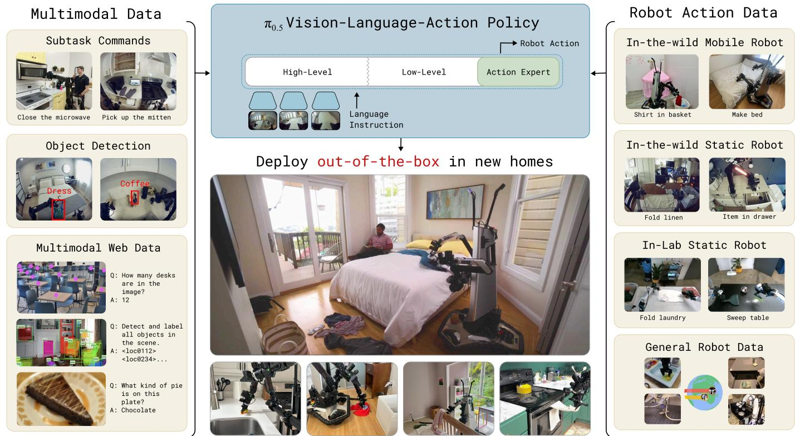  
Fig. 1: The $\pi _ { 0 . 5 }$ and data from the web, in order to enable broad generalization across environments and objects. $\pi _ { 0 . 5 }$ can control a mobile manipulator to clean kitchens and

摘要—为了使机器人具有实用性，它们必须在现实世界中执行实际相关的任务，而不是仅仅在实验室中。尽管视觉-语言-动作（VLA）模型已在端到端机器人控制中展示出令人印象深刻的结果，但这些模型在野外的泛化能力仍然是一个未解的问题。我们描述了$\pi _ { 0 . 5 }$，这是一个基于$\pi _ { 0 }$的新模型，利用异构任务的共同训练来实现广泛的泛化。$\pi _ { 0 . 5 }$使用来自多个机器人的数据、高级语义预测、网络数据和其他来源，以实现广泛可泛化的现实世界机器人操作。我们的系统结合了共同训练和混合多模态示例，结合了图像观察、语言指令、物体检测、语义子任务预测和低级动作。我们的实验表明，这种知识转移对于有效泛化至关重要，我们首次证明了一个基于端到端学习的机器人系统能够在全新的家庭中执行长期和灵巧的操作技能，例如清洁厨房或卧室。

# I. 引言

用惊奇填满你的眼睛……看看世界。它比任何在工厂里制造或购买的梦都要奇妙。

雷·布拉德伯里，《华氏451度》

开放世界概化代表了物理智能中最大的未解问题之一：具身系统，如机器人手臂、人形机器人和自动驾驶汽车，只有在能够离开实验室，处理现实世界中发生的多样情况和意外事件时，才真正变得有用。基于学习的系统提供了一条实现广泛概化的路径，特别是最近的进展使得可扩展学习系统在自然语言处理 [79, 21, 10, 78] 到计算机视觉 [34, 66, 35, 43] 等领域得以实现。然而，机器人在现实世界中可能遇到的情况多样性要求的不仅仅是规模：我们需要设计培训方案，以提供广泛的知识，使机器人能够在多个抽象层次上进行概化。例如，如果要求移动机器人清理一个它从未见过的厨房，那么一些行为如果在足够范围的场景和物体中得到了良好的表现，就能够很容易地概化（例如，拿起刀或盘子）；其他行为可能需要调整或修改现有技能，以便以新的方式或新的顺序使用它们；还有一些行为可能需要根据先前的知识理解场景的语义（例如，哪个抽屉需要打开，或者柜台上的哪个物体最有可能是晾衣架）。我们如何为一个机器人学习系统构建一个培训方案，以实现这种灵活的概化？

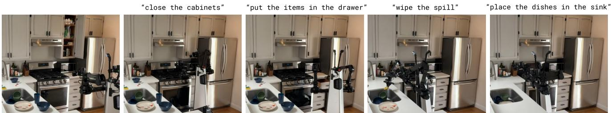  
Fig. 2: $\pi _ { 0 . 5 }$ cn (e.g., pick up the plate) and emitting low-level actions.

一个人可以利用一生的经验来综合出适当的解决方案来应对这些挑战。这些经验并不都是第一手的，也并不全来自机械练习。例如，我们可以使用别人告诉我们的事实或书中读到的内容，以及我们在不同上下文中执行的其他任务中的一些见解，再加上在目标领域的直接经验。类比地，我们可以假设通用的机器人学习系统必须能够从多种信息来源中转移经验和知识。这些来源中，有一些是与当前任务直接相关的第一手经验，有一些需要从其他机器人体现、环境或领域进行转移，还有一些代表完全不同的数据类型，例如基于网络数据的口头指令、感知任务或对高级语义命令的预测。这些不同数据来源的异质性构成了一个主要障碍，但幸运的是，最近在视觉语言行动（VLA）模型方面的进展为我们提供了一个工具包，使这一切成为可能：通过将不同的模态放入相同的序列建模框架中，VLA可以被调整用于训练机器人数据、语言数据、计算机视觉任务及上述组合。

在本文中，我们利用这一观察设计了一个协同训练框架，用于视觉语言模型（VLA），该框架可以利用异质和多样的知识来源，从而实现广泛的泛化能力。

基于 $\pi _ { 0 }$ VLA，我们提出包含多种不同数据来源以创建 $\pi _ { 0 . 5 }$ 模型（“pi oh five”），该模型可以控制移动操作器执行各种家庭任务，即使在训练时从未见过的家庭中也能实现。$\pi _ { 0 . 5 }$ 借鉴了来自多个来源的经验：除了直接在各种真实家庭中用移动操作器收集的中等规模数据集（约 400 小时），$\pi _ { 0 . 5 }$ 还使用来自其他非移动机器人、在实验室条件下收集的相关任务数据、基于机器人观察预测“高层次”语义任务的训练示例、人类监督者提供给机器人的语言指令，以及从网络数据生成的各种多模态示例，如图像字幕、问答和物体定位（见图 1）。提供给 $\pi _ { 0 . 5 }$ 的绝大多数训练示例（在第一轮训练阶段占 $ 9 7 . 6 \%$）并非来自执行家庭任务的移动操作器，而是来自其他来源，如其他机器人或网络数据。尽管如此，$\pi _ { 0 . 5 }$ 能够控制移动操作器在训练期间未见过的全新家庭中执行复杂任务，如挂毛巾或整理床铺，并能够执行长达 10 到 15 分钟的长时间操控技能，仅根据高层次提示清洁整个厨房或卧室。

$\pi_{0.5}$的设计遵循一个简单的层次结构：我们首先在异构的训练任务混合上预训练模型，然后专门针对移动操作进行微调，使用低级动作示例和高级“语义”动作，这些动作对应于预测子任务标签，如“捡起切菜板”或“ rearrange the pillow”。在运行时，在每一步推理过程中，模型首先预测语义子任务，根据任务结构和场景的语义推断接下来应该执行的行为，然后基于该子任务预测低级机器人动作块。这种简单的架构同时提供了推理长时间多阶段任务的能力，并能够利用两个层次的不同知识来源：低级动作推理过程直接受益于其他机器人收集的动作数据，包括在其他环境中更简单的静态机器人，而高级推理过程则受益于网络上的语义示例、高级注释预测，甚至可以由人类“监督者”提供给机器人逐步引导其完成复杂任务的口头指令，告诉它（就像他们指导一个人一样）完成复杂任务（例如清洁一个房间）所需执行的适当子任务。我们在图1中展示了这个设计。

我们的主要贡献是一个用于训练高度可泛化的VLA系统$\pi _ { 0 . 5 }$，以及一个概念证明，表明当该模型在适当多样的数据上训练时，可以出现泛化能力。我们提供了对$\pi _ { 0 . 5 }$的泛化能力以及不同共训练成分相关性的详细实证评估。据我们所知，我们的工作首次展示了一个端到端学习支持的机器人系统，能够在完全不同的家庭中执行长距离和灵巧的操作技能，例如清洁厨房或卧室。我们的实验和比较进一步表明，这一能力源于从其他机器人转移知识、高级语义预测、人类监督者的口头语言指令、网络数据和其他来源。

# II. 相关工作

通用机器人操作策略。最近的研究表明，将机器人操作策略的训练数据分布从狭窄的单任务数据集扩展到涵盖多场景和多任务的多样化数据集，可以使得结果策略不仅能够“开箱即用”地解决更广泛的任务，还能提高它们对新场景和新任务的泛化能力。训练这样的通用策略需要新的建模方法，以处理往往涵盖数百种不同任务和场景的数据集的规模和多样性。视觉-语言-行动模型（VLAs）提供了一种诱人的解决方案：通过微调用于机器人控制的预训练视觉-语言模型，VLAs可以利用从网络规模预训练中获得的语义知识，应用于机器人问题。结合如流匹配、扩散或高级行动标记方案等高度表达性的行动解码机制，VLAs可以在现实世界中执行大量复杂的操作任务。然而，尽管具有令人印象深刻的语言跟随能力，VLAs通常仍在与其训练数据密切匹配的环境中进行评估。虽然一些研究表明，通过在更广泛的环境中收集机器人数据，简单技能如拾取物体或打开抽屉可以实现泛化，但将同样的方法应用于更复杂的长周期任务，如清理厨房，则面临挑战，因为通过大规模收集机器人数据来实现覆盖合理场景的广度是不可行的。在我们的实验中，我们在完全新的场景中评估了 $\pi _ { 0 . 5 }$，例如在训练中未见过的新厨房和卧室，结果显示我们的VLA能够通过利用不仅是目标移动操作者平台的直接第一手经验，还有来自其他数据源的信息，泛化到全新的场景。这些来源包括来自其他（非移动）机器人的数据、高级语义子任务预测和来自网络的数据。

非机器人数据共同训练。许多先前的工作试图利用多样的非机器人数据来改善机器人策略的泛化能力。早期的方法探索了从计算机视觉数据集初始化视觉编码器[85, 58, 57, 18]，或利用现成的任务规划器[38, 48, 73, 81]。VLA策略通常是从一个经过预训练的视觉语言模型初始化，该模型接触了大量的互联网视觉和语言数据[23, 92, 42]。值得注意的是，VLA架构是灵活的，可以在多模态视觉、语言和动作符号的输入和输出序列之间进行映射。因此，VLA拓宽了可能的传输方法的设计空间，不仅支持单个统一架构的共同训练，而且还支持与包含一个或多个上述模态的数据集的训练，不仅限于机器人动作模仿数据。以往的研究表明，使用用于VLM训练的数据混合共同训练VLA[23, 92, 86]可以提高其泛化能力，例如，在与新对象或未见场景背景互动时。在这项工作中，我们超越了VLM数据共同训练，设计了一个系统，利用更广泛的机器人相关监督源共同训练VLA，包括来自其他机器人的数据、高级语义子任务预测和口头语言指令。虽然多任务训练和共同训练并不是新概念，但我们表明我们系统中特定的数据源组合使移动机器人能够在全新环境中执行复杂和长时间跨度的行为。我们相信这种泛化水平，尤其是在考虑到任务的复杂性时，远远超出了以往工作的结果。

机器人推理和规划与语言。一些先前的工作表明，通过高层推理增强端到端策略可以显著提高长远任务的性能，特别是在高层子任务推断可以受益于大型预训练语言模型（LLMs）和视觉语言模型（VLMs）时。我们的方法也使用了一个两阶段推理过程，首先推断一个高层语义子任务（例如，“拿起盘子”），然后基于此子任务预测动作。许多先前的方法为此采用了两个独立的模型，一个VLM预测语义步骤，另一个低层策略执行这些步骤。我们的方法则使用同一个模型进行高层和低层推理，这种方法更像是链式思维或测试时间计算的方法，尽管与具体的链式思维方法不同，高层推理过程的运行频率仍然低于低层动作推理。

开放世界泛化的机器人学习系统 尽管大多数机器人学习系统在与训练数据非常接近的环境中进行评估，但一些先前的研究已经探讨了更广泛的开放世界泛化。当机器人的任务限制在更狭窄的基本原语集时，例如拣起物体，允许特定任务假设的方法（例如，抓取预测或纳入基于模型的规划和控制）已经被证明可以广泛泛化，甚至到全新的家庭。然而，这些方法并不能方便地泛化到全能机器人可能需要执行的所有类型的任务。最近，跨多个领域收集的大规模数据集被证明能够将简单，但端到端学习的任务泛化到新环境。然而，这些演示中的任务仍然相对简单，通常少于一分钟，并且成功率相对较低。我们展示了$\pi _ { 0 . 5 }$能够执行长的多阶段任务，例如将所有的碗碟放入水槽或将所有衣物从新卧室的地板上捡起，同时泛化到全新的家庭。

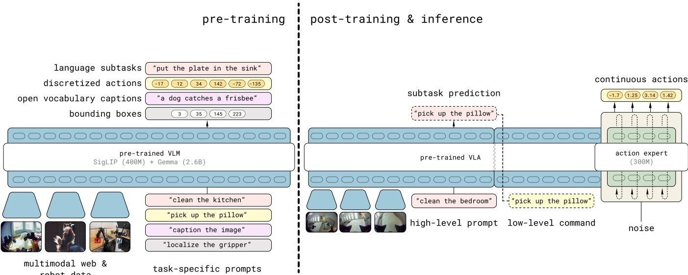  
Fig. 3: Model overview. $\pi _ { 0 . 5 }$ first infers a high-level subtask, and then predicts the actions based on this subtask.

# III. 初步准备

视觉-语言-动作模型（VLA）通常通过在多样化的机器人演示数据集 $\mathcal { D }$ 上进行模仿学习进行训练，通过最大化在给定观察 $\mathbf { o } _ { t }$ 和自然语言任务指令 $\ell$ 的情况下，动作 $\mathbf { a } _ { t }$（或更一般地，动作块 $\mathbf { a } _ { t : t + H }$）的对数似然性 max $\begin{array} { r } { { / } \mathbb { E } _ { ( \mathbf { a } _ { t : t + H } , \mathbf { o } _ { t } , \ell ) \sim \mathcal { D } } \log \big ( \pi _ { \theta } ( \mathbf { a } _ { t : t + H } | \mathbf { o } _ { t } , \ell ) \big ) } \end{array}$。观察通常包含一个或多个图像 $\mathbf { I } _ { t } ^ { 1 } , . . . , \mathbf { I } _ { t } ^ { n }$ 和本体状态 $\mathbf { q } _ { t }$，这捕获了机器人关节的位置。VLA架构遵循现代语言和视觉-语言模型的设计，具有特定于模态的标记器，将输入和输出映射到离散（“硬”）或连续（“软”）标记表示，并且有一个大型自回归变换器骨干，训练其将输入映射到输出标记。这些模型的权重是从预训练的视觉-语言模型初始化的。通过将策略输入和输出编码为标记表示，上述模仿学习问题可以被转换为一个简单的关于观察、指令和动作标记序列的下一个标记预测问题，我们可以利用现代机器学习的可扩展工具来优化它。在实践中，图像和文本输入的标记器选择遵循现代视觉-语言模型的选择。在动作方面，先前的工作开发了有效的基于压缩的标记化方法 [64]，我们在预训练阶段使用这些方法。最近的一些VLA模型还提出通过扩散 [55, 84, 52] 或流匹配 [8] 来表示动作分布，提供对连续值动作块的更具表现力的表示。在我们模型的后训练阶段，我们将基于 $\pi _ { 0 }$ 模型 [8] 的设计，该模型通过流匹配表示动作分布。在该设计中，对应于动作的标记接收来自流匹配前一步的部分去噪动作作为输入，并输出流匹配向量场。这些标记还使用不同的模型权重集，我们称之为“动作专家”，类比于专家混合架构。这个动作专家可以专注于基于流匹配的动作生成，且可以显著小于其余的LLM骨干。

# IV. $\pi _ { 0 . 5 }$ 模型与训练方法

我们在图3中提供了$\pi _ { 0 . 5 }$模型和训练方案的概述。模型权重是基于从网络上训练的标准VLM初始化的，然后训练分为两个阶段：预训练阶段旨在使模型适应多样化的机器人任务，后训练阶段则旨在使其专门化于移动操控，并为其配备高效的测试时间推理机制。在预训练阶段，所有任务，包括包含机器人动作的任务，都用离散标记表示，这导致了简单、可扩展和高效的训练[64]。在后训练阶段，我们将模型适配为也具备动作专家，与$\pi _ { 0 }$类似，以便以更细粒度表示动作，并实现更高效的实时控制推理。推理时，模型首先为机器人生成一个高层次的子任务，然后根据该子任务通过动作专家预测低层次动作。我们在下面描述模型架构，接着描述每个阶段及其相应的训练任务。

# A. $\pi _ { 0 . 5 }$ 架构

$\pi _ { \theta } ( \mathbf { a } _ { t : t + H } , \hat { \ell } | \mathbf { o } _ { t } , \ell )$的模型所捕获的分布可以灵活地表示动作块分布和标记文本输出，后者被用于协同训练任务（例如，问答）以及在分层推理过程中输出高层子任务预测。这里$\mathbf o _ { t } = [ \mathbf I _ { t } ^ { 1 } , . . . , \mathbf I _ { t } ^ { n } , \mathbf q _ { t } ]$包含来自所有摄像头的图像和机器人的配置（关节角度、抓取器姿态、躯干抬升姿态和基座速度），$\ell$是整体任务提示（例如，“收拾餐具”），$\hat { \ell }$表示模型的（标记化的）文本输出，这可以是预测的高层子任务（例如，“拿起盘子”）或是网页数据中视觉-语言提示的答案，而$\mathbf { a } _ { t : t + H }$是预测的动作块。我们将分布分解为

$$
\pi _ { \boldsymbol { \theta } } ( \mathbf { a } _ { t : t + H } , \hat { \ell } | \mathbf { o } _ { t } , \ell ) = \pi _ { \boldsymbol { \theta } } ( \mathbf { a } _ { t : t + H } | \mathbf { o } _ { t } , \hat { \ell } ) \pi _ { \boldsymbol { \theta } } ( \hat { \ell } | \mathbf { o } _ { t } , \ell ) ,
$$

其中，动作分布不依赖于 $\ell$ ，只依赖于 $\hat { \ell }$ 。因此，高层推理捕获 $\pi _ { \boldsymbol { \theta } } ( \widehat { \ell } | _ { \mathbf { o } _ { t } , \ell } )$ ，而低层推理捕获 $\pi _ { \boldsymbol { \theta } } \big ( \mathbf { a } _ { t : t + H } \big | \mathbf { o } _ { t } , \widehat { \ell } \big )$ ，这两种分布由同一模型表示。

该模型对应于一个变压器，它接收 $N$ 个多模态输入标记 $x _ { 1 : N }$（在这里我们宽松地使用“标记”一词，指代离散和连续输入），并生成一系列多模态输出 $y _ { 1 : N }$，我们可以写成 $y _ { 1 : N } = f { \big ( } x _ { 1 : N } , A ( x _ { 1 : N } ) , \rho ( x _ { 1 : N } ) { \big ) }$。每个 $x _ { i }$ 可以是文本标记 $( x _ { i } ^ { w } \in \mathbb { N } )$，图像块 $( \boldsymbol { \dot { x } } _ { i } ^ { I } \in \mathbb { R } ^ { p \times p \times 3 } )$，或流匹配中机器人动作的中间去噪值 $( x _ { i } ^ { a } \in \mathbb { R } ^ { d } )$。观测值 $\mathbf { o } _ { t }$ 和 $\ell$ 形成了 $x _ { 1 : N }$ 的前缀部分。根据标记类型，如 $\rho ( x _ { i } )$ 所示，每个标记不仅可以通过不同的编码器进行处理，还可以通过变压器内的不同专家权重进行处理。例如，将图像块通过视觉编码器进行处理，而文本标记则通过嵌入矩阵进行嵌入。遵循 $\pi _ { 0 }$ [8]，我们将动作标记 $\boldsymbol { x } _ { i } ^ { a }$ 线性投影到变压器嵌入空间，并在变压器中使用单独的专家权重来处理动作标记。注意力矩阵 $A ( x _ { 1 : N } ) \in [ 0 , 1 ] ^ { N \times N }$ 表示一个标记是否可以关注另一个标记。与 LLM 中的标准因果注意力相比，图像块、文本提示和连续动作标记使用双向注意力。

由于我们希望我们的模型同时输出文本（以回答关于场景的问题或输出要完成的下一个任务）和动作（以在世界中行动），因此 $f$ 的输出被分为文本标记对数和动作输出标记，分别为 $\left( y _ { 1 : M } ^ { \ell } , y _ { 1 : H } ^ { a } \right)$ 。前 $M$ 个对应于可以用来抽样 $\hat { \ell }$ 的文本标记对数，而后 $H$ 个标记由一个独立的动作专家产生，如 $\pi _ { 0 }$ ，并通过线性映射投影到连续输出中，以获取 $\mathbf { a } _ { t : t + H }$（见下一节）。请注意，$M + H \leq N$ ，即并非所有输出都与损失相关。机器人的本体感知状态被离散化并作为文本标记输入模型。关于架构的更多细节见附录 E。

# 5. 组合离散和连续的动作表示

类似于 $\pi _ { 0 }$，我们使用流匹配 [50] 来预测 conons h nalmoel。i = $( 1 - \tau ) \omega$，$\omega \sim \mathcal { N } ( 0 , \mathbf { I } )$，其中 $\tau \in [ 0 , 1 ]$ 是流匹配时间索引，模型被训练来预测流向量场 $\omega - \mathbf { a } _ { t }$。然而，如 [64] 所示，当动作通过离散标记表示时，VLA 训练可以快得多，特别是在使用一种高效压缩动作块的标记化方案时（例如，FAST）。不幸的是，这种离散表示不太适合实时推断，因为它们需要昂贵的自回归解码进行推断 [64]。因此，理想的模型设计应该在离散化动作上进行训练，但仍然允许使用流匹配在推断时生成连续动作。

因此，我们的模型经过训练，可以通过自回归采样标记（使用FAST分词器）和流场的迭代整合来预测动作，结合了两者的优势。我们使用注意力矩阵确保不同的动作表示彼此不互相关注。我们的模型经过优化，以最小化综合损失。

$$
\begin{array} { r l } & { \mathbb { E } _ { \mathcal { D } , \tau , \omega } \Big [ H \big ( x _ { 1 : M } , f _ { \theta } ^ { \ell } ( \mathbf { o } _ { t } , \ell ) \big ) } \\ & { \qquad + \alpha \left\| \omega - \mathbf { a } _ { t : t + H } - f _ { \theta } ^ { a } ( \mathbf { a } _ { t : t + H } ^ { \tau , \omega } , \mathbf { o } _ { t } , \ell ) \right\| ^ { 2 } \Big ] , } \end{array}
$$

其中 $H ( x _ { 1 : M } , y _ { 1 : M } ^ { \ell } )$ 是文本标记与预测对数几率之间的交叉熵损失（包括快速编码的动作标记），$y _ { 1 : H } ^ { a } = f _ { \theta } ^ { a } ( \mathbf { a } _ { t : t + H } ^ { \tau , \omega } , \mathbf { o } _ { t } , \ell )$ 是（较小的）动作专家的输出，$\alpha \in \mathbb { R }$ 是权衡参数。该方案使我们能够首先将模型作为标准的VLM变换器模型进行预训练，通过将动作映射到文本标记（$ \alpha = 0$），然后在后训练阶段添加额外的动作专家权重，以非自回归方式预测连续的动作标记，从而实现快速推理。我们发现，遵循这一程序（下面将进一步解释）可导致稳定的预训练和VLA模型出色的语言跟随能力。在推理时，我们使用标准的自回归解码来生成文本标记 $\hat { \ell }$，然后经过10个去噪步骤，基于文本标记生成动作 $\mathbf { a } _ { t : t + H }$ 。

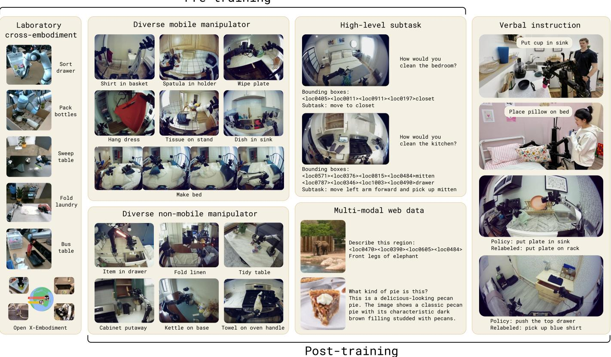  
Fig. 4: Examples from pre-training and post-training tasks. $\pi _ { 0 . 5 }$ is pre-trained on data from mobile manipulators (MM), non-mobile robots in diverse

# C. 预训练

在第一阶段训练中，$\pi _ { 0 . 5 }$ 使用广泛的机器人和非机器人数据进行训练，我们在下面总结并在图4中进行了说明。它被训练为标准的自回归变换器，执行文本、物体位置和FAST编码的动作标记的下一个标记预测。

多样的移动操控器数据（MM）。我们使用了大约400小时的数据，来自于大约100种不同家庭环境中移动操控器执行家庭任务的记录，其中一些如图7所示，使用的是第IV-E节中的机器人。这部分训练数据集与我们的评估任务最直接相关，评估任务包括在新的、未见过的家庭环境中进行类似的清洁和整理任务。

多样的多环境非移动机器人数据（ME）。我们还收集了非移动机器人数据，包括单臂或双臂，涵盖了各种家居环境。这些臂固定在表面或安装平台上，由于它们明显轻便且易于运输，我们能够在更广泛的家庭中收集到更丰富的数据库。然而，这些ME数据来自于与移动机器人不同的具身形式。

交叉体现实验室数据（CE）。我们在实验室中收集了广泛任务的数据（例如，清理桌子、折叠衬衫），使用更简单的桌面环境和多种类型的机器人。这些任务中有一些与我们的评估高度相关（例如，把餐具放进箱子里），而其他的则没有（例如，研磨咖啡豆）。这些数据包括单臂和双臂操纵器，以及静态和移动底座。我们还包括开源的OXE数据集[15]。这个数据集是使用$\pi _ { 0 }[8]$的数据集的扩展版本。

高层次子任务预测（HL）。将高层次的任务命令，例如“打扫卧室”，分解为更短的子任务，如“整理毯子”和“捡起枕头”，类似于对语言模型的推理链提示，可以帮助训练好的策略更好地推理当前场景，并更好地确定下一步行动。对于涉及多个子任务的MM、ME和CE的机器人数据，我们手动为所有数据注释子任务的语义描述，并训练 $\pi _ { 0 . 5 }$ 联合预测子任务标签（作为文本）以及基于当前观察和高层次命令的动作（以子任务标签为条件）。这自然导致模型既充当高层次策略（输出子任务），又充当低层次策略，为这些子任务执行动作。我们还标注了当前观察中显示的相关边界框，并在预测子任务之前训练 $\pi _ { 0 . 5 }$ 以预测它们。

多模态网络数据（WD）。最后，我们包括了一组多样化的网络数据，涉及图像描述（CapsFusion [87]，COCO [12]）、问答（Cambrian-7M [77]，PixMo [19]，VQAv2 [32]）以及预训练中的物体定位。对于物体定位，我们进一步扩展了标准数据集，添加了带有边界框注释的室内场景和家庭物品的额外网络数据。

对于所有动作数据，我们训练模型以预测目标关节和末端执行器姿势。为了区分这两者，我们在文本提示中添加 <control_mode $>$ 关节/末端执行器 <control_mode $> ^ { \ ' }$。所有动作数据都使用每个数据集的 $1 \%$ 和 $99 \%$ 分位数进行归一化到 $[ - 1 , 1 ]$。我们将动作的维度 a 设置为一个固定的数字，以适应所有数据集中最大的动作空间。对于维度较低的配置和动作空间的机器人，我们对动作向量进行零填充。

# D. 后训练

在用离散令牌进行 $2 8 0 \mathrm { k }$ 梯度步骤的预训练后，我们进行第二阶段训练，称为后训练。此阶段的目的是将模型专门化为我们的使用案例（家庭中的移动操作），并增加一个可以通过流匹配产生连续动作片段的动作专家。此阶段同时进行下一个令牌预测训练，以保留文本预测能力，以及针对动作专家的流匹配（后训练开始时使用随机权重初始化）。我们优化方程 (1) 中的目标，$\alpha = 1 0 . 0$，进行 $8 0 \mathrm { k }$ 额外步骤。后训练动作数据集由 MM 和 ME 机器人数据组成，过滤掉超过固定长度阈值的成功事件。我们包括网络数据 (WD) 以保留模型的语义和视觉能力，以及与多环境数据集对应的 HL 数据片段。此外，为了提高模型预测适当高级子任务的能力，我们收集口头指令示范 (VI)，这些示范由专家用户提供“语言示范”，选择适当的子任务命令来指挥机器人一步一步执行移动操作任务。这些示例通过“远程操作”机器人，在实时中用语言执行任务，利用学习到的低级策略，基本上提供了经过训练的策略的良好高级子任务输出的示范。

# E. 机器人系统细节

我们移动操作实验中使用的机器人系统如图5所示。我们使用两种类型的移动操控器进行所有实验。这两个平台都配备有两个6自由度的机械臂，具有平行夹爪和安装在手腕上的单目RGB相机，滚轮全运动底座和躯干升降机制。底座的状态和动作空间对应于线性（2D）和角速度（1D），躯干升降机制则为1D（上下）或2D（上下和前后）。除了两个手腕相机外，机器人还有一个安装在机械臂之间的前向和后向相机。我们使用所有四个相机进行高层推理，使用手腕相机和前向相机进行低层推理过程。状态和动作空间的总维度为18或19，具体取决于平台。

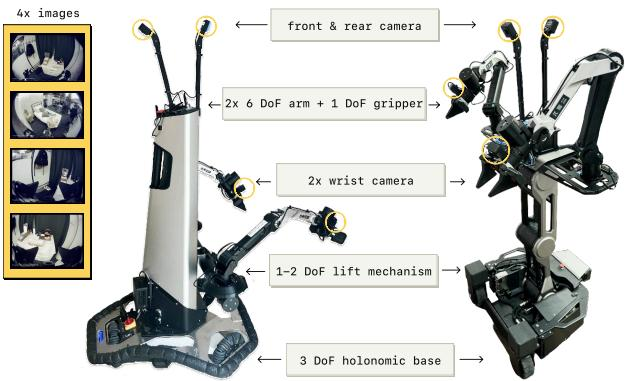  
Fig. 5: Robot system overview. We use two mobile manipulator platforms each has four cameras (forward, backward, and both wrists), two 6 DoF arms with parallel jaw grippers, a mobile base, and a torso lift mechanism. The $\pi _ { 0 . 5 }$ model controls the joints and grippers of each arm, base velocity, and the lift position, resulting in 18-19 DoF state and action spaces.

控制系统非常简单：$\pi _ { 0 . 5 }$模型直接指令手臂、夹具和躯干升起的目标姿态，以及在$5 0 \ : \mathrm { H z }$下的目标底盘速度（使用动作分块）。这些目标通过简单的PD控制器进行跟踪，没有任何额外的轨迹规划或碰撞检测。所有的操作和导航控制都是完全端到端的。

# V. 实验评估

$\pi _ { 0 . 5 }$模型旨在广泛归纳到新环境中。虽然通常在与训练数据匹配的环境中评估VLA，但我们在所有实验中都在未在训练中见过的新环境中进行。为了进行定量比较，我们使用一组模拟家庭环境来提供一个受控和可重复的设置，而最真实的最终评估则在三个不属于训练集的真实家庭中进行（见图6）。我们的实验关注以下问题：

$\pi_{0.5}$能有效地推广到全新环境中的复杂多阶段任务吗？

2) $\pi _ { 0 . 5 }$ 的推广如何与训练数据中不同环境的数量规模化？  
3) 在 $\pi _ { 0 . 5 }$ 训练混合中，各个共同训练成分如何对其最终性能做出贡献？  
$\pi _ { 0 . 5 }$ 与 $\pi _ { 0 }$ VLA 相比如何？

5) $\pi_{0.5}$的高级推理组件重要性如何，如何与平坦的低级推理以及oracle高级基线进行比较？

# A. $\pi _ { 0 . 5 }$ 能否推广到真实的家居？

为了回答问题（1），我们在三个不在训练集中的真实家庭中评估了$\pi _ { 0 . 5 }$，使用了两种类型的机器人。在每个家庭中，机器人被指示执行卧室和厨房的清洁任务。每项任务的评估标准在附录B中提供，粗略对应于每项任务中成功完成的步骤百分比（例如，将一半的碗碟放入水槽大约对应于$50 \%$）。结果在图7（a）中展示。我们可视化了来自每个家庭的一个任务的示例$\pi _ { 0 . 5 }$剧集。从上到下：在家庭1中将物品放入抽屉，接着在家庭2中将碗碟放入水槽，以及在家庭3中将衣物放入洗衣篮。每个任务的人工指令在左侧给出，而$\pi _ { 0 . 5 }$的高层子任务预测则以蓝色显示在每帧下方。

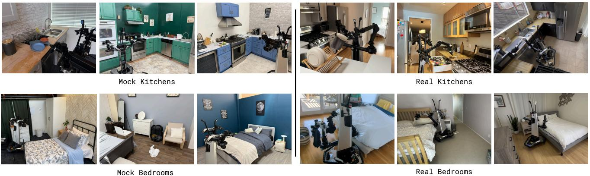

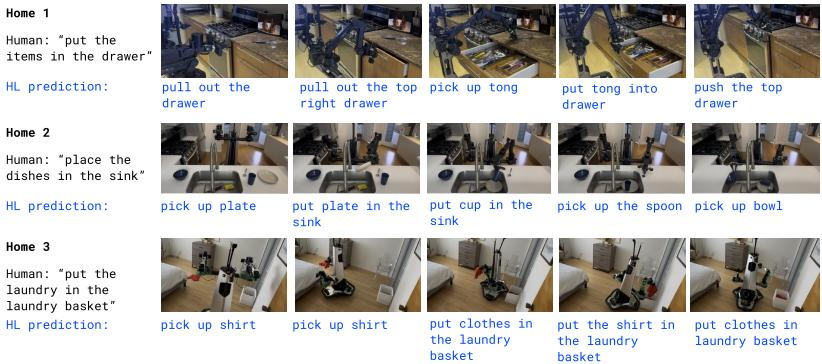  
Fig. 6: Evaluation environments. We evaluate $\pi _ { 0 . 5 }$ in entirely new kitchens and bedrooms that were not seen during training, with novel objects, backgrounds,   
(b) Quantitative evaluation. We show the task progress per task and environment averaged over 10 trials. We find that $\pi _ { 0 . 5 }$ 's performance in the mock evaluation setups is representative of its performance in real homes.

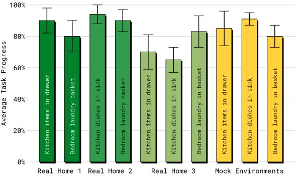

图7：在真实家庭中的评估。我们在三个厨房和三个卧室中评估了$\pi _ { 0 . 5 }$，这些家庭在训练过程中没有见过。我们评估了“抽屉里的物品”、“洗衣篮”和“水槽里的碗碟”等任务，发现$\pi _ { 0 . 5 }$在这些全新的真实家庭中成功完成了这些任务。

显示出 $\pi_{0.5}$ 能够在每个家庭中持续成功地完成各种任务（我们注意到，该模型能够执行的任务比在定量评估中使用的任务要多得多）。许多任务涉及多个阶段（例如，移动多个物体），持续约 2 到 5 分钟。在这些试验中，模型提供了一个简单的高层次命令（例如，“把盘子放进水槽”），高层次推理过程自主确定适当的步骤（例如，“拿起杯子”）。这种在真实环境中的泛化水平显著超出了以前的视觉-语言-行动模型所展示的结果，无论是在模型必须处理的新颖性程度，还是任务的持续时间和复杂性方面。

# B. 通用性如何随着场景数量的增加而变化？

在下一组实验中，我们旨在测量泛化能力如何随着训练数据中环境数量的变化而变化。我们在移动操作数据中改变环境的数量，并通过使用来自3、12、22、53、82和104个地点的数据进行训练，来测量其对泛化能力的影响。由于将整个预训练和后训练流程应用于每个数据集的计算资源需求过高，因此在这些实验中，我们在不包含移动操作数据的机器人动作预测数据混合上进行预训练，然后比较后训练于包含来自不同环境数量的移动操作数据的数据集的模型。虽然按地点划分的数据集在原则上大小不同，但在实际操作中，训练步骤数（40,000）被选择为每个模型看到相同数量的独特数据样本，这使我们能够在变化后训练实验中控制数据集大小。

每个模型在图6所示的模拟环境中进行评估，这些环境在训练中未被看到。我们进行两种类型的评估。首先，为了评估多阶段任务的整体性能，我们使用附录B中的标准评分标准以及模拟测试家庭来评估每个模型在将碗碟放入水槽、将物品放入抽屉、收拾衣物和整理床铺等任务上的端到端表现。其次，我们对每个模型遵循语言指令和与新物体互动的能力进行更细致的评估，在此过程中，机器人必须根据语言指令从厨房台面上捡起特定物体。这些实验使用来自与训练数据类似类别的在分布物体（但新实例），以及来自未见类别的超出分布物体。后者需要广泛的语义泛化能力。

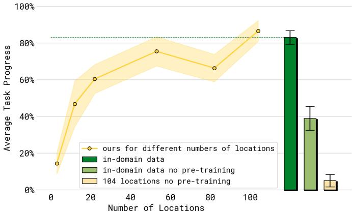  
Fig. 8: Evaluating performance with different numbers of locations. Performance over the four test tasks — "dishes in sink", "items in drawer", "laundry basket", "make bed" — improves with more training environments. The dashed green line and green bar show a baseline model that includes the test homes in the training set. Compared to this model, our best model achieves similar performance, despite not seeing any data from the test homes.

第一组实验的结果如图8所示。任务之间的平均性能通常随着训练地点的增加而改善。为了量化最终模型（具有104个地点）在多大程度上弥合了泛化差距，我们包含了一个控制组（以绿色显示），它是直接在测试住宅的数据上训练的。这个控制组的表现与最终的104地点模型相似，表明我们的共同训练方案有效地促进了广泛的泛化，达到了与在测试环境中训练的模型相似的性能。为了确认这种泛化性能需要我们的完整共同训练方案，我们还包括了两个基线，这两个基线在预训练阶段不使用任何其他共同训练任务，而是直接在测试环境的数据（浅绿色）或来自104个训练地点的移动操作数据（浅黄色）上训练。这两个基线的表现明显较差——这表明我们的完整训练方案所利用的其他数据源对于良好的泛化是至关重要的，即使策略已经见过来自测试住宅的机器人数据。当不使用来自测试住宅的数据时，采用我们的配方进行预训练尤为重要，正如图8中绿色栏和浅黄色栏之间的巨大差距所示。

第二个实验（语言跟随）的结果如图9所示。我们报告了语言跟随率，衡量机器人选择语言命令中指示的物体的频率，以及成功率，衡量机器人将该物体成功放置在正确位置的频率（取决于测试场景，可能是抽屉内或水槽内）。我们分别测量在训练中见过的物体类别（但为新物体实例）和未见过（“分布外”）的物体类别的性能。该实验的详细信息在附录C中展示和讨论。图9显示，随着训练数据中位置数量的增加，语言跟随性能和成功率均有所提升。正如预期的那样，分布内物体的性能提升速度快于分布外物体的性能。随着每个新环境引入新的家庭用品，模型变得更加稳健，并开始对训练数据中不存在的任务类别进行概括。

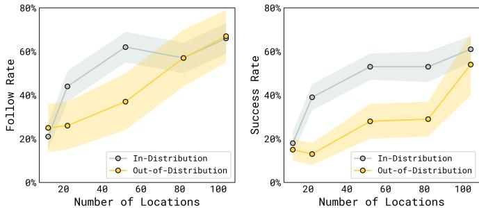  
Fig. 9: Evaluating language following with different numbers of training locations. We evaluate language following rate and success rate for picking up user-indicated items and placing them into drawers or sinks, averaged over seen object categories ("in-distribution") or unseen categories ("out-ofdistribution"). Performance increases steadily as we increase the number of training locations.

# C. 我们共同训练配方的每个部分有多重要？

为了研究问题（3），我们将完整的 $\pi _ { 0 . 5 }$ 模型与其他训练混合进行比较，以研究每个混合成分的重要性，再次使用在模拟家庭和第 V-B 节中描述的语言跟随评估的端到端任务性能。提醒一下，我们的完整配方使用了来自多环境中的移动操作器（MM）、多环境中的静态操作器（ME）以及在实验室环境中收集的多样性跨体现数据（CE）。它还包括高层数据，其中预测对应于高层语言指令（HL），以及与字幕生成、视觉问答和目标定位任务相关的网络数据（WD）。后训练阶段还使用了口头指令数据（VI），我们将在第 V-E 节中进行分析。在这些实验中，我们消融了混合的不同部分：

1) 无WD：该消融排除了网络数据。

2) 没有ME：这个消融排除了多环境非移动数据。

3) 无 CE：此消融排除了实验室交叉体数据。

4) 没有ME或CE：此消融排除了来自其他机器人的两个数据源，从而使模型仅基于目标移动操纵平台的数据以及网络数据进行训练。

完整的模拟家庭任务结果如图10所示（每个任务的详细性能分解见附录D）。首先，我们在结果中看到，排除两个交叉体现数据源（ME和CE）中的任何一个都会显著降低性能，这表明$\pi _ { 0 . 5 }$在跨体现转移方面受益匪浅，包括来自其他环境（ME）和其他任务（CE）的数据。排除这两种数据源会进一步恶化性能。有趣的是，在没有WD的消融实验中，性能差异在这个实验中并没有统计显著性，尽管我们稍后会展示网络数据对语言跟随（下面）和高层子任务推断（第五节E）有很大影响。

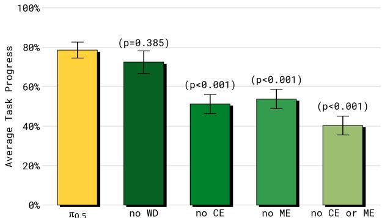  
Fig. 10: Training recipe ablations, mock homes. We evaluate variants of our model that exclude different parts of the training mixture on all four test tasks (10 trials per policy and task). Including cross-embodiment data, both in diverse environments (ME) and for diverse tasks in laboratory settings (CE) is important for good performance, with large degradation when either or both of these data sources are removed. Web data (WD) does not make a significant difference in these experiments, but we will see in Figures 11 and 13 that it impacts object generalization and high-level performance.

  
Fig. 11: Training recipe ablations, language following. Evaluating language following with in-distribution and out-of-distribution objects after training on different numbers of locations. Including web data (WD) is important for outof-distribution (OOD) performance in particular. Cross-embodiment (CE) and diverse environment (ME) data both have a large impact on in-distribution and out-of-distribution performance.

语言跟随实验的结果如图11所示，与图10呈现出相似的趋势——排除ME或/和CE数据会导致性能显著下降。现在不同的是，移除网络数据（无WD）在分布外（OOD）对象上的性能显著变差——我们推测，使用包含广泛物理对象知识的网络数据进行训练，使得模型能够理解并遵循涉及未见对象类别的语言指令。

# $D$ $\pi _ { 0 . 5 }$如何与其他VLAs比较？

我们将 $\pi _ { 0 . 5 }$ 与原始的 $\pi _ { 0 }$ VLA 以及我们所称的改进版本 $\pi _ { 0 }$ -FAST $^ +$ Flow 进行比较。该版本通过公式 (1) 中的联合扩散和 FAST 动作预测公式进行训练，但仅基于动作数据，而不使用 HL 或 WD 数据集。这些模型提供了一个强有力的比较点，因为 $\pi _ { 0 }$ 已被证明在复杂和灵巧的移动操作任务中表现优异，而 $\pi _ { 0 } { - } \mathrm { F A S T { + } F l o v }$ 的增强使其尽可能接近 $\pi _ { 0 . 5 }$。$\pi _ { 0 . 5 }$ 在这些模型基础上结合了共同训练任务。为了公平比较，所有模型都接收相同的跨表现机器人训练集，并经过类似步骤数量的训练。不同之处在于：(1) $\pi _ { 0 . 5 }$ 额外使用了 HL 和 WD 数据；(2) $\pi _ { 0 . 5 }$ 采用混合训练程序，在预训练阶段进行离散的标记训练，而在后训练阶段仅使用流程匹配的动作专家进行训练，而 $\pi _ { 0 }$ 始终使用动作专家。$\pi _ { 0 } \cdot$ - FAST $^ +$ Flow 遵循混合训练方案，但只用包含机器人动作的数据进行训练，因此无法进行高层次推断。图 12 的结果显示，$\pi _ { 0 . 5 }$ 明显优于 $\pi _ { 0 }$ 和我们的增强版本。即使在允许 $\pi _ { 0 }$ 进行长达 $3 0 0 \mathrm { k }$ 训练步骤的情况下，这一结果仍然成立，确认了如 Pertsch 等 [64] 所述，使用 FAST 令牌的训练在计算效率上优于纯扩散基础的训练。

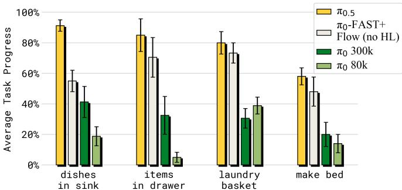  
Fig. 12: Comparing $\pi _ { 0 . 5 }$ with other models. Our full model significantly outperforms both $\pi _ { 0 }$ and $\pi _ { 0 }$ -FAST $+$ Flow in the mock home test environments.

# E. 高层推理有多重要？

最后，我们评估高层推理的重要性，并比较几种替代高层推理方法的性能. 在 $\pi _ { 0 . 5 }$ 中，高层推理机制接受一个高层命令（例如，“打扫卧室”）并输出要完成的子任务（例如，“拿起枕头”），然后将其作为推断低层动作的上下文，类似于思维链推理 [82]. 虽然 $\pi _ { 0 . 5 }$ 使用统一架构，使得同一模型执行高层和低层推理，但我们也可以构建基线方法，这些方法要么放弃高层推理过程，直接将任务提示输入低层系统，如标准 VLA 模型常见的做法 [92, 8]，要么使用另一个模型进行高层推理，以消除不同数据集组成部分对高层策略影响的重要性. 我们考虑以下方法和消融实验，所有方法都使用完整的 $\pi _ { 0 . 5 }$ 低层推理过程，配合不同的高层策略:

1) $\pi _ { 0 . 5 }$ 模型用于高层次和低层次推理。

2) 无WD：排除网络数据的$\pi _ { 0 . 5 }$消融。

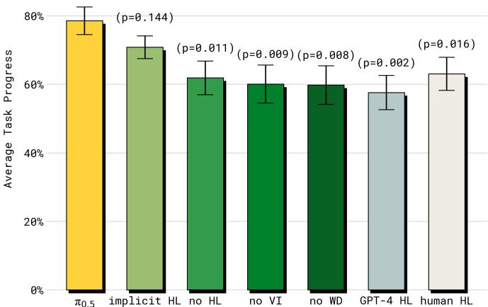  
Fig. 13: Evaluation of the high-level inference process. While the full $\pi _ { 0 . 5 }$ model with high-level and low-level inference attains the best results, using only low-level inference ("implicit HL") with the full $\pi _ { 0 . 5 }$ model also benefits from the inclusion of high-level subtask examples in training. In contrast, excluding verbal instructions (no VI) or web data (no WD) leads to a significant degradation in performance, and zero-shot prompting a large API-based model (GPT-4) performs worse.

3no VI：一个排除口头指令（VI）数据的$\pi _ { 0 . 5 }$消融实验。

4) 隐式高层次学习（HL）：在运行时没有高层次推理，但在训练中包含高层次数据，可能会隐式地教会模型关于子任务的知识。

5) 无高层推理：训练中完全没有高层推理和高层数据。

6) GPT-4：将GPT-4用作高级策略，评估在机器人数据上训练高级策略的重要性。为了使模型与我们的领域对齐，我们向GPT-4提供任务描述和最常用标签的列表供其选择。

7) 人类高水平：使用专家人类作为“神谕”，提供性能的上限。

这些实验结果如图13所示。完整的 $\pi _ { 0 . 5 }$ 模型表现最佳，甚至超越了人类HL“oracle”基准。也许令人惊讶的是，第二好的模型是隐式HL消融模型，它没有进行任何高层推理，但在训练中包含了完整的数据混合，即也包括子任务预测。这强烈表明了我们模型所使用的共同训练流程的重要性：虽然明确地推断高层子任务是有益的，但通过在训练混合中简单地包含子任务预测数据，已经获得了相当一部分的好处。排除HL任务的消融模型，即使在训练中也不包含HL任务，表现明显较差。结果还显示，相对较小的口头指令数据集（仅占高层移动操作示例的约 $11 \%$）对强性能至关重要，因为没有VI消融模型的表现明显较弱。没有WD消融模型的表现也明显更差，表明网络数据的好处（或许并不奇怪）主要体现在改善高层策略上。最后，零样本GPT-4消融模型的表现最差，表明了用机器人数据调整VLM的重要性。我们在附录D中提供了每个任务性能的详细分解，见图17。

# VI. 讨论与未来工作

我们描述了$\pi_{0.5}$，一个基于$\pi_{0}$ VLA的联合训练模型，旨在整合多种数据源并实现对新环境的推广。$\pi_{0.5}$ VLA能够控制移动操作者在训练数据中从未见过的家庭场景中执行任务，如清洁厨房和卧室、整理床铺、挂毛巾以及执行其他多阶段和灵巧的行为。$\pi_{0.5}$在大约400小时的移动操作数据上进行了训练，但包含了来自其他机器人的大量数据，包括在不同环境中使用的非移动操作者的数据，以及在实验室条件下收集的数据。它还与网络数据共同训练，以及根据机器人观察输出语言命令的高层预测数据。$\pi_{0.5}$的推广能力表明，这种联合训练方法促进了有效的转移，使得通过仅仅一个中等规模的移动操作者数据集能够实现对移动操作者的高度可推广控制。

$\pi_{0.5}$并非没有其局限性。尽管我们的VLA展现出广泛的泛化能力，但它仍然会犯错误。有些环境仍然存在持续的挑战（例如，抽屉上的不熟悉把手或物理上很难打开的柜子），某些行为在部分可观察性方面面临挑战（例如，机器人手臂遮挡了需要擦拭的溢出物），在某些情况下，高层次子任务的推断容易分心（例如，在归置物品时多次开关抽屉）。通过更好的协同训练、迁移和更大数据集来解决这些挑战是未来研究的一个有前景的方向。其他未来研究方向可以解决我们方法的技术限制。虽然$\pi_{0.5}$能够执行多种行为来清理厨房和卧室，但它处理的提示相对简单。模型能够容纳的提示复杂性受到训练数据的限制，而通过提供更复杂和多样的注释（无论是通过人工标注者还是合成方法），可以纳入更复杂的偏好和指令。模型还使用了相对简约的上下文，加入更丰富的上下文和记忆可以使模型在存在更多部分可观察性的环境中显著更强大，例如需要在不同房间之间导航或记忆物品存放位置的任务。更广泛地说，$\pi_{0.5}$探索了一种特定的异构数据源组合，但可以更广泛地探索特定的数据源。例如，我们系统从口头指令中学习的能力提供了一种强大的新监督模式，未来的工作可以探索这种方式以及其他方式，人们可以为机器人提供额外的上下文知识。我们希望我们的工作能够为新一代展现广泛泛化能力的VLA奠定基础，以适应多样的真实世界环境。

# 致谢

我们感谢我们的机器人操作员在数据收集、评估、物流和视频录制方面的贡献。请参见附录A获取完整的贡献声明。