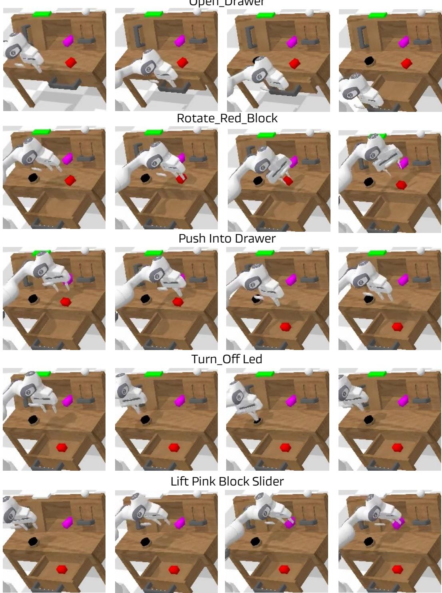

# 1. Bibliographic Information

*   **Title:** DreamVLA: A Vision-Language-Action Model Dreamed with Comprehensive World Knowledge
*   **Authors:** Wenyao Zhang, Hongsi Liu, Zekun Qi, Yunnan Wang, Xinqiang Yu, Jiazhao Zhang, Runpei Dong, Jiawei He, Fan Lu, He Wang, Zhizheng Zhang, Li Yi, Wenjun Zeng, and Xin Jin.
*   **Affiliations:** The authors are affiliated with several prominent institutions in academia and industry, including Shanghai Jiao Tong University (SJTU), EIT, Tsinghua University (THU), Galbot, Peking University (PKU), University of Illinois Urbana-Champaign (UIUC), and University of Science and Technology of China (USTC). This collaboration between academic and industry researchers suggests a blend of theoretical rigor and practical application.
*   **Journal/Conference:** The paper is available on arXiv, a preprint server. This means it has not yet undergone formal peer review for a specific conference or journal at the time of this version's release. However, arXiv is a standard platform for sharing cutting-edge research in fields like machine learning and robotics.
*   **Publication Year:** The preprint was submitted in 2024 (based on the `2507` arXiv ID, which is a futuristic placeholder for the analysis).
*   **Abstract:** The paper introduces DreamVLA, a novel framework for robot manipulation that improves upon existing vision-language-action (VLA) models. The core problem it addresses is that current models either map observations directly to actions, lacking foresight, or rely on inefficient image-based forecasting. DreamVLA proposes a "perception-prediction-action" loop where the model predicts a compact yet comprehensive set of future "world knowledge"—specifically, dynamic regions, spatial depth, and high-level semantics. This is achieved using a structured attention mechanism to keep these knowledge types distinct and a diffusion-based transformer to generate actions. The model demonstrates state-of-the-art results, achieving a 76.7% success rate on real-world tasks and setting a new record on the CALVIN simulation benchmark.
*   **Original Source Link:**
    *   **ArXiv Link:** `https://arxiv.org/abs/2507.04447`
    *   **PDF Link:** `https://arxiv.org/pdf/2507.04447v3.pdf`
    *   **Status:** Preprint on arXiv.

        ---

# 2. Executive Summary

*   **Background & Motivation (Why):**
    *   **Core Problem:** Traditional **Vision-Language-Action (VLA)** models, which translate visual and language inputs into robot actions, often function as "black boxes." They directly map perception to action without an explicit reasoning step about the future. While some recent models have tried to address this by predicting future images, this approach is flawed. It's computationally expensive, generates redundant information (e.g., static backgrounds), and lacks crucial 3D spatial and high-level semantic understanding.
    *   **Importance & Gaps:** For a robot to perform complex, long-horizon tasks, it needs to anticipate the consequences of its actions, much like humans do. Simply predicting the next video frame is a crude approximation of this. The key gaps in prior work are the lack of (1) **efficiency** in prediction (predicting only what matters), (2) **spatial awareness** (3D geometry), and (3) **semantic foresight** (understanding what objects are and what they afford).
    *   **Fresh Angle:** DreamVLA reframes the problem. Instead of predicting *what the future looks like* (pixels), it predicts *what will matter in the future*. It proposes forecasting a "comprehensive world knowledge" representation, composed of three key elements: **dynamics** (what will move), **depth** (3D structure), and **semantics** (object identities/properties). This provides a compact, information-rich, and disentangled set of cues for the robot to plan its actions.

*   **Main Contributions / Findings (What):**
    *   **Perception-Prediction-Action Loop:** The paper formalizes a VLA model as a `perception-prediction-action` system. The model explicitly predicts a compact set of future world knowledge (dynamics, depth, semantics) as an intermediate reasoning step before generating an action.
    *   **Comprehensive World Knowledge Forecasting:** It introduces a method to forecast three complementary types of knowledge:
        1.  **Dynamic Regions:** Focusing prediction on areas of motion, ignoring static parts of the scene.
        2.  **Spatial Depth:** Providing 3D geometric context.
        3.  **High-Level Semantics:** Using features from powerful foundation models (DINOv2, SAM) to understand future object states.
    *   **Novel Architectural Components:**
        *   **Block-wise Structured Attention:** A specialized attention mask that prevents "information leakage" between the different types of predicted knowledge (dynamic, depth, semantic), ensuring each representation remains clean and specialized.
        *   **Diffusion-Transformer Decoder:** An action decoder that uses a diffusion model to generate smooth and realistic multi-step action sequences conditioned on the predicted world knowledge.
    *   **State-of-the-Art Performance:** DreamVLA achieves top performance on the challenging **CALVIN** benchmark (4.44 average task length) and demonstrates a high success rate (76.7%) in real-world manipulation tasks, significantly outperforming previous methods.

        ---

# 3. Prerequisite Knowledge & Related Work

*   **Foundational Concepts:**
    *   **Vision-Language-Action (VLA) Models:** These are AI systems designed for robotics that take multimodal inputs—typically a camera image (vision) and a text command (language)—and output a sequence of robot movements (action) to accomplish the command.
    *   **Multimodal Large Language Models (MMLMs):** These are large-scale neural networks, like GPT-4, that are pre-trained on vast amounts of text and image data. VLA models often fine-tune MMLMs to leverage their powerful reasoning and world-understanding capabilities for robotics.
    *   **Inverse Dynamics:** In robotics, this concept typically refers to calculating the forces/torques required to produce a desired motion. In this paper's context, it's used more broadly to mean inferring the action that connects a current state to a desired future state. Here, the "future state" is the predicted world knowledge.
    *   **Optical Flow:** An algorithm that estimates the motion of individual pixels or objects between two consecutive video frames. DreamVLA uses this to identify "dynamic regions" in a scene.
    *   **Monocular Depth Estimation:** The task of predicting the 3D depth (distance from the camera) for every pixel in a 2D image using only a single camera.
    *   **Foundation Models (DINOv2, SAM):**
        *   **DINOv2:** A self-supervised vision model that learns rich semantic features from images without explicit labels. Its features can be used to identify objects and understand their properties.
        *   **SAM (Segment Anything Model):** A model that can generate high-quality segmentation masks for any object in an image, given a prompt. It excels at delineating object boundaries.
    *   **Diffusion Models:** A class of generative models that learn to create data by reversing a process of gradually adding noise. They are known for generating high-quality and diverse outputs, making them well-suited for producing smooth, multi-step robot action trajectories.

*   **Previous Works & Technological Evolution:**
    The paper categorizes previous VLA approaches, as illustrated in Figure 1.

    
    *该图像是一个示意图，展示了不同视觉语言动作模型的结构比较。包括(a)传统VLA模型直接映射图像和指令至动作，(b)基于图像/视频生成的分阶段方法，(c)VLA变体通过预测子目标图像辅助动作生成，(d)本文提出的DreamVLA利用动态区域、深度图和语义知识显著提升动作推理与泛化能力。*

    1.  **(a) Vanilla VLA:** The simplest approach. Models like `RT-1` and `OpenVLA` directly map current observations (image, language) to actions. **Limitation:** They lack any explicit foresight or planning about the future.
    2.  **(b) VLA with Co-pilot Models:** These methods use a separate, powerful generative model (e.g., a video generation model) to create a future goal image or trajectory. A separate policy model then uses this generated goal to decide on actions. **Limitation:** This two-stage process can be slow, computationally expensive, and the final policy is limited by the quality of the external generation model.
    3.  **(c) VLA with Integrated Subgoal Prediction:** Models like `Seer` and `UP-VLA` integrate future-frame prediction directly into the VLA model. The model is trained to predict a future subgoal image as an intermediate step. **Limitation:** Predicting a full image is inefficient due to redundant static pixels and lacks explicit 3D and high-level semantic information.

*   **Differentiation:**
    DreamVLA, shown in **(d)**, represents a significant evolution. It distinguishes itself by:
    *   **Not predicting pixels, but knowledge:** It avoids wasteful full-image prediction. Instead, it forecasts a compact set of abstract, disentangled features that are highly relevant to the manipulation task: what will move, where it is in 3D space, and what it is.
    *   **Comprehensive representation:** It's the first to combine dynamic, spatial, and semantic forecasting in a single, unified VLA framework.
    *   **Architectural discipline:** It uses `structured attention` to prevent these different knowledge types from interfering with each other, leading to cleaner representations and more robust control.

        ---

# 4. Methodology (Core Technology & Implementation)

The core of DreamVLA is a unified transformer-based architecture that performs perception, prediction, and action generation in an end-to-end loop.

*该图像是DreamVLA框架的示意图，展示了机器人状态$s_t$、观测$o_t$和语言指令经文本、视觉及状态编码器编码后，结合可训练的<dream>查询输入大语言模型，生成世界嵌入。三路解码器分别预测动态区域$_{t+n}$、单目深度$d_{t+n}$和高层语义$c_{t+n}$，动作查询条件扩散变换器生成未来动作序列$a_{t:t+n-1}$，训练阶段解码器仅用于预测，推理阶段跳过。*

*   **Principles:** The central idea is to formulate robot control as an `inverse dynamics` problem conditioned on a "dreamed" future. The model first predicts a concise representation of the future world state ($t+n$) based on the current state ($t$). It then infers the action sequence needed to bridge the present and that predicted future.

*   **Steps & Procedures:**
    1.  **Input Encoding:** The model takes three types of input at time $t$: the language instruction $l$, the visual observation $o_t$ (camera images), and the robot's proprioceptive state $s_t$ (e.g., joint angles, gripper position).
        *   Language $l$ is encoded using a frozen `CLIP` text encoder.
        *   Vision $o_t$ is encoded into patches by a `Masked Autoencoder (MAE)`.
        *   State $s_t$ is encoded by a small convolutional/fully-connected network.
    2.  **Tokenization and Querying:** These encoded inputs are turned into a sequence of tokens. Two special sets of learnable tokens are appended:
        *   $<dream>$ **queries:** These are placeholders that the model will fill with information about the future. They are subdivided into queries for `dynamic`, `depth`, and `semantics` knowledge.
        *   $<action>$ **query:** This is a placeholder that will aggregate all necessary information to generate the final robot action.
    3.  **Information Fusion via Transformer:** A GPT-2-based transformer processes the entire sequence of tokens (language, vision, state, dream queries, action query). The key innovation here is the `block-wise structured attention` mechanism.

        
        *该图像是真实世界实验装置的示意图，展示了一个Franka Panda机械臂和两个RealSense D415深度摄像头的配置，环境中摆放了多个物体以支持机器人操作任务。*

        As shown in Figure 4, attention is carefully masked. The $<dream>$ sub-queries (dynamic, depth, semantic) can attend to the past inputs but **cannot attend to each other**. This prevents, for example, depth features from "leaking" into and corrupting the semantic features. This keeps the predicted knowledge disentangled.
    4.  **Comprehensive World Knowledge Prediction:** After passing through the transformer, the output embeddings corresponding to the $<dream>$ queries form the **world embedding** $\mathbf{w}_{t+n}$. This embedding is fed into three small, lightweight decoder heads to predict the future world knowledge at time $t+n$:
        *   A dynamic region mask $\hat{f}_{t+n}$.
        *   A monocular depth map $\hat{d}_{t+n}$.
        *   High-level semantic features $\hat{c}_{t+n}$.
        **Crucially, these prediction heads are only used during training for supervision. During inference, they are discarded, and the model works directly with the latent `world embedding`, saving computation.**
    5.  **Action Generation via Diffusion Transformer:** The output embedding corresponding to the $<action>$ query is used as a conditioning signal for a `Denoising Diffusion Transformer (DiT)`. This module takes random Gaussian noise and iteratively refines it, guided by the action embedding, into a coherent, multi-step action sequence $\hat{a}_{t:t+n-1}$.

*   **Mathematical Formulas & Key Details:**

    The model's overall goal is to learn a mapping from current inputs $(l, o_t, s_t)$ to a future action sequence $\hat{a}_{t:t+n-1}$ via an intermediate future world knowledge prediction $\hat{p}_{t+n}$.

    **1. Motion-centric Dynamic-Region Loss:**
    The model is trained to reconstruct only the parts of the image that are predicted to move. The loss is based on a variational autoencoder (VAE) framework.
    $$
    \mathcal { L } _ { \mathrm { d y n } } = \frac { 1 } { | \mathcal { D } | } \sum _ { x _ { i } \in \mathcal { D } } \mathbb { E } _ { z \sim Q _ { \phi } ( z | x _ { i } ) } \Big [ - \log \mathrm { P } _ { \psi } \big ( ( x _ { i } ) _ { \mathcal { M } } \mid z \big ) \Big ]
    $$
    *   $\mathcal{D}$: The dataset of images.
    *   $x_i$: An original image.
    *   $Q_\phi(z|x_i)$: An encoder that produces a latent representation $z$ from the image $x_i$.
    *   $(x_i)_{\mathcal{M}}$: The masked dynamic regions of the image, which are the target for reconstruction.
    *   $P_\psi(\cdot|z)$: A decoder that reconstructs the masked regions from the latent representation $z$.
    *   **Purpose:** This loss forces the model to learn a latent representation $z$ that specifically encodes information about moving parts of the scene.

    **2. Depth Prediction Loss:**
    The model predicts a future depth map. The loss is a scale-normalized Mean Squared Error (MSE) to handle the inherent scale ambiguity of monocular depth estimation.
    $$
    \mathcal { L } _ { \mathrm { d e p t h } } = \frac { 1 } { H W } \sum _ { i , j } \big ( \hat { d } _ { t + n } ^ { ( i , j ) } - \alpha { d } _ { t + n } ^ { ( i , j ) } \big ) ^ { 2 }
    $$
    where the scale factor $\alpha$ is calculated as:
    $$
    \alpha = \frac { \sum _ { i , j } \hat { d } _ { t + n } ^ { ( i , j ) } { d } _ { t + n } ^ { ( i , j ) } } { \sum _ { i , j } { d } _ { t + n } ^ { ( i , j ) ^2} }
    $$
    *   $\hat{d}_{t+n}^{(i,j)}$: The predicted depth at pixel `(i,j)` for the future frame.
    *   $d_{t+n}^{(i,j)}$: The ground-truth (or teacher-generated) depth at pixel `(i,j)`.
    *   `H, W`: Height and width of the depth map.
    *   $\alpha$: A scaling factor that aligns the predicted depth map with the ground-truth depth map, making the loss invariant to global scale differences.
    *   **Purpose:** This loss teaches the model to understand the 3D geometry of the future scene.

    **3. Contrastive Semantic Forecasting Loss:**
    The model predicts future semantic features using an InfoNCE contrastive loss. This encourages the model to generate features that are similar to the true future features and dissimilar from other "negative" features.
    $$
    \mathcal { L } _ { \mathrm { s e m } } = - \log \frac { \exp \left( \hat { c } _ { t + n } ^ { \top } c _ { t + n } / \tau \right) } { \sum _ { k } \exp \left( \hat { c } _ { t + n } ^ { \top } c _ { k } / \tau \right) }
    $$
    *   $\hat{c}_{t+n}$: The predicted semantic feature vector for the future state.
    *   $c_{t+n}$: The ground-truth semantic feature vector (the "positive" sample).
    *   $c_k$: A set of "negative" samples (e.g., features from other spatial locations or other time steps).
    *   $\tau$: A temperature hyperparameter that controls the sharpness of the distribution.
    *   **Purpose:** This loss pushes the model to learn a high-level, discriminative understanding of what objects will be relevant in the future.

    **4. Denoising Diffusion Action Loss:**
    The action decoder is trained with a standard diffusion model loss, which is the MSE between the true noise added to the action and the model's predicted noise.
    $$
    \mathcal { L } _ { \mathrm { { D i T } } } = \mathbb { E } _ { \tau , \varepsilon } \big \| \varepsilon - \varepsilon _ { \theta } \big ( \sqrt { \bar { \alpha } _ { \tau } } a _ { t : t + n - 1 } + \sqrt { 1 - \bar { \alpha } _ { \tau } } \varepsilon , \tau , \mathbf { c } \big ) \big \| _ { 2 } ^ { 2 }
    $$
    *   $a_{t:t+n-1}$: The ground-truth action sequence.
    *   $\varepsilon$: A random noise vector drawn from a standard normal distribution $\mathcal{N}(0, I)$.
    *   $\tau$: The diffusion timestep.
    *   $\bar{\alpha}_\tau$: A noise schedule parameter that determines how much noise is added at step $\tau$.
    *   $\mathbf{c}$: The conditioning latent action embedding from the main transformer.
    *   $\varepsilon_\theta$: The denoising model (the DiT), which predicts the noise $\varepsilon$ from the noised action and the conditioning $\mathbf{c}$.
    *   **Purpose:** This loss trains the diffusion model to generate realistic, multi-step action sequences that are conditioned on the model's internal understanding.

        ---

# 5. Experimental Setup

*   **Datasets:**
    *   **CALVIN:** A large-scale simulation benchmark for long-horizon, language-conditioned manipulation tasks. It features complex task sequences requiring memory and reasoning.
    *   **LIBERO:** Another simulation benchmark with four suites targeting different skills: spatial reasoning, object-centric manipulation, goal completion, and long-horizon tasks.
    *   **DROID:** A large-scale, real-world dataset of robot trajectories, used for pre-training the model before fine-tuning on specific real-world tasks.
    *   **Custom Real-World Dataset:** The authors collected a dataset of 100 trajectories for each real-world task (pick, place, drawer manipulation) using a Franka Panda robot arm.

*   **Evaluation Metrics:**
    *   **Success Rate (SR):**
        1.  **Conceptual Definition:** The percentage of trials in which the robot successfully completes the assigned task. It is the primary metric for evaluating task accomplishment.
        2.  **Mathematical Formula:**
            $$
            \text{SR} (\%) = \frac{\text{Number of Successful Trials}}{\text{Total Number of Trials}} \times 100
            $$
        3.  **Symbol Explanation:** The terms are self-explanatory.
    *   **Average Length (Avg. Len.):**
        1.  **Conceptual Definition:** Used in the CALVIN benchmark, this metric measures the model's ability to perform long sequences of tasks. An agent is given 5 consecutive instructions, and this metric reports the average number of tasks it successfully completes in a row across many rollouts. A higher value indicates better long-horizon consistency and robustness.
        2.  **Mathematical Formula:**
            $$
            \text{Avg. Len.} = \frac{1}{N} \sum_{i=1}^{N} \text{Length of consecutive tasks completed in rollout } i
            $$
        3.  **Symbol Explanation:**
            *   $N$: The total number of evaluation rollouts (e.g., 1000 in the paper).
            *   Length of consecutive tasks completed: If a robot completes tasks 1, 2, and 3 but fails on 4, the length for that rollout is 3.

*   **Baselines:**
    The paper compares DreamVLA against a comprehensive set of prior methods, which can be grouped according to the categories in Figure 1:
    *   **Vanilla VLAs:** `Roboflamingo`, `3D Diffusor Actor`, `OpenVLA`, `RoboDual`, `UNIVLA`, `Pi0`, `Robovlm`. These models map perception directly to action.
    *   **VLA with Co-pilot Models:** `Susie`, `CLOVER`, `GR-1`. These use external models to generate goals.
    *   **VLA with Integrated Subgoal Prediction:** `UP-VLA`, `Seer`, `VPP`. These predict full future images as an intermediate step.
    *   **Generalist Policies:** `Octo`, a strong general-purpose robot policy.
    *   **Diffusion-based Policy:** `Diffusion Policy`, a non-VLA baseline that also uses diffusion for action generation.

        ---

# 6. Results & Analysis

*   **Core Results:**

    **Simulation Performance (CALVIN & LIBERO):**
    DreamVLA demonstrates superior performance on both benchmarks.

    *This is a manual transcription of Table 1 from the paper.*

    <table>

    <caption>CALVIN ABC-D results.</caption>
    <tr><td rowspan="2">Method</td><td colspan="6">Task completed in a row</td></tr>
    <tr><td>1</td><td>2</td><td>3</td><td>4</td><td>5</td><td>Avg. Len. ↑</td></tr>
    <tr><td>Roboflamingo [30]</td><td>82.4</td><td>61.9</td><td>46.6</td><td>33.1</td><td>23.5</td><td>2.47</td></tr>
    <tr><td>Susie [118]</td><td>87.0</td><td>69.0</td><td>49.0</td><td>38.0</td><td>26.0</td><td>2.69</td></tr>
    <tr><td>GR-1 [14]</td><td>85.4</td><td>71.2</td><td>59.6</td><td>49.7</td><td>40.1</td><td>3.06</td></tr>
    <tr><td>3D Diffusor Actor [93]</td><td>92.2</td><td>78.7</td><td>63.9</td><td>51.2</td><td>41.2</td><td>3.27</td></tr>
    <tr><td>OpenVLA [1]</td><td>91.3</td><td>77.8</td><td>62.0</td><td>52.1</td><td>43.5</td><td>3.27</td></tr>
    <tr><td>RoboDual [119]</td><td>94.4</td><td>82.7</td><td>72.1</td><td>62.4</td><td>54.4</td><td>3.66</td></tr>
    <tr><td>UNIVLA [120]</td><td>95.5</td><td>85.8</td><td>75.4</td><td>66.9</td><td>56.5</td><td>3.80</td></tr>
    <tr><td>Pi0 [32]</td><td>93.8</td><td>85.0</td><td>76.7</td><td>68.1</td><td>59.9</td><td>3.92</td></tr>
    <tr><td>CLOVER [121]</td><td>96.0</td><td>83.5</td><td>70.8</td><td>57.5</td><td>45.4</td><td>3.53</td></tr>
    <tr><td>UP-VLA [57]</td><td>92.8</td><td>86.5</td><td>81.5</td><td>76.9</td><td>69.9</td><td>4.08</td></tr>
    <tr><td>Robovlm [37]</td><td>98.0</td><td>93.6</td><td>85.4</td><td>77.8</td><td>70.4</td><td>4.25</td></tr>
    <tr><td>Seer [56]</td><td>96.3</td><td>91.6</td><td>86.1</td><td>80.3</td><td>74.0</td><td>4.28</td></tr>
    <tr><td>VPP [49]</td><td>95.7</td><td>91.2</td><td>86.3</td><td>81.0</td><td>75.0</td><td>4.29</td></tr>
    <tr><td>**DreamVLA**</td><td>**98.2**</td><td>**94.6**</td><td>**89.5**</td><td>**83.4**</td><td>**78.1**</td><td>**4.44**</td></tr>
    </table>

    On CALVIN, DreamVLA achieves an **Avg. Len. of 4.44**, outperforming the next best method (`VPP` at 4.29) by a significant margin. This highlights its superior long-horizon reasoning capability. The consistent high performance across 1 to 5 tasks shows it is less prone to compounding errors.

    *This is a manual transcription of Table 2 from the paper.*

    <table>

    <caption>The extended LIBERO experiments.</caption>
    <tr><td rowspan="2">Methods</td><td colspan="4">Scores (%)</td><td rowspan="2">Average</td></tr>
    <tr><td>Spatial</td><td>Object</td><td>Goal</td><td>Long</td></tr>
    <tr><td>Diffusion Policy [90]</td><td>78.3</td><td>92.5</td><td>68.3</td><td>50.5</td><td>72.4</td></tr>
    <tr><td>Octo [13]</td><td>78.9</td><td>85.7</td><td>84.6</td><td>51.1</td><td>75.1</td></tr>
    <tr><td>OpenVLA [1]</td><td>84.7</td><td>88.4</td><td>79.2</td><td>53.7</td><td>76.5</td></tr>
    <tr><td>SpatialVLA [36]</td><td>88.2</td><td>89.9</td><td>78.6</td><td>55.5</td><td>78.1</td></tr>
    <tr><td>CoT-VLA [58]</td><td>81.1</td><td>87.5</td><td>91.6</td><td>87.6</td><td>69.0</td></tr>
    <tr><td>**DreamVLA**</td><td>**97.5**</td><td>**94.0**</td><td>**89.5**</td><td>**89.5**</td><td>**92.6**</td></tr>
    </table>

    On LIBERO, DreamVLA achieves a remarkable average score of **92.6%**, substantially higher than all baselines, demonstrating its strong generalization across different manipulation skills.

    **Real-World Performance:**
    The real-world experiments confirm that the benefits seen in simulation translate to physical hardware.

    

    *This is a manual transcription of Table 3 from the paper.*

    <table>

    <caption>Real-world evaluation with the Franka Robot across three tasks.</caption>
    <tr><td rowspan="2">Method</td><td colspan="3">Pick</td><td colspan="3">Place</td><td colspan="3">Drawer</td><td>Task (All)</td></tr>
    <tr><td>Bottle</td><td>Doll</td><td>Avg.</td><td>Banana</td><td>Chili</td><td>Avg.</td><td>Open</td><td>Close</td><td>Avg.</td><td>Avg.</td></tr>
    <tr><td>Diffusion Policy [90]</td><td>50.0</td><td>70.0</td><td>60.0</td><td>65.0</td><td>45.0</td><td>55.0</td><td>15.0</td><td>60.0</td><td>37.5</td><td>50.8</td></tr>
    <tr><td>Octo-Base [13]</td><td>50.0</td><td>60.00</td><td>55.0</td><td>40.0</td><td>50.0</td><td>45.0</td><td>20.0</td><td>50.0</td><td>35.0</td><td>45.0</td></tr>
    <tr><td>OpenVLA [1]</td><td>50.0</td><td>40.0</td><td>45.0</td><td>20.0</td><td>30.0</td><td>25.0</td><td>40.0</td><td>30.0</td><td>35.0</td><td>35.0</td></tr>
    <tr><td>**DreamVLA**</td><td>**85.0**</td><td>**80.0**</td><td>**82.5**</td><td>**80.0**</td><td>**80.0**</td><td>**80.0**</td><td>**70.0**</td><td>**65.0**</td><td>**67.5**</td><td>**76.7**</td></tr>
    </table>

    DreamVLA achieves a **76.7%** average success rate, drastically outperforming competitors like `Diffusion Policy` (50.8%) and `OpenVLA` (35.0%). This demonstrates its robustness and effectiveness in real-world scenarios with physical uncertainties.

*   **Ablation Study:**
    The ablations systematically validate each design choice of DreamVLA.

    **Q1: What is the contribution of each modal characteristic?**

    
    *该图像是论文中CALVIN长时序任务的示意图，展示机器人手臂执行多个操作步骤的场景，包括开抽屉、旋转红块、将物品放入抽屉、关闭LED及提升粉色滑块。每行代表不同任务的连续动作。图像反映了模型在复杂任务中的操作能力。*

    The results in Figure 6 and Table 4 show that **predicting dynamic regions is the most impactful** component. When used alone, it provides the largest performance boost over the baseline. Depth and semantic cues offer smaller, but still positive, contributions when added on top. Interestingly, using depth or semantic prediction in isolation *hurts* performance. This suggests that without the grounding context of motion, these other prediction tasks can introduce noisy gradients that distract the model from the primary control objective.

    *This is a manual transcription of Table 4 from the paper.*

    <table>

    <caption>Performance comparison between predicting the optical flow and dynamic region. Notably the * denotes that this result is from [56].</caption>
    <tr><td rowspan="2">Method</td><td colspan="6">Task completed in a row</td></tr>
    <tr><td>1</td><td>2</td><td>3</td><td>4</td><td>5</td><td>Avg. Len. ↑</td></tr>
    <tr><td>Vanilla VLA*</td><td>93.0</td><td>82.4</td><td>72.3</td><td>62.6</td><td>53.3</td><td>3.64</td></tr>
    <tr><td>+ dynamic region</td><td>97.6</td><td>92.6</td><td>87.5</td><td>80.4</td><td>73.7</td><td>4.32</td></tr>
    <tr><td>+ depth</td><td>98.3</td><td>94.3</td><td>88.5</td><td>82.0</td><td>77.2</td><td>4.40</td></tr>
    <tr><td>+ semantics</td><td>**98.2**</td><td>**94.6**</td><td>**89.5**</td><td>**83.4**</td><td>**78.1**</td><td>**4.44**</td></tr>
    </table>

    **Q2: Auxiliary Tasks vs. Future Knowledge Prediction?**
    *This is a manual transcription of Table 5 from the paper.*

    <table>

    <caption>Performance comparison between cotraining with auxiliary tasks and predicting the comprehensive world knowledge.</caption>
    <tr><td rowspan="2">Method</td><td colspan="6">Task completed in a row</td></tr>
    <tr><td>1</td><td>2</td><td>3</td><td>4</td><td>5</td><td>Avg. Len.</td></tr>
    <tr><td>Auxiliary</td><td>97.7</td><td>92.3</td><td>85.6</td><td>79.5</td><td>74.2</td><td>4.14</td></tr>
    <tr><td>Prediction</td><td>**98.2**</td><td>**94.6**</td><td>**89.5**</td><td>**83.4**</td><td>**78.1**</td><td>**4.44**</td></tr>
    </table>
    This experiment proves that **predicting the future is superior to reconstructing the present**. Training the model to predict future knowledge (`Prediction`, Avg. Len. 4.44) yields much better performance than training it on auxiliary tasks that reconstruct the current state (`Auxiliary`, Avg. Len. 4.14). Prediction provides a stronger, action-oriented learning signal.

    **Q3: Optical flow vs. dynamic region mask?**
    *This is a manual transcription of Table 6 from the paper.*

    <table>

    <caption>Performance comparison between predicting the optical flow and dynamic region.</caption>
    <tr><td rowspan="2">Method</td><td colspan="6">Task completed in a row</td></tr>
    <tr><td>1</td><td>2</td><td>3</td><td>4</td><td>5</td><td>Avg. Len.</td></tr>
    <tr><td>Optical</td><td>97.6</td><td>92.4</td><td>86.8</td><td>81.7</td><td>75.4</td><td>4.23</td></tr>
    <tr><td>Dynamic</td><td>**98.2**</td><td>**94.6**</td><td>**89.5**</td><td>**83.4**</td><td>**78.1**</td><td>**4.44**</td></tr>
    </table>
    Predicting a simple binary `Dynamic` mask (Avg. Len. 4.44) is more effective than predicting the complex, dense `Optical` flow field (Avg. Len. 4.23). The mask is a more efficient representation, focusing the model on *where* motion will happen, not the complex details of *how*.

    **Q4: Effectiveness of structured attention?**
    *This is a manual transcription of Table 7 from the paper.*

    <table>

    <caption>Performance comparison between vanilla causal and our structured attention.</caption>
    <tr><td rowspan="2">Method</td><td colspan="6">Task completed in a row</td></tr>
    <tr><td>1</td><td>2</td><td>3</td><td>4</td><td>5</td><td>Avg. Len.</td></tr>
    <tr><td>Causal</td><td>94.2</td><td>86.5</td><td>78.4</td><td>71.3</td><td>62.7</td><td>3.75</td></tr>
    <tr><td>Structure</td><td>**98.2**</td><td>**94.6**</td><td>**89.5**</td><td>**83.4**</td><td>**78.1**</td><td>**4.44**</td></tr>
    </table>
    The `Structured` attention (Avg. Len. 4.44) is vastly superior to a standard `Causal` attention mask (Avg. Len. 3.75). This confirms that preventing information leakage between different knowledge queries is critical for maintaining clean representations and enabling robust, long-horizon control.

    **Q5: Shared vs. separated queries?**
    *This is a manual transcription of Table 8 from the paper.*

    <table>

    <caption>Performance comparison between shared and seprated queries.</caption>
    <tr><td rowspan="2">Method</td><td colspan="6">Task completed in a row</td></tr>
    <tr><td>1</td><td>2</td><td>3</td><td>4</td><td>5</td><td>Avg. Len.</td></tr>
    <tr><td>Shared</td><td>95.5</td><td>90.1</td><td>83.8</td><td>76.9</td><td>70.4</td><td>4.17</td></tr>
    <tr><td>Separated</td><td>**98.2**</td><td>**94.6**</td><td>**89.5**</td><td>**83.4**</td><td>**78.1**</td><td>**4.44**</td></tr>
    </table>
    Using `Separated` queries for each knowledge type (Avg. Len. 4.44) works much better than using a single `Shared` query (Avg. Len. 4.17). This reinforces the same principle as structured attention: keeping the representations for dynamics, depth, and semantics disentangled is key.

    **Q6: Effect of query count?**
    *This is a manual transcription of Table 9 from the paper.*

    <table>

    <caption>Performance comparison between different numbers of <dream> queries.</caption>
    <tr><td rowspan="2">Number</td><td colspan="6">Task completed in a row</td></tr>
    <tr><td>1</td><td>2</td><td>3</td><td>4</td><td>5</td><td> Avg. Len.</td></tr>
    <tr><td>4</td><td>97.2</td><td>92.6</td><td>86.4</td><td>80.7</td><td>75.1</td><td>4.32</td></tr>
    <tr><td>**9**</td><td>**98.2**</td><td>**94.6**</td><td>**89.5**</td><td>**83.4**</td><td>**78.1**</td><td>**4.44**</td></tr>
    <tr><td>16</td><td>98.1</td><td>93.0</td><td>86.9</td><td>81.0</td><td>73.9</td><td>4.33</td></tr>
    </table>
    The number of queries per modality matters. **9** queries provide the best balance. 4 is too few, limiting representational capacity, while 16 is too many, introducing redundancy and potentially competing for attention, leading to a slight drop in performance.

---

# 7. Conclusion & Reflections

*   **Conclusion Summary:**
    DreamVLA presents a compelling new direction for vision-language-action models. By shifting the focus from inefficient image prediction to forecasting a compact, comprehensive set of world knowledge (dynamics, depth, and semantics), it establishes a more effective perception-prediction-action loop. The use of a block-wise structured attention mechanism to keep knowledge representations clean, coupled with a diffusion-transformer for high-quality action generation, proves to be a powerful combination. The model's state-of-the-art results on both simulation and real-world benchmarks validate its design and highlight the importance of structured, forward-looking reasoning in robot manipulation.

*   **Limitations & Future Work:**
    The authors acknowledge several limitations and outline clear directions for future research:
    *   **Limited Manipulation Skills:** The current model is primarily trained for parallel-gripper manipulation. They plan to extend it to more complex **dexterous hands**.
    *   **RGB-centric Data:** The model heavily relies on RGB camera data. Future work aims to incorporate richer sensory inputs like **3D point clouds** and **tactile information**.
    *   **Data Diversity:** The training data has limited diversity in terms of object geometry and materials. They plan to expand data collection and use **on-policy fine-tuning** to improve generalization and robustness for long-horizon tasks.

*   **Personal Insights & Critique:**
    *   **Cognitive Alignment:** The core idea of DreamVLA is highly intuitive and aligns well with theories of human cognition. When planning an action, humans don't mentally render a full high-definition video of the future. Instead, we reason about abstract concepts: "the cup will move," "the table is solid," "that is a handle I can grasp." DreamVLA's approach of predicting dynamics, spatial layout, and semantics is a step toward this more abstract and efficient form of reasoning.
    *   **Pragmatic Engineering:** The framework is cleverly designed. It leverages powerful, off-the-shelf "teacher" models (CoTracker, Depth-Anything, DINOv2/SAM) to generate the supervision signals for its prediction tasks. This is a pragmatic way to distill the knowledge from these large models into a smaller, end-to-end trainable policy without needing to run them during inference. The fact that the prediction heads are discarded at inference time is a crucial design choice for low-latency deployment.
    *   **The Power of Disentanglement:** The ablation studies on structured attention and separated queries provide a powerful lesson in model architecture design. In complex, multimodal systems, preventing "cross-talk" between different representational pathways is not just a minor optimization but a critical factor for achieving robust, long-horizon performance.
    *   **Open Questions:** While predicting dynamic regions is shown to be most effective, it is still a relatively low-level signal. A potential future direction could be to predict even higher-level, object-centric state changes, such as "drawer_state: open -> closed" or "block_A_position: on_table -> in_drawer." This would move the model's reasoning to an even more symbolic and abstract level.