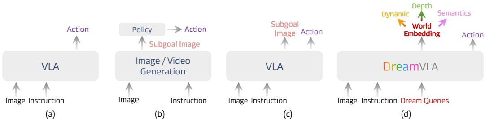
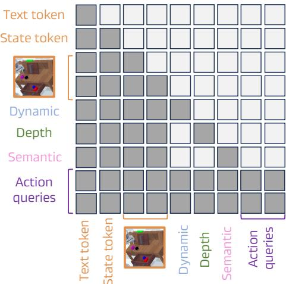
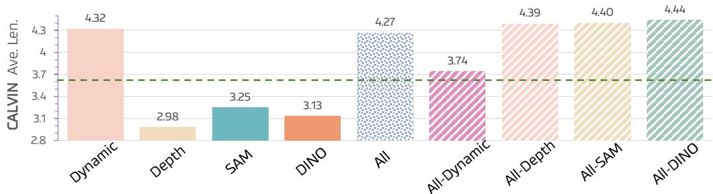

# 1. 论文基本信息 (Bibliographic Information)

*   **标题 (Title):** DreamVLA: 一个通过综合世界知识进行“梦想”的视觉-语言-动作模型 (DreamVLA: A Vision-Language-Action Model Dreamed with Comprehensive World Knowledge)
*   **作者 (Authors):** Wenyao Zhang, Hongsi Liu, Zekun Qi, Yunnan Wang, Xinqiang Yu, Jiazhao Zhang, Runpei Dong, Jiawei He, Fan Lu, He Wang, Zhizheng Zhang, Li Yi, Wenjun Zeng, Xin Jin。作者来自上海交通大学 (SJTU)、EIT、清华大学 (THU)、Galbot、北京大学 (PKU)、伊利诺伊大学厄巴纳-香槟分校 (UIUC)、中国科学技术大学 (USTC) 等多个知名学术机构和企业，显示了这是一个跨机构合作的强大研究团队。
*   **发表期刊/会议 (Journal/Conference):** 本文目前发布于 `arXiv`，这是一个预印本服务器。`arXiv` 上的论文通常是待同行评审或已投稿到顶级会议/期刊（如 CVPR, ICRA, NeurIPS 等）的最新研究成果。
*   **发表年份 (Publication Year):** 2024 (根据 `arXiv` ID 2407.04447 推断，提交于2024年7月，但论文中部分引用格式写为2025，可能是目标会议年份)。
*   **摘要 (Abstract):** 论文摘要指出，尽管现有的视觉-语言-动作 (VLA) 模型在机器人操作方面取得了进展，但它们通常局限于基于图像的预测，这不仅包含冗余信息，还缺乏对动态、空间和语义等关键世界知识的综合理解。为解决这些问题，论文提出了 `DreamVLA`，一个新颖的 VLA 框架。该框架通过预测全面的世界知识（动态区域、空间深度、高层语义）来赋能逆动力学建模，从而构建一个“感知-预测-动作”的闭环。`DreamVLA` 的设计模仿了人类先形成抽象多模态推理链再行动的模式。为了避免不同知识模态间的干扰，论文采用了一种分块结构化注意力机制。此外，为生成动作序列，`DreamVLA` 使用了一个基于扩散的 Transformer。实验证明，`DreamVLA` 在真实机器人任务上达到了 **76.7%** 的成功率，并在 `CALVIN` 仿真基准上取得了 **4.44** 的平均任务长度，性能优越。
*   **原文链接 (Source Link):**
    *   **arXiv 链接:** https://arxiv.org/abs/2407.04447
    *   **PDF 链接:** https://arxiv.org/pdf/2407.04447v3.pdf
    *   **发布状态:** 预印本 (Preprint)。

        ---

# 2. 整体概括 (Executive Summary)

*   **研究背景与动机 (Background & Motivation - Why):**
    *   **核心问题：** 当前主流的视觉-语言-动作 (VLA) 模型通常直接将视觉观测和语言指令映射到机器人动作，缺乏对未来状态的“想象”或“预见”能力。这种直接映射的方式限制了模型的推理和泛化能力，尤其是在处理长时序、复杂任务时。
    *   **现有研究的空白 (Gap):**
        1.  一些尝试引入未来预测的工作，大多依赖于生成**完整的未来图像帧**。这种方法存在两个主要问题：首先，生成的图像与当前观测存在大量重叠，**信息冗余**，效率低下；其次，预测像素级的图像非常困难，容易产生模糊或不真实的细节。
        2.  现有方法普遍缺乏对**综合世界知识**的预测。它们要么只关注视觉像素，要么只预测单一维度的信息，而忽略了对机器人操作至关重要的**空间结构 (3D 知识)、动态变化 (哪些物体会移动) 和高层语义 (物体的身份和功能)**。
    *   **本文的切入点：** 论文提出，机器人不应该像“复印机”一样去预测整个未来画面，而应该像人类一样，<strong>“梦想”</strong>或“规划”出与任务最相关的核心变化。因此，`DreamVLA` 的核心思路是，将未来预测的目标从“完整的图像”转变为“**紧凑而全面的世界知识**”，即只预测场景中即将发生变化的部分（动态区域）、场景的3D结构（深度）以及物体的语义信息。

*   **核心贡献/主要发现 (Main Contribution/Findings - What):**
    *   **提出了 `DreamVLA` 框架：** 将传统的“感知-动作”模型重塑为“**感知-预测-动作**”闭环模型。其核心是让模型明确地预测一个由**动态、空间和高层语义信息**组成的紧凑知识集，为后续的动作规划提供简洁而全面的前瞻性线索。
    *   **引入了两种关键机制保障模型性能：**
        1.  **分块结构化注意力机制 (Block-wise Structured Attention):** 为了防止动态、深度、语义这三种不同类型的知识在模型内部互相“串扰”导致表示质量下降，设计了一种特殊的注意力掩码，确保各类知识在生成过程中保持独立和纯净。
        2.  **基于扩散的 Transformer 解码器 (Diffusion-Transformer Decoder):** 用于生成动作序列。它能更好地从共享的潜在特征中解耦出与动作相关的信息，并对复杂的、多模态的未来动作分布进行建模。
    *   **达到了新的业界最佳性能 (State-of-the-art, SOTA):** `DreamVLA` 在公开的 `CALVIN` 机器人操作基准测试中取得了新的最高分（平均任务长度 4.44），并在真实世界的机器人任务中实现了 76.7% 的高成功率，全面验证了其方法的有效性。

        ---

# 3. 预备知识与相关工作 (Prerequisite Knowledge & Related Work)

*   **基础概念 (Foundational Concepts):**
    *   **视觉-语言-动作模型 (Vision-Language-Action Model, VLA):** 这是一类人工智能模型，旨在让机器人能够理解人类的自然语言指令（例如“请把桌上的苹果递给我”），并结合当前的视觉输入（摄像头看到的场景），自主规划并执行一系列物理动作来完成任务。这类模型是连接语言大模型与物理世界的桥梁。
    *   **多模态大语言模型 (Multimodal Large Language Models, MMLM):** 指能同时处理和理解多种不同类型信息（如文本、图像、音频）的大语言模型。例如，`GPT-4` 就是一个典型的 MMLM。VLA 模型通常会借鉴或基于 MMLM 的架构，利用其强大的跨模态理解能力。
    *   **逆动力学 (Inverse Dynamics):** 在机器人学中，正动力学是根据施加的力和力矩计算物体的运动；而逆动力学则是**根据期望的物体运动（即从状态A到状态B），反推出需要施加什么样的力或动作**。在本文中，作者将“预测未来世界知识”视为定义了期望的未来状态，然后模型需要反推出实现这一未来状态所需执行的动作序列，这正是逆动力学思想的应用。
    *   **扩散模型 (Diffusion Model):** 一类强大的生成模型。其核心思想是：首先在一个“前向过程”中，通过逐步对原始数据（如图像或动作序列）添加高斯噪声，直到其完全变成纯噪声；然后训练一个神经网络在“反向过程”中，从纯噪声出发，逐步去除噪声，最终恢复出原始数据。通过这种方式，扩散模型可以学习到数据的高度复杂的分布，并生成高质量、多样化的新样本。
    *   **光流 (Optical Flow):** 在计算机视觉中，光流是用于描述连续两帧图像之间每个像素运动的向量场。简单来说，它能告诉我们图像中的每个点在下一帧中移动到了哪里。本文利用光流来识别场景中的“动态区域”。
    *   **基础模型 (Foundation Models):** 指在大规模、多样化数据上预训练的、能够适应多种下游任务的大型模型。例如 `CLIP`、`DINOv2`、`SAM` 都是视觉领域强大的基础模型，它们对图像有深刻的通用理解能力。本文利用这些模型来提取高层语义特征。

*   **前人工作 (Previous Works):**
    *   **直接映射的 VLA 模型 (Vanilla VLA):** 如 `RT-1` 等早期模型，它们直接将语言指令和视觉输入送入一个“黑箱”模型，输出动作。**局限性：** 缺乏中间的推理和规划步骤，难以应对复杂任务，泛化能力有限。
    *   **使用辅助生成模型的 VLA：** 如 `Susie`、`GR-1` 等，它们采用两阶段方法。第一阶段，使用一个独立的图像/视频生成模型（“copilot model”）来生成一个未来的目标图像或视频。第二阶段，将这个生成的目标图像作为条件，输入到另一个策略模型中来生成动作。**局限性：** 依赖外部模型，增加了计算开销和推理延迟，且两个模型的性能瓶颈会相互影响。
    *   **集成未来预测的 VLA：** 如 `Seer`、`UP-VLA` 等，它们将未来子目标图像的预测功能集成到单个 VLA 模型中，将预测作为一种“中间思考步骤”。**局限性：** 仍然在预测**完整的图像帧**，存在信息冗余、缺乏3D空间和高层语义知识的问题。

*   **技术演进 (Technological Evolution):**

    
    *该图像是一个示意图，展示了不同视觉语言动作模型的结构比较。包括(a)传统VLA模型直接映射图像和指令至动作，(b)基于图像/视频生成的分阶段方法，(c)VLA变体通过预测子目标图像辅助动作生成，(d)本文提出的DreamVLA利用动态区域、深度图和语义知识显著提升动作推理与泛化能力。*

    上图清晰地展示了 VLA 模型的技术演进路径：
    1.  **(a) Vanilla VLA:** 最基础的“输入 -> 输出”模式。
    2.  **(b) Copilot Model:** 分离的“预测 -> 规划”两步走模式。
    3.  **(c) Integrated Subgoal VLA:** 集成的“输入 -> 预测中间图像 -> 输出”模式。
    4.  **(d) DreamVLA (本文):** 进一步演进为集成的“输入 -> **预测核心知识** -> 输出”模式，预测内容更抽象、更高效。

*   **差异化分析 (Differentiation):**
    `DreamVLA` 与以往工作的核心区别在于**预测内容**和**实现机制**：
    *   **预测内容更高效和全面：** `DreamVLA` 不预测冗余的完整图像，而是预测一个**紧凑的知识组合**：
        *   **动态 (Dynamic):** 哪里会动？（通过动态区域预测）
        *   **空间 (Spatial):** 3D 结构是怎样的？（通过深度图预测）
        *   **语义 (Semantic):** 涉及的物体是什么，有什么用？（通过 `DINOv2` / `SAM` 特征预测）
    *   **实现机制更精巧：**
        *   通过**分块结构化注意力**确保不同知识类型的表征纯净，避免相互干扰。
        *   通过**扩散 Transformer** 对复杂的多步动作进行建模，提高了动作序列的连贯性和多样性。

            ---

# 4. 方法论 (Methodology - Core Technology & Implementation Details)

`DreamVLA` 的整体框架旨在构建一个“感知-预测-动作”的闭环。

*该图像是DreamVLA框架的示意图，展示了机器人状态$s_t$、观测$o_t$和语言指令经文本、视觉及状态编码器编码后，结合可训练的<dream>查询输入大语言模型，生成世界嵌入。三路解码器分别预测动态区域$_{t+n}$、单目深度$d_{t+n}$和高层语义$c_{t+n}$，动作查询条件扩散变换器生成未来动作序列$a_{t:t+n-1}$，训练阶段解码器仅用于预测，推理阶段跳过。*

上图展示了 `DreamVLA` 的详细架构。下面将分步解析其核心思想和技术细节。

*   **方法原理 (Methodology Principles):**
    `DreamVLA` 的核心思想是**模仿人类的规划过程**。在执行一个任务前，人脑不会在脑海里“播放”一整段高清视频，而是会形成一个抽象的行动蓝图，包含“我要移动哪个物体（语义）”、“它在什么位置（空间）”以及“它将如何移动（动态）”等关键信息。`DreamVLA` 通过预测这三种核心世界知识，为机器人提供了这样一个高效的“行动蓝图”。

*   **方法步骤与流程 (Steps & Procedures):**
    1.  **多模态输入编码 (Input Encoding):**
        *   **语言指令 $l$:** 使用 `CLIP` 的文本编码器将其转换为文本嵌入。
        *   **视觉观测 $o_t$:** 使用一个掩码自编码器 (`Masked Autoencoder`) 将图像帧转换为一系列图像块（patch）的表征。
        *   **机器人自身状态 $s_t$:** 包括关节角度、末端执行器位置等本体感受信息，通过一个小型卷积和全连接网络进行编码。
    2.  **引入特殊查询 (Query Tokens):** 在编码后的输入序列中，加入两种可学习的特殊 `token`：
        *   $<dream>$ **查询：** 用于引导模型生成对未来世界知识的预测。它内部又细分为三个子查询，分别对应动态、深度和语义。
        *   $<action>$ **查询：** 用于引导模型生成最终的动作序列。
    3.  **核心处理与世界嵌入生成 (World Embedding Generation):**
        *   将编码后的所有输入（文本、图像、状态）和特殊查询拼接成一个序列，送入一个基于 `GPT-2` 架构的大语言模型进行处理。
        *   模型通过自注意力机制融合所有信息，在 $<dream>$ 查询对应的位置上，会生成一个包含了对未来世界知识预测的紧凑表示，称之为**世界嵌入 (World Embedding)** $w_{t+n}$。
    4.  **世界知识预测 (World Knowledge Prediction):** (仅在训练阶段使用)
        *   从世界嵌入 $w_{t+n}$ 中，三个独立的轻量级解码器分别预测出未来 $n$ 步的：
            *   **动态区域 $\hat{f}_{t+n}$**
            *   **单目深度图 $\hat{d}_{t+n}$**
            *   **高层语义特征 $\hat{c}_{t+n}$**
    5.  **动作生成 (Action Generation):**
        *   同时，在 $<action>$ 查询对应的位置，模型会生成一个**动作嵌入 (Action Embedding)**。
        *   这个动作嵌入作为条件，输入到一个**去噪扩散 Transformer (Denoising Diffusion Transformer, DiT)** 中。`DiT` 从一个标准高斯噪声出发，经过多步去噪，最终生成一个连贯的 $n$ 步动作序列 $\hat{a}_{t:t+n-1}$。
    *   **推理阶段的优化：** 在实际部署（推理）时，步骤 4 中的知识预测解码器会被**完全跳过**。模型直接利用生成的世界嵌入 $w_{t+n}$ 来指导动作生成，从而在享受预测带来的性能提升的同时，保持了较低的计算延迟。

*   **数学公式与关键细节 (Mathematical Formulas & Key Details):**

    *   **1. 动态区域预测 (Motion-centric Dynamic-region Reconstruction):**
        *   **思想：** 不预测完整的未来图像，而是只预测场景中会发生移动的区域（如机器人手臂、被操作的物体）。这通过一个离线的光流模型 `CoTracker` 预先提取动态区域的真值掩码来实现。
        *   **损失函数：** 该预测任务被建模为一个掩码自编码问题。其损失函数 $\mathcal{L}_{\mathrm{dyn}}$ 旨在让模型能够根据上下文信息，准确地重建出被掩盖的动态区域的视觉 `token`。
            $$
            \mathcal{L}_{\mathrm{dyn}} = \frac{1}{|\mathcal{D}|} \sum_{x_i \in \mathcal{D}} \mathbb{E}_{z \sim Q_{\phi}(z|x_i)} \Big[ -\log P_{\psi}((x_i)_{\mathcal{M}} | z) \Big]
            $$
        *   **符号解释：**
            *   $\mathcal{D}$: 训练数据集。
            *   $x_i$: 原始的未来图像。
            *   $(x_i)_{\mathcal{M}}$: 图像 $x_i$ 中属于动态区域的部分。
            *   $Q_{\phi}(z|x_i)$: 一个编码器（tokenizer），将图像 $x_i$ 转换为一系列离散的视觉 `token` $z$。
            *   $P_{\psi}(\cdot|z)$: 一个解码器，尝试根据 `token` $z$ 重建出动态区域 $(x_i)_{\mathcal{M}}$。
            *   $\mathbb{E}[\cdot]$: 求期望。
            *   **目标：** 该公式的本质是最大化模型重建动态区域的对数似然，即让预测的动态区域尽可能接近真实的动态区域。

    *   **2. 深度预测 (Depth Prediction):**
        *   **思想：** 预测未来的深度图，为机器人提供3D空间信息，帮助其规划无碰撞路径。在没有真实深度传感器数据时，使用一个强大的单目深度估计模型 `Depth-Anything` 生成的伪标签作为监督信号。
        *   **损失函数：** 使用尺度归一化的均方误差 (Scale-normalized Mean-Squared Error)。
            $$
            \begin{aligned}
            & \mathcal{L}_{\mathrm{depth}} = \frac{1}{HW} \sum_{i,j} \big( \hat{d}_{t+n}^{(i,j)} - \alpha d_{t+n}^{(i,j)} \big)^2, \\
            & \alpha = \frac{\sum_{i,j} \hat{d}_{t+n}^{(i,j)} d_{t+n}^{(i,j)}}{\sum_{i,j} (d_{t+n}^{(i,j)})^2}
            \end{aligned}
            $$
        *   **符号解释：**
            *   $\hat{d}_{t+n}$: 模型预测的未来深度图。
            *   $d_{t+n}$: （伪）真实的未来深度图。
            *   `H, W`: 深度图的高度和宽度。
            *   `(i,j)`: 像素坐标。
            *   $\alpha$: 一个尺度因子，用于对齐预测深度图和真值深度图的全局尺度。因为单目深度估计只能恢复相对深度，无法确定绝对尺度，所以这个因子可以消除尺度模糊性带来的影响。

    *   **3. 语义预测 (Contrastive Semantic Forecasting):**
        *   **思想：** 预测未来场景中关键物体的高层语义特征（由 `DINOv2` 和 `SAM` 提取），让机器人理解它将要与什么物体交互。
        *   **损失函数：** 使用 `InfoNCE` 对比损失。
            $$
            \mathcal{L}_{\mathrm{sem}} = - \log \frac{\exp(\hat{c}_{t+n}^{\top} c_{t+n} / \tau)}{\sum_{k} \exp(\hat{c}_{t+n}^{\top} c_{k} / \tau)}
            $$
        *   **符号解释：**
            *   $\hat{c}_{t+n}$: 模型预测的未来语义特征。
            *   $c_{t+n}$: 真实的未来语义特征（正样本）。
            *   $c_k$: 其他位置或时刻的语义特征（负样本）。
            *   $\tau$: 温度超参数，用于调节对比的强度。
            *   **目标：** 该损失函数鼓励模型预测的特征 $\hat{c}_{t+n}$ 与真实特征 $c_{t+n}$ 的相似度（点积）远大于其与所有负样本 $c_k$ 的相似度。这迫使模型学会区分正确和错误的未来语义。

    *   **4. 结构化注意力 (Structured Attention):**

        
        *该图像是图4，展示了Block-wise结构化注意力机制的示意图，采用灰色方块表示各模态（文本、状态、动态、深度、语义、动作查询）之间的注意力屏蔽关系，凸显不同信息块之间的互相屏蔽以防止信息泄露。*

        *   **思想：** 为了防止不同知识（动态、深度、语义）的表征在模型内部相互污染，设计了特殊的注意力掩码。如上图所示，动态、深度、语义这三个子查询之间**相互屏蔽注意力**，它们都只能关注共享的视觉、语言和状态输入，但不能相互“偷看”。
        *   **作用：** 保持了每种知识表征的纯净性和独立性，避免了例如深度信息泄露到动态预测中，从而提高了整体模型的鲁棒性和预测质量。

    *   **5. 动作生成扩散模型损失 (DiT Loss):**
        *   **思想：** 将动作生成视为一个从噪声到动作序列的去噪过程。
        *   **损失函数：**
            $$
            \mathcal{L}_{\mathrm{DiT}} = \mathbb{E}_{\tau, \varepsilon} \left\| \varepsilon - \varepsilon_{\theta} \left( \sqrt{\bar{\alpha}_{\tau}} a_{t:t+n-1} + \sqrt{1-\bar{\alpha}_{\tau}} \varepsilon, \tau, \mathbf{c} \right) \right\|_2^2
            $$
        *   **符号解释：**
            *   $a_{t:t+n-1}$: 真实的动作序列。
            *   $\varepsilon$: 从标准正态分布 $\mathcal{N}(0, I)$ 中采样的噪声。
            *   $\varepsilon_{\theta}$: 带有可学习参数 $\theta$ 的去噪网络（即 `DiT`）。
            *   $\tau$: 扩散过程中的时间步。
            *   $\bar{\alpha}_{\tau}$: 与时间步 $\tau$ 相关的噪声调度系数，控制了加噪的程度。
            *   $\mathbf{c}$: 条件信息，即从主模型中获得的**动作嵌入**。
            *   **目标：** 训练去噪网络 $\varepsilon_{\theta}$，使其能够准确地预测出在任意时间步 $\tau$ 添加到干净动作序列上的噪声 $\varepsilon$。

                ---

# 5. 实验设置 (Experimental Setup)

*   **数据集 (Datasets):**
    *   **CALVIN:** 一个大规模的仿真机器人操作基准。特点是任务链长、需要语言指令进行引导，包含丰富的传感器数据（静态和腕部 RGB-D 相机）。用于评估模型在长时序、多任务环境下的泛化能力。
    *   **LIBERO:** 另一个仿真基准，包含四个子集，分别侧重于空间推理、物体交互、目标导向和长时序任务。用于更全面地评估模型的不同能力维度。
    *   **DROID:** 一个大规模的真实世界机器人操作数据集，包含了 Franka 机器人在多样化场景下的操作轨迹。用于模型的预训练，使其获得在真实世界中的基础操作知识。
    *   **自采集真实世界数据集：** 作者还使用 Franka Panda 机械臂和 RealSense D415 相机采集了一个小规模的真实世界数据集，包含“抓取与放置”和“开关抽屉”等任务，用于微调和最终的真实世界评估。

*   **评估指标 (Evaluation Metrics):**
    *   **成功率 (Success Rate, SR):**
        1.  **概念定义:** 该指标衡量模型在给定任务中成功完成目标的比例。它是评估机器人策略模型最直接、最重要的指标。例如，在100次“拿起瓶子”的尝试中，如果成功了85次，则成功率为85%。
        2.  **数学公式:**
            $$
            \mathrm{SR} = \frac{\text{Number of Successful Trials}}{\text{Total Number of Trials}} \times 100\%
            $$
        3.  **符号解释:**
            *   $\text{Number of Successful Trials}$: 在所有尝试中，被判定为成功的次数。成功的标准根据具体任务定义（例如，物体被拿起、抽屉被拉开超过10厘米）。
            *   $\text{Total Number of Trials}$: 执行任务的总次数。
    *   **平均任务长度 (Average Length, Avg. Len.):**
        1.  **概念定义:** 该指标专用于 `CALVIN` 基准，用于衡量模型在一次连续执行中能够完成多少个相连的子任务。`CALVIN` 的评估要求模型连续解决5个不同的指令。该指标越高，表明模型的长时序规划和执行能力越强，策略的鲁棒性也越好。
        2.  **数学公式:**
            $$
            \text{Avg. Len.} = \frac{1}{N} \sum_{i=1}^{N} C_i
            $$
        3.  **符号解释:**
            *   $N$: 总的评估序列（rollout）数量。
            *   $C_i$: 在第 $i$ 个评估序列中，模型连续完成的子任务数量（最大为5）。

*   **对比基线 (Baselines):**
    论文选取了多种有代表性的 VLA 模型作为对比基线，覆盖了不同的技术路线：
    *   **直接映射模型：** `Roboflamingo`, `OpenVLA`, `Robovlm`。
    *   **使用辅助生成模型：** `GR-1`, `Susie`。
    *   **集成子目标预测模型：** `Seer`, `UP-VLA`, `VPP`。
    *   **基于扩散模型的策略：** `3D Diffusor Actor`, `Diffusion Policy`。
    *   **其他 SOTA 模型：** `Octo`, `RoboDual`, `UNIVLA`, `Pi0`, `CLOVER` 等。
        这些基线的选择非常全面，能够有力地证明 `DreamVLA` 相对于当前主流方法的优越性。

---

# 6. 实验结果与分析

*   **核心结果分析 (Core Results Analysis):**

    *   <strong>仿真环境 (<code>CALVIN</code> 和 <code>LIBERO</code>):</strong>
        *   **`CALVIN` 结果 (Table 1):** 以下为原文 Table 1 的转录。

            <table>
            <tr>
            <td rowspan="2">Method</td>
            <td colspan="6">Task completed in a row</td>
            </tr>
            <tr>
            <td>1</td>
            <td>2</td>
            <td>3</td>
            <td>4</td>
            <td>5</td>
            <td>Avg. Len. ↑</td>
            </tr>
            <tr>
            <td>Roboflamingo [30]</td>
            <td>82.4</td>
            <td>61.9</td>
            <td>46.6</td>
            <td>33.1</td>
            <td>23.5</td>
            <td>2.47</td>
            </tr>
            <tr>
            <td>Susie [118]</td>
            <td>87.0</td>
            <td>69.0</td>
            <td>49.0</td>
            <td>38.0</td>
            <td>26.0</td>
            <td>2.69</td>
            </tr>
            <tr>
            <td>GR-1 [14]</td>
            <td>85.4</td>
            <td>71.2</td>
            <td>59.6</td>
            <td>49.7</td>
            <td>40.1</td>
            <td>3.06</td>
            </tr>
            <tr>
            <td>3D Diffusor Actor [93]</td>
            <td>92.2</td>
            <td>78.7</td>
            <td>63.9</td>
            <td>51.2</td>
            <td>41.2</td>
            <td>3.27</td>
            </tr>
            <tr>
            <td>OpenVLA [1]</td>
            <td>91.3</td>
            <td>77.8</td>
            <td>62.0</td>
            <td>52.1</td>
            <td>43.5</td>
            <td>3.27</td>
            </tr>
            <tr>
            <td>RoboDual [119]</td>
            <td>94.4</td>
            <td>82.7</td>
            <td>72.1</td>
            <td>62.4</td>
            <td>54.4</td>
            <td>3.66</td>
            </tr>
            <tr>
            <td>UNIVLA [120]</td>
            <td>95.5</td>
            <td>85.8</td>
            <td>75.4</td>
            <td>66.9</td>
            <td>56.5</td>
            <td>3.80</td>
            </tr>
            <tr>
            <td>Pi0 [32]</td>
            <td>93.8</td>
            <td>85.0</td>
            <td>76.7</td>
            <td>68.1</td>
            <td>59.9</td>
            <td>3.92</td>
            </tr>
            <tr>
            <td>CLOVER [121]</td>
            <td>96.0</td>
            <td>83.5</td>
            <td>70.8</td>
            <td>57.5</td>
            <td>45.4</td>
            <td>3.53</td>
            </tr>
            <tr>
            <td>UP-VLA [57]</td>
            <td>92.8</td>
            <td>86.5</td>
            <td>81.5</td>
            <td>76.9</td>
            <td>69.9</td>
            <td>4.08</td>
            </tr>
            <tr>
            <td>Robovlm [37]</td>
            <td>98.0</td>
            <td>93.6</td>
            <td>85.4</td>
            <td>77.8</td>
            <td>70.4</td>
            <td>4.25</td>
            </tr>
            <tr>
            <td>Seer [56]</td>
            <td>96.3</td>
            <td>91.6</td>
            <td>86.1</td>
            <td>80.3</td>
            <td>74.0</td>
            <td>4.28</td>
            </tr>
            <tr>
            <td>VPP [49]</td>
            <td>95.7</td>
            <td>91.2</td>
            <td>86.3</td>
            <td>81.0</td>
            <td>75.0</td>
            <td>4.29</td>
            </tr>
            <tr>
            <td><strong>DreamVLA</strong></td>
            <td><strong>98.2</strong></td>
            <td><strong>94.6</strong></td>
            <td><strong>89.5</strong></td>
            <td><strong>83.4</strong></td>
            <td><strong>78.1</strong></td>
            <td><strong>4.44</strong></td>
            </tr>
            </table>

            **分析：** `DreamVLA` 在 `CALVIN` 基准的所有指标上都取得了最佳成绩。其**平均任务长度 (Avg. Len.) 达到 4.44**，显著高于所有之前的 SOTA 方法，如 `Seer` (4.28) 和 `VPP` (4.29)。这表明通过预测全面的世界知识，`DreamVLA` 获得了更强的长时序推理和鲁棒执行能力。
        *   **`LIBERO` 结果 (Table 2):** `DreamVLA` 在 LIBERO 的四个子任务（Spatial, Object, Goal, Long）上均取得了最好或具有竞争力的表现，平均分高达 **92.6%**，远超之前的 SOTA 模型 `SpatialVLA` (78.1%)。这证明了其方法的广泛适用性。

    *   **真实世界实验 (`Franka` 机器人):**
        *   **结果 (Table 3):** 以下为原文 Table 3 的转录。

            <table>
            <tr>
            <td rowspan="2">Method</td>
            <td colspan="3">Pick</td>
            <td colspan="3">Place</td>
            <td colspan="3">Drawer</td>
            <td>Task (All)</td>
            </tr>
            <tr>
            <td>Bottle</td>
            <td>Doll</td>
            <td>Avg.</td>
            <td>Banana</td>
            <td>Chili</td>
            <td>Avg.</td>
            <td>Open</td>
            <td>Close</td>
            <td>Avg.</td>
            <td>Avg.</td>
            </tr>
            <tr>
            <td>Diffusion Policy [90]</td>
            <td>50.0</td>
            <td>70.0</td>
            <td>60.0</td>
            <td>65.0</td>
            <td>45.0</td>
            <td>55.0</td>
            <td>15.0</td>
            <td>60.0</td>
            <td>37.5</td>
            <td>50.8</td>
            </tr>
            <tr>
            <td>Octo-Base [13]</td>
            <td>50.0</td>
            <td>60.00</td>
            <td>55.0</td>
            <td>40.0</td>
            <td>50.0</td>
            <td>45.0</td>
            <td>20.0</td>
            <td>50.0</td>
            <td>35.0</td>
            <td>45.0</td>
            </tr>
            <tr>
            <td>OpenVLA [1]</td>
            <td>50.0</td>
            <td>40.0</td>
            <td>45.0</td>
            <td>20.0</td>
            <td>30.0</td>
            <td>25.0</td>
            <td>40.0</td>
            <td>30.0</td>
            <td>35.0</td>
            <td>35.0</td>
            </tr>
            <tr>
            <td><strong>DreamVLA</strong></td>
            <td><strong>85.0</strong></td>
            <td><strong>80.0</strong></td>
            <td><strong>82.5</strong></td>
            <td><strong>80.0</strong></td>
            <td><strong>80.0</strong></td>
            <td><strong>80.0</strong></td>
            <td><strong>70.0</strong></td>
            <td><strong>65.0</strong></td>
            <td><strong>67.5</strong></td>
            <td><strong>76.7</strong></td>
            </tr>
            </table>

            **分析：** 在真实世界中，`DreamVLA` 的优势更加明显。其在所有任务上的平均成功率达到了 **76.7%**，远超 `Diffusion Policy` (50.8%)、`Octo-Base` (45.0%) 和 `OpenVLA` (35.0%)。这强有力地证明了 `DreamVLA` 框架具备出色的**模拟到真实 (Sim-to-Real) 迁移能力**，其学到的预测能力在应对真实世界的噪声和不确定性时依然有效。

*   **消融实验/参数分析 (Ablation Studies / Parameter Analysis):**
    作者设计了一系列详尽的消融实验来验证其方法设计的合理性。

    *   **Q1: 各知识模态的贡献是什么？**

        
        *该图像是图表，展示了CALVIN ABC-D基准中不同知识预测组合下的平均执行长度表现。图中“All”表示包含五种模型全部知识，All- $\nabla \cdot X$ 表示从全部知识中去除X，对比动态、深度、SAM、DINO等模型表现差异。*
        **分析：** 从上图和 Table 4 可以看出：

        *   **动态区域预测**的贡献最大。单独添加动态区域预测就能带来巨大的性能提升。这说明“知道哪里会动”是机器人规划动作最关键的信息。
        *   单独添加深度或语义预测时，性能反而会下降。作者分析这是因为深度和高维语义特征的预测任务与最终的动作预测任务差异较大，其产生的梯度噪声可能会干扰主任务的学习。
        *   当**多种知识结合**时，性能达到最佳。动态、深度和语义知识能够形成互补，共同为模型提供最全面的未来图景。

    *   **Q2: 提升是来自“未来预测”还是“辅助任务”？** (Table 5)
        **分析：** 实验对比了“预测未来知识”和“重建当前知识”（作为辅助任务）两种设置。结果显示，**预测未来 (Prediction)** 的性能（Avg. Len. 4.44）远高于**重建当前 (Auxiliary)**（Avg. Len. 4.14）。这说明，性能的提升确实来源于模型的前瞻性推理能力，而非简单地增加多任务学习。

    *   **Q3: 为什么预测动态区域，而不是直接预测光流？** (Table 6)
        **分析：** 预测稠密的光流场比预测一个二值的动态区域掩码要复杂得多。实验结果表明，预测动态区域（Avg. Len. 4.44）比预测光流（Avg. Len. 4.23）效果更好，证实了 `DreamVLA` 选择了一种更高效、更直接的动态信息表示方式。

    *   **Q4: 结构化注意力的效果如何？** (Table 7)
        **分析：** 使用**结构化注意力 (Structure)** 的模型（Avg. Len. 4.44）远胜于使用普通**因果注意力 (Causal)** 的模型（Avg. Len. 3.75）。这证明了隔离不同知识模态、防止信息“串扰”对于保持表征质量和提升长时序控制能力至关重要。

    *   **Q5: 能否用共享查询来预测所有知识？** (Table 8)
        **分析：** 使用**分离查询 (Separated)** 的性能（Avg. Len. 4.44）显著优于**共享查询 (Shared)**（Avg. Len. 4.17）。这说明为每种知识分配专属的查询 `token`，可以更好地解耦不同模态的表征，从而获得更纯净、更有效的特征用于动作生成。

    *   **Q6: 每种模态的查询数量有何影响？** (Table 9)
        **分析：** 查询数量 $K=9$ 时效果最好。$K=4$ 时容量不足，无法编码足够精细的信息；$K=16$ 时引入了冗余，反而可能因为注意力分散而导致性能轻微下降。这表明选择合适的表征容量是重要的。

---

# 7. 总结与思考 (Conclusion & Personal Thoughts)

*   **结论总结 (Conclusion Summary):**
    `DreamVLA` 成功地将机器人 VLA 模型从简单的“反应式”系统推进到了具备“规划式”能力的系统。通过将预测目标从冗余的未来图像转变为**动态、空间、语义三位一体的综合世界知识**，并配合**结构化注意力**和**扩散解码器**等精巧设计，`DreamVLA` 显著提升了机器人在复杂、长时序任务中的推理和执行能力，在仿真和真实世界中均取得了业界领先的成果。

*   **局限性与未来工作 (Limitations & Future Work):**
    论文作者坦诚地指出了当前工作的局限性，并规划了未来的研究方向：
    *   **操作类型有限：** 当前工作主要集中于平行双指夹爪的操作，未来计划扩展到更灵巧的**多指灵巧手**操作。
    *   **数据模态单一：** 主要依赖 RGB 视觉输入，未来计划引入**3D点云**、**触觉**等更多模态的数据，构建更丰富的世界表征。
    *   **场景多样性不足：** 当前训练数据的场景多样性有限，未来需要通过持续的数据收集和在线微调来增强模型的泛化能力和长时序鲁棒性。

*   **个人启发与批判 (Personal Insights & Critique):**
    *   **启发：**
        1.  <strong>“正确地抽象”</strong>比“完整地复制”更重要。 `DreamVLA` 的核心哲学——预测核心知识而非完整像素——对于所有需要进行未来规划的 AI 系统都具有重要的借鉴意义。这提示我们在设计模型时，应更多地思考任务的本质，找到最关键的信息瓶颈。
        2.  **模块化和结构化设计的力量。** 结构化注意力机制的成功表明，在复杂的端到端模型中，有意识地设计信息流路径、避免不必要的特征污染，是提升模型性能和鲁棒性的有效手段。
        3.  **基础模型的有效利用。** `DreamVLA` 巧妙地利用了多个现成的视觉基础模型（`CoTracker`, `Depth-Anything`, `DINOv2`, `SAM`）作为“专家知识”来源，为 VLA 模型提供了高质量的监督信号。这是一种高效利用社区成果、加速自身领域发展的范式。
    *   **潜在问题与批判：**
        1.  **对外部模型的依赖：** `DreamVLA` 的性能在一定程度上建立在 `CoTracker`、`Depth-Anything` 等外部模型的性能之上。如果这些外部模型在某些特定场景下表现不佳（例如，光流在弱纹理区域失效，深度估计在透明或反光物体上出错），其错误可能会被传递并放大，影响最终的动作决策。模型的鲁棒性上界受限于这些“老师”模型。
        2.  **计算成本：** 尽管在推理时跳过了知识解码器，但在训练阶段，模型需要同时为动态、深度、语义和动作四个目标计算损失并反向传播，这无疑会增加训练的计算开销和收敛难度。
        3.  <strong>“综合世界知识”</strong>的完备性： 论文提出的动态、空间、语义三要素确实非常关键，但可能并非“综合知识”的全部。例如，物体的物理属性（质量、摩擦力）、功能可见性（affordance，如一个杯子“可以被拿起”）等更深层次的知识，在当前框架中尚未被明确建模。这可能是未来可以进一步探索的方向。