# 1. Bibliographic Information

## 1.1. Title
The central topic of the paper is "Emerging Properties in Unified Multimodal Pretraining."

## 1.2. Authors
The authors are:
*   Chaorui Deng\*1
*   Deyao Zhu\*1
*   Kunchang Li\*2‡
*   Chenhui Gou\*3‡
*   Feng Li\*4†
*   Zeyu Wang5‡
*   Shu Zhong1
*   Weihao Yu1
*   Xiaonan Nie1
*   Ziang Song1
*   Guang Shi1
*   Haoqi Fan\*\*

    \*Equal contribution, §Corresponding Author, †Project lead

**Affiliations:**
1.  ByteDance Seed
2.  Shenzhen Institutes of Advanced Technology
3.  Monash University
4.  Hong Kong University of Science and Technology
5.  UC Santa Cruz

## 1.3. Journal/Conference
The paper is published on arXiv, which is a preprint server. It is not specified to be published in a particular journal or conference yet, but given the publication date and format, it is likely a preprint submitted for peer review. ArXiv is a highly influential platform in the AI research community for sharing cutting-edge work prior to formal publication.

## 1.4. Publication Year
The paper was published on 2025-05-20 (UTC).

## 1.5. Abstract
Unifying multimodal understanding and generation has shown impressive capabilities in cutting-edge proprietary systems. In this work, we introduce BAGEL, an open-source foundational model that natively supports multimodal understanding and generation. BAGEL is a unified, decoder-only model pretrained on trillions of tokens curated from large-scale interleaved text, image, video, and web data. When scaled with such diverse multimodal interleaved data, BAGEL exhibits emerging capabilities in complex multimodal reasoning. As a result, it significantly outperforms open-source unified models in both multimodal generation and understanding across standard benchmarks, while exhibiting advanced multimodal reasoning abilities such as free-form image manipulation, future frame prediction, 3D manipulation, and world navigation. In the hope of facilitating further opportunities for multimodal research, we share the key findings, pretraining details, data creation protocol, and release our code and checkpoints to the community.

## 1.6. Original Source Link
*   **Original Source Link:** https://arxiv.org/abs/2505.14683
*   **PDF Link:** https://arxiv.org/pdf/2505.14683v3.pdf
*   **Publication Status:** This is a preprint available on arXiv.

# 2. Executive Summary

## 2.1. Background & Motivation
The core problem the paper aims to solve is the substantial gap in unified multimodal understanding and generation capabilities between academic research models and cutting-edge proprietary systems like GPT-4o and Gemini 2.0. While proprietary systems demonstrate impressive, undisclosed techniques, academic models, despite scaling efforts, still predominantly rely on image-text paired data. This reliance limits their ability to capture complex visual and semantic relationships, particularly in tasks requiring long-context multimodal reasoning.

This problem is important because unified multimodal AI models, capable of both understanding and generating across different modalities (text, images, videos), represent a frontier in artificial intelligence, holding potential for vast applications from advanced human-computer interaction to autonomous systems. The current gap indicates that open-source research is lagging behind, impeding broader scientific progress and accessibility.

The paper argues that the key to closing this gap lies in scaling with *carefully structured multimodal interleaved data*—integrating texts, images, videos, and web sources in sequences. It also highlights that existing "bottleneck" architectures, which compress large language model (LLM) contexts into a small number of latent tokens for diffusion modules, introduce significant information loss, hindering the scaling philosophy of foundational models.

The paper's entry point and innovative idea revolve around:
1.  **Scaling with diverse interleaved multimodal data:** Moving beyond simple image-text pairs to naturally occurring, complex interleaved sequences from web and video, which inherently provide richer contextual and temporal signals.
2.  **Developing a bottleneck-free architecture:** Employing a Mixture-of-Transformer-Experts (MoT) design that allows seamless, long-context interaction between understanding and generation modules through shared self-attention operations.
3.  **Observing and leveraging emerging properties:** Demonstrating that by scaling models with such data and architecture, unexpected, advanced capabilities (emergent properties) spontaneously arise, significantly enhancing multimodal reasoning.

## 2.2. Main Contributions / Findings
The primary contributions and key findings of this paper are:

*   **Introduction of BAGEL:** An open-source, unified, decoder-only foundational model (7B active parameters, 14B total) that natively supports multimodal understanding and generation. This aims to democratize advanced multimodal AI capabilities.
*   **Novel Data Protocol:** Establishment of a new protocol for scalable data sourcing, filtering, and construction of high-quality multimodal interleaved data, integrating text, image, video, and web sources. This includes:
    *   Incorporating `video data` for pixel-level, conceptual, temporal, and physical continuity.
    *   Integrating `web data` for complex real-world multimodal structures and diverse knowledge.
    *   Enriching data with `reasoning-oriented content` (Chain-of-Thoughts) to facilitate knowledge transfer between understanding and generation.
*   **Bottleneck-Free Architecture:** Adoption of a `Mixture-of-Transformer-Experts (MoT)` architecture that utilizes selective activation of modality-specific parameters. This design, unlike prior approaches, avoids bottlenecks by enabling long-context interaction via shared self-attention operations, crucial for effective scaling.
*   **Emergent Capabilities:** BAGEL exhibits "emerging capabilities" in complex multimodal reasoning when scaled with diverse interleaved data. These capabilities are not linearly predictable from smaller scales and include:
    *   Free-form image manipulation
    *   Future frame prediction
    *   3D manipulation
    *   World navigation
*   **Superior Performance:** BAGEL significantly outperforms existing open-source unified models in both multimodal generation and understanding across standard benchmarks. It also achieves text-to-image generation quality competitive with leading public generators (e.g., SD3, FLUX.1-dev) and consistently delivers superior qualitative results in image editing, extending to complex "world-modeling" tasks.
*   **Convergence of Skills:** The paper observes that basic multimodal understanding and high-fidelity generation converge first, followed by complex editing and free-form visual manipulation at later scaling stages. This suggests that previously independent atomic skills synergize into compositional reasoning.
*   **Open-Sourcing:** The authors release their code and checkpoints to the community, along with key findings, pretraining details, and data creation protocol, to facilitate further multimodal research.

# 3. Prerequisite Knowledge & Related Work

## 3.1. Foundational Concepts
To understand this paper, a reader should be familiar with several fundamental concepts in deep learning and multimodal AI:

*   **Multimodal AI:** This field deals with AI systems that can process and integrate information from multiple modalities, such as text, images, audio, and video. `Unified multimodal pretraining` aims to build a single model capable of handling various tasks across these modalities, including both understanding (e.g., visual question answering) and generation (e.g., text-to-image).

*   **Transformer Architecture:** The `Transformer` is a neural network architecture introduced in "Attention Is All You Need" (2017) that has become foundational for modern large language models. Key components include:
    *   **Self-Attention:** A mechanism that allows the model to weigh the importance of different parts of the input sequence (or different tokens) when processing each token. For a query $Q$, key $K$, and value $V$, the attention mechanism is typically calculated as:
        \$
        \mathrm{Attention}(Q, K, V) = \mathrm{softmax}\left(\frac{QK^T}{\sqrt{d_k}}\right)V
        \$
        Where:
        *   $Q$ (Query), $K$ (Key), $V$ (Value) are matrices derived from the input embeddings.
        *   $d_k$ is the dimension of the keys (and queries), used to scale the dot product to prevent very large values which can push the softmax into regions with tiny gradients.
        *   $\mathrm{softmax}$ normalizes the scores.
        *   $T$ denotes the transpose.
    *   **Feed-Forward Networks (FFN):** Position-wise fully connected neural networks applied independently to each position.
    *   **Encoder-Decoder vs. Decoder-only:**
        *   `Encoder-Decoder` Transformers typically have an encoder (processes input sequence) and a decoder (generates output sequence).
        *   `Decoder-only` Transformers, like those used in large language models (LLMs), generate output tokens sequentially, conditioning on all previously generated tokens and the input. They are typically used for `autoregressive` tasks.

*   **Autoregressive Models:** These models predict the next item in a sequence based on all preceding items. In natural language processing, this means predicting the next word given the previous words. In visual generation, it can mean predicting the next visual token given previous visual tokens or text.

*   **Diffusion Models:** A class of generative models that learn to reverse a gradual diffusion process. They work by iteratively denoising a noisy input to generate a clean sample (e.g., an image) from pure noise.
    *   **Rectified Flow:** A specific type of flow-matching for generative modeling, an alternative to traditional diffusion models that aims to simplify the sampling process and improve sample quality by learning to transform noise into data along straight paths.

*   **Mixture-of-Experts (MoE) / Mixture-of-Transformers (MoT):** These are scaling techniques for neural networks.
    *   An `MoE` model contains multiple "expert" sub-networks, and a "router" network learns to activate only a subset of these experts for each input. This allows models to have billions or trillions of parameters while only activating a fraction of them for any given input, reducing computational cost during inference.
    *   A `MoT` architecture, as described in this paper, extends MoE by having entire Transformer blocks (or even full Transformer models) act as experts, specialized for different modalities or tasks.
    *   `Sparse Activation`: Only a small number of experts are computed for each input, rather than all parameters.

*   **Visual Encoders:**
    *   **Vision Transformer (ViT):** A Transformer-based model adapted for image processing. It treats patches of an image as "tokens" and processes them using self-attention. The paper uses `SigLIP2-so400m/14`, a specific pre-trained ViT.
    *   **Variational Autoencoder (VAE):** A type of generative neural network that learns a compressed "latent" representation of data. In visual generation, a VAE can compress raw pixels into a lower-dimensional latent space and then decode latents back into pixels. The paper uses a `pre-trained VAE from FLUX`.

*   **Tokenization & Embeddings:** In multimodal models, raw data (text, image pixels) must be converted into discrete `tokens` and then embedded into a continuous vector space (`embeddings`) that the Transformer can process.

*   **Causal Attention / Causal Masking:** In autoregressive models, to prevent the model from "cheating" by looking at future tokens during training, a `causal mask` is applied to the self-attention mechanism. This ensures that when predicting the $i$-th token, the model can only attend to tokens `1` to `i-1`. In multimodal contexts, this needs to be generalized (e.g., `Generalized Causal Attention`) to handle interleaved modalities appropriately.

*   **Interleaved Data:** Training data where different modalities are mixed in a single sequence, such as "text, image, text, video segment, text, image." This format mimics natural human interaction and web content.

*   **Emerging Properties:** In large-scale AI models, `emergent properties` are new abilities or behaviors that are not present in smaller models but appear spontaneously and non-linearly as the model scale (parameters, data, compute) increases. They are often difficult to predict from the performance of smaller models.

*   **Chain-of-Thought (CoT) Reasoning:** A prompting technique for LLMs where the model is encouraged to output intermediate reasoning steps before providing a final answer. This can improve performance on complex tasks, especially those requiring multi-step logical deduction.

## 3.2. Previous Works
The paper frames its contribution in the context of existing efforts in unified multimodal understanding and generation, contrasting with both academic and proprietary systems.

*   **Earlier Unified Models:** Several research projects [57, 66, 68, 70, 73, 79, 83, 89] have explored jointly optimizing generation and understanding with unified architectures. However, these models are often `trained predominantly on image-text paired data`. Examples include:
    *   `Chameleon` [70]: An early-fusion foundation model.
    *   `Emu3` [79]: A generative pretraining in multimodality approach.
    *   `Janus` [83], `Janus-Pro` [11]: Unified models focusing on data and model scaling.
    *   `MetaQuery` [57], `MetaQuery-XL` [57]: Methods that transfer between modalities using metaqueries.
    *   `LlamaFusion` [66]: Adapting pretrained language models for multimodal generation.
    *   `MetaMorph` [73]: Multimodal understanding and generation via instruction tuning.
    *   `Show-o` [89]: A single transformer unifying multimodal understanding and generation.
        These models often face limitations due to data composition or architectural bottlenecks.

*   **Proprietary Systems:** The paper explicitly mentions `GPT-4o` and `Gemini 2.0` as cutting-edge systems that demonstrate impressive unified multimodal capabilities but whose underlying techniques remain undisclosed. These systems represent the target performance gap that BAGEL aims to close for open-source research.

*   **Model Design Space Considerations:** The paper discusses three typical design choices:
    *   **Quantized AR (Autoregressive Visual Generation):** Methods like [11, 48, 59, 70, 79, 83, 85, 90] use discrete visual tokenizers [31, 36, 51, 94] and Next-Token-Prediction for both text and visual tokens. While straightforward, their visual generation quality is `empirically inferior to diffusion-based models` and inference latency suffers.
    *   **External Diffuser:** Designs like [18, 23, 57, 69, 73] combine an LLM backbone with an external diffusion module. They connect pre-trained LLMs/VLMs to diffusion models via lightweight adapters. The LLM generates latent "semantic condition" tokens for the diffusion module. While efficient in data and often competitive, this setup introduces an `explicit bottleneck` between understanding and generation, risking substantial information loss in long-context multimodal reasoning.
    *   **Integrated Transformer:** This approach [40, 50, 66, 104] directly integrates LLM and diffusion models within a single Transformer. It leverages the complementary strengths of autoregressive Transformers (understanding/reasoning) and diffusion Transformers (visual generation). BAGEL adopts this `bottleneck-free` solution, which demands higher training compute but maintains an uncompressed context throughout all Transformer blocks, enabling lossless interaction.

*   **Data Sourcing and Augmentation:**
    *   **Transformer backbone initialization:** `Qwen2.5 LLM` [93] is chosen for its performance and availability.
    *   **Visual Generation VAE:** `FLUX` [35] provides the pre-trained VAE model. `SD3` [19] is also a leading public generator for comparison.
    *   **Interleaved Data Sources:**
        *   `Koala36M` [78]: Large-scale instructional and interaction-rich video content.
        *   `MVImgNet2.0` [28]: Objects captured from varying camera viewpoints for multi-view spatial understanding.
        *   `OmniCorpus` [39]: Large-scale web documents with interleaved text and images, preprocessed from `Common Crawl` [14].
        *   Open-source image editing datasets: [3, 22, 32, 80, 88, 101] (e.g., `OmniEdit` [80]).
    *   **Reasoning-Augmented Data:** Inspired by `O1` [33] and `DeepSeek-R1` [26], which leverage long-context Chain-of-Thoughts data. The VLM prompt for reasoning trace generation for free-form image manipulation is inspired by `DeepSeek-R1` [26].

*   **Evaluation Benchmarks:**
    *   **Multimodal Understanding:** `MME` [20], `MMBench` [46], `MMVet` [96], `MMMU` [97], `MathVista` [49], `MMVP` [74].
    *   **Text-to-Image Generation:** `GenEval` [25], `WISE` [53].
    *   **Image Editing:** `GEdit-Bench` [44].
    *   **New Benchmarks:** `IntelligentBench` (proposed in this paper), `RISEBench` [103], `KRIS-Bench` [86].

## 3.3. Technological Evolution
The evolution of multimodal AI can be broadly traced as follows:
1.  **Early Multimodal Models:** Focused on specific tasks (e.g., image captioning, visual question answering) using separate encoders for each modality and then fusing their representations. These often had limited interaction or generation capabilities.
2.  **Vision-Language Models (VLMs) with Paired Data:** The rise of large datasets of image-text pairs (e.g., web-scraped data) enabled training models to learn aligned representations between vision and language. These models excelled at understanding tasks and laid the groundwork for generation.
3.  **Specialized Generative Models:** The development of powerful text-to-image diffusion models (e.g., DALL-E, Stable Diffusion) demonstrated high-fidelity image generation but were often `generation-only` and primarily driven by text prompts.
4.  **Unified Multimodal Models (Initial Attempts):** Efforts to combine understanding and generation into a single model, often by connecting pre-trained LLMs/VLMs with diffusion models. Many of these used `bottleneck architectures` where the rich context from the LLM was compressed, limiting complex multimodal reasoning. These models were primarily trained on `image-text paired data`.
5.  **Scaling with Interleaved Data and Bottleneck-Free Architectures:** The current paper's work, `BAGEL`, represents a significant step in this evolution. It moves towards `natively unified models` by:
    *   Leveraging `diverse, interleaved multimodal data` (text, images, videos, web) to capture richer real-world dynamics and reasoning cues.
    *   Employing `bottleneck-free architectures` (like MoT) that enable deep, long-context interaction between modalities throughout the model.
    *   Demonstrating that such scaling leads to `emergent properties`—advanced reasoning capabilities that are not simply incremental improvements but qualitative shifts in model behavior.

        This positions BAGEL as a foundational model that aims to close the gap with proprietary systems by adopting their likely core strategy: massive scaling on diverse, complex, and interleaved multimodal data with an integrated, high-capacity architecture.

## 3.4. Differentiation Analysis
Compared to the main methods in related work, BAGEL presents several core differences and innovations:

*   **Data Scale and Diversity:**
    *   **Prior Work:** Many unified models [1, 11, 70] were predominantly trained on `image-text paired data` or less diverse multimodal content, which struggles to capture complex in-context reasoning involving multiple images, videos, or intermediate text.
    *   **BAGEL's Innovation:** Employs `trillions of tokens` curated from `large-scale interleaved text, image, video, and web data`. This diverse, naturally occurring interleaved format (including video and reasoning-augmented data) is explicitly designed to provide rich world knowledge, physical dynamics modeling, future frame prediction, and nuanced cross-modal interaction content, enabling more sophisticated in-context prediction and reasoning. This is a key differentiator from models relying on simpler paired datasets.

*   **Architectural Philosophy (Bottleneck-Free MoT):**
    *   **Prior Work:**
        *   `Quantized AR models` are often inferior in visual generation quality and suffer from sequential inference latency.
        *   `External Diffuser` solutions [18, 23, 57, 69, 73] often connect LLMs to diffusion models via lightweight adapters, but this introduces an `explicit bottleneck` by compressing LLM context into a small number of latent tokens. This can lead to information loss, especially for long-context multimodal reasoning.
    *   **BAGEL's Innovation:** Adopts an `Integrated Transformer` solution with a `Mixture-of-Transformer-Experts (MoT)` architecture. This design fundamentally `avoids bottlenecks` by allowing long-context interaction between multimodal understanding and generation through `shared self-attention operations` at every layer. The MoT specifically decouples parameters for understanding (text and ViT tokens) and generation (VAE tokens) into separate experts, mitigating optimization challenges from competing objectives, while still allowing them to interact deeply within the same Transformer blocks. This ensures that the model's full capacity can emerge without architectural constraints.

*   **Emergent Capabilities and Reasoning Focus:**
    *   **Prior Work:** While many models demonstrate strong understanding or generation, the explicit focus on and demonstration of `emergent capabilities` in complex multimodal reasoning (e.g., free-form image manipulation, 3D manipulation, world navigation) is a key novelty. Traditional benchmarks often don't fully capture these.
    *   **BAGEL's Innovation:** The paper rigorously investigates and documents these emergent properties, proposing new evaluation suites like `IntelligentBench` to specifically test complex multimodal reasoning and task composition. The observation that basic skills converge first, followed by complex reasoning, highlights the unique benefits of its scaling strategy.

*   **Open-Source Nature:**
    *   **Prior Work:** The paper points out that cutting-edge capabilities are largely confined to `proprietary systems` (GPT-4o, Gemini 2.0) whose techniques are undisclosed.
    *   **BAGEL's Innovation:** BAGEL is introduced as an `open-source foundational model`, aiming to make these advanced capabilities accessible to the broader research community and close the proprietary-academic gap.

        In essence, BAGEL differentiates itself by combining a massive, diverse, and interleaved training dataset with a thoughtfully designed, bottleneck-free MoT architecture, explicitly targeting and demonstrating the emergence of advanced, complex multimodal reasoning abilities in an open-source framework.

# 4. Methodology

## 4.1. Principles
The core idea behind BAGEL's methodology is to develop a unified multimodal foundation model capable of both understanding and generation, that exhibits emergent properties through large-scale pretraining. This is achieved by:
1.  **Unified Architecture:** Employing a single, decoder-only Transformer backbone with a `Mixture-of-Transformer-Experts (MoT)` design. This allows the model to natively handle both understanding and generation tasks within the same computational framework.
2.  **Bottleneck-Free Interaction:** Crucially, the MoT architecture enables deep, long-context interaction between modalities through `shared self-attention operations` across all Transformer layers. This avoids the information compression bottlenecks often found in models that combine separate understanding and generation modules.
3.  **Diverse Interleaved Data Scaling:** Pretraining on `trillions of tokens` curated from `large-scale interleaved text, image, video, and web data`. This rich, naturally occurring, and reasoning-augmented data is considered essential for models to acquire world knowledge, model physical dynamics, and learn complex cross-modal reasoning.
4.  **Learning Paradigm:** Adopting `Next-Token-Prediction` for text and `Rectified Flow` for visual tokens.
5.  **Emergence as a Goal:** The explicit goal is to scale the model and data sufficiently such that `emergent capabilities` in complex multimodal reasoning naturally arise, leading to advanced functionalities beyond basic understanding and generation.

## 4.2. Core Methodology In-depth (Layer by Layer)

BAGEL's design integrates understanding and generation within a single autoregressive framework, built upon a powerful LLM backbone and optimized for multimodal interaction.

### 4.2.1. Model Architecture
The backbone model is inherited from an LLM with a `decoder-only Transformer architecture`.

*   **LLM Initialization:** `Qwen2.5 LLM` [93] serves as the initialization. This base LLM incorporates:
    *   `RMSNorm` [98] for normalization.
    *   `SwiGLU` [65] for activation.
    *   `RoPE` [67] (Rotary Positional Embedding) for positional encoding.
    *   `GQA` [2] (Grouped Query Attention) for KV cache reduction.
*   **Attention Stabilization:** `QK-Norm` [15] is added in each attention block, following common practice in image/video generation models [19, 35, 63], to stabilize the training process.

    The overall architecture is a `Mixture-of-Transformer-Experts (MoT)`. As illustrated in Figure 34 (Figure 2 in the paper), this comprises two Transformer experts:
*   One dedicated to `multimodal understanding`.
*   The other dedicated to `multimodal generation`.

    These two Transformer experts operate on the same token sequence through the `shared self-attention operation` at every layer.

*   **Visual Information Representation:** Visual information is processed from two distinct aspects:
    *   **For Visual Understanding:**
        *   A `ViT encoder` is used to convert raw pixels into tokens.
        *   `SigLIP2-so400m/14` [75] (Multilingual vision-language encoders with improved semantic understanding, localization, and dense features) is used as the initialization for the ViT encoder.
        *   It is fixed at a 384-resolution initially.
        *   The `position embedding` is interpolated to support a maximum input size of $980 \times 980$.
        *   `NaViT` [16] (Patch n'pack: A vision transformer for any aspect ratio and resolution) is integrated to enable processing of images at their native aspect ratios.
        *   A `two-layer MLP connector` is adopted to match the feature dimension of the ViT tokens with the LLM hidden states.
    *   **For Visual Generation:**
        *   A `pre-trained VAE model from FLUX` [35] is used to convert images from pixel space to latent space and vice versa.
        *   The latent representation has a `downsample ratio of 8` and a `latent channel of 16`.
        *   This latent representation is then processed by a `2x2 patch embedding layer` to reduce spatial size and match the hidden dimension of the LLM backbone.
        *   The VAE model is `frozen during training`.

*   **Positional and Timestep Encoding:**
    *   `2D positional encoding` is applied to both ViT and VAE tokens before their integration into the LLM backbone.
    *   For `diffusion timestep encoding`, the approach follows [17] by adding a timestep embedding directly to the initial hidden states of VAE tokens, rather than using AdaLN (Adaptive Layer Normalization) as in conventional diffusion Transformers [19, 35, 82]. This modification preserves performance while yielding a cleaner architecture.

*   **Expert Routing (Hard Routing):**
    *   In the MoT architecture, `hard routing` is employed:
        *   The `newly replicated generation expert` exclusively processes `VAE tokens`.
        *   The `original parameters` (the understanding expert) handle `text and ViT tokens`. This strategy is inspired by the Qwen-VL series [4, 77].
    *   Even though MoE and MoT increase total parameters (approx. twofold), all three model variants (Dense, MoE, MoT) have `identical FLOPs` during both training and inference because only a subset of experts is active for any given token type.

### 4.2.2. Multimodal Token Interleaving and Generalized Causal Attention
Within the LLM, the `text, ViT, and VAE tokens` from understanding and generation tasks are `interleaved` according to the modality structure of the input.

*   **Token Splitting:** For tokens belonging to the same sample, they are first partitioned into multiple consecutive splits, each containing tokens from a single modality (e.g., either text, ViT, or VAE).
*   **Generalized Causal Attention (Figure 26):**
    *   Tokens in one split may `attend to all tokens in preceding splits`.
    *   Inside each split, `causal attention` is adopted for text tokens, while `bidirectional attention` is maintained for vision tokens.
    *   The paper implements this with `PyTorch FlexAttention` [72], achieving a $\sim 2 \times$ speed-up over naive scaled-dot-product attention.
    *   During inference, this generalized causal structure allows for caching of key-value (KV) pairs of the generated multimodal context, accelerating multimodal decoding.
        *   Only the KV pairs of `clean VAE tokens` and `ViT tokens` are stored.
        *   Once an image is fully generated, the corresponding `noised VAE tokens` are replaced by their clean counterparts.
    *   To enhance robustness in interleaved inference, `random dropout` is applied to text, ViT, and clean VAE tokens with probabilities 0.1, 0.5, and 0.1, respectively.

*   **Visual Token Management during Interleaved Generation:**
    During training, an interleaved multimodal generation sample (which may contain multiple images) requires three sets of visual tokens for each image:
    1.  `Noised VAE tokens`: These are VAE latents corrupted with diffusion noise. They are used exclusively for `Rectified-Flow training`, and the `MSE loss` is computed on this set.
    2.  `Clean VAE tokens`: These are the original (noise-free) latents. They serve as `conditioning` when generating subsequent image or text tokens.
    3.  `ViT tokens`: Obtained from the `SigLIP2 encoder`. These help to `unify the input format` across interleaved generation and understanding data and empirically `boost interleaved-generation quality`.
        For interleaved image or text generation, subsequent image or text tokens may attend to the clean VAE token and ViT tokens of preceding images, but not to their noised VAE counterparts.

*   **Multi-Image Generation:**
    *   The `diffusion forcing strategy` [8] is adopted, which adds independent noise levels to different images.
    *   Each image is conditioned on noisy representations of preceding images.
    *   To enhance generation consistency, consecutive images are randomly grouped following [17], and full attention is applied within each group. The noise level is the same inside each group.

### 4.2.3. Training Objective
*   **Text Token Prediction:** BAGEL follows the `Next-Token-Prediction` paradigm, adhering to the strengths of autoregressive language models. The loss for text tokens is `Cross-Entropy (CE) loss`.
*   **Visual Token Prediction:** For visual tokens, BAGEL adopts the `Rectified Flow` [19, 41, 45] method. The loss for visual tokens is `Mean Squared Error (MSE) loss` computed on the noised VAE tokens.

### 4.2.4. Data Sourcing and Construction
BAGEL's training data is crucial for its capabilities, spanning multiple modalities (language, image, video, web) and enabling multimodal reasoning, in-context prediction, physical dynamics modeling, and future frame prediction.

*   **Data Composition (Table 1):**
    The following are the results from Table 1 of the original paper:

    <table>
    <thead>
    <tr>
    <td>Data Source</td>
    <td># Data (M)</td>
    <td># Tokens (T)</td>
    </tr>
    </thead>
    <tbody>
    <tr>
    <td>Text Data</td>
    <td>400</td>
    <td>0.4</td>
    </tr>
    <tr>
    <td>Image-Text-Pair Understanding Data</td>
    <td>500</td>
    <td>0.5</td>
    </tr>
    <tr>
    <td>Image-Text-Pair Generation Data</td>
    <td>1600</td>
    <td>2.6</td>
    </tr>
    <tr>
    <td>Interleaved Understanding Data</td>
    <td>100</td>
    <td>0.5</td>
    </tr>
    <tr>
    <td>Interleaved Generation Data: Video</td>
    <td>45</td>
    <td>0.7</td>
    </tr>
    <tr>
    <td>Interleaved Generation Data: Web</td>
    <td>20</td>
    <td>0.4</td>
    </tr>
    </tbody>
    </table>

    Multimodal interleaved data (Interleaved Understanding, Video, Web) is highlighted in gray in the original table.

*   **Text Only Data:** High-quality text-only data is used to maintain the language modeling capabilities and strong reasoning/generation abilities of the underlying LLM.

*   **Vision-Text Paired Data:**
    *   `VLM Image-Text Pairs`: For VLM pre-training, sourced from web alt-text and captions. Undergoes `CLIP-based similarity filtering`, resolution/aspect ratio constraints, text length checks, and deduplication. `Concept-aware sampling` addresses long-tail distributions. Includes `structured supervision` from OCR documents, charts, and grounding annotations.
    *   `T2I Image-Text Pairs`: High-quality pairs, including minimal synthetic data from existing T2I models [19, 35]. Features diverse caption styles (artistic, textual, surreal) and high-quality images.

*   **Vision-Text Interleaved Data:** Crucial for complex in-context reasoning, addressing limitations of paired data.
    *   **Data Source:**
        *   `Video data`: Captures temporal and spatial dynamics, fine-grained visual details, identity consistency, and complex motion. Sources include publicly available online videos, `Koala36M` [78] (instructional/interaction-rich), and `MVImgNet2.0` [28] (multi-view spatial understanding).
        *   `Web data`: Captures complex real-world multimodal structures (tutorials, encyclopedic entries, design content). Built upon `OmniCorpus` [39] (preprocessed from `Common Crawl` [14]) and includes open-source image editing datasets [3, 22, 32, 80, 88, 101].
    *   **Data Filter:**
        *   `Video Data Filtering`: Follows T2V video processing protocols [63]. Segments videos into short clips, merges based on visual similarity, removes black borders/overlays. Filters clips by length, resolution, clarity, motion stability, and deduplicates using CLIP-based similarity.
        *   `Web Data Filtering`: Targets documents with strong text-image semantic alignment. `Lightweight topic selection` using LLMs to train `fastText` [34] classifiers, followed by fine-grained filtering with a `14B Qwen2.5 LLM` [93]. Rule-based filters for image clarity, relevance, and document structure are applied (summarized in Table 2).
            The following are the results from Table 2 of the original paper:

            <table>
            <thead>
            <tr>
            <td>Filter Type</td>
            <td>Description</td>
            </tr>
            </thead>
            <tbody>
            <tr>
            <td>UI removal</td>
            <td>Remove images whose URLs contain substrings such as icon or widget</td>
            </tr>
            <tr>
            <td>Resolution</td>
            <td>Require width and height within [150, 20000], and aspect ratio within [1/2, 2]</td>
            </tr>
            <tr>
            <td>Image clarity</td>
            <td>Remove blurry or low-quality images using a clarity operator</td>
            </tr>
            <tr>
            <td>Text density</td>
            <td>Discard document-style images with over 100 OCR-detected text tokens</td>
            </tr>
            <tr>
            <td>Relevance</td>
            <td>Remove redundant or irrelevant images based on CLIP similarity</td>
            </tr>
            <tr>
            <td>Doc. trimming</td>
            <td>Remove unrelated headers and footers via an LLM</td>
            </tr>
            <tr>
            <td>Image quantity</td>
            <td>Keep documents with 3-8 images for balanced context</td>
            </tr>
            </tbody>
            </table>

    *   **Data Construction:**
        *   `Interleaved Data from Videos` (Figure 2): Generates textual descriptions of visual changes between consecutive frames using a lightweight captioning model (Qwen2.5-VL-7B [4] finetuned on inter-frame examples). Captions are capped at 30 tokens to reduce hallucination. On average, four frames are sampled per video clip, yielding 4 million temporally grounded interleaved sequences.
            The following figure (Figure 2 from the original paper) illustrates the data pipeline for interleaved data from videos:

            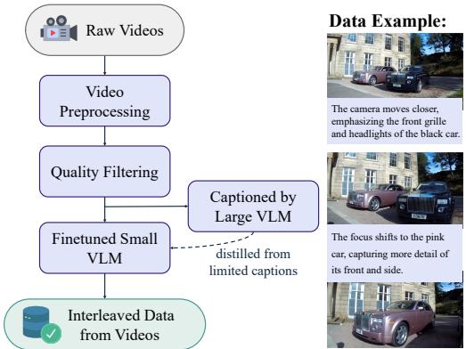
            *该图像是一个示意图，展示了视频数据处理流程，包括原始视频预处理、质量过滤、小型视觉语言模型微调以及最终的视频跨模态数据生成。右侧为视频数据注释示例，展示了不同摄像机视角下物体的描述。*

        *   `Interleaved Data from Webs` (Figure 3): Uses a "caption-first" strategy for localized cues. For each image, a concise description (using Qwen2.5-VL-7B [4]) is generated and inserted directly before the image. This guides the model before image generation. Inter-image text segments exceeding 300 tokens are summarized by an LLM. This process yields 20 million structured interleaved web documents.
            The following figure (Figure 3 from the original paper) illustrates the data pipeline for interleaved data from webs:

            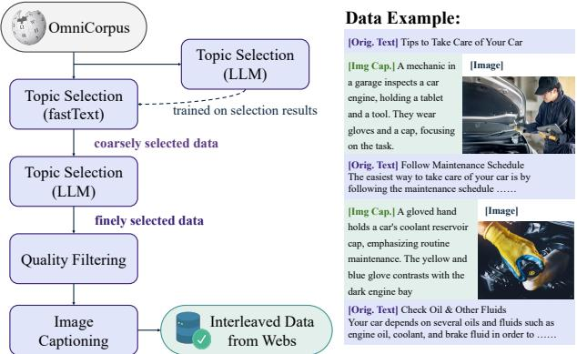
            *该图像是一个流程示意图，展示了从OmniCorpus数据通过多阶段主题选择（fastText和LLM）及质量过滤，最终生成包含图像描述的多模态交织数据的过程，并附带部分训练数据示例。*

*   **Reasoning-Augmented Data:** Inspired by O1 [33] and DeepSeek-R1 [26], `long-context Chain-of-Thoughts (CoT)` data is leveraged.
    *   `Text-to-Image generation`: Manually crafted ambiguous T2I queries + simple generation guidance are used to prompt Qwen2.5-72B [93] to generate additional query-guidance pairs and detailed prompts. These are then used with `FLUX.1-dev` [35] to produce target images, creating training triplets (query, reasoning trace, image).
    *   `Free-form image manipulation`: A VLM is prompted with source/target images, user queries, and reasoning trace examples from DeepSeek-R1 [26]. Source/target pairs are sampled from open-source editing datasets (e.g., OmniEdit [80]) and interleaved video data.
    *   `Conceptual Edits`: For manipulations requiring high-level conceptual reasoning (e.g., transforming an object into a design sketch). Uses web interleaved dataset, with a three-stage VLM pipeline: (1) identify plausible input-output image pair, (2) generate a textual question, (3) assess question quality and alignment. Accepted examples are then passed to the VLM, prompted with a DeepSeek-R1 [26] reasoning trace example, to produce grounded explanations.

### 4.2.5. Multi-Stage Training Strategy
BAGEL adopts a multi-stage training strategy using a dynamic mixture of curated data (summarized in Table 3):

*   **Stage 1: Alignment**
    *   **Objective:** Align the `SigLIP2 ViT encoder` with the `Qwen2.5 LLM`.
    *   **Trainable Parameters:** Only the `MLP connector` between ViT and LLM. Vision encoder and language model are frozen.
    *   **Data:** Only `image-text pair data`.
    *   **Task:** Image captioning.
    *   **Resolution:** Each image resized to a fixed $378 \times 378$ to match SigLIP2 input.

*   **Stage 2: Pre-training (PT)**
    *   **Objective:** Large-scale pre-training of the unified model.
    *   **Trainable Parameters:** `QK-Norm` is added to the LLM, and all model parameters (except VAE) are trainable.
    *   **Data:** Training corpus of 2.5T tokens, consisting of `text, image-text pairs, multimodal conversation, web-interleaved, and video-interleaved data`.
    *   **Resolution:** `Native-resolution strategy` for both multimodal understanding and generation, with restrictions on max long side and min short side.

*   **Stage 3: Continued Training (CT)**
    *   **Objective:** Increase visual input resolution and emphasize cross-modal reasoning.
    *   **Trainable Parameters:** All trainable parameters from PT stage.
    *   **Data:** Consumes approximately 2.6T tokens. `Sampling ratio of interleaved data is strategically increased` as core understanding/generation stabilize.
    *   **Resolution:** `Increased visual input resolution`.

*   **Stage 4: Supervised Fine-tuning (SFT)**
    *   **Objective:** High-quality fine-tuning for specific tasks.
    *   **Trainable Parameters:** All trainable parameters.
    *   **Data:** Total 72.7 billion tokens.
        *   `Multimodal generation`: High-quality subset from image-text-pair and interleaved-generation datasets.
        *   `Multimodal understanding`: Filtered subset from `LLaVA-OV` [37] and `Mammoth-VL` [27] instruction-tuning data.

            The following are the results from Table 3 of the original paper:

            <table>
            <thead>
            <tr>
            <td></td>
            <td>Alignment</td>
            <td>PT</td>
            <td>CT</td>
            <td>SFT</td>
            </tr>
            </thead>
            <tbody>
            <tr>
            <td>Hyperparameters Learning rate LR scheduler Weight decay</td>
            <td colspan="4">1 × 10−3 1.0 × 10−4 Cosine Constant 0.0 0.0 AdamW (β1 = 0.9, β2 = 0.95, = 1.0 × 10−15)</td>
            </tr>
            <tr>
            <td>Gradient norm clip Optimizer Loss weight (CE : MSE) Warm-up steps Training steps EMA ratio Sequence length per rank (min, max) # Training seen tokens Max context window Gen resolution (min short side, max long side) Und resolution (min short side, max long side) Diffusion timestep shift</td>
            <td>1.0 - 250 5K - (32K, 36K) 4.9B 16K - (378, 378)</td>
            <td>1.0 0.25 : 1 2500 200K 0.9999 (32K, 36K) 2.5T 16k (256, 512) (224, 980) 1.0</td>
            <td>0.0 1.0 0.25 : 1 2500 100k 0.9999 (40K, 45K) 2.6T 40k (512, 1024) (378, 980)</td>
            <td>0.0 1.0 0.25 : 1 500 15K 0.995 (40K, 45K) 72.7B 40k (512, 1024) (378, 980)</td>
            </tr>
            <tr>
            <td>Data sampling ratio Text Image-Text pair (T2I) Image-Text pair (I2T)</td>
            <td>0.0 0.0 1.0</td>
            <td>0.05 0.6 0.1</td>
            <td>4.0 0.05 0.4</td>
            <td>4.0 0.05 0.3</td>
            </tr>
            <tr>
            <td>Interleaved understanding Interleaved generation: video Interleaved generation: web</td>
            <td>0.0 0.0 0.0</td>
            <td>0.1 0.1 0.05</td>
            <td>0.1 0.15 0.15</td>
            <td>0.05 0.2 0.2</td>
            </tr>
            </tbody>
            </table>

### 4.2.6. Hyperparameter Tuning
*   **Optimizer:** `AdamW` [47] with $\beta_1 = 0.9$, $\beta_2 = 0.95$, and $\epsilon = 1.0 \times 10^{-15}$ (set to suppress loss spikes, inspired by [52]).
*   **Learning Rate:** A `constant learning rate` is adopted for PT, CT, and SFT stages to allow scaling data without restarting training [30]. Tuning is crucial to balance understanding and generation tasks:
    *   **Data Sampling Ratio (Figure 4):** Ablation studies show increasing the sampling ratio of generation data (e.g., from 1g1u to 4g1u) steadily reduces MSE loss (generation) with minimal impact on CE loss (understanding). This suggests `generation examples should be sampled substantially more often` (e.g., 4g1u means 4 generation samples for every 1 understanding sample).
        The following figure (Figure 4 from the original paper) shows the loss curves for different data ratios:

        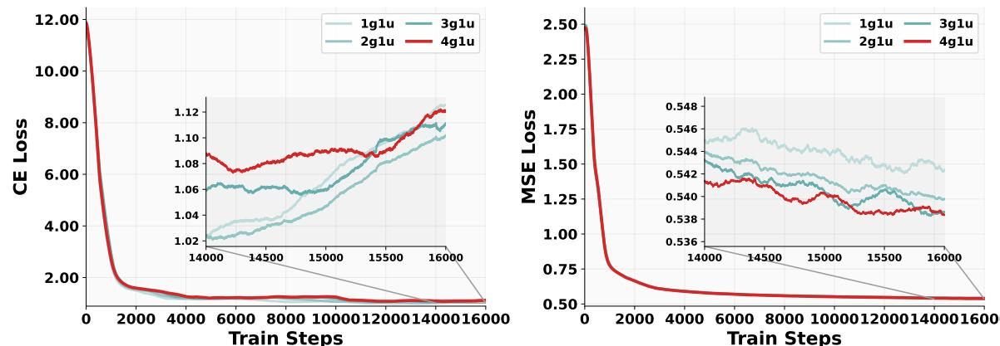
        *该图像是两个折线图组成的图表，展示了不同训练步数下不同模型（1g1u，2g1u，3g1u，4g1u）的CE Loss和MSE Loss变化趋势。每个图中均包含局部放大图，以更细致地显示高训练步骤阶段的损失变化情况。*

    *   **Learning Rate (Figure 5):** A larger learning rate benefits MSE loss (faster convergence), while a smaller learning rate benefits CE loss. To reconcile this trade-off, `separate weighting factors` are assigned to CE and MSE losses (0.25 : 1).
        The following figure (Figure 5 from the original paper) shows the loss curves for different learning rates:

        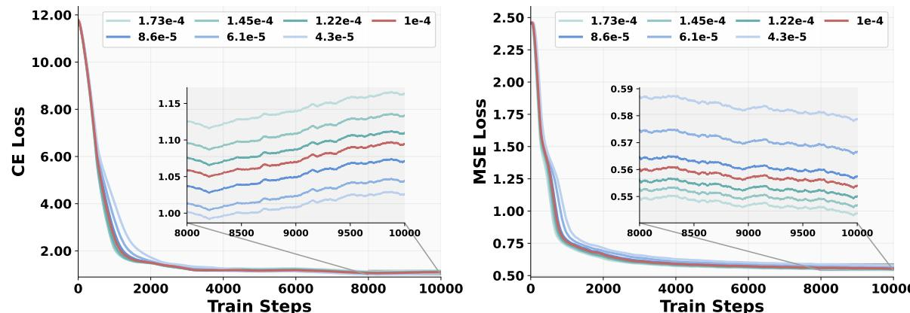
        *该图像是图表，展示了不同学习率下1.5B规模模型的训练损失曲线，包括分类交叉熵损失（CE Loss）和均方误差损失（MSE Loss）。图中插入图详细显示了后期训练步骤的损失微小变化。*

*   **Diffusion Timestep:** Increased from 1.0 to 4.0 when increasing resolution for generation, to ensure proper noise-level distribution.
*   **Sequence Length:** Sequences are packed into a narrow length range per rank (32K-36K for Alignment/PT, 40K-45K for CT/SFT) to ensure load balance.

# 5. Experimental Setup

## 5.1. Datasets
BAGEL's training and evaluation leverage a diverse set of datasets, encompassing text, image, video, and web data.

### 5.1.1. Training Datasets
The training corpus for BAGEL is extensive and multimodal, designed to support understanding, generation, and complex reasoning. The summary from Table 1 (also presented in Methodology) shows the scale and composition:

*   **Text Data:** 400 million entries, 0.4 trillion tokens. Curated for broad linguistic coverage and strong general-purpose language modeling.
*   **Image-Text-Pair Understanding Data:** 500 million entries, 0.5 trillion tokens. Used for VLM pre-training, covering a wide range of visual concepts. Sourced from web alt-text and captions, filtered for quality, and includes structured supervision (OCR, charts, grounding annotations).
*   **Image-Text-Pair Generation Data:** 1600 million entries, 2.6 trillion tokens. High-quality image-text pairs, with minimal synthetic data from T2I models. Designed for diverse caption styles and high visual quality.
*   **Interleaved Understanding Data:** 100 million entries, 0.5 trillion tokens. Used to enhance multimodal understanding by providing contexts with multiple images and intermediate text.
*   **Interleaved Generation Data: Video:** 45 million entries, 0.7 trillion tokens. Public online video resources, Koala36M [78], and MVImgNet2.0 [28]. Processed into high-quality clips with inter-frame captions. This provides rich world knowledge and temporal/spatial dynamics.
*   **Interleaved Generation Data: Web:** 20 million entries, 0.4 trillion tokens. Built from OmniCorpus [39] and image editing datasets. Filtered and constructed with a "caption-first" strategy and LLM summarization to create structured, high-quality sequences for multimodal reasoning.

    The paper also highlights `reasoning-augmented data` (500k examples) covering T2I generation, free-form image manipulation, and abstract edits, constructed by leveraging LLMs (Qwen2.5-72B, Qwen2.5-VL-7B) and existing datasets (DeepSeek-R1 [26], OmniEdit [80]).

### 5.1.2. Evaluation Datasets
The evaluation suite is comprehensive, targeting basic capabilities as well as complex reasoning.

*   **Multimodal Understanding Benchmarks:**
    *   `MME` [20]: A comprehensive evaluation benchmark for multimodal large language models, covering various aspects of perception and cognition. The paper uses `MME-S` (summarization of MME-P and MME-C).
    *   `MMBench (1.0-EN)` [46]: Evaluates multimodal models across a wide range of skills.
    *   `MMVet` [96]: Evaluates large multimodal models for integrated capabilities, particularly multi-step reasoning.
    *   `MMMU` [97]: A massive multi-discipline multimodal understanding and reasoning benchmark for expert AGI.
    *   `MathVista` [49]: Evaluates mathematical reasoning of foundation models in visual contexts.
    *   `MMVP` [74]: Explores visual shortcomings of multimodal LLMs.
        These collectively test perception, cognition, and multimodal reasoning.

*   **Text-to-Image Generation Benchmarks:**
    *   `GenEval` [25]: An object-focused framework for evaluating text-to-image alignment.
    *   `WISE` [53]: A world knowledge-informed semantic evaluation for text-to-image generation, assessing complex semantic understanding and world-knowledge integration.

*   **Image Editing Benchmarks:**
    *   `GEdit-Bench` [44]: The primary evaluation suite for classical image editing, built from authentic user requests.
    *   `IntelligentBench`: A new benchmark proposed in this work for `free-form image manipulation` and `conceptual editing`. It comprises 350 examples, each with a question image, question text, and a reference answer image. Evaluation is performed using GPT-4o.

*   **Reasoning-Augmented Editing Benchmarks:**
    *   `RISEBench` [103]: Benchmarking reasoning-informed visual editing.
    *   `KRIS-Bench` [86]: Benchmarking next-level intelligent image editing models.

## 5.2. Evaluation Metrics
The paper uses a variety of metrics across different tasks. For metrics where the paper does not explicitly provide a formula, their conceptual definition and purpose are explained.

### 5.2.1. Multimodal Understanding Metrics
For `MME-S`, `MMBench`, `MMMU`, `MM-Vet`, `MathVista`, and `MMVP`:
*   **Conceptual Definition:** These benchmarks typically use accuracy or a similar scoring mechanism to quantify a model's ability to correctly answer questions or perform tasks that require understanding both visual and textual input. Higher scores indicate better performance.
*   **Mathematical Formula:** Not explicitly provided in the paper for these aggregate scores. They are usually derived from task-specific accuracy calculations (e.g., multiple-choice accuracy, correctness of generated answers) summed or averaged across categories.
*   **Symbol Explanation:** Not applicable as a generalized formula isn't provided.

### 5.2.2. Text-to-Image Generation Metrics
For `GenEval` [25]:
*   **Conceptual Definition:** GenEval is an object-focused framework designed to evaluate the alignment between text prompts and generated images. It assesses how well a model can generate specific objects, their quantities, colors, positions, and attributes as specified in the text.
*   **Mathematical Formula:** Not explicitly provided in the paper. It typically involves comparing generated images against ground truth (or human judgment) on various attributes.
*   **Symbol Explanation:** Not applicable. The paper reports scores for `Single Obj.`, `Two Obj.`, `Counting`, `Colors`, `Position`, and `Color Attri.`, along with an `Overall` score.

    For `WISE` [53]:
*   **Conceptual Definition:** WISE (World Knowledge-Informed Semantic Evaluation) is a benchmark for text-to-image generation that specifically assesses the model's complex semantic understanding and integration of world knowledge. It tests the model's ability to generate images that correctly reflect concepts from various domains (e.g., cultural, scientific).
*   **Mathematical Formula:** Not explicitly provided in the paper. It is likely based on human or automated evaluation of semantic correctness and world knowledge adherence in generated images.
*   **Symbol Explanation:** Not applicable. The paper reports scores for `Cultural`, `Time`, `Space`, `Biology`, `Physics`, `Chemistry`, and `Overall`.

### 5.2.3. Image Editing Metrics
For `GEdit-Bench` [44]:
*   **Conceptual Definition:** GEdit-Bench is an evaluation suite for image editing tasks, designed to reflect real-world user requests. It assesses the quality and fidelity of edits based on human-like criteria. Performance is scored automatically using GPT-4.1.
*   **Mathematical Formula:** Not explicitly provided in the paper. The scores are generated by GPT-4.1 acting as an evaluator.
*   **Symbol Explanation:**
    *   `G_SC`: Success Score, likely reflecting how well the edit fulfills the core request.
    *   `G_PQ`: Perceptual Quality, assessing the visual quality and realism of the edited image.
    *   $G_O$: Overall Score, a composite score combining various aspects of the edit's quality.

        For `IntelligentBench`:
*   **Conceptual Definition:** A novel proxy task proposed in this paper for evaluating `free-form image manipulation` abilities that require complex multimodal reasoning and task composition. It specifically aims to move beyond naive edits.
*   **Mathematical Formula:** Each answer is scored on a scale from 0 to 2 by GPT-4o. The final score of a model is calculated by `summing all individual scores and normalizing the total to a 100-point scale`.
    Let $S_i$ be the score (0, 1, or 2) for the $i$-th example.
    Let $N$ be the total number of examples (350 in the initial release).
    The raw total score is $\sum_{i=1}^{N} S_i$.
    The maximum possible score is $2 \times N$.
    The normalized score is:
    \$
    \mathrm{IntelligentBench Score} = \frac{\sum_{i=1}^{N} S_i}{2 \times N} \times 100
    \$
*   **Symbol Explanation:**
    *   $S_i$: Score for the $i$-th example (0, 1, or 2).
    *   $N$: Total number of examples in the benchmark.
    *   Criteria for scoring (evaluated by GPT-4o):
        *   `Request fulfillment`: The answer image must fulfill the request. Allows reasonable/logical changes for imagination/creative transformation.
        *   `Completeness`: Every requested element must be reasonably present.
        *   `No Visual Errors`: No major visual errors (proportion, blurriness, logical inconsistencies).
        *   `Creative Changes Based on Knowledge`: Minor, natural/physical/context-aligned changes are allowed.

### 5.2.4. Reasoning-Augmented Editing Metrics
For `RISEBench` [103]:
*   **Conceptual Definition:** A benchmark for evaluating reasoning-informed visual editing, assessing a model's ability to perform edits that require deeper understanding beyond simple pixel manipulation.
*   **Mathematical Formula:** Not explicitly provided in the paper. Results are evaluated by GPT-4.1.
*   **Symbol Explanation:** The paper reports scores for `Temporal`, `Causal`, `Spatial`, `Logical`, and `Overall`.

    For `KRIS-Bench` [86]:
*   **Conceptual Definition:** A benchmark for next-level intelligent image editing models, likely covering a wide range of complex editing scenarios and evaluating the intelligence behind the edits.
*   **Mathematical Formula:** Not explicitly provided in the paper. Results are evaluated by GPT-4o.
*   **Symbol Explanation:** The paper reports scores for `Factual` (AP, SP, TP), `Conceptual` (SS, NS), `Procedural` (LP, ID), and `Overall`.
    *   `AP`: Atomic Perception
    *   `SP`: Symbolic Perception
    *   `TP`: Temporal Prediction
    *   `SS`: Social Science
    *   `NS`: Natural Science
    *   `LP`: Logical Reasoning
    *   `ID`: Instruction Decomposition

## 5.3. Baselines
BAGEL is compared against a comprehensive set of state-of-the-art models, including specialized visual understanding models, general-purpose unified models, and leading text-to-image generators.

### 5.3.1. Multimodal Understanding Baselines (Table 4)
*   **Specialized Visual Understanding Models (VLM):**
    *   `InternVL2` [13], `InternVL2.5` [12] (various parameter sizes, e.g., 1.8B, 7B)
    *   `Qwen2-VL` [77], `Qwen2.5-VL` [4] (various parameter sizes, e.g., 1.5B, 3B, 7B)
    *   `BLIP-3` [91] (4B)
    *   `LLaVA-OV` [37] (7B)
    *   `Emu3-Chat` [79] (8B)
    *   `Kimi-VL` [71] (2.8B/16B)
    *   `DeepSeek-VL2` [87] (4.1B/28B)
*   **Unified Models (for comparison on understanding tasks):**
    *   `Janus` [83] (1.3B)
    *   `Show-0512` [89] (1.5B)
    *   `Janus-Pro` [11] (1.5B, 7B)
    *   `ILLUME` [76] (7B)
    *   `VILA-U256` [85] (7B)
    *   `Chameleon` [70] (7B)
    *   `MetaQuery-XL` [57] (7B)
    *   `LlamaFusion` [66] (8B)
    *   `MetaMorph` [73] (8B)
    *   `SEED-X` [23] (13B)
    *   `TokenFlow-XL` [59] (13B)
    *   `MUSE-VL` [90] (32B)

### 5.3.2. Text-to-Image Generation Baselines (Table 5 & 6)
*   **Generation-Only Models:**
    *   `PixArt-α` [9]
    *   `SDv2.1` [61]
    *   `DALL-E 2` [60]
    *   `SDXL` [58]
    *   `DALL-E 3` [5]
    *   `SD3-Medium` [19]
    *   `FLUX.1-dev` [35]
    *   `SDv1.5` [61] (for WISE)
    *   `SD3.5-large` [19] (for WISE)
    *   `playground-v2.5` [38] (for WISE)
*   **Unified Models (with generation capabilities):**
    *   `Chameleon` [70]
    *   `LWM` [42]
    *   `SEED-X` [23]
    *   `TokenFlow-XL` [59]
    *   `ILLUME` [76]
    *   `Janus` [83]
    *   `Transfusion` [104]
    *   `Emu3-Gen` [79]
    *   `Show-o` [89]
    *   `Janus-Pro-7B` [11]
    *   `MetaQuery-XL` [57]
    *   `VILA-U` [85] (for WISE)
    *   `Show-o-512` [89] (for WISE)
    *   `Emu3` [79] (for WISE)
*   **Proprietary Models:**
    *   `GPT-4o` (for WISE)

### 5.3.3. Image Editing Baselines (Table 7 & 8)
*   **Open-Source Editing Models:**
    *   `Instruct-Pix2Pix` [6]
    *   `MagicBrush` [99]
    *   `AnyEdit` [95]
    *   `OmniGen` [88]
    *   `Step1X-Edit` [43]
    *   `IC-Edit` [100] (qualitative comparison)
*   **Proprietary Models:**
    *   `Gemini 2.0` [24]
    *   `GPT-4o` [55]

### 5.3.4. Reasoning-Augmented Editing Baselines (Table 9 & 10)
*   **Unified/Editing Models:**
    *   `Gemini 2.0` [24]
    *   `GPT-4o` [5]
    *   `EMU2` [69]
    *   `OmniGen` [88]
    *   `Step1X-Edit` [43]

        These baselines are representative as they include leading models across various categories: specialized VLMs, general unified models, strong text-to-image generators, and established image editing systems, allowing for a comprehensive assessment of BAGEL's capabilities relative to the current state-of-the-art.

# 6. Results & Analysis

## 6.1. Core Results Analysis
BAGEL demonstrates strong performance across a wide array of tasks, from basic multimodal understanding and high-fidelity generation to complex reasoning and world modeling. The results validate the effectiveness of its unified MoT architecture and the diverse interleaved data pretraining strategy.

### 6.1.1. Image Understanding
The following are the results from Table 4 of the original paper:

<table>
<thead>
<tr>
<td>Type Model</td>
<td></td>
<td># LLM Params</td>
<td>MME-P</td>
<td>MME-S↑</td>
<td>MMBench↑</td>
<td>MMMU↑</td>
<td>MM-Vet↑</td>
<td>MathVista↑</td>
<td>MMVP↑</td>
</tr>
</thead>
<tbody>
<tr>
<td rowspan="12">VLM</td>
<td>InternVL2 [13]</td>
<td>1.8B</td>
<td>1440</td>
<td>1877</td>
<td>73.2</td>
<td>34.3</td>
<td>44.6</td>
<td>46.4</td>
<td>35.3</td>
</tr>
<tr>
<td>InternVL2.5 [12]</td>
<td>1.8B</td>
<td>-</td>
<td>2138</td>
<td>74.7</td>
<td>43.6</td>
<td>60.8</td>
<td>51.3</td>
<td>-</td>
</tr>
<tr>
<td>Qwen2-VL[77]</td>
<td>1.5B</td>
<td>-</td>
<td>1872</td>
<td>74.9</td>
<td>41.1</td>
<td>49.5</td>
<td>43.0</td>
<td></td>
</tr>
<tr>
<td>Qwen2.5-VL[4]</td>
<td>3B</td>
<td>-</td>
<td>2157</td>
<td>79.1</td>
<td>53.1</td>
<td>61.8</td>
<td>62.3</td>
<td></td>
</tr>
<tr>
<td>BLIP-3 [91]</td>
<td>4B</td>
<td>-</td>
<td>-</td>
<td>76.8</td>
<td>41.1</td>
<td>-</td>
<td>39.6</td>
<td></td>
</tr>
<tr>
<td>LLava-OV [37]</td>
<td>7B</td>
<td>1580</td>
<td>-</td>
<td>80.8</td>
<td>48.8</td>
<td>57.5</td>
<td>63.2</td>
<td>-</td>
</tr>
<tr>
<td>InternVL2 [13]</td>
<td>7B</td>
<td>1648</td>
<td>2210</td>
<td>81.7</td>
<td>49.3</td>
<td>54.2</td>
<td>58.3</td>
<td>51.3</td>
</tr>
<tr>
<td>InternVL2.5 [12]</td>
<td>7B</td>
<td>-</td>
<td>2344</td>
<td>84.6</td>
<td>56.0</td>
<td>62.8</td>
<td>64.4</td>
<td>-</td>
</tr>
<tr>
<td>Qwen2-VL [77]</td>
<td>7B</td>
<td>-</td>
<td>2327</td>
<td>83.0</td>
<td>54.1</td>
<td>62.0</td>
<td>58.2</td>
<td>-</td>
</tr>
<tr>
<td>Qwen2.5-VL[4]</td>
<td>7B</td>
<td>-</td>
<td>2347</td>
<td>83.5</td>
<td>58.6</td>
<td>67.1</td>
<td>68.2</td>
<td>-</td>
</tr>
<tr>
<td>Emu3-Chat** [79]</td>
<td>8B</td>
<td>1244</td>
<td>-</td>
<td>58.5</td>
<td>31.6</td>
<td>37.2</td>
<td>-</td>
<td>36.6</td>
</tr>
<tr>
<td>Kimi-VL [71]</td>
<td>2.8B/16B</td>
<td>-</td>
<td>-</td>
<td>-</td>
<td>57.0</td>
<td>66.7</td>
<td>68.7</td>
<td>-</td>
</tr>
<tr>
<td rowspan="12">Unified</td>
<td>DeepSeek-VL2 [87]</td>
<td>4.1B/28B</td>
<td>-</td>
<td></td>
<td>-</td>
<td>51.1</td>
<td>60.0</td>
<td>62.8</td>
<td>-</td>
</tr>
<tr>
<td>Janus [83]</td>
<td>1.3B</td>
<td>1097</td>
<td></td>
<td>-</td>
<td>26.7</td>
<td>-</td>
<td>-</td>
<td></td>
</tr>
<tr>
<td>Show-0512 [89]</td>
<td>1.5B</td>
<td>1338</td>
<td></td>
<td>69.4</td>
<td>30.5</td>
<td>34.3</td>
<td></td>
<td></td>
</tr>
<tr>
<td>Janus-Pro [11]</td>
<td>1.5B</td>
<td>1444</td>
<td>-</td>
<td>75.5</td>
<td>36.3</td>
<td>39.8</td>
<td></td>
<td></td>
</tr>
<tr>
<td>BAGEL</td>
<td>1.5B MoT</td>
<td>1610</td>
<td>2183</td>
<td>79.2</td>
<td>43.2</td>
<td>48.2</td>
<td>63.4</td>
<td>54.7</td>
</tr>
<tr>
<td>ILLUME [76]</td>
<td>7B</td>
<td>1445</td>
<td></td>
<td>75.1</td>
<td>38.2</td>
<td>37.0</td>
<td></td>
<td>-</td>
</tr>
<tr>
<td>VILA-U256 [85]</td>
<td>7B</td>
<td>1336</td>
<td></td>
<td>66.6</td>
<td>32.2</td>
<td>27.7</td>
<td></td>
<td>22.0</td>
</tr>
<tr>
<td>Chameleon** [70]</td>
<td>7B</td>
<td>-</td>
<td></td>
<td>35.7</td>
<td>28.4</td>
<td>8.3</td>
<td></td>
<td>0.0</td>
</tr>
<tr>
<td>Janus-Pro [11]</td>
<td>7B</td>
<td>1567</td>
<td></td>
<td>79.2</td>
<td>41.0</td>
<td>50.0</td>
<td></td>
<td>-</td>
</tr>
<tr>
<td>MetaQuery-XL† [57]</td>
<td>7B</td>
<td>1685</td>
<td></td>
<td>83.5</td>
<td>58.6</td>
<td>66.6</td>
<td></td>
<td>-</td>
</tr>
<tr>
<td>LlamaFusion** [66]</td>
<td>8B</td>
<td>1604</td>
<td></td>
<td>72.1</td>
<td>41.7</td>
<td>-</td>
<td></td>
<td>-</td>
</tr>
<tr>
<td>MetaMorph [73]</td>
<td>8B</td>
<td>-</td>
<td></td>
<td>75.2</td>
<td>41.8</td>
<td>-</td>
<td></td>
<td>48.3</td>
</tr>
<tr>
<td>SEED-X [23]</td>
<td>13B</td>
<td>1457</td>
<td></td>
<td>70.1</td>
<td>35.6</td>
<td>43.0</td>
<td></td>
<td>-</td>
</tr>
<tr>
<td>TokenFlow-XL [59]</td>
<td></td>
<td>13B</td>
<td>1546</td>
<td></td>
<td>68.9</td>
<td>38.7</td>
<td>40.7</td>
<td></td>
<td>-</td>
</tr>
<tr>
<td>MUSE-VL [90]</td>
<td></td>
<td>32B</td>
<td></td>
<td></td>
<td>81.8</td>
<td>50.1</td>
<td></td>
<td>55.9</td>
<td></td>
</tr>
<tr>
<td colspan="2">BAGEL</td>
<td>7B MoT</td>
<td>1687</td>
<td>2388</td>
<td>85.0</td>
<td>55.3</td>
<td>67.2</td>
<td>73.1</td>
<td>69.3</td>
</tr>
</tbody>
</table>

BAGEL, with 7B active parameters (MoT), significantly outperforms existing open-source unified models in understanding tasks. For instance, it achieves 14.3 and 17.1 points higher than Janus-Pro [11] on MMMU and MM-Vet, respectively. It also demonstrates superior performance on most benchmarks compared to specialized understanding models like Qwen2.5-VL and InternVL2.5. This highlights that the MoT design effectively handles task conflicts while maintaining strong visual understanding capabilities. The results for BAGEL 1.5B MoT also show competitive performance against many larger 7B VLM and Unified models.

### 6.1.2. Text-to-Image Generation
The following are the results from Table 5 of the original paper:

<table>
<thead>
<tr>
<td>Type</td>
<td>Model</td>
<td></td>
<td>Single Obj.</td>
<td>Two Obj.</td>
<td>Counting</td>
<td>Colors</td>
<td>Position</td>
<td>Color Attri.</td>
<td>Overall↑</td>
</tr>
</thead>
<tbody>
<tr>
<td rowspan="8">Gen.Only</td>
<td>PixArt-α [9]</td>
<td>0.98</td>
<td>0.50</td>
<td>0.44</td>
<td>0.80</td>
<td>0.08</td>
<td>0.07</td>
<td>0.48</td>
</tr>
<tr>
<td>SDv2.1 [61]</td>
<td>0.98</td>
<td>0.51</td>
<td>0.44</td>
<td>0.85</td>
<td>0.07</td>
<td>0.17</td>
<td>0.50</td>
</tr>
<tr>
<td>DALL-E 2 [60]</td>
<td>0.94</td>
<td>0.66</td>
<td>0.49</td>
<td>0.77</td>
<td>0.10</td>
<td>0.19</td>
<td>0.52</td>
</tr>
<tr>
<td>Emu3-Gen [79]</td>
<td>0.98</td>
<td>0.71</td>
<td>0.34</td>
<td>0.81</td>
<td>0.17</td>
<td>0.21</td>
<td>0.54</td>
</tr>
<tr>
<td>SDXL [58]</td>
<td>0.98</td>
<td>0.74</td>
<td>0.39</td>
<td>0.85</td>
<td>0.15</td>
<td>0.23</td>
<td>0.55</td>
</tr>
<tr>
<td>DALL-E 3 [5]</td>
<td>0.96</td>
<td>0.87</td>
<td>0.47</td>
<td>0.83</td>
<td>0.43</td>
<td>0.45</td>
<td>0.67</td>
</tr>
<tr>
<td>SD3-Medium [19]</td>
<td>0.99</td>
<td>0.94</td>
<td>0.72</td>
<td>0.89</td>
<td>0.33</td>
<td>0.60</td>
<td>0.74</td>
</tr>
<tr>
<td>FLUX.1-dev† [35]</td>
<td>0.98</td>
<td>0.93</td>
<td>0.75</td>
<td>0.93</td>
<td>0.68</td>
<td>0.65</td>
<td>0.82</td>
</tr>
<tr>
<td rowspan="14">Unified</td>
<td>Chameleon [70]</td>
<td>-</td>
<td>-</td>
<td>-</td>
<td>-</td>
<td>-</td>
<td>-</td>
<td></td>
</tr>
<tr>
<td>LWM [42]</td>
<td>0.93</td>
<td>0.41</td>
<td>0.46</td>
<td>0.79</td>
<td>0.09</td>
<td>0.15</td>
<td>0.39 0.47</td>
</tr>
<tr>
<td>SEED-X [23]</td>
<td>0.97</td>
<td>0.58</td>
<td>0.26</td>
<td>0.80</td>
<td>0.19</td>
<td>0.14</td>
<td>0.49</td>
</tr>
<tr>
<td>TokenFlow-XL [59]</td>
<td>0.95</td>
<td>0.60</td>
<td>0.41</td>
<td>0.81</td>
<td>0.16</td>
<td>0.24</td>
<td>0.55</td>
</tr>
<tr>
<td>ILLUME [76]</td>
<td>0.99</td>
<td>0.86</td>
<td>0.45</td>
<td>0.71</td>
<td>0.39</td>
<td>0.28</td>
<td>0.61</td>
</tr>
<tr>
<td>Janus [83]</td>
<td>0.97</td>
<td>0.68</td>
<td>0.30</td>
<td>0.84</td>
<td>0.46</td>
<td>0.42</td>
<td>0.61</td>
</tr>
<tr>
<td>Transfusion [104]</td>
<td>-</td>
<td>-</td>
<td>-</td>
<td>-</td>
<td>-</td>
<td>-</td>
<td>0.63</td>
</tr>
<tr>
<td>Emu3-Gen†[79]</td>
<td>0.99</td>
<td>0.81</td>
<td>0.42</td>
<td>0.80</td>
<td>0.49</td>
<td>0.45</td>
<td>0.66</td>
</tr>
<tr>
<td>Show-o [89]</td>
<td>0.98</td>
<td>0.80</td>
<td>0.66</td>
<td>0.84</td>
<td>0.31</td>
<td>0.50</td>
<td>0.68</td>
</tr>
<tr>
<td>Janus-Pro-7B [11]</td>
<td>0.99</td>
<td>0.89</td>
<td>0.59</td>
<td>0.90</td>
<td>0.79</td>
<td>0.66</td>
<td>0.80</td>
</tr>
<tr>
<td>MetaQuery-XL† [57]</td>
<td>-</td>
<td>-</td>
<td>-</td>
<td>-</td>
<td>-</td>
<td>-</td>
<td>0.80</td>
</tr>
<tr>
<td>BAGEL</td>
<td>0.99</td>
<td>0.94</td>
<td>0.81</td>
<td>0.88</td>
<td>0.64</td>
<td>0.63</td>
<td>0.82</td>
</tr>
<tr>
<td>AGEL*</td>
<td>0.98</td>
<td>0.95</td>
<td>0.84</td>
<td>0.95</td>
<td>0.78</td>
<td>0.77</td>
<td>0.88</td>
</tr>
</tbody>
</table>

On the `GenEval` benchmark, BAGEL achieves an 82% overall score, matching the leading specialist generation model `FLUX-1-dev` [35] (82%) and outperforming `SD3-Medium` [19] (74%) and other unified models like `Janus-Pro` (80%) and `MetaQuery-XL` (80%). The $BAGEL*$ variant (likely with LLM rewriter or enhanced inference) achieves 88%, marking a new state-of-the-art for open-source models. This indicates BAGEL's high-fidelity generation capabilities are competitive with or superior to dedicated generative models.

The following are the results from Table 6 of the original paper:

<table>
<thead>
<tr>
<td>Type</td>
<td>Model</td>
<td>Cultural</td>
<td>Time</td>
<td>Space</td>
<td>Biology</td>
<td>Physics</td>
<td>Chemistry</td>
<td>Overall↑</td>
</tr>
</thead>
<tbody>
<tr>
<td rowspan="6">Gen.Only</td>
<td>SDv1.5 [61]</td>
<td>0.34</td>
<td>0.35</td>
<td>0.32</td>
<td>0.28</td>
<td>0.29</td>
<td>0.21</td>
<td>0.32</td>
</tr>
<tr>
<td>SDXL [58]</td>
<td>0.43</td>
<td>0.48</td>
<td>0.47</td>
<td>0.44</td>
<td>0.45</td>
<td>0.27</td>
<td>0.43</td>
</tr>
<tr>
<td>SD3.5-large [19]</td>
<td>0.44</td>
<td>0.50</td>
<td>0.58</td>
<td>0.44</td>
<td>0.52</td>
<td>0.31</td>
<td>0.46</td>
</tr>
<tr>
<td>PixArt-Alpha [9]</td>
<td>0.45</td>
<td>0.50</td>
<td>0.48</td>
<td>0.49</td>
<td>0.56</td>
<td>0.34</td>
<td>0.47</td>
</tr>
<tr>
<td>playground-v2.5 [38]</td>
<td>0.49</td>
<td>0.58</td>
<td>0.55</td>
<td>0.43</td>
<td>0.48</td>
<td>0.33</td>
<td>0.49</td>
</tr>
<tr>
<td>FLUX.1-dev [35]</td>
<td>0.48</td>
<td>0.58</td>
<td>0.62</td>
<td>0.42</td>
<td>0.51</td>
<td>0.35</td>
<td>0.50</td>
</tr>
<tr>
<td rowspan="8">Unified</td>
<td>Janus [83]</td>
<td>0.16</td>
<td>0.26</td>
<td>0.35</td>
<td>0.28</td>
<td>0.30</td>
<td>0.14</td>
<td>0.23</td>
</tr>
<tr>
<td>VILA-U [85]</td>
<td>0.26</td>
<td>0.33</td>
<td>0.37</td>
<td>0.35</td>
<td>0.39</td>
<td>0.23</td>
<td>0.31</td>
</tr>
<tr>
<td>Show-o-512 [89]</td>
<td>0.28</td>
<td>0.40</td>
<td>0.48</td>
<td>0.30</td>
<td>0.46</td>
<td>0.30</td>
<td>0.35</td>
</tr>
<tr>
<td>Janus-Pro-7B [11]</td>
<td>0.30</td>
<td>0.37</td>
<td>0.49</td>
<td>0.36</td>
<td>0.42</td>
<td>0.26</td>
<td>0.35</td>
</tr>
<tr>
<td>Emu3 [79]</td>
<td>0.34</td>
<td>0.45</td>
<td>0.48</td>
<td>0.41</td>
<td>0.45</td>
<td>0.27</td>
<td>0.39</td>
</tr>
<tr>
<td>MetaQuery-XL [57]</td>
<td>0.56</td>
<td>0.55</td>
<td>0.62</td>
<td>0.49</td>
<td>0.63</td>
<td>0.41</td>
<td>0.55</td>
</tr>
<tr>
<td>GPT-40**</td>
<td>0.81</td>
<td>0.71</td>
<td>0.89</td>
<td>0.83</td>
<td>0.79</td>
<td>0.74</td>
<td>0.80</td>
</tr>
<tr>
<td>BAGEL</td>
<td>0.44</td>
<td>0.55</td>
<td>0.68</td>
<td>0.44</td>
<td>0.60</td>
<td>0.39</td>
<td>0.52</td>
</tr>
<tr>
<td>BAGEL w/ Self-CoT</td>
<td>0.76</td>
<td>0.69</td>
<td>0.75</td>
<td>0.65</td>
<td>0.75</td>
<td>0.58</td>
<td>0.70</td>
</tr>
</tbody>
</table>

On the `WISE` benchmark, BAGEL (0.52) exceeds all prior open-source models, indicating strong reasoning ability with world knowledge. With `Self-CoT` (Chain-of-Thought), BAGEL's performance jumps significantly to 0.70, demonstrating the effectiveness of reasoning-augmented generation and nearing the performance of GPT-4o (0.80).

### 6.1.3. Image Editing
The following are the results from Table 7 of the original paper:

<table>
<thead>
<tr>
<td rowspan="2">Type</td>
<td rowspan="2">Model</td>
<td colspan="3">GEdit-Bench-EN (Full set)↑</td>
<td colspan="3">GEdit-Bench-CN (Full set)↑</td>
</tr>
<tr>
<td>G_SC</td>
<td>G_PQ</td>
<td>G_O</td>
<td>G_SC</td>
<td>G_PQ</td>
<td>G_O</td>
</tr>
</thead>
<tbody>
<tr>
<td>Private</td>
<td>Gemini 2.0 [24]</td>
<td>6.73</td>
<td>6.61</td>
<td>6.32</td>
<td>5.43</td>
<td>6.78</td>
<td>5.36</td>
</tr>
<tr>
<td></td>
<td>GPT-4o [55]</td>
<td>7.85</td>
<td>7.62</td>
<td>7.53</td>
<td>7.67</td>
<td>7.56</td>
<td>7.30</td>
</tr>
<tr>
<td>Open-source</td>
<td>Instruct-Pix2Pix [6]</td>
<td>3.58</td>
<td>5.49</td>
<td>3.68</td>
<td>-</td>
<td>-</td>
<td>-</td>
</tr>
<tr>
<td></td>
<td>MagicBrush [99]</td>
<td>4.68</td>
<td>5.66</td>
<td>4.52</td>
<td>-</td>
<td></td>
<td></td>
</tr>
<tr>
<td></td>
<td>AnyEdit [95]</td>
<td>3.18</td>
<td>5.82</td>
<td>3.21</td>
<td></td>
<td></td>
<td></td>
</tr>
<tr>
<td></td>
<td>OmniGen [88]</td>
<td>5.96</td>
<td>5.89</td>
<td>5.06</td>
<td>-</td>
<td></td>
<td></td>
</tr>
<tr>
<td></td>
<td>Step1X-Edit [43]</td>
<td>7.09</td>
<td>6.76</td>
<td>6.70</td>
<td>7.20</td>
<td>6.87</td>
<td>6.86</td>
</tr>
<tr>
<td></td>
<td>BAGEL</td>
<td>7.36</td>
<td>6.83</td>
<td>6.52</td>
<td>7.34</td>
<td>6.85</td>
<td>6.50</td>
</tr>
</tbody>
</table>

On `GEdit-Bench`, BAGEL achieves competitive results with `Step1X-Edit` [43] (the leading specialist image editing model) and even outperforms `Gemini 2.0` [24]. This demonstrates its strong capabilities in classical image editing scenarios.

The following are the results from Table 8 of the original paper:

<table>
<thead>
<tr>
<td>Type</td>
<td>Model</td>
<td>Score↑</td>
</tr>
</thead>
<tbody>
<tr>
<td>Private</td>
<td>GPT-40** [55]</td>
<td>78.9</td>
</tr>
<tr>
<td></td>
<td>Gemini 2.0** [24]</td>
<td>57.6</td>
</tr>
<tr>
<td>Open-source</td>
<td>Step1X-Edit [43]</td>
<td>14.9</td>
</tr>
<tr>
<td></td>
<td>BAGEL</td>
<td>44.9</td>
</tr>
<tr>
<td></td>
<td>BAGEL w/ Self-CoT</td>
<td>55.3</td>
</tr>
</tbody>
</table>

On the newly proposed `IntelligentBench`, BAGEL (44.9) significantly surpasses the existing open-source `Step1X-Edit` model (14.9) by 30 points. With `Self-CoT`, its score further improves to 55.3, nearing `Gemini 2.0` (57.6) and demonstrating its advanced reasoning abilities in complex image manipulation.

### 6.1.4. Generation/Editing with Thinking (CoT)
The integration of Chain-of-Thought (CoT) reasoning consistently enhances BAGEL's performance across various tasks.

*   **WISE Benchmark (Table 6):** BAGEL with CoT achieves an overall score of 0.70, a substantial improvement of 0.18 over its non-CoT counterpart (0.52). This also outperforms all existing open-source models, highlighting the critical role of explicit reasoning in complex semantic understanding for T2I generation.
*   **IntelligentBench (Table 8):** CoT improves BAGEL's Intelligent Score from 44.9 to 55.3. This gain is attributed to leveraging world knowledge and providing detailed editing guidance.
*   **RISEBench (Table 9):** CoT significantly boosts the overall score from 6.1 to 11.9.
    The following are the results from Table 9 of the original paper:

    <table>
    <thead>
    <tr>
    <td>Type</td>
    <td>Model</td>
    <td>Temporal</td>
    <td>Causal</td>
    <td>Spatial</td>
    <td>Logical</td>
    <td>Overall↑</td>
    </tr>
    </thead>
    <tbody>
    <tr>
    <td>Private</td>
    <td>Gemini 2.0 [24]</td>
    <td>8.2</td>
    <td>15.5</td>
    <td>23.0</td>
    <td>4.7</td>
    <td>13.3</td>
    </tr>
    <tr>
    <td></td>
    <td>GPT-40 [5]</td>
    <td>34.1</td>
    <td>32.2</td>
    <td>37.0</td>
    <td>10.6</td>
    <td>28.9</td>
    </tr>
    <tr>
    <td>Open-source</td>
    <td>EMU2 [69]</td>
    <td>1.2</td>
    <td>1.1</td>
    <td>0.0</td>
    <td>0.0</td>
    <td>0.5</td>
    </tr>
    <tr>
    <td></td>
    <td>OmniGen [88]</td>
    <td>1.2</td>
    <td>1.0</td>
    <td>0.0</td>
    <td>1.2</td>
    <td>0.8</td>
    </tr>
    <tr>
    <td></td>
    <td>Step1X-Edit [43]</td>
    <td>0.0</td>
    <td>2.2</td>
    <td>2.0</td>
    <td>3.5</td>
    <td>1.9</td>
    </tr>
    <tr>
    <td></td>
    <td>BAGEL</td>
    <td>2.4</td>
    <td>5.6</td>
    <td>14.0</td>
    <td>1.2</td>
    <td>6.1</td>
    </tr>
    <tr>
    <td></td>
    <td>BAGEL w/ Self-CoT</td>
    <td>5.9</td>
    <td>17.8</td>
    <td>21.0</td>
    <td>1.2</td>
    <td>11.9</td>
    </tr>
    </tbody>
    </table>

*   **KRIS-Bench (Table 10):** CoT improves the overall score from 56.21 to 60.18.
    The following are the results from Table 10 of the original paper:

    <table>
    <thead>
    <tr>
    <td rowspan="2">Type</td>
    <td rowspan="2">Model</td>
    <td colspan="3">Factual↑</td>
    <td colspan="2">Conceptual↑</td>
    <td colspan="2">Procedural↑</td>
    <td rowspan="2">Overall↑</td>
    </tr>
    <tr>
    <td>AP</td>
    <td>SP</td>
    <td>TP</td>
    <td>SS</td>
    <td>NS</td>
    <td>LP</td>
    <td>ID</td>
    </tr>
    </thead>
    <tbody>
    <tr>
    <td>Private</td>
    <td>Gemini 2.0 [24]</td>
    <td>66.33</td>
    <td>63.33</td>
    <td>63.92</td>
    <td>68.19</td>
    <td>56.94</td>
    <td>54.13</td>
    <td>71.67</td>
    <td>62.41</td>
    </tr>
    <tr>
    <td></td>
    <td>GPT-4o [5]</td>
    <td>83.17</td>
    <td>79.08</td>
    <td>68.25</td>
    <td>85.50</td>
    <td>80.06</td>
    <td>71.56</td>
    <td>85.08</td>
    <td>80.09</td>
    </tr>
    <tr>
    <td>Open-source</td>
    <td>EMU2 [69]</td>
    <td>51.50</td>
    <td>48.83</td>
    <td>22.17</td>
    <td>34.69</td>
    <td>38.44</td>
    <td>24.81</td>
    <td>45.00</td>
    <td>39.70</td>
    </tr>
    <tr>
    <td></td>
    <td>OmniGen [88</td>
    <td>37.92</td>
    <td>28.25</td>
    <td>21.83</td>
    <td>30.63</td>
    <td>27.19</td>
    <td>11.94</td>
    <td>35.83</td>
    <td>28.85</td>
    </tr>
    <tr>
    <td></td>
    <td>Step1X-Edit [43]</td>
    <td>5.50</td>
    <td>51.75</td>
    <td>0.00</td>
    <td>44.69</td>
    <td>49.06</td>
    <td>40.88</td>
    <td>22.75</td>
    <td>43.29</td>
    </tr>
    <tr>
    <td></td>
    <td>BAGEL</td>
    <td>64.27</td>
    <td>62.42</td>
    <td>42.45</td>
    <td>55.40</td>
    <td>56.01</td>
    <td>52.54</td>
    <td>50.56</td>
    <td>56.21</td>
    </tr>
    <tr>
    <td></td>
    <td>BAGELw/ Self-CoT</td>
    <td>67.42</td>
    <td>68.33</td>
    <td>58.67</td>
    <td>63.55</td>
    <td>61.40</td>
    <td>48.12</td>
    <td>50.22</td>
    <td>60.18</td>
    </tr>
    </tbody>
    </table>

### 6.1.5. World Modeling
BAGEL demonstrates robust world modeling capabilities, including world navigation, rotation, and multi-frame generation.
The following figure (Figure 22 from the original paper) shows examples of BAGEL in navigation, rotation, and multi-image generation:

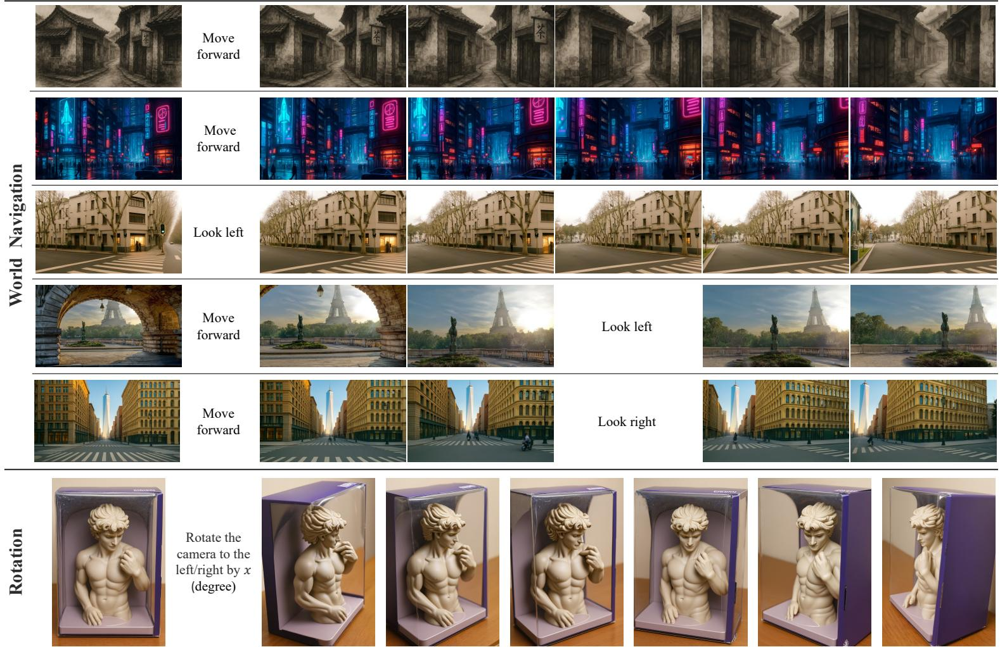
*该图像是多组世界导航与旋转过程的示意图，展示了人物模型和街景环境在不同方向移动（向前、向左、向右）及旋转时的连续图像变化，反映了BAGEL模型在复杂多模态世界导航和三维旋转理解中的能力。*

As seen in the figure, BAGEL can follow instructions to generate a dynamic number of images for tasks like navigating and rotating an input image, or producing multiple images based on a given prompt. It also generalizes well, extending street navigation to diverse domains like ink paintings, cartoons, and video games.
The following figure (Figure 25 from the original paper) shows examples of BAGEL in multi-image generation:

*该图像是多张动画场景插图组成的序列图，展示了蓝色松鼠与小老鼠在河边互动的不同瞬间，体现了BAGEL模型在多镜头图像生成和细节表现上的能力。*

### 6.1.6. Qualitative Comparisons and Failure Cases
*   **General Qualitative Performance:** Figure 13 (Figure 10 in paper) shows BAGEL generates significantly higher-quality images than `Janus-Pro 7B` and surpasses `SD3-medium`. It natively supports multi-language prompts and arbitrary aspect ratios. Figures 14 and 15 (Figure 11 and 12 in paper) further illustrate BAGEL's superior performance over `Step1X-Edit` and `IC-Edit`, and `Gemini 2.0` in image editing. While `GPT-4o` handles scenarios well, it sometimes introduces unintended modifications, which BAGEL effectively avoids.
*   **BAGEL-1.5B Performance:** Figure 27 (Figure 16 in paper) compares BAGEL-1.5B against `JanusPro-7B` and `Step1X-Edit (12B)`. Even with significantly fewer parameters, BAGEL-1.5B qualitatively outperforms these larger models on both T2I and image editing. The gap between BAGEL-1.5B and BAGEL-7B highlights the potential of model scaling.
*   **Failure Cases:** Figure 28 (Figure 17 in paper) presents representative failure cases. BAGEL, along with other SOTA models, struggles with:
    *   Special IP generation.
    *   Complex textual rendering.
    *   Intricate human pose generation.
    *   Simultaneous generation of multiple instances.
    *   Image editing operations like swapping object positions or modifying many instances.
        In complex scenarios, both BAGEL and `Gemini 2.0` show difficulties adhering precisely to instructions. `GPT-4o` delivers the most consistently successful results.

## 6.2. Data Presentation (Tables)
All tables from the paper have been transcribed and presented within the relevant sections above (Table 1, Table 2, Table 3, Table 4, Table 5, Table 6, Table 7, Table 8, Table 9, Table 10).

## 6.3. Ablation Studies / Parameter Analysis

### 6.3.1. MoT Architecture Efficacy
The paper conducts an ablation study comparing the performance of `Dense Transformer`, `MoE`, and `MoT` variants using a 1.5B Qwen-2.5 LLM.
The following figure (Figure 35 from the original paper) shows the loss curves of various designs:

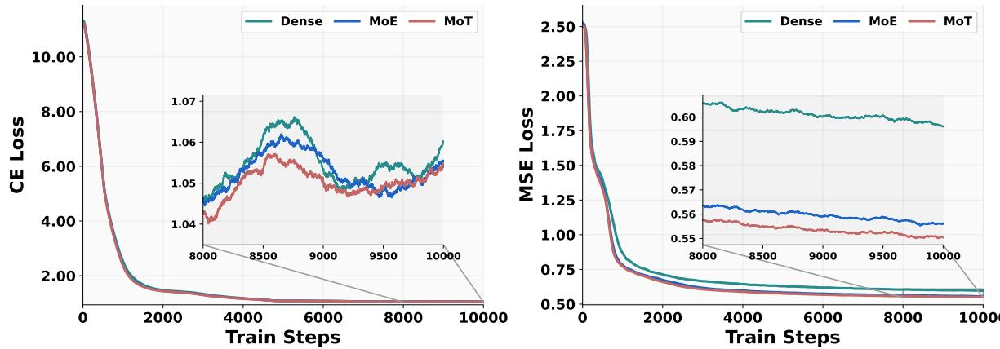
*该图像是论文中的图表，展示了不同设计在训练步数上的CE损失和MSE损失曲线。左图为分类交叉熵损失（CE Loss），右图为均方误差损失（MSE Loss），图中包含Dense、MoE和MoT三种模型的表现，并带有局部放大细节。*

As shown in Figure 35, the `MoT variant consistently outperforms both the dense and MoE designs`. This gap is most pronounced on the multimodal generation task (MSE loss), where MoT converges fastest and achieves the lowest final loss. While CE loss (understanding) fluctuates more, MoT still maintains the best performance. This finding strongly suggests that `decoupling parameters for generation and understanding` into separate experts (MoT) is beneficial, as the two objectives may steer the model towards distinct regions of the parameter space, mitigating optimization challenges.

### 6.3.2. Data Sampling Ratio Impact
An ablation study on a 1.5B Qwen2.5 LLM investigates the effect of the sampling ratio between multimodal generation and understanding data.
The following figure (Figure 4 from the original paper) shows the loss curves for different data ratios:

*该图像是两个折线图组成的图表，展示了不同训练步数下不同模型（1g1u，2g1u，3g1u，4g1u）的CE Loss和MSE Loss变化趋势。每个图中均包含局部放大图，以更细致地显示高训练步骤阶段的损失变化情况。*

Figure 4 illustrates that `increasing the sampling ratio of generation data` (e.g., from "1g1u" to "4g1u", meaning 1 generation sample for 1 understanding sample vs. 4 generation samples for 1 understanding sample) `steadily reduces the MSE loss` (generation). An increase from 1g1u to 4g1u results in a 0.4% absolute reduction in MSE loss, which is significant for rectified-flow models. In contrast, the CE loss (understanding) shows no consistent pattern and negligible impact across different ratios. This suggests that `generation examples should be sampled substantially more often` than understanding examples, a heuristic adopted in BAGEL's training protocol.

### 6.3.3. Learning Rate Influence
A controlled experiment similar to the data sampling ratio study explores the impact of learning rate.
The following figure (Figure 5 from the original paper) shows the loss curves for different learning rates:

*该图像是图表，展示了不同学习率下1.5B规模模型的训练损失曲线，包括分类交叉熵损失（CE Loss）和均方误差损失（MSE Loss）。图中插入图详细显示了后期训练步骤的损失微小变化。*

Figure 5 reveals an `opposite behavior` for the two losses: a `larger learning rate makes the MSE loss converge faster`, while a `smaller learning rate benefits the CE loss`. This trade-off necessitated assigning `separate weighting factors` to the two objectives (CE : MSE = 0.25 : 1) in the final training protocol to achieve a balanced optimization.

### 6.3.4. Emerging Properties with Scaling
The paper rigorously analyzes emerging properties by evaluating performance across tasks on historical checkpoints, defining `an ability as emerging if it is not present in earlier training stages but is present in later pre-trainings`.

The following figure (Figure 6 from the original paper) shows the average score on Image Understanding tasks:

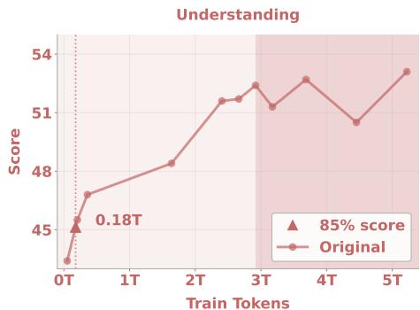
*该图像是一张折线图，展示了模型在理解任务中的得分随训练令牌数增加的变化趋势。图中标注了0.18T训练令牌对应的85%得分作为参考，横轴为训练令牌数，纵轴为得分。*

The following figure (Figure 7 from the original paper) shows the GenEval score on Image Generation task:

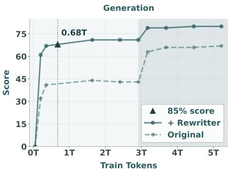
*该图像是一个关于生成能力评分随训练令牌数变化的折线图，展示了BAGEL模型在原始和使用重写器两种条件下的表现。图中重点标注了0.68T训练令牌处达到85%评分的节点，横轴为训练令牌数，纵轴为评分，体现模型随训练规模提升的性能变化。*

The following figure (Figure 8 from the original paper) shows the GEdit Overall Score on classical Image Editing task:

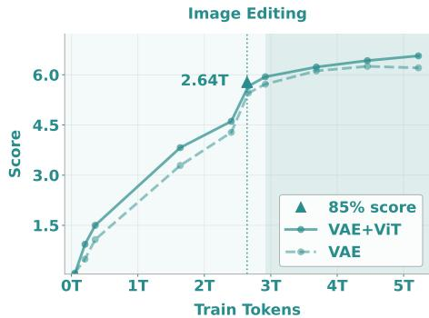
*该图像是一张图表，展示了在图像编辑任务中模型训练令牌数与得分的关系。图中比较了VAE和VAE+ViT两种模型，显示训练令牌达到约2.64万亿时得分接近85%。*

The following figure (Figure 9 from the original paper) shows the IntelligentBench Score on Intelligent Editing task:

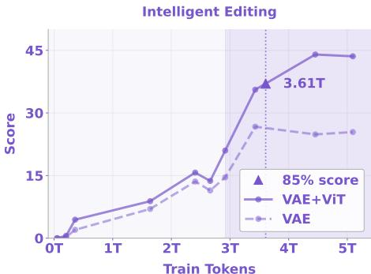
*该图像是一个折线图，展示了随着训练代币数量增加，基于VAE和VAE+ViT模型的智能编辑分数变化。图中标注了3.61T代币处的85%得分点，显示VAE+ViT模型的得分明显高于单纯VAE模型。*

Figures 6-9 illustrate the performance curves of BAGEL on different tasks as the number of training tokens increases. Key observations:
*   **Early Saturation:** Conventional `understanding` (Figure 6) and `generation` (Figure 7) benchmarks saturate relatively early, reaching 85% of peak performance at approximately `0.18T` and `0.68T` tokens, respectively.
*   **Slower Convergence for Editing:** `Classical editing tasks` (GEdit, Figure 8), which combine understanding and generation, exhibit slower convergence, reaching 85% performance only after `2.64T` tokens.
*   **Emergence for Complex Reasoning:** Most notably, the `Intelligent Edit task` (Figure 9), designed for complex multimodal reasoning, requires `3.61T` tokens to reach 85% performance. This task shows `initially low performance that improves gradually and significantly after 3T seen tokens`, demonstrating a pattern akin to emergent behaviors described in [81]. Its score triples from 15 to 45 in later training stages.
*   **Importance of Visual Input (ViT):** Removing `ViT tokens` has minimal impact on GEdit-Bench but causes a `16% drop in Intelligent Edit`, highlighting the critical role of visual-semantic reasoning in complex editing tasks.
*   **Qualitative Emergence:**
    The following figure (Figure 10 from the original paper) shows a comparison of models with different amounts of training tokens:

    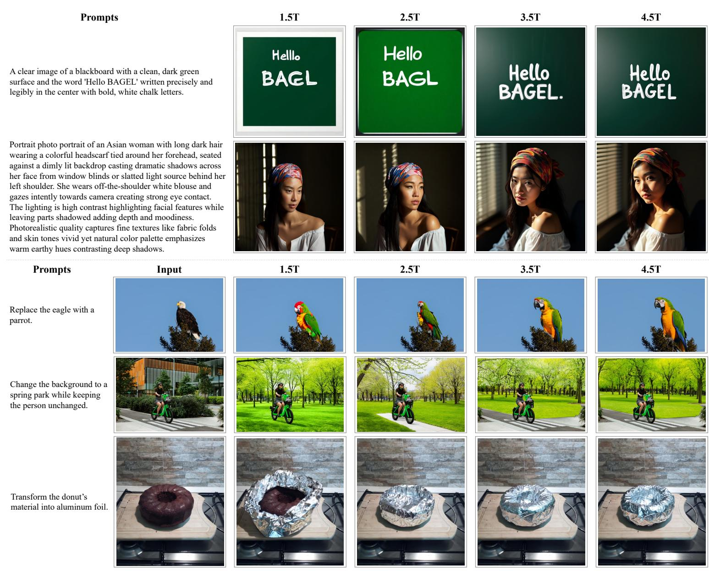
    *该图像是论文中的图表，展示了不同训练token数量（1.5T到4.5T）下模型在文本生成和图像编辑任务的输出效果，包含黑板文字生成、人像细节、图像替换和物质变换四种案例对比。*

    Figure 10 qualitatively confirms these trends. Generation quality is strong before 1.5T tokens, with small improvements after 3.0T tokens (with higher resolution). However, the ability to `generate correct spelling` ("hello", "BAGEL") emerges later, `around 1.5T to 4.5T tokens`.
    The following figure (Figure 11 from the original paper) shows how BAGEL performs on Intelligent Editing at different training stages:

    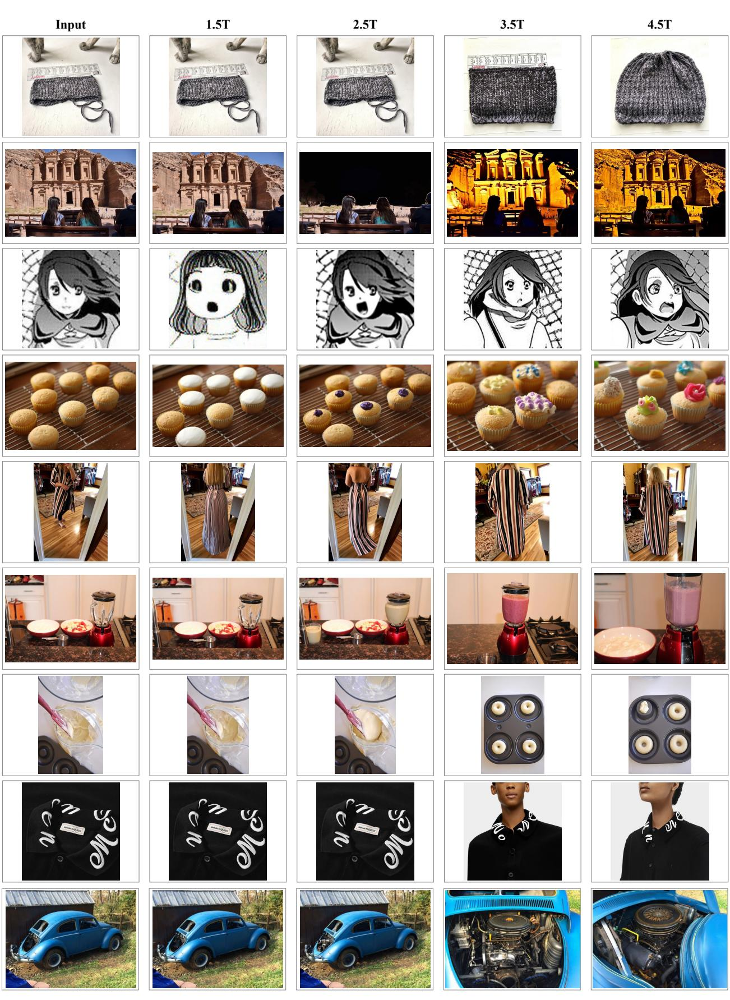
    *该图像是多组对比图，展示了不同训练阶段（1.5T至4.5T）下多模态模型对输入图片在细节处理和生成上的变化，反映出强大的多模态推理能力。*

    Figure 11 shows that for Intelligent Editing, prior to 3.5T tokens, the model often `reproduces the input image with minimal changes`, indicating a lack of full understanding. However, `after 3.5T tokens`, the model begins to demonstrate clear reasoning, producing `coherent and semantically appropriate edits`, aligning with the emergent behavior seen quantitatively.

### 6.3.5. World Modeling and Generalization
Figure 22 and 25 demonstrate BAGEL's capabilities in world modeling tasks like navigation, rotation, and multi-image generation. This suggests a robust internal representation of world dynamics, capable of generating coherent sequences of visual content. Its ability to generalize from real-world street navigation to diverse styles (ink paintings, cartoons, video games) further underscores its strong world understanding.

### 6.3.6. Performance of BAGEL-1.5B
Figure 27 (Figure 16 in paper) provides qualitative comparisons. Despite being considerably smaller (1.5B active parameters), `BAGEL-1.5B already surpasses larger models` like JanusPro-7B and Step1X-Edit (12B) in T2I and image-editing performance. This indicates the efficiency and effectiveness of BAGEL's architecture and training, and that the chosen approach scales well. The performance gap between BAGEL-1.5B and BAGEL-7B highlights the significant gains from further model scaling.

# 7. Conclusion & Reflections

## 7.1. Conclusion Summary
This work introduces BAGEL, an open-source foundational model designed for unified multimodal understanding and generation. By adopting a bottleneck-free Mixture-of-Transformer-Experts (MoT) architecture and pretraining on trillions of tokens from diverse interleaved text, image, video, and web data, BAGEL demonstrates significant advancements. It not only achieves state-of-the-art performance against other open-source unified models on standard benchmarks but also exhibits remarkable emerging capabilities in complex multimodal reasoning, including free-form image manipulation, future frame prediction, 3D manipulation, and world navigation. The paper highlights that while basic understanding and generation skills converge relatively early, complex reasoning abilities emerge at much larger training scales, suggesting a synergistic integration of atomic skills. The release of BAGEL's code and checkpoints aims to foster further open-source research in multimodal AI.

## 7.2. Limitations & Future Work
The authors acknowledge several limitations and suggest future directions for improvement:

*   **Specific Failure Cases:** BAGEL, like other state-of-the-art models, still struggles with:
    *   Special IP (Intellectual Property) generation.
    *   Complex textual rendering (e.g., generating accurate text within images).
    *   Intricate human pose generation.
    *   The simultaneous generation or modification of multiple instances within an image.
    *   Operations such as swapping object positions in image editing.
*   **Adherence to Instructions:** In some complex scenarios, BAGEL and even Gemini 2.0 exhibit difficulties in adhering precisely to given instructions, where GPT-4o often performs more consistently.
*   **Suggested Future Work:** The authors propose that the performance of BAGEL can be further enhanced by:
    *   Scaling data with additional text-containing images to improve text rendering.
    *   Increasing model capacity.
    *   Applying `Reinforcement Learning with Human Feedback (RLHF)` [56] during the final post-training stage to better align model outputs with human preferences and instructions.

## 7.3. Personal Insights & Critique
This paper presents a compelling case for the power of data diversity, architectural design, and sheer scale in unlocking advanced AI capabilities.

**Inspirations:**
1.  **The explicit demonstration of emerging properties:** While conceptually discussed in LLMs, seeing it clearly demonstrated in a unified multimodal context, with distinct saturation points for different task complexities, is a significant insight. It reinforces the idea that scale is not just about incremental gains but can lead to qualitative shifts in intelligence. The `IntelligentBench` is a valuable contribution for assessing these complex reasoning abilities.
2.  **The bottleneck-free MoT architecture:** This design elegantly addresses the fundamental challenge of integrating understanding and generation without compromising context, a common pitfall in previous hybrid models. The decision to dedicate experts to specific modalities while sharing self-attention layers is a clever way to balance specialization and integration.
3.  **The rigorous data curation protocol:** The detailed approach to sourcing, filtering, and constructing high-quality, interleaved multimodal data (especially from video and web, and including reasoning-augmented content) is a blueprint for future multimodal dataset development. It emphasizes that *what* data is scaled is as important as *how much*.
4.  **The open-source commitment:** Releasing code and checkpoints is crucial for accelerating research and democratizing access to powerful AI models, especially in a field currently dominated by proprietary systems.

**Transferability and Applications:**
*   The data curation strategies, particularly for video and web data (e.g., inter-frame captioning, LLM-guided filtering, caption-first generation), could be highly transferable to other multimodal tasks or domains where rich, sequential context is important.
*   The MoT architecture could inspire similar designs in other multi-task or multi-modal domains where different "expert" pathways are needed but deep, cross-task interaction is also critical.
*   The concept of `emergent capabilities` suggests that pushing the boundaries of scale and data diversity could yield unexpected benefits in areas like robotics (for complex environment interaction) or scientific discovery (for interpreting complex data visualizations and generating hypotheses).

**Potential Issues, Unverified Assumptions, or Areas for Improvement:**
1.  **Computational Cost:** While MoT offers sparse activation, training on "trillions of tokens" with a 14B total parameter model (even 7B active) is still immensely computationally expensive. The accessibility for smaller research labs to replicate or significantly extend this work might be limited, even with open-sourced models.
2.  **LLM Reliance for Data Construction:** The data filtering, summarization, and reasoning augmentation protocols heavily rely on existing LLMs (Qwen2.5-72B, Qwen2.5-VL-7B). This introduces a dependency on the capabilities and potential biases/hallucinations of these upstream LLMs. The quality of the "reasoning trace" data, for instance, is contingent on the LLM's ability to generate accurate and diverse reasoning steps.
3.  **Definition of "Emerging Properties":** While the paper provides a clear operational definition ("not present in earlier training stages but is present in later pre-trainings") and uses performance curves, further work could explore more formal or mechanism-based analyses of *why* and *how* these properties emerge. Is it purely scale, or are there specific architectural features or data patterns that trigger them?
4.  **Evaluation Metrics for Nuance:** Although `IntelligentBench` is a valuable step, evaluating "creativity," "world knowledge," and "complex reasoning" with GPT-4o, while state-of-the-art, still relies on an AI judge. The inherent subjectivity and potential biases of such evaluators warrant continued refinement and diverse human-centric validation.
5.  **Specific Failure Cases:** The paper openly discusses failure cases. Future work should systematically address these. For instance, `complex textual rendering` within images is a known hard problem for T2I models; deeper integration of text-specific generation modules might be required. Similarly, `intricate human pose generation` points to limitations in understanding complex human anatomy and actions.
6.  **Efficiency of "Thinking" Mode:** The "Generation/Editing with Thinking" (CoT) clearly boosts performance. However, this often implies a multi-step inference process (generate thoughts, then generate output). Investigating ways to natively integrate this "thinking" into a more seamless and efficient single forward pass could enhance real-time applicability.

    Overall, BAGEL represents a significant stride in unified multimodal AI, effectively combining a robust architecture with massive, high-quality data to push the boundaries of what open-source models can achieve. Its contributions provide a strong foundation and clear directions for future research in the field.