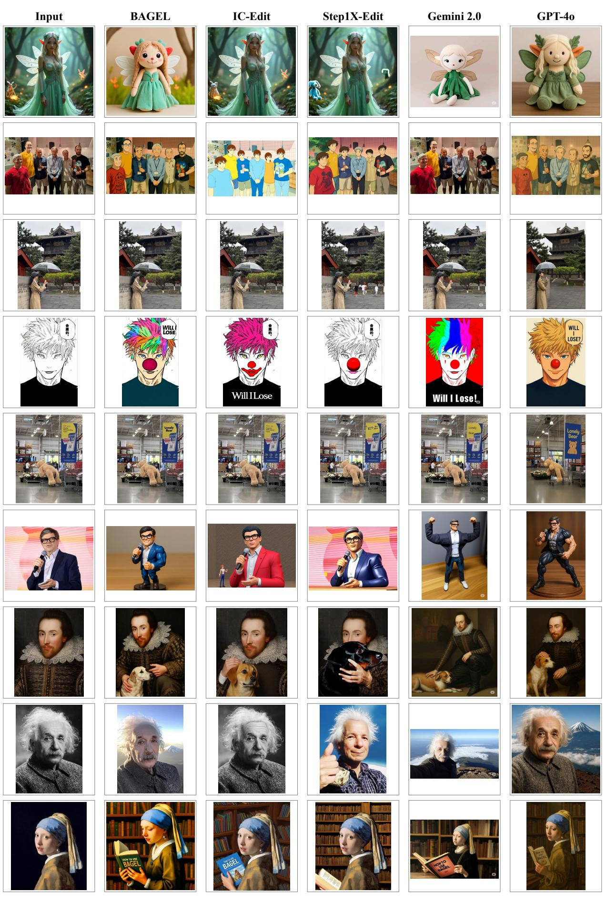
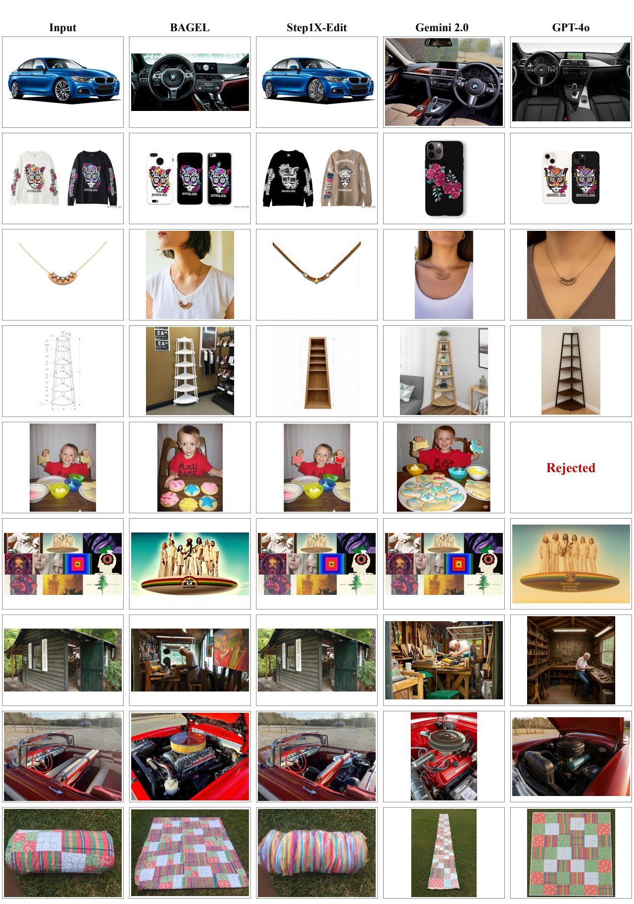
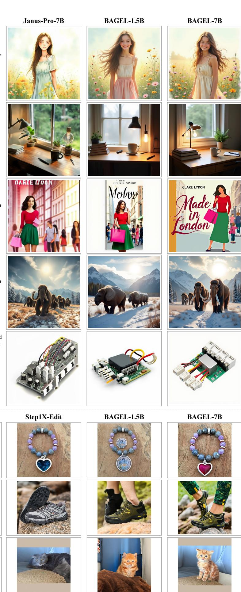
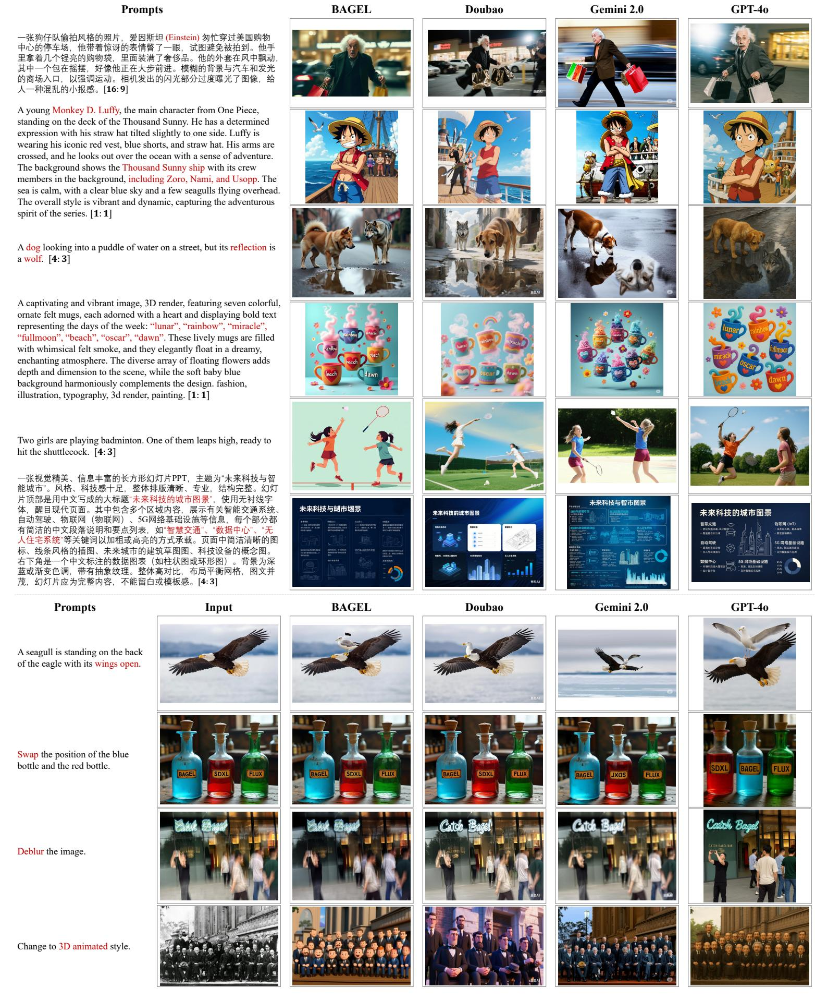

# 1. 论文基本信息

## 1.1. 标题
<strong>新兴特性：统一多模态预训练中的涌现能力 (Emerging Properties in Unified Multimodal Pretraining)</strong>

## 1.2. 作者
Chaorui Deng\*1, Deyao Zhu\*1, Kunchang Li\*2‡, Chenhui Gou\*3‡, Feng Li\*4†, Zeyu Wang5‡, Shu Zhong1, Weihao Yu1, Xiaonan Nie1, Ziang Song1, Guang Shi1, Haoqi Fan\*\*。
\*为共同第一作者，‡为通讯作者，†为项目负责人。

**所属机构：**
1.  ByteDance Seed (字节跳动种子团队)
2.  Shenzhen Institutes of Advanced Technology (中国科学院深圳先进技术研究院)
3.  Monash University (蒙纳士大学)
4.  Hong Kong University of Science and Technology (香港科技大学)
5.  UC Santa Cruz (加州大学圣克鲁兹分校)

## 1.3. 发表期刊/会议
该论文以预印本 (arXiv preprint) 的形式发布。虽然尚未正式发表于同行评审期刊或会议，但 arXiv 在学术界是重要的预发布平台，其内容通常代表了最新的研究进展。

## 1.4. 发表年份
2025年。根据原文链接和发布时间，该论文于 2025-05-20T17:59:30.000Z 发布。

## 1.5. 摘要
<strong>统一多模态理解与生成 (Unified Multimodal Understanding and Generation)</strong> 在尖端专有系统中展现出令人瞩目的能力。本研究引入了 **BAGEL (Scalable Generative Cognitive Model)**，一个开源的 <strong>基础模型 (foundational model)</strong>，原生支持多模态理解与生成。BAGEL 是一个统一的、<strong>仅解码器 (decoder-only)</strong> 模型，通过对大规模交错式文本、图像、视频和网页数据中精心挑选的数万亿词元 (tokens) 进行预训练。当模型在如此多样化的多模态交错数据上进行扩展时，BAGEL 在复杂的多模态推理中展现出 <strong>涌现能力 (emerging capabilities)</strong>。因此，它在标准基准测试的多模态生成和理解方面都显著优于现有的开源统一模型，同时展现了先进的多模态推理能力，例如自由形式的图像操作、未来帧预测、3D 操作和世界导航。为了促进多模态研究的进一步发展，本工作分享了关键发现、预训练细节、数据创建协议，并向社区发布了代码和模型检查点。

## 1.6. 原文链接
https://arxiv.org/abs/2505.14683
PDF 链接: https://arxiv.org/pdf/2505.14683v3.pdf

# 2. 整体概括

## 2.1. 研究背景与动机
当前人工智能领域，尤其是大型模型的发展，正迅速推动 <strong>统一多模态理解与生成 (unified multimodal understanding and generation)</strong> 的边界。虽然学术界已有一些研究（如 [57, 66, 68, 70, 73, 79, 83, 89]）展示了在联合优化生成和理解基准方面的潜力，但这些模型大多仍主要依赖于图像-文本配对数据进行训练。

**核心问题与挑战：** 作者指出，学术模型与 **GPT-4o (GPT-4o)** 和 **Gemini 2.0 (Gemini 2.0)** 等尖端专有系统之间存在显著差距，而这些专有系统的底层技术细节并未公开。作者认为，弥合这一差距的关键在于 <strong>利用精心构建的多模态交错数据 (carefully structured multimodal interleaved data) 进行大规模扩展 (scaling up)</strong>。这种交错数据能够整合文本、图像、视频和网络来源，提供比单一模态数据更丰富的上下文和模态间关联。

**本文的切入点与创新思路：** 论文旨在通过大规模、多样化的多模态交错数据训练，探索统一多模态模型在扩展过程中可能出现的 <strong>涌现能力 (emerging properties)</strong>。这种方法不仅期望提升核心的理解和生成能力，更重要的是，能够促进复杂组合能力（如自由形式的视觉操作和长上下文推理下的多模态生成）的出现，从而为一系列高级功能奠定基础。

## 2.2. 核心贡献/主要发现
本文通过引入 **BAGEL (Scalable Generative Cognitive Model)** 这一开源基础模型，在统一多模态领域做出了以下主要贡献和发现：

*   **推出开源统一多模态基础模型 BAGEL：** BAGEL 是一个统一的、仅解码器 (decoder-only) 模型，旨在原生支持多模态理解与生成。它拥有 70 亿个激活参数（总计 140 亿参数），是目前顶级的开源模型之一。
*   **大规模多模态交错数据预训练：** BAGEL 在数万亿词元 (tokens) 的大规模多模态交错数据上进行预训练，这些数据精心策划自文本、图像、视频和网页等多样化来源。这种数据策略是弥合学术界与专有系统之间差距的关键。
*   **发现复杂多模态推理的涌现能力：** 随着多模态交错预训练规模的扩大，BAGEL 展现出令人瞩目的涌现能力，特别是在复杂的多模态推理任务上。这些能力包括自由形式的图像操作、未来帧预测、3D 操作和世界导航等，这些任务超越了传统图像编辑模型的范畴，属于“世界建模 (world-modeling)”任务。
*   **在基准测试中超越现有开源模型：** BAGEL 在多模态生成和理解的标准基准测试中显著优于其他开源统一模型。例如，在视觉理解基准（如 MMMU 和 MM-Vet）上，以及在文本到图像生成基准（如 GenEval 和 WISE）上，都取得了领先的性能，甚至与领先的专有生成器（如 SD3 和 FLUX.1-dev）具有竞争力。
*   <strong>提出“思考模式 (Thinking Mode)”提升推理能力：</strong> 论文探索了引入基于语言的推理步骤（即“思考模式”或 `Self-CoT`）在图像生成和编辑之前的有效性。实验表明，这种方法显著增强了模型的性能，尤其是在需要世界知识和多步骤推理的复杂任务中。
*   **详细分享研究成果促进社区发展：** 为了促进多模态研究，论文详细分享了关键发现、预训练细节、数据创建协议，并发布了代码和模型检查点，为社区提供了宝贵的资源。

    **主要发现总结：** 论文观察到，随着 BAGEL 模型在交错多模态预训练中规模的扩大，涌现出清晰的模式：基本的 <strong>多模态理解 (multimodal understanding)</strong> 和 <strong>高保真生成 (high-fidelity generation)</strong> 首先收敛；接着，复杂的编辑和自由形式的视觉操作能力浮现。这些新兴能力不仅通过公共基准得到支持，更在作者提出的 <strong>IntelligentBench (智能基准)</strong> 中得到了明显验证。这表明，先前独立的原子技能通过跨模态组合推理得以协同，从而在一个开源系统中产生丰富的能力谱。

# 3. 预备知识与相关工作

本节旨在为读者提供理解 BAGEL 模型及其所处研究背景所需的核心概念和技术演进。

## 3.1. 基础概念
*   <strong>统一多模态预训练 (Unified Multimodal Pretraining):</strong> 指的是在一个单一的模型架构中，同时学习和处理多种模态（如文本、图像、视频）的信息，并使其能够执行跨模态的理解和生成任务。目标是构建一个能够像人类一样理解和交互多模态世界的通用智能体。
*   <strong>仅解码器模型 (Decoder-only Model):</strong> 在 **Transformer (Transformer)** 架构中，仅使用解码器部分来构建模型。解码器通常用于自回归地生成序列，每次生成一个词元 (token)，并能关注所有先前生成的词元。在大型语言模型 (LLM) 中，仅解码器架构已成为主流，它通过预测下一个词元来学习语言模式。在多模态领域，这意味着模型可以自回归地生成文本和视觉内容。
*   <strong>Transformer (Transformer) 架构:</strong> 一种基于 <strong>自注意力机制 (self-attention mechanism)</strong> 的神经网络架构，在自然语言处理和计算机视觉领域取得了巨大成功。其核心在于通过注意力机制捕捉序列中不同位置之间的依赖关系，而无需依赖循环神经网络或卷积神经网络。
    *   <strong>自注意力机制 (Self-Attention Mechanism):</strong> 允许模型在处理序列中的某个词元时，能够权衡同一序列中所有其他词元的重要性。其核心计算涉及到查询 (Query, $Q$)、键 (Key, $K$) 和值 (Value, $V$) 矩阵。
        $$
        \mathrm{Attention}(Q, K, V) = \mathrm{softmax}\left(\frac{QK^T}{\sqrt{d_k}}\right)V
        $$
        其中，$Q$、$K$、$V$ 是输入经过线性变换得到的矩阵，$d_k$ 是键向量的维度，用于缩放点积以防止梯度过小。
*   <strong>词元 (Token):</strong> 在自然语言处理中，是文本被分割后的最小单位，可以是单词、子词或字符。在多模态模型中，图像和视频等其他模态数据也会被编码成类似词元的离散表示，以便与文本词元一同处理。
*   <strong>混合专家模型 (Mixture-of-Experts, MoE):</strong> 一种神经网络架构，其中包含多个“专家网络 (expert networks)”，一个门控网络 (gating network) 负责根据输入选择或组合一个或多个专家的输出。它允许模型在保持计算效率的同时，显著增加模型容量，因为在推理时只有部分专家会被激活。
*   <strong>视觉Transformer (Vision Transformer, ViT):</strong> 将 Transformer 架构应用于图像处理任务，将图像分割成小块（补丁），然后将这些补丁序列作为 Transformer 的输入。
*   <strong>变分自编码器 (Variational AutoEncoder, VAE):</strong> 一种深度生成模型，包含编码器和解码器两部分。编码器将输入数据（如图像）压缩成一个潜在空间 (latent space) 的分布（通常是高斯分布），解码器则从该潜在空间中采样并重建原始数据。VAE 广泛用于图像生成和表示学习。
*   <strong>Rectified Flow (整流流):</strong> 一种生成模型，通过学习一个从简单噪声分布到复杂数据分布的“直线”路径来生成数据。与传统的扩散模型 (Diffusion Models) 相比，Rectified Flow 旨在学习更直接的路径，从而可能实现更快的采样速度和更稳定的训练。它通常用于图像生成任务。
*   <strong>因果注意力 (Causal Attention):</strong> 在自回归模型中，因果注意力机制确保模型在预测当前词元时，只能关注序列中位于其之前（或自身）的词元，而不能“偷看”未来的词元。这对于生成任务至关重要。
*   **Qwen2.5 LLM (Qwen2.5 LLM):** 一种高性能的开源大型语言模型，通常用作其他模型的基础或初始化，因其卓越的性能和公共可用性而被广泛采用。
*   **SigLIP2 (SigLIP2):** 一种用于视觉理解的预训练 **ViT (Vision Transformer)** 编码器，能够将原始像素信息转换为高级语义特征，通常用于图像-文本对齐任务。
*   **FLUX (FLUX):** 一种领先的公共生成器模型，其 **VAE (Variational AutoEncoder)** 组件用于将图像从像素空间转换为潜在空间 (latent space) 进行高效处理，反之亦然。

## 3.2. 前人工作
论文在引言和模型设计部分提到了多项相关工作，可分为以下几类：

*   <strong>统一多模态模型 (Unified Multimodal Models):</strong>
    *   [57, 66, 68, 70, 73, 79, 83, 89] 等研究项目：展示了在联合优化生成和理解基准方面的 promising 结果，通常采用精心设计的统一架构。
    *   [1, 11, 70]：尝试扩展其统一模型，但主要仍依赖于标准图像生成和理解任务中的图像-文本配对数据进行训练。
    *   <strong>GPT-4o (GPT-4o) 和 Gemini 2.0 (Gemini 2.0):</strong> 作者指出这些是尖端专有系统，其底层技术仍未公开，但展现出强大的统一多模态能力，与学术模型存在显著差距。这正是 BAGEL 旨在弥合的差距。

*   <strong>模型架构设计 (Model Architecture Design):</strong>
    *   <strong>Quantized AR (量化自回归) 模型 [11, 48, 59, 70, 79, 83-85, 90]:</strong> 利用离散视觉词元器 [31, 36, 51, 94] 进行自回归视觉生成。优点是直接利用现有 LLM 基础设施，但视觉生成质量通常不如扩散模型 (diffusion-based models)，且推理延迟较高。
    *   <strong>External Diffuser (外部扩散器) 模型 [18, 23, 57, 69, 73]:</strong> 将 LLM <strong>主干网络 (backbone)</strong> 与外部扩散模块结合，通过轻量级可训练适配器连接。LLM 生成“语义条件”的潜在词元，扩散模块再生成图像。优点是收敛快、数据消耗少，但在 LLM 上下文压缩为少量潜在词元时，可能引入理解与生成模块之间的瓶颈，导致信息丢失，尤其是在长上下文多模态推理中。
    *   <strong>Integrated Transformer (集成 Transformer) 模型 [40, 50, 66, 104]:</strong> 将 LLM 和扩散模型统一集成到单一 Transformer 中。利用自回归 Transformer 强大的理解/推理能力和扩散 Transformer 强大的视觉生成能力。相比外部扩散器，需要更高的训练计算量，但通过保持无瓶颈的上下文，实现了生成与理解模块之间的无损交互，更适用于大规模扩展。

*   <strong>数据增强与推理 (Data Augmentation &amp; Reasoning):</strong>
    *   **DeepSeek-R1 [26]:** 启发了 BAGEL 采用推理导向内容来促进多模态推理，实现理解和生成过程之间的知识无缝迁移。
    *   **O1 [33]:** 同样是引入长上下文 <strong>思维链 (Chain-of-Thoughts, CoT)</strong> 数据进行多模态理解的案例。

## 3.3. 技术演进
统一多模态模型的发展历程可以概括为从离散模态处理到集成模态处理，再到追求通用智能体的演变：

1.  **早期多模态模型：** 主要关注特定模态（如图像或文本）的独立处理，或简单的跨模态配对任务（如图像标注、文本描述图像）。
2.  <strong>视觉-语言模型 (Vision-Language Models, VLMs) 的兴起：</strong> 随着 Transformer 和大规模预训练的成功，VLM 开始将图像和文本模态结合，处理更复杂的任务。这些模型通常采用双编码器或单编码器架构，但仍以图像-文本配对数据为主，侧重于理解任务。
3.  **统一生成与理解的尝试：** 意识到理解和生成是互补的，研究人员开始探索将两者集成到同一个模型中，以实现更强的通用性。最初的尝试可能通过适配器将预训练的 VLMs 和 T2I 模型连接起来，但这种方法可能存在信息瓶颈。
4.  **集成 Transformer 架构的出现：** 旨在消除适配器瓶颈，将不同模态的输入和输出视为统一的词元序列，并在一个大型 Transformer 模型中进行处理。这使得模型能够在所有层级进行模态间交互，从而更好地捕捉复杂关系。
5.  **数据规模与多样性的扩展：** 随着模型容量的增加，对高质量、大规模、多样化数据（尤其是交错式多模态数据）的需求也日益增长。视频和网页数据等能够提供丰富的上下文和模态间关联，成为训练更强大模型的关键。
6.  **涌现能力与世界建模：** 在大规模、多样化数据上训练的集成多模态模型，开始展现出超越其训练任务的 <strong>涌现能力 (emerging properties)</strong>，例如复杂推理、世界知识建模和长上下文理解，这预示着通用人工智能 (AGI) 的潜力。

    BAGEL 的工作正处于这一演进的尖端，它选择了 <strong>Integrated Transformer (集成 Transformer)</strong> 解决方案，并强调 **大规模、多样化的交错式多模态数据** 对于解锁高级 <strong>多模态推理 (multimodal reasoning)</strong> 和 <strong>涌现能力 (emerging properties)</strong> 的重要性。

## 3.4. 差异化分析
BAGEL 与现有相关工作的主要区别和创新点体现在以下几个方面：

*   <strong>架构选择：无瓶颈的集成 Transformer 与 MoT (Bottleneck-free Integrated Transformer with MoT):</strong>
    *   <strong>与外部扩散器 (External Diffuser) 模型的差异：</strong> 许多先前的工作（如 MetaQuery [57]、MetaMorph [73]）采用外部扩散模块，通过轻量级适配器将 LLM/VLM 与扩散模型连接。这种方法在 LLM 上下文压缩成少量潜在词元时，可能在理解与生成模块之间引入显式瓶颈，限制了信息流动，尤其是在长上下文推理中。
    *   **BAGEL 的创新：** 采用 <strong>集成 Transformer (Integrated Transformer)</strong> 解决方案，将 LLM 和扩散模型统一在一个 Transformer 架构中。更进一步，BAGEL 采用了 <strong>混合 Transformer 专家 (Mixture-of-Transformers, MoT)</strong> 架构，包含两个独立的 Transformer 专家（一个用于理解，一个用于生成）。这种设计确保了在所有 Transformer 块中都能保持 <strong>无瓶颈的上下文 (bottleneck-free context)</strong>，从而实现生成和理解模块之间的无损交互，更适合大规模训练。实验也证明 MoT 优于 Dense 和 MoE 设计。

*   <strong>数据策略：大规模、多样化的交错式多模态数据 (Large-scale, Diverse Interleaved Multimodal Data):</strong>
    *   **与现有统一模型的差异：** 许多现有统一模型（如 Janus-Pro [11]）虽然尝试扩展，但仍主要在标准图像-文本配对数据上进行训练。
    *   **BAGEL 的创新：** 强调通过 <strong>精心构建的多样化多模态交错数据 (diverse multimodal interleaved data)</strong> 进行扩展。这些数据不仅包含文本、图像，更整合了视频和网页数据。视频数据提供了像素级、概念级、时间级和物理级的连续性，对于获取世界知识至关重要；网页数据则捕获了复杂的现实世界多模态结构和丰富的上下文。这种交错格式原生包含了多模态对话、文本到图像/视频生成和图像操作等任务。
    *   **数据创建协议：** 建立了一套新的可扩展数据源、过滤和高质量多模态交错数据构建协议。

*   <strong>推理能力：引入推理增强数据 (Reasoning-Augmented Data):</strong>
    *   **与传统数据集的差异：** 传统的 VLM 和 T2I 数据集主要关注感知和直接生成，较少强调复杂的推理链。
    *   **BAGEL 的创新：** 受 DeepSeek-R1 [26] 启发，BAGEL 通过 <strong>思维链 (Chain-of-Thoughts, CoT)</strong> 数据增强多模态理解，并假设在图像生成前引入语言推理步骤有助于澄清视觉目标和改进规划。为此，构建了包含文本到图像生成、自由形式图像操作和概念编辑等类别的推理增强示例。这使得模型能够进行更高级别的组合推理。

*   <strong>涌现能力 (Emerging Properties) 的明确探索和验证：</strong>
    *   **与现有模型的差异：** 许多模型可能在实际中展现出某种高级能力，但往往未被系统地研究和验证其“涌现”特性。
    *   **BAGEL 的创新：** 明确地将“涌现能力”作为研究重点，并通过在不同训练阶段的性能评估（包括新提出的 <strong>IntelligentBench (智能基准)</strong>）来追踪和验证这些能力的出现，例如复杂编辑和自由形式视觉操作在训练后期才显著提升。

*   <strong>评估基准：引入 IntelligentBench (Introducing IntelligentBench):</strong>
    *   **与现有基准的差异：** 现有的图像编辑基准（如 GEdit-Bench）可能侧重于经典的、直接的编辑任务。
    *   **BAGEL 的创新：** 提出 <strong>IntelligentBench (智能基准)</strong>，专门用于评估自由形式图像操作和概念编辑等需要复杂多模态推理和任务组合的任务，旨在消除简单编辑案例，更清晰地揭示模型的推理能力。

        综上所述，BAGEL 的核心创新在于其 **无瓶颈的 MoT 架构** 与 **大规模、多样化、推理增强的交错式多模态数据** 的结合，从而在公开模型中实现了前所未有的 <strong>涌现能力 (emerging properties)</strong> 和 <strong>世界建模 (world modeling)</strong> 能力。

# 4. 方法论

BAGEL 的方法论基于统一的、仅解码器 (decoder-only) Transformer 架构，并引入了混合专家 (MoT) 设计，以最大化模型容量并优化多模态理解与生成。

## 4.1. 方法原理
BAGEL 的核心思想是构建一个能够无缝处理和生成多种模态（文本、图像、视频）的 <strong>统一模型 (unified model)</strong>。它认识到，为了弥合学术模型与顶尖专有系统之间的差距，模型不仅需要巨大的容量，还需要在 <strong>多样化、交错式的多模态数据 (diverse, interleaved multimodal data)</strong> 上进行训练，以学习复杂的模态间推理。

模型的关键设计哲学包括：
1.  <strong>无瓶颈集成 (Bottleneck-free Integration):</strong> 避免在理解和生成模块之间设置信息瓶颈，确保长上下文交互的无损性。这通过 <strong>Integrated Transformer (集成 Transformer)</strong> 解决方案实现。
2.  <strong>专家化处理 (Expert Specialization):</strong> 针对理解和生成任务可能存在的不同优化目标，引入 <strong>混合 Transformer 专家 (Mixture-of-Transformers, MoT)</strong> 架构，为不同模态或任务分配专用的参数，以缓解优化冲突。
3.  <strong>自回归生成范式 (Autoregressive Generation Paradigm):</strong> 延续大型语言模型 (LLM) 在文本生成方面的成功，采用 <strong>下一个词元预测 (Next-Token-Prediction)</strong> 范式处理文本词元，并扩展到视觉词元。
4.  <strong>扩散模型优势 (Diffusion Model Advantages):</strong> 借鉴扩散模型在视觉生成方面的高质量优势，采用 <strong>Rectified Flow (整流流)</strong> 方法进行视觉词元预测。
5.  <strong>数据驱动涌现 (Data-driven Emergence):</strong> 通过大规模、多样化、推理导向的交错数据，期望模型在扩展过程中自然涌现出复杂的多模态推理能力。

## 4.2. 核心方法详解
BAGEL 模型的核心架构和处理流程可以分为以下几个关键部分：

### 4.2.1. 模型骨干架构 (Backbone Model Architecture)
BAGEL 的骨干模型继承自一个 <strong>仅解码器 (decoder-only)</strong> 的 Transformer 架构。
*   **初始化：** 选用 **Qwen2.5 LLM [93]** 作为初始化，因其卓越的性能 [21] 和公共可用性。
*   <strong>标准化 (Normalization):</strong> 采用 **RMSNorm [98]** 进行标准化。
*   <strong>激活函数 (Activation Function):</strong> 使用 **SwiGLU [65]** 作为激活函数。
*   <strong>位置编码 (Positional Encoding):</strong> 采用 **RoPE [67] (Rotary Positional Embedding)** 进行位置编码。
*   <strong>KV 缓存优化 (KV Cache Reduction):</strong> 利用 **GQA [2] (Grouped Query Attention)** 减少 <strong>KV 缓存 (KV cache)</strong>。
*   <strong>训练稳定性 (Training Stability):</strong> 在每个注意力块中添加 **QK-Norm [15]**，这是图像/视频生成模型中的常见实践 [19, 35, 63]，有助于稳定训练过程。

### 4.2.2. 视觉信息表示 (Visual Information Representation)
视觉信息在 BAGEL 中从两个方面进行表示，分别服务于理解和生成任务：

1.  <strong>用于视觉理解 (For Visual Understanding):</strong>
    *   **编码器：** 使用一个 **ViT (Vision Transformer)** 编码器将原始像素转换为词元 (tokens)。
    *   **初始化：** 采用 **SigLIP2-so400m/14 [75]** 作为 ViT 编码器的初始化，其固定分辨率为 $384 \times 384$。
    *   **输入尺寸扩展：** 首先对位置嵌入 (position embedding) 进行插值，并将最大输入尺寸设置为 $980 \times 980$。
    *   **自适应宽高比：** 集成 **NaViT [16]** 以支持以其原始宽高比处理图像。
    *   **特征维度匹配：** 采用一个两层 <strong>MLP 连接器 (MLP connector)</strong> 来匹配 ViT 词元与 LLM 隐藏状态的特征维度。

2.  <strong>用于视觉生成 (For Visual Generation):</strong>
    *   **潜在空间转换：** 使用来自 **FLUX [35]** 的预训练 **VAE (Variational AutoEncoder)** 模型将图像从像素空间转换为潜在空间，反之亦然。
    *   **潜在表示特性：** 潜在表示的下采样率为 8，潜在通道数为 16。
    *   **空间维度匹配：** 随后通过一个 $2 \times 2$ 的 <strong>块嵌入层 (patch embedding layer)</strong> 处理潜在表示，以减少空间尺寸并匹配 LLM 骨干模型的隐藏维度。
    *   **冻结 VAE：** VAE 模型在训练期间保持冻结状态。

### 4.2.3. 统一词元序列与位置编码 (Unified Token Sequence and Positional Encoding)
*   **2D 位置编码：** 在将 ViT 和 VAE 词元集成到 LLM 骨干模型之前，BAGEL 对两者都应用了 <strong>2D 位置编码 (2D positional encoding)</strong>。
*   <strong>扩散时间步编码 (Diffusion Timestep Encoding):</strong> 遵循 [17] 的方法，将时间步嵌入 (timestep embedding) 直接添加到 VAE 词元的初始隐藏状态中，而不是像传统扩散 Transformer [19, 35, 82] 那样使用 AdaLN，这在保持性能的同时，实现了更简洁的架构。
*   <strong>词元交错 (Token Interleaving):</strong> 在 LLM 内部，来自理解和生成任务的文本、ViT 和 VAE 词元根据输入的模态结构进行交错。

### 4.2.4. 广义因果注意力 (Generalized Causal Attention)
为了在交错的多模态序列中实现有效的自回归生成和理解，BAGEL 采用了 <strong>广义因果注意力 (Generalized Causal Attention)</strong> 机制。
*   **分区与注意力：**
    *   属于同一样本的词元首先被分割成多个连续的段 (splits)，每个段包含单一模态的词元（例如，文本、ViT 或 VAE）。
    *   一个段中的词元可以关注所有前置段中的词元。
    *   在每个段内部：
        *   对文本词元采用 <strong>因果注意力 (causal attention)</strong>（只能关注当前词元及之前的词元）。
        *   对视觉词元保持 <strong>双向注意力 (bidirectional attention)</strong>（可以关注段内所有词元）。
    *   **实现：** 广义因果注意力通过 PyTorch FlexAttention [72] 实现，比朴素的 <strong>缩放点积注意力 (scaled-dot-product attention)</strong> 提高了约 2 倍的速度。
    *   **推理优化：** 在推理时，广义因果结构允许缓存已生成多模态上下文的 <strong>键值对 (key-value, KV) 缓存</strong>，从而加速多模态解码。

*   **多图生成中的视觉词元处理：**
    在训练期间，一个交错的多模态生成样本可能包含多张图像。对于每张图像，BAGEL 准备三组视觉词元：
    1.  <strong>带噪 VAE 词元 (Noised VAE tokens):</strong> 被扩散噪声破坏的 VAE 潜在表示，专门用于 <strong>Rectified Flow (整流流)</strong> 训练。<strong>均方误差 (MSE) 损失</strong>在此集合上计算。
    2.  <strong>干净 VAE 词元 (Clean VAE tokens):</strong> 原始的（无噪声）潜在表示，在生成后续图像或文本词元时作为条件。
    3.  <strong>ViT 词元 (ViT tokens):</strong> 从 SigLIP2 编码器获得，有助于统一交错生成和理解数据的输入格式，并在经验上提升交错生成质量。

    *   **注意力限制：** 对于交错的图像或文本生成，后续的图像或文本词元可以关注前置图像的干净 VAE 词元和 ViT 词元，但不能关注其对应的带噪 VAE 词元。
    *   **多图像一致性：** 对于交错的多图像生成，采用 <strong>扩散强制策略 (diffusion forcing strategy) [8]</strong>，对不同图像添加独立的噪声水平，并以先前图像的带噪表示为条件。为增强生成一致性，随机分组连续图像并应用组内完全注意力。
    *   **推理时词元丢弃：** 在交错推理中，随机丢弃文本、ViT 和干净 VAE 词元，概率分别为 0.1、0.5 和 0.1。
    *   **KV 缓存管理：** 只有干净 VAE 词元和 ViT 词元的 KV 对被存储；一旦图像完全生成，对应的带噪 VAE 词元（原文中为 "nis Atokes thentex replace yheceerpars" 似乎有排版错误，应指带噪 VAE 词元被丢弃）的 KV 对就不再需要。

### 4.2.5. Transformer 设计：MoT 架构 (Mixture-of-Transformers Architecture)
BAGEL 遵循 <strong>集成 Transformer (Integrated Transformer)</strong> 解决方案的原则，比较了标准 <strong>Dense Transformer (稠密 Transformer)</strong>、<strong>混合专家 (Mixture-of-Experts, MoE)</strong> Transformer 和 <strong>混合 Transformer 专家 (Mixture-of-Transformers, MoT)</strong> 架构。
*   **MoE 变体：** 仅复制每个 Qwen2.5 LLM 块中的 <strong>前馈网络 (Feed-Forward Network, FFN)</strong> 作为生成专家的初始化。
*   **MoT 变体：** 复制 Qwen2.5 LLM 的所有可训练参数，创建一个完整尺寸的生成专家。这种架构已被现有工作 [40, 66] 采用。
*   <strong>硬路由 (Hard Routing):</strong> 模型中的 MoE 和 MoT 都使用硬路由：新复制的生成专家专门处理 VAE 词元，而原始参数（理解专家）处理文本和 ViT 词元，这与 Qwen-VL 系列 [4, 77] 的策略一致。
*   **计算效率：** 尽管 MoE 和 MoT 架构使总参数量增加约一倍，但所有三种模型变体（Dense、MoE、MoT）在训练和推理期间的 <strong>浮点运算 (FLOPs)</strong> 是相同的，因为只有部分专家被激活。
*   **实验发现：** 作者在 1.5B 规模的 Qwen-2.5 LLM 上进行了受控实验，结果显示 MoT 变体始终优于 Dense 和 MoE 设计，尤其在多模态生成任务上差距最为显著。MSE 损失（生成）表现出平滑、单调下降的轨迹，MoT 不仅收敛最快，而且达到最低的最终损失。CE 损失（理解）波动较大，但 MoT 总体上仍保持最佳性能。这表明将生成任务的参数与理解任务的参数解耦具有明显优势，可以缓解由竞争性模态特定学习目标引起的优化挑战。

    这些设计选择共同构成了 BAGEL 强大的多模态处理能力，通过专门的专家、无瓶颈的模态交互和高效的词元处理，在保证计算效率的同时，最大化了模型容量和性能。

## 4.3. 数学公式

本论文在方法论部分主要侧重于对模型架构和数据流的描述，并未明确给出新的、复杂的数学公式。核心的 Transformer 自注意力机制、VAE 的潜在空间变换、Rectified Flow 的概念等均是现有技术。论文主要创新点在于这些组件的集成方式、MoT 架构的应用，以及广义因果注意力机制的设计。

这里补充前面提到的自注意力机制公式，因为它是 Transformer 的核心：

<strong>自注意力机制 (Self-Attention Mechanism):</strong>
$$
\mathrm{Attention}(Q, K, V) = \mathrm{softmax}\left(\frac{QK^T}{\sqrt{d_k}}\right)V
$$
**符号解释:**
*   $Q$: 查询 (Query) 矩阵。它代表当前词元在计算注意力时所扮演的角色。
*   $K$: 键 (Key) 矩阵。它代表序列中其他词元在被查询时所扮演的角色。
*   $V$: 值 (Value) 矩阵。它代表序列中其他词元在被关注后，其信息如何被提取和聚合。
*   $Q K^T$: 查询与键的点积，衡量每个查询与每个键之间的相似度（相关性）。
*   $\sqrt{d_k}$: 键向量的维度 $d_k$ 的平方根。用于缩放点积结果，防止当 $d_k$ 很大时点积结果过大，导致 softmax 函数的梯度过小。
*   $\mathrm{softmax}(\cdot)$: Softmax 函数，将点积结果转换为概率分布，使得所有注意力权重之和为 1。
*   $\mathrm{Attention}(Q, K, V)$: 自注意力机制的输出，是值矩阵 $V$ 经过注意力权重加权求和后的结果，包含了序列中所有相关信息。

    在 BAGEL 中，这个自注意力机制被应用于文本、ViT 和 VAE 词元的交错序列中，并通过 <strong>广义因果注意力 (Generalized Causal Attention)</strong> 进行了修改，以适应多模态的自回归生成和理解需求。具体来说，因果掩码 (causal mask) 会被应用于 $QK^T$ 的结果上，以阻止模型关注未来的词元，确保生成过程的合理性。

对于 Rectified Flow，论文提到它遵循 [19, 41, 45] 的最佳实践，其核心是学习一个从噪声到数据的直线路径。虽然没有直接给出其数学公式，但其目标是最小化数据和噪声之间插值路径上的速度场和噪声之间的差异。

# 5. 实验设置

## 5.1. 数据集
BAGEL 的训练数据旨在支持多模态推理、上下文预测、物理动力学建模和未来帧预测，涵盖了语言、图像、视频和网页等多种模态。

以下是训练数据的规模和组成概览：

<table><thead><tr><th>Data Source</th><th># Data (M)</th><th># Tokens (T)</th></tr></thead><tbody><tr><td>Text Data</td><td>400</td><td>0.4</td></tr><tr><td>Image-Text-Pair Understanding Data</td><td>500</td><td>0.5</td></tr><tr><td>Image-Text-Pair Generation Data</td><td>1600</td><td>2.6</td></tr><tr><td>Interleaved Understanding Data</td><td>100</td><td>0.5</td></tr><tr><td>Interleaved Generation Data: Video</td><td>45</td><td>0.7</td></tr><tr><td>Interleaved Generation Data: Web</td><td>20</td><td>0.4</td></tr></tbody></table>

以下是数据源、准备协议和数据混合策略的详细描述：

### 5.1.1. 文本数据 (Text Only Data)
为保持底层 **LLM (Large Language Model)** 的语言建模能力，补充了高质量的纯文本数据。这些数据旨在支持广泛的语言覆盖和通用的文本任务。

### 5.1.2. 视觉-文本配对数据 (Vision-Text Paired Data)
文本-图像配对数据在多模态学习中扮演核心角色，为 **VLM (Vision-Language Model)** 预训练和 **T2I (Text-to-Image)** 生成提供大规模视觉监督。
*   <strong>VLM 图像-文本对 (VLM Image-Text Pairs):</strong> 使用大规模图像-文本对进行 VLM 训练，主要来源于网络 `alt-text` 和图片描述 (captions)。数据经过 **CLIP (CLIP)** 相似性过滤、分辨率和宽高比限制、文本长度检查以及去重以确保质量。为解决长尾分布问题，应用了概念感知采样。此外，还包含了来自 OCR 文档、图表和标注的结构化监督数据，以增强模型在阅读和空间理解方面的能力。
*   <strong>T2I 图像-文本对 (T2I Image-Text Pairs):</strong> 结合了高质量图像-文本对以及来自现有 T2I 模型 [19, 35] 的少量合成数据。这些数据涵盖了艺术、文本和超现实等多样化的描述风格，以及对清晰度、结构完整性和语义多样性进行过滤的高质量图像。

### 5.1.3. 视觉-文本交错数据 (Vision-Text Interleaved Data)
虽然视觉-文本配对数据有用，但不足以支持涉及多张图像和中间文本的复杂上下文推理。为此，引入了大规模视觉-文本交错数据。
*   <strong>数据来源 (Data Source):</strong>
    *   <strong>视频数据 (Video data):</strong> 提供丰富的世界知识，捕捉真实的动态。用于图像编辑、导航和 3D 操作等任务。构建数据集使用了公开的在线视频资源，以及两个开源数据集：
        *   **Koala36M [78]:** 提供大规模教学和交互丰富的内容。
        *   **MVImgNet2.0 [28]:** 包含从不同摄像机视角捕获的对象，支持多视图空间理解。
    *   <strong>网页数据 (Web data):</strong> 捕获复杂的现实世界多模态结构，提供涵盖广泛知识。基于 OmniCorpus [39]（从 Common Crawl [14] 预处理的大规模数据集）构建。还包含了开源图像编辑数据集 [3, 22, 32, 80, 88, 101] 作为结构化的交错数据，用于学习细粒度的编辑行为和增强模型的精确多模态推理能力。

*   <strong>数据过滤 (Data Filter):</strong>
    *   <strong>视频数据过滤 (Data Filtering for Video Data):</strong> 遵循 T2V 视频处理流程 [63]，通过时间分割、空间裁剪和质量过滤将视频预处理为高质量的短片段。
        *   使用轻量级镜头检测分割视频。
        *   移除黑边和覆盖物（如标志、文本）。
        *   按长度、分辨率、清晰度和运动稳定性过滤片段。
        *   使用 CLIP 相似性进行去重。
    *   <strong>网页数据过滤 (Data Filtering for Web Data):</strong> 针对教程、百科全书条目和设计内容等文档应用过滤流程，其中文本和图像表现出强烈的语义对齐。
        *   **主题选择：** 借鉴 DeepSeekMath [64]，首先使用 LLM 对一小部分文档进行分类，然后用这些标签训练 fastText [34] 分类器进行大规模推理。选定的数据再通过 LLM 分类器（Qwen2.5 14B 变体 [93]）进行细粒度过滤。
        *   **规则过滤：** 应用一系列基于规则的过滤器，针对图像清晰度、相关性和文档结构，如 Table 2 所示：

            <table><tr><td>Filter Type</td><td>Description</td></tr><tr><td>UI removal</td><td>Remove images whose URLs contain substrings such as icon or widget</td></tr><tr><td>Resolution</td><td>Require width and height within [150, 20000], and aspect ratio within [1/2, 2]</td></tr><tr><td>Image clarity</td><td>Remove blurry or low-quality images using a clarity operator</td></tr><tr><td>Text density</td><td>Discard document-style images with over 100 OCR-detected text tokens</td></tr><tr><td>Relevance</td><td>Remove redundant or irrelevant images based on CLIP similarity</td></tr><tr><td>Doc. trimming</td><td>Remove unrelated headers and footers via an LLM</td></tr><tr><td>Image quantity</td><td>Keep documents with 38 images for balanced context</td></tr></table>

        以上是原文 Table 2。

*   <strong>数据构建 (Data Construction):</strong>
    *   <strong>视频交错数据 (Interleaved Data from Videos):</strong> 通过生成连续帧之间视觉变化的文本描述来构建图像-文本交错序列，捕捉对象运动、动作转换和场景变化。这些帧间描述作为时间监督，用于学习视觉动态。通过蒸馏 Qwen2.5-VL-7B [4] 的轻量级描述模型，并限制描述长度为 30 词元，从每个视频片段平均采样四帧并为每对帧生成描述，得到 400 万个时间上接地 (temporally grounded) 的交错序列。
    *   <strong>网页交错数据 (Interleaved Data from Webs):</strong> 为减少图像生成中因图像、其伴随文本和周围视觉上下文之间弱对齐而导致的困难，采用“描述优先 (caption-first)”策略：为每张图像使用 Qwen2.5-VL-7B [4] 生成简洁描述，并将其直接插入图像之前作为概念支架。此外，使用 LLM 摘要工具重写超过 300 词元的图像间文本段，以提高上下文密度，最终得到 2000 万个结构化的交错网页文档。

### 5.1.4. 推理增强数据 (Reasoning-Augmented Data)
借鉴 O1 [33] 和 DeepSeek-R1 [26] 等近期模型，利用长上下文的 <strong>思维链 (Chain-of-Thoughts, CoT)</strong> 数据进行多模态理解。构建了 50 万个推理增强示例，涵盖四类：
*   <strong>文本到图像生成 (Text-to-Image generation):</strong> 手动制作简短模糊的 T2I 查询和简单的生成指导，然后使用 Qwen2.5-72B [93] 通过 <strong>上下文学习 (in-context learning)</strong> 生成额外的查询-指导对和详细提示，再由 FLUX.1-dev [35] 生成目标图像。形成查询、推理轨迹（指导 + 详细提示）和图像的三元组训练数据。
*   <strong>自由形式图像操作 (Free-form image manipulation):</strong> 通过 VLM 结合源图像、目标图像、用户查询和来自 DeepSeek-R1 [26] 的推理轨迹示例来生成推理增强示例。源图像和目标图像主要来自开源编辑数据集（如 OmniEdit [80]）和交错视频数据。
*   <strong>概念编辑 (Conceptual Edits):</strong> 针对需要高级概念推理而非简单像素修改的图像操作。使用网页交错数据集，从每个序列中采样候选图像对，并应用三阶段 VLM 流程构建高质量的 QA 示例。首先，VLM 识别 plausible 的输入-输出对；其次，VLM 生成相应的文本问题；最后，VLM 评估问题质量和与图像的对齐程度，过滤低质量示例。

## 5.2. 评估指标
论文采用了广泛的评估指标来全面评估 BAGEL 在多模态理解、生成和编辑方面的能力。

### 5.2.1. 多模态理解 (Multimodal Understanding)
*   **MME [20] (Multimodal Evaluation):** 评估模型在感知和认知方面的能力。MME-S 是 MME-P (Perception) 和 MME-C (Cognition) 的汇总。
    *   **概念定义：** MME 是一个综合性基准，旨在评估多模态大语言模型在感知（如识别、定位）和认知（如推理、常识）方面的能力。它通过一系列子任务和精心设计的提示来考察模型对视觉信息的理解深度和广度。
    *   **数学公式：** 通常报告为在多个子任务上的平均准确率或得分。具体计算方式依赖于 MME 内部的多个子任务的评分规则。
    *   **符号解释：** 评估结果通常是一个百分比或总分，表示模型在所有测试用例中的表现。
*   **MMBench (1.0-EN) [46] (Multimodal Benchmark):** 综合性多模态基准，涵盖多领域、多任务。
    *   **概念定义：** MMBench 是一个用于评估多模态模型综合能力的基准，包含多个领域（如科学、艺术、日常生活）和多种任务类型（如问答、推理）。它旨在提供一个全面的视角来衡量模型作为“全能选手”的能力。
    *   **数学公式：** 通常报告为在所有子任务上的平均准确率或得分。
    *   **符号解释：** 评估结果是一个百分比或总分。
*   **MMVet [96] (Multimodal-Vet):** 评估多模态 LLM 的集成能力。
    *   **概念定义：** MM-Vet 专注于评估多模态 LLM 的集成能力，即模型如何将不同模态的信息有效整合并进行推理，而不是简单地处理单一模态或模态间的简单映射。
    *   **数学公式：** 通常通过 GPT-4 等外部模型对模型输出进行人工或半自动化评估打分，然后计算平均得分。
    *   **符号解释：** 评估结果是一个平均得分，得分越高表示集成能力越强。
*   **MMMU [97] (Massive Multi-discipline Multimodal Understanding and Reasoning Benchmark for Expert AGI):** 针对专家级 AGI 的大规模多学科多模态理解和推理基准。
    *   **概念定义：** MMMU 是一个大规模、跨学科的多模态理解和推理基准，旨在评估模型在需要专家知识的复杂场景下的表现，是衡量模型迈向通用人工智能 (AGI) 的重要工具。
    *   **数学公式：** 通常报告为在不同学科任务上的平均准确率或得分。
    *   **符号解释：** 评估结果是一个百分比或总分。
*   **MathVista [49] (MathVista):** 评估视觉上下文中的数学推理能力。
    *   **概念定义：** MathVista 专门设计用于评估基础模型在视觉上下文中的数学推理能力，例如从图表中提取信息、解决几何问题等。
    *   **数学公式：** 通常报告为在数学推理任务上的准确率。
    *   **符号解释：** 准确率是一个百分比。
*   **MMVP [74] (Multimodal LLMs' Visual Shortcomings):** 探索多模态 LLM 的视觉缺陷。
    *   **概念定义：** MMVP 用于评估多模态 LLM 在特定视觉理解任务上的不足，例如对细微视觉细节的捕捉能力、对视觉错觉的抵抗力等。
    *   **数学公式：** 通常报告为特定视觉任务上的准确率。
    *   **符号解释：** 准确率是一个百分比。

### 5.2.2. 文本到图像生成 (Text-to-Image generation)
*   **GenEval [25]:** 一个以对象为中心的框架，用于评估文本到图像的对齐。
    *   **概念定义：** GenEval 是一个专注于对象对齐的文本到图像生成评估框架。它通过分析生成图像中对象是否准确、完整地对应文本描述，来衡量生成模型的语义理解能力。
    *   **数学公式：** 通常基于 CLIP 分数或其他视觉-语义相似性度量，结合对象检测结果，计算一个复合得分。
    *   **符号解释：** 评估结果是一个总分，得分越高表示生成图像与文本描述的语义对齐度越好。
*   **WISE [53] (World knowledge-Informed Semantic Evaluation for Text-to-Image Generation):** 评估文本到图像生成中复杂语义理解和世界知识集成。
    *   **概念定义：** WISE 是一个以世界知识为导向的语义评估基准，用于衡量文本到图像生成模型在处理复杂语义、整合世界知识方面的能力，例如生成符合历史、文化或科学事实的图像。
    *   **数学公式：** 通常通过 GPT-4 等外部模型对生成图像进行多维度评估打分，然后计算平均得分。
    *   **符号解释：** 评估结果是一个平均得分，得分越高表示模型在世界知识理解和语义生成方面越强。

### 5.2.3. 图像编辑 (Image Editing)
*   **GEdit-Bench [44]:** 基于从网络抓取的真实用户请求构建的图像编辑评估套件。
    *   **概念定义：** GEdit-Bench 是一个模拟真实世界图像编辑需求的基准，其任务来源于真实的用户请求。它评估模型执行各种编辑操作的能力，从简单的修改到复杂的场景调整。
    *   **数学公式：** 性能通常由 GPT-4.1 [54] 自动评分，根据请求实现度、视觉质量等多个维度给出得分。
    *   **符号解释：** G_SC (Semantic Consistency), G_PQ (Perceptual Quality), G_O (Overall) 等指标，表示语义一致性、感知质量和总体性能。
*   <strong>IntelligentBench (智能基准):</strong> 本文提出，用于评估自由形式图像操作（包括概念编辑）的代理任务，需要复杂的多模态推理和任务组合。
    *   **概念定义：** IntelligentBench 旨在评估模型在需要高级多模态推理和任务组合的自由形式图像操作方面的能力，它排除简单的编辑案例，更侧重于模型的“智能”编辑能力。包含 350 个示例，每个包含问题图像、问题文本和参考答案图像。
    *   **数学公式：** 评估由 GPT-4o (version: gpt-4o-2024-11-20) 执行。评估标准包括请求实现度、视觉一致性、世界知识和创造力。每个答案得分 0-2 分。最终模型得分通过汇总所有个体得分并标准化到 100 分制计算。
    *   **符号解释：** 最终得分是一个 0-100 的数值，分数越高表示模型在该任务上的表现越好。

### 5.2.4. 推理增强编辑 (Reasoning-Augmented Editing)
*   **RISEBench [103] (Reasoning-Informed Visual Editing):** 衡量模型推理辅助的视觉编辑能力。
    *   **概念定义：** RISEBench 旨在评估模型在推理指导下的视觉编辑能力，即模型能否理解并执行基于复杂推理的编辑指令。
    *   **数学公式：** 性能由 GPT-4.1 评估，通常报告 Temporal (时间)、Causal (因果)、Spatial (空间)、Logical (逻辑) 等维度的得分。
    *   **符号解释：** Overall (总体) 得分是一个平均得分，得分越高表示推理辅助编辑能力越强。
*   **KRIS-Bench [86] (Benchmarking Next-Level Intelligent Image Editing Models):** 基准测试下一代智能图像编辑模型。
    *   **概念定义：** KRIS-Bench 是一个旨在基准测试下一代智能图像编辑模型的套件，它关注模型在更高层次的智能编辑任务中的表现，可能涉及更复杂的语义理解和世界知识。
    *   **数学公式：** 性能由 GPT-4o 评估，报告 Factual (事实性)、Conceptual (概念性)、Procedural (程序性) 等维度的得分。
    *   **符号解释：** AP (Attribute Perception), SP (Semantic Perception), TP (Temporal Prediction), SS (Social Science), NS (Natural Science), LP (Logical Reasoning), ID (Instruction Decomposition) 等指标。Overall (总体) 得分是一个平均得分，得分越高表示智能编辑能力越强。

## 5.3. 对比基线
论文将 BAGEL 与以下几类模型进行了比较：

*   <strong>专用视觉理解模型 (Specialized Visual Understanding Models):</strong>
    *   InternVL2 [13], InternVL2.5 [12] (1.8B, 7B)
    *   Qwen2-VL [77], Qwen2.5-VL [4] (1.5B, 3B, 7B)
    *   BLIP-3 [91] (4B)
    *   LLaVA-OV [37] (7B)
    *   Emu3-Chat [79] (8B)
    *   Kimi-VL [71] (2.8B/16B)
    *   DeepSeek-VL2 [87] (4.1B/28B)

*   <strong>现有开源统一多模态模型 (Existing Open-source Unified Multimodal Models):</strong>
    *   Janus [83], Janus-Pro [11] (1.3B, 1.5B, 7B)
    *   Show-o [89] (1.5B, 7B)
    *   ILLUME [76] (7B)
    *   VILA-U256 [85] (7B)
    *   Chameleon [70] (7B)
    *   MetaQuery-XL [57] (7B)
    *   LlamaFusion [66] (8B)
    *   MetaMorph [73] (8B)
    *   SEED-X [23] (13B)
    *   TokenFlow-XL [59] (13B)
    *   MUSE-VL [90] (32B)

*   <strong>专用文本到图像生成模型 (Specialized Text-to-Image Generation Models):</strong>
    *   PixArt-α [9]
    *   SDv2.1 [61], SDXL [58], SD3-Medium [19]
    *   DALL-E 2 [60], DALL-E 3 [5]
    *   Emu3-Gen [79]
    *   FLUX.1-dev [35]
    *   playground-v2.5 [38]

*   <strong>专用图像编辑模型 (Specialized Image Editing Models):</strong>
    *   Instruct-Pix2Pix [6]
    *   MagicBrush [99]
    *   AnyEdit [95]
    *   OmniGen [88]
    *   Step1X-Edit [43]
    *   IC-Edit [100] (在定性比较中出现)

*   <strong>专有模型 (Proprietary Models) (用于参考和定性比较):</strong>
    *   GPT-4o [55]
    *   Gemini 2.0 [24]

        这些基线模型涵盖了多模态领域的不同研究方向，包括纯粹的视觉理解、文本到图像生成、图像编辑以及各种尝试统一多模态能力的模型。通过与这些模型的比较，论文旨在全面展示 BAGEL 的性能优势和独特能力。

## 5.4. 训练策略
BAGEL 采用多阶段训练策略，并使用动态混合的精心策划数据，如 Table 3 所示。

以下是原文 Table 3：

<table><tr><td></td><td>Alignment</td><td>PT</td><td>CT</td><td>SFT</td></tr><tr><td>Hyperparameters Learning rate LR scheduler Weight decay</td><td colspan="4">1 × 10−3 1.0 × 10−4 Cosine Constant 0.0 0.0 AdamW (β1 = 0.9, β2 = 0.95,  = 1.0 × 10−15)</td></tr><tr><td>Gradient norm clip Optimizer Loss weight (CE : MSE) Warm-up steps Training steps EMA ratio Sequence length per rank (min, max) # Training seen tokens Max context window Gen resolution (min short side, max long side) Und resolution (min short side, max long side) Diffusion timestep shift</td><td>1.0 - 250 5K - (32K, 36K) 4.9B 16K - (378, 378)</td><td>1.0 0.25 : 1 2500 200K 0.9999 (32K, 36K) 2.5T 16k (256, 512) (224, 980) 1.0</td><td>0.0 1.0 0.25 : 1 2500 100k 0.9999 (40K, 45K) 2.6T 40k (512, 1024) (378, 980)</td><td>0.0 1.0 0.25 : 1 500 15K 0.995 (40K, 45K) 72.7B 40k (512, 1024) (378, 980)</td></tr><tr><td>Data sampling ratio Text Image-Text pair (T2I) Image-Text pair (I2T)</td><td>0.0 0.0 1.0</td><td>0.05 0.6 0.1</td><td>4.0 0.05 0.4</td><td>4.0 0.05 0.3</td></tr><tr><td>Interleaved understanding Interleaved generation: video Interleaved generation: web</td><td>0.0 0.0 0.0</td><td>0.1 0.1 0.05</td><td>0.1 0.15 0.15</td><td>0.05 0.2 0.2</td></tr></table>

以下是各训练阶段的详细说明：

*   <strong>阶段一：对齐 (Alignment):</strong>
    *   **目标：** 将 **SigLIP2 (SigLIP2) ViT (Vision Transformer)** 编码器与 **Qwen2.5 LLM (Qwen2.5 LLM)** 对齐。
    *   **训练内容：** 仅训练 <strong>MLP 连接器 (MLP connector)</strong>，而视觉编码器和语言模型保持冻结。
    *   **数据：** 仅使用图像-文本配对数据进行图像描述任务。
    *   **图像分辨率：** 每张图像被调整为固定分辨率 $378 \times 378$，以匹配预训练 SigLIP2 的输入尺寸。

*   <strong>阶段二：预训练 (Pre-training, PT):</strong>
    *   **目标：** 进行大规模预训练，解锁多模态能力。
    *   **训练内容：** 在 LLM 中添加 **QK-Norm (QK-Norm)**，除 VAE 外所有模型参数都可训练。
    *   **数据：** 训练语料库包含 2.5 万亿词元，包括文本、图像-文本对、多模态对话、网页交错数据和视频交错数据。
    *   **图像分辨率：** 对多模态理解和生成都采用原始分辨率策略 (native-resolution strategy)，但对每张图像的最大长边和最小短边有限制。

*   <strong>阶段三：持续训练 (Continued Training, CT):</strong>
    *   **目标：** 提高视觉输入分辨率，并增加交错数据比例，进一步强化跨模态推理。
    *   **训练内容：** 与 PT 阶段相比，增加视觉输入分辨率。
    *   **数据：** 策略性地增加交错数据的采样比例，以强调学习跨模态推理，因为此时模型的核心理解和生成能力已变得更加稳定和可靠。
    *   **训练规模：** CT 阶段消耗约 2.6 万亿词元。

*   <strong>阶段四：监督微调 (Supervised Fine-tuning, SFT):</strong>
    *   **目标：** 对模型进行高质量微调，以适应特定下游任务。
    *   **数据：**
        *   多模态生成：从图像-文本配对数据集和交错生成数据集中构建高质量子集。
        *   多模态理解：从 LLaVA-OV [37] 和 Mammoth-VL [27] 指令微调数据中过滤子集。
    *   **训练规模：** 该阶段的总训练词元数为 727 亿。

<strong>通用训练超参数 (General Training Hyperparameters):</strong>
*   <strong>优化器 (Optimizer):</strong> 所有训练阶段均使用 **AdamW [47]** 优化器，参数为 $\beta_1 = 0.9$, $\beta_2 = 0.95$。
*   <strong>epsilon ($\epsilon$)：</strong> 设置 $\epsilon = 1.0 \times 10^{-15}$ 以抑制损失尖峰 [52]。
*   <strong>学习率 (Learning Rate, LR)：</strong> 对于 PT、CT 和 SFT 阶段采用恒定学习率，便于在不重启训练过程的情况下扩展训练数据 [30]。
*   <strong>梯度范数裁剪 (Gradient norm clip):</strong> 1.0。
*   <strong>EMA 比例 (EMA ratio):</strong> 0.9999 (PT, CT), 0.995 (SFT)。
*   <strong>序列长度 (Sequence length per rank):</strong> 32K 到 36K 词元（Alignment 和 PT 阶段），40K 到 45K 词元（CT 和 SFT 阶段），以确保各 rank 之间的负载均衡。
*   <strong>扩散时间步 (Diffusion timestep shift):</strong> 在增加生成分辨率时，将扩散时间步从 1.0 增加到 4.0，以确保适当的噪声水平分布。

<strong>超参数调优洞察 (Hyperparameter Tuning Insights):</strong>
*   <strong>数据采样比例 (Data Sampling Ratio):</strong>
    *   实验发现，增加生成数据的采样比例（从 50% 到 80%）能持续降低 MSE 损失（生成任务），而 CE 损失（理解任务）对采样比例不敏感。
    *   这表明生成任务示例应比理解任务示例采样更频繁。
*   <strong>学习率 (Learning Rate):</strong>
    *   MSE 损失（生成）在较大学习率下收敛更快，而 CE 损失（理解）受益于较小学习率。
    *   为协调这一权衡，为两个目标分配了独立的加权因子（CE:MSE = 0.25:1）。

        这些精心设计的训练阶段和超参数调优策略，使得 BAGEL 能够在不同阶段逐步解锁并强化其多模态理解和生成能力。

# 6. 实验结果与分析

## 6.1. 核心结果分析

BAGEL 的实验结果全面展示了其在多模态理解、生成、编辑和复杂推理方面的卓越性能，并揭示了模型扩展过程中涌现能力的模式。

### 6.1.1. 涌现能力 (Emerging Properties)
论文定义涌现能力为“在早期训练阶段不存在，但在后期预训练阶段出现的能力”。通过追踪 BAGEL 在不同训练检查点（即不同训练词元数）上的性能，观察到以下模式：
*   **不同任务的学习动态和饱和行为各异：**
    *   **常规理解和生成任务：** 相对较早饱和。平均理解任务在约 0.18T 词元时达到 85% 的峰值性能（Figure 6），生成能力（GenEval）在约 0.68T 词元时达到 85%（Figure 7）。
    *   **编辑任务：** 需要理解和生成能力，收敛速度较慢。GEdit-Bench 仅在 2.64T 词元后才达到 85% 性能（Figure 8）。
    *   <strong>智能编辑任务 (Intelligent Edit Task)：</strong> 最显著地展现出涌现行为，需要 3.61T 词元才能达到 85% 性能（Figure 9）。该任务在 3T 词元之前表现初始较低，但在 3T 词元之后显著提升，从 15 飙升至 45，呈现出非线性增长，这与典型的涌现模式一致。

        以下是原文 Figure 7a, 7b, 7c, 7d 及其描述：

        
        *该图像是一张折线图，展示了模型在理解任务中的得分随训练令牌数增加的变化趋势。图中标注了0.18T训练令牌对应的85%得分作为参考，横轴为训练令牌数，纵轴为得分。*

(a) 平均图像理解任务得分。

*该图像是一个关于生成能力评分随训练令牌数变化的折线图，展示了BAGEL模型在原始和使用重写器两种条件下的表现。图中重点标注了0.68T训练令牌处达到85%评分的节点，横轴为训练令牌数，纵轴为评分，体现模型随训练规模提升的性能变化。*

(b) 图像生成任务的 GenEval 得分。

*该图像是一张图表，展示了在图像编辑任务中模型训练令牌数与得分的关系。图中比较了VAE和VAE+ViT两种模型，显示训练令牌达到约2.64万亿时得分接近85%。*

(c) 经典图像编辑任务的 GEdit 总体得分。

*该图像是一个折线图，展示了随着训练代币数量增加，基于VAE和VAE+ViT模型的智能编辑分数变化。图中标注了3.61T代币处的85%得分点，显示VAE+ViT模型的得分明显高于单纯VAE模型。*

(d) 智能编辑任务的 IntelligentBench 得分。

图 7 涌现曲线。BAGEL 在不同任务上的预训练性能曲线。浅色区域表示 BAGEL 随着训练词元数量的增加，性能持续提升。性能与训练规模之间的关系可以总结如下：i) BAGEL 在看到更多词元时，在各项任务中持续改进；ii) 不同的能力在不同时间出现——理解和复杂的任务最晚出现。采用 A 和 B 两种速率，而不是只使用 A 的速率。理解得分是 MME-S, MMBench, MMMU, MMVet, MathVista 和 MMVP 的平均得分。所有性能评估均在 BAGEL 的思考模式禁用下进行。

*   **定性观察验证涌现行为：**
    *   **生成质量：** 在 1.5T 词元前已很强，3.0T 词元后（更高分辨率训练）有小幅提升。
    *   **文本渲染：** 生成正确的拼写（如 "hello" 和 "BAGEL"）的能力在 1.5T 到 4.5T 词元之间出现（Figure 8）。
    *   **智能编辑：** 在 3.5T 词元之前，模型倾向于少量修改地重现输入图像（在任务未完全理解时的回退策略）。但在 3.5T 词元之后，模型开始展现清晰的推理能力，生成连贯且语义适当的编辑（Figure 9）。
    *   **ViT 词元的重要性：** 移除 ViT 词元对 GEdit-Bench 影响很小，但在 Intelligent Edit 上导致 16% 的性能下降，突显了视觉语义推理在复杂编辑任务中的关键作用。

        以下是原文 Figure 8 及其描述：

        
        *该图像是论文中的图表，展示了不同训练token数量（1.5T到4.5T）下模型在文本生成和图像编辑任务的输出效果，包含黑板文字生成、人像细节、图像替换和物质变换四种案例对比。*

图 8 具有不同训练词元数量的模型比较。我们展示了文本到图像生成和图像编辑的案例。

以下是原文 Figure 9 及其描述：

*该图像是多组对比图，展示了不同训练阶段（1.5T至4.5T）下多模态模型对输入图片在细节处理和生成上的变化，反映出强大的多模态推理能力。*

图 9 智能编辑的定性可视化，该任务需要强大的多模态推理能力。

### 6.1.2. 图像理解 (Image Understanding)
BAGEL 在视觉理解基准上表现出色，超越了现有的开源统一模型和许多专用理解模型。

以下是原文 Table 4：

<table><tr><td>Type Model</td><td></td><td># LLM Params MME-P MME-S↑ MMBench↑ MMMU↑ MM-Vet↑ MathVista↑ MMVP↑</td><td></td><td></td><td></td><td></td><td></td><td></td><td></td></tr><tr><td rowspan="12">h </td><td>InternVL2 [13]</td><td>1.8B</td><td>1440</td><td>1877</td><td>73.2</td><td>34.3</td><td>44.6</td><td>46.4</td><td>35.3</td></tr><tr><td>InternVL2.5 [12]</td><td>1.8B</td><td>-</td><td>2138</td><td>74.7</td><td>43.6</td><td>60.8</td><td>51.3</td><td>-</td></tr><tr><td>Qwen2-VL[77]</td><td>1.5B</td><td>-</td><td>1872</td><td>74.9</td><td>41.1</td><td>49.5</td><td>43.0</td><td></td></tr><tr><td>Qwen2.5-VL[4]</td><td>3B</td><td>-</td><td>2157</td><td>79.1</td><td>53.1</td><td>61.8</td><td>62.3</td><td></td></tr><tr><td>BLIP-3 [91]</td><td>4B</td><td>-</td><td>-</td><td>76.8</td><td>41.1</td><td>-</td><td>39.6</td><td></td></tr><tr><td>LLava-OV [37]</td><td>7B</td><td>1580</td><td>-</td><td>80.8</td><td>48.8</td><td>57.5</td><td>63.2</td><td>-</td></tr><tr><td>InternVL2 [13]</td><td>7B</td><td>1648</td><td>2210</td><td>81.7</td><td>49.3</td><td>54.2</td><td>58.3</td><td>51.3</td></tr><tr><td>InternVL2.5 [12]</td><td>7B</td><td>-</td><td>2344</td><td>84.6</td><td>56.0</td><td>62.8</td><td>64.4</td><td>-</td></tr><tr><td>Qwen2-VL [77]</td><td>7B</td><td>-</td><td>2327</td><td>83.0</td><td>54.1</td><td>62.0</td><td>58.2</td><td>-</td></tr><tr><td>Qwen2.5-VL[4]</td><td>7B</td><td>-</td><td>2347</td><td>83.5</td><td>58.6</td><td>67.1</td><td>68.2</td><td>-</td></tr><tr><td>Emu3-Chat** [79]</td><td>8B</td><td>1244</td><td>-</td><td>58.5</td><td>31.6</td><td>37.2</td><td>-</td><td>36.6</td></tr><tr><td>Kimi-VL [71]</td><td>2.8B/16B</td><td>-</td><td>-</td><td>-</td><td>57.0</td><td>66.7</td><td>68.7</td><td>-</td></tr><tr><td></td><td>DeepSeek-VL2 [87]</td><td>4.1B/28B</td><td>-</td><td></td><td>-</td><td>51.1</td><td>60.0</td><td>62.8</td><td>-</td></tr><tr><td>Janus [83]</td><td>Show-0512 [89]</td><td>1.3B</td><td>1097</td><td></td><td>-</td><td>26.7</td><td>-</td><td>-</td><td></td></tr><tr><td></td><td></td><td>1.5B</td><td>1338</td><td></td><td>69.4</td><td>30.5</td><td>34.3</td><td></td><td></td></tr><tr><td>BAGEL</td><td>Janus-Pro [11]</td><td>1.5B</td><td>1444</td><td>-</td><td>75.5</td><td>36.3</td><td>39.8</td><td></td><td></td></tr><tr><td rowspan="9">p</td><td></td><td>1.5B MoT</td><td>1610</td><td>2183</td><td>79.2</td><td>43.2</td><td>48.2</td><td>63.4</td><td>54.7</td></tr><tr><td>ILLUME [76]</td><td>7B</td><td>1445</td><td></td><td>75.1</td><td>38.2</td><td>37.0</td><td></td><td>-</td></tr><tr><td>VILA-U256 [85]</td><td>7B</td><td>1336</td><td></td><td>66.6</td><td>32.2</td><td>27.7</td><td></td><td>22.0</td></tr><tr><td>Chameleon** [70]</td><td>7B</td><td>-</td><td></td><td>35.7</td><td>28.4</td><td>8.3</td><td></td><td>0.0</td></tr><tr><td>Janus-Pro [11]</td><td>7B</td><td>1567</td><td></td><td>79.2</td><td>41.0</td><td>50.0</td><td></td><td>-</td></tr><tr><td>MetaQuery-XL† [57]</td><td>7B</td><td>1685</td><td></td><td>83.5</td><td>58.6</td><td>66.6</td><td></td><td>-</td></tr><tr><td>LlamaFusion** [66]</td><td>8B</td><td>1604</td><td></td><td>72.1</td><td>41.7</td><td>-</td><td></td><td>-</td></tr><tr><td>MetaMorph [73]</td><td>8B</td><td>-</td><td></td><td>75.2</td><td>41.8</td><td>-</td><td></td><td>48.3</td></tr><tr><td>SEED-X [23]</td><td>13B</td><td>1457</td><td></td><td>70.1</td><td>35.6</td><td>43.0</td><td></td><td>-</td></tr><tr><td>TokenFlow-XL [59]</td><td></td><td>13B</td><td>1546</td><td></td><td>68.9</td><td>38.7</td><td>40.7</td><td></td><td>-</td></tr><tr><td>MUSE-VL [90]</td><td></td><td>32B</td><td></td><td></td><td>81.8</td><td>50.1</td><td></td><td>55.9</td><td></td></tr><tr><td colspan="2">BAGEL</td><td>7B MoT</td><td>1687</td><td>2388</td><td>85.0</td><td>55.3</td><td>67.2</td><td>73.1</td><td>69.3</td></tr></table>

*   在 7B 激活参数规模下，BAGEL 在理解任务中超越了现有统一模型。例如，在 MMMU 和 MM-Vet 上，分别比 Janus-Pro [11] 提高了 14.3 和 17.1 分。
*   BAGEL 在多数基准测试中，性能甚至优于 Qwen2.5-VL 和 InternVL2.5 等专用理解模型，这表明其 **MoT (Mixture-of-Transformers)** 设计有效地缓解了任务冲突，同时保持了强大的视觉理解能力。

### 6.1.3. 文本到图像生成 (Text-to-Image Generation)
BAGEL 在生成质量和世界知识理解方面展现出竞争力。

以下是原文 Table 5：

<table><tr><td>Type</td><td>Model</td><td></td><td>Single Obj. Two Obj.</td><td>Counting</td><td>Colors</td><td>Position</td><td>Color Attri.</td><td>Overall↑</td></tr><tr><td rowspan="8">he n</td><td>PixArt-α [9]</td><td>0.98</td><td>0.50</td><td>0.44</td><td>0.80</td><td>0.08</td><td>0.07</td><td>0.48</td></tr><tr><td>SDv2.1 [61]</td><td>0.98</td><td>0.51</td><td>0.44</td><td>0.85</td><td>0.07</td><td>0.17</td><td>0.50</td></tr><tr><td>DALL-E 2 [60]</td><td>0.94</td><td>0.66</td><td>0.49</td><td>0.77</td><td>0.10</td><td>0.19</td><td>0.52</td></tr><tr><td>Emu3-Gen [79]</td><td>0.98</td><td>0.71</td><td>0.34</td><td>0.81</td><td>0.17</td><td>0.21</td><td>0.54</td></tr><tr><td>SDXL [58]</td><td>0.98</td><td>0.74</td><td>0.39</td><td>0.85</td><td>0.15</td><td>0.23</td><td>0.55</td></tr><tr><td>DALL-E 3 [5]</td><td>0.96</td><td>0.87</td><td>0.47</td><td>0.83</td><td>0.43</td><td>0.45</td><td>0.67</td></tr><tr><td>SD3-Medium [19]</td><td>0.99</td><td>0.94</td><td>0.72</td><td>0.89</td><td>0.33</td><td>0.60</td><td>0.74</td></tr><tr><td>FLUX.1-dev† [35]</td><td>0.98</td><td>0.93</td><td>0.75</td><td>0.93</td><td>0.68</td><td>0.65</td><td>0.82</td></tr><tr><td rowspan="14"></td><td>Chameleon [70]</td><td>-</td><td>-</td><td>-</td><td>-</td><td>-</td><td>-</td><td></td></tr><tr><td>LWM [42]</td><td>0.93</td><td>0.41</td><td>0.46</td><td>0.79</td><td>0.09</td><td>0.15</td><td>0.39 0.47</td></tr><tr><td>SEED-X [23]</td><td>0.97</td><td>0.58</td><td>0.26</td><td>0.80</td><td>0.19</td><td>0.14</td><td>0.49</td></tr><tr><td>TokenFlow-XL [59]</td><td>0.95</td><td>0.60</td><td>0.41</td><td>0.81</td><td>0.16</td><td>0.24</td><td>0.55</td></tr><tr><td>ILLUME [76]</td><td>0.99</td><td>0.86</td><td>0.45</td><td>0.71</td><td>0.39</td><td>0.28</td><td>0.61</td></tr><tr><td>Janus [83]</td><td>0.97</td><td>0.68</td><td>0.30</td><td>0.84</td><td>0.46</td><td>0.42</td><td>0.61</td></tr><tr><td>Transfusion [104]</td><td>-</td><td>-</td><td>-</td><td>-</td><td>-</td><td>-</td><td>0.63</td></tr><tr><td>Emu3-Gen†[79]</td><td>0.99</td><td>0.81</td><td>0.42</td><td>0.80</td><td>0.49</td><td>0.45</td><td>0.66</td></tr><tr><td>Show-o [89]</td><td>0.98</td><td>0.80</td><td>0.66</td><td>0.84</td><td>0.31</td><td>0.50</td><td>0.68</td></tr><tr><td>Janus-Pro-7B [11]</td><td>0.99</td><td>0.89</td><td>0.59</td><td>0.90</td><td>0.79</td><td>0.66</td><td>0.80</td></tr><tr><td>MetaQuery-XL† [57]</td><td>-</td><td>-</td><td>-</td><td>-</td><td>-</td><td>-</td><td>0.80</td></tr><tr><td>BAGEL</td><td>0.99</td><td>0.94</td><td>0.81</td><td>0.88</td><td>0.64</td><td>0.63</td><td>0.82</td></tr><tr><td>AGEL*</td><td>0.98</td><td>0.95</td><td>0.84</td><td>0.95</td><td>0.78</td><td>0.77</td><td>0.88</td></tr></table>

*   **GenEval 基准：** BAGEL 实现了 88% 的总分，超越了专用生成模型（FLUX-1-dev: 82%，SD3-Medium: 74%）和统一模型（Janus-Pro: 80%，MetaQuery-XL: 80%）。即使没有 LLM 重写器，BAGEL 也能达到 82%，超过了之前的 SOTA 统一模型 Janus-Pro-7B。
*   **WISE 基准：** BAGEL 超过了所有现有模型，仅次于领先的专有模型 GPT-4o，这表明 BAGEL 具有强大的世界知识推理能力。

    以下是原文 Table 6：

    <table><tr><td>Type</td><td>Model</td><td>Cultural</td><td>Time</td><td>Space</td><td>Biology</td><td>Physics</td><td>Chemistry</td><td>Overall↑</td></tr><tr><td></td><td>SDv1.5 [61]</td><td>0.34</td><td>0.35</td><td>0.32</td><td>0.28</td><td>0.29</td><td>0.21</td><td>0.32</td></tr><tr><td></td><td>SDXL [58]</td><td>0.43</td><td>0.48</td><td>0.47</td><td>0.44</td><td>0.45</td><td>0.27</td><td>0.43</td></tr><tr><td></td><td>SD3.5-large [19]</td><td>0.44</td><td>0.50</td><td>0.58</td><td>0.44</td><td>0.52</td><td>0.31</td><td>0.46</td></tr><tr><td></td><td>PixArt-Alpha [9]</td><td>0.45</td><td>0.50</td><td>0.48</td><td>0.49</td><td>0.56</td><td>0.34</td><td>0.47</td></tr><tr><td>h un</td><td>playground-v2.5 [38]</td><td>0.49</td><td>0.58</td><td>0.55</td><td>0.43</td><td>0.48</td><td>0.33</td><td>0.49</td></tr><tr><td></td><td>FLUX.1-dev [35]</td><td>0.48</td><td>0.58</td><td>0.62</td><td>0.42</td><td>0.51</td><td>0.35</td><td>0.50</td></tr><tr><td></td><td>Janus [83]</td><td>0.16</td><td>0.26</td><td>0.35</td><td>0.28</td><td>0.30</td><td>0.14</td><td>0.23</td></tr><tr><td></td><td>VILA-U [85]</td><td>0.26</td><td>0.33</td><td>0.37</td><td>0.35</td><td>0.39</td><td>0.23</td><td>0.31</td></tr><tr><td></td><td>Show-o-512 [89]</td><td>0.28</td><td>0.40</td><td>0.48</td><td>0.30</td><td>0.46</td><td>0.30</td><td>0.35</td></tr><tr><td></td><td>Janus-Pro-7B [11]</td><td>0.30</td><td>0.37</td><td>0.49</td><td>0.36</td><td>0.42</td><td>0.26</td><td>0.35</td></tr><tr><td></td><td>Emu3 [79]</td><td>0.34</td><td>0.45</td><td>0.48</td><td>0.41</td><td>0.45</td><td>0.27</td><td>0.39</td></tr><tr><td></td><td>MetaQuery-XL [57]</td><td>0.56</td><td>0.55</td><td>0.62</td><td>0.49</td><td>0.63</td><td>0.41</td><td>0.55</td></tr><tr><td></td><td>GPT-40**</td><td>0.81</td><td>0.71</td><td>0.89</td><td>0.83</td><td>0.79</td><td>0.74</td><td>0.80</td></tr><tr><td></td><td>BAGEL</td><td>0.44</td><td>0.55</td><td>0.68</td><td>0.44</td><td>0.60</td><td>0.39</td><td>0.52</td></tr><tr><td></td><td>BAGEL w/ Self-CoT</td><td>0.76</td><td>0.69</td><td>0.75</td><td>0.65</td><td>0.75</td><td>0.58</td><td>0.70</td></tr></table>

*   <strong>定性比较 (Figure 10)：</strong> BAGEL 生成的图像质量显著高于 Janus-Pro 7B，并超越了广泛使用的专用 T2I 模型 SD3-medium。它还原生支持中英文提示，并允许任意宽高比生成。

    以下是原文 Figure 10 及其描述：

    
    *该图像是多组多模态生成示例的拼图，展示了书籍封面、指挥家、杯中航船、卡通猫、精灵人物和火星风景的图像，反映了模型在复杂场景生成与理解上的能力。*

图 10 定性比较。请注意，SD3-medium 无法处理中文提示，因此我们将其翻译成英文。对于 GPT-4o，我们通过文本提示控制宽高比。JanusPro 只能生成方形图像。

### 6.1.4. 图像编辑 (Image Editing)
BAGEL 在经典图像编辑和复杂智能编辑任务中均表现优异。

以下是原文 Table 7：

<table><tr><td rowspan="2">Type</td><td rowspan="2">Model</td><td colspan="3">GEdit-Bench-EN (Full set)↑</td><td colspan="3">GEdit-Bench-CN (Full set)↑</td></tr><tr><td>G_SC</td><td>G_PQ</td><td>G_O</td><td>G_SC</td><td>G_PQ</td><td>G_O</td></tr><tr><td rowspan="2">Private</td><td>Gemini 2.0 [24]</td><td>6.73</td><td>6.61</td><td>6.32</td><td>5.43</td><td>6.78</td><td>5.36</td></tr><tr><td>GPT-4o [55]</td><td>7.85</td><td>7.62</td><td>7.53</td><td>7.67</td><td>7.56</td><td>7.30</td></tr><tr><td rowspan="6">Open-source</td><td>Instruct-Pix2Pix [6]</td><td>3.58</td><td>5.49</td><td>3.68</td><td>-</td><td>-</td><td>-</td></tr><tr><td>MagicBrush [99]</td><td>4.68</td><td>5.66</td><td>4.52</td><td>-</td><td></td><td></td></tr><tr><td>AnyEdit [95]</td><td>3.18</td><td>5.82</td><td>3.21</td><td></td><td></td><td></td></tr><tr><td>OmniGen [88]</td><td>5.96</td><td>5.89</td><td>5.06</td><td>-</td><td></td><td></td></tr><tr><td>Step1X-Edit [43]</td><td>7.09</td><td>6.76</td><td>6.70</td><td>7.20</td><td>6.87</td><td>6.86</td></tr><tr><td>BAGEL</td><td>7.36</td><td>6.83</td><td>6.52</td><td>7.34</td><td>6.85</td><td>6.50</td></tr></table>

*   **GEdit-Bench：** BAGEL 的表现与领先的专用图像编辑模型 Step1X-Edit [43] 具有竞争力，并优于 Gemini 2.0。

    以下是原文 Table 8：

    <table><tr><td>Type</td><td>Model</td><td>Score↑</td></tr><tr><td rowspan="2">Private</td><td>GPT-40** [55]</td><td>78.9</td></tr><tr><td>Gemini 2.0** [24]</td><td>57.6</td></tr><tr><td rowspan="3">Open-source</td><td>Step1X-Edit [43]</td><td>14.9</td></tr><tr><td>BAGEL</td><td>44.9</td></tr><tr><td>BAGEL w/ Self-CoT</td><td>55.3</td></tr></table>

*   **IntelligentBench：** BAGEL 获得 44.9 分，显著超越现有开源模型 Step1X-Edit（14.9 分）。
*   <strong>定性比较 (Figure 11, Figure 12)：</strong> BAGEL 始终优于 Step1X-Edit 和 IC-Edit，并超越 Gemini 2.0。尽管 GPT-4o 成功处理了这些场景，但它倾向于对源图像引入意想不到的修改，而 BAGEL 有效避免了这一点。

    以下是原文 Figure 11 及其描述：

    
    *该图像是图表，展示了图像编辑和操控任务中BAGEL与其他模型如IC-Edit、Step1X-Edit、Gemini 2.0及GPT-4的对比效果。多组示例分别展示了原始输入及对应模型的编辑结果，突出BAGEL在细节保留与创意修改方面的优势。*

图 11 编辑和操作任务的比较。

以下是原文 Figure 12 及其描述：

*该图像是一个对比图表，展示了BAGEL模型与Step1X-Edit、Gemini 2.0和GPT-4o在多模态生成任务中的表现。图中包含多组输入图像及各模型生成的相应输出，用于直观比较各模型在图像理解和生成上的差异。*

图 12 IntelligentBench 上的比较。结果表明 (i) BAGEL 实现了与 G.ivp auln 或 Se-icnpaos 相当的性能，(ii) 输入图像质量较低，这可能归因于其有限的推理能力。请注意，此处 BAGEL 的结果是在思考模式下生成的。

### 6.1.5. 引入“思考”的生成/编辑 (Generation/Editing with Thinking)
引入明确的 <strong>思维链 (Chain-of-Thought, CoT)</strong> 推理显著提升了 BAGEL 的性能。
*   <strong>生成任务 (Text-to-Image)：</strong> 在 WISE 基准上，带有 CoT 的 BAGEL 获得了 0.70 分，比无 CoT 版本高出 0.18，并显著超越所有现有开源模型（MetaQuery-XL: 0.55）。Figure 13a 定性展示了 CoT 如何帮助模型在短提示失败的情况下成功生成图像。

    以下是原文 Table 9：

    <table><tr><td>Type</td><td>Model</td><td>Temporal</td><td>Causal</td><td>Spatial</td><td>Logical</td><td>Overall↑</td></tr><tr><td rowspan="2">Private</td><td>Gemini 2.0 [24]</td><td>8.2</td><td>15.5</td><td>23.0</td><td>4.7</td><td>13.3</td></tr><tr><td>GPT-40 [5]</td><td>34.1</td><td>32.2</td><td>37.0</td><td>10.6</td><td>28.9</td></tr><tr><td rowspan="5">Open-source</td><td>EMU2 [69]</td><td>1.2</td><td>1.1</td><td>0.0</td><td>0.0</td><td>0.5</td></tr><tr><td>OmniGen [88]</td><td>1.2</td><td>1.0</td><td>0.0</td><td>1.2</td><td>0.8</td></tr><tr><td>Step1X-Edit [43]</td><td>0.0</td><td>2.2</td><td>2.0</td><td>3.5</td><td>1.9</td></tr><tr><td>BAGEL</td><td>2.4</td><td>5.6</td><td>14.0</td><td>1.2</td><td>6.1</td></tr><tr><td>BAGEL w/ Self-CoT</td><td>5.9</td><td>17.8</td><td>21.0</td><td>1.2</td><td>11.9</td></tr></table>

*   <strong>编辑任务 (Image Editing)：</strong> 在 IntelligentBench 上，CoT 将 BAGEL 的得分从 44.9 提升到 55.3。在 RISEBench 上，CoT 也将总分从 6.1 提升到 11.9。在 KRIS-Bench 上，得分从 56.21 提升到 60.18。这些提升主要归因于推理能力的增强，使得模型能够利用世界知识并提供详细的编辑指导。Figure 13b 展示了 CoT 如何在需要常识或多步骤推理的复杂编辑任务中显著改善图像编辑能力。

    以下是原文 Table 10：

    <table><tr><td rowspan="2">Type</td><td rowspan="2">Model</td><td colspan="3">Factual↑</td><td colspan="2">Conceptual↑</td><td colspan="2">Procedural↑</td><td rowspan="2">Overall↑</td></tr><tr><td>AP</td><td>SP</td><td>TP</td><td>SS</td><td>NS</td><td>LP</td><td>ID</td></tr><tr><td rowspan="2">Private</td><td>Gemini 2.0 [24]</td><td>66.33</td><td>63.33</td><td>63.92</td><td>68.19</td><td>56.94</td><td>54.13</td><td>71.67</td><td>62.41</td></tr><tr><td>GPT-4o [5]</td><td>83.17</td><td>79.08</td><td>68.25</td><td>85.50</td><td>80.06</td><td>71.56</td><td>85.08</td><td>80.09</td></tr><tr><td rowspan="4">Open-source</td><td>EMU2 [69]</td><td>51.50</td><td>48.83</td><td>22.17</td><td>34.69</td><td>38.44</td><td>24.81</td><td>45.00</td><td>39.70</td></tr><tr><td>OmniGen [88</td><td>37.92</td><td>28.25</td><td>21.83</td><td>30.63</td><td>27.19</td><td>11.94</td><td>35.83</td><td>28.85</td></tr><tr><td>Step1X-Edit [43]</td><td>5.50</td><td>51.75</td><td>0.00</td><td>44.69</td><td>49.06</td><td>40.88</td><td>22.75</td><td>43.29</td></tr><tr><td>BAGEL</td><td>64.27</td><td>62.42</td><td>42.45</td><td>55.40</td><td>56.01</td><td>52.54</td><td>50.56</td><td>56.21</td></tr><tr><td></td><td>BAGELw/ Self-CoT</td><td>67.42</td><td>68.33</td><td>58.67</td><td>63.55</td><td>61.40</td><td>48.12</td><td>50.22</td><td>60.18</td></tr></table>

KRISBench。AP、SP、TP、SS、NS、LP 和 ID 分别指“属性感知 (Attribute Perception)”、“语义感知 (Semantic Perception)”、“时间预测 (Temporal Prediction)”、“社会科学 (Social Science)”、“自然科学 (Natural Science)”、“逻辑推理 (Logical Reasoning)”和“指令分解 (Instruction Decomposition)”。我们只报告由 GPT-4o 评估的平均指标。

### 6.1.6. 世界建模 (World Modeling)
BAGEL 展示了强大的世界理解和模拟能力。
*   通过增加训练配方中视频和导航数据的比例进行微调，BAGEL 能够根据指令生成动态数量的图像，用于导航和旋转输入图像，或根据提示生成多幅图像。
*   BAGEL 在世界理解方面展现出强大的泛化能力。例如，虽然仅在真实世界街景导航数据上训练，但它能无缝扩展到水墨画、卡通和视频游戏等多样化领域（Figure 14）。

    以下是原文 Figure 14 及其描述：

    
    *该图像是多张动画场景插图组成的序列图，展示了蓝色松鼠与小老鼠在河边互动的不同瞬间，体现了BAGEL模型在多镜头图像生成和细节表现上的能力。*

图 14 BAGEL 在导航、旋转和多图像生成方面的示例。

### 6.1.7. 更多定性结果
*   <strong>BAGEL-1.5B 的性能 (Figure 16)：</strong> 尽管参数量远小于 JanusPro-7B 和 Step1X-Edit (12B)，BAGEL-1.5B 在 T2I 和图像编辑任务的定性比较中仍超越了这两个更大的模型。BAGEL-1.5B 与 BAGEL-7B 之间的差距也突显了模型扩展带来的收益。

    以下是原文 Figure 16 及其描述：

    
    *该图像是多组多模态生成与编辑示意图，展示了Janus-Pro-7B、BAGEL-1.5B、BAGEL-7B和Step1X-Edit模型在图像生成、风格转换及细节编辑上的对比效果，体现了BAGEL模型在复杂场景和多样任务中的多模态理解与生成能力。*

F :e rbe poec uly images. (此图在原文 Figure 16 的描述被截断了，但根据上下文，它展示了 BAGEL-1.5B 的性能。)

*   <strong>失败案例 (Failure cases) (Figure 17)：</strong>
    *   **T2I 任务：** 特殊 IP 生成、复杂文本渲染、复杂人体姿态生成或同时生成多个实例，仍然是当前 T2I 系统的挑战。
    *   **图像编辑任务：** 交换对象位置或同时修改大量实例等操作，对大多数现有模型来说也是挑战。
    *   在某些复杂场景中，BAGEL 和 Gemini 2.0 在精确遵循指令方面都表现出困难。相比之下，GPT-4o 在所有示例中提供了最持续成功的表现。
    *   可以通过增加含文本图像的数据、增加模型容量或在最终后训练阶段应用 **RLHF (Reinforcement Learning from Human Feedback)** 来增强 BAGEL 的性能。

        以下是原文 Figure 17 及其描述：

        
        *该图像是一个包含多模态模型生成视觉结果比较的示意图，对比了BAGEL、Doubao、Gemini 2.0和GPT-4o四种模型在不同图像生成和编辑任务上的表现，涵盖图像理解和生成的多样性场景。*

Fuiasknvlvi atex ccleje deblurring pose challenges for BAGEL and other models. In contrast, GPT-4o demonstrates more consistent success in these scenarios. (此图在原文 Figure 17 的描述被截断了，但根据上下文，它展示了 BAGEL 的失败案例。)

这些详尽的实验结果和分析，不仅量化了 BAGEL 在各项任务上的领先性能，更重要的是，通过对涌现能力和“思考模式”的深入探究，揭示了统一多模态预训练在推动通用人工智能发展中的巨大潜力。

# 7. 总结与思考

## 7.1. 结论总结
本文介绍了 **BAGEL (Scalable Generative Cognitive Model)**，一个创新的开源统一多模态理解与生成模型。BAGEL 是一个基于 <strong>仅解码器 (decoder-only)</strong> Transformer 架构的模型，通过 <strong>混合 Transformer 专家 (Mixture-of-Transformers, MoT)</strong> 设计，在数万亿词元 (tokens) 的大规模、多样化、交错式多模态数据上进行预训练。

**核心发现：**
*   **涌现能力：** 随着训练规模的扩大，BAGEL 展现出显著的 <strong>涌现能力 (emerging capabilities)</strong>，特别是在复杂的 <strong>多模态推理 (multimodal reasoning)</strong> 任务上。基本的理解和生成能力首先收敛，随后是更高级的编辑和自由形式视觉操作等组合技能。
*   **卓越性能：** BAGEL 在标准多模态理解（如 MME、MMBench、MMMU、MMVet）和生成（GenEval、WISE）基准测试中显著超越了现有的开源统一模型。
*   **高级推理：** 模型展现了先进的多模态推理能力，包括自由形式图像操作、未来帧预测、3D 操作和世界导航。
*   <strong>“思考模式”</strong>的有效性： 引入 <strong>思维链 (Chain-of-Thoughts, CoT)</strong> 式的“思考模式”显著提升了 BAGEL 在复杂生成和编辑任务中的性能，尤其是在需要世界知识和多步骤推理的场景。
*   **世界建模：** 通过专门的数据和训练，BAGEL 具备了强大的世界理解和模拟能力，甚至能泛化到训练数据之外的风格和场景。
*   **开源贡献：** 论文不仅分享了关键发现、预训练细节和数据创建协议，还发布了代码和模型检查点，为多模态研究社区提供了宝贵的资源，以促进未来的研究。

## 7.2. 局限性与未来工作
论文在第 7.6 节中也坦诚地指出了 BAGEL 及其当前最先进模型的一些局限性：
*   **特定图像生成挑战：** 涉及特殊知识产权（IP）的生成、复杂文本渲染（如生成精确拼写的长文本）、复杂人体姿态生成以及同时生成多个实例等任务，对当前的文本到图像系统来说仍然是持续存在的挑战。
*   **图像编辑复杂操作：** 诸如交换对象位置或同时修改大量实例等操作，对于大多数现有模型来说同样具有挑战性。
*   **与专有模型的差距：** 在一些复杂场景中，BAGEL 和 Gemini 2.0 在精确遵循给定指令方面表现出相似的困难，而 GPT-4o 在所有示例中提供了最持续成功的表现，表明专有模型在某些方面仍有优势。

**未来工作方向：**
作者提出，可以通过以下方式进一步增强 BAGEL 的性能：
*   **数据扩展：** 增加包含文本的图像数据。
*   **模型容量增加：** 进一步扩大模型容量。
*   **后训练优化：** 在最终后训练阶段应用 **RLHF (Reinforcement Learning from Human Feedback)** (人类反馈强化学习)，以更好地对齐人类偏好和指令遵循能力。

## 7.3. 个人启发与批判
### 7.3.1. 个人启发
*   **数据质量和多样性是核心：** 本文最主要的启发是，弥合开源与专有模型差距的关键在于 **高质量、大规模、多样化且结构化的交错多模态数据**。视频数据、网页数据以及推理增强数据的精心构建和利用，远比简单堆砌图像-文本对更重要。这提示研究者应投入更多精力在数据工程和策展上。
*   **架构设计缓解优化冲突：** **MoT (Mixture-of-Transformers)** 架构的成功，表明针对不同模态或任务分配专用的参数空间，是一种有效缓解统一模型中理解与生成之间潜在优化冲突的策略。这种“专而精”与“大而全”的结合，为未来多模态模型架构设计提供了新思路。
*   **涌现能力的系统性研究：** 论文系统性地探究了“涌现能力”，并指出复杂推理任务（如智能编辑）需要更长的训练周期和更大的数据规模才能显现。这提醒我们，在评估大型模型时，不应只看短期或简单的任务表现，而应关注其在深度和广度上是否真正实现了能力的飞跃。
*   <strong>“思考模式”</strong>的潜力： <strong>思维链 (Chain-of-Thoughts, CoT)</strong> 在生成和编辑任务中的显著提升，强调了显式推理在多模态任务中的重要性。让模型“思考”不仅能提高性能，也能增加模型的可解释性，是通往更智能 AI 的重要一步。这表明未来的多模态交互可能不仅仅是简单的输入-输出，而是包含中间推理过程的对话。
*   **世界建模的通用性：** BAGEL 在训练于真实世界导航数据后，能泛化到卡通、水墨画等风格，展示了其学习到的世界知识和物理规律的强大通用性。这进一步验证了统一多模态模型在构建“世界模型”方面的潜力。

### 7.3.2. 批判
*   **计算资源需求：** 尽管 MoT 架构在计算量 (FLOPs) 上与 Dense 模型相同，但其总参数量几乎翻倍，这意味着对内存和存储的需求更高。数万亿词元的训练规模也意味着巨大的计算成本。这使得 BAGEL 尽管开源，但在实际应用和进一步研究中，仍可能对资源有限的团队构成挑战。
*   **评估主观性与自动化：** 论文大量依赖 GPT-4.1 和 GPT-4o 进行评估（如 GEdit-Bench、IntelligentBench、RISEBench、KRIS-Bench）。虽然大型语言模型在评估复杂任务方面表现出色，但其评估本身带有一定主观性，且可能受提示工程 (prompt engineering) 影响。未来需要开发更客观、可复现的自动化评估指标，特别是在衡量“涌现能力”这种抽象概念时。
*   <strong>“黑盒”</strong>本质： 尽管论文深入分析了架构和数据，但作为一个拥有 140 亿参数的 MoT 模型，其内部决策机制仍然是复杂的“黑盒”。如何进一步提升其可解释性，理解模型为何在某些情况下成功，在另一些情况下失败，仍是重要挑战。
*   **失败案例分析的深度：** 论文虽然列举了失败案例，但对其深层原因的分析可以更深入。例如，为什么在复杂文本渲染、特定 IP 生成或精确人体姿态生成上会失败？是数据不足、架构限制还是优化问题？这些深入的分析将有助于未来工作的针对性改进。
*   **数据偏见和伦理问题：** 大规模网络数据的采集和过滤可能引入未知的偏见。尽管论文提到了数据过滤协议，但对于如何量化和减轻这些潜在偏见及其对模型行为的影响，可以有更详细的讨论。

    总体而言，BAGEL 代表了统一多模态领域的重要进展，其对涌现能力的系统性探究和开源贡献，无疑将极大地推动该领域的发展。同时，其所面临的挑战也为整个社区指明了未来的研究方向。