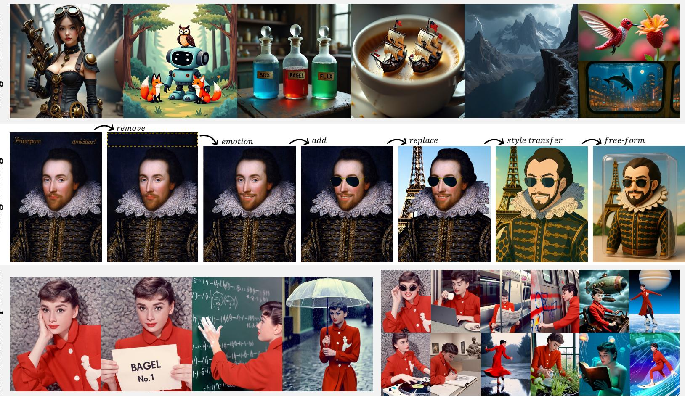
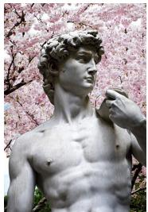
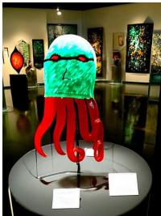
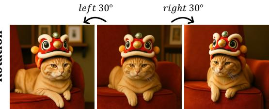
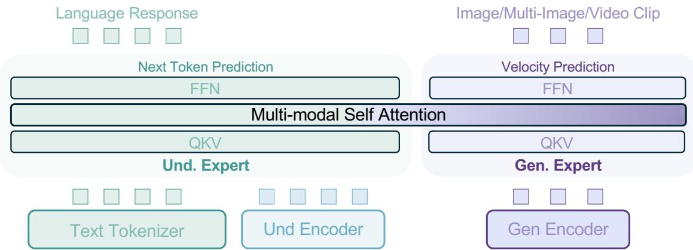
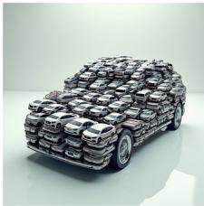
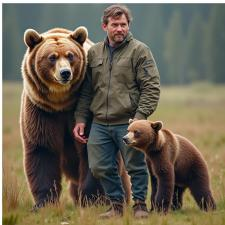
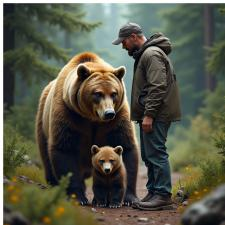

# Emerging Properties in Unified Multimodal Pretraining

Chaorui Deng\*1, Deyao ${ \pmb z } { \hslash } { \pmb u } ^ { * 1 }$ , Kunchang ${ \bf L } \breve { \bf I } ^ { * 2 \ddagger }$ , Chenhui ${ \tt G o u ^ { * 3 \ddagger } }$ , Feng Li\*4† Zeyu Wang5‡, Shu Zhong1, Weihao $\pmb { \mathsf { Y } } \pmb { \mathsf { u } } ^ { 1 }$ ,Xiaonan Nie1, Ziang Song1, Guang Shi1 Haoqi Fan\*\*

1ByteDance Seed, 2Shenzhen Institutes of Advanced Technology, 3Monash University 4Hong Kong University of Science and Technology, $^ { 5 } \mathsf { U C }$ Santa Cruz

\*Equal contribution, §Corresponding Author, †Project lead

# Abstract

Unifying multimodal understanding and generation has shown impressive capabilities in cutting-edge proprietary systems. In this work, we introduce BAGEL, an open-source foundational model that natively supports multimodal understanding and generation. BAGEL is a unified, decoder-only model pretrained on trillions of tokens curated from large-scale interleaved text, image, video, and web data. When scaled with such diverse multimodal interleaved data, BAGEL exhibits emerging capabilities in complex multimodal reasoning. As a result, it significantly outperforms open-source unified models in both multimodal generation and understanding across standard benchmarks, while exhibiting advanced multimodal reasoning abilities such as free-form image manipulation, future frame prediction, 3D manipulation, and world navigation. In the hope of facilitating further opportunities for multimodal research, we share the key findings, pretraining details, data creation protocal, and release our code and checkpoints to the community.

Date: July 29, 2025 Corresponding: shiguang.sg@bytedance.com ProjectPage: https://bagel-ai.org/

# 1 Introduction

The field of unified multimodal understanding and generation has witnessed a surge ininterest, with numerous research projects [57, 66, 68, 70, 73, 79, 83, 89] demonstrate promising results in jointly optimizing generation and understanding benchmarks with a crafted unified architecture. While several eforts [1, 11, 70] attempt to scale up their unified models, they are stil trained predominantly on image-text paired data from standard image generation and understanding tasks. Recent research [10] has revealed a substantial gap in unified multimodal understanding and generation between academic models and proprietary systems such as GPT-40 and Gemini 2.0, whose underlying techniques remain undisclosed. We argue that the key to close this gap lies in scaling with carefully structured multimodal interleaved data -integrates texts, images, videos and web sources. Our experiments reveal emerging properties as the interleaved multimodal pretraining scales up. Beyond enhancing core multimodal understanding and generation capabilities, the scaling also facilitates complex compositional abilities such as free-form visual manipulation and multimodal generation with long-context reasoning, paving the way for a broad spectrum of advanced functions.

A car made of small cars.

<think> The model should generate an image where numerous small cars are combined to form the shape and structure of a larger car. The refined prompt is: A highly detailed and creative image showcasing a large car composed entirely of numerous small cars, meticulously arranged to replicate the shape and structure of a full-sized vehicle. The small cars are tightly interlocked, creating a

seamless and realistic exterior with accurate proportions and details. The setting is neutral and clean, with soft, diffused lighting to emphasize the intricacy of the composition without any distractions… /thinb

He is surrounded by the national flower of the country that invented sushi.

<think> The user wants to replace the statue's surroundings with a scene full of cherry blossoms, while keeping the main body of the statue unchanged. First, I have to make sure the details of the statue, such as muscle lines, facial expressions, and clothing folds, remain clear and complete. Next, cherry blossom elements need to be added around the statue to make it conform to the setting of 'the national flower of the country that invented sushi'. The cherry blossoms... </think>

Could you display the sculpture that takes after this design?

<think> The question_image shows a design of an octopus created by a child named Blake W. Torney, aged 10, titled "The Octopus." The description mentions that the sculpture was made in 2008 by Dante Marioni, an American glass artist born in 1964, using blown and hot-sculpted glass with applied bits. The sculpture is part… The question_text asks to display the sculpture that takes after this design. Based on the description, the final answer image should feature the actual glass sculpture created by Dante Marioni, which reflects the design of the child's drawing. The sculpture should have a green body with red tentacles, similar to the child's depiction.…. </think>

  
Figure 1 Showcase of the versatile abilities of the BAGEL model.

To realize this vision, we established a new protocol for scalable data sourcing, fltering, and construction of high-quality multimodal interleaved data. In addition to the web source, we incorporate video data that naturally provides pixel-level, conceptual, temporal, and physical continuity, which offers exclusive signals essntial or acquiri roundedword knowledgeat scaleMoreover, urinterleave ormatherentl icludes tasks such as multimodal conversation, text-to-image/video, and image manipulation, enabling seamless integration of diverse generative data. Inspired by DeepSeek-R1 [26], we further enrich the interleaved data with reasoning-oriented content t facilitate multi-modal reasoning which enables seamless knowledge transfer between understanding and generation processes. As a result, the curated data captures rich world knowledge and nuanced cross-modal interaction content, equipping models with foundational capabilities in in-context prediction, world modeling, and complex multimodal reasoning.

Regarding architecture design, our primary objective is to maximize the capacity of the model without uskei o this design philosophy, we adopt a Mixture-of-Transformer-Experts (MoT) architecture that employs selective activation of modality-specific parameters. Unlike some prior approaches [18, 57, 69, 73] that introduce bottleneck connectors between generation and understanding modules, our design enables long-context interaction between multimodal understanding and generation through shared self-attention operations. This bottleneck-ree desig enable effectiv scaling of trainig dataand steps, alwing the model's fulcapacy signals to emerge without being hindered or obscured by architectural constraints.

We present the Scalable Generative Cognitive Model (BAGEL), an open-source multimodal foundation model with 7B active parameters (14B total) trained on large-scale interleaved multimodal data. BAGEL outperforms the current top-tier open-source VLMs [4, 12] on standard multimodal-understanding leaderboards, and delivers text-to-image quality that is competitive with leading public generators such as SD3 [19] and FLUX.1- dev [35]. Moreover, BAGEL demonstrates consistently superior qualitative results in classical image-editing senaris than the leading open-source models More iportantly, itextends to free-formvisualmanipulation, multiview synthesis, and world navigation, capabilities that constitute "world-modeling" tasks beyond the scope of previous image-editing models. We showcase the qualitative performance in Figure 1.

As BAGEL scales with interleaved multimodal pre-training, we observe a clear emerging pattern: basic multimodal understanding and high-fidelity generation converge first; next, complex editing and free-form vslmanulatibilurfaealy l-cone sni arbenmultimaldestan and generation, suggesting that previously independent atomic skills synergize into compositional reasoning across modalities. These emerging capabilities are not only supported by public benchmarks but are more distinctly revealed in our proposed InteligentBench, and further verified by qualitative observations. These observations highlight that, while the optimization landscapes for understanding and generation remain partiay decope theycanbe jontyporev shareeattenti contet ithisingranorm model, yielding a rich spectrum of capabilities in an open-source system.

# 2 Model

As illustrated in Figure 2, BAGEL adopts a MoT architecture comprising two transformer experts—one dedicated to multimodal understanding and the other to multimodal generation. Accordingly, the model employs two separate visual encoders: an understanding-oriented encoder and a generation-oriented encoder. The two transormer experts operates n the same token sequence through the shared sel-attention operation at every layer. When predicting text tokens, BAGEL follows the Next-Token-Prediction paradigm, adhering to the well-established strengths of autoregressive language models. For visual token prediction, BAGEL adopts the Rectifed Flow [19, 41, 45] method following the best practice in the field of visual generation. In the remainder of this section, we share the insights and motivations that shaped these design choices.

# 2.1 Model Design Space

Typical design choices for unified multi-modal generation and understanding models include:

  
Figure  We use woTransformer experts to proces understanding and generation inormation, and all tokes do sharemultmodal seattention acTransormerblock.Wedopt tistincencoders  eparately apue semantic content and low-level pixel information for image understanding and generation tasks.

Quantized AR. Autoregressive visual generation [11, 48, 59, 70, 79, 8385, 90] with discrete visual tokenizers [31, 36, 51, 94]. This line of methods leverage the Next-Token-Prediction paradigm for both text and visual token generation, which is straightforward to implement as it can directly utilize existing LLM infrastructures. Unfortunately, the visul generation qualityof autoregressive models isempiricallyinferir to diffusion-base models. Furthermore, inference latency suffers due to the sequential nature of the autoregressive approach.

External Diffuser. LLM backbone combined with an external diffusion module [18, 23, 57, 69, 73]. This design connects pre-trained LLMs/VLMs to diffusion models via lightweight, trainable adapters. Typically, the language backbone autoregressively generates a set of latent tokens as "semantic condition" signals, which are then employed by the diffusion module to generate images. This setup often exhibits rapid convergence with minimal data consumption and may also yield competitive performance [57] on established benchmarks for multi-modal generation and understanding. Its primary drawback, however, is the compression of the LLM context into a relatively small number of latent tokens. This introduces an explicit bottleneck between understanding and generation modules, risking substantial information loss—particularly in long-context multimodal reasoning. Such a constraint might contradict the scaling philosophy of large foundational models.

IntegratedTransormer. Unifeintegration LLM and diffusion model within singlranormer [40,50, 6, 104]. Driven by the complementary strengths of autoregressive transformers (powerful understanding/reasoning ability) and difusion transformers (strong visual generation ability), this approach uses their common model architecture to enable seamless switching between both paradigms. Compared to the External Diffuser solution, it demands substantially highertraining compute. Nonetheless, i offers a significant advantage y maintainingabottleneckree contextthroughout all tranormerblocks,thereyenabliglossless iteactin between the generation and understanding modules and is more amenable to scaling.

In this work, we argue that unified models have the capacity to learn richer multi-modal capabilities from large-scale interleaved multi-modal data—emergent abilities that are not captured by traditional benchmarks. To this end, we choose the bottleneck-free Integrated Transformer solution, which we believe to have greater potential in large-scale training settings and may better serve as the foundation model for long-context multimodel reasoning as well as reinforcement learning.

# 2.2 Architecture

Our backbone model is inherited from an LLM with a decoder-only transformer architecture. We choose Qwen2.5 LLM [93] as the initialization for its superior performance [21] and public availability. It adopts RMSNorm [98] for normalization, SwiGLU [65] for activation, RoPE [67] for positional encoding, and GQA [2] for KV cache reduction. Moreover, we add the QK-Norm [15] in each attention block following the common practice in image/video generation models [19, 35, 63], which is effective in stabilizing the training process.

The visual information is represented from two aspects:

•For visual understanding, we leverage a ViT encoder to convert the raw pixels into tokens. We adopt SigLIP2-so400m/14 [75] with a fixed 384-resolution as the initialization of the ViT encoder. Building upon this, we first interpolate the position embedding and set $9 8 0 \times 9 8 0$ as the maximum input size, and then integrate NaViT [16] to enable processing of images at their native aspect ratios. A two-layer MLP connector is adopted to match the feature dimension of the ViT tokens and the LLM hidden states. •For visual generation, we use a pre-trained VAE model from FLUX [35] to convert images from pixel space to latent space and vice versa. The latent representation has a downsample ration of 8 and a latent channel of 16, and is then processed by a $2 \times 2$ patch embedding layer to reduce the spatial size and match the hidden dimension of the LLM backbone. The VAE model is frozen during training.

Our framework applies 2D positional encoding to both ViT and VAE tokens prior to their integration into the LLM backbone. For diffusion timestep encoding, we follow [17] and add a timestep embedding directly to the initalhidden states ofVAE tokens, instead ofusing AdaLN asin conventional diffusion transormers [19, 35, 82]. This modifcation preserves performance while yielding a cleaner architecture. Within the LLM, the text, ViT, and VAE tokens from understanding and generation tasks are interleaved according to the modality structure of input. For tokens belonging to the same sample, we employ a generalized version of the causal attention mechanism. These tokens are first partitioned into multiple consecutive splits, each containing tokens from a single modality (e.g., either text, ViT, or VAE). Tokens in one split may attend to all tokens in preceding splits. Inside each split, we adopt causal attention on text tokens, and keep the bidirectional attention on vision tokens.

# 2.3 Generalized Causal Attention

During training, an interleaved multimodal generation sample may contain multiple images. For each image, we prepare three sets of visual tokens:

•Noised VAE tokens: VAE latents corrupted with diffusion noise, used exclusively for Rectified-Flow training; the MSE loss is computed on this set.   

Clean VAE tokens: the original (noise-free) latents, which serve as conditioning when generating subsequent image or text tokens.   

Vi tokens: obtained from the SigLIP2 encoder, which help to unify the input format across interleaved generation and understanding data and, empirically, to boost interleaved-generation quality.

For interleaved image or text generation, subsequent image or text tokens may attend to the clean VAE token and ViT tokens of preceding images, but not to their noised VAE counterparts.

For interleaved multi-image generation, we adopt the diffusion forcing strategy [8], which adds independent noise levels to different images and conditions each image on noisy representations of preceding images. Additionally, to enhance generation consistency, we randomly group consecutive images following [17] and apply full attention within each group. The noise level is the same inside each group.

We implement the generalized causal attention with PyTorch FlexAttention [72], achieving a ${ \sim } 2 \times$ speed-up ove naive scaled-dot-product attention.Duringinference,the generalized causal structureallows us tocache key-value (KV) pairs of the generated multimodal context and thus accelerate multimodal decoding. Only the KV pairs of clean VAE tokens and ViT tokens are stored; once an image is fully generated, the corresponding nis Atokes thentex replace yheceerpars.Tb ssa [] in interleaved inference, we randomly drop text, ViT, and clean VAE tokens with probabilities 0.1, 0.5, and 0.1, respectively. An illustration of the generalized casual attention is shown in Figure 15.

# 2.4 Transformer Design

Following the principle of the Integrated Transformer solution, we compare several transformer variants: the standard Dense Transformer, a Mixture-of-Experts (MoE) transformer, and a Mixture-of-Transformers (MoT) architecture.

  
Figure 3 Loss curves of various designs.CE loss and MSE loss arecomputed on multimodal understanding and etin sk epetivyblati expermt  ca 5 LThe splnrator and understanding data is set at 4:1.

•MoE variant: we duplicate only the feed-forward network (FFN) in each Qwen2.5 LLM block as th initialization of the generation expert.

MoT variant: we duplicate all trainable parameters of Qwen2.5 LLM to create a full-size generation expert. This type of architecture has been adopted by existing works [40, 66].

Both MoE and MoT in our model use hard routing: the newly replicated generation expert exclusively processes VAE tokens, while the original parameters—the understanding expert—handle text and ViT tokens, following the strategy of the Qwen-VL series [4, 77]. Although the MoE and MoT architectures increase the total parameter count by approximately twofold compared to the dense baseline, all three model variants have identical FLOPs during both training and inference.

We conduct a controlled experiment on 1.5B Qwen-2.5 LLM, maintaining identical hyper-parameters and data congurations solatheranormer architecturs the levariablesustratediigur the MoT variant consistently outperforms both the dense and MoE designs, with the gap being most pronounced on the multimodal generation task. The MSE loss (generation) exhibits a smooth, monotonically decreasing trajectory, where MoT not only converges fastest but also attains the lowest final loss. In contrast, the CE loss (understanding) exhibits greater step-to-step fuctuations—an expected consequence of interleaving heterogeneous data—yet MoT still maintains the best performance in general. These findings highlight the clear advantage of decoupling the parameters devoted to generation from those optimized for understanding, which suggests the two objectives may steer the model toward distinct regions of the parameter space—at least at the 1.5B scaleexamined here. In short, allocating separate capacity for multimodal understanding and generation can mitigate optimization challenges arising from competing modality-specic learning objectives.

# 3 Data

As data define the knowledge boundaries of large foundational models, BAGEL is trained on a diverse set of datasets spanning multiple modalities—including language, image, video, and web data—enabling it to perform multimodal reasoning, in-context prediction, physicaldynamics modeling, andfuture frame prediction, all through a unified multimodal interface. In addition to standard vision-language (VLM), text-to-image (T2I), and large-scale language modeling (LLM) datasets, we build new vision-text interleaved datasets from web and videosources to further enhance the model's ability for sequential multimodal reasoning. In Table , we summarize the scale and composition of our training data across different modalities. In the following sections, we detail our dataset sources, preparation protocols, and data mixing strategies.

<table><tr><td>Data Source</td><td># Data (M)</td><td># Tokens (T)</td></tr><tr><td>Text Data</td><td>400</td><td>0.4</td></tr><tr><td>Image-Text-Pair Understanding Data</td><td>500</td><td>0.5</td></tr><tr><td>Image-Text-Pair Generation Data</td><td>1600</td><td>2.6</td></tr><tr><td>Interleaved Understanding Data</td><td>100</td><td>0.5</td></tr><tr><td>Interleaved Generation Data: Video</td><td>45</td><td>0.7</td></tr><tr><td>Interleaved Generation Data: Web</td><td>20</td><td>0.4</td></tr></table>

TabDa tatisc BAG dateany pr pe-rai, eatas   o directly correspond to the total number of seen tokens. Multimodal interleaved data is highlight ingray.

# 3.1 Text Only Data

To maintain the language modeling capabilities of the underlying LLM, we supplement our training corpus with a collection of high-quality text-only data.The data arecurated to support broad lnguistic coverage and enable strong reasoning and generation abilities across general-purpose text tasks.

# 3.2 Vision-Text Paired Data

Text-image paired data plays a central role in multimodal learning, providing large-scale visual supervision for both vision-language models (VLMs) [37, 77] and text-to-image (T2I) generation [5, 35, 58, 62]. In our setup, we organize vision-text paired data into two subsets based on their downstream usage: one for VLM pre-training and one for T2I generation.

VLM Image-Text Pairs. We utilize large-scale image-text pairs for VLM training, covering a broad range of visual concepts and primarily sourced from web alt-text and captions. The data have undergone CLIP-based similarity fltering, resolution and aspect ratio constraints, text length checks, and deduplication to ensure quality and diversity. To address long-tail distributions, concept-aware sampling is applied to improve coverage of rare categories. In addition, structured supervision from OCR documents, charts, and grounding annotations is included to enhance the model's capabilities in reading and spatial understanding.

T2l mage-Text Pairs. We incorporate high-quality image-text pairs, as well as minimal synthetic data from existing T2I models [19, 35]. These data feature not nly diverse caption styles suc as artistic, textual, and surrl captions, but alsohigh-qualiy mages thatarelteredor carity, sructural integriy, andsnc diversity.Together, these examples ehance the visual quality and stylistic variety o our T2I training corpus.

# 3.3 Vision-Text Interleaved Data

While vision-text paired data provides useful supervision, it falls short in supporting complex in-context reasoning involving multiple images and intermediate text. Models trained on such data often struggle to capture visual and semantic relationships across modalities, resulting in less coherent generations. To adress these limitations, we incorporatelarge-scalevision-tex interleaved data into training.Foriproving multimodal understanding, we utilize VLM interleaved datasets. For visual generation, we introduce a unifed protocol for constructing vision-text interleaved data by combining diverse sources to support richer multimodal interactions, as detailed below.

# 3.3.1 Data Source

To comprehensively cover diverse ra-worl scenarios with scalable data supply, ourtraining corpus interates two primary sources that provide sufficient knowledge for multimodal reasoning: video data and web data.

Video data offers rich world knowledge by capturing temporal and spatial dynamics directly from the real world—the largest and most natural simulator. It preserves fine-grained visual details, maintains identity consistency across fames, and models cmplex motion, making it particularly efective r tasks such as age editing, navigation, and 3D manipulation. We construct our video dataset using publicly available online video resources, as well as two open-source datasets: Koala36M [78], which provides large-scale instructional and interaction-rich content, and MVImgNet2.0 [28], which contains objects captured from varying camera viewpoints to support multi-view spatial understanding.

Table Quality filtering rules are applied to web documents, with each filter type accompanied by specific filtering threshold or method.   

<table><tr><td>Filter Type</td><td>Description</td></tr><tr><td>UI removal</td><td>Remove images whose URLs contain substrings such as icon or widget</td></tr><tr><td>Resolution</td><td>Require width and height within [150, 20000], and aspect ratio within [1/2, 2]</td></tr><tr><td>Image clarity</td><td>Remove blurry or low-quality images using a clarity operator</td></tr><tr><td>Text density</td><td>Discard document-style images with over 100 OCR-detected text tokens</td></tr><tr><td>Relevance</td><td>Remove redundant or irrelevant images based on CLIP similarity</td></tr><tr><td>Doc. trimming</td><td>Remove unrelated headers and footers via an LLM</td></tr><tr><td>Image quantity</td><td>Keep documents with 38 images for balanced context</td></tr></table>

Web data captures complex real-world multimodal structures and offrs diverse knowledge spanning a wide raisIncatuaytv s  latnperiestep visual tutorials, and other richly grounded documents. This interleaved format offers rich supervision for training models to perform multimodal reasoning. We build upon OmniCorpus [39], a large-scale dataset preprocessed from Common Crawl [14], which provides a vast collection of web documents with interleaved text and images. We additionally include open-source image editing datasets as structured interleaved data [3, 22, 32, 80, 88, 101], which teach fine-grained editing behaviors and enhance the model's ability for precise multimodal reasoning and step-by-step generation.

# 3.3.2 Data Filter

Data Filtering for Video Data. We follow T2V video processing pipelines [63] protocol to preprocess videos inohigh-qualyrang cips hrou temporal splittin, spatil cropping and qualy lteringVides re first segmented into short, coherent clips using lightweight shot detection, with related segments optionally merged based on visual similarity. We then remove black borders and overlays such as logos or text using crop detection and framelevel boundin box aggregation.To ensure quality, we flter clips by length, resoution, clarity, and motion stability, and deduplicate using CLIP-based similarity. This process yields a clean and diverse video dataset suitable for multimodal training.

DaFiergr We DatToatehig-ualitereavedatromargecorpu ede fltering pipeline targeting documents such as tutorials, encyclopedic entries, and design content, where text and images exhibit strong semantic alignment. Inspired by DeepSeekMath [64], we first apply a lightweight topic selection process: LLMs are prompted to classify a small subset of documents, and the resulting labels are used to train fastText [34] classifers for effcient large-scale inference. The selected data are then passd throug the LLM classifer again for fine-grained filtering. We adopt the 14B variant of Qwen2.5 models [93] for its balance of performance and efficiency. To further improve data quality, we apply a set of rule-based filters targeting image clarity, relevance, and document structure, as summarized in Table 2.

# 3.3.3 Data Construction

Interleaved Data from Videos. To construct image-text interleaved sequences from video, we generatetextual descriptions of visual changes between consecutive frames—capturing object motion, action transitions, and scene shifts. These inter-frame captions serve as temporal supervision for learning visual dynamics. While large VLMs can produce high-quality change descriptions, their inference cost limits scalability. We instead distill a lightweight captioning model based on Qwen2.5-VL-7B [4], finetuned on a small set of high-quality interrame examples. To reducehallucination, we cap the caption length at 30 tokens. For each video clip, we sample an averageof four fames and generate captions or each frame pair, resulting in 4 million temporally grounded interleaved sequences. Figure 4a illustrates the data pipeline along with an example.

Interleaved Data from Webs. To construct high-quality interleaved sequences from web documents, we aim to reduce the difficulty of image generation caused by weak alignment between images, their accompanying text, and surrounding visual context. To provide more localized and relevant cues for each image, we adopt a caption-first strategy: for each image, we generate a concise description using Qwen2.5-VL-7B [4] and insert it directly before the image as a conceptual scaffold. This enables the model to form a conceptual dra o

(a) Data pipeline for interleaved data from videos.

  
Furnteavatconstruction s.)Wensrucnteeavevodat reron feoheialy ts  l stil alarge LM.) For web data, we build n Omniorpus [39] and perfor a two-stage topic selection ollowed by qualiterng n captioning o produc trucure sequnce. Data example from bot pipelines are hown.

  
(b) Data pipeline for interleaved data from webs.

the target image-grounded in both preceding context and the inserted caption—before generating it. By generating the caption to guide what the model should expect in the image, this approach mitigates issues caused by loosely related or ambiguous inputs. Additionally, we rewrite inter-image text segments exceeding 300 tokens using an LLM summarizer to improve contextual density. These steps yield a cleaner and more structured dataset of 20 million interleaved web documents. Data pipeline andexamples is showninFigure b.

# 3.3.4 Reasoning-Augmented Data

Inspired by recent models like O1 [33] and DeepSeek-R1 [26], we leverage long-context Chain-of-Thoughts data for multimodal understanding. Moreover, we hypothesize that introducing a language-based reasoning step before image generation helps clarify visual goals and improve planning. To explore this, we construct 500k reasoning-augmented examples, covering four categories based on the structural relation between input and output: text-to-image generation, free-form image manipulation, and abstract edits.

Text-to-lmage generation. We begin by manually crafting a set of brief and ambiguous T2I queries, each paired with simple generation guidance. Using in-context learning, we prompt Qwen2.5-72B [93] to generate additional query-guidance pairs and corresponding detailed prompts, which are then passed to FLUX.1-dev [35] to produce target images. This process yields training triplets of query, reasoning trace (guidance $^ +$ detailed prompt), and image, enabling models to ground image generation in language-based reasoning.

Free-form image manipulation. We generate reasoning-augmented examples by prompting a VLM with the source image, target image, user query, and a reasoning trace example from DeepSeek-R1 [26]. The R1 exampe eratey ondtiinthe soucnarge aptionsuser query nreasoinstr. The VLM prompt for the reasoning trace generation is demonstrated in Table 11 and Table 12. We sample source and target image pairs primarily from two sources: open-source editing datasets such as OmniEdit [80], and interleaved video data, which provide a rich set of naturally occurring edit scenarios characterized by substantial motion, viewpoint variations, and human interactions while preserving spatial-temporal coherence.

Conceptual Edits. Conceptual edits target cases where image manipulation requires high-level conceptual reasoning rather than simple local pixel modifications, such as transforming an object into a design sketch. For these tasks, we use the web interleaved dataset, sampling candidate image pairs from each sequence and applying a three-stage VLM pipeline to construct high-quality QA examples. First, given a sequence of images, we prompt the VLM to identify a plausible input-output pair. Next, we prompt the model to generate a corresponding textual question based on the selected pair. Finally, we use the VLM to assess the quality of the question and is algmet with the input andoutput mages, fterng ut low-quality examples.Accepted examples are then passed to the VLM, prompted with a reasoning trace example from DeepSeek-R1 [26], to produce grounded explanations of the intended transformation, as shown in Table 13. This setup helps the model learn to interpret complex visual goals from diverse textual instructions.

# 4 Training

As shown in Table 3, we adopt a multi-stage training strategy using a dynamic mixture of the curated data described above—specifically, an Alignment stage for initializing the VLM connector, a Pre-training stage for large-scale pre-training, a Continued Trainin stageforincreased resolution and interleaved data ratio, and a Supervised Fine-tuning stage for high-quality fine-tuning:

•Stage: Alignment. In this stage, we align the SigLIP2 ViT encoder with the Qwen2.5 LLM by training only the MLP connector while keeping the vision encoder and the language model frozen. Only imagetext pair data are used during this stage to perform image captioning, where each image is resized to a fixed resolution of $3 7 8 \times 3 7 8$ to match the input size of the pre-trained SigLIP2.

•Stage: Pre-training (PT). During this stage, we add QK-Norm to the LLM and all model parameters except those of the VAE are trainable. The training corpus comprises 2.5T tokens, consisting of text, image-text pairs, multimodal conversation, web-interleaved, and video-interleaved data. We adopt a native-resolution strategy for both multimodal understanding and generation, with restrictions on the maximum long side and minimum short side of each image.

Stage: Continued Training (CT). Compared with PT, we increase the visual input resolution in the CT stage, which is important for both multimodal generation and understanding performance. We further strategically increase the sampling ratio of interleaved data to emphasize learning cross-modal reasoning, as the model's core understanding and generation capabilities become more stable and reliable. The CT stage consumes approximately $2 . 6 \mathrm { T }$ tokens.

•Stage: Supervised Fine-tuning (SFT). In the SFT stage, for multimodal generation we construct a high-quality subset from the image-text-pair dataset and the interleaved-generation dataset. For multimodal understanding, we filter a subset from the LLaVA-OV [37] and Mammoth-VL [27] instruction-tuning data. The total number of training tokens at this stage is 72.7billion.

Table 3 Training recipe of BAGEL. Multimodal interleaved data is highlight ingray   

<table><tr><td></td><td>Alignment</td><td>PT</td><td>CT</td><td>SFT</td></tr><tr><td>Hyperparameters Learning rate LR scheduler Weight decay</td><td colspan="4">1 × 10−3 1.0 × 10−4 Cosine Constant 0.0 0.0 AdamW (β1 = 0.9, β2 = 0.95,  = 1.0 × 10−15)</td></tr><tr><td>Gradient norm clip Optimizer Loss weight (CE : MSE) Warm-up steps Training steps EMA ratio Sequence length per rank (min, max) # Training seen tokens Max context window Gen resolution (min short side, max long side) Und resolution (min short side, max long side) Diffusion timestep shift</td><td>1.0 - 250 5K - (32K, 36K) 4.9B 16K - (378, 378)</td><td>1.0 0.25 : 1 2500 200K 0.9999 (32K, 36K) 2.5T 16k (256, 512) (224, 980) 1.0</td><td>0.0 1.0 0.25 : 1 2500 100k 0.9999 (40K, 45K) 2.6T 40k (512, 1024) (378, 980)</td><td>0.0 1.0 0.25 : 1 500 15K 0.995 (40K, 45K) 72.7B 40k (512, 1024) (378, 980)</td></tr><tr><td>Data sampling ratio Text Image-Text pair (T2I) Image-Text pair (I2T)</td><td>0.0 0.0 1.0</td><td>0.05 0.6 0.1</td><td>4.0 0.05 0.4</td><td>4.0 0.05 0.3</td></tr><tr><td>Interleaved understanding Interleaved generation: video Interleaved generation: web</td><td>0.0 0.0 0.0</td><td>0.1 0.1 0.05</td><td>0.1 0.15 0.15</td><td>0.05 0.2 0.2</td></tr></table>

  
Figu5 Los crves  iffent dataratis.blai expt ar  ut  .5B LLM. "gumen that the sampling ratio for generation and understanding data is set at 1:1.

  
Figure 6 Loss curves of different learning rates. Ablation experiments are carried out on a 1.5B LLM. The sampling ratio for generation and understanding data is set at 1:1.

For all training stages, we use the AdamW [47] optimizer with $\beta _ { 1 } = 0 . 9$ , $\beta _ { 2 } = 0 . 9 5$ .Inspired by [52], we set $\epsilon = 1 . 0 \times 1 0 ^ { - 1 5 }$ to suppress oss pikes. When icrasing the reolutionor geeration, we also increa e diffusion timestep from 1.0 to 4.0 to ensure a proper noise-level distribution. We adopt a constant learning rate for the PT, CT, and SFT stages so that we can easily scale the training data without restarting the training process [30]. To ensure load balance among different ranks, we pack the sequences on each rank into a narrow length range (32K to 36K tokens for Alignment and PT, 40K to 45K tokens for CT and SFT).

Unlike the pre-training of standalone VLMs or T2I models, unified multimodal pre-training requires careful tuning of two key hyper-parameters—the data-sampling ratio and the learning rate—to balance signals from understanding and generation tasks. Below, we describe the empirical insights that guided these choices, which in turn shaped the training protocol summarized in Table 3.

# 4.1 Data Sampling Ratio

To choose the sampling ratios for each data source during unified pre-training, we conducted a series of controlled studies on the 1.5B Qwen2.5 LLM [93] by adjusting the proportion of multimodal generation data versus multimodal understanding data.As shownin Figure , increasing the sampling ration of generation data from $5 0 \%$ ("1g1u") to $8 0 \%$ ("4g1u") steadily reduces the MSE loss, results in a $0 . 4 \%$ absolute reduction—a considerable margin for rectified-fow models in practice. In contrast, the cross-entropy (CE) loss exhibits no consistent pattern across sampling ratios; the largest observed gap, 0.07 at step 14,000 between $" \mathrm { 4 g 1 u " }$ and $" 2 \mathrm { g } 1 \mathrm { u } "$ , has negligible impact on downstream benchmarks. These findings suggest that generation examples should be sampled substantially more often than understanding examples—a heuristic we adopt throughout the training protocol summarized in Table 3.

# 4.2 Learning Rate

We next carried out a controled experiment identical to the setup in Section 4.1 except for the learning-rate setup. As shown in Figure 6, the two losses behave oppositely: a larger learning rate makes the MSE loss converge faster, whereas a smaller learning rate benefits the CE loss. To reconcile this trade-of, weassign separate weighting factors to the two objectives, as listed in Table 3.

# 5 Evaluation

To comprehensively evaluate a unified model, we draw on established benchmarks that target well-defined skills such as multimodal understanding, T2I generation, and classical image editing. Yet for capabilities that demand strong multimodal reasoning and complex task composition, effective evaluation strategies are sill lacking In thefollowig werst illustrate the availabl becmarks use duriourvaluatin s, and then introduce a new evaluation suite for free-form image manipulation (including conceptual editing), designed to reveal a model's proficiency in multimodal reasoning and complex compositional tasks.

Multimodal understanding. We adopt six widely used benchmarks—MME [20], MMBench (1.0-EN) [46], MMVet [96], MMMU [97], MathVista [49], and MMVP [74]. Collectively they offer a concise but comprehensive testbed that spans perception, cognition, and multimodal reasoning, while retaining strong discriminative power for ranking state-of-the-art models.

Text-to-Image generation. We follow [11, 57] and report results on the popular GenEval [25] benchmark. We also adopt the recently proposed WISE benchmark [53], which offers a comprehensive assessment of complex semantic understanding and world-knowledge integration in text-to-image generation. In addition, we include qualitative comparisons with state-of-the-art models as a complement to these automatic evaluation metrics.

Imae Editing. We adopt GEdit-Bench [44] as our primary evaluation suite owing to its real-world relevance and diverse set of editing tasks. Built from authentic user requests scraped from the web, GEdit-Bench closely mirrors practical editing needs. Performance is scored automatically with GPT-4.1 [54], and we also supplement these scores with qualitative examples to provide a more nuanced assessment.

Intelligent mageEditng.We proposeIntelligentBencas a proxy task or the evaluation ofree-formge manipulation ability, which requires complex multimodal reasoning and task composition. The initial release of IntelligentBench comprises 350 examples, each consisting of a question image, question text, and a reference answer image. Evaluation is performed using GPT-4o (version: gpt-4o-2024-11-20), which reviews a complete quadruplet—the question image, question text, reference answer image, and the model-generated image. The evaluation criteincluderequstfulflment,visaconsencyand knowlederonde creativity,ree the benchmark's focus on both task correctness and the depth of reasoning.Each answer is scored on ascale from 0 to 2. The final score of a model is calculated by summing all individual scores and normalizing the total to a 100-point scale. The detailed evaluation prompt is provided in Appendix Table 14. With the help of IntelligentBench, we can evaluate how well the model performs reasoning and integrates world knowledge for image editing. Some showcases and qualitative results on InteigentBench can be found in Figure 12.

# 6 Emerging Properties

Emerging properties have been studied extensively in the context of large visual or language models [7, 81]. In this work, situated within the scope of unifed multimodal foundational models, we adopt a more focused definition for emerging properties:

An ability is emerging if it is not present in earlier training stages but is present in later pre-trainings.

This qualitative shit, often referred to as a phasetransition, denotes a sudden and dramaticchange in ode behavior that cannot be predicted by extrapolating from training loss curves [81]. Interestingly, we observe the similar phenomenon in unified multimodal scaling, where loss curves do not explicitly signal the emergence of new capabilities. Therefore, we investigate the emergence of model capabilities by evaluating performance across a range of tasks on historical checkpoints. Specifically, we report the average performance on standard VLM benchmarks as a proxy for multimodal understanding, the GenEval score for generation ability, and the GEdit score and IntelligentBench score to assess the model's capability in naive and complex multimodal reasoning, respectively.

  
(a) Average score on Image Understanding tasks.

  
(b) GenEval score on Image Generation task

  
(d) IntelligentBench Score on Intelligent Editing task.

(c) GEdit Overall Score on classical Image Editing task

Figure 7 Emerging curves. Pre-training performance curves of BAGEL on different tasks. The lighter region rol aihearkiluAGEL demonstrates consistent performance improvements as the number of training tokens increases. The relationship betwee performance and training scale can be summarized as follows:i) BAGEL continues to improve across varsaskimoraitokens;Differentcaabili eret feent e—uetand copleihasksAdoptig both Aand ates ras usg A eatus alon inanonex ratoThevernandsor spute of the scores from MME-S, MMBench, MMMU, MMVet, MathVista and MMVP. All performance evaluations are conducted with BAGEL's thinking mode disabled.

Interestingly, different asks dmnstratedistinct learningyamic an saturation behaviors. I wechoo the number of seen tokens required to reach $8 5 \%$ of peak performance as an indicator, as noted in Figure 7, we find that conventional understanding and generation benchmarks saturate relatively early: at approximately 0.18T and 0.68T tokens, respectively. In contrast, editing tasks, which require both understanding and generation capabilities, exhibit slower convergence, reaching $8 5 \%$ performance only after 2.64T tokens.

Most notably, the Intelligent Edit task—designed to eliminate naive edit cases and emphasize on complex multimodal reasoning—requires 3.61T tokens to reach 85%, demonstrating a pattern akin to emergent behaviors described in [81]. In this setting, the model showsinitialy low performance that improves gradually and significantly after the 3T seen tokens. While traditional editing tasks remain largely unaffected by the resolution increase at 3T tokens, Intelligent Editing performance keeps improving significantly—from 15 to 45—tripling in later training stages and underscoring its dependence on unified multimodal reasoning. We frtr n that nderstandiabily prticulary isal inpu, playsritial olemultil re removing the ViT tokens has minimal impact on GEdit-Bench but causes a $1 6 \%$ drop in Intelligent Edit, highlighting the importance of visual-semantic reasoning in complex editing tasks.

  
FigureComparison of models with different amounts o training tokens. W present cases Text-o-mage generation and image editing.

While evaluation metri ma ot inearycaptur themode tru apabils—potentally leading t suus sins of emergence, albeit unlikely—we further examine qualitative emerging behavior by inspecting generation outputs across different training checkpoints.As illustrated in Figure 8, we observe trends consistent with the performance curves: generation quality is already strong before 1.5T seen tokens , with a small quality improvement after $3 . 0 \mathrm { T }$ seen tokens when trained with higher resolution. For text rendering, the ability to generate correct spell of "hello" and "BAGEL" emerge later—around 1.5T to 4.5T tokens.

The emergingbehavior isalsoobserved inthe qualitative visualization  Intelligent Editing task inFiur Unlike traditional editing shown in Figure 8, which involves only partial modifications to the input image, Intelligent Editing often requires generating entirely new concept based on multimodal reasoning. Prior to 3.5T tokens, the model tends to reproduce the input image with minimal changes—a fallback strategy when the task is not fully understood. However, after seeing 3.5T tokens, the model begins to demonstrate clear reasoning, producing coherent and semantically appropriate edits, aligning with the emergent behavior seen in Figure 7.

# Questions

Could you display what this knitting project looks like completed?

What is the appearance of the location under night lighting?

Can you share an image of this character looking surprised?

Could you put some toppings on these cupcakes for me?

Could you display the rear of this gown?

Could you display the smoothie once it's blended?

What method helps in adding this batter to donut molds?

  
Figurarionme w iffenntatkr ig that requires strong multimodal reasoning abilities.

Is there an image of the collar being worn on a model?

Can you show me a detailed view of the car's rear engine?

# 7 Main Results

In this section, we present both quantitative and qualitative evaluations to examine the diverse multimodal capabilitiesof BAGEL. We begin with basicabilities on established benchmarks, including image understanding in Section 7.1 and image generation in Section 7.2. We then report performance on existing image editing benchmarks and IntelligentBench in Section 7.3. In Section 7.4, we explore generation and editing with explicit reasoning. In this setting, BAGEL is allowed to generate intermediate thinking steps before final outputs. We find that such reasoning significantly enhances performance. Finally, in Section7.5, we provide qualitative visualizations that showcase BAGEL's world modeling abilities, including world navigation and video generation.

# 7.1 Image Understanding

Table 4 Comparison with state-of-the-arts on viusal understanding benchmarks. MME-S refers to the summarization of MME-P and MME-C. For MoE models, we report their activate params / total params. $^ \dagger$ MetaQuery [57] adopts pre-trained model from Qwen2.5-VL [4] and freezes it during training. $^ { * * }$ : Partial results are from by MetaMorph [73] or MetaQuery [57].   

<table><tr><td>Type Model</td><td></td><td># LLM Params MME-P MME-S↑ MMBench↑ MMMU↑ MM-Vet↑ MathVista↑ MMVP↑</td><td></td><td></td><td></td><td></td><td></td><td></td><td></td></tr><tr><td rowspan="12">h </td><td>InternVL2 [13]</td><td>1.8B</td><td>1440</td><td>1877</td><td>73.2</td><td>34.3</td><td>44.6</td><td>46.4</td><td>35.3</td></tr><tr><td>InternVL2.5 [12]</td><td>1.8B</td><td>-</td><td>2138</td><td>74.7</td><td>43.6</td><td>60.8</td><td>51.3</td><td>-</td></tr><tr><td>Qwen2-VL[77]</td><td>1.5B</td><td>-</td><td>1872</td><td>74.9</td><td>41.1</td><td>49.5</td><td>43.0</td><td></td></tr><tr><td>Qwen2.5-VL[4]</td><td>3B</td><td>-</td><td>2157</td><td>79.1</td><td>53.1</td><td>61.8</td><td>62.3</td><td></td></tr><tr><td>BLIP-3 [91]</td><td>4B</td><td>-</td><td>-</td><td>76.8</td><td>41.1</td><td>-</td><td>39.6</td><td></td></tr><tr><td>LLava-OV [37]</td><td>7B</td><td>1580</td><td>-</td><td>80.8</td><td>48.8</td><td>57.5</td><td>63.2</td><td>-</td></tr><tr><td>InternVL2 [13]</td><td>7B</td><td>1648</td><td>2210</td><td>81.7</td><td>49.3</td><td>54.2</td><td>58.3</td><td>51.3</td></tr><tr><td>InternVL2.5 [12]</td><td>7B</td><td>-</td><td>2344</td><td>84.6</td><td>56.0</td><td>62.8</td><td>64.4</td><td>-</td></tr><tr><td>Qwen2-VL [77]</td><td>7B</td><td>-</td><td>2327</td><td>83.0</td><td>54.1</td><td>62.0</td><td>58.2</td><td>-</td></tr><tr><td>Qwen2.5-VL[4]</td><td>7B</td><td>-</td><td>2347</td><td>83.5</td><td>58.6</td><td>67.1</td><td>68.2</td><td>-</td></tr><tr><td>Emu3-Chat** [79]</td><td>8B</td><td>1244</td><td>-</td><td>58.5</td><td>31.6</td><td>37.2</td><td>-</td><td>36.6</td></tr><tr><td>Kimi-VL [71]</td><td>2.8B/16B</td><td>-</td><td>-</td><td>-</td><td>57.0</td><td>66.7</td><td>68.7</td><td>-</td></tr><tr><td></td><td>DeepSeek-VL2 [87]</td><td>4.1B/28B</td><td>-</td><td></td><td>-</td><td>51.1</td><td>60.0</td><td>62.8</td><td>-</td></tr><tr><td>Janus [83]</td><td>Show-0512 [89]</td><td>1.3B</td><td>1097</td><td></td><td>-</td><td>26.7</td><td>-</td><td>-</td><td></td></tr><tr><td></td><td></td><td>1.5B</td><td>1338</td><td></td><td>69.4</td><td>30.5</td><td>34.3</td><td></td><td></td></tr><tr><td>BAGEL</td><td>Janus-Pro [11]</td><td>1.5B</td><td>1444</td><td>-</td><td>75.5</td><td>36.3</td><td>39.8</td><td></td><td></td></tr><tr><td rowspan="9">p</td><td></td><td>1.5B MoT</td><td>1610</td><td>2183</td><td>79.2</td><td>43.2</td><td>48.2</td><td>63.4</td><td>54.7</td></tr><tr><td>ILLUME [76]</td><td>7B</td><td>1445</td><td></td><td>75.1</td><td>38.2</td><td>37.0</td><td></td><td>-</td></tr><tr><td>VILA-U256 [85]</td><td>7B</td><td>1336</td><td></td><td>66.6</td><td>32.2</td><td>27.7</td><td></td><td>22.0</td></tr><tr><td>Chameleon** [70]</td><td>7B</td><td>-</td><td></td><td>35.7</td><td>28.4</td><td>8.3</td><td></td><td>0.0</td></tr><tr><td>Janus-Pro [11]</td><td>7B</td><td>1567</td><td></td><td>79.2</td><td>41.0</td><td>50.0</td><td></td><td>-</td></tr><tr><td>MetaQuery-XL† [57]</td><td>7B</td><td>1685</td><td></td><td>83.5</td><td>58.6</td><td>66.6</td><td></td><td>-</td></tr><tr><td>LlamaFusion** [66]</td><td>8B</td><td>1604</td><td></td><td>72.1</td><td>41.7</td><td>-</td><td></td><td>-</td></tr><tr><td>MetaMorph [73]</td><td>8B</td><td>-</td><td></td><td>75.2</td><td>41.8</td><td>-</td><td></td><td>48.3</td></tr><tr><td>SEED-X [23]</td><td>13B</td><td>1457</td><td></td><td>70.1</td><td>35.6</td><td>43.0</td><td></td><td>-</td></tr><tr><td>TokenFlow-XL [59]</td><td></td><td>13B</td><td>1546</td><td></td><td>68.9</td><td>38.7</td><td>40.7</td><td></td><td>-</td></tr><tr><td>MUSE-VL [90]</td><td></td><td>32B</td><td></td><td></td><td>81.8</td><td>50.1</td><td></td><td>55.9</td><td></td></tr><tr><td colspan="2">BAGEL</td><td>7B MoT</td><td>1687</td><td>2388</td><td>85.0</td><td>55.3</td><td>67.2</td><td>73.1</td><td>69.3</td></tr></table>

We extensively benchmark BAGEL against state-of-the-art open-source multimodal models, including both specialized visual understanding and general-purpose unified models. Our evaluation spans a diverse set of public benchmarks to ensure a comprehensive assessment of model capabilities.

The visual understanding results are summarized in Table 4. At a comparable activated parameter size of 7B, BAGEL outperforms existing unified models in understanding tasks. For instance, it achieves significant improvements of 14.3 and 17.1 points over Janus-Pro [11] on MMMU and MM-Vet, respectively. Notably, MetaQuery-XL [57] relies on a frozen, pre-trained Qwen2.5-VL [4] backbone, limiting its adaptability. Moreover, BAGEL delivers superior performance on most of these benchmarks when compared to specialized understanding models like Qwen2.5-VL and InternVL2.5 [12], demonstrating that our MoT design effectively mitigates task conflicts while maintaining strong visual understanding capabilities.

TlEvalan ex tblityn Glarkel o generation model, and 'Unified' denotes a model that has both understanding and generation capabilities. $^ \dagger$ refer to the methods using LLM rewriter.   

<table><tr><td>Type</td><td>Model</td><td></td><td>Single Obj. Two Obj.</td><td>Counting</td><td>Colors</td><td>Position</td><td>Color Attri.</td><td>Overall↑</td></tr><tr><td rowspan="8">he n</td><td>PixArt-α [9]</td><td>0.98</td><td>0.50</td><td>0.44</td><td>0.80</td><td>0.08</td><td>0.07</td><td>0.48</td></tr><tr><td>SDv2.1 [61]</td><td>0.98</td><td>0.51</td><td>0.44</td><td>0.85</td><td>0.07</td><td>0.17</td><td>0.50</td></tr><tr><td>DALL-E 2 [60]</td><td>0.94</td><td>0.66</td><td>0.49</td><td>0.77</td><td>0.10</td><td>0.19</td><td>0.52</td></tr><tr><td>Emu3-Gen [79]</td><td>0.98</td><td>0.71</td><td>0.34</td><td>0.81</td><td>0.17</td><td>0.21</td><td>0.54</td></tr><tr><td>SDXL [58]</td><td>0.98</td><td>0.74</td><td>0.39</td><td>0.85</td><td>0.15</td><td>0.23</td><td>0.55</td></tr><tr><td>DALL-E 3 [5]</td><td>0.96</td><td>0.87</td><td>0.47</td><td>0.83</td><td>0.43</td><td>0.45</td><td>0.67</td></tr><tr><td>SD3-Medium [19]</td><td>0.99</td><td>0.94</td><td>0.72</td><td>0.89</td><td>0.33</td><td>0.60</td><td>0.74</td></tr><tr><td>FLUX.1-dev† [35]</td><td>0.98</td><td>0.93</td><td>0.75</td><td>0.93</td><td>0.68</td><td>0.65</td><td>0.82</td></tr><tr><td rowspan="14"></td><td>Chameleon [70]</td><td>-</td><td>-</td><td>-</td><td>-</td><td>-</td><td>-</td><td></td></tr><tr><td>LWM [42]</td><td>0.93</td><td>0.41</td><td>0.46</td><td>0.79</td><td>0.09</td><td>0.15</td><td>0.39 0.47</td></tr><tr><td>SEED-X [23]</td><td>0.97</td><td>0.58</td><td>0.26</td><td>0.80</td><td>0.19</td><td>0.14</td><td>0.49</td></tr><tr><td>TokenFlow-XL [59]</td><td>0.95</td><td>0.60</td><td>0.41</td><td>0.81</td><td>0.16</td><td>0.24</td><td>0.55</td></tr><tr><td>ILLUME [76]</td><td>0.99</td><td>0.86</td><td>0.45</td><td>0.71</td><td>0.39</td><td>0.28</td><td>0.61</td></tr><tr><td>Janus [83]</td><td>0.97</td><td>0.68</td><td>0.30</td><td>0.84</td><td>0.46</td><td>0.42</td><td>0.61</td></tr><tr><td>Transfusion [104]</td><td>-</td><td>-</td><td>-</td><td>-</td><td>-</td><td>-</td><td>0.63</td></tr><tr><td>Emu3-Gen†[79]</td><td>0.99</td><td>0.81</td><td>0.42</td><td>0.80</td><td>0.49</td><td>0.45</td><td>0.66</td></tr><tr><td>Show-o [89]</td><td>0.98</td><td>0.80</td><td>0.66</td><td>0.84</td><td>0.31</td><td>0.50</td><td>0.68</td></tr><tr><td>Janus-Pro-7B [11]</td><td>0.99</td><td>0.89</td><td>0.59</td><td>0.90</td><td>0.79</td><td>0.66</td><td>0.80</td></tr><tr><td>MetaQuery-XL† [57]</td><td>-</td><td>-</td><td>-</td><td>-</td><td>-</td><td>-</td><td>0.80</td></tr><tr><td>BAGEL</td><td>0.99</td><td>0.94</td><td>0.81</td><td>0.88</td><td>0.64</td><td>0.63</td><td>0.82</td></tr><tr><td>AGEL*</td><td>0.98</td><td>0.95</td><td>0.84</td><td>0.95</td><td>0.78</td><td>0.77</td><td>0.88</td></tr></table>

Table 6 Comparison of word knowledge reasoning on WIE. WIS examines e complex smantic understandi and world knowledge or T2I generation. 'Gen.Only' stands for animage generation model, and Unifed'denotes a model that has both understanding and generation capabilities. $^ { * * }$ : Results of GPT-4o are tested by [92]   

<table><tr><td>Type</td><td>Model</td><td>Cultural</td><td>Time</td><td>Space</td><td>Biology</td><td>Physics</td><td>Chemistry</td><td>Overall↑</td></tr><tr><td></td><td>SDv1.5 [61]</td><td>0.34</td><td>0.35</td><td>0.32</td><td>0.28</td><td>0.29</td><td>0.21</td><td>0.32</td></tr><tr><td></td><td>SDXL [58]</td><td>0.43</td><td>0.48</td><td>0.47</td><td>0.44</td><td>0.45</td><td>0.27</td><td>0.43</td></tr><tr><td></td><td>SD3.5-large [19]</td><td>0.44</td><td>0.50</td><td>0.58</td><td>0.44</td><td>0.52</td><td>0.31</td><td>0.46</td></tr><tr><td></td><td>PixArt-Alpha [9]</td><td>0.45</td><td>0.50</td><td>0.48</td><td>0.49</td><td>0.56</td><td>0.34</td><td>0.47</td></tr><tr><td>h un</td><td>playground-v2.5 [38]</td><td>0.49</td><td>0.58</td><td>0.55</td><td>0.43</td><td>0.48</td><td>0.33</td><td>0.49</td></tr><tr><td></td><td>FLUX.1-dev [35]</td><td>0.48</td><td>0.58</td><td>0.62</td><td>0.42</td><td>0.51</td><td>0.35</td><td>0.50</td></tr><tr><td></td><td>Janus [83]</td><td>0.16</td><td>0.26</td><td>0.35</td><td>0.28</td><td>0.30</td><td>0.14</td><td>0.23</td></tr><tr><td></td><td>VILA-U [85]</td><td>0.26</td><td>0.33</td><td>0.37</td><td>0.35</td><td>0.39</td><td>0.23</td><td>0.31</td></tr><tr><td></td><td>Show-o-512 [89]</td><td>0.28</td><td>0.40</td><td>0.48</td><td>0.30</td><td>0.46</td><td>0.30</td><td>0.35</td></tr><tr><td></td><td>Janus-Pro-7B [11]</td><td>0.30</td><td>0.37</td><td>0.49</td><td>0.36</td><td>0.42</td><td>0.26</td><td>0.35</td></tr><tr><td></td><td>Emu3 [79]</td><td>0.34</td><td>0.45</td><td>0.48</td><td>0.41</td><td>0.45</td><td>0.27</td><td>0.39</td></tr><tr><td></td><td>MetaQuery-XL [57]</td><td>0.56</td><td>0.55</td><td>0.62</td><td>0.49</td><td>0.63</td><td>0.41</td><td>0.55</td></tr><tr><td></td><td>GPT-40**</td><td>0.81</td><td>0.71</td><td>0.89</td><td>0.83</td><td>0.79</td><td>0.74</td><td>0.80</td></tr><tr><td></td><td>BAGEL</td><td>0.44</td><td>0.55</td><td>0.68</td><td>0.44</td><td>0.60</td><td>0.39</td><td>0.52</td></tr><tr><td></td><td>BAGEL w/ Self-CoT</td><td>0.76</td><td>0.69</td><td>0.75</td><td>0.65</td><td>0.75</td><td>0.58</td><td>0.70</td></tr></table>

We evaluate visual generation performance on two benchmarks: GenEval and WISE. As shown in Table 5, under the same evaluation settings as MetaQuery-XL, BAGEL achieves an $88 \%$ overall score, outperforming both specialized generation models (FLUX-1-dev: $8 2 \%$ , SD3-Medium: $7 4 \%$ ) and unified models (Janus-Pro: $8 0 \%$ , MetaQuery-XL: $8 0 \%$ ). Even without an LLM rewriter, BAGEL attains $8 2 \%$ , surpassing the previous SOTA unified model, Janus-Pro-7B. On the WISE benchmark, BAGEL exceeds all prior models except the leading private model, GPT-4o. It indicates that BAGEL has strong reasoning ability with world knowledge.

We conduct a qualitative comparison between BAGEL and Janus-Pro 7B, SD3-medium, and GPT-4o. As shown in Figure 10, BAGEL generates significantly higher-quality images than Janus-Pro 7B and also surpasses the widely used specialist text-to-image model SD3-medium. Moreover, it natively supports prompts in both Chinese and English and allows generation at arbitrary aspect ratios.

# Prompts

# BAGEL

Book cover, A surreal double exposure portrait that blends a woman's face with a beautiful seascape. The overall mood is dreamy and mystical, with rich colors and intricate details.

1:1

A movie poster for a film titled "CONDUCTOR" The poster features a person in a dark suit, holding a conductor's baton, with their left hand raised in a gesture that suggests they are leading or guiding. The background is dark and somewhat abstract, with a hint of a stage or performance setting. The title "CONDUCTOR" is prominently displayed at the top in bold, white capital letters. Below the title, the subtitle "Music for the body" is written in a smaller, white font. The overall design is sleek an professional, with a focus on the conductor's role and the theme of music and performance

4:3

Photorealistic closeup image of two pirate ships battling each other as they sail inside a cup of coffee.

A4R,###E, #5, \*RR, MMXNE , −— ′,A## #WRE,#4 E, \$#), ##≠, 3D

9:16

A female cosplayer portraying an ethereal fairy or elf, wearing a flowing dress made of delicate fabrics in soft, mystical colors like emerald green and silver. She has pointed ears, a gentle, enchanting expression, and her outfit is adorned with sparkling jewels and intricate patterns. The background is a magical forest with glowing plants, mystical creatures, and a serene atmosphere.

  
Figure 10T qualitative comparison. Note that SD3-medium cannot take Chinese prompts so we translate them inEnglish.For GPT-4, wecontrol the aspet ratiovi text promt. JanusPro can nl enerate squareages.

On Mars, a rugged landscape of reddish-brown soil and jagged rocks stretches under a pale pink sky. A towering volcano looms in the distance, its peak shrouded in a faint plume of smoke. Nearby, a deep canyon with intricate, erosion-carved walls cuts through the terrain. A small robotic rover moves slowly across the surface, leaving faint tracks in the fine Martian dust. The scene captures the stark beauty and otherworldly atmosphere of the Red Planet.

Table7 Comparison on GEdit-Bench. All metrics are reported as higher-is-better (↑). G_SC, G_PQ, and G_O refer to the metrics evaluated by GPT-4.1.   

<table><tr><td rowspan="2">Type</td><td rowspan="2">Model</td><td colspan="3">GEdit-Bench-EN (Full set)↑</td><td colspan="3">GEdit-Bench-CN (Full set)↑</td></tr><tr><td>G_SC</td><td>G_PQ</td><td>G_O</td><td>G_SC</td><td>G_PQ</td><td>G_O</td></tr><tr><td rowspan="2">Private</td><td>Gemini 2.0 [24]</td><td>6.73</td><td>6.61</td><td>6.32</td><td>5.43</td><td>6.78</td><td>5.36</td></tr><tr><td>GPT-4o [55]</td><td>7.85</td><td>7.62</td><td>7.53</td><td>7.67</td><td>7.56</td><td>7.30</td></tr><tr><td rowspan="6">Open-source</td><td>Instruct-Pix2Pix [6]</td><td>3.58</td><td>5.49</td><td>3.68</td><td>-</td><td>-</td><td>-</td></tr><tr><td>MagicBrush [99]</td><td>4.68</td><td>5.66</td><td>4.52</td><td>-</td><td></td><td></td></tr><tr><td>AnyEdit [95]</td><td>3.18</td><td>5.82</td><td>3.21</td><td></td><td></td><td></td></tr><tr><td>OmniGen [88]</td><td>5.96</td><td>5.89</td><td>5.06</td><td>-</td><td></td><td></td></tr><tr><td>Step1X-Edit [43]</td><td>7.09</td><td>6.76</td><td>6.70</td><td>7.20</td><td>6.87</td><td>6.86</td></tr><tr><td>BAGEL</td><td>7.36</td><td>6.83</td><td>6.52</td><td>7.34</td><td>6.85</td><td>6.50</td></tr></table>

<table><tr><td>Type</td><td>Model</td><td>Score↑</td></tr><tr><td rowspan="2">Private</td><td>GPT-40** [55]</td><td>78.9</td></tr><tr><td>Gemini 2.0** [24]</td><td>57.6</td></tr><tr><td rowspan="3">Open-source</td><td>Step1X-Edit [43]</td><td>14.9</td></tr><tr><td>BAGEL</td><td>44.9</td></tr><tr><td>BAGEL w/ Self-CoT</td><td>55.3</td></tr></table>

Tabl 8Comarion n Intelligentench. IntelentBenc exai oplex reasonng abiliy ae context. $^ { * * }$ :Results are reported only on the subset of cases answered (some responses were rejected). GPT-40 answered 318 of 350 questions, while Gemini 2.0 answered 349 questions.

We further evaluate the classical image editing capabilities of BAGEL using the GEdit-Bench [44]. As shown in Table 7, BAGEL achieves results competitive with the current leading specialist image editing model Step1X-Edit [44], and also outperforms Gemini 2.0. Additionally, we report results on our newly proposed IntelligentBench in Table 8, where BAGEL attains a performance of 4.9, sigificantly surpassing the existing open-source Step1X-Edit model by 30.

We also provide qualitative comparisons across a diverse set of image editing scenarios in Figure 11 and Figure 12, benchmarking BAGEL against Gemini 2.0, GPT-4o, Step1X-Edit, and IC-Edit [100]. As illustrated, BAGEL consistently demonstrates superior performance over Step1X-Edit and IC-Edit, and also exceeds the capabilities of Gemini 2.0. While GPT-4o successfully handles these scenarios, it tends to introduce unintended modifications to the source images, an issue that BAGEL effectively avoids.

# 7.4 Generation/Editing with Thinking

In this section, we validate the effectiveness of reasoning-augmented generation across various benchmarks from both quantitative and qualitative perspectives.

Generation with thinking. For Text-to-Image task, we evaluate Bagel on WISE with explicit chain-of-thought (CoT) reasoning process before generation. As shown in Table 6, BAGEL with CoT achieves a score of 0.70, surpassing its non-CoT counterpart by 0.18, and also outperforms allexisting open-source models by a significant margin (previous SOTA: MetaQuery-XL at 0.55). In addition to the quantitative evaluation, we provide visualizations in Figure 13a, where BAGEL fails to generate correct images when given only a short prompt, but succeeds when using the CoT-based thinking paradigm.

Editing with Thinking. As presented in Table 8, incorporating CoT into BAGEL improves its Intelligent Score from 44.9 to 55.3. This performance gain is primarily atributed to the inclusion of reasoning, which enables the model to leverage world knowledge and provide detailed editing guidance. Consistent improvements are also observed on RISEBench [103] (Table 9, from 6.1 to 11.9) and KRIS-Bench [86] (Table 10, from 56.21 to 60.18). We urtherillustrate several representative cases from IntelligentBenc in Figure 13b, where the tasks demand general knowledge or multi-step reasoning. In these scenarios, BAGEL demonstrates significantly improved image editing capabilities when guided by the thinking content.

# Questions

Make her a Jellycat plush toy.

Change to Ghibli style.

Remove passers-by in the background

Convert the image to colorful one. Give him a clown nose and change the text to English 'Will I Lose'.

Change the text in the picture to 'Lonely Bear'.

Generate a 3D action figure model based on this photo of a handsome man, boldly restoring his muscular physique and dashing posture, with details showcasing dynamic strength. Place the action figure on a wooden table.

He squatted down and touched a dog's head.

  
Figure 11 Comparison on editing and manipulation tasks.

He took a selfie on the top of Mount Fuji.

She is reading a book in the library. The cover of the book is 'How to use BAGEL'.

Questions

Could you provide an image of this car's interior?

Are there phone cases available that match the shirt designs? Could you display some?

Could you provide a visual of the necklace being worn?

Could I see a real-life example of this corner shelf concept?

How do the cookies appear after decoration?

Describe the image in the top middle.

Could you display the inside of this workshop?

  
Figure 12 Comparison on IntelligentBench. The results demonstrate that (i) BAGEL achieves performance caral G.ivp auln orSe-icnpaos the input image, which may be attributed to its lmited reasonig capabiltis. Note that BAGEL results here re generated in thinking mode.

Can you show me the engine of this car?

Could you display how this fabric appears unrolled?

<think> The model should generate an image where numerous small cars are combined to form the shape and structure of a larger car.

The refined prompt is: A highly detailed and creative image showcasing a large car composed entirely of numerous small cars, meticulously arranged to replicate the shape and structure of a full-sized vehicle. The small cars are tightly interlocked, creating a seamless and realistic exterior with accurate proportions and details. The setting is neutral and clean, with soft, diffused lighting to emphasize the intricacy of the composition without any distractions. The image captures the concept in a photorealistic style, with a focus on precision and craftsmanship, highlighting the innovative use of scale and form. </think>

A cat is twice as large as the dog next to it.

<think> The model should generate an image where the cat appears significantly larger than the dog to emphasize the difference in size.

The refined prompt is: A highly detailed and realistic image of a large, majestic cat standing next to a smaller dog, with the cat's size being visually emphasized by its towering presence compared to the dog. The cat should have sleek fur, vibrant colors, and a confident, regal posture, while the dog appears smaller, with a friendly and slightly curious expression. The setting is an outdoor environment with soft natural lighting, warm tones, and a gentle atmosphere. The perspective is slightly low-angle, capturing the contrast in size between the two animals in a visually striking composition, with sharp focus on the cat and a subtle depth of field for the background. </think>

A man is standing beside a female brown bear and its cub. Generate an image to show what will likely happen.

<think> The model should generate an image of a man in close proximity to the female brown bear and its cub, potentially showing a tense interaction or cautious behavior from the man, as bears are generally protective of their cubs.

The refined prompt is: A man stands close to a female brown bear and its cub, depicted in a tense yet natural interaction, with the bear appearing protective and the cub nestled nearby. The scene captures a moment of cautious distance from the man, who exhibits concern or wariness, his posture slightly hunched and alert. The stting is a rugged, forested area with dense greenery and earthy tones, illuminated by soft, natural light filtering through the trees. The mood is tense yet realistic, emphasizing the raw connection between humans and wildlife, with detailed textures on the bear's fur, the man's clothing, and the surrounding foliage. Ultra-realistic, with a focus on lifelike anatomy and environment, capturing the emotional and environmental dynamics. </think>

<think> , M—k\*5 (±2k2B) E ER-↑UEE\*EXEMMR.#T\*,R\*UA\* EMH0kRm\*.0,±mARz-k\*,mk mM.0,A±5&Mk(2)\$,U4 m.&(##)\*,U E.,kmmm UEER,RAERMMRMAEKRADTERBAN3R, KRN 7km,57#.</think

(a) Thinking Helps Generation: Text-to-Image Generation Cases

Questions Input Results Results w / Thinking k   o SUV. The question image shows a truck bed with a large, olive-green bag labeled " keeping calves bags cool with advanced coolng." The bag appears to be designed for storage or transport, likely for items that require temperature control. The question text asks for the bag to be moved to an SUV, suggesting the user wants to visualize the bag in a   
Could you different context or vehicle. To address this, I would consider the size   
transfer the bag and shape of the bag, ensuring it fits well in the SUV's cargo area. The   
from the truck   
to the SUV? would likely depict the bag placed neatly inside the SUV, possibly on the floor or secured in a way that prevents it from shifting during transport. In forming the answer text, I would confirm the transfer and describe the bag's placement in the SUV. The answer image would show the SUV's interior, with the bag visible and properly situated, emphasizing its functonality and utily. This aproach ensures the user's request is met clearly and visually. </think> <think> The question text asks for a visualization of the cabinet with its drawers open, allowing the interior to be visible. The question image   
Could you show cabts stora capacity or the des   intero. To dess is, I   
me the cabinet   
with its drawers open at a standard angle, showing the inside surfaces, which might   
open so I can   
see inside? the cabinet should remain in the same position for clarity. The answer text would confirm that the cabinet is now displayed with its drawers open, fulflling the user's request for a visual inspection of the inside. and design. </think> <think> The question involves removing the tape from the surface of a guitar body that is in the process of being crafted or repaired. The question mage shows a guitar body with yellow masking tape applied along the edges, likely to protect the wood during a specific process,   
Could you   
illustrate how to   
adorn this shelf   
with decorative highlighting its natural wood grain and finish. The workspace in the   
pieces? absence of tape, the clean and polished surface of the guitar body, and any visible signs of craftsmanship, such as the wood grain pattern and the smooth curves of the body. This would fulfill the user's request for a clear view of the guitar body without the tape. </think> (b) Thinking Helps Generation: Image Editing Cases

uatioh-aidtiwasksTexaoInee

# 7.5 World Modeling

To improve BAGEL's world modeling ability for long-sequence visual generation, we fine-tune the model by increasing the proportion of video and navigation data in the training recipe. For navigation, we construct our dataset from video interleave sequences, annotating camera trajectories using ParticleSfM [102]. In Figure 14, we demonstrate BAGEL's world modeling capabilities, which include world navigation, rotation, and multi-frame generation.

From the figure, BAGEL exhibits robust world understanding and simulation capabilities. It can follow input instructions to generate a dynamic number of images for tasks like navigating and rotating an input image, or produce multiple images based on a given prompt. Additionally, BAGEL demonstrates strong generalization in world understanding. For instance, while trained solely on real-world street navigation, it seamlessly extends to diverse domains such as ink paintings, cartoons, and video games.

# 7.6 More Qualitative Results

Performance of BAGEL-1.5B. Figure 16 compares the text-to-image (T2I) and image-editing performance of BAGEL-1.5B-with $1 . 5 ~ \mathrm { B }$ activated parameters—against JanusPro-7B and Step1X-Edit (12B). Although BAGEL-1.5B is considerably smaller, it surpasses both larger models on both tasks in terms of qualitative comparison. Moreover, the gap between BAGEL-1.5B and BAGEL-7B underscores the gains from model scaling, indicating a greater potential for even larger BAGEL variants.

Failure cases. In Figure 17 we present representative failure cases for BAGEL alongside other state-of-the-art models.Tasks that feature special IP generation, complex textual rendering, intricate human posegeneration, or the simultaneous generation of multiple instances remain persistently challenging for contemporary text-toimage systems. For image editing, operations such as swapping object positions or simultaneously modifying a large amount of instances likewise challenge most existing models. In some complex scenarios, both BAGEL and Gemini 2.0 exhibit similar diffculties in adhering precisely to the given instructions. By contrast, GPT-40 delivers the most consistently successful results across all examples. Performance of BAGEL can be simply enhanced by scaling data with additional text-containing images, increasing model capacity, or applying RLHF [56] during the final post-training stage.

# 8 Conclusion

We presented BAGEL, a unified multimodal understanding and generation model that shows emerging capabilities when scaling up unified pretraining. BAGEL yields top-tier performance on standard multimodal understanding and generation benchmarks, and further distinguish itself with powerful world modeling and reasoning capabilities. In the hope of unlockin urtheropportunities or multimodal research, we opensource BAGEL to the research community.

# 9 Acknowledgement

We'd like to thank Ziqian Wei, Haoli Chen, Shengyang Xu, Chen Li, Yujia Qin, Yi Lin, Wenhao Huang, Shen Yan, Xiaojun Xiao, Yan Wu, Gang Wu, Guodong Li, Kang Lei, Liang-Wei Tao, Qifan Yang, Bairen Yi, Xiuli Chen, Rui Cao, Yating Wang, Yufeng Zhou, Mingdi Xu, Tingting Zhang, Xuehan Xiong, Tianheng Cheng, Zanbo Wang, Heng Zhang, Yanghua Peng, Faming Wu, Jiashi Feng, Jianfeng Zhang, Xiu Li for their contributions to the BAGEL project.

A accentuating the cat's orange fur. The shot is clear and sharp, with a shallow depth of field.

3D colors

  
Figure 14 Examples of BAGEL in navigation, rotation, and multi-image generation.