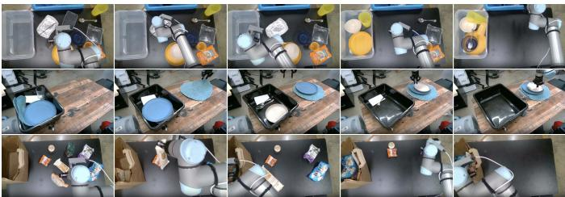
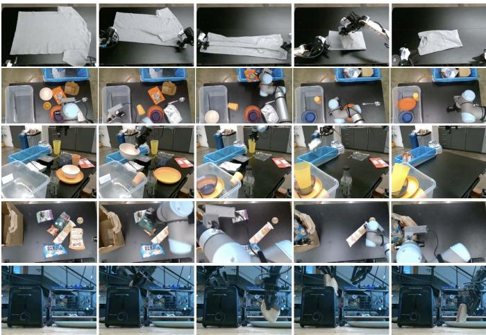
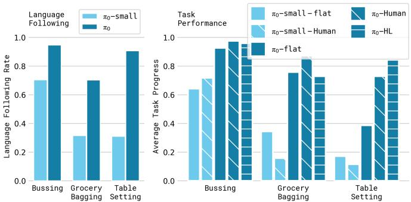
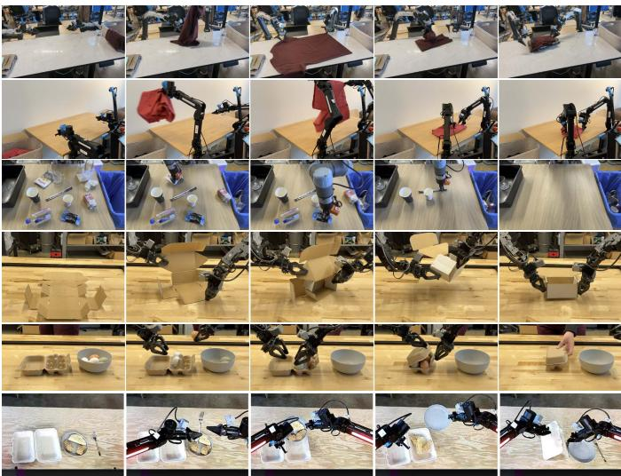
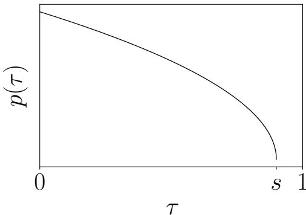
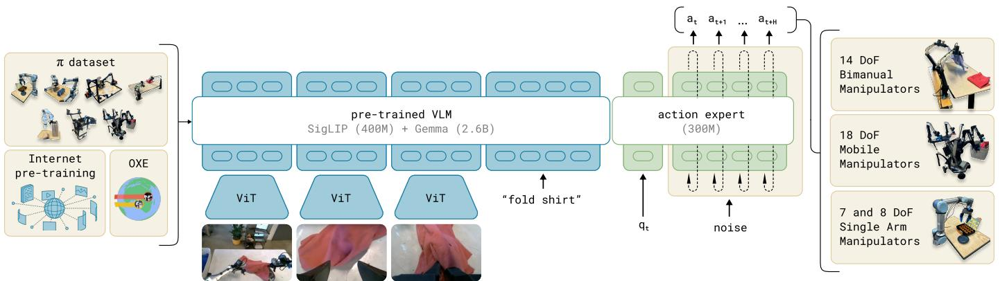
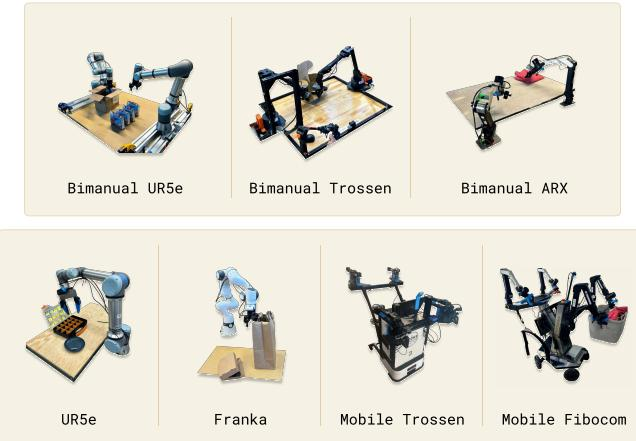

# 1. Bibliographic Information
## 1.1. Title
$π_0$: A Vision-Language-Action Flow Model for General Robot Control

The title clearly states the paper's central topic: the introduction of a new model named $π_0$ for general-purpose robot control. It highlights the model's key characteristics: it integrates vision, language, and action (`Vision-Language-Action`), and it uses a `flow model` for generating actions.

## 1.2. Authors
The paper lists a large number of authors: Kevin Black, Noah Brown, Danny Driess, Adnan Esmail, Michael Equi, Chelsea Finn, Niccolo Fusai, Lachy Groom, Karol Hausman, Brian Ichter, Szymon Jakubczak, Tim Jones, Liyiming Ke, Sergey Levine, Adrian Li-Bell, Mohith Mothukuri, Suraj Nair, Karl Pertsch, Lucy Xiaoyang Shi, James Tanner, Quan Vuong, Anna Walling, Haohuan Wang, and Ury Zhilinsky.

All authors are affiliated with **Physical Intelligence**, which appears to be a robotics and AI company. Many of the authors, such as Sergey Levine and Chelsea Finn, are highly influential figures in the fields of robotics, reinforcement learning, and machine learning, with extensive academic backgrounds from institutions like Stanford University and UC Berkeley. This suggests the work is a large-scale, well-funded industrial research effort built upon a strong academic foundation.

## 1.3. Journal/Conference
The paper was published on **arXiv**, an open-access repository for electronic preprints of scientific papers. The publication date is October 31, 2024. As an arXiv preprint, this work has not yet undergone a formal peer-review process for a conference or journal. However, arXiv is a standard and reputable venue for rapidly disseminating cutting-edge research in fields like AI and robotics, often before official publication.

## 1.4. Publication Year
2024

## 1.5. Abstract
The abstract introduces the challenge of achieving generality, generalization, and robustness in robot learning for real-world applications. It proposes that **generalist robot policies**, also referred to as **robot foundation models**, can address these issues. The paper introduces a novel model, $π_0$, which is a flow matching architecture built upon a pre-trained vision-language model (VLM) to leverage internet-scale semantic knowledge. The methodology involves training this model on a large and diverse dataset collected from multiple dexterous robot platforms, including single-arm, dual-arm, and mobile manipulators. The evaluation of $π_0$ is comprehensive, assessing its zero-shot task performance, its ability to follow human and VLM-generated language instructions, and its capacity to learn new skills through fine-tuning. The results demonstrate the model's effectiveness on a wide variety of complex tasks, such as laundry folding, table cleaning, and box assembly.

## 1.6. Original Source Link
*   **Original Source Link:** `https://arxiv.org/abs/2410.24164`
*   **PDF Link:** `https://arxiv.org/pdf/2410.24164v3.pdf`
*   **Publication Status:** This is a preprint and has not yet been peer-reviewed for formal publication in a conference or journal.

# 2. Executive Summary
## 2.1. Background & Motivation
### 2.1.1. Core Problem
The central problem this paper tackles is the lack of **versatility and generality** in modern robotics. While AI has excelled in specialized domains (e.g., protein folding, image generation), creating a single robot system that can perform a wide array of complex, dexterous tasks in unstructured real-world environments remains a major unresolved challenge. This "generality gap" is hindered by three primary obstacles:
1.  **Data Scarcity:** Collecting high-quality, diverse data for every conceivable robot task is impractical.
2.  **Poor Generalization:** Models trained on one task or in one environment often fail when faced with slight variations.
3.  **Lack of Robustness:** Robots often fail to recover from small mistakes or unexpected perturbations.

### 2.1.2. Importance of the Problem
Solving this problem is crucial not only for the practical deployment of useful robots in homes and industries but also for advancing artificial intelligence. Human intelligence is fundamentally characterized by its physical embodiment and versatility—the ability to interact with and adapt to a vast range of physical situations. Current AI systems, including large language models (LLMs), lack this "situated" understanding of the physical world. By training AI on embodied robot data, we can move towards systems that possess a more human-like, physically grounded intelligence.

### 2.1.3. Innovative Idea
The paper's innovative idea is to build a **robot foundation model**, named $π_0$, by taking inspiration from the successful paradigm of large language models. The core approach has three pillars:
1.  **Architecture:** Instead of building from scratch, they start with a pre-trained **Vision-Language Model (VLM)** to inherit a rich, internet-scale semantic understanding of objects and concepts. Crucially, they propose a novel way to generate robot actions: using **flow matching**, a continuous generative modeling technique, to output high-frequency chunks of actions. This is designed to be superior to prior methods that treated actions as discrete words, which struggled with the precision needed for dexterous tasks.
2.  **Data:** They embrace a large-scale, multi-stage training philosophy. The model is first **pre-trained** on a massive and highly diverse dataset (over 10,000 hours) from many different robots and tasks to build a broad base of physical skills.
3.  **Training Recipe:** Following pre-training, the model is **fine-tuned** (or "post-trained") on smaller, high-quality, curated datasets for specific, complex tasks. This two-phase process mirrors the pre-training and alignment/fine-tuning stages of LLMs, where pre-training provides knowledge and post-training shapes behavior.

## 2.2. Main Contributions / Findings
### 2.2.1. Primary Contributions
1.  **A Novel Model Architecture ($π_0$):** The paper introduces $π_0$, a Vision-Language-Action (VLA) model that uniquely combines a pre-trained VLM backbone with a **flow matching-based action generator**. This architecture includes an "action expert" module to efficiently integrate robotics-specific data, enabling the generation of high-frequency (up to 50 Hz), continuous action chunks required for dexterous manipulation.
2.  **A Large-Scale Training Framework:** The authors propose and implement a two-stage **pre-training and post-training recipe** for robot foundation models. This includes the assembly of the largest-to-date robot learning dataset (over 10,000 hours) by combining their own dexterous manipulation data with public datasets like OXE.
3.  **State-of-the-Art Empirical Results:** The paper provides extensive experimental validation demonstrating that $π_0$ achieves a new state of the art in robot manipulation. The model shows strong performance in zero-shot settings, effectively follows language commands, and can be fine-tuned to master exceptionally complex and long-horizon tasks like folding laundry, assembling cardboard boxes, and packing eggs, which significantly surpass the complexity shown in prior work.

### 2.2.2. Key Findings
*   The combination of a pre-trained VLM, a continuous action generation mechanism like flow matching, and a very large, diverse dataset is highly effective for creating generalist robot policies.
*   Flow matching is a more suitable architecture for high-frequency, dexterous control compared to the autoregressive discretization used in previous VLA models like `OpenVLA`.
*   The pre-training/post-training paradigm from language modeling is successfully transferable to robotics. Pre-training on diverse (even lower-quality) data endows the model with robustness and a wide repertoire of skills, while fine-tuning on high-quality data teaches it to perform specific tasks fluently and efficiently.
*   VLM pre-training significantly boosts a robot model's ability to understand and follow natural language instructions, which in turn enables more complex behaviors when guided by a high-level planner.

# 3. Prerequisite Knowledge & Related Work
## 3.1. Foundational Concepts
### 3.1.1. Vision-Language Models (VLMs)
A **Vision-Language Model (VLM)** is a type of AI model designed to understand and process information from both images (vision) and text (language) simultaneously. These models are typically trained on enormous datasets of image-text pairs scraped from the internet (e.g., an image of a cat with the caption "a fluffy cat sitting on a couch"). By learning the correlations between visual content and textual descriptions, VLMs develop a rich, semantic understanding of the world. They can perform tasks like:
*   **Image Captioning:** Generating a textual description for a given image.
*   **Visual Question Answering (VQA):** Answering questions about an image (e.g., "What color is the car in the picture?").
*   **Instruction Following:** Executing text-based commands related to an image (e.g., "draw a box around the dog").
    The $π_0$ paper uses a pre-trained VLM (`PaliGemma`) as its backbone to inherit this powerful, pre-existing knowledge about objects, concepts, and their relationships, saving it from having to learn this from scratch.

### 3.1.2. Transformer Architecture
The **Transformer**, introduced by Vaswani et al. in "Attention Is All You Need" (2017), is a neural network architecture that has become the foundation for most modern large-scale AI models, including LLMs and VLMs. Its key innovation is the **self-attention mechanism**.
*   **Self-Attention:** Unlike older sequence models that process data step-by-step (like RNNs), self-attention allows the model to weigh the importance of all other elements in the input sequence when processing a given element. For example, when processing the word "it" in the sentence "The robot picked up the ball because it was red," self-attention helps the model learn that "it" refers to "ball" and not "robot."

    The standard formula for scaled dot-product attention is:
\$
\mathrm{Attention}(Q, K, V) = \mathrm{softmax}\left(\frac{QK^T}{\sqrt{d_k}}\right)V
\$
*   **$Q$ (Query), $K$ (Key), $V$ (Value):** These are matrices created by projecting the input embeddings. The Query represents the current element's "question," the Keys represent what other elements "have," and the Values are the actual content of those elements.
*   **$QK^T$:** The dot product between Queries and Keys computes a similarity score between every pair of elements.
*   **$\sqrt{d_k}$:** A scaling factor to stabilize gradients, where $d_k$ is the dimension of the key vectors.
*   **$\mathrm{softmax}$:** Normalizes the scores into a probability distribution, indicating how much attention to pay to each other element.
*   **$V$:** The final output is a weighted sum of the Value vectors, based on the attention scores.

    The $π_0$ model uses a Transformer as its core computational engine, inheriting this powerful mechanism for contextual reasoning from its VLM backbone.

### 3.1.3. Diffusion Models and Flow Matching
**Diffusion Models** are a class of powerful generative models that learn to create data by reversing a noise-adding process.
*   **Forward Process:** You start with a real data sample (e.g., an image) and gradually add a small amount of Gaussian noise over many timesteps until it becomes pure, indistinguishable noise.
*   **Reverse Process:** The model learns to reverse this process. It takes the pure noise as input and, over many timesteps, iteratively predicts and removes the noise to reconstruct a clean, realistic data sample.

    **Flow Matching** is a more recent and often more efficient alternative to traditional diffusion models. Instead of learning to reverse a stochastic (random) noising process, flow matching learns to follow a deterministic path (a "flow") defined by a vector field that transforms a simple noise distribution (e.g., a standard Gaussian) into the complex data distribution. It trains a neural network to predict this vector field directly, which can lead to faster training and more stable generation. The $π_0$ paper uses this technique to generate continuous robot actions, where the "flow" transforms random noise into a coherent sequence of motor commands.

## 3.2. Previous Works
### 3.2.1. Vision-Language-Action (VLA) Models
Recent work has focused on creating **Vision-Language-Action (VLA)** models by fine-tuning pre-trained VLMs for robot control. Prominent examples include **RT-2** and **OpenVLA**.
*   **Methodology:** These models treat robot actions as a "language." They discretize the continuous action space (e.g., 7 numbers for a robot arm's joint positions) into a vocabulary of integer "tokens." The VLM is then trained to predict the next action token autoregressively, just like predicting the next word in a sentence.
*   **Limitation:** The paper argues that this **autoregressive discretization** is not ideal for dexterous, high-frequency control. It can be slow (predicting one token at a time) and may lack the precision of continuous values. $π_0$ directly addresses this by using flow matching to generate entire chunks of continuous actions at once.

### 3.2.2. Diffusion for Robot Control
Methods like **Diffusion Policy** have successfully applied diffusion models to robot learning.
*   **Methodology:** These policies learn to generate entire trajectories (or action chunks) by training a diffusion model conditioned on the robot's observation (e.g., camera images). They have shown strong performance on dexterous tasks from demonstrations.
*   **Limitation:** These models are typically trained from scratch on task-specific data and do not leverage the vast semantic knowledge of large pre-trained VLMs. $π_0$ innovates by integrating a diffusion-like mechanism (flow matching) *into* a VLM backbone.

### 3.2.3. Large-Scale Robot Learning and Cross-Embodiment
There has been a significant trend towards training single policies on large, diverse datasets collected from multiple different robots (**cross-embodiment**). Datasets like **Open X-Embodiment (OXE)** and **DROID** are major efforts in this direction, aggregating data from dozens of robot types and institutions.
*   **Goal:** To learn generalizable skills that can transfer across different robots and tasks.
*   **This Paper's Relation:** $π_0$ stands on the shoulders of this work, using the OXE dataset as part of its pre-training mixture. However, it pushes the scale even further by adding its own massive dataset of dexterous manipulation (10,000+ hours total), which is far larger than previously used.

## 3.3. Technological Evolution
The field of robot learning has evolved from:
1.  **Specialized Policies:** Training one model for one specific task (e.g., grasping a specific block).
2.  **Self-Supervised Learning:** Using large amounts of autonomously collected, unlabeled data to learn simple skills like grasping or pushing at scale.
3.  **Imitation Learning on Dexterous Tasks:** Using methods like **ACT** or **Diffusion Policy** to learn complex tasks from a moderate number of human demonstrations (10s-100s).
4.  **Generalist Policies on Large Datasets:** Using datasets like OXE to train single, multi-task, multi-robot policies like **Octo**.
5.  **Vision-Language-Action (VLA) Models:** Fine-tuning VLMs like **RT-2** and **OpenVLA** to ground language in robot actions, but with limitations in dexterity.

    This paper represents the next step: merging the strengths of VLMs (semantic knowledge) with powerful continuous action generation (flow matching) and training it at an unprecedented scale to create a true **robot foundation model**.

## 3.4. Differentiation Analysis
Compared to key related works, $π_0$ is differentiated by:
*   **vs. `OpenVLA`/`RT-2`:** $π_0$ uses **continuous action generation via flow matching** instead of autoregressive prediction of discrete action tokens. This is its core architectural innovation for enabling high-frequency, dexterous control.
*   **vs. `Diffusion Policy`:** $π_0$ is built on a massive **pre-trained VLM**, inheriting internet-scale knowledge. Prior diffusion policies were typically smaller and trained from scratch, lacking this semantic foundation.
*   **vs. `Octo`:** $π_0$ is significantly larger (3.3B vs. 93M parameters) and is fundamentally a VLM, giving it superior language understanding and reasoning capabilities.
*   **vs. All Prior Work:** The scale of the training data (especially the proprietary 10,000 hours of dexterous manipulation) and the explicit, LLM-inspired **pre-training/post-training recipe** represent a significant step up in methodology and ambition.

# 4. Methodology
## 4.1. Principles
The core principle of $π_0$ is to construct a powerful, generalist robot policy by augmenting a pre-trained Vision-Language Model (VLM) with the ability to generate precise, high-frequency, continuous robot actions. The theoretical intuition is twofold:
1.  **Inherit Knowledge:** By starting with a VLM (PaliGemma), the model doesn't need to learn the meaning of "apple," "cloth," or "open" from scratch. It inherits a vast semantic understanding of the world from the VLM's training on internet-scale image-text data.
2.  **Generate Dexterous Actions:** To control a robot, the model must output sequences of motor commands. Instead of discretizing these commands and treating them like words, $π_0$ models the entire continuous distribution of possible future actions. It uses **conditional flow matching** to learn a vector field that can transform random noise into a high-quality chunk of future actions, conditioned on the robot's current observation (images, state) and a language command.

    This is implemented through a single Transformer architecture with a clever "action expert" design that separates the processing of pre-trained modalities (image, text) from new robotics-specific modalities (robot state, actions), allowing for stable and efficient training.

## 4.2. Core Methodology In-depth
The $π_0$ model is a Transformer-based architecture that takes in observations and a language command, and outputs a chunk of future actions. The overall workflow is illustrated in Figure 3 from the paper.


*该图像是论文中Fig.8的多场景任务展示插图，展示了语言控制下机器人完成三种不同任务的过程，依次为清理桌面将餐具和垃圾分别放入垃圾箱、摆放餐具从箱子中取物品以及打包购物袋。*

### 4.2.1. Model Inputs and Outputs
At each timestep $t$, the model processes an observation $\mathbf{o}_t$ to predict a chunk of $H$ future actions $\mathbf{A}_t$.
*   **Observation $\mathbf{o}_t$:** This is a collection of multi-modal inputs:
    *   **Images ($\mathbf{I}_t^1, ..., \mathbf{I}_t^n$):** Multiple RGB images from the robot's cameras (e.g., wrist and over-the-shoulder views).
    *   **Language Command ($\boldsymbol{\ell}_t$):** A sequence of text tokens representing the task (e.g., "fold the shirt").
    *   **Proprioceptive State ($\mathbf{q}_t$):** A vector of the robot's current joint angles and other state information.
*   **Action Chunk $\mathbf{A}_t$:** The model's output is a sequence of future actions, $\mathbf{A}_t = [\mathbf{a}_t, \mathbf{a}_{t+1}, ..., \mathbf{a}_{t+H-1}]$. In the experiments, the chunk size $H$ is 50, allowing the model to plan 50 steps into the future at once.

### 4.2.2. Model Architecture
The model is built on the **PaliGemma** VLM, a 3B parameter model. The authors augment this base model to create $π_0$.

1.  **Input Encoding:**
    *   Images are encoded using the Vision Transformer (ViT) from PaliGemma.
    *   The language command is tokenized and embedded.
    *   The proprioceptive state $\mathbf{q}_t$ is projected into the Transformer's embedding space using a linear layer.

2.  **Action Expert:**
    *   The authors found that naively adding robotics inputs/outputs to the VLM was suboptimal. They introduced a design inspired by Mixture-of-Experts, creating a second, smaller set of Transformer weights called the **action expert**.
    *   The original, larger VLM weights process the tokens corresponding to images and language ($[\mathbf{I}_t, \boldsymbol{\ell}_t]$).
    *   The new, smaller action expert weights (initialized from scratch, ~300M parameters) process the robotics-specific tokens: the proprioceptive state and the action tokens ($[\mathbf{q}_t, \mathbf{A}_t^\tau]$).
    *   These two "experts" interact only through the self-attention mechanism, where all tokens can attend to each other (subject to an attention mask). This allows the model to learn robotics-specific patterns without catastrophically disrupting the pre-trained VLM knowledge.

3.  **Attention Mask:** A blockwise causal attention mask is used to control information flow:
    *   **Block 1 (Observation):** Image and language tokens $[\mathbf{I}_t, \boldsymbol{\ell}_t]$ can all attend to each other.
    *   **Block 2 (State):** The state token $\mathbf{q}_t$ can attend to Block 1.
    *   **Block 3 (Actions):** The action tokens $\mathbf{A}_t^\tau$ can attend to Blocks 1 and 2, and have full bidirectional attention among themselves.
        This structure ensures that action generation is conditioned on the full observation and state, and allows for efficient caching during inference.

### 4.2.3. Action Generation via Conditional Flow Matching
This is the core generative component of $π_0$. The goal is to learn the conditional distribution of action chunks $p(\mathbf{A}_t | \mathbf{o}_t)$.

**1. Training:**
The model is trained to learn a vector field $\mathbf{v}_{\boldsymbol{\theta}}$ that transforms a simple noise distribution into the target action distribution. This is done via a flow matching loss. For a given training example $(\mathbf{o}_t, \mathbf{A}_t)$:

*   **Step 1: Define a Probability Path.** A path is defined between a random noise vector $\epsilon \sim \mathcal{N}(\mathbf{0}, \mathbf{I})$ and the true action chunk $\mathbf{A}_t$. The paper uses a simple linear interpolation path. A point on this path at "time" $\tau \in [0, 1]$ is given by:
    \$
    \mathbf{A}_t^\tau = \tau \mathbf{A}_t + (1 - \tau)\epsilon
    \$
    At $\tau=0$, this is pure noise ($\mathbf{A}_t^0 = \epsilon$). At $\tau=1$, this is the true data ($\mathbf{A}_t^1 = \mathbf{A}_t$).

*   **Step 2: Define the Target Vector Field.** The vector field $\mathbf{u}$ represents the direction of "flow" along this path. It's the derivative of the path with respect to $\tau$, which is $\mathbf{A}_t - \epsilon$. The paper, however, specifies the target vector field as $\mathbf{u}(\mathbf{A}_t^\tau | \mathbf{A}_t) = \epsilon - \mathbf{A}_t$. This is a specific choice related to the formulation and corresponds to a "denoising" direction.

*   **Step 3: The Loss Function.** The model's network, parameterized by $\boldsymbol{\theta}$, takes the noisy action $\mathbf{A}_t^\tau$ and the observation $\mathbf{o}_t$ as input and predicts the vector field, $\mathbf{v}_{\boldsymbol{\theta}}(\mathbf{A}_t^\tau, \mathbf{o}_t)$. It is trained to match the target vector field $\mathbf{u}$ using a mean squared error loss:
    \$
    L^{\tau}(\boldsymbol{\theta}) = \mathbb{E}_{p(\mathbf{A}_t | \mathbf{o}_t), q(\mathbf{A}_t^\tau | \mathbf{A}_t)} ||\mathbf{v}_{\boldsymbol{\theta}}(\mathbf{A}_t^\tau, \mathbf{o}_t) - \mathbf{u}(\mathbf{A}_t^\tau | \mathbf{A}_t)||^2
    \$
    where:
    *   $\boldsymbol{\theta}$ are the model's trainable parameters.
    *   $\mathbf{v}_{\boldsymbol{\theta}}(\cdot)$ is the vector field predicted by the model.
    *   $\mathbf{u}(\cdot) = \epsilon - \mathbf{A}_t$ is the ground-truth vector field.
    *   $\mathbb{E}$ denotes the expectation, meaning this loss is averaged over many training samples, noise samples, and timesteps $\tau$.

*   **Timestep Sampling:** Instead of sampling $\tau$ uniformly, the paper uses a beta distribution shifted to emphasize lower values of $\tau$ (higher noise levels). The intuition is that learning to denoise from very noisy inputs is the hardest and most important part of the problem.

**2. Inference:**
At inference time, the process is reversed to generate an action chunk.
*   **Step 1: Start with Noise.** Sample a random action chunk from a standard Gaussian distribution: $\mathbf{A}_t^0 \sim \mathcal{N}(\mathbf{0}, \mathbf{I})$.
*   **Step 2: Integrate the Vector Field.** Starting from $\tau=0$, iteratively step along the learned vector field $\mathbf{v}_{\boldsymbol{\theta}}$ until $\tau=1$. The paper uses the forward Euler method for this numerical integration:
    \$
    \mathbf{A}_t^{\tau + \delta} = \mathbf{A}_t^{\tau} + \delta \mathbf{v}_{\theta}(\mathbf{A}_t^{\tau}, \mathbf{o}_t)
    \$
    where:
    *   $\delta$ is the integration step size. The paper uses 10 integration steps, so $\delta = 0.1$.
    *   The process starts with $\mathbf{A}_t^0$ and is repeated 10 times to obtain the final action chunk $\mathbf{A}_t^1$.
*   **Efficiency:** During these 10 steps, the observation $\mathbf{o}_t$ is fixed. The model can cache the attention keys and values for the observation tokens and only needs to perform the forward pass on the much smaller set of action tokens, making inference efficient.

### 4.2.4. Data and Training Recipe
The paper emphasizes that the training recipe is as important as the architecture.
*   **Pre-training:** The model is first trained on a massive, diverse "pre-training mixture" (Figure 4). This includes the authors' own 903M-timestep dexterous manipulation dataset and public datasets (OXE, DROID, etc.). This phase is designed to give the model a broad understanding of physics, object interactions, and recovery behaviors. Datasets are weighted by size to the power of 0.43 to balance their contributions.
*   **Post-training (Fine-tuning):** After pre-training, the base model is fine-tuned on smaller, higher-quality, task-specific datasets. This phase "aligns" the model to perform specific complex tasks fluently and robustly, analogous to how LLMs are instruction-tuned.

    The following diagram from the paper's appendix visualizes the custom sampling distribution for the flow matching timestep $\tau$.

    
    *该图像是多组机器人执行不同任务的插图，展示了机器人在折叠衬衫、清理餐具、装载物品和进行复杂操作等多样化场景中的动作过程。*

# 5. Experimental Setup
## 5.1. Datasets
The experiments rely on an extensive and diverse collection of robotics data.

### 5.1.1. Pre-training Dataset
The pre-training mixture is a cornerstone of the methodology, totaling over **10,000 hours** of robot experience. It is composed of:
*   **The $π$ Dataset (Proprietary):** This is the authors' internally collected dataset, consisting of **903 million timesteps** of dexterous manipulation data. It covers 68 different tasks performed on 7 distinct robot configurations. These robots include single-arm, bimanual, and mobile manipulators, such as:
    *   `UR5e` (single and bimanual)
    *   `Franka`
    *   `Bimanual Trossen` (based on ALOHA)
    *   `Bimanual ARX / AgileX`
    *   `Mobile Trossen / ARX` (based on Mobile ALOHA)
    *   `Mobile Fibocom` (holonomic mobile base)
*   **Open-Source Datasets:** The mixture is augmented with large public datasets to increase diversity. This includes:
    *   **`Open X-Embodiment (OXE)`:** A massive collection of 22 different robot datasets.
    *   **`DROID`:** A large-scale, in-the-wild robot manipulation dataset.
    *   **`Bridge v2`:** A dataset focused on boosting generalization with cross-domain data.

        The following charts from the paper (Figure 4) illustrate the composition of the dataset.

        
        *该图像是图表，展示了图9中不同策略在语言跟随能力和任务完成度上的表现。左图比较了π₀和π₀-small的语言跟随率，右图比较flat、人类专家和高层VLM策略对任务进展的影响。结果表明，使用人类专家中间指令的π₀模型表现最佳。*

### 5.1.2. Post-training (Fine-tuning) Datasets
For downstream tasks, smaller, task-specific datasets were used. The size of these datasets varied depending on task complexity, ranging from just **1-5 hours** for simpler new tasks to **100+ hours** for mastering highly complex ones like laundry folding.

### 5.1.3. Data Representation
A data sample consists of a tuple $(\mathbf{o}_t, \mathbf{A}_t)$.
*   $\mathbf{o}_t$: The observation, which includes multiple camera images, a language command (e.g., a task name like `"fold the shirt"` or a sub-task description like `"pick up the napkin"`), and the robot's proprioceptive state vector $\mathbf{q}_t$.
*   $\mathbf{A}_t$: A chunk of $H=50$ future action vectors. Actions are zero-padded to match the dimensionality of the most complex robot in the dataset (18-DoF) to enable cross-embodiment training.

## 5.2. Evaluation Metrics
The primary evaluation is based on task success, measured by a **normalized task progress score**. Since the tasks are diverse and complex, a single universal metric is not used. Instead, the authors define a specific scoring rubric for each task, as detailed in Appendix E. This is a standard practice in robotics research.

### 5.2.1. Conceptual Definition
The score for each task quantifies how much of the task was successfully completed. A score of 1.0 represents perfect completion, while partial scores are awarded for completing intermediate steps. For example:
*   In the **Bussing** task, the score is the fraction of objects correctly placed in the right receptacle (trash or dish bin).
*   In the **Laundry Folding** task, points are awarded sequentially for picking the item, flattening it, folding it, and stacking it correctly.
*   In the **Tupperware in Microwave** task, one point is given for opening the microwave, one for placing the container inside, and one for closing it.

    This metric directly measures the policy's real-world effectiveness and ability to complete multi-stage behaviors. As there is no standard mathematical formula, the explanation relies on the conceptual definition of progress for each specific task.

## 5.3. Baselines
The paper compares $π_0$ against a comprehensive set of baseline models to validate different aspects of its design:
*   **`OpenVLA`:** A state-of-the-art 7B parameter VLA model. It uses an autoregressive, token-based action representation. This baseline tests the hypothesis that flow matching is superior for dexterous control.
*   **`Octo`:** A 93M parameter generalist robot policy that also uses a diffusion-based action generation scheme but is not a VLM. This baseline helps isolate the benefits of the VLM backbone and larger model scale.
*   **
```
π_0`-small`:** A 470M parameter version of the authors' model trained from scratch without VLM pre-training. This is a crucial ablation to measure the direct impact of inheriting knowledge from a pre-trained VLM.
*   **`ACT` and `Diffusion Policy`:** State-of-the-art imitation learning methods designed for learning dexterous skills from smaller, task-specific datasets. These are used in the fine-tuning experiments to compare against methods specialized for data-efficient learning.
*   **`scratch`:** The
```
π_0
```
architecture trained from scratch only on the fine-tuning data, without any pre-training. This ablation measures the contribution of the massive pre-training phase.

# 6. Results & Analysis
The experimental evaluation is divided into four parts, each addressing a key research question about the capabilities of
```
π_0
```
.

## 6.1. A. Evaluating the Base Model (Out-of-Box Performance)
This section evaluates the
```
π_0
```
model immediately after pre-training, without any task-specific fine-tuning ("zero-shot" or "out-of-box").

*   **Core Results:** The results are presented in Figure 7, which shows the average task progress on five different tasks.
```
π_0
```
(trained for 700k steps) dramatically outperforms all baseline models, including `OpenVLA`, `Octo`, and its non-VLM counterpart,
```
π_0`-small`. Even a "compute parity" version of $π_0$ (trained for only 160k steps) is superior to all baselines.

    The following chart from the paper (Figure 7) shows these results:

    
    *该图像是多张机器人执行复杂任务的照片，展示了机器人完成叠衣服、搬运、装箱、打包等多种操作。画面体现了机器人对不同物体的灵活操作和任务的时序完整性。*

*   **Analysis:**
    *   **Architecture Matters:** The massive gap between $π_0$ and `OpenVLA` strongly supports the authors' claim that the flow matching architecture for continuous actions is better suited for these dexterous, high-frequency tasks than `OpenVLA`'s autoregressive discretization.
    *   **Scale and VLM Pre-training Matter:** The significant lead of $π_0$ over the smaller `Octo` and the non-VLM $$π_0`-small` highlights the combined benefits of a large-scale model and the semantic knowledge inherited from VLM pre-training.
    *   The strong out-of-box performance demonstrates that the pre-training phase successfully endows the model with a broad and capable foundation of skills.

## 6.2. B. Following Language Commands
This section investigates the model's ability to understand and execute natural language instructions.

*   **Core Results:** The results in Figure 9 compare $$π_0
```
to
```
π_0`-small` on three language-conditioned tasks. The left chart shows that $π_0$ has a much higher language-following accuracy. The right chart shows that this translates to better task performance. Providing intermediate language commands from a human (`-human`) or a high-level VLM policy (`-HL`) significantly improves task success for $π_0$, while the effect is minimal for 
```
π_0`-small`.

    The following chart from the paper (Figure 9) summarizes these findings:

    
    *该图像是图表，展示了流匹配过程中时间步采样的概率分布。横轴为时间步 `au`，纵轴为概率密度 $p(\tau)$，曲线由 `0` 至截断值 $s$ 递减，表示采样偏重于较低的时间步，且不采样 $s$ 以上的部分。*

*   **Analysis:**
    *   VLM pre-training is crucial for effective language grounding. The ability to correctly interpret nuanced language commands is a direct benefit of starting with a model trained on internet-scale text.
    *   This strong language capability unlocks hierarchical control. A high-level VLM can act as a "planner," breaking down a complex goal (e.g., "bus the table") into simpler sub-goals (e.g., "pick up the plate," "put plate in bin"), which
```
π_0
```
can then execute effectively.

## 6.3. C. Learning New Dexterous Tasks (Fine-tuning)
This section evaluates how efficiently
```
π_0
```
can be adapted to new tasks not seen during pre-training.

*   **Core Results:** Figure 11 shows the performance on five new tasks with varying amounts of fine-tuning data (1, 5, or 20 hours). The pre-trained
```
π_0
```
model consistently outperforms all baselines, including specialized methods like `ACT` and `Diffusion Policy`, as well as `OpenVLA` and `Octo`. Crucially, it also performs much better than the
```
π_0
```
architecture trained from scratch, especially in the low-data regime (e.g., 1 hour).

    The charts from Figure 11 of the original paper are shown below:

    
    *该图像是论文中体系结构示意图，展示了基于预训练视觉语言模型（VLM）和动作专家的多模态机器人控制流程，结合了π数据集和互联网预训练，实现对多种机械臂的语言指导动作生成。*

*   **Analysis:**
    *   **Pre-training enables data-efficient learning.** The pre-trained model provides a strong "prior," allowing it to learn new tasks much faster and from less data compared to training from scratch. The performance gain is often 2x or more.
    *   The
```
π_0
```
architecture itself is powerful. Even when trained from scratch, it is competitive with or superior to strong baselines like `ACT` and `Diffusion Policy`, demonstrating the strength of the flow-matching design.

## 6.4. D. Mastering Complex Multi-Stage Tasks
This final set of experiments showcases the full capability of the
```
π_0
```
framework on extremely challenging, long-horizon tasks.

*   **Core Results:** Figure 13 presents the results on seven complex tasks, such as laundry folding, box building, and packing eggs. The full
```
π_0$$model (pre-trained and then fine-tuned) achieves high success rates (over 50% average progress on all tasks). It consistently and significantly outperforms both the out-of-box pre-trained model and the model trained from scratch on the fine-tuning data. The improvement from pre-training is most dramatic on the hardest tasks that are not in the pre-training set (e.g., box building, packing eggs).

    The following chart from the paper (Figure 13) presents these results:

    
    *\text{该图像是论文中用于实验的机器人示意图，展示了多种机器人平台，包括单臂}UR5e\text{、}Franka\text{，双臂}UR5e\text{、}Trossen\text{、}ARX\text{，以及移动机器人}Trossen\text{和}Fibocom\text{，体现了模型在多平台上的联合训练。}*

*   **Analysis:**
    *   This is the capstone result, demonstrating a new state of the art in autonomous robot dexterity. The tasks shown are significantly more complex and longer than those in typical robotics benchmarks.
    *   It reinforces the core thesis of the paper: mastering such complex skills requires **both** a broad foundation from large-scale pre-training (for robustness and generalization) **and** specialized knowledge from high-quality fine-tuning (for fluency and task-specific strategy). Neither component alone is sufficient.

# 7. Conclusion & Reflections
## 7.1. Conclusion Summary
The paper introduces$$π_0
```
, a generalist robot control model that successfully integrates a pre-trained Vision-Language Model (VLM) with a novel flow matching mechanism for action generation. This architecture, combined with a large-scale, two-stage pre-training and post-training recipe, proves to be highly effective. The key contributions are:
1.  A novel **VLA-Flow architecture** that excels at high-frequency, dexterous control.
2.  The application of an **LLM-like training paradigm** to robotics, using a massive 10,000+ hour dataset.
3.  A demonstration of **state-of-the-art performance** on a diverse and exceptionally challenging set of real-world manipulation tasks.

    The work provides a compelling blueprint for building future "robot foundation models" and suggests that the path to general-purpose robots lies in the synergy between large-scale data, powerful generative architectures, and knowledge inherited from internet-scale models.

## 7.2. Limitations & Future Work
The authors candidly acknowledge several limitations and point to future research directions:
*   **Data Composition:** While they used a massive dataset, there is no clear understanding of which types of data are most beneficial or how the pre-training mixture should be optimally composed and weighted.
*   **Performance Variability:** The model does not achieve perfect performance on all tasks, and predicting the amount and type of data needed to master a new task remains an open problem.
*   **Limits of Universality:** The experiments are focused on manipulation. It is unclear if this "universal" model approach will successfully transfer to vastly different domains like autonomous driving, legged locomotion, or flight.
*   **Future Work:** The authors suggest future research should focus on a more scientific understanding of data scaling laws in robotics, predicting data requirements, and exploring the transferability of such models to even more diverse robot embodiments and task domains.

## 7.3. Personal Insights & Critique
This paper represents a significant milestone in the pursuit of generalist robots and offers several key insights:
*   **Paradigm Shift:** The successful application of the "pre-train, then fine-tune" paradigm from NLP to robotics is a powerful validation of this approach. It suggests that, like language, physical interaction has an underlying "grammar" that can be learned from vast, diverse data.
*   **Architectural Insight:** The move from discrete, autoregressive action models to continuous, parallel generative models (like flow matching) seems to be a critical step for achieving the precision and speed needed for dexterity. This is a key technical takeaway for the field.
*   **The "Brute Force" Component:** This work is as much an engineering and data collection achievement as it is a scientific one. The sheer scale (10,000+ hours of data, 3.3B parameter model) is a major contributor to its success. This highlights a potential challenge for the broader research community: such large-scale experiments are becoming prohibitively expensive for most academic labs, potentially widening the gap between industrial and academic research.

**Potential Issues and Critique:**
*   **Reproducibility:** Due to the proprietary nature of the
```
π\$\$ dataset and the immense computational resources required, reproducing these results would be nearly impossible for external researchers. This makes independent verification and incremental research difficult.
*   **The Role of Teleoperation Quality:** The paper's training data is collected via teleoperation. The quality, consistency, and "style" of the human operators who provided the data are enormous, unstated confounding variables. The model is learning to imitate them, and biases in the teleoperation data will be reflected and amplified in the final policy.
*   **True Generalization vs. Memorization:** With such a massive dataset, it is difficult to discern how much of the model's performance comes from true, systematic generalization versus a form of "sophisticated interpolation" or memorization across its vast training set. While the fine-tuning results on unseen tasks are promising, the model's behavior in truly novel, out-of-distribution scenarios remains largely untested.
*   **Safety and Predictability:** For real-world deployment, especially in human-centric environments, safety is paramount. The paper does not focus on this aspect. The behavior of such a complex, non-deterministic generative model under edge-case conditions is unpredictable and a critical area for future research before these systems can be trusted.