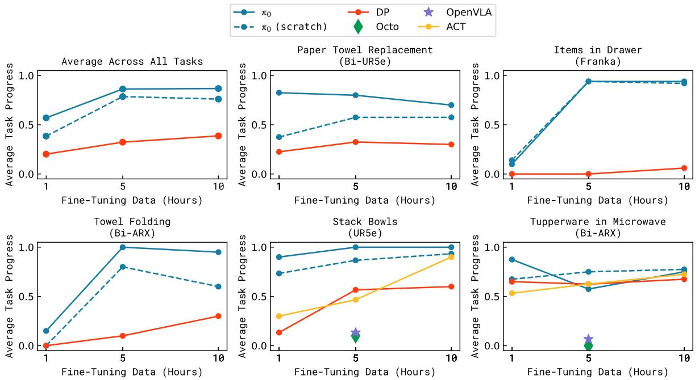

# 1. Bibliographic Information

## 1.1. Title
The title of the paper is **$π0: A Vision-Language-Action Flow Model for General Robot Control$**. This title indicates that the paper introduces a new model named $π0$ (Pi-Zero) which integrates vision, language, and action modalities. It specifically highlights the use of a **Flow Model** (a type of generative model) for the purpose of controlling robots in a general, versatile manner.

## 1.2. Authors
The authors are a large team from **Physical Intelligence**, a research company focused on embodied AI. Key authors include Kevin Black, Noah Brown, Danny Driess, Chelsea Finn, Sergey Levine, and Karol Hausman, among many others. This affiliation suggests the work is backed by significant industrial research resources, allowing for large-scale data collection and model training that might be difficult for academic labs alone.

## 1.3. Journal/Conference
The paper was published as a **preprint on arXiv** in 2024. As of the time of this analysis, it has not been listed as formally published in a specific peer-reviewed conference (like ICRA or CoRL) in the provided metadata, though it represents cutting-edge research in the field of robot learning. arXiv is the standard repository for rapid dissemination of research in computer science and AI, indicating the work is recent and actively being discussed in the community.

## 1.4. Publication Year
The paper was published in **2024** (specifically October 31, 2024, according to the provided timestamp).

## 1.5. Abstract
The paper addresses the challenge of creating **generalist robot policies** (foundation models for robotics) that can handle diverse, dexterous tasks in the real world. The core obstacles identified are data scarcity, generalization, and robustness. The authors propose $π0$, a novel architecture that builds upon a pre-trained **Vision-Language Model (VLM)** and augments it with **flow matching** to generate continuous robot actions. The model is trained on a massive dataset of over 10,000 hours of robot data from multiple platforms (single-arm, dual-arm, mobile manipulators). The results demonstrate that $π0$ can perform tasks in **zero-shot** (without task-specific training), follow complex language instructions, and acquire new dexterous skills (like laundry folding and box assembly) via fine-tuning, significantly outperforming prior baseline models.

## 1.6. Original Source Link
- **Original Source Link:** https://arxiv.org/abs/2410.24164
- **PDF Link:** https://arxiv.org/pdf/2410.24164v3.pdf
- **Publication Status:** Preprint (arXiv).

# 2. Executive Summary

## 2.1. Background & Motivation
The core problem this paper aims to solve is the **lack of generality and robustness in current robot learning systems**. While Artificial Intelligence (AI) has made massive strides in language and vision (e.g., Large Language Models), robots still struggle to perform versatile physical tasks in unstructured environments.
- **Core Problem:** Most robot learning systems are **specialized**. A robot trained to pick up a cup cannot necessarily fold a shirt. This specialization requires collecting new data for every new task, which is slow and expensive.
- **Challenges:** The field faces major obstacles in **data availability** (collecting robot data is hard), **generalization** (performing well on unseen objects or scenarios), and **robustness** (recovering from mistakes).
- **Innovative Idea:** The authors propose treating robot control similarly to how Large Language Models (LLMs) are treated: by creating a **Robot Foundation Model**. Just as LLMs are pre-trained on vast internet text to learn general knowledge and then fine-tuned for specific tasks, $π0$ is pre-trained on vast robot interaction data to learn general physical skills, leveraging the semantic knowledge of pre-trained VLMs.

## 2.2. Main Contributions / Findings
The paper makes several primary contributions to the field of embodied AI:
1.  **$π0$ Architecture:** A novel **Vision-Language-Action (VLA)** model that combines a pre-trained VLM (PaliGemma) with a flow matching head for action generation. This allows the model to inherit internet-scale semantic knowledge while producing high-frequency, continuous control signals.
2.  **Scale of Training:** The model is trained on a mixture of over **10,000 hours of robot data** from 7 distinct robot configurations and 68 tasks, representing one of the largest robot learning experiments to date.
3.  **Training Recipe:** The authors introduce a **pre-training and post-training** recipe. The model is first pre-trained on diverse, lower-quality data to learn broad capabilities and recovery behaviors, then fine-tuned (post-trained) on high-quality, curated data to master specific dexterous tasks.
4.  **Empirical Performance:** $π0$ demonstrates state-of-the-art performance on complex, temporally extended tasks such as **laundry folding**, **table bussing**, and **box assembly**. It significantly outperforms baselines like OpenVLA and Octo, especially in tasks requiring high-frequency control and dexterity.

# 3. Prerequisite Knowledge & Related Work

## 3.1. Foundational Concepts
To understand this paper, a reader needs familiarity with several key concepts in machine learning and robotics:

- **Vision-Language Model (VLM):** A type of AI model that can process both images and text. For example, you can show a VLM a picture of a dog and ask "What is this?", and it will answer "A dog". In this paper, the VLM provides the "brain" for understanding the visual scene and language commands.
- **Flow Matching:** A generative modeling technique similar to **Diffusion Models**. While diffusion models learn to remove noise from data step-by-step, flow matching learns a continuous vector field that transports noise into data. It is often more efficient and stable for training. In this context, it is used to generate robot **actions** (movements) rather than images.
- **Action Chunking:** Instead of predicting just one action (e.g., move arm left by 1cm) at a time, the model predicts a **chunk** of future actions (e.g., the next 50 movements). This allows for smoother, higher-frequency control and helps the robot plan ahead.
- **Cross-Embodiment Training:** Training a single model on data from many different types of robots (e.g., a single arm, two arms, a robot on wheels). This helps the model learn general physical principles rather than memorizing the kinematics of one specific robot.
- **Zero-Shot Learning:** The ability of a model to perform a task it has not explicitly been trained on, relying only on its general pre-training knowledge.

## 3.2. Previous Works
The paper builds upon and differentiates itself from several key prior studies:
- **RT-2 (Robotics Transformer 2):** A seminal VLA model that showed VLMs could be fine-tuned for robot control. However, RT-2 uses **autoregressive discretization** for actions (treating actions like text tokens), which limits the frequency and precision of control. $π0$ uses flow matching for continuous, high-frequency actions.
- **OpenVLA:** An open-source VLA model that serves as a primary baseline in this paper. Like RT-2, it uses autoregressive action tokenization. The paper shows $π0$ outperforms OpenVLA on dexterous tasks.
- **Octo:** A generalist robot policy that uses diffusion for action generation but lacks the large-scale VLM pre-training for semantic understanding. $π0$ combines the strengths of Octo (diffusion/flow actions) and OpenVLA (VLM semantics).
- **ACT (Action Chunking Transformer) & Diffusion Policy:** Methods designed for dexterous manipulation from smaller datasets. $π0$ shows that pre-training on large data allows it to outperform these methods even when fine-tuned on small amounts of task-specific data.

## 3.3. Technological Evolution
The field has evolved from **specialized policies** (one model per task) to **generalist policies**. Early robot learning focused on simple tasks like grasping. Recent work (like RT-1, RT-2) introduced transformers for multi-task learning. The current frontier, where $π0$ sits, is **Robot Foundation Models** that combine internet-scale pre-training (for knowledge) with large-scale robot data (for physical skills) and advanced generative heads (flow matching) for precise control.

## 3.4. Differentiation Analysis
The core difference of $π0$ lies in its **hybrid architecture** and **training scale**. Unlike OpenVLA, which discretizes actions, $π0$ uses **flow matching** to model continuous action distributions, enabling 50 Hz control for dexterous tasks. Unlike Octo, which trains from scratch or with smaller backbones, $π0$ initializes from a 3 billion parameter VLM (PaliGemma), inheriting rich semantic knowledge. Furthermore, the **pre-training/post-training recipe** mirrors LLM development, which the authors argue is crucial for balancing generalization (from diverse pre-training data) and dexterity (from high-quality post-training data).

# 4. Methodology

## 4.1. Principles
The core idea of $π0$ is to create a robot policy that understands the world like a human (via VLM pre-training) and moves like a skilled operator (via flow matching on robot data). The theoretical basis is that **semantic understanding** (knowing what a "cup" is and where it usually goes) and **physical control** (how to move the arm to grab it) should be learned jointly but with specialized components. The intuition is that a VLM provides the "what" and "why," while the flow matching head provides the "how."

## 4.2. Core Methodology In-depth (Layer by Layer)
The $π0$ model architecture is built on top of the **PaliGemma** VLM. The process involves encoding observations, processing them through a transformer, and generating actions via flow matching.

### 4.2.1. Observation Encoding
The robot's observation $\mathbf{o}_t$ at time $t$ consists of multiple RGB images, a language command, and the robot's proprioceptive state (joint angles). Formally:
$$
\mathbf o _ { t } = [ \mathbf I _ { t } ^ { 1 } , . . . , \mathbf I _ { t } ^ { n } , \boldsymbol { \ell } _ { t } , \mathbf q _ { t } ]
$$
Here, $\mathbf { I } _ { t } ^ { i }$ represents the $i^{\mathrm{th}}$ image (typically 2 or 3 cameras per robot), $\ell _ { t }$ is the sequence of language tokens (the instruction), and $\mathbf { q } _ { t }$ is the vector of joint angles. These inputs are encoded and projected into the same embedding space as the language tokens.

### 4.2.2. Action Chunking and Flow Matching
Instead of predicting a single action, the model predicts a chunk of future actions $\mathbf { A } _ { t }$ of horizon $H$ (where $H=50$ for their tasks). The model uses **conditional flow matching** to model the distribution of these actions given the observation.

During training, the model learns to predict a vector field that denoises a noisy action chunk. The training objective is defined by the flow matching loss. The paper presents the specific loss function as follows:
$$
L ^ { \tau } ( \boldsymbol { \theta } ) = \mathbb { E } _ { p ( \mathbf { A } _ { t } | \mathbf { o } _ { t } ) , q ( \mathbf { A } _ { t } ^ { \tau } | \mathbf { A } _ { t } ) } | | \mathbf { v } _ { \boldsymbol { \theta } } ( \mathbf { A } _ { t } ^ { \tau } , \mathbf { o } _ { t } ) - \mathbf { u } ( \mathbf { A } _ { t } ^ { \tau } | \mathbf { A } _ { t } ) | | ^ { 2 } ,
$$
In this formula:
- $L ^ { \tau } ( \boldsymbol { \theta } )$ is the loss at flow matching timestep $\tau$.
- $\boldsymbol { \theta }$ represents the model parameters.
- $\mathbb { E }$ denotes the expectation over the data distribution and the noise distribution.
- $p ( \mathbf { A } _ { t } | \mathbf { o } _ { t } )$ is the true distribution of actions given the observation.
- $q ( \mathbf { A } _ { t } ^ { \tau } | \mathbf { A } _ { t } )$ is the probability path that adds noise to the actions.
- $\mathbf { A } _ { t } ^ { \tau }$ represents the "noisy actions" at timestep $\tau$.
- $\mathbf { v } _ { \boldsymbol { \theta } } ( \mathbf { A } _ { t } ^ { \tau } , \mathbf { o } _ { t } )$ is the vector field predicted by the neural network.
- $\mathbf { u } ( \mathbf { A } _ { t } ^ { \tau } | \mathbf { A } _ { t } )$ is the target denoising vector field.

  The probability path is defined as a linear-Gaussian path:
$$
q ( \mathbf { A } _ { t } ^ { \tau } | \mathbf { A } _ { t } ) = \mathcal { N } ( \tau \mathbf { A } _ { t } , ( 1 - \tau ) \mathbf { I } )
$$
In practice, noise $\epsilon \sim \mathcal { N } ( \mathbf { 0 } , \mathbf { I } )$ is sampled, and noisy actions are computed as $\mathbf { A } _ { t } ^ { \tau } = \tau \mathbf { A } _ { t } + ( 1 - \tau ) \epsilon$. The target vector field is $\mathbf { u } ( { \bf A } _ { t } ^ { \tau } | { \bf A } _ { t } ) = \epsilon - { \bf A } _ { t }$. The model is trained to match this target.

### 4.2.3. Action Expert Architecture
To combine flow matching with the VLM, the authors introduce an **Action Expert**. The model uses a mixture-of-experts design where image and text tokens are processed by the main VLM backbone, while robotics-specific inputs (state $\mathbf{q}_t$ and noisy actions $\mathbf{A}_t^\tau$) are routed to a separate set of weights called the action expert. This expert uses **bidirectional attention** for action tokens, allowing all action steps in the chunk to attend to each other.

The following figure (Figure 3 from the original paper) illustrates the overall framework, showing the pre-training mixture and the model architecture:

*该图像是示意图，展示了一个基于预训练的视觉语言模型 (VLM) 的机器人控制架构。图中包含了多种机器人操作平台及其相关任务，如折衬衫与清理桌子，强调了机器人学习在复杂任务中的应用。*

### 4.2.4. Inference Procedure
At inference time, actions are generated by integrating the learned vector field from $\tau = 0$ (noise) to $\tau = 1$ (clean action). Starting with random noise $\mathbf { A } _ { t } ^ { 0 } \sim \mathcal { N } ( \mathbf { 0 } , \mathbf { I } )$, the model uses the forward Euler integration rule:
$$
\mathbf { A } _ { t } ^ { \tau + \delta } = \mathbf { A } _ { t } ^ { \tau } + \delta \mathbf { v } _ { \theta } ( \mathbf { A } _ { t } ^ { \tau } , \mathbf { o } _ { t } ) ,
$$
where $\delta$ is the integration step size. The authors use 10 integration steps ($\delta = 0.1$). This process allows the model to sample complex, multimodal action distributions suitable for dexterous manipulation.

### 4.2.5. Timestep Sampling
A novel aspect of their training is how they sample the flow matching timestep $\tau$. Unlike standard flow matching which samples uniformly, $π0$ uses a **shifted beta distribution** that emphasizes lower timesteps (noisier actions). This is because predicting the mean action from high noise is harder and more critical for learning the distribution. The distribution is given by:
$$
p ( \tau ) = \mathrm { { B e t a } } ( \frac { s - \tau } { s } ; 1 . 5 , 1 )
$$
where $s = 0.999$ is a cutoff value. This distribution is visualized in Figure 14 below:

*该图像是图表，展示了流匹配时间步采样分布 `p( au)`。我们从一个偏移的贝塔分布中采样 `au`，该分布强调较低时间步（对应于噪声较大的动作），并且在截止值 $s$ 以上不进行采样。实验中，我们使用 $s = 0.999$ 作为截止值。*

## 4.3. Training Recipe
The training follows a two-stage recipe analogous to LLMs:
1.  **Pre-training:** The model is trained on a large, diverse mixture of data (10,000+ hours) to learn broad physical capabilities and recovery behaviors. This data includes lower-quality demonstrations which help the model learn robustness.
2.  **Post-training (Fine-tuning):** The model is fine-tuned on smaller, high-quality datasets specific to downstream tasks (e.g., laundry folding). This aligns the model to perform tasks fluently and efficiently.

    The dataset mixture is visualized in Figure 4, showing the proportion of open-source data (OXE) versus their private dexterous data:

    
    *该图像是饼图，展示了不同机器人平台在某一任务中的使用比例。左侧饼图显示各平台的占比情况，其中“Bimanual ARX”占比最高，为51%。右侧饼图则细分了其他平台的具体占比情况，“Bimanual AgileX”和“UR5e”等平台的比例依次为34.2%、13.7%和16.3%。图中颜色和标签清晰区分了各个机器人平台的名称。*

# 5. Experimental Setup

## 5.1. Datasets
The experiments utilize a massive collection of robot data.
- **Scale:** Over **10,000 hours** of robot demonstration data.
- **Sources:**
    - **Private Dexterous Data:** 903 million timesteps collected on 7 different robot configurations for 68 tasks. This includes complex behaviors like bussing tables and folding laundry.
    - **Open-Source Data:** 9.1% of the mixture comes from open datasets like **OXE (Open X-Embodiment)**, Bridge v2, and DROID.
- **Robot Platforms:** The data covers single-arm robots (UR5e, Franka), dual-arm robots (Bimanual UR5e, Trossen, ARX), and mobile manipulators (Mobile Trossen, Mobile Fibocom). Figure 5 shows the variety of robots used:

  
  *该图像是图示，展示了用于实验的多种机器人，包括双臂和单臂操纵器，以及移动操纵器。图中的机器人包括双臂UR5e、双臂Trossen、双臂ARX、UR5e、Franka、移动Trossen和移动Fibocom，体现了多样化的机器人平台。*

- **Rationale:** These datasets were chosen to ensure **cross-embodiment** generalization. By training on many robot types, the model learns task semantics (e.g., "fold shirt") rather than specific motor commands for one robot.

## 5.2. Evaluation Metrics
The paper uses several metrics to evaluate performance, primarily focused on task success.
- **Normalized Score:** For many tasks, a score between 0 and 1 is assigned.
    - **Conceptual Definition:** This measures the fraction of the task completed successfully. For example, in a bussing task, it is the fraction of objects correctly placed in the right bin.
    - **Mathematical Formula:** While a specific global formula isn't provided, the score $S$ for an episode is generally:
      $$
        S = \frac { N _ { \text { correct } } } { N _ { \text { total } } }
        $$
    - **Symbol Explanation:** $N _ { \text { correct } }$ is the number of successfully completed sub-tasks (e.g., objects sorted), and $N _ { \text { total } }$ is the total number of required sub-tasks.
- **Success Rate:** For binary tasks (e.g., shirt folding), a score of 1.0 is given for full success and 0 for failure.
- **Language Following Accuracy:** In language evaluation experiments, they measure whether the robot correctly follows intermediate language commands (e.g., "pick up the cup").

## 5.3. Baselines
The paper compares $π0$ against several representative baseline models:
- **OpenVLA:** A 7 billion parameter VLA model trained on OXE data. It uses autoregressive action tokenization. It represents the state-of-the-art in VLA models prior to $π0$.
- **Octo:** A 93 million parameter model that uses diffusion for actions but lacks large-scale VLM pre-training. It tests the value of the VLM backbone.
- **$π0$-small:** A 470 million parameter version of $π0$ trained from scratch without VLM initialization. This ablation tests the value of the VLM pre-training specifically.
- **ACT & Diffusion Policy:** Specialized methods for dexterous manipulation trained only on task-specific data. These test whether generalist pre-training is better than specialized training for downstream tasks.

## 5.4. Inference Efficiency
The authors also measured the computational cost of running the model. The following table (Table I from Appendix D of the original paper) details the inference time on an NVIDIA GeForce RTX 4090 GPU:

| model part | inference time |
| :--- | :--- |
| image encoders | 14 ms |
| observation forward pass | 32 ms |
| x10 action forward pass (flow) | 27 ms |
| network latency (if off-board) | 13 ms |
| **total on-board inference** | **73 ms** |
| **total off-board inference** | **86 ms** |

This shows the model is capable of real-time control (running at roughly 11-13 Hz inference rate, while executing actions at 20-50 Hz via chunking).

# 6. Results & Analysis

## 6.1. Core Results Analysis
The experimental results strongly validate the effectiveness of the $π0$ architecture and training recipe.

### 6.1.1. Out-of-Box Evaluation
The authors evaluated the base pre-trained model on five tasks without any fine-tuning (zero-shot). The tasks included shirt folding, bussing, grocery bagging, and removing toast from a toaster.
- **Results:** $π0$ achieved near-perfect success rates on shirt folding and easy bussing, significantly outperforming OpenVLA and Octo.
- **Analysis:** OpenVLA struggled because its autoregressive architecture does not support action chunking well for high-frequency control. Octo lacked the semantic understanding to handle diverse objects.
- **Visualization:** Figure 7 below shows the comparison of average task progress across models. $π0$ (full) achieves the highest scores across all tasks.

  ![Fig. 7: Out-of-box evaluation results: We evaluate $\\pi _ { 0 }$ trained for the full 700k steps, a version trained for $1 6 0 \\mathrm { k }$ steps that matches the number of updates for baseline models, $\\pi _ { 0 }$ -small, and three baselines: OpenVLA and Octo trained on all of our data, and OpenVLA trained only on the UR5e tasks (which we found to work better on UR5e tasks). Across all tasks and all comparisons, even the "parity" version of our model outperforms all baselines, and the full version of our model achieves the best results by a large margin.](images/7.jpg)
  *该图像是图表，展示了不同模型在多个任务中的直接提示性能。各模型的平均任务进展通过柱状图表示，包含了模型 $oldsymbol{ ext{π}_0}$、$oldsymbol{ ext{π}_0}$ (parity)、$oldsymbol{ ext{π}_0}$-small、OpenVLA 以及 Octo。结果显示，$oldsymbol{ ext{π}_0}$ 模型在大多数任务中表现最佳。*

### 6.1.2. Language Following
The paper evaluated how well the model follows language instructions, comparing $π0$ (VLM initialized) against $π0$-small (no VLM).
- **Results:** $π0$ showed significantly better language following accuracy. It also benefited more from intermediate language commands provided by a human or a high-level policy.
- **Analysis:** This confirms that the VLM pre-training is crucial for semantic understanding. $π0$-small, lacking this, could not effectively utilize high-level language guidance.
- **Visualization:** Figure 9 illustrates the improvement in task performance when using intermediate language commands (`-human`, `-HL`) compared to flat commands (`-flat`).

  ![Fig. 9: Language evaluation. We compare "flat" versions of our policies, —flat, which receive only the overall task command (e.g., "bag the groceries") with a method that receives intermediate commands from a human expert, —human, or a high-level VLM policy, $- \\mathrm { H L }$ . We also compare our model to a small non-VLM variant under the "expert" condition, $\\pi _ { 0 }$ and $\\pi _ { 0 }$ -small, in terms of language following accuracy. The results show a significant improvement with $\\pi _ { 0 }$ from intermediate language commands provided by a human expert and to a lesser degree by an autonomous high-level policy. Notably, due to $\\pi _ { 0 }$ -small's limited language following ability, overall it does not gain with the addition of a high-level expert.](images/9.jpg)
  *该图像是一个条形图，展示了在语言跟随率和任务表现方面的比较。左侧显示了不同策略（$ ho_0$-small 和 $ ho_0$）在不同任务（如 Grocery Bagging 和 Table Setting）中的语言跟随率；右侧展示了这些策略的任务表现，提高了中间语言指令的跟随能力。*

### 6.1.3. Learning New Dexterous Tasks
The model was fine-tuned on new tasks with varying amounts of data (1 hour vs 5 hours).
- **Results:** $π0$ fine-tuned from pre-training outperformed models trained from scratch (ACT, Diffusion Policy), especially with limited data (1 hour).
- **Analysis:** Pre-training provides a strong prior, allowing the model to learn new skills with much less task-specific data. This is critical for real-world deployment where collecting hours of data for every new task is impractical.
- **Visualization:** Figure 11 shows the performance across tasks with varying fine-tuning data amounts. The pre-trained $π0$ consistently beats the "scratch" version.

  
  *该图像是图表，展示了不同算法在多项任务上的微调效果。`heta _0`模型在处理较简单任务时，即使数据较少，也能显著提升表现，且预训练模型普遍优于从头开始训练的模型。*

### 6.1.4. Mastering Complex Multi-Stage Tasks
The most impressive results come from complex, long-horizon tasks like laundry folding, box building, and packing eggs.
- **Results:** $π0$ achieved over 50% of the maximum score across all complex tasks with the full pre-training and fine-tuning recipe. Tasks like box building and egg packing were not present in pre-training but were learned via fine-tuning.
- **Analysis:** The combination of diverse pre-training (for robustness) and high-quality post-training (for dexterity) was essential. Training only on high-quality data resulted in brittle models, while pre-training alone lacked fluency.
- **Visualization:** Figure 13 displays the post-training results on these complex tasks, highlighting the superiority of the full $π0$ model over ablations.

  
  *该图像是图表，展示了模型在不同任务上的微调效果。上半部分显示了在预训练任务（如洗衣折叠、桌子清理等）上的平均任务进展，下半部分展示了未在预训练中出现的任务（如建箱、打包鸡蛋）的平均任务进展。不同颜色的条形代表了不同的微调策略。*

## 6.2. Ablation Studies / Parameter Analysis
The paper includes several implicit ablations:
- **VLM Initialization:** Comparing $π0$ vs $π0$-small shows the value of PaliGemma pre-training.
- **Pre-training vs Scratch:** Comparing fine-tuned $π0$ vs ACT/Diffusion Policy (trained from scratch) shows the value of the large-scale pre-training mixture.
- **Action Representation:** Comparing $π0$ (Flow Matching) vs OpenVLA (Autoregressive) shows the value of continuous action modeling for dexterity.
- **Timestep Sampling:** The use of the shifted beta distribution for $\tau$ (Figure 14) was found to improve performance over uniform sampling by focusing training on the harder, noisier timesteps.

# 7. Conclusion & Reflections

## 7.1. Conclusion Summary
The paper presents $π0$, a significant step forward in **Robot Foundation Models**. By combining a pre-trained Vision-Language Model with flow matching for action generation and training on a massive 10,000-hour dataset, $π0$ achieves unprecedented levels of dexterity and generalization. The key findings are:
1.  **Architecture Matters:** Flow matching enables high-frequency, dexterous control better than autoregressive tokens.
2.  **Scale Matters:** Pre-training on diverse, large-scale robot data enables zero-shot capabilities and efficient fine-tuning.
3.  **Recipe Matters:** A two-stage training process (diverse pre-training + high-quality post-training) balances robustness and performance.

## 7.2. Limitations & Future Work
The authors acknowledge several limitations:
- **Data Composition:** It is not yet fully understood which types of data are most helpful. The current mixture combines all available data, but optimal weighting remains an open problem.
- **Reliability:** Not all tasks work reliably (scores are often around 50-80%, not 100%). Predicting how much data is needed for near-perfect performance is still difficult.
- **Universality:** It is unclear if this universality extends to vastly different domains like autonomous driving or legged locomotion, which have different physical dynamics than manipulation.

## 7.3. Personal Insights & Critique
- **Inspiration:** The analogy to LLM training (Pre-training + Alignment/Post-training) is powerful and seems to be the correct path for robotics. It suggests that "general physical intelligence" can be learned similarly to "general language intelligence."
- **Potential Issues:** The reliance on teleoperated data (human-controlled robots) for the 10,000 hours is a bottleneck. Scaling this further requires more efficient data collection methods (e.g., autonomous data generation).
- **Transferability:** The concept of using flow matching for continuous control could be applied to other continuous control domains beyond robotics, such as autonomous driving or animation.
- **Critical Thought:** While the results are impressive, the "50% success rate" on complex tasks indicates that we are not yet at the level of reliability required for unsupervised home deployment. Future work must focus on **safety** and **failure recovery** mechanisms that go beyond just learning from diverse data. The integration of a high-level VLM policy for planning is a promising direction to handle long-horizon tasks that exceed the model's context window or planning capability.