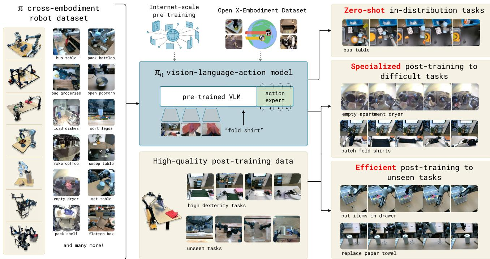
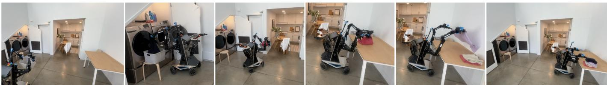
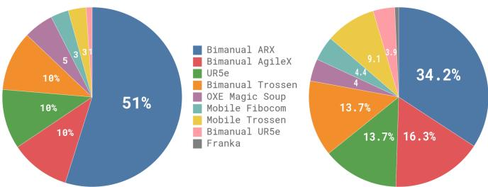
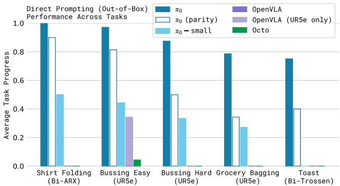
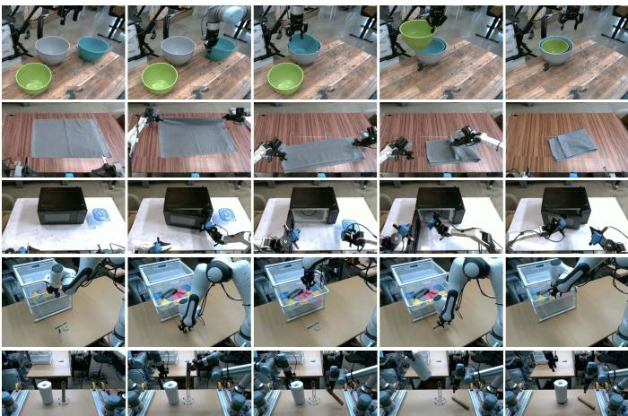
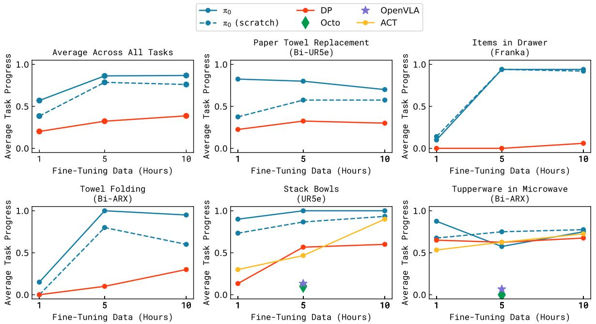
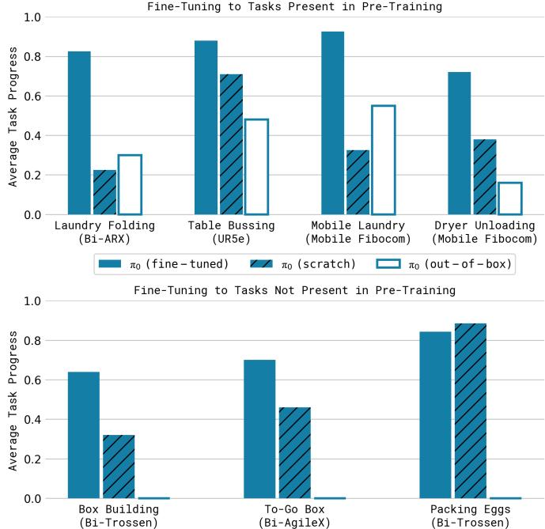

# π0：一种用于通用机器人控制的视觉-语言-动作流模型

身体智能 Kevin Black, Noah Brown, Danny Driess, Adnan Esmail, Michael Equi, Chelsea Finn, Niccolo Fusai,   
Lachy Groom, Karol Hausman, Brian Ichter, Szymon Jakubczak, Tim Jones, Liyiming Ke, Sergey Levine,   
Adrian Li-Bell, Mohith Mothukuri, Suraj Nair, Karl Pertsch, Lucy Xiaoyang Shi, James Tanner, Quan Vuong, Anna Walling, Haohuan Wang, Ury Zhilinsky https://physicalintelligence.company/blog/pi0

  
Fues oot po r-raii-nm Mace  weivestasks, such as folding multiple articles of laundry or assembling a box.

摘要——机器人学习具有巨大的潜力，可以充分发挥灵活、通用和灵巧的机器人系统的全部能力，同时解决人工智能领域一些最深层次的问题。然而，使机器人学习达到有效现实世界系统所需的通用性面临着数据、泛化和鲁棒性方面的重大障碍。在本文中，我们讨论了通用机器人策略（即机器人基础模型）如何应对这些挑战，以及我们如何设计有效的通用机器人策略以应对复杂且高度灵巧的任务。我们提出了一种新颖的流匹配架构，基于预训练的视觉-语言模型（VLM），以继承互联网规模的语义知识。随后，我们讨论了如何在来自多个灵巧机器人平台的大规模多样化数据集上训练该模型，包括单臂机器人、双臂机器人和移动操纵器。我们从直接提示、跟随人类语言指令和高层VLM策略的能力以及通过微调获得新技能的能力等方面评估我们的模型。我们的结果涵盖了一系列任务，如折叠衣物、清洁桌子和组装箱子。

  
Fig. 2: $\pi _ { 0 }$ controls a mobile manipulator to fold laundry. Our model is pre-trained on diverse data from 7 distinct robot casn  sk nhe he pre-uncp te sks table, and then folds each article of clothing.

# I. 引言

一个人应该能够换尿布，策划入侵，屠宰猪，驾驭船只，设计建筑，写十四行诗，平衡账目，建造墙壁，接骨，安慰临终者，接受指令，发号施令，合作，独自行动，解方程，分析新问题，堆肥，编程，烹饪美味的餐食，有效地战斗，英勇地死去。专业化是给昆虫的。

罗伯特·A·海因莱因，《爱需要足够的时间》

人工智能系统形态各异，从能够解决复杂问题的高度专业化系统，比如预测蛋白质构象 [21]，到可以根据文本提示生成栩栩如生的高分辨率图像或视频的系统 [40]。然而，人类智力超越机器智力的主要轴心是多样性：在不同物理环境中解决多种任务的能力，同时智能地响应环境约束、语言指令和意外扰动。或许在人工智能的这种多样性方面最显著的进展可以在大型语言和视觉语言模型 [1, 48] 中看到：这些系统在来自网络的大量多样化的图像和文本语料库上进行预训练，然后使用更精心策划的数据集进行微调（“对齐”），以引发期望的行为模式和响应能力。尽管这些模型显示出广泛的遵循指令和解决问题的能力 [53, 27]，但它们并不像人类那样真正处于物理世界中，对物理交互的理解完全建立在抽象描述上。如果要让这些方法在具备人类所拥有的那种物理多样性方面取得显著进展，我们需要在物理实际数据上进行训练——也就是说，来自具身机器人代理的数据。

灵活且通用的模型能够被任务化执行各种机器人行为，这在实践中具有巨大的意义，但它们也可能为解决当前机器人学习面临的一些最棘手的挑战提供解决方案，例如数据的可用性、泛化能力和鲁棒性。在自然语言处理和计算机视觉领域，针对多种任务的多样化预训练的通用基础模型往往优于狭窄定制的专门解决方案。例如，如果目标是识别照片中的鸟类，那么预先在许多不同的图像-语言关联上进行预训练，然后再进行微调或提示鸟类识别任务，可能比仅仅在鸟类识别数据上训练要更有效。同样，对于有效的专门机器人系统，我们可能会发现，首先在高度多样化的机器人数据上进行预训练，然后再针对所需任务进行微调或提示更为有效。这可以解决数据稀缺的问题，因为通用模型可以访问更多的数据源——包括来自其他任务的、其他机器人的甚至非机器人来源的数据——并且可能会解决鲁棒性和泛化能力的问题，因为多样化的数据展示了更广泛的观察和行动覆盖，提供了可能在更狭隘的专门数据中不存在的各种场景、纠正和恢复行为。因此，采用大规模预训练方法进行机器人学习有潜力解决该领域的许多挑战，并使学习使能的机器人成为现实，同时进一步加深我们对人工智能深层次问题的理解。

然而，开发这样的通用机器人政策 - 即机器人基础模型 - 涉及许多主要挑战。首先，任何此类研究必须在非常大规模上进行，因为大规模预训练的全部好处通常在较小规模下是不存在的。其次，这需要开发能够有效利用多样化数据来源的正确模型架构，同时又能够表示与复杂物理场景互动所需的复杂和微妙行为。第三，这需要正确的训练配方。这或许是最重要的成分，因为最近在自然语言处理和计算机视觉方面的大型模型的进展在很大程度上依赖于精细的预训练和后训练数据策划策略。

在本文中，我们提出了一种原型模型和学习框架，称为 $\pi _ { 0 }$ ，展示了如何解决这三个瓶颈。我们在图1中展示了我们的模型和系统。为了整合多样化的数据来源，我们首先利用一个预训练的视觉-语言模型（VLM）来引入互联网规模的经验。通过基于VLM构建我们的模型，我们继承了语言和视觉-语言模型的通用知识、语义推理和解决问题的能力。然后，我们进一步训练我们的模型，以整合机器人动作，将其转变为视觉-语言-动作（VLA）模型[7]。为了使其能够利用各种多样化的机器人数据来源，我们采用了跨实体训练[10]，将来自多种机器人类型的数据组合到同一个模型中。这些不同的机器人类型具有不同的配置空间和动作表示，包括单臂和双臂系统，以及移动操控器。此外，为了使能够执行高度灵巧和复杂的物理任务，我们使用了一个动作分块架构[57]，结合了流匹配（一个扩散变体），以表示复杂的连续动作分布[28, 32]。这使我们的模型能够以高达 $5 0 ~ \mathrm { H z }$ 的频率控制机器人执行诸如洗衣折叠等灵巧任务（见图1）。为了将流匹配与VLM结合，我们使用了一种新颖的动作专家，增强了标准VLM的流基输出。

与语言模型一样，我们模型的架构只是我们方法的一部分。为了灵活而稳健地执行复杂任务，我们需要合适的训练方案。我们的方案反映了常见于超大规模语言和图像语言模型的预训练/后训练分离，其中模型首先在一个非常大且多样的语料库上进行预训练，然后在更窄且经过精心策划的数据上进行微调，以诱导出期望的行为模式——在我们的案例中，即灵活性、高效性和鲁棒性。直观地说，仅在高质量数据上训练并不能教会模型如何从错误中恢复，因为在这种数据中错误很少见。仅在低质量的预训练数据上训练也无法教会模型高效和稳健地行动。将两者结合起来提供了期望的行为：模型尽可能地尝试以类似高质量数据的方式行动，但在出现错误时仍然具备一套恢复和修正的手段。

我们工作的贡献包括一种基于VLM预训练和流匹配的新型通用机器人策略架构，以及对这种机器人基础模型的预训练/后训练配方的实证研究。我们在没有调整的情况下通过语言指令评估我们的模型，结合对下游任务的微调，并与一种高层次语义策略结合，该策略输出中间语言指令以执行复杂和时间延续的任务。虽然我们的模型和系统使用了最近研究中提出的各种想法，但这些组合的成分是新的，实证评估展示了超越先前展示的机器人基础模型的灵活性和通用性。我们通过在超过10,000小时的机器人数据上进行预训练，并对多种灵活任务进行微调来评估我们的方法，包括折叠衣物（见图2）、清理桌子、将碗碟放入微波炉、将鸡蛋放入纸 carton、组装盒子和装袋杂货。

# II. 相关工作

我们的工作基于最近提出的大规模机器人学习方法以及多模态语言模型。我们的工作与最近提出的视觉语言动作（VLA）模型最为相关，这些模型使用经过微调的预训练视觉语言模型（VLMs）来进行机器人控制[7, 24, 55]。这种模型采用自回归离散化方式来表示动作，类似于文本标记。相比之下，我们的模型采用了一种新颖的设计，通过流匹配[32, 28]微调VLM以生成动作，这是一种扩散[20, 46]的变体。这使我们能够处理高频率的动作块[57]（最高可达$5 0 ~ \mathrm { H z }$）和高度灵巧的任务，而我们显示这些任务对先前的自回归VLA模型构成了重大挑战[7]。这与最近一些关于动作生成扩散模型的研究[9, 60]相似。与这些工作不同，我们的模型使用了预训练的VLM骨干[5]。我们的贡献在于整合的基础，专注于机器人基础模型的框架，包括不仅是模型架构本身，还有预训练配方、预训练和后训练阶段，以及一系列现实世界实验。

除了机器人控制之外，许多模型已经被提出，结合了预训练语言模型与扩散，包括专门将扩散和自回归大型语言模型混合的模型。这些模型通常关注图像生成，但我们的行动生成模型建立在一些之前提出的概念之上。像Zhou等人所做的，我们通过对单个序列元素应用扩散风格（流匹配）损失来训练我们的模型，而不是对仅解码器变换器的标准交叉熵损失。像Liu等人那样，我们为与扩散对应的标记使用一组独立的权重。将这些概念纳入VLA模型，我们引入了据我们所知的第一个流匹配VLA，能够生成高频率的动作片段以进行灵巧控制。

我们的工作还建立在大规模机器人学习的丰富历史基础上。该领域的早期工作通常利用自我监督或自主数据收集[26, 22, 8]，为诸如抓取[18, 37]或推动[56]等简单任务提供了易于处理的数据来源，但没有涉及更灵巧行为的复杂性。更近期，已有多个高质量数据集被收集用于机器人控制，能够实现广泛的泛化[23, 10, 52, 33, 34, 43, 13, 6]，但通常仅适用于更简单的任务，如物体重新定位和基本的家具操作（例如，抽屉开启）[31, 15]。更灵巧的任务通常在较小规模下进行研究，通常只有几十或几百条训练轨迹[57]，相当于10小时或更少。由于我们的一个目标是研究复杂和灵巧的行为，因此我们利用了一个更大规模的数据集，包含大约10,000小时的演示，并辅以开源的OXE数据集[10]。据我们所知，这在机器人数据量方面代表了迄今为止最大的机器人学习实验。在这个规模下，我们展示了一种更复杂的预训练/后训练方案是非常有效的——类似于大型语言模型使用的方案，预训练阶段使我们的模型获得广泛的知识基础，然后在后训练阶段通过更高质量的策划数据进行精炼，以实现期望的行为。

我们所展示的任务复杂性显著超过了以往的研究。虽然最近的研究展示了一些更复杂和灵活的行为，例如系鞋带[58]或烹饪虾[17]，但我们表明我们的框架能够学习非常长的任务，有时长达数十分钟，涉及物理灵巧性和组合复杂性相结合的行为。例如，我们的折叠衣物任务要求机器人操控多种衣物，这些衣物可以以任何配置开始，并按顺序折叠多个物品。我们的桌面清理任务要求区分新物体的类别（垃圾或餐具）。我们展示了一个单一的跨体现模型可以作为这些任务的基础模型。就我们所知，我们的工作在端到端机器人学习文献中展示了最长的灵巧任务。

  
Fi.: Overview f ur famework. We start w a pre-rainig mixture, whic consists of both ur dexterous mua eoaA  whs ac al exp  a sTM c $\pi _ { 0 }$ mut .

# III. 概述

我们在图3中提供了我们的模型和训练程序的大纲。在我们的训练框架中，我们首先组装了一个包含我们自己灵巧操控数据集的加权组合的预训练混合数据集（第V-C节），这些数据集是在7种不同的机器人配置下收集的，涵盖68种不同的任务，以及整个OXE数据集[10]，该数据集包含22个机器人的数据。预训练阶段（第V-A节）还使用多样化的语言标签，结合任务名称和分段注释（通常长度约为2秒的子轨迹的细粒度标签）。预训练阶段的目的是训练一个具有广泛能力和泛化能力的基础模型，但不一定专门针对任何一个任务的高性能。这个基础模型可以遵循语言指令，并以基本的熟练程度执行各种任务。对于复杂和灵巧的任务，我们然后采用后训练过程（第V-A节），使用高质量的精选数据来使模型适应特定的下游任务。我们研究了小到中等规模数据的高效后训练，以及针对洗衣折叠和移动操作等复杂任务的大型数据集的高质量后训练。

我们的模型，如第四节所述，基于PaliGemma视觉-语言模型 [5]，然后使用我们的数据混合进一步训练。为了将基础的PaliGemma VLM 转换为 $\pi _ { 0 }$ ，我们添加了使用流匹配 [32, 28] 生成连续动作分布的动作输出。我们将在接下来的章节中详细描述这一设计。请注意，由于方便性和相对较小的规模（对于实时控制很有用），我们使用PaliGemma，但我们的框架与任何基础预训练的VLM兼容。

# IV. $\pi _ { 0 }$ 模型

$\pi _ { 0 }$模型，如图3所示，主要由语言模型的变压器骨干构成。按照标准的晚融合视觉语言模型（VLM）配方 [3, 11, 30]，图像编码器将机器人的图像观察嵌入到与语言标记相同的嵌入空间中。我们进一步增强了这个骨干，添加了特定于机器人的输入和输出——即本体状态和机器人动作。$\pi _ { 0 }$使用条件流匹配 [28, 32] 来建模动作的连续分布。流匹配为我们的模型提供了高精度和多模态建模能力，使其特别适用于高频的灵巧任务。我们的架构受到Transfusion [59]的启发，该方法使用多个目标训练单个变压器，其中tokens1对应于通过流匹配损失监督的连续输出，而tokens对应于通过交叉熵损失监督的离散输出。在Transfusion的基础上，我们还发现为特定于机器人的（动作和状态）tokens使用一组单独的权重有助于提高性能。这个设计类似于一个混合专家模型 [45, 25, 12, 16]，其中第一个元素用于图像和文本输入，第二个元素用于特定于机器人的输入和输出。我们将第二组权重称为动作专家。

正式地，我们想要建模数据分布 $p ( \mathbf { A } _ { t } | \mathbf { o } _ { t } )$ ，其中 $\mathbf { A } _ { t } = [ \mathbf { a } _ { t } , \mathbf { a } _ { t + 1 } , . . . , \mathbf { a } _ { t + H - 1 } ]$ 对应于未来动作的一个动作块（我们在任务中使用 $H = 50$），而 $\mathbf { o } _ { t }$ 是一个观察。观察由多个 RGB 图像、一个语言命令和机器人的本体状态组成，形式为 $\mathbf o _ { t } = [ \mathbf I _ { t } ^ { 1 } , . . . , \mathbf I _ { t } ^ { n } , \boldsymbol { \ell } _ { t } , \mathbf q _ { t } ]$ ，其中 $\mathbf { I } _ { t } ^ { i }$ 是第 $i$ 张图像（每个机器人有 2 或 3 张图像），$\ell _ { t }$ 是语言标记的序列，而 $\mathbf { q } _ { t }$ 是一个关节角度的向量。图像 $\mathbf { I } _ { t } ^ { i }$ 和状态 $\mathbf { q } _ { t }$ 通过相应的编码器编码，然后通过线性投影层投影到与语言标记相同的嵌入空间中。

对于动作块 ${ \bf A } _ { t }$ 中的每个动作 $\mathbf { a } _ { t ^ { \prime } }$，我们都有一个对应的动作标记，通过动作专家进行处理。在训练过程中，我们使用条件流匹配损失 [28, 32] 来监督这些动作标记。

$$
L ^ { \tau } ( \boldsymbol { \theta } ) = \mathbb { E } _ { p ( \mathbf { A } _ { t } | \mathbf { o } _ { t } ) , q ( \mathbf { A } _ { t } ^ { \tau } | \mathbf { A } _ { t } ) } | | \mathbf { v } _ { \boldsymbol { \theta } } ( \mathbf { A } _ { t } ^ { \tau } , \mathbf { o } _ { t } ) - \mathbf { u } ( \mathbf { A } _ { t } ^ { \tau } | \mathbf { A } _ { t } ) | | ^ { 2 } ,
$$

下标表示机器人时间步， superscript 表示流匹配时间步，其中 $\tau \in \ [ 0 , 1 ]$。最近在高分辨率图像 [14] 和视频 [38] 合成方面的工作表明，当与简单的线性高斯（或最优传输）概率路径 [28] 结合时，流匹配可以实现强大的实证性能，该路径由 $q ( \mathbf { A } _ { t } ^ { \tau } | \mathbf { A } _ { t } ) = \mathcal { N } ( \tau \mathbf { A } _ { t } , ( 1 - \tau ) \mathbf { I } )$ 给出。在实践中，网络通过采样随机噪声 $\epsilon \sim \mathcal { N } ( \mathbf { 0 } , \mathbf { I } )$，计算 "噪声动作" $\mathbf { A } _ { t } ^ { \tau } = \tau \mathbf { A } _ { t } + ( 1 - \tau ) \epsilon$，然后训练网络输出 $\mathbf { v } _ { \theta } ( \mathbf { A } _ { t } ^ { \tau } , \mathbf { o } _ { t } )$ 以匹配去噪向量场 ${ \bf u } ( { \bf A } _ { t } ^ { \tau } | { \bf A } _ { t } ) = \epsilon - { \bf A } _ { t }$。动作专家使用完整的双向注意力掩码，因此所有动作令牌都可以互相关注。在训练过程中，我们从一个强调较低（更嘈杂）时间步的贝塔分布中采样流匹配时间步 $\tau$。有关更多细节，请参阅附录 B。

在推理时，我们通过从 $\tau = 0$ 到 $\tau = 1$ 整合学习到的向量场生成动作，起始于随机噪声 $\mathbf { A } _ { t } ^ { 0 } \sim \mathcal { N } ( \mathbf { 0 } , \mathbf { I } )$。我们使用前向欧拉积分法：

非VLM基线模型。除了我们的主要VLA模型，我们还训练了一个类似的基线模型，该模型没有使用VLM初始化用于消融实验。我们将这个模型称为$\pi _ { 0 }$ -small，具有4.7亿个参数，不使用VLM初始化，并且我们发现了一些小的差异，有助于在没有VLM初始化的情况下对我们的数据进行训练，这些差异总结在附录C中。该模型用于我们比较中，以评估引入VLM的好处。

# V. 数据收集与训练方案

其中 $\delta$ 是积分步长。我们在实验中使用 10 个积分步骤（对应 $\delta \ : = \ : 0 . 1 $）。请注意，通过缓存前缀 $\mathbf { o } _ { t }$ 的注意力键和值并且仅重新计算每个积分步骤对应的动作令牌的后缀，可以高效地实现推理。我们在附录 D 中提供关于推理过程的更多细节，包括模型每个部分的推理时间。

广泛能力的机器人基础模型不仅需要一个富有表现力和强大的架构，还需要合适的数据集，最重要的是，合适的训练方案。与大型语言模型（LLM）的训练通常分为预训练和后训练阶段类似，我们为我们的模型采用了多阶段训练程序。预训练阶段的目标是让模型接触各种不同的任务，以便它能够获取广泛适用和通用的物理能力，而后训练阶段的目标是使模型能够熟练且流畅地执行所需的下游任务。因此，预训练和后训练数据集的要求是不同的：预训练数据集应尽可能涵盖多种任务，并且在每个任务中覆盖多样化的行为。后训练数据集则应涵盖有助于有效任务执行的行为，这些行为应表现出一致且流畅的策略。从直观上看，多样化（但质量较低）的预训练数据使模型能够从错误中恢复并处理高度多变的情况，这在高质量的后训练数据中可能不会出现，而后训练数据则教会模型如何很好地执行任务。

$$
\mathbf { A } _ { t } ^ { \tau + \delta } = \mathbf { A } _ { t } ^ { \tau } + \delta \mathbf { v } _ { \theta } ( \mathbf { A } _ { t } ^ { \tau } , \mathbf { o } _ { t } ) ,
$$

原则上，我们的模型可以从零开始初始化或从任何 VLM 主干进行微调，但在实践中，我们使用 PaliGemma 作为我们的基础模型。PaliGemma 是一个开源的 30 亿参数 VLM，提供了大小和性能之间的便捷折衷。我们为动作专家添加了 3 亿参数（从零开始初始化），总参数量为 33 亿。我们在附录 B 中提供了模型架构的完整描述。

  
A. Pre-training and post-training   
Fig. 4: Overview of our dataset: The pre-training mixture consists of a subset of OXE [10] and the $\pi$ dataset. We use a subset of OXE, which we refer to as OXE Magic Soup [24]. The right figure illustrates the weight of the different datasets in the pre-training mixture. The left figure illustrates their relative sizes as measured by the number of steps.

我们在图4中提供了预训练混合的概述。由于每个训练示例对应一个时间步，即一个元组 $\left( \mathbf { o } _ { t } , \mathbf { A } _ { t } \right)$，因此我们将在本讨论中按时间步量化数据。训练混合中有 $9.1\%$ 的比例是来自开源数据集，包括 OXE [10]、Bridge v2 [52] 和 DROID [23]。这些数据集中的机器人和任务通常配备一到两个摄像头，并使用低频控制，频率在 2 到 $10 \ \mathrm{ ~ Hz}$ 之间。然而，这些数据集涵盖了广泛的对象和环境。为了学习灵巧和更复杂的任务，我们还使用了来自我们自己数据集的903M时间步数据，其中106M步来自单臂机器人，797M步来自双臂机器人。这些数据包含68个任务，每个任务由复杂行为组成，例如，“清洗”任务涉及将各种不同的盘子、杯子和餐具放入清洗箱，并将各种垃圾放入垃圾桶。请注意，这一定义的任务与以往工作显著不同，后者通常使用任何名词和动词的组合（例如，“捡起杯子”与“捡起盘子”）来构成一个独立的任务。因此，我们数据集中实际的行为范围显著宽广于这一数量的“任务”所暗示的内容。我们将在第五节C中更详细地讨论我们数据集中的具体机器人和任务。

由于数据集在大小上有些不平衡（例如，更难的洗衣折叠任务被过度代表），我们通过 $n ^ { 0 . 4 3 }$ 加权每个任务-机器人组合，其中 $n$ 是该组合的样本数量，从而降低过度代表的组合的权重。配置向量 $\mathbf { q } _ { t }$ 和动作向量 $\mathbf { a } _ { t }$ 的维度始终与数据集中最大的机器人相同（在我们的案例中是18，以容纳两个6自由度手臂、两个抓手、一个移动基座和一个垂直驱动的躯干）。对于配置和动作空间维度较低的机器人，我们会对配置和动作向量进行零填充。对于图像少于三张的机器人，我们还会遮蔽缺失的图像槽。

在后训练阶段，我们使用一个较小的特定任务数据集对模型进行微调，以使其专业化于特定的下游应用。如前所述，我们对“任务”的定义相当广泛——例如，“运输”任务需要操作多种不同的对象。不同的任务需要非常不同的数据集，最简单的任务仅需5小时的数据，而最复杂的任务则需要100小时或更多的数据。

# B. 语言与高级政策

更复杂的任务需要语义推理和高水平战略，比如桌子清理，也可以从一个高水平政策中受益，该政策将高水平任务（如“清理桌子”）分解为更直接的子任务（如“拿起餐巾”或“把餐巾扔进垃圾桶”）。因为我们的模型经过训练可以处理语言输入，我们可以使用高水平的视觉语言模型（VLM）来进行这些语义推理，这种方法类似于大型语言模型（LLM）/VLM规划方法，如SayCan [2]。我们使用这样的高水平政策来辅助我们的模型，在多个实验任务中提供高水平的战略，正如我们将在第六节中讨论的那样。

# C. 机器人系统细节

我们的灵巧操纵数据集包括7种不同的机器人配置和68个任务。我们在图5中总结了这些平台，并在下面进行讨论：

  
Fig. 5: The robots used in our experiments. These include single and dual-arm manipulators with 6-DoF and 7-DoF arms, as well as holonomic and nonholonomic mobile manipulators. $\pi _ { 0 }$ is trained jointly on all of these platforms.

UR5e。一个配有平行爪夹的手臂，带有手腕安装和肩上安装的摄像头，共有两幅摄像图像，以及一个7维的配置和动作空间。

双手UR5e。两个UR5e设置，共有三个相机图像和一个14维的配置与动作空间。Franka。Franka设置有两个相机和一个8维的配置与动作空间。

双手Trossen。该设置有两个6自由度的Trossen ViperX臂，基于ALOHA设置的配置[4, 57]，配有两个手腕相机和一个底座相机，具有14维的配置和动作空间。

双手ARX和双手AgileX。该设置使用两个6自由度的臂，支持ARX或AgileX臂，配备三台摄像头（两个腕部和一个基座）和一个14维的配置与动作空间。该类包括两个不同的平台，但由于它们的运动学特性相似，我们将它们归类在一起。

移动Trossen与移动ARX。该设置基于移动ALOHA平台，配备两个6自由度的机械臂，分别为ARX臂或Trossen ViperX臂。非完整运动基座增加了两个动作维度，形成14维配置和16维动作空间。该配置中有两个腕部摄像头和一个基础摄像头。该类包含两个不同的平台，但由于它们具有相似的运动学特性，我们将它们归为一类。

移动Fibocom。两个6自由度ARX机械臂在一个全向底盘上。该底盘增加了三个动作维度（两个用于平移，一个用于定向），形成14维配置和17维动作空间。

我们在图4中总结了每个机器人的数据集比例。

# VI. 实验评估

我们的实验评估包括开箱评估实验，比较我们的基础（预训练）模型与直接提示的替代模型设计，以及详细的微调实验，评估我们的模型在具有挑战性的下游任务上的表现，并与其他为灵巧操作提出的方法进行比较。我们研究以下研究问题：

  
Fig. 6: Out-of-box evaluation tasks: To evaluate our base model, we run it after pre-training on five tasks: shirt folding, bussing easy, bussing hard, grocery bagging, and toast out of toaster. The tasks require a combination of dexterous manipulation, multi-stage behaviors, and semantic recognition.

$\pi _ { 0 }$ 在对多种存在于预训练数据中的任务进行预训练后表现如何？我们通过直接评估 $\pi _ { 0 }$ 来研究这个问题，并将其与其他机器人基础模型进行比较。

$\pi _ { 0 }$在遵循语言指令方面表现如何？这些实验将$\pi _ { 0 }$与$\pi _ { 0 }$-small进行比较，后者是我们模型的一个小版本，没有VLM初始化，以评估其在遵循语言指令方面的表现。我们使用人类提供的指令和由高层VLM策略指定的指令进行评估，如第V-B节中所讨论的。

$\pi _ { 0 }$与专门为处理灵巧操作任务而提出的方法相比如何？这些实验研究了下游任务，我们可以从预训练的初始化中微调我们的模型，或在特定任务的数据上从头开始训练，并与之前为灵巧操作提出的方法进行比较。我们的目标是评估我们架构和预训练程序的优势。

$\pi _ { 0 }$能适应复杂的多阶段任务吗？在我们最后一组实验中，我们对$\pi _ { 0 }$进行了微调，以应对一系列特别复杂的任务，包括叠衣服和清理桌子。这些任务的完成时间在5到20分钟之间。有些任务需要高层策略的指导。

# A. 评估基础模型

在我们的第一组实验中，我们在完整混合数据上对模型进行预训练后进行评估，而不进行任何后训练，以评估我们的基础模型在多种任务中的表现。我们与文献中的其他机器人基础模型进行比较：包括VLAs和在相同预训练混合数据上从零开始训练的小型模型。我们在以下任务上进行评估，如图6所示，每个任务通过语言命令指令给同一个基础模型。

  
Fig. 7: Out-of-box evaluation results: We evaluate $\pi _ { 0 }$ trained for the full 700k steps, a version trained for $1 6 0 \mathrm { k }$ steps that matches the number of updates for baseline models, $\pi _ { 0 }$ -small, and three baselines: OpenVLA and Octo trained on all of our data, and OpenVLA trained only on the UR5e tasks (which we found to work better on UR5e tasks). Across all tasks and all comparisons, even the "parity" version of our model outperforms all baselines, and the full version of our model achieves the best results by a large margin.

折叠衬衫：机器人必须折叠一件平铺的T恤。

清理工作：机器人必须清理桌子，将垃圾放入垃圾桶，将餐具放入餐具箱。得分表示放入正确容器的物品数量。

繁重的搬运任务：一种更难的搬运任务版本，包含更多物体和更具挑战性的配置，例如故意放置在垃圾物体上的餐具、相互遮挡的物体，以及一些不在预训练数据集中的物体。

杂货袋装：机器人必须将所有杂货物品装袋，如薯片、棉花糖和猫粮。

烤面包机中的烤面包：机器人从烤面包机中取出烤面包。

提供这些实验的比较是具有挑战性的，因为很少有先前的模型能在这个规模上运行。我们将其与OpenVLA [24]进行比较，这是一种7B参数的VLA模型，最初是在OXE数据集[10]上训练的。我们在我们的完整混合数据上训练OpenVLA。这对OpenVLA来说是一个非常困难的混合，因为它不支持动作分块或高频控制。我们还将其与Octo [50]进行比较，这是一种较小的93M参数模型。虽然Octo不是VLA，但它确实使用扩散过程生成动作，为我们的流匹配VLA提供了一个有价值的比较点。我们还在与我们的模型相同的混合数据上训练Octo。由于时间限制，我们无法在与我们的完整模型相同的训练轮数下训练OpenVLA和Octo。因此，我们还比较了一个“计算对称性”版本的模型，该版本只训练了$1 6 0 \mathrm { k }$步（而我们的主模型为$7 0 0 \mathrm { k }$步），这等于或低于基线提供的步数（OpenVLA为160k，Octo为320k）。我们还包括了一个OpenVLA模型版本，该版本仅针对UR5e数据进行了微调，没有进行跨体现训练，希望能在UR5e任务上提供一个更强的基线。最后，我们还将其与第IV节中描述的$\pi _ { 0 }$ -小型模型进行比较，该模型可以视为我们模型的缩小版，且没有进行VLM预训练。

  
Fig. 8: The tasks in our language evaluation. We evaluate our model on 3 different language-conditioned tasks, each of which requires following a sequence of intermediate language commands. The tasks involve bussing a table (top) to put dishes in a bin and garbage in a trash bin, setting a table (middle) by taking items out of a bin, and packing a shopping bag (bottom).

评估指标使用每个任务和方法的10个回合的平均归一化得分，其中一个回合的得分为1.0表示完全成功，而部分成功则获得一个分数。举例来说，摆放得分是正确放置在合适容器中的物体的比例。我们在附录E中描述了评分标准。结果如图7所示，$\pi_{0}$在所有开箱即用的任务中取得了远远优于其他所有基线的结果，在折叠衬衫和较简单的摆放任务中成功率接近完美，并且在所有基线中都取得了大幅提升。仅训练了160k步的“平衡”版本的$\pi_{0}$仍然超过了所有基线，甚至$\pi_{0}$-small也超越了OpenVLA和Octo。OpenVLA在这些任务上表现不佳，因为其自回归离散化架构不支持动作块。仅UR5e的OpenVLA模型表现稍好，但仍远低于$\pi_{0}$的性能。Octo支持动作块，但其表示能力相对有限。这一比较说明了将大型、表达能力强的架构与通过流匹配或扩散建模复杂分布的能力相结合的重要性。此外，与$\pi_{0}$-small的比较表明了纳入VLM预训练的重要性。不幸的是，很难公正地进行最后一次比较：$\pi_{0}$-small使用的参数更少，但没有预训练则很难使用更大的模型。总体而言，这些实验表明，$\pi_{0}$提供了一个强大的预训练模型，能够有效地使用多种机器人执行各种任务，其性能远优于先前模型。

# B. 按照语言命令执行

在下一组实验中，我们微调了基础模型 $\pi_{0}$ 以遵循一组评估领域中的语言命令。我们将这个微调后的 $\pi_{0}$ 模型与第四节中描述的 $\pi_{0}$ -small 模型进行比较，后者在上一节中被发现是最强的基线。请注意，$\pi_{0}$ -small 不使用 VLM 初始化。因此，此实验旨在测量 VLM 预训练在多大程度上提升了我们模型遵循语言指令的能力。值得注意的是，$\pi_{0}$ -small 也是一个显著更小的模型——不幸的是，去除这个干扰因素是困难的，因为 VLM 初始化既使得训练一个更大的模型变得实际而不至于过拟合，也提高了遵循语言指令的能力。尽管如此，我们仍然希望这个实验能为 $\pi_{0}$ 的语言能力提供一些启示。每个任务的语言指令包括要拾取的物体和放置这些物体的位置，带有语言标注的段落长度大约为 2 秒。每个完整的任务由多个这样的段落组成。此评估中的任务包括：

  
Fig. 9: Language evaluation. We compare "flat" versions of our policies, —flat, which receive only the overall task command (e.g., "bag the groceries") with a method that receives intermediate commands from a human expert, —human, or a high-level VLM policy, $- \mathrm { H L }$ . We also compare our model to a small non-VLM variant under the "expert" condition, $\pi _ { 0 }$ and $\pi _ { 0 }$ -small, in terms of language following accuracy. The results show a significant improvement with $\pi _ { 0 }$ from intermediate language commands provided by a human expert and to a lesser degree by an autonomous high-level policy. Notably, due to $\pi _ { 0 }$ -small's limited language following ability, overall it does not gain with the addition of a high-level expert.

清扫：机器人必须清理桌子，将餐具和刀叉放入一个箱子中，将垃圾放入垃圾箱。

摆桌子：机器人必须从一个箱子里取出物品来铺桌子，包括餐垫、餐具、银器、餐巾和杯子，并根据语言指令进行调整。

杂货装袋：机器人必须将杂货物品装入一个袋子中，例如咖啡豆袋、大麦、棉花糖、海藻、杏仁、意大利面和罐头。

在图8中，我们展示了我们评估中的语言条件任务，并呈现了评估结果。我们评估了五种不同的条件。$\pi _ { 0 }$ -flat（和 $\pi _ { 0 }$ small-flat）对应于直接通过任务描述（例如，“将杂货装袋”）来指挥模型，而不使用中间语言命令。$\pi _ { 0 }$ -human（和 $\pi _ { 0 }$ -small-human）提供来自专业人类用户的中间步骤命令（例如，选择哪个物体以及将其放置在哪里）。这些条件评估每个模型遵循更详细语言命令的能力：虽然这些中间命令提供了如何执行任务的相当多的信息，但模型必须能够理解并遵循这些命令才能从中受益。最后，$\pi _ { 0 } { \mathrm { - H L } }$ 评估由高级VLM提供的高层命令下的 $\pi _ { 0 }$，如第V-B节中讨论的那样。这个条件也是自主的，没有任何人类专家的参与。

  
Fig. 10: Fine-tuning evaluation tasks: We fine-tune our model to a variety of downstream tasks that are distinct from the tasks seen in pre-training. Our tasks represent a range of similarity from the pre-training tasks, with tasks that are most similar to pre-training (stack bowls and towel folding), a task that introduces an unseen new element (a microwave), and tasks that require new motions and new object types (Franka items in drawer and paper towel replacement).

图9的结果显示，针对每个任务进行10次试验的平均结果显示，$\pi _ { 0 }$ 的语言遵循准确性显著优于$\pi _ { 0 }$ -small。这表明，从较大的预训练VLM初始化中有显著的改进。这种能力转化为在专家人类指导下（$\scriptstyle { \pi _ { 0 } }$ -human）和在高水平模型指导下 $\left( \pi _ { 0 } \mathbf { - } \mathbf { H } \mathbf { L } \right)$ 的性能提升。结果表明，$\pi _ { 0 }$ 的语言遵循能力直接转化为在复杂任务中在高水平指导下更好的自主表现。

# C. 学习新的灵巧任务

在下一组实验中，我们评估我们的模型在与预训练数据显著不同的新任务上的表现，这些任务需要完全新的行为。对于这些评估，我们使用不同数量的数据对模型进行微调，以适应每个新任务。虽然每个任务都是新的，但我们根据任务与预训练数据中的任务的差异程度将任务分为“层次”。这些任务如图10所示：

UR5e堆叠碗。这项任务要求堆叠四个不同大小的碗。由于此任务需要像预训练数据中的清理任务一样抓取和移动碗，因此我们将其放在“简单”级别。训练数据包含多种碗，评估使用的是已见和未见的碗的组合。

毛巾折叠。这个任务需要折叠毛巾。由于这与衬衫折叠相似，而衬衫折叠在预训练中已有涵盖，所以我们将其放在“简单”层级。

微波炉中的保鲜盒。该任务要求打开微波炉，将一个塑料容器放入其中，然后关闭微波炉。容器有不同的形状和颜色，评估使用了已见和未见的容器混合。容器的操作类似于预训练数据，但微波炉在预训练中不存在。

纸巾更换。这个任务需要从支架上取下一个旧的纸巾管，并用一个新的纸巾卷替换它。因为在预训练中没有找到此类物品，我们认为这是“困难的”。

Franka 在抽屉中的物品。这个任务需要打开抽屉，将物品放入抽屉，并关闭抽屉。由于在预训练中没有与 Franka 机器人类似的任务，我们认为这个任务是“困难的”。

我们在微调后将我们的模型与OpenVLA [24]和Octo [50]进行比较，这两个模型也采用预训练和微调的方案。由于我们的目标是评估特定的模型（而不是架构），我们使用这些模型公开可用的预训练检查点，这些检查点是在OXE [10]上训练的，然后对每个任务进行微调。我们还与ACT [57]和Diffusion Policy [9]进行比较，这两个模型是专门为从更小的数据集中学习灵巧任务而设计的。ACT和Diffusion Policy仅在微调数据集上进行训练，这些数据集的规模与ACT和Diffusion Policy实验中使用的各个数据集相似 [9, 57]。我们通过从预训练基本模型微调和从头开始训练来评估$\pi _ { 0 }$。这个比较旨在评估$\pi _ { 0 }$架构和我们的预训练程序的单独优势。我们假设，带有VLM初始化的$\pi _ { 0 }$架构应该已经为各个任务提供了一个更强的起始点，而预训练过程应该进一步提高其性能，特别是在较小的微调数据集上。

图11显示了各种方法在所有任务上的性能，平均每个任务进行10次试验，并针对每个任务使用不同量的微调数据。我们在堆叠碗和微波炉中的保鲜盒任务中包括所有基准。由于OpenVLA和Octo的性能显著较差，我们仅在其中一个数据集大小上运行它们，因为在现实世界中评估这么多模型的时间成本较高。结果表明，$\pi _ { 0 }$通常优于其他方法。有趣的是，最强的先前模型是那些在目标任务上完全从头开始训练的模型，这表明在这些领域利用预训练对先前的方法提出了重大挑战。尽管在保鲜盒任务上，$\pi _ { 0 }$的5小时策略与基准的表现相似，但1小时版本显著更好。如预期的那样，预训练对与预训练数据更相似的任务导致了更大的改善，尽管预训练模型通常优于非预训练模型，有时好达$2 \mathbf { x }$。

  
Fig. 11: Fine-tuning with varying amounts of data. $\pi _ { 0 }$ can learn some easier tasks even with smaller amounts of data, and the pre-trained model often attains a larger improvement over the model trained from scratch.

# D. 掌握复杂的多阶段任务

在我们最后一组实验中，我们通过微调和语言的结合来应对一系列具有挑战性的多阶段任务。对于其中一些任务，预训练中存在数据，但需要微调才能达到精通程度。对于另一些，预训练中没有数据。此评估中的任务，如图12所示，包括：

洗衣折叠：这个任务需要一个静态（非移动的）双手系统来折叠衣物。衣物最初处于随机皱折的状态，存放在一个箱子里，目标是取出衣物、折叠并将其放在之前折叠物品的顶部。随机的皱折衣物的初始配置带来了重大挑战，因为系统需要能够适应任何配置。这个任务在预训练中出现。

移动洗衣：在这里，图5中的Fibocom移动机器人需要折叠衣物，面临许多相同的挑战，同时控制方向和位移。这个任务在预训练中存在。

干燥机卸载：在这里，Fibocom移动机器人需要将洗好的衣物从干燥机中取出并放入篮子中。这个任务在预训练中存在。

桌子清理：这个任务要求在一个杂乱的场景中清理桌子，桌面上有多样的新物体，这比我们在开箱评估中的基准要具有更大的挑战性：政策必须能够对不同形状和大小的未见物体进行泛化，并执行复杂的灵巧动作，比如旋转夹具以拾起大盘子，以及小心抓取如玻璃杯等纤细、易碎的物品。

机器人必须处理密集的杂物，并智能地顺序执行各种行为——例如，要清理一盘垃圾，它必须先拿起盘子，然后将内容物摇入垃圾桶，最后将盘子放入垃圾箱。这个任务在预训练中并不存在。

箱子组装：机器人需要组装一个处于扁平状态的纸板箱。这个任务面临许多主要挑战：箱子需要以正确的方式弯曲，机器人需要在折叠其他部分时按压箱子的某些部分，利用双臂甚至桌面的表面在折叠过程中提供支撑。机器人可能需要重试一些折叠，要求其具备反应灵敏的智能策略。这个任务在预训练中并不存在。

打包盒：这个任务需要将几个食物项从盘子中移入打包盒，要求将食物放入盒中，使其不突出，然后用双臂关闭盒子。这个任务在预训练中不存在。

装蛋：机器人需要从一个碗中取出六个鸡蛋，并将它们装入蛋箱，然后关闭蛋箱。鸡蛋需要以适合它们在碗中姿势的方式被抓取，然后放入蛋箱的开放槽中。这由于鸡蛋的形状、滑溜程度以及需要小心放置而带来挑战。关闭盒子需要双手的配合。此任务在预训练中不存在。

结果显示每个任务在10次尝试中的平均得分，如图13所示。评分标准见附录E。得分为1.0代表完美执行，而部分得分对应于部分完成的任务（例如，0.5表示一半的物体被正确搬运）。这些任务非常困难，我们无法用其他方法解决。因此，我们使用这些任务来与我们的方法的消融实验进行比较，在预训练和微调后评估 $\pi _{0}$，以及仅在预训练后“开箱即用”（"outof-box"），和在没有任何预训练的情况下对微调数据进行训练（"scratch"）。结果表明，$\pi _{0}$能够解决这些任务中的许多，我们的完整预训练和微调方案在各个方面表现最佳。需要注意的是，许多这些更难的任务在使用预训练模型后显示出显著的改善，这表明预训练在更困难的任务中尤其有效。$\pi _{0}$的绝对性能因任务而异，这可能是由于任务难度的差异以及任务在预训练中表现的程度。我们建议读者观看附带网站上的任务视频，以获得对这些任务及其复杂性的更全面印象。我们相信，在如此具有挑战性的任务上实现这种水平的自主表现代表了灵巧机器人操作学习策略的新状态。

  
Fig. 12: We evaluate a range of complex and temporally extended tasks. This includes: folding laundry from a bin with a stationary (a) or mobile (b) robot, bussing a real lunch table (c), assembling a box (d), packing eggs into a carton (e), and packing food into a to-go box (f). These tasks require combining dozens of individual behaviors, such as grasping, stacking, folding, and flattening, generalization to a huge variety of object configurations, and complex physical properties, such as deformable objects or flexible cardboard.

# 七. 讨论、局限性与未来工作

我们提出了一个用于训练机器人基础模型的框架，我们称之为 $\pi _ { 0 }$，该框架包括在高度多样化的数据上进行预训练，随后进行开箱评估或微调到复杂的下游任务。我们的实证评估研究了结合灵活性、泛化能力和时间扩展多阶段行为的任务。我们的模型结合了互联网规模的视觉-语言模型（VLM）预训练与流匹配，以表示复杂的高频动作块。我们的预训练混合包括来自7种不同机器人配置和68个任务的10,000小时灵巧操作数据，以及大量之前收集的机器人操作数据来自OXE [10]、DROID [23]和Bridge [52]。据我们所知，这代表了用于机器人操作模型的最大预训练混合。我们的微调实验包括20多个任务，我们展示了我们的模型在多种基准中优于多种基准，包括以前的VLA模型 [24] 和专门为灵巧操作设计的模型 [57, 9]。我们还研究了我们的后训练配方如何使高度复杂的任务成为可能，例如从任意初始配置折叠多件衣物或组装箱子。

  
Fig. 13: Post-training results on complex tasks in terms of average scores over 10 trials. The full pre-trained $\pi _ { 0 }$ model attains more than $50 \%$ of the maximum score across all of the tasks, and typically outperforms the ablations, with especially significant improvements on the hardest tasks.

我们的框架在很大程度上类似于大型语言模型的训练程序，通常包括在从网络抓取的非常大的数据集上对基础模型进行预训练，随后进行后训练程序，旨在“对齐”模型，使其能够遵循指令并执行用户命令。通常认为，这样模型中的大部分“知识”是在预训练阶段获得的，而后训练阶段则用于告诉模型如何利用这些知识来满足用户命令。我们的实验暗示在机器人基础模型中可能发生类似现象，预训练模型具备一定的零-shot 能力，但像洗衣等复杂任务则需要用高质量数据进行微调。仅在这高质量数据上训练会导致模型脆弱，无法可靠地从错误中恢复，而在零-shot 情况下运行预训练模型并不总是能展示出后训练数据中表现出的流畅策略。

我们希望我们的结果能为通用和广泛适用的机器人基础模型铺平道路。我们的实验表明，这样的模型可能很快成为现实，但仍然存在许多限制和未来工作的广阔空间。首先，我们的实验尚未提供对预训练数据集应如何构成的全面理解：我们结合了所有可用的数据，但理解何种类型的数据更有助于增加以及如何加权仍然是一个未解的问题。我们评估中的所有任务并不都能可靠地工作，并且目前尚不清楚预测需要多少以及何种类型的数据才能达到接近完美的性能。最后，尚待观察将高度多样化的数据，特别是来自不同任务和不同机器人的数据，结合时能带来多少正向迁移：尽管我们的结果表明通用的预训练机器人基础模型可能成为现实，但未来的工作仍需理解这种普遍性是否扩展到更为独特的领域，例如自动驾驶、导航和四足运动。

# 致谢

我们感谢Laura Smith和Dibya Ghosh对论文的反馈以及对图表和视频的帮助，感谢Philip Clark、Kelly Sims和Saunaz Moradi对写作的反馈，以及Evan Pokrandt、Joakim Keussen、Dan Philibin、Eitan Penner、Adam Lisagor和Greg Miller在插图、设计和视频方面的帮助。我们还感谢Lili Yu提供的有益技术讨论。我们非常感谢所有机器人操作员不辞辛劳地收集机器人操作数据。有关完整的贡献声明，请参见附录A。