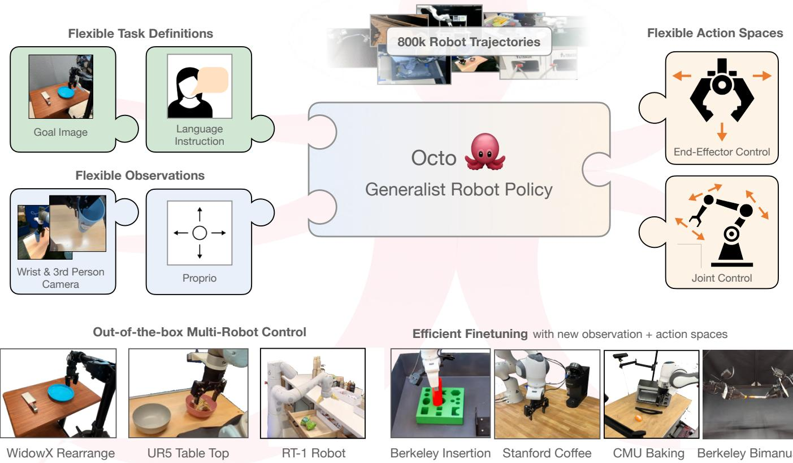
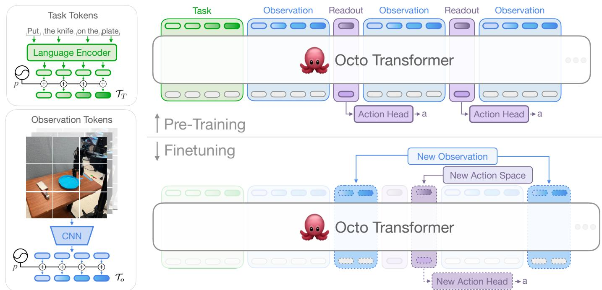
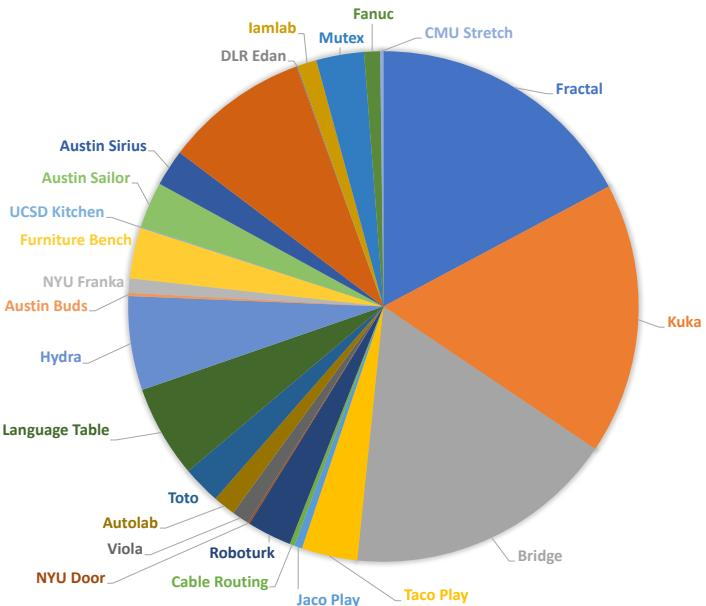
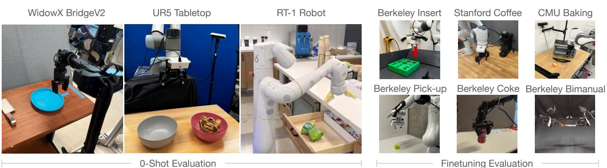
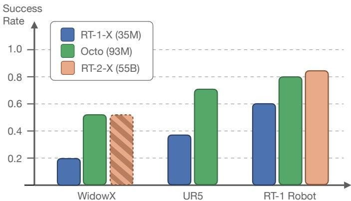
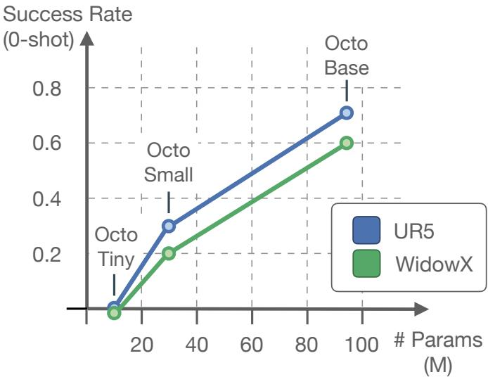

# 1. Bibliographic Information
## 1.1. Title
Octo: An Open-Source Generalist Robot Policy

The title clearly states the central topic of the paper: the introduction of a new robot policy named `Octo`. The key characteristics highlighted are that it is "open-source" and a "generalist" policy, meaning it is publicly available and designed to work across a variety of robots and tasks.

## 1.2. Authors
The authors are a large team from several prominent institutions in AI and robotics: Dibya Ghosh, Homer Walke, Karl Pertsch, Kevin Black, Oier Mees, Sudeep Dasari, Joey Hejna, Tobias Kreiman, Ria Doshi, Charles Xu, Jianlan Luo, You Liang Tan, Lawrence Yunliang Chen, Pannag Sanketi, Quan Vuong, Ted Xiao, Dorsa Sadigh, Chelsea Finn, and Sergey Levine.

The affiliations include UC Berkeley, Stanford University, Carnegie Mellon University (CMU), and Google Deepmind. These institutions and individuals are at the forefront of research in machine learning and robotics. Notably, Sergey Levine, Chelsea Finn, and Dorsa Sadigh are leading figures in robotic learning, which lends significant credibility to the work.

## 1.3. Journal/Conference
The paper was published as a preprint on arXiv. As of its publication date, it is not yet peer-reviewed or published in a specific conference or journal. However, arXiv is the standard platform for disseminating cutting-edge research in fields like machine learning, and papers from these authors and institutions are often precursors to publications at top-tier conferences like CoRL (Conference on Robot Learning), RSS (Robotics: Science and Systems), or NeurIPS (Conference on Neural Information Processing Systems).

## 1.4. Publication Year
The paper was first submitted to arXiv on May 20, 2024. The version analyzed here is v2, submitted shortly after.

## 1.5. Abstract
The abstract introduces the concept of **generalist robot policies (GRPs)**, which are large models pretrained on diverse robot datasets. The goal of such policies is to serve as a powerful starting point that can be quickly **finetuned** for new tasks with minimal in-domain data, avoiding the need to train policies from scratch. The authors argue that for a GRP to be widely useful, it must handle diverse sensors and action spaces, support common robot platforms, and be efficient to adapt.

To address this, the paper introduces **Octo**, a large transformer-based policy trained on 800,000 trajectories from the **Open X-Embodiment dataset**. Octo can be instructed via language commands or goal images. A key feature is its ability to be effectively finetuned for new robot setups—including those with new sensor inputs and action spaces—within a few hours on standard consumer GPUs. The authors demonstrate Octo's effectiveness across 9 different robotic platforms, showing it serves as a versatile policy initialization. The paper also includes detailed ablation studies on its design decisions (architecture, data, etc.) to guide future research.

## 1.6. Original Source Link
- **Original Source Link:** https://arxiv.org/abs/2405.12213
- **PDF Link:** https://arxiv.org/pdf/2405.12213v2.pdf

  The paper is available as a preprint on arXiv, a repository for academic articles that have not yet undergone formal peer review.

# 2. Executive Summary
## 2.1. Background & Motivation
The traditional approach to robotic learning involves training a separate policy for each specific robot, task, and environment. This "from scratch" method is highly inefficient, requiring substantial data collection for every new application. The resulting policies often have poor **generalization**, meaning they fail when faced with even slight variations in the task or environment.

In recent years, fields like natural language processing (e.g., GPT-4) and computer vision (e.g., Segment Anything) have seen a paradigm shift towards **foundation models**—large-scale models pretrained on vast, diverse datasets that can be adapted to a wide range of downstream tasks. The robotics community has been striving to create an equivalent "general-purpose robot model." However, this presents unique challenges not found in other domains:
*   **Embodiment Diversity:** Robots have different physical forms (morphologies), such as number of arms, types of grippers, and mobility.
*   **Sensor Diversity:** Robots use various sensors, including different numbers and placements of cameras (e.g., static "third-person" cameras, cameras on the wrist), force-torque sensors, and proprioceptive sensors (which measure the robot's own joint positions).
*   **Action Space Diversity:** Robots are controlled in different ways, such as commanding end-effector positions, joint angles, or torques.
*   **Accessibility:** The most powerful existing generalist robot models are often proprietary and not publicly available, hindering broader research and application.

    The paper's entry point is to tackle these challenges by creating a **generalist robot policy (GRP)** that is not only powerful but also **flexible, adaptable, and open-source**. The authors aim to lay the groundwork for a truly versatile foundation model for robotic manipulation that the entire research community can use, build upon, and adapt to their specific needs.

## 2.2. Main Contributions / Findings
The paper presents several key contributions to the field of robotic learning:

1.  **Octo, an Open-Source Generalist Robot Policy:** The primary contribution is **Octo**, a large transformer-based policy. It is pretrained on an unprecedented scale of 800,000 robot manipulation trajectories from the Open X-Embodiment dataset, making it one of the largest and most diverse robot policies to date.

2.  **Architectural Flexibility for Finetuning:** Octo features a novel modular design. Its transformer architecture can process arbitrary input tokens (from images, language, etc.) and map them to output action tokens. This allows users to easily adapt the model to robots with **new sensor inputs** (e.g., adding a force-torque sensor) or **new action spaces** (e.g., switching from end-effector to joint control) by adding or replacing small "adapter" modules and finetuning, without retraining the entire model.

3.  **State-of-the-Art Performance:**
    *   **Zero-Shot Control:** Out-of-the-box, Octo successfully controls multiple different robots for various tasks, outperforming the best existing open-source GRP (`RT-1-X`).
    *   **Data-Efficient Finetuning:** Octo serves as an excellent starting point for learning new tasks. When finetuned on a small amount of data (~100 demonstrations), it achieves significantly higher success rates than training from scratch or using powerful pretrained visual models like `VC-1`. This finetuning is efficient, taking only a few hours on a consumer-grade GPU.

4.  **Comprehensive Open-Sourcing:** The authors release the entire ecosystem:
    *   Pretrained model checkpoints (`Octo-Small` and `Octo-Base`).
    *   The complete pretraining and finetuning code pipeline.
    *   Optimized data loaders for the massive Open X-Embodiment dataset.
        This open approach is a major contribution, aiming to accelerate community-wide research in robotics.

5.  **In-depth Ablation Studies:** The paper provides a detailed analysis of key design choices, offering valuable insights for future research on GRPs. For instance, they show that transformer-first architectures (like `ViT`), diffusion-based action prediction, and training on highly diverse data mixtures are crucial for performance.

# 3. Prerequisite Knowledge & Related Work
## 3.1. Foundational Concepts
To fully understand the paper, it is essential to be familiar with the following concepts.

### 3.1.1. Imitation Learning (IL)
**Imitation Learning** is a machine learning paradigm where an agent learns to perform a task by observing and mimicking demonstrations provided by an expert (often a human). Instead of learning through trial and error like in reinforcement learning, the model is trained to predict the expert's actions given the same observations. This is typically framed as a supervised learning problem, where the model (the policy) learns a mapping from observations (e.g., camera images) to actions (e.g., robot motor commands). Octo is trained primarily using imitation learning on a massive dataset of expert demonstrations.

### 3.1.2. Transformer Architecture and Vision Transformer (ViT)
The **Transformer** is a neural network architecture that has revolutionized sequence processing tasks, initially in natural language processing. Its key innovation is the **self-attention mechanism**.

A self-attention mechanism allows the model to weigh the importance of different elements (tokens) in an input sequence when producing a representation for each element. This enables it to capture long-range dependencies and complex relationships within the data. The standard formula for scaled dot-product attention is:
\$
\mathrm{Attention}(Q, K, V) = \mathrm{softmax}\left(\frac{QK^T}{\sqrt{d_k}}\right)V
\$
*   **$Q$ (Query), $K$ (Key), $V$ (Value):** These are matrices derived from the input embeddings. For each token, its Query vector is matched against the Key vectors of all other tokens to compute attention scores.
*   **$\frac{QK^T}{\sqrt{d_k}}$:** The dot product between Queries and Keys computes a similarity score. This is scaled by $\sqrt{d_k}$ (where $d_k$ is the dimension of the key vectors) for numerical stability.
*   **$\mathrm{softmax}$:** This function converts the scores into a probability distribution, representing the "attention" weights.
*   **$V$ (Value):** The final output for each token is a weighted sum of all Value vectors, where the weights are the computed attention scores.

    A **Vision Transformer (ViT)** adapts this architecture for image processing. It works by:
1.  Splitting an input image into a sequence of fixed-size, non-overlapping patches.
2.  Linearly embedding each patch into a vector.
3.  Adding positional embeddings to retain spatial information.
4.  Processing this sequence of "image tokens" with a standard Transformer encoder.

    Octo uses a ViT-style architecture, tokenizing camera images into patches and processing them alongside language and other inputs in a unified Transformer backbone.

### 3.1.3. Denoising Diffusion Probabilistic Models (DDPM)
**Diffusion models** are a class of generative models that have achieved state-of-the-art results in generating high-quality data, such as images. They work in two stages:
1.  **Forward Process:** A fixed process that gradually adds Gaussian noise to a data sample (e.g., an image or, in this case, a robot action) over a series of timesteps, eventually turning it into pure noise.
2.  **Reverse Process:** A learned neural network is trained to reverse this process. Starting from pure noise, it iteratively removes the noise step-by-step to reconstruct a clean data sample.

    Octo uses a diffusion model as its **action head**. Instead of directly predicting an action, it starts with a random noise vector and "denoises" it over several steps into a final, precise action. This approach is powerful because it can model complex, multi-modal action distributions (i.e., situations where multiple different actions could be correct), which is a common challenge in robotics.

### 3.1.4. Action Chunking
**Action chunking** is a technique where a policy, instead of predicting just the single next action at each timestep, predicts a short sequence (a "chunk") of future actions. For example, it might predict the next 8 actions the robot should take. This can lead to smoother and more coherent motions compared to predicting one action at a time. Octo predicts a chunk of actions, which are then executed sequentially by the robot controller.

## 3.2. Previous Works
The paper situates Octo within the context of several lines of prior research:

*   **Single-Embodiment Large-Scale Learning:** Many works have explored scaling up data collection for a single robot to train powerful policies. Examples include `QT-Opt` [41], which used reinforcement learning on a large dataset, and `RT-1` [10], which used a transformer-based policy trained on 130k demonstrations for a single robot type. While successful, these models are tied to a specific robot embodiment.

*   **Generalist Robot Policies (GRPs):** More recent work has focused on training policies across multiple robot types.
    *   `GNM` [80] and `ViNT` [81] are generalist models for robot navigation, but not manipulation.
    *   `RoboCat` [9] is a goal-conditioned model that handles multiple robot arms but was not publicly released.
    *   `RT-X` [67] (which includes `RT-1-X` and `RT-2-X`) was a major step, demonstrating zero-shot control across five robot embodiments by co-training on the Open X-Embodiment dataset. However, these models have limitations: they are not designed for easy finetuning to new observation/action spaces, and the largest models are not open-source.

*   **Diffusion for Robot Policies:** The use of diffusion models for action decoding, as seen in `Diffusion Policy` [17], has shown promise for learning precise and multi-modal behaviors. Octo is the first work to integrate this technique into a large-scale, cross-embodied generalist policy.

*   **Open X-Embodiment Dataset:** This is the foundational dataset upon which Octo is built. It is a massive, collaborative effort to pool dozens of existing robot manipulation datasets into one [67]. Octo uses a curated subset of 800k trajectories from this dataset, which is significantly larger than the 350k used to train the original `RT-X` models.

## 3.3. Technological Evolution
The field has evolved from training specialized policies on small, task-specific datasets to a paradigm increasingly dominated by large-scale pretraining on diverse data.

1.  **Early Stage:** Single-robot, single-task learning.
2.  **Scaling Up:** Large datasets for a single robot, enabling better generalization for that specific embodiment (e.g., `RT-1`).
3.  **Cross-Embodiment Learning:** Training a single model on data from multiple robots to create a generalist policy (e.g., `RoboCat`, `RT-X`).
4.  **Flexible Foundation Models:** The stage Octo represents. The focus is not only on generalization but also on creating an **open, accessible, and highly adaptable** foundation model that can be easily finetuned for a wide variety of downstream applications, even those with different hardware.

## 3.4. Differentiation Analysis
Octo's key innovations compared to prior work, especially `RT-X`, are:

*   **Openness and Accessibility:** Unlike `RT-2-X` or `RoboCat`, Octo's models, training code, and data loaders are fully open-source, making it a community resource.
*   **Architectural Flexibility:** Prior models like `RT-1` hard-code the number and type of camera inputs. Octo's token-based architecture is modular. Adding a new sensor or changing the action space only requires adding a small new encoder or head and finetuning, leaving the large pretrained transformer backbone intact. This is a critical feature for practical, real-world robotics where setups vary widely.
*   **Scale of Training Data:** Octo is trained on 800k trajectories, more than double the 350k used for `RT-X`, demonstrating the benefits of scaling up data diversity and volume.
*   **Advanced Action Head:** Octo integrates a diffusion decoding head, which the paper shows outperforms the discretized action prediction of `RT-1` and `RT-2-X` and simple Mean Squared Error (MSE) regression.

    This image from the paper illustrates Octo's flexible framework, handling various inputs and enabling finetuning.

    
    *该图像是一个示意图，展示了Octo通用机器人策略的框架。图中说明了任务定义（语言指令和目标图像）、灵活的观测（摄像头和本体感受器）、多机器人控制及高效微调能力，强调了使用80万轨迹训练和支持多种动作空间的特点。*

# 4. Methodology
## 4.1. Principles
The core design principle of Octo is to create a **flexible and scalable** policy architecture that can handle heterogeneous inputs and outputs. The model achieves this by converting all inputs—regardless of their modality (images, language, etc.)—into a unified sequence of "tokens." A single, powerful Transformer backbone then processes this token sequence to produce embeddings, which are finally decoded into robot actions. This modular, token-based design is what enables efficient adaptation to new robots and tasks, as new sensors or action spaces can be integrated by simply adding new tokenizers or decoders without altering the pretrained core of the model.

## 4.2. Core Methodology In-depth
The Octo model, $\pi$, can be broken down into three main components: input tokenizers, a Transformer backbone, and readout heads. The following diagram from the paper provides a high-level overview of the architecture for pre-training and finetuning.

*该图像是一个示意图，展示了Octo Transformer模型的预训练与微调流程。图中包含语言编码器将任务描述转成任务tokens，卷积神经网络提取观察tokens，以及模型如何通过预训练和微调适配新的观察和动作空间。*

### 4.2.1. Input Tokenization and Sequencing
The first step is to convert all inputs—task specifications and observations—into a common token format.

*   **Language Inputs ($\ell$):** Natural language instructions (e.g., "pick up the apple") are first tokenized using a standard text tokenizer and then passed through a pretrained `T5-base` language model. This produces a sequence of language embedding tokens, $\mathcal{T}_l$.
*   **Image Inputs (Observations $o$ and Goals $g$):** RGB images, whether from a third-person camera, a wrist camera, or a goal image, are processed by a shallow stack of convolutional layers. The resulting feature map is then split into a grid of patches, and each patch is flattened into a vector, creating a sequence of image tokens. This is the standard `ViT` approach.
*   **Input Sequence Assembly:** All tokens from the different modalities are concatenated into a single long sequence. To retain temporal and spatial information, learnable **positional embeddings** are added to each token. The final input sequence to the transformer has the structure: $[\mathcal{T}_T, \mathcal{T}_{o,1}, \mathcal{T}_{o,2}, \ldots]$, where $\mathcal{T}_T$ represents task tokens (language or goal image) and $\mathcal{T}_{o,t}$ represents the observation tokens at timestep $t$.

### 4.2.2. Transformer Backbone
The assembled token sequence is processed by the main Transformer backbone.

*   **Architecture:** The backbone is a standard Transformer encoder, consisting of multiple layers of self-attention and feed-forward networks. The paper experiments with different sizes, such as `Octo-Small` (27M parameters) and `Octo-Base` (93M parameters).
*   **Attention Masking:** A crucial design choice is the **block-wise causal attention mask**. This mask controls which tokens can "see" which other tokens:
    *   Observation tokens at a given timestep $t$ can attend to all task tokens ($\mathcal{T}_T$) and all past and present observation tokens ($\mathcal{T}_{o,0:t}$). They cannot attend to future observation tokens. This enforces causality.
    *   Task tokens can attend to each other.
    *   If a modality is missing for a given data sample (e.g., no language instruction), its corresponding tokens are completely masked out. This allows the model to flexibly handle datasets with different available information.
*   **Readout Tokens ($\mathcal{T}_{R,t}$):** In addition to the input tokens, special learned `readout tokens` are inserted into the sequence at each timestep $t$. These tokens function similarly to the `[CLS]` token in BERT. They can attend to all preceding task and observation tokens but are **not attended to by any other tokens**. This makes them passive "readers" that aggregate information from the sequence up to timestep $t$ into a compact embedding, $e_t$. This embedding serves as the context for action prediction.

### 4.2.3. Action Prediction via Diffusion Head
The final step is to decode the readout embedding $e_t$ into a robot action. Octo uses a conditional diffusion decoding head for this purpose.

*   **Action Chunking:** The model predicts a "chunk" of several consecutive actions at once, rather than a single action.
*   **Conditional Diffusion Process:** The action prediction is formulated as a denoising process. To generate an action, the model first samples a vector of pure Gaussian noise, $x^K \sim \mathcal{N}(0, I)$. It then iteratively refines this noise over $K$ steps using a learned denoising network, $\epsilon_\theta$. The update rule for each denoising step is given by:
    \$
    x ^ { k - 1 } = \alpha ( x ^ { k } - \gamma \epsilon _ { \theta } ( x ^ { k } , e , k ) + \mathcal { N } \big ( 0 , \sigma ^ { 2 } I \big ) ) .
    \$
    Let's break down this formula:
    *   $x^k$: The noisy action vector at denoising step $k$ (starting with $x^K$ as pure noise).
    *   $e$: The conditioning embedding from the transformer's readout token, which provides the context (current state and task).
    *   $k$: The current denoising step index.
    *   $\epsilon_\theta(x^k, e, k)$: The neural network that predicts the noise contained in $x^k$, conditioned on the context $e$ and step $k$. This network is a small MLP, making the denoising process computationally cheap after the single expensive forward pass through the main transformer.
    *   $\alpha, \gamma, \sigma$: Hyperparameters determined by a predefined **noise schedule** (the paper uses a cosine schedule). They control how the prediction is combined with the previous noisy vector and how much new noise is added at each step.
*   **Training Objective:** The diffusion head is trained using the standard DDPM objective. During training, a ground-truth action from the dataset is taken, noise is added to it according to a random timestep $k$, and the network $\epsilon_\theta$ is trained with a simple loss function (typically MSE) to predict the added noise.

### 4.2.4. Finetuning on New Setups
The modular architecture is key to Octo's adaptability.
*   **New Observation Space:** To adapt to a robot with a new sensor (e.g., force-torque), a new lightweight tokenizer for that sensor is added, along with new positional embeddings for its tokens. The pretrained weights for the transformer backbone and existing tokenizers are kept. The model is then finetuned on a small dataset from the new robot.
*   **New Action Space:** To adapt to a robot with a different action space (e.g., joint position control instead of end-effector control), the pretrained action head is replaced with a new one, and the full model is finetuned.

    This approach allows leveraging the powerful general-purpose representations learned by the large transformer backbone, enabling rapid adaptation with minimal data and compute.

# 5. Experimental Setup
## 5.1. Datasets
The experiments rely on a diverse set of robotic manipulation datasets.

*   **Pretraining Dataset:** Octo is pretrained on a curated subset of the **Open X-Embodiment dataset**. The authors selected 25 datasets that feature image observations and end-effector delta control. This resulted in a massive training set of **800,000 trajectories**. The mixture includes data from various robots like the Franka Emika Panda, UR5, WidowX, and Google's proprietary robots. The composition of this training data is shown in the pie chart below (Figure 3 from the paper).

    
    *该图像是一个饼图，展示了多个机器人平台在Octo训练数据集中的占比情况，各平台名称以不同颜色标注，反映了数据多样性和分布。*

    The authors manually adjusted the sampling weights to up-weight more diverse datasets and down-weight those with many repetitive episodes.

*   **Finetuning & Evaluation Setups:** The model's capabilities are evaluated across 9 different robot setups at 4 institutions. These setups are designed to test zero-shot performance and data-efficient finetuning on tasks involving new robots, new sensors, and new action spaces. The various experimental environments are depicted in the collage below.

    
    *该图像是多幅实验环境照片的拼图，展示了Octo模型在多种机器人平台上的零样本评估和微调评估场景，包括WidowX BridgeV2、UR5 Tabletop、RT-1 Robot等机器人操作不同物体的实际应用。*

    Examples of finetuning tasks include:
    *   **Berkeley Insertion:** A UR5 arm inserts a peg into a hole, requiring the use of a new **force-torque sensor** input.
    *   **Berkeley Pick-Up:** A Franka arm picks up a block, but the robot is controlled via a new **joint position action space**.
    *   **Berkeley Bimanual:** An ALOHA bimanual robot (two arms) uncaps a marker, requiring adaptation to a new **dual-arm embodiment and action space**.
    *   **Stanford Coffee:** A Franka arm places a coffee pod into a Keurig machine, a task requiring high precision.

        For finetuning, small datasets of ~100 demonstrations were used for each task.

## 5.2. Evaluation Metrics
The primary evaluation metric used throughout the paper is **Success Rate**.

*   **Conceptual Definition:** The success rate measures the percentage of trials in which the robot policy successfully completes the assigned task. A trial is deemed successful if the robot achieves the final goal state (e.g., the object is in the correct place, the drawer is closed). It is a direct and intuitive measure of task performance.

*   **Mathematical Formula:**
    \$
    \text{Success Rate} (\%) = \frac{\text{Number of Successful Trials}}{\text{Total Number of Trials}} \times 100\%
    \$

*   **Symbol Explanation:**
    *   `Number of Successful Trials`: The count of experimental runs where the task was completed successfully.
    *   `Total Number of Trials`: The total number of experimental runs conducted for a given task or setup.

## 5.3. Baselines
Octo is compared against several representative baseline methods for both zero-shot evaluation and finetuning.

*   **Zero-Shot Baselines:**
    *   `RT-1-X`: The best openly available generalist robot policy from the `RT-X` model family [67]. Like Octo, it is pretrained on the Open X-Embodiment dataset (though a smaller subset) and is designed for zero-shot control.
    *   `RT-2-X`: A massive 55-billion parameter vision-language-action model, also from the `RT-X` family. It represents the state-of-the-art in large-scale robotic models but is not open-source.

*   **Finetuning Baselines:**
    *   `ResNet+Transformer Scratch`: A strong, canonical policy architecture trained from scratch on only the small target domain dataset (~100 demos). It consists of a ResNet visual encoder and a small transformer decoder, a common design in prior work. This baseline measures the benefit of Octo's pretraining.
    *   `VC-1`: A policy that uses a powerful, state-of-the-art visual representation model, `VC-1`, as its visual encoder. The `VC-1` model is pretrained on a massive dataset of egocentric human videos. This baseline tests whether a general-purpose visual foundation model is sufficient for good performance, or if pretraining on robot-specific data (as Octo does) is more beneficial.

# 6. Results & Analysis
## 6.1. Core Results Analysis
The experimental results strongly validate Octo's effectiveness as both a zero-shot controller and a powerful initialization for finetuning.

### 6.1.1. Zero-Shot Multi-Robot Control
The bar chart below (Figure 5 from the paper) shows Octo's zero-shot performance compared to `RT-1-X` and `RT-2-X` on tasks seen during pretraining.

*该图像是一个柱状图，展示了三种机器人策略（RT-1-X、Octo和RT-2-X）在WidowX、UR5和RT-1 Robot平台上的成功率对比。Octo模型在所有平台上均表现优于RT-1-X，在RT-1 Robot上与RT-2-X表现相近。*

*   **Octo vs. RT-1-X:** Octo consistently and significantly outperforms `RT-1-X`, the best available open-source baseline, across all three tested robot platforms (WidowX, UR5, and RT-1 Robot). On average, Octo achieves a 29% higher success rate.
*   **Octo vs. RT-2-X:** Despite being much smaller (93M parameters vs. 55B), Octo achieves performance comparable to `RT-2-X` on the tasks where both were evaluated.
*   **Goal-Image Conditioning:** The authors also note that Octo's performance is even higher when conditioned on goal images instead of language instructions (e.g., 25% higher on WidowX tasks), highlighting the benefit of its multi-modal task specification capabilities.

### 6.1.2. Data-Efficient Finetuning
The results for finetuning on new domains are presented in Table I from the paper, which demonstrates Octo's ability to adapt to new tasks, sensors, and action spaces.

The following are the results from Table I of the original paper:

<table>
<thead>
<tr>
<th></th>
<th>Berkeley Insertion*</th>
<th>Stanford Coffee</th>
<th>CMU Baking</th>
<th>Berkeley Pick-Up†</th>
<th>Berkeley Coke</th>
<th>Berkeley Bimanual†</th>
<th>Average</th>
</tr>
</thead>
<tbody>
<tr>
<td>ResNet+Transformer Scratch</td>
<td>10%</td>
<td>45%</td>
<td>25%</td>
<td>0%</td>
<td>20%</td>
<td>20%</td>
<td>20%</td>
</tr>
<tr>
<td>VC-1 [57]</td>
<td>5%</td>
<td>0%</td>
<td>30%</td>
<td>0%</td>
<td>10%</td>
<td>50%</td>
<td>15%</td>
</tr>
<tr>
<td><b>Octo (Ours)</b></td>
<td><b>70%</b></td>
<td><b>75%</b></td>
<td><b>50%</b></td>
<td><b>60%</b></td>
<td><b>100%</b></td>
<td><b>80%</b></td>
<td><b>72%</b></td>
</tr>
</tbody>
</table>

*Note: `*` indicates a new observation input (force-torque). `†` indicates a new action space (joint position control) or embodiment (bimanual).*

*   **Superior Performance:** Finetuning Octo leads to dramatically better results than both baselines. On average, Octo's success rate is **72%**, compared to 20% for training from scratch and 15% for using the `VC-1` pretrained visual encoder. This shows that pretraining on diverse *robot data* is more effective than using general-purpose visual models or training from scratch.
*   **Adaptability to New I/O:** Crucially, Octo excels in the most challenging scenarios.
    *   In `Berkeley Insertion`, which requires a new **force-torque sensor** input, Octo achieves 70% success, while baselines are at 10% or less.
    *   In `Berkeley Pick-Up` (new **joint control** action space) and `Berkeley Bimanual` (new **bimanual** robot), Octo achieves 60% and 80% success respectively, where baselines largely fail. This confirms the effectiveness of its flexible architecture.

## 6.2. Ablation Studies / Parameter Analysis
The authors conducted a series of ablation studies to dissect which design decisions were most critical to Octo's success. The results are summarized in Table II and Figure 6.

### 6.2.1. Ablation of Design Choices
The following are the results from Table II of the original paper, evaluated on the WidowX setup:

<table>
<thead>
<tr>
<th colspan="2"></th>
<th>Aggregate Performance</th>
</tr>
</thead>
<tbody>
<tr>
<td colspan="2"><b>Octo-Small (Ours)</b></td>
<td><b>83%</b></td>
</tr>
<tr>
<td rowspan="2">Training Data</td>
<td>RT-X dataset mix [67]</td>
<td>60%</td>
</tr>
<tr>
<td>Single robot dataset (Bridge Data)</td>
<td>43%</td>
</tr>
<tr>
<td rowspan="2">Training Objective</td>
<td>Discretized Action Prediction [67]</td>
<td>18%</td>
</tr>
<tr>
<td>Continuous Action Prediction (MSE)</td>
<td>35%</td>
</tr>
<tr>
<td>Architecture</td>
<td>Resnet-50 + Transformer[67]</td>
<td>70%</td>
</tr>
</tbody>
</table>

*   **Training Data:** The diversity of the training data is paramount. The full Octo data mixture (83%) significantly outperforms the smaller `RT-X` mixture (60%) and training on only a single robot's data (43%). This confirms the "more diverse data is better" hypothesis.
*   **Training Objective:** The `diffusion` action head is critical. It achieves 83% success, far surpassing simple `MSE` regression (35%), which suffers from "hedging" (producing averaged, non-committal actions), and `discretized action prediction` (18%), which lacks precision.
*   **Model Architecture:** The `ViT`-style ("transformer-first") architecture used by Octo (83%) is more effective for large-scale, diverse data than the `ResNet`-based encoder pipelines (70%) common in prior work.

### 6.2.2. Model Scaling
The paper also investigated how performance changes with model size. The chart below (Figure 6) shows a clear positive trend.

*该图像是图表，展示了Octo模型在UR5和WidowX机器人任务上的性能随模型规模增大而提高的趋势。横轴为参数数量（百万），纵轴为零次试验的成功率，Octo Base性能最佳。*

*   **Bigger is Better:** Performance improves as the model size increases from `Octo-Tiny` (10M params) to `Octo-Small` (27M) to `Octo-Base` (93M). The larger models are more robust and exhibit better visual understanding. This suggests that, like in NLP and vision, scaling up model size is a promising direction for improving robot policies.

### 6.2.3. Zero-shot Generalization Analysis
The following are the results from Table VII of the original paper, which analyzes zero-shot generalization on the WidowX setup.

<table>
<thead>
<tr>
<th>Generalization Type</th>
<th>Task</th>
<th>Success Rate</th>
<th>Average</th>
</tr>
</thead>
<tbody>
<tr>
<td rowspan="2">In-distribution</td>
<td>Put carrot on plate</td>
<td>80%</td>
<td rowspan="2">85%</td>
</tr>
<tr>
<td>Put eggplant in pot</td>
<td>90%</td>
</tr>
<tr>
<td rowspan="2">Novel objects</td>
<td>Put bread on plate</td>
<td>70%</td>
<td rowspan="2">80%</td>
</tr>
<tr>
<td>Put spoon on glove</td>
<td>90%</td>
</tr>
<tr>
<td rowspan="2">Novel environment</td>
<td>Put mushroom in pot</td>
<td>20%</td>
<td rowspan="2">40%</td>
</tr>
<tr>
<td>Put spoon on cloth</td>
<td>60%</td>
</tr>
<tr>
<td rowspan="2">Novel skill</td>
<td>Flip cup on its side</td>
<td>10%</td>
<td rowspan="2">5%</td>
</tr>
<tr>
<td>Put block in slot</td>
<td>0%</td>
</tr>
</tbody>
</table>

This table provides a more nuanced view of Octo's zero-shot capabilities. The model performs very well on tasks that are "in-distribution" (85%) or involve novel objects (80%). However, performance degrades significantly when generalizing to a novel environment (40%) and drops sharply for novel skills that require different behaviors not seen in the training data (5%). This indicates that while Octo has strong generalization to variations in objects and scenes, learning fundamentally new skills still requires at least some in-domain finetuning data.

# 7. Conclusion & Reflections
## 7.1. Conclusion Summary
The paper introduces **Octo**, a significant step towards a truly general-purpose, open-source foundation model for robotic manipulation. Octo is a large transformer-based policy trained on an unprecedented 800k trajectories. The work's main contributions are demonstrating that:
1.  A large, diverse pretraining dataset combined with a scalable architecture can produce a powerful zero-shot policy that controls multiple robots.
2.  A modular, token-based architecture allows for remarkable flexibility, enabling efficient finetuning to new robots with different sensors and action spaces.
3.  Key design choices, such as using a ViT-style backbone, a diffusion action head, and a highly diverse data mixture, are crucial for performance.

    By open-sourcing the model, code, and data infrastructure, the authors provide a valuable "launchpad" for the robotics community to build upon, accelerating research towards more capable and generalist robots.

## 7.2. Limitations & Future Work
The authors candidly discuss several limitations of the current Octo model and suggest avenues for future research:

*   **Data Imbalances:** The model struggles to effectively use wrist camera information and shows a performance gap between language- and goal-conditioned tasks. The authors attribute this to a lack of sufficient wrist camera data (only 27% of trajectories) and language annotations (56%) in the pretraining mixture.
*   **Need for More Diverse Data:** The current pretraining data consists entirely of optimal expert demonstrations. Future work could incorporate sub-optimal data, online interaction data, or data from human videos to learn more robustly.
*   **Limited Robot Morphologies:** Octo was trained and evaluated exclusively on single- and dual-arm manipulators. Expanding the model to handle a wider range of embodiments, such as mobile manipulators or legged robots, is a major direction for future work.
*   **Improving Language Grounding:** Despite using a T5 encoder, the model's ability to follow complex, free-form language instructions could be improved, likely by incorporating datasets with richer language annotations.

## 7.3. Personal Insights & Critique
This paper is a landmark contribution to the field of robotic learning, not just for the technical achievements of the Octo model but for its philosophy and execution.

*   **The Power of Openness:** The most impactful contribution is arguably the full open-sourcing of the entire project. In a field where the most advanced models are often kept proprietary, this provides an invaluable resource that can democratize research, lower the barrier to entry for smaller labs, and create a common platform for benchmarking and collaboration.

*   **Architecture as a Key Insight:** The emphasis on a flexible, modular architecture that can be adapted *after* pretraining is a crucial insight. It acknowledges the messy reality of robotics, where every lab has a slightly different setup. This design pragmatically balances the need for a large, generalist model with the practical requirement of specialization.

*   **Critique and Nuance:**
    *   **Data Curation:** The process for curating the 800k trajectories and weighting the datasets was somewhat heuristic (e.g., manually categorizing datasets as "more diverse"). A more principled, automated method for data selection and mixing could be a powerful area for future research. What truly constitutes "good data" for pretraining GRPs remains an open question.
    *   **Generalization vs. Memorization:** The zero-shot generalization analysis (Table VII) is very insightful. It shows that while the model is excellent at interpolating within its known skill distribution (e.g., picking and placing new objects), it struggles to extrapolate to fundamentally new skills (e.g., flipping, precise insertion). This suggests that current GRPs are more like massive "skill libraries" than true problem solvers, and learning novel behaviors still requires targeted finetuning.
    *   **Embodiment Gap:** The challenge of adapting to a bimanual robot from single-arm data (requiring a new action head and finetuning) highlights the persistent difficulty of bridging significant morphological gaps. True "any-robot" control remains a distant goal.

        Overall, Octo is a well-executed piece of engineering and research that successfully combines several state-of-the-art techniques into a practical and powerful system. It sets a new standard for open-source foundation models in robotics and provides a clear roadmap for future progress.