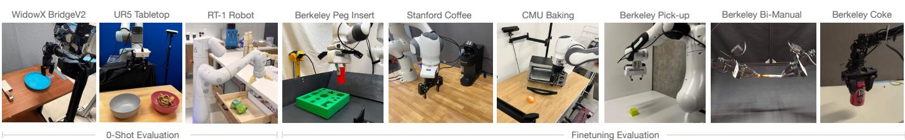

# 1. 论文基本信息

## 1.1. 标题
Octo: 一个开源的通用机器人策略 (Octo: An Open-Source Generalist Robot Policy)

## 1.2. 作者
论文作者团队来自多个顶尖学术机构和公司，包括加州大学伯克利分校 (UC Berkeley)、斯坦福大学 (Stanford)、卡内基梅隆大学 (Carnegie Mellon University) 和谷歌 Deepmind。这表明了该研究是学术界和工业界在前沿机器人学习领域的一次重要合作。主要作者包括 Dibya Ghosh, Homer Walke, Karl Pertsch, Kevin Black 等，指导教授为 Dorsa Sadigh, Chelsea Finn 和 Sergey Levine，均为机器人和机器学习领域的知名学者。

## 1.3. 发表期刊/会议
该论文于 2024 年 5 月 20 日提交至预印本网站 arXiv.org。arXiv 是一个开放获取的学术论文存档库，常用于快速传播最新的研究成果。需要注意的是，预印本论文通常未经同行评审（Peer Review），但它已成为机器学习和机器人领域分享前沿工作的主流方式。

## 1.4. 发表年份
2024

## 1.5. 摘要
大型、在多样化机器人数据集上预训练的策略，有潜力改变机器人学习领域：这类<strong>通用机器人策略 (generalist robot policies)</strong> 可以仅用少量领域内数据进行微调，却能实现广泛的泛化能力，而无需从零开始训练新策略。然而，为了在各种机器人学习场景、环境和任务中广泛适用，这类策略需要处理多样的传感器和动作空间，适应各种常用的机器人平台，并能轻松高效地微调到新领域。在这项工作中，作者旨在为开发开源、广泛适用、通用的机器人操作策略奠定基础。作为第一步，他们引入了 **Octo**，一个基于 Transformer 的大型策略，它在迄今为止最大的机器人操作数据集——Open X-Embodiment 数据集的 80 万条轨迹上进行了训练。Octo 可以通过语言指令或目标图像进行引导，并能在几小时内，使用标准消费级 GPU 高效地微调到具有新传感输入和动作空间的机器人设置上。通过在 9 个机器人平台上的实验，作者证明了 Octo 可以作为一个通用的策略初始化，能被有效地微调到新的观察和动作空间。作者还对 Octo 模型的设计决策（从架构到训练数据）进行了详细的消融实验，为未来构建通用机器人模型的研究提供指导。

## 1.6. 原文链接
- **原文链接:** [https://arxiv.org/abs/2405.12213](https://arxiv.org/abs/2405.12213)
- **PDF 链接:** [https://arxiv.org/pdf/2405.12213v2.pdf](https://arxiv.org/pdf/2405.12213v2.pdf)
- **发布状态:** 预印本 (Preprint)

  ---

# 2. 整体概括

## 2.1. 研究背景与动机
传统的机器人学习方法存在一个核心痛点：**高度的定制化和数据依赖性**。通常，每当需要让一个机器人学习一项新任务时，研究人员都必须为这个特定的机器人和任务收集大量数据，并从零开始训练一个策略模型。这种方式不仅耗时耗力，而且训练出的策略通常泛化能力很差，难以适应环境或任务的微小变化。

近年来，在自然语言处理（如 GPT 系列）和计算机视觉（如 SAM）领域，<strong>基础模型 (Foundation Models)</strong> 的成功证明了“大规模预训练 + 下游任务微调”范式的巨大威力。然而，将这一范式成功迁移到机器人领域却面临着独特的挑战：
1.  <strong>异构性 (Heterogeneity):</strong> 机器人世界充满了多样性。不同的机器人有不同的物理形态（“embodiments”，如机械臂、人形机器人）、传感器（如不同位置的摄像头、力/力矩传感器）和动作空间（如控制末端执行器位置、控制关节角度）。
2.  **数据稀缺与孤岛:** 与可以从互联网上轻易获取海量文本和图像数据不同，高质量的机器人操作数据难以大规模获取，且现有的数据集通常分散在不同研究团队，形成了“数据孤岛”。
3.  **适应性差:** 先前的一些通用机器人模型（如 RT-X）虽然取得了显著进展，但它们通常是闭源的，并且对下游用户的输入输出格式有严格限制。例如，用户必须使用和预训练时完全一样的摄像头配置和动作空间，这极大地限制了模型的实际应用范围。如果想适配新的传感器或机器人，往往需要重新训练模型的大部分组件，成本高昂。

    **这篇论文的切入点**正是为了解决上述问题，特别是第三点。作者的目标是创建一个<strong>真正开放、灵活且易于扩展的通用机器人策略 (Generalist Robot Policy, GRP)</strong>，它不仅能从海量异构数据中学习，更重要的是，能让广大研究者和开发者轻松地将其<strong>微调 (fine-tuning)</strong> 到自己独特的机器人和任务上，即使这些机器人的传感器和动作空间在预训练时从未见过。

## 2.2. 核心贡献/主要发现
这篇论文的核心贡献可以总结为以下几点：

1.  **发布 Octo 模型:** 提出了 Octo，一个基于 Transformer 架构的通用机器人操作策略。该模型通过精心设计，实现了对不同输入（语言、目标图像、多摄像头）和输出（不同动作空间）的灵活支持。

2.  **最大规模的训练:** Octo 在 **Open X-Embodiment 数据集** 的一个精心筛选的子集（包含 25 个不同数据集的 80 万条轨迹）上进行了预训练，这是迄今为止用于训练机器人操作策略的最大、最多样化的数据集。

3.  **为微调而生的架构:** Octo 的架构设计（特别是其模块化的输入和“readout token”机制）使其能够**高效地微调到新的观察空间和动作空间**。例如，可以为模型添加一个新的力/力矩传感器输入，或将动作输出从末端位置控制改为关节角度控制，而只需训练少量新增的参数和微调原有模型，整个过程在消费级 GPU 上几小时内即可完成。

4.  **全面开源:** 论文团队**开源了所有相关资源**，包括：
    *   预训练好的 Octo 模型权重（27M 和 93M 两种规模）。
    *   完整的预训练和微调代码。
    *   用于处理 Open X-Embodiment 数据集的高效数据加载器。
        这极大地降低了社区使用和复现该工作的门槛，是推动领域发展的一大贡献。

5.  **详尽的实验验证与分析:**
    *   论文在 9 种不同的机器人上验证了 Octo 的性能，证明了其在多种任务上的<strong>零样本 (zero-shot)</strong> 控制能力，并超越了之前最好的开源模型 RT-1-X。
    *   更重要的是，实验证明了 Octo 作为**策略初始化的巨大价值**，微调后的性能远超从零开始训练或使用预训练视觉模型。
    *   通过全面的<strong>消融实验 (Ablation Studies)</strong>，论文深入探讨了模型架构、训练数据、训练目标等关键设计选择对最终性能的影响，为后续研究提供了宝贵的经验。

        ---

# 3. 预备知识与相关工作

## 3.1. 基础概念

### 3.1.1. 通用机器人策略 (Generalist Robot Policy, GRP)
这是一种旨在控制多种不同机器人、在多种环境中执行多种任务的单一策略模型。与为每个特定任务训练一个专用模型的传统方法相反，GRP 的目标是通过在极其多样化的数据上进行训练，学习到一种通用的“机器人行为”先验知识，从而能够快速适应新任务或零样本泛化到新场景。

### 3.1.2. 模仿学习 (Imitation Learning)
这是机器人学习的一种主流范式，其核心思想是让机器人通过“模仿”专家（通常是人类）的演示来学习技能。Octo 的训练就基于模仿学习，它学习从给定的观察（如图像）映射到专家在类似情况下会执行的动作。这种方法的优点是不需要复杂的奖励函数设计，但其性能上限受限于演示数据的质量和覆盖范围。

### 3.1.3. Transformer 架构
Transformer 最初是为自然语言处理任务设计的神经网络架构，现已广泛应用于视觉、语音等多个领域。其核心是<strong>自注意力机制 (self-attention mechanism)</strong>。
*   **基本思想:** Transformer 将输入数据（如一句话或一张图的多个图块）视为一个<strong>序列 (sequence)</strong> 的<strong>词元 (tokens)</strong>。对于序列中的每一个词元，自注意力机制会计算它与序列中所有其他词元之间的“相关性”或“注意力分数”，然后根据这些分数对所有词元的信息进行加权求和，从而得到该词元的新表示。这个新表示不仅包含了词元自身的信息，还动态地融入了全局上下文信息。
*   **关键公式:** 自注意力机制的计算可以简洁地表示为：
    $$
    \mathrm{Attention}(Q, K, V) = \mathrm{softmax}\left(\frac{QK^T}{\sqrt{d_k}}\right)V
    $$
*   **符号解释:**
    *   $Q$ (Query, 查询): 当前词元为了获取信息而发出的“查询”向量。
    *   $K$ (Key, 键): 序列中其他词元用来被“查询”的“键”向量。
    *   $V$ (Value, 值): 序列中其他词元实际包含的信息“值”向量。
    *   $QK^T$: 计算查询向量 $Q$ 和所有键向量 $K$ 的点积，得到注意力分数。
    *   $\sqrt{d_k}$: 缩放因子，其中 $d_k$ 是键向量的维度，用于稳定梯度。
    *   $\mathrm{softmax}$: 将分数归一化，使其成为总和为 1 的权重。
    *   $V$: 用归一化后的权重对所有值向量进行加权求和。
        在 Octo 中，Transformer 被用来处理由任务指令、历史图像观察等组成的序列，从而理解当前状态并决策下一步的动作。

### 3.1.4. 扩散模型 (Diffusion Models)
扩散模型是一类强大的生成模型，尤其擅长生成高质量、高维度的连续数据（如图像）。
*   **核心过程:**
    1.  <strong>前向过程（加噪）:</strong> 在一个训练样本（如一个专家动作向量）上，逐步、多次地添加少量高斯噪声，直到它完全变成纯粹的随机噪声。
    2.  <strong>反向过程（去噪）:</strong> 训练一个神经网络（去噪网络），让它学会在给定噪声水平和一些条件信息（如当前的机器人观察）的情况下，预测并移除噪声，从而从纯噪声逐步恢复出原始的、干净的样本。
*   **在 Octo 中的应用:** Octo 使用扩散模型作为其<strong>动作解码头 (action head)</strong>。这种方法被称为 **Diffusion Policy**。它不直接预测一个确定的动作，而是学习一个能够生成符合专家行为分布的动作的去噪过程。这使得模型能更好地处理<strong>多模态 (multi-modal)</strong> 的动作分布（即在同一情境下有多种合理的动作选择），并且生成的连续动作更加精准。

## 3.2. 前人工作
作者在相关工作部分回顾了几个关键的研究方向：

1.  **单机器人大规模学习:** 像 `RT-1` 这样的工作展示了使用 Transformer 架构和大规模单机器人数据可以训练出强大的策略。但这些策略仅限于特定的机器人。
2.  **多机器人/跨实体学习:**
    *   `GNM`: 专注于机器人导航任务，可以泛化到不同的移动机器人。
    *   `RoboCat`: 能够处理多种机械臂，但模型未开源。
    *   `RT-X`: 在 Open X-Embodiment 数据集的一个子集上训练，实现了跨多种机械臂的零样本控制。这是与 Octo 最直接的可比工作。
3.  **利用视觉-语言基础模型:** `RT-2` 等工作将预训练好的大型视觉语言模型（VLM）微调用于机器人控制，展示了从网络知识到物理世界控制的迁移能力。
4.  **机器人数据集的构建:** 从早期的 `RoboNet` 到 `BridgeData`，再到汇集了众多数据集的 `Open X-Embodiment`，数据集的规模和多样性不断增长，为训练像 Octo 这样的通用模型奠定了基础。

## 3.3. 技术演进
机器人学习领域正经历着从“小模型、小数据、专用任务”到“大模型、大数据、通用任务”的范式转变。早期的研究集中于解决特定场景下的单一问题，而现在，研究的焦点越来越转向如何构建一个“机器人基础模型”，这个模型能够像人类一样，拥有广泛的先验知识，并能快速学习新技能。Octo 正是这一技术演进脉络中的一个重要里程碑，它特别强调了**开源**和**适应性**，旨在让整个社区都能参与并受益于这一趋势。

## 3.4. 差异化分析
与最相关的先前工作 `RT-X` 相比，Octo 的核心差异化优势在于：

*   **更强的适应性:** `RT-X` 等模型通常将所有输入（如多个摄像头图像）在早期阶段就融合在一起，形成一个固定尺寸的特征向量，再输入到主干网络。这意味着如果下游用户想增加或减少一个摄像头，或者改变输入类型，就需要对模型结构进行大的改动并重新训练。而 Octo 的**模块化 token 设计**允许输入灵活变化，添加新传感器只需增加一个新的 `tokenizer` 和对应的位置编码，而无需改动庞大的主干网络，使其微调更加高效和灵活。
*   **更大规模的数据:** Octo 使用了 80 万条轨迹，而 `RT-X` 使用了 35 万条。更多的训练数据通常能带来更好的泛化能力。
*   **完全开源:** `RT-X` 和 `RT-2` 是谷歌的闭源模型，而 Octo 开源了模型、代码和工具，这对于学术研究和社区发展至关重要。
*   **更优的动作表示:** Octo 使用<strong>扩散解码头 (diffusion decoding head)</strong>，实验证明这比 `RT-X` 使用的离散化动作或简单的均方误差损失（MSE）效果更好。

    ---

# 4. 方法论

## 4.1. 方法原理
Octo 的核心思想是构建一个高度模块化和可扩展的 Transformer 模型，能够将任意组合的机器人观察和任务指令“翻译”成一个统一的词元序列，然后通过一个共享的主干网络进行处理，最终生成控制动作。其设计的关键在于**灵活性和可扩展性**，使得模型不仅能在预训练数据上表现良好，还能轻松地被适配到新的机器人系统中。

## 4.2. 核心方法详解 (逐层深入)

Octo 模型可以分解为三个主要部分：<strong>输入分词器 (Input Tokenizers)</strong>、<strong>Transformer 主干网络 (Transformer Backbone)</strong> 和 <strong>读出头 (Readout Heads)</strong>。

下图（原文 Figure 2）清晰地展示了 Octo 模型的架构和工作流程。

*该图像是一个示意图，展示了Octo Transformer模型的预训练与微调流程。图中包含语言编码器将任务描述转成任务tokens，卷积神经网络提取观察tokens，以及模型如何通过预训练和微调适配新的观察和动作空间。*

### 4.2.1. 输入分词器 (Input Tokenizers)

这一步的目的是将来自不同模态的输入（如语言、图像）转换成 Transformer 能够处理的统一格式——词元序列。

*   <strong>语言指令 (<code>ℓ</code>):</strong> 语言指令（如 "pick up the apple"）首先通过一个标准的词元分析器转换成数字 ID，然后输入一个**预训练好的 T5 语言模型**。T5 模型输出一系列语言嵌入向量，这些向量就构成了语言任务词元 $\mathcal{T}_l$。
*   <strong>图像观察 ($o$) 和目标图像 ($g$):</strong> 无论是来自机器人身上不同摄像头的实时观察图像，还是指定任务最终状态的目标图像，都经过相同的处理流程。图像首先通过一个<strong>浅层卷积网络 (CNN)</strong>，然后被分割成固定大小的<strong>图块 (patches)</strong>（例如 16x16 像素）。这些图块被展平（flatten）成向量序列，形成图像词元 $\mathcal{T}_o$ 或 $\mathcal{T}_g$。

### 4.2.2. Transformer 主干网络 (Transformer Backbone)

这是模型的核心计算单元。

1.  **序列构建:** 来自不同输入源的词元序列被拼接在一起。为了让模型知道每个词元的位置和来源，会给它们加上<strong>可学习的位置嵌入 (positional embeddings)</strong>。最终形成的输入序列结构类似于：`[任务词元, 历史观察词元_1, ..., 当前观察词元_t]`。

2.  **注意力机制:**
    *   <strong>因果注意力 (Causal Attention):</strong> Transformer 内部采用<strong>块状掩码注意力 (block-wise masked attention)</strong>。这意味着在时间步 $t$ 的观察词元 $\mathcal{T}_{o, t}$ 只能关注（attend to）它自己、之前的观察词元（$\mathcal{T}_{o, 0:t-1}$）以及任务词元（$\mathcal{T}_T$），但不能关注未来的观察词元。这保证了模型的决策只依赖于过去和现在的信息。
    *   <strong>读出词元 (Readout Tokens):</strong> 这是一个非常关键的设计。在输入序列中，每个时间步 $t$ 都会插入一个特殊的可学习词元，称为**读出词元** $\mathcal{T}_{R, t}$。这个词元在注意力计算中扮演一个特殊的角色：它可以关注它之前的所有观察和任务词元，但**任何其他词元都不能关注它**。因此，它像一个“被动的观察者”，负责在每个时间步将所有相关信息“读取”并汇总成一个紧凑的向量表示 $e_o$，而不会影响其他词元的内部计算。

### 4.2.3. 读出头 (Readout Heads)

读出头负责从 Transformer 主干网络输出的嵌入向量中解码出最终的机器人动作。

*   **动作解码:** 一个轻量级的<strong>动作头 (action head)</strong> 被应用在读出词元 $\mathcal{T}_{R, t}$ 经过 Transformer 后的输出嵌入 $e$ 上。这个动作头实现了<strong>扩散模型 (Diffusion Model)</strong> 的去噪过程，用于预测一个<strong>动作块 (action chunk)</strong>，即未来连续的多个动作。

*   **扩散解码过程:**
    为了生成一个动作，模型首先从一个标准高斯分布中采样一个随机噪声向量 $x^K$。然后，通过一个学习到的去噪网络 $\epsilon_\theta$，进行 $K$ 步迭代去噪。每一步的更新公式如下：
    $$
    x ^ { k - 1 } = \alpha ( x ^ { k } - \gamma \epsilon _ { \theta } ( x ^ { k } , e , k ) + \mathcal { N } \big ( 0 , \sigma ^ { 2 } I \big ) ) .
    $$
    **符号解释:**
    *   $x^k$: 在去噪步骤 $k$ 时的（带噪声的）动作向量。
    *   $x^{k-1}$: 去噪一步后得到的更干净的动作向量。
    *   $\epsilon_\theta(x^k, e, k)$: 核心的去噪网络。它的输入是当前带噪声的动作 $x^k$、来自 Transformer 的条件信息 $e$（包含了对当前场景的理解）、以及当前的去噪步数 $k$。它的输出是预测出的噪声。
    *   $\alpha, \gamma, \sigma$: 与噪声调度表相关的超参数，控制每一步去噪的幅度和随机性。
    *   $\mathcal{N}(0, \sigma^2 I)$: 添加的少量随机噪声，以增加生成的多样性。

        这个过程从纯噪声 $x^K$ 开始，经过 $K$ 步迭代后，最终得到预测的动作 $x^0$。

### 4.2.4. 训练数据与目标

*   **数据来源:** Octo 在来自 **Open X-Embodiment 数据集**的 25 个子数据集、共 80 万条专家演示轨迹上进行训练。作者对数据进行了筛选和加权，以平衡多样性和数据量。下图（原文 Figure 3）展示了训练数据集中各个子数据集的采样权重。

    
    *该图像是一个饼图，展示了多个机器人平台在Octo训练数据集中的占比情况，各平台名称以不同颜色标注，反映了数据多样性和分布。*

*   **训练目标:** 训练的目标是让去噪网络 $\epsilon_\theta$ 能够准确地预测出在前向加噪过程中添加的噪声。具体来说，在训练时，从数据集中取一个真实的专家动作，给它加上随机 уровень的噪声，然后让模型去预测这个噪声。损失函数就是模型预测的噪声与真实添加的噪声之间的差异（通常是均方误差）。

    ---

# 5. 实验设置

作者设计了一系列实验，旨在从三个方面评估 Octo 的能力：1) 零样本多机器人控制能力；2) 作为初始化进行数据高效微调的能力；3) 不同设计决策对性能的影响。

下图（原文 Figure 4 和 Figure 7）展示了部分实验中使用的机器人平台和任务场景。

*该图像是多幅实验环境照片的拼图，展示了Octo模型在多种机器人平台上的零样本评估和微调评估场景，包括WidowX BridgeV2、UR5 Tabletop、RT-1 Robot等机器人操作不同物体的实际应用。*

*该图像是展示了论文中用于评估Octo机器人策略的9种不同机器人平台和对应任务的照片。图中显示了WidowX BridgeV2、UR5桌面、RT-1机器人等多种机器人在实际操作环境中的场景，体现了环境多样性与任务复杂性。*

## 5.1. 数据集
实验横跨 4 个机构的 9 个机器人平台，涵盖了零样本评估和微调评估两种场景。

*   <strong>零样本评估 (Zero-Shot Evaluation):</strong> 在与预训练数据相似的机器人和任务上直接测试 Octo 的性能，不需要任何额外的训练。平台包括 `WidowX BridgeV2`, `UR5`, 和 `RT-1 Robot`。任务是语言指令控制的物体操作，如“把胡萝卜放到盘子上”。
*   <strong>微调评估 (Finetuning Evaluation):</strong> 在全新的机器人或任务上，使用约 100 个演示数据对 Octo 进行微调，然后评估其性能。这些设置旨在测试 Octo 的适应性：
    *   **新观察空间:** `Berkeley Insertion` 任务，在图像输入之外，增加了**力/力矩传感器**输入。
    *   **新动作空间:** `Berkeley Pick-Up` 任务，动作空间从末端执行器位置控制变为**关节位置控制**。
    *   **新机器人形态:** `Berkeley Coke`（全新的 ViperX 机器人）和 `Berkeley Bimanual`（双臂 ALOHA 机器人）任务。

## 5.2. 评估指标
论文中使用的主要评估指标是<strong>成功率 (Success Rate)</strong>。

1.  <strong>概念定义 (Conceptual Definition):</strong> 成功率衡量了机器人在给定任务中，能够自主完成预定目标的试验次数占总试验次数的比例。这是一个直观且应用广泛的指标，直接反映了策略的有效性。例如，如果一个任务是“拾取苹果”，机器人尝试了 10 次，成功了 7 次，那么成功率就是 70%。

2.  <strong>数学公式 (Mathematical Formula):</strong>
    $$
    \text{Success Rate} = \frac{\text{Number of Successful Trials}}{\text{Total Number of Trials}}
    $$

3.  <strong>符号解释 (Symbol Explanation):</strong>
    *   `Number of Successful Trials`: 机器人完全按要求完成任务的次数。
    *   `Total Number of Trials`: 对该任务进行的总评估次数。

## 5.3. 对比基线
为了证明 Octo 的优越性，作者将其与多种有代表性的基线方法进行了比较。

*   **零样本场景下的基线:**
    *   `RT-1-X`: 当时最强的开源通用机器人策略，与 Octo 一样在 Open X-Embodiment 数据集上训练，是直接的竞争对手。
    *   `RT-2-X`: 一个巨大的（550亿参数）视觉-语言-动作模型，代表了利用大型 VLM 进行机器人控制的先进水平。

*   **微调场景下的基线:**
    *   `ResNet+Transformer Scratch`: 代表**从零开始训练**的方法。使用了一个经典的 ResNet 视觉编码器 + Transformer 解码器的架构，在下游任务的少量数据上从头训练。
    *   `VC-1`: 代表使用**预训练视觉表征**的方法。该基线使用一个在大量以自我为中心的视频上预训练好的视觉编码器 `VC-1`，冻结其权重，只训练一个小的 MLP 动作解码头。

        ---

# 6. 实验结果与分析

## 6.1. 核心结果分析

### 6.1.1. 零样本多机器人控制能力
下图（原文 Figure 5）展示了 Octo 与基线在零样本评估中的表现。

*该图像是一个柱状图，展示了三种机器人策略（RT-1-X、Octo和RT-2-X）在WidowX、UR5和RT-1 Robot平台上的成功率对比。Octo模型在所有平台上均表现优于RT-1-X，在RT-1 Robot上与RT-2-X表现相近。*

*   **Octo vs. RT-1-X:** 结果清晰地表明，Octo 在所有测试平台上的表现都显著优于 `RT-1-X`，平均成功率高出 29%。这证明了 Octo 的架构、更大规模的训练数据和更优的训练目标带来了实质性的性能提升。
*   **Octo vs. RT-2-X:** 尽管 `RT-2-X` 的模型参数量是 Octo-Base 的数百倍（55B vs 93M），但在测试的任务上，Octo 取得了与之相当的性能。这凸显了 Octo 在效率上的优势。
*   **目标图像 vs. 语言指令:** 实验发现，使用目标图像作为任务指令时，Octo 的成功率比使用语言指令高出 25%。这可能是因为目标图像提供了比语言更具体、更少歧义的任务信息。

### 6.1.2. 数据高效的微调能力
这是展示 Octo 核心价值的实验。结果呈现在下表（原文 Table I）中。

**以下是原文 Table I 的结果：**

| | Berkeley Insertion* | Stanford Coffee | CMU Baking | Berkeley Pick-Up† | Berkeley Coke | Berkeley Bimanual† | Average |
| :--- | :---: | :---: | :---: | :---: | :---: | :---: | :---: |
| ResNet+Transformer Scratch | 10% | 45% | 25% | 0% | 20% | 20% | 20% |
| VC-1 [57] | 5% | 0% | 30% | 0% | 10% | 50% | 15% |
| **Octo (Ours)** | **70%** | **75%** | **50%** | **60%** | **100%** | **80%** | **72%** |

*<small>\* 新观察输入（力/力矩本体感受）。 † 新动作空间（关节位置控制）。</small>*

*   **显著的性能优势:** 微调后的 Octo 在所有六个任务上的性能都**远超**两个基线。其平均成功率达到了 72%，而从零训练和使用预训练视觉模型分别只有 20% 和 15%。这强有力地证明了 Octo 作为一个预训练模型，为下游任务提供了极佳的初始化。
*   **强大的适应性:** 最令人印象深刻的是，Octo 在那些引入了**新观察空间**（Berkeley Insertion, *）和**新动作空间**（Berkeley Pick-Up†, Berkeley Bimanual†）的任务上依然表现出色。这证实了其架构设计的成功，使其能够真正适应在预训练阶段未见过的机器人硬件配置。

## 6.2. 消融实验/参数分析
作者进行了一系列消融实验，来探究哪些设计对 Octo 的成功至关重要。

**以下是原文 Table II 的结果，展示了在 WidowX 任务上的消融研究：**

| | | Aggregate Performance |
| :--- | :--- | :---: |
| **Octo-Small (Ours)** | | **83%** |
| \multirow{2}{*}{Training Data} | RT-X dataset mix [67] | 60% |
| | Single robot dataset (Bridge Data) | 43% |
| \multirow{2}{*}{Policy Output} | Discretized Action Prediction [67] | 18% |
| | Continuous Action Prediction (MSE) | 35% |
| Architecture | Resnet-50 + Transformer[67] | 70% |

*   **训练数据:** 使用更多样化的数据混合（Octo 的 25 个数据集）比使用较少的数据混合（RT-X 的 11 个数据集）和单一机器人数据，性能要好得多（83% vs. 60% vs. 43%）。这说明**数据多样性是关键**。
*   <strong>训练目标 (动作表示):</strong> Octo 使用的**扩散解码头**表现最好（83%）。相比之下，使用离散化动作预测（18%）和简单的 MSE 连续动作预测（35%）效果差得多。这表明扩散模型能够更好地捕捉专家动作的复杂分布。
*   **模型架构:** Octo 采用的 ViT-style（“transformer-first”）架构（83%）优于更传统的 ResNet + Transformer 架构（70%）。作者指出，当训练数据量巨大且多样时，大型 Transformer 作为主干网络能发挥更大威力。
*   **模型规模:** 如下图（原文 Figure 6）所示，模型的性能随着参数量的增加而提升。Octo-Base (93M) 的性能优于 Octo-Small (27M) 和 Octo-Tiny (10M)，表明该架构具有良好的<strong>可扩展性 (scalability)</strong>。

    
    *该图像是图表，展示了Octo模型在UR5和WidowX机器人任务上的性能随模型规模增大而提高的趋势。横轴为参数数量（百万），纵轴为零次试验的成功率，Octo Base性能最佳。*

---

# 7. 总结与思考

## 7.1. 结论总结
论文成功推出并验证了 Octo，一个开源、强大且高度适应性的通用机器人策略。其核心贡献在于：
1.  **证明了“大规模预训练+高效微调”范式在机器人领域的巨大潜力**，特别是对于适应新的传感器和动作空间。
2.  提出了一个**灵活的、基于 Transformer 的模块化架构**，通过“读出词元”等设计，巧妙地解决了异构输入的适应性问题。
3.  利用迄今为止最大规模的机器人操作数据集进行了训练，并通过实验证明了**数据多样性**、**扩散动作表示**和**可扩展架构**的重要性。
4.  最重要的是，通过**全面开源**模型和工具链，Octo 为整个机器人学习社区提供了一个宝贵的起点和研究平台，有望加速通用机器人技术的发展。

## 7.2. 局限性与未来工作
作者坦诚地指出了当前 Octo 模型的一些局限性，并展望了未来的研究方向：

*   **数据模态不平衡:** 预训练数据中，包含腕部摄像头的数据（27%）和包含高质量语言标注的数据（56%）相对较少。这导致模型对这些模态的处理能力较弱。例如，模型有时难以有效利用腕部摄像头的信息，并且语言指令下的性能不如目标图像引导。
*   **仅限模仿学习:** Octo 完全通过模仿学习训练，这意味着它只能学习专家演示过的行为。未来的工作可以探索结合<strong>强化学习 (Reinforcement Learning)</strong>，让模型能从次优数据中学习或通过在线试错自我提升。
*   **实体范围有限:** 当前的 Octo 主要聚焦于单臂和双臂操作。将其扩展到更广泛的机器人类型，如移动操作机器人或导航机器人，将是一个充满机遇的方向。
*   **数据管理:** 论文中提到数据筛选和混合权重是手动调整的，未来需要更系统化的方法来研究数据质量、多样性和混合策略，以最大化预训练的效果。

## 7.3. 个人启发与批判
这篇论文给我带来了深刻的启发，同时也引发了一些批判性思考。

*   **启发:**
    *   **架构设计的巧思:** Octo 的架构设计非常优雅。它没有采用暴力堆砌参数的方式，而是通过模块化的输入和创新的“读出词元”机制，在保持模型主干稳定的同时，实现了前端输入和后端输出的灵活性。这对于构建可维护、可扩展的大型模型具有重要的借鉴意义。
    *   **开源的价值:** 在基础模型时代，闭源模型虽然强大，但限制了科学研究的透明度和可复现性。Octo 团队将模型、代码、数据工具全部开源，这种开放精神是推动整个领域快速前进的关键动力。它使得像我这样的学习者和中小型研究团队也能够站在巨人的肩膀上。
    *   **实验的严谨性:** 论文的实验设计非常全面，不仅有