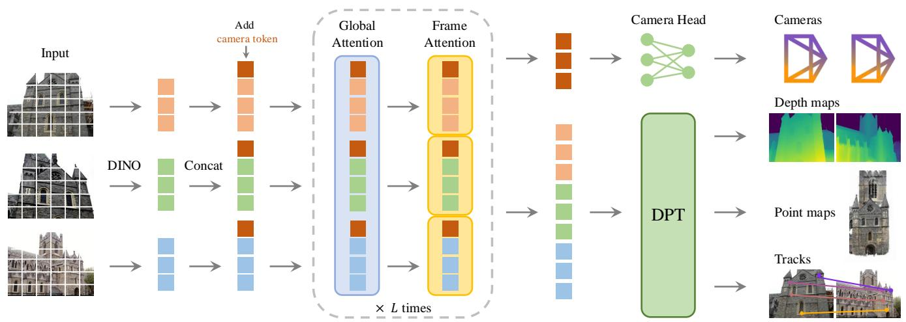
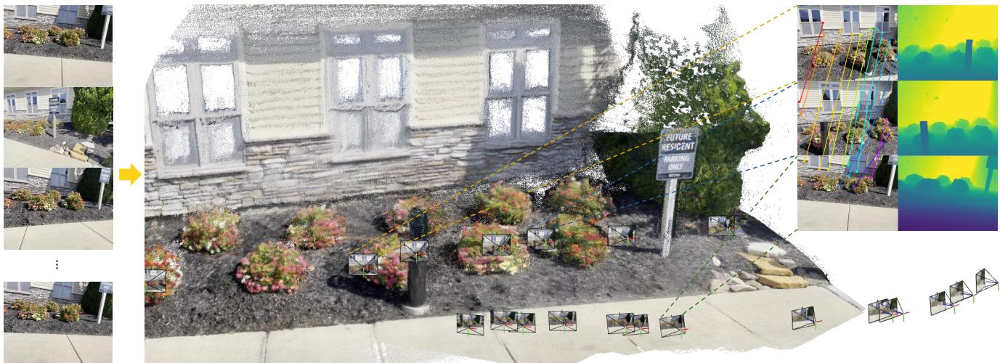
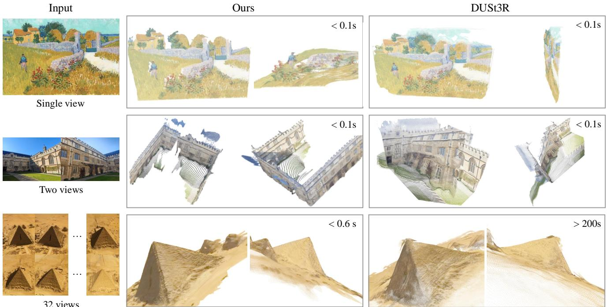
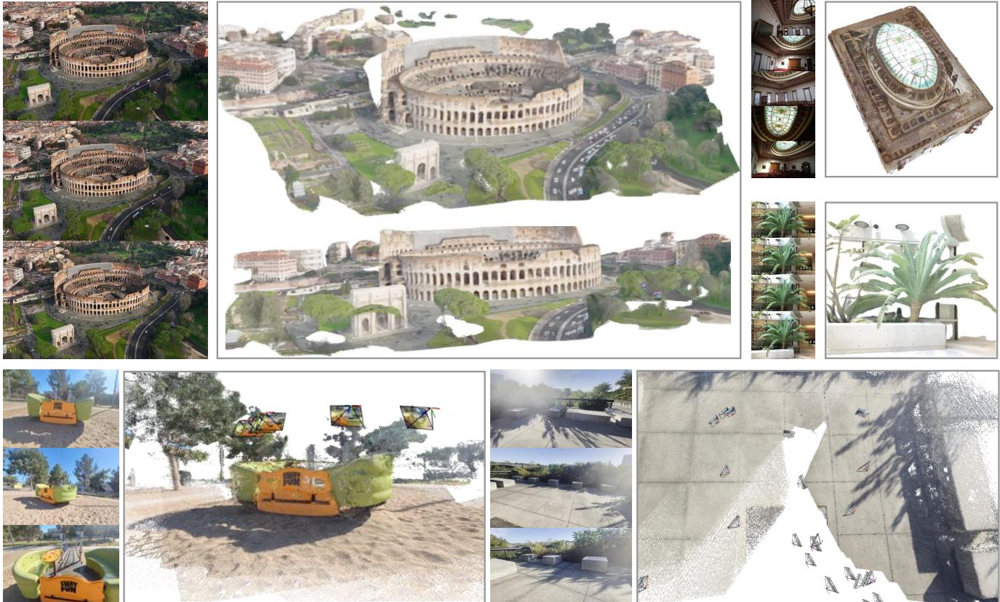
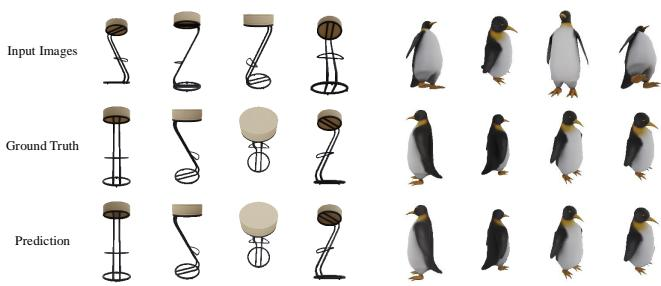
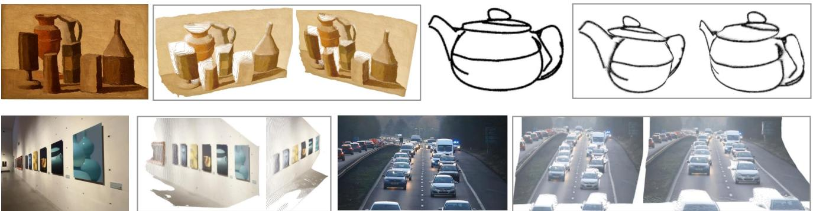

# 1. Bibliographic Information

## 1.1. Title
The central topic of the paper is a novel feed-forward neural network designed for comprehensive 3D scene attribute inference, named `VGGT: Visual Geometry Grounded Transformer`.

## 1.2. Authors
The authors of this paper are:
*   Jianyuan Wang
*   Minghao Chen
*   Nikita Karaev
*   Andrea Vedaldi
*   Christian Rupprecht
*   David Novotny

    Their affiliations are:
*   Visual Geometry Group, University of Oxford (for Jianyuan Wang, Minghao Chen, Nikita Karaev, Andrea Vedaldi, Christian Rupprecht)
*   Meta AI (for Jianyuan Wang, Minghao Chen, Nikita Karaev, Andrea Vedaldi, Christian Rupprecht, David Novotny)

    This indicates a strong collaboration between a renowned academic institution for computer vision (Visual Geometry Group at Oxford) and a leading industry research lab (Meta AI), suggesting expertise in both fundamental research and large-scale practical applications of deep learning and computer vision.

## 1.3. Journal/Conference
The paper is published at (UTC): 2025-03-14T17:59:47.000Z. While the specific journal or conference is not explicitly mentioned in the provided text, the publication date in 2025 suggests it is either a very recent publication or a preprint accepted for an upcoming top-tier computer vision conference (e.g., CVPR, ICCV, ECCV) or journal. These venues are highly reputable and influential in the field of computer vision and machine learning.

## 1.4. Publication Year
2025.

## 1.5. Abstract
The paper introduces `VGGT`, a `feed-forward neural network` that directly infers all key 3D attributes of a scene, including `camera parameters`, `point maps`, `depth maps`, and `3D point tracks`, from a variable number of input views (one to hundreds). This approach represents a significant advancement in `3D computer vision` by moving away from models specialized for single tasks, offering a unified solution. `VGGT` is characterized by its simplicity and efficiency, capable of reconstructing images in under one second, yet it outperforms traditional optimization-based alternatives that require computationally expensive post-processing. The network achieves `state-of-the-art` results across multiple 3D tasks: `camera parameter estimation`, `multi-view depth estimation`, `dense point cloud reconstruction`, and `3D point tracking`. Furthermore, the paper demonstrates that `pretrained VGGT` as a `feature backbone` significantly enhances downstream tasks such as `non-rigid point tracking` and `feed-forward novel view synthesis`. The code and models are publicly available.

## 1.6. Original Source Link
The official source is a preprint on `arXiv`: https://arxiv.org/abs/2503.11651.

# 2. Executive Summary

## 2.1. Background & Motivation
The core problem the paper aims to solve is the efficient and comprehensive estimation of diverse 3D attributes of a scene from multiple images using a single, unified `feed-forward neural network`.

This problem is important because:
*   **Traditional 3D reconstruction** methods, like `Structure-from-Motion (SfM)` and `Bundle Adjustment (BA)`, heavily rely on iterative optimization techniques. While powerful, these methods are computationally expensive and complex, increasing `runtime` and `complexity`.
*   **Machine learning** in `3D computer vision` has often been applied to specialized sub-tasks (e.g., feature matching, monocular depth prediction) or integrated into traditional pipelines (e.g., `VGGSfM` combining ML and geometry via differentiable BA). However, a truly unified, `neural-first` approach that eschews geometry post-processing has been lacking.
*   **Prior neural networks** for 3D tasks, such as `DUSt3R` and `MASt3R`, typically handle only pairs of images and still require costly post-processing (e.g., fusing pairwise reconstructions, global alignment) to reconstruct larger scenes or achieve optimal results. Other large 3D neural networks like `DepthAnything`, `MoGe`, and `LRM` focus on single 3D tasks, not a comprehensive suite of attributes.

    The paper's entry point and innovative idea is to ask if a powerful `neural network` can directly infer *all* key 3D attributes—`camera parameters`, `point maps`, `depth maps`, and `3D point tracks`—from a variable number of input views (from one to hundreds) in a single `feed-forward pass`, without relying on iterative `visual geometry optimization`. This aims to simplify the pipeline, increase efficiency, and potentially improve generalization.

## 2.2. Main Contributions / Findings
The paper makes several primary contributions:

1.  **Introduction of `VGGT`**: A large `feed-forward transformer` that, given one to hundreds of images of a scene, can predict all its key 3D attributes (`camera intrinsics` and `extrinsics`, `point maps`, `depth maps`, and `3D point tracks`) in seconds. This unified approach moves away from specialized, single-task models.
2.  **State-of-the-Art Feed-Forward Performance**: `VGGT`'s predictions are directly usable and highly competitive, often outperforming state-of-the-art methods that rely on slow post-processing `optimization techniques` (e.g., `Bundle Adjustment`, `Global Alignment`). This highlights the effectiveness of a purely neural approach for 3D reconstruction.
3.  **Enhanced Performance with Optional Optimization**: When combined with `Bundle Adjustment (BA)` post-processing, `VGGT` achieves even stronger `state-of-the-art` results across all evaluated 3D tasks, often substantially improving quality. Importantly, `VGGT`'s direct predictions provide excellent initializations for `BA`, making the combined process significantly faster than traditional `BA` pipelines.
4.  **Versatile Feature Backbone**: The features learned by `pretrained VGGT` are shown to significantly enhance various downstream tasks, specifically demonstrating improved performance in `non-rigid point tracking` and `feed-forward novel view synthesis`. This suggests `VGGT` can serve as a powerful foundation model for a wide range of computer vision applications.
5.  **Public Availability**: The code and models are made publicly available, facilitating further research and benefiting the computer vision community.

    The key conclusions and findings are that a large `transformer` model, trained on diverse 3D-annotated data, can effectively learn to directly infer a comprehensive set of interrelated 3D scene properties in a fast, `feed-forward` manner, achieving `state-of-the-art` results. This solves the problem of computational complexity and specialization in `3D computer vision`, offering a more generalized and efficient solution.

# 3. Prerequisite Knowledge & Related Work

## 3.1. Foundational Concepts

To fully grasp the `VGGT` paper, a beginner should understand the following foundational concepts:

*   **3D Attributes of a Scene**: These are properties that describe a scene in three dimensions.
    *   **Camera Parameters**: Define how a 3D scene is projected onto a 2D image.
        *   **Intrinsics**: Internal camera properties, such as `focal length` (how much the lens magnifies the scene), `principal point` (where the optical axis intersects the image plane), and `distortion coefficients` (how the lens deforms the image).
        *   **Extrinsics**: External camera properties, specifying the camera's position and orientation (pose) in a 3D world coordinate system. This includes a `rotation` (how the camera is rotated) and a `translation` (where the camera is located).
    *   **Depth Map**: For each pixel in a 2D image, a `depth map` stores the distance from the camera to the corresponding 3D point in the scene. It's a grayscale image where pixel intensity often represents depth.
    *   **Point Map**: A `point map` assigns to each pixel in a 2D image the 3D coordinates (`X, Y, Z`) of the point in the scene that projects onto that pixel. Unlike a `depth map`, it directly provides 3D coordinates, typically in a common reference frame (e.g., the first camera's frame).
    *   **3D Point Tracks**: These are sequences of 2D pixel locations across multiple images (or video frames) that correspond to the same physical 3D point in the scene. Tracking a point means finding its corresponding location in every other relevant image.
    *   **Point Cloud**: A set of data points in a three-dimensional coordinate system. These points represent the external surface of an object or environment. `Dense point cloud reconstruction` aims to generate a highly detailed `point cloud` from multiple images.

*   **Neural Networks**: A computational model inspired by the structure and function of biological neural networks.
    *   **Feed-forward Neural Network**: A type of neural network where connections between nodes do not form a cycle. Information flows only in one direction—from the input layer, through any hidden layers, to the output layer. There are no loops or recurrent connections.
    *   **Transformer**: A neural network architecture introduced in 2017, initially for `natural language processing (NLP)` tasks. It revolutionized sequence processing by relying entirely on `attention mechanisms` instead of `recurrent neural networks (RNNs)` or `convolutional neural networks (CNNs)`.
        *   **Attention Mechanism**: A core component of `Transformers`. It allows the model to weigh the importance of different parts of the input sequence when processing each element. Instead of processing input tokens sequentially, `attention` can simultaneously consider all tokens, focusing on the most relevant ones.
        *   **Self-Attention**: A specific type of `attention mechanism` where a sequence attends to itself. This allows the model to understand the relationships between different words (or `tokens` in general) within the *same* sequence. For example, in a sentence, it can determine which words are most relevant to understanding a particular word.
        *   **Multi-Head Attention**: An extension of `self-attention` that allows the model to jointly attend to information from different representation subspaces at different positions. Essentially, it runs several `self-attention` mechanisms in parallel and concatenates their outputs, allowing the model to capture diverse relationships.
        *   **Tokens**: In the context of `Transformers`, input data (like images or text) is broken down into discrete units called `tokens`. For images, these are often small patches of the image that are then flattened and embedded into a vector representation.

*   **Computer Vision Tasks**:
    *   **Structure-from-Motion (SfM)**: The process of reconstructing the 3D structure of a scene and the camera poses (positions and orientations) from a series of overlapping 2D images. It typically results in a sparse `point cloud`.
    *   **Multi-view Stereo (MVS)**: Builds upon `SfM` by taking known camera parameters and multiple images to generate a dense 3D reconstruction (a dense `point cloud` or `depth maps`) of the scene.
    *   **Bundle Adjustment (BA)**: A non-linear optimization technique used in `SfM` and `MVS` to refine the estimated 3D scene structure and camera parameters simultaneously. It minimizes the `reprojection error` (the difference between observed image points and where the corresponding 3D points project into the image) across all images. It's an iterative, computationally intensive process.
    *   **Image Matching**: The task of finding corresponding points (or features) between two or more images that depict the same scene or object from different viewpoints. This is a prerequisite for `SfM` and `MVS`.
    *   **Tracking-Any-Point**: Given a query point in one image (or frame), the task is to track its 2D location across all other images/frames in a sequence, even under challenging conditions like occlusions or dynamic motion.
    *   **Novel View Synthesis**: Generating new images of a scene from arbitrary, unseen camera viewpoints, given a set of input images.

## 3.2. Previous Works

The paper contextualizes `VGGT` against several important prior works, which can be broadly categorized into traditional `visual geometry methods`, `deep learning-enhanced geometry pipelines`, and `end-to-end neural 3D models`.

*   **Traditional `Structure-from-Motion (SfM)`**:
    *   `COLMAP` [94]: A widely popular, open-source framework that embodies the traditional `SfM` pipeline. It consists of stages like `image matching`, `triangulation` (estimating 3D points from 2D correspondences), and `bundle adjustment`. While robust, it's iterative and can be slow.
    *   *Relevance to VGGT*: VGGT aims to bypass the complexity and computational cost of such multi-stage, optimization-heavy pipelines by directly inferring all 3D attributes in a `feed-forward` manner.

*   **Deep Learning-Enhanced `SfM`**:
    *   `VGGSfM` [125]: This method integrates machine learning and `visual geometry` end-to-end via `differentiable Bundle Adjustment`. It showed competitive performance against traditional `SfM` on challenging `phototourism` scenarios.
    *   *Relevance to VGGT*: VGGSfM still relies heavily on `Bundle Adjustment` (even if differentiable). VGGT takes a further step by trying to remove the need for such iterative post-optimization almost entirely in its primary mode, although it shows that combining with `BA` can further boost its already strong performance. `VGGSfM`'s parametrization of camera parameters is also adopted by `VGGT`.

*   **Deep Learning for `Multi-view Stereo (MVS)`**:
    *   `DUSt3R` [129] and `MASt3R` [62]: These are recent methods that directly estimate aligned dense `point clouds` from *a pair* of views, without requiring camera parameters as input. However, for multiple images, they rely on post-processing (fusing pairwise reconstructions, `global alignment`) to achieve a coherent 3D scene.
    *   *Relevance to VGGT*: VGGT is explicitly designed to handle *multiple* images (from a few to hundreds) in a single `feed-forward pass`, directly predicting globally consistent 3D attributes. This is a substantial departure from `DUSt3R`/`MASt3R` which are constrained to pairwise processing and then need costly post-optimization. VGGT directly claims to outperform these methods by a large margin.
    *   `Concurrent works` [111, 127, 141, 156]: These works explore replacing `DUSt3R`'s test-time optimization with neural networks but often achieve suboptimal or comparable performance to `DUSt3R`. `VGGT` claims significant performance advantages over these as well.

*   **Deep Learning for `Tracking-Any-Point`**:
    *   `PIPs` [44], `TAP-Vid` [23], `TAPIR` [24], `CoTracker` [55, 56, 57], `DOT` [60], `TAPTR` [63], `LocoTrack` [13]: These are specialized methods for `point tracking` across video sequences, often dealing with dynamic motions and occlusions. `CoTracker` is particularly highlighted for its use of correlations between points.
    *   *Relevance to VGGT*: VGGT integrates a `tracking head` that uses features learned by its backbone. It demonstrates that its learned features, when coupled with existing point trackers (specifically `CoTracker2`), yield `state-of-the-art` tracking performance, even though `VGGT` itself is not solely specialized for this task.

*   **Large Vision Models / `Transformers`**:
    *   `DINO` [10, 78]: A `self-supervised vision transformer` that learns robust visual features. `VGGT` uses `DINO` for `patchifying` input images into `tokens`.
    *   `DPT` [87]: `Vision Transformers` for dense prediction tasks, often used for `monocular depth estimation`. `VGGT` uses a `DPT layer` for its `dense prediction heads` (depth, point maps, tracking features).
    *   `GPTs` [1, 29, 148], `CLIP` [86], `Stable Diffusion` [34]: General purpose large models that serve as versatile backbones.
    *   `DepthAnything` [142], `MoGe` [128], `LRM` [49]: Recent large 3D neural networks, but typically focus on a single 3D task (e.g., monocular depth, `novel view synthesis`).
    *   *Relevance to VGGT*: VGGT is built in the same mold as these large, versatile `transformer` models, aiming to be a unified backbone for multiple `3D computer vision` tasks, rather than focusing on a single one.

### Attention Mechanism (A Core Prerequisite)
Since `VGGT` is a `Transformer`, understanding the `attention mechanism` is crucial. The original `Transformer` introduced the `Scaled Dot-Product Attention`, defined as:

$$
\mathrm{Attention}(Q, K, V) = \mathrm{softmax}\left(\frac{QK^T}{\sqrt{d_k}}\right)V
$$

Where:
*   $Q$ (Query): A matrix representing the queries, derived from the input `tokens`. Each row is a query vector.
*   $K$ (Key): A matrix representing the keys, derived from the input `tokens`. Each row is a key vector.
*   $V$ (Value): A matrix representing the values, derived from the input `tokens`. Each row is a value vector.
*   $Q K^T$: The dot product of queries and keys, measuring the similarity between each query and all keys.
*   $\sqrt{d_k}$: The square root of the dimension of the key vectors ($d_k$). This scaling factor is used to prevent the dot products from becoming too large, which can push the `softmax` function into regions with very small gradients, making training difficult.
*   $\mathrm{softmax}(\cdot)$: A function that converts a vector of numbers into a probability distribution, ensuring all values are between 0 and 1 and sum to 1. It determines how much attention to pay to each value.
*   The entire operation produces a weighted sum of the `value` vectors, where the weights are determined by the `attention scores`.

## 3.3. Technological Evolution
The field of `3D computer vision` has seen a progression from purely geometric, optimization-based methods to increasingly `neural network`-driven approaches:
1.  **Traditional Geometry (Pre-2010s)**: Methods like `COLMAP` for `SfM` and `MVS` relied on handcrafted features, geometric constraints, and iterative optimization (e.g., `Bundle Adjustment`). These were robust but computationally expensive and often struggled with challenging image conditions (e.g., low texture).
2.  **Hybrid Approaches (2010s-Early 2020s)**: Deep learning started to improve individual components of `SfM` pipelines (e.g., `keypoint detection` with `SuperPoint` [21], `feature matching` with `SuperGlue` [92]). Later, methods like `VGGSfM` [125] integrated ML and geometry more tightly with `differentiable Bundle Adjustment`, pushing performance further while still retaining a geometric core.
3.  **Neural-First, Pairwise Approaches (Early 2020s)**: Models like `DUSt3R` [129] began to directly predict 3D scene information (e.g., `point maps`) from image pairs using `neural networks`, reducing reliance on explicit camera geometry initially. However, reconstructing full scenes from many images still required complex post-processing steps.
4.  **Unified, Multi-view Neural-First (Current Work - VGGT)**: `VGGT` represents the latest step in this evolution, moving towards a single, `feed-forward transformer` that can process many views directly and output *all* key 3D attributes (`camera parameters`, `depth maps`, `point maps`, `tracks`) without requiring iterative optimization in its core inference. It aims to achieve both superior performance and efficiency, even outperforming methods that use post-optimization.

## 3.4. Differentiation Analysis
Compared to the main methods in related work, `VGGT` offers several core differences and innovations:

*   **From Optimization-Dependent to Feed-Forward**:
    *   **Traditional `SfM` (e.g., `COLMAP`) and `MVS`**: Heavily rely on iterative geometric optimization (`Bundle Adjustment`) which is slow and complex.
    *   **`VGGSfM`**: While deep learning-enhanced, it still uses `differentiable Bundle Adjustment`, which is an optimization process.
    *   **`DUSt3R`/`MASt3R`**: Produce pairwise 3D reconstructions and require costly `global alignment` or fusion steps for multi-view consistency.
    *   **`VGGT`'s innovation**: Directly infers all 3D attributes in a *single feed-forward pass*, often outperforming these optimization-based alternatives in terms of accuracy and significantly in speed. It makes 3D reconstruction usable in real-time applications.

*   **From Single-Task Specialization to Unified Multi-Task Prediction**:
    *   **Dedicated 3D models (e.g., `DepthAnything` for monocular depth, `LRM` for single-image to 3D, `CoTracker` for tracking)**: Focus on specialized individual tasks.
    *   **`VGGT`'s innovation**: Uses a *shared backbone* to simultaneously predict `camera parameters`, `depth maps`, `point maps`, and `3D point tracks`. The paper demonstrates that this `multi-task learning` approach enhances overall accuracy, suggesting benefits from learning the inherent interrelationships between these 3D quantities.

*   **Multi-view Handling**:
    *   **`DUSt3R`/`MASt3R`**: Primarily designed for two-view input, requiring external processes for multi-view consistency.
    *   **`VGGT`'s innovation**: Inherently supports processing one, a few, or *hundreds* of input views directly within its `transformer` architecture, generating a globally consistent 3D reconstruction in a single pass.

*   **Architectural Simplicity and Generalization**:
    *   `VGGT` is based on a "fairly standard large `transformer`" [119] with minimal explicit 3D inductive biases (except for `Alternating-Attention`), trained on a diverse collection of 3D-annotated datasets. This contrasts with highly specialized architectures sometimes seen in prior works.
    *   The use of `Alternating-Attention` (frame-wise and global) is a key architectural choice to efficiently integrate information across frames.
    *   `VGGT` shows strong generalization to unseen datasets (e.g., `RealEstate10K`) and challenging in-the-wild scenes, demonstrating its robustness.

# 4. Methodology

## 4.1. Principles
The core idea behind `VGGT` is to leverage the power of a large `Transformer` architecture to directly learn the complex mappings from raw image pixels to various 3D scene attributes. Instead of relying on traditional, iterative `visual geometry optimization` techniques (like `Bundle Adjustment`) or breaking down the problem into specialized sub-tasks, `VGGT` aims to infer `camera parameters`, `depth maps`, `point maps`, and `3D point tracks` in a single, efficient `feed-forward pass`. The underlying intuition is that with sufficient data and model capacity, a `Transformer` can implicitly learn the geometric principles governing 3D scenes and camera projections, making explicit optimization unnecessary for primary inference. The model is designed with minimal `3D inductive biases`, allowing it to learn directly from a vast amount of 3D-annotated data, similar to how large language models learn from text. The `Alternating-Attention` mechanism is introduced to balance information integration within individual images and across multiple images efficiently.

## 4.2. Core Methodology In-depth (Layer by Layer)

The `VGGT` model is a large `transformer` that takes a set of images as input and produces various 3D quantities as output. The overall architecture is shown in the following figure (Image 2 from the original paper).

*该图像是示意图，展示了VGGT模型的结构，包括输入、全局和帧注意力机制，以及相机头处理过程，最终输出相机参数、深度图、点图和轨迹等3D属性。*

Figure 2. Schematic diagram illustrating the structure of the VGGT model, including input, global and frame attention mechanisms, and the camera head processing, ultimately outputting 3D attributes such as camera parameters, depth maps, point maps, and tracks.

### 4.2.1. Problem Definition and Notation

The input to the `VGGT` model is a sequence of $N$ RGB images, denoted as $(I_i)_{i=1}^N$, where each image $I_i \in \mathbb{R}^{3 \times H \times W}$ (3 color channels, height $H$, width $W$). The transformer $f$ maps this sequence to a corresponding set of 3D annotations, one per frame:

$$
f\left((I_i)_{i=1}^N\right) = (\mathbf{g}_i, D_i, P_i, T_i)_{i=1}^N
$$

Here's a breakdown of each output component:

*   **Camera Parameters ($\mathbf{g}_i$)**: For each image $I_i$, the model predicts its camera parameters $\mathbf{g}_i \in \mathbb{R}^9$. Following the parametrization from `VGGSfM` [125], $\mathbf{g}$ is a concatenation of:
    *   A `rotation quaternion` $\mathbf{q} \in \mathbb{R}^4$: Represents the 3D orientation of the camera relative to a reference frame. A quaternion is a way to encode 3D rotations, often preferred over `Euler angles` or `rotation matrices` for its compactness and avoidance of `gimbal lock`.
    *   A `translation vector` $\mathbf{t} \in \mathbb{R}^3$: Represents the 3D position of the camera in the reference frame.
    *   A `field of view` $\mathbf{f} \in \mathbb{R}^2$: Represents the camera's `focal length` in horizontal and vertical directions. The paper assumes the camera's `principal point` (the projection of the camera's optical center onto the image plane) is at the image center, a common simplification in `SfM` frameworks.

*   **Depth Map ($D_i$)**: For each pixel location $\mathbf{y}$ in the image $I_i$ (where $\mathbf{y} \in \mathcal{T}(I_i) = \{1, \ldots, H\} \times \{1, \ldots, W\}$), the `depth map` $D_i$ associates it with its corresponding depth value $D_i(\mathbf{y}) \in \mathbb{R}^+$. This value is the distance from the $i$-th camera to the 3D point observed at pixel $\mathbf{y}$.

*   **Point Map ($P_i$)**: For each pixel $\mathbf{y}$, the `point map` $P_i$ associates it with its corresponding 3D scene point $P_i(\mathbf{y}) \in \mathbb{R}^3$. Importantly, similar to `DUSt3R` [129], these `point maps` are `viewpoint invariant`. This means all 3D points $P_i(\mathbf{y})$ are defined in the coordinate system of the *first camera* ($\mathbf{g}_1$), which serves as the global `world reference frame`.

*   **Tracking Features ($T_i$)**: The transformer outputs a grid of $C$-dimensional features $T_i \in \mathbb{R}^{C \times H \times W}$ for each image. These are not the tracks directly but rather dense features used by a separate `tracking module` $\tau$.

    **Tracking Module ($\tau$)**: Given a query image point $\mathbf{y}_q$ in a query image $I_q$, the `tracking module` $\tau$ uses the dense `tracking features` $T_i$ to output a track $\mathcal{T}^\star(\mathbf{y}_q) = (\mathbf{y}_i)_{i=1}^N$, which is a sequence of 2D points $\mathbf{y}_i \in \mathbb{R}^2$ in all images $I_i$ corresponding to the same 3D point as $\mathbf{y}_q$. The two networks, $f$ (the `VGGT` transformer) and $\tau$ (the `tracking module`), are trained jointly `end-to-end`.

**Order of Predictions**: The input image sequence order is arbitrary, except that the *first image* is always chosen as the `reference frame` for defining the `world coordinate system`. The network architecture is designed to be `permutation equivariant` for all frames except the first. This means if you reorder frames 2 through N, the outputs for those frames will also be reordered identically, maintaining their content.

**Over-complete Predictions**: The paper notes that the predicted quantities are not all independent. For instance, `camera parameters` $\mathbf{g}$ can be inferred from the `invariant point map` $P$ (e.g., by solving the `PnP` problem). Similarly, `depth maps` can be deduced from `point maps` and `camera parameters`. However, `VGGT` is explicitly tasked with predicting all these quantities, and the authors demonstrate that this `multi-task learning` approach leads to substantial performance gains, even with redundancies. Interestingly, during inference, combining independently estimated `depth maps` and `camera parameters` to derive 3D points is often more accurate than directly using the `point map head` output.

### 4.2.2. Feature Backbone

The `VGGT` model $f$ is implemented as a large `Transformer` [119] with minimal `3D inductive biases`.

*   **Image Tokenization**: Each input image $I$ is first `patchified` into a set of $K$ `tokens` $\mathbf{t}^I \in \mathbb{R}^{K \times C'}$ (where $K$ is the number of patches and $C'$ is the token dimension). This is achieved using `DINO` [78], a `self-supervised Vision Transformer`. `DINOv2` [78] is specifically mentioned as the default method for `patchifying`, indicating its effectiveness and training stability.
*   **Transformer Processing**: The combined set of image `tokens` from all input frames, $\mathbf{t}^I = \bigcup_{i=1}^N \{\mathbf{t}_i^I\}$, is then processed through the main network structure. This structure alternates between two types of `self-attention` layers.

*   **Alternating-Attention (AA)**: This is a slight adjustment to the standard `Transformer` design. It makes the `Transformer` focus on information within each frame and globally across all frames in an alternating fashion:
    *   **Frame-wise Self-Attention**: Each `token` attends only to other `tokens` within its *own* frame. This helps integrate information specific to each image.
    *   **Global Self-Attention**: Each `token` attends to *all* `tokens` across *all* frames. This allows the model to integrate information across different images, establishing global consistency and relationships.
        This alternating strategy balances local (within-frame) and global (cross-frame) information processing. By default, the model employs $L=24$ layers of alternating global and frame-wise attention. The architecture does not use `cross-attention` layers, only `self-attention` ones.

### 4.2.3. Prediction Heads

After the feature backbone processes the `tokens`, specialized `prediction heads` are used to output the desired 3D quantities.

*   **Augmented Tokens**: For each input image $I_i$, its corresponding image `tokens` $\mathbf{t}_i^I$ are augmented with two additional types of `learnable tokens`:
    *   A `camera token` $\mathbf{t}_i^{\mathbf{g}} \in \mathbb{R}^{1 \times C'}$: This token is specifically designed to encode information relevant to the camera parameters of frame $i$.
    *   Four `register tokens` $\mathbf{t}_i^R \in \mathbb{R}^{4 \times C'}$: Inspired by [19], these tokens act as "memory slots" to stabilize training and improve performance, but their outputs are typically discarded after processing.
*   **Special Tokens for the First Frame**: The `camera token` and `register tokens` for the *first frame* are initialized with a different set of `learnable tokens` ($\bar{\mathbf{t}}^{\mathbf{g}}$, $\bar{\mathbf{t}}^R$) compared to those of all other frames ($\bar{\bar{\mathbf{t}}}^{\mathbf{g}}$, $\bar{\bar{\mathbf{t}}}^R$ for $i \in [2, \ldots, N]$). This allows the model to explicitly distinguish the first frame, which defines the `world coordinate system`, from the rest.
*   **Output Tokens**: The concatenated tokens $(\mathbf{t}_i^I, \mathbf{t}_i^{\mathbf{g}}, \mathbf{t}_i^R)_{i=1}^N$ are processed by the `Alternating-Attention transformer`, producing refined output tokens $(\hat{\mathbf{t}}_i^I, \hat{\mathbf{t}}_i^{\mathbf{g}}, \hat{\mathbf{t}}_i^R)_{i=1}^N$. The `output register tokens` $\hat{\mathbf{t}}_i^R$ are discarded.

    **Coordinate Frame**: As established in the problem definition, all camera, point, and depth predictions are made relative to the `coordinate frame` of the first camera ($\mathbf{g}_1$). Therefore, the camera extrinsics predicted for the first camera are implicitly set to identity (rotation quaternion $\mathbf{q}_1 = [0, 0, 0, 1]$ and translation vector $\mathbf{t}_1 = [0, 0, 0]$).

### 4.2.3.1. Camera Prediction Head

The refined `camera tokens` $(\hat{\mathbf{t}}_i^{\mathbf{g}})_{i=1}^N$ are used to predict the camera parameters $(\hat{\mathbf{g}}_i)_{i=1}^N$. This is done by passing them through four additional `self-attention layers`, followed by a `linear layer`. This sequence forms the `camera head`, which regresses the `camera intrinsics` and `extrinsics`.

### 4.2.3.2. Dense Prediction Head

The `output image tokens` $\hat{\mathbf{t}}_i^I$ are responsible for all `dense predictions`: `depth maps` $D_i$, `point maps` $P_i$, and `tracking features` $T_i$.
*   **Feature Map Conversion**: First, $\hat{\mathbf{t}}_i^I$ are converted into `dense feature maps` $F_i \in \mathbb{R}^{C'' \times H \times W}$ using a `DPT layer` [87]. `DPT` (Dense Prediction Transformer) is an architecture well-suited for transforming `Transformer tokens` back into dense image-like predictions.
*   **Dense Output Generation**: Each `dense feature map` $F_i$ is then passed through a `3x3 convolutional layer` to produce:
    *   The `depth map` $\hat{D}_i$.
    *   The `point map` $\hat{P}_i$.
    *   `Dense features` $T_i \in \mathbb{R}^{C \times H \times W}$ which serve as input to the `tracking module`.
*   **Uncertainty Maps**: The `DPT head` also outputs `uncertainty maps` $\Sigma_i^D \in \mathbb{R}_+^{H \times W}$ and $\Sigma_i^P \in \mathbb{R}_+^{H \times W}$ for the depth and point maps, respectively. These maps are positive values indicating the model's confidence in its predictions, and they are incorporated into the loss functions during training.

### 4.2.3.3. Tracking Module

To implement the `tracking module` $\tau$, the paper utilizes the `CoTracker2` architecture [57].
*   **Input**: The `dense tracking features` $T_i$ output by the `DPT head` are fed into `CoTracker2`.
*   **Query and Correspondence**: Given a `query point` $\mathbf{y}_j$ in a `query image` $I_q$ (during training, $q=1$, but any image can be a query), the `tracking head` $\tau$ predicts a set of 2D points $(\hat{\mathbf{y}}_{j,i})_{i=1}^N$ in all images $I_i$ that correspond to the same 3D point as $\mathbf{y}_j$.
*   **Mechanism**:
    1.  The `feature map` $T_q$ of the `query image` is `bilinearly sampled` at $\mathbf{y}_j$ to extract its feature vector.
    2.  This feature is then correlated with all other `feature maps` $T_i$ ($i \neq q$) to generate a set of `correlation maps`. These `correlation maps` highlight potential correspondence locations.
    3.  These `correlation maps` are further processed by `self-attention layers` within `CoTracker2` to refine and predict the final 2D points $\hat{\mathbf{y}}_i$, which are all in correspondence with $\mathbf{y}_j$.
*   **Flexibility**: Similar to `VGGSfM` [125], this tracker does not assume any temporal ordering of input frames, making it applicable to any set of input images, not just videos.

### 4.2.4. Training

The `VGGT` model $f$ (and implicitly the `tracking module` $\tau$) is trained `end-to-end` using a `multi-task loss`.

#### 4.2.4.1. Training Losses

The overall `multi-task loss` $\mathcal{L}$ is a sum of individual loss terms:

$$
\mathcal{L} = \mathcal{L}_{\mathrm{camera}} + \mathcal{L}_{\mathrm{depth}} + \mathcal{L}_{\mathrm{pmap}} + \lambda \mathcal{L}_{\mathrm{track}}
$$

*   The `camera` ($\mathcal{L}_{\mathrm{camera}}$), `depth` ($\mathcal{L}_{\mathrm{depth}}$), and `point-map` ($\mathcal{L}_{\mathrm{pmap}}$) losses are found to have similar ranges and are weighted equally (implicit factor of 1).
*   The `tracking loss` ($\mathcal{L}_{\mathrm{track}}$) is down-weighted by a factor of $\lambda = 0.05$.

    Each loss term is defined as follows:

*   **Camera Loss ($\mathcal{L}_{\mathrm{camera}}$)**: Supervises the predicted camera parameters $\hat{\mathbf{g}}_i$ against the ground truth $\mathbf{g}_i$.
    $$
    \mathcal{L}_{\mathrm{camera}} = \sum_{i=1}^{N} \|\hat{\mathbf{g}}_i - \mathbf{g}_i\|_\epsilon
    $$
    *   $\hat{\mathbf{g}}_i$: The predicted camera parameters for image $I_i$.
    *   $\mathbf{g}_i$: The ground-truth camera parameters for image $I_i$.
    *   $\|\cdot\|_\epsilon$: The `Huber loss`, also known as a smooth L1 loss. It is quadratic for small errors and linear for large errors, making it less sensitive to outliers than `squared error loss` and smoother than `absolute error loss`. It is defined as:
        \$
        \|x\|_\epsilon = \begin{cases}
            \frac{1}{2}x^2 & \text{if } |x| \le \epsilon \\
            \epsilon(|x| - \frac{1}{2}\epsilon) & \text{if } |x| > \epsilon
        \end{cases}
        \$
        where $\epsilon$ is a hyperparameter.

*   **Depth Loss ($\mathcal{L}_{\mathrm{depth}}$)**: Follows `DUSt3R` [129] and implements an `aleatoric-uncertainty loss` [59, 75]. This loss weighs the discrepancy between predicted depth $\hat{D}_i$ and ground-truth depth $D_i$ with the predicted `uncertainty map` $\Sigma_i^D$. It also includes a gradient term to encourage smoothness and an uncertainty regularization term.
    $$
    \mathcal{L}_{\mathrm{depth}} = \sum_{i=1}^{N} \big\| \Sigma_i^D \odot (\hat{D}_i - D_i) \big\|_1 + \big\| \Sigma_i^D \odot (\nabla \hat{D}_i - \nabla D_i) \big\|_1 - \alpha \log \Sigma_i^D
    $$
    *   $\hat{D}_i$: The predicted depth map for image $I_i$.
    *   $D_i$: The ground-truth depth map for image $I_i$.
    *   $\Sigma_i^D$: The predicted depth `uncertainty map`. Higher values indicate less confidence.
    *   $\odot$: The `channel-broadcast element-wise product` (Hadamard product), meaning the `uncertainty map` is applied to each channel of the depth difference.
    *   $\|\cdot\|_1$: The L1 norm (sum of absolute values) for the error term.
    *   $\nabla$: The gradient operator, which computes spatial derivatives (e.g., Sobel or central differences) of the depth maps. This term penalizes differences in depth gradients, promoting smooth transitions.
    *   $\log \Sigma_i^D$: A term that encourages the model to predict smaller uncertainties where it is confident. The hyperparameter $\alpha$ controls its weighting. If $\alpha$ is positive, minimizing this term reduces $\Sigma_i^D$, leading to higher confidence.

*   **Point Map Loss ($\mathcal{L}_{\mathrm{pmap}}$)**: Defined analogously to the `depth loss`, but uses the `point-map uncertainty` $\Sigma_i^P$ and applies to 3D point coordinates.
    $$
    \mathcal{L}_{\mathrm{pmap}} = \sum_{i=1}^{N} \big\| \Sigma_i^P \odot (\hat{P}_i - P_i) \big\|_1 + \big\| \Sigma_i^P \odot (\nabla \hat{P}_i - \nabla P_i) \big\|_1 - \alpha \log \Sigma_i^P
    $$
    *   $\hat{P}_i$: The predicted point map for image $I_i$.
    *   $P_i$: The ground-truth point map for image $I_i$.
    *   $\Sigma_i^P$: The predicted point-map `uncertainty map`.
    *   Other symbols are as defined for $\mathcal{L}_{\mathrm{depth}}$.

*   **Tracking Loss ($\mathcal{L}_{\mathrm{track}}$)**:
    $$
    \mathcal{L}_{\mathrm{track}} = \sum_{j=1}^{M} \sum_{i=1}^{N} \| \mathbf{y}_{j,i} - \hat{\mathbf{y}}_{j,i} \|_2
    $$
    *   $M$: The number of ground-truth `query points` $\mathbf{y}_j$ in the `query image` $I_q$.
    *   $\mathbf{y}_{j,i}$: The ground-truth 2D correspondence of `query point` $\mathbf{y}_j$ in image $I_i$.
    *   $\hat{\mathbf{y}}_{j,i}$: The predicted 2D correspondence for `query point` $\mathbf{y}_j$ in image $I_i$, obtained from the `tracking module` $\tau$.
    *   $\|\cdot\|_2$: The Euclidean distance (L2 norm) between the predicted and ground-truth 2D points.
    *   Additionally, following `CoTracker2` [57], a `visibility loss` (binary cross-entropy) is applied to estimate whether a point is visible in a given frame.

#### 4.2.4.2. Ground Truth Coordinate Normalization

To address the inherent scale and global reference frame ambiguity in 3D reconstruction (where scaling or shifting the scene doesn't change the images), the training data is normalized:
1.  All quantities are first expressed in the `coordinate frame` of the first camera $\mathbf{g}_1$.
2.  The average Euclidean distance of all 3D points in the `point map` $P$ to the origin is computed. This value is used as a `scale factor`.
3.  The `camera translations` $\mathbf{t}$, the `point map` $P$, and the `depth map` $D$ are then scaled using this `scale factor`.
    Crucially, unlike `DUSt3R` [129], this normalization is applied *only to the ground truth data*, not to the network's predictions. The network is forced to learn to output predictions in this specific normalized coordinate system.

#### 4.2.4.3. Implementation Details

*   **Architecture**: $L = 24$ `Alternating-Attention` layers (one `frame-wise` and one `global self-attention` layer per block). Each attention layer has a feature dimension of 1024 and 16 heads, similar to `ViT-L` in `DINOv2` [78]. `QKNorm` [48] and `LayerScale` [115] (initialized at 0.01) are used for training stability. `DINOv2` is used for `image tokenization` with `positional embedding`. Tokens from specific blocks (4th, 11th, 17th, 23rd) are fed into `DPT` [87] for upsampling.
*   **Parameters**: Approximately 1.2 billion parameters in total.
*   **Optimization**: `AdamW optimizer` for 160K iterations.
*   **Learning Rate**: `Cosine learning rate scheduler` with a peak of 0.0002 and an 8K iteration warmup.
*   **Batching**: Randomly sample 2-24 frames (up to 224 in previous versions, 48 total in Appendix B) from a random training scene per batch. Scenes with fewer than 24 frames are excluded.
*   **Image Preprocessing**: Input frames, `depth maps`, and `point maps` are resized to a maximum dimension of 518 pixels. The aspect ratio is randomized (0.33 to 1.0).
*   **Augmentations**: Random `color jittering`, `Gaussian blur`, and `grayscale augmentation` are applied independently to frames.
*   **Ground Truth Tracks**: Built by `unprojecting` `depth maps` to 3D, `reprojecting` points to target frames, and retaining correspondences where reprojected depths match target `depth maps`. Frames with low similarity or no valid correspondences are excluded.
*   **Training Infrastructure**: 64 A100 GPUs over nine days.
*   **Stability**: `Gradient norm clipping` with a threshold of 1.0, `bfloat16 precision`, and `gradient checkpointing` are used for memory and computational efficiency.

#### 4.2.4.4. Training Data

The model is trained on a large and diverse collection of datasets:
*   `Co3Dv2` [88]
*   `BlendMVS` [146]
*   `DL3DV` [69]
*   `MegaDepth` [64]
*   `Kubric` [41]
*   `WildRGB` [135]
*   `ScanNet` [18]
*   `HyperSim` [89]
*   `Mapillary` [71]
*   `Habitat` [107]
*   `Replica` [104]
*   `MVS-Synth` [50]
*   `PointOdyssey` [159]
*   `Virtual KITTI` [7]
*   `Aria Synthetic Environments` [82]
*   `Aria Digital Twin` [82]
*   A synthetic dataset of artist-created assets similar to `Objaverse` [20].

    These datasets cover indoor and outdoor environments, synthetic and real-world scenarios, with 3D annotations derived from sensor capture, synthetic engines, or `SfM` techniques. The combined size and diversity are comparable to `MASt3R` [30].

The paper also presents some qualitative examples of `VGGT`'s performance, as shown in the following figure (Image 1 from the original paper) which illustrates the inference of 3D attributes from multiple viewpoints.

*该图像是VGGT方法的示意图，展示了从多个视角推测场景的3D属性，包括相机参数、点云和深度图。图中左侧展示了输入视图，右侧则显示了由该方法重建的结果，展示了准确的深度信息和点云结构。*

Figure 1. The image is a schematic of the VGGT method, illustrating the inference of 3D attributes of a scene from multiple viewpoints, including camera parameters, point clouds, and depth maps. The left side shows input views, while the right side displays the reconstructed results, highlighting accurate depth information and point cloud structure.

Additionally, Figure 3 and Figure 4 (from the original paper) provide further qualitative examples, showcasing the method's ability to reconstruct scenes from varying numbers of views and generalize to complex `in-the-wild` scenes.

*该图像是示意图，展示了VGGT方法在处理单视图、双视图和多视图（32视图）情况下的效果与效率。左侧为输入图，右侧为VGGT生成的结果，底部列出了处理时间，表现出VGGT在重建任务中的速度与精度优势。*

Figure 3. Illustration showing the performance and efficiency of the VGGT method for single view, two views, and multi-view (32 views) input. The leftmost column displays the input images, while the right column shows the results generated by VGGT, with processing times listed at the bottom, highlighting VGGT's speed and precision advantages in reconstruction tasks.

*该图像是多个3D场景的示意图，展示了使用VGGT技术重建的包括斗兽场在内的场景。图中各个视角展示了不同的深度信息和点云，体现了该方法在三维重建中的应用效果。*

Figure 4. Schematic representation of multiple 3D scenes, showcasing the reconstruction of scenes including the Colosseum using VGGT technology. The various views in the image demonstrate different depth information and point clouds, reflecting the effectiveness of this method in 3D reconstruction.

# 5. Experimental Setup

## 5.1. Datasets

The `VGGT` model is evaluated across multiple 3D tasks using various datasets, demonstrating its versatility and generalization capabilities.

*   **Camera Pose Estimation**:
    *   `CO3Dv2` [88]: A large-scale dataset for 3D category reconstruction of common objects. It contains object-centric image collections with ground-truth camera poses and 3D shapes.
    *   `RealEstate10K` [161]: A large-scale dataset of real estate videos, often used for `novel view synthesis` and `camera pose estimation`. It features diverse indoor and outdoor scenes.
    *   `Image Matching Challenge (IMC)` [54]: A benchmark focusing on `phototourism` data, often challenging for `SfM` due to wide baselines and diverse scene structures.

*   **Multi-view Depth Estimation**:
    *   `DTU` [51]: A widely used benchmark dataset for `multi-view stereo`, consisting of industrial objects scanned from multiple viewpoints, providing high-quality ground-truth `depth maps` and camera parameters.

*   **Point Map Estimation**:
    *   `ETH3D` [97]: A multi-view stereo benchmark offering high-resolution images and multi-camera videos for both indoor and outdoor scenes, with precise ground-truth 3D models.

*   **Image Matching**:
    *   `ScanNet-1500` [18, 92]: A dataset of `indoor scenes` with `3D reconstructions` and camera poses, commonly used for `feature matching` and `camera pose estimation` tasks. The `-1500` variant refers to a specific split or filtered subset.

*   **Finetuning for Downstream Tasks**:
    *   **Feed-forward Novel View Synthesis**:
        *   `GSO` (`Google Scanned Objects`) [28]: A high-quality dataset of 3D scanned household items, suitable for `novel view synthesis` tasks.
        *   Internal dataset similar to `Objaverse` [20]: A universe of annotated 3D objects, providing diverse 3D content for training.
    *   **Dynamic Point Tracking**:
        *   `TAP-Vid benchmarks` [23]: A set of benchmarks for `tracking any point in a video`, including `Kinetics`, `RGB-S` (RGB-D `synthetic` data), and `DAVIS` (high-quality `video segmentation` dataset). These datasets feature rapid dynamic motions and various data sources.
        *   `Kubric` [41]: A scalable dataset generator for `synthetic data`, used for fine-tuning the tracking module.

            The datasets are chosen to cover a wide range of `3D computer vision` tasks, scene types (indoor, outdoor, objects, real estate), and data characteristics (real, synthetic, static, dynamic), ensuring a comprehensive evaluation of `VGGT`'s performance and generalization.

## 5.2. Evaluation Metrics

For each task, standard and well-defined metrics are used:

*   **Camera Pose Estimation**:
    *   `AUC@30` (Area Under Curve at 30 degrees): This metric, particularly for `AUC@30` as commonly used in [124], combines `Relative Rotation Accuracy (RRA)` and `Relative Translation Accuracy (RTA)`.
        *   **Conceptual Definition**: `RRA` measures the angular error in rotation between predicted and ground-truth camera poses for a pair of images. `RTA` measures the angular error in translation. For a set of thresholds, accuracy scores are determined based on whether these errors fall below the threshold. `AUC` is then computed as the area under the accuracy-threshold curve of the minimum values between `RRA` and `RTA`. It provides a comprehensive measure of relative pose accuracy, with higher values indicating better performance.
        *   **Mathematical Formula (General AUC definition)**: While the paper references `AUC@30` as a standard metric, it doesn't provide a specific formula for `AUC` combining `RRA` and `RTA`. However, `AUC` generally refers to the integral of a curve. In this context, it would be calculated as:
            $$
            \mathrm{AUC}(\theta_{\max}) = \int_0^{\theta_{\max}} \min(\mathrm{Accuracy}_{\mathrm{RRA}}(\theta), \mathrm{Accuracy}_{\mathrm{RTA}}(\theta)) \, d\theta
            $$
            Or more commonly, for discrete thresholds:
            $$
            \mathrm{AUC}_{\mathrm{discrete}} = \sum_{k} \left( \min(\mathrm{Accuracy}_{\mathrm{RRA}}(\theta_k), \mathrm{Accuracy}_{\mathrm{RTA}}(\theta_k)) \cdot \Delta\theta_k \right)
            $$
        *   **Symbol Explanation**:
            *   $\mathrm{Accuracy}_{\mathrm{RRA}}(\theta)$: The proportion of image pairs where the `Relative Rotation Error` is less than or equal to $\theta$.
            *   $\mathrm{Accuracy}_{\mathrm{RTA}}(\theta)$: The proportion of image pairs where the `Relative Translation Error` is less than or equal to $\theta$.
            *   $\theta$: An angular error threshold (e.g., in degrees).
            *   $\theta_{\max}$: The maximum threshold for which AUC is computed (e.g., 30 degrees for `AUC@30`).
            *   $\min(\cdot, \cdot)$: Takes the minimum of the two accuracy values at each threshold, ensuring both rotation and translation are accurate.
            *   $\Delta\theta_k$: The step size between discrete thresholds.
    *   **Runtime**: Measured in seconds, indicating the computational efficiency of the method.

*   **Multi-view Depth / Point Map Estimation**:
    *   `Accuracy` ($\downarrow$):
        *   **Conceptual Definition**: Measures how close the predicted 3D points/depths are to the ground truth. It's typically the smallest Euclidean distance from a predicted point to any ground-truth point. Lower values are better.
    *   `Completeness` ($\downarrow$):
        *   **Conceptual Definition**: Measures how well the predicted 3D points/depths cover the ground truth. It's typically the smallest Euclidean distance from a ground-truth point to any predicted point. Lower values are better.
    *   `Overall` ($\downarrow$):
        *   **Conceptual Definition**: The average of `Accuracy` and `Completeness`, often representing the `Chamfer distance`. It provides a balanced measure of how well two point clouds match each other. Lower values are better.
        *   **Mathematical Formula (Chamfer Distance)**: For two point sets $A$ and $B$:
            $$
            d_{CD}(A, B) = \frac{1}{|A|} \sum_{x \in A} \min_{y \in B} \|x - y\|_2 + \frac{1}{|B|} \sum_{y \in B} \min_{x \in A} \|y - x\|_2
            $$
        *   **Symbol Explanation**:
            *   `A, B`: The two point clouds being compared (e.g., predicted and ground truth).
            *   $|A|, |B|$: The number of points in point cloud $A$ and $B$, respectively.
            *   $x \in A$: A point in point cloud $A$.
            *   $y \in B$: A point in point cloud $B$.
            *   $\min_{y \in B} \|x - y\|_2$: The minimum Euclidean distance from point $x$ in $A$ to any point $y$ in $B$. This term measures `completeness` (how well $B$ covers $A$).
            *   $\min_{x \in A} \|y - x\|_2$: The minimum Euclidean distance from point $y$ in $B$ to any point $x$ in $A$. This term measures `accuracy` (how well $A$ matches $B$).
            *   The sum of these two averaged terms gives the `Chamfer distance`.

*   **Image Matching**:
    *   `AUC@5, @10, @20` ($\uparrow$):
        *   **Conceptual Definition**: For image matching, this `AUC` metric typically refers to the area under the curve of `relative pose accuracy`. Matches are used to estimate an `essential matrix`, which is decomposed into a `relative camera pose`. The accuracy is measured by how close this estimated pose is to the ground truth, given a threshold. `AUC@5` means the `Area Under the Curve` for `relative pose errors` up to 5 degrees/units, `AUC@10` up to 10, and so on. Higher values indicate better matching performance.
        *   **Mathematical Formula**: Similar to the `Camera Pose Estimation` `AUC`, but applied to the pose derived from `two-view matches`. The specific definition might vary slightly across benchmarks, but the principle is evaluating the accuracy of the estimated relative pose derived from matches.

*   **Dynamic Point Tracking**:
    *   `Occlusion Accuracy (OA)` ($\uparrow$):
        *   **Conceptual Definition**: Measures the accuracy of predicting whether a point is visible or occluded in a given frame. It reflects the model's ability to handle occlusions and re-appearances. Higher values are better.
    *   `Average Visible Point Proportion (`\delta_{\mathrm{avg}}^{\mathrm{vis}}`)` ($\uparrow$):
        *   **Conceptual Definition**: Measures the mean proportion of visible points that are accurately tracked within a certain pixel threshold (e.g., 1, 2, or 5 pixels). It assesses the precision of tracking for points that are actually visible. Higher values are better.
    *   `Average Jaccard (AJ)` ($\uparrow$):
        *   **Conceptual Definition**: A combined metric that measures both `tracking accuracy` and `occlusion prediction accuracy`. It's related to the `Jaccard index` (intersection over union) and provides a holistic evaluation of the tracking performance, especially in scenarios with dynamic motion and occlusions. Higher values are better.

*   **Feed-forward Novel View Synthesis**:
    *   `PSNR` (Peak Signal-to-Noise Ratio) ($\uparrow$):
        *   **Conceptual Definition**: A widely used metric to quantify the quality of reconstruction of `lossy compression codecs` (and image generation models). It compares a synthesized image to a ground-truth image. Higher `PSNR` indicates a higher quality (less noisy) generated image.
        *   **Mathematical Formula**:
            $$
            \mathrm{PSNR} = 10 \cdot \log_{10} \left( \frac{\mathrm{MAX}_I^2}{\mathrm{MSE}} \right)
            $$
        *   **Symbol Explanation**:
            *   $\mathrm{MAX}_I$: The maximum possible pixel value of the image (e.g., 255 for 8-bit grayscale images, or 1 for normalized pixel values).
            *   $\mathrm{MSE}$: `Mean Squared Error` between the original and the synthesized image. For two images $I$ and $K$ of size $M \times N$:
                $$
                \mathrm{MSE} = \frac{1}{MN} \sum_{i=0}^{M-1} \sum_{j=0}^{N-1} [I(i,j) - K(i,j)]^2
                $$
    *   `SSIM` (Structural Similarity Index Measure) ($\uparrow$):
        *   **Conceptual Definition**: A perception-based model that considers image degradation as perceived change in structural information, while also incorporating luminance and contrast changes. It's often considered a better measure of perceived image quality than `PSNR`. Values range from -1 to 1, with 1 indicating perfect similarity. Higher values are better.
        *   **Mathematical Formula**:
            $$
            \mathrm{SSIM}(x, y) = [l(x, y)]^{\alpha} \cdot [c(x, y)]^{\beta} \cdot [s(x, y)]^{\gamma}
            $$
            where
            $l(x, y) = \frac{2\mu_x\mu_y + C_1}{\mu_x^2 + \mu_y^2 + C_1}$ (luminance comparison)
            $c(x, y) = \frac{2\sigma_x\sigma_y + C_2}{\sigma_x^2 + \sigma_y^2 + C_2}$ (contrast comparison)
            $s(x, y) = \frac{\sigma_{xy} + C_3}{\sigma_x\sigma_y + C_3}$ (structure comparison)
        *   **Symbol Explanation**:
            *   `x, y`: Two image patches being compared.
            *   $\mu_x, \mu_y$: The average of $x$ and $y$.
            *   $\sigma_x, \sigma_y$: The standard deviation of $x$ and $y$.
            *   $\sigma_{xy}$: The covariance of $x$ and $y$.
            *   $C_1, C_2, C_3$: Small constants to prevent division by zero.
            *   $\alpha, \beta, \gamma$: Parameters to adjust the relative importance of the three components (often set to 1).
    *   `LPIPS` (Learned Perceptual Image Patch Similarity) ($\downarrow$):
        *   **Conceptual Definition**: A metric that uses a `deep neural network` (pretrained on image classification) to measure the perceptual similarity between two images. It quantifies how visually similar two images are to a human observer, often correlating better with human judgment than `PSNR` or `SSIM`. Lower values indicate higher perceptual similarity.
        *   **Mathematical Formula**: `LPIPS` is not a simple analytical formula but rather a distance computed by feeding image patches through a pre-trained CNN (e.g., AlexNet, VGG), extracting features from various layers, and calculating the L2 distance between these feature vectors.
            $$
            \mathrm{LPIPS}(x, y) = \sum_l \frac{1}{H_l W_l} \|w_l \odot (\phi_l(x) - \phi_l(y))\|_2^2
            $$
        *   **Symbol Explanation**:
            *   `x, y`: Two input image patches.
            *   $\phi_l$: Features extracted from layer $l$ of a pre-trained network.
            *   $w_l$: Learned weights for each layer.
            *   $\odot$: Element-wise product.
            *   $\|\cdot\|_2^2$: Squared L2 norm.
            *   $H_l, W_l$: Height and width of the feature maps at layer $l$.

## 5.3. Baselines

The `VGGT` model is rigorously compared against `state-of-the-art` baselines for each task:

*   **Camera Pose Estimation**:
    *   $Colmap+SPSG$ [92]: Traditional `SfM` with `SuperPoint` and `SuperGlue` for feature matching.
    *   `PixSfM` [66]: `Pixel-perfect` `SfM` with featuremetric refinement.
    *   `PoseDiff` [124]: A `diffusion-aided bundle adjustment` method.
    *   `DUSt3R` [129]: Pairwise 3D reconstruction needing global alignment.
    *   `MASt3R` [62]: Evolution of `DUSt3R`, also pairwise.
    *   `VGGSfM v2` [125]: `Deep learning-enhanced SfM` with `differentiable BA`.
    *   `MV-DUSt3R` [111]‡, `CUT3R` [127]‡, `FLARE` [156]‡, `Fast3R` [141]‡: Concurrent works exploring neural replacements for `DUSt3R`'s optimization.
    *   On `IMC`, additional `PixSfM` variants (`LoFTR`, $SP + SG$), `DFSfM` (`LoFTR`), and older `COLMAP` (SIFT+NN) are used.

*   **Multi-view Depth Estimation**:
    *   `Gipuma` [40]: A traditional `MVS` method.
    *   `MVSNet` [144]: An early `learning-based MVS` method.
    *   `CIDER` [139], `PatchmatchNet` [121], `GeoMVSNet` [157]: Modern `learning-based MVS` methods, typically assuming known `ground-truth cameras`.
    *   `MASt3R` [62]: Used here with `ground-truth cameras` for fair comparison.
    *   `DUSt3R` [129]: Compared without `ground-truth cameras`.

*   **Point Map Estimation**:
    *   `DUSt3R` [129] and `MASt3R` [62]: Pairwise methods requiring `global alignment`.

*   **Image Matching**:
    *   `SuperGlue` [92]: A graph `neural network` for feature matching.
    *   `LoFTR` [105]: `Detector-free local feature matching` with `transformers`.
    *   `DKM` [32]: `Dense kernelized feature matching`.
    *   `CasMTR` [9]: `Transformer-based image matching`.
    *   `Roma` [33]: Robust dense feature matching.

*   **Feed-forward Novel View Synthesis**:
    *   `LGM` [110], `GS-LRM` [154], `LVSM` [53]: Recent `novel view synthesis` models. Many of these assume known camera parameters.

*   **Dynamic Point Tracking**:
    *   `TAPTR` [63], `LocoTrack` [13], `BootsTAPIR` [26], `CoTracker` [56]: State-of-the-art specialized `point trackers`. `CoTracker` is particularly relevant as its architecture is adapted for `VGGT`'s features.

        These baselines represent a comprehensive selection of traditional, hybrid, and purely deep learning approaches, covering both specialized and general 3D tasks, thus providing a strong foundation for evaluating `VGGT`'s performance.

# 6. Results & Analysis

## 6.1. Core Results Analysis

### 6.1.1. Camera Pose Estimation

The paper evaluates `VGGT` on `CO3Dv2` and `RealEstate10K`, and also on `IMC`.

The following are the results from Table 1 of the original paper:

<table>
<thead>
<tr>
<td>Methods</td>
<td>Re10K (unseen) AUC@30 ↑</td>
<td>CO3Dv2 AUC@30 ↑</td>
<td>Time</td>
</tr>
</thead>
<tbody>
<tr>
<td>Colmap+SPSG [92]</td>
<td>45.2</td>
<td>25.3</td>
<td>~ 15s</td>
</tr>
<tr>
<td>PixSfM [66]</td>
<td>49.4</td>
<td>30.1</td>
<td>&gt; 20s</td>
</tr>
<tr>
<td>PoseDiff [124]</td>
<td>48.0</td>
<td>66.5</td>
<td>~ 7s</td>
</tr>
<tr>
<td>DUSt3R [129]</td>
<td>67.7</td>
<td>76.7</td>
<td>~ 7s</td>
</tr>
<tr>
<td>MASt3R [62]</td>
<td>76.4</td>
<td>81.8</td>
<td>~ 9s</td>
</tr>
<tr>
<td>VGGSfM v2 [125]</td>
<td>78.9</td>
<td>83.4</td>
<td>~ 10s</td>
</tr>
<tr>
<td>MV-DUSt3R [111] ‡</td>
<td>71.3</td>
<td>69.5</td>
<td>~ 0.6s</td>
</tr>
<tr>
<td>CUT3R [127]</td>
<td>75.3</td>
<td>82.8</td>
<td>~ 0.6s</td>
</tr>
<tr>
<td>FLARE [156] ‡</td>
<td>78.8</td>
<td>83.3</td>
<td>~ 0.5s</td>
</tr>
<tr>
<td>Fast3R [141] ‡</td>
<td>72.7</td>
<td>82.5</td>
<td>~ 0.2s</td>
</tr>
<tr>
<td>Ours (Feed-Forward)</td>
<td>85.3</td>
<td>88.2</td>
<td>~ 0.2s</td>
</tr>
<tr>
<td>Ours (with BA)</td>
<td>93.5</td>
<td>91.8</td>
<td>~ 1.8s</td>
</tr>
</tbody>
</table>

**Analysis**:
*   `VGGT` (Feed-Forward) consistently achieves the highest `AUC@30` scores on both `RealEstate10K` (85.3) and `CO3Dv2` (88.2) among all tested methods. This is remarkable because it outperforms alternatives like `VGGSfM v2`, `MASt3R`, and `DUSt3R`, which require computationally expensive post-optimization steps (typically 7-10 seconds).
*   `VGGT` achieves this superior performance while operating in a purely `feed-forward` manner, requiring only 0.2 seconds per reconstruction. This makes it significantly faster than all other competitive baselines.
*   The performance advantage is particularly pronounced on the `RealEstate10K` dataset, which none of the methods were trained on. This suggests `VGGT` possesses superior generalization capabilities.
*   The table also shows that `VGGT`'s performance can be further enhanced by combining it with `Bundle Adjustment (BA)` post-processing. `Ours (with BA)` achieves an even higher `AUC@30` of 93.5 on `RealEstate10K` and 91.8 on `CO3Dv2`. Despite involving `BA`, this process is still relatively fast (around 1.8 seconds) because `VGGT` provides accurate initializations, obviating the need for extensive triangulation and iterative refinement typically required by `BA`.

    The following are the results from Table 10 of the original paper, showing evaluation on `Image Matching Challenge (IMC)`:

    <table>
    <thead>
    <tr>
    <td>Method</td>
    <td>Test-time Opt.</td>
    <td>AUC@3</td>
    <td>AUC@5</td>
    <td>AUC@10</td>
    <td>Runtime</td>
    </tr>
    </thead>
    <tbody>
    <tr>
    <td>COLMAP (SIFT+NN) [94]</td>
    <td>✓</td>
    <td>23.58</td>
    <td>32.66</td>
    <td>44.79</td>
    <td>&gt;10s</td>
    </tr>
    <tr>
    <td>PixSfM (SIFT + NN) [66]</td>
    <td>✓</td>
    <td>25.54</td>
    <td>34.80</td>
    <td>46.73</td>
    <td>&gt;20s</td>
    </tr>
    <tr>
    <td>PixSfM (LoFTR) [66]</td>
    <td>✓</td>
    <td>44.06</td>
    <td>56.16</td>
    <td>69.61</td>
    <td>&gt;20s</td>
    </tr>
    <tr>
    <td>PixSfM (SP + SG) [66]</td>
    <td>✓</td>
    <td>45.19</td>
    <td>57.22</td>
    <td>70.47</td>
    <td>&gt;20s</td>
    </tr>
    <tr>
    <td>DFSfM (LoFTR) [47]</td>
    <td>✓</td>
    <td>46.55</td>
    <td>58.74</td>
    <td>72.19</td>
    <td>&gt;10s</td>
    </tr>
    <tr>
    <td>DUSt3R [129]</td>
    <td>✓</td>
    <td>13.46</td>
    <td>21.24</td>
    <td>35.62</td>
    <td>~ 7s</td>
    </tr>
    <tr>
    <td>MASt3R [62]</td>
    <td>✓</td>
    <td>30.25</td>
    <td>46.79</td>
    <td>57.42</td>
    <td>~ 9s</td>
    </tr>
    <tr>
    <td>VGGSfM [125]</td>
    <td>✓</td>
    <td>45.23</td>
    <td>58.89</td>
    <td>73.92</td>
    <td>~ 6s</td>
    </tr>
    <tr>
    <td>VGGSfMv2 [125]</td>
    <td>✓</td>
    <td>59.32</td>
    <td>67.78</td>
    <td>76.82</td>
    <td>~ 10s</td>
    </tr>
    <tr>
    <td>VGGT (ours)</td>
    <td>X</td>
    <td>39.23</td>
    <td>52.74</td>
    <td>71.26</td>
    <td>0.2s</td>
    </tr>
    <tr>
    <td>VGGT + BA (ours)</td>
    <td>✓</td>
    <td>66.37</td>
    <td>75.16</td>
    <td>84.91</td>
    <td>1.8s</td>
    </tr>
    </tbody>
    </table>

**Analysis on `IMC`**:
*   `VGGT` (ours) in its `feed-forward` mode (without `BA`) achieves an `AUC@10` of 71.26, which is competitive with and even surpasses several `SfM` methods that employ `test-time optimization`, such as `PixSfM` variants and significantly outperforms `DUSt3R` and `MASt3R`. Its speed (0.2s) is vastly superior to all methods with optimization.
*   When combined with `BA`, `VGGT + BA` achieves an `AUC@10` of 84.91, setting a new `state-of-the-art` on `IMC`, significantly outperforming `VGGSfMv2` (76.82), which previously ranked first. This shows the robustness of `VGGT`'s initial predictions.

### 6.1.2. Multi-view Depth Estimation

The paper evaluates `VGGT` on the `DTU` dataset.
The following are the results from Table 2 of the original paper:

<table>
<thead>
<tr>
<td>Known GT camera</td>
<td>Method</td>
<td>Acc.↓</td>
<td>Comp.↓</td>
<td>Overall↓</td>
</tr>
</thead>
<tbody>
<tr>
<td>✓</td>
<td>Gipuma [40]</td>
<td>0.283</td>
<td>0.873</td>
<td>0.578</td>
</tr>
<tr>
<td>✓</td>
<td>MVSNet [144]</td>
<td>0.396</td>
<td>0.527</td>
<td>0.462</td>
</tr>
<tr>
<td>✓</td>
<td>CIDER [139]</td>
<td>0.417</td>
<td>0.437</td>
<td>0.427</td>
</tr>
<tr>
<td>✓</td>
<td>PatchmatchNet [121]</td>
<td>0.427</td>
<td>0.377</td>
<td>0.417</td>
</tr>
<tr>
<td>✓</td>
<td>MASt3R [62]</td>
<td>0.403</td>
<td>0.344</td>
<td>0.374</td>
</tr>
<tr>
<td>✓</td>
<td>GeoMVSNet [157]</td>
<td>0.331</td>
<td>0.259</td>
<td>0.295</td>
</tr>
<tr>
<td>X</td>
<td>DUSt3R [129]</td>
<td>2.677</td>
<td>0.805</td>
<td>1.741</td>
</tr>
<tr>
<td>X</td>
<td>Ours</td>
<td>0.389</td>
<td>0.374</td>
<td>0.382</td>
</tr>
</tbody>
</table>

**Analysis**:
*   `VGGT` (Ours) substantially outperforms `DUSt3R` (the only other method that does not know ground-truth cameras at test time) on `DTU`, reducing the `Overall` score (Chamfer distance) from 1.741 to 0.382. This is a significant improvement.
*   More remarkably, `VGGT` achieves results (Overall: 0.382) that are comparable to, and in some cases even better than, methods that operate with known `ground-truth cameras` (`CIDER`: 0.427, `PatchmatchNet`: 0.417, `MVSNet`: 0.462, `Gipuma`: 0.578). `MASt3R` (0.374) and `GeoMVSNet` (0.295) slightly outperform `VGGT` but crucially operate with `ground-truth cameras`.
*   This strong performance without prior knowledge of camera parameters highlights `VGGT`'s ability to natively reason about `multi-view triangulation` through its `multi-image training scheme`, eliminating the need for `ad hoc alignment` procedures like those in `DUSt3R`.

### 6.1.3. Point Map Estimation

The paper compares `VGGT`'s `point cloud` accuracy against `DUSt3R` and `MASt3R` on the `ETH3D` dataset.
The following are the results from Table 3 of the original paper:

<table>
<thead>
<tr>
<td>Methods</td>
<td>Acc.↓</td>
<td>Comp.↓</td>
<td>Overall↓</td>
<td>Time</td>
</tr>
</thead>
<tbody>
<tr>
<td>DUSt3R</td>
<td>1.167</td>
<td>0.842</td>
<td>1.005</td>
<td>~ 7s</td>
</tr>
<tr>
<td>MASt3R</td>
<td>0.968</td>
<td>0.684</td>
<td>0.826</td>
<td>~ 9s</td>
</tr>
<tr>
<td>Ours (Point)</td>
<td>0.901</td>
<td>0.518</td>
<td>0.709</td>
<td>~ 0.2s</td>
</tr>
<tr>
<td>Ours (Depth + Cam)</td>
<td>0.873</td>
<td>0.482</td>
<td>0.677</td>
<td>~ 0.2s</td>
</tr>
</tbody>
</table>

**Analysis**:
*   `VGGT` (`Ours (Point)` and `Ours (Depth + Cam)`) significantly outperforms both `DUSt3R` and `MASt3R` across all metrics (`Accuracy`, `Completeness`, `Overall`). For instance, `Ours (Depth + Cam)` achieves an `Overall` score of 0.677, compared to `MASt3R`'s 0.826 and `DUSt3R`'s 1.005.
*   This performance is achieved in a simple `feed-forward regime` (0.2 seconds), whereas `DUSt3R` and `MASt3R` require expensive `global alignment optimization` (around 7-9 seconds).
*   An interesting finding is that constructing `point clouds` from `VGGT`'s independently estimated `depth maps` and `camera parameters` (`Ours (Depth + Cam)`) yields higher accuracy (Overall: 0.677) than directly using the output of the dedicated `point map head` (`Ours (Point)`: 0.709). This suggests that decomposing a complex task into simpler, related subproblems can be beneficial, even with joint supervision during training.

### 6.1.4. Image Matching

`VGGT`'s `tracking head` is evaluated on `two-view matching` using `ScanNet-1500`.
The following are the results from Table 4 of the original paper:

<table>
<thead>
<tr>
<td>Method</td>
<td>AUC@5↑</td>
<td>AUC@10 ↑</td>
<td>AUC@20 ↑</td>
</tr>
</thead>
<tbody>
<tr>
<td>SuperGlue [92]</td>
<td>16.2</td>
<td>33.8</td>
<td>51.8</td>
</tr>
<tr>
<td>LoFTR [105]</td>
<td>22.1</td>
<td>40.8</td>
<td>57.6</td>
</tr>
<tr>
<td>DKM [32]</td>
<td>29.4</td>
<td>50.7</td>
<td>68.3</td>
</tr>
<tr>
<td>CasMTR [9]</td>
<td>27.1</td>
<td>47.0</td>
<td>64.4</td>
</tr>
<tr>
<td>Roma [33]</td>
<td>31.8</td>
<td>53.4</td>
<td>70.9</td>
</tr>
<tr>
<td>Ours</td>
<td>33.9</td>
<td>55.2</td>
<td>73.4</td>
</tr>
</tbody>
</table>

**Analysis**:
*   Despite not being specialized for `two-view matching` (it's a general `point tracker`), `VGGT` (`Ours`) achieves the highest `AUC` scores across all thresholds (`AUC@5`: 33.9, `AUC@10`: 55.2, `AUC@20`: 73.4).
*   It outperforms leading `state-of-the-art two-view matching` methods like `Roma` (which scored 31.8, 53.4, 70.9 respectively), `DKM`, `LoFTR`, and `SuperGlue`. This demonstrates the high quality and generalization capability of the features learned by `VGGT`'s backbone, even for tasks it wasn't explicitly designed for.

### 6.1.5. Finetuning for Downstream Tasks

#### Feed-forward Novel View Synthesis

`VGGT` is finetuned for `feed-forward novel view synthesis` on the `GSO` dataset.
The following are the results from Table 7 of the original paper:

<table>
<thead>
<tr>
<td>Method</td>
<td>Known Input Cam</td>
<td>Size</td>
<td>PSNR ↑</td>
<td>SSIM ↑</td>
<td>LPIPS ↓</td>
</tr>
</thead>
<tbody>
<tr>
<td>LGM [110]</td>
<td>✓</td>
<td>256</td>
<td>21.44</td>
<td>0.832</td>
<td>0.122</td>
</tr>
<tr>
<td>GS-LRM [154]</td>
<td>✓</td>
<td>256</td>
<td>29.59</td>
<td>0.944</td>
<td>0.051</td>
</tr>
<tr>
<td>LVSM [53]</td>
<td>✓</td>
<td>256</td>
<td>31.71</td>
<td>0.957</td>
<td>0.027</td>
</tr>
<tr>
<td>Ours-NVS*</td>
<td>X</td>
<td>224</td>
<td>30.41</td>
<td>0.949</td>
<td>0.033</td>
</tr>
</tbody>
</table>

**Analysis**:
*   `VGGT`'s finetuned version (`Ours-NVS*`) achieves competitive results (`PSNR`: 30.41, `SSIM`: 0.949, `LPIPS`: 0.033) on the `GSO` dataset, even when compared to methods like `LVSM` (PSNR: 31.71, SSIM: 0.957, LPIPS: 0.027) which require `known camera parameters` for the input images and use a larger training dataset.
*   The `*` indicates that `Ours-NVS` uses a small training set (only 20% of the size of `Objaverse`). Despite this, and not requiring input camera parameters, its performance is very close to `LVSM`. This highlights the strength of `VGGT`'s learned features as a backbone for `novel view synthesis`.
*   The authors expect even better results with a larger training dataset.
    The following figure (Figure 6 from the original paper) provides qualitative examples of `novel view synthesis`.

    
    *该图像是一个示意图，展示了新颖视图合成的定性示例。顶部行是输入图像，中间行是目标视点的真实图像，底部行是我们合成的图像。*

Figure 6. Qualitative Examples of Novel View Synthesis. The top row shows the input images, the middle row displays the ground truth images from target viewpoints, and the bottom row presents our synthesized images.

#### Dynamic Point Tracking

`VGGT`'s pretrained features are used to enhance `CoTracker2` for `dynamic point tracking` on `TAP-Vid benchmarks`.
The following are the results from Table 8 of the original paper:

<table>
<thead>
<tr>
<td rowspan="2">Method</td>
<td colspan="2">Kinetics</td>
<td colspan="2">RGB-S</td>
<td colspan="2">DAVIS</td>
</tr>
<tr>
<td>δvis</td>
<td>AJ</td>
<td>δvis</td>
<td>AJ</td>
<td>δvis</td>
<td>AJ</td>
</tr>
</thead>
<tbody>
<tr>
<td>TAPTR [63]</td>
<td>64.4</td>
<td>49.0</td>
<td>76.2</td>
<td>60.8</td>
<td>76.1</td>
<td>63.0</td>
</tr>
<tr>
<td>LocoTrack [13]</td>
<td>66.8</td>
<td>52.9</td>
<td>83.2</td>
<td>69.7</td>
<td>75.3</td>
<td>62.9</td>
</tr>
<tr>
<td>BootsTAPIR [26]</td>
<td>68.4</td>
<td>54.6</td>
<td>83.0</td>
<td>70.8</td>
<td>73.6</td>
<td>61.4</td>
</tr>
<tr>
<td>CoTracker [56]</td>
<td>64.3</td>
<td>49.6</td>
<td>78.9</td>
<td>67.4</td>
<td>76.1</td>
<td>61.8</td>
</tr>
<tr>
<td>CoTracker + Ours</td>
<td>69.0</td>
<td>57.2</td>
<td>84.0</td>
<td>72.1</td>
<td>77.5</td>
<td>64.7</td>
</tr>
</tbody>
</table>

**Analysis**:
*   Integrating `pretrained VGGT` as a `feature backbone` into `CoTracker` (`CoTracker + Ours`) significantly enhances its performance across all `TAP-Vid benchmarks` (`Kinetics`, `RGB-S`, `DAVIS`).
*   For example, on `Kinetics`, `CoTracker + Ours` achieves a $\delta_{\mathrm{avg}}^{\mathrm{vis}}$ of 69.0 and `AJ` of 57.2, outperforming the standalone `CoTracker` (64.3 $\delta_{\mathrm{avg}}^{\mathrm{vis}}$, 49.6 `AJ`) and other `state-of-the-art` trackers like `BootsTAPIR`, `LocoTrack`, and `TAPTR`.
*   This strong performance on videos with rapid dynamic motions demonstrates the robustness and generalization capability of `VGGT`'s learned features, even for scenarios (`dynamic scenes`) for which it was not explicitly designed or trained in its primary `3D reconstruction` task.
    The following figure (Figure 5 from the original paper) visualizes the `rigid` and `dynamic point tracking` results.

    ![Figure 5. Visualization of Rigid and Dynamic Point Tracking. Top: VGGT's tracking module $\\tau$ outputs keypoint tracks for an CoTracker \[56\], which processes sequential inputs.](images/5.jpg)
    *该图像是示意图，展示了VGGT模型与CoTracker在刚性与动态点跟踪中的对比。上部分展示VGGT的关键点轨迹，下部分展示CoTracker的跟踪效果，体现了两种方法在不同场景下的表现差异。*

Figure 5. Visualization of Rigid and Dynamic Point Tracking. Top: VGGT's tracking module $\tau$ outputs keypoint tracks for an CoTracker [56], which processes sequential inputs.

## 6.2. Ablation Studies / Parameter Analysis

### 6.2.1. Feature Backbone

The paper ablates the effectiveness of its proposed `Alternating-Attention (AA)` design.
The following are the results from Table 5 of the original paper:

<table>
<thead>
<tr>
<td>ETH3D Dataset</td>
<td>Acc.↓</td>
<td>Comp.↓</td>
<td>Overall↓</td>
</tr>
</thead>
<tbody>
<tr>
<td>Cross-Attention</td>
<td>1.287</td>
<td>0.835</td>
<td>1.061</td>
</tr>
<tr>
<td>Global Self-Attention Only</td>
<td>1.032</td>
<td>0.621</td>
<td>0.827</td>
</tr>
<tr>
<td>Alternating-Attention</td>
<td>0.901</td>
<td>0.518</td>
<td>0.709</td>
</tr>
</tbody>
</table>

**Analysis**:
*   The `Alternating-Attention` architecture (Overall: 0.709) clearly outperforms both alternative `attention` designs: `Global Self-Attention Only` (Overall: 0.827) and `Cross-Attention` (Overall: 1.061).
*   `Cross-Attention` performs the worst, despite being designed to fuse information across frames. This suggests that the cost and complexity of `cross-attention` do not translate to better performance in this specific setup, and perhaps `self-attention` variants are more effective.
*   The `Global Self-Attention Only` variant performs better than `Cross-Attention` but still falls short of `Alternating-Attention`. This validates that explicitly alternating between `frame-wise` and `global attention` provides the best balance for integrating within-frame and cross-frame information, leading to better joint understanding of scene geometry and camera parameters.

### 6.2.2. Multi-task Learning

The paper verifies the benefit of training `VGGT` to simultaneously learn multiple 3D quantities.
The following are the results from Table 6 of the original paper:

<table>
<thead>
<tr>
<td>w. Lcamera</td>
<td>W. Ldepth</td>
<td>W. Ltrack</td>
<td>Acc.↓</td>
<td>Comp.↓</td>
<td>Overall↓</td>
</tr>
</thead>
<tbody>
<tr>
<td>×</td>
<td>✓</td>
<td>✓</td>
<td>1.042</td>
<td>0.627</td>
<td>0.834</td>
</tr>
<tr>
<td>✓</td>
<td>×</td>
<td>✓</td>
<td>0.920</td>
<td>0.534</td>
<td>0.727</td>
</tr>
<tr>
<td>✓</td>
<td>✓</td>
<td>×</td>
<td>0.976</td>
<td>0.603</td>
<td>0.790</td>
</tr>
<tr>
<td>✓</td>
<td>✓</td>
<td>✓</td>
<td>0.901</td>
<td>0.518</td>
<td>0.709</td>
</tr>
</tbody>
</table>

**Analysis**:
*   Training with all three loss components (`Lcamera`, `Ldepth`, `Ltrack`) results in the best `point map estimation` accuracy (Overall: 0.709).
*   Removing any single loss term leads to a noticeable decrease in performance.
    *   Training without `Lcamera` (camera loss) significantly degrades performance (Overall: 0.834). This indicates that explicit supervision for `camera parameter estimation` is crucial for improving the model's understanding of overall scene geometry.
    *   Training without `Ltrack` (tracking loss) also leads to a substantial drop (Overall: 0.790). This suggests that learning to track points helps the model build a more robust and coherent 3D representation.
    *   Training without `Ldepth` (depth loss) results in a smaller but still noticeable decrease (Overall: 0.727). This implies that while `depth maps` and `point maps` are closely related, separate supervision for depth still offers marginal improvements.
*   The results confirm the benefit of `multi-task learning` and `joint supervision`, even for outputs that are geometrically related. Learning these interrelated quantities together forces the model to learn a more comprehensive and accurate underlying 3D representation.

### 6.2.3. Runtime and Memory

The paper provides an evaluation of `inference runtime` and `peak GPU memory usage` for the `feature backbone` with varying numbers of input frames.
The following are the results from Table 9 of the original paper:

<table>
<thead>
<tr>
<td>Input Frames</td>
<td>1</td>
<td>2</td>
<td>4</td>
<td>8</td>
<td>10</td>
<td>20</td>
<td>50</td>
<td>100</td>
<td>200</td>
</tr>
</thead>
<tbody>
<tr>
<td>Time (s)</td>
<td>0.04</td>
<td>0.05</td>
<td>0.07</td>
<td>0.11</td>
<td>0.14</td>
<td>0.31</td>
<td>1.04</td>
<td>3.12</td>
<td>8.75</td>
</tr>
<tr>
<td>Mem. (GB)</td>
<td>1.88</td>
<td>2.07</td>
<td>2.45</td>
<td>3.23</td>
<td>3.63</td>
<td>5.58</td>
<td>11.41</td>
<td>21.15</td>
<td>40.63</td>
</tr>
</tbody>
</table>

**Analysis**:
*   The `runtime` and `memory usage` scale with the number of input frames. For a small number of frames (e.g., 10), `VGGT` is incredibly fast (0.14 seconds), making it suitable for real-time applications. Even for 100 frames, it completes in just over 3 seconds.
*   The `GPU memory usage` also increases with the number of frames, reaching 40.63 GB for 200 frames. This high memory usage for a large number of frames is characteristic of `Transformer` models with `global self-attention`, as the `attention mechanism` can have quadratic complexity with respect to the sequence length (number of tokens).
*   The `camera head` and `DPT heads` are lightweight; the `camera head` accounts for about 5% of runtime and 2% of memory, while a `DPT head` adds 0.03 seconds and 0.2 GB per frame.
*   The authors acknowledge that for extremely large numbers of frames or limited `GPU memory`, users might process predictions frame by frame, leveraging that `DPT heads` make independent predictions per frame, even if inter-frame relationships are handled in the backbone. They also suggest `LLM deployment` techniques like `Tensor Parallelism` for acceleration.

## 6.3. Single-view Reconstruction Examples

The paper also presents qualitative examples of single-view reconstruction, as shown in the following figure (Image 7 from the original paper).

*该图像是示意图，左侧展示了不同视角的物体形状，右侧为其轮廓线。此图试图强调以不同视角观察物体导致的形状变化，并结合3D视觉任务中的特征提取。*

Figure 7. Diagram showing objects from different angles on the left, with their outlines on the right. This diagram aims to highlight how observing objects from different perspectives alters their shapes and integrates into feature extraction in 3D vision tasks.

**Analysis**:
*   While `VGGT` was not explicitly trained for `single-view reconstruction` (it handles variable inputs, including one view), it still demonstrates surprisingly good results. This highlights the strong implicit 3D understanding learned by the model from its `multi-view training`.

# 7. Conclusion & Reflections

## 7.1. Conclusion Summary
The paper successfully introduces `Visual Geometry Grounded Transformer (VGGT)`, a novel `feed-forward neural network` that marks a significant paradigm shift in `3D computer vision`. `VGGT` can directly estimate all key 3D scene properties—including `camera parameters`, `multi-view depth maps`, `dense point cloud reconstructions`, and `3D point tracks`—from a variable number of input views (from one to hundreds). It achieves `state-of-the-art` results across these diverse 3D tasks. A primary contribution is its ability to operate in a fast and efficient `feed-forward` manner, often outperforming traditional `visual geometry-based methods` that rely on computationally intensive iterative optimization and post-processing. Furthermore, `VGGT`'s learned features prove to be a powerful `backbone` for enhancing downstream tasks such as `non-rigid point tracking` and `feed-forward novel view synthesis`. The simplicity, efficiency, and versatility of `VGGT` make it highly suitable for real-time applications and establish a new foundation for future research in fast and reliable 3D reconstruction.

## 7.2. Limitations & Future Work
The authors acknowledge several limitations of `VGGT`:
*   **Unsupported Camera Models**: The current model does not support specialized camera types like `fisheye` or `panoramic images`.
*   **Extreme Input Rotations**: Reconstruction performance may degrade under conditions involving extreme input rotations of the camera.
*   **Non-Rigid Motion**: While the model can handle minor `non-rigid motions`, it fails in scenarios with substantial `non-rigid deformation`, where objects in the scene undergo significant shape changes.

    However, the authors emphasize that an important advantage of their approach is its `flexibility` and `ease of adaptation`. They suggest that these limitations can be addressed straightforwardly by `fine-tuning` the model on targeted datasets with minimal architectural modifications. This adaptability is seen as a distinguishing factor from existing approaches that might require extensive re-engineering for specialized scenarios.

Future research directions implied or directly stated include:
*   **Targeted Fine-tuning**: Adapting `VGGT` to specific challenging scenarios (e.g., `fisheye cameras`, `extreme rotations`, `complex non-rigid motion`) through fine-tuning on relevant datasets.
*   **Large-scale Unsupervised Training**: Exploring the use of `differentiable Bundle Adjustment` (which showed promising preliminary results) for `large-scale unsupervised training` when explicit 3D annotations are scarce, as it can serve as an effective supervision signal.
*   **Deployment Optimization**: Implementing `LLM deployment` techniques like `Tensor Parallelism` to further accelerate inference with multiple `GPUs` and manage memory more efficiently for processing very large numbers of input frames.
*   **Exploring Decomposed Predictions**: Further investigating why combining independently estimated `depth maps` and `camera parameters` yields more accurate 3D points than directly using a dedicated `point map head`, which could inform future model designs.

## 7.3. Personal Insights & Critique

`VGGT` represents a significant leap towards a truly `neural-first` approach for comprehensive 3D reconstruction. The paper's core strength lies in demonstrating that a large `transformer`, with appropriately designed `attention mechanisms` (`Alternating-Attention`) and `multi-task training`, can implicitly learn complex geometric reasoning, often outperforming traditional methods that explicitly optimize geometry. This is a powerful validation of the `scaling laws` observed in `large language models` and `vision transformers` applied to the 3D domain.

**Inspirations & Transferability**:
*   **Foundation Model for 3D**: `VGGT`'s success as a `feature backbone` for downstream tasks like `novel view synthesis` and `point tracking` highlights its potential as a `foundation model` for the entire `3D computer vision` ecosystem. Similar to `CLIP` or `DINO` for 2D, `VGGT` could provide general-purpose 3D features that are highly transferable. This opens up possibilities for rapid development of new 3D applications by simply fine-tuning or adding lightweight heads.
*   **Efficiency for Real-time Applications**: The `feed-forward` nature and sub-second inference times for typical scenarios are game-changers for real-time 3D perception in robotics, `augmented reality (AR)`, `virtual reality (VR)`, and autonomous driving, where low latency is critical.
*   **Multi-task Learning Benefits**: The ablation studies strongly reinforce the notion that learning interrelated tasks jointly improves performance on each individual task. This "rising tide lifts all boats" effect suggests that `AI models` capable of a more holistic understanding of a domain (like 3D geometry) are inherently more robust and accurate.

    **Potential Issues, Unverified Assumptions, or Areas for Improvement**:
*   **Implicit Geometry vs. Explicit Guarantee**: While `VGGT` implicitly learns geometry, traditional `optimization-based methods` provide explicit guarantees on geometric consistency (e.g., minimizing `reprojection error`). The trade-off is between efficiency/generalization (neural) and interpretable, provable geometric correctness (traditional). For highly safety-critical applications, combining `VGGT`'s speed with a lightweight, certifiable geometric refinement could be ideal.
*   **Scalability to Extreme Views**: While `VGGT` handles "hundreds of views," the memory usage for 200 frames (40.63 GB) on an `H100 GPU` is substantial. For truly massive datasets (e.g., thousands of images from a city-scale reconstruction), further architectural innovations or efficient `LLM deployment` strategies would be crucial. The quadratic complexity of `global self-attention` remains a theoretical bottleneck, even with `FlashAttention`.
*   **Data Dependence**: The success of `VGGT` is heavily reliant on a "large and diverse collection of datasets with 3D annotations." The quality and coverage of this training data are paramount. The model's generalization, while impressive, might still be limited by the biases present in the training datasets. Curating even larger, more diverse 3D datasets, potentially with more focus on extreme conditions or `non-rigid motion`, will be key for future improvements.
*   **Black-Box Nature**: Like many `deep learning` models, `VGGT` operates as a black box. Understanding *how* it implicitly learns geometric principles, compared to the explicit steps in `SfM`, is an open research question that could lead to more robust and interpretable 3D `AI`.
*   **Principal Point Assumption**: The assumption of the `principal point` being at the image center simplifies the camera model. While common, relaxing this assumption could improve applicability to a wider range of uncalibrated cameras, though it would add complexity to the learning task.

    In conclusion, `VGGT` represents a compelling demonstration of the power of `large transformers` to unify and accelerate complex `3D computer vision` tasks. It shifts the paradigm from geometrically-driven optimization to data-driven neural inference, offering a blueprint for future `foundation models` in the 3D domain.