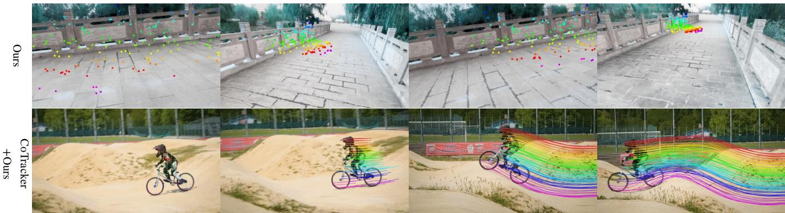

# VGGT：视觉几何基础转换器

王建源1,2 陈明浩1,2 妮基塔·卡拉耶夫1,2 安德烈·维达尔迪1,2 克里斯蒂安·鲁普雷赫特1 大卫·诺沃特尼2 1 牛津大学视觉几何组 2 Meta AI

  
ofte outperforms optimization-based alternatives without further processing.

# 摘要

# 1. 引言

我们介绍了VGGT，这是一种前馈神经网络，能够直接从一个、几个或数百个视图中推断出场景的所有关键3D属性，包括相机参数、点图、深度图和3D点轨迹。该方法是3D计算机视觉的一次进步，传统模型通常只针对单一任务进行约束和专门化。同时，该方法简单高效，可以在不到一秒的时间内重建图像，并且仍然优于需要使用视觉几何优化技术后处理的其他方法。该网络在多个3D任务中达到了最先进的结果，包括相机参数估计、多视图深度估计、稠密点云重建和3D点跟踪。我们还展示了，将预训练的VGGT作为特征主干网显著提升了下游任务的性能，例如非刚性点跟踪和前馈新视图合成。代码和模型已公开，链接为https://github.com/facebookresearch/vggt。我们考虑估计通过一组图像捕捉到的场景的3D属性，利用前馈神经网络。传统上，3D重建主要采用视觉几何方法，利用迭代优化技术如束调整（BA）[45]。机器学习通常在其中扮演重要的补充角色，解决无法单靠几何方法解决的任务，如特征匹配和单目深度预测。这种集成变得越来越紧密，如今最先进的基于结构光束的运动（SfM）方法如VGGSfM [125]通过可微分BA将机器学习和视觉几何实现了端到端结合。即便如此，视觉几何在3D重建中仍然占据重要地位，这增加了复杂性和计算成本。随着网络变得越来越强大，我们问：最终3D任务是否可以通过神经网络直接解决，几乎完全避免几何后处理？最近的贡献如DUSt3R [129]及其演变MASt3R [62]在此方向上显示出良好的结果，但这些网络每次只能处理两幅图像，并依赖后处理来重建更多图像，通过成对重建实现融合。在本文中，我们进一步迈出了消除后处理优化3D几何需求的步伐。我们通过引入视觉几何基础转换器（VGGT），一个前馈神经网络，从一个、几个或甚至数百个输入视图中执行3D重建。VGGT预测一整套3D属性，包括相机参数、深度图、点图和3D点轨迹。它所有的预测在单次前向传递中完成，耗时数秒。值得注意的是，它往往在没有进一步处理的情况下超越基于优化的替代方案。这标志着与DUSt3R、MASt3R或VGGSfM的重大不同，后者仍然需要耗时的迭代后优化才能获得可用结果。我们还展示出，为3D重建设计特别的网络并非必要。相反，VGGT基于一个相当标准的大型变换器[119]，没有特定的3D或其他归纳偏置（除了在帧级别和全局注意之间交替），而是在大量带有3D注释的公开数据集上进行训练。因此，VGGT的构建与自然语言处理和计算机视觉中的大型模型，如GPTs [1, 29, 148]、CLIP [86]、DINO [10, 78] 和稳定扩散 [34]相类似。这些模型已经成为可以微调以解决新的特定任务的多功能主干网络。类似地，我们表明VGGT计算的特征显著增强了下游任务，如动态视频中的点跟踪和新视图合成。最近有几个大型3D神经网络的例子，包括DepthAnything [142]、MoGe [128]和LRM [49]。然而，这些模型仅关注单一的3D任务，如单目深度估计或新视图合成。相比之下，VGGT使用共享主干网来共同预测所有感兴趣的3D量。我们展示学习预测这些相互关联的3D属性能提升整体准确率，尽管可能存在冗余。同时，我们展示，在推理过程中，可以从单独预测的深度和相机参数中导出点图，获取比直接使用专用点图头更高的准确性。总之，我们作出了以下贡献：(1) 我们介绍了VGGT，一个大型前馈转化器，能够在几秒内从一个、几个或甚至数百幅场景图像中预测所有关键的3D属性，包括相机内部和外部参数、点图、深度图和3D点轨迹；(2) 我们演示了VGGT的预测结果可直接使用，具有很高的竞争力，通常优于使用缓慢后处理优化技术的最先进方法；(3) 我们还表明，当与BA后处理进一步结合时，VGGT在各个方面都达到了最先进的结果，即使与专门针对部分3D任务的方法相比，质量也往往显著提高。我们的代码和模型已公开，链接为https://github.com/facebookresearch/vggt。我们相信，这将促进该方向的进一步研究，并为计算机视觉社区提供一个快速、可靠和多功能的3D重建新基础。

# 2. 相关工作

运动结构恢复是一个经典的计算机视觉问题 [45, 77, 80]，涉及从不同视点捕获的静态场景图像集中估计相机参数和重建稀疏点云。传统的运动结构恢复流程 [2, 36, 70, 94, 103, 134] 由多个阶段组成，包括图像匹配、三角测量和束调整。COLMAP [94] 是基于传统流程的最流行框架。近年来，深度学习改善了运动结构恢复流程中的许多组件，其中关键点检测 [21, 31, 116, 149] 和图像匹配 [11, 67, 92, 99] 是两个主要研究领域。近期的方法 [5, 102, 109, 112, 113, 118, 122, 125, 131, 160] 探索了端到端可微分的运动结构恢复，其中 VGGSfM [125] 开始在具有挑战性的摄影旅游场景中超越传统算法。

多视图立体视觉旨在从多个重叠的图像中密集重建场景的几何结构，通常假设已知相机参数，这些参数通常通过结构从运动（SfM）进行估计。多视图立体视觉方法可分为三类：传统手工方法 [38, 39, 96, 130]，全局优化方法 [37, 74, 133, 147]，以及基于学习的方法 [42, 72, 84, 145, 157]。与SfM类似，基于学习的多视图立体视觉方法最近取得了很大进展。这里，DUSt3R [129] 和 MASt3R [62] 直接从一对视图中估计对齐的密集点云，类似于多视图立体视觉，但不需要相机参数。一些并行研究 [111, 127, 141, 156] 探索用神经网络替代DUSt3R的测试时优化，尽管这些尝试仅实现了次优或可比于DUSt3R的性能。而VGGT则在性能上大幅超越了DUSt3R和MASt3R。Tracking-Any-Point最初在Particle Video [91] 中提出，并在深度学习时代被PIPs [44] 复兴，旨在跟踪视频序列中的兴趣点，包括动态运动。给定一个视频和一些二维查询点，任务是预测这些点在所有其他帧中的二维对应关系。TAP-Vid [23] 为此任务提出了三个基准和一个简单的基线方法，此后在TAPIR [24] 中得到了改进。CoTracker [55, 56] 利用不同点之间的相关性通过遮挡进行跟踪，而DOT [60] 则实现了通过遮挡的密集跟踪。最近，TAPTR [63] 提出了一种针对该任务的端到端变换器，LocoTrack [13] 将常用的逐点特征扩展到邻近区域。所有这些方法都是专门的点跟踪器。这里，我们证明了VGGT的特征在与现有点跟踪器结合时能产生最先进的跟踪性能。

  
extrinsics and intrinsics, and a DPT [87] head for any dense output.

# 3. 方法

我们介绍VGGT，这是一种大型变换器，能够将一组图像作为输入并生成多种三维量作为输出。我们首先在第3.1节中介绍问题，然后在第3.2节中介绍我们的架构，在第3.3节中介绍其预测头，最后在第3.4节中介绍训练设置。

# 3.1. 问题定义与符号说明

输入是一个序列 $( I _ { i } ) _ { i = 1 } ^ { N }$，包含 $N$ 个 RGB 图像 $I _ { i } \in$ $\mathbb { R } ^ { 3 \times H \times W }$，前者是一个将该序列映射到相应的每帧 3D 注释的函数：

$$
f \left( ( I _ { i } ) _ { i = 1 } ^ { N } \right) = ( \mathbf { g } _ { i } , D _ { i } , P _ { i } , T _ { i } ) _ { i = 1 } ^ { N } .
$$

因此，变换器将每个图像 $I _ { i }$ 映射到其相机参数 $\mathbf { g } _ { i } \in \mathbb { R } ^ { 9 }$（内参和外参），深度图 $D _ { i } \in \mathbb { R } ^ { H \times W }$，点云映射 $P _ { i } \in \mathbb { R } ^ { 3 \times H \times W }$，以及一个 $C$ 维的网格 $T _ { i } \in \mathbb { R } ^ { C \times H \times W }$。接下来我们解释它们的定义。对于相机参数 $\mathbf { g } _ { i }$，我们使用 [125] 中的参数化，并设定 $\mathbf { g } = [ \mathbf { q } , \mathbf { t } , \mathbf { f } ]$，这是旋转四元数 $\mathbf { q } \in \mathbb { R } ^ { 4 }$、平移向量 $\mathbf { t } \in \mathbb { R } ^ { 3 }$ 和视场 $\mathbf { \chi } : \in \mathbb { R } ^ { 2 }$ 的连接。我们假设相机的主点位于图像中心，这在结构光重建（SfM）框架中是常见的 [95, 125]。

我们用 $\mathcal { T } ( I _ { i } ) ~ = \{ 1 , \ldots , H \} \times \{ 1 , \ldots , W \}$ 来表示图像 $I _ { i }$ 的域，即像素位置的集合。深度图 $D _ { i }$ 将每个像素位置 $\mathbf { y } \in \mathcal { T } ( I _ { i } )$ 与其对应的深度值 $D _ { i } ( \mathbf { y } ) \in \mathbb { R } ^ { + }$ 相关联，这些值是从第 $i$ 摄像头观察到的。同样，点图 $P _ { i }$ 将每个像素与其对应的 3D 场景点 $P _ { i } ( \mathbf { y } ) \in \mathbb { R } ^ { 3 }$ 相关联。重要的是，与 DUSt3R [129] 中的情况一样，点图是视角独立的，这意味着 3D 点 $P _ { i } ( \mathbf { y } )$ 是在第一个摄像头 $\mathbf { g } _ { 1 }$ 的坐标系中定义的，我们将其视为世界参考框架。最后，对于关键点跟踪，我们遵循任意点跟踪方法，如 [25, 57] 所述。具体来说，给定查询图像 $I _ { q }$ 中的一个固定查询图像点 $\mathbf { y } _ { q }$，网络输出一条跟踪 $\mathcal { T } ^ { \star } ( \mathbf { y } _ { q } ) \dot { = } ( \mathbf { y } _ { i } ) _ { i = 1 } ^ { N }$，其中 $N$ 表示所有图像 $I _ { i }$ 中的点 $\mathbf { y } _ { i } \in \mathbb { R } ^ { 2 }$。

注意，上述变换器 $f$ 并不直接输出轨迹，而是生成用于跟踪的特征 $T _ { i } \in \mathbb { R } ^ { C \times H \times W }$。跟踪任务被委托给一个独立的模型 $\begin{array} { r } { \mathcal { T } ( ( \mathbf { y } _ { j } ) _ { j = 1 } ^ { M } , ( T _ { i } ) _ { i = 1 } ^ { N } ) = ( ( \hat { \mathbf { y } } _ { j , i } ) _ { i = 1 } ^ { N } ) _ { j = 1 } ^ { M } } \end{array}$，该模型利用查询点 $\mathbf { y } _ { q }$ 和由变换器 $f$ 输出的密集跟踪特征 $T _ { i }$ 来计算轨迹。这两个网络 $f$ 和 $\tau$ 是共同端到端训练的。预测顺序。输入序列中图像的顺序是任意的，唯一的例外是第一个图像被选择为参考帧。网络架构设计为对除第一个框架外的所有框架具有置换等变性。过完备预测。值得注意的是，VGGT 预测的并非所有量都是独立的。例如，如 DUSt3R[129] 所示，相机参数 $\mathbf { g }$ 可以从不变点图 $P$ 中推导出来，例如，通过求解透视 $\mathbf { \nabla } \cdot n$ -点 $( \mathrm { P n P } )$ 问题[35, 61]。

  
out of memory beyond this limit.

此外，深度图可以通过点图和相机参数进行推导。然而，正如我们在第4.5节中所展示的，在训练期间将VGGT任务明确地设置为预测上述所有量能够带来显著的性能提升，即使这些量之间存在封闭形式的关系。同时，在推理过程中，观察到独立估计的深度图和相机参数结合起来所生成的3D点比直接使用专门的点图分支更加准确。

# 3.2. 特征主干网络

基于最近在3D深度学习中的研究，我们设计了一个简单的架构，具有最小的3D归纳偏置，使模型能够从大量3D标注数据中学习。尤其是，我们将模型$f$实现为一个大型变换器。为此，每个输入图像$I$最初通过DINO被划分为一组$K$个词元$\mathrm { t } ^ { I } \in \mathbb { R } ^ { K \times C }$。来自所有帧的图像词元的组合集，即$\mathrm { t } ^ { I } = \cup _ { i = 1 } ^ { N } \{ \mathrm { t } _ { i } ^ { I } \}$，随后通过主网络结构进行处理，交替进行帧级和全局自注意力层。交替注意力。我们通过引入交替注意力（AA）对标准变换器设计进行了轻微调整，使变换器在每帧内和全局之间以交替的方式进行关注。具体而言，帧级自注意力单独关注每帧内的词元$\mathrm { t } _ { k } ^ { I }$，而全局自注意力则共同关注所有帧中的词元$\mathrm { t } ^ { I }$。这在整合不同图像之间的信息与规范化每幅图像内词元的激活之间取得了平衡。默认情况下，我们采用$L = 24$层的全局和帧级注意力。在第4节中，我们展示了我们的AA架构带来了显著的性能提升。请注意，我们的架构不采用任何交叉注意力层，仅使用自注意力层。

# 3.3. 预测头

在这里，我们描述了 $f$ 如何预测相机参数、深度图、点图和点轨迹。首先，对于每个输入图像 $I _ { i }$，我们用一个额外的相机标记 $\mathbf { t } _ { i } ^ { \mathbf { g } } \in \mathbb { R } ^ { 1 \times \check { C } ^ { \prime } }$ 和四个注册标记 [19] $\mathrm { t } _ { i } ^ { R } \in \mathbb { R } ^ { 4 \times C ^ { \prime } }$ 增强对应的图像标记 $\mathrm { t } _ { i } ^ { I }$。将 $( \mathrm { t } _ { i } ^ { I } , \mathrm { t } _ { i } ^ { \mathbf { g } } , \mathrm { t } _ { i } ^ { R } { \boldsymbol { j } } ) _ { i = 1 } ^ { N }$ 级联，形成输出标记 $( \hat { \mathrm { t } } _ { i } ^ { I } , \bar { \hat { \mathrm { t } } } _ { i } ^ { \mathbf { g } } , \hat { \mathrm { t } } _ { i } ^ { R } ) _ { i = 1 } ^ { N }$。这里，第一帧的相机标记和注册标记 $( \mathbf { t } _ { 1 } ^ { \mathbf { g } } : = \bar { \mathbf { t } } ^ { \mathbf { g } } , \mathrm { t } _ { 1 } ^ { R } : = \bar { \mathrm { t } } ^ { R } )$ 被设置为一组不同的可学习标记 $\bar { \mathrm { t } } ^ { R }$，而所有其他帧的标记 $( \mathfrak { t } _ { i } ^ { \mathbf { g } } : = \bar { \bar { \mathbf { t } } } ^ { \mathbf { g } } , \mathfrak { t } _ { i } ^ { R } : = \bar { \bar { \mathbf { t } } } ^ { R } , i \in [ 2 , \dots , N ] )$ 也是可学习的。这使得模型能够将第一帧与其余帧区分开来，并在第一台相机的坐标帧中表示 3D 预测。注意，细化后的相机和注册标记现在变得是帧特定的——这是因为我们的 AA 变换器包含逐帧自注意力层，允许变换器将相机和注册标记与来自同一图像的对应标记匹配。按照常见做法，输出的注册标记 $\hat { \mathrm { t } } _ { i } ^ { R }$ 被丢弃，而 $\mathrm { \hat { t } } _ { i } ^ { I } , \mathrm { \hat { t } } _ { i } ^ { \mathbf { g } }$ 用于预测。

  
interactive demo for better visualization quality.

坐标系。正如上文所述，我们在第一台相机的坐标系 $\mathbf { g } _ { 1 }$ 中预测相机、点云图和深度图。因此，第一台相机的外参输出被设置为单位，即第一旋转四元数为 $\mathbf { q } _ { 1 } = [ 0 , 0 , 0 , 1 ]$，第一平移向量为 $\mathbf { t } _ { 1 } = [ 0 , 0 , 0 ]$。请回忆特殊相机和注册标记 $\mathfrak { t } _ { 1 } ^ { \mathbf { g } } : = \bar { \mathfrak { t } } ^ { \mathbf { g } } , \mathfrak { t } _ { 1 } ^ { R } : = \bar { \mathfrak { t } } ^ { R }$ 是指第一台相机。相机输出 $( \hat { \mathbf { g } } ^ { i } ) _ { i = 1 } ^ { N }$ 通过四个附加自注意力层和一个线性层生成 $( \hat { \mathrm { t } } _ { i } ^ { \mathbf { g } } ) _ { i = 1 } ^ { N }$。这形成了用于预测相机内参和外参的相机头。

密集预测。输出图像词元 $\hat { \mathrm { t } } _ { i } ^ { I }$ 用于预测密集输出，即深度图 $D _ { i }$、点图 $P _ { i }$ 和跟踪特征 $T _ { i }$。更具体地，$\hat { \mathbf { t } } _ { i } ^ { I }$ 首先被转换为密集特征图 $F _ { i } \in \mathbb { R } ^ { C ^ { \prime \prime } \times H \times W }$，使用 DPT 层 [87]。然后，每个 $F _ { i }$ 通过 $3 \times 3$ 卷积层映射到相应的深度图和点图 $D _ { i }$ 和 $P _ { i }$。此外，DPT 头还输出密集特征 $T _ { i } \in \mathbb { R } ^ { C \times H \times \dot { W } }$，作为输入到跟踪图 $\Sigma _ { i } ^ { \check { D } } \in \mathbb { R } _ { + } ^ { H \times W }$ 和 $\Sigma _ { i } ^ { P } \in \mathbb { R } _ { + } ^ { H \times W }$，分别对应图的容量158,761。如第 3.4 节所述，关于不确定性图在损失中的应用，经过训练后，它们与模型对预测的信心成正比。

跟踪。为了实现跟踪模块 $\tau$，我们使用 CoTracker2 架构 [57]，其输入为密集跟踪特征 $T _ { i }$。更具体地，给定查询图像 $I _ { q }$ 中的查询点 $\mathbf { y } _ { j }$（在训练过程中，我们始终将 $q = 1$，但任何其他图像也可以作为查询），跟踪头 $\tau$ 预测与同一 3D 点 $\mathbf { y }$ 对应的所有图像 $I _ { i }$ 中的一组 2D 点 $\begin{array} { r } { \mathcal { T } ( ( \mathbf { y } _ { j } ) _ { j = 1 } ^ { M } , ( T _ { i } ) _ { i = 1 } ^ { N } ) = ( ( \hat { \mathbf { y } } _ { j , i } ) _ { i = 1 } ^ { N } ) _ { j = 1 } ^ { M } } \end{array}$。为此，首先在查询点 $\mathbf { y } _ { j }$ 上对查询图像的特征图 $T _ { q }$ 进行双线性插值，以获取其特征。然后，将该特征与所有其他特征图 $T _ { i } , i \neq q$ 进行相关，以获得一组相关图。这些图随后通过自注意力层处理，以预测最终的 2D 点 $\hat { \mathbf { y } } _ { i }$，这些点均与 $\mathbf { y } _ { j }$ 相对应。请注意，与 VGGSfM [125] 类似，我们的跟踪器并不假设输入帧的时间顺序，因此可以应用于任何一组输入图像，而不仅仅是视频。

# 3.4. 训练

训练损失。我们使用多任务损失端到端地训练VGGT模型$f$：

$$
\begin{array} { r } { \mathcal { L } = \mathcal { L } _ { \mathrm { c a m e r a } } + \mathcal { L } _ { \mathrm { d e p t h } } + \mathcal { L } _ { \mathrm { p m a p } } + \lambda \mathcal { L } _ { \mathrm { t r a c k } } . } \end{array}
$$

我们发现相机 $( \mathcal { L } _ { \mathrm { c a m e r a } } )$、深度损失 $( \Gamma _ { \mathrm { d e p t h } } )$ 和点图 $( \mathcal { L } _ { \mathrm { p m a p } } )$ 的损失范围相似，因此不需要彼此加权。追踪损失 ${ \mathcal { L } } _ { \mathrm { t r a c k } }$ 的权重降低了，系数为 $\lambda = 0 . 0 5$。我们依次描述每个损失项。相机损失 $\mathcal { L } _ { \mathrm { { c a m e r a } } }$ 通过 Huber 损失 $| \cdot | _ { \epsilon }$ 监督相机 $\hat { \bf g }$ $\begin{array} { r } { \mathcal { L } _ { \mathrm { c a m e r a } } = \sum _ { i = 1 } ^ { N } \| \hat { \mathbf { g } } _ { i } - \mathbf { g } _ { i } \| _ { \epsilon } } \end{array}$，将其与真实值 $\mathbf { g } _ { i }$ 进行比较。

深度损失 ${ \mathcal { L } } _ { \mathrm { d e p t h } }$ 遵循 DUSt3R [129] 并实现了基于效应不确定性的损失 [59, 75]，其计算预测深度 $\hat { D } _ { i }$ 和真实深度 $D _ { i }$ 之间的差异，结合预测的不确定性图 $\bar { \dot { \Sigma } } _ { i } ^ { D }$，该方法在单目深度估计中应用广泛。公式为： $$ \mathcal { L } _ { \mathrm { d e p t h } } = \sum _ { i = 1 } ^ { N } \bar { \| } \Sigma _ { i } ^ { D } \odot \big ( \hat { D } _ { i } - D _ { i } \big ) \big \| + \big \| \Sigma _ { i } ^ { D } \odot \big ( \nabla \hat { D } _ { i } - \nabla D _ { i } \big ) \big \| - \alpha \log \Sigma _ { i } ^ { \hat { D } } $$ 其中 $\odot$ 表示通道广播的逐元素乘积。点映射损失定义类似，但使用点映射不确定性 $\Sigma _ { i } ^ { P }$： $$ \mathcal { L } _ { \mathsf { p m a p } } = \breve { \sum _ { i = 1 } ^ { N } } \bar { \| \Sigma _ { i } ^ { P } \odot ( \hat { P _ { i } } - \hat { P _ { i } } ) \| } + \| \dot { \bar { \Sigma } _ { i } ^ { P } } \odot (\nabla \hat { P } _ { i } - \nabla P _ { i }) \lVert - \alpha \log { \Sigma _ { i } ^ { P } } $$

最终，跟踪损失由以下公式给出：$\mathcal{L}_{\mathrm{track}} = \sum_{j=1}^{M} \sum_{i=1}^{\mathbf{\bar{N}}} \| \mathbf{y}_{j, i} - \hat{\mathbf{y}}_{j, i} \|$，其中所有的真实标注查询点$\mathbf{y}_{j}$位于查询图像$I_{q}$中，$\mathbf{y}_{j, i}$是$\mathbf{y}_{j}$在图像$I_{i}$中的真实对应关系，$\hat{\mathbf{y}}_{j, i}$是通过应用$\mathcal{T}((\mathbf{y}_{j})_{j=1}^{M}, (T_{i})_{i=1}^{N})$获得的相应预测。参考CoTracker2 [57]，我们应用可见性损失（二元交叉熵）来估计某点在给定帧中是否可见。真实坐标归一化。如果我们缩放场景或改变其全局参考框架，场景的图像将完全不受影响，这意味着任何这样的变体都是3D重建的合法结果。我们通过标准化数据来消除这种歧义，从而做出规范选择，并要求变换器输出这种特定变体。我们遵循[129]，首先在第一台相机的坐标框架$\mathbf{g}_{1}$中表达所有量。然后，我们计算点图$P$中所有3D点到原点的平均欧几里得距离，并使用该尺度来归一化相机的平移$\mathbf{t}$、点图$P$和深度图$D$。重要的是，与[129]不同，我们不对变换器输出的预测应用这种归一化；相反，我们强制它从训练数据中学习我们选择的归一化。

实现细节。默认情况下，我们使用 $L = 2 4$ 层的全局和逐帧注意力。该模型总共有大约 12 亿个参数。我们通过优化训练损失 (2) 使用 AdamW 优化器进行 160K 次迭代来训练模型。我们使用余弦学习率调度器，峰值学习率为 0.0002，预热为 8K 次迭代。对于每个批次，我们随机从随机训练场景中抽取 224 幅帧。输入帧、深度图和点图的最大尺寸调整为 518 像素。宽高比在 0.33 和 1.0 之间随机化。我们还随机应用颜色抖动、高斯模糊和灰度增强到帧上。训练在 64 个 A100 GPU 上运行，持续九天。我们采用梯度范数裁剪，阈值为 1.0，以确保训练的稳定性。我们利用 bfloat16 精度和梯度检查点来提高 GPU 内存和计算效率。训练数据。该模型使用大量不同的数据集进行训练，包括：Co3Dv2 [88]、BlendMVS [146]、DL3DV [69]、MegaDepth [64]、Kubric [41]、WildRGB [135]、ScanNet [18]、HyperSim [89]、Mapillary [71]、Habitat [107]、Replica [104]、MVS-Synth [50]、PointOdyssey [159]、虚拟 KITTI [7]、Aria 合成环境 [82]、Aria 数字双胞胎 [82]，以及一组类似于 Objaverse [20] 的艺术家创建资产的合成数据集。这些数据集涵盖了各种领域，包括室内和室外环境，并包含合成和现实场景。这些数据集的 3D 注释来源于多个渠道，如直接传感器捕获、合成引擎或 SfM 技术 [95]。我们的数据集合在大小和多样性上与 MASt3R [30] 的数据集合大致相当。

# 4. 实验

本节将我们的 метод 与多项任务上的最先进方法进行比较，以展示其有效性。

# 4.1. 相机位姿估计

我们首先在 CO3Dv2 [88] 和 RealEstate10K [161] 数据集上评估我们的方法用于摄像机位姿估计，如表 1 所示。遵循 [124]，我们随机选择每个场景的 10 张图像，并使用标准指标 AUC $@ 3 0$ 进行评估，该指标结合了 RRA 和 RTA。RRA（相对旋转精度）和 RTA（相对平移精度）分别计算每对图像的相对角度误差。这些角度误差经过阈值化，以确定准确度评分。AUC 是在不同阈值下 RRA 和 RTA 之间最小值的准确度-阈值曲线下的面积。表 1 中的（可学习）方法是在 $\mathrm { C o } 3 \mathrm { D v } 2$ 上训练的，而不是在 RealEstate10K 上。我们的前馈模型在两个数据集上的所有指标上始终优于竞争方法，包括那些采用计算上昂贵的后优化步骤的方法，如 DUSt3R/MASt3R 的全局对齐和 VGGSfM 的束调整，通常需要超过 10 秒。相比之下，VGGT 在仅以前馈方式操作时实现了更优的性能，仅需 0.2 秒。与同时期的工作 [111, 127, 141, 156]（通过 $^ \ddag$ 标示）相比，我们的方法展示了显著的性能优势，速度接近最快的变体 Fast3R [141]。此外，我们模型在 RealEstate10K 数据集上的性能优势更加明显，而表 1 中的任何方法都没有在该数据集上训练。这验证了 VGGT 的优秀泛化能力。

Table 1. Camera Pose Estimation on RealEstate10K [161] and CO3Dv2 [88] with 10 random frames. All metrics the higher the better. None of the methods were trained on the Re10K dataset. Runtime were measured using one H100 GPU. Methods marked with ‡ represent concurrent work.   

<table><tr><td>Methods</td><td>Re10K (unseen) AUC@30 ↑</td><td>CO3Dv2 AUC@30 ↑</td><td>Time</td></tr><tr><td>Colmap+SPSG [92] PixSfM [66]</td><td>45.2 49.4</td><td>25.3 30.1</td><td>∼ 15s &gt; 20s</td></tr><tr><td>PoseDiff [124]</td><td>48.0</td><td>66.5</td><td>∼ 7s</td></tr><tr><td>DUSt3R [129] MASt3R [62]</td><td>67.7 76.4</td><td>76.7 81.8</td><td>∼ 7s ∼ 9s</td></tr><tr><td>VGGSfM v2 [125]</td><td>78.9</td><td>83.4</td><td>∼ 10s</td></tr><tr><td>MV-DUSt3R [111] ‡</td><td>71.3</td><td>69.5</td><td>∼ 0.6s</td></tr><tr><td>CUT3R [127]</td><td>75.3</td><td>82.8</td><td>∼ 0.6s</td></tr><tr><td>FLARE [156] ‡</td><td>78.8</td><td></td><td></td></tr><tr><td></td><td></td><td>83.3</td><td>∼ 0.5s</td></tr><tr><td>Fast3R [141] ‡</td><td>72.7</td><td>82.5</td><td>∼ 0.2s</td></tr><tr><td>Ours (Feed-Forward)</td><td>85.3</td><td></td><td></td></tr><tr><td>Ours (with BA)</td><td>93.5</td><td>88.2 91.8</td><td>∼ 0.2s ∼ 1.8s</td></tr></table>

Table 2. Dense MVS Estimation on the DTU [51] Dataset. Methods operating with known ground-truth camera are in the top part of the table, while the bottom part contains the methods that do not know the ground-truth camera.   

<table><tr><td>Known GT camera</td><td>Method</td><td>Acc.↓</td><td>Comp.↓</td><td>Overall↓</td></tr><tr><td>:</td><td>Gipuma [40]</td><td>0.283</td><td>0.873</td><td>0.578</td></tr><tr><td></td><td>MVSNet [144]</td><td>0.396</td><td>0.527</td><td>0.462</td></tr><tr><td>✓</td><td>CIDER [139]</td><td>0.417</td><td>0.437</td><td>0.427</td></tr><tr><td>✓</td><td>PatchmatchNet [121]</td><td>0.427</td><td>0.377</td><td>0.417</td></tr><tr><td>✓</td><td>MASt3R [62]</td><td>0.403</td><td>0.344</td><td>0.374</td></tr><tr><td>✓</td><td>GeoMVSNet [157]</td><td>0.331</td><td>0.259</td><td>0.295</td></tr><tr><td>X</td><td>DUSt3R [129]</td><td>2.677</td><td>0.805</td><td>1.741</td></tr><tr><td>X</td><td>Ours</td><td>0.389</td><td>0.374</td><td>0.382</td></tr></table>

Table 3. Point Map Estimation on ETH3D [97]. DUSt3R and MASt3R use global alignment while ours is feed-forward and, hence, much faster. The row Ours (Point) indicates the results using the point map head directly, while Ours (Depth $^ +$ Cam) denotes constructing point clouds from the depth map head combined with the camera head.   

<table><tr><td>Methods</td><td>Acc.↓</td><td>Comp.↓</td><td>Overall↓</td><td>Time</td></tr><tr><td>DUSt3R</td><td>1.167</td><td>0.842</td><td>1.005</td><td>~ 7s</td></tr><tr><td>MASt3R</td><td>0.968</td><td>0.684</td><td>0.826</td><td>∼ 9s</td></tr><tr><td>Ours (Point)</td><td>0.901</td><td>0.518</td><td>0.709</td><td>∼ 0.2s</td></tr><tr><td>Ours (Depth + Cam)</td><td>0.873</td><td>0.482</td><td>0.677</td><td>∼ 0.2s</td></tr></table>

Table 4. Two-View matching comparison on ScanNet-1500 [18, 92]. Although our tracking head is not specialized for the twoview setting, it outperforms the state-of-the-art two-view matching method Roma. Measured in AUC (higher is better).   

<table><tr><td>Method</td><td>AUC@5↑</td><td>AUC@10 ↑</td><td>AUC@20 ↑</td></tr><tr><td>SuperGlue [92]</td><td>16.2</td><td>33.8</td><td>51.8</td></tr><tr><td>LoFTR [105]</td><td>22.1</td><td>40.8</td><td>57.6</td></tr><tr><td>DKM [32]</td><td>29.4</td><td>50.7</td><td>68.3</td></tr><tr><td>CasMTR [9]</td><td>27.1</td><td>47.0</td><td>64.4</td></tr><tr><td>Roma a [33]</td><td>31.8</td><td>53.4</td><td>70.9</td></tr><tr><td>Ours</td><td>33.9</td><td>55.2</td><td>73.4</td></tr></table>

我们的结果还表明，通过将VGGT与视觉几何优化中的优化方法（如BA）相结合，可以进一步提高其性能。具体而言，使用BA对预测的相机姿态和轨迹进行精炼，可以进一步提高准确性。请注意，我们的方法直接预测接近准确的点/深度图，这可以作为BA的良好初始化。这消除了使用[125]所述的BA中的三角测量和迭代精炼的需要，使我们的方法显著加快（即使与BA结合，也只需约2秒）。因此，尽管VGGT的前馈模式超越了所有先前的替代方案（无论是前馈的还是其他），但仍然有改进的空间，因为后优化仍然带来好处。

# 4.2. 多视角深度估计

根据MASt3R [62]，我们进一步在DTU [51] 数据集上评估了我们的多视角深度估计结果。我们报告了标准的DTU指标，包括准确性（预测值与真实标注数据之间的最小欧几里得距离）、完整性（真实标注数据与预测值之间的最小欧几里得距离）及其平均整体指标（即Chamfer距离）。在表2中，DUSt3R和我们的VGGT是唯一两个在没有真实标注相机知识的情况下操作的方法。MASt3R通过利用真实标注相机的匹配三角测量深度图。同时，像GeoMVS这样的深度多视角立体方法

  
Figure 5. Visualization of Rigid and Dynamic Point Tracking. Top: VGGT's tracking module $\tau$ outputs keypoint tracks for an CoTracker [56], which processes sequential inputs.

使用真实标注数据相机构建代价体积。我们的方法明显优于DUSt3R，将整体得分从1.741降低至0.382。更重要的是，它的结果可与测试时知道真实标注数据相机的方法相媲美。这一显著的性能提升很可能归功于我们模型的多图像训练方案，该方案使其能够以原生方式进行多视图三角测量推理，而不是依赖于临时的对齐程序，例如DUSt3R仅仅是对多个成对相机三角测量进行平均。

# 4.3. 点图估计

我们还将我们预测的点云的准确性与DUSt3R和MASt3R在ETH3D [97] 数据集上的结果进行了比较。对于每个场景，我们随机抽取10帧。使用Umeyama [117] 算法将预测的点云与真实标注数据对齐。结果是在使用官方掩膜过滤无效点后报告的。我们报告了点图估计的准确率、完整性和整体（Chamfer距离）。如表3所示，尽管DUSt3R和MASt3R进行了昂贵的优化（全局对齐——每个场景大约10秒），但我们的方法在仅需0.2秒的简单前馈模式下仍显著优于它们。同时，与直接使用我们估计的点图相比，我们发现来自深度和相机头的预测（即使用预测的相机参数将预测的深度图反投影到3D）提供了更高的准确性。我们将此归因于将复杂任务（点图估计）分解为更简单的子问题（深度图和相机预测）的好处，即使在训练期间相机、深度图和点图是联合监督的。我们在图3中展示了与DUSt3R在自然场景中的定性比较，在图4中提供了更多例子。VGGT输出高质量的预测，并且能够很好地推广，在具有挑战性的跨域示例中表现出色，例如油画、非重叠帧以及具有重复或均质纹理的场景，如沙漠。

Table 5. Ablation Study for Transformer Backbone on ETH3D. We compare our alternating-attention architecture against two variants: one using only global self-attention and another employing cross-attention.   

<table><tr><td>ETH3D Dataset</td><td>Acc.↓</td><td>Comp.↓</td><td>Overall↓</td></tr><tr><td>Cross-Attention</td><td>1.287</td><td>0.835</td><td>1.061</td></tr><tr><td>Global Self-Attention Only</td><td>1.032</td><td>0.621</td><td>0.827</td></tr><tr><td>Alternating-Attention</td><td>0.901</td><td>0.518</td><td>0.709</td></tr></table>

# 4.4. 图像匹配

双视图图像匹配是计算机视觉领域广泛研究的话题 [68, 93, 105]。它代表了一种特定的刚性点跟踪情况，仅限于两个视图，因此是衡量我们跟踪准确性的一种合适评估基准，尽管我们的模型并未专门针对该任务。我们遵循标准协议 [33, 93] 在ScanNet数据集 [18] 上进行评估，并在表4中报告结果。对于每对图像，我们提取匹配点并利用它们估计本质矩阵，随后将其分解为相对相机姿态。最终指标是相对姿态的准确性，通过AUC进行测量。在评估中，我们使用ALIKED [158] 检测关键点，将其视为查询点 $\mathbf { y } _ { q }$。这些查询点随后传递给我们的跟踪分支 $\tau$ 以在第二帧中寻找对应关系。我们从Roma [33] 采用评估超参数（例如，匹配数量、RANSAC阈值）。尽管没有明确针对双视图匹配进行训练，表4显示VGGT在所有基线中取得了最高的准确性。

# 4.5. 消融研究

特征主干网络。我们首先通过将提出的交替注意力设计与两种替代注意力架构进行比较，验证其有效性：（a）仅使用全局自注意力，和（b）交叉注意力。为了确保公平比较，所有模型变体保持相同数量的参数，使用总计 $2 L$ 个注意力层。在交叉注意力变体中，每一帧独立地关注来自所有其他帧的词元，最大化帧间信息融合，尽管这显著增加了运行时间，特别是在输入帧数量增加时。超参数如隐藏维度和头数保持一致。我们选择点图估计精度作为消融研究的评估指标，因为它反映了模型对场景几何和相机参数的整体理解。表5中的结果表明，我们的交替注意力架构明显优于两个基线变体。此外，我们其他初步探索性实验的一致结果也表明，使用交叉注意力的架构通常不如仅采用自注意力的架构表现优秀。

Table 6. Ablation Study for Multi-task Learning, which shows that simultaneous training with camera, depth and track estimation yields the highest accuracy in point map estimation on ETH3D.   

<table><tr><td>w. Lcamera</td><td>W. Ldepth</td><td>W. Ltrack</td><td>Acc.↓</td><td>Comp.↓</td><td>Overall↓</td></tr><tr><td>×</td><td>✓</td><td>:</td><td>1.042</td><td>0.627</td><td>0.834</td></tr><tr><td></td><td>×</td><td></td><td>0.920</td><td>0.534</td><td>0.727</td></tr><tr><td>:</td><td>✓</td><td>×</td><td>0.976</td><td>0.603</td><td>0.790</td></tr><tr><td></td><td>✓</td><td>✓</td><td>0.901</td><td>0.518</td><td>0.709</td></tr></table>

多任务学习。我们还验证了训练单个网络以同时学习多个 3D 量的好处，即使这些输出可能存在重叠（例如，深度图和相机参数一起可以生成点图）。如表 6 所示，在没有相机、深度或轨迹估计的情况下进行训练时，点图估计的准确性明显下降。值得注意的是，纳入相机参数估计显著提高了点图的准确性，而深度估计仅带来了边际改善。

# 4.6. 下游任务的微调

我们现在展示 VGGT 预训练特征提取器如何可以在下游任务中重用。我们将对此在前馈新视角合成和动态点跟踪中进行说明。前馈新视角合成正在快速发展。现有的大多数方法以已知相机参数的图像作为输入，预测对应于新相机视角的目标图像。我们遵循 LVSM 的方法，而不是依赖于显式的 3D 表示，修改 VGGT 以直接输出目标图像。但我们并不假设输入帧的相机参数是已知的。我们严格遵循 LVSM 的训练和评估协议，例如使用 4 个输入视角，采用 Plücker 射线表示目标视角。我们对 VGGT 进行了简单的修改。如之前所述，输入图像通过 DINO 转换为词元。然后，对于目标视角，我们使用卷积层将其 Plücker 射线图像编码为词元。这些代表输入图像和目标视角的词元被连接并由 AA transformer 处理。随后，使用 DPT 头回归目标视角的 RGB 颜色。值得注意的是，我们并未输入源图像的 Plücker 射线。因此，模型并没有获得这些输入帧的相机参数。

  
Figure 6. Qualitative Examples of Novel View Synthesis. The top row shows the input images, the middle row displays the ground truth images from target viewpoints, and the bottom row presents our synthesized images.

Table 7. Quantitative comparisons for view synthesis on GSO [28] dataset. Finetuning VGGT for feed-forward novel view synthesis, it demonstrates competitive performance even without knowing camera extrinsic and intrinsic parameters for the input images. Note that \* indicates using a small training set (only $2 0 \%$ .   

<table><tr><td>Method</td><td>Known Input Cam</td><td>Size</td><td>PSNR ↑</td><td>SSIM ↑</td><td>LPIPS ↓</td></tr><tr><td>LGM [110]</td><td></td><td>256</td><td>21.44</td><td>0.832</td><td>0.122</td></tr><tr><td>GS-LRM [154]</td><td>:</td><td>256</td><td>29.59</td><td>0.944</td><td>0.051</td></tr><tr><td>LVSM [53]</td><td>✓</td><td>256</td><td>31.71</td><td>0.957</td><td>0.027</td></tr><tr><td>Ours-NVS*</td><td>×</td><td>224</td><td>30.41</td><td>0.949</td><td>0.033</td></tr></table>

LVSM 是在 Objaverse 数据集上训练的 [20]。我们使用了一个内部数据集，大小约为 Objaverse 的 $20 \%$。关于训练和评估的更多细节可以在 [53] 中找到。正如表 7 所示，尽管我们的模型不需要输入相机参数且使用的训练数据少于 LVSM，但在 GSO 数据集 [28] 上仍取得了竞争性的结果。我们预计使用更大的训练数据集将获得更好的结果。定性示例见图 6。动态点跟踪在近年来成为一个极具竞争力的任务 [25, 44, 57, 136]，并且它为我们学习的特征提供了另一个下游应用。根据标准做法，我们报告这些点跟踪指标：遮挡准确率 (OA)，其包括生物 $\delta _ { \mathrm { a v g } } ^ { \mathrm { v i s } }$，表示在一定像素阈值内准确跟踪的可见点的平均比例；平均杰卡德 (AJ)，测量跟踪和遮挡预测的准确性。

Table 8. Dynamic Point Tracking Results on the TAP-Vid benchmarks. Although our model was not designed for dynamic scenes, simply fine-tuning CoTracker with our pretrained weights significantly enhances performance, demonstrating the robustness and effectiveness of our learned features.   

<table><tr><td rowspan="2">Method</td><td colspan="2">Kinetics</td><td colspan="2">RGB-S</td><td colspan="2">DAVIS</td></tr><tr><td>δvis AJ</td><td>OA</td><td>AJ</td><td>Ovig OA</td><td>AJ</td><td>δvis OA</td></tr><tr><td>TAPTR [63]</td><td>49.0 64.4</td><td>85.2</td><td>60.8</td><td>76.2 87.0</td><td>63.0 76.1</td><td>91.1</td></tr><tr><td>LocoTrack [13]</td><td>52.9 66.8 85.3</td><td></td><td>69.7</td><td>83.2 89.5</td><td>62.9</td><td>75.3 87.2</td></tr><tr><td>BootsTAPIR [26]</td><td>54.6 68.4</td><td>86.5</td><td>70.8</td><td>83.0 89.9</td><td></td><td>61.4 73.6 88.7</td></tr><tr><td>CoTracker [56]</td><td>49.6 64.3 83.3 67.4 78.9</td><td></td><td></td><td>85.2</td><td></td><td>61.8 76.1 88.3</td></tr><tr><td>CoTracker + Ours 57.2 69.0 88.9 72.1 84.0</td><td></td><td></td><td></td><td></td><td></td><td>91.6 64.7 77.5 91.4</td></tr></table>

我们通过用预训练的特征主干替换最先进的 CoTracker2 模型的主干进行适配 [57]。这是必要的，因为 VGGT 是在无序图像集合上训练的，而不是顺序视频。我们的主干预测追踪特征 $T _ { i }$，这些特征替代了特征提取器的输出，并随后进入 CoTracker2 架构的其余部分，最终预测轨迹。我们在 Kubric [41] 上对整个修改后的追踪器进行微调。如表 8 所示，预训练的 VGGT 的集成显著提升了 CoTracker 在 TAPVid 基准测试 [23] 上的性能。例如，VGGT 的追踪特征改善了 $\delta _ { \mathrm { a v g } } ^ { \mathrm { v i s } }$ Vid RGB-S 数据集。尽管 TAP-Vid 基准测试包含来自各种数据来源的快速动态运动视频，但我们模型的强大性能证明了其特征的泛化能力，即使在未明确设计的场景中也能表现良好。

# 5. 讨论

局限性。尽管我们的方法在多样化的实际场景中展现了强大的泛化能力，但仍然存在一些局限性。首先，当前模型不支持鱼眼或全景图像。此外，在极端输入旋转条件下，重建性能下降。此外，尽管我们的模型能够处理轻微的非刚性运动场景，但在涉及 substantial 非刚性变形的情况下失败。然而，我们方法的一个重要优点是其灵活性和易于适应性。通过在针对性的数据集上进行微调，结合最小的架构修改，可以直截了当地解决这些局限性。这种适应性明显将我们的方法与现有方法区分开来，后者通常在测试阶段优化时需要进行大量的重新设计以适应这些特殊场景。

Table 9. Runtime and peak GPU memory usage across different numbers of input frames. Runtime is measured in seconds, and GPU memory usage is reported in gigabytes.   

<table><tr><td>Input Frames</td><td>1</td><td>2</td><td>4</td><td>8</td><td>10</td><td>20</td><td>50</td><td>100</td><td>200</td></tr><tr><td>Time (s)</td><td>0.04</td><td>0.05</td><td>0.07</td><td>0.11</td><td>0.14</td><td>0.31</td><td>1.04</td><td>3.12</td><td>8.75</td></tr><tr><td>Mem. (GB)</td><td>1.88</td><td>2.07</td><td>2.45</td><td>3.23</td><td>3.63</td><td>5.58</td><td>11.41</td><td>21.15</td><td>40.63</td></tr></table>

运行时和内存。如表9所示，我们评估了在处理不同数量输入帧时特征主干的推理运行时和峰值GPU内存使用情况。测量使用单个NVIDIA H100 GPU和flash attention v3进行。图像分辨率为$3 3 6 \times 5 1 8$。我们重点关注特征主干的相关开销，因为用户可能会根据具体需求和可用资源选择不同的分支组合。相机头相对轻量，通常占特征主干运行时的约$5 \%$和使用的GPU内存的约$2 \%$。DPT头每帧平均使用0.03秒和0.2 GB GPU内存。当GPU内存充足时，可以在单次前向传递中高效处理多个帧。同时，在我们的模型中，帧间关系仅在特征主干内处理，DPT头对每帧做出独立预测。因此，受到GPU资源限制的用户可能按帧进行预测。我们将这一权衡留给用户自行决定。我们认识到，全球自注意力的朴素实现在大量令牌的情况下可能会导致高内存消耗。可以通过采用大型语言模型（LLM）部署中使用的技术来实现节省或加速。例如，Fast3R采用张量并行性加速多个GPU的推理，完全可以直接应用于我们的模型。图像块化。如第3.2节所讨论，我们探索了利用$1 4 \times 1 4$卷积层或预训练的DINOv2模型将图像块化为词元的方法。实证结果表明，DINOv2模型提供了更好的性能；此外，它确保了训练过程的稳定性，尤其是在初始阶段。DINOv2模型对学习率或动量等超参数的变化敏感性也较低。因此，我们选择DINOv2作为模型中块化的默认方法。可微分BA。我们还探索了像VGGSfM那样使用可微分束调整的想法。在小规模初步实验中，可微分BA显示出良好的性能。然而，它在训练期间的计算成本构成了瓶颈。使用Theseus在PyTorch中启用可微分BA通常使每个训练步骤慢约4倍，这对大规模训练来说代价昂贵。虽然定制框架以加快训练可能是一个潜在的解决方案，但超出了本工作的范围。因此，我们选择不在本工作中包含可微分BA，但我们认识到它作为大规模无监督训练的一个有前景的方向，因为它可以在缺乏明确3D标注的场景中充当有效的监督信号。单视图重建。与需要复制图像以创建配对的DUSt3R和MASt3R等系统不同，我们的模型架构本质上支持输入单个图像。在这种情况下，全球注意力简单地过渡为逐帧注意力。尽管我们的模型并非专门为单视图重建训练，但其显示出意外良好的结果。一些示例可以在图3和图7中找到。我们强烈鼓励尝试我们的演示以获得更好的可视化。规范化预测。如第3.4节所讨论，我们的方法使用3D点的平均欧几里得距离来规范化真实标注数据。虽然一些方法，如DUSt3R，也对网络预测应用这种规范化，但我们的发现表明，这对收敛既不是必要的，也对最终模型性能没有优势。此外，规范化在训练阶段往往引入额外的不稳定性。

# 6. 结论

我们提出了视觉几何基础变换器（VGGT），一种前馈神经网络，能够直接估计数百个输入视图的所有关键 3D 场景属性。它在多个 3D 任务中取得了最先进的成果，包括相机参数估计、多视角深度估计、稠密点云重建和 3D 点跟踪。我们简单的、以神经网络为主的方法区别于传统的视觉几何方法，后者依赖于优化和后处理以获得准确且特定于任务的结果。我们的方法简单高效，十分适合实时应用，这是相比基于优化的方法的另一项优势。

# 附录

在附录中，我们提供以下内容： • 附录 A 中关键术语的正式定义。 • 附录 B 中的全面实现细节，包括架构和训练超参数。 • 附录 C 中的额外实验和讨论。 • 附录 D 中单视图重建的定性示例。 • 附录 E 中相关工作的扩展综述。

# A. 正式定义

在本节中，我们提供额外的正式定义，以进一步巩固方法部分。

相机外参是相对于世界参考框架定义的，我们将其视为第一个相机的坐标系统。因此，我们引入两个函数。第一个函数 $\gamma ( { \bf g } , { \bf p } ) = { \bf p } ^ { \prime }$ 将编码在 $\mathbf { g }$ 中的刚性变换应用于世界参考框架中的点 $\mathbf { p }$，以获得相机参考框架中的对应点 $\mathbf { p ^ { \prime } }$。第二个函数 $\pi ( \mathbf { g } , \mathbf { p } ) = \mathbf { y }$ 进一步应用透视投影，将三维点 $\mathbf { p }$ 映射到二维图像点 $\mathbf { y }$。我们还将从相机 $\mathbf { g }$ 所观察的点的深度表示为 $\pi ^ { \mathrm { D } } ( \mathbf { g } , \mathbf { p } ) = d \in \mathbb { R } ^ { + }$。

我们将场景建模为一组正则表面 $S _ { i } \subset \mathbb { R } ^ { 3 }$。我们将其作为第 $i$ 张输入图像的函数，因为场景可能会随时间变化 [151]。像素位置 $\mathbf { y } \in \mathcal { T } ( I _ { i } )$ 的深度定义为投影到 $y$ 的任何 3D 点 $\mathbf { p }$ 的最小深度，即 $D _ { i } ( \mathbf { y } ) = \operatorname* { m i n } \{ \pi ^ { D } ( \mathbf { g } _ { i } , \mathbf { p } ) : \mathbf { p } \in S _ { i } \ \land \ \pi ( \mathbf { g } _ { i } , \mathbf { p } ) = \mathbf { y } \}$。然后，像素位置 $\mathbf { y }$ 的点由 $P _ { i } ( \mathbf { y } ) = \gamma ( \mathbf { g } , \mathbf { p } )$ 给出，其中 $\mathbf { p } \in S _ { i }$ 是最小化上述表达式的 3D 点，即 $\mathbf { p } \in S _ { i } \wedge \pi ( \mathbf { g } _ { i } , \mathbf { p } ) = \mathbf { y } \wedge \pi ^ { D } ( \mathbf { g } _ { i } , \mathbf { p } ) = D _ { i } ( \mathbf { y } ) .$

# B. 实现细节

架构。正如主文中所提到的，VGGT由24个注意力块组成，每个块配备一个逐帧自注意力层和一个全局自注意力层。遵循DINOv2中使用的ViT-L模型，每个注意力层的特征维度配置为1024，并采用16个头。我们使用PyTorch的注意力层官方实现，即torch.nn.MultiheadAttention，并启用闪存注意力。为稳定训练，我们还针对每个注意力层使用QKNorm和LayerScale。LayerScale的初始值设为0.01。在图像标记化方面，我们使用DINOv2并加入位置嵌入。如文献[143]所示，我们从第4、11、17和23个块中输入标记到DPT进行上采样。

训练。为了形成一个训练批次，我们首先选择一个随机训练数据集（每个数据集具有不同但大致相似的权重，如 [129] 所示），然后从该数据集中均匀地抽取一个随机场景。在训练阶段，我们从每个场景中选择 2 到 24 幅帧，同时保持每个批次总共 48 幅帧。我们使用每个数据集的相应训练集进行训练。我们排除包含少于 24 幅帧的训练序列。RGB 帧、深度图和点图首先被等方 resize，使较长尺寸为 518 像素。然后，我们将较短维度（围绕主点）裁剪至 168 到 518 像素之间，同时保持为 14 像素补丁大小的倍数。值得一提的是，我们在同一场景中的每幅帧上独立应用激进的颜色增强，以提高模型对变化光照条件的鲁棒性。我们根据 [33, 105, 125] 构建真实标注轨迹，解投影深度图至 3D，将点重投影至目标帧，并在重投影深度与目标深度图匹配时保留对应关系。在批次采样过程中，低相似度的帧将被排除。在极少数情况下，如没有有效的对应关系，跟踪损失将被省略。

# C. 附加实验

相机位姿估计在IMC上我们还使用图像匹配挑战（IMC）进行评估，这是一个聚焦于摄影旅游数据的相机位姿估计基准测试。直到最近，该基准测试一直被经典的增量结构光（SfM）方法所主导。基准。我们评估我们模型的两种变体：VGGT和$\mathrm { V G G T + B A }$。VGGT直接输出相机位姿估计，而$\mathrm { V G G T + B A }$通过增加的束调整阶段来优化该估计。我们与经典的增量SfM方法（如[66, 94]）以及最近提出的深度方法进行比较。具体来说，VGGSfM [125]最近提供了首个端到端训练的深度方法，在具有挑战性的摄影旅游数据集上超越了增量SfM。除了VGGSfM，我们还与最近流行的DUSt3R [129]和MASt3R [62]进行比较。需注意的是，DUSt3R和MASt3R在训练时使用了MegaDepth数据集的大部分内容，仅排除了场景0015和0022。在他们的训练中使用的MegaDepth场景与IMC基准测试之间存在一定重叠，尽管图像并不完全相同；相同的场景出现在两个数据集中。例如，MegaDepth场景0024对应于大英博物馆，而大英博物馆也是IMC基准中的一个场景。为了进行公平的比较，我们采用与DUSt3R和MASt3R相同的训练分割。在本文中，为了确保在ScanNet-1500上进行公平比较，我们从训练中排除了相应的ScanNet场景。

结果。表10展示了我们的评估结果。尽管摄影旅游数据是SfM方法的传统重点，但我们的VGGT的前馈性能与最先进的VGGSfMv2相当，其$\mathbf { A U C @ 1 0 }$为71.26，而VGGSfMv2为76.82，同时速度显著更快（每帧0.2秒对比10秒）。值得注意的是，VGGT在所有精度阈值下明显超越了MASt3R [62]和DUSt3R [129]，而且速度也快得多。这是因为MASt3R和DUSt3R的前馈预测只能处理帧对，因此需要一个代价高昂的全局对齐步骤。此外，经过束调整后，$\mathrm { V G G T + B A }$的性能进一步显著提升，在IMC上达到了最先进的性能，AUC $@ 1 0$从71.26提高到84.91，AUC $@ 3$从39.23提高到66.37。请注意，我们的模型直接预测3D点，这可以作为BA的初始化。这消除了与[125]中所述的三角测量和BA的迭代精细化过程的需要。因此，VGGT $^ +$ BA的速度远快于[125]。

Table 10. Camera Pose Estimation on IMC [54]. Our method achieves state-of-the-art performance on the challenging phototropism data, outperforming VGGSfMv2 [125] which ranked first on the latest CVPR'24 IMC Challenge in camera pose (rotation and translation) estimation.   

<table><tr><td>Method</td><td>Test-time Opt.</td><td>AUC@3</td><td>AUC@5</td><td>AUC@10</td><td>Runtime</td></tr><tr><td>COLMAP (SIFT+NN) [94]</td><td>✓</td><td>23.58</td><td>32.66</td><td>44.79</td><td>&gt;10s</td></tr><tr><td>PixSfM (SIFT + NN) [66]</td><td>✓</td><td>25.54</td><td>34.80</td><td>46.73</td><td>&gt;20s</td></tr><tr><td>PixSfM (LoFTR) [66]</td><td>✓</td><td>44.06</td><td>56.16</td><td>69.61</td><td>&gt;20s</td></tr><tr><td>PixSfM (SP + SG) [66]</td><td>✓</td><td>45.19</td><td>57.22</td><td>70.47</td><td>&gt;20s</td></tr><tr><td>DFSfM (LoFTR) [47]</td><td>✓</td><td>46.55</td><td>58.74</td><td>72.19</td><td>&gt;10s</td></tr><tr><td>DUSt3R [129]</td><td>✓</td><td>13.46</td><td>21.24</td><td>35.62</td><td>∼ 7s</td></tr><tr><td>MASt3R [62]</td><td>✓</td><td>30.25</td><td>46.79</td><td>57.42</td><td>∼ 9s</td></tr><tr><td>VGGSfM [125]</td><td>✓</td><td>45.23</td><td>58.89</td><td>73.92</td><td>∼ 6s</td></tr><tr><td>VGGSfMv2 [125]</td><td>✓</td><td>59.32</td><td>67.78</td><td>76.82</td><td>∼ 10s</td></tr><tr><td>VGGT (ours)</td><td>X</td><td>39.23</td><td>52.74</td><td>71.26</td><td>0.2s</td></tr><tr><td>VGGT + BA (ours)</td><td>✓</td><td>66.37</td><td>75.16</td><td>84.91</td><td>1.8s</td></tr></table>

# D. 定性示例

我们进一步在图7中展示了单视图重建的定性示例。

# E. 相关工作

在本节中，我们讨论其他相关的工作。视觉变换器。变换器架构最初是为语言处理任务提出的。后来，ViT将其引入计算机视觉领域，激发了广泛的采用。视觉变换器及其变体自此在各种计算机视觉任务的架构设计中占据主导地位，这都得益于其简单性、高容量、灵活性以及捕捉长期依赖关系的能力。DeiT展示了视觉变换器可以在ImageNet等数据集上使用强大的数据增强策略进行有效训练。DINO揭示了视觉变换器以自监督方式学习的特征的有趣属性。CaiT引入了层级缩放，以应对训练更深层视觉变换器的挑战，有效缓解与梯度相关的问题。此外，还提出了如QKNorm等技术来稳定训练过程。此外，[138]还探讨了对象追踪中逐帧注意力模块与全局注意力模块之间的动态关系，尽管使用的是交叉注意力。

相机姿态估计。从多视角图像中估计相机姿态是三维计算机视觉中的一个关键问题。在过去几十年中，运动结构（SfM）已成为主要的方法，无论是增量式还是全局式。最近，一组方法将相机姿态估计视为回归问题，这在稀疏视图设置下显示出了良好的结果。AceZero进一步提出回归三维场景坐标，FlowMap则专注于深度图，作为相机预测的中介。相对而言，VGGSfM简化了经典的SfM流程，构建了一个可微分的框架，表现出特别优秀的性能，尤其是在摄影旅游数据集上。同时，DUSt3R引入了一种学习像素对齐点图的方法，从而可以通过简单的对齐来恢复相机姿态。这一范式的转变引起了相当大的关注，因为点图作为一种过度参数化的表示，能够与多种下游应用（如三维高斯溅射）无缝集成。