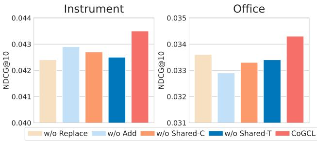
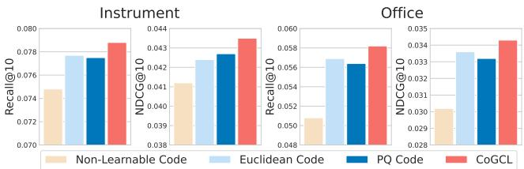
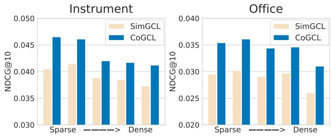
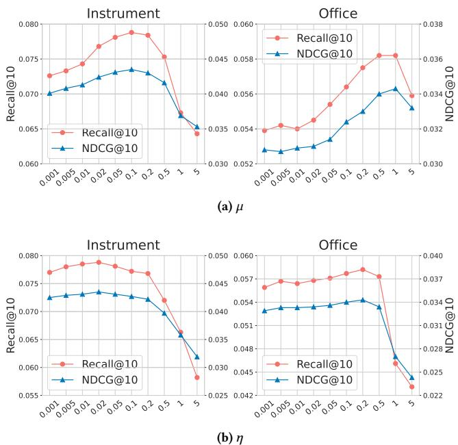
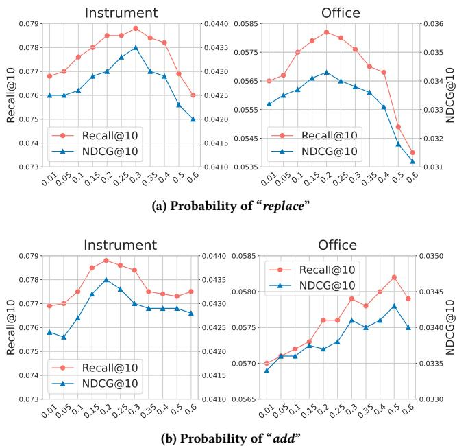
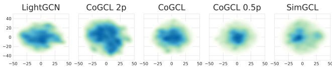

# 1. 论文基本信息

## 1.1. 标题
Enhancing Graph Contrastive Learning with Reliable and Informative Augmentation for Recommendation (通过可靠和信息丰富的增强来增强图对比学习以用于推荐)

## 1.2. 作者
Hongyu Lu, Bowen Zheng, Junjie Zhang, Yu Chen, Ming Chen, Wayne Xin Zhao, Ji-Rong Wen。
作者们主要来自微信 (WeChat, Tencent Guangzhou/Beijing) 和中国人民大学 (Renmin University of China Beijing)。

## 1.3. 发表期刊/会议
该论文尚未在特定期刊或会议上正式发表。它以预印本 (preprint) 形式发布在 arXiv 上。考虑到作者的研究背景和中国人民大学在人工智能和推荐系统领域的学术影响力，以及腾讯微信的工业背景，该工作有望在顶级的机器学习或数据挖掘会议（如 SIGIR, KDD, WWW, NeurIPS, ICML, ICLR 等）或期刊上发表。

## 1.4. 发表年份
2024年

## 1.5. 摘要
图神经网络 (GNN) 因其能够建模高阶的用户-物品关系而在协同过滤 (CF) 中表现出色。为了缓解数据稀疏性并增强表示学习，近期许多工作将对比学习 (CL) 与 GNNs 相结合。尽管取得了显著改进，但现有方法中基于结构和表示扰动的对比视图生成可能会破坏对比视图中的协同信息，导致正样本对齐的效果有限。为了解决这个问题，本文提出了 CoGCL，一个旨在通过离散编码构建具有更强协同信息的对比视图，从而增强图对比学习的新框架。其核心思想是将用户和物品映射到富含协同信息的离散编码中，以生成可靠且信息丰富的对比视图。为此，首先以端到端 (end-to-end) 的方式引入多级向量量化器 (multi-level vector quantizer)，将用户和物品的表示量化为离散编码。基于这些离散编码，CoGCL 通过分别考虑邻域结构 (neighborhood structure) 和语义相关性 (semantic relevance) 来增强对比视图的协同信息。在邻域结构方面，CoGCL 提出了虚拟邻居增强 (virtual neighbor augmentation)，将离散编码视为虚拟邻居，从而将观测到的用户-物品交互扩展为涉及离散编码的多个边。在语义相关性方面，CoGCL 基于共享的离散编码和交互目标识别相似的用户/物品，以生成语义相关视图。通过这些策略，CoGCL 构建了具有更强协同信息的对比视图，并开发了一种三视图图对比学习方法。在四个公开数据集上的大量实验证明了所提方法的有效性。此外，详细分析突出了 CoGCL 在增强推荐领域的图 CL 方面的贡献。

## 1.6. 原文链接
- 原文链接: https://arxiv.org/abs/2409.05633
- PDF 链接: https://arxiv.org/pdf/2409.05633v2.pdf
- 发布状态: 预印本 (Preprint)，发布于 arXiv。

# 2. 整体概括

## 2.1. 研究背景与动机
### 2.1.1. 核心问题
在推荐系统领域，基于图神经网络 (GNN) 的协同过滤 (CF) 方法因其能够有效地建模用户和物品之间的高阶关系而取得了显著成功。然而，GNN-based CF 方法面临一个核心挑战：<strong>数据稀疏性 (data sparsity)</strong>。用户行为的稀疏性导致交互图的边数量有限，从而使得学习高质量的用户和物品表示变得困难，这直接影响了推荐性能。

### 2.1.2. 现有研究的挑战与空白
为了解决数据稀疏性和增强表示学习，最近的研究将<strong>对比学习 (Contrastive Learning, CL)</strong> 与 GNNs 相结合。尽管这些方法取得了一定的进展，但现有的图对比学习方法在生成对比视图 (contrastive views) 时存在潜在问题：
1.  **扰动对协同信息的破坏：** 现有方法通常通过结构扰动（如随机删除节点/边）或表示扰动（如添加随机噪声）来生成对比视图。这些扰动操作可能会<strong>破坏 (disrupt)</strong> 原始交互图中固有的协同信息，尤其是在用户行为稀疏的场景下，关键交互可能被丢失。
2.  **正样本对齐的低效性：** 由于对比视图中协同信息的破坏，导致正样本对齐 (positive alignment) 的有效性受限。模型在对齐这些可能已经被破坏的视图时，可能无法有效地捕获到真实的协同信号，甚至可能引入误导性信号。
3.  **对表示均匀性的过度依赖：** 经验分析表明，现有图 CL 方法的性能很大程度上依赖于 CL 促进的不同实例之间的表示均匀性 (uniformity)，而非正样本对齐的有效性。这暗示了当前正样本对齐的质量并不理想。

### 2.1.3. 本文的切入点与创新思路
CoGCL 旨在解决现有图 CL 方法在对比视图生成中对协同信息破坏的问题。其创新思路在于：
1.  **构建高质量的对比视图：** 不再依赖可能破坏信息的随机扰动，而是致力于生成<strong>可靠 (reliable)</strong> 且<strong>信息丰富 (informative)</strong> 的对比视图，这些视图能够主动<strong>增强 (enhance)</strong> 协同信息。
2.  **引入离散编码：** 核心是利用离散编码 (discrete codes) 来表示用户和物品。这些离散编码被设计为富含协同信息，并作为构建增强视图的基础。
3.  **双重增强策略：** 基于离散编码，CoGCL 从两个方面增强对比视图：
    *   <strong>邻域结构增强 (Neighborhood Structure Enhancement)：</strong> 通过将离散编码作为虚拟邻居 (virtual neighbors) 来扩展用户-物品交互，从而缓解稀疏性，并引入更丰富的结构信息。
    *   <strong>语义相关性增强 (Semantic Relevance Enhancement)：</strong> 通过共享离散编码和交互目标来识别语义相似的用户/物品，并将其作为正样本进行对齐，以捕获更细粒度的协同语义。

        通过这些策略，CoGCL 希望能够生成具有更强协同信息的对比视图，从而在推荐任务中实现更有效的表示学习。

## 2.2. 核心贡献/主要发现
本文的核心贡献和主要发现可以总结如下：

1.  **提出了 CoGCL 框架：** 引入了一个名为 CoGCL (Collaborative Graph Contrastive Learning) 的新框架，旨在通过离散编码构建具有更强协同信息的可靠且信息丰富的对比视图，从而增强图对比学习在推荐系统中的应用。
2.  **端到端离散编码学习：** 提出了一种端到端 (end-to-end) 的多级向量量化器 (multi-level vector quantizer) 方法，用于将 GNN 编码的用户和物品表示量化为富含协同信息的离散编码。这种学习方式确保了离散编码与推荐任务的紧密关联。
3.  **新颖的对比视图生成机制：**
    *   <strong>虚拟邻居增强 (Virtual Neighbor Augmentation)：</strong> 基于离散编码，通过将离散编码视为虚拟邻居，提出了“替换 (replace)”和“添加 (add)”两种操作来增强邻域结构。这有效地扩展了观察到的用户-物品交互，缓解了数据稀疏性，并为对比视图带来了更丰富的结构信息。
    *   <strong>语义相关性采样 (Semantic Relevance Sampling)：</strong> 基于共享离散编码和共享交互目标来识别语义相关的用户/物品，并将其作为额外的正样本进行对比学习，从而增强模型对协同语义的捕获能力。
4.  **三视图图对比学习方法：** 结合了上述两种增强策略，开发了一种三视图图对比学习 (triple-view graph contrastive learning) 方法，以在这些增强的对比视图之间进行对齐，有效地融合了结构和语义信息。
5.  **实验验证与显著性能提升：** 在四个公开数据集（Instrument, Office, Gowalla, iFashion）上进行了广泛的实验，结果表明 CoGCL 在所有情况下都持续优于现有基线模型，包括各种传统的协同过滤方法、GNN-based 方法以及最先进的图对比学习方法。
6.  **深入分析揭示关键作用：** 详细的消融研究 (ablation study) 和参数分析证实了 CoGCL 各个组件（包括不同的数据增强方法、对齐和均匀性项）在提升推荐性能中的关键作用，特别是在缓解数据稀疏性方面的显著效果。

# 3. 预备知识与相关工作

## 3.1. 基础概念

### 3.1.1. 图神经网络 (Graph Neural Network, GNN)
**概念定义：** 图神经网络是一类专门处理图结构数据的深度学习模型。它通过在图的节点及其邻居之间传递和聚合信息（即<strong>消息传递 (message passing)</strong> 机制），来学习节点的低维表示（即<strong>嵌入 (embedding)</strong>）。在推荐系统中，GNN 通常用于建模用户-物品交互图，从而捕获用户和物品之间的高阶关系。

**在本文中的应用：** 本文采用 LightGCN 作为 GNN 编码器，用于从用户-物品交互图中学习用户和物品的表示。

### 3.1.2. 协同过滤 (Collaborative Filtering, CF)
**概念定义：** 协同过滤是推荐系统中最常用和最有效的技术之一。其核心思想是根据用户过去的行为（如评分、购买、浏览等）或用户与用户、物品与物品之间的相似性来做出推荐。例如，如果用户 A 和用户 B 过去对物品的偏好相似，那么用户 A 喜欢但用户 B 尚未接触的物品，可能也会被用户 B 喜欢。

**在本文中的应用：** 本文的最终目标是提高基于 GNN 的协同过滤模型的推荐性能。

### 3.1.3. 对比学习 (Contrastive Learning, CL)
**概念定义：** 对比学习是一种自监督学习范式，其目标是学习数据的有效表示，使得相似的数据点（正样本对）在表示空间中相互靠近，而不同的数据点（负样本对）相互远离。它通过构建不同的“视图 (views)”（通常是原始数据的不同增强版本）来生成正样本对。

**在本文中的应用：** CoGCL 旨在通过构建高质量的对比视图来增强图对比学习在推荐系统中的应用。

### 3.1.4. InfoNCE 损失 (InfoNCE Loss)
**概念定义：** InfoNCE 损失 (Noise-Contrastive Estimation) 是一种在对比学习中常用的损失函数。它源于噪声对比估计，旨在最大化正样本对之间的一致性，同时最小化与负样本之间的一致性。本质上，它将正样本视为“信号”，负样本视为“噪声”，并训练模型从噪声中识别信号。

**数学公式：**
$$
\mathcal { L } _ { c l } = - \log \frac { e ^ { s ( \mathbf { z } _ { v } ^ { \prime } , \mathbf { z } _ { v } ^ { \prime \prime } ) / \tau } } { e ^ { s ( \mathbf { z } _ { v } ^ { \prime } , \mathbf { z } _ { v } ^ { \prime \prime } ) / \tau } + \sum _ { \tilde { v } \in \mathcal { V } _ { \mathrm { n e g } } } e ^ { s ( \mathbf { z } _ { v } ^ { \prime } , \mathbf { z } _ { \tilde { v } } ^ { \prime \prime } ) / \tau } }
$$

**符号解释：**
*   $\mathcal{L}_{cl}$：对比学习损失。
*   $s(\cdot)$：相似度函数，通常是余弦相似度 (cosine similarity)。
*   $\mathbf{z}_v'$：节点 $v$ 的第一个对比视图的表示。
*   $\mathbf{z}_v''$：节点 $v$ 的第二个对比视图的表示。
*   $\tau$：温度系数 (temperature coefficient)，一个正的超参数，用于控制相似度分布的平滑程度。
*   $\mathcal{V}_{\mathrm{neg}}$：负样本集合。
*   $\mathbf{z}_{\tilde{v}}''$：负样本 $\tilde{v}$ 的表示。

    **在本文中的应用：** CoGCL 在其三视图图对比学习中广泛使用基于 InfoNCE 的损失函数来对齐增强视图和语义相关视图。

### 3.1.5. 贝叶斯个性化排序损失 (Bayesian Personalized Ranking, BPR Loss)
**概念定义：** BPR 损失是一种针对隐式反馈数据设计的排序学习损失函数。它的核心思想是，对于一个用户，观测到的交互物品（正样本）应该比未观测到的物品（负样本）获得更高的预测分数。BPR 损失的目标是最大化正样本对的相对排序，而非绝对分数。

**数学公式：** （虽然原文没有直接给出 BPR 损失的公式，但它在推荐系统中广泛使用，并被 LightGCN 和其他基线采用。为了帮助初学者理解，这里补充其常见形式。）
$$
\mathcal{L}_{bpr} = \sum_{(u, i, j) \in D_S} -\ln \sigma(\hat{y}_{ui} - \hat{y}_{uj})
$$

**符号解释：**
*   $\mathcal{L}_{bpr}$：BPR 损失。
*   $D_S$：训练数据中的三元组集合，表示用户 $u$ 对物品 $i$ 有交互（正样本），而对物品 $j$ 没有交互（负样本）。
*   $\hat{y}_{ui}$：用户 $u$ 对物品 $i$ 的预测得分。
*   $\hat{y}_{uj}$：用户 $u$ 对物品 $j$ 的预测得分。
*   $\sigma(\cdot)$：Sigmoid 激活函数，$\sigma(x) = \frac{1}{1 + e^{-x}}$。

    **在本文中的应用：** CoGCL 将 BPR 损失作为推荐任务的主要优化目标，并与对比学习损失联合优化。

### 3.1.6. 向量量化 (Vector Quantization, VQ)
**概念定义：** 向量量化是一种数据压缩技术，它将高维连续向量映射到有限的离散码本 (codebook) 中的一个码字 (codeword)。每个码字代表一个向量簇的中心。VQ 的目标是找到一组最佳的码字，使得原始向量被它们各自最近的码字近似时，失真最小。

**在本文中的应用：** CoGCL 使用多级向量量化器将用户和物品的 GNN 表示量化为离散编码，以捕获协同信息。

### 3.1.7. 残差量化 (Residual Quantization, RQ)
**概念定义：** 残差量化是向量量化的一种变体，用于更精细地量化向量。它通过多级量化实现：第一级量化原始向量，然后计算量化误差（残差），再对残差进行第二级量化，依此类推。每一级都在前一级的残差基础上进行量化，从而逐步减少量化误差，提高精度。

**在本文中的应用：** CoGCL 默认采用 RQ 作为其多级向量量化方法。

### 3.1.8. 乘积量化 (Product Quantization, PQ)
**概念定义：** 乘积量化是另一种向量量化技术，它将高维向量分解成多个低维子向量，然后对每个子向量独立进行量化。最后，原始向量的量化表示由其所有子向量对应的码字组合而成。PQ 可以在保持合理精度的同时，显著减少码本大小和内存消耗，尤其适用于大规模相似性搜索。

**在本文中的应用：** 在消融研究中，CoGCL 将 PQ 作为 RQ 的替代方案进行比较，以验证 RQ 的有效性。

### 3.1.9. t-SNE (t-Distributed Stochastic Neighbor Embedding)
**概念定义：** t-SNE 是一种非线性降维技术，主要用于将高维数据映射到二维或三维空间，以便进行可视化。它特别擅长保留高维数据中的局部结构，即在高维空间中相似的点在低维空间中也会被映射到相互靠近的位置，从而揭示数据的聚类模式。

**在本文中的应用：** 本文使用 t-SNE 来可视化学习到的用户嵌入 (embedding) 分布。

### 3.1.10. 高斯核密度估计 (Gaussian Kernel Density Estimation, KDE)
**概念定义：** 核密度估计是一种非参数方法，用于估计随机变量的概率密度函数。它通过在每个数据点上放置一个“核函数”（通常是高斯核），然后将这些核函数叠加起来，得到一个平滑的密度估计。KDE 可以直观地显示数据分布的形状和模式。

**在本文中的应用：** 本文使用 KDE 来绘制用户嵌入在二维空间中的密度分布。

## 3.2. 前人工作
本文在相关工作部分提及了以下几个主要方向：

### 3.2.1. GNN-based 协同过滤
*   **早期工作：** 利用随机游走 (random walk) 策略（如 [2, 13]）提取图信息。
*   **消息传递机制：** 随着 GNNs 的发展，研究转向设计有效的消息传递机制来传播用户/物品嵌入（如 GCMC [41], NGCF [48], DGCF [49]）。
*   **GNN 简化：** LightGCN [15] 和 LR-GCCF [6] 通过去除特征转换和非线性激活来简化 GNN，同时提升性能。
*   **高级技术增强：** GNNs 也被结合了其他高级技术，如解耦表示学习 (disentangled representation learning) [49, 50]、超图学习 (hypergraph learning) [22, 59] 和对比学习 (CL) [4, 29, 51, 60]。

### 3.2.2. 推荐系统中的对比学习
*   **应用场景：** CL 已在各种推荐场景中展示出潜力，如序列推荐 (sequential recommendation) [33, 54, 65] 和知识图谱增强推荐 (knowledge graph-enhanced recommendation) [67, 68]。
*   **对比视图构建方法：**
    *   <strong>结构增强 (Structure Augmentation)：</strong> 通过扰动图结构来生成对比视图 [4, 27, 35, 51]。例如，SGL [51] 随机丢弃交互图中的节点/边。LightGCL [4] 使用 SVD (Singular Value Decomposition) 重构邻接矩阵，GFormer [27] 基于 masked autoencoding 进行图理性发现。
    *   <strong>表示增强 (Representation Augmentation)：</strong> 对节点表示进行建模以生成对比视图 [26, 29, 40, 53, 58, 60]。例如，SimGCL [60] 通过向节点嵌入添加随机噪声来生成视图。NCL [29] 学习基于 EM 算法的聚类中心作为锚点。HCCF [53] 构建超图增强的对比学习。

### 3.2.3. 推荐系统中的用户/物品 ID 离散化 (ID Discretization)
*   **目的：** 使用离散代码元组作为用户/物品的标识符，而非传统的单一 ID。
*   **实现方法：** 语义哈希 (semantic hashing) [5, 19, 37]、向量量化 (vector quantization) [14, 44] 等。
*   **应用：**
    *   **效率提升：** 通过共享代码嵌入，提升内存和时间效率 [1, 24, 25, 28, 38]。
    *   **推荐质量提升：** 缓解数据稀疏性，提供先验语义，例如在可迁移推荐 (transferable recommendation) [16]、生成式序列推荐 (generative sequential recommendation) [30, 34, 39, 47] 和基于 LLM 的推荐 (LLM-based recommendation) [18, 64] 中。

## 3.3. 技术演进
推荐系统从早期的基于相似性（如用户-用户、物品-物品）的协同过滤方法，发展到基于矩阵分解 (Matrix Factorization, MF) 的方法，再到深度学习时代引入了神经网络。其中，图神经网络 (GNN) 的出现是重要里程碑，它能够自然地处理用户-物品交互图，捕捉高阶连接信息。然而，GNN 仍然受限于数据稀疏性。为了解决这一问题，自监督学习尤其是对比学习 (CL) 被引入，通过生成不同“视图”并强制它们在表示空间中保持一致来增强学习。早期的 CL 方法主要依赖于随机扰动（如 SGL 的结构扰动，SimGCL 的表示扰动），但这些扰动可能不经意地破坏了推荐任务中关键的协同信息。本文的工作 CoGCL 正是试图克服这一局限，通过引入离散编码来更<strong>可靠 (reliable)</strong> 和<strong>信息丰富 (informative)</strong> 地构建对比视图，从而在技术演进路径上向前迈进了一步，旨在更有效地利用对比学习来解决推荐系统中的数据稀疏性问题。

## 3.4. 差异化分析
CoGCL 与现有工作的主要区别和创新点在于其构建对比视图的方式：

1.  **与结构增强方法的对比：**
    *   <strong>现有方法 (SGL, GFormer, LightGCL)：</strong> 这些方法通过随机删除节点/边或 SVD 重构邻接矩阵来扰动图结构。然而，在稀疏图上，这些扰动可能导致关键信息丢失，生成的对比视图可能不可靠或信息量不足。
    *   **CoGCL：** CoGCL 不进行破坏性的扰动，而是通过**离散编码**作为<strong>虚拟邻居 (virtual neighbors)</strong> 来<strong>增强 (enhance)</strong> 节点邻域结构。这种“虚拟邻居增强”是基于现有观测到的交互，因此是可靠的。它通过扩展节点邻居来缓解数据稀疏性，使得生成的视图更具信息量。

2.  **与表示增强方法的对比：**
    *   <strong>现有方法 (SimGCL, NCL, HCCF)：</strong> 这些方法通过添加随机噪声或学习聚类中心等方式生成额外表示。但随机噪声可能干扰协同语义，而基于粗粒度聚类的锚点可能不够细致。这些方法通常不加区分地将不同实例的表示推开。
    *   **CoGCL：** CoGCL 引入**离散编码**来捕获细粒度的协同语义。它通过<strong>语义相关性采样 (semantic relevance sampling)</strong>，识别出共享离散编码或交互目标的真实相似用户/物品作为正样本。这种方法使得对齐是基于明确的“相似”定义，而非仅仅依赖表示的均匀性，从而增强了语义学习。

3.  **核心优势：**
    *   **可靠性与信息性并存：** CoGCL 的增强机制（虚拟邻居和语义相关性采样）都基于学习到的离散编码和真实交互，确保了生成的对比视图既**可靠**（不易破坏协同信息）又**信息丰富**（缓解稀疏性并引入细粒度语义）。
    *   **三视图学习：** 结合了两种增强机制，形成了三视图对比学习，能够更全面地捕获结构和语义信息。
    *   **端到端学习：** 离散编码的引入是端到端学习的，使其能更好地适应推荐任务。

        简而言之，CoGCL 避免了现有图 CL 方法中可能对协同信息造成破坏的随机扰动，而是通过一种更具解释性和针对性的方式（基于离散编码的虚拟邻居和语义相关性）来构建高质量的对比视图，从而更有效地利用对比学习的潜力。

# 4. 方法论

本节将详细阐述 CoGCL 的方法论，包括其核心思想、端到端离散编码学习、可靠且信息丰富的对比视图生成以及三视图图对比学习。

## 4.1. 方法原理
CoGCL 的核心思想是**通过引入离散编码来构建具有更强协同信息的对比视图，从而增强图对比学习在推荐系统中的效果**。现有图对比学习方法在生成对比视图时，通过结构扰动（如随机删除边）或表示扰动（如添加随机噪声）来创建，但这可能无意中破坏了用户-物品交互图中固有的协同信息，导致正样本对齐效果不佳。CoGCL 旨在克服这一问题，通过学习富含协同信息的离散编码，并以此为基础，以一种可靠且信息丰富的方式生成对比视图。具体来说，CoGCL 从两个方面利用离散编码来增强对比视图：
1.  **增强邻域结构：** 将离散编码视为用户的“虚拟邻居”，通过扩展现有交互来缓解数据稀疏性。
2.  **增强语义相关性：** 通过共享离散编码或共享交互目标来识别语义相似的用户/物品，作为对比学习的额外正样本。

    通过这些策略，CoGCL 旨在生成更具质量的对比视图，从而使对比学习能够更有效地提取和利用协同信息。

## 4.2. 核心方法详解

### 4.2.1. 表示编码 via GNN
CoGCL 采用 LightGCN 作为图神经网络 (GNN) 编码器来学习用户和物品的表示。LightGCN 是一种简单而有效的 GNN 变体，它通过移除特征变换和非线性激活函数来简化 GCN，使其更适合推荐任务。

GNN 的信息传播过程可以形式化为：
$$
\mathbf { Z } ^ { l } = \mathrm { G N N } ( \rho ( \mathbf { Z } ^ { l - 1 } ) , G )
$$
**符号解释：**
*   $\mathbf{Z}^l \in \mathbb{R}^{|\mathcal{V}| \times d}$：第 $l$ 层 GNN 的节点表示矩阵，其中 $|\mathcal{V}|$ 是节点总数（用户和物品），$d$ 是嵌入维度。
*   $\mathrm{GNN}(\cdot, \cdot)$：GNN 聚合操作，在 LightGCN 中通常指拉普拉斯平滑 (Laplacian smoothing)。
*   $\rho(\cdot)$：用于缓解过拟合的 `dropout` 操作，它应用于每层的输入表示上，而不是图结构。
*   $G$：用户-物品交互图。
*   $\mathbf{Z}^{l-1}$：前一层 GNN 的节点表示。
*   $\mathbf{Z}^0$：可训练的初始 ID 嵌入矩阵 (trainable ID embedding matrix)。

    在 LightGCN 中，最终的用户和物品表示 $z_u$ 和 $z_i$ 通常是通过对所有层表示进行加权求和或拼接得到的。本文遵循 SimGCL [60] 的做法，跳过 $\mathbf{Z}^0$ 作为最终表示的一部分，这在图 CL-based CF 中显示出轻微的性能提升。最终得到的表示 $z_u$ 和 $z_i$ 将用于推荐任务的联合学习和多级离散编码的学习。

### 4.2.2. 端到端多级离散编码学习
为了学习富含协同信息的离散编码，CoGCL 引入了一个端到端的多级向量量化器。这里以用户离散编码的学习为例进行说明，物品的离散编码学习方式对称。

CoGCL 采用<strong>残差量化 (Residual Quantization, RQ)</strong> 作为多级量化器。RQ 是一种将高维向量量化为多个码字（每个码字来自一个码本）的方法，它通过逐步量化残差来提高量化精度。

假设我们有 $H$ 个量化级别 (code levels)，每个级别 $h$ 对应一个码本 $C^h = \{ \mathbf{e}_k^h \}_{k=1}^K$，其中 $\mathbf{e}_k^h$ 是第 $h$ 个级别上的第 $k$ 个码字 (codeword)，$K$ 是每个码本的大小。

量化过程可以表达为：
$$
c _ { u } ^ { h } = \underset { k } { \arg \operatorname* { m a x } } P ( k | \mathbf { z } _ { u } ^ { h } ) , \quad P ( k | \mathbf { z } _ { u } ^ { h } ) = \frac { e ^ { s ( \mathbf { z } _ { u } ^ { h } , \mathbf { e } _ { k } ^ { h } ) / \tau } } { \sum _ { j = 1 } ^ { K } e ^ { s ( \mathbf { z } _ { u } ^ { h } , \mathbf { e } _ { j } ^ { h } ) / \tau } }
$$
**符号解释：**
*   $c_u^h$：用户 $u$ 在第 $h$ 个级别上的离散编码，它是从码本 $C^h$ 中选择的一个索引 $k$。
*   $\mathbf{z}_u^h$：用户 $u$ 在第 $h$ 个级别上的表示。对于第一个级别，$\mathbf{z}_u^1 = \mathbf{z}_u$ (用户 $u$ 的原始 GNN 表示)。对于后续级别，$ \mathbf{z}_u^{h+1} = \mathbf{z}_u^h - \mathbf{e}_{c_h}^h $，即残差，其中 $\mathbf{e}_{c_h}^h$ 是在第 $h$ 级别被选中的码字。
*   $\mathbf{e}_k^h$：第 $h$ 个级别上的第 $k$ 个码字。
*   $P(k | \mathbf{z}_u^h)$：给定用户表示 $\mathbf{z}_u^h$，选择码字 $\mathbf{e}_k^h$ 的概率。这里使用 softmax 函数来计算概率。
*   $s(\cdot)$：相似度函数，在本文中是<strong>余弦相似度 (cosine similarity)</strong>。与之前 VQ 工作中常用的欧氏距离 (Euclidean distance) 不同，这里使用余弦相似度是为了与对比学习中的相似度度量保持同步。
*   $\tau$：温度系数，与 InfoNCE 损失中的温度系数类似，用于调节概率分布的尖锐程度。
*   $K$：每个码本中的码字数量（码本大小）。

**优化目标：**
离散编码学习的优化目标是最大化将表示分配给其相应中心（码字）的似然。这通过交叉熵 (Cross-Entropy, CE) 损失实现。用户离散编码的学习损失 $\mathcal{L}_{code}^U$ 为：
$$
\mathcal { L } _ { c o d e } ^ { U } = - \frac { 1 } { H } \sum _ { h = 1 } ^ { H } \log P ( c _ { u } ^ { h } | \mathbf { z } _ { u } ^ { h } )
$$
**符号解释：**
*   $\mathcal{L}_{code}^U$：用户侧的离散编码损失。
*   $H$：量化级别总数。
*   $P(c_u^h | \mathbf{z}_u^h)$：在第 $h$ 级别上，用户表示 $\mathbf{z}_u^h$ 被分配给其选定码字 $c_u^h$ 的概率。

    物品的离散编码损失 $\mathcal{L}_{code}^I$ 以类似方式定义。总的离散编码损失为 $\mathcal{L}_{code} = \mathcal{L}_{code}^U + \mathcal{L}_{code}^I$。

### 4.2.3. 可靠且信息丰富的对比视图生成
CoGCL 旨在通过学习到的离散编码，以可靠和信息丰富的方式生成对比视图，克服现有方法中信息破坏的问题。主要通过两个方面实现：虚拟邻居增强和语义相关性采样。

#### 4.2.3.1. 虚拟邻居增强 (Virtual Neighbor Augmentation) via Discrete Codes
为了生成具有增强邻域结构的可靠对比视图，CoGCL 利用离散编码在图上进行虚拟邻居增强。

1.  **选择增强邻居：** 对于每个用户 $u$，从其邻居 $N_u$ 中以概率 $\mathcal{P}$ 选择一部分物品作为增强数据，记作 $\mathcal{N}_u^{\mathrm{aug}}$。
2.  **设计增强操作：** 引入两种图结构操作：“替换 (replace)”和“添加 (add)”。
    *   **`replace` 操作：** 将用户 $u$ 的部分邻居物品替换为其对应的离散编码，不保留原始边。
    *   **`add` 操作：** 将离散编码直接作为用户 $u$ 的额外虚拟邻居添加，保留原始边。
        所有增强操作都严格基于观测到的交互，以确保可靠性。

形式上，用户 $u$ 的增强边可以表达为：
*   用户 $u$ 和离散编码之间的边集合：
    $$
    { \mathcal E } _ { u } ^ { c } = \left\{ ( u , c _ { i } ^ { h } ) | i \in N _ { u } ^ { \mathrm { a u g } } , h \in \{ 1 , . . . , H \} \right\}
    $$
    **符号解释：**
    *   $\mathcal{E}_u^c$：用户 $u$ 与物品 $i$ 对应的离散编码 $c_i^h$ 形成的边集合。
    *   $N_u^{\mathrm{aug}}$：用户 $u$ 被选中进行增强的邻居物品集合。
    *   $h \in \{1, ..., H\}$：表示物品 $i$ 的所有 $H$ 个级别的离散编码都被视为用户 $u$ 的虚拟邻居。

*   `replace` 增强后的用户 $u$ 的所有交互边：
    $$
    { \mathcal E } _ { u } ^ { r } = \left\{ ( u , i ) | i \in ( N _ { u } \setminus N _ { u } ^ { \mathrm { a u g } } ) \right\} \cup { \mathcal E } _ { u } ^ { c }
    $$
    **符号解释：**
    *   $\mathcal{E}_u^r$：用户 $u$ 在“替换”增强后的边集合。
    *   $N_u \setminus N_u^{\mathrm{aug}}$：用户 $u$ 的原始邻居中未被选中进行增强的部分。这些原始边被保留。
    *   $\cup \mathcal{E}_u^c$：将 $\mathcal{E}_u^c$ 中的边（用户 $u$ 到被增强物品的离散编码的边）添加到边集中，替换掉原始的 $u \to i$ 边。

*   `add` 增强后的用户 $u$ 的所有交互边：
    $$
    { \mathcal E } _ { u } ^ { a } = \{ ( u , i ) | i \in N _ { u } \} \cup { \mathcal E } _ { u } ^ { c }
    $$
    **符号解释：**
    *   $\mathcal{E}_u^a$：用户 $u$ 在“添加”增强后的边集合。
    *   $\{ (u, i) | i \in N_u \}$：用户 $u$ 的所有原始交互边。
    *   $\cup \mathcal{E}_u^c$：将 $\mathcal{E}_u^c$ 中的边（用户 $u$ 到被增强物品的离散编码的边）直接添加到原始边集中。

        通过这些操作，离散编码可以被视为用户的虚拟邻居，从而带来更丰富的邻居信息，有效缓解交互图的稀疏性。物品的图增强操作是对称进行的。

为了获取用于对比学习的一对增强节点，CoGCL 进行两轮虚拟邻居增强，得到两个增强图：
$$
\mathcal { G } ^ { 1 } = ( \widetilde { \mathcal { V } } , \mathcal { E } ^ { o _ { 1 } } ) , \quad \mathcal { G } ^ { 2 } = ( \widetilde { \mathcal { V } } , \mathcal { E } ^ { o _ { 2 } } ) , \quad o _ { 1 } , o _ { 2 } \in \{ r , a \}
$$
**符号解释：**
*   $\mathcal{G}^1, \mathcal{G}^2$：两个增强图。
*   $\widetilde{\mathcal{V}} = \{ \mathcal{U} \cup C^U \cup \mathcal{I} \cup C^I \}$：扩展后的节点集合，包含所有用户、物品以及他们的离散编码（码字）作为特殊节点。$C^U$ 代表用户编码的集合，$C^I$ 代表物品编码的集合。
*   $o_1, o_2 \in \{r, a\}$：表示随机从“替换” ($r$) 和“添加” ($a$) 操作中选择两种不同的增强操作来生成 $\mathcal{G}^1$ 和 $\mathcal{G}^2$ 的边集。
*   $\mathcal{E}^{o_1}, \mathcal{E}^{o_2}$：由所有用户和物品通过上述虚拟邻居增强操作形成的边集。

    这两个增强图中的节点拥有丰富的（广泛的虚拟邻居）和同质的（大量共同邻居）邻居结构信息。对这两个增强节点进行对齐有助于将更多的邻居结构信息整合到模型中。

#### 4.2.3.2. 语义相关性采样 (Semantic Relevance Sampling) via Discrete Codes
除了虚拟邻居增强，CoGCL 还通过识别语义相似的用户/物品来构建更具信息量的对比视图。

CoGCL 以两种方式评估用户之间的语义相关性：
1.  <strong>共享编码 (Shared codes)：</strong> 学习到的离散编码与用户表示的协同语义相关。如果两个用户共享至少 `H-1` 个离散编码（其中 $H$ 是离散编码的级别数），则认为它们具有细粒度的语义相关性。
2.  <strong>共享目标 (Shared target)：</strong> 如果两个用户共享一个共同的交互目标（即它们对同一个物品有过交互），表明它们在该物品上具有相同的预测标签，也认为它们是相关的。这种有监督的正样本采样方法在其他领域也显示出有效性。

    通过这两种方式结合得到的正样本集合，CoGCL 对每个用户采样一个相关的实例作为正样本进行对比学习。物品的语义相关性采样方法是对称的。通过对这些采样的实例进行对比学习，CoGCL 旨在增强相似用户/物品之间的聚类，并改进语义学习。

### 4.2.4. 三视图图对比学习 (Triple-View Graph Contrastive Learning)
通过上述对比视图生成方法，CoGCL 为每个节点获得了三种具有更强协同信息的对比视图：两个经过虚拟邻居增强的节点，以及一个语义相关的用户/物品。本节将介绍如何编码多视图节点表示，并展示如何通过三视图图对比学习有效整合结构和语义信息。

#### 4.2.4.1. 多视图表示编码 (Multi-View Representation Encoding)
为了编码这两个增强图的表示，CoGCL 引入了用户和物品离散编码的可学习嵌入，记作 $\mathbf{Z}^c \in \mathbb{R}^{(|C^U| + |C^I|) \times d}$。这里的 $|C^U|$ 和 $|C^I|$ 分别是用户和物品离散编码码本中所有码字的总数。

增强图的初始输入嵌入矩阵由 ID 嵌入与代码嵌入拼接而成，记作 $\widetilde{\mathbf{Z}}^0 = [\mathbf{Z}^0; \mathbf{Z}^c]$。然后，基于 Section 3.2.1 中相同的 GNN 编码器，获取不同视图的表示：
$$
\mathbf { Z } _ { 1 } ^ { l } = \mathrm { G N N } ( \rho ( \mathbf { Z } _ { 1 } ^ { l - 1 } ) , \mathcal { G } ^ { 1 } ) , \quad \mathbf { Z } _ { 2 } ^ { l } = \mathrm { G N N } ( \rho ( \mathbf { Z } _ { 2 } ^ { l - 1 } ) , \mathcal { G } ^ { 2 } )
$$
**符号解释：**
*   $\mathbf{Z}_1^l, \mathbf{Z}_2^l$：在两个增强图 $\mathcal{G}^1, \mathcal{G}^2$ 上，第 $l$ 层 GNN 的节点表示。
*   $\rho(\cdot)$：Dropout 操作。
*   $\mathbf{Z}_1^{l-1}, \mathbf{Z}_2^{l-1}$：前一层 GNN 的节点表示。
*   $\mathcal{G}^1, \mathcal{G}^2$：通过虚拟邻居增强得到的两个增强图。
*   初始表示设置为 $\mathbf{Z}_1^0 = \mathbf{Z}_2^0 = \widetilde{\mathbf{Z}}^0$。

    在应用 Readout 函数后，这两个视图的表示分别记作 $\mathbf{Z'}$ 和 $\mathbf{Z''}$。
对于语义相关的用户/物品，由于没有结构增强，CoGCL 直接采用 Section 3.2.1 中基于初始交互图获得的节点表示。此外，引入的表示 dropout 也可视为一种微小的数据增强，因为两次前向传播应用不同的 dropout mask 会导致不同的特征。

#### 4.2.4.2. 邻居增强视图之间的对齐 (Alignment Between Neighbor Augmented Views)
如 Section 3.3.1 所述，通过两轮虚拟邻居增强得到的两个增强节点具有丰富的邻居结构。因此，CoGCL 旨在通过对齐这些邻居增强视图来整合更多结构信息并提高模型效率。形式上，用户侧的对齐目标如下：
$$
\mathcal { L } _ { a u g } ^ { U } = - \left( \log \frac { e ^ { s ( \mathbf { z } _ { u } ^ { \prime } , \mathbf { z } _ { u } ^ { \prime \prime } ) / \tau } } { \sum _ { \tilde { u } \in \mathcal { B } } e ^ { s ( \mathbf { z } _ { u } ^ { \prime } , \mathbf { z } _ { \tilde { u } } ^ { \prime \prime } ) / \tau } } + \log \frac { e ^ { s ( \mathbf { z } _ { u } ^ { \prime \prime } , \mathbf { z } _ { u } ^ { \prime } ) / \tau } } { \sum _ { \tilde { u } \in \mathcal { B } } e ^ { s ( \mathbf { z } _ { u } ^ { \prime \prime } , \mathbf { z } _ { \tilde { u } } ^ { \prime } ) / \tau } } \right)
$$
**符号解释：**
*   $\mathcal{L}_{aug}^U$：用户侧的邻居增强视图对齐损失。
*   $u$ 和 $\tilde{u}$：批处理数据 $\mathcal{B}$ 中的用户。
*   $\mathbf{z}_u'$ 和 $\mathbf{z}_u''$：用户 $u$ 经过虚拟邻居增强后得到的两种不同表示。
*   $s(\cdot)$：余弦相似度函数。
*   $\tau$：温度系数。
*   该损失包含两项，表示两个视图的双向对齐：第一项是将 $\mathbf{z}_u'$ 与 $\mathbf{z}_u''$ 对齐，第二项是将 $\mathbf{z}_u''$ 与 $\mathbf{z}_u'$ 对齐。批处理中的其他用户 $\tilde{u}$ 的 $\mathbf{z}_{\tilde{u}}''$ 和 $\mathbf{z}_{\tilde{u}}'$ 被视为负样本。

    类似地，物品侧的对比损失记作 $\mathcal{L}_{aug}^I$。总的邻居增强对齐损失为 $\mathcal{L}_{aug} = \mathcal{L}_{aug}^U + \mathcal{L}_{aug}^I$。

#### 4.2.4.3. 语义相关用户/物品之间的对齐 (Alignment Between Semantically Relevant Users/Items)
根据 Section 3.3.2 中的语义相关性采样方法，CoGCL 为每个用户 $u$ 随机选择一个具有相似协同语义的正样本 $u^+$。然后，对这些相关用户进行对齐，以将更多协同语义信息整合到模型中。对齐损失可以写为：
$$
\mathcal { L } _ { s i m } ^ { U } = - \left( \log \frac { e ^ { s ( \mathbf { z } _ { u } ^ { \prime } , \mathbf { z } _ { u ^ { + } } ) / \tau } } { \sum _ { \tilde { u } \in \widetilde { \mathcal { B } } } e ^ { s ( \mathbf { z } _ { u } ^ { \prime } , \mathbf { z } _ { \tilde { u } } ) / \tau } } + \log \frac { e ^ { s ( \mathbf { z } _ { u } ^ { \prime \prime } , \mathbf { z } _ { u ^ { + } } ) / \tau } } { \sum _ { \tilde { u } \in \widetilde { \mathcal { B } } } e ^ { s ( \mathbf { z } _ { u } ^ { \prime \prime } , \mathbf { z } _ { \tilde { u } } ) / \tau } } \right)
$$
**符号解释：**
*   $\mathcal{L}_{sim}^U$：用户侧的语义相关性对齐损失。
*   $(u, u^+)$：一个正用户对，其中 $u^+$ 是与用户 $u$ 语义相关的用户。
*   $\widetilde{\mathcal{B}}$：批处理中的采样数据。
*   $\mathbf{z}_u'$ 和 $\mathbf{z}_u''$：用户 $u$ 的两个增强视图的表示。
*   $\mathbf{z}_{u^+}$：语义相关用户 $u^+$ 的表示（来自未增强的 GNN 编码器）。
*   $\mathbf{z}_{\tilde{u}}$：批处理中其他用户 $\tilde{u}$ 的表示，作为负样本。
*   该损失也包含两项：一项是 $\mathbf{z}_u'$ 与 $\mathbf{z}_{u^+}$ 对齐，另一项是 $\mathbf{z}_u''$ 与 $\mathbf{z}_{u^+}$ 对齐。

    结合物品侧的对称对齐损失 $\mathcal{L}_{sim}^I$，总的语义相关用户/物品对齐损失为 $\mathcal{L}_{sim} = \mathcal{L}_{sim}^U + \mathcal{L}_{sim}^I$。

#### 4.2.4.4. 总体优化 (Overall Optimization)
最终，CoGCL 通过最小化以下总损失函数来联合优化推荐损失（BPR 损失）、离散编码学习目标以及所有对比学习损失：
$$
\mathcal { L } = \mathcal { L } _ { b p r } + \lambda \mathcal { L } _ { c o d e } + \mu \mathcal { L } _ { a u g } + \eta \mathcal { L } _ { s i m }
$$
**符号解释：**
*   $\mathcal{L}$：总的优化损失函数。
*   $\mathcal{L}_{bpr}$：推荐任务的 BPR 损失。
*   $\mathcal{L}_{code}$：离散编码学习损失。
*   $\mathcal{L}_{aug}$：邻居增强视图对齐损失。
*   $\mathcal{L}_{sim}$：语义相关用户/物品对齐损失。
*   $\lambda, \mu, \eta$：用于平衡各项损失的超参数。

## 4.3. 讨论
CoGCL 与现有图对比学习 (CL) 的 CF 方法进行比较，突出了其新颖性和贡献：

1.  <strong>结构增强方法 (e.g., SGL, GFormer, LightGCL)：</strong> 这些方法通过扰动图结构来生成对比视图，如随机删除节点/边。尽管有些方法试图通过更精细的方式（如 SVD 重构邻接矩阵或基于 masked autoencoding 的图理性发现）进行扰动，但它们本质上仍然是在现有稀疏图上进行操作，扰动往往无法构建更具信息量的对比视图，甚至可能破坏关键的协同信息。
    *   **CoGCL 的优势：** CoGCL 是**可靠且信息丰富**的。它利用离散编码作为**虚拟邻居**，以可靠的方式增强节点邻域结构并缓解数据稀疏性。两个具有丰富邻居的增强节点之间的对齐，有助于整合更深层次的协同信息。

2.  <strong>表示增强方法 (e.g., SimGCL, NCL, HCCF)：</strong> 这些方法通过建模额外节点表示作为对比视图，如学习超图表示或添加随机噪声。然而，这些方法也可能面临语义破坏问题，例如低秩超图矩阵的限制或噪声扰动。此外，这些方法通常不加区分地将不同实例的表示推开。
    *   **CoGCL 的优势：** CoGCL 通过**离散编码**来捕获细粒度的协同语义。它将共享离散编码或交互目标的用户/物品识别为**语义相关**。通过对齐具有相似协同语义的用户/物品，CoGCL 能够进一步释放 CL 的潜力，并增强模型的语义学习能力。

## 4.4. 复杂性分析

### 4.4.1. 时间复杂度 (Time Complexity)
CoGCL 的时间复杂度主要由以下几个步骤决定：

1.  **基于 LightGCN 的邻居信息聚合：**
    *   消耗时间：$O(L \times |\mathcal{E}| \times d)$
    *   **符号解释：**
        *   $L$：GNN 层数。
        *   $|\mathcal{E}|$：交互图中的边数。
        *   $d$：用户/物品嵌入的维度。
    *   **说明：** 这是 GNN 模型进行消息传递的基本成本，与标准 LightGCN 相似。

2.  **用户和物品离散编码学习：**
    *   消耗时间：$O(B \times H \times K \times d)$
    *   **符号解释：**
        *   $B$：训练批次 (batch) 大小。
        *   $H$：离散编码的级别数。
        *   $K$：每个码本的大小（码字数量）。
        *   $d$：嵌入维度。
    *   **说明：** 由于残差量化 (RQ) 或乘积量化 (PQ) 的特性，在实际应用中，$H \times K$ 通常远小于用户或物品的总数（例如，$4 \times 256 = 1024$）。这使得离散编码学习的计算成本可控。

3.  **编码基于增强图的节点表示：**
    *   消耗时间：$O(L \times (|\mathcal{E}^{o_1}| + |\mathcal{E}^{o_2}|) \times d)$
    *   **符号解释：**
        *   $|\mathcal{E}^{o_1}|$ 和 $|\mathcal{E}^{o_2}|$：两个增强图中的边数。
    *   **说明：** 增强图的边数会略大于原始图，因为它包含了用户/物品与离散编码之间的虚拟边。

        **总的训练时间复杂度：** 综合上述，CoGCL 的训练时间复杂度约为 $O(L \times (|\mathcal{E}| + |\mathcal{E}^{o_1}| + |\mathcal{E}^{o_2}|) \times d + B \times H \times K \times d)$。
**推荐阶段：** 在训练完成后，进行推荐时，只需要保留第一部分的 GNN 编码（即标准的 LightGCN 传播），时间复杂度为 $O(L \times |\mathcal{E}| \times d)$，这与 LightGCN 相同，不会增加额外的在线推理成本。

### 4.4.2. 空间复杂度 (Space Complexity)
CoGCL 的空间复杂度与 LightGCN 相比，主要增加了离散编码相关的参数：

1.  **LightGCN 核心参数：** 用户和物品的 ID 嵌入矩阵。
2.  **CoGCL 额外参数：**
    *   离散编码码本：CoGCL 引入了用于离散编码的码本，其参数量为 $\mathcal{O}(H \times K \times d)$。
    *   **符号解释：**
        *   $H$：离散编码的级别数。
        *   $K$：每个码本的大小。
        *   $d$：嵌入维度。
    *   **说明：** 同样得益于 RQ 或 PQ 的优势，H * K 的值通常远小于用户和物品的数量，因此这部分额外参数带来的空间开销相对较小。

        **总的空间复杂度：** CoGCL 的总空间复杂度与 LightGCN 相当，仅增加了可控的 $\mathcal{O}(H \times K \times d)$ 额外嵌入参数。

# 5. 实验设置

## 5.1. 数据集
本文在四个公开数据集上评估了 CoGCL 的性能，这些数据集在领域、规模和稀疏性方面有所不同。

1.  <strong>Instrument (Amazon2023 子集):</strong> 亚马逊 2023 基准测试中“乐器”类别的数据。
2.  <strong>Office (Amazon2023 子集):</strong> 亚马逊 2023 基准测试中“办公用品”类别的数据。
    *   **预处理：** 对于 Instrument 和 Office 数据集，过滤掉了交互次数少于 5 次的低活跃用户和物品。
3.  **Gowalla:** 一个基于位置的社交网络数据集。
    *   **预处理：** 遵循先前工作 [15, 48]，使用了 10-core 过滤，确保每个用户和物品至少有 10 次交互，以保证数据质量。
4.  **iFashion (Alibaba):** 阿里巴巴的时尚推荐数据集。
    *   **预处理：** 这是一个相对稀疏的数据集，使用了 [51] 中处理过的数据，随机采样了 300k 用户及其交互。

        以下是原文 Table 1 的结果，总结了预处理后的数据集统计信息：

        <table>
        <thead>
        <tr>
        <th>Datasets</th>
        <th>#Users</th>
        <th>#Items</th>
        <th>#Interactions</th>
        <th>Sparsity</th>
        </tr>
        </thead>
        <tbody>
        <tr>
        <td>Instrument</td>
        <td>48,453</td>
        <td>21,413</td>
        <td>427,674</td>
        <td>99.959%</td>
        </tr>
        <tr>
        <td>Office</td>
        <td>181,878</td>
        <td>67,409</td>
        <td>1,477,820</td>
        <td>99.988%</td>
        </tr>
        <tr>
        <td>Gowalla</td>
        <td>29,858</td>
        <td>40,988</td>
        <td>1,027,464</td>
        <td>99.916%</td>
        </tr>
        <tr>
        <td>iFashion</td>
        <td>300,000</td>
        <td>81,614</td>
        <td>1,607,813</td>
        <td>99.993%</td>
        </tr>
        </tbody>
        </table>

**数据划分：** 每个数据集的观测交互数据被划分为训练集 (training set)、验证集 (validation set) 和测试集 (testing set)，比例为 8:1:1。

## 5.2. 评估指标
为了评估模型的性能，本文采用了推荐系统中广泛使用的两个指标：<strong>Recall@N (召回率@N)</strong> 和 <strong>NDCG@N (归一化折损累积增益@N)</strong>。

1.  <strong>Recall@N (召回率@N)</strong>
    *   **概念定义：** 召回率@N 衡量的是在推荐列表的前 N 个物品中，用户实际感兴趣的物品有多少被成功推荐。它关注的是模型找到所有相关物品的能力。
    *   **数学公式：**
        $$
        \text{Recall@N} = \frac{1}{|\mathcal{U}|} \sum_{u \in \mathcal{U}} \frac{|\text{Recommended}_u(N) \cap \text{Relevant}_u|}{|\text{Relevant}_u|}
        $$
    *   **符号解释：**
        *   $|\mathcal{U}|$：测试集中用户的总数。
        *   $\text{Recommended}_u(N)$：为用户 $u$ 生成的 Top-N 推荐列表。
        *   $\text{Relevant}_u$：用户 $u$ 在测试集中实际交互过的（即相关的）物品集合。

2.  **NDCG@N (Normalized Discounted Cumulative Gain@N)**
    *   **概念定义：** NDCG@N 是一种更精细的评估指标，它不仅考虑了推荐列表的命中率（与 Recall 类似），还考虑了命中物品在列表中的位置。排名靠前的相关物品会获得更高的权重，体现了推荐系统的排序质量。DCG (Discounted Cumulative Gain) 是累积增益，NDCG 通过除以理想 DCG (IDCG) 进行归一化，使得不同查询之间的结果可比较。
    *   **数学公式：**
        $$
        \text{DCG@N} = \sum_{k=1}^N \frac{2^{\text{rel}_k} - 1}{\log_2(k+1)}
        $$
        $$
        \text{NDCG@N} = \frac{\text{DCG@N}}{\text{IDCG@N}}
        $$
    *   **符号解释：**
        *   $\text{rel}_k$：推荐列表第 $k$ 个位置的物品的相关性得分（在隐式反馈中通常为 1 如果相关，0 如果不相关）。
        *   $\log_2(k+1)$：折扣因子，表示位置越靠后的物品，其贡献被折扣得越多。
        *   IDCG@N：理想的 DCG@N，即假设推荐列表是完美排序时的 DCG 值。
    *   **在隐式反馈中：** 通常，如果推荐物品是用户实际交互过的，$\text{rel}_k = 1$，否则为 0。

        **N 值设置：** 在本文中，$N$ 被设置为 5, 10 和 20。
**评估方式：** 采用全排序评估 (full ranking evaluation)，而不是基于采样的评估，这意味着模型需要对整个物品集进行排序。

## 5.3. 对比基线
为了全面评估 CoGCL，本文选择了以下具有代表性的基线模型进行比较：

### 5.3.1. 传统 CF 模型
1.  **BPR [36]：** 基于矩阵分解 (MF) 的模型，通过优化 BPR 损失学习用户和物品的潜在表示。
2.  **GCMC [41]：** 提出了一种基于二分图的自动编码器框架用于矩阵补全。
3.  **NGCF [48]：** 采用图卷积网络 (GCN) 建模高阶关系以提升推荐性能。
4.  **DGCF [49]：** 学习用户和物品的解耦表示 (disentangled representations) 以提取意图信息。
5.  **LightGCN [15]：** 通过移除特征转换和非线性激活来简化 GCN，使其更适用于推荐任务。
6.  **SimpleX [31]：** 一个简单而强大的协同过滤基线，通过余弦对比损失进行优化。

### 5.3.2. CL-based 模型
1.  **SLRec [56]：** 使用对比学习进行表示正则化，以学习更好的潜在关系。
2.  **SGL [51]：** 引入自监督图学习来改进图协同过滤。实验中采用的是 SGL-ED 版本 (Edge Dropout)。
3.  **NCL [29]：** 利用邻域增强的对比学习 (neighborhood-enriched contrastive learning) 来增强基于 GNN 的推荐。
4.  **HCCF [53]：** 构建超图增强的对比学习 (hypergraph-enhanced contrastive learning) 以捕获局部和全局协同关系。
5.  **GFormer [27]：** 利用图 Transformer (Graph Transformer) 提取具有不变协同理性的自监督信号。
6.  **SimGCL [60]：** 通过向嵌入空间添加随机噪声来创建对比视图，用于图对比学习。
7.  **LightGCL [4]：** 利用奇异值分解 (SVD) 生成增强视图，用于轻量级图对比学习。

## 5.4. 实施细节
*   **优化器：** 所有对比模型都使用 Adam 优化器。
*   **嵌入维度：** 统一设置为 64。
*   <strong>批次大小 (Batch Size)：</strong> 4096。
*   **GNN 层数：** GNN-based 方法中的 GNN 层数设置为 3。
*   **公平比较：** 为了确保公平性，所有基线模型的超参数均根据其原始论文中报告的设置进行网格搜索 (grid search) 以获得最佳性能。
*   **CoGCL 特殊设置：**
    *   **离散编码方法：** 默认采用残差量化 (RQ)。
    *   <strong>代码级别数 (H)：</strong> $H=4$。
    *   <strong>温度系数 (Temperature $\tau$)：</strong> $\tau=0.2$。
    *   <strong>码本大小 (K)：</strong> Instrument 和 Gowalla 数据集设置为 256，Office 和 iFashion 数据集设置为 512（因其规模更大）。
    *   **损失权重超参数：**
        *   $\lambda$ (离散编码损失 $\mathcal{L}_{code}$ 的权重) 在 $\{5, 1, 0.5\}$ 范围内调优。
        *   $\mu$ (邻居增强视图对齐损失 $\mathcal{L}_{aug}$ 的权重) 和 $\eta$ (语义相关性对齐损失 $\mathcal{L}_{sim}$ 的权重) 在 $\{5, 1, 0.5, 0.2, 0.1, 0.05, 0.02, 0.01, 0.005, 0.001\}$ 范围内调优。
    *   **增强概率：** “替换 (replace)”和“添加 (add)”操作的概率在 $\{0.01, 0.05, 0.1, 0.15, 0.2, 0.25, 0.3, 0.4, 0.5, 0.6\}$ 范围内调优。

# 6. 实验结果与分析

## 6.1. 核心结果分析
以下是原文 Table 2 的结果，展示了 CoGCL 与其他基线模型在四个数据集上的整体性能比较。

<table>
<thead>
<tr>
<td rowspan="2">Dataset</td>
<td rowspan="2">Metric</td>
<td colspan="6">Traditional CF Models</td>
<td colspan="7">CL-based Models</td>
<td rowspan="2">CoGCL</td>
<td rowspan="2">Improv.</td>
</tr>
<tr>
<td>BPR</td>
<td>GCMC</td>
<td>NGCF</td>
<td>DGCF</td>
<td>LightGCN</td>
<td>SimpleX</td>
<td>SLRec</td>
<td>SGL</td>
<td>NCL</td>
<td>HCCF</td>
<td>GFormer</td>
<td>SimGCL</td>
<td>LightGCL</td>
</tr>
</thead>
<tbody>
<tr>
<td rowspan="6">Instrument</td>
<td>Recall@5</td>
<td>0.0293</td>
<td>0.0334</td>
<td>0.0391</td>
<td>0.0401</td>
<td>0.0435</td>
<td>0.0386</td>
<td>0.0381</td>
<td>0.0449</td>
<td>0.0449</td>
<td>0.0456</td>
<td>0.0471</td>
<td>0.0470</td>
<td>0.0468</td>
<td><b>0.0515</b></td>
<td>9.34%</td>
</tr>
<tr>
<td>NDCG@5</td>
<td>0.0194</td>
<td>0.0218</td>
<td>0.0258</td>
<td>0.0269</td>
<td>0.0288</td>
<td>0.0244</td>
<td>0.0256</td>
<td>0.0302</td>
<td>0.0302</td>
<td>0.0303</td>
<td>0.0314</td>
<td>0.0316</td>
<td>0.0310</td>
<td><b>0.0345</b></td>
<td>9.18%</td>
</tr>
<tr>
<td>Recall@10</td>
<td>0.0469</td>
<td>0.0532</td>
<td>0.0617</td>
<td>0.0628</td>
<td>0.0660</td>
<td>0.0631</td>
<td>0.0574</td>
<td>0.0692</td>
<td>0.0685</td>
<td>0.0703</td>
<td>0.0715</td>
<td>0.0717</td>
<td>0.0715</td>
<td><b>0.0788</b></td>
<td>9.90%</td>
</tr>
<tr>
<td>NDCG@10</td>
<td>0.0250</td>
<td>0.0282</td>
<td>0.0331</td>
<td>0.0342</td>
<td>0.0361</td>
<td>0.0324</td>
<td>0.0319</td>
<td>0.0380</td>
<td>0.0377</td>
<td>0.0383</td>
<td>0.0393</td>
<td>0.0395</td>
<td>0.0391</td>
<td><b>0.0435</b></td>
<td>10.13%</td>
</tr>
<tr>
<td>Recall@20</td>
<td>0.0705</td>
<td>0.0824</td>
<td>0.0929</td>
<td>0.0930</td>
<td>0.0979</td>
<td>0.0984</td>
<td>0.0820</td>
<td>0.1026</td>
<td>0.1011</td>
<td>0.1028</td>
<td>0.1041</td>
<td>0.1057</td>
<td>0.1042</td>
<td><b>0.1152</b></td>
<td>8.99%</td>
</tr>
<tr>
<td>NDCG@20</td>
<td>0.0310</td>
<td>0.0357</td>
<td>0.0411</td>
<td>0.0419</td>
<td>0.0442</td>
<td>0.0413</td>
<td>0.0381</td>
<td>0.0466</td>
<td>0.0459</td>
<td>0.0466</td>
<td>0.0478</td>
<td>0.0482</td>
<td>0.0474</td>
<td><b>0.0526</b></td>
<td>9.13%</td>
</tr>
<tr>
<td rowspan="6">Office</td>
<td>Recall@5</td>
<td>0.0204</td>
<td>0.0168</td>
<td>0.0178</td>
<td>0.0258</td>
<td>0.0277</td>
<td>0.0291</td>
<td>0.0294</td>
<td>0.0349</td>
<td>0.0293</td>
<td>0.0340</td>
<td>0.0353</td>
<td>0.0349</td>
<td>0.0338</td>
<td><b>0.0411</b></td>
<td>16.43%</td>
</tr>
<tr>
<td>NDCG@5</td>
<td>0.0144</td>
<td>0.0109</td>
<td>0.0116</td>
<td>0.0177</td>
<td>0.0186</td>
<td>0.0199</td>
<td>0.0209</td>
<td>0.0242</td>
<td>0.0201</td>
<td>0.0230</td>
<td>0.0245</td>
<td>0.0240</td>
<td>0.0232</td>
<td><b>0.0287</b></td>
<td>17.14%</td>
</tr>
<tr>
<td>Recall@10</td>
<td>0.0285</td>
<td>0.0270</td>
<td>0.0279</td>
<td>0.0380</td>
<td>0.0417</td>
<td>0.0422</td>
<td>0.0402</td>
<td>0.0493</td>
<td>0.0434</td>
<td>0.0489</td>
<td>0.0492</td>
<td>0.0494</td>
<td>0.0490</td>
<td><b>0.0582</b></td>
<td>17.81%</td>
</tr>
<tr>
<td>NDCG@10</td>
<td>0.0170</td>
<td>0.0141</td>
<td>0.0149</td>
<td>0.0217</td>
<td>0.0231</td>
<td>0.0241</td>
<td>0.0244</td>
<td>0.0289</td>
<td>0.0243</td>
<td>0.0282</td>
<td>0.0292</td>
<td>0.0289</td>
<td>0.0280</td>
<td><b>0.0343</b></td>
<td>17.47%</td>
</tr>
<tr>
<td>Recall@20</td>
<td>0.0390</td>
<td>0.0410</td>
<td>0.0438</td>
<td>0.0544</td>
<td>0.0605</td>
<td>0.0602</td>
<td>0.0534</td>
<td>0.0681</td>
<td>0.0629</td>
<td>0.0677</td>
<td>0.0672</td>
<td>0.0689</td>
<td>0.0698</td>
<td><b>0.0785</b></td>
<td>12.46%</td>
</tr>
<tr>
<td>NDCG@20</td>
<td>0.0197</td>
<td>0.0178</td>
<td>0.0189</td>
<td>0.0258</td>
<td>0.0279</td>
<td>0.0287</td>
<td>0.0277</td>
<td>0.0336</td>
<td>0.0292</td>
<td>0.0331</td>
<td>0.0338</td>
<td>0.0337</td>
<td>0.0332</td>
<td><b>0.0393</b></td>
<td>14.18%</td>
</tr>
<tr>
<td rowspan="6">Gowalla</td>
<td>Recall@5</td>
<td>0.0781</td>
<td>0.0714</td>
<td>0.0783</td>
<td>0.0895</td>
<td>0.0946</td>
<td>0.0782</td>
<td>0.0689</td>
<td>0.1047</td>
<td>0.1040</td>
<td>0.0836</td>
<td>0.1042</td>
<td>0.1047</td>
<td>0.0947</td>
<td><b>0.1092</b></td>
<td>4.30%</td>
</tr>
<tr>
<td>NDCG@5</td>
<td>0.0707</td>
<td>0.0633</td>
<td>0.0695</td>
<td>0.0801</td>
<td>0.0854</td>
<td>0.0712</td>
<td>0.0613</td>
<td>0.0955</td>
<td>0.0933</td>
<td>0.0749</td>
<td>0.0935</td>
<td>0.0959</td>
<td>0.0860</td>
<td><b>0.0995</b></td>
<td>3.75%</td>
</tr>
<tr>
<td>Recall@10</td>
<td>0.1162</td>
<td>0.1089</td>
<td>0.1150</td>
<td>0.1326</td>
<td>0.1383</td>
<td>0.1187</td>
<td>0.1045</td>
<td>0.1520</td>
<td>0.1508</td>
<td>0.1221</td>
<td>0.1515</td>
<td>0.1525</td>
<td>0.1377</td>
<td><b>0.1592</b></td>
<td>4.39%</td>
</tr>
<tr>
<td>NDCG@10</td>
<td>0.0821</td>
<td>0.0749</td>
<td>0.0808</td>
<td>0.0932</td>
<td>0.0985</td>
<td>0.0834</td>
<td>0.0722</td>
<td>0.1092</td>
<td>0.1078</td>
<td>0.0866</td>
<td>0.1085</td>
<td>0.1100</td>
<td>0.0988</td>
<td><b>0.1145</b></td>
<td>4.09%</td>
</tr>
<tr>
<td>Recall@20</td>
<td>0.1695</td>
<td>0.1626</td>
<td>0.1666</td>
<td>0.1914</td>
<td>0.2002</td>
<td>0.1756</td>
<td>0.1552</td>
<td>0.2160</td>
<td>0.2130</td>
<td>0.1794</td>
<td>0.2166</td>
<td>0.2181</td>
<td>0.1978</td>
<td><b>0.2253</b></td>
<td>3.30%</td>
</tr>
<tr>
<td>NDCG@20</td>
<td>0.0973</td>
<td>0.0903</td>
<td>0.0956</td>
<td>0.1100</td>
<td>0.1161</td>
<td>0.0996</td>
<td>0.0868</td>
<td>0.1274</td>
<td>0.1254</td>
<td>0.1029</td>
<td>0.1271</td>
<td>0.1286</td>
<td>0.1159</td>
<td><b>0.1333</b></td>
<td>3.65%</td>
</tr>
<tr>
<td rowspan="6">iFashion</td>
<td>Recall@5</td>
<td>0.0195</td>
<td>0.0240</td>
<td>0.0234</td>
<td>0.0297</td>
<td>0.0309</td>
<td>0.0345</td>
<td>0.0237</td>
<td>0.0377</td>
<td>0.0330</td>
<td>0.0419</td>
<td>0.0354</td>
<td>0.0401</td>
<td>0.0423</td>
<td><b>0.0463</b></td>
<td>9.46%</td>
</tr>
<tr>
<td>NDCG@5</td>
<td>0.0128</td>
<td>0.0156</td>
<td>0.0151</td>
<td>0.0197</td>
<td>0.0205</td>
<td>0.0231</td>
<td>0.0157</td>
<td>0.0252</td>
<td>0.0219</td>
<td>0.0280</td>
<td>0.0235</td>
<td>0.0267</td>
<td>0.0284</td>
<td><b>0.0310</b></td>
<td>9.15%</td>
</tr>
<tr>
<td>Recall@10</td>
<td>0.0307</td>
<td>0.0393</td>
<td>0.0384</td>
<td>0.0459</td>
<td>0.0481</td>
<td>0.0525</td>
<td>0.0361</td>
<td>0.0574</td>
<td>0.0501</td>
<td>0.0636</td>
<td>0.0540</td>
<td>0.0608</td>
<td>0.0641</td>
<td><b>0.0696</b></td>
<td>8.58%</td>
</tr>
<tr>
<td>NDCG@10</td>
<td>0.0164</td>
<td>0.0206</td>
<td>0.0199</td>
<td>0.0249</td>
<td>0.0260</td>
<td>0.0289</td>
<td>0.0198</td>
<td>0.0315</td>
<td>0.0274</td>
<td>0.0350</td>
<td>0.0294</td>
<td>0.0334</td>
<td>0.0354</td>
<td><b>0.0386</b></td>
<td>9.04%</td>
</tr>
<tr>
<td>Recall@20</td>
<td>0.0470</td>
<td>0.0623</td>
<td>0.0608</td>
<td>0.0685</td>
<td>0.0716</td>
<td>0.0770</td>
<td>0.0535</td>
<td>0.0846</td>
<td>0.0742</td>
<td>0.0929</td>
<td>0.0790</td>
<td>0.0897</td>
<td>0.0932</td>
<td><b>0.1010</b></td>
<td>8.37%</td>
</tr>
<tr>
<td>NDCG@20</td>
<td>0.0206</td>
<td>0.0264</td>
<td>0.0256</td>
<td>0.0307</td>
<td>0.0320</td>
<td>0.0351</td>
<td>0.0242</td>
<td>0.0384</td>
<td>0.0335</td>
<td>0.0425</td>
<td>0.0358</td>
<td>0.0407</td>
<td>0.0428</td>
<td><b>0.0465</b></td>
<td>8.64%</td>
</tr>
</tbody>
</table>

**主要观察结果：**

1.  **CL-based 方法优于传统方法：** 整体而言，基于对比学习 (CL) 的方法（如 SGL, NCL, SimGCL, LightGCL 等）在所有数据集上都显著优于传统的矩阵分解方法 (BPR, SimpleX) 和基于 GNN 的非 CL 方法 (NGCF, LightGCN)。这验证了自监督信号在缓解数据稀疏性和增强表示学习方面的有效性。
2.  **CL-based 方法内部表现各异：**
    *   <strong>SimGCL (表示增强) 表现优异：</strong> 在 `Instrument` 和 `Gowalla` 数据集上，SimGCL 表现相对较好，这得益于其通过添加随机噪声实现的表示均匀性 (uniformity)。
    *   <strong>GFormer 和 LightGCL (结构增强) 在特定数据集表现突出：</strong> 在 `Office` 数据集上，GFormer 表现最佳；在 `iFashion` 数据集上，LightGCL 表现最佳。这表明结构增强方法在某些场景下也能取得很好的效果。
    *   **SGL 表现相对不佳：** SGL 作为典型的结构扰动方法，其性能相对较低，这支持了论文的论点，即随机的边/节点 dropout 可能会干扰关键的结构信息，产生负面影响。
3.  **CoGCL 始终表现最佳：** 论文提出的 CoGCL 在所有四个数据集的所有评估指标上都**持续保持最佳性能**。
    *   CoGCL 在 `Instrument` 数据集上比次优模型提升了 9.34% (Recall@5) 和 10.13% (NDCG@10)。
    *   在 `Office` 数据集上，提升最为显著，Recall@10 达到了 17.81%，NDCG@10 达到了 17.47%。
    *   在 `Gowalla` 和 `iFashion` 数据集上也取得了明显的提升。

        **结论：** CoGCL 的优越性能验证了其核心思想的有效性，即通过离散编码构建具有更强协同信息的对比视图。通过虚拟邻居增强和语义相关性采样，CoGCL 能够更可靠、信息更丰富地生成对比视图，并将结构和语义信息整合到三视图对比学习中，从而显著提升了推荐系统的性能，特别是在处理数据稀疏性方面。

## 6.2. 消融实验/参数分析

### 6.2.1. 数据增强方法的消融研究 (Ablation Study of Data Augmentation)
为了探究 CoGCL 中各种数据增强方法对性能的贡献，作者评估了以下变体：
*   **w/o Replace：** 移除了虚拟邻居增强中的“替换”操作。
*   **w/o Add：** 移除了虚拟邻居增强中的“添加”操作。
*   **w/o Shared-C：** 移除了语义相关性采样中基于共享离散编码的相似用户/物品。
*   **w/o Shared-T：** 移除了语义相关性采样中基于共享交互目标的相似用户/物品。

    以下是原文 Figure 4 的结果，展示了这些变体在 NDCG@10 上的性能对比：

    

    **分析：**
从 Figure 4 可以看出，CoGCL 的所有变体（即移除了任何一种增强方法）都导致了性能下降。
*   移除“替换” (`w/o Replace`) 和“添加” (`w/o Add`) 操作，性能均有所下降，这表明这两种虚拟邻居增强策略都有效地增强了邻域结构信息。
*   移除基于共享编码 (`w/o Shared-C`) 和共享目标 (`w/o Shared-T`) 的语义相关性采样，性能也下降，这说明这两种语义相关性定义都成功地识别了有价值的语义正样本。

    **结论：** 这一结果证明了 CoGCL 中所有数据增强方法（虚拟邻居增强的“替换”和“添加”操作，以及语义相关性采样的“共享编码”和“共享目标”）对于性能提升都是有益的。

### 6.2.2. 三视图图对比学习的消融研究 (Ablation Study of Triple-View Graph Contrastive Learning)
本节进一步探讨了对比学习中的<strong>对齐 (alignment)</strong> 和<strong>均匀性 (uniformity)</strong> 如何影响 CoGCL。通过在 CL 损失（即 $\mathcal{L}_{aug}$ 和 $\mathcal{L}_{sim}$）中分别禁用这两个项来构建变体。禁用方式与 Section 2.2 中的经验分析一致，即通过梯度阻断 (gradient-stopping) 操作。

*   **w/o A：** 在 $\mathcal{L}_{aug}$ 和 $\mathcal{L}_{sim}$ 中同时禁用对齐项。
*   **w/o U：** 在 $\mathcal{L}_{aug}$ 和 $\mathcal{L}_{sim}$ 中同时禁用均匀性项。
*   **w/o AA：** 仅在 $\mathcal{L}_{aug}$ 中禁用对齐项，保持 $\mathcal{L}_{sim}$ 不变。
*   **w/o AU：** 仅在 $\mathcal{L}_{aug}$ 中禁用均匀性项，保持 $\mathcal{L}_{sim}$ 不变。
*   **w/o SA：** 仅在 $\mathcal{L}_{sim}$ 中禁用对齐项，保持 $\mathcal{L}_{aug}$ 不变。
*   **w/o SU：** 仅在 $\mathcal{L}_{sim}$ 中禁用均匀性项，保持 $\mathcal{L}_{aug}$ 不变。

    以下是原文 Table 3 的结果，展示了这些变体在 Instrument 和 Office 数据集上的 Recall@10 和 NDCG@10 性能：

    <table>
    <thead>
    <tr>
    <td rowspan="2">Methods</td>
    <td colspan="2">Instrument</td>
    <td colspan="2">Office</td>
    </tr>
    <tr>
    <td>Recall@10</td>
    <td>NDCG@10</td>
    <td>Recall@10</td>
    <td>NDCG@10</td>
    </tr>
    </thead>
    <tbody>
    <tr>
    <td>LightGCN</td>
    <td>0.0660</td>
    <td>0.0361</td>
    <td>0.0417</td>
    <td>0.0231</td>
    </tr>
    <tr>
    <td>CoGCL</td>
    <td>0.0788</td>
    <td>0.0435</td>
    <td>0.0582</td>
    <td>0.0343</td>
    </tr>
    <tr>
    <td>w/o A</td>
    <td>0.0726</td>
    <td>0.0401</td>
    <td>0.0490</td>
    <td>0.0280</td>
    </tr>
    <tr>
    <td>w/o U</td>
    <td>0.0703</td>
    <td>0.0384</td>
    <td>0.0465</td>
    <td>0.0267</td>
    </tr>
    <tr>
    <td>w/o AA</td>
    <td>0.0741</td>
    <td>0.0411</td>
    <td>0.0536</td>
    <td>0.0315</td>
    </tr>
    <tr>
    <td>w/o AU</td>
    <td>0.0762</td>
    <td>0.0421</td>
    <td>0.0542</td>
    <td>0.0306</td>
    </tr>
    <tr>
    <td>w/o SA</td>
    <td>0.0767</td>
    <td>0.0422</td>
    <td>0.0554</td>
    <td>0.0329</td>
    </tr>
    <tr>
    <td>w/o SU</td>
    <td>0.0779</td>
    <td>0.0429</td>
    <td>0.0574</td>
    <td>0.0336</td>
    </tr>
    </tbody>
    </table>

**分析：**
1.  **对齐与均匀性共同作用的重要性：** 同时禁用对齐 (`w/o A`) 或均匀性 (`w/o U`) 都会导致性能显著下降。这表明在 CoGCL 中，对齐和均匀性这两个元素共同作用，对于模型的有效性至关重要，而不是仅仅依赖均匀性。这与 Section 2.2 中对现有 CL 方法的经验分析形成了对比（现有方法可能更多依赖均匀性）。
2.  **均匀性项的相互增强：** 单独禁用 $\mathcal{L}_{aug}$ 中的均匀性 (`w/o AU`) 或 $\mathcal{L}_{sim}$ 中的均匀性 (`w/o SU`) 并未导致与 `w/o U` 同样显著的性能下降。这可能因为 CoGCL 中的两个 CL 损失（$\mathcal{L}_{aug}$ 和 $\mathcal{L}_{sim}$）之间存在共享的均匀性效应，它们可能相互加强，共同促进表示的均匀性。
3.  **对齐项的独立重要性：** 单独禁用 $\mathcal{L}_{aug}$ 中的对齐 (`w/o AA`) 或 $\mathcal{L}_{sim}$ 中的对齐 (`w/o SA`) 都导致了明显的性能下降。这进一步证明了 CoGCL 中提出的两种正样本类型之间的对齐（即邻居增强视图和语义相关用户/物品）确实带来了超越单纯均匀性效应的增强协同信息。

    **结论：** CoGCL 的成功并非仅仅依赖于表示的均匀性，而是通过有效地结合了对齐和均匀性，并通过高质量的视图生成，使得对齐本身能够带来显著的协同信息增益。

### 6.2.3. 不同离散编码学习方法的性能比较 (Performance Comparison w.r.t. Different Discrete Code Learning Methods)
为了验证 CoGCL 提出的端到端离散编码学习方法的先进性，作者将其与以下三种变体进行了比较：
*   **Non-Learnable Code：** 使用 Faiss 库 [23] 基于已训练的 LightGCN 嵌入生成离散编码，这些编码在模型训练期间保持不变，不可学习。
*   **Euclidean Code：** 在 Eq. (6) 中使用欧氏距离 (Euclidean distance) 来衡量用户/物品表示与码本向量的相似性，这与原始 RQ 方法 [9] 一致。
*   **PQ Code：** 使用乘积量化 (Product Quantization, PQ) 代替残差量化 (RQ) 作为多级量化器。

    以下是原文 Figure 5 的结果，展示了这些方法在 Instrument 和 Office 数据集上的性能：

    

    **分析：**
1.  **可学习编码的重要性：** `Non-Learnable Code` 的性能不如端到端学习的离散编码。这表明在模型优化过程中，离散编码能够持续改进其捕捉协同信息的能力，从而提升整体性能。
2.  **余弦相似度优于欧氏距离：** CoGCL (使用余弦相似度) 优于 `Euclidean Code` (使用欧氏距离)。这证实了在对比学习的语境下，将离散编码的相似度度量与对比学习的相似度度量（余弦相似度）同步，能够带来更好的效果。
3.  **RQ 优于 PQ：** CoGCL (使用 RQ) 优于 `PQ Code` (使用 PQ)。这是因为 RQ 在每个级别上建立了码字之间的条件概率关系（即量化残差），而不是像 PQ 那样将子向量视为独立量化，这有助于对不同粒度的语义进行建模。

    **结论：** CoGCL 采用的端到端、基于余弦相似度的残差量化方法，在离散编码学习方面具有明显优势，能够更好地捕获和利用协同信息。

### 6.2.4. 数据稀疏性下的性能比较 (Performance Comparison w.r.t. Data Sparsity)
为了验证 CoGCL 在缓解数据稀疏性方面的优势，作者将用户根据其交互数量划分为五个组，每个组的用户数量相同。然后评估 CoGCL 和基线模型在这些不同稀疏性用户组上的性能。

以下是原文 Figure 6 的结果，展示了在 Instrument 和 Office 数据集上，CoGCL 和 SimGCL 在不同稀疏性用户组上的 NDCG@10 性能：

**分析：**
1.  **CoGCL 在各稀疏性级别均表现优异：** CoGCL 在所有稀疏性级别下都持续优于基线模型 (SimGCL)。
2.  **对高度稀疏用户的显著提升：** CoGCL 在高度稀疏的用户组中表现出更优异的性能和显著的改进。这表明 CoGCL 能够更好地处理交互数据非常有限的用户，提供高质量的推荐。

    **结论：** 这一现象证明了 CoGCL 通过构建具有更强协同信息的对比视图，能够有效地利用附加的洞察力，从而在稀疏交互场景中实现高质量推荐。

### 6.2.5. 超参数调优 (Hyperparameter Tuning)

#### 6.2.5.1. CL 损失系数 ($\mu$ 和 $\eta$)
以下是原文 Figure 7 的结果，展示了不同 CL 损失系数对性能的影响：

**分析：**
*   **$\mu$ 和 $\eta$ 的重要性：** 过大或过小的 $\mu$ 值都会导致次优性能，而过大的 $\eta$ 值会导致性能急剧下降。这表明需要仔细调整这些超参数，以平衡不同的优化目标。
*   **相对大小：** 通常，$\eta$ 的最优值小于 $\mu$ 的最优值。例如，在 Instrument 数据集上，推荐的 $\mu$ 值为 0.1，$\eta$ 值为 0.02；在 Office 数据集上，推荐的 $\mu$ 值为 1，$\eta$ 值为 0.2。这可能意味着语义相关性对齐损失（$\mathcal{L}_{sim}$）需要更小的权重以避免过拟合或引入噪声。

#### 6.2.5.2. 增强概率 (Augmentation Probabilities)
以下是原文 Figure 8 的结果，展示了“替换”和“添加”增强概率对性能的影响：

**分析：**
*   **中等概率最佳：** “替换”和“添加”的概率不应过高或过低。过高可能引入过多噪声，过低则增强效果不明显。
*   **数据集差异：** 最佳概率在不同数据集上有所不同。例如，在 Instrument 数据集上，理想的“替换”概率是 0.3，“添加”概率是 0.2。在 Office 数据集上，“替换”概率是 0.2，“添加”概率是 0.5。这说明增强策略的敏感性，需要针对特定数据集进行调优。

### 6.2.6. 嵌入分布与增强比例的关系 (Embedding Distribution w.r.t. Augmentation Ratio)
为了直观理解 CoGCL 的贡献，作者使用 t-SNE [43] 将用户嵌入映射到二维空间，并使用高斯核密度估计 (KDE) [3] 绘制了不同数据增强比例下的嵌入分布。`2p` 和 `0.5p` 表示虚拟邻居增强的概率调整为最优值的两倍和一半。

以下是原文 Figure 9 的结果，展示了不同数据增强比例下的嵌入分布：

**分析：**
1.  **CL 带来的均匀性：** CoGCL 和 SimGCL 学习到的嵌入分布比 LightGCN 更均匀，这归因于对比学习带来的均匀性效应。
2.  **CoGCL 的权衡：** 与 SimGCL 相比，CoGCL 学习到的嵌入在聚类和均匀性之间取得了良好的平衡。这意味着 CoGCL 既能使相似的用户/物品聚类在一起，又能使整体表示空间分布均匀。
3.  **增强比例的影响：** 随着增强比例的增加（例如从 `0.5p` 到 `CoGCL` 再到 `2p`），嵌入呈现出更强的聚类模式。这表明较高的增强概率会促进更强的聚类倾向，这可能有助于将语义相似的实例拉得更近。

    **结论：** CoGCL 能够学习到兼具均匀性和良好聚类特性的表示空间，这对于推荐任务至关重要，并且其增强策略的强度可以直接影响这种分布特性。

# 7. 总结与思考

## 7.1. 结论总结
本文提出了 CoGCL，一个新颖的框架，旨在通过构建可靠且信息丰富的对比视图来增强图对比学习在推荐系统中的效果。CoGCL 的核心创新在于利用端到端学习的离散编码来代表用户和物品，这些离散编码富含协同信息。基于这些离散编码，CoGCL 提出了两种关键策略来增强对比视图：
1.  **虚拟邻居增强：** 通过将离散编码作为虚拟邻居，采用“替换”和“添加”操作扩展了用户-物品交互图，有效缓解了数据稀疏性并丰富了节点的邻域结构信息。
2.  **语义相关性采样：** 通过识别共享离散编码或交互目标的相似用户/物品，作为对比学习的额外正样本，从而增强模型对细粒度协同语义的捕获能力。

    最终，CoGCL 采用了一种三视图图对比学习方法，有效地整合了结构增强视图和语义相关视图中的信息。在四个公开数据集上的大量实验结果一致表明，CoGCL 在性能上显著优于各种基线模型，包括传统的协同过滤方法和现有的图对比学习方法。此外，详尽的消融研究和分析进一步证实了 CoGCL 各组件的有效性以及其在缓解数据稀疏性方面的强大能力。

## 7.2. 局限性与未来工作
论文作者指出了未来工作的一个主要方向：
*   **可扩展性：** 将 CoGCL 框架扩展到其他推荐场景，如点击率预测 (click-through rate prediction) 和序列推荐 (sequential recommendation)。这意味着未来的研究将关注如何将 CoGCL 的核心思想（通过离散编码增强对比视图）应用于更复杂的推荐任务和大规模工业应用中，可能需要优化其时间与空间复杂度以适应实际部署。

## 7.3. 个人启发与批判
### 7.3.1. 个人启发
1.  **离散编码作为桥梁：** CoGCL 巧妙地将离散编码作为连接 GNN 学习到的连续表示和对比学习增强机制的桥梁。这提供了一个新的视角，即如何将离散结构（码字）引入到连续表示学习中，并使其为下游任务服务。这种离散化不仅提高了表示的解释性，还为信息增强提供了新的操作维度。
2.  **协同信息的“显式”增强：** 传统的图对比学习往往通过“随机”或“隐式”的扰动来生成视图。CoGCL 则提出了一种“显式”增强协同信息的方式。虚拟邻居增强直接解决了稀疏性问题，而语义相关性采样则明确定义了“相似”的概念。这种显式的、有指导的增强策略比无差别的扰动更具合理性和有效性。
3.  **对齐与均匀性的再思考：** 论文的经验分析和消融实验再次强调了对比学习中对齐 (alignment) 和均匀性 (uniformity) 的重要性。尤其是在 CoGCL 的语境下，高质量的视图生成使得对齐本身变得更有效，而不仅仅是依赖均匀性来防止表示坍塌。这提示我们在设计对比学习模型时，应更注重正样本的质量和信息量，而非仅仅停留在如何进行有效的负采样。
4.  **端到端学习的重要性：** 离散编码的端到端学习，使其能够与推荐任务的目标同步优化，从而确保离散编码真正捕获了对推荐有用的协同信息，而不是一个独立的预处理步骤。

### 7.3.2. 潜在问题与批判
1.  **超参数敏感性：** CoGCL 引入了多个超参数，包括离散编码的级别数 $H$、码本大小 $K$、温度系数 $\tau$、以及各项损失的权重 $\lambda, \mu, \eta$，还有虚拟邻居增强的概率。尽管论文进行了调优分析，但在实际应用中，这些超参数的精细调优可能仍然是一个耗时且复杂的任务，尤其是在大规模数据集上。
2.  **码本大小和离散编码维度的权衡：** 码本大小 $K$ 和级别数 $H$ 的选择对性能有影响。虽然论文强调 $H \times K$ 相对较小，但其仍然是模型复杂度和表示能力的权衡。如何系统性地确定这些参数，使其既能捕获足够的协同信息，又不会引入过多的计算开销，仍需更深入的理论分析或自适应机制。
3.  **虚拟邻居的“真实性”：** 尽管虚拟邻居增强基于已观测的交互，并被视为“可靠”，但这些离散编码作为虚拟节点加入到图中，它们与真实用户/物品的交互性质有所不同。这种异质性在 GNN 传播中是否能被完全有效利用，或者是否可能引入某种形式的噪声，值得进一步探究。
4.  **语义相关性定义的局限性：** “共享 `H-1` 个离散编码”和“共享交互目标”是定义语义相关性的两种方式。虽然有效，但这种定义可能仍然不够全面。例如，用户可能因为不同的原因交互同一个物品，或者具有相似兴趣但从未交互同一物品。更丰富的语义相关性定义（例如基于外部知识或属性）可能进一步提升性能。
5.  **模型的可解释性挑战：** 尽管离散编码本身可能提供一些解释性（例如，某个码字代表一类用户兴趣），但整个三视图对比学习框架的复杂性，尤其是在深度 GNN 和多重损失的联合优化下，其整体决策过程的可解释性可能仍是一个挑战。

    总体而言，CoGCL 提供了一个非常有前景的框架，以更智能的方式利用对比学习来解决推荐系统中的核心问题。其引入离散编码和精细化视图生成策略的思路，为未来的图对比学习研究提供了宝贵的借鉴。