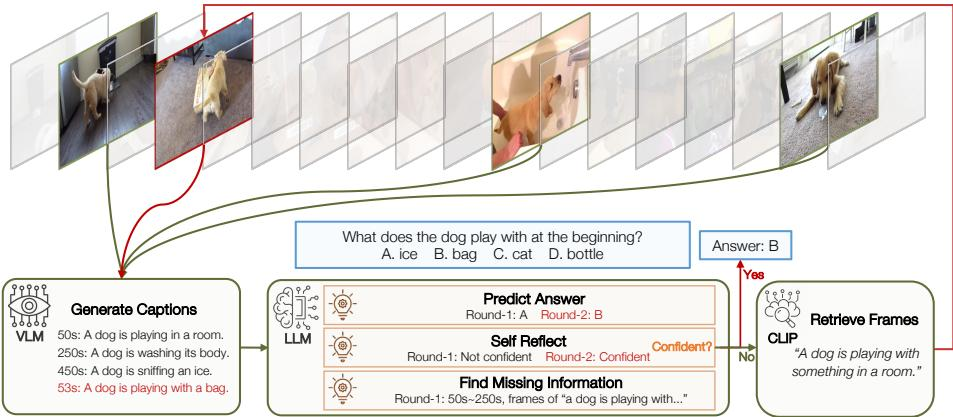
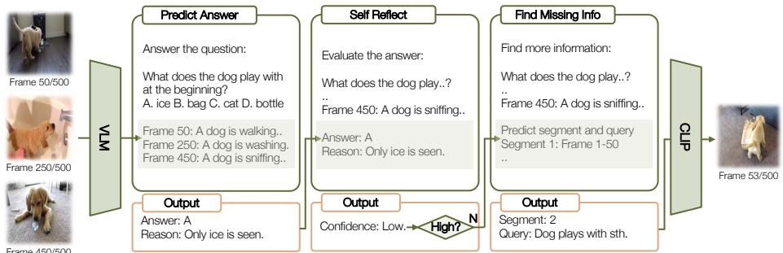
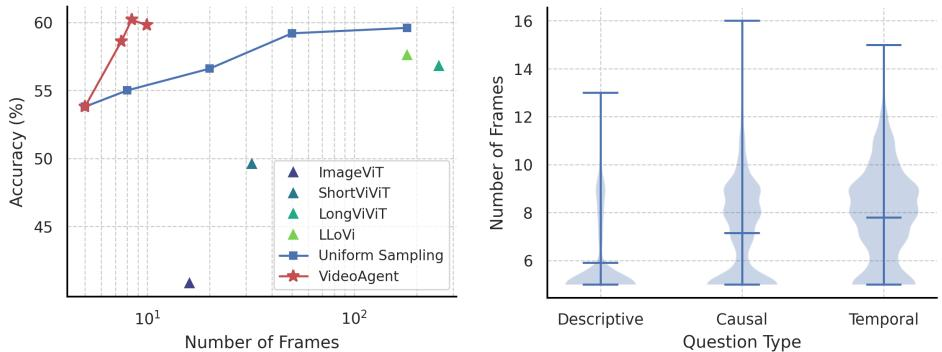
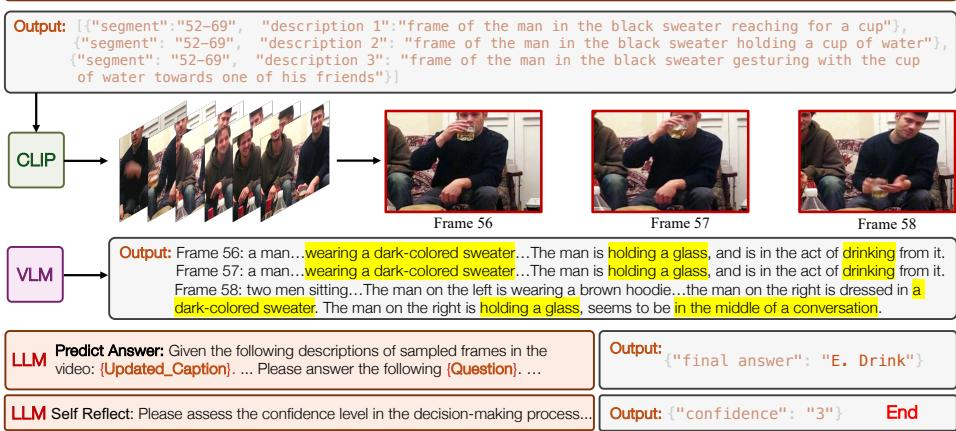
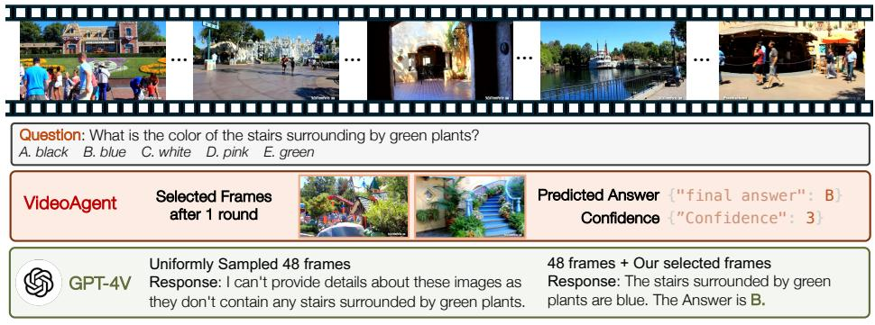

# VideoAgent：基于大语言模型的长视频理解智能体

小寒王 $\star$ 、余辉张 $\star$ 、奥尔·索哈尔 和塞雷娜·翁-莱维 斯坦福大学 {xhanwang,yuhuiz,orrzohar,syyeung}@stanford.edu 摘要：长视频理解在计算机视觉领域中代表了一项重大挑战，这要求模型能够对长的多模态序列进行推理。受到人类认知过程在长视频理解中的启发，我们强调交互推理和规划能力，而非仅仅处理冗长视觉输入的能力。我们提出了一种新颖的基于智能体的系统——VideoAgent，该系统利用大型语言模型作为核心智能体，迭代识别和汇编关键信息以回答问题，同时视觉-语言基础模型作为工具来翻译和检索视觉信息。在具有挑战性的EgoSchema和NExT-QA基准测试中，VideoAgent实现了$54.1\%$和$71.3\%$的零样本准确率，平均仅使用8.4和8.2帧。这些结果展示了我们的方法在效果和效率上优于当前最先进的方法，突显了基于智能体的方法在推动长视频理解方面的潜力。 关键词：长视频理解 · 大型语言模型智能体 · 视觉-语言基础模型

# 1 引言

理解长视频（时长从几分钟到几小时）在计算机视觉领域是一项重大挑战。该任务要求模型能够处理多模态信息，处理极长的序列，并有效地对这些序列进行推理。尽管已有众多尝试通过增强这些能力来应对这一挑战，但现有模型在这三个领域同时表现优异仍然存在困难。目前的先进语言模型（LLMs）在推理和处理长上下文方面表现出色，但在处理视觉信息方面能力不足。相反，视觉语言模型（VLMs）在建模较长的视觉输入上面临困难。早期的工作已经尝试使VLM具备长上下文建模能力，但这些适应性在视频理解基准测试中表现不佳，且在处理长视频内容时效率低下。

  
Fig. 1: Overview of VideoAgent. Given a long-form video, VideoAgent iteratively searches and aggregates key information to answer the question. The process is controlled by a large language model (LLM) as the agent, with the visual language model (VLM) and contrastive language-image model (CLIP) serving as tools.

我们真的需要将整个长视频直接输入模型吗？这与人类理解长视频的方式有显著的不同。当面对理解一段长视频的任务时，人类通常依赖以下交互过程来形成答案：该过程始于快速浏览视频，以理解其背景。随后，在特定问题的指导下，人类迭代选择新帧以获取相关信息。当获取到足够的信息以回答问题时，迭代过程结束，并提供答案。在整个过程中，控制这一迭代过程的推理能力比直接处理大量视觉输入的能力更为关键。

受人类理解长视频的过程启发，我们提出了VideoAgent，一个通过基于智能体的系统模拟这一过程的系统。我们将视频理解过程形式化为状态、动作和观察的序列，其中大语言模型（LLM）作为控制该过程的智能体（图1）。最初，LLM通过快速浏览视频中一组均匀采样的帧来熟悉视频上下文。在每次迭代中，LLM评估当前信息（状态）是否足以回答问题；如果不足，它识别出所需的额外信息（动作）。随后，它利用CLIP [36] 检索包含该信息的新帧（观察），并使用视觉语言模型（VLM）将这些新帧转化为文本描述，从而更新当前状态。该设计强调了推理能力和迭代过程，而不是对长视觉输入的直接处理，其中VLM和CLIP作为工具帮助LLM具备视觉理解和长上下文检索的能力。我们的工作在两个方面与之前的研究不同。与均匀采样帧或在单次迭代中选择帧的工作 [16,56,66] 相比，我们的方法以多轮的方式选择帧，确保所收集的信息基于当前需求更为准确。与使用原始问题作为查询来检索帧的工作 [56,66]相比，我们重写查询以实现更准确和细致的帧检索。我们对两个成熟的长视频理解基准，EgoSchema [28] 和 NExT-QA [55] 的严格评估表明，VideoAgent 在现有方法中表现出卓越的有效性和效率。VideoAgent 在这两个基准上的准确率分别为 $54.1\%$ 和 $71.3\%$，分别比同期最先进的方法LLoVi [67] 超过 $3.8\%$ 和 $3.6\%$。值得注意的是，VideoAgent平均仅使用 8.4 帧即可达到如此性能，这与 LLoVi 相比减少了 20 倍。我们的消融研究突显了迭代帧选择过程的重要性，该过程根据视频的复杂性自适应地搜索和聚合相关信息。此外，我们的案例研究表明，VideoAgent 可以推广到任意长度的视频，包括时长达到一小时或更长的视频。总之，VideoAgent 代表了长视频理解的重大进展，采用基于智能体的系统模拟人类的认知过程，并强调推理在长上下文视觉信息建模中的重要性。我们希望我们的工作不仅在长视频理解中设立了新的基准，也为未来的相关研究提供了启示。

# 2 相关工作

# 2.1 长视频理解

长视频理解是计算机视觉中一个特别具有挑战性的领域，因为时空输入的内在复杂性和高维特性导致了显著的计算需求。长视频理解方法需要在计算效率和性能之间找到平衡，通常可以广泛分为选择性稀疏策略或压缩稀疏策略。

压缩稀疏性方法 $[ 1 0 , 1 2 , 1 4 , 3 0 , 4 2 , 4 4 , 5 0 , 5 3 , 5 9 , 6 5 ]$，旨在以最低的维度将视频压缩成有意义的嵌入/表示。例如，MovieChat [42] 采用了一种内存合并机制，根据余弦相似度合并相似的相邻帧标记，有效减少了长视频序列中的标记冗余。Chat-UniVi [14] 利用 kNN 聚类对视频标记进行时空压缩。然而，压缩不必仅发生在嵌入本身，也可以压缩到时空图 [10,50,59] 或甚至文本 [19,38,67] 中。例如，Zhang 等人 [67] 提出了 LLoVi，并证明了在视频上简单地添加字幕，然后用这些字幕提示一个大语言模型，可以作为一个强有力的基线。同时，选择性压缩方法尝试将视频子采样为更有意义的帧，利用输入问题/文本作为指导，并试图仅采样与当前问题相关的帧 [7, 20, 37, 56, 66]。例如，R-VLM 和 R2A [8, 33, 56] 等方法使用 CLIP 模型根据文本提示检索相关帧，尽管

  
Fig. 2: Detailed view of VideoAgent's iterative process. Each round starts with the state, which includes previously viewed video frames. The large language model then determines subsequent actions by answering prediction and self-reflection. If additional information is needed, new observations are acquired in the form of video frames.

Q-ViD [38] 利用问题来选择性地为视频生成标题。与以往的工作不同，我们允许大型语言模型指导标题生成器选择要采样的视频帧。

# 2.2 大语言模型智能体

智能体被定义为在动态实时环境中做出决策并采取行动以实现特定目标的实体。大型语言模型（LLMs）的进步，特别是它们新出现的推理和规划能力，激发了最近自然语言处理领域的研究，利用它们作为现实世界场景中的智能体。这些模型在各种场景中展示了巨大的成功，如在线搜索、纸牌游戏以及数据库管理。其效果进一步通过链式思维推理或自我反思等方法得以增强。同时，计算机视觉领域也开始探索基于大型语言模型的智能体方法在不同视觉环境中的应用，如图形用户界面理解和机器人导航。在长视频理解领域，一些研究初步尝试了智能体方法，利用大型语言模型与外部工具互动或整合额外功能。与这些方法不同，我们的工作将视频理解重新表述为决策过程，受到人类解决视频解读方法的启发。我们将视频视为一个环境，在这里决策涉及获取更多信息或结束互动。这一视角指导了VideoAgent的创建，这是一个新颖的框架，与现有方法显著不同，强调了视频理解中固有的决策方面。

# 3 方法

在本节中，我们介绍了VideoAgent的方法。VideoAgent的灵感来自人类理解长视频的认知过程。给定一个视频和一个问题，人类首先会快速浏览几个帧以理解其背景，然后迭代搜索其他帧以获取足够的信息来回答问题，最后汇总所有信息并做出预测。我们将这一过程形式化为一系列状态、动作和观察 $\{ ( s _ { t } , a _ { t } , o _ { t } ) | 1 \leq t \leq T \}$ ，其中状态是所有已查看帧的现有信息，动作是选择回答问题还是继续搜索新帧，观察是当前迭代中看到的新帧，而 $T$ 是最大的迭代次数。我们利用大型语言模型（LLM）GPT-4 [31] 作为智能体来执行上述过程（图1）。研究表明，LLM具备记忆、推理和规划能力，以及工具使用能力 [39,46,52,70]，这些能力可用于建模状态、动作和观察。

# 3.1 获取初始状态

为了开始迭代过程，我们首先使大型语言模型（LLM）熟悉视频的上下文，这可以通过浏览从视频中均匀采样的 $N$ 帧来实现。由于 LLM 不具备视觉理解能力，我们利用视觉语言模型（VLM）将视觉内容转换为语言描述。具体来说，我们使用提示“详细描述图像”对这 $N$ 帧进行标注，并将这些标题输入到 LLM 中。这个初始状态 $s _ { 1 }$ 记录了视频内容和语义的概要。

# 3.2 确定下一步行动

给定当前状态 $s _ { t }$，该状态存储了所有已见帧的信息，下一步行动 $a _ { t }$ 有两个可能选项：行动 1：回答问题。如果状态 $s _ { t }$ 中的信息足以回答问题，我们应回答问题并结束迭代过程。行动 2：搜索新信息。如果当前状态 $s _ { t }$ 中的信息不足，我们应决定回答问题所需的进一步信息，并继续搜索。为在行动 1 和 2 之间做出决策，我们需要大语言模型对问题和现有信息进行推理。这是通过一个三步过程实现的。首先，我们强制大语言模型基于当前状态和问题进行预测，采用思维链提示。其次，我们要求大语言模型进行自我反思，并基于状态、问题、预测及其在第一步中生成的推理过程生成置信度评分。置信度评分分为三个级别：1（信息不足），2（部分信息），3（信息充足）。最后，根据置信度评分选择行动 1 或 2。该过程在图 2 中进行了说明。我们建议使用三步过程而非直接选择行动的一步过程，因为直接预测总是决定搜索新信息（行动 2）。这一自我反思过程的动机来源于 [41]，该研究在自然语言处理领域展示了优越的效果。

# 3.3 收集新观察数据

假设大语言模型确定信息不足以回答问题，并选择搜索新信息，那么我们进一步要求大语言模型决定需要哪些额外信息，以便我们可以利用工具进行检索（图2）。由于在视频中某些信息可能出现多次，我们执行片段级检索而不是视频级检索，以增强时间推理能力。例如，假设问题是“男孩离开房间后沙发上留下的玩具是什么？”并且我们在帧 $i$ 看到男孩离开房间。如果我们使用查询“显示沙发上玩具的帧”进行检索，可能会有帧在帧 $i$ 之前包含“沙发上的玩具”，但它们与回答问题无关。为了进行片段级检索，我们首先根据已见帧的索引将视频拆分为不同的片段，并要求大语言模型预测要使用查询文本检索的片段。例如，如果我们已经看到了视频的帧 $i$、$j$ 和 $k$，一个有效的预测是片段2（帧 $i$ 到 $j$），使用查询“显示沙发上玩具的帧”。我们利用 CLIP [36] 来获取根据大语言模型的输出获得的额外信息。具体来说，对于每个查询和片段，我们返回该片段中与文本查询具有最高余弦相似度的图像帧。这些检索到的帧作为观察用于更新状态。在检索步骤中使用 CLIP 在计算上是高效且相对无关紧要的，尤其是与使用大语言模型或视觉语言模型相比，原因有几点。首先，CLIP 的特征计算只涉及一个前向传播过程。其次，CLIP 采用图像-文本的后期交互架构，使得可以在不同文本查询之间缓存和重用图像帧特征。最后，我们的片段级检索设计仅需要计算特定片段中的特征，从而进一步提高效率。经验上，我们的实验表明，CLIP 的计算量不到视觉语言模型和大语言模型的 1%。

# 3.4 更新当前状态

最后，考虑到新的观察（即检索的帧），我们利用视觉语言模型（VLMs）为每一帧生成标题，然后根据帧索引简单地对新生成的标题和旧帧标题进行排序和连接，并请求大型语言模型（LLM）生成下一轮的预测。一个可能提出的问题是，为什么我们采用多轮过程，而一些现有的工作则在单一步骤中使用全部或均匀采样的帧作为状态[16, 67]。我们的方法相对于这些基线有许多优势。首先，使用过多帧会引入大量信息和噪声，导致性能下降，因为大型语言模型在处理长上下文时容易分心[24, 40]。此外，由于大型语言模型的上下文长度限制，计算效率低下且难以扩展至长达一小时的视频[31]。相反，使用过少的帧可能无法捕获相关信息。我们的自适应选择策略能够找到最相关的信息，并在不同难度级别的问题上以最低成本给出答案。我们将VideoAgent总结为算法1。

# 算法 1 视频智能体

要求：视频 $v$，问题 $q$，大语言模型 $F _ { l }$，视觉语言模型 $F _ { v }$，CLIP模型 $F _ { c }$，最大迭代次数 $T$，置信度阈值 $C$

确保：预测 $\hat { y }$ ，状态-动作-观察序列 $\{ s _ { t } , a _ { t } , o _ { t } | 1 \leq t \leq T \}$ 1: $s _ { 1 } \gets$ 生成标题( $F _ { v }$ ,均匀抽样(ν)) 2: 对于 $t = 1$ 到 $T$ 3: $\hat { y } \gets$ 预测答案 $( F _ { l } , s _ { t } , q )$ 4: C← 自我反思 $( F _ { l } , s _ { t } , q , \hat { y } )$ 5: 如果 $a _ { t } \gets \mathbb { 1 } _ { [ c \geq C ] }$ 则 6: 退出循环 7: 否则 8: $\begin{array} { r l } & { h \gets \mathtt { 查找缺失信息 } ( F _ { l } , s _ { t } , q ) } \\ & { o _ { t } \gets \mathtt { 检索帧 } ( F _ { c } , v , h ) } \\ & { s _ { t + 1 } \gets \mathtt { 合并 } ( s _ { t } , \mathtt { 生成标题 } ( F _ { v } , o _ { t } ) ) } \end{array}$ 9: 10: 结束如果 11: 结束循环 12: 返回 $\hat { y }$ , $\{ s _ { t } , a _ { t } , o _ { t } | 1 \leq t \leq T \}$

# 4 实验

在本节中，我们首先介绍数据集和实施细节，然后呈现 VideoAgent 的结果、分析、消融实验和案例研究。

# 4.1 数据集与评价指标

在我们的实验中，我们使用两个不同的、经过验证的数据集来对我们的模型性能进行基准测试，特别关注零-shot 理解能力。EgoSchema [28]。EgoSchema 是一个用于长视频理解的基准数据集，包含 5,000 道多项选择题，这些题目源自 5,000 个以自我视角拍摄的视频。这些视频提供了人类参与各种活动的自我视角。该数据集的一大特点是视频的长度，每段视频持续 3 分钟。EgoSchema 仅包含测试集，其中 500 道问题具有公开的标签。完整的问题集仅在官方排行榜上进行评估。NExT-QA [55]。NExT-QA 数据集包括 5,440 个自然视频，展示了日常生活中的物体交互，并附有 48,000 道多项选择题。视频的平均长度为 44 秒。这些问题分为三类：时间性、因果性和描述性，为视频理解模型提供了全面的评估。按照标准实践，我们的零-shot 评估集中在验证集上，该验证集包含 570 个视频和 5,000 道多项选择题。我们还遵循 [4] 报告 NExT-QA 验证集的 ATP-hard 子集的性能。该子集保留了最难的 QA 对，这些问题无法通过单帧解决，更加侧重于长期时间推理。

Table 1: Results on EgoSchema compared to public models. Full-set results are obtained from the official leaderboard.   

<table><tr><td colspan="2">Method</td><td rowspan="2">Frames Subset</td><td rowspan="2"></td><td rowspan="2">Full</td></tr><tr><td>FrozenBiLM [58]</td><td>[NeurIPS2022]</td></tr><tr><td>InternVideo [51]</td><td></td><td>90 90</td><td>-</td><td>26.9 32.1</td></tr><tr><td>ImageViT [34]</td><td>[arXiv2022.12]</td><td>16</td><td>- 40.8</td><td>30.9</td></tr><tr><td>ShortViViTloc [34]</td><td>[arXiv2023.12] [arXiv2023.12]</td><td>32</td><td>49.6</td><td>31.3</td></tr><tr><td>LongViViT [34]</td><td>[arXiv2023.12]</td><td>256</td><td>56.8</td><td>33.3</td></tr><tr><td>SeViLA [66]</td><td>[NeurIPS2023]</td><td>32</td><td>25.7</td><td>22.7</td></tr><tr><td>Vamos [49]</td><td>[arXiv2023.11]</td><td>-</td><td>.</td><td>48.3</td></tr><tr><td>LLoVi [67]</td><td>[arXiv2024.2]</td><td>180</td><td>57.6</td><td>50.3</td></tr><tr><td>MC-ViT-L [2]</td><td>[arXiv2024.2]</td><td>128+</td><td>62.6</td><td>44.4</td></tr><tr><td>VideoAgent (ours)</td><td></td><td>8.4</td><td>60.2</td><td>54.1</td></tr></table>

Table 2: Results on EgoSchema compared to large-scale proprietary models.   

<table><tr><td>Model</td><td>Subset</td><td>Full</td></tr><tr><td>Random Chance</td><td>20.0</td><td>20.0</td></tr><tr><td>Bard only (blind) [2]</td><td>[2023.3] 27.0</td><td>33.2</td></tr><tr><td>Bard + ImageViT [34]</td><td>35.0</td><td>35.0</td></tr><tr><td>Bard + ShortViViT [34]</td><td>[2023.3] 42.0</td><td>36.2</td></tr><tr><td>Bard + PALI [34]</td><td>[2023.3] 44.8</td><td>39.2</td></tr><tr><td>GPT-4 Turbo (blind) [2]</td><td>[2023.4]</td><td>31.0 30.8</td></tr><tr><td>GPT-4V [2]</td><td>[2023.9] 63.5</td><td>55.6</td></tr><tr><td>Gemini 1.0 Pro [47]</td><td>[2023.12]</td><td>55.7</td></tr><tr><td>VideoAgent</td><td>(ours)</td><td>60.2 54.1</td></tr></table>

由于每个数据集均包含多项选择题，因此我们采用准确率作为评估指标。

# 4.2 实现细节

我们在实验中以每秒1帧的速度解码所有视频，并使用EVA-CLIP-8Bplus [43] 根据生成的视觉描述与帧特征之间的余弦相似度检索最相关的帧。对于EgoSchema的实验，我们利用LaViLa [68] 作为描述生成器，它是一个基于剪辑的描述生成模型。遵循 [67] 的做法，为确保零-shot 评估，我们利用在ego4D数据上重新训练的LaViLa模型，过滤掉与EgoSchema重叠的视频。我们根据CLIP检索模块返回的帧索引对视频片段进行描述生成。对于NExT-QA，我们使用CogAgent [9] 作为描述生成器。我们将GPT-4 [31] 作为所有实验的语言模型，GPT的版本固定为gpt-4-1106-preview，以确保结果的可重复性。

# 4.3 与最先进技术的比较

VideoAgent设立了新的基准，在EgoSchema和NExT-QA数据集上取得了最先进的（SOTA）结果，显著超越了以前的方法，同时仅需较少的帧进行分析。EgoSchema。如表1和表2所示，VideoAgent在EgoSchema完整数据集上的准确率为$54.1\%$，在500个问题的子集上的准确率为$60.2\%$。完整数据集的准确率通过将我们模型的预测上传至官方排行榜进行验证，因为真实标签并未公开。这些结果不仅比之前的SOTA方法LLoVi [67]高出$3.8\%$，而且与先进的专有模型如Gemini-1.0 [47]的性能相当。值得注意的是，我们的方法每段视频平均仅需8.4帧，较现有方法显著减少2倍至30倍。

<table><tr><td rowspan="2" colspan="2">Methods</td><td colspan="4">Val</td><td colspan="3">ATP-hard subset</td></tr><tr><td>Acc@C Acc@T</td><td>Acc@D</td><td></td><td>Acc@All</td><td>Acc@C</td><td>−Acc@T</td><td>Acc@All</td></tr><tr><td colspan="10">Supervised 63.2</td></tr><tr><td colspan="2">VFC [57]</td><td>49.6</td><td colspan="2">51.5</td><td>52.3</td><td></td><td>36.5</td><td></td></tr><tr><td colspan="2">ATP</td><td>[ICCV2021] [CVPR2022]</td><td>53.1</td><td>50.2</td><td>66.8 66.9</td><td>54.3 57.2</td><td>38.4</td><td>38.8</td></tr><tr><td colspan="2">MIST GF</td><td>[CVPR2023]</td><td>54.6</td><td>56.6</td><td></td><td></td><td></td><td></td></tr><tr><td colspan="2"></td><td>[NeurIPS2023]</td><td>56.9</td><td>57.1</td><td>70.5 58.8 69.9</td><td>48.7</td><td>50.3</td><td>49.3</td></tr><tr><td colspan="2">CoVGT</td><td>[TPAMI2023]</td><td>59.7</td><td>58.0</td><td>60.7</td><td>-</td><td>-</td><td>-</td></tr><tr><td colspan="2">SeViT</td><td>[arXiv2023.1]</td><td>54.0</td><td>54.1</td><td>56.7 63.1</td><td>43.3</td><td>46.5</td><td>-</td></tr><tr><td colspan="2">HiTeA</td><td>[ICCV2023]</td><td>62.4</td><td>58.3</td><td>71.3 75.6</td><td>47.8</td><td>48.6</td><td>-</td></tr><tr><td colspan="8">Zero-shot</td></tr><tr><td colspan="2">VFC [29]</td><td>[ICCV2023]</td><td>51.6</td><td>45.4 48.0</td><td>64.1</td><td>51.5</td><td>32.2</td><td></td></tr><tr><td>InternVideo</td><td>[51]</td><td>[arXiv2022.12]</td><td>43.4</td><td>65.1</td><td>49.1</td><td>-</td><td>30.0 -</td><td>31.4 -</td></tr><tr><td>AssistGPT</td><td>[6]</td><td>[arXiv2023.6]</td><td>60.0</td><td>51.4 67.3</td><td>58.4</td><td>-</td><td>-</td><td></td></tr><tr><td>ViperGPT</td><td>[45]</td><td>[ICCV2023]</td><td></td><td></td><td>60.0</td><td>-</td><td>-</td><td></td></tr><tr><td>SeViLA</td><td>[66]</td><td>[NeurIPS2023]</td><td>61.3</td><td>61.5</td><td>75.6 63.6</td><td></td><td></td><td></td></tr><tr><td>LLoVi</td><td>[67]</td><td>[arXiv2024.2]</td><td>69.5</td><td>61.0</td><td>75.6</td><td>67.7</td><td></td><td></td></tr><tr><td colspan="2">VideoAgent</td><td>(ours)</td><td>72.7</td><td>64.5</td><td>81.1</td><td>71.3 57.8</td><td>58.8</td><td>58.4</td></tr></table>

Table 3: Results on NExT-QA compared to the state of the art. C, T, and D are causal, temporal, and descriptive subsets, respectively.

NExT-QA。在表3中，我们显示VideoAgent在NExT-QA完整验证集上取得了71.3%的准确率，超越了之前的最先进技术LLoVi [67]，提高了3.6%。在零-shot评估中，每个视频平均仅使用8.2帧，VideoAgent在所有子集上相较于以往的监督和零-shot方法持续取得较大优势，包括测试模型因果、时间和描述能力的子集。重要的是，VideoAgent在更具挑战性的子集ATPhard [4]上取得了显著的性能提升，展示了其处理复杂长视频查询的能力。这些结果突显了VideoAgent在处理和理解来自长视频的复杂问题方面的卓越有效性和效率。

# 4.4 迭代帧选择的分析

VideoAgent 的一个关键组成部分是其迭代帧选择，该组件动态搜索并汇聚更多信息，直到信息量足以回答问题，模拟了人类理解视频的过程。我们进行了全面的分析和消融研究，以更好地理解这一过程。

帧效率。我们第一次分析的重点是帧选择是否有效地识别出回答问题所需的信息帧。这可以通过帧效率来衡量：在固定数量的帧下，可以达到什么模型准确度。假设是，识别出的信息帧越多，帧效率应该越高。在图3（左侧），我们绘制了我们的方法与均匀采样基线和其他先前方法在EgoSchema 500问题子集上的准确度比较。我们的方法在相同数量的帧下显著优于均匀选择和其他基线，显示了其在帧效率上的优势。特别值得注意的是，我们的方法仅使用8.4帧就达到了$60.2\%$的准确度，而均匀抽样180帧的基线的准确度为$59.6\%$。这凸显了我们方法在寻找信息帧方面的有效性，并揭示了更多的帧并不总是能带来更好的性能，因为无关和嘈杂的信息可能会使语言模型被冗长的上下文和干扰信息所压倒[24，40]。

  
Fig. 3: (Left) Frame efficiency compared to uniform sampling and previous methods. Xaxis is in log scale. Our method achieves exceptional frame efficiency for long-form video understanding. (Right) Number of frames for different types of NExT-QA questions. Min, mean, max, distribution are plotted. VideoAgent selects more frames on questions related to temporal reasoning than causal reasoning and descriptive questions.

轮次数量。我们还分析了迭代轮次的数量如何影响模型性能。在同一图3（左侧），我们绘制了1-4轮的性能与所选帧数之间的关系，准确率分别为$53.8\%$、$58.6\%$、$60.2\%$和$59.8\%$，对应的帧数为5、7.5、8.4和9.9。性能随着额外轮次的增加而提升，但在EgoSchema 500问题子集上，在三轮时达到饱和。这表明我们的方法能够有效找到回答问题所需的信息，而在某个点之后，额外的信息对回答问题的帮助不大。不同问题类型。考虑到我们的帧选择过程是动态的，语言模型智能体决定信息是否充足，我们假设不同问题类型可能因其难度的不同而需要不同数量的信息。我们在NExT-QA数据集上测试了这一假设，该数据集为每种问题类型提供了注释：描述性任务、因果推理或时间推理。在图3（右侧），我们绘制了每种问题类型帧数的分布。我们观察到，使用的帧数平均值排名如下：描述性问题（5.9帧）、因果问题（7.1帧）和时间问题（7.8帧）。这与人类的直觉相符，即描述性任务通常需要较少的帧，因为初始的均匀采样通常足够，而推理任务，尤其是时间推理，需查看更多帧以准确回答问题。

<table><tr><td rowspan="2">Uniform</td><td rowspan="2">Uni-7 54.6</td><td rowspan="2">Uni-9 54.8</td><td rowspan="2">Uni-11</td></tr><tr><td>55.8</td></tr><tr><td>Ours</td><td>3→6.4 58.4</td><td>5→8.4 60.2</td><td>8→11.0 57.4</td></tr></table>

Table 4: Ablation of initial number of uniformly sampled frames.

<table><tr><td>Method</td><td>Frames</td><td>Acc</td></tr><tr><td>Ours w/o Seg. Selection</td><td>7.5</td><td>56.6</td></tr><tr><td>Ours w/o Self-Evaluation</td><td>11.8</td><td>59.6</td></tr><tr><td>Ours</td><td>8.4</td><td>60.2</td></tr></table>

Table 5: Ablation of segment selection and self-evaluation.

初始帧数。在启动迭代帧选择过程之前，我们均匀抽样 $N$ 帧，以使语言模型熟悉视频上下文。为了探讨初始抽样帧数如何影响模型性能以及实际使用的平均帧数，我们进行了消融研究。具体而言，我们在 EgoSchema 的 500 道问题子集中初始抽样 3、5 和 8 帧，并将结果报告在表 4。这些结果显示准确率分别为 $58.4\%$、$60.2\%$ 和 $57.4\%$，平均使用帧数分别为 6.4、8.4 和 11.0。初始选择 5 帧会导致最佳性能。此外，当我们将我们的方法与相似或稍多的均匀采样帧数进行比较时，7、9 和 11 帧的准确率分别为 54.6%、$54.8\%$ 和 $55.8\%$。这种比较再次突显了我们帧选择方法的优越效率。 自我评估。在迭代选择过程中，我们进行自我评估，以确定可用信息是否足以回答查询。如果足够，迭代在此阶段终止。我们将其与没有自我评估的基准方法进行比较，该方法对每个问题进行三轮迭代处理。正如表 5 所详细说明的，我们观察到平均使用帧数从 8.4 增加到 11.8，而准确率从 $60.2\%$ 降低到 $59.6\%$。这些结果凸显了自我评估在确定信息充分性方面的有效性，从而减少了不必要的迭代。值得注意的是，通过额外轮次收集更多信息并未带来性能提升，反而导致了轻微下降。 片段选择。当确定需要额外信息时，输入视频会被划分为多个片段。随后，语言模型生成专门用于检索这些片段内信息的查询。这种方法与生成不指定片段的查询的替代策略形成对比。在表 5 中，我们观察到禁用片段选择时准确率下降了 $3.6\%$。片段选择提高了模型的时间推理能力，并减少了将不同片段信息混淆的风险。这对于诸如“之后发生了什么？”等查询尤为有利，因为这些查询只希望从后续片段中检索信息。

<table><tr><td>LLM</td><td>Model Size</td><td>Acc. (%)</td></tr><tr><td>Mistral-8x7B</td><td>70B</td><td>37.8</td></tr><tr><td>Llama2-70B</td><td>70B</td><td>45.4</td></tr><tr><td>GPT-3.5</td><td>N/A</td><td>48.8</td></tr><tr><td>GPT-4</td><td>N/A</td><td>60.2</td></tr></table>

Table 6: LLM ablation.

<table><tr><td>Captioner</td><td>Type</td><td># Words</td><td>Acc. (%)</td></tr><tr><td>BLIP-2</td><td>Frame-based</td><td>8.5</td><td>52.4</td></tr><tr><td>LaViLa</td><td>Clip-based</td><td>7.2</td><td>60.2</td></tr><tr><td>CogAgent</td><td>Frame-based</td><td>74.2</td><td>60.8</td></tr></table>

Table 7: VLM ablation.

<table><tr><td>CLIP</td><td>Model Size</td><td>Resolution</td><td>Acc. (%)</td></tr><tr><td>OpenCLIP ViT-G</td><td>1B</td><td>224</td><td>59.2</td></tr><tr><td>EVA-CLIP-8B</td><td>8B</td><td>224</td><td>59.4</td></tr><tr><td>EVA-CLIP-8B-plus</td><td>8B</td><td>448</td><td>60.2</td></tr></table>

Table 8: CLIP ablation.

# 4.5 基础模型消融实验

考虑到 VideoAgent 整合了三种基础模型类型——大型语言模型（LLM）、视觉语言模型（VLM）和对比语言图像模型（CLIP），我们进行了系列消融研究，以评估每个组件设计对模型整体性能的影响。 LLM。我们首先评估了不同的 LLM 如何影响模型的性能，因为 LLM 在我们的方法论中发挥着关键作用，作为协调整个过程的智能体。在表 6 中，我们比较了几种最先进的公共和专有 LLM，包括 LLaMA-2-70B [48]、Mixtral-8x7B [13]、GPT-3.5 [32] 和 GPT-4 [31]。我们的研究结果表明，GPT-4 的表现显著优于其他模型。然而，这主要归因于其在结构化预测方面的能力。迭代过程中采用 JSON 作为输出，其中准确的 JSON 解析至关重要。GPT-4 在生成正确的 JSON 格式方面表现稳健，而其他模型在这方面的一致性较低，这仍然是 LLM 领域的一个活跃研究方向 [69]。 VLM。利用不具备视觉能力的文本专用模型 GPT-4，我们通过 VLM 将图像帧转换为描述性标题，然后将这些标题输入到 GPT-4。为了评估不同 VLM 生成的标题质量对性能的影响，我们检查了三种最先进的 VLM：基于帧的 BLIP-2 [18] 和 CogAgent [9] 以及基于剪辑的 LaViLa [68]，如表 7 所示。分析结果显示，CogAgent 和 LaViLa 生成的标题表现相似，尽管它们生成的标题长度差异显著，而 BLIP-2 生成的标题则表现较差。 CLIP。由于图像和文本特征的晚期交互设计，CLIP 在检索任务中表现出色，消除了对不同查询重新计算图像嵌入的需要。我们评估了三种 CLIP 版本：OpenCLIP ViT-G [11]、EVA-CLIP-8B [43] 和 EVA-CLIP-8B-plus [43]，结果如表 8 所示。我们的研究结果表明，不同 CLIP 模型的性能相当，表明检索并不是我们方法论的瓶颈。值得注意的是，我们研究的主要贡献在于引入一个模拟人类理解长视频过程的框架，而不是采用任何特定模型。随着大型语言模型（LLM）、视觉语言模型（VLM）和对比语言图像模型（CLIP）等基础模型的迅速发展，我们的方法可以通过整合更好的模型或采用新的方法进一步改进。

# 问题：为什么穿黑色毛衣的男子在与朋友交谈时举起一杯水？

请将饮料递给某人。

图注框架1：图片显示一个人坐在……

  
Frame 52

{"final answer":null,"confidence":"1"}

  
Fig. 4: Case study on NExT-QA. VideoAgent accurately identifies missing information in the first round, bridges the information gap in the second round, and thereby makes the correct prediction.

# 4.6 案例研究

我们展示了几个案例研究，以证明 VideoAgent 理解长篇视频的能力。来自 NExT-QA 的问题。在图 4 中，我们展示了一个在两次迭代中解决的 NExT-QA 实例。该问题询问，为什么那个男人在和朋友交谈时举起一杯水。VideoAgent 准确地识别出缺失的信息（尽管在第 69 帧中可以看到杯子，但并没有显示出男人正在拿着它）。然后，它确定了需要哪些额外信息（黑色毛衣的男人手持一杯水的画面）。最后，它利用 CLIP 检索到这一细节（男人正在拿着一个玻璃杯，并且正在喝水），并对自己的答案充满信心。

  
Fig. 5: Case study on hour-long videos. VideoAgent accurately identifies the key frame during the second iteration, subsequently making an accurate prediction. Conversely, GPT-4V, when relying on 48 uniformly sampled frames up to its maximum context length, does not get successful prediction. However, by integrating the frame pinpointed by VideoAgent, GPT-4V is able to correctly answer the question.

小时级视频。考虑到 NExT-QA 和 EgoSchema 视频仅持续几分钟，图 5 展示了 VideoAgent 如何准确处理来自 YouTube 的小时级视频。问题是关于识别被绿色植物环绕的楼梯的颜色，而这一部分仅占视频的一小部分。VideoAgent 高效地识别出所需信息，并仅需两次迭代和七帧即可回答问题，超越了最先进的模型如 GPT-4V。值得注意的是，GPT-4V 在其最大上下文长度为 48 张图像的均匀采样方面表现不佳。然而，当 GPT-4V 收到 VideoAgent 指定的帧时，它可以成功回答问题。这强调了通过整合我们的方法来增强 GPT-4V 在视频理解方面能力的潜力。总之，VideoAgent 已准备好应对现实世界中的视频理解挑战，超越了依赖单轮稀疏或密集采样的传统方法。

# 5 结论

在本研究中，我们提出了VideoAgent，一个将大型语言模型作为智能体，用以模拟人类对长视频理解的认知过程的系统。VideoAgent通过多轮迭代过程有效地搜索和汇总信息。在对多个数据集的定量和定性研究中，它展示了在长视频理解方面卓越的有效性和效率。