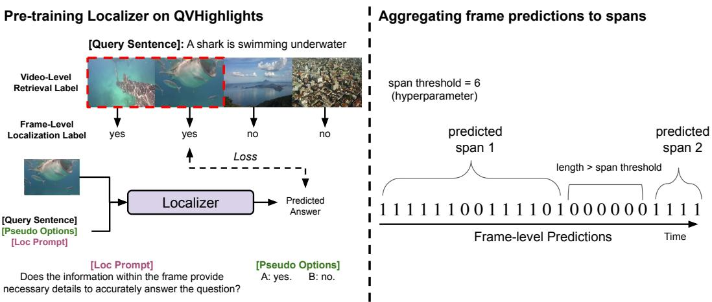

# 1. Bibliographic Information
## 1.1. Title
`Self-Chained Image-Language Model for Video Localization and Question Answering`

## 1.2. Authors
Shoubin Yu, Jaemin Cho, Prateek Yadav, Mohit Bansal. All authors are affiliated with UNC Chapel Hill.

## 1.3. Journal/Conference
This paper is published at `arXiv`, a preprint server, and was published on `2023-05-11T17:23:00.000Z`. While arXiv itself is not a peer-reviewed journal or conference, it is a widely used platform for disseminating cutting-edge research in computer science, physics, mathematics, and other fields, often preceding formal publication in top-tier conferences or journals. The abstract mentions "Advances in Neural Information Processing Systems" and "International Conference on Machine Learning" in the references, suggesting the authors target such venues.

## 1.4. Publication Year
2023

## 1.5. Abstract
This paper introduces `Self-Chained Video Localization-Answering (SeViLA)`, a novel framework designed to address the limitations of existing video question answering (`QA`) models, which often rely on uniformly sampled video frames without explicit language-aware temporal modeling. Such uniform sampling can lead to missing crucial visual information, especially when only a specific moment in a video is relevant to a query. Training `query-aware video moment localizers` typically requires expensive annotations and high computational costs.

`SeViLA` leverages a single pre-trained `image-language model` (`BLIP-2`) to perform both `temporal keyframe localization` and `video QA`. It comprises two modules, `Localizer` and `Answerer`, both fine-tuned from `BLIP-2`. The framework utilizes two chaining mechanisms:
1.  **Forward Chain:** The `Localizer` identifies multiple language-aware `keyframes` in a video, which are then used by the `Answerer` to predict the final answer.
2.  **Reverse Chain:** The `Answerer` generates `keyframe pseudo-labels` to refine the `Localizer`. This process alleviates the need for costly `video moment localization annotations`.

    The `SeViLA` framework demonstrates superior performance against strong baselines on five challenging `video QA` and `event prediction benchmarks`. It achieves `state-of-the-art (SOTA)` results in both `fine-tuning` (NExT-QA, STAR) and `zero-shot` (NExT-QA, STAR, How2QA, VLEP) settings. The paper also includes a comprehensive analysis of the `Localizer`'s impact, comparisons with other temporal localization models, effects of pre-training and self-refinement, and the influence of varying the number of `keyframes`.

## 1.6. Original Source Link
https://arxiv.org/abs/2305.06988
PDF Link: https://arxiv.org/pdf/2305.06988v2.pdf
Publication Status: Preprint on arXiv.

# 2. Executive Summary
## 2.1. Background & Motivation
The field of `multimodal AI` has seen significant advancements, particularly with `large pre-trained image-language models (image-LMs)`. These models are efficient at `representation learning` and have been adapted for `video-language models (video-LMs)`. However, a fundamental challenge arises because video data inherently has a temporal dimension, which is often not explicitly addressed when adapting `image-LMs`.

The core problem the paper aims to solve is the inefficiency and potential for information loss in `video question answering (VQA)` when using `image-LMs` or traditional `video-LMs` that rely on uniformly sampled video frames.
*   **Problem 1: Uniform Sampling Limitations:** Many existing approaches simply concatenate uniformly or randomly sampled video frames as visual input. This method fails to incorporate `language-aware, temporal modeling`. When a query pertains to a specific, brief moment in a longer video, uniform sampling might miss the critical visual cues, leading to incorrect answers. It also burdens the model with irrelevant information.
*   **Problem 2: Cost of Temporal Grounding Annotations:** Humans naturally focus on relevant video segments and "rewind" to find answers. Mimicking this in `AI` requires a `query-aware video moment localizer`. However, training such a localizer demands expensive, frame-level `temporal grounding annotations`, which are resource-intensive to create.
*   **Problem 3: Scaling Challenges for Video-LMs:** `Video-LMs` are harder to scale than `image-LMs` due to higher computational costs and the difficulty in obtaining large-scale video-language paired datasets.

    The paper's entry point and innovative idea revolve around tackling these issues by leveraging the power of a single, already `large pre-trained image-language model` (`BLIP-2`) to perform *both* intelligent `temporal keyframe localization` and `question answering`. This approach aims to make `video-LMs` more efficient and effective without incurring the high costs associated with new, specialized `video-LM` pre-training or extensive `temporal localization annotations`.

## 2.2. Main Contributions / Findings
The primary contributions of the `SeViLA` paper are:
*   **A Novel `Self-Chained Video Localization-Answering (SeViLA)` Framework:** The paper introduces a new framework that repurposes a single `image-language model` (`BLIP-2`) into two specialized modules: a `Localizer` for language-aware `temporal keyframe localization` and an `Answerer` for `question answering` on videos. Both modules are `parameter-efficiently fine-tuned` from the `BLIP-2` backbone.
*   **Two Chaining Mechanisms for Enhanced Performance and Efficiency:**
    *   **Forward Chain:** The `Localizer` first identifies `language-aware keyframes` in a video, which then serve as targeted visual input for the `Answerer` to predict responses. This mimics human selective attention.
    *   **Reverse Chain (Self-Refinement):** A novel `pseudo-labeling` method is proposed where the `Answerer` generates `keyframe pseudo-labels`. These labels are then used to refine the `Localizer`, significantly reducing the dependency on expensive `video moment localization annotations`.
*   **State-of-the-Art (SOTA) Empirical Performance:** `SeViLA` demonstrates strong empirical performance, outperforming several robust baselines and achieving `SOTA` results on five challenging `video QA` and `event prediction benchmarks`. This includes:
    *   `Fine-tuning settings`: `SOTA` on NExT-QA and STAR.
    *   `Zero-shot settings`: `SOTA` on NExT-QA, STAR, How2QA, and VLEP.
*   **Comprehensive Analysis:** The paper provides in-depth ablation studies and analyses demonstrating the effectiveness of each component, including the `Localizer`'s impact, comparisons with other temporal localization models, effects of pre-training and self-refinement, and the influence of varying the number of `keyframes`. It also shows that the `Localizer` can perform strongly as a standalone `moment retrieval model`.

    These findings collectively highlight the effectiveness of integrating `language-aware temporal localization` with `question answering` using a single `image-language model` and a clever `self-refinement` mechanism, making `video-language tasks` more accurate and resource-efficient.

# 3. Prerequisite Knowledge & Related Work
## 3.1. Foundational Concepts
To fully grasp the `SeViLA` framework, it's essential to understand several foundational concepts in `AI`, `natural language processing (NLP)`, and `computer vision (CV)`.

*   **Image-Language Models (Image-LMs):** These are `deep learning models` designed to understand and process both images and natural language text simultaneously. They learn to align visual and linguistic information, enabling tasks like `image captioning`, `visual question answering`, and `image-text retrieval`. `Image-LMs` are often pre-trained on massive datasets of image-text pairs, learning rich, multimodal representations.
*   **Video-Language Models (Video-LMs):** An extension of `image-LMs` to handle video data. Videos introduce the additional complexity of a temporal dimension, requiring models to understand sequences of visual information and their evolution over time, alongside natural language. This includes tasks like `video captioning`, `video question answering`, and `video moment retrieval`.
*   **BLIP-2 (Bootstrapping Language-Image Pre-training with Frozen Image Encoders and Large Language Models):** A state-of-the-art `image-language model` that `SeViLA` builds upon. `BLIP-2`'s architecture comprises three main components:
    1.  **Frozen Image Encoder:** Typically a pre-trained `Vision Transformer (ViT)` (e.g., `ViT-G` in `BLIP-2`). This component processes an image and extracts its visual features. "Frozen" means its parameters are not updated during `BLIP-2`'s training or `SeViLA`'s fine-tuning, preserving the powerful visual representations it learned during its own pre-training.
    2.  **Frozen Large Language Model (LLM):** A powerful `generative language model` (e.g., `Flan-T5` in `BLIP-2`). This component is responsible for generating human-like text, understanding complex linguistic instructions, and performing various `NLP` tasks. Like the image encoder, it's kept frozen to retain its extensive linguistic knowledge.
    3.  **Q-Former (Querying Transformer):** This is the crucial, trainable component that acts as a bridge between the frozen image encoder and the frozen `LLM`. It takes fixed-length visual features from the image encoder and a set of `learnable query embeddings`. Through a `transformer` architecture, it learns to extract the most `salient` (important) visual information relevant to a given text prompt, effectively compressing the visual input into a form that the `LLM` can understand. It undergoes a two-stage pre-training:
        *   **Image-to-Text Pre-training:** Connects `Q-Former` to the `image encoder` to learn to extract informative visual features for text generation.
        *   **Q-Former to LLM Connection:** Connects `Q-Former` to the `LLM` to leverage its generative capabilities, projecting query embeddings into the `LLM`'s dimension, serving as `soft visual prompts`.
*   **Parameter-Efficient Fine-tuning:** A set of techniques used to adapt large pre-trained models to new downstream tasks with minimal changes to their original parameters. Instead of fine-tuning the entire model (which can be computationally expensive and prone to `catastrophic forgetting`), only a small fraction of parameters (e.g., adapter layers, or in `BLIP-2`'s case, the `Q-Former`) are trained. This significantly reduces computational costs and memory requirements.
*   **Large Language Models (LLMs):** Very large `deep learning models` that are pre-trained on vast amounts of text data to understand, generate, and process human language. They are typically based on the `transformer` architecture and can perform a wide range of `NLP` tasks. Examples include `Flan-T5` and `GPT-3`.
*   **Transformer:** A `neural network architecture` introduced in "Attention Is All You Need" (Vaswani et al., 2017), which revolutionized `sequence modeling` (e.g., `NLP`). Its core innovation is the `self-attention mechanism`, which allows the model to weigh the importance of different parts of the input sequence when processing each element.
    *   **Self-Attention Mechanism:** For an input sequence, `self-attention` calculates `attention scores` between every pair of elements (e.g., words in a sentence or patches in an image). These scores determine how much `focus` each element should place on other elements when computing its own representation. The mechanism typically involves three learned matrices: Query (Q), Key (K), and Value (V).
        *   The formula for `scaled dot-product attention` (the basis for `self-attention`) is:
            \$
            \mathrm{Attention}(Q, K, V) = \mathrm{softmax}\left(\frac{QK^T}{\sqrt{d_k}}\right)V
            \$
            *   $Q$: Query matrix, derived from the input embeddings. It represents what we're looking for.
            *   $K$: Key matrix, derived from the input embeddings. It represents what we're looking up.
            *   $V$: Value matrix, derived from the input embeddings. It contains the information to be extracted.
            *   $K^T$: Transpose of the Key matrix.
            *   $\sqrt{d_k}$: Scaling factor, where $d_k$ is the dimension of the `key vectors`. This helps to stabilize the `softmax` function during training, preventing very large values from dominating.
            *   $\mathrm{softmax}$: A function that converts a vector of numbers into a probability distribution, ensuring weights sum to 1.
            *   The result is a weighted sum of the `Value vectors`, where the weights are determined by the `attention scores` between `Query` and `Key`.
*   **Pseudo-labeling:** A `semi-supervised learning` technique where a model is first trained on a small amount of labeled data. Then, it's used to make predictions on a larger set of unlabeled data. The most confident predictions on the unlabeled data are treated as "pseudo-labels" and added to the training set for subsequent model refinement. This helps leverage large amounts of unlabeled data, reducing the need for expensive manual annotations.
*   **Moment Retrieval / Grounding:** A task in `video-language understanding` where the goal is to identify a specific temporal segment (a "moment") within a video that corresponds to a given natural language query or description. For example, given a video and the query "the person petting a dog," the model should output the start and end timestamps of that action.
*   **Fine-tuning vs. Zero-shot Learning:**
    *   **Fine-tuning:** Involves taking a pre-trained model and further training it on a specific downstream task with labeled data. The pre-trained weights are updated to adapt the model to the nuances of the new task.
    *   **Zero-shot Learning:** Refers to the ability of a model to perform a task it has not been explicitly trained on, without any task-specific examples. This typically relies on the model's ability to generalize from its pre-training knowledge and leverage semantic understanding of the input and desired output format.

## 3.2. Previous Works
The paper contextualizes `SeViLA` within the landscape of `image-language` and `video-language models`, highlighting the evolution and challenges in adapting these models for video understanding.

*   **Image-Language Pre-trained Models:** The authors acknowledge the rapid advancements in `image-LMs` such as `BLIP` [34], `CLIP` [55], `Florence` [89], and `BLIP-2` [35]. These models have benefited from larger model sizes and vast pre-training datasets (e.g., LAION-400M, LAION-5B). The paper notes that `image-LMs` have scaled more rapidly than `video-LMs` due to easier accessibility of image data and simpler data structures. `SeViLA` leverages this by building upon `BLIP-2`.
*   **Image-to-Video Transfer Learning:** This area focuses on adapting `image-LMs` for video tasks, often using a limited number of video frames to enhance learning efficiency. Previous methods include:
    *   `CLIP4Clip` [44]: Adapts `CLIP` for `video clip retrieval`.
    *   `FrozenBiLM` [85]: Extends frozen `bidirectional language models` (like `BERT`) to incorporate multiple images and adds `video-level pre-training`.
    *   `VidIL` [72]: Converts multiple images into hierarchical captions with temporal order to aid `LMs` in comprehending video events.
        The paper points out a common limitation of these works: they often employ a `uniform sampling strategy`, which is not `language-aware`. This can lead to the loss of key visual cues and burden models with irrelevant information. `SeViLA` directly addresses this by introducing a `Localizer` for `language-aware visual information`.
*   **Language-aware Keyframe Localization:** Several methods have attempted to select relevant frames based on language queries:
    *   `Buch et al. [3]` (`Temp[ATP]`): Optimized an end-to-end pipeline to select a *single keyframe* using answer labels.
    *   `Lu et al. [42]` (`LGDN`): Selects frames using separate image and language models, then answers questions with a `QA model` having multiple training objectives.
    *   `Qian et al. [54]`: Designed a `video clip proposal model` with predefined ranges, iteratively training it with a `QA model`.
    *   `Kim et al. [24]` (`SeViTFiD`): Used a `semi-parametric retriever` to obtain `keyframes` based on frame and language feature similarity.
        `SeViLA` differentiates itself by adopting a large `image-LM` (`BLIP-2`) as its `Localizer`, which is then chained with an `Answerer`. Crucially, `SeViLA` allows the `Answerer` to refine the `Localizer` through `pseudo-labels` in a reverse chain, avoiding expensive `temporal grounding annotations`. This is a significant distinction from methods requiring explicit frame-level labels for localization.

## 3.3. Technological Evolution
The evolution in `multimodal AI` has progressed from processing static images to dynamic videos, driven by advancements in `deep learning architectures` (especially `transformers`) and the availability of larger datasets.
1.  **Early Multimodal Models:** Initially, vision and language tasks were often handled by separate models or simpler fusion techniques.
2.  **Rise of Image-Language Models:** The development of models like `CLIP` and `BLIP` marked a turning point, demonstrating how joint pre-training on massive image-text datasets could yield powerful, generalizable representations. These models excelled at understanding the semantics across modalities.
3.  **Challenges with Video:** Extending these `image-LMs` to videos proved challenging. Videos add the `temporal dimension`, meaning models must not only understand *what* is happening but also *when* and *how events unfold*. This led to two main approaches:
    *   **Direct Video-LM Pre-training:** Developing dedicated `video-LMs` (e.g., `InternVideo`) with specialized architectures and pre-training on video-text pairs. However, these are often limited by data availability and computational cost compared to `image-LMs`.
    *   **Image-to-Video Transfer:** Adapting powerful `image-LMs` to video tasks, often by treating videos as sequences of images. The main drawback here was the `uniform sampling` problem, where temporal relevance was overlooked.
4.  **Focus on Language-Aware Temporal Modeling:** Recent work, including `SeViLA`, has recognized the need for `language-aware temporal modeling`. This means the model should intelligently select or focus on video segments most relevant to a given linguistic query, rather than processing all frames equally.
5.  **`SeViLA`'s Place:** `SeViLA` fits within this evolution by offering an innovative solution for `image-to-video transfer` that explicitly addresses `language-aware temporal modeling`. It leverages the strength of a `SOTA image-LM` (`BLIP-2`) and introduces a novel `self-chaining mechanism` to effectively perform both localization and `QA` while also mitigating the `expensive annotation cost` of temporal localization through `pseudo-labeling`. This represents a step towards more intelligent and resource-efficient `video-language understanding`.

## 3.4. Differentiation Analysis
`SeViLA` introduces several key innovations compared to previous approaches, particularly concerning `language-aware temporal modeling` and annotation efficiency:

*   **Single `Image-LM` for Dual Tasks:** Unlike many previous `video-LMs` or `image-to-video transfer` methods that either use separate models for localization and `QA` or adapt `image-LMs` primarily for `QA` *after* some form of frame selection, `SeViLA` repurposes a *single* `BLIP-2` model to create both its `Localizer` and `Answerer`. This promotes synergy and consistency across modules, as they share the same underlying architecture and much of the pre-trained knowledge.
*   **Explicit `Language-Aware Temporal Keyframe Localization`:** Many prior `image-to-video transfer` methods, such as `CLIP4Clip` [44] or `FrozenBiLM` [85], rely on `uniform` or `random sampling` of frames. This means they process all frames equally, potentially missing crucial information or being burdened by irrelevant data. `SeViLA`'s `Localizer` is explicitly designed to identify `language-aware keyframes` using a specific `localization prompt`, making the visual input to the `Answerer` highly relevant to the query. This is a direct response to the identified limitation of `uniform sampling`.
*   **Novel `Self-Refinement` (Reverse Chain) with `Pseudo-labeling`:** This is a major differentiator. While some methods (`Buch et al. [3]`, `Qian et al. [54]`) try to optimize frame selection, they often still depend on `answer labels` or predefined ranges. `SeViLA`'s `reverse chain` employs `pseudo-labeling`, where the `Answerer` (which is already good at `QA`) provides feedback to refine the `Localizer`. This elegantly addresses the high cost of manual `temporal grounding annotations`, a significant practical barrier for developing robust `localization models`. Other `keyframe localization` methods generally require explicit `moment retrieval` labels or `answer labels` for training their localization components.
*   **Chained Inference and Training:** The `forward chain` (Localizer output feeds Answerer input) and `reverse chain` (Answerer feedback refines Localizer) create a symbiotic relationship between the two modules. This iterative improvement mechanism is distinct from sequential, independent training or one-off frame selection processes.
*   **Performance with Sparse Frames:** The `Localizer` selects a *sparse* set of `keyframes`. This contrasts with approaches that try to process `dense` frames (`HERO` [36], $T+T$ [40]) or rely on `voting` (`BLIP-2 voting`). `SeViLA` shows that by intelligently selecting a few *relevant* frames, it can achieve superior performance, highlighting the quality over quantity of visual input.
*   **Outperforming `Video-LMs` without `Video Pre-training`:** Surprisingly, `SeViLA` (and even `BLIP-2` baselines) can outperform dedicated `video-LMs` like `InternVideo` [71] in `zero-shot settings`. This suggests that the scale and strong `representation learning` of `image-LMs`, when combined with `smart temporal modeling` via `SeViLA`'s localization, can surpass models specifically pre-trained on video data, underscoring the efficiency of `image-to-video transfer` when done correctly.

    In essence, `SeViLA` offers a more holistic and resource-efficient solution for `video-language understanding` by making an `image-LM` perform intelligent, `language-aware temporal localization` and `QA` in a mutually reinforcing loop, all while sidestepping the prohibitive costs of extensive manual annotation for temporal grounding.

# 4. Methodology
## 4.1. Principles
The core idea behind `Self-Chained Video Localization-Answering (SeViLA)` is to adapt a powerful, pre-trained `image-language model (image-LM)`, specifically `BLIP-2`, to effectively handle `video-language tasks`. The foundational principle is that a well-established `image-LM` already possesses strong capabilities in understanding the content of individual frames and their relation to language. The main challenge for video is the temporal dimension – identifying *which* frames are relevant to a given query.

`SeViLA` addresses this by leveraging `BLIP-2`'s architecture to create two specialized modules:
1.  **`Localizer`**: A module tasked with intelligently selecting `language-aware keyframes` from a video based on a query. This mimics human selective attention, focusing on relevant visual information.
2.  **`Answerer`**: A module responsible for performing `question answering (QA)` by synthesizing information from these selected `keyframes` and the query.

    The "self-chained" aspect refers to the bidirectional interaction between these two modules:
*   **Forward Chain**: The `Localizer`'s output (selected `keyframes`) directly feeds into the `Answerer` as its visual input. This ensures the `Answerer` operates on highly relevant, language-conditioned visual data.
*   **Reverse Chain**: The `Answerer` provides feedback to the `Localizer`. Specifically, the `Answerer`'s ability to correctly answer a question using individual frames is used to generate `pseudo-labels` for `keyframes`, which then refine the `Localizer`. This self-refinement mechanism is crucial for mitigating the need for expensive manual `temporal localization annotations`.

    The theoretical basis and intuition are that a `large image-LM` possesses sufficient visual and linguistic understanding to generalize to temporal reasoning, provided it is guided to focus on the right moments. By decoupling the localization and answering tasks, yet chaining them, `SeViLA` aims for more accurate and efficient video understanding, optimizing the use of existing powerful `image-LMs` for the complexities of video.

## 4.2. Core Methodology In-depth (Layer by Layer)
The `SeViLA` framework is built upon `BLIP-2` and consists of two main modules, `Localizer` and `Answerer`, which are chained in both forward and reverse directions.

### 4.2.1. Preliminaries: BLIP-2
`SeViLA` adopts `BLIP-2` as its backbone. `BLIP-2` is a `state-of-the-art pre-trained image-language model` with a specific architecture:
*   **Frozen Image Encoder**: This component (e.g., `ViT` [11, 16], specifically `ViT-G` in `SeViLA`) processes raw images to extract high-level visual features. "Frozen" means its parameters are fixed and not updated during `SeViLA`'s training.
*   **Frozen Large Language Model (LLM)**: This component (e.g., `Flan-T5` [7]) handles linguistic understanding and generation. It's also kept frozen to preserve its extensive language knowledge.
*   **Q-Former**: This is the only trainable component of `BLIP-2` within the `SeViLA` framework. It's a `transformer` module [66] that acts as an adapter, connecting the `image encoder` and the `LLM`.
    *   **Input**: Visual features $h$ from the `image encoder` and `learnable query embeddings` $q$.
    *   **Output**: Fixed-length visual features $v$. The `Q-Former` is designed to extract the most informative visual information relevant to text, effectively compressing the visual input.
    *   **Pre-training**: The `Q-Former` undergoes a two-stage pre-training:
        1.  **Image-to-Text Pre-training**: It's connected to the `image encoder` to learn to extract visual information necessary for generating text. This stage helps it to filter out irrelevant visual details.
        2.  **`Q-Former` to `LLM` Connection**: It's connected to the `LLM` to leverage its `generative language capabilities`. This is done using a fully-connected layer that projects the `query embeddings` into the `LLM`'s input dimension. These projected features then serve as `soft visual prompts` [22] for the `LLM`.

            In `SeViLA`, both the `visual encoder` and the `LLM` from `BLIP-2` are kept frozen. Only the `Q-Formers` (one for the `Localizer` and one for the `Answerer`) and a single linear layer after each `Q-Former` are updated during training, making `SeViLA` `parameter-efficient`.

### 4.2.2. Self-Chained Video Localization-Answering (SEVILA)
The `SeViLA` framework adapts `BLIP-2` into two distinct roles: a `Localizer` for `temporal localization` and an `Answerer` for `question answering`.

The following figure (Figure 2 from the original paper) shows the system architecture of `SEVILA`:

  
*该图像是示意图，展示了SEVILA框架中的LocALIzer（顶部）和AnswErer（底部）模块的结构及功能。LocALIzer通过选择多个语言相关的关键帧，指导AnswErer聚焦于重要的视觉时刻以预测答案。两者均从单一的预训练模型BLIP-2初始化，仅微调Q-former及线性层（`2.5 ext{%}`的总参数）。*

Figure 2: In SEVILA framework, LocALIzer (top) selects top-K video frames, which guides AnswErer (bottom) to focus on important language-aware video moments and predict answers. Both LocALIzER and AnswERER are initialized from a single pre-trained BLIP-2 model, where only Q-formers and a linear layer $2 . 5 \\%$ of total parameters) are tuned for each module. We omit the linear layer after the Q-former for simplicity.

#### 4.2.2.1. LocALIZER
The `Localizer`'s primary objective is to select `language-aware keyframe features` from a video.
1.  **Frame Feature Extraction**: Given a video, $n$ frames $\{f_1, ..., f_n\}$ are uniformly sampled. A frozen `image encoder` $E_v$ (from `BLIP-2`) extracts features for each frame, resulting in $h_i = E_v(f_i)$. The entire video is then represented as a set of frame features $V = \{h_1, ..., h_n\}$. These features are extracted once and reused.
2.  **Visual Query Feature Generation**: Each frame feature $h_i$ independently passes through a `Q-Former` specific to the `Localizer`, denoted as $Q_{loc}$, to produce visual query features $v_i$.
3.  **Language Context Creation**: A language context $L$ is formed by concatenating the `question`, `options`, and a specific `localization prompt`. The prompt used is: "Does the information within the frame provide the necessary details to accurately answer the given question?".
4.  **Scoring with LLM**: The visual query feature $v_i$ for each frame and the language context $L$ are concatenated and fed into the `LLM` (Flan-T5). The `LLM` then outputs a score $s_i$ for each frame, which represents the probability of generating the word 'yes'.
    $s_i = \mathrm{LLM}(\mathrm{concat}(v_i, L))$
5.  **Keyframe Localization**: Based on these scores $s_i$, the `Localizer` selects the top-$k$ frames as `language-aware keyframes`, where $k$ is typically much smaller than $n$. Let these selected keyframe visual features be $K = \{v^k_1, ..., v^k_K\}$.
    The `Localizer` can be formulated as:
    \$
    K = \operatorname { L o c a L I Z E R } ( V , L ) , \quad | K | = k \ll n
    \$
    *   $K$: The set of $k$ selected `language-aware keyframe` visual features.
    *   $\operatorname{LOCALIZE}(V, L)$: The function representing the `Localizer` module.
    *   $V$: The set of all $n$ uniformly sampled frame features from the video.
    *   $L$: The language context, including the question, options, and localization prompt.
    *   $|K| = k \ll n$: Denotes that the number of selected keyframes ($k$) is much smaller than the total number of sampled frames ($n$).

#### 4.2.2.2. AnswERER
The `Answerer` module takes the `keyframes` identified by the `Localizer` and generates the video-level answer.
1.  **Keyframe Visual Query Feature Generation**: The `keyframes` $K = \{v^k_1, ..., v^k_K\}$ obtained from the `Localizer` are processed through a separate `Q-Former` specific to the `Answerer`, denoted as $Q_{ans}$. This step follows the same procedure as in the `Localizer` to obtain `query features`.
2.  **Answer Generation with LLM**: The `LLM` is fed with all these `keyframe visual query features` and the language contexts. These are concatenated together to form the input. The `LLM` then predicts the video-level answer $\boldsymbol{a}$.
    The `Answerer` can be formulated as:
    \$
    a = \operatorname { A N S W E R E R } ( K , L )
    \$
    *   $a$: The predicted video-level answer.
    *   $\operatorname{ANSWERER}(K, L)$: The function representing the `Answerer` module.
    *   $K$: The set of `language-aware keyframe` visual features provided by the `Localizer`.
    *   $L$: The language context, including the question and options.
        The concatenation is explicitly given as $\mathrm{concat}(v^k_1, ..., v^k_K, \bar{L})$, where $\bar{L}$ represents the language context for answering (question and options). This approach enables modeling with multiple frame inputs.

### 4.2.3. Training AnswERER and LocALIZER via Self-Chaining
The following figure (Figure 3 from the original paper) shows the forward and reverse chain of `SEVILA`:

  
*该图像是示意图，展示了自链式视频定位与问答框架（SeViLA）的双向推理过程。上方为正向链，定位器找到多个语言感知关键帧，回答者基于这些关键帧预测答案；下方为反向链，通过回答者生成伪标签来精炼定位器。*

Figure 3: Top: In the forward chain, the LocALizer finds multiple language-aware keyframes, then the Answerer utilizes these keyframes to predict answers. We use the forward chain for both inference and AnswErer fine-tuning. Bottom: In the reverse chain, we generate keyframe pseudo-labels by using the AnSWERer to refine the LocALIZER.

#### 4.2.3.1. Fine-tuning AnswERER in Forward Chain
The `Answerer` module is `fine-tuned` on downstream `QA` tasks.
*   During this phase, the `Answerer` receives `keyframes` that have been generated by the (potentially pre-trained) `Localizer`.
*   This process utilizes the `forward chain` for both `inference` and `fine-tuning`, allowing the `Answerer` to learn to predict answers based on the selected, relevant `keyframes`. This helps the `Answerer` to focus on important language-aware video moments.

#### 4.2.3.2. Refining LocALIZER in Reverse Chain
To overcome the need for costly `frame-level localization annotations`, `SeViLA` employs a `pseudo-labeling` [26] strategy in a `reverse chain` to refine the `Localizer`.
*   **Pseudo-label Generation**: The `frozen Answerer` is prompted with a `QA task` using individual frames. A frame is labeled as a `keyframe pseudo-label` if the `Answerer` can correctly output the ground-truth answer using *only that specific frame* as visual input.
*   **Localizer Training**: The `Localizer` is then trained to identify these generated `language-aware pseudo-label keyframes`. This process improves the `Localizer`'s accuracy in identifying relevant frames without requiring manual annotations.

#### 4.2.3.3. Pre-training LocALIZER with Moment Retrieval Label
To further enhance the `Localizer`'s capability, a `transfer learning` step is performed via `pre-training` on a `video moment retrieval/grounding task`.
*   **Dataset**: The `QVHighlights` dataset [30] is used, which provides videos, queries, and `video-level temporal span labels`.
*   **Label Conversion**: These `temporal span annotations` are converted into `binary localization labels` for each frame. A frame receives a positive label if its timestamp falls within a provided `temporal span`.
*   **Objective**: This `pre-training` helps the `Localizer` to learn to associate language queries with relevant temporal segments in videos, providing a strong initial foundation before `self-refinement`.

# 5. Experimental Setup
## 5.1. Datasets
`SeViLA` evaluates its framework on a diverse set of `video-language benchmarks` encompassing `Video Question Answering (Video QA)`, `Video Event Prediction (Video EP)`, and `Video Moment Retrieval`.

*   **NExT-QA [77]:**
    *   **Domain:** Causal and temporal reasoning in videos.
    *   **Scale:** 5,440 videos, averaging 44 seconds in length, with approximately 52,000 questions.
    *   **Characteristics:** Questions are categorized into three types:
        *   `Temporal (Tem.)`: Involves understanding sequences and timing of events.
        *   `Causal (Cau.)`: Requires reasoning about cause-and-effect relationships.
        *   `Descriptive (Des.)`: Focuses on describing visual content.
    *   **Purpose:** To evaluate a model's ability to reason about complex temporal and causal relationships in videos.

*   **STAR [75]:**
    *   **Domain:** Situated reasoning in real-world videos.
    *   **Scale:** 22,000 video clips, averaging 12 seconds in length, with 60,000 questions.
    *   **Characteristics:** Questions are designed to test reasoning in context, categorized into four types:
        *   `Interaction (Int.)`: About interactions between entities.
        *   `Sequence (Seq.)`: About the order of events.
        *   `Prediction (Pre.)`: About predicting future events.
        *   `Feasibility (Fea.)`: About the possibility of events.
    *   **Purpose:** To assess a model's understanding of implicit and explicit reasoning required in dynamic, situated contexts.

*   **How2QA [36]:**
    *   **Domain:** Open-domain `QA` on instructional videos.
    *   **Scale:** 44,000 questions paired with 22,000 60-second clips, selected from 9,035 videos.
    *   **Purpose:** To evaluate `QA` capabilities on practical, user-generated content, often requiring common-sense reasoning.

*   **TVQA [27]:**
    *   **Domain:** `QA` on popular TV shows.
    *   **Scale:** 152,000 questions coupled with 21,000 video clips, averaging 76 seconds.
    *   **Purpose:** To test comprehensive video understanding, often requiring rich context from dialogue, actions, and character relationships.

*   **VLEP [28] (Video Event Prediction):**
    *   **Domain:** Predicting future events in videos.
    *   **Scale:** 28,726 future event prediction cases from 10,234 diverse TV shows and YouTube Lifestyle Vlog video clips.
    *   **Characteristics:** Formulated as a `multi-choice QA` task where the model predicts two future events.
    *   **Purpose:** To assess a model's ability to anticipate and reason about future occurrences based on observed video content.

*   **QVHighlights [30] (Video Moment Retrieval):**
    *   **Domain:** Identifying specific temporal spans in videos corresponding to natural language queries.
    *   **Scale:** 10,148 videos (average duration 150s), 18,367 moments, and 10,310 queries.
    *   **Purpose:** To evaluate the `Localizer`'s capability as a standalone `moment retrieval model`, assessing its precision in `temporal grounding`.

        These datasets collectively provide a comprehensive evaluation across different facets of `video-language understanding`, including temporal, causal, descriptive, and situated reasoning, as well as future event prediction and precise moment localization. Their diversity in video length, content, and question types makes them suitable for rigorously validating the `SeViLA` framework's effectiveness and generalizability.

## 5.2. Evaluation Metrics
For each task, specific evaluation metrics are used to quantify the model's performance.

*   **For Video Question Answering (NExT-QA, STAR, How2QA, TVQA) and Video Event Prediction (VLEP):**
    *   **Metric:** `Answer Accuracy`
    *   **Conceptual Definition:** Accuracy measures the proportion of predictions that the model made correctly. In the context of `multi-choice QA`, it's the percentage of questions for which the model selected the correct option from a given set of choices. It focuses on the overall correctness of the final answer.
    *   **Mathematical Formula:**
        \$
        \text{Accuracy} = \frac{\text{Number of Correct Predictions}}{\text{Total Number of Predictions}}
        \$
    *   **Symbol Explanation:**
        *   $\text{Number of Correct Predictions}$: The count of instances where the model's predicted answer matches the true ground-truth answer.
        *   $\text{Total Number of Predictions}$: The total number of questions or instances for which the model made a prediction.

*   **For Video Moment Retrieval (QVHighlights):**
    The paper follows Lei et al. [30] for these metrics.
    *   **Metric 1:** `Mean Average Precision (mAP)` over multiple `Intersection over Union (IoU)` thresholds.
    *   **Conceptual Definition:** `mAP` is a common metric in object detection and `moment retrieval` that evaluates the average precision (a measure of relevant retrieved items) across various recall levels, and then averages these `Average Precision (AP)` scores over multiple `IoU` thresholds and often across different queries or classes. It provides a comprehensive measure of both the correctness of the predicted moment and its overlap with the ground-truth moment.
        *   **`Intersection over Union (IoU)`:** A measure of the overlap between two bounding boxes (or, in this case, temporal segments). It is calculated as the area (or duration) of the intersection divided by the area (or duration) of the union of the predicted segment and the ground-truth segment. An `IoU` threshold (e.g., 0.5, 0.7) determines if a prediction is considered correct.
        *   **`Precision`**: The proportion of correctly predicted positive instances among all instances predicted as positive.
        *   **`Recall`**: The proportion of correctly predicted positive instances among all actual positive instances.
    *   **Mathematical Formula:** (The paper does not provide the explicit formula for `mAP` but refers to standard practice. A common formulation for `mAP` in `moment retrieval` involves computing `Average Precision (AP)` for each query and then averaging `AP` over all queries and `IoU` thresholds. The `AP` for a single query is typically calculated by integrating the `precision-recall curve`.)
        \$
        \text{AP}_q = \sum_k (\text{Recall}_k - \text{Recall}_{k-1}) \cdot \text{Precision}_k
        \$
        \$
        \text{mAP} = \frac{1}{|\mathcal{Q}| \cdot |\text{IoU Thresh}|} \sum_{q \in \mathcal{Q}} \sum_{\tau \in \text{IoU Thresh}} \text{AP}_q(\tau)
        \$
    *   **Symbol Explanation:**
        *   $\text{AP}_q$: Average Precision for a specific query $q$.
        *   $\text{Recall}_k$: Recall at the $k$-th threshold of the `precision-recall curve`.
        *   $\text{Precision}_k$: Precision at the $k$-th threshold of the `precision-recall curve`.
        *   $|\mathcal{Q}|$: The total number of queries.
        *   $|\text{IoU Thresh}|$: The number of `IoU` thresholds used (e.g., [0.5, 0.55, ..., 0.95]).
        *   $\text{AP}_q(\tau)$: Average Precision for query $q$ at a specific `IoU` threshold $\tau$.

    *   **Metric 2:** `Recall@1` ($\mathbb{R}^{@1}$) where a prediction is considered positive if it has a high `IoU` (Intersection over Union) with one of the ground truth moments.
    *   **Conceptual Definition:** `Recall@1` measures the proportion of queries for which the top-ranked predicted moment (the one with the highest confidence score) correctly localizes a ground-truth moment. A prediction is deemed "correct" if its `IoU` with a ground-truth moment exceeds a specified threshold (e.g., 0.5 or 0.7). It focuses on the quality of the single best prediction.
    *   **Mathematical Formula:** (The paper does not provide an explicit formula for `Recall@1` but relies on the standard definition in `moment retrieval`.)
        \$
        \text{Recall@1}(\tau) = \frac{\text{Number of Queries with Correct Top-1 Prediction at IoU } \geq \tau}{\text{Total Number of Queries}}
        \$
    *   **Symbol Explanation:**
        *   $\text{Number of Queries with Correct Top-1 Prediction at IoU } \geq \tau$: The count of queries where the model's highest-ranked moment prediction achieves an `IoU` of at least $\tau$ with any ground-truth moment.
        *   $\text{Total Number of Queries}$: The total number of queries in the dataset.
        *   $\tau$: The `IoU` threshold (e.g., 0.5 or 0.7).

            The paper reports performance on the validation set for `NExT-QA`, `STAR`, `How2QA`, `TVQA`, and `VLEP`, and on the hidden test set for `QVHighlights`.

## 5.3. Baselines
`SeViLA` is compared against several strong baselines and previous `state-of-the-art` models to demonstrate its superiority.

*   **State-of-the-Art Video-Language Pre-trained Models:**
    *   `InternVideo [71]`: A recent `SOTA video-language pre-trained model`. `SeViLA` specifically compares against its largest `MM-L-14 variant` (1B parameters), initialized from `CLIP-L/14` [55], using its default 8-frame setting. The authors fine-tuned this model themselves for comparison.
    *   `Flamingo-80B [1]`: A very large `visual language model` (80 billion parameters) designed for `few-shot learning`. Mentioned for its `zero-shot` performance, especially on `STAR`.
    *   `ViperGPT [63]`: Another recent model for `visual inference` via `Python execution` for `reasoning`, evaluated in `zero-shot` settings.

*   **BLIP-2 Based Baselines (adapted by the authors):** These serve as direct comparisons to show the impact of `SeViLA`'s design choices when starting from the same `BLIP-2` backbone.
    *   `BLIP-2voting`: This baseline processes each uniformly sampled frame (`e.g., 4 frames`) independently using `BLIP-2`. It then obtains the final answer by performing `majority voting` on the answers generated for each individual frame. This model lacks explicit `inter-frame temporal modeling`.
    *   `BLIP-2concat (ANSWERER)`: In this baseline, `BLIP-2`'s `Q-Former` processes each uniformly sampled frame. The resulting visual features are then concatenated and fed as a `prefix` to `Flan-T5` (the `LLM` backbone), which then predicts the answer. This baseline performs `temporal modeling` by concatenating features, similar to the `Answerer` component, but uses uniformly sampled frames instead of localized `keyframes`.

*   **Other Keyframe Selection Methods (for comparative analysis of `Localizer`):** These are used to assess the effectiveness of `SeViLA`'s `Localizer` against alternative ways of selecting frames.
    *   `CLIP [55]`: A widely used `image-language model`. For frame selection, it calculates the `image-language similarity` between each frame's visual feature (from `CLIP-ViT-B/32`) and the combined question and option features. The top-4 frames with highest similarity are selected.
    *   `Moment-DETR [30]`: A model pre-trained for `moment retrieval`. It's used to detect a `temporal span` corresponding to the question and option sentence, from which 4 frames are then uniformly sampled.
    *   `ATP [3] (Answer-driven Temporal Pooling)`: A method that optimizes an end-to-end pipeline to select a single keyframe (or specific frames) based on `answer labels`. `SeViLA` compares against its `fine-tuned` version.
    *   `Differentiable Top-K [8]`: A technique that allows for `differentiable selection` of top-K elements. It's used here as a plugin after the `Q-Former` to learn salient `frame feature selection` in an end-to-end manner, compared in a `fine-tuned` setting.

*   **Other Previous Works (from Table 1):** The paper also compares against various other models such as `HERO [36]`, `JustAsk [84]`, `VidIL [72]`, `T+T [40]`, `All-in-One [67]`, `VGT [78]`, `MIST [18]`, `VFC [50]`, `CoVGT [79]`, and `HiTeA [87]`. These represent a broad spectrum of approaches to `video-language understanding`, including those that use `speech input` or `dense frames`.

## 5.4. SEVILA Implementation Details
The `SeViLA` framework is carefully implemented and trained to leverage the power of `BLIP-2` efficiently.

*   **SEVILA Architecture:**
    *   **Backbone:** `BLIP-2` [35], which has a total of `4.1 Billion parameters`.
    *   **Frozen Components:**
        *   `Visual Encoder`: `ViT-G` [16] (1 Billion parameters).
        *   `Large Language Model (LLM)`: `Flan-T5 XL` [7] (3 Billion parameters).
    *   **Trainable Components:** Only the `Q-Formers` (one for `Localizer`, one for `Answerer`) and a single `fully-connected layer` after each `Q-Former` are fine-tuned.
    *   **Parameter Efficiency:** The total number of `trained parameters` is `106 Million`, which constitutes `2.5%` of the total `BLIP-2` parameters. This highlights the `parameter-efficient fine-tuning` approach.

*   **SEVILA Framework Training:**
    *   **Hardware:** Experiments are conducted using `4 NVIDIA A6000 GPUs` (48 GB VRAM each).
    *   **Loss Function:** Standard `cross-entropy loss` is used between the model's outputs and the target values.

        The following table (Table 11 from the original paper) provides `SEVILA` framework training hyperparameters for `Localizer pre-training`, `Answerer fine-tuning`, and `Localizer self-refinement`:

        <table><tr><td>Dataset</td><td>Batch Size per GPU</td><td>Learning Rate</td><td>Warmup Step</td><td>Epoch</td><td>Gradient Accumulation Step</td></tr><tr><td colspan="6">LoCALIZER Pre-Training</td></tr><tr><td>QVHighlights</td><td>64</td><td>3e-5</td><td>1000</td><td>80</td><td>1</td></tr><tr><td colspan="6">ANSWErER Fine-tuning in Forward Chain</td></tr><tr><td>NExT-QA</td><td>8</td><td>3e-5</td><td>1000</td><td>10</td><td>2</td></tr><tr><td>STAR</td><td>8</td><td>3e-5</td><td>1000</td><td>10</td><td>2</td></tr><tr><td>How2QA</td><td>4</td><td>3e-5</td><td>3000</td><td>10</td><td>4</td></tr><tr><td>TVQA</td><td>4</td><td>3e-5</td><td>8000</td><td>10</td><td>4</td></tr><tr><td>VLEP</td><td>4</td><td>1e-5</td><td>1200</td><td>10</td><td>4</td></tr><tr><td colspan="6">LoCALIZER Self-Refinement in Reverse Chain</td></tr><tr><td>NExT-QA</td><td>64</td><td>3e-5</td><td>500</td><td>10</td><td>1</td></tr><tr><td>STAR</td><td>64</td><td>3e-5</td><td>500</td><td>10</td><td>1</td></tr><tr><td>How2QA</td><td>64</td><td>3e-5</td><td>500</td><td>10</td><td>1</td></tr><tr><td>TVQA</td><td>64</td><td>3e-5</td><td>2000</td><td>10</td><td>1</td></tr><tr><td>VLEP</td><td>64</td><td>3e-5</td><td>500</td><td>10</td><td>1</td></tr></table>

    Table 11: SEVILA framework training hyperparameters.

    *   **`Localizer` Pre-training:**
        *   **Dataset:** `QVHighlights`.
        *   **Duration:** 80 epochs, approximately 12 hours using `4 GPUs` with 29GB VRAM each.
    *   **`Localizer` Self-Refinement (Reverse Chain):**
        *   **Dataset:** Each downstream dataset (NExT-QA, STAR, etc.).
        *   **Duration:** An additional 10 epochs of training on `pseudo-labels`, taking 3-17 hours depending on the dataset.
    *   **`Answerer` Fine-tuning (Forward Chain):**
        *   **Dataset:** Each downstream dataset.
        *   **Duration:** 10 epochs with `answer labels`, using a frozen pre-trained `Localizer`. This phase takes 8-48 hours depending on the dataset.

*   **Prompt Engineering:** Multiple `QA` and `localization prompts` are tested, and the one yielding the best `zero-shot performance` on the downstream task is selected.

*   **`Localizer` Pre-training Details:**
    The following figure (Figure 6 from the original paper) illustrates `Localizer` pre-training and aggregation for `video moment retrieval`:

      
    *该图像是示意图，展示了LocALizeR在视频时刻检索任务中的预训练过程。左侧显示了针对查询句子"一只鲨鱼正在水下游泳"的关键帧定位，右侧则展示了如何将帧级预测聚合为时间跨度的过程。这里的跨度阈值设为6。*

    Figure 6: Left: For LocALizeR pre-training, we utilize the video moment retrieval labels for the keyframe localization task. Right: we aggregate LocALizeR's frame-level predictions into video-level span predictions.
    *   `QVHighlights` [30] is used.
    *   `Temporal span annotations` from `QVHighlights` are converted into `binary keyframe localization labels` by comparing frame timestamps with the spans. A frame is a `keyframe` if its timestamp falls within a relevant span.
    *   A `prompt template` is designed and filled with `query sentences` from `QVHighlights`, ensuring similar input format for `pre-training` and downstream tasks.

*   **Details of Aggregation for Video Moment Retrieval:**
    *   When evaluating the `Localizer` on `QVHighlights` for `moment retrieval`, frame-level predictions (binary 'yes'/'no' for `keyframe`) need to be aggregated into `video-level temporal spans`.
    *   A `hyperparameter` called `span threshold` is used: This is the maximum number of continuous 'no' predictions (frames not localized as `keyframe`) allowed within a single span. If more 'no's occur consecutively, the segment is split into separate spans.
    *   The `span threshold` is set to `6`, determined by analyzing the average interval among grounding spans in the `QVHighlights training data`.

# 6. Results & Analysis
## 6.1. Core Results Analysis
`SeViLA` demonstrates strong performance across various `video QA` and `event prediction benchmarks` in both `fine-tuning` and `zero-shot` settings.

### 6.1.1. Fine-tuning Comparison to SOTA on Video QA and Event Prediction
The following table (Table 1 from the original paper) shows fine-tuning results on `video question answering` (`NExT-QA`, `STAR`, `How2QA`, `TVQA`) and `video event prediction` (`VLEP`).

<table><tr><td rowspan="2">Model (# Frames)</td><td colspan="4">NExT-QA</td><td colspan="4">STAR</td><td rowspan="2" colspan="4">How2QA TVQA VLEP</td></tr><tr><td></td><td></td><td></td><td></td><td></td><td></td><td>Tem. Cau. Des. Avg. Int. Seq. Pre. Fea. Avg.</td><td></td></tr><tr><td colspan="9">(w/ speech input or use dense frames)</td><td></td><td></td><td></td></tr><tr><td>HERO (dense/1fps) [36]</td><td>-</td><td>-</td><td>-</td><td></td><td></td><td></td><td></td><td>-</td><td>73.8</td><td>73.6</td><td>-</td></tr><tr><td>JustAsk (20) [84]</td><td>51.4</td><td>49.6</td><td>63.1</td><td>52.3</td><td></td><td></td><td>-</td><td></td><td>84.4</td><td>-</td><td>-</td></tr><tr><td>FrozenBiLM (10) [85]</td><td>-</td><td></td><td></td><td></td><td></td><td></td><td>-</td><td>-</td><td>86.7</td><td>82.0</td><td>-</td></tr><tr><td>VidIL 4-shot (12) [72]</td><td>-</td><td></td><td></td><td></td><td></td><td></td><td>-</td><td>-</td><td>-</td><td>-</td><td>72.0</td></tr><tr><td>T+T (dense/1fps) [40]</td><td></td><td></td><td></td><td></td><td></td><td></td><td>-</td><td>-</td><td>92.4</td><td>-</td><td>-</td></tr><tr><td>T+T (+ASR, dense/1fps) [40]</td><td></td><td></td><td></td><td>-</td><td></td><td></td><td>-</td><td>-</td><td>93.2</td><td></td><td>-</td></tr><tr><td>Flamingo-80B 32-shot (30) [1]</td><td></td><td></td><td></td><td></td><td></td><td></td><td></td><td></td><td></td><td></td><td></td></tr><tr><td>FrozenBiLM (10) [85]</td><td>-</td><td></td><td>-</td><td></td><td></td><td></td><td></td><td>42.2 -</td><td>- 81.5</td><td>57.5</td><td></td></tr><tr><td>All-in-One (32) [67]</td><td>48.6</td><td></td><td></td><td></td><td></td><td></td><td></td><td>48.0 63.2 50.6 47.5 50.8 47.7 44.0 47.5</td><td>-</td><td>-</td><td></td></tr><tr><td>Temp[ATP] (32) [3]</td><td>49.3</td><td>48.6</td><td></td><td></td><td></td><td></td><td></td><td>65.0 51.5 50.6 52.8 49.3 40.6 48.3</td><td>-</td><td>-</td><td></td></tr><tr><td>VGT (32) [78]</td><td>55.0</td><td>52.2</td><td>64.0</td><td>55.0</td><td></td><td></td><td></td><td>44.2</td><td></td><td></td><td></td></tr><tr><td>MIST (32) [18]</td><td>56.6</td><td>54.6</td><td>66.9</td><td></td><td></td><td></td><td></td><td>57.1 55.5 54.2 54.2 44.4 51.1</td><td>-</td><td></td><td></td></tr><tr><td>VFC (32) [50]</td><td>53.3</td><td>57.6</td><td>72.8</td><td>58.6</td><td>-</td><td>-</td><td></td><td>-</td><td>-</td><td></td><td></td></tr><tr><td>CoVGT (32) [79]</td><td>57.4</td><td>58.8</td><td>69.3</td><td>60.0</td><td></td><td>-</td><td></td><td>45.9</td><td>-</td><td></td><td></td></tr><tr><td>SeViTFiD (10) [24]</td><td>-</td><td></td><td></td><td>60.6</td><td></td><td></td><td></td><td>-</td><td></td><td>-</td><td></td></tr><tr><td>HiTeA (16) [87]</td><td>58.3</td><td>62.4</td><td>75.6</td><td>63.1</td><td>-</td><td>-</td><td></td><td>-</td><td>-</td><td>-</td><td>-</td></tr><tr><td>InternVideo* (8) [71]</td><td>58.5</td><td>62.5</td><td>75.8</td><td>63.2</td><td></td><td></td><td></td><td>62.7 65.6 54.9 51.9 58.7</td><td>79.0</td><td>57.2</td><td>63.9</td></tr><tr><td>BLIP-2voting (4)</td><td>65.2</td><td>70.1</td><td>80.1</td><td>70.1</td><td></td><td></td><td></td><td>52.3 54.8 49.0 51.2 51.8</td><td>79.6</td><td>54.5</td><td>67.0</td></tr><tr><td>BLIP-2concat (ANSWERER) (4)</td><td>68.1</td><td>72.9</td><td>81.2</td><td>72.6</td><td></td><td></td><td></td><td>65.4 69.0 59.7 54.2 62.0</td><td>82.2</td><td>59.8</td><td>68.6</td></tr><tr><td>SEVILA† (32 → 4)</td><td>68.8</td><td>73.4</td><td>83.5</td><td>73.4</td><td></td><td>63.2 66.6 61.3 60.0 62.7</td><td></td><td></td><td>83.7</td><td>59.7</td><td>69.0</td></tr><tr><td>SeViLA (32 → 4)</td><td>69.4</td><td>74.2</td><td>81.3</td><td>73.8</td><td></td><td>63.7 70.4 63.1 62.4 64.9</td><td></td><td></td><td>83.6</td><td>61.6</td><td>68.9</td></tr></table>

Table 1: Fine-tuning results on video question answering (NExT-QA, STAR, How2QA, TVQA) and video event prediction (VLEP). We gray out the methods take extra speech input or use dense frames. We bold the best numbers, and underlined the second-best numbers. dense/1fps: the model takes dense (1fps) video frames instead of a fixed number of frames. `3 2  4` : our LocALizer selects 4 keyframes from 32 frames. * represents the results tested by ourselves. $\mathbf { S } \mathbf { E } \mathbf { V } \mathbf { I } \mathbf { L } \mathbf { A } ^ { \dagger }$ uses the zero-shot LocALizer without refining on pseudo-labels via the reverse chain.

Key findings from fine-tuning results:
*   **Temporal Modeling Matters:** `BLIP-2voting` (which processes frames independently) performs significantly worse than `BLIP-2concat (Answerer)` and other `video-LM` models, especially on `STAR-Sequence` (a task requiring strong temporal understanding), where `BLIP-2concat` (`Answerer`) outperforms `BLIP-2voting` by $13.1\%$ ($69.0\%$ vs. $54.8\%$). This confirms the importance of incorporating `temporal modeling` in `video-language tasks`.
*   **Keyframe Selection Helps (`SEVILA†`):** `SEVILA†` (using a `zero-shot Localizer` without `self-refinement`) consistently outperforms `BLIP-2concat (Answerer)` (which uses uniform sampling) across all tasks: NExT-QA ($+1.2\%$), STAR ($+0.7\%$), How2QA ($+1.5\%$), and VLEP ($+0.4\%$). It also surpasses the `top video-LM`, `InternVideo`, by an average of $5.3\%$. This highlights the significant benefit of `language-aware keyframe selection`.
*   **Self-Refinement Improves Temporal Localization (`SEVILA`):** When the `Localizer` is refined using `pseudo-labels` via the `reverse chain` (`SEVILA` vs. `SEVILA†`), performance further increases on NExT-QA ($+0.4\%$), STAR ($+2.2\%$), and TVQA ($+1.9\%$). This demonstrates the efficacy of the `self-refinement` mechanism and its contribution to `state-of-the-art fine-tuning` performance on NExT-QA, STAR, TVQA, and VLEP.

### 6.1.2. Zero-shot Comparison to SOTA on Video QA and Event Prediction
The following table (Table 2 from the original paper) shows zero-shot results on `video question answering` and `video event prediction`.

<table><tr><td rowspan="2">Model (# Frames)</td><td colspan="4">NExT-QA</td><td colspan="4">STAR</td><td rowspan="2" colspan="4">How2QA TVQA VLEP</td></tr><tr><td></td><td>Tem. Cau. Des. Avg. Int. Seq. Pre. Fea. Avg.</td><td></td><td></td><td></td><td></td><td></td><td></td><td></td></tr><tr><td>(w/ speech input or use dense frames)</td><td></td><td></td><td></td><td></td><td></td><td></td><td></td><td></td><td></td><td></td><td></td><td></td></tr><tr><td>JustAsk (20) [84]</td><td>-</td><td>-</td><td></td><td></td><td></td><td>-</td><td></td><td></td><td>-</td><td>51.1</td><td>-</td><td>-</td></tr><tr><td>FrozenBiLM (10) [85]</td><td></td><td></td><td></td><td></td><td></td><td></td><td></td><td></td><td>-</td><td>58.4</td><td>59.2</td><td>-</td></tr><tr><td>ViperGPT (dense/1fps) [63]</td><td></td><td>-</td><td>-</td><td>60.0</td><td>-</td><td></td><td></td><td>-</td><td>-</td><td>-</td><td>-</td><td>-</td></tr><tr><td>Flamingo-80B (30) [1]</td><td></td><td></td><td>-</td><td></td><td></td><td></td><td></td><td></td><td></td><td></td><td></td><td></td></tr><tr><td>FrozenBiLM (10) [85]</td><td>-</td><td>- -</td><td>-</td><td>- -</td><td></td><td></td><td></td><td>-</td><td>39.7</td><td>- 41.9</td><td>- 29.7</td><td>-</td></tr><tr><td>VFC (32) [50]</td><td>- 45.4</td><td></td><td>51.6 64.1 51.5</td><td></td><td></td><td>-</td><td>-</td><td></td><td>- -</td><td>-</td><td>-</td><td>- -</td></tr><tr><td>InternVideo* (8) [71]</td><td>43.4</td><td>48.0</td><td>65.1</td><td>49.1</td><td></td><td></td><td>43.8 43.2 42.3 37.4 41.6</td><td></td><td></td><td>62.2</td><td>35.9</td><td>58.7</td></tr><tr><td>BLIP-2voting (4)</td><td>59.1</td><td>61.3</td><td>74.9</td><td>62.7</td><td>41.8</td><td></td><td>39.7 40.2 39.5 40.3</td><td></td><td></td><td>69.8</td><td>35.7</td><td>63.8</td></tr><tr><td>BLIP-2concat (AnswereR) (4)</td><td>59.7</td><td>60.8</td><td>73.8</td><td>62.4</td><td></td><td></td><td>45.5 41.8 41.8 40.0 42.2</td><td></td><td></td><td>70.8</td><td>36.6</td><td>64.0</td></tr><tr><td>SEVILA† (32 → 4)</td><td>61.3</td><td></td><td>61.5 75.6 63.6 48.3 45.0 44.4 40.8 44.6</td><td></td><td></td><td></td><td></td><td></td><td></td><td>72.3</td><td>38.2</td><td>64.4</td></tr></table>

Table 2: Zero-shot results on video question answering and video event prediction.

Key findings from `zero-shot` results:
*   **Image-LM Outperforms Video-LM without Video Pre-training:** Surprisingly, `BLIP-2voting`, despite lacking `inter-frame temporal modeling`, outperforms `InternVideo` (a `SOTA video-LM`) on `NExT-QA` ($+13.6\%$), `How2QA` ($+7.6\%$), and `VLEP` ($+5.1\%$). This indicates the immense potential of large `image-LMs` due to their scale and extensive pre-training, even without dedicated video pre-training.
*   **Keyframe Selection is More Effective than Uniform Sampling:** `SEVILA†` (combining `zero-shot Localizer` and `zero-shot Answerer`) outperforms `BLIP-2concat (Answerer)` (which uses uniformly sampled frames) across all tasks: NExT-QA ($+1.2\%$), STAR ($+2.4\%$), How2QA ($+1.5\%$), TVQA ($+1.6\%$), and VLEP ($+0.4\%$). It achieves `new state-of-the-art zero-shot performance` on NExT-QA, STAR, How2QA, and VLEP, and `new state-of-the-art` on TVQA using only visual and language modalities. This emphasizes the effectiveness of `language-aware keyframe selection`. `SEVILA†` even outperforms `zero-shot Flamingo` [1] (an 80B parameter model) on STAR by $4.9\%$.

## 6.2. Ablation Studies on SEVILA Framework
The following table (Table 3 from the original paper) shows ablation studies on `SEVILA` framework.

<table><tr><td rowspan="2"></td><td colspan="2">AnSwERER</td><td rowspan="2">Keyframe</td><td>NExT-QA</td><td>STAR</td><td rowspan="2">How2QA TVQA VLEP</td><td rowspan="2"></td><td rowspan="2"></td></tr><tr><td colspan="2"># frame finetuned?</td><td></td><td>Tem. Cau. Des. Avg. Int. Seq. Pre. Fea. Avg.</td></tr><tr><td></td><td>32</td><td>X</td><td>uniform</td><td></td><td>54.7 56.7 67.8 57.7 46.2 43.6 40.7 41.042.8</td><td>67.0</td><td>33.2</td><td>54.0</td></tr><tr><td>B.</td><td>4</td><td>×</td><td>uniform</td><td></td><td>59.7 60.8 73.8 62.4 45.5 41.8 41.8 40.0 42.2</td><td>70.8</td><td>36.6</td><td>64.0</td></tr><tr><td>C.</td><td>4</td><td>×</td><td>LocaLizeR†</td><td></td><td>61.3 61.5 75.6 63.6 48.3 45.0 44.4 40.8 44.6</td><td>72.3</td><td>38.2</td><td>64.4</td></tr><tr><td>D.</td><td>4</td><td>X</td><td>LocaLizer</td><td></td><td>62.3 63.1 74.9 64.6 49.0 46.4 45.2 41.6 45.5</td><td>72.9</td><td>39.1</td><td>64.6</td></tr><tr><td>E.</td><td>4</td><td>√</td><td>uniform</td><td></td><td>68.1 72.9 81.2 72.6 65.4 69.0 59.7 54.2 62.0</td><td>82.2</td><td>59.8</td><td>68.6</td></tr><tr><td>F.</td><td>4</td><td>L</td><td>LOCAlizeR†</td><td></td><td>68.8 73.4 83.5 73.4 63.2 66.6 61.3 60.062.7</td><td>83.7</td><td>59.7</td><td>69.0</td></tr><tr><td>G.</td><td>4</td><td>4</td><td>LOcaLIzER</td><td></td><td>69.4 74.2 81.3 73.8 63.7 70.4 63.1 62.4 64.9</td><td>83.6</td><td>61.6</td><td>68.9</td></tr></table>

Table 3: Ablation studies on SEViLA framework. 'uniform' refers to the uniform sampling of video frames. LocALIzER† refers to the zero-shot LocALIzER without refining on pseudo-labels.

*   **Sparse Frames Outperform Dense Frames (A vs. B):** Reducing the number of input frames from 32 to 4 (`uniform` sampling) for the `zero-shot Answerer` (Row A vs. B) improves average performance on NExT-QA ($57.7\%$ to $62.4\%$), STAR ($42.8\%$ to $42.2\%$), How2QA ($67.0\%$ to $70.8\%$), TVQA ($33.2\%$ to $36.6\%$), and VLEP ($54.0\%$ to $64.0\%$). This suggests that for an `Image-LM` backbone, too many dense frames can be distracting due to its limited `temporal modeling` ability.
*   **Keyframes Outperform Uniformly Sampled Frames (B vs. C, E vs. F):**
    *   In the `zero-shot Answerer` setting, using `keyframes` from the `zero-shot Localizer†` (Row C) significantly improves performance over `uniformly sampled frames` (Row B) across all tasks (e.g., NExT-QA average: $63.6\%$ vs. $62.4\%$; STAR average: $44.6\%$ vs. $42.2\%$).
    *   Similar gains are observed in the `fine-tuned Answerer` setting when using `keyframes` from `Localizer†` (Row F) compared to `uniform sampling` (Row E).
*   **Pseudo-label Refinement is Effective (C vs. D, F vs. G):**
    *   Refining the `Localizer` with `pseudo-labels` (`Localizer` vs. `Localizer†`) further boosts performance by an average of $2.1\%$ across all tasks in the `zero-shot Answerer` setting (Row D vs. C).
    *   In the `fine-tuned Answerer` setting, `pseudo-label refinement` also provides an average boost of $1.5\%$ across tasks (Row G vs. F).

## 6.3. Comparison to State-of-the-Art on Video Moment Retrieval
The following table (Table 4 from the original paper) shows a comparison on `QVHighlights` test split.

<table><tr><td>Model</td><td>R1@0.5</td><td>R1@0.7</td><td>mAP</td></tr><tr><td>CAL [13]</td><td>25.4</td><td>11.5</td><td>9.8</td></tr><tr><td>XML [29]</td><td>41.8</td><td>30.3</td><td>32.1</td></tr><tr><td>Moment-DETR [30]</td><td>52.8</td><td>33.0</td><td>30.7</td></tr><tr><td>QD-DETR [51]</td><td>62.4</td><td>44.9</td><td>39.8</td></tr><tr><td>LocALizeR (Ours)</td><td>54.5</td><td>36.5</td><td>32.3</td></tr></table>

Table 4: Comparison on QVHighlights test split. We aggregate frame-level results of our LocALIZER for video-level evaluation (see Appendix).

The `Localizer` (pre-trained on `QVHighlights`) performs strongly as a standalone `moment retrieval model`. It achieves competitive or superior performance compared to previous methods with complex `temporal modeling` (`CAL`, `XML`, `Moment-DETR`), even though `SeViLA`'s `Localizer` operates on a frame-level without explicit `temporal modeling`. For instance, `Localizer` significantly outperforms `Moment-DETR` in `mAP` (`32.3` vs. `30.7`) and `R1@0.7` (`36.5` vs. `33.0`). However, `QD-DETR` [51] still achieves the highest `R1@0.5`, `R1@0.7`, and `mAP`.

## 6.4. Detailed Analysis on the Localizer
### 6.4.1. Ablation on LocALIZER Pre-training and Self-refinement
The following table (Table 5 from the original paper) shows the impact of `QVHighlights PreTraining (PT)` and `Self-Refinement (SR)` for our `Localizer`.

<table><tr><td rowspan="2">PT SR</td><td colspan="3">NExT-QA</td><td rowspan="2">How2QA</td></tr><tr><td>Tem. Cau.</td><td></td><td>Des. Avg.</td></tr><tr><td>-</td><td>-</td><td>60.4 61.0</td><td>74.6 62.9</td><td>70.7</td></tr><tr><td>✓</td><td>-</td><td>61.3 61.5</td><td>75.6 63.6</td><td>72.3</td></tr><tr><td>-</td><td>✓</td><td>62.1 62.6</td><td>75.1 64.3</td><td>72.8</td></tr><tr><td>✓</td><td>V</td><td>62.3 63.1</td><td>74.9 64.6</td><td>72.9</td></tr></table>

Table 5: The impact of QVHighlights PreTraining (PT) and Self-Refinement (SR) for our LoCALIzER in Sec. 3.3.

This ablation uses the `zero-shot 4-frame Answerer`.
*   An `untrained BLIP-2 Localizer` provides only a minor improvement.
*   Both `QVHighlights pre-training (PT)` and `self-refinement (SR)` (`reverse chain`) independently provide significant performance boosts.
*   The optimal results are achieved when both `pre-training` and `self-refinement` are applied, demonstrating the method's `label-efficiency` for `keyframe temporal localization`.

### 6.4.2. Comparison with other Keyframe Selection Methods
The following table (Table 6 from the original paper) shows a comparison of our `Localizer` with other `keyframe localization methods`.

<table><tr><td>Method</td><td>NExT-QA</td></tr><tr><td>AnswERER</td><td>Tem. Cau. Des. Avg. 59.7 60.8 73.7 62.4</td></tr><tr><td>(zero-shot)</td><td>60.0 72.5 61.8</td></tr><tr><td>+ CLIP [55] + Moment-DETR [30] + Localizer</td><td>59.2 59.5 60.6 72.1 62.0 61.3 61.5 75.6 63.6</td></tr><tr><td>(fine-tuning)</td><td></td></tr><tr><td>+ ATP [3]</td><td>60.4 61.3 73.4 62.8</td></tr><tr><td>+ Differentiable Top-K [8] 59.5 59.7 72.7 61.6</td><td></td></tr><tr><td>+ LocaliZeR</td><td>62.3 63.1 74.9 64.6</td></tr></table>

Table 6: Comparison of our LocALIzeR with other keyframe localization methods.

*   `CLIP` and `Moment-DETR` as `zero-shot keyframe selectors` do not help the `Answerer` (sometimes even degrade performance, e.g., `Moment-DETR` leads to `62.0` Avg. NExT-QA vs. `62.4` for `Answerer` alone). This might be because their pre-training on images or short declarative sentences fails to produce `question-aware visual features`, potentially distracting the `Answerer`.
*   Our `zero-shot Localizer†` improves NExT-QA by an average of $1.2\%$.
*   Our `Localizer` (refined with `pseudo-labels`) outperforms `fine-tuned ATP` and `Differentiable Top-K` by an average of $2.2\%$ across all question types on NExT-QA. This indicates the superior effectiveness of `SeViLA`'s `Localizer`.

### 6.4.3. Impact of Keyframe Selection Ranges and Quantities
The following table (Table 7 from the original paper) shows an ablation of different numbers of input frames and output keyframes.

<table><tr><td rowspan="2">Settings</td><td colspan="3">NExT-QA</td><td rowspan="2">How2QA</td></tr><tr><td>Tem.</td><td>Cau.</td><td>Des. Avg.</td></tr><tr><td>BLIP-2voting (8)</td><td>59.9</td><td>60.2</td><td>72.4 62.0</td><td>69.8</td></tr><tr><td>8→1</td><td>59.8</td><td>61.1</td><td>76.0 62.9</td><td>72.4</td></tr><tr><td>16→1</td><td>59.2</td><td>62.6</td><td>74.9 63.4</td><td>73.2</td></tr><tr><td>16→4</td><td>60.7</td><td>61.5</td><td>75.8 63.4</td><td>72.4</td></tr><tr><td>32→4</td><td>61.3</td><td>61.5</td><td>75.6 63.6</td><td>72.3</td></tr><tr><td>32→8</td><td>59.4</td><td>60.9</td><td>74.7 62.5</td><td>71.3</td></tr><tr><td>64→8</td><td>58.9</td><td>60.9</td><td>74.0 62.2</td><td>71.8</td></tr></table>

Table 7: Ablation of different numbers of input frames and output keyframes.

*   Even selecting just `one keyframe` (`8→1` and `16→1`) with the `Localizer` shows significant improvements over `BLIP-2voting (8)` on `NExT-QA-Causal` ($+2.4\%$), `NExT-QA-Description` ($+3.6\%$), and `How2QA` ($+2.6\%$). This highlights the `Localizer`'s effectiveness in finding salient frames.
*   Multiple `keyframes` generally benefit `NExT-QA-Temporal` questions.
*   Denser input frames (e.g., `32→8` vs. `16→4` or `64→8` vs. `32→4`) tend to result in worse performance, reinforcing the finding that `sparse, relevant frames` are better for `Image-LMs`.

### 6.4.4. Impact of Different Frame Sampling During AnswERER Fine-tuning
The following table (Table 8 from the original paper) compares different frame sampling during `Answerer` fine-tuning.

<table><tr><td colspan="2">Frame Sampling</td><td colspan="2">NExT-QA</td></tr><tr><td>Training</td><td>Inference</td><td>Temp. Cau.</td><td>Des. Avg.</td></tr><tr><td>Random</td><td>Uniform</td><td>68.1 72.9</td><td>81.2 72.6</td></tr><tr><td>Random</td><td>LoCAlizeR†</td><td>67.6 73.4</td><td>84.0 73.1</td></tr><tr><td>LOCALiZeR</td><td>Uniform</td><td>68.2 72.7</td><td>80.0 72.3</td></tr><tr><td>LocalizeR†</td><td>LOCalizeR</td><td>68.8 73.4</td><td>83.5 73.4</td></tr></table>

Table 8: Comparing different frame sampling during ANSwERER fine-tuning. The LocALIzER† is frozen during fine-tuning. We use 4 frames for AnswERER training, while the LoCALIZER $^ { \dagger }$ is the default `3 2 {  } 4` .

*   The `SeViLA` framework performs optimally when the `Localizer` is used consistently in both `Answerer training` and `evaluation` (`LocalizeR†` for both training and inference yields `73.4` Avg. NExT-QA). This is attributed to providing more `informative keyframes` and minimizing `domain shifts` between training and evaluation.

### 6.4.5. Upper-bound Performance Analysis on Oracle Keyframes
The following table (Table 9 from the original paper) shows `BLIP-2voting` and oracle (in brackets) performance analysis across datasets.

<table><tr><td rowspan="2">Datasets</td><td colspan="2">BLIP-2voting (Oracle)</td></tr><tr><td>Zero-Shot</td><td>Fine-tuned</td></tr><tr><td>NExT-QA (Avg.)</td><td>62.7 (70.1)</td><td rowspan="3">70.1 (79.7) 51.8 (72.2)</td></tr><tr><td>STAR (Avg.)</td><td>40.3 (52.9)</td></tr><tr><td>How2QA</td><td>69.8 (77.8) 79.6 (86.4)</td></tr><tr><td>TVQA</td><td>35.7 (45.4)</td><td>54.5 (69.0)</td></tr><tr><td>VLEP</td><td>63.8 (70.5)</td><td>67.0 (79.1)</td></tr></table>

Table 9: BLIP. $2 ^ { \mathrm { v o t i n g } }$ and oracle (in brackets) performance analysis across datasets. We use 4 frames for each video question. Oracle: at least 1 of 4 frames can give the right answer.

*   This analysis assumes a "perfect" `Localizer` (an `oracle`) that always provides the right `keyframes`. It uniformly samples four frames, gets four frame-level answers, and considers the question answered correctly if *at least one* frame yields the right answer.
*   Significant gaps exist between `BLIP-2 majority voting` and `oracle accuracy` (e.g., NExT-QA fine-tuned: $70.1\%$ vs. $79.7\%$; How2QA fine-tuned: $79.6\%$ vs. $86.4\%$). These gaps highlight substantial room for improvement in `temporal localization` to fully leverage `Image-LMs` for `video-language tasks`.

### 6.4.6. Qualitative Analysis on LocALIZER
The following figure (Figure 4 from the original paper) shows a visualization of our `Localizer`.

  
*该图像是示意图，展示了在视频问答任务中利用不同帧采样（均匀采样 vs. 我们的定位器）进行回答的效果。红色选项表示使用均匀采样错误回答，绿色选项表示使用我们的定位器正确回答。最佳查看效果为彩色。*

Figure 4: Visualization of our LocALIzER. We use zero-shot AnswERER with different frame sampling (uniform v.s. LocALizeR) to answer the question. Red options are answered wrongly with uniformly sampled frames. Green options are answered correctly with our LocALizeR. Best viewed in color.

*   Visualizations (Figure 4 and Figure 7 in Appendix) show that the `Localizer` more accurately identifies `task-related keyframes` compared to `uniform selection`, closely matching human annotations.
*   This accurate localization enables the `Answerer` to answer questions correctly, whereas `uniform selection` often leads to incorrect responses. This confirms the `Localizer`'s ability to effectively find relevant video moments, benefiting downstream tasks.

### 6.4.7. Single-frame v.s. Multi-frame LocALIZER
The following table (Table 12 from the original paper) shows a comparison between `single-frame` and `multi-frame LocALIZER`.

<table><tr><td>AnSWERER</td><td># frames of LoCALIZER</td><td>NExT-QA (Average) </td></tr><tr><td rowspan="2">zero-shot</td><td>1</td><td>64.6</td></tr><tr><td>4</td><td>63.6</td></tr><tr><td rowspan="2">fine-tuned</td><td>1</td><td>73.4</td></tr><tr><td>4</td><td>71.3</td></tr></table>

Table 12: Comparison between single-frame and multi-frame LocALIZER.

*   Expanding the `Localizer` to a `multi-frame mode` (concatenating frames into a long image for `Q-Former`) surprisingly performs worse than the `single-frame Localizer` in both `zero-shot` and `fine-tuning` settings.
*   This is attributed to the `BLIP-2` backbone not being pre-trained on video data. The authors suggest that a `multi-frame Localizer` could be more powerful with sufficient `temporal grounding annotations` or large-scale video pre-training.

### 6.4.8. Iterative Self-refinement on LoCALIZER and AnswERER
The following table (Table 14 from the original paper) shows iterative `self-refinement` results of `SEVILA` framework.

<table><tr><td>Iteration</td><td>NeXT-QA (Average)</td></tr><tr><td>1</td><td>73.8</td></tr><tr><td>2</td><td>74.2</td></tr><tr><td>3</td><td>73.7</td></tr></table>

Table 14: Iterative self-refinement results of SEViLA framework.

*   Iterative `self-refinement` (where `Answerer` gives `pseudo-labels` to train `Localizer`, which then provides frames to fine-tune `Answerer`) shows marginal improvement from 1 to 2 iterations, but performance saturates at 3 iterations. Further analysis is left for future work.

### 6.4.9. Different Pre-training Settings of LocALIZER
The following table (Table 13 from the original paper) shows a comparison among different pre-training settings of `Localizer`.

<table><tr><td>LOcaLIZER</td><td>NeXT-QA (Average)</td></tr><tr><td>w/o Localizer</td><td>62.4</td></tr><tr><td>+ Moment-DETR</td><td>62.0</td></tr><tr><td>+ Our Localizer (without pre-training)</td><td>62.9</td></tr><tr><td>+ Our Localizer (weakly pre-trained with QVH ASR)</td><td>63.2</td></tr><tr><td>+ Our Localizer (pre-trained with QVH)</td><td>63.6</td></tr></table>

Table 13: Comparison among different pre-training settings of LocALIZER.

*   Using a `Localizer` (even without pre-training) improves over no `Localizer` (`62.9` vs. `62.4`).
*   `Weakly supervised pre-training` using `ASR` (Automatic Speech Recognition) further improves performance (`63.2`).
*   `Pre-training` with manual `QVHighlights (QVH)` annotations yields the best results (`63.6`), affirming the benefit of targeted pre-training for the `Localizer`.

### 6.4.10. SEVILA Framework with Another Image-LM (MiniGPT4)
*   The `self-chaining scheme` is also effective with `MiniGPT4` [92], another recent `Image-Language model`.
*   On NExT-QA, the `zero-shot MiniGPT4 Answerer` achieves $52.7\%$ average accuracy, and gets a $0.7\%$ boost with the `zero-shot MiniGPT4 Localizer`. This indicates `SeViLA`'s generalizability across different `Image-LM` backbones.

### 6.4.11. Computational Cost of SeViLA Framework
The following table (Table 15 from the original paper) shows computational cost of `SEVILA` framework.

<table><tr><td>Model</td><td>Memory (GB)</td><td>Running Time (sec./sample)</td><td>Parameter (B)</td></tr><tr><td>Answerer (4)</td><td>7.56</td><td>1.79</td><td>4.1</td></tr><tr><td>SeViLA (32 → 4)</td><td>7.98</td><td>3.28</td><td>4.2</td></tr></table>

Table 15: Computational cost of SEVILA framework.

*   Adding the `Localizer` to the `Answerer` (`SeViLA (32 → 4)`) results in a very small additional memory footprint (`7.98` GB vs. `7.56` GB) and a modest increase in running time (`3.28` sec/sample vs. `1.79` sec/sample). This is because the `Localizer` and `Answerer` share most parameters, demonstrating `SeViLA`'s efficiency.

### 6.4.12. Impact of Prompt Design
The following table (Table 16 from the original paper) shows the impact of different `localization prompts` on the `zero-shot Video QA` performance.

<table><tr><td rowspan="2">Localization Prompt</td><td colspan="4">NExT-QA</td></tr><tr><td>Temporal</td><td>Casual</td><td>Descriptive</td><td>Average</td></tr><tr><td>Does the frame have the information needed to answer the question correctly?</td><td>59.9</td><td>61.1</td><td>74.2</td><td>62.7</td></tr><tr><td>Does the provided frame contain the necessary information to accurately answer the given question?</td><td>59.9</td><td>60.8</td><td>75.0</td><td>62.7</td></tr><tr><td>Does the information within the frame provide the necessary details to accurately answer the given question?</td><td>60.4</td><td>61.0</td><td>74.6</td><td>62.9</td></tr></table>

Table 16: Impact of different localization prompts on the zero-shot Video QA performance

*   The model is relatively `insensitive` to slight variations in the `localization prompt`. Performance changes are minor across the tested prompts, indicating robustness in prompt design.

## 6.5. Visualization
The following figure (Figure 7 from the original paper) shows more visualization examples from different datasets, and with various selected keyframe amounts.

  
*该图像是示意图，展示了不同的关键帧选择对视频问答的影响。图中展示了两种选取方式：均匀采样和我们提出的本地化选择。红色选项表示错误答案，绿色选项表示正确答案，同时也展示了人类时间定位注释的时间区间。*

Figure 7: Visualization of our LocALIzER. We show various keyframe amounts in those examples. We use zero-shot AnswEReR with different frame sampling (uniform v.s. LocALIzeR) to answer the question. Red options are answered wrongly with uniformly sampled frames. Green options are answered correctly with our LocALizeR. Best viewed in color.

*   The visualizations demonstrate that `SeViLA`'s `Localizer` consistently identifies `relevant frames` that align well with human annotations, regardless of the number of `keyframes` selected.
*   This accurate `keyframe localization` directly leads to correct answers from the `Answerer`, while `uniform sampling` often results in incorrect responses. This provides intuitive qualitative evidence for the `Localizer`'s effectiveness.

# 7. Conclusion & Reflections
## 7.1. Conclusion Summary
This paper introduces `SeViLA` (`Self-Chained Video Localization-Answering`), a novel framework designed to enhance `video-language understanding` by addressing the limitations of uniform frame sampling and the high cost of temporal annotations. `SeViLA` effectively adapts a single `image-language model` (`BLIP-2`) into two specialized modules: a `Localizer` for `language-aware temporal keyframe localization` and an `Answerer` for `question answering` on videos.

The framework's core innovation lies in its `self-chaining mechanism`:
*   **Forward Chain:** The `Localizer` intelligently selects `language-aware keyframes`, which are then fed to the `Answerer` to predict answers, enabling focused understanding.
*   **Reverse Chain:** The `Answerer` generates `keyframe pseudo-labels` to refine the `Localizer`, significantly reducing the dependency on expensive `temporal grounding annotations`.

    `SeViLA` achieves `state-of-the-art` performance across various challenging `video QA` and `event prediction benchmarks` in both `fine-tuning` and `zero-shot` settings. Extensive ablation studies confirm the effectiveness of its `Localizer`, the benefits of `pseudo-labeling` and `pre-training`, and the generalizability of the framework. The work highlights that `language-aware temporal localization` is crucial for `video-language tasks` and can be achieved efficiently by repurposing powerful `image-LMs`.

## 7.2. Limitations & Future Work
The authors acknowledge the following limitations of the `SeViLA` framework:
*   **Frame-level Localization for Fine-grained Events:** While effective for many tasks, the `Localizer` performs `frame-level keyframe localization`. This might not be sufficient for very complex or `fine-grained temporal events` (e.g., distinguishing "opening a door" from "closing a door") where subtle temporal nuances are critical.
*   **Future Work Direction:** To address the `fine-grained temporal events` limitation, the authors suggest exploring `structured prediction` for `temporal localization` that goes beyond simple frame-level identification. This could involve predicting temporal spans or event sequences with higher precision.

    The paper also discusses broader impacts related to `large image-language models`:
*   **Societal Biases:** Since `SeViLA` leverages a `large image-language model` (`BLIP-2`) pre-trained on massive internet-scale data, it may occasionally produce unexpected or inappropriate responses. This could include reflecting `societal biases` related to gender, race, or sexuality, similar to other `large models`.
*   **Mitigation:** The authors emphasize the need for more future studies to evaluate and mitigate these `negative biases` and `toxic output` in `large image-language models`.

## 7.3. Personal Insights & Critique
`SeViLA` presents a very insightful and practical approach to bridging the gap between `image-language models` and `video-language understanding`. The core idea of repurposing a powerful `image-LM` like `BLIP-2` for both `localization` and `question answering` is highly efficient, capitalizing on existing strong representations rather than building computationally expensive `video-LMs` from scratch.

**Key Strengths:**
*   **Annotation Efficiency:** The `reverse chain` with `pseudo-labeling` is a significant contribution. It elegantly tackles the prohibitive cost of `temporal grounding annotations`, which is a major bottleneck in `video-language research`. This `label-efficient` strategy makes `SeViLA` highly scalable and practical.
*   **Intelligent Temporal Modeling:** Moving beyond `uniform frame sampling` to `language-aware keyframe localization` is a crucial step for effective `video understanding`. The `Localizer` acts as a selective attention mechanism, guiding the `Answerer` to focus on relevant information, which aligns well with human cognitive processes.
*   **Strong Empirical Performance:** Achieving `SOTA` results in both `fine-tuning` and `zero-shot` settings across multiple benchmarks is compelling evidence of the framework's effectiveness. The `zero-shot` performance, in particular, highlights the strong generalization capabilities derived from the `BLIP-2` backbone and the `self-chaining` design.
*   **Generalizability:** The successful extension to `MiniGPT4` suggests that the `self-chaining` scheme is generalizable across different `image-LM` backbones, making it a robust paradigm.

**Potential Issues/Areas for Improvement:**
*   **Limitations of Frame-level Localization:** As the authors noted, `frame-level localization` might struggle with nuanced, fast-changing `temporal events`. While they propose `structured prediction` as future work, the current implementation might miss the temporal relationships *between* the selected frames if they are too sparse. For instance, understanding a sequence of actions like "pick up, then place down" might be harder if only the 'pick up' and 'place down' frames are selected, but not the transitional frames.
*   **Multi-frame Localizer Performance:** The observation that a `multi-frame Localizer` performed worse than a `single-frame Localizer` (Table 12) is interesting. While attributed to `BLIP-2`'s lack of video pre-training, it suggests that merely concatenating frames for a `Q-Former` doesn't automatically induce strong `temporal reasoning`. Future work could explore more sophisticated `temporal aggregation` mechanisms within the `Q-Former` itself or specialized `temporal attention` layers that are `parameter-efficient`.
*   **Dependence on LLM Prompt Sensitivity:** Although the paper states insensitivity to prompt changes (Table 16), `LLMs` can sometimes be highly sensitive to subtle prompt engineering. While the tested prompts show robustness, the reliance on an `LLM` for localization scoring could still introduce fragility in other contexts or with more extreme prompt variations.
*   **Interpretability of `Q-Former`:** The `Q-Former` acts as a black box that transforms visual features into `LLM`-compatible `soft prompts`. Understanding *what* information it prioritizes and how it compresses visual data could lead to more targeted improvements.

**Transferability and Future Value:**
The `SeViLA` framework has high transferability. Its core idea of `self-chained modularity` and `pseudo-labeling` could be applied to other `multimodal tasks` beyond `VQA`, such as `video summarization`, `event detection`, or even `multimodal content generation`, where `temporal grounding` is essential but annotations are scarce. This approach could inspire future research in more efficient adaptation of `large foundation models` for domain-specific or data-scarce `multimodal tasks`. The concept of having a specialized `Localizer` to curate inputs for a powerful `Answerer` is a generalizable paradigm that could extend to other modalities where input relevance is a challenge (e.g., long audio, complex sensor data).