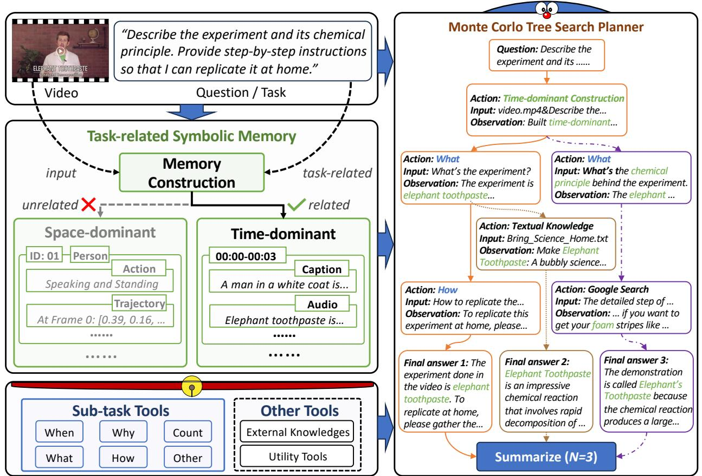
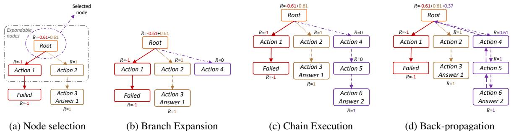
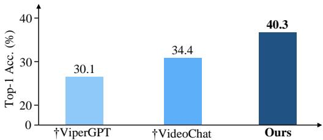
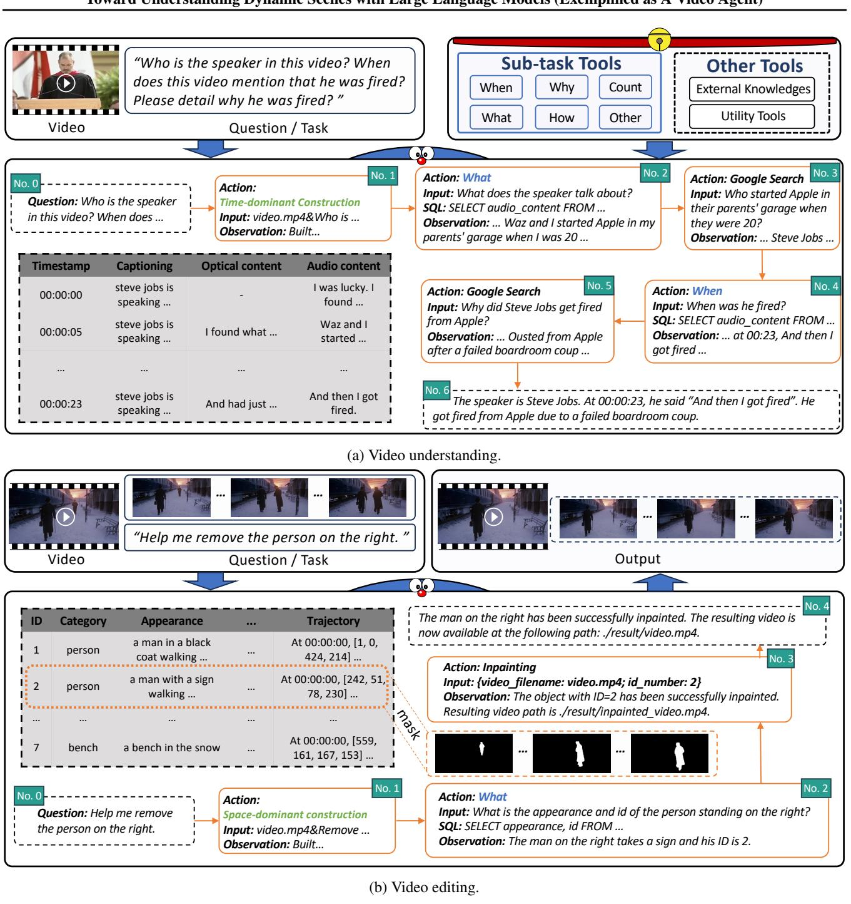
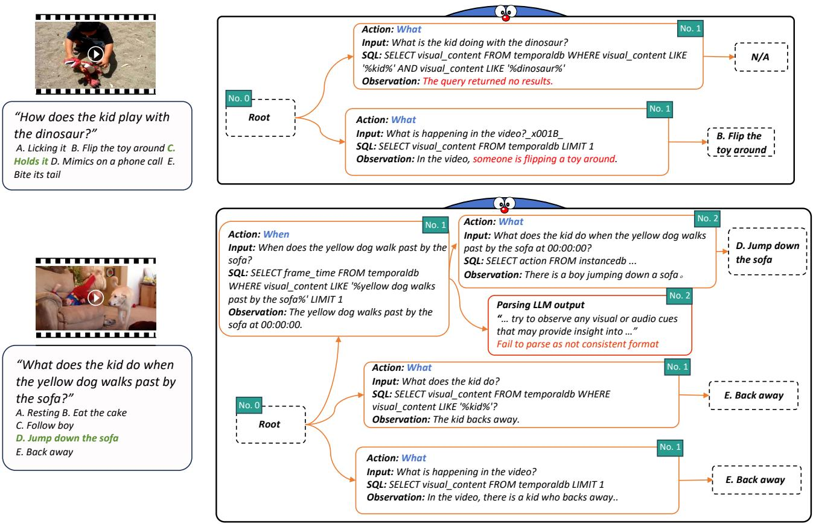

# 1. Bibliographic Information

## 1.1. Title
DoraemonGPT: Toward Understanding Dynamic Scenes with Large Language Models (Exemplified as A Video Agent)

## 1.2. Authors
Zongxin Yang, Guikun Chen, Xiaodi Li, Wenguan Wang, Yi Yang

## 1.3. Journal/Conference
The paper was published on arXiv as a preprint and later mentioned as "ICML24" in Table 2a and 2b, indicating acceptance at the International Conference on Machine Learning (ICML) in 2024. ICML is a top-tier international academic conference in the field of machine learning, highly reputable and influential.

## 1.4. Publication Year
2024 (Published at UTC: 2024-01-16T14:33:09.000Z)

## 1.5. Abstract
The paper introduces `DoraemonGPT`, a comprehensive system driven by Large Language Models (LLMs) designed to understand dynamic scenes, contrasting with most existing LLM-driven visual agents that primarily focus on image-based tasks. Exemplified as a `video agent`, `DoraemonGPT` processes an input video and a question/task by first converting the video into a `symbolic memory` that stores task-related attributes. This structured representation enables `spatial-temporal querying` and reasoning through well-designed `sub-task tools`, yielding concise intermediate results. To overcome LLMs' limitations in specialized domain knowledge, `plug-and-play tools` are incorporated to access external knowledge. A novel `LLM-driven planner` based on `Monte Carlo Tree Search (MCTS)` explores the large planning space for scheduling these tools. This planner iteratively finds feasible solutions by `backpropagating` result rewards, and multiple solutions can be summarized into an improved final answer. The system's effectiveness is evaluated on three benchmarks and several real-world scenarios.

## 1.6. Original Source Link
https://arxiv.org/abs/2401.08392 (Preprint)
PDF Link: https://arxiv.org/pdf/2401.08392v4.pdf

# 2. Executive Summary

## 2.1. Background & Motivation

### Core Problem
The core problem `DoraemonGPT` aims to solve is the limited ability of current Large Language Model (LLM)-driven visual agents to understand and reason about *dynamic scenes*, such as those found in videos. Existing visual agents predominantly focus on static image-based tasks, which restricts their applicability in real-life scenarios requiring continuous temporal understanding and interaction.

### Importance of the Problem
Understanding dynamic scenes is crucial for many real-world applications. The paper explicitly mentions examples like `guiding students in laboratory experiments and identifying their mistakes`, which require not just recognizing objects, but understanding sequences of actions, their timing, and causal relationships. The real world is inherently dynamic and ever-changing. Therefore, enabling LLMs to process and reason over video data is a significant step towards more advanced, generally intelligent AI systems. Challenges include:
1.  **Spatial-temporal Reasoning**: The ability to infer relationships between instances across both space and time (e.g., object trajectories, interactions, scene changes).
2.  **Larger Planning Space**: Videos introduce the complexity of actions, intentions, and temporal semantics, significantly expanding the search space for decomposing and solving tasks compared to static images.
3.  **Limited Internal Knowledge**: LLMs, despite their vast training data, cannot encode all specialized knowledge required for every possible video understanding task (e.g., scientific principles).

### Paper's Entry Point or Innovative Idea
The paper's entry point is to design a `comprehensive and conceptually elegant system` that empowers LLMs to understand dynamic video scenes by addressing the aforementioned challenges. Its innovative idea centers around three pillars:
1.  **Structured Information Collection**: Converting raw video into a `task-related symbolic memory (TSM)` that stores relevant spatial-temporal attributes, enabling efficient querying and reasoning. This avoids overwhelming LLMs with excessive context, which can hinder performance.
2.  **Enhanced Solution Exploration**: Introducing a novel `LLM-driven planner` based on `Monte Carlo Tree Search (MCTS)` to explore the large planning space. This allows the system to consider multiple potential solutions and refine its answers, moving beyond greedy, single-path reasoning.
3.  **Extensible Knowledge**: Incorporating `plug-and-play tools` to access external, specialized knowledge sources, effectively expanding the LLM's expertise beyond its internal training data.

## 2.2. Main Contributions / Findings

### Primary Contributions
1.  **DoraemonGPT System Design**: Proposes a comprehensive and conceptually elegant `LLM-driven system` for dynamic scene understanding, exemplified as a `video agent`. It is intuitive, versatile, and compatible with various foundation models.
2.  **Task-related Symbolic Memory (TSM)**: Introduces a novel approach to create a compact and queryable `TSM` by decoupling spatial-temporal attributes into space-dominant and time-dominant memories. LLMs dynamically select and extract only task-relevant information into an `SQL table` for efficient access.
3.  **Sub-task and Knowledge Tools**: Designs `sub-task tools` for efficient `spatial-temporal querying` of the `TSM` (e.g., "When," "Why," "What," "How," "Count") and `plug-and-play knowledge tools` to incorporate external, domain-specific knowledge sources (symbolic, textual, web).
4.  **Monte Carlo Tree Search (MCTS) Planner**: Develops a novel `LLM-driven MCTS planner` to effectively explore the large planning space of complex video tasks. This planner iteratively finds feasible solutions by `backpropagating` rewards, allowing for the generation and summarization of multiple solutions.
5.  **Extensive Evaluation**: Conducts extensive experiments on three benchmarks (`NExT-QA`, $TVQA+$, `Ref-YouTube-VOS`) and several `in-the-wild scenarios`, demonstrating the system's effectiveness and versatility.

### Key Conclusions or Findings
1.  **Superior Performance on Dynamic Tasks**: `DoraemonGPT` significantly outperforms recent LLM-driven competitors (e.g., `ViperGPT`, `VideoChat`) on causal, temporal, and descriptive reasoning tasks in video question answering, and substantially improves referring video object recognition. This highlights the efficacy of its `MCTS planner` and `TSM`.
2.  **Necessity of Structured Memory**: The `Task-related Symbolic Memory` is crucial, especially for tasks requiring fine-grained understanding like referring object segmentation, where `DoraemonGPT` remarkably surpasses supervised models without learning on the specific dataset.
3.  **Effectiveness of MCTS Planner**: The `MCTS planner` effectively explores the large planning space, yielding better performance compared to greedy or naive search methods, particularly when generating multiple answer candidates. The ability to `backpropagate` rewards guides more efficient exploration.
4.  **Benefits of Knowledge Extension**: The `plug-and-play knowledge tools` enable `DoraemonGPT` to tackle complex, domain-specific problems that LLMs alone cannot handle, showcasing its extensibility.
5.  **Foundation Model Agnostic**: The system can benefit from advancements in underlying `foundation models`, as demonstrated by the improved performance when using `InstructBLIP` for captioning.
6.  **Real-world Applicability**: `DoraemonGPT` can handle complex `in-the-wild tasks`, such as checking experimental operations or video editing, which were previously challenging for existing approaches.

# 3. Prerequisite Knowledge & Related Work

## 3.1. Foundational Concepts

To understand `DoraemonGPT`, a reader needs to be familiar with several core concepts in artificial intelligence, particularly in the fields of natural language processing (NLP) and computer vision (CV).

*   **Large Language Models (LLMs)**: These are advanced artificial intelligence models (like `GPT-3.5-turbo`, `PaLM 2`, `Llama`) trained on vast amounts of text data to understand, generate, and process human language. They can perform tasks like question answering, text summarization, translation, and even code generation. In `DoraemonGPT`, LLMs act as the central reasoning engine, coordinating tools and making decisions. They are crucial for task decomposition, understanding context, and synthesizing final answers.
*   **Visual Agents**: These are AI systems that combine visual perception with decision-making and action capabilities, often driven by LLMs. They can interpret visual input (images or videos) and perform tasks based on that understanding. The paper notes that most current visual agents focus on static images.
*   **Multi-modal Understanding**: This refers to the ability of AI systems to process and integrate information from multiple modalities, such as text, images, audio, and video. `DoraemonGPT` aims for multi-modal understanding by integrating video (visual and auditory) with textual queries.
*   **Foundation Models**: These are large AI models pre-trained on broad data at scale, designed to be adapted to a wide range of downstream tasks. Examples include `BLIP` (for image captioning), `YOLOv8` (for object detection), `Whisper` (for speech recognition), etc. `DoraemonGPT` leverages several such models as `tools` to extract information from videos.
*   **Monte Carlo Tree Search (MCTS)**: An algorithmic search strategy commonly used in artificial intelligence, particularly in game playing (e.g., Go, chess). It builds a search tree by repeatedly performing four steps:
    1.  **Selection**: Choose the best child node to explore further.
    2.  **Expansion**: Add a new child node to the selected node.
    3.  **Simulation (Rollout)**: Run a simulated playout from the new node to a terminal state.
    4.  **Backpropagation**: Update the statistics (e.g., win/loss count, reward) of the nodes along the path from the new node to the root, based on the simulation result.
        In `DoraemonGPT`, MCTS is adapted to guide the LLM's `planning` process, helping it explore different sequences of tool calls to find optimal solutions in a large `planning space`.
*   **ReAct (Reasoning and Acting)**: A prompting strategy for LLMs that interweaves `reasoning` (Thought) and `acting` (Action, Action Input, Observation) steps. The `Thought` step allows the LLM to explicitly verbalize its reasoning process, and the `Action` step allows it to interact with external tools or environments. The `Observation` step provides feedback from the environment. `DoraemonGPT` uses a `ReAct`-style step for its non-root nodes in the `MCTS planner`.
*   **In-context Learning (ICL)**: A paradigm where LLMs learn to perform new tasks by being given a few examples (demonstrations) within their input prompt, without requiring parameter updates or fine-tuning. `DoraemonGPT` uses ICL for selecting `Task-related Symbolic Memory (TSM)` types and for guiding sub-task tools.
*   **Symbolic Memory (e.g., SQL)**: Instead of raw, unstructured data, symbolic memory stores information in a structured, semantic format that can be easily queried and reasoned about. `SQL (Structured Query Language)` is a standard language for managing and querying relational databases. `DoraemonGPT` converts video information into `SQL tables` for efficient access.

## 3.2. Previous Works

The paper positions `DoraemonGPT` within the context of recent advancements in `LLM-driven visual agents` and `multi-modal understanding`.

*   **LLM-driven Agents for Image-based Tasks**: The introduction highlights that `recent LLM-driven visual agents mainly focus on solving image-based tasks`. This refers to works like `ViperGPT` (Surís et al., 2023), `HuggingGPT` (Shen et al., 2023), and `Visual Programming` (Gupta & Kembhavi, 2023). These systems demonstrate promise in decomposing complex image tasks into subtasks and solving them using various `vision-and-language models (VLMs)` or `APIs`.
    *   **ViperGPT (Surís et al., 2023)**: Leverages code generation models to create subroutines from VLMs through a provided API. It solves tasks by generating Python code that is then executed. `DoraemonGPT` compares directly against `ViperGPT`, noting its limitations in dynamic video understanding.
    *   **VideoChat (Li et al., 2023b)**: An end-to-end chat-centric video understanding system that integrates several `foundation models` and `LLMs` to build a chatbot. It is mentioned as a competitor but often treats video as a sequence of images or relies on pre-extracted information, which `DoraemonGPT` aims to improve upon.
*   **Multi-modal Understanding Systems**: Earlier efforts focused on specific tasks (`Lu et al., 2019; Marino et al., 2019; 2021; Bain et al., 2021`). More general systems emerged with `Frozen` (Tsimpoukelli et al., 2021) showing how to empower LLMs with visual input. This led to `large multimodal models` (`OpenAI, 2023; Driess et al., 2023; Zhu et al., 2023a`) and `zero-shot systems` (`Li et al., 2023a; Yu et al., 2023`). `DoraemonGPT` builds on this by focusing on the `dynamic modality`.
*   **LLM-driven Modular Systems (Planning)**:
    *   **Fixed Paths**: Many systems `(Gupta & Kembhavi, 2023; Wu et al., 2023a; Surís et al., 2023; Shen et al., 2023)` decompose tasks into an ordered sequence of subtasks, each addressed by a specific module. `ViperGPT` and `HuggingGPT` fall into this category.
    *   **Dynamic Paths**: Other works `(Nakano et al., 2021; Yao et al., 2022; Yang et al., 2023)` perform planning and execution concurrently, allowing for interactive and error-tolerant approaches. `ReAct` (Yao et al., 2022) is a key example here. `DoraemonGPT` extends this by using `MCTS` for more robust exploration of the planning space.
*   **LLMs with External Memory**: This area explores how to augment LLMs with external knowledge to overcome their internal knowledge limitations and context window constraints.
    *   **Textual Memory**: Storing long contexts as embeddings and retrieving them by similarity (`Zhu et al., 2023b; Park et al., 2023`). Example: document question answering.
    *   **Symbolic Memory**: Modeling memory as structured representations with symbolic languages (e.g., `SQL` for databases, `Cheng et al., 2022; Sun et al., 2023; Hu et al., 2023`). `DoraemonGPT` falls into this category by creating `SQL-based symbolic memory` from videos.

## 3.3. Technological Evolution

The evolution of AI in `multi-modal understanding` and `LLM-driven agents` has progressed from:
1.  **Task-specific Models**: Early models were often trained for specific `vision-language tasks` (e.g., `image captioning`, `visual question answering`) and lacked generalizability.
2.  **General Multi-modal Models**: The rise of `foundation models` like `CLIP` (Radford et al., 2021), `BLIP` (Li et al., 2022), and `GPT-4` (OpenAI, 2023) demonstrated impressive zero-shot and few-shot capabilities across a broader range of visual and textual tasks. These models could encode richer representations.
3.  **LLM-driven Agents for Static Images**: The power of `LLMs` was then harnessed to act as `planners` or `orchestrators` for `visual tasks`. Systems like `ViperGPT` and `Visual ChatGPT` showed how LLMs could decompose tasks and call specialized `vision-language models` (`VLMs`) to process static images, often by generating code or structured instructions.
4.  **Towards Dynamic Scenes (DoraemonGPT's context)**: The natural next step is to extend `LLM-driven agents` to `dynamic scenes` (videos). This is where `DoraemonGPT` enters, recognizing that simply treating videos as sequences of static images or relying on pre-extracted information (as some concurrent works do) is insufficient for deep `spatial-temporal reasoning`. The field is moving towards more intelligent agents that can reason over continuous, evolving information streams and adaptively use knowledge.

## 3.4. Differentiation Analysis

`DoraemonGPT` differentiates itself from previous `LLM-driven visual agents` through several key innovations, particularly in its approach to handling `dynamic scenes`:

1.  **Focus on Dynamic Modalities**: Unlike most existing agents that `mainly focus on solving image-based tasks` (`ViperGPT`, `Visual ChatGPT`), `DoraemonGPT` is specifically designed for `videos`, aiming to understand their `dynamic and ever-changing nature`. This is a fundamental shift from static to temporal reasoning.
2.  **Task-related Symbolic Memory (TSM)**:
    *   Previous `LLM-driven agents` for video often treat video as a `sequence of images` (`ViperGPT`) or build chatbots based on `pre-extracted information` (`VideoChat`). This can lead to `redundant context` or `missing crucial dynamic cues`.
    *   `DoraemonGPT`'s `TSM` is novel because it dynamically selects and extracts *only task-relevant* spatial and temporal attributes (decoupled into `space-dominant` and `time-dominant memories`). This structured, `SQL-based` representation makes information querying efficient and avoids overwhelming the `LLM`.
3.  **MCTS Planner for Large Planning Space**:
    *   Many prior `LLM-driven planners` use `greedy search methods` (`ViperGPT`, `HuggingGPT`), generating a single chain of actions. While `ReAct`-style planning allows for dynamic paths, it doesn't necessarily explore the solution space broadly.
    *   `DoraemonGPT` introduces a `novel LLM-driven MCTS planner`. By adapting `MCTS`, it can `efficiently explore the large planning space` inherent in dynamic video tasks, find `multiple feasible solutions`, and `summarize them into an improved final answer`. This is a significant improvement over single-path, greedy approaches, especially for `open-ended questions`.
4.  **Comprehensive Tool Integration and Knowledge Extension**:
    *   While other agents use `tools` (`ViperGPT` generates Python code for APIs, `HuggingGPT` connects `foundation models`), `DoraemonGPT` explicitly designs `sub-task tools` tailored for `spatial-temporal reasoning` over its `TSM`.
    *   Furthermore, its `plug-and-play knowledge tools` (symbolic, textual, web) provide a structured way to `access external, domain-specific knowledge`, directly addressing the `limited internal knowledge` of LLMs. This makes `DoraemonGPT` more robust for specialized tasks like scientific experiment analysis.
5.  **Explicit Decoupling of Spatial-Temporal Attributes**: The explicit `decoupling of spatial-temporal attributes` into two distinct memory types (`space-dominant` and `time-dominant`) is a specific design choice that enhances the system's ability to handle diverse video questions, whether they concern objects' movements or overall video events.

    In essence, `DoraemonGPT` moves beyond simply chaining `VLMs` or treating videos superficially. It systematically tackles the challenges of video understanding by building a `compact, queryable memory` and employing an `intelligent search strategy` (`MCTS`) to reason over this memory, augmented by `external knowledge`.

# 4. Methodology

`DoraemonGPT` is an `LLM-driven agent` designed to understand dynamic video scenes by effectively utilizing various tools to decompose complex video tasks into sub-tasks and solve them. The overall architecture, as shown in Figure 2 of the original paper, consists of three main components: `Task-related Symbolic Memory (TSM)`, `Sub-task and Knowledge Tools`, and a `Monte Carlo Tree Search (MCTS) Planner`.

The general workflow is as follows:
1.  **Input**: Given a video ($V$) and a textual task/question ($Q$).
2.  **Memory Extraction**: `DoraemonGPT` first analyzes $Q$ to determine relevant information and then extracts a `Task-related Symbolic Memory (TSM)` from $V$.
3.  **Planning and Execution**: Using a `Monte Carlo Tree Search (MCTS) Planner`, `DoraemonGPT` automatically schedules a set of `tools` (sub-task tools for querying TSM, knowledge tools for external knowledge, and other utility tools) to solve $Q$.
4.  **Solution Refinement**: The `MCTS planner` explores the `planning space`, generates `multiple possible answers`, and then `summarizes them into an improved final answer`.

    The following are the results from Figure 2 of the original paper:

    
    *该图像是一个示意图，展示了DoraemonGPT系统如何处理视频输入和任务。通过任务相关的符号记忆构建，系统能够进行空间和时间主导的查询，引导用户获取实验步骤和科学原理的描述。使用蒙特卡洛树搜索规划器，该系统能够生成有效的解决方案并总结结果。*

## 4.1. Task-related Symbolic Memory (TSM)

Videos are complex `dynamic data` containing rich `spatial-temporal relations`. For a given question $Q$ about a video $V$, only a subset of attributes are critical for the solution, while a large amount of information might be irrelevant. To address this, `DoraemonGPT` extracts and stores potentially relevant video information into a `TSM` *before* attempting to solve $Q$.

### 4.1.1. TSM Construction
The construction of `TSM` involves two main steps:
1.  **Task Type Selection**: An `LLM-driven planner` uses an `in-context learning (ICL)` method to determine the type of `TSM` needed based on the question $Q$. This is done by prompting the `LLM` with task descriptions for each `TSM` type. The `LLM` predicts a suitable `TSM` in the format "Action: `<TSM_type>` construction...".
2.  **Attribute Extraction and Storage**: Once the `TSM` type is identified, the corresponding `API` is called to extract `task-related attributes`. These attributes are then stored in an `SQL table`, making them accessible via `symbolic languages` (e.g., `SQL`).

    `DoraemonGPT` designs two main types of memory based on `spatial-temporal decoupling`, a concept widely applied in `video representation learning` (Bertasius et al., 2021; Arnab et al., 2021):

*   **Space-dominant Memory (SDM)**: This memory type is primarily used for questions related to specific `targets` (e.g., persons, animals) or their `spatial relations`.
    *   **Extraction Process**: `Multi-object tracking methods` (Maggiolino et al., 2023) are used to detect and track instances.
    *   **Attributes**: Each instance stores attributes including:
        *   `Unique ID`: To identify individual objects.
        *   `Semantic Category`: The type of object (e.g., "person").
        *   `Trajectory & Segmentation`: For localization, capturing the object's movement (bounding box) and shape (mask) in each frame.
        *   `Appearance Description`: Textual descriptions of the instance's visual characteristics, extracted by models like `BLIP` (Li et al., 2022) / `BLIP-2` (Li et al., 2023a), used for text-based grounding.
        *   `Action Classification`: The action performed by the instance.

*   **Time-dominant Memory (TDM)**: This memory type focuses on constructing `temporal-related information` of the video, requiring comprehension of content throughout the video.
    *   **Attributes**: Stored attributes include:
        *   `Timestamp`: The time marker of a frame or clip.
        *   `Audio Content`: Speech recognition results obtained via `ASR` (e.g., `Whisper` by Radford et al., 2023).
        *   `Optical Content`: `Optical Character Recognition (OCR)` results (e.g., `PaddlePaddle, 2023`) for text appearing in the video.
        *   `Captioning`: Frame-level captions generated by `BLIPs` (Li et al., 2022; 2023a; Dai et al., 2023) and clip-level captions derived by deduplicating similar and continuous frame-level results.

            The following are the results from Table 1 of the original paper:

            <table><tr><td rowspan=1 colspan=1>Attribute</td><td rowspan=1 colspan=1>Used Model</td><td rowspan=1 colspan=1>Explanation</td></tr><tr><td rowspan=1 colspan=3>Space-dominant Memory</td></tr><tr><td rowspan=1 colspan=1>ID number</td><td></td><td rowspan=1 colspan=1>A unique ID assigned to an instance</td></tr><tr><td rowspan=1 colspan=1>Category</td><td rowspan=1 colspan=1>YOLOv8 (Jocher et al., 2023)/Grounding DINO (Liu et al., 2023c)</td><td rowspan=1 colspan=1>The category of an instance, e.g., person</td></tr><tr><td rowspan=1 colspan=1>Trajectory</td><td rowspan=1 colspan=1>Deep OC-Sort (Maggiolino et al., 2023)/DeAOT (Yang &amp; Yang, 2022)</td><td rowspan=1 colspan=1>An instance's bounding box in each frame</td></tr><tr><td rowspan=1 colspan=1>Segmentation</td><td rowspan=1 colspan=1>YOLOv8-Seg (Jocher et al., 2023)/DeAOT (Yang &amp; Yang, 2022)</td><td rowspan=1 colspan=1>An instance's segmentation mask in each frame</td></tr><tr><td rowspan=1=1>Appearance</td><td rowspan=1=1>BLIP (Li et al., 2022) / BLIP-2 (Li et al., 2023a)</td><td rowspan=1=1>A description of an instance's appearance</td></tr><tr><td rowspan=1=1>Action</td><td rowspan=1=1>Intern Video (Wang et al., 2022)</td><td rowspan=1=1>The action of an instance</td></tr><tr><td rowspan=1=3>Time-dominant Memory</td></tr><tr><td rowspan=1=1>Timestamp</td><td></td><td rowspan=1=1>The timestamp of a frame/clip</td></tr><tr><td rowspan=1=1>Audio content</td><td rowspan=1=1>Whisper (Radford et al., 2023)</td><td rowspan="1=1">Speech recognition results of the video</td></tr><tr><td rowspan=1=1>Optical content</td><td rowspan="1=1">OCR (PaddlePaddle, 2023)</td><td rowspan="1=1">Optical character recognition results of the video</td></tr><tr><td rowspan="1=1">Captioning</td><td rowspan="1=1">BLIP (Li et al., 2022)/BLIP-2 (Li et al., 2023a)/InstructBlip (Dai et al., 2023)</td><td rowspan="1=1">Frame-level/clip-level captioning results</td></tr></table>

*Table 1: Attributes and Models used for TSM Construction.*

### 4.1.2. Sub-task Tools
While `LLM-driven agents` can access external information by learning from the entire memory or generating symbolic sentences (e.g., `SQL`), these methods can increase context length, potentially leading to information omission or distraction. To improve efficiency and effectiveness, `DoraemonGPT` designs a series of `sub-task tools`, each responsible for querying information from the `TSMs` by answering specific `sub-task questions`.

*   **Tool Functionality**: Each `sub-task tool` is an individual `LLM-driven sub-agent` with task-specific prompts and examples. It generates `SQL` queries to access the `TSMs` and answer the given `sub-task question`.
*   **Tool Description**: The `LLM-driven planner` learns about each tool through its `in-context description`, which includes the sub-task description, tool name, and tool inputs.
*   **Tool Calling**: To call a tool, `DoraemonGPT` parses `LLM`-generated commands like "Action: `[tool_name]` Input: `video_name`#`(sub_question...)`".
*   **Types of Sub-task Tools**:
    *   `When`: For `temporal understanding` (e.g., "When did the dog walk past the sofa?").
    *   `Why`: For `causal reasoning` (e.g., "Why did the lady shake the toy?").
    *   `What`: For describing required information (e.g., "What's the name of the experiment?").
    *   `How`: For manner, means, or quality (e.g., "How does the baby keep himself safe?").
    *   `Count`: For counting instances (e.g., "How many people are in the room?").
    *   `Other`: For questions not covered by the above (e.g., "Who slides farther at the end?").
*   **Flexibility**: A sub-question might be suitable for multiple sub-tools, and the `MCTS planner` (§4.3) is designed to explore these different selections.

## 4.2. Knowledge Tools and Others

`DoraemonGPT` acknowledges that `LLM-driven agents` might lack specialized domain knowledge. Therefore, it supports `plug-and-play integration` of `external knowledge sources` to assist the `LLM` in comprehending specialized content.

### 4.2.1. Knowledge Tools
Each `knowledge tool` consists of:
1.  **In-context knowledge description**: Describes the external knowledge source.
2.  **API function**: Queries information from the source via question answering.
    Three types of `API functions` are considered for different knowledge forms:
*   **Symbolic Knowledge**: For structured formats like Excel or `SQL tables`. The `API function` is a symbolic question-answering sub-agent, similar to `sub-task tools`.
*   **Textual Knowledge**: For natural language text like research publications or textbooks. The `API function` is built on `text embedding` and `searching` (OpenAI, 2022).
*   **Web Knowledge**: For information from the internet. The `API function` uses `search engine APIs` (e.g., Google, Bing).

### 4.2.2. General Utility Tools
Beyond `knowledge tools`, `DoraemonGPT` also integrates general `utility tools` commonly found in `LLM-driven agents` (Xi et al., 2023) to complete specialized vision tasks (e.g., video editing and inpainting).

## 4.3. Monte Carlo Tree Search (MCTS) Planner

Previous `LLM-driven planners` often follow a `greedy search method`, generating a single action sequence. `DoraemonGPT` proposes a novel `tree-search-like planner` equipped with `MCTS` (Coulom, 2006; Kocsis & Szepesvári, 2006; Browne et al., 2012) to efficiently explore the large planning space and find better solutions.

The planning space is viewed as a tree:
*   **Root Node ($v_0$)**: Represents the initial question input $Q$.
*   **Non-root Node**: Represents an `action` or `tool call`, structured as a `ReAct`-style step: (`thought`, `action`, `action input`, `observation`).
*   **Leaf Node**: Contains a `final answer` (or indicates a failure).
*   **Action Sequence**: A path from the root node to a leaf node.

    The `MCTS planner` iteratively executes four phases for $N$ times, producing $N$ solutions:

The following are the results from Figure 3 of the original paper:


*该图像是示意图，展示了基于蒙特卡罗树搜索的规划过程，包括节点选择、分支扩展、链执行和回传四个步骤。各步骤以树状结构呈现，标注了不同动作的奖励值 $R$。*

### 4.3.1. Node Selection
*   **Purpose**: Select an expandable node from which to plan a new solution.
*   **First Iteration**: Only the root node $v_0$ is selectable.
*   **Subsequent Iterations**: A non-leaf node $v_i$ is randomly selected based on its `sampling probability`, formulated as:
    $P(v_i) = \mathrm{Softmax}(R_i)$
    Where $R_i$ is the `reward value` of node $v_i$, initialized to 0 and updated during `Reward Back-propagation`. Nodes with higher rewards have a greater probability of being selected.

### 4.3.2. Branch Expansion
*   **Purpose**: Add a new child to the selected expandable node, creating a new branch (a new tool call).
*   **Process**: To encourage the `LLM` to generate a tool call different from previous child nodes, `historical tool actions` are added to the `LLM`'s prompt, instructing it to make a different choice. This `in-context prompt` is then removed for subsequent steps in the current chain execution.

### 4.3.3. Chain Execution
*   **Purpose**: Generate a new solution (an action sequence) starting from the newly expanded branch.
*   **Process**: A `step-wise LLM-driven planner` (Yao et al., 2022) generates a sequence of `tool calls` (nodes).
*   **Termination**: The execution terminates upon obtaining a `final answer` or encountering an `execution error`.

### 4.3.4. Reward Back-propagation
*   **Purpose**: Update the reward values of ancestor nodes based on the outcome of a newly found leaf node.
*   **Process**: After obtaining a `leaf/outcome node` $v_l$, its reward is gradually propagated to its ancestor nodes up to the root $v_0$.
*   **Reward Types**:
    *   **Failure**: If the planner produces an unexpected result (e.g., failed tool call, incorrect format), the reward $R_{v_l}$ is set to a `negative value` (e.g., -1).
    *   **Non-failure**: If the planner successfully produces a result (even if its correctness against ground truth is unknown), $R_{v_l}$ is set to a `positive value` (e.g., 1).
*   **Back-propagation Function**: The paper uses a decay mechanism, arguing that outcomes are more related to nearby nodes. The reward update for an ancestor node $v_i$ is formulated as:
    $R_{v_i} \leftarrow R_{v_i} + R_{v_l} \cdot e^{\beta (1 - d(v_i, v_l))}$
    Where:
    *   $R_{v_i}$ is the reward of the ancestor node $v_i$.
    *   $R_{v_l}$ is the reward of the leaf node $v_l$ (either positive $\alpha$ or negative $-\alpha$). Here, $\alpha$ is a positive base reward.
    *   $d(v_i, v_l)$ denotes the `node distance` (number of steps) between node $v_i$ and the leaf node $v_l$.
    *   $\beta$ is a `hyperparameter` controlling the `decay rate` of the reward.
    *   The term $e^{\beta (1 - d(v_i, v_l))}$ acts as a decay factor: the further the node distance, the greater the reward decay ratio. A higher $\alpha/\beta$ increases the probability of expanding nodes closer to non-failure leaf nodes.

        After $N$ iterations, the planner collects at most $N$ non-failure answers. For open-ended questions, these answers can be `summarized` by an `LLM` to generate an `informative final answer`. For single-/multiple-choice questions, a `voting process` can determine the final answer.

The prompt structure for LLMs in the MCTS planner uses the `ReAct` format:
```
" " I
Regarding a given video from {video_filename}, answer the following questions as best you can. You have access to the following tools:   
{tool_descriptions}   
Use the following format:   
Question: the input question you must answer   
Thought: you should always think about what to do   
Action: the action to take, should be one of [{tool_names}]   
Action Input: the input to the action   
Observation: the result of the action (this Thought/Action/Action Input/Observation can repeat N times)   
Thought: I now know the final answer   
Final Answer: the final answer to the original input question   
Begin!   
Question: {input_question}   
{ancestor_history}   
Thought: {expansion_prompt} {agent_scratchpad}   
II I II
```
*   `{video_filename}`: The file path of the input video.
*   `{input_question}`: The given question/task regarding the video.
*   `{tool_descriptions}`: Descriptions of available tools.
*   `{tool_names}`: Names of available tools.
*   `{ancestor_history}`: The `ReAct` history (thought, action, action input, observation node) of all ancestor nodes of the current non-root node.
*   `{expansion_prompt}`: Used to guide the `LLM` to make a different choice during branch expansion.
*   `{agent_scratchpad}`: Placeholder for the `ReAct` output of the `LLM`.

# 5. Experimental Setup

## 5.1. Datasets

The authors conduct experiments on three diverse datasets to comprehensively validate `DoraemonGPT`'s utility, covering `video question answering (VQA)` and `referring video object segmentation` tasks in dynamic scenes.

*   **NExT-QA (Xiao et al., 2021)**:
    *   **Description**: A `video question answering` dataset containing 34,132 training and 4,996 validation video-question pairs.
    *   **Characteristics**: Each question is annotated with a `question type` (causal, temporal, descriptive) and 5 answer candidates.
    *   **Usage**: For `ablation studies`, 30 samples per type (90 questions total) are randomly sampled from the training set. The validation set is used for method comparison.
    *   **Example (Conceptual):** A video shows someone cooking. A "causal" question might be "Why did the water boil?"; a "temporal" question might be "When did the chef add salt?"; a "descriptive" question might be "What is the person holding?".

*   **TVQA+ (Lei et al., 2020)**:
    *   **Description**: An enhanced version of the `TVQA` dataset (Lei et al., 2018), augmented with 310.8K `bounding boxes`.
    *   **Characteristics**: These bounding boxes link visual concepts in questions and answers to depicted objects in videos, enabling `spatial-temporal grounding`.
    *   **Usage**: For evaluation, 900 samples are randomly sampled from the validation set, consistent with previous work (Gupta & Kembhavi, 2023).
    *   **Example (Conceptual):** A video from a TV show might ask "Who passed the remote control to whom?", and the bounding boxes would help ground "remote control" and the two "persons" in the video.

*   **Ref-YouTube-VOS (Seo et al., 2020)**:
    *   **Description**: A large-scale `referring video object segmentation` dataset with approximately 15,000 referential expressions associated with over 3,900 videos.
    *   **Characteristics**: Covers diverse scenarios and aims to evaluate `pixel-wise spatial-temporal segmentation`.
    *   **Usage**: The validation set (202 videos, 834 objects with expressions) is used to validate `DoraemonGPT`'s effectiveness in segmenting objects based on textual descriptions.
    *   **Example (Conceptual):** Given a video of a busy street and the query "the red car turning left," the system needs to identify and segment the specific red car across multiple frames.

## 5.2. Evaluation Metrics

For every evaluation metric mentioned in the paper, its conceptual definition, mathematical formula, and symbol explanation are provided below.

## 5.2.1. Question Answering Metrics (NExT-QA, TVQA+)

The standard metric used for `question answering` is `top-1 accuracy`.

*   **Conceptual Definition**: `Top-1 Accuracy` measures the proportion of questions for which the model's highest-confidence answer matches the correct answer (ground truth). It indicates how often the model gets the exact answer right among a set of choices.
*   **Mathematical Formula**:
    \$
    \mathrm{Accuracy} = \frac{\text{Number of correct predictions}}{\text{Total number of predictions}}
    \$
*   **Symbol Explanation**:
    *   `Number of correct predictions`: The count of instances where the model's predicted answer for a question is identical to the ground truth answer.
    *   `Total number of predictions`: The total number of questions for which the model made a prediction.

        On `NExT-QA`, additional specialized accuracy metrics are reported:
*   $\mathrm{Acc_C}$: Accuracy for `causal questions`.
*   $\mathrm{Acc_T}$: Accuracy for `temporal questions`.
*   $\mathrm{Acc_D}$: Accuracy for `descriptive questions`.
*   $\mathrm{Acc_A}$: The overall accuracy of all questions (equivalent to the general `top-1 accuracy`).
*   $\mathrm{Avg}$: The average of $\mathrm{Acc_C}$, $\mathrm{Acc_T}$, and $\mathrm{Acc_D}$.

## 5.2.2. Referring Object Segmentation Metrics (Ref-YouTube-VOS)

For `referring object segmentation`, the metrics are evaluated on the official challenge server of `Ref-YouTube-VOS`. The primary reported metric is $\mathcal{J}\&\mathcal{F}$, which is the average of `region similarity` ($\mathcal{J}$) and `contour accuracy` ($\mathcal{F}$).

*   **Region Similarity ($\mathcal{J}$ - Jaccard Index)**:
    *   **Conceptual Definition**: Also known as `Intersection over Union (IoU)`, this metric quantifies the overlap between the predicted segmentation mask and the ground truth mask. It measures how similar the shapes and positions of the segmented regions are. A higher value indicates better overlap.
    *   **Mathematical Formula**:
        \$
        \mathcal{J}(S_p, S_{gt}) = \frac{|S_p \cap S_{gt}|}{|S_p \cup S_{gt}|}
        \$
    *   **Symbol Explanation**:
        *   $S_p$: The set of pixels belonging to the predicted segmentation mask.
        *   $S_{gt}$: The set of pixels belonging to the ground truth segmentation mask.
        *   $|A|$: The cardinality (number of pixels) of set A.
        *   $S_p \cap S_{gt}$: The intersection of the predicted and ground truth masks (pixels common to both).
        *   $S_p \cup S_{gt}$: The union of the predicted and ground truth masks (all pixels in either mask).

*   **Contour Accuracy ($\mathcal{F}$ - F-measure)**:
    *   **Conceptual Definition**: This metric evaluates the accuracy of the boundaries (contours) of the segmented objects. It is particularly sensitive to the precision of the object edges. A higher value indicates more precise boundary alignment with the ground truth. It is often calculated as the harmonic mean of precision and recall for boundary pixels.
    *   **Mathematical Formula**: (A common way to define F-measure for boundary quality, which the paper implies by "contour accuracy")
        Let $B_p$ be the set of boundary pixels of the predicted mask and $B_{gt}$ be the set of boundary pixels of the ground truth mask.
        Precision: $P_c = \frac{\text{Number of correctly detected boundary pixels in } B_p}{\text{Total number of boundary pixels in } B_p}$
        Recall: $R_c = \frac{\text{Number of correctly detected boundary pixels in } B_p}{\text{Total number of boundary pixels in } B_{gt}}$
        \$
        \mathcal{F} = \frac{2 \cdot P_c \cdot R_c}{P_c + R_c}
        \$
        (Note: The exact formulation of contour accuracy can vary; this is a standard interpretation of F-measure for boundaries).
    *   **Symbol Explanation**:
        *   $P_c$: Precision, measuring how many of the predicted boundary pixels are actually correct.
        *   $R_c$: Recall, measuring how many of the true boundary pixels were successfully detected.

*   **Overall Metric ($\mathcal{J}\&\mathcal{F}$)**:
    *   **Conceptual Definition**: The average of `Region Similarity (`\mathcal{J}`)` and `Contour Accuracy (`\mathcal{F}`)`. This combined metric provides a holistic evaluation, considering both the overall overlap of the segmented region and the precision of its boundaries.
    *   **Mathematical Formula**:
        \$
        \mathcal{J}\&\mathcal{F} = \frac{\mathcal{J} + \mathcal{F}}{2}
        \$
    *   **Symbol Explanation**:
        *   $\mathcal{J}$: Region similarity (Jaccard Index).
        *   $\mathcal{F}$: Contour accuracy (F-measure).

## 5.3. Baselines

`DoraemonGPT` is compared against several `open-sourced LLM-driven agents` and `state-of-the-art supervised models` to demonstrate its performance.

*   **LLM-driven Agents**:
    *   **ViperGPT (Surís et al., 2023)**: A method that `leverages code generation models to create subroutines from vision-and-language models through a provided API`. It solves tasks by `generating Python code` that is subsequently executed. The authors reimplemented it using officially released code and equipped it with `DeAOT` (Yang & Yang, 2022; Cheng et al., 2023) for fair comparison on object tracking and segmentation, as `DoraemonGPT` also uses these.
    *   **VideoChat (Li et al., 2023b)**: An `end-to-end chat-centric video understanding system` that integrates `foundation models` and `LLMs` to build a chatbot.

*   **Supervised VQA Models (on NExT-QA)**:
    *   `HME` (Fan et al., 2019)
    *   `VQA-T` (Yang et al., 2021a)
    *   `ATP` (Buch et al., 2022)
    *   `VGT` (Xiao et al., 2022)
    *   `MIST` (Gao et al., 2023b) - reported as previous SOTA on NExT-QA.

*   **Supervised Referring Video Object Segmentation Models (on Ref-YouTube-VOS)**:
    *   `CMSA` (Ye et al., 2019)
    *   `URVOS` (Seo et al., 2020)
    *   `VLT` (Ding et al., 2021)
    *   `ReferFormer` (Wu et al., 2022a)
    *   `SgMg` (Miao et al., 2023)
    *   `OnlineRefer` (Wu et al., 2023b) - reported as previous SOTA on Ref-YouTube-VOS.

        The paper notes that other competitors were not included due to the lack of available code for video tasks.

## 5.4. Implementation Details

*   **Large Language Model (LLM)**: `GPT-3.5-turbo API` provided by OpenAI is used as the core `LLM` for reasoning and planning.
*   **Foundation Models for TSM Extraction**:
    *   **Captioning**: `BLIP` series (`BLIP` (Li et al., 2022), `BLIP-2` (Li et al., 2023a), `InstructBlip` (Dai et al., 2023)).
    *   **Object Detection**: `YOLOv8` (Jocher et al., 2023).
    *   **Object Tracking**: `Deep OC-Sort` (Maggiolino et al., 2023).
    *   **Optical Character Recognition (OCR)**: `PaddleOCR` (PaddlePaddle, 2023).
    *   **Action Recognition**: `InternVideo` (Wang et al., 2022).
    *   **Speech Recognition (ASR)**: `Whisper` (Radford et al., 2023).
    *   **Referring Object Detection**: `Grounding DINO` (Liu et al., 2023c).
    *   **Tracking and Segmentation**: `DeAOT` (Yang & Yang, 2022; Cheng et al., 2023).
*   **Learning Setting**: All experiments are conducted under the `in-context learning (ICL)` setting, meaning no fine-tuning of the `LLM` or `foundation models` on task-specific data.
*   **External Knowledge**: For fairness in quantitative and qualitative comparisons, external knowledge tools are *not* used in the main evaluation, but their capability is demonstrated in `in-the-wild examples`.
*   **Hyperparameters for MCTS Planner**:
    *   Base reward ($\alpha$): Set to `1`.
    *   Decay rate ($\beta$): Set to `0.5`.
    *   Number of solutions to explore ($N$): For VQA experiments, $N=2$ is chosen for a good `accuracy-cost trade-off`.

# 6. Results & Analysis

## 6.1. Zero-shot Video Question Answering

## 6.1.1. NExT-QA Results

The authors compare `DoraemonGPT` against several top-leading `supervised VQA models` and `LLM-driven systems` on the `NExT-QA` dataset.

The following are the results from Table 2a of the original paper:

<table>
<thead>
<tr>
<th></th>
<th>Method</th>
<th>Pub.</th>
<th>Acc<sub>C</sub></th>
<th>Acc<sub>T</sub></th>
<th>Acc<sub>D</sub></th>
<th>Avg</th>
<th>Acc<sub>A</sub></th>
</tr>
</thead>
<tbody>
<tr>
<td rowspan="6"></td>
<td>HME (Fan et al., 2019)</td>
<td>CVPR19</td>
<td>46.2</td>
<td>48.2</td>
<td>58.3</td>
<td>50.9</td>
<td>48.7</td>
</tr>
<tr>
<td>VQA-T (Yang et al., 2021a)</td>
<td>ICCV21</td>
<td>41.7</td>
<td>44.1</td>
<td>60.0</td>
<td>48.6</td>
<td>45.3</td>
</tr>
<tr>
<td>ATP (Buch et al., 2022)</td>
<td>CVPR22</td>
<td>53.1</td>
<td>50.2</td>
<td>66.8</td>
<td>56.7</td>
<td>54.3</td>
</tr>
<tr>
<td>VGT (Xiao et al., 2022)</td>
<td>ECCV22</td>
<td>52.3</td>
<td>55.1</td>
<td>64.1</td>
<td>57.2</td>
<td>55.0</td>
</tr>
<tr>
<td>MIST (Gao et al., 2023b)</td>
<td>ICCV23</td>
<td>54.6</td>
<td>56.6</td>
<td>66.9</td>
<td>59.3</td>
<td>57.2</td>
</tr>
<tr>
<td colspan="7"></td>
</tr>
<tr>
<td rowspan="3"></td>
<td>†ViperGPT (Surís et al., 2023)</td>
<td>arXiv23</td>
<td>43.2</td>
<td></td>
<td>49.4</td>
<td></td>
<td>45.5</td>
</tr>
<tr>
<td>VideoChat (Li et al., 2023b)</td>
<td></td>
<td>50.2</td>
<td>47.0</td>
<td>65.7</td>
<td>52.5</td>
<td>51.8</td>
</tr>
<tr>
<td>DoraemonGPT (Ours)</td>
<td>ICML24</td>
<td>54.7</td>
<td>50.4</td>
<td>70.3</td>
<td>58.5</td>
<td>55.7</td>
</tr>
</tbody>
</table>

*Table 2a: NExT-QA (Xiao et al., 2021) results. †: reimplemented using officially released codes. ‡: ViperGPT equipped with DeAOT (Yang & Yang, 2022; Cheng et al., 2023).*

**Analysis:**
*   **Overall Performance**: `DoraemonGPT` achieves a `total accuracy (AccA)` of 55.7%, which is competitive with recently proposed `supervised models`. For example, it nearly matches `VGT` (55.0%) and is only slightly behind `MIST` (57.2%), which is the `previous SOTA`. This is remarkable as `DoraemonGPT` operates in a `zero-shot` setting, without specific training on `NExT-QA`.
*   **Descriptive Questions (AccD)**: `DoraemonGPT` shows a significant improvement in `descriptive questions`, achieving 70.3%. This `outperforms the previous SOTA, MIST` (66.9%). The authors attribute this to the `Task-related Symbolic Memory (TSM)` providing sufficient information for reasoning.
*   **Temporal Questions (AccT)**: `Supervised models` generally perform slightly better on `temporal questions`. For instance, `MIST` achieves 56.6% compared to `DoraemonGPT`'s 50.4%. This suggests that while `DoraemonGPT` has `time-dominant memory`, supervised models might have learned more intricate `underlying temporal patterns` through explicit training.
*   **Comparison with LLM-driven Competitors**:
    *   `DoraemonGPT` significantly outperforms `ViperGPT` across all comparable metrics: `AccC` (54.7% vs 43.2%), `AccD` (70.3% vs 49.4%), and `AccA` (55.7% vs 45.5%). This demonstrates the advantage of `DoraemonGPT`'s `TSM` and `MCTS planner` over `ViperGPT`'s code generation approach, especially for dynamic scenes.
    *   `DoraemonGPT` also surpasses `VideoChat` (`AccC` 54.7% vs 50.2%, `AccT` 50.4% vs 47.0%, `AccD` 70.3% vs 65.7%, `AccA` 55.7% vs 51.8%). The improvements are consistent across all question types (4.5%, 3.4%, 4.6%, and 3.9% respectively). This indicates the efficacy of `DoraemonGPT`'s overall framework, particularly its `MCTS planner` guided by `TSM`.

## 6.1.2. TVQA+ Results

The evaluation on $TVQA+$ further confirms the method's superiority.

The following are the results from Figure 5 of the original paper:


*Figure 5. Comparison on TVQA+ (Lei et al., 2020) (§3.2).*

**Analysis:**
*   `DoraemonGPT` achieves the highest `Top-1 accuracy` of 40.3% on $TVQA+$.
*   It `outperforms ViperGPT` by a substantial 10.2% (40.3% vs 30.1%).
*   It also `surpasses VideoChat` by 5.9% (40.3% vs 34.4%).
    The paper states that `ViperGPT`'s lower performance on $TVQA+$ (and `NExT-QA`) is because it is not specifically designed for `dynamic videos`, consistent with the findings on `NExT-QA`. This reinforces the conclusion that a dedicated approach to `dynamic scene understanding` is critical for video-based tasks.

## 6.2. Zero-shot Referring Object Segmentation

## Ref-YouTube-VOS Results

`DoraemonGPT`'s capability in `referring object segmentation` is evaluated on `Ref-YouTube-VOS` against `state-of-the-art supervised models` and `LLM-driven agents`.

The following are the results from Table 2b of the original paper:

<table>
<thead>
<tr>
<th></th>
<th>Method</th>
<th>Pub.</th>
<th>J</th>
<th>F</th>
<th>J&amp;F</th>
</tr>
</thead>
<tbody>
<tr>
<td rowspan="6">Sde</td>
<td>CMSA (Ye et al., 2019)</td>
<td>CVPR19</td>
<td>36.9</td>
<td>43.5</td>
<td>40.2</td>
</tr>
<tr>
<td>URVOS (Seo et al., 2020)</td>
<td>ECCV20</td>
<td>47.3</td>
<td>56.0</td>
<td>51.5</td>
</tr>
<tr>
<td>VLT (Ding et al., 2021)</td>
<td>ICCV21</td>
<td>58.9</td>
<td>64.3</td>
<td>61.6</td>
</tr>
<tr>
<td>ReferFormer (Wu et al., 2022a)</td>
<td>CVPR22</td>
<td>58.1</td>
<td>64.1</td>
<td>61.1</td>
</tr>
<tr>
<td>SgMg (Miao et al., 2023)</td>
<td>ICCV23</td>
<td>60.6</td>
<td>66.0</td>
<td>63.3</td>
</tr>
<tr>
<td>OnlineRefer (Wu et al., 2023b)</td>
<td>ICCV23</td>
<td>61.6</td>
<td>67.7</td>
<td>64.8</td>
</tr>
<tr>
<td rowspan="2">A</td>
<td>‡ViperGPT (Surís et al., 2023)</td>
<td>ICCV23</td>
<td>24.7</td>
<td>28.5</td>
<td>26.6</td>
</tr>
<tr>
<td>DoraemonGPT (Ours)</td>
<td>ICML24</td>
<td>63.9</td>
<td>67.9</td>
<td>65.9</td>
</tr>
</tbody>
</table>

*Table 2b: Ref-YouTube-VOS (Seo et al., 2020) results. ‡: ViperGPT equipped with DeAOT (Yang & Yang, 2022; Cheng et al., 2023).*

**Analysis:**
*   **Superiority over Supervised Models**: `DoraemonGPT`, operating in a `zero-shot` manner (without training on `Ref-YouTube-VOS`), achieves an impressive `J&F score` of 65.9%. This `remarkably surpasses recent supervised models`, including the previous SOTA, `OnlineRefer` (64.8%). This strong performance is attributed to `DoraemonGPT`'s `task-related symbolic memory`, which effectively grounds video instances with textual descriptions.
*   **Comparison with LLM-driven Competitor**: `ViperGPT` performs very poorly, achieving only a 26.6% `J&F score`. This stark difference highlights `ViperGPT`'s `lack of a well-designed video information memory`, leading to failures in grounding the referred object or accurately tracking it in the video.
*   **Visual Evidence**: Figure 4 (not provided in text, but described in context) visually demonstrates `DoraemonGPT`'s higher accuracy in identifying, tracking, and segmenting referred objects, contrasting with `ViperGPT`'s failure cases where recognized objects do not match semantic and descriptive aspects.
    The strong results on `Ref-YouTube-VOS` underscore the critical importance of building a `symbolic video memory` for accurate `referring video object segmentation`.

## 6.3. In-the-wild Example

The paper states that `DoraemonGPT` demonstrates a `versatile skill set`, including `checking experimental operations`, `video understanding`, and `video editing`. It adeptly handles `complex questions` by `exploring multiple reasoning paths` and `leveraging external sources` for comprehensive answers. Appendix A.2 provides more details and examples.

Figure 7 from the appendix visually illustrates some of these capabilities:


*Figure 7. In-the-wild examples of DoraemonGPT.*

**Analysis**:
The figure shows `DoraemonGPT`'s ability to:
*   **Video Understanding and Editing**: The top example implies a task where `DoraemonGPT` can understand the content of a video and perform editing actions, such as removing unwanted segments (e.g., "remove the portion between 'start' and 'end' from the video"). This showcases its capability to act as a `video agent` for practical tasks.
*   **Complex Question Answering with External Knowledge**: The bottom example demonstrates `DoraemonGPT`'s capacity to answer questions about `experimental procedures`, even those requiring `scientific knowledge`. The prompt "I see a person doing some experiments in the video. Please help me figure out the person's operations and the scientific principles behind this experiment" suggests `DoraemonGPT` would need to analyze the video's actions and then consult `external knowledge tools` to explain the scientific context. This highlights the integration of `knowledge tools` and the `MCTS planner`'s ability to explore reasoning paths involving external data. The example shows it generates an `SQL query` to extract information about the experiment from `TSM` (e.g., `SELECT Category, Trajectory FROM Space_Memory WHERE Category = 'person'`).

    These `in-the-wild` examples showcase `DoraemonGPT`'s practical applicability beyond benchmark datasets, particularly its capacity for `interactive planning` and `multi-source knowledge integration`.

## 6.4. Diagnostic Experiment

To gain deeper insights, `ablative experiments` are conducted on `NExT-QA`.

## 6.4.1. Task-related Symbolic Memory (TSM)

The authors investigate the essential components of `DoraemonGPT`: `space-dominant memory (SDM)` and `time-dominant memory (TDM)`.

The following are the results from Table 3a of the original paper:

<table>
<thead>
<tr>
<td>TDM</td>
<td>SDM</td>
<td>Acc<sub>C</sub></td>
<td>Acc<sub>T</sub></td>
<td>Acc<sub>D</sub></td>
<td>Acc<sub>A</sub></td>
</tr>
</thead>
<tbody>
<tr>
<td></td>
<td>✓</td>
<td>63.3</td>
<td>26.7</td>
<td>53.3</td>
<td>47.8</td>
</tr>
<tr>
<td>✓</td>
<td></td>
<td>53.3</td>
<td>23.3</td>
<td>46.7</td>
<td>41.1</td>
</tr>
<tr>
<td>✓</td>
<td>✓</td>
<td>96.7</td>
<td>46.7</td>
<td>53.3</td>
<td>65.7</td>
</tr>
</tbody>
</table>

*Table 3a: Essential components of TSM on NExT-QA.*

**Analysis:**
*   The table shows that using `SDM` alone yields an `AccA` of 47.8%, while `TDM` alone gives 41.1%.
*   When `both TDM and SDM are combined`, the `AccA` significantly jumps to 65.7%. This `confirms the necessity of dynamically querying two types of symbolic memory`.
*   **Specific Question Types**:
    *   `TDM` (Time-dominant Memory) is `more preferred for temporal questions` (implied by better performance on `AccT` when combined with SDM, and its conceptual focus). While the individual `AccT` for `TDM` alone is lower (23.3%) than `SDM` alone (26.7%), the dramatic increase in `AccT` when both are combined (46.7%) suggests `TDM` plays a crucial role in improving temporal understanding when integrated.
    *   `SDM` (Space-dominant Memory) provides `relevant information for descriptive questions`. Although `SDM` alone achieves 53.3% on `AccD` compared to `TDM`'s 46.7%, the combined system also achieves 53.3% for `AccD`, indicating `SDM` is a strong driver for descriptive tasks.
*   The results clearly support the design choice to decouple and integrate both types of memory for comprehensive video understanding.

## 6.4.2. Multiple Solutions by MCTS Planner

The influence of the number of `answer candidates` ($N$) explored by the `MCTS planner` is studied. $N=1$ represents a `greedy search`.

The following are the results from Table 3c of the original paper:

<table>
<thead>
<tr>
<td>N</td>
<td>Acc<sub>C</sub></td>
<td>Acc<sub>T</sub></td>
<td>Acc<sub>D</sub></td>
<td>Acc<sub>A</sub></td>
</tr>
</thead>
<tbody>
<tr>
<td>1</td>
<td>63.3</td>
<td>20.0</td>
<td>46.7</td>
<td>43.3</td>
</tr>
<tr>
<td>2</td>
<td>80.0</td>
<td>43.3</td>
<td>46.7</td>
<td>56.7</td>
</tr>
<tr>
<td>3</td>
<td>86.7</td>
<td>43.3</td>
<td>53.3</td>
<td>61.1</td>
</tr>
<tr>
<td>4</td>
<td>96.7</td>
<td>46.7</td>
<td>53.3</td>
<td>65.7</td>
</tr>
</tbody>
</table>

*Table 3c: Number of answer candidates (N) for MCTS planner on NExT-QA.*

**Analysis:**
*   **Improved Performance with More Solutions**: Increasing $N$ from 1 to 4 leads to a consistent and significant improvement in `AccA` (from 43.3% to 65.7%). This strongly supports the hypothesis that `a single answer is far from enough to handle the larger planning space for dynamic modalities`.
*   **Efficacy of MCTS**: This experiment proves the `efficacy of the MCTS planner` in exploring diverse solutions and converging towards better answers. The ability to explore multiple paths and then summarize/vote on them is crucial.
*   **Trade-off**: The authors note that for `single-choice questions` (like in `NExT-QA`), exploring $N > 5$ might not yield positive returns and increases API call costs. This highlights a practical `accuracy-cost trade-off`.

## 6.4.3. Back-propagation in MCTS Planner

The effect of the `base reward (`\alpha`)` and `decay rate (`\beta`)` in the `reward back-propagation` mechanism is ablated.

The following are the results from Table 3d of the original paper:

<table>
<thead>
<tr>
<td>$\alpha$</td>
<td>$\beta$</td>
<td>Acc<sub>C</sub></td>
<td>Acc<sub>T</sub></td>
<td>Acc<sub>D</sub></td>
<td>Acc<sub>A</sub></td>
</tr>
</thead>
<tbody>
<tr>
<td>0.5</td>
<td>1.0</td>
<td>86.7</td>
<td>23.3</td>
<td>50.0</td>
<td>53.3</td>
</tr>
<tr>
<td>1.0</td>
<td>0.5</td>
<td>96.7</td>
<td>46.7</td>
<td>53.3</td>
<td>65.7</td>
</tr>
<tr>
<td>0.5</td>
<td>2.0</td>
<td>86.7</td>
<td>26.7</td>
<td>50.0</td>
<td>54.4</td>
</tr>
<tr>
<td>2.0</td>
<td>0.5</td>
<td>83.3</td>
<td>46.7</td>
<td>50.0</td>
<td>60.0</td>
</tr>
<tr>
<td>2.0</td>
<td>2.0</td>
<td>80.0</td>
<td>46.7</td>
<td>50.0</td>
<td>58.9</td>
</tr>
</tbody>
</table>

*Table 3d: Reward and decay rate ($N=4$) for MCTS planner on NExT-QA.*

**Analysis:**
*   The `AccA` values range from 53.3% to 65.7% across different combinations of $\alpha$ and $\beta$.
*   The highest `AccA` (65.7%) is achieved with $\alpha=1.0$ and $\beta=0.5$, which is chosen as the `default setting`.
*   The results show that the performance is `stable regardless of the combination of`\alpha`and`\beta\$\$ used, implying robustness of the `MCTS` framework. Even sub-optimal parameter choices still yield reasonable performance, far superior to $N=1$ (43.3%).
*   The explanation notes that some special combinations of $\alpha$ and $\beta$ can transform `MCTS` into `depth-first search (DFS)` (e.g., setting $\beta=10^8$ and $R_{v_l}=1$ for both failure and non-failure cases). This connection helps understand the behavior of the planner under extreme parameter settings.

## 6.4.4. Exploring Strategies used by Planner

The advantage of the `MCTS planner` is verified by comparing it with `several standard exploring strategies` for $N=4$.

The following are the results from Table 3e of the original paper:

<table>
<thead>
<tr>
<td>Strategy</td>
<td>Acc<sub>C</sub></td>
<td>Acc<sub>T</sub></td>
<td>Acc<sub>D</sub></td>
<td>Acc<sub>A</sub></td>
</tr>
</thead>
<tbody>
<tr>
<td>DFS</td>
<td>66.7</td>
<td>36.7</td>
<td>50.0</td>
<td>51.1</td>
</tr>
<tr>
<td>Root</td>
<td>73.3</td>
<td>16.7</td>
<td>46.7</td>
<td>45.6</td>
</tr>
<tr>
<td>Uniform</td>
<td>67.7</td>
<td>26.7</td>
<td>50.0</td>
<td>47.8</td>
</tr>
<tr>
<td>MCTS</td>
<td>96.7</td>
<td>46.7</td>
<td>53.3</td>
<td>65.7</td>
</tr>
</tbody>
</table>

*Table 3e: Exploring strategies ($N=4$) for MCTS planner on NExT-QA.*

**Analysis:**
*   `MCTS` achieves the highest `AccA` of 65.7%, significantly outperforming all other `naive strategies`.
*   **Suboptimal Baselines**: `DFS` (51.1%), `Root` (45.6%), and `Uniform` (47.8%) all show suboptimal performance. This is because they `inability to leverage the value/reward of the outcome leaf nodes and accordingly adjust their searching strategy`.
*   **MCTS Advantage**: `MCTS adaptively samples a node with the guidance of reward back-propagation`, which is `more effective in a large solution space`. This result strongly validates the superiority of the proposed `MCTS planner`.
*   **DFS vs. Uniform on Temporal Questions**: `DFS` (36.7%) notably outperforms `Uniform` (26.7%) on `temporal questions`, while performing comparably or worse on `descriptive` and `causal questions`. The authors hypothesize that `temporal questions` often contain `cues` (e.g., "at the beginning") that `DFS` can exploit to find specific periods in the video, whereas `Uniform` sampling lacks this targeted exploration.

## 6.4.5. Impact of Captioning Models

Experiments are conducted to assess the impact of different `captioning models`, which are crucial for `DoraemonGPT`'s visual input perception.

The following are the results from Table 3b of the original paper:

<table>
<thead>
<tr>
<td>Models</td>
<td>Acc<sub>C</sub></td>
<td>Acc<sub>T</sub></td>
<td>Acc<sub>D</sub></td>
<td>Acc<sub>A</sub></td>
</tr>
</thead>
<tbody>
<tr>
<td>BLIP-2</td>
<td>51.4</td>
<td>45.5</td>
<td>63.3</td>
<td>51.2</td>
</tr>
<tr>
<td>InstructBlip</td>
<td>54.7</td>
<td>50.4</td>
<td>70.3</td>
<td>55.7</td>
</tr>
</tbody>
</table>

*Table 3b: Captioning models for TSM on NExT-QA.*

**Analysis:**
*   Using `InstructBLIP` results in an `AccA` of 55.7%, which is superior to `BLIP-2`'s 51.2%.
*   This suggests that `DoraemonGPT can benefit from the development of stronger foundation models`, especially those with `instruction tuning` like `InstructBLIP`. Better `captioning` directly translates to richer and more accurate information stored in `TSM`, which in turn improves the `LLM`'s reasoning capabilities.

## 6.5. Evaluation on the Inference Time and Token Usage Efficiency

The paper analyzes the efficiency of `DoraemonGPT` compared to baselines.

The following are the results from Table 4 of the original paper:

<table>
<thead>
<tr>
<th>Method</th>
<th>Prompt tokens</th>
<th>Node tokens</th>
<th>Steps per Solution</th>
<th>Tokens per Answer</th>
<th>NExT-QA Acc<sub>A</sub></th>
</tr>
</thead>
<tbody>
<tr>
<td>ViperGPT (Surís et al., 2023)</td>
<td>4127</td>
<td>-</td>
<td>-</td>
<td>4127</td>
<td>45.5</td>
</tr>
<tr>
<td>VideoChat (Li et al., 2023b)</td>
<td>722</td>
<td>-</td>
<td>-</td>
<td>722</td>
<td>51.8</td>
</tr>
<tr>
<td>DoraemonGPT</td>
<td>617</td>
<td>34.6</td>
<td>2.3</td>
<td>1498</td>
<td>55.7</td>
</tr>
</tbody>
</table>

*Table 4: Token Efficiency (Averaged on the NExT-QA (Xiao et al., 2021) s_val).*

**Analysis:**
*   **Prompt Efficiency**: `DoraemonGPT`'s prompt design is `more efficient` with 617 `prompt tokens` compared to `VideoChat` (722 tokens) and `ViperGPT` (4127 tokens). This is crucial as shorter prompts reduce `API costs` and improve `LLM` effectiveness by avoiding `distraction from irrelevant context`.
*   **Total Token Usage**: `DoraemonGPT` uses 1498 `tokens per answer` (including `node tokens` and `steps`). While this is higher than `VideoChat` (722 tokens), it is significantly lower than `ViperGPT` (4127 tokens). The higher token count compared to `VideoChat` is likely due to the `MCTS planner` exploring multiple steps/solutions.
*   **Accuracy vs. Efficiency Trade-off**: Despite a higher `Tokens per Answer` than `VideoChat`, `DoraemonGPT` `significantly outperforms VideoChat` in `AccA` (55.7% vs 51.8%). This suggests that the increased token usage is a worthwhile trade-off for the substantial `accuracy gains` achieved through its sophisticated `planning` and `memory` mechanisms.
*   **Inference Time**: The paper mentions that `video processing` (memory building) is linear with video length. At 1 frame per second (fps), it takes about 1 second. `VideoChat` creates `timestamp memory` and takes around 1 minute to process a 1-minute video. `ViperGPT`'s time is harder to compare fairly due to execution failures (6.7% failure rate on `NExT-QA`).

    These results indicate that `DoraemonGPT` achieves superior performance with `reasonable token efficiency` and `scalable video processing`, validating its design for complex dynamic tasks.

## 6.6. Typical Failure Cases

The authors provide insights into `DoraemonGPT`'s `typical failure cases` on `NExT-QA`.

The following are the results from Figure 10 of the original paper:


*Figure 10. Typical failure cases on NExT-QA (Xiao et al., 2021) (§A.6).*

**Analysis**:
The figure shows two examples of common failure patterns:
1.  **Misinterpretation of Temporal Order**: In the top example, for the question "What did the child do before interacting with the dinosaur toy?", `DoraemonGPT` incorrectly identifies the action "standing" as happening before playing with the toy, when the ground truth is "watching". This suggests challenges in precise `temporal ordering` and `causal inference`, where subtle distinctions between actions (`standing` vs. `watching`) might be missed or confused.
2.  **Ambiguity in Referring Expressions**: In the bottom example, for the question "What is the dog doing after passing by the sofa?", `DoraemonGPT` fails to accurately describe the dog's action, predicting "running away" when the actual action might be more nuanced or context-dependent (ground truth not explicitly given but implied as different). This could stem from ambiguities in the `referring expression` or limitations in `action recognition` when the scene is complex or actions are subtle.

    These failures highlight areas for future improvement, particularly in handling fine-grained `temporal reasoning` and resolving `ambiguities` in `action descriptions` from the `TSM`.

# 7. Conclusion & Reflections

## 7.1. Conclusion Summary

`DoraemonGPT` is presented as a novel `LLM-driven agent` specifically designed for understanding `dynamic video tasks`, addressing a critical gap left by most existing `LLM-driven visual agents` that focus primarily on static images. Its core innovations include:
1.  **Conceptually Elegant System**: A modular design that integrates `memory`, `tools`, and a sophisticated `planner` for dynamic scenes.
2.  **Compact Task-related Symbolic Memory (TSM)**: Decouples, extracts, and stores `spatial-temporal attributes` from videos into structured `space-dominant` and `time-dominant memories`, making information access efficient.
3.  **Effective and Decomposed Memory Querying**: Utilizes `symbolic sub-task tools` (e.g., "When," "Why," "What") for precise `spatial-temporal reasoning`.
4.  **Plug-and-Play Knowledge Tools**: Allows integration of `external knowledge sources` (symbolic, textual, web) to augment `LLM`'s domain-specific expertise.
5.  **Automated MCTS Planner**: Employs a novel `Monte Carlo Tree Search` planner to `explore large planning spaces`, generate `multiple potential solutions`, and `summarize them into an informative final answer` by `backpropagating rewards`.
6.  **Answer Diversity**: The `MCTS planner` inherently supports finding diverse answers, which is crucial for `open-ended questions`.

    Extensive experiments on `NExT-QA`, $TVQA+$, and `Ref-YouTube-VOS`, along with `in-the-wild scenarios`, confirm `DoraemonGPT`'s versatility and effectiveness, demonstrating superior performance over competitors, especially in `descriptive video question answering` and `referring video object segmentation`.

## 7.2. Limitations & Future Work

The authors acknowledge several limitations and suggest future research directions:

*   **Memory Refinement**: While `TSM` is effective, there's `no generalized division of task types` for memory construction. Future work could `introduce more nuanced categories` or `automatically learn optimal memory structures`.
*   **Foundation Model Dependence**: `DoraemonGPT`'s performance is inherently tied to the capabilities of the underlying `foundation models` used for extraction (e.g., `YOLOv8`, `BLIP`, `Whisper`). Limitations in these models (e.g., category limitations in object detection, segmentation accuracy, speech recognition in complex scenarios, handling occluded text) directly impact `DoraemonGPT`'s performance. Future improvements would come from advancements in these `foundation models`.
*   **Computational Cost**: Reliance on `available online LLM services` (e.g., `OpenAI`) limits its use in `real-time, resource-constrained scenarios` due to `inference time` and `token costs`. Optimizing these aspects is a clear future direction.
*   **MCTS Planner Scope**: While effective, the `MCTS planner` currently guides tool usage; extending its capabilities to `subdivide task types` more adaptively for `memory construction` could enhance its overall planning ability.

## 7.3. Personal Insights & Critique

`DoraemonGPT` presents a significant step forward in enabling `LLM-driven agents` to tackle the complexities of `dynamic scene understanding`.

**Inspirations and Applications**:
*   **Modular and Extensible Design**: The modular architecture (Memory, Tools, Planner) is highly inspiring. It allows for `plug-and-play` upgrades of `foundation models` or `external knowledge sources` without overhauling the entire system. This makes `DoraemonGPT` a flexible framework that can evolve with AI advancements.
*   **Bridging the Static-Dynamic Gap**: The explicit focus on `spatial-temporal reasoning` via `TSM` and the `MCTS planner` is a crucial advancement. This approach could be transferred to other domains requiring `dynamic environment interaction`, such as `robotics`, `autonomous driving`, or `interactive simulations`, where understanding sequences of events and their causal relationships is paramount.
*   **Enhanced Planning with MCTS**: The adaptation of `MCTS` for `LLM planning` is a powerful idea. It moves beyond simple greedy execution and allows for `deliberate exploration` of solutions, addressing the `fragility` of single-path `LLM reasoning`. This concept could be applied to any complex problem where `LLMs` need to explore a vast solution space, such as `code generation with debugging`, `scientific discovery`, or `strategic game playing`.
*   **Transparency and Debuggability**: The `ReAct`-style nodes and explicit `SQL-based memory` offer a degree of `transparency` in the `LLM`'s reasoning process. One can inspect the intermediate thoughts, actions, and observations, which is vital for `debugging` and `building trust` in AI systems.

    **Potential Issues, Unverified Assumptions, or Areas for Improvement**:
*   **Generality of TSM Schema**: While powerful, the current `TSM schema` (`space-dominant`, `time-dominant`) and their associated attributes are manually designed. As the complexity of video tasks grows, `dynamically generating or adapting the TSM schema` itself (perhaps with another meta-LLM) could be an area for improvement.
*   **Robustness of Foundation Models**: The paper correctly identifies the dependency on `foundation models`. If these models produce `erroneous extractions` (e.g., mis-classified objects, inaccurate captions, wrong actions), `DoraemonGPT`'s `TSM` will be flawed, leading to incorrect reasoning. The system's reliance on their `zero-shot performance` for extraction means it inherits their biases and limitations.
*   **MCTS Reward Signal**: The current `reward back-propagation` relies on a binary `failure/non-failure` signal. For more nuanced `open-ended tasks`, a `richer, possibly learned reward function` (e.g., through `reinforcement learning from human feedback - RLHF` or `learned critics`) could guide the `MCTS` more effectively towards truly optimal solutions, rather than just feasible ones.
*   **Scalability for Very Long Videos**: While the memory extraction scales linearly with video length, the computational cost of processing, storing, and querying `TSM` for `extremely long videos` (hours-long) might still be substantial. Techniques for `summarizing` or `hierarchically structuring TSM` for long-duration content could be explored.
*   **Interactive Refinement**: The `MCTS planner` generates $N$ solutions and then summarizes. Could there be a more `interactive loop` with a human in the loop, allowing users to guide the exploration or provide feedback on intermediate steps, especially for very ambiguous or complex tasks?

    Overall, `DoraemonGPT` provides a robust and well-thought-out framework for `video agents`, pushing the boundaries of what `LLM-driven systems` can achieve in dynamic environments. Its methodical approach to memory construction and planning offers valuable lessons for future `multi-modal AI research`.