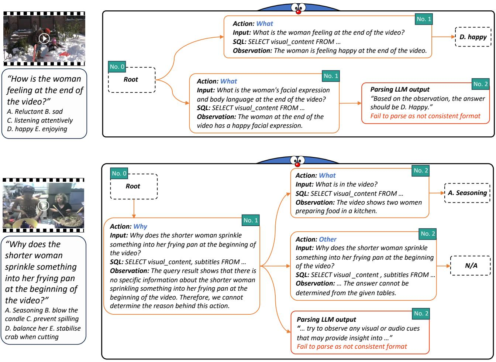

# 1. 论文基本信息

## 1.1. 标题
DoraemonGPT: Toward Understanding Dynamic Scenes with Large Language Models (Exemplified as A Video Agent)

## 1.2. 作者
Zongxin Yang, Guikun Chen, Xiaodi Li, Wenguan Wang, Yi Yang

## 1.3. 发表期刊/会议
未明确提及期刊/会议名称，但从 `ICML24` 等缩写推断，可能已被或将要被国际机器学习大会 (International Conference on Machine Learning, ICML) 接收。同时，论文作为预印本 (Preprint) 发布在 arXiv 上。

## 1.4. 发表年份
2024年（预印本发布时间：2024-01-16T14:33:09.000Z）

## 1.5. 摘要
当前，由大型语言模型 (Large Language Models, LLMs) 驱动的视觉智能体 (visual agents) 主要关注解决基于图像的任务，这限制了它们理解动态场景的能力，使其远不能应用于现实生活中的场景，例如在实验室实验中指导学生并识别他们的错误。因此，本文探索了 DoraemonGPT，一个由 LLMs 驱动的全面且概念优雅的系统，旨在理解动态场景。考虑到视频模态 (video modality) 能更好地反映现实世界场景不断变化的本质，我们将 DoraemonGPT 示例化为一个视频智能体 (video agent)。

对于给定的带有问题/任务的视频，DoraemonGPT 首先将输入视频转换为<strong>符号记忆 (symbolic memory)</strong>，用于存储与任务相关的属性。这种结构化表示允许通过精心设计的<strong>子任务工具 (sub-task tools)</strong> 进行时空查询 (spatial-temporal querying) 和推理 (reasoning)，从而得到简洁的中间结果。认识到 LLMs 在专业领域（例如，分析实验背后的科学原理）的内部知识有限，我们集成了<strong>即插即用工具 (plug-and-play tools)</strong> 来评估外部知识并处理跨不同领域的任务。此外，本文引入了一种基于<strong>蒙特卡洛树搜索 (Monte Carlo Tree Search, MCTS)</strong> 的新型 LLM 驱动的规划器 (planner)，用于探索调度各种工具的巨大规划空间。该规划器通过反向传播 (backpropagating) 结果的奖励 (reward) 迭代地寻找可行解决方案，并且可以将多个解决方案总结为改进的最终答案。我们对 DoraemonGPT 在三个基准测试和多个真实世界场景中的有效性进行了广泛评估。

## 1.6. 原文链接
https://arxiv.org/abs/2401.08392

## 1.7. PDF 链接
https://arxiv.org/pdf/2401.08392v4.pdf

# 2. 整体概括

## 2.1. 研究背景与动机

### 2.1.1. 核心问题
论文旨在解决的核心问题是：如何使基于大型语言模型 (LLMs) 的视觉智能体 (visual agents) 能够有效理解和推理<strong>动态场景 (dynamic scenes)</strong>，而不仅仅是静态图像。现有的大多数 LLM 驱动的视觉智能体主要集中于图像任务，这限制了它们在真实世界动态环境中的应用潜力。

### 2.1.2. 问题的重要性与现有挑战
理解动态场景对于许多现实生活应用至关重要，例如：
*   **教育指导:** 在实验室实验中指导学生并识别他们的错误。
*   **自主系统:** 自动驾驶汽车、机器人导航。
*   **监控:** 异常行为检测。
*   **交互式机器人:** 与人类在动态环境中进行更自然的交互。

    然而，将 LLM 驱动的智能体扩展到视频领域面临着<strong>巨大的挑战 (grand challenges)</strong>：
1.  <strong>时空推理 (Spatial-temporal Reasoning):</strong> 动态场景中实例 (instances) 之间的关系不仅涉及空间，还涉及时间，以及两者的结合。这比静态图像中的纯空间推理复杂得多。
2.  <strong>更大的规划空间 (Larger Planning Space):</strong> 视频中高级语义（如动作和意图）通常需要从时间维度上的视觉观察中推断。这会极大扩展分解动态视频任务的搜索空间。
3.  <strong>有限的内部知识 (Limited Internal Knowledge):</strong> LLMs 无法编码理解所有视频所需的全部知识，因为现实世界不断变化，且它们可能未在所有专有数据集上进行训练，导致对专业领域（如科学原理）的知识欠缺。

### 2.1.3. 论文的切入点与创新思路
论文的切入点是设计一个<strong>全面且概念优雅的 (comprehensive and conceptually elegant)</strong> 系统 DoraemonGPT，通过模拟视频智能体 (video agent) 的形式来理解动态场景。其创新思路在于：
*   **结构化记忆:** 将视频转换为结构化的<strong>符号记忆 (symbolic memory)</strong>，存储与任务相关的时空属性，而非直接将原始视频信息喂给 LLM。
*   **模块化工具:** 设计专门的<strong>子任务工具 (sub-task tools)</strong> 和<strong>知识工具 (knowledge tools)</strong>，以高效查询记忆和评估外部知识。
*   **智能规划:** 引入基于<strong>蒙特卡洛树搜索 (Monte Carlo Tree Search, MCTS)</strong> 的 LLM 驱动规划器 (planner)，以有效地探索巨大的规划空间，生成和总结多个可能的解决方案。

## 2.2. 核心贡献/主要发现

DoraemonGPT 具有三个核心能力：
1.  <strong>任务相关信息收集 (Collecting task-related information):</strong> 在推理前收集与给定任务相关的信息。通过智能体基于时空关系推理，从实例位置、动作、场景变化等信息丰富的属性中推断。只收集任务解决相关的关键信息，避免无关信息干扰 LLM。
2.  <strong>探索更优解决方案 (Exploring better solutions):</strong> 在做决策前探索多个解决方案。采用类树搜索 (tree-like search) 方法，结合蒙特卡洛树搜索 (MCTS) 来探索大型规划空间，寻找最优决策，并能从不同角度考虑任务。
3.  <strong>支持知识扩展 (Supporting knowledge extension):</strong> 能够像人类查阅参考书一样，从外部知识源（如搜索引擎、教科书、数据库等）中选择最相关的知识并进行查询，以解决领域特定问题。

    这些能力通过以下主要组件实现：
*   <strong>任务相关符号记忆 (Task-related Symbolic Memory, TSM):</strong> 将时空属性解耦为空间主导 (space-dominant) 和时间主导 (time-dominant) 记忆。LLM 先判断信息与任务的相关性，只保留有用信息，然后由基础模型提取属性并整合到可查询的 SQL 表中。
*   <strong>子任务工具 (Sub-task Tools) 和知识工具 (Knowledge Tools):</strong> 子任务工具用于高效查询 TSM 中的信息，每个工具都是一个 LLM 驱动的子智能体，能生成 SQL 查询并回答子任务问题。知识工具以即插即用 (plug-and-play) 的方式集成外部知识源，处理专业领域知识。
*   <strong>蒙特卡洛树搜索 (MCTS) 规划器 (Planner):</strong> 一种新颖的树搜索式规划器，迭代寻找可行解决方案，通过反向传播奖励并选择高可扩展节点来扩展新解决方案。最终可将多个解决方案总结为一份信息丰富的最终答案。

    主要发现和结论：
*   DoraemonGPT 在三个基准测试 (NExT-QA, TVQA+, Ref-YouTube-VOS) 和多个真实世界场景中表现出显著优于现有 LLM 驱动竞争对手 (如 ViperGPT, VideoChat) 的性能。
*   在因果 (causal)、时间 (temporal)、描述性 (descriptive) 推理和参照视频对象识别 (referring video object recognition) 方面表现出色。
*   MCTS 规划器优于朴素搜索方法和其他基线，证明了其在探索大型规划空间方面的有效性。
*   任务相关符号记忆 (TSM) 对精确识别、跟踪和分割视频中的提及对象至关重要。
*   通过消融实验验证了 TSM 的不同组件（空间主导记忆和时间主导记忆）以及 MCTS 规划器各策略的有效性。
*   DoraemonGPT 可以从更强的基础模型中获益。

# 3. 预备知识与相关工作

## 3.1. 基础概念

*   <strong>大型语言模型 (Large Language Models, LLMs):</strong> 这是一种深度学习模型，通过在海量文本数据上进行预训练而获得，能够理解、生成人类语言，并执行各种自然语言处理任务，如问答、文本摘要、翻译等。LLMs 的强大之处在于其涌现能力 (emergent capabilities)，即在训练过程中学习到复杂的模式和知识，使其能够处理超出其直接训练任务范围的复杂问题。本文中使用的 LLM 是 OpenAI 提供的 `GPT-3.5-turbo`。
*   <strong>视觉智能体 (Visual Agents):</strong> 指能够感知和理解视觉信息（如图像、视频）并基于此进行推理、规划和决策的智能系统。在 LLM 驱动的视觉智能体中，LLM 作为核心的决策和推理单元，协调不同的视觉感知工具来完成任务。
*   <strong>动态场景 (Dynamic Scenes):</strong> 指随着时间推移发生变化的环境或事件，例如视频中的人物活动、物体移动、场景转换等。与静态图像相比，动态场景包含丰富的时序信息，理解它们需要处理时间维度上的变化和交互。
*   <strong>时空推理 (Spatial-temporal Reasoning):</strong> 结合空间和时间维度进行推理的能力。在视频理解中，这意味着不仅要理解物体在哪里 (空间)，还要理解它们何时、如何移动、以及这些移动在时间上的因果关系。
*   <strong>蒙特卡洛树搜索 (Monte Carlo Tree Search, MCTS):</strong> 是一种用于决策过程的启发式搜索算法，尤其适用于具有巨大搜索空间的领域（如游戏 AI）。MCTS 通过四个阶段（选择、扩展、模拟、反向传播）来构建搜索树，并利用随机模拟的结果来评估节点的价值，从而指导搜索方向，寻找最优策略。

## 3.2. 前人工作

作者在相关工作中提到了多个方面，主要集中在多模态理解、LLM 驱动的模块化系统和带有外部记忆的 LLMs。

### 3.2.1. 多模态理解 (Multimodal Understanding)
*   **传统多模态系统:** 早期工作通常针对特定任务设计，通用性有限。例如，专门的视频问答 (Video Question Answering, VQA) 系统，或图像-语言检索系统。这些系统在各自领域表现出色，但难以泛化到更广泛的现实世界场景。
*   **通用多模态系统:** 随着数据量和计算资源的快速发展，出现了能够处理多种模态输入的通用系统。`Frozen` 等模型展示了赋予 LLMs 处理视觉输入能力的可行性。近年来，涌现出许多大型多模态模型 (Large Multimodal Models, LMMs)，如 `GPT-4`、`PaLM-E` 等。
*   <strong>零样本 (Zero-shot) 和少样本 (Few-shot) 系统:</strong> 一些工作致力于构建零样本系统，通过预训练在各种任务上表现良好，以减少对特定任务数据的依赖。
*   **结合多模型/API 的策略:** 另一种策略是将多个模型或 API 组合起来解决复杂的组合式多模态推理任务。DoraemonGPT 也采用了这种思路，但专注于动态模态。

### 3.2.2. LLM 驱动的模块化系统 (LLM-driven Modular Systems)
这一类系统利用 LLM 的强大推理能力将复杂任务分解为可管理子任务，并协调不同的模块（通常是专门的基础模型或工具）来解决这些子任务。根据推理风格，可分为两类：
*   <strong>固定路径推理 (Reasoning with fixed paths):</strong>
    *   这类方法将给定任务转换为一系列有序的子任务，每个子任务由特定模块处理。
    *   **VisProg (Gupta & Kembhavi, 2023):** 开创性地提出通过生成 Python 代码来解决复杂视觉任务，该代码调用预定义的视觉-语言模型 API。
    *   **ViperGPT (Surís et al., 2023):** 类似地，它利用代码生成模型创建子程序，通过 API 调用视觉-语言模型来解决任务。DoraemonGPT 与其进行了对比实验。
    *   **HuggingGPT (Shen et al., 2023):** 建模了许多基础模型之间的任务依赖关系。
    *   **局限性:** 这类方法通常是贪婪搜索 (greedy search) 的，一次性生成一个行动序列，如果中间结果不符合预期，就难以调整。
*   <strong>动态路径推理 (Reasoning with dynamic paths):</strong>
    *   这类方法允许在规划和执行过程中进行交互和调整，以应对中间结果的不确定性。
    *   **ReAct (Yao et al., 2022):** 结合了“推理 (Reasoning)”和“行动 (Acting)”，LLM 能够交替进行思考、采取行动、观察结果，然后根据观察结果调整后续行动。这提供了一种灵活且容错的方式。
    *   **Tree of Thoughts (Yao et al., 2023, 2024):** 探索了树状搜索空间，允许 LLM 探索多个推理路径，并回溯。DoraemonGPT 的 MCTS 规划器也借鉴了树搜索的思想。
    *   **本文的差异:** DoraemonGPT 专注于动态模态，构建了紧凑的任务相关记忆，并使用 MCTS 规划器进行更全面的解决方案探索，这在以前的 LLM 驱动模块化系统中较为罕见。许多现有工作将视频简单视为图像序列处理，或仅基于预提取信息构建聊天机器人，缺乏系统性研究。

### 3.2.3. 带有外部记忆的 LLMs (LLMs with External Memory)
为了克服 LLMs 自身上下文窗口 (context window) 的限制和内部知识的不足，外部记忆 (external memory) 成为重要的增强手段。
*   <strong>文本记忆 (Textual memory):</strong> 将长文本内容（如书籍）存储为嵌入 (embeddings)，并通过计算相似性进行检索。典型例子是 `LangChain` 中的文档问答。
*   <strong>符号记忆 (Symbolic memory):</strong> 将记忆建模为结构化表示，并使用相应的符号语言（如 SQL）进行查询。例如，用于编程语言的代码、用于 Excel 的执行命令、用于数据库的 SQL 语言。
*   **DoraemonGPT 的方法:** 吸收了记忆组织的思想，构建了一个<strong>请求相关数据库 (request-related database)</strong>，将实例感知 (instance-aware) 和实例无关 (instance-agnostic) 信息存储在独立的表中。通过明确定义基于提示模板 (prompt templates) 和 SQL 的子任务工具来检索相关信息。此外，其多源知识模块也可视为外部记忆的混合。

## 3.3. 技术演进
LLM 驱动的视觉智能体的技术演进大致可以概括为：
1.  **特定任务多模态系统:** 早期专注于解决图像或视频中的特定任务，模型设计往往与任务紧密耦合。
2.  **通用多模态基础模型:** 随着 Transformer 架构和大规模预训练的兴起，能够处理多种模态输入的通用基础模型出现，提高了跨任务的泛化能力。
3.  **LLM 驱动的模块化智能体:** 利用 LLM 的规划和推理能力，将复杂任务分解为子任务，并协调各种基础模型或工具来完成。这使得系统能够处理更复杂的、组合性的任务。
4.  **动态场景的挑战:** 尽管 LLM 驱动的智能体在静态图像任务上取得了巨大进展，但将其扩展到动态场景（视频）时，时空推理、巨大的规划空间和知识限制带来了新的挑战。

    DoraemonGPT 正是处于这一技术演进的最新阶段，旨在系统性地解决 LLM 驱动智能体在动态场景理解上的核心挑战，通过引入结构化的符号记忆和 MCTS 规划器来提升其在视频领域的性能和鲁棒性。

## 3.4. 差异化分析
DoraemonGPT 与现有 LLM 驱动的模块化系统和多模态理解方法相比，其核心区别和创新点在于：

*   **针对动态模态的专门设计:**
    *   **现有工作:** 许多现有 LLM 驱动的视觉系统主要关注静态图像任务。即使涉及视频，也常常简单地将视频视为图像序列（如 ViperGPT），或基于预提取信息构建聊天机器人（如 VideoChat），缺乏对动态场景特有复杂性的深入处理。
    *   **DoraemonGPT:** 明确将视频和任务作为一个整体考虑，深入挖掘动态模态的特性。通过解耦时空属性，构建紧凑且任务相关的<strong>符号记忆 (Symbolic Memory)</strong>，以支持更精细的时空推理。

*   <strong>结构化的任务相关符号记忆 (Task-related Symbolic Memory, TSM):</strong>
    *   **现有工作:** 常见的做法是直接将原始视觉信息（如图像特征、视频帧）或简单的文本描述作为上下文输入 LLM，或者使用基于文本嵌入 (text embedding) 的记忆检索。
    *   **DoraemonGPT:** 创新性地将视频信息抽象为结构化的、可查询的 SQL 表形式的 TSM。这种记忆不仅包含了空间主导（如实例轨迹、类别、外观、动作）和时间主导（如时间戳、音频、OCR、视频描述）的属性，而且在构建前会通过 LLM 筛选与任务相关的有用信息，避免冗余上下文对 LLM 推理的干扰，提高了信息检索的效率和准确性。

*   <strong>基于蒙特卡洛树搜索 (MCTS) 的规划器:</strong>
    *   **现有工作:** 大多数 LLM 驱动规划器采用贪婪搜索 (greedy search) 或固定路径 (fixed paths) 的方法（如 ViperGPT 的代码生成），一次性生成一个行动序列。少量工作探索了动态路径，但 MCTS 在 LLM 规划领域的应用相对较新。
    *   **DoraemonGPT:** 引入 MCTS 规划器，旨在高效探索动态场景中巨大的规划空间。MCTS 的迭代选择、扩展、模拟、反向传播机制使得规划器能够发现多个潜在的解决方案，并从中总结出更优的最终答案，这对于开放式问题和复杂任务至关重要。这克服了贪婪搜索可能陷入局部最优的缺点。

*   <strong>即插即用 (Plug-and-play) 的知识工具:</strong>
    *   **现有工作:** 一些系统通过搜索或预定义知识库来扩展 LLM 的知识。
    *   **DoraemonGPT:** 提供了一个模块化的框架，可以轻松集成多种外部知识源（符号知识、文本知识、网络知识）。这使得系统能够应对 LLM 内部知识不足的领域特定问题，提高了系统的通用性和专业性。

*   <strong>子任务工具 (Sub-task Tools) 的精细设计:</strong>
    *   **现有工作:** 通常通过提示工程 (prompt engineering) 来引导 LLM 使用通用工具。
    *   **DoraemonGPT:** 设计了一系列专门的、LLM 驱动的子任务工具（如“When”、“Why”、“What”），每个工具针对不同类型的时空推理问题，能够生成精确的 SQL 查询来高效地从 TSM 中提取信息，进一步精炼了 LLM 的工具使用策略。

        这些创新共同使得 DoraemonGPT 在理解和推理动态视频任务方面取得了显著的性能提升，尤其是在处理因果、时间、描述性推理和参照视频对象分割等复杂问题上。

# 4. 方法论

## 4.1. 方法原理
DoraemonGPT 的核心思想是构建一个 LLM 驱动的智能体，专门用于理解动态视频场景。它通过**结构化记忆**来高效表示视频内容，通过**模块化工具**来扩展 LLM 的感知和知识边界，并通过<strong>蒙特卡洛树搜索 (MCTS) 规划器</strong>来智能地探索复杂任务的解决方案空间。

其整体工作流程如下：
1.  **输入接收:** 接收一个视频 ($V$) 和一个文本形式的问题/任务 ($Q$)。
2.  **任务分析与记忆构建:** DoraemonGPT 首先分析问题 $Q$ 的类型，并根据任务需求从视频 $V$ 中提取相关的时空属性，构建<strong>任务相关符号记忆 (Task-related Symbolic Memory, TSM)</strong>。
3.  **规划与工具调度:** 采用<strong>蒙特卡洛树搜索 (MCTS) 规划器</strong>。该规划器根据 $Q$ 自动调度一系列工具：
    *   **子任务工具:** 用于查询 TSM 中的结构化视频信息。
    *   **知识工具:** 用于访问外部知识源，弥补 LLM 内部知识的不足。
    *   **其他实用工具:** 如视频修复等视觉任务工具。
4.  **探索与解决方案生成:** MCTS 规划器迭代探索巨大的规划空间，生成多个可能的行动序列或解决方案。
5.  **结果总结:** 将多个解决方案进行汇总或投票，生成一个信息更丰富、更准确的最终答案。

    整个系统旨在将复杂的动态视频任务分解为可管理的子任务，并以高效、灵活和可扩展的方式解决它们。

## 4.2. 核心方法详解

### 4.2.1. 任务相关符号记忆 (Task-related Symbolic Memory, TSM)

**原理:** 视频是复杂的动态数据，包含大量的时空关系。但对于一个特定的问题 $Q$，通常只有视频中的一部分相关属性对于解决问题至关重要。直接将大量原始视频数据输入 LLM 会导致上下文过长，可能分散 LLM 的注意力或导致关键信息遗漏。因此，DoraemonGPT 提出在解决问题前，提取并存储与 $Q$ 相关的所有潜在有用视频信息到 TSM 中。

**TSM 构建:**
1.  **任务类型选择:** 使用简单的上下文学习 (in-context learning) 方法，通过 LLM 根据问题 $Q$ 来选择 TSM 的任务类型。LLM 被提示预测一个格式为 `"Action: <TSM_type> construction..."` 的 TSM 类型。
2.  **属性提取与存储:** 一旦确定了 TSM 类型，对应的 API 将被调用，利用基础模型 (Foundation Models) 提取与任务相关的属性，并将它们存储在一个 SQL 表中。这个 SQL 表可以通过符号语言（即 SQL 语言）进行访问。

    **TSM 类型:** DoraemonGPT 基于视频表示学习中广泛应用的时空解耦 (spatial-temporal decoupling) 视角，设计了两种记忆类型：

*   <strong>空间主导记忆 (Space-dominant memory):</strong>
    *   **目的:** 主要用于处理与特定目标（如人物、动物）或其空间关系相关的问题。
    *   **属性:** 使用多对象跟踪 (multi-object tracking) 方法检测和跟踪视频中的实例 (instances)。每个实例具有以下属性：
        *   `ID number`: 分配给实例的唯一 ID。
        *   `Category`: 实例的类别（例如，人）。使用的模型包括 YOLOv8 (Jocher et al., 2023) 或 Grounding DINO (Liu et al., 2023c)。
        *   `Trajectory`: 实例在每一帧的边界框 (bounding box)。使用的模型包括 Deep OC-Sort (Maggiolino et al., 2023) 或 DeAOT (Yang & Yang, 2022)。
        *   `Segmentation`: 实例在每一帧的分割掩码 (segmentation mask)。使用的模型包括 YOLOv8-Seg (Jocher et al., 2023) 或 DeAOT (Yang & Yang, 2022)。
        *   `Appearance`: 实例外观的描述。使用的模型包括 BLIP (Li et al., 2022) 或 BLIP-2 (Li et al., 2023a)。
        *   `Action`: 实例执行的动作。使用的模型是 InternVideo (Wang et al., 2022)。
*   <strong>时间主导记忆 (Time-dominant memory):</strong>
    *   **目的:** 侧重于构建视频的与时间相关的综合信息，需要理解整个视频的内容。
    *   **属性:** 存储的属性包括：
        *   `Timestamp`: 帧/片段的时间戳。
        *   `Audio content`: 视频的语音识别 (Speech Recognition) 结果。使用的模型是 Whisper (Radford et al., 2023)。
        *   `Optical content`: 视频的光学字符识别 (Optical Character Recognition, OCR) 结果。使用的模型是 PaddleOCR (PaddlePaddle, 2023)。
        *   `Captioning`: 帧级别 (frame-level) 或片段级别 (clip-level) 的视频内容描述。使用的模型包括 BLIP (Li et al., 2022)、BLIP-2 (Li et al., 2023a) 或 InstructBlip (Dai et al., 2023)。

            以下是原文 Table 1 提供的 TSM 属性类型及其对应的提取模型：

            <table><thead><tr><th rowspan="1">Attribute</th><th rowspan="1">Used Model</th><th rowspan="1">Explanation</th></tr></thead><tbody><tr><td rowspan="1" colspan="3">Space-dominant Memory</td></tr><tr><td rowspan="1">ID number</td><td></td><td rowspan="1">A unique ID assigned to an instance</td></tr><tr><td rowspan="1">Category</td><td rowspan="1">YOLOv8 (Jocher et al., 2023)/Grounding DINO (Liu et al., 2023c)</td><td rowspan="1">The category of an instance, e.g., person</td></tr><tr><td rowspan="1">Trajectory</td><td rowspan="1">Deep OC-Sort (Maggiolino et al., 2023)/DeAOT (Yang &amp; Yang, 2022)</td><td rowspan="1">An instance's bounding box in each frame</td></tr><tr><td rowspan="1">Segmentation</td><td rowspan="1">YOLOv8-Seg (Jocher et al., 2023)/DeAOT (Yang &amp; Yang, 2022)</td><td rowspan="1">An instance's segmentation mask in each frame</td></tr><tr><td rowspan="1">Appearance</td><td rowspan="1">BLIP (Li et al., 2022) / BLIP-2 (Li et al., 2023a)</td><td rowspan="1">A description of an instance's appearance</td></tr><tr><td rowspan="1">Action</td><td rowspan="1">Intern Video (Wang et al., 2022)</td><td rowspan="1">The action of an instance</td></tr><tr><td rowspan="1" colspan="3">Time-dominant Memory</td></tr><tr><td rowspan="1">Timestamp</td><td></td><td rowspan="1">The timestamp of a frame/clip</td></tr><tr><td rowspan="1">Audio content</td><td rowspan="1">Whisper (Radford et al., 2023)</td><td rowspan="1">Speech recognition results of the video</td></tr><tr><td rowspan="1">Optical content</td><td rowspan="1">OCR (PaddlePaddle, 2023)</td><td rowspan="1">Optical character recognition results of the video</td></tr><tr><td rowspan="1">Captioning</td><td rowspan="1">BLIP (Li et al., 2022)/BLIP-2 (Li et al., 2023a)/InstructBlip (Dai et al., 2023)</td><td rowspan="1">Frame-level/clip-level captioning results</td></tr></tbody></table>

### 4.2.2. 子任务工具 (Sub-task Tools)
**原理:** 为了压缩规划器的上下文/文本长度并提高效率，DoraemonGPT 通过设计一系列子任务工具来简化记忆信息查询。这些工具能够响应子任务问题，并从 TSM 中提取所需信息。

**机制:**
*   **LLM 驱动的子智能体:** 每个子任务工具都是一个独立的 LLM 驱动子智能体。它根据任务特定的提示 (prompts) 和示例，生成 SQL 语句来查询 TSM，并回答给定的子任务问题。
*   **工具调用:** LLM 驱动的规划器通过工具的上下文描述来学习其功能，然后解析由 LLM 生成的命令来调用 API，例如 `"Action: tool_name]. Input:video_name>#(sub_question..."`。

    **工具类型:** 为了与空间主导记忆和时间主导记忆协同工作，设计了以下类型的子任务工具：
*   **When:** 与时间理解相关，例如“When the dog walks past by the sofa?”（狗何时走过沙发？）
*   **Why:** 与因果推理相关，例如“Why did the lady shake the toy?”（女士为何摇晃玩具？）
*   **What:** 描述所需信息，例如“What's the name of the experiment?”（实验名称是什么？）
*   **How:** 描述方式、手段或质量，例如“How does the baby keep himself safe?”（婴儿如何保护自己？）
*   **Count:** 计数，例如“How many people in the room?”（房间里有多少人？）
*   **Other:** 处理不属于上述工具的问题，例如“Who slides farther at the end?”（最后谁滑得更远？）

### 4.2.3. 知识工具及其他 (Knowledge Tools and Others)
**原理:** 在处理复杂问题时，仅依靠视频理解和 LLM 隐式学习的知识可能不足以做出准确决策。因此，DoraemonGPT 支持集成外部知识源，以帮助 LLM 理解输入视频/问题中的专业内容。

**机制:**
*   **即插即用集成:** 知识源以即插即用方式集成，每个知识源对应一个独立的知识工具。
*   **组成:** 类似于子任务工具，知识工具包含两部分：
    1.  <strong>上下文知识描述 (in-context knowledge description):</strong> 描述给定知识源。
    2.  <strong>API 函数 (API function):</strong> 通过问答方式从知识源查询信息。

        **API 函数类型:** 涵盖不同类型的知识：
*   <strong>符号知识 (Symbolic knowledge):</strong> 指以结构化格式呈现的信息，如 Excel 或 SQL 表。API 函数是一个符号问答子智能体，类似于子任务工具。
*   <strong>文本知识 (Textual knowledge):</strong> 指通过自然语言文本表达的知识，如研究论文、参考书籍等。API 函数基于文本嵌入 (text embedding) 和搜索构建。
*   <strong>网络知识 (Web knowledge):</strong> 指从互联网搜索的知识。API 函数是搜索引擎 API，如 Google、Bing 等。

    **其他工具:** DoraemonGPT 还支持集成通用的实用工具，如视频编辑和修复，以帮助完成专门的视觉任务。

### 4.2.4. 蒙特卡洛树搜索 (Monte Carlo Tree Search, MCTS) 规划器

**原理:** 传统的 LLM 驱动规划器（如 `ReAct`）通常采用贪婪搜索 (greedy search) 方式，生成一个行动序列并逐步执行。这可以看作是探索树状搜索空间中的一条根到叶路径。然而，对于动态场景这种大型规划空间，单一尝试可能无法得到正确结果，或者存在更好的解决方案。MCTS 规划器旨在高效探索这个大型规划空间，通过迭代的方式寻找多个可行解决方案，并最终总结出一个信息更丰富的答案。

**MCTS 结构:**
*   **节点定义:**
    *   <strong>根节点 ($v_0$):</strong> 初始问题输入 $Q$。
    *   **非根节点:** 代表一个行动或工具调用，形式为 (思想 `thought`, 行动 `action`, 行动输入 `action input`, 观察 `observation`)，遵循 `ReAct` 风格。
    *   <strong>叶节点 (leaf node):</strong> 包含最终答案的节点。
*   **迭代过程:** 规划器迭代执行以下四个阶段 $N$ 次，产生 $N$ 个解决方案：

1.  <strong>节点选择 (Node Selection):</strong>
    *   **目的:** 每次迭代开始时，选择一个可扩展的节点作为新的规划起点。
    *   **机制:**
        *   第一次迭代只选择根节点 $v_0$。
        *   后续迭代，根据采样概率 $P(v_i)$ 随机选择一个非叶节点。
        *   采样概率公式：
            $P(v_i) = \mathrm{Softmax}(R_i)$
            其中，$R_i$ 是节点 $v_i$ 的奖励值，初始为 0，并在奖励反向传播阶段更新。奖励值越高的节点被选中的概率越大。

2.  <strong>分支扩展 (Branch Expansion):</strong>
    *   **目的:** 在选定的可扩展节点下添加一个子节点，创建一个新的分支，以探索新的解决方案路径。
    *   **机制:** 为了鼓励 LLM 生成与现有子节点不同的新工具调用，将历史工具行动 (historical tool actions) 作为上下文加入到 LLM 的提示中，并指示 LLM 做出不同的选择。这个上下文提示在随后的链式执行中会被移除。

3.  <strong>链执行 (Chain Execution):</strong>
    *   **目的:** 在新扩展的分支上，使用逐步的 LLM 驱动规划器生成一个新的解决方案。
    *   **机制:** 遵循 `ReAct` (Yao et al., 2022) 风格，执行过程由一系列工具调用步骤/节点组成，直到获得最终答案或遇到执行错误而终止。

4.  <strong>奖励反向传播 (Reward Back-propagation):</strong>
    *   **目的:** 在获得叶节点（结果）$v_l$ 后，将其奖励值逐步传播回其祖先节点，直到根节点 $v_0$，以更新节点的价值。
    *   **奖励类型:**
        *   <strong>失败 (Failure):</strong> 规划器产生意外结果，例如工具调用失败或结果格式不正确。此时，叶节点 $v_l$ 的奖励 $R_{v_l}$ 被设置为负值（例如 `-1`）。
        *   <strong>非失败 (Non-failure):</strong> 规划器成功产生结果，但不确定结果是否正确。此时，叶节点 $v_l$ 的奖励 $R_{v_l}$ 被设置为正值（例如 `1`）。
    *   **反向传播函数:** 假设 $\alpha$ 是一个正的基础奖励，则 $R_{v_l} = \pm \alpha$ 分别对应非失败和失败情况。为了体现距离叶节点越近的节点对结果影响越大，奖励反向传播时会考虑衰减。
        $$
        R_{v_i} \leftarrow R_{v_i} + R_{v_l} e^{\beta(1 - d(v_i, v_l))}
        $$
        其中：
        *   $R_{v_i}$: 祖先节点 $v_i$ 当前的奖励值。
        *   $R_{v_l}$: 叶节点 $v_l$ 的奖励值（$\pm \alpha$）。
        *   $e$: 自然对数的底数。
        *   $\beta$: 控制奖励衰减率的超参数。
        *   $d(v_i, v_l)$: 节点 $v_i$ 和叶节点 $v_l$ 之间的节点距离（即路径上的步数）。
        *   公式中的 $1 - d(v_i, v_l)$ 意味着距离越近 ($d(v_i, v_l)$ 越小)，指数越大，衰减因子 $e^{\beta(\cdot)}$ 越大，传递的奖励越多；距离越远，衰减越多。
    *   **超参数影响:** 设置更高的 $\alpha / \beta$ 将增加扩展节点接近非失败答案叶节点的概率。

**最终答案总结:**
*   MCTS 迭代结束后，规划器最多会产生 $N$ 个非失败答案。
*   对于开放式问题，可以使用 LLM 总结所有答案以生成一个信息丰富的最终答案。
*   对于单选/多选题，可以通过投票过程确定最终答案。

    这个 MCTS 规划器能够有效处理动态时空任务，全面探索多个潜在解决方案，并通过多源知识扩展其专业能力。

下图（原文 Figure 2）展示了 DoraemonGPT 的系统概览，以及 MCTS 规划器的工作方式：

*该图像是一个示意图，展示了DoraemonGPT系统如何处理视频输入和任务。通过任务相关的符号记忆构建，系统能够进行空间和时间主导的查询，引导用户获取实验步骤和科学原理的描述。使用蒙特卡洛树搜索规划器，该系统能够生成有效的解决方案并总结结果。*

图示中，DoraemonGPT 系统能够利用各种工具将复杂的动态视频任务分解为子任务并解决。给定视频 `(V)` 和文本任务/问题 `(Q)`，DoraemonGPT 首先根据 $Q$ 的任务分析从 $V$ 中提取<strong>任务相关符号记忆 (TSM)</strong>。接下来，利用<strong>蒙特卡洛树搜索 (MCTS) 规划器</strong>，DoraemonGPT 自动调度工具集，用于查询符号记忆、访问外部知识和调用其他实用工具（如视频修复），以解决问题 $Q$。最终，规划器探索了大型规划空间，返回多个可能的答案，并总结出一个改进的答案。

下图（原文 Figure 3）展示了 MCTS 规划器的具体流程：

*该图像是示意图，展示了基于蒙特卡罗树搜索的规划过程，包括节点选择、分支扩展、链执行和回传四个步骤。各步骤以树状结构呈现，标注了不同动作的奖励值 $R$。*

图示中，MCTS 规划器迭代地执行四个阶段：节点选择、分支扩展、链执行和奖励反向传播。它探索 $N$ 个可行解决方案，这些解决方案可以进一步总结为信息丰富的答案。

# 5. 实验设置

## 5.1. 数据集
为了全面验证算法的实用性，DoraemonGPT 在三个数据集上进行了实验，这些数据集涵盖了常见的动态场景，包括视频问答 (Video Question Answering, VQA) 和参照视频对象分割 (Referring Video Object Segmentation, RVOS) 任务。

*   **NExT-QA (Xiao et al., 2021):**
    *   **内容:** 包含 34,132 个训练样本和 4,996 个验证样本的视频-问题对。
    *   **特点:** 每个问题都标注了问题类型（因果 `causal` / 时间 `temporal` / 描述性 `descriptive`）和 5 个候选答案。
    *   **用途:** 用于消融研究时，从训练集中每个类型随机抽取 30 个样本（总共 90 个问题）。验证集用于方法比较。
    *   **领域:** 视频问答。

*   **TVQA+ (Lei et al., 2020):**
    *   **内容:** 是 TVQA (Lei et al., 2018) 数据集的增强版本，增加了 310.8K 个边界框，用于将问题和答案中的视觉概念与视频中描绘的对象关联起来。
    *   **用途:** 评估时，从验证集中随机抽取 900 个样本（s_val），总共 900 个问题，与 (Gupta & Kembhavi, 2023) 的设置相同。
    *   **领域:** 视频问答，强调时空定位。

*   **Ref-YouTube-VOS (Seo et al., 2020):**
    *   **内容:** 一个大规模的参照视频对象分割数据集，包含约 15,000 个参照表达式 (referential expressions) 和超过 3,900 个视频，涵盖了多样化的场景。
    *   **用途:** 使用其验证集（包括 202 个视频和 834 个带有表达式的对象）来验证像素级时空分割的有效性。
    *   **领域:** 参照视频对象分割。

## 5.2. 评估指标

*   <strong>视频问答 (Video Question Answering, VQA) 任务:</strong>
    *   **NExT-QA 数据集:**
        *   <strong>准确率 (Accuracy, Acc):</strong> 采用标准的 top-1 准确率。它衡量模型预测的答案与真实答案相符的比例。
        *   <strong>分类型准确率 (Type-specific Accuracy):</strong>
            *   $\mathrm{Acc_C}$: 因果问题 (causal questions) 的准确率。
            *   $\mathrm{Acc_T}$: 时间问题 (temporal questions) 的准确率。
            *   $\mathrm{Acc_D}$: 描述性问题 (descriptive questions) 的准确率。
            *   $\mathrm{Avg}$: $\mathrm{Acc_C}$、$\mathrm{Acc_T}$ 和 $\mathrm{Acc_D}$ 的平均值。
            *   $\mathrm{Acc_A}$: 所有问题的总体准确率。
        *   **概念定义:** 准确率是正确预测样本数占总样本数的比例，用于衡量分类任务中模型预测的正确性。
        *   **数学公式:**
            $$
            \mathrm{Accuracy} = \frac{\text{Number of Correct Predictions}}{\text{Total Number of Predictions}}
            $$
        *   **符号解释:**
            *   $\text{Number of Correct Predictions}$: 模型正确回答的问题数量。
            *   $\text{Total Number of Predictions}$: 模型回答的总问题数量。

*   <strong>参照视频对象分割 (Referring Video Object Segmentation, RVOS) 任务:</strong>
    *   **Ref-YouTube-VOS 数据集:** 性能在官方挑战服务器上评估。
    *   <strong>区域相似度 ($\mathcal{J}$, Region Similarity):</strong> 通常指 Jaccard 指数 (Jaccard Index)，也称为交并比 (Intersection over Union, IoU)。它衡量预测分割掩码与真实分割掩码之间的重叠程度。
        *   **概念定义:** Jaccard 指数量化了两个集合（这里是预测区域和真实区域）之间的相似性和多样性，数值越高表示重叠度越好。
        *   **数学公式:**
            $$
            \mathcal{J} = \frac{|S_p \cap S_{gt}|}{|S_p \cup S_{gt}|}
            $$
        *   **符号解释:**
            *   $S_p$: 模型预测的分割区域。
            *   $S_{gt}$: 真实标注的分割区域 (Ground Truth)。
            *   $\cap$: 集合交集操作。
            *   $\cup$: 集合并集操作。
            *   $|\cdot|$: 集合的基数（元素数量，在此指像素数量）。
    *   <strong>轮廓准确率 ($\mathcal{F}$, Contour Accuracy):</strong> 通常指 F-measure，衡量预测分割掩码的边界与真实掩码边界的匹配程度。它通常结合了精确率 (Precision) 和召回率 (Recall)。
        *   **概念定义:** F-measure 是精确率和召回率的调和平均值，用于评估预测边界与真实边界的匹配程度。
        *   **数学公式:**
            $$
            \mathcal{F} = \frac{2 \times \text{Precision} \times \text{Recall}}{\text{Precision} + \text{Recall}}
            $$
            其中，Precision 和 Recall 定义如下：
            $$
            \text{Precision} = \frac{\text{True Positives}}{\text{True Positives} + \text{False Positives}}
            $$
            $$
            \text{Recall} = \frac{\text{True Positives}}{\text{True Positives} + \text{False Negatives}}
            $$
        *   **符号解释:**
            *   $\text{True Positives}$: 正确识别的边界像素点。
            *   $\text{False Positives}$: 错误识别为边界的像素点。
            *   $\text{False Negatives}$: 未能识别的真实边界像素点。
            *   $\text{Precision}$: 预测为边界的像素中有多少是真正的边界。
            *   $\text{Recall}$: 真实边界像素中有多少被模型正确识别。
    *   <strong>综合指标 ($\mathcal{J}\&amp;\mathcal{F}$):</strong> 是区域相似度 ($\mathcal{J}$) 和轮廓准确率 ($\mathcal{F}$) 的平均值。

## 5.3. 对比基线
DoraemonGPT 与多种基线模型进行了比较，包括顶级的有监督 VQA 模型、LLM 驱动的视觉智能体和参照视频对象分割模型。

*   <strong>NExT-QA 和 TVQA+ (视频问答):</strong>
    *   **有监督 VQA 模型:**
        *   HME (Fan et al., 2019): CVPR19
        *   VQA-T (Yang et al., 2021a): ICCV21
        *   ATP (Buch et al., 2022): CVPR22
        *   VGT (Xiao et al., 2022): ECCV22 CVPR23
        *   MIST (Gao et al., 2023b): ICCV23 (被认为是之前的 SOTA)
    *   **LLM 驱动的智能体:**
        *   ViperGPT (Surís et al., 2023): arXiv23 (通过代码生成解决任务的智能体，本文对其进行了重新实现并配备了 `DeAOT` 以支持对象跟踪和分割)
        *   VideoChat (Li et al., 2023b): (端到端的聊天中心视频理解系统)

*   <strong>Ref-YouTube-VOS (参照视频对象分割):</strong>
    *   **有监督 RVOS 模型:**
        *   CMSA (Ye et al., 2019): CVPR19
        *   URVOS (Seo et al., 2020): ECCV20
        *   VLT (Ding et al., 2021): ICCV21
        *   ReferFormer (Wu et al., 2022a): CVPR22
        *   SgMg (Miao et al., 2023): ICCV23
        *   OnlineRefer (Wu et al., 2023b): ICCV23 (被认为是之前的 SOTA)
    *   **LLM 驱动的智能体:**
        *   ‡ViperGPT (Surís et al., 2023): ICCV23 (同样是重新实现的版本)

## 5.4. 实施细节
*   **LLM 核心:** 使用 OpenAI 提供的 `GPT-3.5-turbo` API 作为核心 LLM。
*   <strong>基础模型 (Foundation Models) 用于 TSM 构建:</strong>
    *   <strong>视频描述 (Captioning):</strong> BLIP (Li et al., 2022)、BLIP-2 (Li et al., 2023a)、InstructBlip (Dai et al., 2023)。
    *   <strong>对象跟踪 (Object Tracking):</strong> YOLOv8 (Jocher et al., 2023) 和 Deep OC-Sort (Maggiolino et al., 2023)。
    *   <strong>光学字符识别 (OCR):</strong> PaddleOCR (PaddlePaddle, 2023)。
    *   <strong>动作识别 (Action Recognition):</strong> InternVideo (Wang et al., 2022)。
    *   <strong>语音识别 (ASR):</strong> Whisper (Radford et al., 2023)。
*   **学习设置:** 实验在<strong>上下文学习 (in-context learning, ICL)</strong> 设置下进行，这意味着模型通过少量示例直接在推理时进行学习，而不是通过梯度更新进行训练。
*   **外部知识:** 在定量或定性比较中，为了确保公平性，不使用外部知识工具。

## 5.5. 超参数
*   <strong>奖励反向传播 (Reward Back-propagation) 参数 ($\alpha, \beta$):</strong>
    *   基础奖励 (base reward) $\alpha = 1$。
    *   衰减率 (decay rate) $\beta = 0.5$。
*   <strong>答案候选数量 ($N$):</strong>
    *   对于 VQA 实验，探索 $N = 2$ 个解决方案在准确率和成本之间取得了较好的权衡。

# 6. 实验结果与分析

## 6.1. 核心结果分析

### 6.1.1. 零样本视频问答 (Zero-shot Video Question Answering)

**NExT-QA 数据集:**
以下是原文 Table 2a 的结果，展示了 DoraemonGPT 与几种顶级有监督 VQA 模型和 LLM 驱动系统在 NExT-QA 数据集上的比较。

<table><thead><tr><th rowspan="1"></th><th rowspan="1">Method</th><th rowspan="1">Pub.</th><th rowspan="1">Accc</th><th rowspan="1">Acct</th><th rowspan="1">AccD</th><th rowspan="1">Avg AccA</th></tr></thead><tbody><tr><td rowspan="4">20</td><td>HME (Fan et al., 2019)</td><td>CVPR19</td><td>46.2</td><td>48.2</td><td>58.3</td><td>50.9</td><td>48.7</td></tr><tr><td>VQA-T (Yang et al., 2021a)</td><td>ICCV21</td><td>41.7</td><td>44.1</td><td>60.0</td><td>48.6</td><td>45.3</td></tr><tr><td>ATP (Buch et al., 2022)</td><td>CVPR22</td><td>53.1</td><td>50.2</td><td>66.8</td><td>56.7</td><td>54.3</td></tr><tr><td>VGT (Xiao et al., 2022)</td><td>ECCV22 CVPR23</td><td>52.3</td><td>55.1</td><td>64.1</td><td>57.2</td><td>55.0</td></tr><tr><td rowspan="4">2</td><td>MIST (Gao et al., 2023b)</td><td>ICCV23</td><td>54.6</td><td>56.6</td><td>41.0</td><td>66.9</td><td>62.3</td><td>59.3</td><td>57.2</td></tr><tr><td>†ViperGPT (Surís et al., 2023)</td><td>arXiv23</td><td>43.2</td><td></td><td>49.4</td><td>45.5</td></tr><tr><td>VideoChat (Li et al., 2023b)</td><td></td><td>50.2</td><td>47.0</td><td>65.7</td><td>52.5</td><td>51.8</td></tr><tr><td>DoraemonGPT (Ours)</td><td>ICML24</td><td>54.7</td><td>50.4</td><td>70.3</td><td>54.7</td><td>55.7</td></tr></tbody></table>

**分析:**
*   **与有监督模型比较:** DoraemonGPT 取得了与最近提出的有监督模型具有竞争力的性能。特别是在<strong>描述性问题 ($\mathrm{Acc_D}$)</strong> 上，它甚至超越了之前的 SOTA 模型 MIST (70.3 vs 66.9)。这表明 DoraemonGPT 的任务相关符号记忆 (TSM) 能够为推理提供足够的信息。
*   **与 LLM 驱动竞争对手比较:** DoraemonGPT 显著优于 ViperGPT 和 VideoChat。
    *   相较于 ViperGPT，DoraemonGPT 在 $\mathrm{Acc_C}$、$\mathrm{Acc_T}$、$\mathrm{Acc_D}$ 和 $\mathrm{Acc_A}$ 上分别提升了 11.5、9.4、8.0 和 10.2 个百分点。
    *   相较于 VideoChat，DoraemonGPT 在 $\mathrm{Acc_C}$、$\mathrm{Acc_T}$、$\mathrm{Acc_D}$ 和 $\mathrm{Acc_A}$ 上分别提升了 4.5、3.4、4.6 和 3.9 个百分点。
*   **MCTS 规划器的有效性:** 这些结果表明，DoraemonGPT 的 MCTS 规划器结合 TSM 的有效性。
*   **时间问题:** 在时间问题上，有监督模型略优于 DoraemonGPT，这可能归因于它们为这类问题学习了专门的底层模式。

**TVQA+ 数据集:**
以下是原文 Figure 5 的柱状图，展示了 DoraemonGPT 与 ViperGPT 和 VideoChat 在 TVQA+ 数据集上的 Top-1 准确率比较。

**分析:**

*   DoraemonGPT 的准确率为 40.3%，再次确认了其优越性。
*   DoraemonGPT 分别比 ViperGPT 提升了 10.2%，比 VideoChat 提升了 5.9%。
*   ViperGPT (30.1%) 的性能较低，这与 NExT-QA 数据集上的发现一致，再次表明其可能不擅长处理动态视频。

### 6.1.2. 零样本参照对象分割 (Zero-shot Referring Object Segmentation)

**Ref-YouTube-VOS 数据集:**
以下是原文 Table 2b 的结果，展示了 DoraemonGPT 与最先进的有监督参照视频对象分割模型和 LLM 驱动智能体在 Ref-YouTube-VOS 数据集上的比较。

<table><thead><tr><th rowspan="1"></th><th rowspan="1">Method</th><th rowspan="1">Pub.</th><th rowspan="1">J</th><th rowspan="1">F</th><th rowspan="1">J&amp;F</th></tr></thead><tbody><tr><td>Sde</td><td>CMSA (Ye et al., 2019)</td><td>CVPR19</td><td>36.9</td><td>43.5</td><td>40.2</td></tr><tr><td></td><td>URVOS (Seo et al., 2020)</td><td>ECCV20</td><td>47.3</td><td>56.0</td><td>51.5</td></tr><tr><td></td><td>VLT (Ding et al., 2021)</td><td>ICCV21</td><td>58.9</td><td>64.3</td><td>61.6</td></tr><tr><td></td><td>ReferFormer (Wu et al., 2022a)</td><td>CVPR22</td><td>58.1</td><td>64.1</td><td>61.1</td></tr><tr><td></td><td>SgMg (Miao et al., 2023)</td><td>ICCV23</td><td>60.6</td><td>66.0</td><td>63.3</td></tr><tr><td></td><td>OnlineRefer (Wu et al., 2023b)</td><td>ICCV23</td><td>61.6</td><td>67.7</td><td>64.8</td></tr><tr><td>A</td><td>‡ViperGPT (Surís et al., 2023)</td><td>ICCV23</td><td>24.7</td><td>28.5</td><td>26.6</td></tr><tr><td></td><td>DoraemonGPT (Ours)</td><td>ICML24</td><td>63.9</td><td>67.9</td><td>65.9</td></tr></tbody></table>

**分析:**
*   DoraemonGPT 实现了 65.9% 的 $\mathcal{J}\&\mathcal{F}$ 评分，显著超越了所有有监督模型，包括最新的 OnlineRefer (64.8%)。这尤其令人印象深刻，因为 DoraemonGPT 是在<strong>没有在 Ref-YouTube-VOS 数据集上进行学习 (without learning on Ref-YouTube-VOS)</strong> 的情况下实现的。
*   相较于竞争对手 ViperGPT (26.6%)，DoraemonGPT 的性能优势巨大。ViperGPT 的低性能归因于缺乏精心设计的视频信息记忆，导致无法准确地定位或跟踪参照对象。
*   这进一步证明了构建符号视频记忆对于参照视频对象分割任务的必要性。

    以下是原文 Figure 4 的图像，展示了 DoraemonGPT 与 ViperGPT 在参照视频对象分割任务上的视觉结果对比。

    
    **分析:**

*   DoraemonGPT 在识别、跟踪和分割用户提及的参照对象方面展现出更高的准确性。
*   相比之下，ViperGPT 出现了失败案例，其识别出的对象未能完全匹配语义和描述性方面。

### 6.1.3. 真实世界场景示例 (In-the-wild Example)
论文指出 DoraemonGPT 展现了多功能技能，例如检查实验操作、视频理解和视频编辑。它能够通过探索多个推理路径和利用外部资源来处理复杂问题，提供全面的答案。更多细节见附录 A.2。

## 6.2. 消融实验/参数分析

### 6.2.1. NExT-QA 上的诊断实验
以下是原文 Table 3 的结果，展示了 DoraemonGPT 在 NExT-QA 数据集上进行的一系列消融实验。

(a) 核心组件（任务相关符号记忆）

<table><thead><tr><th rowspan="1">TDM</th><th rowspan="1">SDM</th><th rowspan="1">Accc</th><th rowspan="1">Acct</th><th rowspan="1">AccD</th><th rowspan="1">AccA</th></tr></thead><tbody><tr><td>✓</td><td></td><td>63.3</td><td>26.7</td><td>53.3</td><td>47.8</td></tr><tr><td></td><td>✓</td><td>23.3</td><td>34.0</td><td>46.7</td><td>34.7</td></tr><tr><td>✓</td><td>✓</td><td>96.7</td><td>46.7</td><td>53.3</td><td>65.7</td></tr></tbody></table>

<strong>分析 (任务相关符号记忆):</strong>
*   <strong>仅时间主导记忆 (TDM):</strong> 在时间问题上表现较好 (26.7%)，但在因果和描述性问题上相对较弱。
*   <strong>仅空间主导记忆 (SDM):</strong> 在因果问题上表现不佳 (23.3%)，但在描述性问题上提供了一些相关信息 (46.7%)。
*   **结合 TDM 和 SDM:** 完整的系统（同时使用 TDM 和 SDM）实现了最佳性能 (AccA 达到 65.7%)。
*   **结论:** 结果证实了动态查询两种类型的符号记忆的必要性。TDM 更适用于时间问题，而 SDM 为描述性问题提供了相关信息。

    (b) 视频描述模型

    <table><thead><tr><th rowspan="1">Models</th><th rowspan="1">Accc</th><th rowspan="1">Acct</th><th rowspan="1">AccD</th><th rowspan="1">AccA</th></tr></thead><tbody><tr><td>BLIP-2</td><td>51.4</td><td>45.5</td><td>63.3</td><td>51.2</td></tr><tr><td>InstructBlip</td><td>54.7</td><td>50.4</td><td>70.3</td><td>55.7</td></tr></tbody></table>

<strong>分析 (视频描述模型的影响):</strong>
*   使用经过指令微调 (instruction tuning) 的 `InstructBLIP` 模型作为视频描述工具时，DoraemonGPT 的性能优于使用 `BLIP-2`。
*   **结论:** 这表明 DoraemonGPT 能够从更强大的基础模型中获益，预示着未来随着基础模型的发展，其性能仍有提升空间。

    (c) 答案候选数量 ($N$)

    <table><thead><tr><th rowspan="1">N</th><th rowspan="1">Accc</th><th rowspan="1">Acct</th><th rowspan="1">AccD</th><th rowspan="1">AccA</th></tr></thead><tbody><tr><td>1</td><td>63.3</td><td>20.0</td><td>46.7</td><td>43.3</td></tr><tr><td>2</td><td>80.0</td><td>43.3</td><td>46.7</td><td>56.7</td></tr><tr><td>3</td><td>86.7</td><td>43.3</td><td>53.3</td><td>61.1</td></tr><tr><td>4</td><td>96.7</td><td>46.7</td><td>53.3</td><td>65.7</td></tr></tbody></table>

<strong>分析 (MCTS 规划器中的答案候选数量):</strong>
*   当 $N=1$ 时，规划器等同于贪婪搜索，只能探索一条路径并返回一个答案，此时准确率最低 (AccA 43.3%)。
*   随着 $N$ 从 1 增加到 4，性能逐渐提升 (AccA 从 43.3% 提升到 65.7%)。
*   **结论:** 这支持了论文的假设，即单个答案远不足以处理动态模态的巨大规划空间，并证明了 MCTS 规划器探索多个解决方案的有效性。在 NExT-QA 这种单选问题上，探索更多答案不总是带来正向回报，作者在 $N>5$ 时停止了实验，因为 API 调用成本超出预算。

    (d) 奖励和衰减率 ($\alpha, \beta$)

    <table><thead><tr><th rowspan="1">α</th><th rowspan="1">β</th><th rowspan="1">Accc</th><th rowspan="1">Acct</th><th rowspan="1">AccD</th><th rowspan="1">AccA</th></tr></thead><tbody><tr><td>0.5</td><td>1.0</td><td>86.7</td><td>23.3</td><td>50.0</td><td>53.3</td></tr><tr><td>1.0</td><td>0.5</td><td>96.7</td><td>46.7</td><td>53.3</td><td>65.7</td></tr><tr><td>0.5</td><td>2.0</td><td>86.7</td><td>26.7</td><td>50.0</td><td>54.4</td></tr><tr><td>2.0</td><td>0.5</td><td>83.3</td><td>46.7</td><td>50.0</td><td>60.0</td></tr><tr><td>2.0</td><td>2.0</td><td>80.0</td><td>46.7</td><td>50.0</td><td>58.9</td></tr></tbody></table>

<strong>分析 (MCTS 规划器中奖励和衰减率的影响，$N=4$):</strong>
*   在不同的 $\alpha$ 和 $\beta$ 组合下，结果相对稳定。
*   **结论:** 论文选择 $\alpha=1$ 和 $\beta=0.5$ 作为默认设置，因为它在实验中表现略好。这表明 MCTS 规划器在一定范围内对这些超参数的变化具有鲁棒性。

    (e) 探索策略 ($N=4$)

    <table><thead><tr><th rowspan="1">Strategy</th><th rowspan="1">Accc</th><th rowspan="1">Acct</th><th rowspan="1">AccD</th><th rowspan="1">AccA</th></tr></thead><tbody><tr><td>DFS</td><td>66.7</td><td>36.7</td><td>50.0</td><td>51.1</td></tr><tr><td>Root</td><td>73.3</td><td>16.7</td><td>46.7</td><td>45.6</td></tr><tr><td>Uniform</td><td>67.7</td><td>26.7</td><td>50.0</td><td>47.8</td></tr><tr><td>MCTS</td><td>96.7</td><td>46.7</td><td>53.3</td><td>65.7</td></tr></tbody></table>

<strong>分析 (规划器使用的探索策略，$N=4$):</strong>
*   **MCTS 的优势:** MCTS (AccA 65.7%) 显著优于其他标准探索策略，如深度优先搜索 (Depth-First Search, DFS)、始终选择根节点 (Root) 和均匀采样 (Uniform)。
*   **次优策略的局限性:** 其他策略表现不佳，是因为它们无法利用结果叶节点的价值/奖励来相应地调整其搜索策略。
*   **MCTS 的自适应性:** MCTS 规划器在奖励反向传播的指导下自适应地采样节点，这在大型解决方案空间中更为有效。
*   **DFS 的特性:** DFS 在时间问题上表现出优势，但在描述性或因果问题上表现相当甚至更差。这可能是因为时间问题通常包含提示（如“开始时”），可以被 DFS 利用来快速定位视频中的特定时间段。

### 6.2.2. 推理时间和词元使用效率分析
以下是原文 Table 4 的结果，展示了 DoraemonGPT、ViperGPT 和 VideoChat 在 NExT-QA (s_val) 上平均的词元使用效率。

<table><thead><tr><th rowspan="1">Method</th><th rowspan="1">Prompt tokens</th><th rowspan="1">Node tokens</th><th rowspan="1">Steps per Solution</th><th rowspan="1">Tokens per Answer</th><th rowspan="1">NExT-QA AccA</th></tr></thead><tbody><tr><td>ViperGPT (Surís et al., 2023)</td><td>4127</td><td>-</td><td>-</td><td>4127</td><td>45.5</td></tr><tr><td>VideoChat (Li et al., 2023b)</td><td>722</td><td>-</td><td>-</td><td>722</td><td>51.8</td></tr><tr><td>DoraemonGPT</td><td>617</td><td>34.6</td><td>2.3</td><td>1498</td><td>55.7</td></tr></tbody></table>

**分析:**
*   **推理时间:** DoraemonGPT 在处理视频时（1 帧/秒）构建记忆大约需要 1 秒（或对于静态图像为 0.42/0.47 秒），并且时间成本与视频长度呈线性关系。VideoChat 在构建时间戳记忆方面花费大约 30 秒。ViperGPT 有 6.7% 的概率生成不可执行的代码，难以公平比较其平均调用时间。
*   **词元效率:**
    *   <strong>提示词元 (Prompt tokens):</strong> DoraemonGPT 的提示设计更高效 (617 词元)，比 ViperGPT (4127 词元) 和 VideoChat (722 词元) 更少。
    *   <strong>每个答案的词元 (Tokens per Answer):</strong> DoraemonGPT 平均每个答案需要 1498 词元，而 ViperGPT 需要 4127 词元。尽管 DoraemonGPT 使用 MCTS 探索了多个解决方案，但其总词元消耗远低于 ViperGPT。与 VideoChat 相比，DoraemonGPT 的每个答案词元数稍高 (1498 vs 722)，但其在 NExT-QA 上的准确率显著高于 VideoChat (55.7% vs 51.8%)。
*   **结论:** DoraemonGPT 在词元效率和准确率之间取得了更好的平衡，在更少的词元消耗下，实现了更高的准确率。

## 6.3. 图像与公式文本摘要

### 6.3.1. 图像 4: 参照对象分割结果对比

*该图像是一个示意图，展示了针对两个输入视频的分割结果。上方是输入视频及其问题，下方为利用不同方法（VipsterPT与本研究方法）得到的分割结果，分别标出人及物体的区域。*

该图像展示了 DoraemonGPT 与 ViperGPT 在参照视频对象分割任务上的视觉对比结果。左侧是输入视频和问题“一个女人在给她的黑白宠物狗穿红色衣服。请分割出这只狗”，右侧是不同模型的分割结果。DoraemonGPT 能够准确识别、跟踪并分割出参照对象（黑白宠物狗），而 ViperGPT 的分割结果不准确，未能完全匹配语义和描述。

### 6.3.2. 图像 5: TVQA+ Top-1 准确率对比

*该图像是柱状图，展示了不同模型在Top-1准确率上的表现。ViperGPT的准确率为30.1%，VideoChat为34.4%，而DoraemonGPT的准确率为40.3%，显示了其在动态场景理解上的优势。*

该图像是柱状图，展示了 DoraemonGPT、ViperGPT 和 VideoChat 在 TVQA+ 数据集上的 Top-1 准确率。DoraemonGPT 达到了 40.3% 的准确率，明显高于 ViperGPT 的 30.1% 和 VideoChat 的 34.4%，进一步证实了 DoraemonGPT 在动态场景理解上的优势。

### 6.3.3. 图像 7: 真实世界案例：视频理解与编辑

*该图像是示意图，展示了DoraemonGPT系统的功能，包括视频理解和编辑。图中通过问答任务引导用户如何处理视频数据，同时展示了基于时间戳的统计和操作步骤，体现了对动态场景的处理策略与方法。*

该图像展示了 DoraemonGPT 在真实世界场景中的应用，结合了视频理解和编辑能力。左侧是一个关于实验操作的视频和问题：“这个人正在尝试什么实验？”，系统识别出“柠檬电池实验”并提供了相关知识。右侧展示了对视频的编辑能力，通过指定“清除所有文本内容”，系统成功生成了没有文本的新视频。这突出了 DoraemonGPT 在复杂任务中利用外部知识和多模态工具的灵活性。

### 6.3.4. 图像 8: NExT-QA 推理结果示例

*该图像是图表，展示了在动态场景分析中，DoraemonGPT如何处理不同输入的问题及其对应的SQL查询与观察结果。图中包含了多个问题、动作和解析过程，展示了该系统的推理能力。*

该图像展示了 DoraemonGPT 在 NExT-QA 数据集上的推理过程示例。它显示了系统如何处理不同类型的问题（如因果、时间、描述性），通过选择合适的工具（如 `Why`, `When`, `What`）和生成 SQL 查询来从符号记忆中提取信息，并最终得出答案。例如，对于因果问题“为什么孩子把玩具放在地上？”，系统通过 `Why` 工具和 SQL 查询，结合视频中的动作和描述，推理出“孩子摇晃了玩具，然后把它放在了地上”。

### 6.3.5. 图像 9: NExT-QA 失败案例示例

*该图像是一个示意图，展示了两段视频中的行动决策过程。左侧说明了孩子如何与恐龙玩耍，右侧则展示了孩子观察黄色狗经过沙发时的反馈机制。图中包含了 SQL 查询和相应的观察结果，以便于动态场景分析。*

该图像展示了 DoraemonGPT 在 NExT-QA 数据集上的一些典型失败案例。例如，在第一个案例中，孩子在玩耍时，模型将“孩子将玩具扔到地上”推理为“孩子将玩具放到了地上”，未能捕捉到“扔”的动作细节。在第二个案例中，当黄色狗走过沙发时，模型未能提供准确的时间信息，尽管它正确识别了狗和沙发。这些失败案例通常是由于基础模型对细微动作的感知不足，或在复杂情境下推理能力受限。

## 6.4. 附录中的其他讨论
*   <strong>基础模型的影响 (A.4):</strong> DoraemonGPT 的性能高度依赖于其用于构建空间主导和时间主导记忆的基础模型。
    *   **空间主导记忆:** 对象检测模型（如 `YOLOv8`）的类别限制、跟踪和分割模型的准确性（如 `Deep OC-Sort`、`DeAOT`）、描述模型（如 `BLIP` 系列）的细节捕获能力、动作识别模型（如 `InternVideo`）的专业化程度都直接影响 DoraemonGPT 的表现。例如，`YOLOv8` 的 80 个 COCO 类别限制了系统识别类别外的对象。
    *   **时间主导记忆:** 语音识别（`Whisper`）在多方对话中的准确性、OCR（`PaddleOCR`）在处理遮挡和艺术字体时的鲁棒性、视频描述（`BLIP` 系列）在捕捉复杂场景细节方面的能力都是潜在的局限。
*   <strong>典型失败案例 (A.6):</strong> 主要包括基础模型对细微动作的识别不足，以及在理解复杂上下文时 LLM 推理的局限性。例如，无法区分“放置”和“丢弃”，或无法提供精确的时间信息。
*   <strong>局限性 (A.7):</strong>
    *   **LLM 限制:** 仍然受限于 LLM 自身的幻觉 (hallucinations)、上下文长度 (context length) 限制和推理能力。
    *   **基础模型可用性:** 依赖于可用的基础模型来提取特征。
    *   **记忆细粒度:** 尽管进行了时空解耦，但记忆的细粒度仍有改进空间。
    *   **即插即用和 MCTS 规划:** 即插即用模块和 MCTS 规划器本身就依赖于 LLM。
    *   **计算资源和实时性:** DoraemonGPT 依赖在线 LLM 服务，这限制了其在实时、资源受限场景中的应用。

# 7. 总结与思考

## 7.1. 结论总结
DoraemonGPT 提出了一种新颖的 LLM 驱动智能体，旨在系统地解决动态场景（如视频）理解中的挑战。其核心创新在于：
*   **概念优雅的系统设计:** 通过深入研究动态模态的特性，设计了一个全面且直观的系统。
*   <strong>紧凑的任务相关符号记忆 (TSM):</strong> 将视频的时空属性解耦、提取并存储为结构化的记忆，有效减少了 LLM 的上下文负担，并提高了信息检索效率。
*   **高效的记忆查询机制:** 通过专门设计的符号子任务工具，实现了对记忆的分解式、高效查询。
*   **即插即用知识扩展:** 引入知识工具，允许系统访问外部领域特定知识，弥补 LLM 内部知识的不足。
*   **基于 MCTS 的智能规划器:** 提出了一种新颖的蒙特卡洛树搜索 (MCTS) 规划器，能够有效地探索巨大的规划空间，生成多个潜在解决方案，并从中总结出更优、信息更丰富的最终答案。
*   **答案多样性:** MCTS 规划器能够充分探索解决方案空间，提供多个可能的候选答案，这对于开放式问题尤其重要。

    广泛的实验结果证实了 DoraemonGPT 的多功能性和有效性，它在视频问答和参照视频对象分割任务上显著优于现有 LLM 驱动的竞争对手，并展现出处理复杂真实世界场景的能力。

## 7.2. 局限性与未来工作
作者在论文中指出了 DoraemonGPT 的一些局限性，同时也暗示了未来可能的研究方向：
*   **基础模型依赖性:** DoraemonGPT 的性能在很大程度上取决于其所使用的各种基础模型（如对象检测、动作识别、视频描述等）的质量。未来可以从使用更强大、更细粒度的基础模型中获益。
*   **记忆细粒度:** 尽管 DoraemonGPT 实现了时空属性的解耦，但记忆的粒度仍有改进空间。例如，可以探索更细致的事件表示或更复杂的时空关系建模。
*   **LLM 固有限制:** 系统仍受限于 LLM 自身的幻觉 (hallucinations)、上下文长度限制以及在某些复杂推理场景中的不足。
*   **计算资源和实时性:** 目前 DoraemonGPT 依赖于在线 LLM 服务（如 `GPT-3.5-turbo`），这使其在实时性要求高、资源受限的应用场景中面临挑战。未来的工作可以探索更高效的本地 LLM 或优化推理成本。
*   **多模态交互的深化:** 尽管 DoraemonGPT 能够理解和编辑视频，但其与动态场景的交互方式仍有提升空间，例如，更复杂的物理推理或与环境的直接互动。

## 7.3. 个人启发与批判

### 7.3.1. 个人启发
DoraemonGPT 的工作提供了几个重要的启发：
1.  **结构化记忆的重要性:** 在处理大规模、高维度的多模态数据（如视频）时，并非所有原始信息都需要直接输入到 LLM。通过构建任务相关的、结构化的符号记忆，可以极大地提高信息处理的效率和 LLM 推理的准确性，避免“上下文迷失”问题。这种“化繁为简”的策略是处理复杂数据的有效范式。
2.  **MCTS 在 LLM 规划中的潜力:** 将蒙特卡洛树搜索 (MCTS) 引入 LLM 驱动的规划，是解决复杂决策和探索巨大行动空间的一种强大方法。它克服了传统贪婪搜索的局限性，允许系统探索多条路径，并通过奖励反馈进行学习和优化，这对于需要鲁棒性决策的真实世界应用（如机器人、自动驾驶）具有巨大的潜力。
3.  **模块化和可扩展性:** DoraemonGPT 的即插即用工具和模块化设计使其能够轻松集成新的基础模型和外部知识源。这种架构为构建通用智能体提供了良好的可扩展性，使其能够适应不断变化的需求和技术发展。
4.  **从静态到动态的范式转变:** 论文明确指出并着力解决了 LLM 驱动智能体从静态图像到动态视频的范式转变问题。这提醒我们，在追求通用人工智能 (AGI) 的道路上，对不同模态数据固有特性的深入理解和针对性设计至关重要。
5.  **对教育和现实应用的潜在影响:** 论文最初提到的在实验室实验中指导学生和识别错误的应用，展示了这类智能体在教育、工业和日常辅助方面的巨大潜力，它可以通过高精度、细粒度的视频理解来提供实时反馈和纠正。

### 7.3.2. 批判性思考
尽管 DoraemonGPT 取得了显著进展，但仍存在一些值得批判性思考的方面：
1.  **对基础模型的强依赖性:** DoraemonGPT 的性能高度依赖于其所使用的各种视觉基础模型（如对象检测、跟踪、分割、动作识别、视频描述等）的准确性和泛化能力。如果底层模型在某些特定场景（如极端光照、遮挡严重、非常规动作）中表现不佳，DoraemonGPT 的整体性能将受到影响。这种依赖性也意味着其能力上限受限于当前最先进的视觉模型。
2.  **MCTS 的计算成本与实时性:** 尽管 MCTS 提高了规划的鲁棒性，但它需要多次迭代（$N$ 次），每次迭代都可能涉及多个工具调用和 LLM 推理。这会带来较高的计算成本和时间延迟，尤其是在 `GPT-3.5-turbo` 这样的外部 API 上，可能不适用于所有需要实时响应的动态场景（如自动驾驶）。论文中也承认了这一点。
3.  **符号记忆的构建与维护:** 将视频信息转换为结构化的 SQL 符号记忆是一个复杂的过程，涉及多个基础模型的级联。这种转换过程本身可能引入误差或信息丢失。如何确保符号记忆的完整性、准确性和一致性，尤其是在长视频或复杂交互场景中，是一个挑战。此外，不同任务对记忆粒度的要求不同，如何动态调整记忆的抽象层次也值得深思。
4.  **LLM 的“黑箱”推理:** 尽管 MCTS 提供了决策路径的探索，但 LLM 内部的“思考 (Thought)”过程仍然是黑箱。理解 LLM 如何在不同工具之间进行选择、如何从观察中学习以及如何生成 SQL 查询，对于进一步优化系统至关重要。
5.  **知识工具的集成挑战:** 即插即用知识工具的有效性取决于其是否能找到最相关的外部知识源，并以 LLM 能有效利用的方式进行查询。这可能需要精巧的提示工程和对不同知识库的理解。在实际应用中，如何管理和更新庞大的外部知识库也是一个工程挑战。
6.  **伦理和社会影响:** 论文的“Impact Statement”部分已经提到了潜在的伦理问题，例如滥用系统进行视频操纵或生成误导性内容，训练数据偏见导致歧视性行为，以及对外部知识源的依赖涉及的数据访问和使用法规。这些问题在实际部署时需要严肃对待和规避。