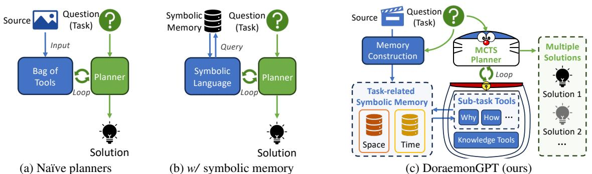
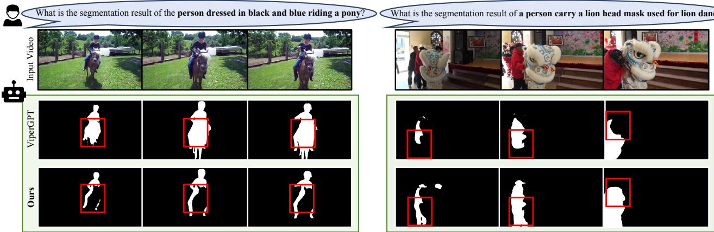

# DoraemonGPT $\textcircled{9}$ : Toward Understanding Dynamic Scenes with Large Language Models (Exemplified as A Video Agent)

Zongxin Yang 1 Guikun Chen 1 Xiaodi Li 1 Wenguan Wang 1 Yi Yang 1

# Abstract

# 1. Introduction

Recent LLM-driven visual agents mainly focus on solving image-based tasks, which limits their ability to understand dynamic scenes, making it far from real-life applications like guiding students in laboratory experiments and identifying their mistakes. Hence, this paper explores DoraemonGPT, a comprehensive and conceptually elegant system driven by LLMs to understand dynamic scenes. Considering the video modality better reflects the ever-changing nature of realworld scenarios, we exemplify DoraemonGPT as a video agent. Given a video with a question/task, DoraemonGPT begins by converting the input video into a symbolic memory that stores taskrelated attributes. This structured representation allows for spatial-temporal querying and reasoning by well-designed sub-task tools, resulting in concise intermediate results. Recognizing that LLMs have limited internal knowledge when it comes to specialized domains (e.g., analyzing the scientific principles underlying experiments), we incorporate plug-and-play tools to assess external knowledge and address tasks across different domains. Moreover, a novel LLM-driven planner based on Monte Carlo Tree Search is introduced to explore the large planning space for scheduling various tools. The planner iteratively finds feasible solutions by backpropagating the result's reward, and multiple solutions can be summarized into an improved final answer. We extensively evaluate DoraemonGPT's effectiveness on three benchmarks and several in-the-wild scenarios. Project page: https: / /z-x-yang. github.io/doraemon-gpt. Based on the advancements in large language models (LLMs) (OpenAI, 2021; Anil et al., 2023; Touvron et al., 2023; OpenAI, 2023; Chiang et al., 2023), recent LLMdriven agents (Surís et al., 2023; Shen et al., 2023; Gupta & Kembhavi, 2023) have demonstrated promise in decomposing a complex image task into manageable subtasks and solving them step-by-step. While static images have been extensively studied, real-world environments are inherently dynamic (Wu et al., 2021) and ever-changing (Smith et al., 2022). Commonly, capturing dynamic scenes is a dataintensive procedure, usually processed by streaming static images into videos. In turn, the spatial-temporal reasoning of videos is critical in real-life recognition, semantic description, causal reasoning, etc. Toward understanding dynamic scenes, developing LLMdriven agents to handle videos is of great significance yet involves grand challenges: i) Spatial-temporal Reasoning. Reasoning about the relationships of instances is crucial for task decomposing and decision-making. Such relationships may be relevant to space (Santoro et al., 2017), time (Zhou et al., 2018), or their spatial-temporal combination. ii) Larger Planning Space. Compared to the image modality, high-level semantics about actions and their intentions can typically only be inferred from temporal visual observations (Tapaswi et al., 2016). In other words, the inference of temporal semantics is necessary and will enlarge the search space of decomposing dynamic video tasks. iii) Limited Internal Knowledge. LLMs can not encode all the knowledge required for understanding every video due to the ever-changing nature of the real world and/or the lack of learning on proprietary datasets (Peng et al., 2023a).

In light of the preceding discussions, we present DoraemonGPT, an intuitive yet versatile LLM-driven system compatible with various foundation models and applications. Exemplified as a video agent, DoraemonGPT has three desirable abilities: First, collecting information regarding the given task before reasoning. In DoraemonGPT, the decomposition of the given dynamic task is decided by the agent-based reasoning of spatial-temporal relations, which are inferred from informative attributes, such as instance locations, actions, scene changes, etc. However, it is important to note that only task-solving related information is critical, as gathering excessive context tends to hinder the LLMs' capability (Shi et al., 2023). Second, exploring better solutions before making decisions. LLM-driven planning (e.g., Yao et al. (2022); Shinn et al. (2023)) decomposes high-level tasks into sub-tasks or action sequences. Considering an action sequence as a root-to-leaf path in a tree containing all possible sequences, the planning can be viewed as finding optimal decisions from a tree-like search space (Yao et al., 2023). Regarding the large planning space for solving tasks in dynamic scenes, prompting LLMs with tree-like search methods (Korf, 1985; Haralick & Elliott, 1980; Browne et al., 2012) offers opportunities for better solutions and even the possibility of considering tasks from different perspectives. Third, supporting knowledge extension. Just as humans consult reference books to tackle domain-specific issues, DoraemonGPT is designed to select the most relevant knowledge source from a series of given external knowledge sources (e.g., search engines, textbooks, databases, etc.) and then query the information from it during the planning.

  
.

More specifically, DoraemonGPT has a structure of memory, tool, planner) (Fig. 1c): i) Task-related Symbolic Memory (§2.1). To collect information related to the given video and task, we consider decoupling spatialtemporal attributes into two memories: space-dominant and time-dominant. Before constructing these memories, LLMs are used to determine their relevance to the given task and keep only the useful one(s). Foundation models are then employed to extract space-dominant attributes (e.g., instance trajectory, description, etc.) or time-dominant attributes (e.g., video descriptions, audio speech, etc.) and integrate them into a query table, which facilitates LLMs to access information by using symbolic language (e.g., SQL language).ii) Sub-task (§2.1) and Knowledge (§2.2) Tools.

To compact our planner's context/text length and improve effectiveness, we simplify memory information querying by designing a series of sub-task tools. Each tool focuses on different kinds of spatial-temporal reasoning (e.g., "How..", 'Why...", etc.) by using individual LLM-driven sub-agents with task-specific prompts and examples. Additionally, dedicated knowledge tools can incorporate external sources for tasks requiring domain-specific knowledge.iii) Monte Carlo Tree Search (MCTS) Planner (§2.3). To efficiently explore the large planning space, we propose a novel treesearch-like planner. The planner iteratively finds feasible solutions by backpropagating the answer's reward and selecting a highly expandable node to expand a new solution. After summarizing all the results, the planner derives an informative final answer. To design the tree search planner, we equip our DoraemonGPT with MCTS (Coulom, 2006; Kocsis & Szepesvári, 2006; Browne et al., 2012), which has shown effectiveness in finding optimal decisions from a large search space (Vodopivec et al., 2017), especially in the game AI community (Gelly et al., 2006; Chaslot et al., 2008; Silver et al., 2017). Combining the above designs, DoraemonGPT effectively handles dynamic spatial-temporal tasks, supports a comprehensive exploration of multiple potential solutions, and can extend its expertise by leveraging multi-source knowledge. Extensive experiments on three benchmarks (Xiao et al., 2021; Lei et al., 2020; Seo et al., 2020) show that our DoraemonGPT significantly outperforms recent LLMdriven competitors (e.g., ViperGPT Surís et al. (2023)) in causal/temporal/descriptive reasoning and referring video object recognition. Also, our MCTS planner surpasses the naïve searching method and other baselines. Moreover, DoraemonGPT can deal with more complex in-the-wild tasks previously unapplicable or neglected by recent approaches (Surís et al., 2023; Li et al., 2023b).

  
F supported. For planning, our CTS Planner (2.3) decomposes the question int a action sequence by exploring $N$ feasible solutions, which can be further summarized into an informative answer.

# 2. DoraemonGPT

Overview. As shown in Fig. 2, DoraemonGPT is an LLMdriven agent capable of utilizing various tools to decompose a complex dynamic video task into sub-tasks and solve them. Given a video $( V )$ with a textual task/question $( Q )$ , DoraemonGPT first extracts a Task-related Symbolic Memory (§2.1) from $V$ based on the task analysis of $Q$ . Next, employing a Monte Carlo Tree Search (MCTS) Planner (§2.3), DoraemonGPT automatically schedules the tool sets for querying the symbolic memory, accessing external knowledge (§2.2), and calling other utility tools (video inpainting, etc.) to solve the question $Q$ . Ultimately, the planner explores the large planning space, returns multiple possible answers, and summarizes an improved answer.

# 2.1. Task-related Symbolic Memory (TSM)

Videos are complicated dynamic data, including spatialtemporal relations. Giveng a question $Q$ for a video $V$ , only a part of related attributes are critical to the solution, regardless of the large amount of irrelevant information. Thus, we propose to extract and store potentially relevant video information regarding $Q$ into TSM before solving $Q$ TSM Construction. To construct the TSM, we use a straightforward in-context learning method (Brown et al., 2020) to select the task type of TSM based on the question $Q$ .We place the task description of each type of TSK into the context of our LLM-driven planner, which will be prompted to predict a suitable TSM in the format like "Action: $\langle T S M \lrcorner t y p e \rangle$ construction...". Then, the API of constructing the corresponding TSM will be called to extract task-related attributes and store them in an SQL table, which can be accessed by symbolic languages, i.e., SQL. There is no standardized criterion for categorizing video tasks. In DoraemonGPT, we choose the perspective of spatial-temporal decoupling, which has been widely applied in video representation learning (Bertasius et al., 2021; Arnab et al., 2021), to design two memory types: •Space-dominant memory is primarily used to address questions related to specific targets (e.g., persons or animals) or their spatial relations. We use multi-object tracking methods (Maggiolino et al., 2023) to detect and track instances. Each instance has attributes that include unique ID, semantic category, trajectory & segmetnation for localization, appearance description extracted by (Li et al., 2022; 2023a) and used for text-based grounding, and act ion classification. T   

<table><tr><td rowspan=1 colspan=1>Attribute</td><td rowspan=1 colspan=1>Used Model</td><td rowspan=1 colspan=1>Explanation</td></tr><tr><td rowspan=1 colspan=3>Space-dominant Memory</td></tr><tr><td rowspan=1 colspan=1>ID number</td><td></td><td rowspan=1 colspan=1>A unique ID assigned to an instance</td></tr><tr><td rowspan=1 colspan=1>Category</td><td rowspan=1 colspan=1>YOLOv8 (Jocher et al., 2023)/Grounding DINO (Liu et al., 2023c)</td><td rowspan=1 colspan=1>The category of an instance, e.g., person</td></tr><tr><td rowspan=1 colspan=1>Trajectory</td><td rowspan=1 colspan=1>Deep OC-Sort (Maggiolino et al., 2023)/DeAOT (Yang &amp; Yang, 2022)</td><td rowspan=1 colspan=1>An instance&#x27;s bounding box in each frame</td></tr><tr><td rowspan=1 colspan=1>Segmentation</td><td rowspan=1 colspan=1>YOLOv8-Seg (Jocher et al., 2023)/DeAOT (Yang &amp; Yang, 2022)</td><td rowspan=1 colspan=1>An instance&#x27;s segmentation mask in each frame</td></tr><tr><td rowspan=1 colspan=1>Appearance</td><td rowspan=1 colspan=1>BLIP (Li et al., 2022) / BLIP-2 (Li et al., 2023a)</td><td rowspan=1 colspan=1>A description of an instance&#x27;s appearance</td></tr><tr><td rowspan=1 colspan=1>Action</td><td rowspan=1 colspan=1>Intern Video (Wang et al., 2022)</td><td rowspan=1 colspan=1>The action of an instance</td></tr><tr><td rowspan=1 colspan=3>Time-dominant Memory</td></tr><tr><td rowspan=1 colspan=1>Timestamp</td><td></td><td rowspan=1 colspan=1>The timestamp of a frame/clip</td></tr><tr><td rowspan=1 colspan=1>Audio content</td><td rowspan=1 colspan=1>Whisper (Radford et al., 2023)</td><td rowspan=1 colspan=1>Speech recognition results of the video</td></tr><tr><td rowspan=1 colspan=1>Optical content</td><td rowspan=1 colspan=1>OCR (PaddlePaddle, 2023)</td><td rowspan=1 colspan=1>Optical character recognition results of the video</td></tr><tr><td rowspan=1 colspan=1>Captioning</td><td rowspan=1 colspan=1>BLIP (Li et al., 2022)/BLIP-2 (Li et al., 2023a)/InstructBlip (Dai et al., 2023)</td><td rowspan=1 colspan=1>Frame-level/clip-level captioning results</td></tr></table>

Time-dominant memory focuses on constructing temporalrelated information of the video. It requires comprehending the content throughout the video. The attributes stored in this memory include timestamp, audio content by ASR (Radford et al., 2023), optical content by OCR (PaddlePaddle, 2023), frame-level capt ioning by BLIPs (Li et al., 2022; 2023a; Dai et al., 2023), cliplevel capt ioning by dedupicating similar and continuous frame-level results, etc. Table 1 provides the attribute types with corresponding extraction models of our TSMs. Sub-task Tools. Although LLM-driven agents (Hu et al., 2023; Li et al., 2023b) can assess external information by in-context learning of the whole memory or generating symbolic sentences to access the memory, these methods can significantly increase the length of the context, potentially leading to the omission of crucial information in the reasoning process or being influenced by redundant context. Thus, we provide a series of sub-task tools responsible for querying information from our TSMs (Shi et al., 2023; Liu et al., 2023a) by answering sub-task questions. The LLMdriven planner learns the function of each sub-task tool through its in-context descript ion, which describes the sub-task description, tool name, and tool inputs. To call the API of a sub-task tool, DoraemonGPT parses the command generated by LLMs, like "Action: tool_name]. Input:video_name>#(sub_question...". To collaborate with the above two kinds of TSMs, we design sub-task tools with different sub-task description and for solving different sub-questions, including: •When: related to temporal understanding, e.g., "When the dog walks past by the sofa?" •Why: related to causal reasoning, e.g., "Why did the lady shake the toy?" What: describing the required information, e.g., "What's the name of the experiment?" How: what manner, means, or quality of something, e.g.,   
"How does the baby keep himself safe?" Count: counting sth., e.g., "How many people in the room?" Other: questions not in the above tools, e.g., "Who slides farther at the end?" The API funct ions of these tools are built upon LLMs as well. Each sub-task tool function is an individual LLMdriven agent, which can generate SQL to query our TSMs and answer the given sub-task question. Different sub-task agents have different in-context examples regarding their purposes. Note that a sub-question may be suitable for two or more sub-tools (e.g., "What was the baby doing before playing the toy?", related to what and when), and our MCTS planner (§2.3) is capable of exploring different selections.

# 2.2. Knowledge Tools and Others

When tackling complex problems, LLM-driven agents sometimes fail to make accurate decisions solely based on video understanding and the implicit knowledge learned by LLMs during training. Thus, DoraemonGPT supports the integration of external knowledge sources that can assist the LLM in comprehending the specialized content within the input video/question. In DoraemonGPT, a knowledge source can be integrated in a plug-and-play manner by using an individual knowledge tool. Similar to the sub-task tools (§2.1), a knowledge tool consists of two parts: i) an incontext knowledge description to describe the given knowledge source and ii) an AP I funct ion to query information from the source by question answering. We consider three types of API function for covering different knowledge: i) symbolic knowledge refers to information presented in a structured format such as Excel or SQL tables. The API function is a symbolic questionanswering sub-agent like our sub-task tools (§2.1). ii) textual knowledge encompasses knowledge expressed through natural language text, such as research publications, reference books, etc. The API function is built based on text embedding and searching (OpenAI, 2022). iii) web knowledge denotes knowledge searched from the internet. The AP I funct ion is a search engine API, such as Google, Bing, etc. Besides the knowledge tools, DoraemonGPT also supports integrating general utility tools, commonly used in recent LLM-driven agents (Xi et al., 2023), to help complete specialized vision tasks, e.g., video editing and inpainting.

  
Rec syer

# 2.3. Monte Carlo Tree Search (MCTS) Planner

Previous LLM-driven planners (Shen et al., 2023; Surís et al., 2023; Gupta & Kembhavi, 2023) decompose the given $Q$ into an action/sub-task sequence and solve it step by step. Such a strategy can be seen as a greedy search method that generates a chain of action nodes until the final answer. Similar to some works (Yao et al., 2024; Zhuang et al., 2024), we consider the large planning space of LLM-driven planning as a tree. Moreover, we consider that a single attempt may not yield the correct result or that better solutions may exist. To efficiently explore the planning space, we propose a novel tree-search-like planner equipped with MCTS (Coulom, 2006; Kocsis & Szepesvári, 2006; Browne et al., 2012), which is practical in searching large trees. We define the question input $Q$ as the root node $v _ { 0 }$ , and an action or tool call is a non-root node, then an action sequence can be viewed as a path from the root node to a leaf node. In our MCTS planner, a non-root node is a ReAct (Yao et al., 2022)-style step in the form of (thought, action, action input, observation), and a leaf node has a final answer in addition. The planner iteratively executes the following four phases for $N$ times and produces $N$ solutions: Node Selection. Each iteration starts by selecting an expandable node for planning a new solution. For the first iteration, only the root $v _ { 0 }$ is selectable. For subsequent iterations, we randomly select a non-leaf node based on their sampling probability, formulated as $P ( v _ { i } ) = S o f t m a x ( R _ { i } )$ , where $R _ { i }$ is the reward value of node $v _ { i }$ initialized as 0 and updated in the Reward Back-propagation phase. The node with a higher reward has a greater probability of being selected. Branch Expansion. A child will be added to the selected expandable node to create a new branch. To leverage LLM for generating a new tool call different from the previous child nodes, we add historical tool actions into the prompt of LLM and instruct it to make a different choice. Such an in-context prompt will be removed in the subsequent chain execution toward a new final answer. Chain Execution. After expanding a new branch, we use a step-wise LLM-driven planner (Yao et al., 2022) to generate a new solution. The execution process consists of a chain of steps/nodes of tool calls and will terminate upon obtaining the final answer or encountering an execution error. Reward Back-propagation. After obtaining a leaf/outcome node $v _ { l }$ , we will gradually propagate its reward to its ancestor nodes until $v _ { 0 }$ . Here, we consider two kinds of reward: Failure: the planner produces an unexpected result, e.g., a failed tool call or incorrect result format. The reward ${ \boldsymbol { R _ { v _ { l } } } }$ is set to a negative value $( e . g . , - 1 )$ for these cases. Non-failure: the planner successfully produces a result, but it is not sure whether the result is correct as ground truth. Here $R _ { v _ { l } }$ is set to a positive value (e.g., 1).

For simplicity, let $\alpha$ be a positive base reward, we set $R _ { v _ { l } } = \pm \alpha$ for Failure and Non-failure, respectively. According to (Liu et al., 2023a), the outcome produced by LLMs is more related to the context at the beginning (the initial prompts) and the end (the final nodes). We believe more rewards should be applied to nodes close to $v _ { l }$ . Thus, the backpropagation function is formulated as $R _ { v _ { i } }  R _ { v _ { i } } + R _ { v _ { l } } \acute { e } ^ { \beta ( \bar { 1 } - \bar { d } ( v _ { i } , v _ { l } ) ) }$ , where $d ( v _ { i } , v _ { l } )$ denotes the node distance between $v _ { i }$ and $v _ { l }$ , and $\beta$ is a hyperparameter for controlling the decay rate of the reward. The further the node distance, the greater the reward decay ratio, $e ^ { \beta ( 1 - d ( v _ { i } , v _ { l } ) ) }$ . Commonly, setting a higher $\alpha / \beta$ will increase the probability of the expanded node approaching the leaf node (of a non-failure answer). After all the MCTS iterations, the planner will produce $N$ non-failure answers at most, and we can use LLMs to summarize all the answers to generate an informative answer. T agents use the same LLM, i.e., GPT-3.5-turbo. †: reimplement using the offcially released codes. $^ \ddag$ we equipped ViperGPT (Surís et al., 2023) with DeAOT (Yang & Yang, 2022; Cheng et al., 2023) as ours to enable object tracking and segmenation.   

<table><tr><td></td><td>Method</td><td>Pub.</td><td>Accc</td><td>Acct</td><td>AccD</td><td>Avg AccA</td></tr><tr><td rowspan="4">20</td><td>HME (Fan et al., 2019)</td><td>CVPR19</td><td>46.2</td><td>48.2</td><td>58.3 50.9</td><td>48.7</td></tr><tr><td>VQA-T (Yang et al., 2021a)</td><td>ICCV21</td><td>41.7</td><td>44.1</td><td>60.0</td><td>48.6 45.3</td></tr><tr><td>ATP (Buch et al., 2022)</td><td>CVPR22</td><td>53.1</td><td>50.2 66.8</td><td>56.7</td><td>54.3</td></tr><tr><td>VGT (Xiao et al., 2022)</td><td>ECCV22 CVPR23</td><td>52.3</td><td>55.1 64.1</td><td>57.2</td><td>55.0</td></tr><tr><td rowspan="4">2</td><td>MIST (Gao et al., 2023b)</td><td>ICCV23</td><td>54.6</td><td>56.6 41.0</td><td>66.9 62.3</td><td>59.3 57.2</td></tr><tr><td>†ViperGPT (Surís et al., 2023) VideoChat (Li et al., 2023b)</td><td>arXiv23</td><td>43.2</td><td></td><td>49.4</td><td>45.5</td></tr><tr><td></td><td></td><td>50.2</td><td>47.0 65.7</td><td>52.5</td><td>51.8</td></tr><tr><td>DoraemonGPT (Ours)</td><td>ICML24</td><td>54.7 50.4</td><td>70.3</td><td>54.7</td><td>55.7</td></tr></table>

(a) NExT-QA (Xiao et al., 2021) (b) Ref-YouTube-VOS (Seo et al., 2020)

<table><tr><td></td><td>Method</td><td>Pub.</td><td>J</td><td>F</td><td>J&amp;F</td></tr><tr><td>Sde</td><td>CMSA (Ye et al., 2019) URVOS (Seo et al., 2020) VLT (Ding et al., 2021) ReferFormer (Wu et al., 2022a) SgMg (Miao et al., 2023) OnlineRefer (Wu et al., 2023b)</td><td>CVPR19 ECCV20 ICCV21 CVPR22 ICCV23 ICCV23</td><td>36.9 47.3 58.9 58.1 60.6 61.6</td><td>43.5 56.0 64.3 64.1 66.0 67.7</td><td>40.2 51.5 61.6 61.1 63.3 64.8</td></tr><tr><td>A</td><td>‡ViperGPT (Surís et al., 2023) DoraemonGPT (Ours)</td><td>ICCV23 ICML24</td><td>24.7 63.9</td><td>28.5 67.9</td><td>26.6 65.9</td></tr></table>

Alternatively, for single-/multiple-choice questions, we can determine the final answer through a voting process.

# 3. Experiment

# 3.1. Experimental Setup

Datasets. For validating our algorithm's utility comprehensively, we conduct experiments on three datasets, i.e., NExT-QA (Xia0 et al., 2021), TVQA $^ +$ (Lei et al., 2020), and Ref-YouTube-VOS (Seo et al., 2020). They were selected to cover the common dynamic scenes with video question answering and referring video object segmentation tasks. •NExT-QA contains 34,132/4,996 video-question pairs for t ra in/val. Each question is annotated with a question type (causal/temporal/descriptive) and 5 answer candidates. We randomly sample 30 samples per type from t ra in (90 questions in total) for ablation studies, and the val set is used for method comparison. $\mathbf { T V Q A } +$ is an enhanced version of TVQA (Lei et al., 2018) dataset, augmented with 310.8K bounding boxes to link visual concepts in questions and answers to depicted objects in videos. For evaluation, we randomly sample 900 samples from the va1 set as in (Gupta & Kembhavi, 2023), resulting in a total of 900 questions (s_val). •Ref-YouTube-VOS is a large-scale referring video object segmentation dataset with ${ \sim } 1 5 { , } 0 0 0$ referential expressions associated with $> 3 , 9 0 0$ videos, covering diverse scenarios. In our experiments, we use the validation set of Ref-YouTube-VOS (Seo et al., 2020) (including 202 videos and 834 objects with expressions) to validate our effectiveness in pixel-wise spatial-temporal segmentation.

Evaluation Metric. For question answering, we adopt the standard metric (Xiao et al., 2021), top-1 accuracy, for evaluation. On NExT-QA, we also report accuracy for causal $( \operatorname { A c c } _ { \mathbf { C } } )$ , temporal $( \operatorname { A c c } _ { \mathrm { T } } )$ , descriptive $( \mathrm { A c c } _ { \mathrm { D } } )$ , Avg (the average of $\operatorname { A c c } _ { \mathbf { C } }$ , $\operatorname { A c c } _ { \mathrm { T } }$ ,and $\operatorname { A c c } _ { \mathrm { D } }$ and $\operatorname { A c c } _ { \mathrm { A } }$ (the overall accuracy of all questions). For referring object segmentation, we evaluated the performance on the official challenge server of Ref-YouTube-VOS. the metrics are the average of region similarity $( \mathcal { T } )$ and contour accuracy $( \mathcal { F } )$ , collectively referred to as $\mathcal { I } \& \mathcal { F }$ . Implementation Details. We use GPT-3.5-turbo API provided by OpenAI as our LLM. As summarized in Table 1, we use BLIP series (Dai et al., 2023) for captioning, YOLOv8 (Jocher et al., 2023) and Deep OC-Sort (Maggiolino et al., 2023) for object tracking, PaddleOCR (PaddlePaddle, 2023) for OCR, InternVideo (Wang et al., 2022) for action recognition, and Whisper (Radford et al., 2023) for ASR. Our experiments are conducted under the incontext learning (ICL) setting. The external knowledge is not used in quantitative or qualitative comparisons to ensure fairness. Competitors. We involve several open-sourced LLM-driven agents for comparison. ViperGPT (Surís et al., 2023) leverages code generation models to create subroutines from vision-and-language models through a provided API, thus it solves the given task by generating Python code that is later executed. VideoChat (Li et al., 2023b) is an end-to-end chat-centric video understanding system that integrates several foundation models and LLMs to build a chatbot. We do not report the performance of others since they do not release their codes for video tasks or even open-source it. Hyperparameters. We set $\alpha = 1$ and $\beta = 0 . 5$ for the reward back-propagation (§2.3). For experiments on VQA, exploring $N = 2$ solutions has better acc.-cost trade-offs.

# 3.2. Zero-shot Video Question Answering

NExT-QA. Table 2a presents comparisons of our DoraemonGPT against several top-leading supervised VQA models and LLM-driven systems. As can be seen, DoraemonGPT achieves competitive performance compared to recently proposed supervised models. In particular, it shows a more promising improvement in descriptive questions, even outperforming the previous SOTA, MIST (Gao et al., 2023b) $( 7 0 . 3 \ : \nu s \ : 6 6 . 9 )$ . The main reason is that our task-related symbolic memory can provide enough information for reasoning. In terms of temporal questions, supervised models are slightly superior to ours, mainly due to their well-designed architectures that have learned underlying patterns. In addition, DoraemonGPT outperforms recent concurrent works, i.e., ViperGPT and VideoChat. Concretely, it outperforms ViperGPT by 11.5/9.4/8.0/10.2 $\left( \mathrm { A c c _ { C } / A c c _ { T } / A c c _ { D } / A c c _ { A } } \right)$ and VideoChat by ${ \bf 4 . 5 / 3 . 4 / 4 . 6 / 3 . 9 }$ across the four question types. These results show the efficacy of our MCTS planner based on TSM. Inference examples are in A.3.

  
ualaaoReferid Obje S 3.RYoTub e.   
Figure 5. Comparison on $\mathrm { T V Q A + }$ (Lei et al., 2020) (§3.2).

$\mathbf { T V Q A } +$ The results in Fig. 5 confirm again the superiority of our method. DoraemonGPT outperforms ViperGPT and VideoChat by $1 0 . 2 \%$ and $5 . 9 \%$ , respectively. ViperGPT's performance $( 3 0 . 1 \% )$ is lower compared to VideoChat and DoraemonGPT, which are specifically designed for dynamic videos. This is consistent with the findings on NExT-QA.

# 3.3. Zero-shot Referring Object Segmentation

Ref-YouTube-VOS. We further evaluate DoraemonGPT against state-of-the-art supervised referring video object segmentation models and LLM-driven agents, as summarized in Table 2b. Benefiting from our task-related symbolic memory, the DoraemonGPT (without learning on RefYouTube-VOS) can effectively ground video instances with textual description and remarkably surpasses recent supervised models $6 5 . 9 \%$ V.S. $6 4 . 8 \%$ ), e.g., OnlineRefer (Wu et al., 2023b). By contrast, the agent competitor, ViperGPT, only achieves $2 6 . 6 \%$ due to a lack of well-designed video information memory, failing to ground the referred object or track it accurately in the video. As depicted in Fig. 4, our DoraemonGPT demonstrates a higher level of accuracy in identifying, tracking, and segmenting the referred objects mentioned by the users. In contrast, ViperGPT encounters failure cases where the recognized objects do not completely match the semantic and descriptive aspects. Our superiority in referring video object segmentation further demonstrates the necessity of building a symbolic video memory.

# 3.4. In-the-wild Example

DoraemonGPT exhibits a versatile skill set, e.g., checking experimental operations, video understanding, and video editing. It adeptly navigates complex questions by exploring multiple reasoning paths and leveraging external sources for comprehensive answers. Please see A.2 for more details.

# 3.5. Diagnostic Experiment

To gain more insights into DoraemonGPT, we conduct a set of ablative experiments on NExT-QA. Task-related Symbolic Memory. First, we investigate the essential components in DoraemonGPT, i.e., symbolic memories (§2.1) for space-dominant (SDM) and time-dominant (TDM) information. The results are summarized in Table 3a. Two crucial conclusions can be drawn. First, TDM is more preferred for temporal questions, while SDM can provide relevant information for descriptive questions. Second, our complete system achieves the best performance by combining our SDM and TDM, confirming the necessity of dynamically querying two types of symbolic memory.

Multiple Solutions by MCTS Planner. We will next study the influence of the number of answer candidates during the exploration process of our MCTS planner. When $N = 1$ , the planner is equivalent to a greedy search, explores only a chain of nodes, and returns a single answer  the first node in LLM's thinking that can be terminated without further exploration. As shown in Table 3c, gradually increasing $N$ from 1 to 4 leads to better performance (i.e., $4 3 . 3 $ 65.7). This supports our hypothesis that one single answer is far from enough to handle the larger planning space for dynamic modalities and proves the efficacy of our MCTS planner. Since the questions in NExT-QA (Xiao et al., 2021) are single-choice, exploring more answers does not always result in positive returns. We stop using $N > 5$ as the required number of API calls exceeds our budget.

Table 3. A set of ablative experiments (3.5) about the MCTS planner on NExT-QA (Xiao et al., 2021) rn.   
(a) Essential components   

<table><tr><td rowspan=1 colspan=1>TDM SDM</td><td rowspan=1 colspan=1>Accc Acct AccD</td><td rowspan=1 colspan=1>Acca</td></tr><tr><td rowspan=1 colspan=1>✓✓</td><td rowspan=1 colspan=1>63.326.753.353.323.346.7</td><td rowspan=1 colspan=1>47.841.1</td></tr><tr><td rowspan=1 colspan=1>✓√</td><td rowspan=1 colspan=1>96.746.753.3</td><td rowspan=1 colspan=1>65.7</td></tr></table>

<table><tr><td>Models</td><td>Accc Acct</td><td>AccD</td><td>Acca</td></tr><tr><td>BLIP-2</td><td>51.4 45.5</td><td>63.3</td><td>51.2</td></tr><tr><td>InstructBlip</td><td>54.7 50.4</td><td>70.3</td><td>55.7</td></tr></table>

(b) Captioning models (c) Number of answer candidates (d) Reward and decay rate $N = 4$ (e) Exploring strategy $N = 4$

<table><tr><td>N</td><td>Accc Acct AccD</td><td>AccA</td></tr><tr><td>20</td><td>63.3 20.0 46.7 80.0 43.3 46.7 86.7 43.3 53.3</td><td>43.3 56.7 61.1 65.7</td></tr><tr><td></td><td>96.7 46.7</td><td>53.3</td></tr><tr><td>86.7</td><td>43.3 50.0</td><td>60.0</td></tr></table>

<table><tr><td rowspan=1 colspan=1>αβ</td><td rowspan=1 colspan=1>AcccAcctAccD</td><td rowspan=1 colspan=1>AccA</td></tr><tr><td rowspan=1 colspan=1>0.51.0</td><td rowspan=1 colspan=1>86.723.350.0</td><td rowspan=1 colspan=1>53.3</td></tr><tr><td rowspan=1 colspan=1>1.0 0.5</td><td rowspan=1 colspan=1>96.746.753.3</td><td rowspan=1 colspan=1>65.7</td></tr><tr><td rowspan=1 colspan=1>| 0.5 2.0</td><td rowspan=1 colspan=1>86.726.750.0</td><td rowspan=1 colspan=1>54.4</td></tr><tr><td rowspan=1 colspan=1>2.0 0.5</td><td rowspan=1 colspan=1>83.346.750.0</td><td rowspan=1 colspan=1>60.0</td></tr><tr><td rowspan=1 colspan=1>2.02</td><td rowspan=1 colspan=1>80.046.750.0</td><td rowspan=1 colspan=1>58.9</td></tr></table>

<table><tr><td rowspan=1 colspan=1>Strategy</td><td rowspan=1 colspan=1>AcccAcctAccD</td><td rowspan=1 colspan=1>Acca</td></tr><tr><td rowspan=1 colspan=1>DFS</td><td rowspan=1 colspan=1>66.736.750.0</td><td rowspan=1 colspan=1>51.1</td></tr><tr><td rowspan=2 colspan=1>RootUniform</td><td rowspan=2 colspan=1>73.316.746.767.726.750.0</td><td rowspan=1 colspan=1>45.6</td></tr><tr><td rowspan=1 colspan=1>47.8</td></tr><tr><td rowspan=1 colspan=1>MCTS</td><td rowspan=1 colspan=1>96.746.753.3</td><td rowspan=1 colspan=1>65.7</td></tr></table>

Back-propogation in MCTS Planner. Then, we ablate the effect of the base reward $\alpha$ and decay rate $\beta \ ( \ \ S 2 . 3 )$ that controls the exploring procedure of our MCTS planner. The results in Table 3d are stable regardless of the combination of $\alpha$ and $\beta$ used. Hence, we set the slightly better one, $\alpha { = } 1$ and $\beta = 0 . 5$ , as our default setting. We leave some special combinations in the next part (e.g., our MCTS planner becomes the depth-first search $( D F S )$ when setting $\beta = 1 0 ^ { 8 }$ and $R _ { v _ { l } } = 1$ for both Failure and Non-failure cases). Exploring Strategies used by Planner. Last, to verify the advantage of our MCTS planner, we compare MCTS with several standard exploring strategies, i.e., depth-first search (DFS), Root, which always selects the root node, and Uniform, which samples a node with equal probability. As shown in Table 3e, we observe that their performance is suboptimal due to the inability to leverage the value/reward of the outcome leaf nodes and accordingly adjust their searching strategy. Compared to these naïve strategies, our MCTS planner adaptively samples a node with the guidance of reward back-propagation, which is more effective in a large solution space. These results further validate the superiority of the proposed MCTS planner. Additionally, compared to Uniform, DFS notably exhibits superior performance on temporal questions yet demonstrates comparable or even inferior performance on descriptive and causal questions. We hypothesize that this discrepancy arises because temporal questions often include cues (e.g., at the beginning) indicating the specific period within the video where the correct answer can be found. DFS can exploit these cues, whereas Uniform cannot. Impact of Captioning Models. We further conduct experiments regarding one of the most important models, i.e., BLIP series, which is the essential tool for DoraemonGPT to perceive and recognize visual input. As seen in Table 3b, the model with instruction tuning, i.e., InstructBLIP, demonstrates better performance. This suggests that DoraemonGPT can benefit from the development of stronger foundation models. More discussion of foundation models' impact on DoraemonGPT is supplied in A.4.

# 4. Related Work

Multimodal Understanding. Various efforts were made to create multimodal systems tailored for specific tasks (Lu et al., 2019; Marino et al., 2019; 2021; Bain et al., 2021; Lei et al., 2021; Grauman et al., 2022; Lin et al., 2022; Li et al., 2023d;c; Lei et al., 2024; Wong et al., 2022; Chen et al., 2023a; Hu et al., 2020; Yang et al., 2021b). While these systems showed impressive performance in their respective domains, their applicability to broader, real-world scenarios was limited due to the lack of generalizability. Recent years have witnessed remarkable progress in general multimodal systems, due to the fast evolution of data volumes and computational resources. Specifically, Frozen (Tsimpoukelli et al., 2021) is a typical example; it demonstrates a feasible way to empower LLMs with the ability to handle visual inputs. In the past few years, numerous efforts have been devoted to building large multimodal models (OpenAI, 2023; Driess et al., 2023; Zhu et al., 2023a; Li et al. 2022). Considering the training cost, several attempts (Li et al., 2023a; Yu et al., 2023) try to build zero-shot systems for various tasks. An alternative strategy (Xi et al., 2023), which will be detailed later, involves combining multiple models or APIs to tackle compositional multimodal reasoning tasks. Our DoraemonGPT shares a similar spirit of decomposing complex tasks into simpler ones, but it is designed to solve complicated tasks for dynamic modalities in real-world scenarios.

LLM-driven Modular Systems. Deconstructing complex tasks and merging the results from multiple intermediate steps is an innate human ability that drives the scientific and industrial communities (Newell et al., 1972; Wang & Chiew, 2010). Benefiting from the impressive emergent capabilities of LLMs, VisProg (Gupta & Kembhavi, 2023) pioneers the idea of addressing complex vision tasks through the decomposition of questions into manageable subtasks. Along this line, tremendous progress has been achieved, which can be divided into two categories according to reasoning styles: i) Reasoning with fixed paths (Gupta & Kembhavi, 2023; Wu et al., 2023a; Surís et al., 2023; Lu et al., 2023; Shen et al., 2023; Liang et al., 2023). They transform the given task into an ordered sequence of subtasks, each addressed by a specific module. For example, ViperGPT(Surís et al., 2023) treats the solving process as a Python program with manually designed APIs. Similarly, HuggingGPT (Shen et al., 2023) models task dependencies between numerous foundation models. ii) Reasoning with dynamic paths(Nakano et al., 2021; Schick et al., 2023; Yao et al., 2022; Yang et al., 2023; Ga0 et al., 2023a). Considering the intermediate results may not meet expectations, a promising avenue is to perform planning and executing concurrently. Such an interactive paradigm (Yao et al., 2022) provides a flexible and error-tolerant manner compared to those with fixed paths. Additionally, there are many agents focussing on other domains, e.g., planning in the open-world environments (Wang et al., 2023c; Yuan et al., 2023; Park et al., 2023), tool usage (Ruan et al., 2023; Qin et al., 2023), reinforcement learning (Shinn et al., 2023; Xu et al., 2023). This work focuses on computer vision only.

Despite impressive, existing LLM-driven modular systems mainly focus on developing specific strategies to solve composition tasks for static modalities, ignoring the fundamental gaps between static and dynamic modalities, which is a pivotal aspect towards achieving artificial general intelligence (AGI) (Goertzel, 2014). These works, to some extent, can be seen as a subset of our system. Though exceptions exist (Surís et al., 2023; Li et al., 2023b; Wang et al., 2023a; Gao et al., 2023a), in general, they are scattered, lacking systematic study, e.g., simply treating the video as a sequence of images (Surís et al., 2023) or building a chatbot based on pre-extracted information of the given video (Li et al., 2023b; Wang et al., 2023a). In sharp contrast, we take the video and task as a whole, resulting in a compact, task-related memory. The reasoning paths of our system are powered by the MCTS planner. In addition to facilitating the answer searching, the MCTS planner has the potential to find multiple possible candidates. This is crucial for questions with open-ended answers.

LLMs with External Memory. How to effectively design prompt templates, known as prompt engineering, is of importance for accurate LLM responses (Zhou et al., 2022; Wang et al., 2023b). One of the areas in the spotlight is memory-augmented LLMs (Wu et al., 2022c;b; Zhong et al., 2022; Lewis et al., 2020; Guu et al., 2020; Izacard et al., 2022; Khattab et al., 2022; Park et al., 2023; Cheng et al. 2022; Sun et al., 2023; Hu et al., 2023). In general, trainingfree memories can be divided into: i) Textual memory (Zhu et al., 2023b; Park et al., 2023). In this kind of memory, the long contexts LLMs cannot handle (e.g., books) are stored as embeddings, which can be further retrieved by computing similarity. A typical example is the document question answering shown in LangChain1. ii) Symbolic memory. It models memory as structured representations with corresponding symbolic languages, e.g., codes for programming language (Cheng et al., 2022), execution commands for Excel², and structured query language (SQL) for databases (Sun et al., 2023; Hu et al., 2023). Different from techniques (Dao et al., 2022; Dao, 2023; Ratner et al., 2023; Hao et al., 2022; Chen et al., 2023b; Mu et al., 2023; Mohtashami & Jaggi, 2023; Peng et al., 2023b) that directly extend the context window of LLMs, memory-augmented LLMs use retrieval-based approaches to bypass the limitation of context length. This is more favored because (i) it is a plug-and-play module without any fine-tuning or architectural modifications, and (ii) concurrent works (Shi et al., 2023; Liu et al., 2023a) suggest that LLMs may be distracted or lost while encountering irrelevant or long contexts. By absorbing their ideas of memory organization, we construct a request-related database, which stores instance-aware and instance-agnostic information in individual tables. To retrieve the relevant information, we explicitly define several sub-task tools based on prompt templates and SQL, with respect to different purposes. With a broader view, our multi-source knowledge, which is a complementary module to provide reliable guidance in specific domains, can also be considered as a hybrid of external memories.

# 5. Conclusion

Regarding real-world scenarios' dynamic and ever-changing nature, we present DoraemonGPT, an LLM-driven agent for solving dynamic video tasks. Compared to existing LLMdriven visual modular systems, DoraemonGPT has merits in: i) conceptually elegant system designed by delving into the dynamic modalities in our lives; ii) compact task-related symbolic memory by decoupling, extracting, and storing spatial-temporal attributes; iii) effective and decomposed memory querying through symbolic sub-task tools; iv) plugand-play knowledge tools for accessing domain-specific knowledge; v) automated exploration of large planning space using the MCTS planner, providing multiple solutions with an informative final answer; and vi) answer diversity that provides multiple potential candidates by fully exploring the solution space. Extensive experiments confirm the versatility and effectiveness of DoraemonGPT.

# Acknowledgments

This work was supported by the National Science and Technology Major Project (No. 2023ZD0121300), the National Natural Science Foundation of China (No. 62372405), and the CCF-Tencent Open Fund.

# Impact Statement

DoraemonGPT leverages LLMs to address real-world dynamic tasks, excelling in video-based reasoning with potential applications in autonomous vehicles, surveillance, and interactive robotics. Despite its promise, several ethical concerns must be addressed. i) The system could be misused for video manipulation or generating misleading content, necessitating robust safeguards against malicious activities. ii) Biases in training data could perpetuate discriminatory behavior, highlighting the need for fairness and bias mitigation. iii) Reliance on external knowledge sources underscores the importance of adhering to data access and usage regulations to avoid legal issues. iv) DoraemonGPT's methodology extends the application of LLM-driven agents beyond vision, offering transformative impacts in various fields. For instance, the MCTS planner enhances exploration strategies in large solution spaces, while its symbolic memory aids interactive planning scenarios with precise guidance, relevant for diverse applications, e.g., embodied intelligence (Liu et al., 2024; 2023b; Dong et al., 2024).