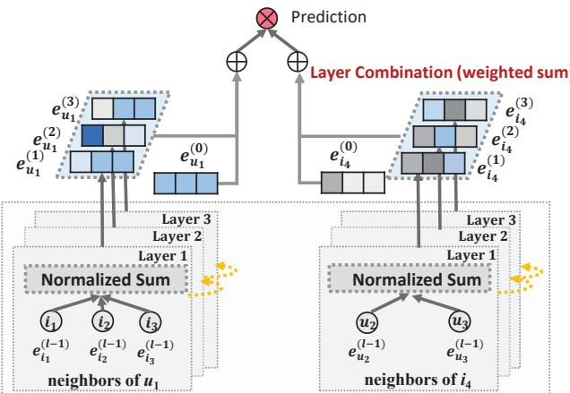
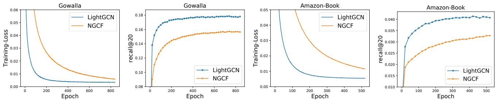
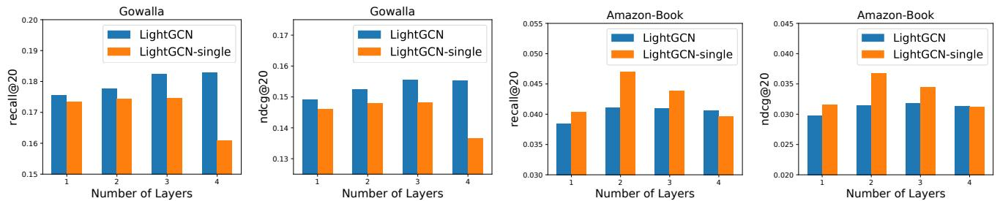

# 1. 论文基本信息

## 1.1. 标题
**LightGCN: Simplifying and Powering Graph Convolution Network for Recommendation** (LightGCN: 简化与强化用于推荐的图卷积网络)

## 1.2. 作者
*   Xiangnan He (贺向南) - 中国科学技术大学
*   Kuan Deng (邓宽) - 中国科学技术大学
*   Xiang Wang (王翔) - 新加坡国立大学
*   Yan Li (李岩) - 北京快手科技有限公司
*   Yongdong Zhang (张永东) - 中国科学技术大学
*   Meng Wang (王萌) - 合肥工业大学

## 1.3. 发表期刊/会议
发表于 **Proceedings of the 43rd International ACM SIGIR Conference on Research and Development in Information Retrieval (SIGIR '20)**。
SIGIR (Special Interest Group on Information Retrieval) 是信息检索领域的顶级国际会议之一，享有极高的声誉和影响力。

## 1.4. 发表年份
2020年 (Published at UTC: 2020-02-06T06:53:42.000Z)

## 1.5. 摘要
图卷积网络 (Graph Convolution Network, GCN) 已成为协同过滤 (collaborative filtering) 领域最新的先进技术 (state-of-the-art)。然而，其在推荐系统中的有效性原因尚未被充分理解。现有将 GCN 应用于推荐系统的工作，缺乏对 GCN 彻底的消融分析 (ablation analyses)。GCN 最初是为图分类任务设计的，并配备了许多神经网络操作。然而，我们凭经验发现，GCN 中最常见的两种设计——特征变换 (feature transformation) 和非线性激活 (nonlinear activation)——对协同过滤的性能贡献甚微。更糟糕的是，包含它们会增加训练难度并降低推荐性能。

在这项工作中，我们旨在简化 GCN 的设计，使其更简洁、更适合推荐任务。我们提出了一个名为 LightGCN 的新模型，它仅包含 GCN 中最核心的组件——邻域聚合 (neighborhood aggregation)——用于协同过滤。具体来说，LightGCN 通过在用户-物品交互图 (user-item interaction graph) 上线性传播用户和物品嵌入 (embeddings) 来学习它们，并使用所有层学习到的嵌入的加权和作为最终嵌入。这种简单、线性且简洁的模型更容易实现和训练，在完全相同的实验设置下，相比最先进的基于 GCN 的推荐模型 Neural Graph Collaborative Filtering (NGCF) 实现了显著的性能提升（平均相对提升约 16.0%）。我们从分析和经验两个角度进一步提供了对 LightGCN 简单性合理性的解释。

## 1.6. 原文链接
*   预印本 (Preprint) 链接: https://arxiv.org/abs/2002.02126
*   PDF 链接: https://arxiv.org/pdf/2002.02126v4.pdf
*   发布状态：已在 SIGIR 2020 正式发表。

# 2. 整体概括

## 2.1. 研究背景与动机
推荐系统 (recommender system) 在缓解信息过载方面发挥着关键作用。协同过滤 (CF) 是推荐系统的核心范式之一，它通过利用用户过去的交互历史来预测用户对物品的偏好。传统 CF 方法如矩阵分解 (Matrix Factorization, MF) 通常学习用户和物品的潜在特征（即嵌入），并通过这些嵌入进行预测。

近年来，图卷积网络 (GCN) 在协同过滤领域取得了显著的成功，特别是 Neural Graph Collaborative Filtering (NGCF) 模型，它将用户-物品交互建模为二分图 (bipartite graph)，并通过多层图卷积来学习更丰富的用户和物品嵌入。然而，作者观察到 GCN 最初是为节点具有丰富语义特征的图分类任务设计的，而用户-物品交互图中的节点（用户或物品）仅由一个没有具体语义的 ID 描述。这引发了一个核心问题：GCN 中那些为通用图分类任务设计的复杂操作（如特征变换和非线性激活）是否真的对推荐任务有效？

论文的动机在于：
1.  **缺乏理解：** 现有 GCN-based 推荐模型虽然表现优异，但其有效性的深层原因并未被充分理解，尤其是 GCN 复杂组件对推荐任务的实际贡献缺乏严格的消融分析 (ablation analysis)。
2.  **操作冗余：** GCNs 通常包含特征变换 (feature transformation) 和非线性激活 (nonlinear activation) 等操作。作者怀疑这些在通用 GCN 中重要的操作，在推荐场景下可能不仅无益，甚至有害，因为推荐图节点缺乏丰富的初始特征。
3.  **训练负担：** 复杂的模型设计会增加训练难度，并可能导致性能下降。

    因此，这篇论文旨在通过严格的实证分析来验证这些假设，并在此基础上设计一个更简洁、更高效、更适合推荐任务的 GCN 模型。

## 2.2. 核心贡献/主要发现
这篇论文的核心贡献和主要发现可以总结如下：

1.  **实证发现 GCN 冗余组件：** 论文通过对 NGCF 进行深入的消融实验，首次经验性地证明，GCN 中常见的两个设计——特征变换 (feature transformation) 和非线性激活 (nonlinear activation)——对于协同过滤的有效性并没有积极影响。令人惊讶的是，移除它们反而能显著提升性能。
2.  **提出 LightGCN 模型：** 基于上述发现，论文提出了一个名为 LightGCN 的新模型。LightGCN 大幅度简化了 GCN 的模型设计，它只保留了 GCN 最核心的组件——邻域聚合 (neighborhood aggregation)。
    *   **核心简化：** LightGCN 移除了特征变换矩阵 (feature transformation matrices) 和非线性激活函数 (nonlinear activation functions)。
    *   **核心机制：** 它通过在用户-物品交互图上线性传播 (linearly propagating) 用户和物品的初始 ID 嵌入，然后将所有层学习到的嵌入进行加权求和 (weighted sum) 作为最终嵌入。
3.  **显著的性能提升：** 在与最先进的 GCN-based 推荐模型 NGCF 完全相同的实验设置下，LightGCN 展现了显著的性能提升（平均相对提升约 16.0%），并且更容易实现和训练。
4.  **深入的理论与实证分析：** 论文从分析和经验两方面对 LightGCN 的简单性进行了深入的合理性解释。
    *   **与 SGCN 的联系：** 证明 LightGCN 的层组合 (layer combination) 机制能够涵盖自连接 (self-connections) 的效果。
    *   **与 APPNP 的联系：** 表明 LightGCN 在对抗过平滑 (oversmoothing) 方面与 APPNP 具有内在等价性。
    *   **二阶平滑分析：** 阐释了 LightGCN 如何通过二阶邻居平滑嵌入，并提供可解释的平滑强度系数。
    *   **超参数不敏感性：** 实验证明 LightGCN 对 $L_2$ 正则化系数不敏感，且不容易过拟合。

        这些发现挑战了在推荐系统中直接应用复杂 GCN 结构的传统观念，为未来基于图的推荐模型设计提供了重要的指导。

# 3. 预备知识与相关工作

## 3.1. 基础概念
为了理解 LightGCN，我们需要掌握以下几个基础概念：

### 3.1.1. 协同过滤 (Collaborative Filtering, CF)
协同过滤 (CF) 是推荐系统中最常用且最有效的技术之一，其核心思想是“物以类聚，人以群分”。它通过收集并分析用户的行为（如购买、评分、浏览等），来发现用户的偏好模式，并据此为用户推荐他们可能感兴趣的物品。CF 主要分为两种：
*   <strong>基于用户的协同过滤 (User-based CF):</strong> 寻找与目标用户兴趣相似的其他用户，然后推荐这些相似用户喜欢的物品。
*   <strong>基于物品的协同过滤 (Item-based CF):</strong> 寻找与目标物品相似的其他物品，然后推荐用户过去喜欢物品的相似物品。

### 3.1.2. 嵌入 (Embedding)
在机器学习中，嵌入 (embedding) 是一种将高维稀疏数据（如用户 ID、物品 ID）映射到低维连续向量空间的技术。这些低维向量（通常称为嵌入向量或潜在特征向量）能够捕捉实体之间的语义关系。在推荐系统中，每个用户和物品通常都会被表示为一个嵌入向量，模型的任务就是学习这些嵌入向量，使得相似的用户和物品在向量空间中距离相近。

### 3.1.3. 矩阵分解 (Matrix Factorization, MF)
矩阵分解 (MF) 是一种经典的协同过滤技术。它将用户-物品交互矩阵（通常是稀疏的）分解为两个低秩矩阵的乘积：一个用户潜在特征矩阵和一个物品潜在特征矩阵。每个用户和物品在这些分解矩阵中都对应一个潜在向量（即嵌入）。通过预测用户 $u$ 对物品 $i$ 的偏好得分 $\hat{y}_{ui}$，通常通过用户 $u$ 的嵌入 $\mathbf{e}_u$ 和物品 $i$ 的嵌入 $\mathbf{e}_i$ 的内积来计算：
$$
\hat{y}_{ui} = \mathbf{e}_u^T \mathbf{e}_i
$$
MF 的目标是学习这些嵌入向量，以最小化预测评分与真实评分之间的误差。

### 3.1.4. 图卷积网络 (Graph Convolutional Network, GCN)
图卷积网络 (GCN) 是一种深度学习模型，它能够直接在图结构数据上进行学习。GCN 的核心思想是通过聚合 (aggregation) 邻居节点的信息来更新当前节点的表示。它通过多层迭代地执行邻居信息聚合，从而捕捉到图中更远的连接关系。一个典型的 GCN 层通常包括以下几个操作：
1.  <strong>邻域聚合 (Neighborhood Aggregation):</strong> 收集当前节点的邻居节点的特征信息。
2.  <strong>特征变换 (Feature Transformation):</strong> 对聚合后的特征或原始特征进行线性变换（例如，通过权重矩阵 $\mathbf{W}$ 乘以特征向量），以学习更高级的表示。
3.  <strong>非线性激活 (Nonlinear Activation):</strong> 在线性变换后应用非线性函数（如 ReLU），以增加模型的表达能力。

### 3.1.5. 用户-物品交互图 (User-Item Interaction Graph)
在推荐系统中，用户和物品之间的交互可以自然地建模为一个二分图 (bipartite graph)。在这个图中，节点分为两类：用户节点和物品节点。如果用户 $u$ 与物品 $i$ 发生过交互（如购买、点击、收藏），则用户节点 $u$ 和物品节点 $i$ 之间存在一条边。这种图结构能够编码丰富的协同过滤信号，因为一个用户的所有交互物品可以看作是他的“邻居”，反之亦然。

### 3.1.6. BPR 损失 (Bayesian Personalized Ranking, BPR Loss)
BPR 损失是一种常用的排序任务损失函数，特别适用于隐式反馈数据（只有正样本，没有明确的负样本）。BPR 假设用户对已交互物品的偏好应高于未交互物品。其目标是最大化已交互物品 $i$ 的预测评分 $\hat{y}_{ui}$ 与未交互物品 $j$ 的预测评分 $\hat{y}_{uj}$ 之间的差异。形式化为：
$$
L_{BPR} = - \sum_{u=1}^M \sum_{i \in \mathcal{N}_u} \sum_{j \notin \mathcal{N}_u} \ln \sigma(\hat{y}_{ui} - \hat{y}_{uj}) + \lambda ||\Theta||^2
$$
其中，$\mathcal{N}_u$ 是用户 $u$ 交互过的物品集合，$\sigma(\cdot)$ 是 sigmoid 函数，$\lambda$ 是 $L_2$ 正则化系数，$\Theta$ 是模型参数。

## 3.2. 前人工作
本文的关键前人工作主要围绕 GCN 在推荐系统中的应用及其简化。

### 3.2.1. Neural Graph Collaborative Filtering (NGCF)
**NGCF** [39] 是将 GCN 应用于推荐系统的代表性工作，也是本文 LightGCN 的主要对比基线。NGCF 受到 GCN 在节点分类任务中成功的启发，将用户-物品交互建模为一个二分图。它通过多层图卷积来学习用户和物品的嵌入，每一层都遵循 GCN 的标准传播规则：
*   <strong>特征变换 (Feature Transformation):</strong> 使用可学习的权重矩阵 $\mathbf{W}_1, \mathbf{W}_2$ 对嵌入进行线性变换。
*   <strong>邻域聚合 (Neighborhood Aggregation):</strong> 聚合邻居节点的变换后特征。
*   <strong>非线性激活 (Nonlinear Activation):</strong> 应用非线性函数 $\sigma(\cdot)$。
    NGCF 的传播规则包括了自连接 (self-connection) 和邻居交互项，并通过将不同层的嵌入进行拼接 (concatenation) 来获得最终的用户和物品表示，然后使用内积进行预测。本文正是通过对 NGCF 的消融分析，发现其复杂性对推荐任务而言是冗余的。

### 3.2.2. 简化 GCN 模型 (SGCN, APPNP)
*   **Simplified GCN (SGCN)** [40]：SGCN 认为标准 GCN 对于节点分类任务而言过于复杂。它通过移除非线性激活函数和将多层权重矩阵折叠成一个权重矩阵来简化 GCN。SGCN 证明了在某些情况下，简单的线性模型也能达到或接近复杂 GCN 的性能。SGCN 将自连接整合到邻接矩阵中，并使用最后一层的嵌入进行预测。
*   **Approximate Personalized Propagation of Neural Predictions (APPNP)** [24]：APPNP 受到个性化 PageRank (Personalized PageRank) 算法的启发，旨在解决 GCN 在深层网络中可能出现的过平滑 (oversmoothing) 问题。它通过在每一层传播时，以一定的“传送概率” $\beta$ 将当前节点的初始特征（0-层嵌入）重新注入到传播过程中，从而平衡局部性保持和远距离信息利用。APPNP 通常也使用最后一层的嵌入进行预测。

### 3.2.3. 其他基于图的推荐方法
*   **GC-MC** [35] 和 **PinSage** [45]：早期将 GCN 应用于推荐系统的尝试，分别用于矩阵补全和大规模推荐。它们证明了 GCN 捕捉高阶邻居信息的能力在推荐中是有价值的。
*   **Mult-VAE** [28]：一种基于变分自编码器 (Variational Autoencoder, VAE) 的物品协同过滤方法，通常在隐式反馈数据上表现良好。它通过假设数据由多项式分布生成并使用变分推断进行参数估计。
*   **GRMF** [30]：通过添加图拉普拉斯正则化项 (Graph Laplacian regularizer) 来平滑矩阵分解 (MF) 的方法。它通过在损失函数中增加一个项来鼓励连接的节点具有相似的嵌入。

## 3.3. 技术演进
协同过滤领域的技术演进大致可以分为以下几个阶段：

1.  **早期统计与内存基方法：** 如基于用户或基于物品的 K-近邻 (KNN) 方法，直接计算相似度并进行推荐。
2.  <strong>矩阵分解 (MF) 及其变种：</strong> 将用户-物品交互矩阵分解为低维潜在因子，极大地提高了推荐效果和可扩展性。SVD++ [25] 等进一步融入了用户交互历史信息。
3.  **深度学习的崛起：**
    *   <strong>神经协同过滤 (NCF)</strong> [19] 等模型，用神经网络替代了 MF 中的内积操作，以更灵活的方式建模用户-物品交互。
    *   **基于注意力机制的模型：** 如 NAIS [18] 和 ACF [3]，引入注意力机制来区分用户交互历史中不同物品的重要性。
    *   这些方法本质上可以看作是利用了用户或物品的<strong>一跳邻居 (one-hop neighbors)</strong> 信息来增强嵌入学习。
4.  <strong>图神经网络 (GNN) 的兴起：</strong> 随着 GNN 在图数据上的成功，研究者开始将其应用于推荐系统，以捕捉用户-物品交互图中的<strong>高阶邻居 (high-hop neighbors)</strong> 信息。NGCF [39] 是这一趋势的代表，它将用户和物品的嵌入通过多层 GCN 传播来丰富表示。

    LightGCN 正是在 GNN 在推荐中取得成功（如 NGCF）的基础上，对其复杂性进行反思和简化，旨在找到 GCN 在推荐任务中最本质、最有效的组件。

## 3.4. 差异化分析
LightGCN 与相关工作的主要区别和创新点在于：

*   **与 NGCF 的差异：**
    *   **核心：** LightGCN 移除了 NGCF 中包含的**特征变换** (feature transformation) 和**非线性激活** (nonlinear activation) 操作。这些操作在 NGCF 中是从通用 GCN 直接继承的，但 LightGCN 经验性地证明它们对推荐任务是无效甚至有害的。
    *   **自连接处理：** NGCF 在传播规则中包含自连接，而 LightGCN 在其 `Light Graph Convolution (LGC)` 传播规则中不显式包含自连接，而是通过<strong>层组合 (Layer Combination)</strong> 机制间接实现并控制其效果。
    *   **嵌入组合：** NGCF 采用拼接 (concatenation) 不同层嵌入的方式，而 LightGCN 采用<strong>加权求和 (weighted sum)</strong> 的方式来组合不同层的嵌入，这被证明可以更好地对抗过平滑问题并捕获多尺度信息。
    *   **参数数量：** LightGCN 的唯一可训练参数是 0-层的 ID 嵌入，模型复杂度与标准矩阵分解 (MF) 相同，远低于 NGCF（NGCF 还需要训练每一层的权重矩阵）。
    *   **训练难度：** LightGCN 更容易训练和调优，不需要像 NGCF 那样复杂的正则化（如 dropout）。

*   **与 SGCN 的差异：**
    *   **任务目标：** SGCN 主要针对节点分类任务进行简化，而 LightGCN 针对协同过滤任务。由于任务属性不同（节点分类有丰富的节点特征，CF 只有 ID 特征），简化的动机也不同。
    *   **简化深度：** LightGCN 的简化更彻底，不仅去除了非线性，还去除了所有可训练的权重矩阵（除了初始嵌入）。SGCN 仍然保留了一个可训练的权重矩阵。
    *   **嵌入组合：** SGCN 通常只使用最后一层的嵌入进行预测，而 LightGCN 使用所有层的加权和。

*   **与 APPNP 的差异：**
    *   **机制：** APPNP 通过在传播中不断注入初始特征来对抗过平滑，而 LightGCN 通过层组合（所有层嵌入的加权和）来实现类似的效果。论文在理论上证明了 LightGCN 可以通过适当设置权重系数 $\alpha_k$ 来恢复 APPNP 的最终预测嵌入。
    *   **参数：** LightGCN 同样更简洁，没有 APPNP 中的 $\beta$ 参数以及潜在的权重矩阵（如果 APPNP 包含的话）。

        总而言之，LightGCN 的核心创新在于其**极致的简化设计**，它在实证分析的基础上，剔除了 GCN 中所有对推荐任务非必需的复杂操作，仅保留了最核心的线性邻域聚合和层组合，从而在保持甚至超越性能的同时，大大提升了模型的可解释性、训练效率和稳定性。

# 4. 方法论

## 4.1. 方法原理
LightGCN 的核心原理是：<strong>对于协同过滤任务，图卷积网络中那些为通用图分类任务设计的复杂操作（如特征变换和非线性激活）是冗余的，甚至是有害的；而邻域聚合是其有效性的核心。通过极致简化，仅保留线性邻域聚合，并辅以多层嵌入的加权求和，可以构建一个更高效、更强大的推荐模型。</strong>

直觉上，在用户-物品交互图这种特殊的二分图上，每个节点（用户或物品）的初始特征只有一个 ID 嵌入。如果对这些 ID 嵌入进行多层非线性变换，其语义信息可能不会像在带有丰富属性的图上那样得到有效增强，反而可能引入噪声或增加训练难度。因此，LightGCN 认为，最有效的方式是让嵌入在图结构上“平滑”传播，使得邻居节点的信息能够直接、线性地汇聚到目标节点，从而学习到高阶连接信息。

此外，GCN 随着层数增加会面临过平滑 (oversmoothing) 问题，即所有节点的嵌入最终会变得非常相似，失去区分度。LightGCN 通过将所有层（从初始嵌入层到最深传播层）的嵌入进行加权求和，既保留了原始的、未经过度平滑的局部信息，又整合了高阶邻居的全局信息，从而有效解决了过平滑问题，并增强了表示能力。

## 4.2. 核心方法详解

LightGCN 的模型架构主要由两个核心组件构成：
1.  **Light Graph Convolution (LGC)**：轻量级图卷积，用于在用户-物品交互图上线性传播嵌入。
2.  **Layer Combination**：层组合，用于将不同传播层的嵌入结合起来形成最终表示。

    整个模型的可训练参数仅限于初始的 0-层用户和物品嵌入。

### 4.2.1. Light Graph Convolution (LGC)

LGC 是 LightGCN 中的核心传播规则，它摒弃了特征变换矩阵和非线性激活函数，仅保留了邻域聚合。其定义如下：

$$
\begin{array} { r l r } { } & { { \bf e } _ { u } ^ { ( k + 1 ) } = \displaystyle \sum _ { i \in { \cal N } _ { u } } \frac { 1 } { \sqrt { | { \cal N } _ { u } | } \sqrt { | { \cal N } _ { i } | } } { \bf e } _ { i } ^ { ( k ) } , } \\ { } & { { \bf e } _ { i } ^ { ( k + 1 ) } = \displaystyle \sum _ { u \in { \cal N } _ { i } } \frac { 1 } { \sqrt { | { \cal N } _ { i } | } \sqrt { | { \cal N } _ { u } | } } { \bf e } _ { u } ^ { ( k ) } . } \end{array}
$$
其中：
*   $\mathbf{e}_u^{(k+1)}$：用户 $u$ 在第 $(k+1)$ 层传播后得到的嵌入向量。
*   $\mathbf{e}_i^{(k+1)}$：物品 $i$ 在第 $(k+1)$ 层传播后得到的嵌入向量。
*   $\mathcal{N}_u$：用户 $u$ 交互过的所有物品的集合（即用户 $u$ 的一跳邻居物品）。
*   $\mathcal{N}_i$：与物品 $i$ 交互过的所有用户的集合（即物品 $i$ 的一跳邻居用户）。
*   $\mathbf{e}_i^{(k)}$：物品 $i$ 在第 $k$ 层传播后得到的嵌入向量。
*   $\mathbf{e}_u^{(k)}$：用户 $u$ 在第 $k$ 层传播后得到的嵌入向量。
*   $\frac{1}{\sqrt{|\mathcal{N}_u|}\sqrt{|\mathcal{N}_i|}}$：这是一个对称的归一化项 (symmetric normalization term)。它的作用是防止嵌入向量的尺度 (scale) 随着图卷积操作的进行而无限增大，同时也能平衡不同邻居节点对聚合的贡献。具体来说，它考虑了用户 $u$ 的度 (degree) $|\mathcal{N}_u|$ 和物品 $i$ 的度 $|\mathcal{N}_i|$。度越大的节点，其邻居对聚合的贡献会被适当稀释，以避免过度依赖流行节点。

**LGC 的特点：**
*   **无特征变换：** 移除了 `NGCF` 中的可学习权重矩阵 $\mathbf{W}_1, \mathbf{W}_2$。这意味着 LGC 不会对邻居特征进行额外的线性变换。
*   **无非线性激活：** 移除了 `NGCF` 中的非线性激活函数 $\sigma(\cdot)$。这意味着传播过程是完全线性的。
*   **仅聚合连接邻居：** LGC 只聚合直接连接的邻居节点信息。它不包含目标节点自身的自连接 (self-connection) 项，这与大多数 GCN 操作不同。作者认为，自连接的效果将通过后续的“层组合”操作来实现。

### 4.2.2. Layer Combination (层组合) 和 Model Prediction (模型预测)

在执行 $K$ 层 LGC 传播后，我们将每一层得到的嵌入进行加权求和，以形成用户和物品的最终表示。

$$
\mathbf { e } _ { u } = \sum _ { k = 0 } ^ { K } \alpha _ { k } \mathbf { e } _ { u } ^ { ( k ) } ; ~ \mathbf { e } _ { i } = \sum _ { k = 0 } ^ { K } \alpha _ { k } \mathbf { e } _ { i } ^ { ( k ) }
$$
其中：
*   $\mathbf{e}_u$ 和 $\mathbf{e}_i$：分别是用户 $u$ 和物品 $i$ 的最终嵌入向量。
*   $K$：图卷积的层数。
*   $\mathbf{e}_u^{(k)}$ 和 $\mathbf{e}_i^{(k)}$：分别是用户 $u$ 和物品 $i$ 在第 $k$ 层传播后得到的嵌入向量。注意，$\mathbf{e}_u^{(0)}$ 和 $\mathbf{e}_i^{(0)}$ 是初始的 ID 嵌入。
*   $\alpha_k \geq 0$：表示第 $k$ 层嵌入在构成最终嵌入时的重要性权重。在本文的实验中，$\alpha_k$ 被均匀设置为 $1/(K+1)$。

**层组合的理由：**
1.  <strong>对抗过平滑 (Oversmoothing)：</strong> 随着 GCN 层数的增加，节点的嵌入会变得越来越相似，最终失去区分度。层组合允许模型融合不同层级的特征，从初始的局部信息（0-层嵌入）到高阶的全局信息（深层嵌入），从而有效缓解过平滑问题。
2.  **捕获不同语义：** 不同层的嵌入捕捉不同语义。例如，第 0 层是原始 ID 嵌入；第 1 层平滑了直接交互的用户和物品；第 2 层平滑了具有共同交互物品的用户，或被共同用户交互的物品（即二阶邻居）。将它们组合起来可以形成更全面的表示。
3.  **涵盖自连接效果：** 作者在分析部分证明，这种加权求和的方式，本质上能够实现类似自连接的效果，因此在 LGC 传播规则中无需显式地包含自连接项。

    最终的模型预测分数是用户和物品最终嵌入的内积：

$$
\hat { y } _ { u i } = \mathbf { e } _ { u } ^ { T } \mathbf { e } _ { i }
$$
其中，$\hat{y}_{ui}$ 是用户 $u$ 对物品 $i$ 的预测偏好分数，用于生成推荐。

### 4.2.3. Matrix Form (矩阵形式)

为了方便实现和理论分析，LightGCN 的操作可以表示为矩阵形式。
首先，定义用户-物品交互矩阵 $\mathbf{R} \in \mathbb{R}^{M \times N}$，其中 $M$ 是用户数，$N$ 是物品数。如果用户 $u$ 与物品 $i$ 交互过，$R_{ui}=1$，否则为 `0`。
然后，构建用户-物品二分图的邻接矩阵 $\mathbf{A}$:

$$
\mathbf { A } = \left( \begin{array} { l l } { \mathbf { 0 } } & { \mathbf { R } } \\ { \mathbf { R } ^ { T } } & { \mathbf { 0 } } \end{array} \right)
$$
其中，$\mathbf{0}$ 是全零矩阵，$\mathbf{R}^T$ 是 $\mathbf{R}$ 的转置。这个邻接矩阵的大小是 $(M+N) \times (M+N)$。

设 0-层嵌入矩阵为 $\mathbf{E}^{(0)} \in \mathbb{R}^{(M+N) \times T}$，其中 $T$ 是嵌入维度。$\mathbf{E}^{(0)}$ 的前 $M$ 行是所有用户的初始 ID 嵌入，后 $N$ 行是所有物品的初始 ID 嵌入。
LGC 的矩阵形式传播规则可以写为：

$$
\mathbf { E } ^ { ( k + 1 ) } = ( \mathbf { D } ^ { - \frac { 1 } { 2 } } \mathbf { A } \mathbf { D } ^ { - \frac { 1 } { 2 } } ) \mathbf { E } ^ { ( k ) }
$$
其中：
*   $\mathbf{D}$ 是一个 $(M+N) \times (M+N)$ 的对角矩阵 (diagonal matrix)。其对角线元素 $D_{ii}$ 表示邻接矩阵 $\mathbf{A}$ 第 $i$ 行（或第 $i$ 列）的非零元素数量，即节点 $i$ 的度 (degree)。
*   $\mathbf{D}^{-\frac{1}{2}}\mathbf{A}\mathbf{D}^{-\frac{1}{2}}$ 是对称归一化邻接矩阵 (symmetrically normalized adjacency matrix)，通常记作 $\tilde{\mathbf{A}}$。

    最终的嵌入矩阵 $\mathbf{E}$ 是各层嵌入的加权和：

$$
\begin{array} { r } { \mathbf { E } = \alpha _ { 0 } \mathbf { E } ^ { ( 0 ) } + \alpha _ { 1 } \mathbf { E } ^ { ( 1 ) } + \alpha _ { 2 } \mathbf { E } ^ { ( 2 ) } + \ldots + \alpha _ { K } \mathbf { E } ^ { ( K ) } } \\ { = \alpha _ { 0 } \mathbf { E } ^ { ( 0 ) } + \alpha _ { 1 } \tilde { \mathbf { A } } \mathbf { E } ^ { ( 0 ) } + \alpha _ { 2 } \tilde { \mathbf { A } } ^ { 2 } \mathbf { E } ^ { ( 0 ) } + \ldots + \alpha _ { K } \tilde { \mathbf { A } } ^ { K } \mathbf { E } ^ { ( 0 ) } . } \end{array}
$$
这个式子表明，最终的嵌入矩阵 $\mathbf{E}$ 可以直接由初始嵌入矩阵 $\mathbf{E}^{(0)}$ 和归一化邻接矩阵 $\tilde{\mathbf{A}}$ 的幂次线性组合得到。这进一步强调了 LightGCN 的线性特性和计算效率。

## 4.3. 模型分析

### 4.3.1. Relation with SGCN (与 SGCN 的关系)
SGCN (Simplified GCN) [40] 旨在简化 GCN 用于节点分类任务，它移除了非线性激活函数并折叠了权重矩阵。SGCN 的图卷积定义如下：

$$
\mathbf { E } ^ { ( k + 1 ) } = ( \mathbf { D } + \mathbf { I } ) ^ { - { \frac { 1 } { 2 } } } ( \mathbf { A } + \mathbf { I } ) ( \mathbf { D } + \mathbf { I } ) ^ { - { \frac { 1 } { 2 } } } \mathbf { E } ^ { ( k ) }
$$
其中，$\mathbf{I} \in \mathbb{R}^{(M+N) \times (M+N)}$ 是一个单位矩阵 (identity matrix)，用于在邻接矩阵 $\mathbf{A}$ 中加入自连接 (self-connections)。为简化分析，我们忽略归一化项 $(\mathbf{D}+\mathbf{I})^{-\frac{1}{2}}$。在 SGCN 中，最终预测使用最后一层 $\mathbf{E}^{(K)}$ 的嵌入。
那么，SGCN 中最后一层嵌入 $\mathbf{E}^{(K)}$ 可以表示为：

$$
\begin{array} { r l r } { \mathbf { E } ^ { ( K ) } = ( \mathbf { A } + \mathbf { I } ) \mathbf { E } ^ { ( K - 1 ) } = ( \mathbf { A } + \mathbf { I } ) ^ { K } \mathbf { E } ^ { ( 0 ) } } \\ & { = { \binom { K } { 0 } } \mathbf { E } ^ { ( 0 ) } + { \binom { K } { 1 } } \mathbf { A } \mathbf { E } ^ { ( 0 ) } + { \binom { K } { 2 } } \mathbf { A } ^ { 2 } \mathbf { E } ^ { ( 0 ) } + \ldots + { \binom { K } { K } } \mathbf { A } ^ { K } \mathbf { E } ^ { ( 0 ) } . } \end{array}
$$
这个推导（基于二项式定理）表明，通过在邻接矩阵中加入自连接并进行 $K$ 次传播，最终得到的嵌入等价于初始嵌入 $\mathbf{E}^{(0)}$ 和经过不同次传播的 $\mathbf{A}^k \mathbf{E}^{(0)}$ 的加权和，其中权重是二项式系数 $\binom{K}{k}$。这与 LightGCN 的层组合机制（所有层嵌入的加权和）本质上是相似的。因此，LightGCN 的层组合操作**涵盖了自连接的效果**，使其在 LGC 传播规则中无需显式地引入自连接。

### 4.3.2. Relation with APPNP (与 APPNP 的关系)
APPNP [24] 是一种将 GCN 与个性化 PageRank (Personalized PageRank) 关联起来的模型，它通过在传播过程中“跳回”初始特征来对抗过平滑。APPNP 的传播层定义如下：

$$
\mathbf { E } ^ { ( k + 1 ) } = \beta \mathbf { E } ^ { ( 0 ) } + ( 1 - \beta ) \tilde { \mathbf { A } } \mathbf { E } ^ { ( k ) }
$$
其中：
*   $\beta$：是一个“传送概率” (teleport probability)，控制保留初始特征 $\mathbf{E}^{(0)}$ 的程度。
*   $\tilde{\mathbf{A}}$：是归一化邻接矩阵，与 LightGCN 中的定义相同。
    在 APPNP 中，最终的预测通常使用最后一层的嵌入 $\mathbf{E}^{(K)}$。通过展开递归关系，我们可以得到 $\mathbf{E}^{(K)}$ 的表达式：

$$
\begin{array} { r l } & { \mathbf { E } ^ { ( K ) } = \beta \mathbf { E } ^ { ( 0 ) } + ( 1 - \beta ) \tilde { \mathbf { A } } \mathbf { E } ^ { ( K - 1 ) } , } \\ & { \qquad = \beta \mathbf { E } ^ { ( 0 ) } + \beta ( 1 - \beta ) \tilde { \mathbf { A } } \mathbf { E } ^ { ( 0 ) } + ( 1 - \beta ) ^ { 2 } \tilde { \mathbf { A } } ^ { 2 } \mathbf { E } ^ { ( K - 2 ) } } \\ & { \qquad = \beta \mathbf { E } ^ { ( 0 ) } + \beta ( 1 - \beta ) \tilde { \mathbf { A } } \mathbf { E } ^ { ( 0 ) } + \beta ( 1 - \beta ) ^ { 2 } \tilde { \mathbf { A } } ^ { 2 } \mathbf { E } ^ { ( 0 ) } + \ldots + ( 1 - \beta ) ^ { K } \tilde { \mathbf { A } } ^ { K } \mathbf { E } ^ { ( 0 ) } . } \end{array}
$$
将此表达式与 LightGCN 的最终嵌入矩阵 $\mathbf{E} = \sum_{k=0}^K \alpha_k \tilde{\mathbf{A}}^k \mathbf{E}^{(0)}$ (来自式 (8)) 进行对比，可以发现，通过将 LightGCN 的系数 $\alpha_k$ 设置为：
*   $\alpha_0 = \beta$
*   $\alpha_k = \beta(1-\beta)^k$ (对于 $k \in \{1, \ldots, K-1\}$)
*   $\alpha_K = (1-\beta)^K$
    LightGCN 能够完全恢复 APPNP 使用的预测嵌入。这意味着 LightGCN 同样具备 APPNP 在对抗过平滑方面的优势——通过适当设置 $\alpha_k$，可以在使用大 $K$ 值进行长距离建模时，有效控制过平滑。

### 4.3.3. Second-Order Embedding Smoothness (二阶嵌入平滑)
由于 LightGCN 的线性性和简洁性，我们可以更深入地理解它是如何平滑嵌入的。以一个 2 层的 LightGCN 为例，我们分析用户嵌入是如何被其二阶邻居平滑的。

用户 $u$ 的二阶嵌入 $\mathbf{e}_u^{(2)}$ 的计算方式为：
$$
\mathbf { e } _ { u } ^ { ( 2 ) } = \sum _ { i \in { \cal N } _ { u } } \frac { 1 } { \sqrt { | { \cal N } _ { u } | } \sqrt { | { \cal N } _ { i } | } } \mathbf { e } _ { i } ^ { ( 1 ) }
$$
然后将 $\mathbf{e}_i^{(1)}$ 的定义代入：
$$
\mathbf { e } _ { u } ^ { ( 2 ) } = \sum _ { i \in { \cal N } _ { u } } \frac { 1 } { \sqrt { | { \cal N } _ { u } | } \sqrt { | { \cal N } _ { i } | } } \left( \sum _ { v \in { \cal N } _ { i } } \frac { 1 } { \sqrt { | { \cal N } _ { i } | } \sqrt { | { \cal N } _ { v } | } } \mathbf { e } _ { v } ^ { ( 0 ) } \right)
$$
重新整理，我们可以看到用户 $u$ 的二阶嵌入 $\mathbf{e}_u^{(2)}$ 是由所有与 $u$ 有二阶连接的用户 $v$ 的初始嵌入 $\mathbf{e}_v^{(0)}$ 的加权和构成的。其中，用户 $v$ 对用户 $u$ 的平滑强度（即 $v$ 的 $\mathbf{e}_v^{(0)}$ 对 $u$ 的 $\mathbf{e}_u^{(2)}$ 贡献的系数）可以表示为：
$$
c _ { v \to u } = \frac { 1 } { \sqrt { | { \cal N } _ { u } | } \sqrt { | { \cal N } _ { v } | } } \sum _ { i \in { \cal N } _ { u } \cap { \cal N } _ { v } } \frac { 1 } { | { \cal N } _ { i } | }
$$
这个系数 $c_{v \to u}$ 具有很好的可解释性：
1.  **共同交互物品的数量：** 共同交互物品集合 $\mathcal{N}_u \cap \mathcal{N}_v$ 中的物品越多，求和项越大，表示 $v$ 对 $u$ 的影响越大。这符合协同过滤中用户相似度的直觉。
2.  **共同交互物品的流行度：** 物品 $i$ 的度 $|\mathcal{N}_i|$ 越小（即物品越不流行，越能体现个性化偏好），$\frac{1}{|\mathcal{N}_i|}$ 越大，表示该物品对用户相似度的贡献越大。
3.  **用户 $v$ 的活跃度：** 用户 $v$ 的度 $|\mathcal{N}_v|$ 越小（即用户 $v$ 越不活跃），分母越小，表示 $v$ 对 $u$ 的影响越大。

    这种可解释性很好地契合了协同过滤中衡量用户相似性的假设，并佐证了 LightGCN 的合理性。由于 LightGCN 的对称性，对物品侧也可以进行类似的分析。

## 4.4. 模型训练

LightGCN 的可训练参数仅仅是 0-层（初始）的用户和物品嵌入，即 $\boldsymbol{\Theta} = \{ \mathbf{E}^{(0)} \}$。这意味着 LightGCN 的参数复杂度与标准矩阵分解 (MF) 模型相同。

模型采用贝叶斯个性化排序 (Bayesian Personalized Ranking, BPR) 损失 [32] 进行优化。BPR 是一种成对 (pairwise) 损失，旨在鼓励模型对已观测到的（正样本）交互的预测评分高于未观测到的（负样本）交互。

$$
L_{BPR} = - \sum_{u = 1}^M \sum_{i \in \mathcal{N}_u} \sum_{j \notin \mathcal{N}_u} \ln \sigma(\hat{y}_{ui} - \hat{y}_{uj}) + \lambda ||\mathbf{E}^{(0)}||^2
$$
其中：
*   $M$：用户总数。
*   $\mathcal{N}_u$：用户 $u$ 发生过交互的物品集合（正样本）。
*   $j \notin \mathcal{N}_u$：表示未与用户 $u$ 发生交互的物品（负样本）。
*   $\sigma(\cdot)$：Sigmoid 激活函数，将输入映射到 $(0,1)$ 范围。
*   $\hat{y}_{ui}$：用户 $u$ 对物品 $i$ 的预测评分，由 $\mathbf{e}_u^T \mathbf{e}_i$ 计算得到。
*   $\lambda$：用于控制 $L_2$ 正则化强度 (regularization strength) 的超参数。
*   $||\mathbf{E}^{(0)}||^2$：所有初始用户和物品嵌入的 $L_2$ 范数平方和，作为正则化项，用于防止过拟合。

    **优化器：** 采用 Adam [22] 优化器，以 mini-batch 的方式进行训练。
**负采样：** 尽管存在更先进的负采样策略（如硬负采样、对抗性采样），但本文不将其作为重点，而是使用随机负采样。
**无 Dropout：** LightGCN 不引入 dropout 机制。作者认为，由于模型中没有特征变换的权重矩阵，仅对初始嵌入层进行 $L_2$ 正则化足以防止过拟合。这进一步体现了 LightGCN 简单易训练的优势。

**层组合系数 $\alpha_k$：** 默认情况下，$\alpha_k$ 被均匀设置为 $1/(K+1)$。论文尝试过学习 $\alpha_k$ 作为模型参数或通过验证集进行优化，但发现并没有显著的性能提升。这可能是因为训练数据没有足够的信号来学习能够泛化到未知数据的良好 $\alpha_k$。

下图 (原文 Figure 2) 展示了 LightGCN 的模型架构。在 LGC 部分，只进行邻居嵌入的归一化求和，移除了自连接、特征变换和非线性激活。在层组合部分，将各层嵌入加权求和得到最终表示。

*该图像是一个示意图，展示了LightGCN模型的用户和物品嵌入通过邻居聚合进行线性传播的过程。图中包含层组合的加权求和方法，以及不同层的嵌入表示 $e_u^{(l)}$ 和 $e_i^{(l)}$。该方法旨在优化推荐系统中的性能。*

# 5. 实验设置

## 5.1. 数据集
为了公平比较并减少实验工作量，本文采用了 NGCF [39] 中使用的相同数据集及其划分策略。

以下是原文 Table 2 的结果：

<table><tr><td rowspan=1 colspan=1>Dataset</td><td rowspan=1 colspan=1>User #</td><td rowspan=1 colspan=1>Item #</td><td rowspan=1 colspan=1>Interaction #</td><td rowspan=1 colspan=1>Density</td></tr><tr><td rowspan=1 colspan=1>Gowalla</td><td rowspan=1 colspan=1>29,858</td><td rowspan=1 colspan=1>40,981</td><td rowspan=1 colspan=1>1,027,370</td><td rowspan=1 colspan=1>0.00084</td></tr><tr><td rowspan=1 colspan=1>Yelp2018</td><td rowspan=1 colspan=1>31,668</td><td rowspan=1 colspan=1>38,048</td><td rowspan=1 colspan=1>1,561, 406</td><td rowspan=1 colspan=1>0.00130</td></tr><tr><td rowspan=1 colspan=1>Amazon-Book</td><td rowspan=1 colspan=1>52,643</td><td rowspan=1 colspan=1>91,599</td><td rowspan=1 colspan=1>2,984, 108</td><td rowspan=1 colspan=1>0.00062</td></tr></table>

数据集特点：
*   **Gowalla：** 一个基于地理位置签到 (location-based check-in) 的社交网络数据集，用户签到表明用户访问了某个地点。
*   **Yelp2018：** 来自 Yelp 平台，包含用户对商家的评论和评分数据。论文中使用的是一个修订版本，排除了测试集中的冷启动 (cold-start) 物品。
*   **Amazon-Book：** 来自亚马逊图书评论数据，包含用户对图书的购买或评分记录。

    这些数据集均为隐式反馈 (implicit feedback) 数据集，即只包含正向交互（如购买、签到），没有明确的负向反馈。它们是推荐系统研究中常用的基准数据集，能够有效验证协同过滤方法的性能。

## 5.2. 评估指标
论文采用 `recall@20` (召回率@20) 和 `ndcg@20` (归一化折损累积增益@20) 作为评估指标，并通过全排序协议 (all-ranking protocol) 计算，即所有未与用户交互的物品都作为候选集。

### 5.2.1. 召回率@K (Recall@K)
*   **概念定义：** 召回率 (Recall) 衡量的是模型从所有相关物品中成功推荐出的比例。在推荐系统中，`Recall@K` 表示在给用户推荐的 Top-K 物品列表中，有多少比例是用户真正感兴趣（即在测试集中有交互）的物品。它关注的是模型“找全”相关物品的能力，而不是排序的精确性。
*   **数学公式：**
    $$
    \mathrm{Recall}@K = \frac{1}{M} \sum_{u=1}^M \frac{|\mathrm{RecommendedItems}_{u,K} \cap \mathrm{RelevantItems}_u|}{|\mathrm{RelevantItems}_u|}
    $$
*   **符号解释：**
    *   $M$：测试集中用户的总数量。
    *   $\mathrm{RecommendedItems}_{u,K}$：模型为用户 $u$ 推荐的 Top-K 物品集合。
    *   $\mathrm{RelevantItems}_u$：在测试集中，用户 $u$ 实际交互过的（即相关）物品集合。
    *   $|\cdot|$：集合的基数（元素数量）。

### 5.2.2. 归一化折损累积增益@K (Normalized Discounted Cumulative Gain@K, NDCG@K)
*   **概念定义：** 归一化折损累积增益 (NDCG) 是一种衡量推荐列表质量的指标，它不仅考虑了相关物品是否被推荐，还考虑了它们在推荐列表中的位置。相关物品排在列表前面会获得更高的分数，而排在后面的相关物品分数会降低（折损）。`NDCG@K` 是对 Top-K 推荐列表的 NDCG 值。它关注的是模型推荐的“精准性”和“排序质量”。
*   **数学公式：**
    NDCG 的计算分为两步：首先计算累积增益 (Cumulative Gain, CG) 和折损累积增益 (Discounted Cumulative Gain, DCG)，然后进行归一化。
    <strong>1. 累积增益 (CG@K):</strong>
    $$
    \mathrm{CG}@K = \sum_{p=1}^K \mathrm{rel}_p
    $$
    <strong>2. 折损累积增益 (DCG@K):</strong>
    $$
    \mathrm{DCG}@K = \sum_{p=1}^K \frac{\mathrm{rel}_p}{\log_2(p+1)}
    $$
    <strong>3. 理想折损累积增益 (IDCG@K):</strong>
    $$
    \mathrm{IDCG}@K = \sum_{p=1}^{|\mathrm{RelevantItems}_u|} \frac{\mathrm{rel}_{\mathrm{p,ideal}}}{\log_2(p+1)}
    $$
    <strong>4. 归一化折损累积增益 (NDCG@K):</strong>
    $$
    \mathrm{NDCG}@K = \frac{1}{M} \sum_{u=1}^M \frac{\mathrm{DCG}_{u}@K}{\mathrm{IDCG}_{u}@K}
    $$
*   **符号解释：**
    *   $M$：测试集中用户的总数量。
    *   $p$：推荐列表中的位置，从 `1` 到 $K$。
    *   $\mathrm{rel}_p$：位于位置 $p$ 的物品的相关性评分。在隐式反馈场景中，如果物品是用户交互过的（相关），则 $\mathrm{rel}_p=1$；否则 $\mathrm{rel}_p=0$。
    *   $\log_2(p+1)$：用于对位置 $p$ 上的相关性评分进行折损。位置越靠后，折损越大。
    *   $\mathrm{rel}_{\mathrm{p,ideal}}$：在理想推荐列表（即相关物品按相关性降序排列）中，位于位置 $p$ 的物品的相关性评分。
    *   $|\mathrm{RelevantItems}_u|$：用户 $u$ 在测试集中实际交互过的物品数量。IDCG 的求和上限通常取 $\min(K, |\mathrm{RelevantItems}_u|)$。

## 5.3. 对比基线
论文主要将 LightGCN 与以下方法进行比较：

*   **NGCF** [39]：Neural Graph Collaborative Filtering。这是 LightGCN 的主要对比对象，也是当时 GCN-based 推荐系统中的最先进模型。论文已证明 NGCF 优于多种其他方法，包括基于 GCN 的 GC-MC [35] 和 PinSage [45]，基于神经网络的 NeuMF [19] 和 CMN [10]，以及基于分解的 MF [32] 和 HOP-Rec [43]。
*   **Mult-VAE** [28]：Multi-VAE (Variational Autoencoders for Collaborative Filtering)。一种基于变分自编码器 (VAE) 的物品协同过滤方法，在隐式反馈数据集上表现良好。它假设数据服从多项式分布，并使用变分推断进行参数估计。
*   **GRMF** [30]：Graph Regularized Matrix Factorization。通过在矩阵分解中添加图拉普拉斯正则化项来平滑嵌入。
*   **GRMF-norm**：GRMF 的一个变体，将图拉普拉斯正则化项进行了归一化，即 $\lambda_g || \frac{\mathbf{e}_u}{\sqrt{|N_u|}} - \frac{\mathbf{e}_i}{\sqrt{|N_i|}} ||^2$。

    这些基线模型涵盖了协同过滤领域的不同主流范式，包括传统的图正则化方法、深度学习方法和基于 GCN 的方法，能够全面评估 LightGCN 的性能。

## 5.4. 超参数设置
为了保持公平比较，超参数设置与 NGCF 的工作保持一致。
*   <strong>嵌入维度 (Embedding size)：</strong> 所有模型固定为 64。
*   **嵌入初始化：** 采用 Xavier 方法 [12] 进行初始化。
*   **优化器：** Adam [22]。
*   <strong>学习率 (Learning rate)：</strong> 0.001 (默认值)。
*   **Mini-batch 大小：** 1024 (Amazon-Book 为 2048 以加快速度)。
*   **$L_2$ 正则化系数 $\lambda$：** 在 $\{10^{-6}, 10^{-5}, \ldots, 10^{-2}\}$ 范围内搜索，大部分情况下最佳值为 $10^{-4}$。
*   **层组合系数 $\alpha_k$：** 均匀设置为 $1/(K+1)$。
*   **层数 $K$：** 在 1 到 4 之间搜索。通常 $K=3$ 能够达到令人满意的性能。
*   <strong>早停 (Early stopping) 和验证策略：</strong> 与 NGCF 相同。
*   **训练轮数：** 通常 1000 个 epoch (训练轮次) 足以使 LightGCN 收敛。

# 6. 实验结果与分析

## 6.1. 核心结果分析

### 6.1.1. 与 NGCF 的性能比较

论文首先详细比较了 LightGCN 与 NGCF 在不同层数下的性能，并报告了相对提升百分比。

以下是原文 Table 3 的结果：

<table><tr><td colspan="2">Dataset</td><td colspan="2">Gowalla</td><td colspan="2">Yelp2018</td><td colspan="2">Amazon-Book</td></tr><tr><td rowspan="2">Layer #</td><td>Method</td><td>recall</td><td>ndcg</td><td>recall</td><td>ndcg</td><td>recall</td><td>ndcg</td></tr><tr><td>NGCF</td><td>0.1556</td><td>0.1315</td><td>0.0543</td><td>0.0442</td><td>0.0313</td><td>0.0241</td></tr><tr><td rowspan="2">1 Layer</td><td>LightGCN</td><td>0.1755(+12.79%)</td><td>0.1492(+13.46%)</td><td>0.0631(+16.20%)</td><td>0.0515(+16.51%)</td><td>0.0384(+22.68%)</td><td>0.0298(+23.65%)</td></tr><tr><td>NGCF</td><td>0.1547</td><td>0.1307</td><td>0.0566</td><td>0.0465</td><td>0.0330</td><td>0.0254</td></tr><tr><td rowspan="2">2 Layers</td><td>LightGCN</td><td>0.1777(+14.84%)</td><td>0.1524(+16.60%)</td><td>0.0622(+9.89%)</td><td>0.0504(+8.38%)</td><td>0.0411(+24.54%)</td><td>0.0315(+24.02%)</td></tr><tr><td>NGCF</td><td>0.1569</td><td>0.1327</td><td>0.0579</td><td>0.0477</td><td>0.0337</td><td>0.0261</td></tr><tr><td rowspan="2">3 Layers</td><td>LightGCN</td><td>0.1823(+16.19%)</td><td>0.1555(+17.18%)</td><td>0.0639(+10.38%)</td><td>0.0525(+10.06%)</td><td>0.0410(+21.66%)</td><td>0.0318(+21.84%)</td></tr><tr><td>NGCF</td><td>0.1570</td><td>0.1327</td><td>0.0566</td><td>0.0461</td><td>0.0344</td><td>0.0263</td></tr><tr><td rowspan="2">4 Layers</td><td>LightGCN</td><td>0.1830(+16.56%)</td><td>0.1550(+16.80%)</td><td>0.0649(+14.58%)</td><td>0.0530(+15.02%)</td><td>0.0406(+17.92%)</td><td>0.0313(+18.92%)</td></tr></table>

**主要观察结果：**
*   **显著优势：** 在所有情况下，LightGCN 的性能均显著优于 NGCF。例如，在 Gowalla 数据集上，4 层 LightGCN 的 recall 达到 0.1830，比 NGCF (0.1570) 高出 16.56%。平均而言，三个数据集上的 recall 提升了 16.52%，ndcg 提升了 16.87%，这表明 LightGCN 具有很强的有效性。
*   **简化模型的优越性：** 结合第 2 节 Table 1 中 NGCF-fn（移除了特征变换和非线性激活的 NGCF 变体）的结果，LightGCN 的性能甚至优于 NGCF-fn。这进一步表明，除了特征变换和非线性激活，NGCF 中其他一些操作（如自连接、图卷积中的用户嵌入和物品嵌入的交互项、以及 dropout）也可能是多余的。
*   **层数的影响：** 增加层数通常能提升性能，但收益递减。从 0 层（即矩阵分解模型）到 1 层通常带来最大的性能增益。在大多数情况下，3 层 LightGCN 就能达到令人满意的性能。这个观察与 NGCF 的发现一致。

    下图 (原文 Figure 3) 展示了 LightGCN 和 NGCF 在训练损失和测试召回率方面的训练曲线。

    
    **训练过程分析：**

*   **训练损失：** LightGCN 在整个训练过程中始终保持较低的训练损失，这表明它比 NGCF 更容易拟合训练数据。
*   **泛化能力：** LightGCN 较低的训练损失成功地转化为更好的测试准确率，证明了其强大的泛化能力。
*   **训练难度：** 相比之下，NGCF 较高的训练损失和较低的测试准确率反映了其复杂模型难以有效训练的实际困难。即使提高学习率以降低 NGCF 的训练损失，也未能提升测试召回率，这表明以这种方式降低损失可能只找到了 NGCF 的平凡解，而非更好的泛化模型。

### 6.1.2. 与最先进方法的性能比较

以下是原文 Table 4 的结果：

<table><tr><td>Dataset</td><td colspan="2">Gowalla</td><td colspan="2">Yelp2018</td><td colspan="2">Amazon-Book</td></tr><tr><td>Method</td><td>recall</td><td>ndcg</td><td>recall</td><td>ndcg</td><td>recall</td><td>ndcg</td></tr><tr><td>NGCF</td><td>0.1570</td><td>0.1327</td><td>0.0579</td><td>0.0477</td><td>0.0344</td><td>0.0263</td></tr><tr><td>Mult-VAE</td><td>0.1641</td><td>0.1335</td><td>0.0584</td><td>0.0450</td><td>0.0407</td><td>0.0315</td></tr><tr><td>GRMF</td><td>0.1477</td><td>0.1205</td><td>0.0571</td><td>0.0462</td><td>0.0354</td><td>0.0270</td></tr><tr><td>GRMF-norm</td><td>0.1557</td><td>0.1261</td><td>0.0561</td><td>0.0454</td><td>0.0352</td><td>0.0269</td></tr><tr><td>LightGCN</td><td>0.1830</td><td>0.1554</td><td>0.0649</td><td>0.0530</td><td>0.0411</td><td>0.0315</td></tr></table>

**主要观察结果：**
*   **全面领先：** LightGCN 在所有三个数据集上都持续优于其他所有对比方法，再次证明了其简单而合理的设计所带来的高效性。
*   **Mult-VAE 表现强劲：** 在基线模型中，Mult-VAE 表现最为突出，甚至优于 NGCF，这凸显了基于 VAE 的方法在隐式反馈推荐中的竞争力。
*   **GRMF 的有效性：** GRMF 的性能与 NGCF 相当，并且优于 MF，这支持了通过拉普拉斯正则化平滑嵌入的有效性。GRMF-norm 在 Gowalla 上略优于 GRMF，但在其他数据集上未带来收益。

## 6.2. 消融实验/参数分析

### 6.2.1. Impact of Layer Combination (层组合的影响)

下图 (原文 Figure 4) 比较了 LightGCN 和其变体 LightGCN-single 的性能，其中 LightGCN-single 不使用层组合，而是仅用最后一层的嵌入进行预测。

**主要观察结果：**

*   **LightGCN-single 的过平滑问题：** LightGCN-single 的性能随层数增加先升后降，在大多数情况下，峰值出现在第 2 层，随后迅速下降到第 4 层。这表明，用一阶和二阶邻居信息平滑嵌入对协同过滤非常有用，但当使用更高阶邻居时，模型会遭遇过平滑问题。
*   **层组合对抗过平滑：** LightGCN 的性能随着层数的增加而逐渐提升，即使使用 4 层，性能也未下降。这证实了层组合在对抗过平滑方面的有效性，与第 3.2.2 节中与 APPNP 的关系分析一致。
*   **层组合系数 $\alpha_k$ 的潜力：** 尽管 LightGCN 在 Gowalla 上持续优于 LightGCN-single，但在 Amazon-Book 和 Yelp2018 上，2 层的 LightGCN-single 表现最好。这可能是因为 LightGCN 统一设置了 $\alpha_k = 1/(K+1)$，而 LightGCN-single 相当于设置 $\alpha_K=1$ 且其他 $\alpha_k=0$。这暗示通过精细调优 $\alpha_k$ 仍有进一步提升 LightGCN 性能的潜力。

### 6.2.2. Impact of Symmetric Sqrt Normalization (对称平方根归一化的影响)

论文还研究了图卷积中不同归一化方案对 LightGCN 性能的影响。

以下是原文 Table 5 的结果：

<table><tr><td>Dataset</td><td colspan="2">Gowalla</td><td colspan="2">Yelp2018</td><td colspan="2">Amazon-Book</td></tr><tr><td>Method</td><td>recall</td><td>ndcg</td><td>recall</td><td>ndcg</td><td>recall</td><td>ndcg</td></tr><tr><td>LightGCN-L1-L</td><td>0.1724</td><td>0.1414</td><td>0.0630</td><td>0.0511</td><td>0.0419</td><td>0.0320</td></tr><tr><td>LightGCN-L1-R</td><td>0.1578</td><td>0.1348</td><td>0.0587</td><td>0.0477</td><td>0.0334</td><td>0.0259</td></tr><tr><td>LightGCN-L1</td><td>0.159</td><td>0.1319</td><td>0.0573</td><td>0.0465</td><td>0.0361</td><td>0.0275</td></tr><tr><td>LightGCN-L</td><td>0.1589</td><td>0.1317</td><td>0.0619</td><td>0.0509</td><td>0.0383</td><td>0.0299</td></tr><tr><td>LightGCN-R</td><td>0.1420</td><td>0.1156</td><td>0.0521</td><td>0.0401</td><td>0.0252</td><td>0.0196</td></tr><tr><td>LightGCN</td><td>0.1830</td><td>0.1554</td><td>0.0649</td><td>0.0530</td><td>0.0411</td><td>0.0315</td></tr></table>

方法说明：-L 表示仅使用左侧归一化，-R 表示仅使用右侧归一化，-L1 表示使用 $L_1$ 归一化。

**主要观察结果：**
*   **对称平方根归一化最佳：** 默认的对称平方根归一化（即 `LightGCN`）在所有情况下表现最好。
*   **单侧归一化性能下降：** 移除任一侧的归一化（`LightGCN-L` 或 `LightGCN-R`）都会导致性能大幅下降，尤其 `LightGCN-R`（仅右侧归一化）表现最差。
*   **$L_1$ 归一化次优：** 在仅左侧使用 $L_1$ 归一化时 (`LightGCN-L1-L`) 性能次优，相当于将邻接矩阵归一化为随机矩阵。
*   **归一化的重要性：** 如果不进行归一化，训练会变得数值不稳定，并出现 NaN (Not-a-Number) 问题，因此未展示该设置的结果，这强调了归一化在图卷积中的重要性。

### 6.2.3. Analysis of Embedding Smoothness (嵌入平滑性分析)

为了验证 LightGCN 有效性的核心原因——嵌入平滑，论文定义了用户嵌入的平滑度损失 (smoothness loss) 为：
$$
S _ { U } = \sum _ { u = 1 } ^ { M } \sum _ { v = 1 } ^ { M } c _ { v \to u } \left( \frac { \mathbf { e } _ { u } } { | | \mathbf { e } _ { u } | | ^ { 2 } } - \frac { \mathbf { e } _ { v } } { | | \mathbf { e } _ { v } | | ^ { 2 } } \right) ^ { 2 }
$$
其中 $c_{v \to u}$ 是第 3.2.3 节中定义的平滑强度系数。类似地，也可以定义物品嵌入的平滑度。较低的平滑度损失值表示嵌入更平滑。

以下是原文 Table 6 的结果：

<table><tr><td rowspan=1 colspan=1>Dataset</td><td rowspan=1 colspan=1>Gowalla</td><td rowspan=1 colspan=1>Yelp2018</td><td rowspan=1 colspan=1>Amazon-book</td></tr><tr><td rowspan=1 colspan=1></td><td rowspan=1 colspan=3>Smoothness of User Embeddings</td></tr><tr><td rowspan=1 colspan=1>MF</td><td rowspan=1 colspan=1>15449.3</td><td rowspan=1 colspan=1>16258.2</td><td rowspan=1 colspan=1>38034.2</td></tr><tr><td rowspan=1 colspan=1>LightGCN-single</td><td rowspan=1 colspan=1>12872.7</td><td rowspan=1 colspan=1>10091.7</td><td rowspan=1 colspan=1>32191.1</td></tr><tr><td rowspan=1 colspan=1></td><td rowspan=1 colspan=3>Smoothness of Item Embeddings</td></tr><tr><td rowspan=1 colspan=1>MF</td><td rowspan=1 colspan=1>12106.7</td><td rowspan=1 colspan=1>16632.1</td><td rowspan=1 colspan=1>28307.9</td></tr><tr><td rowspan=1 colspan=1>LightGCN-single</td><td rowspan=1 colspan=1>5829.0</td><td rowspan=1 colspan=1>6459.8</td><td rowspan=1 colspan="1">16866.0</td></tr></table>

**主要观察结果：**
*   **LightGCN 嵌入更平滑：** 2 层的 LightGCN-single（在推荐准确率上显著优于 MF）的平滑度损失远低于 MF 模型。
*   **平滑性与有效性：** 这表明通过执行轻量级图卷积，学习到的嵌入变得更加平滑，这更适合推荐任务。这种平滑性是 LightGCN 有效性的关键原因之一，因为它能有效捕捉高阶邻居信息并使其在嵌入空间中体现出来。

### 6.2.4. Hyper-parameter Studies (超参数研究)

下图 (原文 Figure 5) 展示了 2 层 LightGCN 在不同 $L_2$ 正则化系数 $\lambda$ 下的性能变化。

**主要观察结果：**

*   **对 $\lambda$ 不敏感：** LightGCN 对 $L_2$ 正则化系数 $\lambda$ 相对不敏感。即使将 $\lambda$ 设置为 0，LightGCN 的性能仍然优于 NGCF（后者还额外使用了 dropout 来防止过拟合）。
*   **不易过拟合：** LightGCN 更不容易过拟合。由于其唯一可训练参数是 0-层 ID 嵌入，整个模型易于训练和正则化。
*   **最佳 $\lambda$ 范围：** 通常在 $10^{-4}$ 左右。当 $\lambda$ 大于 $10^{-3}$ 时，性能会迅速下降，这表明过强的正则化会负面影响模型的正常训练。

## 6.3. 消融分析在 NGCF 上的探索
论文在第 2.2 节中对 NGCF 进行了消融研究，以探索非线性激活和特征变换的影响。

以下是原文 Table 1 的结果：

<table><tr><td></td><td colspan="2">Gowalla</td><td colspan="2">Amazon-Book</td></tr><tr><td></td><td>recall</td><td>ndcg</td><td>recall</td><td>ndcg</td></tr><tr><td>NGCF</td><td>0.1547</td><td>0.1307</td><td>0.0330</td><td>0.0254</td></tr><tr><td>NGCF-f</td><td>0.1686</td><td>0.1439</td><td>0.0368</td><td>0.0283</td></tr><tr><td>NGCF-n</td><td>0.1536</td><td>0.1295</td><td>0.0336</td><td>0.0258</td></tr><tr><td>NGCF-fn</td><td>0.1742</td><td>0.1476</td><td>0.0399</td><td>0.0303</td></tr></table>

**主要观察结果：**
*   **特征变换的负面影响：** 移除特征变换（`NGCF-f`）导致性能显著提升，这表明特征变换对 NGCF 有负面影响。
*   **非线性激活的影响：** 移除非线性激活（`NGCF-n`）对性能影响不大。然而，在移除特征变换的基础上再移除非线性激活（`NGCF-fn`），性能得到了显著提升。
*   **共同负面影响：** 整体来看，特征变换和非线性激活对 NGCF 产生了负面影响。同时移除它们（`NGCF-fn`）比原始 NGCF 在 recall 上有 9.57% 的相对提升。
*   **训练难度导致性能下降：** 结合原文 Figure 1 的训练曲线分析（类似于 Figure 3），`NGCF-fn` 实现了远低于 `NGCF` 的训练损失，且成功转化为更高的测试准确率。这表明 NGCF 的性能下降源于训练难度，而非过拟合。尽管 NGCF 理论上表达能力更强，但实践中其训练损失更高、泛化性能更差。

    这些实证发现是 LightGCN 简化设计的直接依据和核心动机。

# 7. 总结与思考

## 7.1. 结论总结
本文通过对 GCN 在协同过滤任务中的应用进行深入的实证分析，发现 GCN 中常见的特征变换和非线性激活操作不仅对推荐性能贡献甚微，反而会增加训练难度并降低模型效果。基于这一关键发现，作者提出了一个名为 LightGCN 的简化模型。

LightGCN 的核心创新在于其极致的简化：它仅保留了 GCN 最本质的邻域聚合组件，并移除了特征变换和非线性激活。其工作原理是通过在用户-物品交互图上线性传播初始 ID 嵌入，然后将所有层的嵌入进行加权求和以获得最终的用户和物品表示。这种简单、线性且优雅的模型设计，不仅大幅降低了模型的复杂度和训练难度，还在多个基准数据集上显著超越了最先进的 GCN-based 推荐模型 NGCF（平均相对提升约 16.0%）。

通过理论分析，LightGCN 被证明能够通过层组合机制有效地涵盖自连接的效果，并在对抗过平滑方面与 APPNP 等先进 GCN 变体具有等价性。此外，对二阶嵌入平滑性的分析提供了 LightGCN 捕捉高阶协同过滤信号的可解释性。实验结果还表明 LightGCN 对超参数不敏感，更易于训练和正则化，且不易过拟合。

LightGCN 的研究结果强有力地证明了“少即是多”的原则在图神经网络推荐领域中的有效性，为未来图推荐模型的设计提供了简洁而强大的新范式。

## 7.2. 局限性与未来工作
作者在论文中指出了 LightGCN 的一些局限性并提出了未来研究方向：

1.  **层组合权重 $\alpha_k$ 的固定性：** 目前 LightGCN 的层组合系数 $\alpha_k$ 是均匀设置的。作者提到，尽管尝试过学习这些权重，但并未带来显著提升。这表明，目前的训练数据可能不足以学习到泛化良好的动态 $\alpha_k$。未来的工作可以探索个性化的 $\alpha_k$ 设置，例如根据不同用户或物品的特点自适应地调整各层嵌入的权重。例如，对于稀疏用户 (sparse users)，可能需要更多来自高阶邻居的信号（即赋予深层 $\alpha_k$ 更大权重），而对于活跃用户 (active users)，则可能需要更少的。
2.  **更广泛的 GCN 推荐模型简化：** 本文主要针对用户-物品交互图上的 GCN 进行了简化。然而，GCN 在推荐领域中也常用于整合辅助信息，如物品知识图谱 (item knowledge graph)、社交网络 (social network) 和多媒体内容 (multimedia content)。这些模型可能也存在与 NGCF 类似的问题，即包含不必要的神经网络操作。未来的工作可以探索将 LightGCN 的简化思想应用于这些更复杂的图推荐模型中。
3.  **非采样回归损失：** LightGCN 目前使用的是 BPR 损失，这是一种基于采样的损失函数。未来的研究可以探索 LightGCN 在非采样回归损失 (non-sampling regression loss) 下的表现，例如通过快速矩阵分解 [20] 的方法，以进一步提升效率和准确性。
4.  **在线工业场景应用：** LightGCN 的简洁性使其在推理效率上具有优势。未来的工作可以研究如何将其流式化 (streaming) 以应用于在线工业推荐场景。

## 7.3. 个人启发与批判
### 7.3.1. 个人启发
*   <strong>“奥卡姆剃刀”</strong>原则的胜利： LightGCN 完美诠释了奥卡姆剃刀 (Occam's razor) 原则——“如无必要，勿增实体”。它提醒研究者，在特定任务（如推荐）中，模型不应盲目追求复杂性，而应深入理解任务特性和数据本质，识别并去除冗余组件。这对于当前深度学习领域模型日益复杂的趋势是一个重要的警示。
*   **重新审视 GCN 核心：** 这篇论文促使我们重新思考 GCN 的真正核心。对于节点特征不丰富的图（如 ID 图），邻域聚合才是最重要的，而特征变换和非线性激活可能只是在节点特征丰富时才发挥作用。这为未来设计特定领域的 GNN 提供了重要指导。
*   **可解释性的价值：** LightGCN 的简单性也带来了更强的可解释性。通过对其二阶平滑机制的分析，我们能够清晰地理解模型是如何捕捉协同过滤信号的，这对于模型调试、信任构建和理论分析都非常有价值。
*   **实践指导意义：** 对于工业界而言，LightGCN 的简洁性意味着更低的计算成本、更快的训练速度和更简单的部署维护，这使其成为一个非常有吸引力的选择。

### 7.3.2. 批判
*   **泛化性尚待验证：** 尽管 LightGCN 在推荐任务中取得了巨大成功，但其“无特征变换、无非线性激活”的极端简化是否能泛化到所有 GNN 任务？对于节点具有丰富语义特征的图（如分子图、知识图谱），特征变换和非线性激活可能仍然是不可或缺的。LightGCN 的结论主要基于推荐系统中的隐式反馈数据和 ID 嵌入，其适用范围需要更广泛的验证。
*   **$\alpha_k$ 均匀设置的局限：** 论文将 $\alpha_k$ 均匀设置为 $1/(K+1)$。虽然实验结果表明这样做效果不错，并且学习 $\alpha_k$ 未带来显著提升，但这可能是一个局部最优解。一个动态、可学习或个性化的 $\alpha_k$ 仍然具有理论上的吸引力，因为它能让模型更灵活地适应不同用户、物品或图结构中的信息需求。当前学习失败可能归因于优化难度或数据集信号不足，而非其内在无用。
*   **负采样策略：** 论文提到使用了随机负采样，并承认先进的负采样策略可能会进一步改善性能。虽然这不是本文的重点，但在实际应用中，负采样策略对隐式反馈推荐模型的影响巨大。LightGCN 在更先进负采样策略下的表现仍值得深入探究。
*   **冷启动问题：** LightGCN 依赖于用户-物品交互图进行信息传播。对于新用户或新物品（即冷启动问题），由于缺乏足够的交互历史，其初始嵌入可能无法有效得到传播和细化。虽然 GCN 在一定程度上可以缓解冷启动，但 LightGCN 这种纯粹基于 ID 嵌入传播的模型，可能在这方面仍面临挑战。

    总的来说，LightGCN 是一项开创性的工作，它以一种反直觉的简化方式，为 GNN 在推荐系统中的应用开辟了新的道路，其核心思想无疑将对未来的图推荐模型产生深远影响。