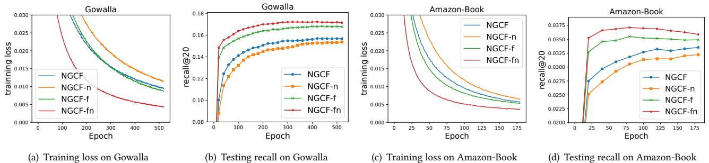

# LightGCN：简化和增强图卷积网络在推荐中的应用

何相南 中国科学技术大学 xiangnanhe@gmail.com 邓宽 中国科学技术大学 dengkuan@mail.ustc.edu.cn 王翔 新加坡国立大学 xiangwang@u.nus.edu 杨莉 北京快手科技有限公司 liyan@kuaishou.com 张永东 中国科学技术大学 zhyd73@ustc.edu.cn 王萌\* 合肥工业大学 eric.mengwang@gmail.com

# 摘要

图卷积网络（GCN）已成为协同过滤的新最先进技术。然而，其在推荐中的有效性原因尚不清楚。现有将GCN应用于推荐的工作缺乏对GCN的充分消融分析，而GCN最初是为图分类任务设计，并配备了许多神经网络操作。然而，我们经验发现，GCN中最常见的两个设计——特征变换和非线性激活——对协同过滤的性能贡献很小。更糟糕的是，包含它们增加了训练的难度，并降低了推荐性能。在本研究中，我们旨在简化GCN的设计，使其更加简洁，并适合推荐。我们提出了一种新的模型，名为LightGCN，仅包括GCN中最基本的组件——邻域聚合——用于协同过滤。具体而言，LightGCN通过在线性传播用户-物品交互图上学习用户和物品嵌入，并将所有层学习到的嵌入的加权和作为最终嵌入。这种简单、线性、整洁的模型更容易实现和训练，在完全相同的实验设置下，相较于基于最先进GCN的推荐模型Neural Graph Collaborative Filtering (NGCF)，表现出显著的改善（平均约为$16.0\%$的相对提升）。进一步从分析和经验两个视角提供了对简单LightGCN的合理性的分析。我们的实现可在TensorFlow和PyTorch中使用。

# CCS 概念

信息系统 $\longrightarrow$ 推荐系统。

# 关键词

协同过滤、推荐、嵌入传播、图神经网络

# ACM 参考格式：

Xiangnan He, Kuan Deng, Xiang Wang, Yan Li, Yongdong Zhang, 和 Meng Wang. 2020. LightGCN：简化和增强图卷积网络以进行推荐. 发表在第43届国际ACM SIGIR信息检索研究与发展会议（SIGIR '20）论文集, 2020年7月25日至30日, 虚拟会议, 中国. ACM, 纽约, NY, 美国, 10页. https://doi.org/10.1145/3397271.3401063

# 1 引言

为了解决网络信息过载的问题，推荐系统被广泛部署用于执行个性化信息过滤。推荐系统的核心在于预测用户是否会与某个项目进行交互，例如点击、评分、购买等交互形式。因此，协同过滤（CF）专注于利用过去的用户-项目交互来实现预测，仍然是实现有效个性化推荐的基本任务。协同过滤最常见的范式是学习潜在特征（即嵌入）来表示用户和项目，并基于嵌入向量进行预测。矩阵分解是早期的此类模型，直接将用户的单一 ID 投影到她的嵌入上。后来，几项研究发现，将用户 ID 与她的交互历史作为输入进行增强，可以提高嵌入的质量。例如，$\mathrm { S V D + + }$ 证明了用户交互历史在预测用户评分中的优势，而神经注意力项目相似度（NAIS）区分了交互历史中项目的重要性，并在预测项目排名时显示了改进。考虑到用户-项目交互图，这些改进可以被视为利用用户的子图结构——更具体地说，是她的一跳邻居——来改进嵌入学习所带来的。

为了深化高跳邻居的子图结构的使用，Wang 等人最近提出了 NGCF，并在协同过滤（CF）中实现了最先进的性能。它的灵感来自图卷积网络（GCN），遵循相同的传播规则来精炼嵌入：特征变换、邻域聚合和非线性激活。尽管 NGCF 显示出了有希望的结果，我们认为其设计相当繁重且负担沉重——许多操作是直接继承自 GCN，缺乏合理依据。因此，它们不一定对 CF 任务有用。具体来说，GCN 最初是为属性图中的节点分类而提出的，其中每个节点有丰富的属性作为输入特征；而在用于 CF 的用户-物品交互图中，每个节点（用户或物品）仅由一个独热编码 ID 描述，除了作为标识符外并没有具体的语义。在这种情况下，将 ID 嵌入作为输入，进行多层非线性特征变换——这是现代神经网络成功的关键——不会带来任何好处，反而会增加模型训练的难度。

为了验证我们的想法，我们对 NGCF 进行了广泛的消融实验。通过严格的对照实验（在相同的数据划分和评估协议上），我们得出结论，来自 GCN 的两个操作——特征变换和非线性激活——对 NGCF 的有效性没有贡献。更令人惊讶的是，移除它们反而导致了显著的准确率提升。这反映了在图神经网络中增加对目标任务无用的操作所带来的问题，这不仅没有任何好处，反而削弱了模型的有效性。受这些实证发现的启发，我们提出了一种名为 LightGCN 的新模型，其中包含了 GCN 最核心的组成部分——邻域聚合——用于协同过滤。具体而言，在将每个用户（项目）与 ID 嵌入关联之后，我们在用户-项目交互图中传播这些嵌入以进行优化。然后，我们通过加权求和将不同传播层学习到的嵌入结合，获得最终的嵌入用于预测。整个模型简单而优雅，既易于训练，又在实证性能上优于 NGCF 以及其他最先进的方法，如 Mult-VAE [28]。总而言之，这项工作主要做出以下贡献：• 我们通过实证表明，GCN 中的两个常见设计——特征变换和非线性激活——对协同过滤的有效性没有积极影响。• 我们提出的 LightGCN 大大简化了模型设计，仅包含 GCN 中推荐的最基本组成部分。我们在相同设置下实证比较了 LightGCN 和 NGCF，并展示了显著改进。我们从技术和实证两个角度提供了关于 LightGCN 合理性的深入分析。

# 2 前言

我们首先介绍 NGCF，一种代表性且最先进的图神经网络模型用于推荐。随后，我们对 NGCF 进行消融研究，以评估 NGCF 中每个操作的有效性。本节的创新贡献在于表明，图神经网络中的两种常见设计——特征变换和非线性激活——对协同过滤没有积极影响。

Table 1: Performance of NGCF and its three variants.   

<table><tr><td></td><td colspan="2">Gowalla</td><td colspan="2">Amazon-Book</td></tr><tr><td></td><td>recall</td><td>ndcg</td><td>recall</td><td>ndcg</td></tr><tr><td>NGCF</td><td>0.1547</td><td>0.1307</td><td>0.0330</td><td>0.0254</td></tr><tr><td>NGCF-f</td><td>0.1686</td><td>0.1439</td><td>0.0368</td><td>0.0283</td></tr><tr><td>NGCF-n</td><td>0.1536</td><td>0.1295</td><td>0.0336</td><td>0.0258</td></tr><tr><td>NGCF-fn</td><td>0.1742</td><td>0.1476</td><td>0.0399</td><td>0.0303</td></tr></table>

# 2.1 NGCF 简介

在初始步骤中，每个用户和项目都与一个ID嵌入相关联。让 ${ \bf e } _ { u } ^ { ( 0 ) }$ 表示用户 $u$ 的ID嵌入， ${ \bf e } _ { i } ^ { ( 0 ) }$ 表示项目 $i$ 的ID嵌入。然后，NGCF利用用户-项目交互图来传播嵌入，具体如下：

$$
\begin{array} { r l } & { { \mathbf { e } } _ { u } ^ { ( k + 1 ) } = \sigma \Big ( \mathbf { W } _ { 1 } { \mathbf { e } } _ { u } ^ { ( k ) } + \displaystyle \sum _ { i \in { \mathcal { N } _ { u } } } \frac { 1 } { \sqrt { | { \mathcal { N } } _ { u } | | { \mathcal { N } } _ { i } | } } ( \mathbf { W } _ { 1 } { \mathbf { e } } _ { i } ^ { ( k ) } + \mathbf { W } _ { 2 } ( { \mathbf { e } } _ { i } ^ { ( k ) } \odot { \mathbf { e } } _ { u } ^ { ( k ) } ) ) \Big ) , } \\ & { { \mathbf { e } } _ { i } ^ { ( k + 1 ) } = \sigma \Big ( \mathbf { W } _ { 1 } { \mathbf { e } } _ { i } ^ { ( k ) } + \displaystyle \sum _ { u \in { \mathcal { N } _ { i } } } \frac { 1 } { \sqrt { | { \mathcal { N } } _ { u } | | { \mathcal { N } } _ { i } | } } ( \mathbf { W } _ { 1 } { \mathbf { e } } _ { u } ^ { ( k ) } + \mathbf { W } _ { 2 } ( { \mathbf { e } } _ { u } ^ { ( k ) } \odot { \mathbf { e } } _ { i } ^ { ( k ) } ) ) \Big ) , } \end{array}
$$

其中 $\mathbf{e}_{u}^{(k)}$ 和 ${\bf e}_{i}^{(k)}$ 分别表示用户 $u$ 和物品 $i$ 在经过 $k$ 层传播后得到的表示，$\sigma$ 是非线性激活函数，$N_{u}$ 表示用户 $u$ 所交互的物品集合，$N_{i}$ 表示与物品 $i$ 交互的用户集合，$\mathbf{W}_{1}$ 和 $\mathbf{W}_{2}$ 是可训练的权重矩阵用于特征变换。通过传播 $L$ 层以及 $L + 1$ 层得到的表示为 $(\mathbf{e}_{u}^{(0)}, \bar{\mathbf{e}}_{u}^{(1)}, \ldots, \mathbf{e}_{u}^{(L)})$ 和 $(\mathbf{e}_{i}^{(0)}, \mathbf{e}_{i}^{(1)}, \ldots, \mathbf{e}_{i}^{(L)})$。然后将这些 $L + 1$ 个嵌入拼接，以获得最终的用户嵌入和物品嵌入，并使用内积来生成预测评分。NGCF 在很大程度上遵循了标准的 GCN [23]，包括使用非线性激活函数 $\sigma(\cdot)$ 和特征变换矩阵 $\mathbf{W}_{1}$ 及 ${\bf W}_{2}$。然而，我们认为这两种操作对于协同过滤并不那么有用。在半监督节点分类中，每个节点都有丰富的语义特征作为输入，例如论文的标题和摘要中的词汇。因此，进行多层非线性变换有利于特征学习。然而，在协同过滤中，用户-物品交互图的每个节点只有一个 ID 作为输入，缺乏具体语义。在这种情况下，进行多次非线性变换并不能有助于学习更好的特征；更糟的是，可能会增加训练的难度。在后续小节中，我们将提供实证证据来支持这一论点。

# 2.2 NGCF的实证探索

我们对 NGCF 进行消融研究，以探讨非线性激活和特征变换的影响。我们使用 ${ \mathrm { N G C F } } ^ { 3 }$ 的作者发布的代码，在相同的数据划分和评估协议上进行实验，以尽可能保持比较的公平性。由于 GCN 的核心是通过传播来优化嵌入，我们对相同嵌入大小下的嵌入质量更感兴趣。因此，我们将最终嵌入的获取方式从拼接（即 $\mathbf { e } _ { u } ^ { * } = \mathbf { e } _ { u } ^ { ( 0 ) } \lVert \cdots \rVert \mathbf { e } _ { u } ^ { ( L ) }$）更改为求和，即 ${ \bf e } _ { u } ^ { * } = { \bf e } _ { u } ^ { ( 0 ) } + \cdots + { \bf e } _ { u } ^ { ( L ) }$，这将使后续的消融研究更能反映 GCN 优化的嵌入质量。

  

Figure 1: Training curves (training loss and testing recall) of NGCF and its three simplified variants.

我们实现了三种简化的 NGCF 变体：NGCF-f，去除了特征转换矩阵 $\mathbf { W } _ { 1 }$ 和 $\mathbf { W } _ { 2 }$；NGCF-n，去除了非线性激活函数 $\sigma$；NGCF-fn，去除了特征转换矩阵和非线性激活函数。在这三种变体中，我们将所有超参数（例如学习率、正则化系数、失活比率等）保持与 NGCF 的最佳设置相同。我们在表 1 中报告了 Gowalla 和 Amazon-Book 数据集上 2 层设置的结果。可以看出，去除特征转换（即，NGCF-f）在所有三个数据集上相对于 NGCF 一致性地提高了性能。相反，去除非线性激活对准确度的影响不大。然而，如果我们在去除特征转换的基础上去除非线性激活（即，NGCF-fn），性能会显著提高。根据这些观察，我们得出以下结论：（1）添加特征转换对 NGCF 产生负面影响，因为在 NGCF 和 NGCF-n 的两种模型中去除它显著改善了性能；（2）在包含特征转换的情况下，添加非线性激活影响较小，但在禁用特征转换的情况下，则产生负面影响。（3）总体而言，特征转换和非线性激活对 NGCF 产生相当负面的影响，因为同时去除它们时，NGCF-fn 在召回率上相对于 NGCF 提升了 $9.57 \%$。为了更深入地理解表 1 中获得的分数，以及了解 NGCF 为什么会因这两种操作而恶化，我们在图 1 中绘制了由训练损失和测试召回记录的模型状态曲线。可以看出，NGCF-fn 在整个训练过程中相比 NGCF、NGCF-f 和 NGCF-n 达到了更低的训练损失。与测试召回曲线一致，我们发现这样的低训练损失成功转化为更好的推荐准确性。NGCF 和 NGCF-f 之间的比较显示了类似的趋势，唯一的区别是在改进幅度上较小。从这些证据中，我们可以得出结论，NGCF 的恶化源于训练困难，而不是过拟合。理论上讲，NGCF 的表示能力高于 NGCF-f，因为将权重矩阵 $\mathbf { W } _ { 1 }$ 和 $\mathbf { W } _ { 2 }$ 设置为单位矩阵 I 可以完全恢复 NGCF-f 模型。然而，在实际操作中，NGCF 显示出更高的训练损失和更差的泛化性能。而非线性激活的引入进一步加剧了表示能力与泛化性能之间的差异。为了总结本节内容，我们认为在设计推荐模型时，进行严格的消融研究非常重要，以明确每个操作的影响。否则，包含不太有用的操作将不必要地复杂化模型，增加训练难度，甚至降低模型的有效性。

# 3 方法

前面的部分展示了 NGCF 是一个沉重而负担沉重的图卷积网络模型，适用于协同过滤。基于这些发现，我们设定了开发一个轻量而有效的模型的目标，通过整合图卷积网络在推荐中的最核心成分。简单性的优势有很多——更具可解释性，训练和维护上实际更为简单，在技术上易于分析模型行为并朝向更有效的方向进行修正，等等。在本节中，我们首先呈现我们设计的轻量图卷积网络（LightGCN）模型，如图 2 所示。然后，我们对 LightGCN 进行深入分析，以展示其简单设计背后的合理性。最后，我们描述如何进行推荐模型的训练。

# 3.1 LightGCN

GCN 的基本思想是通过在图上平滑特征来学习节点的表示。为了实现这一点，它通过迭代地执行图卷积，即将邻居的特征聚合为目标节点的新表示。这种邻域聚合可以抽象为：

$$
\mathbf { e } _ { u } ^ { ( k + 1 ) } = \mathrm { A G G } ( \mathbf { e } _ { u } ^ { ( k ) } , \{ \mathbf { e } _ { i } ^ { ( k ) } : i \in N _ { u } \} ) .
$$

AGG 是一种聚合函数——图卷积的核心——它考虑了目标节点及其邻居节点在 $k$ 层的表示。许多研究对 AGG 进行了说明，例如 GIN 中的加权和聚合器 [42]、GraphSAGE 中的 LSTM 聚合器 [14] 和 BGNN 中的双线性交互聚合器 [48] 等。然而，大部分工作将特征变换或非线性激活与 AGG 函数结合在一起。尽管它们在具有语义输入特征的节点或图分类任务中表现良好，但对于协同过滤而言，它们可能会造成负担（参见第 2.2 节的初步结果）。

  
Light Graph Convolution (LGC)   

Figure 2: An illustration of LightGCN model architecture. In LGC, only the normalized sum of neighbor embeddings is performed towards next layer; other operations like self-connection, feature transformation, and nonlinear activation are all removed, which largely simplifies GCNs. In Layer Combination, we sum over the embeddings at each layer to obtain the final representations.

3.1.1 轻量级图卷积 (LGC)。在 LightGCN 中，我们采用简单的加权和聚合器，放弃特征变换和非线性激活的使用。LightGCN 中的图卷积操作（即传播规则 [39]）定义为：

$$
\begin{array} { r l r } & { } & { { \bf e } _ { u } ^ { ( k + 1 ) } = \displaystyle \sum _ { i \in { \cal N } _ { u } } \frac { 1 } { \sqrt { | { \cal N } _ { u } | } \sqrt { | { \cal N } _ { i } | } } { \bf e } _ { i } ^ { ( k ) } , } \\ & { } & { { \bf e } _ { i } ^ { ( k + 1 ) } = \displaystyle \sum _ { u \in { \cal N } _ { i } } \frac { 1 } { \sqrt { | { \cal N } _ { i } | } \sqrt { | { \cal N } _ { u } | } } { \bf e } _ { u } ^ { ( k ) } . } \end{array}
$$

对称归一化项 $\frac { 1 } { \sqrt { | \cal N _ { u } | } \sqrt { | \cal N _ { i } | } }$ 遵循标准 GCN 的设计 [23]，可以避免随着图卷积操作而导致的嵌入尺度增长；这里也可以应用其他选择，例如 $L _ { 1 }$ 范数，但我们在实证中发现这种对称归一化具有良好的性能（见第 4.4.2 节的实验结果）。值得注意的是，在 LGC 中，我们仅聚合连接的邻居，而不整合目标节点本身（即自连接）。这与大多数现有的图卷积操作 [14, 23, 36, 39, 48] 不同，后者通常会聚合扩展的邻居，并需要特别处理自连接。接下来将介绍的层组合操作，本质上能够捕捉与自连接相同的效果。因此，在 LGC 中没有必要包括自连接。3.1.2 层组合与模型预测。在 LightGCN 中，唯一可训练的模型参数是 0 层的嵌入，即所有用户的 ${ \bf e } _ { u } ^ { ( 0 ) }$ 和所有项目的 ${ \bf e } _ { i } ^ { ( 0 ) }$。当给定这些参数后，可以通过方程 (3) 定义的 LGC 计算更高层的嵌入。经过 $K$ 层 LGC 后，我们进一步结合每层获得的嵌入，形成用户（或项目）的最终表示：

$$
{ \bf e } _ { u } = \sum _ { k = 0 } ^ { K } \alpha _ { k } { \bf e } _ { u } ^ { ( k ) } ; ~ { \bf e } _ { i } = \sum _ { k = 0 } ^ { K } \alpha _ { k } { \bf e } _ { i } ^ { ( k ) } ,
$$

其中 $\alpha _ { k } \geq 0$ 表示第 $k$ 层嵌入在构成最终嵌入中的重要性。它可以作为超参数手动调优，或作为模型参数（例如，注意力网络的输出 [3]）自动优化。在我们的实验中，我们发现将 $\alpha _ { k }$ 统一设置为 $1 / ( K + 1 )$ 通常能获得良好的性能。因此，我们并没有设计专门的组件来优化 $\alpha _ { k }$，以避免不必要地复杂化 LightGCN，并保持其简单性。我们进行层组合以获得最终表示的原因有三个。（1）随着层数的增加，嵌入会过于平滑 [27]。因此，简单地使用最后一层是有问题的。（2）不同层的嵌入捕获不同的语义。例如，第一层在具有交互的用户和物品之间强制平滑，第二层平滑在交互物品（用户）上有重叠的用户（物品），而高层捕获高阶邻近性 [39]。因此，组合它们会使表示更加全面。（3）用加权和组合不同层的嵌入捕获了图卷积及自连接的效果，这在 GCN 中是一个重要的技巧（证明见第 3.2.1 节）。模型预测被定义为用户和物品最终表示的内积：

$$
{ \hat { y } } _ { u i } = \mathbf { e } _ { u } ^ { T } \mathbf { e } _ { i } ,
$$

用于推荐生成的 ranking score。3.1.3 矩阵形式。我们提供 LightGCN 的矩阵形式，以便于实现和与现有模型的讨论。设用户-物品交互矩阵为 $\mathbf{R} \in \mathbb{R}^{M \times N}$，其中 $M$ 和 $N$ 分别表示用户和物品的数量，每个条目 $R_{ui}$ 若用户 $u$ 与物品 $i$ 互动则为 1，否则为 0。然后，我们得到用户-物品图的邻接矩阵为

$$
\mathbf { A } = \left( \begin{array} { l l } { \mathbf { 0 } } & { \mathbf { R } } \\ { \mathbf { R } ^ { T } } & { \mathbf { 0 } } \end{array} \right) ,
$$

设 0 层嵌入矩阵为 $\mathbf { E } ^ { ( 0 ) } \in \mathbb { R } ^ { ( M + N ) \times T }$，其中 $T$ 是嵌入大小。然后我们可以得到 LGC 的矩阵等效形式为：

$$
\mathbf { E } ^ { ( k + 1 ) } = ( \mathbf { D } ^ { - \frac { 1 } { 2 } } \mathbf { A } \mathbf { D } ^ { - \frac { 1 } { 2 } } ) \mathbf { E } ^ { ( k ) } ,
$$

其中 $\mathbf { D }$ 是一个 $( M + N ) \times ( M + N )$ 对角矩阵，其中每个条目 $D _ { i i }$ 表示邻接矩阵 $A$ 中第 $i$ 行向量的非零条目数量（也称为度矩阵）。最后，我们得到用于模型预测的最终嵌入矩阵为：

$$
\begin{array} { r } { \mathbf { E } = \alpha _ { 0 } \mathbf { E } ^ { ( 0 ) } + \alpha _ { 1 } \mathbf { E } ^ { ( 1 ) } + \alpha _ { 2 } \mathbf { E } ^ { ( 2 ) } + \ldots + \alpha _ { K } \mathbf { E } ^ { ( K ) } \phantom { x x x x x x x x x x x x x x x x x x x x x x x x x x x x x } } \\ { = \alpha _ { 0 } \mathbf { E } ^ { ( 0 ) } + \alpha _ { 1 } \tilde { \mathbf { A } } \mathbf { E } ^ { ( 0 ) } + \alpha _ { 2 } \tilde { \mathbf { A } } ^ { 2 } \mathbf { E } ^ { ( 0 ) } + \ldots + \alpha _ { K } \tilde { \mathbf { A } } ^ { K } \mathbf { E } ^ { ( 0 ) } , } \end{array}
$$

其中 $\tilde { \mathbf { A } } = \mathbf { D } ^ { - \frac { 1 } { 2 } } \mathbf { A } \mathbf { D } ^ { - \frac { 1 } { 2 } }$ 是对称归一化的矩阵。

# 3.2 模型分析

我们进行模型分析，以展示LightGCN简洁设计背后的合理性。首先，我们讨论与简化GCN（SGCN）[40]的关联，SGCN是一个最新的线性GCN模型，将自连接集成到图卷积中；这一分析表明，通过层组合，LightGCN包含了自连接的效果，因此LightGCN不需要在邻接矩阵中添加自连接。接下来，我们讨论与近似个性化神经预测传播（APPNP）[24]的关系，该模型是一个新的GCN变体，通过借鉴个性化PageRank [15]来解决过平滑问题；这一分析显示了LightGCN与APPNP之间的基本等价性，因此我们的LightGCN在长幅耦合传播时享有可控的过平滑带来的相同好处。最后，我们分析第二层LGC，展示它如何平滑用户及其二阶邻居，为理解LightGCN的工作机制提供更多见解。 3.2.1 与SGCN的关系。在[40]中，作者论述了GCN在节点分类中的不必要复杂性，并提出了SGCN，它通过去除非线性和将权重矩阵归约为一个权重矩阵来简化GCN。SGCN中的图卷积定义为 $\mathsf{a s}^{4}$：

$$
\mathbf { E } ^ { ( k + 1 ) } = ( \mathbf { D } + \mathbf { I } ) ^ { - { \frac { 1 } { 2 } } } ( \mathbf { A } + \mathbf { I } ) ( \mathbf { D } + \mathbf { I } ) ^ { - { \frac { 1 } { 2 } } } \mathbf { E } ^ { ( k ) } ,
$$

其中 $\mathbf{I} \in \mathbb{R}^{(M + N) \times (M + N)}$ 以包含自连接。在下面的分析中，为了简化，我们省略 $(\mathbf{D} + \mathbf{I})^{-\frac{1}{2}}$ 项，因为它们仅仅是重新缩放嵌入。在 SGCN 中，最后一层获得的嵌入用于下游预测任务，可以表示为：

$$
\begin{array} { r l r } {  { \mathbf { E } ^ { ( K ) } = ( \mathbf { A } + \mathbf { I } ) \mathbf { E } ^ { ( K - 1 ) } = ( \mathbf { A } + \mathbf { I } ) ^ { K } \mathbf { E } ^ { ( 0 ) } } } \\ & { } & { = { \binom { K } { 0 } } \mathbf { E } ^ { ( 0 ) } + { \binom { K } { 1 } } \mathbf { A } \mathbf { E } ^ { ( 0 ) } + { \binom { K } { 2 } } \mathbf { A } ^ { 2 } \mathbf { E } ^ { ( 0 ) } + \ldots + { \binom { K } { K } } \mathbf { A } ^ { K } \mathbf { E } ^ { ( 0 ) } . } \end{array}
$$

上述推导表明，将自连接插入 A 并在其上传播嵌入，实质上等价于在每个 LGC 层传播的嵌入的加权和。3.2.2 与 APPNP 的关系。在最近的一项工作 [24] 中，作者将 GCN 与个性化页面排名 (Personalized PageRank) [15] 进行了连接，从中获得灵感提出了一种名为 APPNP 的 GCN 变体，该变体可以在不出现过平滑风险的情况下进行长距离传播。受个性化页面排名中传送设计的启发，APPNP 在每个传播层中补充了起始特征（即第0层嵌入），这可以平衡保留局部性（即保持接近根节点以减轻过平滑现象）和利用大范围邻域信息的需求。APPNP 中的传播层定义为：

$$
\mathbf { E } ^ { ( k + 1 ) } = \beta \mathbf { E } ^ { ( 0 ) } + ( 1 - \beta ) \tilde { \mathbf { A } } \mathbf { E } ^ { ( k ) } ,
$$

其中 $\beta$ 是控制在传播过程中保留起始特征的传送概率，$\tilde { \bf A }$ 表示标准化的邻接矩阵。在 APPNP 中，最后一层用于最终预测，即：

$$
\begin{array} { r l } & { \mathbf { E } ^ { ( K ) } = \beta \mathbf { E } ^ { ( 0 ) } + ( 1 - \beta ) \tilde { \mathbf { A } } \mathbf { E } ^ { ( K - 1 ) } , } \\ & { \qquad = \beta \mathbf { E } ^ { ( 0 ) } + \beta ( 1 - \beta ) \tilde { \mathbf { A } } \mathbf { E } ^ { ( 0 ) } + ( 1 - \beta ) ^ { 2 } \tilde { \mathbf { A } } ^ { 2 } \mathbf { E } ^ { ( K - 2 ) } } \\ & { \qquad = \beta \mathbf { E } ^ { ( 0 ) } + \beta ( 1 - \beta ) \tilde { \mathbf { A } } \mathbf { E } ^ { ( 0 ) } + \beta ( 1 - \beta ) ^ { 2 } \tilde { \mathbf { A } } ^ { 2 } \mathbf { E } ^ { ( 0 ) } + \ldots + ( 1 - \beta ) ^ { K } \tilde { \mathbf { A } } ^ { K } \mathbf { E } ^ { ( 0 ) } . } \end{array}
$$

与方程 (8) 一致，我们可以通过相应设置 $\alpha _ { k }$，使 LightGCN 能够完全恢复 APPNP 所使用的预测嵌入。因此，LightGCN 在对抗过度平滑方面继承了 APPNP 的优势——通过适当设置 $\alpha$，我们允许使用较大的 $K$ 进行长距离建模，同时可控地避免过度平滑。另一个小区别是 APPNP 在邻接矩阵中添加了自连接。然而，正如我们之前所示，由于不同层的加权和，这种自连接是多余的。3.2.3 二阶嵌入平滑性。由于 LightGCN 的线性和简单性，我们可以更深入地了解它是如何平滑嵌入的。在这里，我们分析一个 2 层的 LightGCN 来证明其合理性。以用户端为例，直观上，第二层平滑了在交互项上有重叠的用户。更具体地说，我们有：

$$
\mathbf { e } _ { u } ^ { ( 2 ) } = \sum _ { i \in { \cal N } _ { u } } \frac { 1 } { \sqrt { | { \cal N } _ { u } | } \sqrt { | { \cal N } _ { i } | } } \mathbf { e } _ { i } ^ { ( 1 ) } = \sum _ { i \in { \cal N } _ { u } } \frac { 1 } { | { \cal N } _ { i } | } \sum _ { v \in { \cal N } _ { i } } \frac { 1 } { \sqrt { | { \cal N } _ { u } | } \sqrt { | { \cal N } _ { v } | } } \mathbf { e } _ { v } ^ { ( 0 ) } .
$$

我们可以看到，如果另一个用户 $^ { v }$ 与目标用户 $u$ 进行了共同交互，则 $^ { v }$ 对 $u$ 的平滑强度通过系数进行测量（否则为0）：

$$
c _ { v - > u } = \frac { 1 } { \sqrt { | { \cal N } _ { u } | } \sqrt { | { \cal N } _ { v } | } } \sum _ { i \in { \cal N } _ { u } \cap { \cal N } _ { v } } \frac { 1 } { | { \cal N } _ { i } | } .
$$

这个系数具有较强的可解释性：二阶邻居 $^ { v }$ 对 $u$ 的影响由以下三个因素决定：1) 共同交互项目的数量，数量越多影响越大；2) 共同交互项目的受欢迎程度，受欢迎程度越低（即越能指示用户个性化偏好）影响越大；3) $^ { v } $ 的活跃度，活跃度越低影响越大。这种可解释性很好地契合了协同过滤在衡量用户相似性时的假设 [2, 37]，并证明了 LightGCN 的合理性。由于 LightGCN 的对称公式，我们可以在项目端进行类似的分析。

# 3.3 模型训练

LightGCN 的可训练参数仅为第 0 层的嵌入，即 $\boldsymbol { \Theta } = \{ { \bf E } ^ { ( 0 ) } \}$；换句话说，模型的复杂度与标准矩阵分解（MF）相同。我们采用了贝叶斯个性化排序（BPR）损失 [32]，这是一种成对损失，鼓励对观察到的条目进行预测时，其值高于未观察到的条目：

$$
L _ { B P R } = - \sum _ { u = 1 } ^ { M } \sum _ { i \in N _ { u } } \sum _ { j \notin N _ { u } } \ln \sigma ( \hat { y } _ { u i } - \hat { y } _ { u j } ) + \lambda | | \mathbf { E } ^ { ( 0 ) } | | ^ { 2 }
$$

其中 $\lambda$ 控制 $L_2$ 正则化强度。我们采用 Adam [22] 优化器并以小批量方式使用它。我们知道其他先进的负采样策略可能会改善 LightGCN 的训练，例如硬负采样 [31] 和对抗性采样 [9]。我们将这一扩展留待未来，因为这不是本研究的重点。值得注意的是，我们没有引入 dropout 机制，这是 GCN 和 NGCF 中常用的。原因在于 LightGCN 中没有特征变换权重矩阵，因此在嵌入层施加 $L_2$ 正则化已经足够防止过拟合。这展示了 LightGCN 简单的优点——与 NGCF 相比，它更易于训练和调优，而后者还需要调节两个 dropout 比例（节点 dropout 和消息 dropout）并将每层的嵌入归一化为单位长度。

Table 2: Statistics of the experimented data.   

<table><tr><td rowspan=1 colspan=1>Dataset</td><td rowspan=1 colspan=1>User #</td><td rowspan=1 colspan=1>Item #</td><td rowspan=1 colspan=1>Interaction #</td><td rowspan=1 colspan=1>Density</td></tr><tr><td rowspan=1 colspan=1>Gowalla</td><td rowspan=1 colspan=1>29,858</td><td rowspan=1 colspan=1>40,981</td><td rowspan=1 colspan=1>1,027,370</td><td rowspan=1 colspan=1>0.00084</td></tr><tr><td rowspan=1 colspan=1>Yelp2018</td><td rowspan=1 colspan=1>31,668</td><td rowspan=1 colspan=1>38,048</td><td rowspan=1 colspan=1>1,561, 406</td><td rowspan=1 colspan=1>0.00130</td></tr><tr><td rowspan=1 colspan=1>Amazon-Book</td><td rowspan=1 colspan=1>52,643</td><td rowspan=1 colspan=1>91,599</td><td rowspan=1 colspan=1>2,984, 108</td><td rowspan=1 colspan=1>0.00062</td></tr></table>

此外，技术上可以将 $\{ \alpha _ { k } \} _ { k = 0 } ^ { K }$ 视为变量：该层的 $\alpha$ 数据未能带来改进。这可能是因为训练数据中缺乏足够的信号以学习能够推广到未知数据的良好 $\alpha$。我们还尝试从验证数据中学习 $\alpha$，受到文献 [5] 的启发，该文献在验证数据上学习超参数。性能略有提升（不到 $1\%$）。我们将探索最佳设置 $\alpha$（例如，为不同用户和物品进行个性化）作为未来的工作。

# 4 实验

我们首先描述实验设置，然后与 NGCF 方法进行详细比较，该方法与 LightGCN 最为相关但更加复杂（第 4.2 节）。接下来在第 4.3 节中与其他最先进的方法进行比较。为了验证 LightGCN 中的设计并揭示其有效性的原因，我们在第 4.4 节中进行消融研究和嵌入分析。超参数研究最终在第 4.5 节中展示。

# 4.1 实验设置

为了减少实验工作量并保持比较的公平性，我们紧密遵循NGCF工作的设置。我们向作者请求实验数据集（包括训练/测试划分），其统计信息显示在表2中。Gowalla和Amazon-Book与NGCF论文中使用的完全相同，因此我们直接采用NGCF论文中的结果。唯一的例外是Yelp2018数据，它是一个修订版本。根据作者的说法，之前的版本未能在测试集中过滤掉冷启动项目，他们仅与我们共享了修订版本。因此，我们在Yelp2018数据上重新运行了NGCF。评估指标为召回率 $@ 2 0$ 和NDCG $@ 2 0$，由全排名协议计算——所有未被用户交互的项目为候选项。 4.1.1 对比方法。主要的竞争方法是NGCF，已有研究表明其优于多种方法，包括基于GCN的模型GC-MC和PinSage，基于神经网络的模型NeuMF和CMN，以及基于矩阵分解的模型MF和HOP-Rec。由于比较是在相同的数据集和相同的评估协议下进行，我们不再进一步比较这些方法。除了NGCF，我们还进一步与两个相关且具有竞争力的协同过滤方法进行比较：Mult-VAE。这是一种基于变分自编码器（VAE）的项目协同过滤方法。它假设数据源自多项式分布，并使用变分推断进行参数估计。我们运行了作者发布的代码，调整了[0, 0.2, 0.5]范围内的丢弃率和[0.2, 0.4, 0.6, 0.8]范围内的$\beta$。模型架构为论文中建议的结构：$6 0 0 \to 2 0 0 \to 6 0 0$。 GRMF。这种方法通过增加图拉普拉斯正则化器来平滑矩阵分解。为了在项目推荐中进行公平比较，我们将评分预测损失更改为BPR损失。GRMF的目标函数为：

$$
L = - \sum _ { u = 1 } ^ { M } \sum _ { i \in { \cal N } _ { u } } \bigg ( \sum _ { j \notin { \cal N } _ { u } } \ln \sigma ( { \bf e } _ { u } ^ { T } { \bf e } _ { i } - { \bf e } _ { u } ^ { T } { \bf e } _ { j } ) + \lambda _ { g } \vert \vert { \bf e } _ { u } - { \bf e } _ { i } \vert \vert ^ { 2 } \bigg ) + \lambda \vert \vert { \bf E } \vert \vert ^ { 2 } ,
$$

其中 $\lambda _ { g }$ 的搜索范围为 $[ 1 e ^ { - 5 } , 1 e ^ { - 4 } , . . . , 1 e ^ { - 1 } ]$。此外，我们还比较了一种变体，该变体在图拉普拉斯算子中添加了归一化：$\lambda _ { g } || \frac { { \bf e } _ { u } } { \sqrt { | N _ { u } | } } \ : - \ : \frac { { \bf e } _ { i } } { \sqrt { | N _ { i } | } } || ^ { 2 }$，称为 GRMF-norm。其他超参数设置与 LightGCN 相同。这两种 GRMF 方法通过拉普拉斯正则化比较嵌入平滑的性能，而我们的 LightGCN 在预测模型中实现了嵌入平滑。

4.1.2 超参数设置。与NGCF相同，所有模型的嵌入大小固定为64，嵌入参数使用Xavier方法初始化。我们使用Adam优化LightGCN，并采用默认学习率0.001和默认小批量大小1024（在Amazon-Book上，我们将小批量大小增加到2048以提高速度）。$L_{2}$正则化系数$\lambda$的搜索范围为$\{1e^{-6}, 1e^{-5}, \ldots, 1e^{-2}\}$，在大多数情况下，最佳值为$1e^{-4}$。层组合系数$\alpha_{k}$统一设置为$\frac{1}{1+K}$，其中$K$在1到4的范围内，当$K$等于3时可获得满意的性能。提前停止和验证策略与NGCF相同。通常，1000个训练周期足以使LightGCN收敛。我们的实现可在TensorFlow和PyTorch中获得。

# 4.2 与 NGCF 的性能比较

我们对 NGCF 进行了详细比较，并在表 4 中记录了不同层次（1 到 4）的性能，同时显示了每个指标的相对改进百分比。我们进一步在图 3 中绘制了训练损失和测试召回率的训练曲线，以揭示 LightGCN 的优势，并明确训练过程。主要观察结果如下：

在所有情况下，LightGCN 的表现均显著优于 NGCF。例如，在 Gowalla 数据集上，NGCF 论文中报告的最高召回率为 0.1570，而我们的 LightGCN 在 4 层设置下可以达到 0.1830，提升了 $1 6 . 5 6 \%$。在三个数据集上的平均召回率提升为 $1 6 . 5 2 \%$，而 ndcg 的提升为 $1 6 . 8 7 \%$，这些提升都相当显著。• 将表 4 与第 2 节的表 1 对齐，我们可以看到 LightGCN 的表现优于 NGCF-fn，即去除了特征变换和非线性激活的 NGCF 变体。由于 NGCF-fn 仍然包含比 LightGCN 更多的操作（例如，自连接、用户嵌入与项目嵌入在图卷积中的交互和 dropout），这表明这些操作对于 NGCF-fn 可能也是无用的。

Table 3: Performance comparison between NGCF and LightGCN at different layers.   

<table><tr><td colspan="2">Dataset</td><td colspan="2">Gowalla</td><td colspan="2">Yelp2018</td><td colspan="2">Amazon-Book</td></tr><tr><td rowspan="2">Layer #</td><td>Method</td><td>recall</td><td>ndcg</td><td>recall</td><td>ndcg</td><td>recall</td><td>ndcg</td></tr><tr><td>NGCF</td><td>0.1556</td><td>0.1315</td><td>0.0543</td><td>0.0442</td><td>0.0313</td><td>0.0241</td></tr><tr><td rowspan="2">1 Layer</td><td>LightGCN</td><td>0.1755(+12.79%)</td><td>0.1492(+13.46%)</td><td>0.0631(+16.20%)</td><td>0.0515(+16.51%)</td><td>0.0384(+22.68%)</td><td>0.0298(+23.65%)</td></tr><tr><td>NGCF</td><td>0.1547</td><td>0.1307</td><td>0.0566</td><td>0.0465</td><td>0.0330</td><td>0.0254</td></tr><tr><td rowspan="2">2 Layers 3 Layers</td><td>LightGCN</td><td>0.1777(+14.84%)</td><td>0.1524(+16.60%)</td><td>0.0622(+9.89%)</td><td>0.0504(+8.38%)</td><td>0.0411(+24.54%)</td><td>0.0315(+24.02%)</td></tr><tr><td>NGCF</td><td>0.1569</td><td>0.1327</td><td>0.0579</td><td>0.0477</td><td>0.0337</td><td>0.0261</td></tr><tr><td rowspan="2"></td><td>LightGCN</td><td>0.1823(+16.19%)</td><td>0.1555(+17.18%)</td><td>0.0639(+10.38%)</td><td>0.0525(+10.06%)</td><td>0.0410(+21.66%)</td><td>0.0318(+21.84%)</td></tr><tr><td>NGCF</td><td>0.1570</td><td>0.1327</td><td>0.0566</td><td>0.0461</td><td>0.0344</td><td>0.0263</td></tr><tr><td>4 Layers</td><td>LightGCN</td><td>0.1830(+16.56%)</td><td>0.1550(+16.80%)</td><td>0.0649(+14.58%)</td><td>0.0530(+15.02%)</td><td>0.0406(+17.92%)</td><td>0.0313(+18.92%)</td></tr></table>

  
ur Gowalla and Amazon-Book (results on Yelp2018 show exactly the same trend which are omitted for space).

增加层数可以提高性能，但收益会逐渐减少。一般观察到，从0（即矩阵分解模型，结果见[39]）增加层数到1时，性能提升最大，而使用3层在大多数情况下可以达到令人满意的性能。这一观察与NGCF的发现是一致的。在训练过程中，LightGCN始终获得较低的训练损失，这表明LightGCN对训练数据的拟合优于NGCF。此外，较低的训练损失成功转化为更好的测试准确率，表明LightGCN具有较强的泛化能力。相比之下，NGCF的较高训练损失和较低测试准确率反映出训练如此复杂模型的实际困难。需要注意的是，在图中我们展示了两种方法在最佳超参数设置下的训练过程。尽管增加NGCF的学习率可以降低其训练损失（甚至低于LightGCN），但测试召回率并没有得到提升，因为以这种方式降低训练损失只会找到NGCF的微不足道解。

# 4.3 与最先进技术的性能比较

表4展示了与竞争方法的性能比较。我们显示了每种方法可以获得的最佳分数。可以看出，LightGCN在所有三个数据集上始终优于其他方法，证明了其高效性，设计简单而合理。注意，LightGCN可以通过调整$\alpha _{k}$进一步改进（见图4以获取证据），而这里选择$\frac{1}{K + 1}$以避免过度调整。在基线方法中，Mult-VAE展现了最强的性能，优于GRMF和NGCF。GRMF的性能与NGCF相当，优于MF，这表明了通过拉普拉斯正则化器强制嵌入光滑性的有效性。通过在拉普拉斯正则化器中添加归一化，GRMFnorm在Gowalla上优于GRMF，而在Yelp2018和Amazon-Book上则没有带来好处。

Table 4: The comparison of overall performance among LightGCN and competing methods.   

<table><tr><td>Dataset</td><td colspan="2">Gowalla</td><td colspan="2">Yelp2018</td><td colspan="2">Amazon-Book</td></tr><tr><td>Method</td><td>recall</td><td>ndcg</td><td>recall</td><td>ndcg</td><td>recall</td><td>ndcg</td></tr><tr><td>NGCF</td><td>0.1570</td><td>0.1327</td><td>0.0579</td><td>0.0477</td><td>0.0344</td><td>0.0263</td></tr><tr><td>Mult-VAE</td><td>0.1641</td><td>0.1335</td><td>0.0584</td><td>0.0450</td><td>0.0407</td><td>0.0315</td></tr><tr><td>GRMF</td><td>0.1477</td><td>0.1205</td><td>0.0571</td><td>0.0462</td><td>0.0354</td><td>0.0270</td></tr><tr><td>GRMF-norm</td><td>0.1557</td><td>0.1261</td><td>0.0561</td><td>0.0454</td><td>0.0352</td><td>0.0269</td></tr><tr><td>LightGCN</td><td>0.1830</td><td>0.1554</td><td>0.0649</td><td>0.0530</td><td>0.0411</td><td>0.0315</td></tr></table>

# 4.4 消融实验与有效性分析

我们对 LightGCN 进行了消融研究，展示了层组合和对称平方根归一化如何影响其性能。为了证明 LightGCN 的合理性，如第 3.2.3 节所分析，我们进一步研究了嵌入平滑性的影响——这是 LightGCN 有效性的关键原因。4.4.1 层组合的影响。图 4 显示了 LightGCN 及其变体 LightGCN-single 的结果，后者不使用层组合（即，$\mathbf { E } ^ { ( K ) }$ 用于 $K$ 层 LightGCN 的最终预测）。由于篇幅限制，我们省略了 Yelp2018 的结果，后者与 Amazon-Book 显示了相似的趋势。我们有三个主要观察结果：• 在 LightGCN-single 上，我们发现当层数增加时，其性能先提高然后下降。

  
nhoy o GowallanBok sulelp2018 howe eewmBoohici.

Table 5: Performance of the 3-layer LightGCN with different choices of normalization schemes in graph convolution.   

<table><tr><td>Dataset</td><td colspan="2">Gowalla</td><td colspan="2">Yelp2018</td><td colspan="2">Amazon-Book</td></tr><tr><td>Method</td><td>recall</td><td>ndcg</td><td>recall</td><td>ndcg</td><td>recall</td><td>ndcg</td></tr><tr><td>LightGCN-L1-L</td><td>0.1724</td><td>0.1414</td><td>0.0630</td><td>0.0511</td><td>0.0419</td><td>0.0320</td></tr><tr><td>LightGCN-L1-R</td><td>0.1578</td><td>0.1348</td><td>0.0587</td><td>0.0477</td><td>0.0334</td><td>0.0259</td></tr><tr><td>LightGCN-L1</td><td>0.159</td><td>0.1319</td><td>0.0573</td><td>0.0465</td><td>0.0361</td><td>0.0275</td></tr><tr><td>LightGCN-L</td><td>0.1589</td><td>0.1317</td><td>0.0619</td><td>0.0509</td><td>0.0383</td><td>0.0299</td></tr><tr><td>LightGCN-R</td><td>0.1420</td><td>0.1156</td><td>0.0521</td><td>0.0401</td><td>0.0252</td><td>0.0196</td></tr><tr><td>LightGCN</td><td>0.1830</td><td>0.1554</td><td>0.0649</td><td>0.0530</td><td>0.0411</td><td>0.0315</td></tr></table>

方法符号：-L表示仅使用左侧范数，-R表示仅使用右侧范数，而${ - } L _ { 1 }$表示使用$L _ { 1 }$范数。1到4。在大多数情况下，峰值出现在第2层，而此后迅速下降至第4层的最差水平。这表明，用一阶和二阶邻居平滑节点的嵌入对CF非常有用，但当使用高阶邻居时会出现过平滑的问题。专注于LightGCN，我们发现其性能随着层数的增加而逐渐提高。即使使用4层，LightGCN的性能也没有下降。这验证了层组合在解决过平滑问题上的有效性，正如我们在第3.2.2节中技术分析的（与APPNP的关系）。• 对比这两种方法，我们发现LightGCN在Gowalla上始终优于LightGCN-single，但在AmazonBook和Yelp2018上则不是（在这些情况下，2层的LightGCN-single表现最佳）。关于这一现象，需要注意两个要点，然后才能得出结论：1）LightGCN-single是LightGCN的特例，将$\alpha _ { K }$设置为1，而其他$\alpha _ { k }$设置为$0$；2）我们并没有调整$\alpha _ { k }$，而是统一将其设置为$\frac { 1 } { K + 1 }$以用于LightGCN。因此，我们可以看到进一步增强LightGCN性能的潜力，方法是调整$\alpha _ { k }$。4.4.2 对对称平方根归一化的影响。在LightGCN中，我们在执行邻域聚合时对每个邻居嵌入采用对称平方根归一化$\frac { 1 } { \sqrt { | \boldsymbol { N _ { u } } | } \sqrt { | \boldsymbol { N } _ { i } | } }$（参见公式(3)）。为了研究其合理性，我们在这里探索不同的选择。我们测试仅在左侧（即目标节点的系数）和右侧（即邻居节点的系数）使用归一化。我们还测试了$L _ { 1 }$归一化，即去除平方根。请注意，如果去除归一化，训练会变得数值不稳定并出现无值（NAN）问题，因此我们不显示这种设置。表5显示了3层LightGCN的结果。我们有以下观察：

Table 6: Smoothness loss of the embeddings learned by LightGCN and MF (the lower the smoother).   

<table><tr><td rowspan=1 colspan=1>Dataset</td><td rowspan=1 colspan=1>Gowalla</td><td rowspan=1 colspan=1>Yelp2018</td><td rowspan=1 colspan=1>Amazon-book</td></tr><tr><td rowspan=1 colspan=1></td><td rowspan=1 colspan=3>Smoothness of User Embeddings</td></tr><tr><td rowspan=1 colspan=1>MF</td><td rowspan=1 colspan=1>15449.3</td><td rowspan=1 colspan=1>16258.2</td><td rowspan=1 colspan=1>38034.2</td></tr><tr><td rowspan=1 colspan=1>LightGCN-single</td><td rowspan=1 colspan=1>12872.7</td><td rowspan=1 colspan=1>10091.7</td><td rowspan=1 colspan=1>32191.1</td></tr><tr><td rowspan=1 colspan=1></td><td rowspan=1 colspan=3>Smoothness of Item Embeddings</td></tr><tr><td rowspan=1 colspan=1>MF</td><td rowspan=1 colspan=1>12106.7</td><td rowspan=1 colspan=1>16632.1</td><td rowspan=1 colspan=1>28307.9</td></tr><tr><td rowspan=1 colspan=1>LightGCN-single</td><td rowspan=1 colspan=1>5829.0</td><td rowspan=1 colspan=1>6459.8</td><td rowspan=1 colspan=1>16866.0</td></tr></table>

一般来说，最佳设置是在两侧都使用平方根归一化（即当前的LightGCN设计）。去掉任意一侧都会大幅降低性能。 第二佳设置是在左侧仅使用$L _ { 1 }$归一化（即LightGCN.$ L _ { 1 }$-L）。这相当于通过入度将邻接矩阵归一化为随机矩阵。 • 在两侧对称归一化对于平方根归一化是有帮助的，但会降低$L _ { 1 }$归一化的性能。 4.4.3 嵌入平滑度分析。正如我们在3.2.3节分析的那样，一个2层的LightGCN根据与用户在交互项目上重叠的用户对用户的嵌入进行平滑，而两个用户之间的平滑强度$c _ { v u }$在方程（14）中进行测量。我们推测这种嵌入的平滑是LightGCN有效性的关键原因。为了验证这一点，我们首先将用户嵌入的平滑度定义为：

$$
S _ { U } = \sum _ { u = 1 } ^ { M } \sum _ { v = 1 } ^ { M } c _ { v  u } ( \frac { \mathbf { e } _ { u } } { | | \mathbf { e } _ { u } | | ^ { 2 } } - \frac { \mathbf { e } _ { v } } { | | \mathbf { e } _ { v } | | ^ { 2 } } ) ^ { 2 } ,
$$

在嵌入上使用 $L_{2}$ 范数以消除嵌入尺度的影响。类似地，我们可以获得物品嵌入的定义。表 6 显示了两种模型的平滑性，矩阵分解（即使用 $\mathbf{E}^{(0)}$ 进行模型预测）和 2 层 LightGCN-single（即使用 $\mathbf{E}^{(2)}$ 进行预测）。值得注意的是，2 层 LightGCN-single 在推荐准确性上大幅超过了 MF。可见，LightGCN-single 的平滑损失远低于 MF。这表明通过进行轻量图卷积，嵌入变得更加平滑，更适合推荐。

  

Figure 5: Performance of 2-layer LightGCN w.r.t. different regularization coefficient $\lambda$ on Yelp and Amazon-Book.

# 4.5 超参数研究

在将 LightGCN 应用到新数据集时，除了标准超参数学习率外，最重要的超参数是 $L _ { 2 }$ 正则化系数 λ。我们研究了 LightGCN 在 λ 变化下的性能变化。如图 5 所示，LightGCN 对 λ 相对不敏感——即使将 λ 设置为 0，LightGCN 的表现仍优于 NGCF，后者还额外使用了 dropout 来防止过拟合。这表明 LightGCN 更不容易过拟合——由于 LightGCN 中唯一可训练的参数是 0 层的 ID 嵌入，整个模型易于训练和正则化。Yelp2018、Amazon-Book 和 Gowalla 的最佳值分别为 $1 e ^ { - 3 }$、$1 e ^ { - 4 }$ 和 $1 e ^ { - 4 }$。当 λ 大于 $1 e ^ { - 3 }$ 时，性能迅速下降，这表明过强的正则化会对模型的正常训练产生负面影响，且不被鼓励。

# 5 相关工作

# 5.1 协同过滤

协同过滤（CF）是现代推荐系统中一种普遍应用的技术 [7, 45]。CF模型的一种常见范式是将用户和物品参数化为嵌入，并通过重建历史用户-物品交互来学习嵌入参数。例如，早期的CF模型如矩阵分解（MF） [26, 32] 将用户（或物品）的ID投影到嵌入向量中。近期的神经推荐模型如NCF [19] 和LRML [34] 使用相同的嵌入组件，同时通过神经网络增强交互建模。超越单纯使用ID信息的CF方法，另一类方法将历史物品视为用户的预先存在特征，以获得更好的用户表示。例如，FISM [21] 和 $\mathrm{SVD++}$ [25] 使用历史物品ID嵌入的加权平均作为目标用户的嵌入。最近，研究人员意识到历史物品对塑造个人兴趣的贡献不同。为此，引入了注意力机制来捕获不同的贡献，如ACF [3] 和NAIS [18]，以自动学习每个历史物品的重要性。当将历史交互视为用户-物品二分图时，性能的提升可以归因于局部邻域的编码——一跳邻居——这改善了嵌入学习。

# 5.2 推荐的图方法

另一个相关的研究方向是利用用户-物品图结构进行推荐。之前的研究如ItemRank [13]，采用标签传播机制直接在图上传播用户偏好分数，即鼓励相连节点具有相似的标签。最近出现的图神经网络（GNNs）为建模图结构，特别是高阶邻居，提供了新思路，以指导嵌入学习 [14, 23]。早期研究在谱域上定义图卷积，如拉普拉斯特征分解 [1] 和切比雪夫多项式 [8]，这些方法计算成本较高。后来，GraphSage [14] 和GCN [23] 在空间域中重新定义了图卷积，即聚合邻居的嵌入来优化目标节点的嵌入。由于其可解释性和效率，它迅速成为GNNs的普遍形式，并被广泛使用 [11, 29, 47]。受到图卷积优势的启发，最近的研究如NGCF [39]、GC-MC [35] 和PinSage [45] 将GCN适配到用户-物品交互图中，从高阶邻居中捕获协同过滤信号以进行推荐。

值得一提的是，最近的一些研究为图神经网络（GNNs）提供了深刻的见解[24, 27, 40]，这些见解激励我们开发LightGCN。特别是，吴等人[40]指出GCN的复杂性是多余的，通过去除非线性组件并将多个权重矩阵压缩为一个来开发了一种简化的GCN（SGCN）模型。LightGCN与SGCN的主要区别在于它们针对不同的任务，因此模型简化的合理性也不同。具体来说，SGCN用于节点分类，旨在提高模型的可解释性和效率。而LightGCN则针对协同过滤（CF），其中每个节点仅具有ID特征。因此，我们的简化有更强的理由：非线性和权重矩阵在CF中是无用的，甚至会损害模型训练。在节点分类准确性方面，SGCN与GCN不相上下（有时甚至更弱）。而在CF准确性方面，LightGCN则大幅超越GCN（相较于NGCF的改善超过15%）。最后，另一项在同一时间开展的研究[4]也发现NGCF中的非线性是多余的，并为CF开发了线性GCN模型。相比之下，我们的LightGCN更进一步——我们去除了所有冗余参数，仅保留ID嵌入，使模型简化至与矩阵分解（MF）一样简单。

# 6 结论与未来工作

在这项工作中，我们论证了图卷积网络（GCNs）在协同过滤中的不必要复杂设计，并进行了实证研究以证实这一论点。我们提出了LightGCN，它由两个基本组件组成——轻量图卷积和层组合。在轻量图卷积中，我们摒弃了特征变换和非线性激活——这是GCNs中的两个标准操作，但不可避免地增加了训练难度。在层组合中，我们将一个节点的最终嵌入表示构建为其在所有层上嵌入的加权和，这被证明能够包含自连接的效果并有助于控制过平滑。我们进行了实验，以证明LightGCN在简单性方面的优势：更容易训练、更好的泛化能力以及更高的有效性。

我们相信，LightGCN 的见解对未来推荐模型的发展具有启发性。随着链接图数据在实际应用中的普遍存在，基于图的模型在推荐系统中变得越来越重要；通过明确利用预测模型中实体之间的关系，它们相对于隐式建模关系的传统监督学习方案（如因子分解机 [17, 33]）具有优势。例如，最近的趋势是利用辅助信息，如商品知识图谱 [38]、社交网络 [41] 和多媒体内容 [44] 来进行推荐，其中 GCNs 已建立了新的最先进水平。然而，这些模型也可能遭受与 NGCF 类似的问题，因为用户-物品交互图也通过相同的神经操作进行建模，这可能是多余的。我们计划在这些模型中探索 LightGCN 的理念。另一条未来方向是个性化层组合权重 $\alpha _ { k }$ ，以便为不同用户实现自适应的高阶平滑（例如，稀疏用户可能需要来自高阶邻居的更多信号，而活跃用户则需要更少）。最后，我们将进一步探索 LightGCN 简洁性的优势，研究是否存在非采样回归损失 [20] 的快速解决方案，并将其用于在线工业场景。致谢。作者感谢 Bin Wu、Jianbai Ye 和 Yingxin Wu 为 LightGCN 的实现和改进所做的贡献。本工作得到中国国家自然科学基金（61972372, U19A2079, 61725203）的支持。

# REFERENCES

[1] Joan Bruna, Wojciech Zaremba, Arthur Szlam, and Yann LeCun. 2014. Spectral Networks and Locally Connected Networks on Graphs. In ICLR.   
[2] Chih-Ming Chen, Chuan-Ju Wang, Ming-Feng Tsai, and Yi-Hsuan Yang. 2019. Collaborative Similarity Embedding for Recommender Systems. In WWW. 2637 2643.   
[3] Jingyuan Chen, Hanwang Zhang, Xiangnan He, Liqiang Nie, Wei Liu, and TatSeng Chua. 2017. Attentive Collaborative Filtering: Multimedia Recommendation with Item- and Component-Level Attention. In SIGIR. 335344.   
[4] Lei Chen, Le Wu, Richang Hong, Kun Zhang, and Meng Wang. 2020. Revisiting Graph based Collaborative Filtering: A Linear Residual Graph Convolutional Network Approach. In AAAI.   
[5] Yihong Chen, Bei Chen, Xiangnan He, Chen Gao, Yong Li, Jian-Guang Lou, and Yue Wang. 2019. λOpt: Learn to Regularize Recommender Models in Finer Levels. In KDD. 978986.   
[6] Zhiyong Cheng, Ying Ding, Lei Zhu, and Mohan S. Kankanhalli. 2018. AspectAware Latent Factor Model: Rating Prediction with Ratings and Reviews. In WWW. 639648.   
[7] Paul Covington, Jay Adams, and Emre Sargin. 2016. Deep Neural Networks for YouTube Recommendations. In RecSys. 191198.   
[8] Michaël Defferrard, Xavier Bresson, and Pierre Vandergheynst. 2016. Cta Neura Netorks  Gaph i Fas Lcalize peca Fl. In NeurIPS. 38373845.   
[9] Jingtao Ding, Yuhan Quan, Xiangnan He, Yong Li, and Depeng Jin. 2019. Reinforced Negative Sampling for Recommendation with Exposure Data. In IJCAI. 22302236.   
10] Travis Ebesu, Bin Shen, and Yi Fang. 2018. Collaborative Memory Network for Recommendation Systems. In SIGIR. 515524.   
11] Fuli Feng, Xiangnan He, Xiang Wang, Cheng Luo, Yiqun Liu, and Tat-Seng Chua. 2019. Temporal Relational Ranking for Stock Prediction. TOIS 37, 2 (2019), 27:127:30.   
Xv Goro  Yosh Ben  Undetani he ifuly  ai deep feedforward neural networks. In AISTATS. 249256.   
13] Marco Gori and Augusto Pucci. 2007. ItemRank: A Random-Walk Based Scoring Algorithm for Recommender Engines. In IJCAI. 27662771.   
14] William L. Hamilton, Zhitao Ying, and Jure Leskovec. 2017. Inductive Representation Learning on Large Graphs. In NeurIPS. 10251035.   
15] Taher H Haveliwala. 2002. Topic-sensitive pagerank. In WWW. 517526.   
16] Kaiming He, Xiangyu Zhang, Shaoqing Ren, and Jian Sun. 2016. Deep residual learning for image recognition. In CVPR. 770778.   
[17] Xiangnan He and Tat-Seng Chua. 2017. Neural Factorization Machines for Sparse Predictive Analytics. In SIGIR. 355364.   
Xi e, Za e, J og Zhe  Y-Gn, and Tat-Seng Chua. 2018. NAIS: Neural Attentive Item Similarity Model for Recommendation. TKDE 30, 12 (2018), 23542366. Chua. 2017. Neural Collaborative Filtering. In WWW. 173182.   
[20] Xiangan He, Jinhui Tang, Xiaoyu Du, Richang Hong, Tongwei Ren, and Tat-Seng Chua. 2019. Fast Matrix Factorization with Nonuniform Weights on Missing Data. TNNLS (2019).   
[21] Santosh Kabbur, Xia Ning, and George Karypis. 2013. FISM: factored item similarity models for top-N recommender systems. In KDD. 659667.   
[22] Diederik P. Kingma and Jimmy Ba. 2015. Adam: A Method for Stochastic Optimization. In ICLR.   
[23] Thomas N. Kipf and Max Welling. 2017. Semi-Supervised Classification with Graph Convolutional Networks. In ICLR.   
[24] Johannes Klicpera, Aleksandar Bojchevski, and Stephan Günnemann. 2019. Predict then propagate: Graph neural networks meet personalized pagerank. In ICLR.   
[25] Yehuda Koren. 2008. Factorization meets the neighborhood: a multifaceted collaborative filtering model. In KDD. 426434.   
[2] Yehuda Koren, Robert M. Bel, and Chris Volinsky. 2009. Matrix Factorization Techniques for Recommender Systems. IEEE Computer 42, 8 (2009), 3037.   
[27] Qimai Li, Zhichao Han, and Xiao-Ming Wu. 2018. Deeper Insights Into Graph Convolutional Networks for Semi-Supervised Learning. In AAAI. 35383545.   
[28] Dawen Liang, Rahul G. Krishnan, Matthew D. Hoffman, and Tony Jebara. 2018. Variational Autoencoders for Collaborative Filtering. In WWW. 689698.   
[29] Jiezhong Qiu, Jan Tang, Hao Ma, Yuxiao Dong, Kuansan Wang, and Jie Tang. 2018. DeeInf: Social Influence Prediction with Deep Learning. In KDD. 21102119.   
[30] Nikhil Rao, Hsiang-Fu Yu, Pradeep K Ravikumar, and Inderjit S Dhillon. 2015. Collaborative filtering with graph information: Consistency and scalable methods. In NIPS. 21072115. for item recommendation from implicit feedback. In WSDM. 273282.   
[32] Steffen Rendle, Christoph Freudenthaler, Zeno Gantner, and Lars Schmidt-Thieme. 2009. BPR: Bayesian Personalized Ranking from Implicit Feedback. In UAI. 452 461.   
[33] Steffen Rendle, Zeno Gantner, Christoph Freudenthaler, and Lars Schmidt-Thieme. 2011. Fast context-aware recommendations with factorization machines. In SIGIR. 635644. via memory-based attention for collaborative ranking. In WWW. 729739.   
[35] Rianne van den Berg, Thomas N. Kipf, and Max Welling. 2018. Graph Convolutional Matrix Completion. In KDD Workshop on Deep Learning Day.   
[36] Petar Velickovic, Guillem Cucurull, Arantxa Casanova, Adriana Romero, Pietro Liò, and Yoshua Bengio. 2018. Graph Attention Networks. In ICLR.   
[3 Jun Wan, Aren P. e Vres, and arl J. T. Reides. 00. Uniyi User-asd and Item-based Collaborative Filtering Approaches by Similarity Fusion. In SIGIR. 501508.   
[38] Xiang Wang, Xiangnan He, Yixin Cao, Meng Liu, and Tat-Seng Chua. 2019. KGAT: Knowledge Graph Attention Network for Recommendation. In KDD. 950958.   
[39] Xiang Wang, Xiangnan He, Meng Wang, Fuli Feng, and Tat-Seng Chua. 2019. Neural Graph Collaborative Filtering. In SIGIR. 165174.   
[40] Felix Wu, Amauri H. Souza Jr., Tianyi Zhang, Christopher Fifty, Tao Yu, and Kilian Q. Weinberger. 2019. Simplifying Graph Convolutional Networks. In ICML. 68616871.   
[41] Le Wu, Peijie Sun, Yanjie Fu, Richang Hong, Xiting Wang, and Meng Wang. 2019. A Neural Influence Diffusion Model for Social Recommendation. In SIGIR. 235244.   
[42] Keyulu Xu, Weihua Hu, Jure Leskovec, and Stefanie Jegelka. 2018. How powerful are graph neural networks?. In ICLR.   
[43] Jheng-Hong Yang, Chih-Ming Chen, Chuan-Ju Wang, and Ming-Feng Tsai. 2018. HOP-rec: high-order proximity for implicit recommendation. In RecSys. 140144.   
[44] Yinwei Yin, Xiang Wang, Liqiang Nie, Xiangnan He, Richang Hong, and Tat-Seng Chua. 2019. MMGCN: Multimodal Graph Convolution Network for Personalized Recommendation of Micro-video. In MM.   
[45] Rex Ying, Ruining He, Kaifeng Chen, Pong Eksombatchai, William L. Hamilton, and Jure Leskovec. 2018. Graph Convolutional Neural Networks for Web-Scale Recommender Systems. In KDD (Data Science track). 974983.   
[46] Fajie Yuan, Xiangnan He, Alexandros Karatzoglou, and Liguang Zhang. 2020. Parameter-Efficient Transfer from Sequential Behaviors for User Modeling and Recommendation. In SIGIR.   
[47] Cheng Zhao, Chenliang Li, and Cong Fu. 2019. Cross-Domain Recommendation via Preference Propagation GraphNet. In CIKM. 21652168.   
[48] Hongmin Zhu, Fuli Feng, Xiangnan He, Xiang Wang, Yan Li, Kai Zheng, and Yongdong Zhang. 2020. Bilinear Graph Neural Network with Neighbor Interactions. In IJCAI.