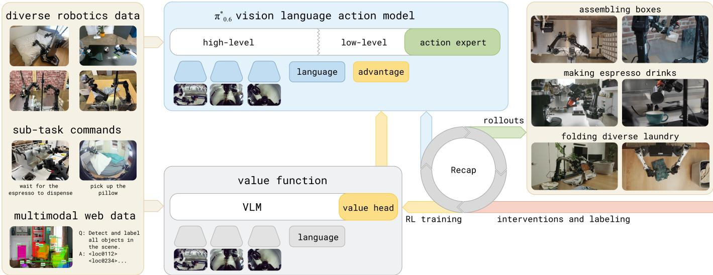
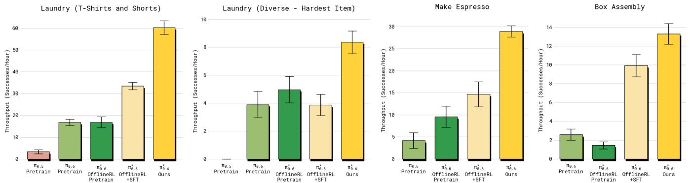
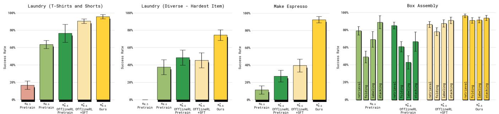
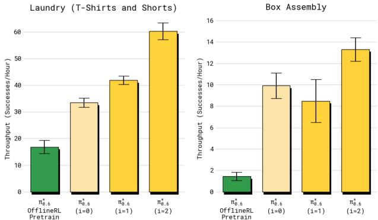
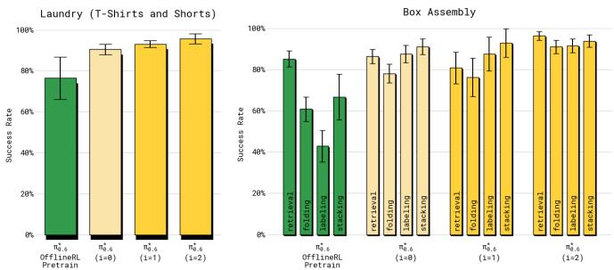
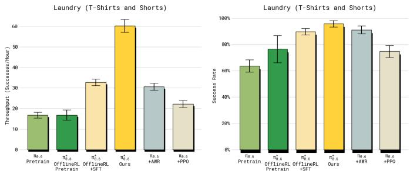

# 1. Bibliographic Information

## 1.1. Title
$π^{*}_{0.6}$: a VLA That Learns From Experience

The title indicates the paper's central topic: a new model named $π^{*}_{0.6}$, which is a Vision-Language-Action (VLA) model. The key characteristic highlighted is its ability to "learn from experience," suggesting it improves its performance through real-world interaction and data collection, likely via Reinforcement Learning (RL).

## 1.2. Authors
The authors are from "Physical Intelligence", which appears to be a research group or company. The paper lists a large number of contributors in the acknowledgments, broken down by roles (Data collection, Policy training, Hardware, etc.), which is typical for large-scale robotics projects that require significant engineering and operational effort. Key names like Sergey Levine and Chelsea Finn are prominent researchers in robotics and machine learning, particularly in RL for robotics. Their involvement signals a high-quality, impactful research effort.

## 1.3. Journal/Conference
The paper is submitted to the "9th Annual Conference on Robot Learning" (CoRL) in 2025, as indicated by reference [5]. CoRL is a top-tier, highly selective conference dedicated to the intersection of robotics and machine learning. Publication at CoRL signifies that the work is considered a significant contribution to the field by expert reviewers.

## 1.4. Publication Year
The publication year is listed as 2025, with a preprint publication date of November 18, 2025. This suggests the paper describes very recent, state-of-the-art research.

## 1.5. Abstract
The abstract summarizes the paper's core contributions. The authors investigate how Vision-Language-Action (VLA) models can be improved via Reinforcement Learning (RL) in real-world deployments. They introduce a method called **RECAP** (`RL with Experience and Corrections via Advantage-conditioned Policies`), which uses a technique called "advantage conditioning" for RL training. RECAP is designed to incorporate diverse data sources, including expert demonstrations, on-policy data collected by the robot, and human-teleoperated corrections made during autonomous operation. The method starts with pre-training a generalist VLA, which they call $π^{*}_{0.6}$, using offline RL. This model can then be fine-tuned for specific downstream tasks. The authors demonstrate the effectiveness of their method on complex real-world tasks like folding laundry, assembling boxes, and making espresso. They report significant performance gains, including more than doubling task throughput and halving failure rates on difficult tasks.

## 1.6. Original Source Link
*   **Original Source Link:** `https://arxiv.org/abs/2511.14759`
*   **PDF Link:** `https://arxiv.org/pdf/2511.14759v2.pdf`

    The paper is available as a preprint on arXiv. This means it has been made publicly available before or during the peer-review process for a conference or journal. The version is $v2$, indicating it has been updated since its initial submission.

# 2. Executive Summary

## 2.1. Background & Motivation
The core problem this paper addresses is the gap between the initial capabilities of general-purpose robot models and the level of **mastery** (i.e., high robustness, speed, and reliability) required for practical real-world applications.

While modern Vision-Language-Action (VLA) models can perform a wide variety of tasks from language prompts (zero-shot generalization), their performance is often limited by the quality and coverage of their initial training data, which typically consists of human demonstrations (`imitation learning`). Imitation learning suffers from two key issues:
1.  **Compounding Errors:** Small deviations from the demonstration data can lead to states the policy has never seen, causing accumulating errors from which it cannot recover.
2.  **Suboptimal Performance:** The policy can, at best, replicate the performance of the human demonstrator. It cannot surpass the demonstrator in speed or efficiency, nor can it discover better strategies on its own.

    To achieve true mastery, a robot needs to "practice" — to learn from its own mistakes and successes in the real world. This is the domain of **Reinforcement Learning (RL)**. However, applying RL to large, complex VLA models in the real world presents significant challenges:
*   **Scalability:** RL algorithms like Proximal Policy Optimization (PPO) often require on-policy data and can be unstable or sample-inefficient for large models.
*   **Data Heterogeneity:** A practical system needs to learn from a mix of data: offline demonstrations, autonomous trial-and-error experience, and human interventions (corrections). Combining these different data types effectively is difficult.
*   **Real-World Constraints:** Reward engineering, environment resets, and ensuring safety during autonomous data collection are major practical hurdles.

    The paper's innovative entry point is to develop a **general-purpose and scalable recipe** for applying RL to VLAs. This recipe, named **RECAP**, uses an elegant technique called **advantage conditioning** to train the policy, which simplifies the RL problem into a supervised learning-like framework that is well-suited for large foundation models and heterogeneous data.

## 2.2. Main Contributions / Findings
The paper makes several key contributions:

1.  **A General-Purpose RL Method for VLAs (RECAP):** The authors propose `RL with Experience and Corrections via Advantage-conditioned Policies` (RECAP), a complete methodology for improving VLAs through experience. RECAP integrates three types of data:
    *   Offline human demonstrations.
    *   Autonomous on-policy rollouts (experiential data).
    *   Expert teleoperated interventions during deployment (corrective data).

2.  **Scalable Policy Improvement via Advantage Conditioning:** The core technical innovation of RECAP is its policy extraction method. Instead of using complex policy gradient methods, it trains a value function to estimate the "advantage" of actions (how much better an action is than the average) and then conditions the policy on a binarized version of this advantage. This effectively teaches the policy to distinguish between "good" and "bad" actions and allows it to generate better actions at inference time. This approach is highly scalable as it frames RL as a conditional generative modeling problem.

3.  **The $π^{*}_{0.6}$ Model:** The authors introduce $π^{*}_{0.6}$, a VLA model specifically designed to be trained with RECAP. It is an evolution of previous models ($π_{0.5}$, $π_{0.6}$) and incorporates the ability to be conditioned on the advantage indicator. The model is first pre-trained with offline RL on a massive, diverse dataset and can then be fine-tuned on specific tasks.

4.  **Demonstration of Real-World Mastery:** The paper provides compelling evidence that RECAP enables $π^{*}_{0.6}$ to achieve a high level of performance on complex, long-horizon, and deformable/fluid object manipulation tasks that have traditionally been very difficult for robotics. These include:
    *   Folding diverse laundry items in a real home.
    *   Assembling cardboard boxes in a factory setting.
    *   Operating a professional espresso machine to make drinks.

        The key finding is that learning from experience via RECAP leads to substantial performance gains. On the most challenging tasks, the method **more than doubles task throughput** (a metric combining speed and success) and **halves the failure rate**, pushing the robot's capabilities into a range where they are practical for real-world deployment.

# 3. Prerequisite Knowledge & Related Work

## 3.1. Foundational Concepts
### 3.1.1. Vision-Language-Action (VLA) Models
A Vision-Language-Action (VLA) model is a type of AI model designed for robotics that can understand and act upon high-level commands. It integrates three modalities:
*   **Vision:** It processes visual input from cameras to perceive the environment (e.g., objects, robot state).
*   **Language:** It takes natural language instructions from a user (e.g., "make me a cup of coffee").
*   **Action:** It outputs low-level motor commands (e.g., joint positions, gripper commands) to control the robot's physical movements.
    VLA models are often built on top of large pre-trained models (like Vision-Language Models or VLMs) and are trained to map a sequence of visual and language inputs to a sequence of actions. This allows them to generalize to new tasks and instructions without needing task-specific training.

### 3.1.2. Reinforcement Learning (RL)
Reinforcement Learning is a paradigm of machine learning where an **agent** learns to make decisions by interacting with an **environment**. The core components are:
*   **Policy ($\pi$)**: A function that maps an observation (or state) to an action. This is the "brain" of the agent.
*   **Reward ($r$)**: A scalar feedback signal from the environment that indicates how good an action was. The agent's goal is to maximize the cumulative reward over time.
*   **Value Function ($V^{\pi}(o)$)**: A function that predicts the expected future cumulative reward from a given observation $o$, assuming the agent follows policy $π$.
*   **Advantage Function ($A^{\pi}(o, a)$)**: A function that measures how much better a specific action $a$ is compared to the average action that would be taken by the policy $π$ in observation $o$. It is formally defined as $A^{\pi}(o, a) = Q^{\pi}(o, a) - V^{\pi}(o)$, where $Q^{\pi}(o, a)$ is the expected return after taking action $a$ from observation $o$. A positive advantage means the action is better than average.

### 3.1.3. Offline vs. Online RL
*   **Online RL**: The agent collects data and updates its policy in a continuous loop. It directly interacts with the environment to gather experience. This is often sample-inefficient and can be slow and unsafe in the real world.
*   **Offline RL (Batch RL)**: The agent learns from a fixed, pre-collected dataset of interactions without any further interaction with the environment. This is safer and can leverage large, diverse datasets. However, it suffers from the "distributional shift" problem: the learned policy may behave poorly in states not well-represented in the offline dataset. This paper uses an iterated offline RL approach, where it collects a batch of data, trains on it offline, and then repeats.

### 3.1.4. Flow Matching
Flow matching is a modern technique for training **generative models**, which are models that learn to create new data samples (in this case, robot actions). It is an alternative to diffusion models. The core idea is to train a neural network to predict a "vector field" that transforms a simple noise distribution (like a Gaussian) into the complex data distribution (the distribution of correct robot actions). At inference time, the model starts with random noise and integrates along this learned vector field to generate a realistic action. It is often more computationally efficient to train than diffusion models while achieving similar performance.

## 3.2. Previous Works
The paper positions itself within several key areas of research:

*   **Imitation Learning and its Limitations:** The starting point for many robotic policies is imitation learning, where a policy learns to mimic human demonstrations. However, as noted in works like Ross et al. [7], this suffers from **compounding errors**. The paper aims to go beyond this limitation.

*   **Learning from Interventions:** Prior works like DAgger [7], HG-DAgger [12], and others [8-11] have shown that allowing a human to provide corrective interventions during autonomous execution can significantly improve policy robustness. The RECAP method incorporates this idea but frames it within a broader RL context that also uses autonomous experience.

*   **RL for Robotic Manipulation:** There is a large body of work on using RL to improve robot policies [13-21]. However, this paper distinguishes itself by focusing on scaling these techniques to large, general-purpose VLA models for long-horizon, complex tasks, which many prior works did not address.

*   **RL Fine-Tuning of VLAs:** Several recent works have explored fine-tuning VLAs with RL.
    *   Some use policy gradient methods like PPO [30-34]. The authors argue these are hard to scale to real-world RL with large models.
    *   Others train a separate "residual" policy [35, 36] or refine actions proposed by the VLA [38-40]. In contrast, RECAP trains the **entire VLA end-to-end** using an iterated offline RL approach.
    *   This work is most closely related to methods that integrate value functions directly into VLA training [43-46]. However, RECAP's key differences are its use of an **advantage conditioning** strategy (which avoids on-policy algorithms like PPO/REINFORCE), its support for expressive flow-based models, and its application to more complex, long-horizon tasks.

*   **Reward/Advantage-Conditioned Policies:** The idea of conditioning a policy on desired outcomes (like rewards or advantages) has been explored in many prior works [47-56]. This allows a single model to represent a spectrum of behaviors from suboptimal to optimal. This paper's method is particularly inspired by **Classifier-Free Guidance for RL (CFGRL)** [4], which uses a similar conditioning mechanism. The authors extend this idea to pre-train and fine-tune a large-scale VLA, integrating multiple data sources.

## 3.3. Technological Evolution
The field of robotic learning has evolved from task-specific, engineered solutions to more general-purpose, data-driven approaches.
1.  **Early Robotics:** Relied on precise programming and control theory for specific, structured tasks.
2.  **Imitation Learning:** The rise of deep learning enabled robots to learn from human demonstrations (`Behavioral Cloning`), but this was brittle.
3.  **Reinforcement Learning:** RL promised to allow robots to learn through trial and error, but for a long time was limited to simulated environments or simple real-world tasks due to sample complexity.
4.  **Foundation Models for Robotics (VLAs):** The success of large language models (LLMs) and vision-language models (VLMs) led to the development of VLAs, which can generalize across a wide range of tasks from natural language prompts. $π_{0.5}$ [5] was a significant step in this direction.
5.  **Mastery through Experience (Current Paper):** This paper represents the next logical step. It moves beyond just achieving general capability and focuses on achieving **mastery** (high performance, speed, and robustness) by developing a scalable and practical framework (RECAP) to apply RL to these powerful foundation models. It sits at the cutting edge, combining the generalization of VLAs with the performance-optimizing power of RL.

## 3.4. Differentiation Analysis
Compared to related work, the key differentiators of this paper are:
*   **Methodological Simplicity and Scalability:** Instead of complex on-policy RL algorithms (like PPO), RECAP uses **advantage conditioning**, which rephrases the policy improvement step as a conditional generation problem. This is much more stable and scalable for training large, flow-matching-based VLAs on offline, heterogeneous data.
*   **End-to-End Training:** Unlike methods that only train a small part of the model (e.g., an action head or a residual policy), RECAP fine-tunes the entire VLA, allowing for more significant behavioral changes.
*   **Unified Data Integration:** RECAP provides a single, coherent framework for learning from demonstrations, autonomous experience, and human corrections, whereas many prior works focused on only one or two of these data sources.
*   **Complexity of Tasks:** The paper demonstrates success on long-horizon tasks involving deformable objects (laundry), liquids (espresso), and multi-stage assembly (boxes), which are significantly more challenging than the pick-and-place or simple navigation tasks often seen in prior RL work.

# 4. Methodology

## 4.1. Principles
The core idea behind the proposed method, **RECAP** (`RL with Experience and Corrections via Advantage-conditioned Policies`), is to improve a Vision-Language-Action (VLA) model by teaching it to distinguish between "good" and "bad" actions and then prompting it to only generate "good" ones. This is achieved through a three-step iterative loop:
1.  **Collect Experience:** The robot attempts a task. These attempts, which can be successful, failed, or corrected by a human, are collected as data.
2.  **Learn a Critic:** A **value function** is trained on all collected data. This value function acts as a "critic," learning to predict the quality of any given situation (i.e., the expected future reward, which relates to task success and speed).
3.  **Improve the Actor:** The VLA policy (the "actor") is retrained using all collected data. Crucially, each data point is now annotated with an **"improvement indicator"** derived from the value function. This indicator tells the policy whether the action taken in that instance was better than average (positive advantage) or not. The policy learns to generate actions conditioned on this indicator. At deployment, the policy is prompted with the "positive advantage" indicator, effectively asking it to generate only high-quality actions.

    This process is based on a theoretical result from regularized RL [4, 71] which shows that conditioning a policy on an indicator of improvement guarantees that the resulting policy will perform better than the original one. This transforms the difficult problem of RL into a more manageable conditional modeling problem.

## 4.2. Core Methodology In-depth (Layer by Layer)
The RECAP method consists of three repeating components: data collection, value function training, and policy training via advantage conditioning.

The overall workflow is illustrated in Figure 1 of the paper.

*该图像是一个示意图，展示了$π^{*}_{0.6}$视觉语言行动模型的架构与数据来源，包括多样化的机器人数据、子任务命令和多模态网络数据。该模型通过反馈与经验修正进行强化学习训练，旨在完成如组装盒子、制作浓缩咖啡和折叠洗衣服等任务。*

### 4.2.1. Step 1: Data Collection
In each iteration of RECAP, the current VLA policy is deployed on a robot to perform a target task. This process generates a dataset of trajectories, $\tau = (\mathbf{o}_0, \mathbf{a}_0, \dots, \mathbf{o}_T)$. This data is heterogeneous:
*   **Autonomous Rollouts:** The policy runs without any human involvement. Each episode is labeled at the end with a binary success/failure outcome, which is used to compute a sparse reward.
*   **Human Interventions:** A human expert monitors the robot. If the robot is about to make a mistake or gets stuck, the expert can take over via teleoperation to provide a **corrective action sequence**. These corrections provide valuable data on how to recover from difficult states.

    All data—demonstrations, autonomous rollouts (successful and failed), and episodes with interventions—are aggregated into a growing dataset $\mathcal{D}$.

### 4.2.2. Step 2: Distributional Value Function Training
The next step is to train a critic that can evaluate the quality of states. The authors use a **multi-task distributional value function**, denoted $p_{\phi}(V | \mathbf{o}_t, \ell)$.

*   **Beginner's Explanation:** Instead of predicting a single number for the expected future reward (the "value"), a distributional value function predicts a full probability distribution over a set of possible values. This captures uncertainty and provides a richer learning signal.
*   **Architecture:** The value function has a similar architecture to the VLA policy itself, using a VLM backbone (Gemma 3, but a smaller version) to process visual observations $\mathbf{o}_t$ and the language command $\ell$. The architecture is shown in Figure 3.

    The training process for this value function is as follows:
1.  **Reward Definition:** A simple and general sparse reward function is used. The reward $r_t$ is -1 for every step to encourage speed. At the final step $T$, the reward is 0 for success and a large negative constant $-C_{fail}$ for failure.
    \$
    r_t = \begin{cases} 0 & \text{if } t = T \text{ and success} \\ -C_{fail} & \text{if } t = T \text{ and failure} \\ -1 & \text{otherwise} \end{cases}
    \$
    With this definition, the cumulative return from step $t$, $R_t(\tau) = \sum_{t'=t}^{T} r_{t'}$, roughly corresponds to the negative number of steps remaining until task completion.

2.  **Discretization:** The continuous return values $R_t(\tau)$ are discretized into $B=201$ bins. The discretized return is denoted $R_t^B(\tau)$.

3.  **Training Objective:** The value function is trained using a standard Monte Carlo approach by minimizing the cross-entropy loss between its predicted distribution and the actual (discretized) return observed in the data. The objective is:
    \$
    \min_{\phi} \mathbb{E}_{\tau \in \mathcal{D}} \left[ \sum_{\mathbf{o}_t \in \tau} H(R_t^B(\tau), p_{\phi}(V | \mathbf{o}_t, \ell)) \right]
    \$
    *   $\phi$: Parameters of the value function network.
    *   $\mathcal{D}$: The dataset of all collected trajectories.
    *   $H(\cdot, \cdot)$: The cross-entropy loss function.
    *   $R_t^B(\tau)$: The one-hot encoded target distribution based on the discretized empirical return.
    *   $p_{\phi}(V | \mathbf{o}_t, \ell)$: The predicted probability distribution over the value bins.

        Once trained, a continuous value $V^{\pi_{ref}}(\mathbf{o}_t, \ell)$ can be extracted by taking the expected value over the predicted distribution.

The interaction between the policy and value function is depicted in Figure 3.

![Fig. 3: Interaction between the $\\pi _ { 0 . 6 } ^ { * }$ VLA and value function during RECAP training. The $\\pi _ { 0 . 6 } ^ { * }$ VLA uses a pre-trained VLM backbone. Training follows the KI recipe \[73\], with next-token prediction on many data sources in pre-training, and an flow-matching action-expert with stop gradient. The VLA is conditioned on a binarized advantage indicator, obtained from a separate value function initialized from a pre-trained but smaller VLM model.](images/3.jpg)
*该图像是图示，展示了 $π^{*}_{0.6}$ VLA 在 RECAP 训练中的交互过程。图中包含了与价值函数的关系，采用预训练的 VLM 背骨，并使用了不同的数据源进行训练，包括对动作的离散化和连续化处理。*

### 4.2.3. Step 3: Policy Extraction via Advantage Conditioning
This is the core innovation of RECAP. Instead of using policy gradients, the authors improve the policy using a method based on **advantage conditioning**.

1.  **Advantage Calculation:** First, the advantage $A^{\pi_{ref}}(\mathbf{o}_t, \mathbf{a}_t, \ell)$ is estimated using the trained value function $V^{\pi_{ref}}$. The advantage represents how much better the action $\mathbf{a}_t$ was than the policy's average action at observation $\mathbf{o}_t$. It is calculated using an n-step return:
    \$
    A^{\pi_{ref}}(\mathbf{o}_t, \mathbf{a}_t) = \left(\sum_{t'=t}^{t+N-1} r_{t'} + V^{\pi_{ref}}(\mathbf{o}_{t+N})\right) - V^{\pi_{ref}}(\mathbf{o}_t)
    \$
    *   This formula calculates the empirical return over a short horizon of $N$ steps and bootstraps from the value function's prediction at step $t+N$. This balances bias and variance in the estimate.

2.  **Binarized Improvement Indicator:** The continuous advantage value is converted into a simple binary **improvement indicator** $I_t$.
    \$
    I_t = \mathbb{1}\big(A^{\pi_{ref}}(\mathbf{o}_t, \mathbf{a}_t, \ell) > \epsilon_{\ell}\big)
    \$
    *   $\mathbb{1}(\cdot)$ is the indicator function (1 if true, 0 if false).
    *   $\epsilon_{\ell}$ is a task-specific threshold. This threshold is set empirically (e.g., to the 30th percentile of advantage values) to control what is considered a "good" action.
    *   Essentially, $I_t$ is `True` if the action was "good" (had a high advantage) and `False` otherwise. For actions from human corrections, $I_t$ is always forced to be `True`.

3.  **Conditional Policy Training:** The VLA policy, $π^{*}_{0.6}$, is then trained on all the data in $\mathcal{D}$. The key is that the policy takes the improvement indicator $I_t$ as an additional input, formatted as a text string (e.g., "Advantage: positive" or "Advantage: negative"). The model learns to generate actions conditioned on this indicator.
    The training objective is a combination of supervised learning losses for both the unconditional and conditional policies:
    \$
    \min_{\theta} \mathbb{E}_{\mathcal{D}_{\pi_{ref}}} \Big[ -\log \pi_{\theta}(\mathbf{a}_t | \mathbf{o}_t, \ell) - \alpha \log \pi_{\theta}(\mathbf{a}_t | I_t, \mathbf{o}_t, \ell) \Big]
    \$
    *   $\theta$: Parameters of the policy network.
    *   $\pi_{\theta}(\mathbf{a}_t | \mathbf{o}_t, \ell)$: The unconditional policy (trained with the indicator omitted).
    *   $\pi_{\theta}(\mathbf{a}_t | I_t, \mathbf{o}_t, \ell)$: The policy conditioned on the improvement indicator.
    *   $\alpha$: A weighting hyperparameter.

        This dual objective is inspired by classifier-free guidance [4]. It allows the model to learn both the average behavior and the "improved" behavior within a single network.

4.  **Inference:** During deployment, to get an improved policy, we simply provide $I_t = \text{True}$ (i.e., "Advantage: positive") as a constant input to the policy. This prompts the model to generate actions that it has learned are associated with high advantage values, leading to more optimal and robust behavior. It is also possible to use classifier-free guidance to further amplify the effect of the conditioning, which corresponds to choosing $\beta > 1$ in the underlying theory.

### 4.2.4. Method Summary (Algorithm 1)
The paper summarizes the entire process in Algorithm 1.

<table>
<tr><td>Algorithm 1 RL with Experience and Corrections via Advantage-conditioned Policies (RECAP)</td></tr>
<tr><td>Require: multi-task demonstration dataset Ddemo</td></tr>
<tr><td>1: Train Vpre on Ddemo using Eq. 1</td></tr>
<tr><td>2: Train πpre on Ddemo using Eq. 3 and Vpre</td></tr>
<tr><td>3: Initialize D with demonstrations for </td></tr>
<tr><td>4: Train V0 from Vpre on D using Eq. 1</td></tr>
<tr><td>5: Train π0 from πpre on D using Eq. 3and V0</td></tr>
<tr><td>6: for k = 1 to K do</td></tr>
<tr><td>7: Collect data with πk-1, add it to D</td></tr>
<tr><td>8: Train Vk from Vpre on D using Eq. 1</td></tr>
<tr><td>9: Train πk from πpre on D using Eq. 3 and Vk</td></tr>
<tr><td>10: end for</td></tr>
</table>

**Explanation of Algorithm 1:**
*   **Lines 1-2 (Pre-training):** A generalist value function (`Vpre`) and policy ($πpre$) are first pre-trained on a large, multi-task demonstration dataset (`Ddemo`) using the offline RL recipe (Steps 2 & 3 described above). This creates a strong foundation model.
*   **Lines 3-5 (Specialization/Fine-tuning):** For a new target task, the dataset $D$ is initialized with demonstrations for that specific task. The pre-trained models are then fine-tuned on this task-specific data to get an initial specialist policy $π0$.
*   **Lines 6-10 (Iterative Improvement):** The core improvement loop begins.
    *   **Line 7:** The current best policy (`πk-1`) is used to collect a new batch of on-robot data (autonomous rollouts and/or interventions), which is added to the dataset $D$.
    *   **Lines 8-9:** A new value function (`Vk`) and a new policy ($πk$) are trained from scratch (or fine-tuned from the pre-trained checkpoints `Vpre` and $πpre$) on the entire aggregated dataset $D$.
    *   This loop is repeated for $K$ iterations, with the policy getting progressively better with each iteration as it learns from more and more of its own experience.

# 5. Experimental Setup

## 5.1. Datasets
The experiments use a combination of a large pre-training dataset and task-specific datasets collected during the improvement phase.

*   **Pre-training Dataset:** This is a massive dataset comprising tens of thousands of hours of robot demonstrations from numerous tasks and a variety of different robot platforms. It also includes vision-language data from the web. The goal of this dataset is to train a generalist foundation model ($π^{*}_{0.6}$).
*   **Task-Specific Datasets:** For the evaluation, the authors focus on three complex, realistic task categories. Data for these tasks consists of initial human demonstrations, followed by data collected through autonomous rollouts and expert interventions during the RECAP improvement loop.
    *   **Laundry Folding:**
        *   *Standard:* Folding a T-shirt or shorts.
        *   *Diverse:* Folding 11 different types of clothing items (e.g., button-up shirts, jeans, sweaters).
        *   *Targeted Failure:* Folding a T-shirt from a specific adversarial initial position to test failure mode removal.
    *   **Cafe (Espresso Making):** A long-horizon task involving operating a commercial espresso machine: grinding beans, tamping, locking the portafilter, extracting the shot, and serving.
    *   **Box Assembly:** A factory task involving folding a flattened cardboard sheet into a box, applying a label, and stacking it in a crate.

        An example of the robotic setup used for the iterative improvement experiments is shown in Figure 5.

        ![Fig. 5: The robot setup used in our experiments. $\\pi _ { 0 . 6 } ^ { * }$ is trained on data from many different robots in pre-training. For the iterative improvement experiments, we use a static bimanual system with two 6 DoF arms with parallel jaw grippers. The arms are controlled at $5 0 ~ \\mathrm { H z }$ with joint positions. Observations consist of joint and gripper positions, as well as images from three cameras: a base camera mounted between the arms, and a wrist-mounted camera on each arm. The setup can be mounted flexibly, e.g. on a table.](images/5.jpg)
        *该图像是实验中使用的机器人设置示意图。该设置包括两个6自由度机械臂和一只夹持器，配有多个摄像头进行观察。系统的操作频率为50 Hz，能灵活地安装在不同位置。*

## 5.2. Evaluation Metrics
The authors use two primary metrics to evaluate performance:

### 5.2.1. Success Rate
*   **Conceptual Definition:** This metric measures the reliability of the policy. It is the proportion of attempted episodes that are successfully completed according to pre-defined, task-specific criteria. For example, a successful laundry fold requires the item to be correctly folded and placed in a specific location. Success is judged by human annotators.
*   **Mathematical Formula:**
    \$
    \text{Success Rate} = \frac{\text{Number of Successful Episodes}}{\text{Total Number of Episodes}}
    \$
*   **Symbol Explanation:**
    *   `Number of Successful Episodes`: The count of trials that met all success criteria.
    *   `Total Number of Episodes`: The total number of trials attempted.

### 5.2.2. Throughput
*   **Conceptual Definition:** This metric measures the overall efficiency of the policy, combining both success and speed. It quantifies how many successful tasks the robot can complete in a fixed amount of time (one hour). A policy that is fast but unreliable will have low throughput, as will a policy that is reliable but very slow. This is a highly practical metric for real-world deployments.
*   **Mathematical Formula:**
    \$
    \text{Throughput (Successes per Hour)} = \frac{\text{Number of Successful Episodes}}{\text{Total Time Taken (in hours)}}
    \$
    The total time includes the duration of both successful and failed episodes. An equivalent formula is:
    \$
    \text{Throughput} = \frac{\text{Success Rate}}{\text{Average Episode Duration (in hours)}} = \frac{\text{Success Rate} \times 3600}{\text{Average Episode Duration (in seconds)}}
    \$
*   **Symbol Explanation:**
    *   `Number of Successful Episodes`: The count of successful trials.
    *   `Total Time Taken`: The sum of the durations of all attempted trials.
    *   `Success Rate`: The success rate as defined above.
    *   `Average Episode Duration`: The mean time taken per episode across all trials.

## 5.3. Baselines
The paper compares the full RECAP method against several ablations and alternative approaches:

1.  **Pre-trained $π_{0.5}$ [5]:** An earlier-generation VLA trained only with supervised learning (imitation learning) on demonstrations. It does not use RL.
2.  **Pre-trained $π_{0.6}$ [6]:** An improved version of $π_{0.5}$ with a larger backbone and more data, but still trained only with supervised learning. It does not use RL or advantage conditioning.
3.  **RL pre-trained $π^{*}_{0.6}$:** The $π^{*}_{0.6}$ model after the offline RL pre-training stage (Algorithm 1, line 2), but before any task-specific fine-tuning on on-robot data.
4.  **$π^{*}_{0.6}$ offline RL + SFT:** The $π^{*}_{0.6}$ model after being fine-tuned on task-specific demonstrations (`Supervised Fine-Tuning` or SFT). This represents the starting point for on-robot improvement (Algorithm 1, line 5). It benefits from RL pre-training but not from on-robot experience.
5.  **$π^{*}_{0.6}$ (Ours):** The final model, trained with the full RECAP loop, including on-robot autonomous rollouts and expert corrections.
6.  **AWR (Advantage Weighted Regression):** An alternative offline RL method that improves the policy by performing weighted regression on the dataset, where the weight for each action is proportional to the exponentiated advantage. This is used as a baseline for policy extraction.
7.  **PPO (Proximal Policy Optimization):** A popular on-policy RL algorithm. The authors implement a variant adapted for flow-based models to serve as another baseline for policy extraction.

# 6. Results & Analysis

## 6.1. Core Results Analysis
The main experimental results, shown in Figures 7 and 8, demonstrate that the full RECAP method significantly improves performance across all tasks compared to the baselines.

*Figure 7: Throughput (Successes per hour) comparison across tasks.*

*Figure 8: Success Rate comparison across tasks.*

**Key Observations:**
*   **RECAP's Dominance:** The final $π^{*}_{0.6}$ model (labeled "Ours", in green) consistently achieves the highest throughput and success rate on all tasks.
*   **Impact of On-Robot Learning:** The most significant performance jump occurs between the `offline RL + SFT` model (yellow) and the final model (`Ours`, green). This highlights the critical contribution of learning from on-robot experience (autonomous trials and corrections). For diverse laundry and espresso, throughput **more than doubles**, and failure rates are roughly **halved**.
*   **Value of RL Pre-training:** The `offline RL + SFT` model generally outperforms the purely supervised $π_{0.6}$ model. This shows that even offline RL pre-training on demonstration data provides a better starting point than standard supervised learning.
*   **High Absolute Performance:** The final model achieves success rates in the 90%+ range for most tasks, making it practical for real-world use. The ability to run for 13 hours making espresso or 2 hours folding laundry without interruption is a testament to the achieved robustness.

    The right side of Figure 8 provides a detailed breakdown for the **Box Assembly** task. The full RECAP model ($π^{*}_{0.6}$) shows higher success at every single sub-stage of this long-horizon task (picking, building, labeling, placing) compared to the baselines.

## 6.2. Iterative Improvement Analysis
Figures 9 and 10 show how performance evolves over multiple iterations of RECAP for the laundry and box assembly tasks.

*Figure 9: Throughput improvement over iterations.*

*Figure 10: Success Rate improvement over iterations.*

**Key Observations:**
*   **Steady Improvement:** For both tasks, performance improves with more iterations of data collection and retraining.
*   **Laundry Task:** The success rate quickly saturates at over 90% after the first iteration ($i=1$). However, the throughput continues to increase in the second iteration, indicating the policy is becoming **faster and more efficient** even after it has become reliable. This demonstrates that RL can optimize for metrics beyond just binary success.
*   **Box Assembly Task:** As a more complex, long-horizon task, box assembly requires more data. Throughput initially dips slightly after the first iteration (possibly due to exploration or data distribution shift) but then improves dramatically after the second, achieving a 2x improvement over the starting SFT policy. The success rate shows consistent improvement across iterations.

## 6.3. Ablation Studies / Parameter Analysis

### 6.3.1. Comparison of Policy Extraction Methods
Figure 11 compares RECAP's advantage-conditioned policy extraction method against two common alternatives, AWR and PPO, on the laundry task.

*Figure 11: Comparison of RECAP against AWR and PPO.*

**Key Observations:**
*   **RECAP is Superior:** The advantage-conditioning method used in RECAP (labeled $$π^{*}_{0.6}`(Ours)`) significantly outperforms both AWR and PPO in both throughput and success rate.
*   **AWR:** Advantage Weighted Regression achieves a decent success rate but results in a much slower policy, leading to low throughput. This is because AWR tends to be conservative and filters out too much data.
*   **PPO:** The PPO baseline struggles to improve much over the initial SFT policy. The authors note that stabilizing PPO in this off-policy setting with a large flow-matching model was difficult, requiring a small trust-region constraint that limited learning progress. This result validates the authors' choice of advantage conditioning as a more scalable and effective method for this problem context.

### 6.3.2. Targeted Failure Mode Removal
Figure 12 presents a focused experiment to see if RECAP can fix a specific, known failure mode. The task is to fold a T-shirt with a strict success criterion: the collar must face up. The initial SFT policy often fails this.

*Figure 12: Results for the failure mode removal experiment.*

**Key Observations:**
*   After two iterations of RECAP (using only autonomous rollouts without human corrections), the policy's success rate on this strict task skyrockets from around 20% to **97%**.
*   The throughput also increases dramatically.
*   This result powerfully demonstrates that RECAP can effectively "debug" a policy and remove specific undesirable behaviors with a relatively small amount of targeted, autonomous experience. The RL process allows the policy to discover and reinforce the correct folding strategy.

# 7. Conclusion & Reflections

## 7.1. Conclusion Summary
The paper presents **RECAP**, a novel and effective method for improving general-purpose Vision-Language-Action (VLA) models through real-world experience. By combining offline RL pre-training with an iterative loop of on-robot data collection and retraining, RECAP enables the $$π^{*}_{0.6}$$ model to achieve a high degree of mastery on complex, long-horizon robotic tasks. The core technical contribution is a scalable **advantage-conditioned policy extraction** method that elegantly handles heterogeneous data (demonstrations, autonomous trials, and human corrections) and is well-suited for large, flow-based generative models. The experimental results provide strong evidence that this approach significantly boosts both the success rate and throughput of the VLA, more than doubling performance on difficult tasks and pushing robotic capabilities closer to practical, real-world deployment.

## 7.2. Limitations & Future Work
The authors acknowledge several limitations and areas for future research:

*   **Reliance on Human Labor:** The current system is not fully autonomous. It relies on humans for:
    *   **Reward Labeling:** Labeling each episode as a success or failure.
    *   **Interventions:** Providing expert corrections.
    *   **Episode Resets:** Manually resetting the environment after each trial.
        Automating these components, perhaps using other VLA-based models for reward prediction or scene resetting, is a key next step.

*   **Naïve Exploration:** The policy's exploration is largely greedy, relying on inherent stochasticity and human interventions to discover new behaviors. More sophisticated, structured exploration methods could potentially make the learning process more efficient.

*   **Iterated Offline Updates:** RECAP operates in a batch-based mode: collect data, then train, then repeat. A fully **online RL framework**, where the policy and value function are updated concurrently as data is collected, could be more efficient and responsive. This, however, presents significant systems engineering challenges.

    The authors conclude by framing RL for VLAs as a critical path toward human-level robot performance, while acknowledging that significant research challenges remain in making large-scale RL practical and efficient.

## 7.3. Personal Insights & Critique
This paper represents a significant and impressive step forward in making general-purpose robots truly useful.

**Strengths and Inspirations:**
*   **Pragmatism over Purity:** The RECAP framework is a masterclass in pragmatic system design. It doesn't insist on a pure RL solution but elegantly blends the strengths of imitation learning (good initialization), DAgger-style interventions (overcoming exploration challenges), and autonomous RL (fine-tuning for speed and robustness).
*   **Scalable RL for Foundation Models:** The use of advantage conditioning is a key insight. It sidesteps the instability and complexity of policy gradient methods for large generative models, making RL a more accessible tool for the foundation model era. This idea could be widely applicable beyond robotics, for instance, in fine-tuning LLMs with preference data.
*   **Focus on "Mastery":** The shift in focus from "can it do the task?" to "how well and how fast can it do the task?" is crucial. The use of **throughput** as a primary metric is an excellent choice, as it directly corresponds to practical utility.
*   **Impressive Real-World Demonstrations:** The choice of tasks (laundry, coffee, boxes) is not only technically challenging but also highly relatable, making the progress tangible and compelling. Successfully manipulating deformable objects and liquids at high success rates is a landmark achievement.

**Potential Issues and Areas for Critique:**
*   **Cost and Scalability of Data Collection:** While the method is scalable from a software perspective, the hardware and human operator costs associated with collecting thousands of real-world trajectories (e.g., 600 autonomous trials + 360 interventions *per iteration* for box assembly) are immense. The paper is a product of a well-funded industrial lab, and replicating these results would be prohibitive for most academic labs. The true "scalability" is therefore limited by physical resources.
*   **Simplicity of the Reward Function:** The paper uses a very simple, sparse reward function (`-1` per step, 0/-$C_{fail}$ at the end). While this demonstrates the power of the method, it might struggle with tasks where the notion of "progress" is more nuanced and cannot be captured by simply minimizing time. More sophisticated, learned reward functions could be a necessary future extension.
*   **Generalization of the Value Function:** The value function is trained on a mix of data from the pre-training set and the specific task. It's unclear how well the value function for one task (e.g., laundry) would generalize to a completely novel task without fine-tuning. The paper fine-tunes the value function from the pre-trained checkpoint for each task, suggesting task-specific value learning is still necessary.

    Overall, $$π^{*}_{0.6}\$\$ and the RECAP method provide a powerful blueprint for the future of robotic learning. They convincingly argue that the path to capable, generalist robots lies in combining large-scale pre-training with continuous, experience-driven improvement in the real world. This work sets a new standard for what is possible in real-world robotic manipulation.