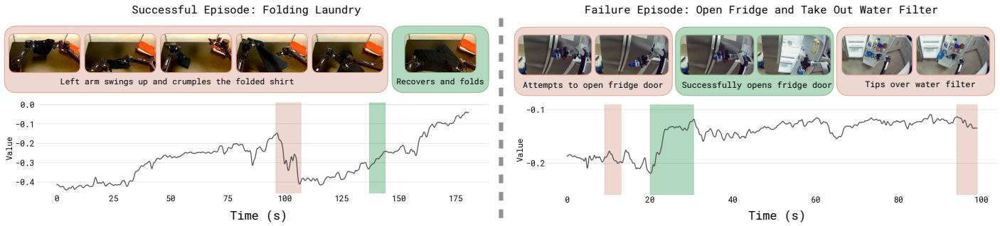

# 1. 论文基本信息

## 1.1. 标题

*   **论文标题：** $π^{*}_{0.6}$: a VLA That Learns From Experience
*   **中文翻译：** $π^{*}_{0.6}$：一个能从经验中学习的视觉-语言-行动（VLA）模型
*   **标题解读：** 标题直接点明了论文的核心研究对象——一个名为 $π^{*}_{0.6}$ 的模型。这个名字暗示了它与之前的 $π_{0.5}$ 和 $π_{0.6}$ 模型一脉相承，星号 `*` 通常在学术语境中表示“最优”或“经过优化的”，这里特指通过强化学习优化过的版本。副标题“一个能从经验中学习的视觉-语言-行动（VLA）模型”则清晰地阐述了该模型的核心能力：它是一个 <strong>视觉-语言-行动 (Vision-Language-Action, VLA)</strong> 模型，并且其关键特性是通过**从真实世界部署的经验中学习**来提升自身性能，这直接指向了强化学习（RL）的应用。

## 1.2. 作者

Physical Intelligence。这是一个团队署名，通常代表一个大型研究项目或一个公司内部的团队。根据论文中的博客链接（pi.website），可以推断出这篇论文来自 Google DeepMind 的 Physical Intelligence 团队，该团队专注于机器人和物理世界智能的研究。这是一个在机器人学习领域具有顶尖实力和丰富资源的研究团队。

## 1.3. 发表期刊/会议

论文中并未明确指出发表的会议或期刊，但提到了发表日期为2025年11月18日，并在 arXiv 上发布。这表明它是一篇预印本（preprint）。通常，这类高质量的机器人学习论文会投递到顶级的机器人或机器学习会议，如 CoRL (Conference on Robot Learning), RSS (Robotics: Science and Systems), ICRA (International Conference on Robotics and Automation), NeurIPS, 或 ICML。

## 1.4. 发表年份

2025年（预印本发布日期）。

## 1.5. 摘要

我们研究了<strong>视觉-语言-行动 (Vision-Language-Action, VLA)</strong> 模型如何通过在真实世界中的部署，利用<strong>强化学习 (Reinforcement Learning, RL)</strong> 来提升自身性能。为此，我们提出了一个名为 **RECAP (RL with Experience and Corrections via Advantage-conditioned Policies)** 的通用方法，它通过<strong>优势条件化 (advantage conditioning)</strong> 来实现对VLA模型的强化学习训练。该方法能够将多种异构数据源（包括演示、策略自主收集的数据以及在自主执行期间由专家远程操作提供的干预）整合到自我提升的过程中。RECAP首先通过<strong>离线强化学习 (offline RL)</strong> 预训练一个通用的VLA模型，我们称之为 $π^{*}_{0.6}$。这个预训练好的模型随后可以通过在机器人上收集数据，被专门化以在下游任务中达到高性能。我们展示了使用完整RECAP方法训练的 $π^{*}_{0.6}$ 模型能够在真实的家庭环境中折叠衣物、可靠地组装盒子，并使用专业咖啡机制作浓缩咖啡。在一些最困难的任务上，RECAP能够将任务吞吐量提高一倍以上，并将任务失败率降低约一半。

## 1.6. 原文链接

*   **原文链接:** https://arxiv.org/abs/2511.14759
*   **PDF 链接:** https://arxiv.org/pdf/2511.14759v2.pdf
*   **发布状态:** 预印本 (Preprint)。

# 2. 整体概括

## 2.1. 研究背景与动机

### 2.1.1. 核心问题

当前，像 VLA 这样的大型机器人基础模型虽然可以通过模仿学习（从人类演示数据中学习）获得广泛的通用能力，但它们在实际应用中往往面临两大瓶颈：
1.  **性能上限受限于演示数据：** 模仿学习训练出的模型最多只能达到人类演示者的水平，很难超越。同时，演示数据无法覆盖所有可能遇到的意外情况，导致模型在面对新场景或发生微小偏差时，错误会逐渐累积，最终导致任务失败（即<strong>复合误差 (compounding errors)</strong> 问题）。
2.  **效率和鲁棒性不足：** 仅通过模仿学习训练出的模型，其执行任务的速度和成功率往往无法满足实际生产生活的需求。例如，它可能动作缓慢，或者在面对真实世界中物体的微小差异（如不同材质的衣物、略有形变的纸箱）时表现不稳定。

### 2.1.2. 问题的重要性与现有挑战

为了让机器人真正走出实验室、进入家庭和工厂，它们必须具备<strong>自我提升 (self-improvement)</strong> 的能力，即通过自主实践和试错来不断优化自己的行为，变得更快、更准、更可靠。<strong>强化学习 (Reinforcement Learning, RL)</strong> 正是实现这一目标的核心理论框架。然而，将RL应用于大型、真实的机器人系统面临诸多挑战：

*   **数据异构性：** 机器人学习系统的数据来源非常多样，包括高质量的人类演示、机器人自主探索收集的（可能包含大量失败的）数据、以及人类在机器人犯错时提供的实时纠正。如何有效地融合这些异构数据是一个难题。
*   **大规模模型训练：** 现代VLA模型参数量巨大，结构复杂（例如包含扩散模型或流匹配模型来生成动作），传统的在线RL算法（如PPO）需要频繁与环境交互并更新策略，这在真实机器人上非常耗时且不稳定，难以扩展。
*   **真实世界奖励设计：** 在真实世界中为机器人任务定义一个稠密、精确的奖励函数非常困难。通常只能在任务结束后给出一个稀疏的奖励信号（如“成功”或“失败”），这给RL学习带来了巨大挑战。

### 2.1.3. 论文的切入点与创新思路

本文的切入点是设计一个<strong>通用且可扩展的配方 (general-purpose recipe)</strong>，让大型VLA模型能够安全、高效地通过真实世界的经验进行强化学习。其核心创新思路是**RECAP**方法，它巧妙地避开了传统在线RL的复杂性，采用了一种<strong>迭代式的离线强化学习 (iterated offline RL)</strong> 框架。

**核心思路可以概括为“先评估，再指导”：**
1.  <strong>评估 (Evaluate):</strong> 首先，利用所有收集到的数据（演示、自主探索、人工干预）训练一个<strong>价值函数 (value function)</strong>。这个价值函数像一个“评判员”，能够判断在任何一个状态下，采取某个动作是“好”还是“坏”（即能带来更高还是更低的未来总回报）。
2.  <strong>指导 (Guide):</strong> 然后，在训练VLA策略模型时，将这个“好坏”判断（具体来说是<strong>优势值 (advantage)</strong>）作为一个额外的**条件输入**，告诉模型：“现在你要学习生成一个‘好’的动作”。通过这种方式，策略模型能够从所有数据中学习，但重点模仿那些被价值函数评估为“好”的行为，从而实现策略的提升。

    这种基于<strong>优势条件化 (advantage conditioning)</strong> 的方法，将复杂的RL优化问题转化为了一个更简单、更稳定的监督学习问题，因此非常适合扩展到大型VLA模型上。

## 2.2. 核心贡献/主要发现

### 2.2.1. 主要贡献

1.  **提出了 RECAP 方法：** 这是一个通用的、端到端的强化学习框架，专门用于通过真实世界经验提升VLA模型的性能。它能够有效整合演示、自主探索和人类干预三种异构数据。
2.  **提出了 $π^{*}_{0.6}$ 模型：** 这是基于 $π_{0.6}$ VLA模型，通过RECAP方法进行预训练和微调得到的强化版本。该模型展示了在复杂的、长时程的真实世界任务上的卓越性能。
3.  **验证了优势条件化策略提取的可行性与优越性：** 论文证明了将优势值作为条件输入来指导策略学习是一种简单、可扩展且高效的方法，尤其适用于像 $π_{0.6}$ 这样使用流匹配（一种生成模型）生成动作的复杂VLA。实验表明，该方法显著优于传统的策略梯度（PPO）或加权回归（AWR）方法。

### 2.2.2. 关键发现

1.  **RECAP 能显著提升VLA模型的性能：** 在折叠多样衣物、制作浓缩咖啡等高难度任务上，经过RECAP训练的 $π^{*}_{0.6}$ 模型相比仅经过模仿学习微调的模型，<strong>任务吞吐量（每小时成功次数）提升了一倍以上，失败率降低了约50%</strong>。
2.  **RL预训练至关重要：** 仅仅在预训练阶段引入RL（即离线RL预训练的 $π^{*}_{0.6}$ 模型），就能为后续的任务微调提供一个更好的起点，使得模型在只用少量高质量演示数据进行监督微调（SFT）后，就能达到比传统SFT更高的性能。
3.  **迭代学习持续改进：** 通过多轮“数据收集 -> 模型训练”的迭代，RECAP能够持续提升模型的性能。例如，在洗衣任务中，模型成功率很快达到饱和，但吞吐量（速度）持续提升；在更复杂的盒子组装任务中，成功率和吞吐量在多轮迭代中都得到了显著改善。
4.  **RECAP能有效移除特定失败模式：** 在一个专门设计的、具有严格成功标准（如T恤领口必须朝上）的实验中，RECAP能够通过RL训练，高效地修正模型的特定错误行为，将成功率从较低水平提升至97%。

# 3. 预备知识与相关工作

## 3.1. 基础概念

### 3.1.1. 强化学习 (Reinforcement Learning, RL)

强化学习是一种机器学习范式，研究智能体 (agent) 如何在复杂的、不确定的环境中采取行动以最大化累积奖励。
*   <strong>智能体 (Agent):</strong> 学习者和决策者，在本文中指机器人策略模型 $π$。
*   <strong>环境 (Environment):</strong> 智能体所处的外部世界，包括机器人本身、操作的物体和周围场景。
*   <strong>状态/观测 (State/Observation, $o_t$):</strong> 环境在某个时刻 $t$ 的描述。对于机器人来说，观测通常是相机图像和机器人自身的关节角度等传感器读数。
*   <strong>动作 (Action, $a_t$):</strong> 智能体根据当前观测做出的决策，如控制机器人手臂移动到某个位置。
*   <strong>策略 (Policy, $π(a_t|o_t)$):</strong> 智能体的“大脑”，是一个函数或模型，根据当前观测 $o_t$ 输出要执行的动作 $a_t$ 的概率分布。
*   <strong>奖励 (Reward, $r_t$):</strong> 环境对智能体在时刻 $t$ 采取动作 $a_t$ 后的反馈信号，是一个标量值，用于评价该动作的好坏。
*   <strong>回报 (Return, $R(\tau)$):</strong> 从某个时刻开始到任务结束，所有奖励的总和（有时会带折扣因子）。RL的目标就是学习一个策略 $π$，使得期望回报最大化。
*   <strong>价值函数 (Value Function, $V^π(o_t)$):</strong> 评估处在某个状态 $o_t$ 的“好坏程度”。它表示从状态 $o_t$ 开始，遵循策略 $π$ 能获得的期望回报。
*   <strong>优势函数 (Advantage Function, $A^π(o_t, a_t)$):</strong> 评估在状态 $o_t$ 下，采取动作 $a_t$ 相对于遵循当前策略 $π$ 的平均水平有多“好”。$A^π > 0$ 意味着动作 $a_t$ 比平均动作要好，反之则差。

### 3.1.2. 离线强化学习 (Offline RL)

传统的RL（也称在线RL）需要智能体不断与环境交互，实时收集数据来学习。而<strong>离线强化学习 (Offline RL)</strong>，又称<strong>批量强化学习 (Batch RL)</strong>，研究的是如何仅从一个**固定的、预先收集好的数据集中学习**，而不能与环境进行任何新的交互。这个固定的数据集可能由各种不同的策略（如人类专家、旧的AI策略）生成，数据质量参差不齐。离线RL的核心挑战在于，如何从这些数据中安全地学习一个比数据收集策略更好的新策略，同时避免对数据集中未见的“状态-动作”对产生错误的价值估计。本文的RECAP方法就属于离线RL的范畴，因为它是在收集好一批数据后，再进行模型训练。

### 3.1.3. 视觉-语言-行动 (Vision-Language-Action, VLA) 模型

VLA是一种多模态大模型，它能够将<strong>视觉输入 (Vision)</strong>（如摄像头图像）、<strong>自然语言指令 (Language)</strong>（如“给我做一杯咖啡”）和<strong>机器人动作 (Action)</strong>（如关节控制指令）统一到一个模型框架中。它通常建立在预训练的视觉语言模型（VLM）之上，增加了生成机器人动作的能力。这使得机器人能够理解高层次的人类指令，并将其分解为一系列具体的物理动作来完成任务。本文的 $π_{0.6}$ 就是一个典型的VLA模型。

### 3.1.4. 流匹配 (Flow Matching)

流匹配是一种先进的<strong>生成模型 (Generative Model)</strong> 技术，用于学习复杂的数据分布。与更广为人知的扩散模型（Diffusion Model）类似，它通过学习一个向量场（流）来将一个简单的噪声分布（如高斯分布）逐渐变换为目标数据分布（如机器人动作的分布）。相比扩散模型，流匹配在训练上更简单、更快速，并且能够生成高质量的样本。$π_{0.6}$ 模型正是使用流匹配来生成连续的、高维的机器人动作序列。

## 3.2. 前人工作

论文的相关工作部分主要围绕如何超越模仿学习，通过RL和人类交互来提升机器人策略展开。

*   <strong>在线干预 (Online Interventions):</strong> 许多先前工作利用人类专家的实时干预来纠正机器人的错误。一个经典的方法是 **DAgger (Dataset Aggregation)**，它让机器人在执行任务时，如果人类专家发现其即将犯错，就接管控制并演示正确的动作。然后将这些（状态，正确动作）数据对加入到训练集中，重新训练策略。本文也借鉴了这种思想，将专家干预作为数据源之一。
*   <strong>机器人强化学习 (RL for Robotics):</strong> 大量研究探索了在真实机器人上使用RL。早期的工作通常针对特定任务从零开始训练，样本效率低。近期的工作开始结合预训练模型，例如在预训练的VLA之上微调一个小的“残差策略”或动作选择模块，或者使用RL来微调整个VLA模型。
    *   许多工作使用<strong>近端策略优化 (Proximal Policy Optimization, PPO)</strong> 及其变体来微调VLA。但PPO是<strong>在线 (on-policy)</strong> 算法，需要大量的实时交互，在真实机器人上部署效率低下且不稳定。
    *   本文的方法与之不同，采用<strong>离线 (offline)</strong> 的方式，能够利用所有历史数据，并且通过优势条件化避免了PPO复杂的优化过程，更适合大型模型。
*   **基于价值的策略改进：**
    *   <strong>优势加权回归 (Advantage-Weighted Regression, AWR):</strong> 这是一种简单的离线RL算法，它通过计算数据集中每个动作的优势值，然后对动作进行加权监督学习。优势值越高的动作，其在损失函数中的权重越大。缺点是它可能会丢弃或显著降低“坏”数据的权重，数据利用率不高。本文将其作为对比基线。
    *   <strong>奖励/价值/优势条件化策略 (Reward/Value/Advantage-Conditioned Policies):</strong> 这一系列工作（如Decision Transformer）提出将期望回报、价值或优势作为策略模型的输入。通过在推理时提供一个高的期望回报值，模型就能生成实现该回报的行为。本文的**优势条件化**思想与此一脉相承，特别是与 **CFGRL** [4] 和 <strong>分类器无关指导 (Classifier-Free Guidance, CFG)</strong> 的思想紧密相关。CFG最初用于扩散模型，通过同时训练一个有条件和无条件的模型，可以在生成时增强条件的效果。本文将其思想应用于RL，通过训练一个能识别“好”动作和“一般”动作的策略，从而在推理时只生成“好”动作。

## 3.3. 技术演进

1.  <strong>模仿学习 (Imitation Learning, IL):</strong> 机器人学习的起点。通过监督学习模仿人类演示。简单有效，但有性能天花板和泛化性问题。
2.  <strong>IL + 在线干预 (e.g., DAgger):</strong> 为了解决复合误差，引入人类专家在线纠错，不断扩充数据集。能提升鲁棒性，但仍依赖人类，且无法超越专家。
3.  <strong>在线强化学习 (Online RL):</strong> 机器人自主试错学习，理论上可以超越人类。但样本效率极低，在真实世界中训练成本高昂且危险。
4.  <strong>离线强化学习 (Offline RL):</strong> 利用固定的历史数据进行学习，更安全、数据利用率更高。成为连接大规模预训练和真实世界微调的桥梁。
5.  **VLA + RL 微调:** 当前的前沿方向。利用VLA的强大先验知识，再通过RL进行针对性微调。本文正处于这一技术脉络中，其提出的RECAP方法为“如何高效、可扩展地进行VLA+RL微调”提供了一个颇具前景的解决方案。

## 3.4. 差异化分析

与相关工作相比，本文方法的核心差异和创新点在于：

*   <strong>统一框架 (Unified Framework):</strong> RECAP首次提供了一个**端到端**的统一框架，能够将**离线RL预训练**、<strong>监督微调 (SFT)</strong>、**自主数据收集**和**专家干预**无缝整合，用于训练一个大型VLA模型。
*   <strong>可扩展的策略提取方法 (Scalable Policy Extraction):</strong> 传统的RL算法如PPO难以直接应用于流匹配或扩散这类生成式VLA。本文的**优势条件化**方法将RL问题转化为一个简单的条件监督学习问题，只需在模型输入中增加一个文本提示（如`"Advantage: positive"`），就能实现策略改进。这种方法**简单、稳定，且与VLA模型架构高度兼容**。
*   <strong>数据利用的全面性 (Comprehensive Data Utilization):</strong> 与AWR等只看重“好”数据的方法不同，RECAP利用了**所有**数据。它通过价值函数来区分好坏，然后训练策略模型同时理解这两种情况，并在推理时只选择好的行为。这使得模型能从失败经验中学习如何避免错误。
*   <strong>任务的复杂性与真实性 (Complexity and Realism of Tasks):</strong> 论文在极其复杂的、长时程的、涉及柔性物体（衣物）、液体（咖啡）和多阶段操作的真实世界任务上取得了显著成功，这在以往的机器人RL研究中是罕见的。

# 4. 方法论

本部分将详细拆解RECAP方法的完整流程。该方法的核心思想是：**通过训练一个价值函数来评估行为的好坏，然后将这种评估作为条件，指导策略模型生成更好的行为。**

该方法可以分为三个可重复执行的步骤，如下图（原文 Figure 1）所示：

*该图像是一个示意图，展示了$π^{*}_{0.6}$视觉语言行动模型的架构与数据来源，包括多样化的机器人数据、子任务命令和多模态网络数据。该模型通过反馈与经验修正进行强化学习训练，旨在完成如组装盒子、制作浓缩咖啡和折叠洗衣服等任务。*

1.  <strong>数据收集 (Data Collection):</strong> 在真实机器人上运行当前策略，收集经验数据，并可选择性地由人类专家进行干预纠错。
2.  <strong>价值函数训练 (Value Function Training):</strong> 利用所有已收集的数据（包括历史演示、新收集的自主数据和干预数据），训练一个能够评估任务进展的价值函数。
3.  <strong>优势条件化策略训练 (Advantage Conditioned Training):</strong> 使用训练好的价值函数计算数据集中每个动作的优势值，然后将一个表示优势好坏的二元指标作为条件，来训练（或微调）VLA策略模型。

    整个过程从一个大规模的预训练阶段开始，然后在特定任务上进行一或多轮迭代。

## 4.1. 方法原理

RECAP的理论基础源于<strong>正则化强化学习 (Regularized RL)</strong>。与标准RL最大化回报的目标不同，正则化RL的目标是在最大化回报的同时，使新策略 $π$ 与某个参考策略 $π_{ref}$（通常是收集数据的行为策略）保持接近。这有助于稳定学习过程，尤其是在离线学习场景中。一个关键的理论结果是，最优的新策略 $\hat{\pi}$ 可以表示为：
$\hat{\pi}(\mathbf{a}|\mathbf{o}) \propto \pi_{ref}(\mathbf{a}|\mathbf{o}) \exp(A^{\pi_{ref}}(\mathbf{o}, \mathbf{a}) / \beta)$
其中 $A^{\pi_{ref}}(\mathbf{o}, \mathbf{a})$ 是在状态 $\mathbf{o}$ 下采取动作 $\mathbf{a}$ 相对于参考策略的优势值。这个公式意味着，优势越大的动作，在新策略中被采样的概率就越高。

然而，直接使用这个公式来训练一个像VLA这样的复杂模型很困难。RECAP借鉴了[4]中的一个巧妙思想，即不直接去拟合这个指数形式，而是通过<strong>条件化 (conditioning)</strong> 来实现类似的效果。

核心思想是：如果我们能训练一个策略模型，它既能模仿一般的行为 $π_{ref}(\mathbf{a}|\mathbf{o}, \ell)$，也能模仿“好的”行为 $π_{ref}(\mathbf{a}|I, \mathbf{o}, \ell)$（其中 $I$ 是一个表示“改进”的指标），那么在推理时，我们只需要激活“改进”这个条件，就能让模型只生成“好的”动作，从而得到一个改进后的策略 $\hat{\pi}$。这种思想与<strong>分类器无关指导 (Classifier-Free Guidance, CFG)</strong> 非常相似。

## 4.2. 核心方法详解 (逐层深入)

### 4.2.1. 步骤1：数据收集 (Data Collection)

在每个迭代周期，使用当前最优的VLA策略 $π$ 在真实机器人上执行任务。这个过程会产生两种主要数据：
*   <strong>自主试验 (Autonomous Trials):</strong> 机器人完全自主执行任务，记录下完整的轨迹（观测、动作、奖励等）。这些数据反映了当前策略的真实性能和常见的失败模式。
*   <strong>专家干预 (Expert Interventions):</strong> 在某些试验中，人类专家会监控机器人。当机器人即将犯下严重错误或陷入困境时，专家会通过远程操作接管控制，演示正确的恢复或纠正动作。这些干预数据为模型提供了宝贵的“如何从错误中恢复”的样本。

    所有收集到的轨迹都会被标记一个最终的任务结果（成功或失败），用于后续计算奖励和价值。

### 4.2.2. 步骤2：分布式价值函数训练 (Distributional Value Function Training)

**目标：** 训练一个“评判员”——价值函数 $V^{\pi_{ref}}$，它能够根据当前观测 $\mathbf{o}_t$ 和语言指令 $\ell$ 来预测未来的期望回报。

**具体实现：**
1.  <strong>奖励定义 (Reward Definition):</strong> 为了通用性，论文采用了一个简单的、基于任务完成时间的稀疏奖励函数。
    $$
    r_t = \begin{cases} 
    0 & \text{if } t=T \text{ and success} \\
    -C_{\mathrm{fail}} & \text{if } t=T \text{ and failure} \\
    -1 & \text{otherwise}
    \end{cases}
    $$
    *   **符号解释：**
        *   $t$: 当前时间步。
        *   $T$: 任务结束的时间步。
        *   $C_{\mathrm{fail}}$: 一个很大的惩罚常数，确保失败任务的回报远低于成功任务。
    *   **含义：** 在任务成功结束时，获得0奖励；在失败时，获得一个巨大的负奖励；在任务过程中的每一步，都获得-1的奖励。这样一来，<strong>累积回报（即价值）就等价于“到任务成功还需要多少步的负数”</strong>。价值越高（越接近0），说明离成功越近、越快。

2.  <strong>分布式价值函数 (Distributional Value Function):</strong> 传统价值函数只预测一个期望值，但这可能忽略了回报分布的风险信息。本文采用**分布式价值函数**，它不预测单一的期望回报，而是预测回报的完整概率分布。具体来说，它将回报的可能取值范围离散化为 $B$ 个桶（bins），然后预测回报落在每个桶内的概率。
    *   模型 $p_{\phi}(V|\mathbf{o}_t, \ell)$ 是一个神经网络（参数为 $\phi$），输出一个 $B$ 维的概率分布。
    *   该模型架构与VLA策略模型类似，但使用一个更小的VLM主干网络。

3.  **训练目标：** 训练的目标是让预测的价值分布 $p_{\phi}$ 尽可能接近数据集中观测到的真实回报分布。
    *   对于数据集 $\mathcal{D}$ 中的每一条轨迹 $\tau$ 的每一步 $t$，计算其经验回报 $R_t(\tau) = \sum_{t'=t}^{T} r_{t'}$。
    *   将这个连续的 $R_t(\tau)$ 值离散化到对应的桶 $R_t^B(\tau)$ 中，形成一个one-hot目标。
    *   最小化预测分布与目标分布之间的<strong>交叉熵损失 (cross-entropy loss)</strong>。
        $$
    \min_{\phi} \mathbb{E}_{\tau \in \mathcal{D}} \left[ \sum_{\mathbf{o}_t \in \tau} H ( R_t^B(\tau), p_{\phi}(V | \mathbf{o}_t, \ell) ) \right]
    $$
    *   **符号解释：**
        *   $\phi$: 价值函数模型的参数。
        *   $\mathcal{D}$: 当前所有数据的集合。
        *   $\tau$: 数据集中的一条轨迹。
        *   $\mathbf{o}_t$: 轨迹中时刻 $t$ 的观测。
        *   $\ell$: 任务的语言指令。
        *   $R_t^B(\tau)$: 轨迹 $\tau$ 从 $t$ 时刻开始的经验回报，经过离散化后的目标标签。
        *   $p_{\phi}(V | \mathbf{o}_t, \ell)$: 模型预测的价值分布。
        *   $H(\cdot, \cdot)$: 交叉熵损失函数。

            训练完成后，可以通过对预测的分布求期望，得到一个连续的价值估计值：
$V^{\pi_{ref}}(o_t, \ell) = \sum_{b \in [0, B]} p_{\phi}(V=b | \mathbf{o}_t, \ell) v(b)$，其中 `v(b)` 是第 $b$ 个桶对应的回报值。

下图（原文 Figure 4）展示了训练好的价值函数在成功和失败轨迹上的预测。可以看到，在成功轨迹中，价值（蓝线）随着任务进展稳步上升（接近0）；而在失败轨迹中，价值则在低位徘徊或下降。

*该图像是一个示意图，展示了成功和失败的两个实例。左侧显示了成功折叠衣服的过程，右侧则展示了打开冰箱门与取出水过滤器的失败尝试。图下部的曲线表示在不同时间点的状态值变化，成功案例的值逐渐上升，而失败案例则存在波动。*

### 4.2.3. 步骤3：通过优势条件化进行策略提取 (Policy Extraction via Advantage Conditioning)

**目标：** 利用训练好的价值函数 $V^{\pi_{ref}}$ 来改进VLA策略模型 $π_{θ}$。

**具体实现：**
1.  <strong>优势计算 (Advantage Calculation):</strong> 首先，需要为数据集中的每个（状态-动作）对 $(\mathbf{o}_t, \mathbf{a}_t)$ 计算优势值。优势值 $A^{\pi_{ref}}(\mathbf{o}_t, \mathbf{a}_t)$ 衡量了执行动作 $\mathbf{a}_t$ 比当前策略的平均水平好多少。它通常用N步回报和价值函数的差来估计：
    $A^{\pi_{ref}}(\mathbf{o}_t, \mathbf{a}_t) = (\sum_{t'=t}^{t+N-1} r_{t'} + V^{\pi_{ref}}(\mathbf{o}_{t+N})) - V^{\pi_{ref}}(\mathbf{o}_t)$
    （论文中为简化，有时也用蒙特卡洛回报 $R_t$ 代替N步回报）。

2.  <strong>定义改进指标 (Defining the Improvement Indicator):</strong> 接下来，定义一个二元的<strong>改进指标 (improvement indicator)</strong> $I_t$，它表示动作 $\mathbf{a}_t$ 是否足够“好”。
    $$
    I_t = \mathbb{1}(A^{\pi_{ref}}(\mathbf{o}_t, \mathbf{a}_t, \ell) > \epsilon_{\ell})
    $$
    *   **符号解释：**
        *   $\mathbb{1}(\cdot)$: 指示函数，当条件为真时为1（True），否则为0（False）。
        *   $\epsilon_{\ell}$: 一个任务相关的阈值。优势值超过这个阈值的动作才被认为是“改进的”或“好的”。这个阈值通常设置为数据集中优势值的某个百分位数（如30%）。

3.  <strong>条件化策略训练 (Conditioned Policy Training):</strong> 这是RECAP方法的核心。将二元指标 $I_t$ 作为一个额外的文本输入（如`"Advantage: positive"` 或 `"Advantage: negative"`）送入VLA模型，来训练策略。
    *   模型架构如下图（原文 Figure 3）所示。优势指示符被插入到VLM的输入序列中，位于预测的子任务之后、生成具体动作之前。

        ![Fig. 3: Interaction between the $\\pi _ { 0 . 6 } ^ { * }$ VLA and value function during RECAP training. The $\\pi _ { 0 . 6 } ^ { * }$ VLA uses a pre-trained VLM backbone. Training follows the KI recipe \[73\], with next-token prediction on many data sources in pre-training, and an flow-matching action-expert with stop gradient. The VLA is conditioned on a binarized advantage indicator, obtained from a separate value function initialized from a pre-trained but smaller VLM model.](images/3.jpg)
        *该图像是图示，展示了 $π^{*}_{0.6}$ VLA 在 RECAP 训练中的交互过程。图中包含了与价值函数的关系，采用预训练的 VLM 背骨，并使用了不同的数据源进行训练，包括对动作的离散化和连续化处理。*

    *   训练目标是让策略模型能够根据 $I_t$ 的不同，生成对应的动作。具体来说，模型需要同时优化两个目标：
        1.  无条件生成：模仿数据集中原始的动作 $\mathbf{a}_t$。
        2.  条件生成：在给定 $I_t$ 的情况下，模仿动作 $\mathbf{a}_t$。
    *   最终的损失函数是一个加权和，如下面的公式（原文 Equation 3 的简化形式）所示：
        $$
    \min_{\theta} \mathbb{E}_{\mathcal{D}} \Big[ -\log \pi_{\theta}(\mathbf{a}_t | \mathbf{o}_t, \ell) - \alpha \log \pi_{\theta}(\mathbf{a}_t | I_t, \mathbf{o}_t, \ell) \Big]
    $$
    *   **符号解释：**
        *   $\theta$: VLA策略模型的参数。
        *   $\pi_{\theta}(\mathbf{a}_t | \mathbf{o}_t, \ell)$: 模型在**无条件**情况下生成动作 $\mathbf{a}_t$ 的对数似然。
        *   $\pi_{\theta}(\mathbf{a}_t | I_t, \mathbf{o}_t, \ell)$: 模型在**给定改进指标 $I_t$** 的情况下生成动作 $\mathbf{a}_t$ 的对数似然。
        *   $\alpha$: 一个权衡超参数。在实践中，论文通过随机丢弃条件 $I_t$（以一定概率不提供优势信息）来隐式地实现这种加权。

4.  <strong>推理 (Inference):</strong> 训练完成后，在实际部署时，我们<strong>始终将改进指标 $I_t$ 设置为 <code>True</code></strong>（即输入`"Advantage: positive"`）。这样，模型就会被“引导”去生成那些它在训练中见过的、被价值函数评估为“好”的行为，从而得到一个性能更优的策略。

### 4.2.4. 算法总结

RECAP的完整流程可以总结在下面的伪代码（原文 Algorithm 1）中：

<table>
<tr><td>Algorithm 1 RL with Experience and Corrections via Advantage-conditioned Policies (RECAP)</td></tr>
<tr><td><b>Require:</b> multi-task demonstration dataset $D_{demo}$</td></tr>
<tr><td>1: Train $V_{pre}$ on $D_{demo}$ using Eq. 1</td></tr>
<tr><td>2: Train $\pi_{pre}$ on $D_{demo}$ using Eq. 3 and $V_{pre}$</td></tr>
<tr><td>3: Initialize $D$ with demonstrations for a new task $\ell$</td></tr>
<tr><td>4: Train $V_0$ from $V_{pre}$ on $D$ using Eq. 1</td></tr>
<tr><td>5: Train $\pi_0$ from $\pi_{pre}$ on $D$ using Eq. 3 and $V_0$</td></tr>
<tr><td>6: <b>for</b> k = 1 to K <b>do</b></td></tr>
<tr><td>7: &nbsp;&nbsp;&nbsp;&nbsp;Collect new data with $\pi_{k-1}$, add it to $D$</td></tr>
<tr><td>8: &nbsp;&nbsp;&nbsp;&nbsp;Train $V_k$ from $V_{pre}$ on $D$ using Eq. 1</td></tr>
<tr><td>9: &nbsp;&nbsp;&nbsp;&nbsp;Train $\pi_k$ from $\pi_{pre}$ on $D$ using Eq. 3 and $V_k$</td></tr>
<tr><td>10: <b>end for</b></td></tr>
</table>

*   <strong>1-2行（预训练阶段）:</strong> 使用一个大型的多任务演示数据集 $D_{demo}$，首先训练一个初始的价值函数 $V_{pre}$，然后用它来训练一个经过离线RL预训练的策略 $\pi_{pre}$。这就是 $π^{*}_{0.6}$ 模型的初始版本。
*   <strong>3-5行（任务微调-第0轮）:</strong> 针对一个新的下游任务，首先用该任务的高质量演示数据对预训练的 $\pi_{pre}$ 和 $V_{pre}$ 进行微调，得到初始的任务策略 $\pi_0$。这一步通常被称为<strong>监督微调 (Supervised Fine-Tuning, SFT)</strong>。
*   <strong>6-10行（迭代改进）:</strong> 进入循环。在第 $k$ 轮：
    *   **第7行:** 使用上一轮得到的策略 $\pi_{k-1}$ 去收集新的经验数据（自主+干预）。
    *   **第8-9行:** 将新数据加入总数据集 $D$，然后**从预训练的 $V_{pre}$ 和 $\pi_{pre}$ 重新开始**，在更新后的完整数据集 $D$ 上进行微调，得到新一轮的价值函数 $V_k$ 和策略 $\pi_k$。注意，每次都从预训练模型开始微调是为了防止模型在多轮迭代中发生“漂移”。

# 5. 实验设置

## 5.1. 数据集

实验没有使用公开的标准数据集，而是依赖于作者团队内部收集的大规模机器人数据。
*   **预训练数据:** 包含数万小时的来自多种不同机器人平台和大量任务的演示数据，以及从网络上收集的视觉-语言数据。
*   **下游任务数据:** 针对评估的三个核心任务（洗衣、咖啡、组装盒子），收集了特定任务的演示数据，并在RECAP迭代过程中不断收集自主探索和专家干预数据。
    *   **数据形态示例:** 每一条数据是一个轨迹，包含一系列的 `(观测, 动作)` 对。观测是来自机器人多个摄像头（一个基座、两个手腕）的图像和机器人关节状态。动作是机器人关节的目标位置指令。语言指令如 `"fold the t-shirt"` 或 `"make me an espresso"`。

        选择这些自收集的真实世界任务数据，是因为它们能最直接地反映方法的实际应用效果，验证其在复杂、真实场景下的鲁棒性和效率。

## 5.2. 评估指标

### 5.2.1. 吞吐量 (Throughput)

*   <strong>概念定义 (Conceptual Definition):</strong> 该指标衡量机器人在单位时间内成功完成任务的次数。它是一个综合性指标，同时反映了任务的**成功率**和**执行速度**。高吞吐量意味着机器人既高效又可靠，是衡量实际应用价值的关键指标。
*   <strong>数学公式 (Mathematical Formula):</strong>
    $$
    \text{Throughput} = \frac{\text{Number of Successful Episodes}}{\text{Total Time (in hours)}}
    $$
*   <strong>符号解释 (Symbol Explanation):</strong>
    *   `Number of Successful Episodes`: 在评估期间，机器人成功完成任务的总次数。
    *   `Total Time`: 整个评估过程所花费的总时间，单位为小时。

### 5.2.2. 成功率 (Success Rate)

*   <strong>概念定义 (Conceptual Definition):</strong> 该指标衡量机器人尝试执行任务的成功比例。它主要关注策略的**可靠性**和**准确性**，即机器人有多大概率能够不出错地完成整个任务。
*   <strong>数学公式 (Mathematical Formula):</strong>
    $$
    \text{Success Rate} = \frac{\text{Number of Successful Episodes}}{\text{Total Number of Episodes}} \times 100\%
    $$
*   <strong>符号解释 (Symbol Explanation):</strong>
    *   `Number of Successful Episodes`: 成功完成任务的总次数。
    *   `Total Number of Episodes`: 尝试执行任务的总次数（包括成功和失败）。

## 5.3. 对比基线

论文设置了一系列对比基线来逐步展示RECAP方法中各个组件的贡献：
1.  **Pre-trained $π_{0.5}$:** 一个更早的、仅通过模仿学习训练的VLA模型，用于展示模型迭代带来的进步。
2.  **Pre-trained $π_{0.6}$:** 本文所用VLA的基础版本，仅通过模仿学习（监督学习）进行预训练，没有使用任何RL。这是比较RECAP效果的核心基线。
3.  **RL pre-trained $π^{*}_{0.6}$:** 仅在预训练阶段使用了RECAP的离线RL部分，但在下游任务上未进行RL微调。用于验证RL预训练的价值。
4.  **$π^{*}_{0.6}$ offline RL + SFT:** 使用了RL预训练的 $π^{*}_{0.6}$ 模型，并在下游任务的演示数据上进行了监督微调（SFT）。这是RECAP完整流程开始前的**初始策略**，代表了“预训练+高质量演示”所能达到的最佳效果。
5.  **$π^{*}_{0.6}$ (Ours):** 本文提出的完整方法，即在 `offline RL + SFT` 的基础上，进一步通过一或多轮的**在机器人上收集数据和RL微调**得到的最终模型。
6.  **AWR (Advantage-Weighted Regression):** 一种替代的离线RL策略提取方法。它使用与RECAP相同的价值函数和数据，但通过加权回归的方式来学习策略。
7.  **PPO (Proximal Policy Optimization):** 一种经典的在线RL算法，论文实现了一个适用于离线和复杂VLA模型的变体，作为策略提取方法的另一个对比基线。

    通过与这些基线的对比，论文能够清晰地论证：(1) $π_{0.6}$ 优于 $π_{0.5}$；(2) 引入RL比纯模仿学习好；(3) 在机器人上进行RL微调比仅做RL预训练+SFT更好；(4) RECAP的优势条件化方法优于AWR和PPO。

# 6. 实验结果与分析

## 6.1. 核心结果分析

### 6.1.1. RECAP 对策略的总体改进效果

下图（原文 Figure 7 和 Figure 8）展示了在三个主要任务上，不同方法在**吞吐量**和**成功率**上的表现。

*该图像是柱状图，展示了不同模型在完成洗衣、制作咖啡和组装盒子任务中的成功率（成功每小时）。图中显示了预训练模型和使用RECAP方法的模型之间的对比，$π^{*}_{0.6}$模型在各项任务中均表现出较高的成功率。*

*   <strong>吞吐量分析 (Figure 7):</strong>
    *   **趋势：** 从左到右，随着训练方法的不断深入（从纯监督学习的 $π_{0.6}$ 到完整的RECAP），所有任务的吞吐量都呈现出阶梯式的大幅提升。
    *   **关键对比：** 最显著的提升发生在从 `offline RL + SFT` (蓝色) 到 `Ours` (橙色) 的阶段。这意味着，即使有了RL预训练和高质量的演示数据，通过在机器人上进行自主实践和RL微调，依然能极大地提升性能。在“多样衣物折叠”和“浓缩咖啡制作”这两个最难的任务上，吞吐量**提升了一倍以上**。

        
        *该图像是一个示意图，展示了模型 $π^{*}_{0.6}$ 在多个任务中的成功率，包括折叠衣物、制作浓缩咖啡和组装箱子。结果表明，采用 RECAP 方法提高了各项任务的成功率，尤其是在处理复杂的物品时。*

*   <strong>成功率分析 (Figure 8):</strong>
    *   **趋势：** 成功率的提升同样显著。完整的RECAP方法（橙色）在所有任务上都达到了最高的成功率。
    *   **关键对比：** 在“多样衣物折叠”和“浓缩咖啡制作”任务上，`Ours` 相比 `offline RL + SFT` 的失败率降低了大约一半（例如，成功率从~70%提升到~90%）。在相对简单的“T恤和短裤折叠”任务上，SFT后的成功率已经很高，但RECAP仍然能通过提升速度来显著提高吞吐量。
    *   **结论：** 这些结果强有力地证明了RECAP能够同时提升策略的<strong>可靠性（成功率）</strong>和<strong>效率（速度）</strong>，使得VLA模型在真实世界中的实用性大大增强。

### 6.1.2. 多轮迭代的改进效果

下图（原文 Figure 9 和 Figure 10）展示了在洗衣和盒子组装任务上，进行多轮RECAP迭代的效果。

*该图像是一个柱状图，展示了 Laundry 和 Box Assembly 两个任务在不同迭代下的成功率（成功次数/小时）。左侧显示 Laundry 任务的成功率随着迭代次数的增加显著提升，而右侧显示 Box Assembly 任务的成功率同样有所提高，表现出 RECAP 方法的有效性。*

*   <strong>吞吐量迭代改进 (Figure 9):</strong>
    *   **洗衣任务：** 吞吐量在两轮迭代中稳步提升，最终相比初始策略 (`SFT`) 提升了约50%。
    *   **盒子组装任务：** 这是一个长时程的复杂任务。第一轮迭代后性能略有下降（可能是因为收集的数据质量不高或探索引入了不稳定性），但在第二轮迭代后，性能出现了**超过2倍的巨幅提升**。这表明对于复杂任务，需要更多的迭代和数据才能看到显著效果。

        
        *该图像是一个柱状图，展示了在洗衣（T恤和短裤）及盒子组装任务中的成功率对比。洗衣任务的成功率相对较高，逐步逼近100%，而盒子组装在不同方法下的成功率变化较大。左右两侧的不同颜色柱状表示不同的训练步骤和方法，展示了任务完成的效果差异。*

*   <strong>成功率迭代改进 (Figure 10):</strong>
    *   **洗衣任务：** 第一轮迭代后成功率就迅速达到了90%以上，后续迭代主要在提升速度（吞吐量）。
    *   **盒子组装任务：** 成功率在两轮迭代中持续稳定提升，最终接近90%。

*   **结论：** RECAP的迭代学习机制是有效的。模型能够通过“实践-学习-再实践”的循环，不断完善自身行为，即使在成功率已经很高的情况下，也能持续优化执行效率。

### 6.1.3. 策略提取方法的比较

下图（原文 Figure 11）在洗衣任务上比较了RECAP的优势条件化方法与AWR和PPO这两种替代的策略提取方法。

*该图像是图表，展示了不同策略提取方法的比较，包括针对洗衣任务（T恤和短裤）的成功率和任务通过率。左侧图表显示了通过率，右侧图表显示成功率，重点突出应用 RECAP 方法的 $π^{*}_{0.6}$ 模型的显著优势。*

*   **结果分析：**
    *   **RECAP (Ours):** 在吞吐量和成功率上都**遥遥领先**。
    *   **AWR:** 成功率尚可，但吞吐量非常低，说明它学习到的策略虽然相对安全，但执行速度很慢。这可能是因为它过于保守，倾向于模仿数据集中优势最高的少数行为。
    *   **PPO:** 表现最差，难以在`offline RL + SFT`的基础上实现有效改进。这证实了将传统的策略梯度方法直接应用于大型、复杂的VLA模型和离线数据是非常困难和不稳定的。
*   **结论：** 该实验凸显了RECAP中**优势条件化策略提取方法**的优越性。它不仅效果最好，而且实现简单、训练稳定，是能够成功扩展到大型VLA的关键技术。

### 6.1.4. 移除特定失败模式的能力

下图（原文 Figure 12）展示了在一个有严格成功标准的洗衣任务（T恤领口必须朝上）中，RECAP修正特定失败模式的能力。

*该图像是图表，展示了在洗衣任务中应用 RECAP 方法去除失败模式的效果。左侧显示成功率，右侧展示每小时成功次数，结果表明通过 RECAP 方法可以明显提升成功率和任务吞吐量。*

*   **背景：** 初始的SFT策略在这个任务上经常失败。
*   **结果分析：** 经过两轮RECAP迭代后，模型的成功率从非常低的水平**飙升至97%**，同时吞吐量也大幅提升。
*   **结论：** 这个实验证明，RECAP不仅能提升整体性能，还能作为一个**精准的“手术刀”**，通过少量有针对性的RL训练（仅收集了600条轨迹），有效地修复模型中特定的、不符合期望的行为模式。

## 6.2. 数据呈现 (表格)

论文正文中没有呈现核心结果的表格，主要通过柱状图进行展示。分析已在上一节完成。

## 6.3. 消融实验/参数分析

上述的对比实验（6.1.1-6.1.4）本身构成了一系列详尽的消融研究：
*   <strong>对比基线 $Pre-trained π₀.₆$ vs <code>Ours</code></strong> 消融了整个RECAP（RL）方法。
*   <strong>对比 <code>offline RL + SFT</code> vs <code>Ours</code></strong> 消融了在机器人上进行RL微调的步骤。
*   <strong>对比 <code>AWR</code>/<code>PPO</code> vs <code>Ours</code></strong> 消融了优势条件化策略提取方法，验证了其优越性。
*   **多轮迭代实验** 分析了数据量和迭代次数对性能的影响。

    此外，论文在附录中提到了一些关键超参数的选择：
*   **优势阈值 $\epsilon_{\ell}$:**
    *   在预训练阶段，设置为能让约30%的演示数据被标记为正优势。
    *   在微调阶段，通常设置为让约40%的数据有正优势。但在洗衣任务中，由于演示数据质量高但速度慢，阈值被提高，只让约10%的数据有正优势，以此鼓励模型学习更快的行为。这表明<strong>$\epsilon_{\ell}$是一个可以用来调节学习目标（偏向成功率还是速度）的重要杠杆</strong>。
*   **优势条件化丢弃率:** 训练时有30%的概率丢弃优势条件。这既是一种正则化，也使得模型能同时用于有条件和无条件的生成，为后续使用CFG（分类器无关指导）提供了可能。

# 7. 总结与思考

## 7.1. 结论总结

本文提出了一种名为**RECAP**的通用强化学习框架，旨在让大型VLA模型能够通过真实世界的经验进行自我提升。其核心贡献是设计了一种基于**优势条件化**的策略提取方法，该方法将复杂的RL优化问题转化为一个简单的条件监督学习问题，从而能够稳定、高效地训练像 $π^{*}_{0.6}$ 这样的大型VLA模型。

实验结果令人信服地表明，通过RECAP训练的 $π^{*}_{0.6}$ 模型在多种复杂的、长时程的真实世界机器人任务（如折叠多样衣物、制作专业咖啡、组装工厂纸箱）上取得了卓越的性能。与仅通过模仿学习训练的模型相比，RECAP能够将任务**吞吐量提升一倍以上，同时将失败率降低约一半**，显著提升了机器人的可靠性和效率，向着实际应用迈出了坚实的一步。

## 7.2. 局限性与未来工作

论文作者坦诚地指出了当前方法的局限性，并展望了未来的研究方向：
*   **对人类的依赖：** 整个系统并非完全自主。它仍然依赖人类来提供<strong>任务成功/失败的标签（用于计算奖励）</strong>、**进行专家干预**以及在任务失败后**重置环境**。实现这些环节的自动化是未来的重要工作。
*   **探索策略的朴素性：** 当前的探索（Exploration）方法比较简单，主要依赖于策略本身的随机性和人类干预来发现新的、更好的行为。对于更复杂的任务，可能需要引入更高级的探索算法。
*   **迭代式的“离线”更新：** RECAP采用的是“收集一批数据 -> 训练一次模型”的迭代模式，而不是一个完全<strong>在线 (online)</strong> 的RL循环（即边收集数据边实时更新模型）。将该方法扩展为一个完全并行的在线RL框架，是未来一个有前景的方向。
*   **VLA上的RL研究尚在初期：** 尽管本文取得了显著进展，但将RL应用于VLA仍然充满挑战，包括大模型训练的困难、样本效率、系统自主性等。需要更多的研究来使RL成为训练VLA的实用工具。

## 7.3. 个人启发与批判

这篇论文给我带来了深刻的启发，也引发了一些思考：

### 7.3.1. 启发

1.  <strong>“大道至简”</strong>的工程智慧： RECAP最亮眼的地方在于其**简单而有效**。它没有采用那些理论上酷炫但实践中难以驾驭的复杂RL算法，而是巧妙地将RL问题转化为一个条件监督学习问题。在模型输入中加一个`"Advantage: positive"`的文本提示，就能引导一个庞大的VLA模型向好的方向优化，这种思想极具工程美感和可扩展性。它告诉我们，在解决复杂的工程问题时，找到与现有架构兼容的、最简单的解决方案，往往比生搬硬套复杂的理论更有效。
2.  **数据是“新时代的石油”，而价值函数是“炼油厂”：** 论文展示了如何盘活各种异构数据（好的、坏的、专家的、自主的）。其核心就在于训练了一个强大的**价值函数**。这个价值函数如同一个“炼油厂”，能够从混杂的原油（异构数据）中提炼出高价值的产物（优势信号），从而指导策略的学习。这启示我们，在数据驱动的AI时代，如何设计一个准确的“评估器”（无论是价值函数、奖励模型还是判别器）至关重要。
3.  **迭代和持续学习是通往真正智能的必由之路：** 论文的结果清晰地表明，一次性的训练是远远不够的。真正的智能需要在与环境的持续交互中，通过“实践-反思-改进”的循环来不断完善。RECAP的迭代框架正是这种理念的体现。

### 7.3.2. 批判与思考

1.  <strong>“优势”</strong>的定义是否过于简化？ 论文中计算优势值时，使用了蒙特卡洛回报或N步回报。这种估计方式方差较大，尤其是在长时程、稀疏奖励的任务中。虽然在大数据量下可能表现尚可，但其稳定性值得商榷。更先进的优势估计方法（如GAE）是否能带来进一步提升？
2.  **对“好”的定义是否过于二元化？** RECAP将行为粗暴地分为“好”（优势 > 阈值）和“不好”两类。但现实中，行为的优劣是一个连续谱。这种二元划分是否会损失信息？是否可以设计一个能理解连续优势值的条件化方案，或者采用更细粒度的分级（如“非常好”、“好”、“一般”、“差”）？
3.  **计算成本和资源壁垒：** 这项研究依赖于Google DeepMind强大的计算资源和庞大的机器人集群。预训练、多轮迭代、大规模数据收集，这些都构成了极高的资源壁垒。虽然方法本身具有启发性，但对于大多数普通研究机构和公司来说，复现和跟进的难度极大。如何设计出更轻量级、更数据高效的VLA自我提升方法，是一个亟待解决的问题。
4.  **泛化性的边界在哪里？** 尽管模型在洗衣、咖啡等任务上表现出色，但这些任务仍然是在一个相对结构化的环境中进行的。当面对一个全新的、前所未见的任务或环境时，这个经过RL“特训”的模型，其泛化能力会受到多大影响？RL带来的“专精”是否会以牺牲部分“通用性”为代价？这是值得进一步探究的问题。