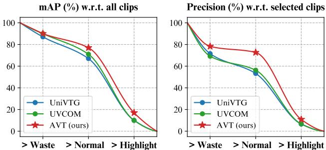
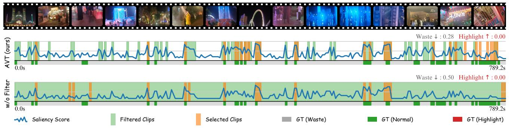
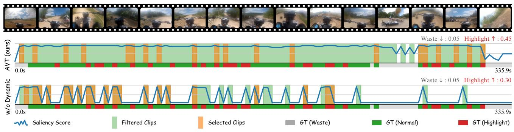

# 1. Bibliographic Information

## 1.1. Title
The central topic of the paper is `Agent-based Video Trimming`.

## 1.2. Authors
The authors are:
*   Lingfeng Yang
*   Zhenyuan Chen
*   Xiang Li
*   Peiyang Jia
*   Liangqu Long
*   Jian Yang

    Their affiliations include: Nanjing University of Science and Technology, VCIP, CS, Nankai University, NKIARI, Shenzhen Futian, and Insta360.

## 1.3. Journal/Conference
The paper is published as a preprint on arXiv, with the original source link provided. While arXiv hosts preprints before peer review, it is a widely recognized platform for disseminating new research in computer science and related fields. The `Published at (UTC): 2024-12-12T17:59:28.000Z` indicates it is a recent submission.

## 1.4. Publication Year
The paper was published in 2024.

## 1.5. Abstract
User-generated videos are growing in length, creating a challenge for viewers to find valuable information. Existing video processing methods, such as `highlight detection`, `moment retrieval`, and `video summarization`, primarily focus on selecting specific time intervals but often overlook the relationships between segments and the potential for arranging them into a coherent narrative.

This paper introduces a novel task called `Video Trimming (VT)`. This task involves three key aspects: detecting wasted footage, selecting valuable segments, and composing them into a final video with a coherent story. To address `VT`, the authors propose `Agent-based Video Trimming (AVT)`. `AVT` is structured into three phases: `Video Structuring`, `Clip Filtering`, and `Story Composition`.

Specifically, `AVT` employs a `Video Captioning Agent` (a `multimodal large language model` or `MLLM`) to convert video slices into structured textual descriptions. A `Filtering Module` then dynamically discards low-quality footage based on this structured information. Finally, a `Video Arrangement Agent` selects and compiles the valid clips into a coherent narrative.

For evaluation, the paper introduces a `Video Evaluation Agent` to assess trimmed videos, running in parallel with human evaluations. The authors also curate a new benchmark dataset for `video trimming` using raw user videos from the internet.

The main results show that `AVT` received more favorable evaluations in user studies and demonstrated superior `mAP` (mean Average Precision) and `precision` on the YouTube Highlights, TVSum, and the new dataset for the `highlight detection` task.

## 1.6. Original Source Link
*   Official source/PDF link: https://arxiv.org/abs/2412.09513, https://arxiv.org/pdf/2412.09513v1.pdf
*   Publication status: Preprint on arXiv.

# 2. Executive Summary

## 2.1. Background & Motivation
The proliferation of user-generated video content has led to an overwhelming amount of long-form videos. This extended content places a significant burden on viewers, who must spend considerable time sifting through vast amounts of footage to extract valuable insights or engaging moments. This problem highlights a critical need for efficient algorithms that can process and condense video information.

Current research in video understanding has made advancements in areas like `highlight detection` (identifying salient parts), `moment retrieval` (finding specific segments based on queries), and `video summarization` (condensing videos into keyframes or short clips). However, these existing approaches primarily focus on isolating and extracting specific time intervals. They often neglect two crucial aspects:
1.  **Relevance between segments**: How well do the selected clips connect to form a cohesive narrative?
2.  **Potential for segment arranging**: The ability to reorder clips to create a logical and engaging story, rather than simply presenting them chronologically.

    This gap in current research means that while existing methods can identify "interesting" parts, they often fail to produce a "viewable" video with a coherent storyline, especially from raw, unedited footage that might contain `wasted footage` (e.g., shaky camera, meaningless content).

The paper's entry point is to address these limitations by proposing a novel task called `Video Trimming (VT)`, which goes beyond mere extraction to include filtering and narrative composition. The innovative idea is to leverage the robust capabilities of `multimodal large language models (MLLMs)` as "agents" to perform complex reasoning and generation tasks for video editing.

## 2.2. Main Contributions / Findings
The paper makes several primary contributions to the field of video processing:

*   **Introduction of Video Trimming (VT) Task**: The paper formally introduces `Video Trimming`, a novel task that extends beyond traditional `highlight detection` and `video summarization`. `VT` involves detecting `wasted footage`, selecting `valuable segments`, and composing them into a final video with a `coherent story`. This addresses a critical need for algorithms that can produce truly viewable and engaging condensed videos from long, unedited user footage.
*   **Proposed Agent-based Video Trimming (AVT) Algorithm**: As a baseline for the `VT` task, the authors propose `AVT`, a three-phase algorithm:
    *   **Video Structuring**: Uses a `Video Captioning Agent` (an `MLLM`) to convert video clips into detailed structured textual descriptions, including `raw captions`, `contextual attributes` (what, where, when, who), `defect attributes` (occlusion, jittering, overexposure, meaningless content), and `highlight scores`. This textual representation allows for efficient, vision-free subsequent processing.
    *   **Clip Filtering**: Employs a `Dynamic Filter` module that dynamically discards low-quality footage. This filter balances `highlight scores` against `defect scores`, ensuring that valuable content isn't discarded due to minor filming imperfections, especially in dynamic scenes.
    *   **Story Composition**: Utilizes a `Video Arrangement Agent` (another `MLLM`) to select valid clips and arrange them into a cohesive narrative structure (beginning, development, ending) with a consistent storyline. This focuses on narrative flow rather than just saliency.
*   **Development of a Video Evaluation Agent**: The paper introduces an `LLM-based Video Evaluation Agent` to automatically assess the quality of trimmed videos based on specific criteria (`Material Richness`, `Appeal`, `Exciting Segments`, `Amount of Wasted Footage`). This agent's assessments are shown to be consistent with human evaluations, providing a scalable and objective metric.
*   **Curated a New Benchmark Dataset for Video Trimming**: The authors collected 42 raw user-generated videos (averaging 10 minutes) from YouTube, spanning daily life, sports, and travel vlogs. These videos are annotated with `waste` and `highlight` labels, providing a crucial resource for future research in `video trimming`.
*   **Demonstrated Superior Performance**:
    *   In user studies, `AVT` received more favorable evaluations for the quality of the final video cuts, indicating better `Material Richness`, `Appeal`, `Excitement`, and less `Wasted Footage`.
    *   `AVT` achieved superior `mAP` and `precision` on established `highlight detection` benchmarks (YouTube Highlights, TVSum) and their new dataset, particularly excelling in `zero-shot` transfer settings.
    *   `AVT` also demonstrated higher `fidelity` to raw videos, suggesting that it preserves more of the original content's essence while trimming.

        These findings collectively solve the problem of generating coherent, viewable, and concise videos from lengthy, raw user footage, addressing the limitations of existing content extraction and retrieval methods.

# 3. Prerequisite Knowledge & Related Work

## 3.1. Foundational Concepts

To understand this paper, a beginner should be familiar with the following core concepts:

*   **Multimodal Large Language Models (MLLMs)**: At their core, `Large Language Models (LLMs)` are advanced AI models, like `GPT-4` or `Gemini`, trained on massive amounts of text data to understand, generate, and process human language. `Multimodal LLMs (MLLMs)` extend this capability by integrating other modalities, such as images and video. This means they can process both text and visual inputs (e.g., frames from a video) to perform tasks like image captioning, visual question answering, or, as in this paper, generating structured descriptions of video content. They excel at `in-context communication` and `formatting interactions`, making them effective "training-free agents" for various tasks.
*   **Agent-based Approaches (in AI)**: In the context of AI, an "agent" refers to an autonomous entity that perceives its environment and acts upon that environment to achieve goals. In `agent-based approaches`, `LLMs` or `MLLMs` are often used as central controllers or "brains" that coordinate other specialized "tools" or "executors" (e.g., a video tracker, a captioning system, a video editor). They use techniques like `prompting` (giving natural language instructions) to guide these tools and achieve complex tasks, often in an iterative manner.
*   **Video Understanding**: This is a broad field in computer vision and AI that focuses on enabling machines to interpret, analyze, and comprehend the content of videos. It involves tasks such as recognizing actions, objects, and scenes; understanding temporal relationships; and describing video content in natural language.
*   **Highlight Detection (HD)**: A task in video understanding where the goal is to automatically identify and extract the most interesting, important, or "highlight" segments from a video. These segments are typically those with high `saliency` (prominence or importance).
*   **Moment Retrieval (MR)**: A task where the system is given a natural language query (e.g., "a dog chasing a ball") and must identify the precise start and end times of the video segment that corresponds to that query.
*   **Video Summarization**: The process of creating a condensed version of a video while preserving its most important information or key themes. This can involve selecting keyframes or short clips to represent the entire video.
*   **Chain of Thought (CoT) Prompting**: A technique used with `LLMs` where the model is prompted to explain its reasoning process step-by-step before arriving at a final answer. This helps in breaking down complex problems, improving the model's performance on reasoning tasks, and making its decision-making more transparent.
*   **Mean Average Precision (mAP)**: A common evaluation metric, particularly in object detection, information retrieval, and, in this context, `highlight detection`. It's a single number that summarizes the `Precision-Recall curve` for different `IoU` (Intersection over Union) thresholds. A higher `mAP` indicates better performance.
*   **Precision (in information retrieval/classification)**: A metric that measures the proportion of true positive results among all positive results returned by the model. In `highlight detection`, it would measure how many of the identified highlights are actually true highlights.
*   **Pearson Correlation Coefficient (r)**: A statistical measure that quantifies the linear relationship between two sets of data. It ranges from -1 to +1, where +1 indicates a perfect positive linear relationship, -1 indicates a perfect negative linear relationship, and 0 indicates no linear relationship.
*   **Spearman's Rank Correlation Coefficient (ρ)**: A non-parametric measure of the strength and direction of the monotonic relationship between two ranked variables. It assesses how well the relationship between two variables can be described using a monotonic function.
*   **Kendall's Tau (τ)**: Another non-parametric statistic used to measure the ordinal association between two measured quantities. It is a measure of rank correlation, meaning it assesses the similarity of the orderings of data when ranked by each of the quantities.

## 3.2. Previous Works

The paper contextualizes its `Video Trimming` task by differentiating it from existing video understanding tasks:

*   **Highlight Detection (HD)**:
    *   **Goal**: Predict `saliency scores` to extract significant segments.
    *   **Examples**: [22, 35, 41, 43, 58]. Datasets like YouTube Highlights [43] and TVSum [41] are prominent.
    *   **Limitation**: These methods focus solely on identifying "interesting" parts. They lack consideration for `temporal context`, `event relationships`, and `narrative coherence` needed for a complete video. They don't filter out `wasted footage`.

*   **Moment Retrieval (MR)**:
    *   **Goal**: Identify specific moments in a video corresponding to a given natural language query.
    *   **Examples**: [3, 13, 21, 34, 35]. Datasets include DiDeMo [3], ActivityNet Caption [21], Charades-STA [15]. Methods like Moment-DETR [22], QD-DETR [35], TR-DETR [42], UniVTG [27], and UVCOM [57] also combine moment and saliency prediction.
    *   **Limitation**: Requires a prior user query. The retrieved segments often lack `comprehensive video coverage` and `context`, and do not ensure `narrative flow`.

*   **Video Summarization**:
    *   **Goal**: Condense videos by selecting key shots that best represent the content.
    *   **Examples**: [4, 16, 72]. `Generic summarization` [16, 20, 33, 41] uses visual cues, while `query-based summarization` [27, 36, 38, 56] allows user-specified keywords.
    *   **Limitation**: Produces discrete keyframes or segments, which often fail to create a `coherent, viewable video` with a continuous narrative.

*   **Video Understanding with MLLMs/Agents**:
    *   **Early Works**: Focus on `video question answering` [24, 31, 50, 60, 71], `long video understanding` [19, 54], and `moment localization` [67]. Models like InternVid [51], InternVideo [50, 52], LaViLa [71], Valley [31], Merlin [66], MovieChat [40], PaLM-E [11], SeViLA [67], Vid2Seq [60], VideoChat [24], LongVLM [54], and VTimeLLM [19] have improved various aspects of video comprehension.
    *   **Agent-based Methods**:
        *   **Type 1 (LLMs + External Tools)**: `LLMs` coordinate external tools and code executors. Examples include DoraemonGPT [63] (symbolic memory for VQA), InternGPT [30] (interactive polling for reasoning), MM-ReAct [62] (extending REACT [64] to multimodal), Video ChatCaptioner [8] (multi-agent iterative polling).
        *   **Type 2 (Video-to-Text Conversion)**: Convert video content into a textual corpus for analysis. Examples include AssistGPT [14] (planning/execution for VQA/MR), ChatVideo [46] (text database for querying), LLoVi [68] (fine-grained VQA/interval retrieval with captions), MM-Vid [26] (multimodal as textual data), VideoAgent [49] (iterative polling/similarity matching for MR).
    *   **Limitation**: Type 1 agents lack specialized tools for `video trimming`. Type 2 video retrieval agents often neglect `global content` and `coherence` while extracting segments based on queries.

## 3.3. Technological Evolution
The field of video understanding has evolved from basic feature extraction and classification to more sophisticated methods leveraging deep learning. Initially, rule-based systems or traditional machine learning algorithms were used for tasks like event detection. With the rise of `convolutional neural networks (CNNs)` and `recurrent neural networks (RNNs)`, models gained the ability to automatically learn features from visual data and process temporal sequences. The development of `transformers` and `attention mechanisms` further enhanced the capability to model long-range dependencies in videos and integrate multimodal information (e.g., video and text).

More recently, the advent of `Large Language Models (LLMs)` and `Multimodal Large Language Models (MLLMs)` has marked a significant shift. These models, pre-trained on vast datasets, demonstrate powerful `zero-shot` and `few-shot learning` capabilities, enabling complex reasoning and generation tasks with minimal or no task-specific training. This has led to the `agent-based paradigm`, where `MLLMs` act as intelligent controllers to orchestrate various sub-tasks.

This paper's work fits into this timeline by leveraging the latest advancements in `MLLMs` and `agent-based approaches`. It extends the capabilities beyond simple `video understanding` or `retrieval` to address a complex, multi-faceted task of `video trimming`, which inherently requires both granular content analysis and high-level narrative reasoning.

## 3.4. Differentiation Analysis
The core differences and innovations of this paper's approach, `AVT`, compared to previous methods, can be summarized as follows:

*   **Novel Task Definition (Video Trimming)**: Unlike previous tasks that focus solely on `content extraction` (Highlight Detection, Moment Retrieval) or `condensation` (Video Summarization), `VT` explicitly introduces three integrated objectives: `detecting wasted footage`, `selecting valuable segments`, and `composing them into a coherent story`. This holistic approach is unique.
*   **Focus on Narrative Coherence**: Existing methods often output a collection of discrete, high-saliency clips. `AVT` explicitly emphasizes `story composition` using a `Video Arrangement Agent` that arranges selected clips into a `coherent narrative` (beginning, development, ending), ensuring viewability and logical flow. This is a significant departure from simply concatenating highly salient clips.
*   **Dynamic Filtering of Wasted Footage**: `AVT` incorporates a `Clip Filtering` phase with a `Dynamic Filter` that actively identifies and discards `low-quality footage` (e.g., due to occlusion, jittering, overexposure, meaningless content). This is not a primary concern for most `highlight detection` or `summarization` methods, which might inadvertently include such footage if it has high `saliency`. The `dynamic` aspect ensures that genuinely exciting content isn't lost due to minor technical imperfections.
*   **Structured Textual Representation**: Instead of directly processing visual features for all downstream tasks, `AVT` first converts video clips into `structured textual descriptions` using a `Video Captioning Agent`. This includes not only `raw captions` but also `contextual attributes` (what, where, when, who) and `defect attributes`. This text-based representation allows for faster, more efficient processing by `MLLMs` and enables more nuanced semantic analysis, facilitating both `filtering` and `composition`.
*   **Agent-based Architecture for Complex Tasks**: `AVT` leverages `MLLMs` as `training-free agents` for all three key phases (`structuring`, `filtering`, `composition`) and even for `evaluation`. This harnesses the `MLLMs'` powerful `in-context learning` and `reasoning capabilities` to manage complex, multi-step video editing tasks, which is more advanced than simply using `MLLMs` for `captioning` or `retrieval`.
*   **Integrated Evaluation**: The introduction of an `LLM-based Video Evaluation Agent` to assess trimmed videos across multiple criteria (`Material Richness`, `Appeal`, `Exciting Segments`, `Amount of Wasted Footage`) offers a more comprehensive and automated evaluation strategy aligned with human perception, going beyond traditional quantitative metrics like `mAP`.

    In essence, while related works provide foundational elements for video understanding, `AVT` innovates by integrating these elements within an `agent-based framework` to tackle the `novel task of video trimming`, prioritizing `narrative coherence` and `quality filtering` alongside `highlight detection`.

# 4. Methodology

The paper introduces the `Video Trimming (VT)` task, which aims to extend beyond simple `highlight selection`. It involves filtering out extraneous footage and creating cohesive, narratively coherent video outputs. To achieve this, the paper proposes `Agent-based Video Trimming (AVT)`, an algorithm that leverages `Multimodal Large Language Models (MLLMs)` as `training-free agents` across three main phases: `Video Structuring`, `Clip Filtering`, and `Story Composition`. An additional agent-based evaluation metric is also presented.

## 4.1. Principles
The core idea behind `AVT` is to transform the complex, multi-modal task of video trimming into a series of interconnected, `agent-driven` reasoning and selection steps. By first converting visual information into structured text, the subsequent filtering and composition processes can be performed efficiently by `MLLMs`, which excel at understanding and generating human-like narratives. The theoretical basis relies on the strong `in-context learning` and `reasoning capabilities` of modern `MLLMs` (like `GPT-4o`), allowing them to act as `expert agents` for video analysis, quality assessment, and storytelling without extensive task-specific training. This approach moves beyond purely data-driven, feature-matching methods by incorporating high-level semantic understanding and narrative construction.

## 4.2. Core Methodology In-depth (Layer by Layer)

The `AVT` algorithm is structured into three main phases: `Video Structuring`, `Clip Filtering`, and `Story Composition`.

### 4.2.1. Video Structuring

This initial phase converts raw video content into a structured textual format. The goal is to make subsequent operations independent of visual content, thereby enhancing processing speed and reducing computational costs.

1.  **Video Segmentation**: The raw video is first divided into smaller units called `clips`. The default duration for each clip is 3 seconds.
2.  **Frame Sampling**: For each `clip`, frames are sampled at a rate of one per second to serve as visual inputs for the `Video Captioning Agent`.
3.  **Attribute Extraction by Video Captioning Agent**: An `MLLM` (specifically, `GPT-4o` in the implementation) is employed as the `Video Captioning Agent`. This agent processes the sampled frames from each clip to extract detailed, structured information. Unlike previous works that generate generic video descriptions, `AVT` aims to extract specific attributes crucial for trimming:
    *   **Raw Caption**: A brief, descriptive summary of the clip's content, typically not exceeding two sentences. This provides a general understanding of the visual scene.
    *   **Contextual Attributes**: These attributes summarize the video content across four dimensions:
        *   `[What]`: Main actions or events in the scene (e.g., "prepare for vlogging").
        *   `[Where]`: Location (e.g., "kitchen").
        *   `[When]`: Time of day, season, or relevant period (e.g., "evening").
        *   `[Who]`: Potential characters or subjects (e.g., "woman").
            These are designed to be short sentences or phrases.
    *   **Defect Attributes**: These are critical for assessing the quality of the footage, especially important for raw, user-generated videos which often contain imperfections. Four primary defects are identified:
        *   `Occlusion`: The target subject is blocked by obstacles.
        *   `Jittering`: Excessive camera shake.
        *   `Overexposure`: The image is too bright, losing detail.
        *   `Meaningless content`: Scenes with simple transitions, empty shots, or extended static frames lacking substantive information.
            Each `defect attribute` returns a float value from 0 to 1, indicating the degree of the flaw (0 meaning no defect, 1 meaning severe defect).
    *   **Highlight Attribute**: A "Highlight" attribute is designed to measure the overall excitement level of each clip. It also returns a float value from 0 to 1, where 0 indicates not a highlight, and 1 indicates a strong highlight.

        The `Clip ID` is assigned sequentially based on the video's length. The `Video Captioning Agent` is prompted to output this structured text information in a specific format (e.g., `[Occlusion]: 0.8; [Jittering]: 0.7; [Overexposure]: 0.0; [Meaningless]: 0.0; [Highlight]: 0.9;`). This structured textual representation enables faster and more efficient processing in subsequent phases, as these operations can largely rely on text inputs rather than raw visual data.

### 4.2.2. Clip Filtering

This phase dynamically selects useful clips by analyzing the structured textual descriptions generated in the `Video Structuring` phase, differentiating between valuable and irrelevant content.

1.  **Input to Filtering**: The `defect attributes` and the `highlight score` for each clip are used as inputs. These are formatted as strings, for example: `"[Occlusion]: 0.8; [Jittering]: 0.7; [Overexposure]: 0.0; [Meaningless]: 0.0; [Highlight]: 0.9;"`.
2.  **Dynamic Filter Mechanism**: Instead of simply discarding clips with any defect score greater than zero (which might be too strict for first-person videos where camera shake is common), `AVT` introduces a `Dynamic Filter`. This filter balances the positive `Highlight` score against the negative `defect scores`.
    *   **Hypothesis**: The algorithm should prioritize intense video content over minor filming imperfections.
    *   **Rule**: A clip is considered `valid` for the final composition **only when its "Highlight" score exceeds all individual defect scores**. This ensures that genuinely exciting moments are preserved even if they have minor filming flaws, while truly low-quality or `meaningless` segments are discarded.
3.  **Algorithm for Dynamic Filtering**: The string processing algorithm `Alg. 1` describes this process:

    $$
# Algorithm 1 Dynamic Filtering Algorithm
    
        Input: List of Keys keys, List of Numbers nums   
        Output:(filter_flag, highlightflag, highlight_score)   
        1: Initialize $s c o r e \gets 0$ $m a x \_ k e y \gets $ None   
        2: for each (key, num) in zip(keys, nums) do   
        3:   if $n u m \ge s c o r e$ then   
        4:     $s c o r e \gets n u m$   
        5:     $m a x \_ k e y \gets k e y$   
        6:   end if   
        7: end for   
        8: if max_key = [Highlight] then   
        9:   return (False, True, score)   
        10: else   
        11:  return (score = 0, False, score)   
        12:end if
    $$
    *   **Symbol Explanation**:
        *   `keys`: A list of attribute names (e.g., "Occlusion", "Jittering", "Overexposure", "Meaningless", "Highlight").
        *   `nums`: A list of numerical scores corresponding to each key (e.g., [0.8, 0.7, 0.0, 0.0, 0.9]).
        *   `score`: A variable initialized to 0, used to track the maximum score found so far.
        *   `max_key`: A variable initialized to `None`, used to store the key associated with the `max_score`.
        *   `filter_flag`: A boolean output indicating whether the clip should be filtered out (`True`) or kept (`False`).
        *   `highlight_flag`: A boolean output indicating whether the `max_key` was "Highlight".
        *   `highlight_score`: The numerical score associated with the `max_key`.

    *   **Algorithm Logic**:
        *   The algorithm iterates through all `attribute-score pairs` for a given clip.
        *   It finds the `maximum score` among all attributes (both defect and highlight).
        *   If the `max_key` (the attribute with the highest score) is `[Highlight]`, it means the clip's highlight score is greater than or equal to all its defect scores. In this case, the `filter_flag` is set to `False` (meaning "do not filter out"), `highlight_flag` is `True`, and the `score` is the `highlight score`.
        *   If the `max_key` is *not* `[Highlight]` (meaning a defect attribute had the highest score), the `filter_flag` is set based on whether the `score` (the highest defect score) is 0 (`True` if 0, `False` if >0 meaning filter out), `highlight_flag` is `False`, and `score` is the highest defect score. The phrasing $(score = 0, False, score)$ for the `else` condition implies that if the maximum score is not a highlight, and that maximum score is greater than 0, the clip should be filtered out. If the maximum score is 0, it means no defects and no highlights, which might still be filtered or treated differently depending on the overall composition strategy. The key interpretation here is `return (False, True, score)` if `[Highlight]` wins, meaning the clip is kept. Otherwise, $return (score = 0, False, score)$ implies a `filter_flag` of `True` if $score > 0$ (meaning a defect won), or `False` if $score == 0$ (meaning no defects and no highlights, still could be kept if needed for story). The paper's text `a clip is selected as valid for the final composition only when its "Highlight" score exceeds all defect scores` clarifies this logic.

            This dynamic filtering mechanism outputs a set of `valid clips` for the next phase.

The paper also defines a saliency score $S_i$ for each clip $i$, which is derived from the highlight and defect scores:
\$
S _ { i } = { \left\{ \begin{array} { l l } { S _ { h } } & { { \mathrm { i f } } \ S _ { h } > m a x ( S _ { d } ) , } \\ { S _ { h } - m a x ( S _ { d } ) } & { { \mathrm { o t h e r w i s e } } , } \end{array} \right. }
\$
*   **Symbol Explanation**:
    *   $S_i$: The saliency score for clip $i$.
    *   $S_h$: The `highlight score` for clip $i$, obtained from the `Video Captioning Agent`.
    *   $S_d$: A list of `defect scores` for clip $i$ (e.g., occlusion, jittering, etc.), obtained from the `Video Captioning Agent`.
    *   $max(S_d)$: The maximum value among all `defect scores` for clip $i$.

*   **Formula Logic**:
    *   If the `highlight score` ($S_h$) is greater than the maximum `defect score` ($max(S_d)$), then the clip's saliency score $S_i$ is simply its `highlight score` $S_h$. This aligns with the dynamic filter's logic of prioritizing highlights over minor defects.
    *   Otherwise (if $S_h$ is not greater than $max(S_d)$), the clip's saliency score $S_i$ is calculated by subtracting the maximum `defect score` from the `highlight score`. This effectively penalizes clips where defects are more prominent than highlights, resulting in a lower saliency score, potentially even negative, indicating it's not a strong highlight.

## 4.2.3. Story Composition

This phase uses a `Video Arrangement Agent` to select and arrange the `filtered clips` into a coherent final video with a logical and engaging narrative.

1.  **User Prompt Design**: A detailed `user prompt` ($P$) is crafted to guide the `Video Arrangement Agent`. This prompt includes:
    *   An `introduction to the task`: Framing the agent as a "professional video editor specializing in video trimming."
    *   `Chain of Thought (CoT)` instructions: Guiding the agent to generate video composition steps that consider `global comprehension`, `clip selection`, and `composition arrangement`. The `CoT` encourages the agent to think step-by-step.
    *   Rules for composition: such as including beginning and ending segments, focusing on continuous brilliant clips, avoiding duplicates or similar sceneries, preferring dynamic scenes, and ensuring the number of selected clips meets a certain range (no less than half of input clips for initial grouping, 15-20 for final story).
2.  **User Input Formatting**: The `Video Arrangement Agent` receives `user input` ($I$) which is a concatenation of the structured information for all $M$ valid clips ($C = \{ C _ { 1 } , C _ { 2 } , \dots , C _ { M } \}$) that passed the `Clip Filtering` phase.
    \$
    \begin{array} { c } { { I = \{ \{ C l i p I D \} _ { k } , \{ H i g h l i g h t F l a g \} _ { k } ( \{ S c o r e \} _ { k } ) , } } \\ { { \{ C o n t e x t u a l A t t r i b u t e s \} _ { k } , } } \\ { { \{ R a w C a p t i o n \} _ { k } \} \mid _ { C l i p - k } \{ C _ { 1 } \sim C _ { M } \} , } } \end{array}
    \$
    *   **Symbol Explanation**:
        *   $I$: The formatted `user input` provided to the `Video Arrangement Agent`.
        *   $\{Clip ID\}_k$: The unique identifier for clip $k$.
        *   $\{Highlight Flag\}_k$: A boolean indicating if clip $k$ was identified as a highlight (from `Clip Filtering`).
        *   $\{Score\}_k$: The `highlight score` or maximum `defect score` for clip $k$ (from `Clip Filtering`).
        *   $\{Contextual Attributes\}_k$: The `what, where, when, who` descriptions for clip $k$ (from `Video Structuring`).
        *   $\{Raw Caption\}_k$: The brief description of clip $k$ (from `Video Structuring`).
        *   $Clip-k \{C_1 \sim C_M\}$: Denotes that this structured information is provided for all $M$ valid clips.
3.  **Agent Output Generation**: The `Video Arrangement Agent` is prompted with $P$ and $I$. It is expected to output a storyline consisting of a `preferred sequence` of clips, generated by mapping sentences to their corresponding clip indices, arranged in a sensible order. The output also includes the narrative and the reasoning behind the organization.
    *   **Example Output Structure**:
        *   `Overall comprehension: The video collection features...` (Global concept)
        *   `Beginning is about...; choose clip id: [2]`
        *   `Development follows...; choose clip id: [3, 39, ..., 127]`
        *   `Ending is about...; choose clip id: [129]`
4.  **Iterative Composition**: The composition phase may be iterated to achieve the desired output video length.
    *   **Handling Long Contexts**: To mitigate `LLM` limitations with long contexts and distractions, clips are initially grouped, and the agent is called in parallel for processing. As the number of clips decreases, all information is integrated for the final composition.
5.  **Final Video Assembly**: The final clip indices ($C^t$) are mapped back to their respective video durations, and these video segments are assembled. Crucially, not all clips will be selected, and their sequence may not strictly follow chronological order, but rather the storyline organized by the agent. This phase prioritizes `frame composition` and includes slightly less `highlighted segments` as transitions to bridge content effectively.

## 4.2.4. Final Cut Evaluation

An `LLM-based Video Evaluation Agent` is designed to assess the quality of the trimmed videos, aligning with human preferences.

1.  **Evaluation Criteria**: The evaluation agent is given specific criteria, rated on a scale of 1 to 5:
    *   `Material Richness`: Assesses `diversity` and `narrative coherence`.
    *   `Appeal`: Measures `engagement`, `length`, and `entertainment` value.
    *   `Exciting Segments`: Evaluates `highlight quality` and `frequency`.
    *   `Amount of Wasted Footage`: Considers `irrelevant content`, with higher scores indicating fewer distractions and better viewing experience.
2.  **Chain of Thought (CoT) Instructions**: To improve precision and alignment with human assessments, the `Video Evaluation Agent` is provided with `CoT` instructions.
3.  **Agent Input and Output**: The agent uses `only video content` as input. It outputs scores for each metric along with justifications.
    *   **Example Output Format**: $"[Material Richness]: {Reason} (2.5); [Appeal]: {Reason} (3.0); [Exciting Segments]: {Reason} (3.5); [Amount of Wasted Footage]: {Reason} (2.0);"$
4.  **Final Rating**: The average of all individual scores determines the final rating of a video cut.

## 4.3. Algorithm 1 Dynamic Filtering Algorithm
The algorithm for dynamic filtering has been presented and explained in detail within section 4.2.2. Clip Filtering, above.

## 4.4. Saliency Score Formula
The formula for the saliency score $S_i$ has been presented and explained in detail within section 4.2.2. Clip Filtering, above.

# 5. Experimental Setup

## 5.1. Datasets

The experiments utilize both existing benchmark datasets and a newly curated dataset for `video trimming`.

*   **YouTube Highlights [43]**:
    *   **Source**: Web videos.
    *   **Scale**: 423 videos.
    *   **Characteristics**: Short videos, often pre-edited highlights.
    *   **Domain**: Various, typically user-generated content.
    *   **Annotation Type**: Frame-level `saliency scores` (highlights).
    *   **Duration**: (Min, Max, Avg) = (7s, 1483s, 102s).
    *   **Chosen for**: Evaluating `highlight detection` performance.
    *   **Split**: $20\%$ for testing/validation, following [27, 28].

*   **TVSum [41]**:
    *   **Source**: Web videos.
    *   **Scale**: 50 videos.
    *   **Characteristics**: Diverse content, includes various events.
    *   **Domain**: Various, often documentary-style or event footage.
    *   **Annotation Type**: Frame-level `saliency scores` (highlights).
    *   **Duration**: (Min, Max, Avg) = (83s, 647s, 235s).
    *   **Chosen for**: Evaluating `highlight detection` performance, especially for longer videos compared to YouTube Highlights.
    *   **Split**: All videos used for zero-shot settings due to small scale; validation split used for agent evaluation.

*   **Video Trimming Dataset (ours)**:
    *   **Source**: Web-crawled videos from YouTube.
    *   **Scale**: 30 topics with 42 raw user videos, contributed by 30 users.
    *   **Characteristics**:
        *   **Raw, unedited videos**: Crucial for the `video trimming` task, reflecting real-world filming conditions with imperfections (occlusion, jitter, overexposure).
        *   **Long-form**: Each video averages 10 minutes (Min: 141s, Max: 1483s, Avg: 556s), significantly longer than existing datasets.
        *   **Multi-source potential**: Videos filmed around a consistent event, allowing algorithms to composite cuts from multiple source videos.
    *   **Domain**: Categorized into three groups: `daily life`, `sports`, and `travel vlogs`.
    *   **Annotation Type**: Frame-level scores with four ranks of quality:
        *   `0`: `wasted footage`
        *   `1`: `ambiguous`
        *   `2`: `normal`
        *   `3`: `highlight footage`
            Annotated by 10 annotators.
    *   **Chosen for**: Specifically designed to benchmark the `video trimming` task, providing data for filtering `wasted footage` and `story composition`.

        The choice of these datasets allows for both direct comparison with `highlight detection` baselines and a novel evaluation of the proposed `video trimming` task on custom, challenging data.

## 5.2. Evaluation Metrics

For every evaluation metric mentioned in the paper, a complete explanation is provided:

## 5.2.1. Mean Average Precision (mAP)

*   **Conceptual Definition**: `mAP` is a commonly used metric for evaluating the performance of object detection models, and in this context, `highlight detection`. It quantifies how accurately a model identifies positive instances (highlights) while also considering the ranking of its predictions. It balances both `precision` and `recall` across different `Intersection over Union (IoU)` thresholds. A higher `mAP` value indicates better overall detection performance.

*   **Mathematical Formula**:
    `mAP` is typically calculated by averaging the `Average Precision (AP)` over all classes (or in this case, a single "highlight" class, or different `IoU` thresholds). `AP` is the area under the `Precision-Recall curve`.

    The formula for `Average Precision (AP)` is:
    \$
    \mathrm{AP} = \sum_{k=1}^{N} \mathrm{P}(k) \Delta \mathrm{R}(k)
    \$
    Or, more commonly, as an integral:
    \$
    \mathrm{AP} = \int_{0}^{1} P(R) dR
    \$
    For discrete predictions, this is often approximated by summing `P(k)` (precision at $k$) whenever recall changes, or by using 11-point interpolated `AP` (not shown here for brevity but standard).

    Then, `mAP` is the mean of `AP` values:
    \$
    \mathrm{mAP} = \frac{1}{Q} \sum_{q=1}^{Q} \mathrm{AP}_q
    \$

*   **Symbol Explanation**:
    *   $N$: The total number of retrieved items (video segments in this case).
    *   $k$: The rank in the ordered list of retrieved items.
    *   $\mathrm{P}(k)$: The `precision` at cutoff $k$.
    *   $\Delta \mathrm{R}(k)$: The change in `recall` from `k-1` to $k$.
    *   `P(R)`: The `precision` as a function of `recall`.
    *   $Q$: The number of queries or classes (in this paper, it could refer to averaging over different videos or types of highlights).
    *   $\mathrm{AP}_q$: The `Average Precision` for a specific query $q$.

        In the context of `highlight detection`, a detected segment is considered a `true positive` if its `Intersection over Union (IoU)` with a ground-truth highlight segment exceeds a certain threshold (e.g., 0.5).

## 5.2.2. Precision

*   **Conceptual Definition**: `Precision` measures the proportion of correctly identified positive cases (true positives) out of all cases that the model identified as positive (true positives + false positives). In `highlight detection`, it tells us how many of the clips flagged as "highlights" by the model were actually "highlights." A high `precision` indicates that the model has a low rate of false alarms.

*   **Mathematical Formula**:
    \$
    \mathrm{Precision} = \frac{\mathrm{TP}}{\mathrm{TP} + \mathrm{FP}}
    \$

*   **Symbol Explanation**:
    *   $\mathrm{TP}$ (True Positives): The number of actual highlight segments that the model correctly identified as highlights.
    *   $\mathrm{FP}$ (False Positives): The number of non-highlight segments that the model incorrectly identified as highlights.

## 5.2.3. Pearson Correlation Coefficient ($r$)

*   **Conceptual Definition**: The `Pearson correlation coefficient` measures the strength and direction of a linear relationship between two continuous variables. In this paper, it's used to assess the linear correlation between the `Video Evaluation Agent`'s scores and human ratings. Values range from -1 to +1: +1 signifies a perfect positive linear correlation (as one variable increases, the other increases proportionally), -1 signifies a perfect negative linear correlation, and 0 signifies no linear correlation.

*   **Mathematical Formula**:
    \$
    r = \frac{\sum_{i=1}^{n} (x_i - \bar{x})(y_i - \bar{y})}{\sqrt{\sum_{i=1}^{n} (x_i - \bar{x})^2 \sum_{i=1}^{n} (y_i - \bar{y})^2}}
    \$

*   **Symbol Explanation**:
    *   $n$: The number of data points (e.g., videos evaluated).
    *   $x_i$: The score from the `Video Evaluation Agent` for the $i$-th video.
    *   $\bar{x}$: The mean (average) of the `Video Evaluation Agent`'s scores.
    *   $y_i$: The human rating for the $i$-th video.
    *   $\bar{y}$: The mean (average) of the human ratings.

## 5.2.4. Spearman's Rank Correlation Coefficient ($\rho$)

*   **Conceptual Definition**: `Spearman's rank correlation coefficient` is a non-parametric measure that assesses the strength and direction of a monotonic relationship between two ranked variables. Unlike Pearson, it doesn't assume linearity; it only cares if the variables tend to move in the same direction. It's suitable for evaluating agreement on ordered preferences (rankings). In this paper, it's used to correlate the rankings assigned by the `Video Evaluation Agent` with human rankings. Values range from -1 to +1, similar to Pearson.

*   **Mathematical Formula**:
    \$
    \rho = 1 - \frac{6 \sum d_i^2}{n(n^2 - 1)}
    \$

*   **Symbol Explanation**:
    *   $n$: The number of data points (e.g., videos evaluated).
    *   $d_i$: The difference between the ranks of the $i$-th video for the two variables (e.g., rank by agent vs. rank by human).

## 5.2.5. Kendall's Tau ($\tau$)

*   **Conceptual Definition**: `Kendall's Tau` is another non-parametric measure of rank correlation. It quantifies the degree of similarity between two sets of rankings. It calculates the probability that two randomly chosen observations will be in the same order versus in different orders. It's robust to errors and small sample sizes. Like Pearson and Spearman, its values range from -1 to +1.

*   **Mathematical Formula**:
    \$
    \tau = \frac{N_c - N_d}{\frac{1}{2} n (n-1)}
    \$

*   **Symbol Explanation**:
    *   $n$: The number of data points (e.g., videos evaluated).
    *   $N_c$: The number of `concordant pairs` (pairs of data points that have the same relative rank ordering in both lists).
    *   $N_d$: The number of `discordant pairs` (pairs of data points that have different relative rank orderings in the two lists).
    *   $\frac{1}{2} n (n-1)$: The total number of possible pairs.

## 5.3. Baselines

The paper compares `AVT` against several existing methods, broadly categorized into `highlight detection` and `video summarization` approaches.

For **Video Trimming (Human and Agent Evaluation)**, the following methods are used:
*   **UniVTG [27]**: A unified video-language temporal grounding model.
*   **UVCOM [57]**: A unified video comprehension framework for moment retrieval and highlight detection.

    For **Highlight Detection (Quantitative Comparison)**, a wider range of methods are considered, including `fully supervised (FS)`, `weakly supervised (WS)`, and `zero-shot (ZS)` approaches:

*   **Fully Supervised (FS)**:
    *   **LSVM [43]**: Learning Saliency for Video Moments.
    *   **Trailer [48]**: Learning Trailer Moments in Full-length Movies with Co-Contrastive Attention.
    *   **SL-Module [59]**: Cross-category Video Highlight Detection via Set-based Learning.
    *   **Joint-VA† [5]**: Joint Visual and Audio Learning for Video Highlight Detection. (Indicates use of audio modality)
    *   **UMT [28]**: Unified Multi-modal Transformers for Joint Video Moment Retrieval and Highlight Detection.
    *   **UniVTG [27]**: Unified Video-Language Temporal Grounding.
    *   **UVCOM [57]**: Unified Video Comprehension Framework.
    *   **sLSTM [70]**: Video Summarization with Long Short-Term Memory.

*   **Weakly Supervised (WS)**:
    *   **LIM-S [58]**: Less Is More: Learning Highlight Detection from Video Duration.
    *   **MINI-Net† [18]**: Multiple Instance Ranking Network for Video Highlight Detection. (Indicates use of audio modality)
    *   **TCG† [65]**: Temporal Cue Guided Video Highlight Detection with Low-Rank Audio-Visual Fusion. (Indicates use of audio modality)

*   **Zero-Shot (ZS)**:
    *   **RRAE [61]**: Unsupervised Extraction of Video Highlights via Robust Recurrent Auto-Encoders.
    *   **UniVTG [27]**: Unified Video-Language Temporal Grounding.
    *   **UVCOM [57]**: Unified Video Comprehension Framework.
    *   **SG [33]**: Unsupervised Video Summarization with Adversarial LSTM Networks.

        These baselines are representative as they cover different paradigms in `highlight detection` and `video summarization`, from traditional supervised methods to more recent `zero-shot` transfer learning approaches, allowing for a comprehensive comparison of `AVT`'s performance. For `zero-shot` settings, models pretrained on large datasets like QVHighlights [22] and Charades-STA [15] are used for inference.

## 5.4. Implementation Details

*   **`MLLM` Model**: All agents (`Video Captioning Agent`, `Video Arrangement Agent`, `Video Evaluation Agent`) in the `AVT` algorithm are implemented using the `GPT-4o` model [37]. This choice is made to leverage its advanced `multimodal interaction capabilities` and ensure `restricted output formatting`.
*   **Video Segmentation**: The input video is uniformly divided into 3-second segments (clips).
*   **Frame Sampling**: From each 3-second clip, one keyframe is sampled per second by default.
*   **Image Resizing**: All sampled frame images are resized to 512 pixels on their shorter side.
*   **Text Inputs**: These include the custom-designed `prompting instructions` for each agent, as well as the `structured video captions` and `attributes` (Raw Caption, Contextual Attributes, Defect Attributes, Highlight Score) generated during the `Video Structuring` phase.
*   **Token Consumption and Cost (for a 10-minute raw video)**:
    *   Input image tokens: Approximately 153,000.
    *   Input text tokens: Approximately 100,000.
    *   Output text tokens: Approximately 20,000.
    *   Estimated API Cost: Approximately \$0.83.
*   **Output Video Length**: The final trimmed videos are restricted to around one minute to ensure fair comparisons across methods.
*   **Efficiency Optimization (Supplementary Material)**:
    *   **Frame Sampling Ratio**: Ablation studies (Table S3) show that a 1 frame per second (fps) sampling ratio is more cost-effective (``0.83`) than 4 fps (``5.04` or `$1.98`) while maintaining comparable `agent metric` performance.
    *   **Prompt Design**: Using a `unified prompt` to generate all components (raw captions, defect attributes, contextual attributes) in the `Video Structuring` phase is more efficient (``0.83`) than `isolated prompts` (``1.60`) that require processing visual content three times, again with comparable performance.

# 6. Results & Analysis

## 6.1. Comparisons on Video Trimming

## 6.1.1. Human Evaluation

A user study was conducted using a blind test methodology on the newly constructed `Video Trimming Dataset`. Seventeen participants evaluated 30 final video cuts (generated from 42 raw videos) from different methods on a scale of 1 to 10 across five aspects: `Material Richness`, `Appeal`, `Exciting Segments`, `Amount of Wasted Footage`, and an `Overall` perception score. For existing `highlight detection` methods, their pretrained models were used to generate `saliency scores`, and final videos were created by concatenating clips with the top scores.

The following are the results from Table 1 of the original paper:

<table>
<thead>
<tr>
<td>Method</td>
<td>Richness</td>
<td>Appeal</td>
<td>Excitement</td>
<td>Wasted</td>
<td>Overall</td>
<td>Agent</td>
</tr>
</thead>
<tbody>
<tr>
<td>UniVTG [27]</td>
<td>6.41</td>
<td>7.15</td>
<td>4.74</td>
<td>6.04</td>
<td>6.30</td>
<td>3.03</td>
</tr>
<tr>
<td>UVCOM [57]</td>
<td>6.15</td>
<td>7.12</td>
<td>4.69</td>
<td>6.47</td>
<td>6.23</td>
<td>2.91</td>
</tr>
<tr>
<td>AVT (ours)</td>
<td>7.21</td>
<td>7.78</td>
<td>5.57</td>
<td>6.72</td>
<td>7.15</td>
<td>3.32</td>
</tr>
</tbody>
</table>

**Analysis**:
`AVT` consistently outperforms the baseline methods (UniVTG and UVCOM) across all human evaluation metrics.
*   `Material Richness` (7.21 vs. 6.41, 6.15): `AVT`'s higher score suggests it creates videos with greater diversity of content and better narrative coherence, likely due to its `Story Composition` phase.
*   `Appeal` (7.78 vs. 7.15, 7.12): `AVT` produces more engaging, appropriately lengthed, and entertaining videos.
*   `Excitement` (5.57 vs. 4.74, 4.69): `AVT` identifies and includes more high-quality, exciting segments.
*   `Wasted Footage` (6.72 vs. 6.04, 6.47): `AVT` effectively filters out irrelevant or low-quality content, resulting in fewer distractions.
*   `Overall` (7.15 vs. 6.30, 6.23): The aggregate score indicates a strong preference for `AVT`'s trimmed videos.

    The `Agent` column shows the evaluation score from the `Video Evaluation Agent`, which is `3.32` for `AVT` compared to `3.03` and `2.91` for baselines. This consistency between human and agent evaluations validates the effectiveness of the `Video Evaluation Agent` as an automated metric. The improvements for `AVT` are attributed to its explicit `filtering of wasted footage` and the `clip composition process` which aims for a coherent storyline.

## 6.1.2. Agent Evaluation

The `Video Evaluation Agent` (designed in Sec. 3.4) was used to assess video quality on the validation sets of YouTube Highlights (150 videos) and TVSum (10 videos). The comparison is against three related previous methods.

The following are the results from Table 2 of the original paper:

<table>
<thead>
<tr>
<td>Dataset</td>
<td>Method</td>
<td>Richness</td>
<td>Appeal</td>
<td>Excitement</td>
<td>Wasted</td>
<td>Average</td>
</tr>
</thead>
<tbody>
<tr>
<td rowspan="4">YouTube Highlights</td>
<td>UMT [28]</td>
<td>2.70</td>
<td>3.08</td>
<td>3.40</td>
<td>3.44</td>
<td>3.15</td>
</tr>
<tr>
<td>UniVTG [27]</td>
<td>2.67</td>
<td>3.06</td>
<td>3.35</td>
<td>3.39</td>
<td>3.12</td>
</tr>
<tr>
<td>UVCOM [57]</td>
<td>2.72</td>
<td>3.10</td>
<td>3.45</td>
<td>3.45</td>
<td>3.18</td>
</tr>
<tr>
<td>AVT (ours)</td>
<td>2.79</td>
<td>3.17</td>
<td>3.53</td>
<td>3.44</td>
<td>3.23</td>
</tr>
<tr>
<td rowspan="4">TVSum</td>
<td>PGL-SUM [4]</td>
<td>2.75</td>
<td>3.05</td>
<td>3.10</td>
<td>3.10</td>
<td>3.00</td>
</tr>
<tr>
<td>UniVTG [27]</td>
<td>2.65</td>
<td>2.95</td>
<td>2.85</td>
<td>3.15</td>
<td>2.90</td>
</tr>
<tr>
<td>UVCOM [57]</td>
<td>2.50</td>
<td>2.80</td>
<td>2.70</td>
<td>3.30</td>
<td>2.83</td>
</tr>
<tr>
<td>AVT (ours)</td>
<td>3.15</td>
<td>3.35</td>
<td>3.25</td>
<td>3.70</td>
<td>3.36</td>
</tr>
</tbody>
</table>

**Analysis**:
*   **YouTube Highlights**: `AVT` achieves the highest `Average` score (3.23) compared to UMT (3.15), UniVTG (3.12), and UVCOM (3.18). It shows improvements in `Richness`, `Appeal`, and `Excitement`, demonstrating its ability to generate higher-quality trimmed videos according to the agent's criteria. `Wasted Footage` is comparable to the best baseline (UVCOM).
*   **TVSum**: `AVT` shows a more significant lead, achieving an `Average` score of 3.36, substantially higher than PGL-SUM (3.00), UniVTG (2.90), and UVCOM (2.83). It particularly excels in `Richness`, `Appeal`, and `Wasted Footage` (3.70, the highest score). This suggests that `AVT` is particularly effective on the TVSum dataset, which might contain more diverse content or be more challenging for existing methods in terms of coherence and waste.

    These results, evaluated by the `Video Evaluation Agent`, further support the human evaluation findings, indicating that `AVT` generally produces higher-quality trimmed videos.

## 6.2. Comparisons on Highlight Detection

This section evaluates `AVT`'s performance specifically on the `highlight detection` task, comparing it with existing `highlight detection` and `video summarization` approaches. The `saliency score` for `AVT` is calculated using the formula $S_i = S_h$ if $S_h > max(S_d)$, and $S_h - max(S_d)$ otherwise.

## 6.2.1. YouTube Highlights (mAP)

The following are the results from Table 3 of the original paper:

<table>
<thead>
<tr>
<td>Method</td>
<td>Sup</td>
<td>Dog</td>
<td>Gym.</td>
<td>Par.</td>
<td>Ska.</td>
<td>Ski.</td>
<td>Sur.</td>
<td>Avg.</td>
</tr>
</thead>
<tbody>
<tr>
<td>LSVM [43]</td>
<td>FS</td>
<td>60.0</td>
<td>41.0</td>
<td>61.0</td>
<td>62.0</td>
<td>36.0</td>
<td>61.0</td>
<td>53.6</td>
</tr>
<tr>
<td>Trailer [48]</td>
<td>FS</td>
<td>63.3</td>
<td>82.5</td>
<td>62.3</td>
<td>52.9</td>
<td>74.5</td>
<td>79.3</td>
<td>69.1</td>
</tr>
<tr>
<td>SL-Module [59]</td>
<td>FS</td>
<td>70.8</td>
<td>53.2</td>
<td>77.2</td>
<td>72.5</td>
<td>66.1</td>
<td>76.2</td>
<td>69.3</td>
</tr>
<tr>
<td>Joint-VA† [5]</td>
<td>FS</td>
<td>64.5</td>
<td>71.9</td>
<td>80.8</td>
<td>62.0</td>
<td>73.2</td>
<td>78.3</td>
<td>71.8</td>
</tr>
<tr>
<td>UMT† [28]</td>
<td>FS</td>
<td>65.9</td>
<td>75.2</td>
<td>81.6</td>
<td>71.8</td>
<td>72.3</td>
<td>82.7</td>
<td>74.9</td>
</tr>
<tr>
<td>UniVTG [27]</td>
<td>FS</td>
<td>74.3</td>
<td>79.0</td>
<td>74.4</td>
<td>84.9</td>
<td>75.1</td>
<td>83.9</td>
<td>78.6</td>
</tr>
<tr>
<td>UVCOM [57]</td>
<td>FS</td>
<td>73.8</td>
<td>77.1</td>
<td>75.7</td>
<td>75.3</td>
<td>74.0</td>
<td>82.7</td>
<td>76.4</td>
</tr>
<tr>
<td>LIM-S [58]</td>
<td>WS</td>
<td>57.9</td>
<td>41.7</td>
<td>67.0</td>
<td>57.8</td>
<td>48.6</td>
<td>65.1</td>
<td>56.4</td>
</tr>
<tr>
<td>MINI-Net† [18]</td>
<td>WS</td>
<td>58.2</td>
<td>61.7</td>
<td>70.2</td>
<td>72.2</td>
<td>58.7</td>
<td>65.1</td>
<td>64.4</td>
</tr>
<tr>
<td>TCG† [65]</td>
<td>WS</td>
<td>55.4</td>
<td>62.7</td>
<td>70.9</td>
<td>69.1</td>
<td>60.1</td>
<td>59.8</td>
<td>63.0</td>
</tr>
<tr>
<td>RRAE [61]</td>
<td>ZS</td>
<td>49.0</td>
<td>35.0</td>
<td>50.0</td>
<td>25.0</td>
<td>22.0</td>
<td>49.0</td>
<td>38.3</td>
</tr>
<tr>
<td>UniVTG [27]</td>
<td>ZS</td>
<td>48.8</td>
<td>57.5</td>
<td>59.4</td>
<td>39.7</td>
<td>57.4</td>
<td>49.1</td>
<td>52.0</td>
</tr>
<tr>
<td>UVCOM [57]</td>
<td>ZS</td>
<td>46.6</td>
<td>67.4</td>
<td>61.4</td>
<td>57.2</td>
<td>63.5</td>
<td>60.9</td>
<td>59.5</td>
</tr>
<tr>
<td>AVT (ours)</td>
<td>ZS</td>
<td>58.0</td>
<td>62.1</td>
<td>76.1</td>
<td>32.0</td>
<td>67.1</td>
<td>67.9</td>
<td>60.5</td>
</tr>
</tbody>
</table>

**Analysis**:
`AVT` (Zero-Shot, ZS) achieves an `Avg. mAP` of `60.5`. This is significantly higher than other `zero-shot` methods like RRAE (38.3), UniVTG (52.0), and UVCOM (59.5). `AVT` demonstrates particularly strong performance in `Paragliding` (76.1) and `Skiing` (67.1), indicating its `Video Structuring` and `Clip Filtering` components are effective at identifying highlights even without direct training on the target domain. While `AVT`'s `zero-shot` performance is commendable, it is still generally lower than `fully supervised` methods like UniVTG (78.6) and UVCOM (76.4) which benefit from direct training data. However, for a `zero-shot` approach, `AVT` sets a new state-of-the-art.

## 6.2.2. TVSum (Top-5 mAP)

The following are the results from Table 4 of the original paper:

<table>
<thead>
<tr>
<td>Method</td>
<td>Sup</td>
<td>VT</td>
<td>VU</td>
<td>GA</td>
<td>MS</td>
<td>PK</td>
<td>PR</td>
<td>FM</td>
<td>BK</td>
<td>BT</td>
<td>DS</td>
<td>Avg.</td>
</tr>
</thead>
<tbody>
<tr>
<td>sLSTM [70]</td>
<td>FS</td>
<td>41.1</td>
<td>46.2</td>
<td>46.3</td>
<td>47.7</td>
<td>44.8</td>
<td>46.1</td>
<td>45.2</td>
<td>40.6</td>
<td>47.1</td>
<td>45.5</td>
<td>45.1</td>
</tr>
<tr>
<td>Trailer [48]</td>
<td>FS</td>
<td>61.3</td>
<td>54.6</td>
<td>65.7</td>
<td>60.8</td>
<td>59.1</td>
<td>70.1</td>
<td>58.2</td>
<td>64.7</td>
<td>65.6</td>
<td>68.1</td>
<td>62.8</td>
</tr>
<tr>
<td>SL-Module [59]</td>
<td>FS</td>
<td>86.5</td>
<td>68.7</td>
<td>74.9</td>
<td>86.2</td>
<td>79.0</td>
<td>63.2</td>
<td>58.9</td>
<td>72.6</td>
<td>78.9</td>
<td>64.0</td>
<td>73.3</td>
</tr>
<tr>
<td>Joint-VA† [5]</td>
<td>FS</td>
<td>83.7</td>
<td>57.3</td>
<td>78.5</td>
<td>86.1</td>
<td>80.1</td>
<td>69.2</td>
<td>70.0</td>
<td>73.0</td>
<td>97.4</td>
<td>67.5</td>
<td>76.3</td>
</tr>
<tr>
<td>UMT [28]</td>
<td>FS</td>
<td>87.5</td>
<td>81.5</td>
<td>88.2</td>
<td>78.8</td>
<td>81.5</td>
<td>87.0</td>
<td>76.0</td>
<td>86.9</td>
<td>84.4</td>
<td>79.6</td>
<td>83.1</td>
</tr>
<tr>
<td>UniVTG [27]</td>
<td>FS</td>
<td>92.0</td>
<td>77.8</td>
<td>89.8</td>
<td>83.8</td>
<td>82.2</td>
<td>85.8</td>
<td>74.3</td>
<td>91.8</td>
<td>90.5</td>
<td>77.6</td>
<td>84.6</td>
</tr>
<tr>
<td>UVCOM [57]</td>
<td>FS</td>
<td>87.6</td>
<td>91.6</td>
<td>91.4</td>
<td>86.7</td>
<td>86.9</td>
<td>86.9</td>
<td>76.9</td>
<td>92.3</td>
<td>87.4</td>
<td>75.6</td>
<td>86.3</td>
</tr>
<tr>
<td>LIM-S [58]</td>
<td>WS</td>
<td>55.9</td>
<td>42.9</td>
<td>61.2</td>
<td>54.0</td>
<td>60.4</td>
<td>47.5</td>
<td>43.2</td>
<td>66.3</td>
<td>69.1</td>
<td>62.6</td>
<td>56.3</td>
</tr>
<tr>
<td>MINI-Net† [18]</td>
<td>WS</td>
<td>80.6</td>
<td>68.3</td>
<td>78.2</td>
<td>81.8</td>
<td>78.1</td>
<td>65.8</td>
<td>57.8</td>
<td>75.0</td>
<td>80.2</td>
<td>65.5</td>
<td>73.2</td>
</tr>
<tr>
<td>TCG† [65]</td>
<td>WS</td>
<td>85.0</td>
<td>71.4</td>
<td>81.9</td>
<td>78.6</td>
<td>80.2</td>
<td>75.5</td>
<td>71.6</td>
<td>77.3</td>
<td>78.6</td>
<td>68.1</td>
<td>76.8</td>
</tr>
<tr>
<td>SG [33]</td>
<td>ZS</td>
<td>42.3</td>
<td>47.2</td>
<td>47.5</td>
<td>48.9</td>
<td>45.6</td>
<td>47.3</td>
<td>46.4</td>
<td>41.7</td>
<td>48.3</td>
<td>46.6</td>
<td>46.2</td>
</tr>
<tr>
<td>UniVTG [27]</td>
<td>ZS</td>
<td>52.0</td>
<td>48.1</td>
<td>50.9</td>
<td>56.9</td>
<td>51.6</td>
<td>43.3</td>
<td>60.0</td>
<td>64.0</td>
<td>59.2</td>
<td>54.9</td>
<td>54.1</td>
</tr>
<tr>
<td>UVCOM [57]</td>
<td>ZS</td>
<td>63.4</td>
<td>44.5</td>
<td>50.6</td>
<td>67.6</td>
<td>55.1</td>
<td>42.0</td>
<td>47.5</td>
<td>56.9</td>
<td>58.6</td>
<td>39.3</td>
<td>52.5</td>
</tr>
<tr>
<td>AVT (ours)</td>
<td>ZS</td>
<td>76.6</td>
<td>75.9</td>
<td>62.4</td>
<td>63.9</td>
<td>76.6</td>
<td>68.8</td>
<td>39.4</td>
<td>45.6</td>
<td>43.4</td>
<td>62.9</td>
<td>61.6</td>
</tr>
</tbody>
</table>

**Analysis**:
`AVT` (Zero-Shot, ZS) achieves an `Avg. Top-5 mAP` of `61.6`. This is a substantial improvement over other `zero-shot` methods, including SG (46.2), UniVTG (54.1), and UVCOM (52.5). `AVT` shows exceptional performance on categories like `Volleyball Training` (VT) at 76.6 and `Gymnastics` (GA) at 75.9. This strong `zero-shot` performance indicates that the `MLLM-based` `Video Structuring` and `Clip Filtering` effectively generalize to diverse video content on TVSum. Despite being `zero-shot`, `AVT`'s average performance is comparable to some `fully supervised` methods (e.g., Trailer at 62.8, SL-Module at 73.3) and even surpasses `weakly supervised` methods. This highlights `AVT`'s effectiveness in extracting salient moments purely from its `agent-based understanding`.

## 6.2.3. Video Trimming Dataset (mAP and Precision)

Figure 5 shows the `mAP` of `highlight detection` with existing methods and the `precision` of `highlight segments` in the selected clips for the final video on the newly constructed `Video Trimming Dataset`.

*该图像是图表，展示了我们所收集的视频修剪数据集上的 mAP 和精度结果。左侧图表显示了所有片段的 mAP (%) 值，右侧图表则显示选定片段的精度 (%) 值。各算法的表现通过曲线展示，其中 AVT（红色星标）在高光检测任务中显示出优越的性能。*

Figure 5. Highlight detection results of mAP and precision on our collected video trimming dataset.

**Analysis**:
*   The graph on the left, comparing `mAP`, shows that `AVT` (blue bar) achieves the highest `mAP` among all compared methods on the `Video Trimming Dataset`. This indicates its superior ability to accurately detect highlight segments.
*   The graph on the right, comparing `precision` of `highlight segments` in the final video, again shows `AVT` with the highest `precision`. This signifies that a higher proportion of the clips chosen by `AVT` for the final trimmed video are indeed true highlight segments, and conversely, it selects less `wasted footage`. This aligns with the `Clip Filtering` phase's objective to discard low-quality content.

    Overall, on the `Video Trimming Dataset`, `AVT` demonstrates less `wasted footage` selected and extracts more `highlight segments` compared to previous methods, which do not primarily focus on `footage filtering`.

## 6.3. Ablation Study

## 6.3.1. Components of AVT

An `ablative study` was conducted to analyze the effectiveness of each component within `AVT`: `Video Structuring (VS)`, `Clip Filtering (CF)`, `Dynamic Filter (DF)`, and `Story Composition (SC)`. The study measured `User` preference (higher is better), `Waste` footage ratio (lower is better), and `Highlight` footage ratio (higher is better). For experiments without `Story Composition`, clips with top `saliency scores` were selected. For the control, with all components disabled, video clips were randomly selected.

The following are the results from Table 5 of the original paper:

<table>
<thead>
<tr>
<td>Method</td>
<td>VS</td>
<td>CF</td>
<td>DF</td>
<td>SC</td>
<td>User ↑</td>
<td>Waste ↓</td>
<td>Highlight ↑</td>
</tr>
</thead>
<tbody>
<tr>
<td>UniVTG [27]</td>
<td></td>
<td>-</td>
<td>-</td>
<td>-</td>
<td>6.30</td>
<td>0.276</td>
<td>0.066</td>
</tr>
<tr>
<td>UVCOM [57]</td>
<td></td>
<td>-</td>
<td></td>
<td></td>
<td>6.23</td>
<td>0.175</td>
<td>0.066</td>
</tr>
<tr>
<td>AVT (ours)</td>
<td>✓</td>
<td>-</td>
<td>-</td>
<td>-</td>
<td>3.70</td>
<td>0.337</td>
<td>0.083</td>
</tr>
<tr>
<td>AVT (ours)</td>
<td>✓</td>
<td>✓</td>
<td>-</td>
<td>-</td>
<td>6.19</td>
<td>0.135</td>
<td>0.110</td>
</tr>
<tr>
<td>AVT (ours)</td>
<td>✓</td>
<td>✓</td>
<td>✓</td>
<td>-</td>
<td>6.45</td>
<td>0.165</td>
<td>0.096</td>
</tr>
<tr>
<td>AVT (ours)</td>
<td>✓</td>
<td>✓</td>
<td>✓</td>
<td>✓</td>
<td>6.70</td>
<td>0.141</td>
<td>0.109</td>
</tr>
<tr>
<td>AVT (ours)</td>
<td>✓</td>
<td>✓</td>
<td>✓</td>
<td>L</td>
<td>5.23</td>
<td>0.199</td>
<td>0.107</td>
</tr>
<tr>
<td>AVT (ours)</td>
<td>✓</td>
<td>✓</td>
<td>V</td>
<td>L</td>
<td>7.15</td>
<td>0.083</td>
<td>0.108</td>
</tr>
</tbody>
</table>

*Note: The last two rows in the table (marked 'L' and 'V L') seem to be mislabeled or refer to a different variant. Given the context, the 'AVT (ours) with all components enabled' should be the 4th `AVT` row, with `User` score 6.70. The last row 'AVT (ours) V L' (7.15 User score) appears to be the full `AVT` as described in the paper, potentially with a slight modification or a different run. I will primarily analyze the progression where all `AVT` components are incrementally added.*

**Analysis of AVT components**:
1.  **Baseline (AVT with only VS, no CF, no DF, no SC)**: `AVT` with only `Video Structuring` (meaning captions are generated, but no filtering or composition) and random selection results in a very low `User` score (3.70) and high `Waste` (0.337). This confirms that raw `structured information` alone isn't enough; the subsequent processing is crucial.
2.  **Adding Clip Filtering (VS + CF, no DF, no SC)**: When `Clip Filtering` (without the `Dynamic Filter`) is added, the `User` score significantly increases to 6.19, and `Waste` dramatically decreases to 0.135. The `Highlight` ratio also improves to 0.110. This demonstrates that `Clip Filtering` is highly effective in reducing `wasted footage` and improving user perception by selecting higher-quality segments.
3.  **Adding Dynamic Filter (VS + CF + DF, no SC)**: Incorporating the `Dynamic Filter` with `Clip Filtering` further improves the `User` score to 6.45. While `Waste` slightly increases (0.165 vs. 0.135) and `Highlight` slightly decreases (0.096 vs. 0.110) compared to CF without DF, the paper explains that `Dynamic Filter` prevents the discarding of `highlight segments` in dynamic content (like sports) due to minor defects. This suggests a more balanced selection, potentially sacrificing some "perfect" clips for more "exciting" (but slightly flawed) content.
4.  **Adding Story Composition (VS + CF + DF + SC)**: The full `AVT` method, with `Story Composition` on top of all other components, achieves a `User` score of 6.70. This is the best score among the incremental `AVT` builds, indicating that the `composition process` significantly enhances the overall video impression by creating a coherent narrative. The `Waste` footage ratio is 0.141 and `Highlight` is 0.109, showing good balance.

    **Comparison to Baselines (UniVTG, UVCOM)**:
*   UniVTG (6.30 User, 0.276 Waste, 0.066 Highlight) and UVCOM (6.23 User, 0.175 Waste, 0.066 Highlight) show that `AVT` with full components (6.70) provides better user experience, lower waste, and higher highlight ratio.
*   The final row in the table, `AVT (ours) V L`, which achieves 7.15 User, 0.083 Waste, and 0.108 Highlight, likely represents the fully optimized `AVT` used for the main comparisons, showing even better performance than the incremental build, especially in reducing `Waste`. This strongly validates the contributions of all `AVT`'s components.

    In summary, the `ablation study` confirms that `Clip Filtering` is crucial for reducing `wasted footage`, the `Dynamic Filter` intelligently preserves `highlight segments` even with minor defects, and `Story Composition` significantly enhances the overall video experience by ensuring narrative coherence.

## 6.3.2. Human Correlation of Evaluation Agent

The consistency between the `Video Evaluation Agent` and human preferences was measured using three `meta-evaluation metrics`: `Pearson (r)`, $Spearman (ρ)$, and $Kendall-Tau (τ)$. An `ablation study` on `prompt settings` investigated the impact of requesting the agent to provide `reasons` alongside the score and using `diverse criteria`.

The following are the results from Table 6 of the original paper:

<table>
<thead>
<tr>
<td>Output Reason</td>
<td>Diverse Criteria</td>
<td>r</td>
<td>ρ</td>
<td>τ</td>
<td>Avg.</td>
</tr>
</thead>
<tbody>
<tr>
<td>-</td>
<td>-</td>
<td>0.2675</td>
<td>0.2451</td>
<td>0.1723</td>
<td>0.2283</td>
</tr>
<tr>
<td>-</td>
<td>✓</td>
<td>0.4082</td>
<td>0.4119</td>
<td>0.3067</td>
<td>0.3756</td>
</tr>
<tr>
<td>✓</td>
<td>-</td>
<td>0.5260</td>
<td>0.4990</td>
<td>0.3738</td>
<td>0.4663</td>
</tr>
<tr>
<td>✓</td>
<td>✓</td>
<td>0.5616</td>
<td>0.5667</td>
<td>0.4457</td>
<td>0.5247</td>
</tr>
</tbody>
</table>

**Analysis**:
*   **Base Case (No Reasons, No Diverse Criteria)**: The lowest average correlation (0.2283) is observed when neither `outputting reasons` nor using `diverse criteria` is enabled. This indicates that a simple, unguided `LLM` evaluation is not highly aligned with human judgment.
*   **Adding Diverse Criteria Only**: Activating `Diverse Criteria` (e.g., Material Richness, Appeal, etc.) significantly improves the average correlation to 0.3756. This shows that providing specific, multi-faceted criteria to the agent helps it align better with human judgment, as it forces the agent to evaluate beyond a single, ambiguous "quality" score.
*   **Adding Output Reason Only**: Requesting the agent to `Output Reason` (without diverse criteria) leads to an even greater improvement, with an average correlation of 0.4663. This suggests that the `Chain of Thought` process, where the agent articulates its reasoning, makes its evaluation process more robust and thus more consistent with humans.
*   **Both Strategies Activated (Reasons + Diverse Criteria)**: When both strategies are activated, the highest average correlation of 0.5247 is achieved. This demonstrates that combining `diverse evaluation criteria` with the requirement for `reasoning` (`Chain of Thought`) is the most effective way to align the `LLM-based Video Evaluation Agent`'s assessments with human preferences. The `Pearson`, `Spearman`, and `Kendall-Tau` values all consistently increase, indicating stronger and more reliable correlations.

    This ablation study validates the design choices for the `Video Evaluation Agent`, showing that carefully engineered `prompts` and `criteria` are essential for leveraging `LLMs` in objective, human-aligned multimodal evaluation.

## 6.4. Fidelity Evaluation

For `quantitative experiments` on `video trimming`, a `fidelity evaluation` was introduced to assess the visual content similarity between the generated trimmed videos and their raw counterparts. This measures how well the trimmed video preserves the full content and narrative coherence of the original. Feature similarity was calculated using features extracted by `ViCLIP [51]` and `InternVideo2 [52]`.

The following are the results from Table S4 of the original paper:

<table>
<thead>
<tr>
<td>Method</td>
<td>ViCLIP</td>
<td>InternVideo2</td>
<td>Avg.</td>
</tr>
</thead>
<tbody>
<tr>
<td>UniVTG [27]</td>
<td>0.877</td>
<td>0.941</td>
<td>0.909</td>
</tr>
<tr>
<td>UVCOM [57]</td>
<td>0.852</td>
<td>0.928</td>
<td>0.890</td>
</tr>
<tr>
<tr>
<td>AVT (ours)</td>
<td>0.906</td>
<td>0.951</td>
<td>0.929</td>
</tr>
</tbody>
</table>

**Analysis**:
`AVT` (ours) consistently achieves higher `fidelity scores` across both feature extraction models (`ViCLIP`: 0.906 vs. 0.877 and 0.852; `InternVideo2`: 0.951 vs. 0.941 and 0.928). The `Avg.` fidelity score for `AVT` is 0.929, surpassing UniVTG (0.909) and UVCOM (0.890). This indicates that `AVT` not only trims videos effectively but also preserves more of the original content's essence and narrative flow, as reflected by higher feature similarity with the raw videos. This is a crucial aspect for a `video trimming` task that aims to maintain `narrative integrity` while shortening duration.

## 6.5. Visualization

The paper provides several visualizations to illustrate the effectiveness of `AVT`'s modules and overall performance compared to existing methods.

## 6.5.1. Clip Selection (Ablation)

*   **Effect of Clip Filtering (Figure S5)**:

    
    *该图像是图表，展示了使用 AVT 方法与未使用过滤器的情况对比在视频修剪中的表现。图中可以看到，AVT（上）有效地减少了无用镜头，并且选择了更多有价值的片段，同时标记了不同的片段类别。相关的 saliency 分数和视频片段过滤情况也在下方详细呈现。*

    Figure S5. Effect of clip filtering on visualization of trimmed videos.
    This figure visually compares the trimmed videos with and without the `Clip Filtering` module. Without filtering (second row, 'AVT w/o CF'), the story composition agent is applied to all intervals, leading to a "full row of light green segments" in the visualization, indicating that more unfiltered clips are considered. This results in the inclusion of more `wasted footage` in the final video. The top row ('AVT w/ CF') clearly shows fewer, more selectively chosen light green segments, implying that `Clip Filtering` successfully narrows down candidates and reduces `wasted footage`.

*   **Effect of Dynamic Filter Module (Figure S6)**:

    
    *该图像是示意图，展示了动态过滤模块对修剪视频可视化效果的影响。图中上方为我们提出的AVT方法，底部为未使用动态过滤的结果。不同颜色表示不同的内容片段，图表中还展示了废弃和高亮片段的变化情况。*

    Figure S6. Effect of dynamic filter module on visualization of trimmed videos.
    This figure demonstrates the importance of the `Dynamic Filter` module. Without this module (second row, 'AVT w/o DF'), the `clip filter` might aggressively discard many segments, especially in dynamic content like sports, where intense activity can introduce `jitter` or other visual defects. As a result, valuable `highlight segments` might be misclassified as defects and excluded. The visualization shows significantly fewer filtered clips (light green) in the 'AVT w/o DF' row compared to the 'AVT w/ DF' row (top row). This underscores how the `Dynamic Filter` intelligently balances `highlight scores` against `defect scores`, preserving exciting content that might otherwise be lost, thereby enriching the final video's content.

## 6.5.2. Storyline Visualization (Figure S7)

*该图像是一个示意图，展示了修剪后视频的多层次故事线。图中包含多个视频片段的描述，展现家庭活动的不同场景，如在家放松、户外探险、餐厅就餐和夜间活动，强调了家庭团聚和亲子互动的主题。*

Figure S7. Visualization of the multi-level storyline of the trimmed final video.
This figure visualizes the multi-level storyline generated by `AVT` for a trimmed video. It showcases:
*   **Clip-wise captions**: Outlining the rationale for selecting each clip (beginning, development, ending).
*   **Clustered themes**: Grouping selected segments under broader themes.
*   **Global storyline**: Capturing the entire content of the trimmed video.
    This visualization emphasizes `AVT`'s ability to create a structured and coherent narrative, a key differentiator from methods that only select salient clips.

## 6.5.3. More Visualization with Existing Methods (Figure S8)

*该图像是一个视频修剪效果的可视化示意图，展示了不同视频片段的处理情况，包括滤除的低质量片段和选定的重点片段。每个视频片段的浪费程度和高光片段的比例清晰可见，从而帮助分析视频剪辑的质量和有效性。*

Figure S8. Visualization of trimmed videos on the video trimming dataset.
This extensive visualization (partially shown in Figure 11 and 12 from the original paper, here combined as Figure S8) presents saliency scores and selected intervals for multiple methods on the `video trimming dataset`. It shows several examples where `AVT` (bottom row, light green segments) outperforms previous approaches:
*   **Dynamic Scenes (e.g., mountain biking)**: `AVT` excels at retrieving these, while existing methods tend to select more mundane clips. This aligns with the `Dynamic Filter`'s ability to preserve exciting but slightly flawed footage.
*   **Plain Vlogs (e.g., food videos, dolphin shows)**: `AVT` efficiently trims a complete story across the entire timeline of the source video, suggesting better `global comprehension` and `story composition`. Other methods might overlook key content or produce less coherent sequences.
*   **Overall Performance**: `AVT` consistently selects more `highlight footage` (denser light green segments), reduces `wasted footage` (fewer unwanted segments), and maintains a consistent storyline, ultimately enhancing the viewing experience as validated by human studies.

# 7. Conclusion & Reflections

## 7.1. Conclusion Summary
This paper successfully introduces `Video Trimming (VT)` as a novel task that goes beyond conventional video processing by focusing on `segment selection`, `wasted footage filtering`, and `narrative preservation`. To address `VT`, the authors propose `Agent-based Video Trimming (AVT)`, an innovative framework that leverages `Multimodal Large Language Models (MLLMs)` as `training-free agents`.

`AVT` operates in three key phases: `Video Structuring` (where a `Video Captioning Agent` generates detailed textual descriptions including `defect` and `highlight attributes`), `Clip Filtering` (which dynamically selects valuable clips using a `Dynamic Filter` that balances highlights against defects), and `Story Composition` (where a `Video Arrangement Agent` crafts a coherent narrative from the selected clips). Furthermore, a `Video Evaluation Agent` is designed to assess video quality, showing strong correlation with human judgments.

The paper also contributes a new benchmark dataset for `video trimming`. Experimental results demonstrate `AVT`'s superior performance: it received more favorable evaluations in user studies, excelled in `zero-shot highlight detection` across multiple benchmarks (YouTube Highlights, TVSum, and the new dataset), and maintained higher `fidelity` to raw videos.

## 7.2. Limitations & Future Work
The authors highlight the following limitations and potential future research directions:

*   **LLM Context Length and Ambiguity**: The `Story Composition` phase notes that `MLLMs` face difficulties with `long contexts` and are `prone to distraction` [39] when processing too many clips at once, potentially resulting in ambiguous outputs. This necessitates grouping clips and parallel agent calls, which adds complexity.
*   **Cost of API Usage**: While optimizations were made (1 fps sampling, unified prompt design reduced cost from `5.04 to`0.83 for a 10-minute video), reliance on commercial `MLLM APIs` (like `GPT-4o`) still incurs a monetary cost, which could be a barrier for large-scale or continuous processing.
*   **Generalizability of Evaluation Agent**: While the `Video Evaluation Agent` shows good correlation with human judgment, further research might be needed to confirm its generalizability across an even broader range of video types and evaluation criteria.
*   **Real-time Processing**: The current `agent-based` approach, involving multiple `MLLM` calls and textual processing, might not be suitable for `real-time video trimming` applications.

    Future work could focus on:
*   Developing more efficient `MLLM` architectures or prompting strategies to handle even longer video contexts.
*   Exploring open-source `MLLMs` or more specialized, fine-tuned models to reduce `API costs` and enable broader accessibility.
*   Integrating `AVT` with interactive user interfaces to allow for more granular control and personalized trimming experiences.
*   Investigating `real-time trimming` capabilities, perhaps by developing lighter-weight agents or more optimized video processing pipelines.

## 7.3. Personal Insights & Critique
This paper offers a highly innovative and timely approach to video content creation, addressing a real-world problem of information overload from user-generated videos. The shift from mere `highlight extraction` to `narrative-driven trimming` is a significant conceptual leap, acknowledging that a good video is not just about exciting moments but a coherent story.

The use of `MLLMs` as `training-free agents` is particularly inspiring. It showcases the power of these models to orchestrate complex, multi-modal tasks through natural language `prompting`, effectively acting as an `AI video editor`. This `agent-based paradigm` could be transferable to many other complex, multi-step creative or analytical tasks where human-like reasoning and contextual understanding are paramount (e.g., content generation, data analysis report generation, personalized learning content creation).

One potential area for critique or further exploration is the `subjectivity` inherent in "coherent storytelling" and "wasted footage." While the `Video Evaluation Agent` correlates well with human judgment, human preferences can vary. The current approach assumes a general notion of coherence and waste. Future improvements could involve `personalized trimming`, where the `MLLM agents` are fine-tuned or instructed to cater to specific user styles, preferences, or target audiences for the final video. For instance, a sports highlight video might prioritize raw intensity and quick cuts, while a travel vlog might favor smooth transitions and scenic shots, even if less "exciting." The `contextual attributes` (`what, where, when, who`) already provide a rich basis for such personalization.

Another aspect is the definition of "meaningless content." While useful, this can sometimes be subjective. A static shot might be "meaningless" in a fast-paced highlight reel but crucial for establishing atmosphere in a documentary. The `Dynamic Filter` attempts to balance this with `highlight scores`, but further nuance might be beneficial.

Finally, while the `API cost` is mentioned as a practical consideration, the conceptual framework's strength lies in demonstrating the *capability* of `MLLMs` for such tasks. As `MLLM` technology becomes more efficient and accessible, the cost factor will diminish, making `AVT`-like approaches even more viable for widespread adoption in consumer and professional video editing tools.