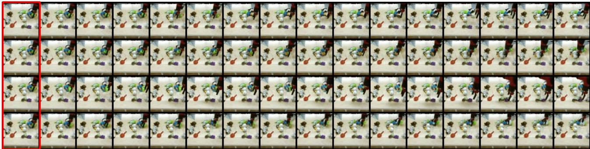

# 1. Bibliographic Information

## 1.1. Title
VideoGPT: Video Generation using VQ-VAE and Transformers

## 1.2. Authors
Wilson Yan, Yunzhi Zhang, Pieter Abbeel, and Aravind Srinivas.

The authors are researchers from the University of California, Berkeley. Pieter Abbeel is a renowned professor and leading figure in robotics and deep learning. Aravind Srinivas has also co-authored other significant papers in generative modeling, including work on NVAE. Their collective expertise in generative models, transformers, and deep learning lends significant credibility to this work.

## 1.3. Journal/Conference
The paper was published as a preprint on arXiv in April 2021 and was later accepted to the **International Conference on Computer Vision (ICCV) 2021**. ICCV is a premier, top-tier international conference in the field of computer vision, known for its high standards and significant impact on the research community.

## 1.4. Publication Year
2021

## 1.5. Abstract
The paper introduces **VideoGPT**, a conceptually simple and scalable architecture for likelihood-based video generation. The model operates in two stages. First, it uses a **Vector Quantized Variational Autoencoder (VQ-VAE)** with 3D convolutions and axial self-attention to learn a downsampled, discrete latent representation of a raw video. Second, a simple **GPT-like Transformer architecture** is trained to autoregressively model this sequence of discrete latents. The authors demonstrate that despite its simplicity, VideoGPT generates video samples that are competitive with state-of-the-art Generative Adversarial Network (GAN) models on the BAIR Robot dataset. Furthermore, it can produce high-fidelity natural videos on more complex datasets like UCF-101 and the Tumblr GIF Dataset (TGIF). The paper aims to provide a reproducible and minimalistic baseline for transformer-based video generation.

## 1.6. Original Source Link
*   **Original Source Link:** https://arxiv.org/abs/2104.10157v2
*   **PDF Link:** https://arxiv.org/pdf/2104.10157v2.pdf
*   **Publication Status:** The paper is a preprint available on arXiv and was officially published in the proceedings of ICCV 2021.

    ---

# 2. Executive Summary

## 2.1. Background & Motivation
### 2.1.1. What is the core problem the paper aims to solve?
The core problem is the high-fidelity generation of natural videos. While deep generative models have seen remarkable success in modalities like images, audio, and text, progress in video generation has been slower. This is primarily due to the immense complexity of video data, which involves modeling correlations across both high-dimensional spatial frames and a temporal sequence, leading to significant computational challenges.

### 2.1.2. Why is this problem important in the current field? What specific challenges or gaps exist in prior research?
*   **Importance:** Generative video models are crucial for various applications, including **video prediction** (forecasting future frames), which is vital for autonomous driving, weather forecasting, and robotics. They also serve as a benchmark for measuring our understanding of physical common sense and predictive intelligence.
*   **Challenges & Gaps:**
    1.  **High Dimensionality:** Videos contain vast amounts of redundant information (e.g., static backgrounds, slow movements). Modeling raw pixels directly is computationally prohibitive and inefficient.
    2.  **Model Complexity:** Prior approaches often fall into two camps:
        *   **Likelihood-based Autoregressive Models** (e.g., `Video Pixel Networks`): These models are stable to train and easy to evaluate but are extremely slow and computationally expensive because they generate videos pixel-by-pixel.
        *   **Generative Adversarial Networks (GANs):** GANs can produce high-quality samples and sample quickly, but their training is notoriously unstable, and they can suffer from mode collapse (lacking diversity).
    3.  **Reproducibility:** Many existing video generation models are complex and difficult to reproduce.

### 2.1.3. What is the paper's entry point or innovative idea?
The paper's innovative idea is to adapt a conceptually simple and successful two-stage paradigm from image generation to the video domain. The core logic is:
1.  **Don't model raw pixels.** Instead, learn a compressed, discrete representation of the video to eliminate spatio-temporal redundancy. This is analogous to how video codecs like MPEG work.
2.  **Use powerful, proven models for each stage.** The authors chose the `VQ-VAE` for compression and the `Transformer` (specifically a `GPT`-like model) for generation in the compressed space.

    This approach combines the best of both worlds: the efficiency of modeling in a downsampled latent space and the powerful sequence modeling capabilities of Transformers, all within a stable, likelihood-based framework. The result, `VideoGPT`, is a minimalistic and effective architecture for video generation.

## 2.2. Main Contributions / Findings
### 2.2.1. What are the paper's primary contributions?
1.  **A Simple and Scalable Architecture:** The paper proposes `VideoGPT`, a straightforward adaptation of `VQ-VAE` and `GPT` for video generation, which uses 3D convolutions and axial attention to handle the spatio-temporal nature of video data.
2.  **Competitive Performance:** `VideoGPT` is shown to generate samples that are competitive with state-of-the-art GAN-based models on the standard `BAIR Robot Pushing` dataset.
3.  **High-Fidelity Generation on Complex Datasets:** The model is successfully scaled to generate high-quality videos from complex and diverse datasets like `UCF-101` and `TGIF`, demonstrating its generalizability.
4.  **Thorough Ablation Studies:** The authors provide a detailed analysis of key design choices, such as the impact of axial attention, the size of the latent space, the number of codebook entries, and the capacity of the Transformer prior. These studies offer valuable insights for future research.
5.  **Extensibility to Conditional Generation:** The paper demonstrates that `VideoGPT` can be easily adapted for conditional video generation tasks, such as conditioning on an initial frame or a sequence of actions.

### 2.2.2. What key conclusions or findings did the paper reach?
The main finding is that a simple, likelihood-based, two-stage approach can be highly effective for video generation. By first learning a good discrete latent representation that removes redundancy, a powerful autoregressive model can then focus its capacity on modeling the high-level semantics and dynamics of the video. This challenges the notion that complex, GAN-based architectures are necessary for high-fidelity video synthesis and provides a strong, reproducible baseline for future work in the field.

---

# 3. Prerequisite Knowledge & Related Work

## 3.1. Foundational Concepts
### 3.1.1. Variational Autoencoder (VAE)
A **Variational Autoencoder (VAE)** is a type of generative model that learns to represent data in a lower-dimensional continuous space, called the latent space. It consists of two parts:
*   **Encoder:** A neural network that takes an input (e.g., an image) and outputs the parameters (typically mean and variance) of a probability distribution (usually a Gaussian) in the latent space.
*   **Decoder:** Another neural network that takes a point sampled from the latent space and reconstructs the original input.
    VAEs are trained to maximize the **Evidence Lower Bound (ELBO)**, which balances two objectives: accurately reconstructing the input and ensuring the latent space is well-structured (i.e., the encoded distributions are close to a standard normal distribution).

### 3.1.2. Vector Quantized VAE (VQ-VAE)
The **Vector Quantized VAE (VQ-VAE)** is a variation of the VAE that uses a **discrete** latent space instead of a continuous one. This is achieved through vector quantization.
*   **Codebook:** The VQ-VAE maintains a learnable codebook, which is a collection of embedding vectors (e.g., 512 vectors of dimension 256).
*   **Process:**
    1.  The encoder maps an input to a set of output vectors in a latent grid (e.g., for an image, a grid of 32x32 vectors).
    2.  For each vector in the encoder's output grid, the model finds the **closest** embedding vector in the codebook (using Euclidean distance).
    3.  This closest codebook vector replaces the encoder's output vector. The indices of these chosen codebook vectors form the discrete latent representation.
    4.  The decoder then takes this grid of quantized vectors to reconstruct the input.
*   **Advantage:** A discrete latent space is often more suitable for powerful autoregressive models like Transformers, which are designed to work with discrete tokens (like words in a language).

### 3.1.3. Transformer and Self-Attention
The **Transformer** is a neural network architecture introduced in "Attention Is All You Need" that relies entirely on the **self-attention** mechanism. It has become the standard for modeling sequential data like text and has been adapted for images and other modalities.

**Self-Attention** allows a model to weigh the importance of different elements in an input sequence when processing a specific element. For each element, it computes three vectors: a **Query (Q)**, a **Key (K)**, and a **Value (V)**. The attention score is calculated by taking the dot product of the Query of the current element with the Keys of all other elements. These scores are then scaled, passed through a softmax function to create weights, and used to compute a weighted sum of all the Value vectors. The formula is:
\$
\mathrm{Attention}(Q, K, V) = \mathrm{softmax}\left(\frac{QK^T}{\sqrt{d_k}}\right)V
\$
*   `Q, K, V`: The Query, Key, and Value matrices.
*   $d_k$: The dimension of the Key vectors, used for scaling.
*   $\mathrm{softmax}$: A function that normalizes the scores into a probability distribution.

### 3.1.4. GPT (Generative Pre-trained Transformer)
**GPT** is a specific type of Transformer architecture that is "decoder-only." It uses masked self-attention, where each position in the sequence can only attend to previous positions (and itself). This structure makes it inherently **autoregressive**, meaning it generates output one step at a time, with each step conditioned on the previously generated steps. GPT models are trained to predict the next token in a sequence, making them excellent generative models for discrete data.

### 3.1.5. Axial Attention
For high-dimensional inputs like videos (Time x Height x Width), standard self-attention is computationally infeasible because the number of interactions grows quadratically with the sequence length. **Axial attention** is an efficient approximation that performs self-attention sequentially along each axis of the input tensor. For a video, it would first perform attention along the height axis, then the width axis, and finally the time axis. This breaks down one massive attention computation into several smaller, manageable ones, making it practical for video modeling.

## 3.2. Previous Works
*   **VQ-VAE (Van Den Oord et al., 2017):** This is the foundational work for the first stage of VideoGPT. It introduced the concept of learning a discrete latent representation via vector quantization, which proved highly effective for generating high-fidelity images when combined with an autoregressive prior.
*   **Image-GPT (Chen et al., 2020):** This work showed that a standard GPT-like Transformer could be trained to autoregressively model raw image pixels (flattened into a sequence) to generate coherent images. VideoGPT's prior network is directly inspired by this, but it operates on learned latent codes instead of raw pixels for efficiency.
*   **DVD-GAN (Clark et al., 2019):** A prominent GAN-based video generation model that serves as a key baseline. It adapts the successful BigGAN architecture to videos, notably using disentangled spatial and temporal attention (similar in spirit to axial attention) to handle video data efficiently.
*   **Video Pixel Networks (Kalchbrenner et al., 2017):** An early likelihood-based model that generates videos pixel-by-pixel autoregressively using a complex `Convolutional LSTM` architecture. While demonstrating the potential of autoregressive modeling, it is extremely slow and computationally demanding, highlighting the need for the more efficient latent-space approach of VideoGPT.
*   **VQ-VAE-2 (Razavi et al., 2019):** This work extended VQ-VAE by using a hierarchical structure of discrete latent codes to capture both global and local information in images, leading to state-of-the-art image generation. VideoGPT opts for a simpler, single-scale latent representation for minimalism and reproducibility.

## 3.3. Technological Evolution
The field of generative modeling for visual data has evolved from pixel-level models to latent-space models.
1.  **Pixel-Level Models:** Early models like `PixelCNN` and `Video Pixel Networks` operated directly on pixels. They were powerful but computationally infeasible for high-resolution content.
2.  **Continuous Latent Models:** VAEs and GANs shifted the focus to learning in a compressed latent space. This improved efficiency and sample quality.
3.  **Discrete Latent Models:** VQ-VAE demonstrated the power of a discrete latent space, which is a natural fit for the token-based processing of Transformers.
4.  **Transformer-based Generative Models:** The success of GPT in language led to its application in vision. Models like `Image-GPT` (on pixels) and `VQ-VAE-2` and `DALL-E` (on discrete latents) set new standards for image generation.
    `VideoGPT` fits into this timeline as a natural extension of the successful VQ-VAE + Transformer paradigm from the image domain to the more challenging video domain.

## 3.4. Differentiation Analysis
Compared to related work, `VideoGPT`'s core innovations are:
*   **Simplicity and Minimalism:** Unlike complex GAN architectures or multi-scale VQ-VAEs, `VideoGPT` uses a straightforward, single-scale VQ-VAE and a standard GPT architecture with minimal, necessary modifications for video (3D convolutions, axial attention). This makes it highly reproducible.
*   **Likelihood-based Framework:** By choosing a likelihood-based approach, it avoids the training instabilities of GANs (e.g., mode collapse, delicate hyperparameter tuning) and allows for principled evaluation using metrics like `bits/dim`.
*   **Computational Efficiency:** Compared to pixel-level autoregressive models, modeling in a downsampled latent space drastically reduces the sequence length for the Transformer, making training and sampling much more computationally efficient.

    ---

# 4. Methodology

## 4.1. Principles
`VideoGPT` is a two-stage generative model designed for videos. The core principle is to **divide and conquer**:
1.  **Compression Stage:** First, learn an efficient, compressed, and discrete representation of the video. This is handled by a **VQ-VAE**, which acts as a "neural codec" to remove spatio-temporal redundancies and encode the video into a sequence of discrete integer codes.
2.  **Generation Stage:** Second, learn a powerful generative model on this compressed representation. This is handled by a **GPT-like Transformer**, which learns the probability distribution of the sequence of discrete codes. It can then be used to autoregressively sample a new sequence of codes.

    To generate a new video, a sequence of latent codes is first sampled from the trained Transformer. This sequence is then fed into the trained VQ-VAE's decoder, which converts the codes back into a full-resolution video.

The overall architecture is depicted in Figure 2 of the paper.

*该图像是示意图，展示了VideoGPT架构中的编码器和解码器部分，以及Transformer的应用。左侧展示了使用3D卷积的编码器从视频中提取离散潜变量，通过一个代码本进行处理；右侧则展示了将离散潜变量转化为平展序列，并输入Transformer来生成目标视频。*

## 4.2. Core Methodology In-depth (Layer by Layer)

### 4.2.1. Stage 1: Learning Latent Codes with VQ-VAE
The first stage involves training a VQ-VAE on the video data to learn a discrete codebook and the corresponding encoder/decoder networks.

#### 4.2.1.1. VQ-VAE Encoder
The encoder, denoted as `E(x)`, takes a raw video tensor $x$ (with shape `Time x Height x Width x Channels`) and maps it to a downsampled latent grid $h$.
*   **Architecture:** The encoder consists of a series of **3D convolutions** with striding to downsample the input across both spatial (height, width) and temporal (time) dimensions. These are followed by several **attention residual blocks**.
*   **Attention Residual Block:** As shown in Figure 4, this custom block is designed to effectively process the spatio-temporal features. It replaces standard residual blocks. The data flow is: Layer Normalization (`LayerNorm`), ReLU activation, 3D convolution, another cycle of `LayerNorm`, ReLU, 3D convolution, and then a path through an `axial attention` layer. This design allows the network to capture complex, long-range dependencies across space and time.

    
    *该图像是视频生成模型中VQ-VAE的注意力残差块的架构示意图。图中展示了经过归一化和ReLU激活的3x3卷积层、1x1卷积层及轴向注意力机制，并结合了位置编码。*

#### 4.2.1.2. Vector Quantization
The output of the encoder, `h = E(x)`, is a grid of vectors. This grid is then quantized.
*   **Codebook:** A learnable codebook $C = \{ e_i \}_{i=1}^K$ is maintained, containing $K$ embedding vectors.
*   **Quantization Process:** For each vector in the encoder's output grid $h$, the model finds the nearest codebook embedding $e_i$ via a nearest-neighbor lookup. The grid of these selected codebook embeddings, $e$, becomes the input to the decoder. The indices of these embeddings form the final discrete representation.

#### 4.2.1.3. VQ-VAE Decoder
The decoder, `D(e)`, takes the quantized latent grid $e$ and reconstructs the original video $\hat{x}$.
*   **Architecture:** The decoder's architecture is the reverse of the encoder's. It uses a series of attention residual blocks followed by **3D transposed convolutions** to upsample the latent grid back to the original video dimensions.

#### 4.2.1.4. VQ-VAE Training Objective
The VQ-VAE is trained by minimizing a composite loss function, which is crucial for balancing reconstruction quality and stable codebook learning.
The objective function is:
$$
\mathcal { L } = \underbrace { \| x - D ( e ) \| _ { 2 } ^ { 2 } } _ { \mathcal { L } _ { \mathrm { recon } } } + \underbrace { \| \mathrm{sg} [ E ( x ) ] - e \| _ { 2 } ^ { 2 } } _ { \mathcal { L } _ { \mathrm { codebook } } } + \underbrace { \beta \| \mathrm{sg} [ e ] - E ( x ) \| _ { 2 } ^ { 2 } } _ { \mathcal { L } _ { \mathrm { commit } } }
$$
*   $\mathcal{L}_{\mathrm{recon}}$ (**Reconstruction Loss**): This is the mean squared error between the original video $x$ and the reconstructed video `D(e)`. It pushes the encoder and decoder to learn meaningful representations.
*   $\mathcal{L}_{\mathrm{codebook}}$ (**Codebook Loss**): This term updates the codebook embeddings. It moves the chosen codebook vectors $e$ closer to the corresponding encoder outputs `E(x)`. The stop-gradient operator (`sg`) prevents this loss from flowing back into the encoder.
*   $\mathcal{L}_{\mathrm{commit}}$ (**Commitment Loss**): This term ensures that the encoder's outputs `E(x)` stay "committed" to the chosen codebook vectors $e$ and do not fluctuate wildly. It is weighted by a hyperparameter $\beta$.

    The paper notes that they use an **Exponential Moving Average (EMA)** update for the codebook loss, which is an alternative that often leads to faster and more stable training.

### 4.2.2. Stage 2: Learning a Prior with a Transformer
After the VQ-VAE is trained, its weights are frozen. The encoder is then used to convert the entire training dataset of videos into sequences of discrete latent codes. The second stage is to train an autoregressive Transformer on these sequences.

*   **Architecture:** The model uses a standard **GPT-like (decoder-only) Transformer**. The input is the sequence of latent codes, which are flattened from their `T x H x W` grid into a 1D sequence.
*   **Autoregressive Modeling:** The Transformer is trained to maximize the log-likelihood of the data. It factorizes the joint probability of the sequence of codes $z = (z_1, z_2, ..., z_d)$ as a product of conditional probabilities:
    \$
    p ( { z } ) = \prod _ { i = 1 } ^ { d } p ( z _ { i } | z _ { < i } )
    \$
    In practice, this means the model is trained to predict the next code $z_i$ given all the previous codes $z_{<i}$. This is achieved using masked self-attention.
*   **Positional Encodings:** Since the original `T x H x W` structure is important, the model uses spatio-temporal position encodings to inform the Transformer about the original position of each code in the grid.

### 4.2.3. Conditional Generation
The `VideoGPT` framework can be easily extended for conditional generation.
*   **Cross-Attention (for Frame Conditioning):** To condition on one or more video frames, the conditioning frames are first passed through a separate encoder (e.g., a 3D ResNet) to get a feature representation. This representation is then used as the Key and Value inputs in **cross-attention** layers within the Transformer prior, allowing the generative process to be guided by the content of the conditioning frames.
*   **Conditional Norms (for Action/Class Conditioning):** For conditioning on low-dimensional vectors like an action or class label, the paper uses **conditional layer normalization**. The gain and bias parameters of the `LayerNorm` layers in the Transformer are predicted by a small MLP that takes the conditional vector as input. This modulates the activations throughout the network based on the conditioning information.

    ---

# 5. Experimental Setup

## 5.1. Datasets
The paper evaluates `VideoGPT` on a range of datasets to test its capabilities on different types of video content.
*   **Moving MNIST:** A synthetic dataset where two handwritten digits move and bounce within a `64x64` frame. It's a simple, standard benchmark for sanity-checking video models.
*   **BAIR Robot Pushing:** A widely used dataset for video prediction in robotics. It contains videos of a robot arm pushing objects on a table. The task is to generate realistic future frames of the robot's interaction. The videos are `64x64` with 16 frames.
*   **ViZDoom:** A dataset collected from the ViZDoom platform, based on the classic game *Doom*. It features first-person-view videos of navigating complex 3D environments, presenting challenges like camera movement and dynamic interactions.
*   **UCF-101:** A real-world action recognition dataset with 13,320 videos from 101 action categories (e.g., "Archery", "Basketball"). The videos are diverse in content, viewpoint, and quality. The paper uses `64x64` and `128x128` resolutions.
*   **Tumblr GIF (TGIF):** A large-scale dataset of over 100,000 animated GIFs from Tumblr. This dataset is extremely diverse and contains complex scenes, camera motion, text overlays, and object dynamics, making it a challenging benchmark for unconditional video generation.

## 5.2. Evaluation Metrics
*   **Fréchet Video Distance (FVD):**
    1.  **Conceptual Definition:** FVD is a metric used to evaluate the quality and diversity of generated videos. It measures the distance between the distribution of real videos and the distribution of generated videos in a feature space. A lower FVD indicates that the generated videos are more similar to real videos in terms of temporal dynamics and visual content. The features are extracted using a pre-trained `I3D` (Inflated 3D ConvNet) network.
    2.  **Mathematical Formula:**
        \$
        \mathrm{FVD}(x, g) = \| \mu_x - \mu_g \|_2^2 + \mathrm{Tr}(\Sigma_x + \Sigma_g - 2(\Sigma_x \Sigma_g)^{1/2})
        \$
    3.  **Symbol Explanation:**
        *   $x$ and $g$ represent the collections of real and generated videos, respectively.
        *   $\mu_x$ and $\mu_g$ are the mean vectors of the features extracted from real and generated videos.
        *   $\Sigma_x$ and $\Sigma_g$ are the covariance matrices of the features.
        *   $\mathrm{Tr}$ denotes the trace of a matrix.

*   **Inception Score (IS):**
    1.  **Conceptual Definition:** IS is a metric primarily used for image generation that is adapted for videos by evaluating each frame. It aims to measure two properties of generated samples: **quality** (are individual samples recognizable and clear?) and **diversity** (does the model generate a wide variety of samples?). A higher IS is better.
    2.  **Mathematical Formula:**
        \$
        \mathrm{IS}(G) = \exp(\mathbb{E}_{x \sim p_g} D_{KL}(p(y|x) \| p(y)))
        \$
    3.  **Symbol Explanation:**
        *   $x \sim p_g$: A sample $x$ drawn from the generator's distribution $p_g$.
        *   $p(y|x)$: The conditional class distribution predicted by a pre-trained Inception network for sample $x$. For a high-quality sample, this distribution should have low entropy (i.e., the network is confident about its class).
        *   `p(y)`: The marginal class distribution, averaged over all generated samples. For a diverse set of samples, this distribution should have high entropy (i.e., samples from many different classes are generated).
        *   $D_{KL}$: The Kullback-Leibler (KL) divergence, which measures the difference between these two distributions.

*   **bits/dim:** A standard metric for likelihood-based models. It represents the average negative log-likelihood of the data, normalized by the number of dimensions. It measures how well the model fits the training data distribution. **A lower value is better.**

*   **Normalized Mean Squared Error (NMSE):** The MSE of the VQ-VAE reconstructions, normalized by the variance of the dataset. This helps to evaluate reconstruction quality in a way that is invariant to the scale of pixel values.

## 5.3. Baselines
The paper compares `VideoGPT` against several state-of-the-art video generation models, primarily GANs, which were the dominant approach at the time.
*   **For BAIR:** `SV2P`, `LVT`, `SAVP`, `DVD-GAN-FP`, and `TrIVD-GAN-FP`. These are strong video prediction and generation models.
*   **For UCF-101:** `VGAN`, `TGAN`, `MoCoGAN`, `Progressive VGAN`, `TGANv2`, and `DVD-GAN`. These represent a range of GAN-based video generation architectures.

    ---

# 6. Results & Analysis

## 6.1. Core Results Analysis
`VideoGPT` demonstrates strong performance across multiple benchmarks, proving that a simple, likelihood-based approach can be competitive with more complex GAN models.

*   **BAIR Robot Pushing (Table 1):** `VideoGPT` achieves an FVD of **103.3**. This result is on par with `TrIVD-GAN` (103.3), the state-of-the-art GAN-based method at the time, and significantly better than previous methods like `SAVP` (116.4) and `DVD-GAN` (109.8). This is a key result, as it shows `VideoGPT` is competitive on a widely used and challenging video prediction benchmark.

*   **UCF-101 (Table 2):** On the more diverse UCF-101 dataset, `VideoGPT` achieves an Inception Score of **24.69**. While this outperforms several earlier GAN models like `TGAN-F` (22.91), it does not reach the performance of top-tier GANs like `TGANv2` (28.87) and `DVD-GAN` (32.97). The authors note that the model tends to overfit on this dataset, suggesting that UCF-101 might be too small for the complexity of the task, and larger datasets are needed to fully leverage the power of Transformers.

*   **Qualitative Results:** The generated samples shown in the paper (Figures 1, 6, 7, 8) are visually compelling. The model can generate diverse and coherent motions, handle complex scene dynamics, and produce high-fidelity videos on datasets like TGIF. For example, on BAIR, it can generate different plausible future trajectories from the same starting frame (Figure 6), demonstrating true generative capability rather than just memorization.

    
    *Figure 6. Samples conditioned on the first frame (leftmost column) on the BAIR dataset. Each row shows a different generated trajectory.*

## 6.2. Data Presentation (Tables)
The following are the results from Table 1 of the original paper:

| Method | FVD (↓) |
| :--- | :--- |
| SV2P | 262.5 |
| LVT | 125.8 |
| SAVP | 116.4 |
| DVD-GAN-FP | 109.8 |
| VideoGPT (ours) | 103.3 |
| TrIVD-GAN-FP | 103.3 |
| Video Transformer | 94 ± 2 |

The following are the results from Table 2 of the original paper:

| Method | IS (↑) |
| :--- | :--- |
| VGAN | 8.31 ± 0.09 |
| TGAN | 11.85 ± 0.07 |
| MoCoGAN | 12.42 ± 0.03 |
| Progressive VGAN | 14.56 ± 0.05 |
| TGAN-F | 22.91 ± 0.19 |
| VideoGPT (ours) | 24.69 ± 0.30 |
| TGANv2 | 28.87 ± 0.67 |
| DVD-GAN | 32.97 ± 1.7 |

## 6.3. Ablation Studies / Parameter Analysis
The paper provides extensive ablation studies on the BAIR dataset, which offer crucial insights into the architectural design of `VideoGPT`.

*   **Axial-attention in VQ-VAE (Table 3):** This study compares a VQ-VAE with and without axial attention blocks. The model **with attention** achieves better reconstruction quality (NMSE of 0.0033 vs. 0.0041) and better reconstruction FVD (14.9 vs. 15.3). This confirms that long-range spatio-temporal modeling via attention is beneficial even in the VQ-VAE stage.

    The following are the results from Table 3 of the original paper:

    | VQ-VAE Architecture | NMSE (↓) | R-FVD (↓) |
    | :--- | :--- | :--- |
    | No Attention | 0.0041 | 15.3 |
    | With Attention | 0.0033 | 14.9 |

*   **Prior Network Capacity (Table 4):** This experiment varies the number of layers in the Transformer prior. As the model size increases from 2 to 16 layers, the `bits/dim` consistently improves (from 2.84 to 2.05), indicating a better fit to the data distribution. The FVD score also improves, reaching its best value around 8 layers (**103.3**) before plateauing. This shows that a sufficiently large prior model is essential for high-quality generation.

    The following are the results from Table 4 of the original paper:

    | Transformer Layers | bits/dim | FVD (↓) |
    | :--- | :--- | :--- |
    | 2 | 2.84 | 120.4 ± 6.0 |
    | 4 | 2.52 | 110.0 ± 2.4 |
    | 8 | 2.39 | 103.3 ± 2.2 |
    | 16 | 2.05 | 103.6 ± 2.0 |

*   **Latent Space Size and Shape (Table 5):** This is a critical ablation study.
    *   **Trade-off:** There is a clear trade-off. Larger latent sizes (less downsampling) lead to better reconstructions (`R-FVD`) but can be harder for the prior to model, leading to worse final sample quality (`FVD`). The smallest latent sizes (`4x16x16`) have poor reconstructions and thus poor samples.
    *   **Sweet Spot:** The best FVD (**103.6**) is achieved with a latent size of `8x32x32`, which represents a sweet spot between reconstruction quality and prior modeling capacity.
    *   **Balanced Downsampling:** For a fixed total number of latents, a **balanced** downsampling across space and time (e.g., `8x32x32`, corresponding to a `2x` downsampling in each dimension) works best, as opposed to heavily downsampling time (`16x8x8`) or space (`4x16x16`).

        The following are the results from Table 5 of the original paper:

        | Latent Size | R-FVD (↓) | FVD (↓) | FVD* (↓) |
        | :--- | :--- | :--- | :--- |
        | 4 × 16 × 16 | 82.1 | 135.4 ± 3.7 | 81.8 ± 2.3 |
        | 16×8×8 | 108.1 | 166.9 ± 3.1 | 81.6 ± 2.2 |
        | 8 × 16 × 16 | 49.9 | 124.7 ± 2.7 | 90.2 ± 2.4 |
        | 1 × 64 × 64 | 41.6 | 126.7 ± 3.1 | 98.1 ± 3.6 |
        | 4 × 32 × 32 | 28.3 | 104.6 ± 2.7 | 90.6 ± 2.7 |
        | 16 × 16 × 16 | 32.8 | 113.4 ± 2.5 | 94.9 ± 1.7 |
        | 2 × 64 × 64 | 22.4 | 124.3 ± 1.4 | 104.4 ± 2.5 |
        | 8 × 32 × 32 | 14.9 | 103.6 ± 2.0 | 94.6 ± 1.5 |
        | 4 × 64 × 64 | 15.7 | 109.4 ± 2.1 | 102.3 ± 2.8 |
        | 16 × 32 × 32 | 10.1 | 118.4 ± 3.2 | 113.8 ± 3.3 |

*   **Number of Codebook Codes (Table 6):** Increasing the number of codes in the codebook (from 256 to 4096) improves reconstruction quality (R-FVD drops from 18.2 to 11.3) but has a negligible effect on the final sample quality FVD. This suggests that for BAIR, 256 codes are already expressive enough to capture the necessary information for high-quality generation.

*   **Number of Codebooks (Table 7):** This study compares using one codebook at a higher resolution versus multiple codebooks at lower resolutions. The results clearly show that for a fixed total latent space size, using **a single codebook at the highest possible spatio-temporal resolution** (`8x32x32x1`) yields the best performance.

    ---

# 7. Conclusion & Reflections

## 7.1. Conclusion Summary
The paper successfully presents `VideoGPT`, a simple yet powerful architecture for video generation. By combining a `VQ-VAE` (with 3D convolutions and axial attention) for learning compressed discrete representations and a `GPT`-like Transformer for autoregressive modeling in this latent space, the authors create a scalable and effective system. The key takeaway is that this two-stage, likelihood-based approach is competitive with state-of-the-art GANs on standard benchmarks while offering superior training stability and ease of evaluation. The work provides a strong, reproducible baseline and a valuable set of architectural insights that can guide future research in transformer-based video generation.

## 7.2. Limitations & Future Work
While the paper presents a strong case, some limitations can be identified:
*   **Performance Gap on Complex Datasets:** On UCF-101, `VideoGPT` did not surpass the top GAN models, and the authors reported overfitting. This suggests that while the architecture is scalable in principle, it may require even larger datasets or further regularization techniques to excel on highly diverse, real-world video data.
*   **Autoregressive Sampling Speed:** Like all autoregressive models, sampling from `VideoGPT` is sequential and can be slow, as each latent code must be generated one at a time. This is much slower than the single-pass generation of GANs.
*   **Limited Video Length:** The experiments are conducted on relatively short video clips (16 frames). Scaling to generate long-form, coherent videos remains a significant future challenge.

    Future work could explore hierarchical VQ-VAEs for video, more efficient non-autoregressive sampling methods for the Transformer prior, and scaling the models to higher resolutions and longer time horizons on even larger datasets.

## 7.3. Personal Insights & Critique
*   **The Power of Simplicity:** `VideoGPT` is a prime example of how a well-motivated, simple design can yield powerful results. Instead of inventing a highly complex new architecture, the authors elegantly adapted a proven paradigm from the image domain. This approach enhances reproducibility and provides a clearer understanding of why the model works.
*   **Value of Ablation Studies:** The paper's greatest strength, beyond the model itself, is its rigorous and comprehensive set of ablation studies. These experiments provide invaluable, concrete guidance on critical design choices for future video generation models, such as the trade-off in latent space size and the importance of balanced spatio-temporal downsampling.
*   **A Foundational Work:** `VideoGPT` serves as a crucial reference point in the literature. It demonstrated the viability of Transformers for high-quality video generation and set the stage for subsequent, more advanced models in this domain (e.g., those using masked transformers, diffusion models, etc.). While it may not have beaten every SOTA metric at the time, its conceptual clarity and strong performance established a new and promising direction for the field.
*   **Critique:** The paper could have benefited from a more direct comparison of sampling time against GAN baselines to make the trade-offs more explicit. Additionally, while overfitting on UCF-101 is mentioned, a deeper analysis or proposed solutions (e.g., different data augmentation or regularization strategies) could have strengthened the work. Nonetheless, its contribution as a clean, effective, and reproducible baseline is undeniable.