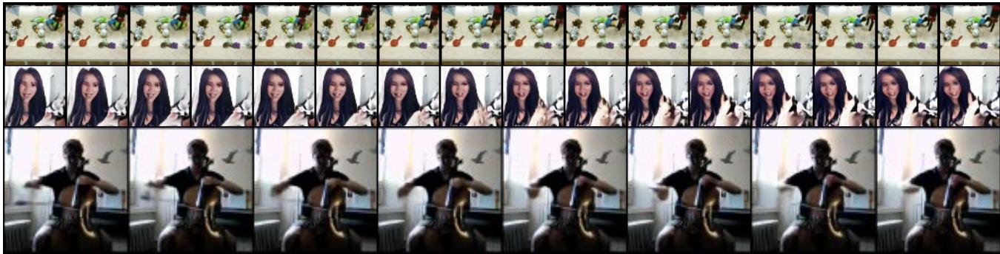
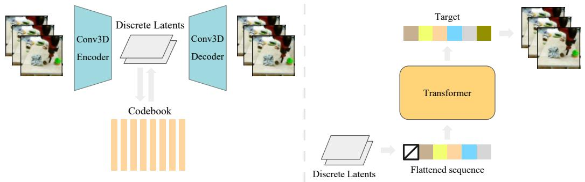
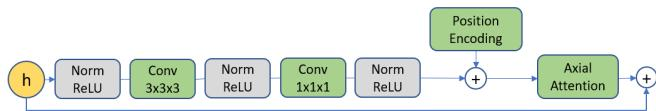
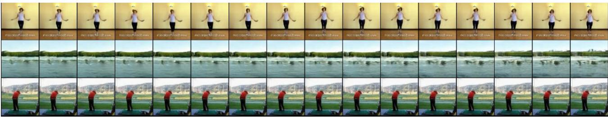
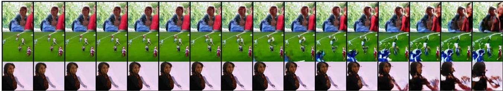

# 1. 论文基本信息

## 1.1. 标题
VideoGPT: Video Generation using VQ-VAE and Transformers
(VideoGPT: 使用 VQ-VAE 和 Transformer 进行视频生成)

## 1.2. 作者
Wilson Yan, Yunzhi Zhang, Pieter Abbeel, Aravind Srinivas.
所有作者均隶属于加州大学伯克利分校 (University of California, Berkeley)。Pieter Abbeel 是该领域的知名学者，以其在机器人学和强化学习方面的贡献而闻名。

## 1.3. 发表期刊/会议
该论文于 2021 年 4 月 20 日首次发布在 **arXiv** 上，这是一个预印本 (pre-print) 服务器。arXiv 上的论文未经同行评审，但它是机器学习领域快速分享最新研究成果的重要平台。

## 1.4. 发表年份
2021

## 1.5. 摘要
论文提出了一种名为 VideoGPT 的视频生成模型，其架构概念简单，旨在将基于似然 (likelihood-based) 的生成模型扩展到自然视频领域。VideoGPT 的核心方法分为两个阶段：
1.  **第一阶段**：使用一个向量量化变分自编码器 (VQ-VAE)，该 VQ-VAE 采用 3D 卷积和轴向自注意力 (axial self-attention) 机制，从原始视频中学习一个降采样的、离散的潜在表示 (latent representation)。
2.  **第二阶段**：使用一个简单的、类似 GPT 的 Transformer 架构，结合时空位置编码，对这些离散的潜在表示进行自回归 (autoregressive) 建模。

    尽管该模型在设计上简洁且易于训练，但它在 BAIR 机器人数据集上生成的样本质量与最先进的 (state-of-the-art) GAN 模型相当。此外，它还能在 UCF-101 和 TGIF 数据集上生成高保真度的自然视频。作者希望该模型能成为一个可复现的参考，为基于 Transformer 的视频生成模型提供一个极简实现。

## 1.6. 原文链接
*   **arXiv 链接**: https://arxiv.org/abs/2104.10157v2
*   **PDF 链接**: https://arxiv.org/pdf/2104.10157v2.pdf
*   **发布状态**: 预印本 (Pre-print)

    ---

# 2. 整体概括

## 2.1. 研究背景与动机
*   **核心问题：** 近年来，深度生成模型在图像、音频和文本等领域取得了巨大成功，但**高保真度自然视频的生成**仍然是一个显著落后的领域。这主要是因为视频数据具有极高的维度，并且需要在空间和时间两个维度上对复杂的关联性进行建模，这对计算资源和模型能力都提出了巨大挑战。

*   **问题重要性：** 建立强大的视频生成模型具有广泛的应用价值。例如，它可以用于**视频预测与预报**（如天气预报、自动驾驶中的场景预测），甚至被认为是衡量机器对物理世界常识和预测智能理解程度的一种方式。

*   <strong>现有挑战与空白 (Gap)：</strong>
    1.  **模型选择困难：** 现有的生成模型家族（如 GANs、VAEs、自回归模型）各有优劣。GANs 能够生成高质量样本，但训练不稳定且难以评估；而基于似然的模型（如自回归模型）训练目标明确、过程稳定，但直接在像素级别上建模视频（如 Video Pixel Networks）的计算成本极高。
    2.  **数据冗余：** 自然视频中存在大量的时空冗余，就像图像中的 JPEG 压缩和视频中的 MPEG 编码所利用的那样。直接对原始像素进行建模会浪费大量计算资源在这些冗余信息上。

*   **切入点与创新思路：**
    作者的思路是<strong>“先压缩，后生成”</strong>。他们没有直接在原始、高维的像素空间中进行生成，而是提出了一个两阶段的解决方案：
    1.  **降维与去冗余：** 首先使用一个 VQ-VAE 将高维视频压缩成一个低维、离散的潜在空间。这个过程移除了视频中的时空冗余，使得后续的生成任务变得更加高效和专注。
    2.  **在潜在空间中建模：** 然后，利用 Transformer 这一强大的序列模型，在这个紧凑的离散潜在空间中进行自回归生成。由于潜在空间的维度远低于像素空间，因此可以用更强大的 Transformer 模型来学习复杂的时空动态关系。

        这种方法巧妙地结合了 VQ-VAE 在表示学习上的优势和 Transformer 在序列建模上的威力，旨在构建一个既高效又高质量的视频生成框架。

## 2.2. 核心贡献/主要发现
*   **提出了 VideoGPT 模型：** 论文的核心贡献是提出了 VideoGPT，一个概念上简单但效果强大的视频生成架构。它将 VQ-VAE 和 GPT 这两种在图像和文本领域被验证成功的模型，以最小化的修改适配到了视频领域。

*   **实现了与 GANs 媲美的性能：** 在广泛使用的 BAIR 机器人推动数据集上，VideoGPT 生成的视频质量与当时最先进的 GAN 模型不相上下。这证明了基于似然的模型在视频生成任务上同样具有强大的竞争力。

*   **生成了高保真自然视频：** VideoGPT 能够从复杂的自然视频数据集（如 UCF-101 和 TGIF）中生成高保真度的样本，展示了其处理多样化场景和动态的能力。下图（原文 Figure 1）展示了其生成效果。

    
    *该图像是插图，展示了VideoGPT生成的多组视频样本。图像分为上下两行，上行包括多个对象和场景的生成样本，下行则展示了一位演奏者的动态视频片段。这些样本的尺寸为$64 \times 64$和$128 \times 128$，体现了VideoGPT在自然视频生成方面的能力。*

*   **提供了详尽的消融研究：** 论文对模型设计的关键选择进行了深入的消融实验，包括：轴向注意力的作用、VQ-VAE 潜在空间的大小、码本数量以及自回归先验模型的容量等。这些分析为后续研究者设计视频生成模型提供了宝贵的经验和见解。

*   **展示了条件生成能力：** VideoGPT 可以轻松地扩展到条件生成任务，如根据给定的动作序列生成相应的视频，并在 BAIR 和 ViZDoom 环境中展示了定性结果。

    ---

# 3. 预备知识与相关工作

## 3.1. 基础概念

### 3.1.1. 生成模型 (Generative Models)
生成模型是一类机器学习模型，其目标是学习训练数据的内在概率分布 `p(x)`。一旦学会了这个分布，模型就可以从中采样，生成与训练数据相似但全新的数据点 $x'$。本文中提到的主要生成模型类别包括：
*   <strong>基于似然的模型 (Likelihood-based Models):</strong> 这类模型直接对数据分布 `p(x)` 进行建模，并通过最大化训练数据的对数似然 $\log p(x)$ 来进行优化。例如 VAEs、自回归模型、流模型等。它们训练稳定，评估直接。
*   <strong>对抗生成网络 (Generative Adversarial Networks, GANs):</strong> GANs 由一个生成器 (Generator) 和一个判别器 (Discriminator) 组成，通过一个“猫鼠游戏”进行对抗训练。生成器试图生成以假乱真的数据，而判别器则试图区分真实数据和生成数据。GANs 以生成高质量样本著称，但训练过程可能不稳定。

### 3.1.2. 向量量化变分自编码器 (Vector Quantized Variational Autoencoder, VQ-VAE)
VQ-VAE 是一种特殊的自编码器，它学习将高维数据（如图像、视频）压缩到一个**离散的**潜在空间中。其结构包括：
1.  <strong>编码器 (Encoder) $E$：</strong> 将输入数据 $x$ 映射到一个连续的潜在表示 `E(x)`。
2.  <strong>码本 (Codebook) $C$：</strong> 一个可学习的、由 $K$ 个向量（称为 `codes` 或 `embeddings`）组成的集合 $C = \{e_i\}_{i=1}^K$。
3.  <strong>量化 (Quantization)：</strong> 将编码器输出的每个向量替换为码本中**距离最近**的那个向量。这一步将连续的表示离散化。
4.  <strong>解码器 (Decoder) $D$：</strong> 从量化后的离散表示中重建原始数据 $\hat{x}$。

    VQ-VAE 的训练目标是最小化一个复合损失函数，该函数在原文中被明确提及：
$$
\mathcal { L } = \underbrace { \| x - D ( e ) \| _ { 2 } ^ { 2 } } _ { \mathcal { L } _ { \mathrm { recon } } } + \underbrace { \| sg [ E ( x ) ] - e \| _ { 2 } ^ { 2 } } _ { \mathcal { L } _ { \mathrm { codebook } } } + \underbrace { \beta \| sg [ e ] - E ( x ) \| _ { 2 } ^ { 2 } } _ { \mathcal { L } _ { \mathrm { commit } } }
$$
*   **符号解释：**
    *   $x$ 是输入数据， `D(e)` 是重建数据 $\hat{x}$。
    *   `E(x)` 是编码器的连续输出，$e$ 是从码本中找到的最近的离散编码向量。
    *   `sg` 代表 `stop-gradient` 操作，意味着在反向传播时，该项的梯度为零，这对于稳定训练至关重要。
    *   $\beta$ 是一个超参数。
*   **损失项分析：**
    *   <strong>重建损失 ($\mathcal{L}_{\mathrm{recon}}$):</strong> 促使解码器能够从离散编码中完美地恢复原始输入。
    *   <strong>码本损失 ($\mathcal{L}_{\mathrm{codebook}}$):</strong> 通过移动码本向量 $e$ 使其靠近编码器输出 `E(x)` 来更新码本。
    *   <strong>承诺损失 ($\mathcal{L}_{\mathrm{commit}}$):</strong> 这是一个正则化项，鼓励编码器的输出 `E(x)` “承诺”于某个码本向量 $e$，防止其在不同编码之间频繁跳动。

### 3.1.3. 自回归模型 (Autoregressive Models) 与 GPT
自回归模型基于概率的链式法则来建模数据的联合分布。对于一个 $d$ 维的数据点 $\boldsymbol{x} = (x_1, x_2, ..., x_d)$，其概率可以被分解为一系列条件概率的乘积：
$$
p ( { \boldsymbol x } ) = \prod _ { i = 1 } ^ { d } p ( x _ { i } | \boldsymbol x _ { < i } )
$$
其中 $\boldsymbol{x}_{<i}$ 表示 $x_1, ..., x_{i-1}$。这意味着模型在预测第 $i$ 个元素时，会依赖于所有在它之前的元素。GPT (Generative Pre-trained Transformer) 就是一个典型的自回归模型，它使用 Transformer 架构来学习这种条件概率。

### 3.1.4. Transformer 与自注意力机制 (Self-Attention)
Transformer 是一种最初为自然语言处理设计的神经网络架构，其核心是<strong>自注意力机制 (Self-Attention)</strong>。该机制允许模型在处理一个序列时，为序列中的每个元素计算一个加权表示，权重取决于该元素与序列中所有其他元素的关联程度。

尽管本文未复述其公式，但理解自注意力机制对理解 Transformer 至关重要。其核心计算公式如下：
$$
\mathrm{Attention}(Q, K, V) = \mathrm{softmax}\left(\frac{QK^T}{\sqrt{d_k}}\right)V
$$
*   **符号解释：**
    *   $Q$ (Query)、$K$ (Key)、$V$ (Value) 是从输入序列的嵌入表示中通过线性变换得到的三种不同向量。
    *   $d_k$ 是 $K$ 向量的维度。
*   **直观解释：**
    1.  计算 $Q$ 和 $K$ 的点积 $QK^T$，得到一个**注意力分数矩阵**，表示序列中每个元素对其他元素的关注程度。
    2.  除以 $\sqrt{d_k}$ 进行缩放，以稳定梯度。
    3.  通过 `softmax` 函数将分数归一化，得到**注意力权重**。
    4.  将权重乘以 $V$ 矩阵，得到最终的加权表示。

        在自回归模型（如 GPT）中，会使用<strong>掩码自注意力 (masked self-attention)</strong>，确保在计算第 $i$ 个元素的表示时，只能关注到它之前（$j \le i$）的元素，从而满足自回归的条件依赖性。

## 3.2. 前人工作
*   <strong>视频预测 (Video Prediction):</strong> 许多早期工作专注于预测视频的未来帧，例如 `SV2P`、`SAVP` 等。这些模型通常在 BAIR 机器人数据集上进行评测。视频生成可以看作是视频预测的一种更通用的形式。
*   **基于 GAN 的视频生成：** GANs 在视频生成领域占据主导地位，代表性工作包括 `VGAN`、`TGAN`、`MoCoGAN` 等。近期，`DVD-GAN` 采用类似 BigGAN 的架构，并引入了时空分离的注意力机制，在复杂数据集上取得了显著成果。
*   **基于自回归的视频生成：** `Video Pixel Networks` (VPN) 是一种直接在像素级别进行自回归建模的方法。它使用卷积 LSTM 编码历史帧，然后用 PixelCNN 逐像素生成下一帧。这种方法虽然在理论上很强大，但由于逐像素生成，其计算成本和采样时间都非常高昂，难以扩展。

## 3.3. 技术演进
视频生成领域的技术演进可以看作是不断在**生成质量**、**计算效率**和**训练稳定性**之间寻找平衡。
1.  **早期方法：** 局限于简单场景或低分辨率视频。
2.  **GAN 的兴起：** 以 `DVD-GAN` 为代表的模型显著提升了生成视频的视觉质量，但仍面临训练不稳定的问题。
3.  **像素级自回归模型：** `Video Pixel Networks` 展示了基于似然模型的潜力，但其巨大的计算开销限制了其实用性。
4.  **潜在空间建模：** 为了解决效率问题，研究者开始转向在压缩的潜在空间中进行建模。VQ-VAE 提供了一种将数据压缩到离散潜在空间的有效方法，而 Transformer 则是在序列化数据上进行建模的强大工具。`DALL-E` (图像) 和 `Jukebox` (音乐) 的成功证明了“VQ-VAE + Transformer”这一组合的巨大潜力。

## 3.4. 差异化分析
VideoGPT 与之前工作的核心区别在于：
*   <strong>与像素级自回归模型 (如 VPN) 相比：</strong> VideoGPT **在离散潜在空间而非像素空间进行自回归建模**。这极大地降低了序列长度（例如，空间和时间上各 4 倍下采样会使序列长度减少 64 倍），从而大幅提升了计算效率和采样速度。
*   <strong>与 GAN 模型 (如 DVD-GAN) 相比：</strong> VideoGPT 是一个**基于似然的模型**，其训练目标（最大似然）明确，训练过程更稳定，不存在模式崩塌 (mode collapse) 等问题，并且评估也更直接（通过 bits/dim）。
*   **与同期 VQ-VAE 视频模型相比：** 论文强调其设计的**简洁性与可复现性**。与其他可能采用复杂的多尺度层级潜在空间（如 VQ-VAE-2）的模型不同，VideoGPT 采用单尺度的潜在表示和标准的 Transformer，使其成为一个易于理解和实现的基准模型。

    ---

# 4. 方法论

## 4.1. 方法原理
VideoGPT 的核心思想是将复杂的视频生成任务分解为两个更易于处理的子问题：
1.  <strong>表示学习 (Representation Learning):</strong> 学习一个能够有效捕捉视频时空信息、同时去除冗余的紧凑离散表示。
2.  <strong>先验建模 (Prior Modeling):</strong> 在这个紧凑的表示空间中，学习一个强大的生成模型来捕捉视频的动态和结构。

    这个两阶段流程如下图（原文 Figure 2）所示。首先，VQ-VAE 将输入视频编码为离散的潜在码序列；然后，这些码被展平并输入到一个自回归 Transformer 中进行训练。在生成阶段，Transformer 采样生成一个新的码序列，最后由 VQ-VAE 的解码器将其转换回视频。

    
    *该图像是示意图，展示了VideoGPT架构中的编码器和解码器部分，以及Transformer的应用。左侧展示了使用3D卷积的编码器从视频中提取离散潜变量，通过一个代码本进行处理；右侧则展示了将离散潜变量转化为平展序列，并输入Transformer来生成目标视频。*

## 4.2. 核心方法详解 (逐层深入)

### 4.2.1. 阶段一：使用 VQ-VAE 学习离散潜在编码

这一阶段的目标是训练一个 VQ-VAE，将原始视频 $x$ 压缩成一个三维的离散潜在编码网格。

*   <strong>编码器 (Encoder):</strong>
    *   **输入：** 原始视频张量，尺寸为 $T \times H \times W \times C$（时间 $\times$ 高 $\times$ 宽 $\times$ 通道）。
    *   **架构：** 编码器由一系列 **3D 卷积层**和<strong>注意力残差块 (attention residual blocks)</strong> 组成。3D 卷积能够同时在时间和空间维度上提取特征并进行下采样。
    *   **注意力残差块：** 这是模型的一个关键组件，其架构如下图（原文 Figure 4）所示。它取代了标准的残差块，在传统的卷积层之间引入了<strong>轴向注意力 (axial attention)</strong> 层。轴向注意力是一种为高维数据（如视频）设计的 eficiente 注意力机制，它不将整个时空张量展平，而是依次沿着时间轴、高度轴和宽度轴分别计算自注意力，从而大幅降低了计算复杂度和内存消耗。块内还包含层归一化 (LayerNorm) 和 ReLU 激活函数。

        
        *该图像是视频生成模型中VQ-VAE的注意力残差块的架构示意图。图中展示了经过归一化和ReLU激活的3x3卷积层、1x1卷积层及轴向注意力机制，并结合了位置编码。*

    *   **位置编码：** 模型使用可学习的时空位置编码，并将其输入到所有轴向注意力层中，以告知模型每个潜在特征在原始视频中的时空位置。
    *   **输出：** 一个连续的潜在张量 `E(x)`，其时空维度被下采样。

*   <strong>量化 (Quantization):</strong>
    *   编码器的输出 `E(x)` 中的每一个特征向量，都会在可学习的码本 $C$ 中通过**最近邻查找**，被替换为码本中与它最相似的离散编码向量 $e$。

*   <strong>解码器 (Decoder):</strong>
    *   **输入：** 量化后的离散潜在张量。
    *   **架构：** 解码器的结构与编码器相反。它使用一系列注意力残差块和 <strong>3D 转置卷积 (3D transposed convolutions)</strong> 来进行时空上采样，最终将潜在表示重建为原始分辨率的视频 $\hat{x}$。

*   **训练目标：**
    如 3.1.2 节所述，VQ-VAE 通过最小化重建损失、码本损失和承诺损失的组合来进行训练。论文中提到，他们采用了 EMA (Exponential Moving Average) 更新策略来更新码本，这种方法在实践中能实现更快、更稳定的收敛。

### 4.2.2. 阶段二：使用 Transformer 学习潜在编码的先验分布

在 VQ-VAE 训练完成后，其编码器被用来将整个视频数据集转换为离散的潜在编码。第二阶段的目标是训练一个自回归 Transformer 模型来学习这些离散编码的分布（即先验分布）。

*   **数据准备：**
    *   对于每个视频，通过 VQ-VAE 编码器得到一个三维的潜在编码网格（例如，尺寸为 $T' \times H' \times W'$）。
    *   这个 3D 网格被<strong>展平 (flatten)</strong>成一个 1D 的离散编码序列，通常采用光栅扫描顺序（raster-scan order），即按时间、高度、宽度的顺序展开。

*   **模型架构：**
    *   采用了一个类似 GPT 和 Image-GPT 的 **Transformer 解码器**架构。
    *   该 Transformer 使用**掩码自注意力**机制，确保在预测序列中的第 $i$ 个编码时，只能看到它前面的 `i-1` 个编码，严格遵守自回归的原则。
    *   同样，模型也需要**时空位置编码**来理解每个编码在原始 3D 网格中的位置。

*   **训练目标：**
    *   模型通过**最大似然**进行训练，即最小化预测下一个编码的负对数似然（等价于交叉熵损失）。

### 4.2.3. 视频生成流程

一旦两个阶段的模型都训练完毕，生成新视频的流程如下：
1.  **自回归采样：** 从 Transformer 先验模型中进行采样。这个过程是自回归的：从一个特殊的起始符 `[START]` 开始，模型逐个生成离散的潜在编码，直到生成一个完整的序列。
2.  **重塑潜在编码：** 将生成的一维编码序列重新塑形 (reshape) 回其原始的三维网格结构 ($T' \times H' \times W'$)。
3.  **解码为视频：** 将这个离散的潜在编码网格输入到预训练好的 VQ-VAE **解码器**中。
4.  **最终输出：** 解码器将潜在编码上采样，生成一个全新的、高分辨率的视频。

### 4.2.4. 条件视频生成
VideoGPT 架构可以很方便地适应条件生成任务。论文中提到了两种条件化方法：
*   <strong>交叉注意力 (Cross Attention):</strong> 用于以视频帧为条件的生成（例如，视频预测）。首先，使用一个 3D ResNet 对条件帧进行编码，得到一个条件表示。然后，在 Transformer 的每一层中，除了自注意力之外，再增加一个交叉注意力模块，让模型关注这个条件表示。
*   <strong>条件归一化 (Conditional Norms):</strong> 用于以向量为条件的生成（例如，动作或类别标签）。这种方法将 Transformer 中 `Layer Normalization` 层的增益 (gain) 和偏置 (bias) 参数化为条件向量的仿射函数。这样，条件信息就可以有效地调制整个网络的激活值。

    ---

# 5. 实验设置

## 5.1. 数据集
*   **Moving MNIST:** 一个合成数据集，包含两个手写数字在 $64 \times 64$ 的画布上移动和反弹。常用于生成模型的初步验证和调试。
*   **BAIR Robot Pushing:** 一个广泛用于视频预测的基准数据集。它包含一个 Sawyer 机器人手臂在桌面上推动各种物体的视频。视频分辨率为 $64 \times 64$，长度为 16 帧。
*   **ViZDoom:** 基于经典游戏 Doom 的一个 AI 研究平台。作者从中收集了游戏视频数据，用于训练无条件和动作条件的生成模型。
*   **UCF-101:** 一个流行的动作识别数据集，包含 101 个动作类别的 13,320 个真实世界视频。视频内容多样，涵盖体育、演奏乐器、人与动物互动等。
*   **Tumblr GIF (TGIF):** 一个大型数据集，包含从 Tumblr 上收集的超过 10 万个 GIF 动图。这个数据集规模大、内容极其多样，对生成模型的泛化能力提出了很高的要求。

## 5.2. 评估指标

### 5.2.1. Fréchet Video Distance (FVD)
*   <strong>概念定义 (Conceptual Definition):</strong> FVD 是衡量生成视频与真实视频分布之间距离的指标，是图像领域 FID (Fréchet Inception Distance) 指标在视频领域的扩展。它通过一个预训练的视频特征提取器（通常是 I3D 网络）将视频转换为特征向量，然后计算两组特征向量分布的均值和协方差之间的 Fréchet 距离。**FVD 值越低，表示生成的视频在内容和动态上与真实视频越相似。**
*   <strong>数学公式 (Mathematical Formula):</strong>
    $$
    \mathrm{FVD}(x, g) = \| \mu_x - \mu_g \|^2 + \mathrm{Tr}(\Sigma_x + \Sigma_g - 2(\Sigma_x \Sigma_g)^{1/2})
    $$
*   <strong>符号解释 (Symbol Explanation):</strong>
    *   $x$ 和 $g$ 分别代表真实视频和生成视频的集合。
    *   $\mu_x$ 和 $\mu_g$ 是真实视频和生成视频特征向量的均值。
    *   $\Sigma_x$ 和 $\Sigma_g$ 是对应的协方差矩阵。
    *   $\mathrm{Tr}(\cdot)$ 表示矩阵的迹。

### 5.2.2. Inception Score (IS)
*   <strong>概念定义 (Conceptual Definition):</strong> IS 主要用于评估无条件图像/视频生成模型的性能，它同时衡量两个方面：1) **生成样本的质量**：单个生成样本应该能被一个预训练的分类器（如 Inception Net）以高置信度分到某个类别中。2) **生成样本的多样性**：所有生成样本的类别分布应该是均匀的，即模型应该能生成多种多样的内容。**IS 值越高越好。**
*   <strong>数学公式 (Mathematical Formula):</strong>
    $$
    \mathrm{IS}(G) = \exp\left(\mathbb{E}_{x \sim p_g} \left[ D_{KL}(p(y|x) \| p(y)) \right]\right)
    $$
*   <strong>符号解释 (Symbol Explanation):</strong>
    *   $x \sim p_g$ 表示从生成器 $G$ 生成的样本。
    *   $p(y|x)$ 是分类器对样本 $x$ 的预测类别分布。
    *   $p(y) = \int_x p(y|x)p_g(x)dx$ 是所有生成样本的边缘类别分布。
    *   $D_{KL}(\cdot \| \cdot)$ 是 KL 散度 (Kullback-Leibler divergence)。

### 5.2.3. Normalized Mean Squared Error (NMSE)
*   <strong>概念定义 (Conceptual Definition):</strong> 归一化均方误差，用于衡量 VQ-VAE 的重建质量。它是原始均方误差 (MSE) 除以整个数据集的方差。通过方差进行归一化，可以消除数据尺度的影响，使得不同数据集上的重建误差具有可比性。**NMSE 越低，重建质量越好。**
*   <strong>数学公式 (Mathematical Formula):</strong>
    $$
    \mathrm{NMSE} = \frac{\mathbb{E}[\|x - \hat{x}\|^2]}{\mathrm{Var}(X)}
    $$
*   <strong>符号解释 (Symbol Explanation):</strong>
    *   $x$ 是原始数据样本，$\hat{x}$ 是其重建版本。
    *   $\mathrm{Var}(X)$ 是训练数据集 $X$ 的方差。

### 5.2.4. bits/dim
*   <strong>概念定义 (Conceptual Definition):</strong> 每维度比特数，用于衡量基于似然的模型的压缩能力，本质上是负对数似然的一种归一化形式。它表示模型用多少比特的信息来编码数据中的每一个维度（在这里是每一个离散的潜在编码）。**bits/dim 越低，说明模型的概率建模能力越强。**
*   <strong>数学公式 (Mathematical Formula):</strong> 对于离散数据，它通常通过交叉熵损失来计算：
    $$
    \text{bits/dim} = \frac{\text{CrossEntropyLoss}}{\ln(2)}
    $$
*   <strong>符号解释 (Symbol Explanation):</strong>
    *   $\text{CrossEntropyLoss}$ 是模型在验证集上的平均交叉熵损失。
    *   除以 $\ln(2)$ 是为了将单位从奈特 (nats) 转换为比特 (bits)。

## 5.3. 对比基线
论文将 VideoGPT 与多个当时最先进的视频生成/预测模型进行了比较，主要包括：
*   **基于 GAN 的模型：** `DVD-GAN-FP`, `TrIVD-GAN-FP`, `VGAN`, `TGAN`, `MoCoGAN`, `TGANv2` 等。这些是当时在生成质量上的主要竞争对手。
*   **其他视频预测/生成模型：** `SV2P`, `LVT` (Latent Video Transformer), `SAVP`。这些模型代表了视频预测领域的其他技术路线。

    ---

# 6. 实验结果与分析

## 6.1. 核心结果分析

### 6.1.1. 在 BAIR 数据集上的定量结果
在 BAIR 机器人推动数据集上，VideoGPT 的性能与顶尖的 GAN 模型相当。

以下是原文 Table 1 的结果：

<table>
<thead>
<tr>
<th>Method</th>
<th>FVD (↓)</th>
</tr>
</thead>
<tbody>
<tr>
<td>SV2P</td>
<td>262.5</td>
</tr>
<tr>
<td>LVT</td>
<td>125.8</td>
</tr>
<tr>
<td>SAVP</td>
<td>116.4</td>
</tr>
<tr>
<td>DVD-GAN-FP</td>
<td>109.8</td>
</tr>
<tr>
<td><strong>VideoGPT (ours)</strong></td>
<td><strong>103.3</strong></td>
</tr>
<tr>
<td>TrIVD-GAN-FP</td>
<td>103.3</td>
</tr>
<tr>
<td>Video Transformer</td>
<td>94 ± 2</td>
</tr>
</tbody>
</table>

*   **分析：** VideoGPT 取得了 103.3 的 FVD 分数，与当时性能最好的 GAN 模型 `TrIVD-GAN-FP` 持平，并优于 `DVD-GAN-FP` 等其他强基线。这一结果有力地证明，一个训练稳定、概念简单的基于似然的模型，可以在视频生成质量上达到与复杂且难以训练的 GAN 模型同等的高度。

### 6.1.2. 在 UCF-101 数据集上的定量结果
在更具挑战性的 UCF-101 自然视频数据集上，VideoGPT 同样表现出色。

以下是原文 Table 2 的结果：

<table>
<thead>
<tr>
<th>Method</th>
<th>IS (↑)</th>
</tr>
</thead>
<tbody>
<tr>
<td>VGAN</td>
<td>8.31 ± 0.09</td>
</tr>
<tr>
<td>TGAN</td>
<td>11.85 ± 0.07</td>
</tr>
<tr>
<td>MoCoGAN</td>
<td>12.42 ± 0.03</td>
</tr>
<tr>
<td>Progressive VGAN</td>
<td>14.56 ± 0.05</td>
</tr>
<tr>
<td>TGAN-F</td>
<td>22.91 ± 0.19</td>
</tr>
<tr>
<td><strong>VideoGPT (ours)</strong></td>
<td><strong>24.69 ± 0.30</strong></td>
</tr>
<tr>
<td>TGANv2</td>
<td>28.87 ± 0.67</td>
</tr>
<tr>
<td>DVD-GAN</td>
<td>32.97 ± 1.7</td>
</tr>
</tbody>
</table>

*   **分析：** VideoGPT 的 Inception Score (IS) 达到了 24.69，超过了许多早期的 GAN 模型。尽管其分数低于 `TGANv2` 和 `DVD-GAN`，但仍展示了强大的生成能力。作者指出，他们在 UCF-101 上观察到了过拟合现象（训练损失高于测试损失），这表明对于这个数据集的复杂性而言，其规模可能偏小，需要更大的数据集来充分发挥模型的潜力。

### 6.1.3. 定性结果分析
论文中展示了大量生成样本，直观地证明了模型的性能。
*   <strong>BAIR 数据集（原文 Figure 6）：</strong> 当给定相同的初始帧时，VideoGPT 能够生成多样化且合理的后续机器人手臂运动轨迹。这表明模型不仅仅是在记忆和复制训练数据，而是真正学习到了场景的动态变化规律。
*   <strong>UCF-101 和 TGIF 数据集（原文 Figure 7 &amp; 8）：</strong> 模型能够生成各种复杂的自然场景，包括摄像机移动、场景切换、人体和物体的动态交互等。生成的视频在视觉上具有高保真度，内容丰富多样。

    
    *上图：128x128 UCF-101 无条件生成样本*

    
    *上图：64x64 TGIF 无条件生成样本*

## 6.2. 消融实验/参数分析
论文进行了一系列详尽的消融实验，以验证各个设计选择的有效性。

### 6.2.1. VQ-VAE 中轴向注意力的作用
实验对比了在 VQ-VAE 中使用和不使用轴向注意力模块的性能。

以下是原文 Table 3 的结果：

<table>
<thead>
<tr>
<th>VQ-VAE Architecture</th>
<th>NMSE (↓)</th>
<th>R-FVD (↓)</th>
</tr>
</thead>
<tbody>
<tr>
<td>No Attention</td>
<td>0.0041</td>
<td>15.3</td>
</tr>
<tr>
<td>With Attention</td>
<td><strong>0.0033</strong></td>
<td><strong>14.9</strong></td>
</tr>
</tbody>
</table>

*   **分析：** 带有轴向注意力的 VQ-VAE 在重建质量（更低的 NMSE）和重建视频的 FVD（R-FVD，指真实视频经过编解码后的 FVD）上都表现更优。这证明了注意力机制能帮助 VQ-VAE 更好地捕捉长距离时空依赖，从而学习到更高质量的视频表示。

### 6.2.2. 先验网络（Transformer）容量的影响
实验探究了增加 Transformer 先验模型层数对性能的影响。

以下是原文 Table 4 的结果：

<table>
<thead>
<tr>
<th>Transformer Layers</th>
<th>bits/dim</th>
<th>FVD (↓)</th>
</tr>
</thead>
<tbody>
<tr>
<td>2</td>
<td>2.84</td>
<td>120.4 ± 6.0</td>
</tr>
<tr>
<td>4</td>
<td>2.52</td>
<td>110.0 ± 2.4</td>
</tr>
<tr>
<td>8</td>
<td><strong>2.39</strong></td>
<td><strong>103.3 ± 2.2</strong></td>
</tr>
<tr>
<td>16</td>
<td><strong>2.05</strong></td>
<td>103.6 ± 2.0</td>
</tr>
</tbody>
</table>

*   **分析：** 随着 Transformer 层数的增加，`bits/dim` 持续下降，表明模型的建模能力在增强。FVD 分数也在增加层数时得到改善，直到 8 层左右达到最佳。这说明，在计算资源允许的情况下，使用一个更大、更具表达力的先验网络能够显著提升生成质量。

### 6.2.3. VQ-VAE 潜在空间大小的权衡
这是一个关键的实验，探究了 VQ-VAE 的下采样率（即潜在空间大小）对最终性能的影响。

以下是原文 Table 5 的部分结果（以 $8 \times 32 \times 32$ 为最佳点进行对比）：

<table>
<thead>
<tr>
<th>Latent Size (T'xH'xW')</th>
<th>R-FVD (↓)</th>
<th>FVD (↓)</th>
<th>FVD* (↓)</th>
</tr>
</thead>
<tbody>
<tr>
<td>4 × 16 × 16 (最小)</td>
<td>82.1</td>
<td>135.4 ± 3.7</td>
<td>81.8 ± 2.3</td>
</tr>
<tr>
<td><strong>8 × 32 × 32 (最佳点)</strong></td>
<td><strong>14.9</strong></td>
<td><strong>103.6 ± 2.0</strong></td>
<td><strong>94.6 ± 1.5</strong></td>
</tr>
<tr>
<td>16 × 32 × 32 (最大)</td>
<td>10.1</td>
<td>118.4 ± 3.2</td>
<td>113.8 ± 3.3</td>
</tr>
</tbody>
</table>

*   **分析：**
    1.  **存在一个“甜蜜点”：** 潜在空间**太小**（如 $4 \times 16 \times 16$），VQ-VAE 的重建质量会很差（R-FVD 高），这成为了信息瓶颈，导致最终生成效果不佳。潜在空间**太大**（如 $16 \times 32 \times 32$），虽然重建质量很好，但由于序列过长，在有限的计算资源下只能训练一个较小的 Transformer 先验模型，其建模能力不足，同样导致最终生成质量下降。最佳性能出现在 $8 \times 32 \times 32$ 这个平衡点。
    2.  **均衡下采样更优：** 在总潜在编码数量相同的情况下，对时空维度进行**均衡的下采样**（例如，时间、高度、宽度各下采样 2 倍）比只在空间或时间维度上进行极端下采样效果更好。

### 6.2.4. 码本中编码数量的影响
实验比较了不同码本大小对性能的影响。

以下是原文 Table 6 的结果：

<table>
<thead>
<tr>
<th># of Codes</th>
<th>R-FVD (↓)</th>
<th>FVD (↓)</th>
<th>bits/dim</th>
</tr>
</thead>
<tbody>
<tr>
<td>256</td>
<td>18.2</td>
<td>103.8 ± 3.7</td>
<td>1.55</td>
</tr>
<tr>
<td>1024</td>
<td>14.9</td>
<td>103.6 ± 2.0</td>
<td>2.05</td>
</tr>
<tr>
<td>4096</td>
<td>11.3</td>
<td>103.9 ± 5.1</td>
<td>2.60</td>
</tr>
</tbody>
</table>

*   **分析：** 增加码本中的编码数量可以提升 VQ-VAE 的重建质量（R-FVD 降低），因为离散瓶颈的表达能力更强了。然而，对于 BAIR 数据集，当编码数量达到 256 个以后，最终的生成样本质量（FVD）并没有显著变化。这表明 256 个编码已经足以表达该数据集所需的视觉信息。

### 6.2.5. 单码本 vs. 多码本
实验比较了使用一个码本和使用多个码本的性能差异。

以下是原文 Table 7 的结果：

<table>
<thead>
<tr>
<th>Latent Size & #Codebooks</th>
<th>R-FVD (↓)</th>
<th>FVD (↓)</th>
<th>bits/dim</th>
</tr>
</thead>
<tbody>
<tr>
<td>8 × 32 × 32 × 1</td>
<td><strong>14.9</strong></td>
<td><strong>103.6 ± 2.0</strong></td>
<td><strong>2.05</strong></td>
</tr>
<tr>
<td>16 × 16 × 16 × 2</td>
<td>17.2</td>
<td>106.3 ± 1.7</td>
<td>2.41</td>
</tr>
<tr>
<td>8 × 16 × 16 × 4</td>
<td>17.7</td>
<td>131.4 ± 2.9</td>
<td>2.68</td>
</tr>
</tbody>
</table>

*   **分析：** 在保持总潜在空间大小不变的前提下，使用**单个码本和更高的时空分辨率**（$8 \times 32 \times 32 \times 1$）取得了最好的结果。增加码本数量反而降低了性能。作者推测，多码本的优势可能需要在更大的数据集或不同的 VQ-VAE 架构上才能体现。

    ---

# 7. 总结与思考

## 7.1. 结论总结
论文成功地提出并验证了 VideoGPT，一个简洁、高效且可复现的视频生成模型。其核心贡献可以总结为：
*   **范式验证：** 证明了“VQ-VAE 压缩 + Transformer 生成”这一两阶段范式在视频领域是行之有效的，能够生成高质量的视频。
*   **性能卓越：** 在基准数据集上，VideoGPT 作为一种基于似然的模型，其生成质量能够与最先进的 GAN 模型相媲美，同时享有训练稳定、评估方便的优势。
*   **设计洞见：** 通过详尽的消融实验，为视频生成模型的设计提供了宝贵的实践指南，例如轴向注意力的重要性、潜在空间大小的权衡、以及均衡下采样的有效性等。

## 7.2. 局限性与未来工作
尽管论文本身未明确列出局限性，但我们可以从其方法和结果中推断出一些潜在的改进方向：
*   **两阶段训练：** VQ-VAE 和 Transformer 先验模型是分开训练的，这种方式不够优雅，可能会导致次优解。探索端到端的联合训练方法可能是一个方向。
*   **采样速度：** Transformer 的自回归采样是逐个编码进行的，对于长视频或高分辨率视频，这个过程会非常缓慢，限制了模型的实时应用。研究更高效的并行采样策略（如并行解码）是重要的未来工作。
*   **误差累积：** VQ-VAE 的重建质量是最终生成质量的上限。如果 VQ-VAE 阶段引入了压缩伪影或信息损失，后续的 Transformer 无论多强大都无法弥补。
*   **数据规模需求：** 实验表明模型在 UCF-101 这样中等规模的数据集上可能会过拟合，这暗示了模型需要更大规模、更多样化的视频数据才能充分发挥其潜力。

## 7.3. 个人启发与批判
*   **大道至简的力量：** VideoGPT 最大的亮点在于其“简单”。它没有引入过于复杂的模块，而是巧妙地将两个在各自领域已经非常成熟的技术（VQ-VAE 和 Transformer）结合起来，并针对视频数据做了最小但关键的适配（如 3D 卷积和轴向注意力）。这体现了在研究中，对基本组件的深刻理解和巧妙组合往往能产生强大的效果。

*   <strong>“压缩 + 生成”</strong>范式的普适性： 这篇论文与同期的 DALL-E (图像) 和 Jukebox (音乐) 一道，共同确立了基于离散潜在空间的生成范式。这个思想具有很强的普适性：将任何高维、连续的信号（图像、声音、视频）首先通过一个强大的编码器“离散化”和“符号化”，然后用强大的序列模型（如 Transformer）来学习这些“符号”的语言。这为处理各种模态的数据提供了一个统一且强大的框架。

*   **批判性思考：**
    *   **全局一致性挑战：** 虽然自回归模型擅长捕捉局部依赖，但在生成非常长的视频时，可能会面临保持全局语义和时间一致性的挑战（例如，一个角色在视频开头穿的衣服到结尾时无故改变）。
    *   **可控性有限：** 论文中的条件生成主要基于简单的动作或类别标签。对于更精细、更复杂的控制（例如，根据详细的文本描述生成视频），模型还需要进一步的扩展。这也是后续研究（如文本到视频生成）的重点。

        总而言之，VideoGPT 是视频生成领域一个里程碑式的工作。它不仅提供了一个强大的基准模型，更重要的是，它为后续基于 Transformer 的视频生成研究铺平了道路，并清晰地指明了在离散潜在空间中进行建模这一高效、可扩展的技术方向。