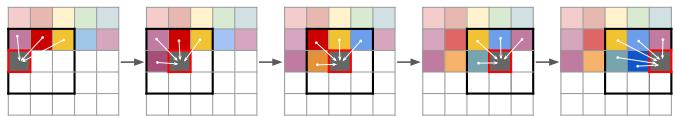
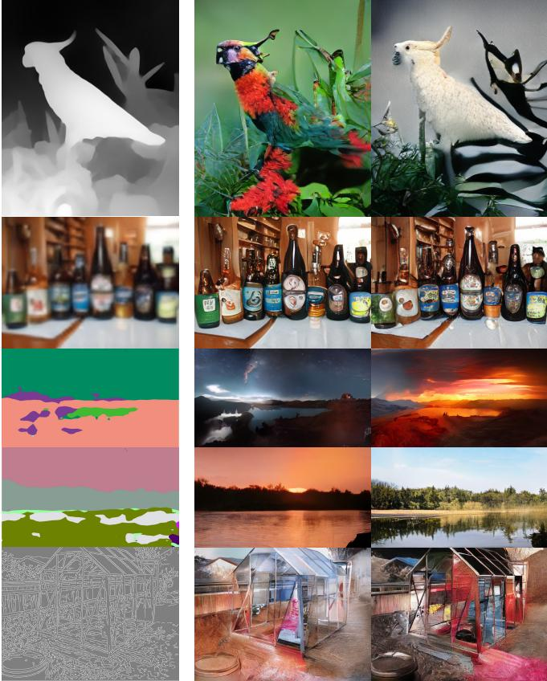
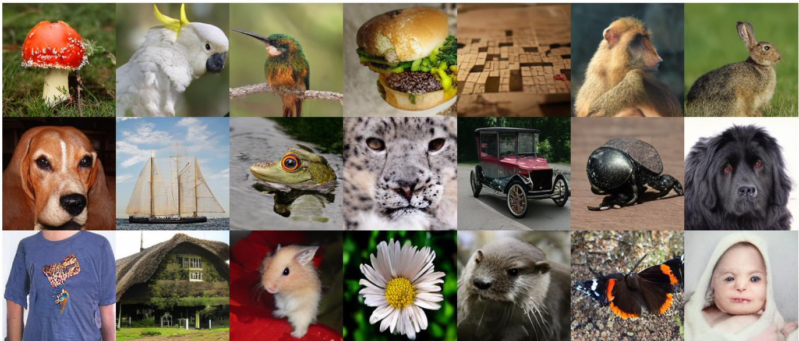
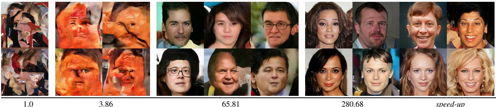

# 1. 论文基本信息

## 1.1. 标题
<strong>驯服 Transformer 用于高分辨率图像合成 (Taming Transformers for High-Resolution Image Synthesis)</strong>

该标题直截了当地指出了论文的核心目标：解决 `Transformer` 模型在应用于**高分辨率**图像生成任务时所面临的挑战。“驯服 (Taming)”一词生动地比喻了 `Transformer` 强大的表达能力（如同野兽）与其巨大的计算成本（难以驾驭）之间的矛盾，而本文工作旨在通过一种巧妙的框架来驾驭它。

## 1.2. 作者
*   Patrick Esser
*   Robin Rombach
*   Björn Ommer

    三位作者均来自德国海德堡大学的图像处理协作实验室 (Heidelberg Collaboratory for Image Processing, IWR)。值得注意的是，该团队是后续大名鼎鼎的<strong>稳定扩散模型 (Stable Diffusion)</strong> 的核心研发力量，而本篇论文为其奠定了关键的理论和技术基础，特别是 VQGAN 的思想和在潜空间中进行生成建模的范式。

## 1.3. 发表期刊/会议
*   **arXiv 预印本:** 2020年12月17日
*   **正式发表:** CVPR 2021 (Conference on Computer Vision and Pattern Recognition)

    CVPR 是计算机视觉领域的顶级学术会议，具有极高的声誉和影响力。被 CVPR 接收意味着该研究成果在创新性、技术深度和实验有效性上都得到了学术界的广泛认可。

## 1.4. 发表年份
2020 (预印本)，2021 (正式发表)

## 1.5. 摘要
`Transformer` 模型因其强大的学习长距离依赖关系的能力，在自然语言处理等序列任务中取得了巨大成功。然而，与为图像任务量身定制的卷积神经网络 (CNN) 不同，`Transformer` 缺乏优先处理局部信息的<strong>归纳偏置 (inductive bias)</strong>。这使得 `Transformer` 表达能力极强，但也导致其在处理如高分辨率图像这样的长序列时，计算成本变得不可行。

本文展示了如何**结合 CNN 的高效归纳偏置和 Transformer 的强大表达能力**，来实现高分辨率图像的建模与合成。具体方法分为两步：
1.  使用 CNN 学习一个包含丰富上下文信息的图像“词汇表”（即离散的图像基本构成单元）。
2.  利用 `Transformer` 高效地学习这些“词汇”在高分辨率图像中的组合方式。

    该方法可以轻松应用于条件图像合成任务，无论是类别标签这样的非空间信息，还是分割图这样的空间信息，都可以用来控制生成结果。特别是，本文首次展示了使用 `Transformer` 进行<strong>百万像素级别 (megapixel)</strong> 的语义引导图像合成，并在类条件 ImageNet 生成任务上，取得了当时自回归模型中的<strong>最先进 (state-of-the-art)</strong> 成果。

## 1.6. 原文链接
*   **arXiv 链接:** [https://arxiv.org/abs/2012.09841](https://arxiv.org/abs/2012.09841)
*   **PDF 链接:** [https://arxiv.org/pdf/2012.09841v3.pdf](https://arxiv.org/pdf/2012.09841v3.pdf)

    该论文已在 CVPR 2021 正式发表，arXiv 上为可公开访问的预印本。

# 2. 整体概括

## 2.1. 研究背景与动机
### 2.1.1. 核心问题
`Transformer` 的核心机制是<strong>自注意力 (self-attention)</strong>，它会计算输入序列中每两个元素之间的相互关系。这种全局建模能力使其非常强大，但也带来了致命的缺陷：计算复杂度和内存消耗随序列长度的平方 ($O(N^2)$) 增长。对于一张 $256 \times 256$ 的图像，如果将其像素展平为一个序列，长度 $N = 256 \times 256 = 65,536$。$N^2$ 的计算量对于现有硬件是无法承受的，更不用说百万像素级别的图像。因此，**如何将 `Transformer` 强大的序列建模能力应用于高分辨率图像生成，是一个巨大的挑战**。

### 2.1.2. 现有挑战与空白 (Gap)
*   **CNN 的局限性:** <strong>卷积神经网络 (CNNs)</strong> 是图像处理的基石。它们通过卷积核的设计，天然地引入了<strong>局部性 (locality)</strong> 和<strong>空间不变性 (spatial invariance)</strong> 的<strong>归纳偏置 (inductive bias)</strong>。这使得 CNN 在学习局部特征（如纹理、边缘）时非常高效。然而，这种强烈的局部偏置也限制了其捕捉图像全局结构和长距离依赖关系的能力，需要通过堆叠很多层来间接扩大感受野，效果并不理想。
*   **早期 Transformer for Vision 的不足:** 先前的工作（如 Image GPT）尝试将 `Transformer` 直接应用于低分辨率图像的像素序列上，但这无法扩展到高分辨率。另一些工作尝试限制注意力的感受野范围，但这又削弱了 `Transformer` 最核心的全局建模优势。
*   **两阶段方法的潜力未被充分挖掘:** 此前已有工作（如 VQ-VAE）采用两阶段方法：先将图像压缩为离散的编码，再对编码进行建模。但这些方法的第一阶段（压缩模型）通常比较简单，压缩率不高，导致生成的编码序列依然很长；或者第二阶段（生成模型）仍然使用 CNN（如 PixelCNN），限制了全局建模能力。

### 2.1.3. 论文的切入点与创新思路
作者的洞察是：**我们不应该强迫 `Transformer` 从头学习图像的所有规律，特别是 CNN 已经非常擅长的局部结构。** 图像的本质是组合式的：由底层的视觉元素（如纹理、部件）组合成高层的语义结构。

因此，论文提出了一种优雅的分工合作方案：
1.  **让 CNN 干它擅长的事：** 利用强大的 CNN 学习一个**高质量的、包含丰富上下文的、高度压缩的**离散视觉“词汇表”（Codebook）。这一步的目标是，用尽可能短的编码序列来表示原始图像，同时不损失重要的感知信息。
2.  **让 Transformer 干它擅长的事：** 在这个高度压缩的、抽象的“词汇”序列上，利用 `Transformer` 学习全局的组合规律和长距离依赖关系。由于序列长度被大大缩短，`Transformer` 的计算瓶颈被完美绕开。

    这种“结合两者之长”的思路，就是本文“驯服”`Transformer` 的核心。

## 2.2. 核心贡献/主要发现
1.  <strong>提出了 VQGAN (Vector Quantised Generative Adversarial Network):</strong> 这是本文在技术上的主要创新之一。它改进了原有的 VQ-VAE，通过引入<strong>对抗性损失 (adversarial loss)</strong> 和<strong>感知损失 (perceptual loss)</strong>，使得第一阶段的图像压缩模型能够以**极高的压缩率**生成**感知质量**非常好的重建图像。这为第二阶段的 `Transformer` 提供了高质量、短序列的输入，是整个框架成功的基石。
2.  **构建了一个高效的两阶段生成框架:** 结合 VQGAN 和 `Transformer`，成功地将 `Transformer` 应用于高分辨率图像合成。该框架不仅解决了计算瓶颈，还保留了 `Transformer` 的表达能力优势。
3.  **首次实现百万像素级别的 Transformer 图像生成:** 通过一个巧妙的<strong>滑动窗口 (sliding-window)</strong> 策略，该方法能够生成远超训练尺寸的超高分辨率图像，例如百万像素级别的风景图。
4.  **提供了一个通用的条件图像生成模型:** 该框架非常灵活，可以轻松适应各种条件生成任务，如**类别条件、语义图引导、深度图引导、姿态引导**等，展示了其作为通用图像合成工具的巨大潜力。
5.  **刷新了自回归模型的 SOTA:** 在标准的 ImageNet $256 \times 256$ 类条件生成任务上，其性能超越了之前所有基于自回归的方法（如 VQ-VAE-2），并达到了与顶级 GAN 模型相媲美的水平。

# 3. 预备知识与相关工作

## 3.1. 基础概念
### 3.1.1. Transformer 与自注意力机制
**Transformer** 是一种最初为自然语言处理设计的神经网络架构。其核心是<strong>自注意力机制 (Self-Attention)</strong>。对于一个输入序列（比如一句话中的所有单词），自注意力机制会为序列中的每个元素（每个单词）计算一个加权平均的表示，权重的大小取决于该元素与序列中所有其他元素（包括自身）的关联程度。

这种机制允许模型在处理任何一个元素时，都能直接“看到”并利用序列中任何其他元素的信息，无论它们相距多远。这使得 `Transformer` 极度擅长捕捉**长距离依赖关系**。

### 3.1.2. 自注意力机制 (Self-Attention) 的计算
为了更好地理解其工作原理和计算瓶颈，我们补充其核心公式。对于输入序列中的每一个元素，我们通过三个可学习的线性变换，生成三个向量：<strong>查询 (Query, Q)</strong>、<strong>键 (Key, K)</strong> 和<strong>值 (Value, V)</strong>。
$$
\mathrm{Attention}(Q, K, V) = \mathrm{softmax}\left(\frac{QK^T}{\sqrt{d_k}}\right)V
$$
*   **`Q, K, V`**: 分别是查询、键、值的矩阵表示。对于一个长度为 $N$ 的序列，它们的维度通常是 $N \times d_k$ (对于Q和K) 和 $N \times d_v$ (对于V)。
*   **$QK^T$**: 计算查询和键的点积，得到一个 $N \times N$ 的**注意力分数矩阵**。矩阵中的每个元素 `(i, j)` 代表序列中第 $i$ 个元素对第 $j$ 个元素的关注程度。<strong>这就是计算复杂度为 $O(N^2)$ 的根源。</strong>
*   **$\sqrt{d_k}$**: 缩放因子，用于稳定梯度。$d_k$ 是键向量的维度。
*   **softmax**: 对注意力分数进行归一化，使其成为权重，总和为1。
*   **$V$**: 将归一化后的权重应用于值向量，得到最终的输出。

### 3.1.3. 归纳偏置 (Inductive Bias)
归纳偏置是指学习算法在设计时被赋予的，用于在面对新数据时进行泛化的先验假设。
*   **CNN 的归纳偏置**: CNN 的核心操作是卷积，它假设<strong>相邻的像素点关联性更强（局部性）</strong>，并且图像中某个模式（如一只眼睛）的学习方式可以应用于图像的其他位置<strong>（空间不变性）</strong>。这个偏置非常适合图像数据，使得 CNN 学习效率很高。
*   **Transformer 的归纳偏置**: `Transformer` 的自注意力机制几乎没有归纳偏置，它对所有位置一视同仁，假设任意两个元素之间都可能存在重要联系。这赋予了它极强的表达能力，但也意味着它需要从海量数据中从零开始学习所有的空间关系，计算成本高昂。

### 3.1.4. VAE 和 GAN
*   <strong>变分自编码器 (Variational Autoencoder, VAE)</strong>: 一种生成模型，由一个编码器 (Encoder) 和一个解码器 (Decoder) 组成。编码器将输入数据（如图像）压缩成一个低维的<strong>潜变量 (latent variable)</strong>，解码器则从这个潜变量中重建原始数据。VAE 通过强制潜变量服从某个简单的先验分布（如高斯分布）来学习数据的平滑表示，从而可以从该分布中采样生成新的数据。
*   <strong>生成对抗网络 (Generative Adversarial Network, GAN)</strong>: 另一种强大的生成模型，由一个<strong>生成器 (Generator)</strong> 和一个<strong>判别器 (Discriminator)</strong> 组成。生成器试图生成以假乱真的数据，而判别器则试图区分真实数据和生成器伪造的数据。两者在“对抗”中共同进化，最终生成器能够产生高质量的样本。

### 3.1.5. 自回归模型 (Autoregressive Models)
自回归模型将数据的联合概率分布分解为一系列条件概率的乘积。对于一个序列 $s = (s_1, s_2, ..., s_L)$，其概率可以表示为：
$$
p(s) = p(s_1) \cdot p(s_2|s_1) \cdot p(s_3|s_1, s_2) \cdot ... = \prod_{i=1}^{L} p(s_i | s_{<i})
$$
这意味着生成第 $i$ 个元素时，需要依赖所有在它之前的元素 $s_{<i}$。像 GPT 系列模型就是典型的自回归模型。

## 3.2. 前人工作
*   **VQ-VAE (Vector Quantised-Variational Autoencoder):** 由 DeepMind 提出，是本文工作的直接基础。VQ-VAE 的创新之处在于其潜空间是**离散的**。编码器输出的连续向量会通过一个<strong>量化 (quantization)</strong> 操作，被替换为码本 (codebook) 中最接近的一个码向量。这使得模型可以将图像表示为一串离散的索引序列，非常适合后续用自回归模型（如 PixelCNN 或 `Transformer`）来建模。但 VQ-VAE 使用简单的 L2 重建损失，在高压缩率下容易产生模糊的重建结果。
*   **VQ-VAE-2:** VQ-VAE 的一个强大扩展，使用了一个层级式的 VQ-VAE 和强大的 PixelCNN 模型来对离散编码进行自回归建模。它在图像生成上取得了非常好的效果，但其第二阶段仍然是基于 CNN 的，在捕捉全局依赖上不如 `Transformer`。
*   **Image GPT (iGPT):** 由 OpenAI 提出，是首批成功将 `Transformer` 应用于图像生成的代表性工作。它将低分辨率图像的像素展平，然后直接用 `Transformer` 进行自回归建模。由于计算瓶颈，它只能处理如 $32 \times 32$ 或 $64 \times 64$ 这样的小尺寸图像。

## 3.3. 技术演进
图像生成模型的技术路线大致经历了从 VAEs、GANs 到更复杂的自回归模型和现在的扩散模型。本文的工作处于一个关键的转折点：
1.  <strong>早期 (GANs/VAEs):</strong> 直接在像素空间生成图像，GANs 质量高但训练不稳定，VAEs 稳定但结果模糊。
2.  <strong>自回归时代 (PixelCNN/RNN):</strong> 在像素空间逐像素生成，理论完备，但速度极慢且受限于局部感受野。
3.  <strong>两阶段方法兴起 (VQ-VAE):</strong> 认识到像素空间的冗余性，开始转向在压缩的离散潜空间中建模，大大提高了效率。
4.  <strong>本文 (VQGAN + Transformer):</strong> 将两阶段方法推向了新的高度。通过引入对抗性训练，极大地提升了第一阶段压缩的质量和效率；通过引入 `Transformer`，极大地增强了第二阶段建模全局关系的能力。这个<strong>“高质量压缩 + 强力生成模型”</strong>的范式，为后来的潜扩散模型 (Latent Diffusion Models)，如 Stable Diffusion，铺平了道路。

## 3.4. 差异化分析
*   **与 VQ-VAE/VQ-VAE-2 的区别:** 核心区别在于第一阶段的压缩模型。本文的 **VQGAN** 使用对抗性损失和感知损失，而不是 VQ-VAE 的 L2 损失。这使得 VQGAN 能够在**更高的压缩率**下（即产生更短的编码序列）依然保持**极高的感知质量**，避免了模糊问题。这对于“驯服”`Transformer` 至关重要，因为更短的序列意味着更低的计算成本。
*   **与 Image GPT 的区别:** Image GPT 要么直接在像素上操作，要么使用一个非常浅的编码器，这限制了其处理高分辨率图像的能力。本文的 VQGAN 是一个**非常深且强大的**编码器-解码器结构，能够学习到更具语义和上下文信息的视觉“词汇”，使得 `Transformer` 能在更高层次的抽象上工作，而不是纠结于像素细节。

# 4. 方法论

本文的核心方法是一个两阶段框架，如下图（原文 Figure 2）所示。首先使用 VQGAN 学习一个离散的视觉码本，然后使用 `Transformer` 学习这些码本索引的组合规律。

*该图像是示意图，展示了基于VQGAN和Transformer的高分辨率图像合成方法。图中包括了一个代码本$Z$，用于存储上下文丰富的视觉部分，以及通过卷积神经网络（CNN）编码器和解码器处理的过程。主要结构展示了如何使用CNN学习视觉特征，并利用Transformer建模特征组合。图中还标注了生成器$G$和鉴别器$D$的工作流程，包括生成图像的过程及其真实与否的判别。*

## 4.1. 第一阶段：学习高效的视觉码本 (VQGAN)
这一阶段的目标是将一张连续的图像 $x \in \mathbb{R}^{H \times W \times 3}$ 转换成一个离散的、空间上对应的索引序列 $s \in \{0, ..., K-1\}^{h \times w}$，并且这个过程是可逆的（即可以从 $s$ 重建回高质量的图像 $\hat{x}$）。

### 4.1.1. 架构与流程
1.  <strong>编码 (Encoding):</strong> 使用一个卷积编码器 $E$ 将输入图像 $x$ 映射到一个低分辨率的连续特征图 $\hat{z} = E(x) \in \mathbb{R}^{h \times w \times n_z}$。其中 $h=H/f, w=W/f$，$f$ 是下采样因子，$n_z$ 是特征维度。
2.  <strong>量化 (Quantization):</strong> 准备一个可学习的码本 $\mathcal{Z} = \{z_k\}_{k=1}^K \subset \mathbb{R}^{n_z}$，其中包含 $K$ 个码向量 (codebook vectors)。对于 $\hat{z}$ 中的每一个空间位置 `(i,j)` 的特征向量 $\hat{z}_{ij}$，找到码本 $\mathcal{Z}$ 中与它欧氏距离最近的码向量 $z_k$ 来替换它。这个过程可以表示为：
    $$
    z_{\mathbf{q}} = \mathbf{q}(\boldsymbol{\hat{z}}) := \left( \underset{z_k \in \mathcal{Z}}{\arg\min} \|\boldsymbol{\hat{z}}_{ij} - z_k \| \right)_{ij} \in \mathbb{R}^{h \times w \times n_z}
    $$
    *   $\boldsymbol{\hat{z}}_{ij}$: 编码器输出的特征图中在 `(i,j)` 位置的 $n_z$ 维向量。
    *   $z_k$: 码本中的第 $k$ 个码向量。
    *   $\arg\min$: 找到距离最近的码向量的索引。
    *   $z_{\mathbf{q}}$: 量化后的特征图，其中每个向量都来自码本 $\mathcal{Z}$。

3.  <strong>解码 (Decoding):</strong> 使用一个卷积解码器（生成器）$G$ 将量化后的特征图 $z_{\mathbf{q}}$ 重建回原始图像尺寸，得到 $\hat{x} = G(z_{\mathbf{q}})$。

### 4.1.2. 训练目标与创新
传统的 VQ-VAE 训练存在一个问题：在高压缩率（即大的下采样因子 $f$）下，仅使用 L2 损失（即 $\|x-\hat{x}\|^2$）会导致重建图像非常模糊。为了解决这个问题，本文提出了 **VQGAN**，其核心是对损失函数进行了改进。

<strong>A. VQ 损失 (VQ Loss):</strong>
这部分与 VQ-VAE 类似，用于训练编码器、解码器和码本。由于量化操作是不可导的，这里使用了<strong>直通梯度估计器 (straight-through gradient estimator)</strong>，即在反向传播时直接将解码器传来的梯度复制给编码器。其损失函数为：
$$
\begin{array}{r}
\mathcal{L}_{\mathrm{VQ}}(E, G, \mathcal{Z}) = \|x - \hat{x}\|^2 + \|\mathbf{sg}[E(x)] - z_{\mathbf{q}}\|_2^2 \\
+ \beta \|\mathbf{sg}[z_{\mathbf{q}}] - E(x)\|_2^2.
  \end{array}
$$
*   $\|x - \hat{x}\|^2$: **重建损失**，希望重建图像与原图尽可能接近。*(注意：在 VQGAN 中，这一项被感知损失替代)*。
*   $\|\mathbf{sg}[E(x)] - z_{\mathbf{q}}\|_2^2$: <strong>码本损失 (Vector Quantization Loss)</strong>。$\mathbf{sg}[\cdot]$ 是停止梯度 (stop-gradient) 操作，意味着这部分的梯度只用来更新码本 $\mathcal{Z}$，让码向量向编码器的输出靠拢。
*   $\beta \|\mathbf{sg}[z_{\mathbf{q}}] - E(x)\|_2^2$: <strong>承诺损失 (Commitment Loss)</strong>。这部分梯度只用来更新编码器 $E$，鼓励编码器的输出与它所选择的码向量保持接近，防止其输出随意跳动。$\beta$ 是一个超参数。*(注：论文 v3 版本中因实现 bug 将 $\beta$ 设为 1.0 并从公式中移除，但这里为解释其原理而保留)*

<strong>B. 感知损失 (Perceptual Loss) 与对抗性损失 (Adversarial Loss):</strong>
这是 VQGAN 的核心创新。作者用**感知损失**替代了 L2 重建损失，并引入了一个基于 Patch 的<strong>判别器 (Discriminator)</strong> $D$ 进行对抗性训练。
*   **感知损失**: 不直接比较像素值的差异，而是比较预训练网络（如 VGG）提取出的高级特征图的差异。这使得重建结果在人眼看来更真实，即使像素值不完全一致。
*   **对抗性损失**: 判别器 $D$ 的任务是区分真实图像 $x$ 和重建图像 $\hat{x}$。生成器 $G$（即解码器）则要努力欺骗判别器。这个对抗过程迫使生成器产生细节更丰富、纹理更真实的图像。其损失函数为：
    $$
    \mathcal{L}_{\mathrm{GAN}}(\{E, G, \mathcal{Z}\}, D) = \mathbb{E}_{x \sim p(x)}[\log D(x) + \log(1 - D(\hat{x}))]
    $$

**C. 最终 VQGAN 目标函数:**
将上述损失结合起来，VQGAN 的完整训练目标是一个 min-max 对抗游戏：
$$
\mathcal{Q}^* = \underset{E, G, \mathcal{Z}}{\arg\min} \underset{D}{\arg\max} \mathbb{E}_{x \sim p(x)} \left[ \mathcal{L}_{\mathrm{VQ}}(E, G, \mathcal{Z}) + \lambda \mathcal{L}_{\mathrm{GAN}}(\{E, G, \mathcal{Z}\}, D) \right]
$$
其中，$\lambda$ 是一个自适应权重，用于平衡重建/感知损失与对抗性损失。它的计算方式很巧妙：
$$
\lambda = \frac{\nabla_{G_L}[\mathcal{L}_{\mathrm{rec}}]}{\nabla_{G_L}[\mathcal{L}_{\mathrm{GAN}}] + \delta}
$$
*   $\mathcal{L}_{\mathrm{rec}}$: 感知重建损失。
*   $\nabla_{G_L}[\cdot]$: 损失相对于解码器最后一层参数的梯度。
*   $\delta$: 一个小常数，防止分母为零。
    这个权重机制确保了对抗性损失不会压倒感知损失，使得训练更加稳定。

通过这个过程，VQGAN 学会了如何用一个非常短的离散索引序列来表示一张高保真度的图像。

## 4.2. 第二阶段：用 Transformer 学习图像的组合规律
在第一阶段训练好 VQGAN 后，我们就可以将任何图像 $x$ 转换为一个 $h \times w$ 的码本索引矩阵。将这个矩阵按光栅扫描顺序（或其他顺序）展平，就得到了一个一维的索引序列 $s \in \{0, ..., K-1\}^{h \times w}$。

第二阶段的目标就是学习这个序列的分布 `p(s)`。由于 `Transformer` 是强大的序列建模工具，它被用来完成这个任务。

### 4.2.1. 自回归建模
模型学习的目标是最大化数据的对数似然。这通过自回归的方式实现，即预测序列中的下一个索引，其条件是所有之前的索引：
$p(s) = \prod_i p(s_i | s_{<i})$
`Transformer` 的任务就是建模 $p(s_i | s_{<i})$。训练时的损失函数是标准的<strong>负对数似然 (Negative Log-Likelihood)</strong>：
$$
\mathcal{L}_{\mathrm{Transformer}} = \mathbb{E}_{x \sim p(x)} [-\log p(s)]
$$
其中 $s$ 是图像 $x$ 经过 VQGAN 编码和量化后得到的索引序列。

### 4.2.2. 条件合成 (Conditioned Synthesis)
该框架可以非常自然地扩展到条件生成任务。给定一个条件信息 $c$（如类别标签或分割图），目标是学习条件分布 $p(s|c)$。
$$
p(s|c) = \prod_i p(s_i | s_{<i}, c)
$$
*   <strong>对于非空间条件 (如类别标签):</strong> 类别标签可以被视为一个特殊的 `token`，加在索引序列 $s$ 的最前面。
*   <strong>对于空间条件 (如分割图):</strong> 分割图本身也是一张图像，可以**用另一个 VQGAN** 将其也编码成一个索引序列 $r$。然后将 $r$ 和 $s$ 拼接起来（$r$在前，$s$在后），让 `Transformer` 学习整个拼接序列的联合分布。在计算损失时，只考虑对 $s$ 部分的预测。

### 4.2.3. 生成高分辨率图像
由于 VQGAN 实现了很高的压缩率，即使是 $256 \times 256$ 的图像，其索引序列长度也可能只有 $16 \times 16 = 256$，这对于 `Transformer` 来说是完全可以接受的。

但要生成百万像素的图像，序列长度依然过长。为此，作者提出了一种<strong>滑动窗口 (sliding-window)</strong> 的生成策略，如下图（原文 Figure 3）所示：

*该图像是一个示意图，展示了滑动注意力窗口的机制。各个步骤中，红色方框内的内容被逐步引入计算，箭头指示了注意力的移动方式，从而体现了卷积神经网络与变换器结合的思想。*

在生成时，`Transformer` 并不是一次性生成整个 $h \times w$ 的索引图，而是以一个固定大小的窗口（如 $16 \times 16$）在索引图上滑动。在生成当前窗口内的索引时，它会利用已经生成的、相邻窗口的索引作为上下文信息。这样，`Transformer` 总是处理一个固定长度的短序列，但却能逐步生成任意大小的完整索引图。最后，将整个生成的索引图送入 VQGAN 的解码器 $G$，一次性解码出最终的高分辨率图像。

# 5. 实验设置

## 5.1. 数据集
实验覆盖了多种图像合成任务，使用了多个标准和自定义的数据集：
*   **ImageNet (IN):** 一个大规模、多类别的图像数据集，包含1000个类别和超过120万张训练图像。是图像生成和分类任务的黄金标准。
*   **Restricted ImageNet (RIN):** ImageNet 的一个子集，只包含动物类别。
*   **LSUN Churches and Towers:** 包含大量教堂和塔楼的场景图像，常用于无条件场景生成。
*   **FacesHQ:** 由 CelebA-HQ 和 FFHQ 两个高质量人脸数据集组合而成，用于高保真人脸合成。
*   **ADE20K & COCO-Stuff:** 大规模场景解析数据集，包含像素级的语义分割标注。用于语义图到图像的合成任务。
*   **S-FLCKR:** 作者从 Flickr 收集的风景图像数据集，并使用现有方法为其生成语义布局图，用于高分辨率风景画生成。
*   **DeepFashion:** 包含大量模特图像及其姿态关键点标注，用于姿态引导的人物合成。

    以下是原文 Figure 4 中展示的一些数据集上的生成样本，直观地展示了数据形态和任务类型：

    ![Figure 4. Transformers within our setting unify a wide range of image synthesis tasks. We show $2 5 6 \\times 2 5 6$ synthesis results across different conditioning inputs and datasets, all obtained with the same approach to exploit inductive biases of effective CNN based VQGAN architectures in combination with the expressivity of transformer architectures. Top row: Completions from unconditional training on ImageNet. 2nd row: Depth-to-Image on RIN. 3rd row: Semantically guided synthesis on ADE20K. 4th row: Pose-guided person generation on DeepFashion. Bottom row: Class-conditional samples on RIN.](images/4.jpg)
    *该图像是图表，展示了通过结合CNN和Transformer模型生成高分辨率图像的多种合成任务。包含来自不同数据集的256x256合成结果，展示了无条件生成、深度到图像转换、语义引导合成、姿势引导生成以及类别条件样本等多种应用。*

## 5.2. 评估指标
### 5.2.1. FID (Fréchet Inception Distance)
1.  **概念定义:** FID 是衡量生成图像质量和多样性的黄金标准。它通过比较真实图像和生成图像在 Inception-v3 网络（一个预训练的图像分类模型）深层特征空间中的分布相似度来打分。FID 分数越低，表示生成图像的分布与真实图像的分布越接近，即生成图像的质量越高、多样性越好。
2.  **数学公式:**
    $$
    \text{FID}(x, g) = \|\mu_x - \mu_g\|^2_2 + \text{Tr}\left(\Sigma_x + \Sigma_g - 2(\Sigma_x \Sigma_g)^{1/2}\right)
    $$
3.  **符号解释:**
    *   $x$ 和 $g$: 分别代表真实图像集和生成图像集。
    *   $\mu_x$ 和 $\mu_g$: 真实图像和生成图像的 Inception 特征向量的均值。
    *   $\Sigma_x$ 和 $\Sigma_g$: 真实图像和生成图像的 Inception 特征向量的协方差矩阵。
    *   $\|\cdot\|^2_2$: 向量的平方 L2 范数。
    *   $\text{Tr}(\cdot)$: 矩阵的迹（主对角线元素之和）。

### 5.2.2. IS (Inception Score)
1.  **概念定义:** IS 主要衡量两个方面：<strong>清晰度 (Clarity)</strong> 和 <strong>多样性 (Diversity)</strong>。清晰度指生成的单个图像是否能被 Inception 网络高置信度地分到某个类别；多样性指生成的整个图像集是否覆盖了足够多的类别。IS 分数越高越好。
2.  **数学公式:**
    $$
    \text{IS}(G) = \exp\left(\mathbb{E}_{x \sim p_g} [D_{KL}(p(y|x) \| p(y))]\right)
    $$
3.  **符号解释:**
    *   $x \sim p_g$: 从生成器 $G$ 生成的图像。
    *   $p(y|x)$: 给定生成图像 $x$，Inception 模型预测其属于各个类别的条件概率分布。
    *   `p(y)`: 所有生成图像的边缘概率分布，即 $\int p(y|x)p_g(x)dx$。
    *   $D_{KL}(\cdot \| \cdot)$: KL 散度，用于衡量两个概率分布的差异。
    *   $\exp(\cdot)$: 指数函数。

### 5.2.3. NLL (Negative Log-Likelihood)
1.  **概念定义:** 负对数似然是评估概率模型拟合数据能力的直接指标。它衡量了模型赋予真实数据（这里是 VQGAN 的索引序列）的概率有多大。NLL 值越低，说明模型认为真实数据出现的可能性越高，模型的拟合能力越强。
2.  **数学公式:**
    $$
    \text{NLL} = -\frac{1}{N} \sum_{i=1}^{N} \log p_{\text{model}}(x_i)
    $$
3.  **符号解释:**
    *   $N$: 数据集中的样本总数。
    *   $x_i$: 数据集中的第 $i$ 个样本。
    *   $p_{\text{model}}(x_i)$: 模型赋予样本 $x_i$ 的概率。在本文中，是 `Transformer` 赋予 VQGAN 索引序列的概率。

## 5.3. 对比基线
论文与当时各类 SOTA 模型进行了广泛比较：
*   **自回归模型:**
    *   `PixelSNAIL`: 一个强大的基于 CNN 的自回归模型，用于验证 `Transformer` 在潜空间建模中的优势。
    *   `VQ-VAE-2`: 当时类条件自回归图像生成的 SOTA 模型。
*   **GAN 模型:**
    *   `BigGAN`: 当时 ImageNet 生成的 SOTA GAN 模型。
    *   `SPADE`, `Pix2PixHD`: 语义图像合成领域的 SOTA GAN 模型。
    *   `StyleGAN2`: 高质量人脸合成的 SOTA GAN 模型。
*   **其他生成模型:**
    *   `GLOW` (Flow-based model), `NVAE`, `VDVAE` (VAE-based models)。
    *   `IDDPM`, `ADM` (Diffusion models)，这些是同期或稍晚出现的新 SOTA 模型。

        选择这些基线具有很强的代表性，覆盖了当时主流的生成模型范式，使得比较非常全面。

# 6. 实验结果与分析

## 6.1. 核心结果分析
### 6.1.1. 潜空间中 Transformer 的优越性 (Sec 4.1)
为了验证在第二阶段使用 `Transformer` 而非 CNN 的选择是正确的，作者在多个任务上比较了 `Transformer` 和 `PixelSNAIL`（一个强大的 CNN 自回归模型）在学习 VQGAN 码本序列上的表现。

<strong>数据呈现 (表格):</strong> 以下是原文 Table 1 的结果，比较了两者在相同 VQGAN 表示上的负对数似然 (NLL)，分数越低越好。

<table>
<thead>
<tr>
<th>Data / # params</th>
<th>Transformer P-SNAIL steps</th>
<th>Transformer P-SNAIL time</th>
<th>PixelSNAIL fixed time</th>
</tr>
</thead>
<tbody>
<tr>
<td>RIN / 85M</td>
<td>4.78</td>
<td>4.84</td>
<td>4.96</td>
</tr>
<tr>
<td>LSUN-CT / 310M</td>
<td>4.63</td>
<td>4.69</td>
<td>4.89</td>
</tr>
<tr>
<td>IN / 310M</td>
<td>4.78</td>
<td>4.83</td>
<td>4.96</td>
</tr>
<tr>
<td>D-RIN / 180 M</td>
<td>4.70</td>
<td>4.78</td>
<td>4.88</td>
</tr>
<tr>
<td>S-FLCKR / 310 M</td>
<td>4.49</td>
<td>4.57</td>
<td>4.64</td>
</tr>
</tbody>
</table>

**分析:**
*   **`Transformer` 全面胜出:** 在所有数据集和模型尺寸下，`Transformer` 的 NLL 分数都显著低于 `PixelSNAIL`。
*   **训练效率考量:** 考虑到 `Transformer` 的训练速度大约是 `PixelSNAIL` 的一半，作者同时比较了“相同训练步数”和“相同训练时间”下的结果。即使在训练时间相同的情况下（`Transformer P-SNAIL time` vs `PixelSNAIL`），`Transformer` 依然表现更好。
*   **结论:** 这个实验有力地证明了 `Transformer` 的全局建模能力在学习潜空间中的高级语义组合规律时，比 CNN 的局部建模能力更具优势。这为整个框架的设计提供了坚实的实验支持。

### 6.1.2. 模型的通用性与高分辨率合成 (Sec 4.2)
作者展示了该模型在多种条件合成任务上的出色表现，证明了其通用性。如下图（原文 Figure 6）所示，无论是深度图、低分辨率图、语义图还是边缘图，模型都能生成高质量、细节丰富的图像。

*该图像是展示高分辨率图像合成结果的插图，包含多种图像的比较和合成效果，突出显示了鸟类、饮料和自然风光等主题，展示了条件合成的多样性与美学。图像左侧包含合成对象的分割信息，而右侧展示了相应的真实图片，体现了所提方法在图像合成中的应用效果。*

特别地，在百万像素级别合成上，该模型取得了惊人的效果。如下图（原文 Figure 5）所示，在 S-FLCKR 数据集上，模型能够根据语义布局图生成分辨率高达 $1280 \times 832$ 的逼真风景画。

*该图像是展示了三个不同场景的自然风光图。顶部为阴云密布的高山景色，中间为清澈的湖泊及植被背景，底部展示了日落时分的海岸线及远山。整体展现了自然环境的多样性与美丽。*

<strong>数据呈现 (表格):</strong> 在定量的语义合成任务上，与专门为此设计的 GAN 模型相比，本文方法也具有很强的竞争力（FID 分数，越低越好）。

以下是原文 Table 2 的结果：

<table>
<thead>
<tr>
<th>Dataset</th>
<th>ours</th>
<th>SPADE [53]</th>
<th>Pix2PixHD (+aug) [75]</th>
<th>CRN [9]</th>
</tr>
</thead>
<tbody>
<tr>
<td>COCO-Stuff</td>
<td>22.4</td>
<td>22.6/23.9(*)</td>
<td>111.5 (54.2)</td>
<td>70.4</td>
</tr>
<tr>
<td>ADE20K</td>
<td>35.5</td>
<td>33.9/35.7(*)</td>
<td>81.8 (41.5)</td>
<td>73.3</td>
</tr>
</tbody>
</table>

**分析:**
*   在 COCO-Stuff 和 ADE20K 两个标准数据集上，本文方法的 FID 分数与 SOTA 的专用 GAN 模型 SPADE 相当或更好。
*   这证明了该框架的强大之处：它不是一个为特定任务设计的“小技巧”模型，而是一个通用的、强大的生成模型，同时还能进行图像编码和重建（这是 GAN 不具备的）。

### 6.1.3. 类条件 ImageNet 合成 (Sec 4.4)
这是衡量生成模型性能的一个核心基准。作者将他们的模型与之前的自回归 SOTA (VQ-VAE-2) 和顶级的 GAN 及扩散模型进行了比较。

<strong>数据呈现 (表格):</strong> 以下是原文 Table 4 的部分关键结果（FID/IS，FID 越低越好，IS 越高越好）。

<table>
<thead>
<tr>
<th>Model</th>
<th>acceptance rate</th>
<th>FID</th>
<th>IS</th>
</tr>
</thead>
<tbody>
<tr>
<td><b>ours (k=250, p=1.0)</b></td>
<td>1.0</td>
<td><b>15.98</b></td>
<td><b>78.6 ± 1.1</b></td>
</tr>
<tr>
<td><b>ours (rejection sampling, rate 0.05)</b></td>
<td>0.05</td>
<td><b>5.88</b></td>
<td><b>304.8 ± 3.6</b></td>
</tr>
<tr>
<td>VQVAE-2 [61]</td>
<td>1.0</td>
<td>~31</td>
<td>~45</td>
</tr>
<tr>
<td>VQVAE-2 (rejection sampling)</td>
<td>n/a</td>
<td>~10</td>
<td>~330</td>
</tr>
<tr>
<td>BigGAN [4]</td>
<td>1.0</td>
<td>7.53</td>
<td>168.6 ± 2.5</td>
</tr>
<tr>
<td>ADM-G, no guid. [15]</td>
<td>1.0</td>
<td>10.94</td>
<td>100.98</td>
</tr>
<tr>
<td>ADM-G, 1.0 guid.</td>
<td>1.0</td>
<td>4.59</td>
<td>186.7</td>
</tr>
</tbody>
</table>

**分析:**
*   **超越自回归 SOTA:** 在不使用任何后处理技巧（`acceptance rate`=1.0）的情况下，本文模型的 FID (15.98) 远优于 VQ-VAE-2 (~31)，IS (78.6) 也远高于 VQ-VAE-2 (~45)。这证明了 VQGAN + Transformer 组合的优越性。
*   **媲美顶级模型:** 通过<strong>分类器拒绝采样 (classifier rejection sampling)</strong>（即生成多个样本，用一个分类器挑选出最好的），本文模型可以取得极低的 FID (5.88) 和极高的 IS (304.8)，这个分数已经超越了 BigGAN，并接近了当时最先进的扩散模型 ADM。
*   下图（原文 Figure 8）展示了其生成的 ImageNet 样本，质量非常高，纹理细节丰富。

    
    *该图像是展示从我们训练的类条件ImageNet模型中生成的样本，共包含16幅不同主题的高分辨率图像，展示了多种生物与物体，如蘑菇、鸟类、食品和交通工具等。*

## 6.2. 消融实验/参数分析
### 6.2.1. VQGAN 压缩质量的重要性 (Sec 4.3)
这是本文最重要的消融实验，旨在回答：**一个强大的、上下文丰富的视觉词汇表到底有多重要？** 作者通过改变 VQGAN 的下采样因子 $f$ 来控制压缩率和每个码向量所代表的上下文范围。$f$ 越大，压缩率越高，序列越短，但对 VQGAN 的重建质量要求也越高。

实验在 FacesHQ 数据集上进行，$f=1$ 相当于 `Transformer` 直接在像素簇上操作（类似 iGPT），$f=16$ 是本文的推荐设置。

**分析:**
*   从上图（原文 Figure 7）可以清晰地看到：
    *   当 $f$ 很小（如 $f=2$, $f=4$）时，`Transformer` 的感受野有限，无法捕捉人脸的全局结构，生成的图像支离破碎，出现多个眼睛或不连贯的特征。
    *   当 $f$ 增大到 8 时，全局结构开始显现，但仍有明显的不一致性（如半边脸有胡子半边没有）。
    *   只有当 $f$ 达到 16 时，`Transformer` 才能在足够抽象的层次上工作，生成全局一致、高保真的人脸图像。
*   **结论:** 这个实验无可辩驳地证明了**本文的核心论点**：必须有一个强大的第一阶段（如 VQGAN）来学习一个高度压缩且富含上下文的表示，才能真正“解放”`Transformer`，使其专注于全局建模，从而实现高分辨率合成。没有高质量的“词汇表”，`Transformer` 就会迷失在像素细节中。

### 6.2.2. VQGAN 自身质量的量化评估
为了进一步证明 VQGAN 相对于传统 VQ-VAE 的优势，作者直接评估了第一阶段 VQGAN 的重建 FID（即输入一张图，编码再解码回来，与原图计算 FID）。

<strong>数据呈现 (表格):</strong> 以下是原文 Table 5 的结果，比较了不同压缩模型在 ImageNet 上的重建 FID。

<table>
<thead>
<tr>
<th>Model</th>
<th>Codebook Size</th>
<th>dim Z</th>
<th>FID/val</th>
<th>FID/train</th>
</tr>
</thead>
<tbody>
<tr>
<td>DALL-E [59] (VQ-VAE like)</td>
<td>32 × 32</td>
<td>8192</td>
<td>32.01</td>
<td>33.88</td>
</tr>
<tr>
<td><b>VQGAN (ours)</b></td>
<td><b>16 × 16</b></td>
<td><b>1024</b></td>
<td><b>7.94</b></td>
<td><b>10.54</b></td>
</tr>
<tr>
<td><b>VQGAN (ours, larger)</b></td>
<td><b>16 × 16</b></td>
<td><b>16384</b></td>
<td><b>4.98</b></td>
<td><b>7.41</b></td>
</tr>
</tbody>
</table>

**分析:**
*   **压缩率更高，质量更好:** 本文的 VQGAN 在序列长度为 $16 \times 16 = 256$ 的情况下，重建 FID 只有 7.94。而 DALL-E 使用的 VQ-VAE 模型，在序列长度为 $32 \times 32 = 1024$ （压缩率低4倍）的情况下，重建 FID 高达 32.01。
*   **结论:** 这再次证明了引入对抗性训练和感知损失的 VQGAN，其学习到的离散表示质量远超传统的 VQ-VAE，是整个框架成功的关键。

# 7. 总结与思考

## 7.1. 结论总结
本文成功地“驯服”了 `Transformer`，解决了其应用于高分辨率图像合成的计算瓶颈问题。其核心思想是**分工合作**：
1.  利用 **CNN** 的归纳偏置，通过一个新颖的 **VQGAN** 架构学习一个高质量、高压缩率的离散视觉“词汇表”。VQGAN 通过对抗性训练和感知损失，确保了重建图像的感知保真度。
2.  利用 **Transformer** 的长距离建模能力，在 VQGAN 产生的短而抽象的“词汇”序列上学习全局组合规律。

    这个两阶段框架不仅保留了两种架构的优点，还相互弥补了对方的不足。实验证明，该方法在多种无条件和条件图像合成任务上都取得了 SOTA 或极具竞争力的结果，并且首次将 `Transformer` 用于百万像素级别的图像生成，展示了其强大的通用性和扩展性。

## 7.2. 局限性与未来工作
尽管论文本身未明确列出局限性，但我们可以从其方法和时代背景中进行分析：
*   **采样速度:** `Transformer` 的自回归生成方式是**串行的**，即必须逐个 `token` 生成，这导致采样速度非常慢，远不如 GAN 的一次性前向传播生成。这限制了其在实时应用中的潜力。
*   **码本的局限性:** 整个框架的性能上限受制于第一阶段 VQGAN 学习到的码本质量。如果码本不够丰富或表达能力不足，`Transformer` 无论多强大也无法生成超出码本表达范围的细节。码本大小和维度的选择是一个需要权衡的超参数。
*   **误差累积:** 在自回归生成长序列时，可能会出现误差累积问题，导致生成图像的后半部分质量下降或出现不一致。

**未来工作方向:**
*   **加速采样:** 探索非自回归的 `Transformer` 生成方式（如并行解码）来提高采样速度。
*   **更优的潜空间表示:** 研究除了离散码本之外的其他潜空间表示形式，可能结合连续和离散的优点。
*   **替换生成模型:** 这也是本文最重要的启发——既然第一阶段的 VQGAN 如此有效，第二阶段的生成模型不一定非得是 `Transformer`。我们可以用更高效或更强大的生成模型来替代它。

## 7.3. 个人启发与批判
这篇论文是生成模型发展史上的一篇**里程碑式**的作品。它的思想深刻地影响了后续的研究方向。
*   <strong>“感知压缩”</strong>思想的胜利: 本文最大的启发是，在进入复杂的生成建模之前，进行一次高质量的**感知压缩**是极其有效的。它将困难的、高维的像素空间生成问题，转化为了一个更容易处理的、低维的、语义化的潜空间序列建模问题。这是一种**解耦**的思想，让模型的不同部分专注于各自擅长的任务。
*   **通往 Stable Diffusion 之路:** 本文的核心作者团队后来提出的<strong>潜扩散模型 (Latent Diffusion Model, LDM)</strong>，也就是 Stable Diffusion 的原型，正是沿着本文的思路演进而来的。LDM 的核心思想与本文如出一辙：
    1.  使用一个强大的自编码器（类似于本文的 VQGAN，但潜空间是连续的）将图像压缩到潜空间。
    2.  在**低维的潜空间**中运行计算成本高昂的<strong>扩散模型 (Diffusion Model)</strong>。
        这完全是本文“高质量压缩 + 强力生成模型”范式的直接继承和发展，只是将第二阶段的 `Transformer` 换成了当时更强大、生成质量更高的扩散模型。可以说，没有 VQGAN 的成功探索，就没有后来的 Stable Diffusion。
*   **批判性思考:** 尽管该方法非常成功，但两阶段的训练方式相对独立，可能会导致次优解。第一阶段 VQGAN 的训练目标（重建保真度）与第二阶段 `Transformer` 的目标（最大化似然）并不完全一致。端到端的联合训练虽然困难，但可能是未来一个值得探索的方向。此外，模型对 VQGAN 码本的严重依赖也使其成为一个潜在的瓶颈和单点故障。

    总而言之，《Taming Transformers》不仅提出了一种有效的技术方案，更重要的是