# MAGVIT: Masked Generative Video Transformer

Lijun $\mathrm { Y u } ^ { \ddag \dag \circ }$ • Yong Cheng†, Kihyuk Sohn†, José Lezama†, Han Zhang†, Huiwen Chang†, Alexander G. Hauptmann‡, Ming-Hsuan Yang†, Yuan Hao†, Irfan Essa, and Lu Jiang Carnegie Mellon University, †Google Research, Georgia Institute of Technology Correspondence to lijun@cmu.edu, lujiang@google.com

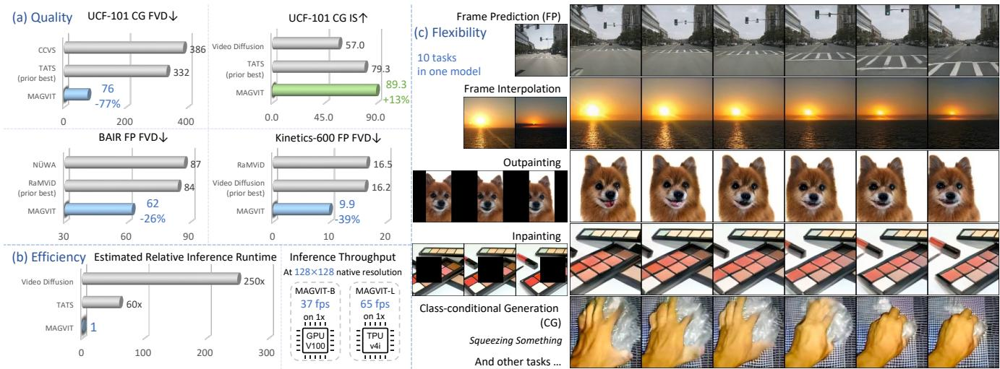  
F T   [ orders of magnitude faster than diffusion models and $6 0 \times$ faster than autoregressive models. (c) A single MAGVIT model accommodates different generation tasks, ranging from class-conditional generation todynamicinpainting of a moving ject.

# Abstract

We introduce the MAsked Generative VIdeo Transformer, MAGVIT, to tackle various video synthesis tasks with a single model. We introduce a 3D tokenizer to quantize a video into spatial-temporal visual tokens and propose an embedding method for masked video token modeling to facilitate multi-task learning. We conduct extensive experiments to demonstrate the quality, efficiency, and flexibility of MAGVIT. Our experiments show that (i) MAGVIT performs favorably against state-of-the-art approaches and establishes the best-published FVD on three video generation benchmarks, including the challenging Kinetics-600. (ii) MAGVIT outperforms existing methods in inference time by two orders of magnitude against diffusion models and by $6 0 \times$ against autoregressive models. (ii) A single MAGVIT model supports ten diverse generation tasks and generalizes across videos from different visual domains. The source code and trained models will be released to the public at https://magvit.cs.cmu.edu.

# 1. Introduction

Recent years have witnessed significant advances in image and video content creation based on learning frameworks ranging from generative adversarial networks (GANs) [15, 43, 48, 58, 65], diffusion models [25, 33, 35, 47, 64], to vision transformers [44, 45, 68]. Inspired by the recent success of generative image transformers such as DALL·E [46] and other approaches [12, 18, 20, 72], we propose an efficient and effective video generation model by leveraging masked token modeling and multi-task learning.

We introduce the MAsked Generative VIdeo Transformer (MAGVIT) for multi-task video generation. Specifically, we build and train a single MAGVIT model to perform a variety of diverse video generation tasks and demonstrate the model's efficiency, effectiveness, and flexibility against state-of-the-art approaches. Fig. 1(a) shows the quality metrics of MAGVIT on a few benchmarks with efficiency comparisons in (b), and generated examples under different task setups such as frame prediction/interpolation, out/in-painting, and class conditional generation in (c).

MAGVIT models a video as a sequence of visual tokens in the latent space and learns to predict masked tokens with BERT [17]. There are two main modules in the proposed framework. First, we design a 3D quantization model to tokenize a video, with high fidelity, into a low-dimensional spatial-temporal manifold [21, 70]. Second, we propose an effective masked token modeling (MTM) scheme for multitask video generation. Unlike conventional MTM in image understanding [66] or image/video synthesis [12,26,28], we present an embedding method to model a video condition using a multivariate mask and show its efficacy in training.

We conduct extensive experiments to demonstrate the quality, efficiency, and flexibility of MAGVIT against stateof-the-art approaches. Specifically, we show that MAGVIT performs favorably on two video generation tasks across three benchmark datasets, including UCF-101 [54], BAIR Robot Pushing [19, 60], and Kinetics-600 [10]. For the class-conditional generation task on UCF-101, MAGVIT reduces state-of-the-art FVD [60] from 332 [21] to 76 $( \downarrow 7 7 \% )$ . For the frame prediction task, MAGVIT performs best in terms of FVD on BAIR $( 8 4 [ 3 5 ]  6 2 , \downarrow 2 6 \% )$ and Kinetics-600 $( 1 6 [ 3 3 ]  9 . 9 , \downarrow 3 8 \% )$ .

Aside from the visual quality, MAGVIT's video synthesis is highly efficient. For instance, MAGVIT generates a 16-frame $1 2 8 \times 1 2 8$ video clip in 12 steps, which takes 0.25 seconds on a single TPUv4i [36] device. On a V100 GPU, a base variant of MAGVIT runs at 37 frame-per-second (fps) at $1 2 8 \times 1 2 8$ resolution. When compared at the same resolution, MAGVIT is two orders of magnitude faster than the video diffusion model [33]. In addition, MAGVIT is 60 times faster than the autoregressive video transformer [21] and 4-16 times more efficient than the contemporary nonautoregressive video transformer [26].

We show that MAGVIT is flexible and robust for multiple video generation tasks with a single trained model, including frame interpolation, class-conditional frame prediction, inpainting, and outpainting, etc. In addition, MAGVIT learns to synthesize videos with complex scenes and motion contents from diverse and distinct visual domains, including actions with objects [23], autonomous driving [9], and object-centric videos from multiple views [2].

The main contributions of this work are:

•To the best of our knowledge, we present the first masked multi-task transformer for efficient video generation and manipulation. We show that a trained model can perform ten different tasks at inference time. •We introduce a spatial-temporal video quantization model design with high reconstruction fidelity. •We propose an effective embedding method with diverse masks for numerous video generation tasks. • We show that MAGVIT achieves the best-published fidelity on three widely-used benchmarks, including UCF101, BAIR Robot Pushing, and Kinetics-600 datasets.

# 2. Preliminaries: Masked Image Synthesis

The proposed video generation framework is based on a two-stage image synthesis process [20, 46] with nonautoregressive transformers [12, 42]. In the first stage, an image is quantized and flattened into a sequence of discrete tokens by a Vector-Quantized (VQ) auto-encoder [20, 62, 71]. In the second stage, masked token modeling (MTM) is used to train a transformer model [12, 25] on the tokens. Let $\mathbf { I } \in \mathbb { R } ^ { H \times W \times 3 }$ be an image and $\textbf { z } \in \ \mathbb { Z } ^ { N }$ denote the corresponding token sequence of length $N$ .

We take MaskGIT [12] as an example. In the second stage, it applies a binary mask $\begin{array} { r } { \mathbf { m } _ { i } \in \{ x \mathrm { \Gamma } \mathrm { \Gamma } \mathrm { \Gamma } \mathrm { \times } , x \mathrm {  \Gamma } [ \mathrm { M A S K } ] \} } \end{array}$ to each token to build a corrupted sequence $\overline { { \mathbf { z } } } \ = \ \mathbf { m } ( \mathbf { z } )$ . Condition inputs, such as class labels, are incorporated as the prefix tokens c. A BERT [17] parameterized by $\theta$ is learned to predict the masked tokens in the input sequence $[ \mathbf { c } , { \overline { { \mathbf { z } } } } ]$ , where $[ \cdot , \cdot ]$ concatenates the sequences. The objective is to minimize the cross-entropy between the predicted and the ground-truth token at each masked position:

$$
\bar { \mathcal { L } } _ { \mathrm { m a s k } } ( \mathbf { z } ; \theta ) = \underset { \mathbf { m } \sim p _ { \mathcal { U } } } { \mathbb { E } } \Big [ \sum _ { \bar { \mathbf { z } } _ { i } = [ \mathtt { M A S K } ] } - \log ^ { \hat { } } p _ { \theta } ( \mathbf { z } _ { i } \mid [ \mathbf { c } , \overline { { \mathbf { z } } } ] ) \Big ]
$$

During training, MaskGIT randomly samples $\mathbf { m }$ from a prior distribution $p _ { \mathcal { U } }$ where the mask ratio follows a cosine scheduling function $\gamma ( \cdot )$ [12]. Specifically, it first uniformly samples a per-token mask score $\mathbf { s } _ { i } \sim \mathcal { U } ( 0 , 1 )$ to form a sequence denoted as s. Then it samples $r \sim \mathcal { U } ( 0 , 1 )$ and computes a cut-off threshold $s ^ { * }$ as the $\lceil \gamma ( r ) N \rceil$ -th smallest element in s. Finally, a mask $\mathbf { m }$ is created such that $\begin{array} { r } { \mathbf { m } _ { i } ( x ) = \left[ \mathrm { M A S K } \right] } \end{array}$ if $s _ { i } \leq s ^ { * }$ and $\mathbf { m } _ { i } ( x ) = x$ otherwise.

For inference, the non-autoregressive decoding method [22, 24, 40] is used to synthesize an image [12, 42, 75]. For example, MaskGIT generates an image in $K = 1 2$ steps [12] from a blank canvas with all visual tokens masked out. At each step, it predicts all tokens in parallel while retaining tokens with the highest prediction scores. The remaining tokens are masked and predicted in the next iteration until all tokens are generated. Similar to the training stage, the mask ratio is computed by the schedule function $\gamma$ , but with a deterministic input as $\gamma \big ( \frac { t } { K } \big )$ , where $t$ is the current step.

# 3. Masked Generative Video Transformer

Our goal is to design a multi-task video generation model with high quality and inference efficiency. We propose MAsked Generative VIdeo Transformer (MAGVIT), a vision transformer framework that leverages masked token modeling and multi-task learning. MAGVIT generates a video from task-specific condition inputs, such as a frame, a partially-observed video volume, or a class identifier.

The framework consists of two stages. First, we learn a 3D vector-quantized (VQ) autoencoder to quantize a video into discrete tokens. In the second stage, we learn a video transformer by multi-task masked token modeling.

  
A refining condition tokens, predicting masked tokens, and reconstructing target tokens.

Fig. 2 illustrates the training in the second stage. At each training step, we sample one of the tasks with its prompt token, obtain a task-specific conditional mask, and optimize the transformer to predict all target tokens given masked inputs. During inference, we adapt the non-autoregressive decoding method to generate tokens conditionally on the task-specific inputs, which will be detailed in Algorithm 1.

# 3.1. Spatial-Temporal Tokenization

Our video VQ autoencoder is built upon the image VQGAN [20]. Let $\mathbf { V } \in \mathbb { R } ^ { T \times H \times W \times 3 }$ be a video clip of $T$ frames. The VQ encoder tokenizes the video as $f _ { \mathcal { T } } : \mathbf { V } $ $\mathbf { z } \in \mathbb { Z } ^ { N }$ , where $\mathbb { Z }$ is the codebook. The decoder $f _ { T } ^ { - 1 }$ maps the latent tokens back to video pixels.

The VQ autoencoder is a crucial module as it not only sets a quality bound for the generation but also determines the token sequence length, hence affecting generation efficiency. Existing methods apply VQ encoders either on each frame independently (2D-VQ) [26, 41] or on a supervoxel (3D-VQ) [21, 70]. We propose different designs that facilitate MAGVIT to perform favorably against other VQ models for video (see Tab. 7).

3D architecture. We design a 3D-VQ network architecture to model the temporal dynamics as follows. The encoder and decoder of VQGAN consist of cascaded residual blocks [29] interleaved by downsampling (average pooling) and upsampling (resizing plus convolution) layers. We expand all 2D convolutions to 3D convolutions with a temporal axis. As the overall downsampling rate is usually different between temporal and spatial dimensions, we use both 3D and 2D downsampling layers, where the 3D ones appear in the shallower layers of the encoder. The decoder mirrors the encoder with 2D upsampling layers in the first few blocks, followed by 3D ones. Appendix A.1 illustrates the detailed architecture. Note that a token is not only correlated to its corresponding supervoxel but depends on other patches due to the non-local receptive field.

Inflation and padding. We initialize our 3D-VQ with weights from a 2D-VQ in a matching architecture to transfer learned spatial relationships [11], known as 3D inflation. We use inflation on small datasets such as UCF-101 [54]. We use a central inflation method for the convolution layers, where the corresponding 2D kernel fills in the temporally central slice of a zero-filled 3D kernel. The parameters of the other layers are directly copied. To improve token consistency for the same content at different locations [21], we replace the s ame (zero) padding in the convolution layers with ref lect padding, which pads with non-zero values.

Training. We apply the image perceptual loss [20] on each frame. The LeCam regularization [57] is added to the GAN loss to improve the training stability. We adopt the discriminator architecture from StyleGAN [38] and inflate it to 3D. With these components, unlike VQGAN, our model is trained stably with GAN loss from the beginning.

# 3.2. Multi-Task Masked Token Modeling

In MAGVIT, we adopt various masking schemes to facilitate learning for video generation tasks with different conditions. The conditions can be a spatial region for inpainting/outpainting or a few frames for frame prediction/interpolation. We refer to these partially-observed video conditions as interior conditions.

We argue that it is suboptimal to directly unmask the tokens corresponding to the region of the interior condition [12]. As discussed in Section 3.1, the non-local receptive field of the tokenizer can leak the ground-truth information into the unmasked tokens, leading to problematic non-causal masking and poor generalization.

We propose a method, COnditional Masked Modeling by Interior Tokens (or COMMIT for short), to embed interior conditions inside the corrupted visual tokens.

Training. Each training example includes a video $\mathbf { V }$ and the optional class annotation c. The target visual tokens come from the 3D-VQ as ${ \bf z } = f _ { T } ( { \bf V } )$ . At each step, we sample a task prompt $\rho$ , obtain the task-specific interior condition pixels, pad it into $\tilde { \mathbf { V } }$ with the same shape as $\mathbf { V }$ , and get the condition tokens $\tilde { { \mathbf z } } = f _ { T } ( \bar { { \mathbf V } } )$ . Appendix B.1 lists the padding functions for each task.

At a sampled mark ratio, we randomly replace target tokens $\mathbf { Z } _ { i }$ , with either 1) the condition token $\tilde { z } _ { i }$ , if the corresponding supervoxel of $\mathbf { Z } _ { i }$ contains condition pixels; or 2) the special [MASK] token, otherwise. Formally, we compute the multivariate conditional mask $\mathbf { m } ( \cdot \mid \tilde { \mathbf { z } } )$ as

$$
\begin{array} { r } { \mathbf { m } ( \mathbf { z } _ { i } \mid \tilde { \mathbf { z } } _ { i } ) = \left\{ \begin{array} { l l } { \begin{array} { r l r } & { \mathrm { i f ~ } \mathbf { s } _ { i } \leq s ^ { * } \wedge \neg \mathrm { i s p a d } ( \tilde { \mathbf { z } } _ { i } ) } \\ { [ \mathrm { M A S K } ] \ } & { \mathrm { i f ~ } \mathbf { s } _ { i } \leq s ^ { * } \wedge \mathrm { i s p a d } ( \tilde { \mathbf { z } } _ { i } ) } \\ { \mathbf { z } _ { i } \ } & { \mathrm { i f ~ } \mathbf { s } _ { i } > s ^ { * } } \end{array} } \end{array} \right. } \end{array}
$$

where $\mathrm { \bf S } _ { i }$ and $s ^ { * }$ are the per-token mask score and the cut-off score introduced in Section 2. ispad $\left( \tilde { \mathbf { z } } _ { i } \right)$ returns whether the corresponding supervoxel of $\tilde { \mathbf { z } } _ { i }$ in $\tilde { \mathbf { V } }$ only contains padding.

Eq. (2) indicates that COMMIT embeds interior conditions as corrupted visual tokens into the multivariate mask $\mathbf { m }$ , which follows a new distribution $p _ { { \mathcal { M } } }$ instead of the prior $p _ { \mathcal { U } }$ for binary masks. With the corrupted token sequence $\overline { { \mathbf { z } } } = \mathbf { m } ( \mathbf { z } \mid \tilde { \mathbf { z } } )$ as input, the multi-task training objective is

$$
\mathcal { L } ( \mathbf { V } ; \theta ) = \underset { \rho , \widehat { \mathbf { V } } } { \mathbb { E } } \underset { \mathbf { m } \sim p _ { \mathcal { M } } } { \mathbb { E } } \left[ \sum _ { i } - \log p _ { \theta } ( \mathbf { z } _ { i } \mid [ \rho , \mathbf { c } , \overline { { \mathbf { z } } } ] ) \right]
$$

We can decompose the loss in Eq. (3) into three parts according to Eq. (2): $\mathcal { L } _ { \mathrm { r e f i n e } }$ refines the task-specific condition tokens, $\mathcal { L } _ { \mathrm { m a s k } }$ predicts masked tokens , and $\mathcal { L } _ { \mathrm { r e c o n s } }$ reconstruçts target tokens. Let $\overline { { \mathbf { c } } } = [ \rho , \mathbf { c } , \overline { { \mathbf { z } } } ]$ for simplicity,

$$
\sum _ { i = 1 } - \log p _ { \boldsymbol \theta } ( \mathbf { z } _ { i } \mid [ \boldsymbol \rho , \mathbf { c } , \overline { { \mathbf { z } } } ] ) = \sum _ { \overline { { \mathbf { z } } } _ { i } = \widetilde { \mathbf { z } } _ { i } } - \log p _ { \boldsymbol \theta } ( \mathbf { z } _ { i } \mid \overline { { \mathbf { c } } } )
$$

$$
+ \sum _ { \overline { { \mathbf { \delta } } } _ { i } = [ \mathrm { M a S K } ] } - \log p _ { \theta } ( \mathbf { z } _ { i } \mid \overline { { \mathbf { c } } } ) + \sum _ { \overline { { \mathbf { \delta } } } _ { i } = \mathbf { z } _ { i } } - \log p _ { \theta } ( \mathbf { z } _ { i } \mid \overline { { \mathbf { c } } } )
$$

While $\mathcal { L } _ { \mathrm { m a s k } }$ is the same as the MTM loss in Eq. (1) and ${ \mathcal { L } } _ { \mathrm { r e c o n s } }$ sometimes is used as a regularizer (e.g., in NLP tasks), $\mathcal { L } _ { \mathrm { r e f i n e } }$ is a new component introduced by COMMIT.

The COMMIT method facilitates multi-task video generation in three aspects. First, it provides a correct causal masking for all interior conditions. Second, it produces a fixed-length sequence for different conditions of arbitrary regional volume, improving training and memory efficiency since no padding tokens are needed. Third, it achieves stateof-the-art multi-task video generation results (see Tab. 5).

Video generation tasks. We consider ten tasks for multitask video generation where each task has a different interior condition and mask: Frame Prediction (FP), Frame Interpolation (FI), Central Outpainting (OPC), Vertical Outpainting (OPV), Horizontal Outpainting (OPH), Dynamic Outpainting (OPD), Central Inpainting (IPC), and Dynamic Inpainting (IPD), Class-conditional Generation (CG), Class-conditional Frame Prediction (CFP). We provide the detailed definitions in Appendix B.1.

Input: prefix $\rho$ and $\mathbf { c }$ ,condition $\tilde { \mathbf { z } }$ , steps $K$ , temperature $T$ Output: predicted visual tokens $\hat { \mathbf { z } }$

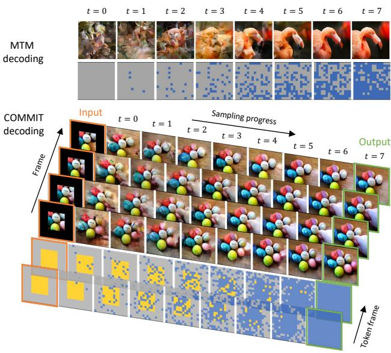  
Figure 3. Comparison between MTM decoding for image [12] and COMMIT decoding for video. We show the output tokens and image/video at each decoding step $t$ , with a central outpainting example for COMMIT. Unlike the MTM denoising decoding from all [MASK], COMMIT performs a conditional generation process toward the output tokens while gradually replacing the interior condition tokens. Videos and tokens are temporally downsampled and stacked for visualization.

Inference. We use a non-autoregressive decoding method to generate video tokens from input conditions in $K$ steps (e.g., 12). Each decoding step follows the COMMIT masking in Eq. (2) with a gradually reduced mask ratio. Algorithm 1 outlines the inference procedure.

Fig. 3 compares the non-autoregressive image decoding [12] and our video decoding procedure. Different from the MTM decoding in [12] which performs denoising from all [MASK], COMMIT decoding starts from a multivariate mask that embeds the interior conditions. Guided by this mask, Algorithm 1 performs a conditional transition process toward the output tokens by replacing a portion of newly generated tokens at each step. In the end, all tokens are predicted where the interior condition tokens get refined.

Table 1. Generation performance on the UCF-101 dataset. Methods in gray are pretrained on additional large video data. Methods with $\checkmark$ in the Class column are class-conditional, while the others are unconditional. Methods marked with \* use custom resolutions, while the others are at $1 2 8 \times 1 2 8$ See Appendix C for more comparisons with earlier works.   

<table><tr><td>Method</td><td>Extra Video</td><td>Class</td><td>FVD↓</td><td>IS↑</td></tr><tr><td>RaMViD [35]</td><td></td><td></td><td>-</td><td>21.71±0.21</td></tr><tr><td>StyleGAN-V* [51]</td><td></td><td></td><td>-</td><td>23.94±0.73</td></tr><tr><td>DIGAN [73]</td><td></td><td></td><td>577±21</td><td>32.70±0.35</td></tr><tr><td>DVD-GAN [15]</td><td></td><td>V</td><td>-</td><td>32.97±1.70</td></tr><tr><td>Video Diffusion* [33]</td><td></td><td></td><td>-</td><td>57.00±0.62</td></tr><tr><td>TATS [21]</td><td></td><td></td><td>420±18</td><td>57.63±0.24</td></tr><tr><td>CCVS+StyleGAN [41]</td><td></td><td></td><td>386±15</td><td>24.47±0.13</td></tr><tr><td>Make-A-Video* [50]</td><td></td><td>✓</td><td>367</td><td>33.00</td></tr><tr><td>TATS [21]</td><td></td><td>✓</td><td>332±18</td><td>79.28±0.38</td></tr><tr><td>CogVideo* [34]</td><td></td><td>✓</td><td>626</td><td>50.46</td></tr><tr><td>Make-A-Video* [50]</td><td></td><td>✓</td><td>81</td><td>82.55</td></tr><tr><td>MAGVIT-B-CG (ours)</td><td></td><td>✓</td><td>159±2</td><td>83.55±0.14</td></tr><tr><td>MAGVIT-L-CG (ours)</td><td></td><td>✓</td><td>76±2</td><td>89.27±0.15</td></tr></table>

# 4. Experimental Results

We conduct extensive experiments to demonstrate the video generation quality (Section 4.2), efficiency (Section 4.3), and flexibility for multi-task generation (Section 4.4). We show a few generation results here, and refer to the web page1 for more examples.

# 4.1. Experimental Setups

Datasets. We evaluate the single-task video generation performance of MAGVIT on three standard benchmarks, i.e., class-conditional generation on UCF-101 [54] and frame prediction on BAIR Robot Pushing [19, 60] (1- frame condition) and Kinetics-600 [10] (5-frame condition). For multi-task video generation, we quantitatively evaluate MAGVIT on BAIR and SSv2 [23] on 8-10 tasks. Furthermore, to evaluate model generalizability, we train models with the same learning recipe on three additional video datasets: nuScenes [9], Objectron [2], and 12M Web videos. We show their generated videos in the main paper and quantitative performance in Appendix C.

Evaluation metrics. We use FVD [60] as our primary evaluation metric. Similar to [21, 33], FVD features are extracted with an I3D model trained on Kinetics-400 [11]. We also report the Inception Score (IS) [49] calculated with a C3D [56] model on UCF-101, and PSNR, SSIM [67], and LPIPS [74] on BAIR. We report the mean and standard deviation for each metric calculated over four runs.

Implementation details. We train MAGVIT to generate 16-frame videos at $1 2 8 \times 1 2 8$ resolution, except for BAIR at $6 4 \times 6 4$ The proposed 3D-VQ model quantizes a video into $4 \times 1 6 \times 1 6$ visual tokens, where the visual codebook size is 1024. We use the BERT transformer [17] to model the token sequence, which includes 1 task prompt, 1 class token, and

Table 2. Frame prediction performance on the BAIR and Kinetics-600 datasets. - marks that the value is unavailable in their paper or incomparable to others. The FVD in parentheses uses a debiased evaluation protocol on BAIR detailed in Appendix B.3. See Appendix C for more comparisons with earlier works.   

<table><tr><td>Method</td><td>K600 FVD↓</td><td>BAIR FVD↓</td></tr><tr><td>CogVideo [34]</td><td>109.2</td><td>-</td></tr><tr><td>CCVS [41]</td><td>55.0±1.0</td><td>99±2</td></tr><tr><td>Phenaki [63]</td><td>36.4±0.2</td><td>97</td></tr><tr><td>TrIVD-GAN-FP [43]</td><td>25.7 ±0.7</td><td>103</td></tr><tr><td>Transframer [44]</td><td>25.4</td><td>100</td></tr><tr><td>MaskViT [26]</td><td>-</td><td>94</td></tr><tr><td>FitVid [4]</td><td></td><td>94</td></tr><tr><td>MCVD [64]</td><td></td><td>90</td></tr><tr><td>NÜWA [69]</td><td></td><td>87</td></tr><tr><td>RaMViD [35]</td><td>16.5</td><td>84</td></tr><tr><td>Video Diffusion [33]</td><td>16.2±0.3</td><td>-</td></tr><tr><td>MAGVIT-B-FP (ours)</td><td>24.5±0.9</td><td>76±0.1 (48±0.1)</td></tr><tr><td>MAGVIT-L-FP (ours)</td><td>9.9±0.3</td><td>62±0.1 (31±0.2)</td></tr></table>

Table 3. Image quality metrics on BAIR frame prediction.   

<table><tr><td>Method</td><td>FVD↓</td><td>PSNR↑</td><td>SSIM↑</td><td>LPIPS↓</td></tr><tr><td>CCVS [41]</td><td>99</td><td>-</td><td>0.729</td><td>-</td></tr><tr><td>MCVD [64]</td><td>90</td><td>16.9</td><td>0.780</td><td>-</td></tr><tr><td>MAGVIT-L-FP (ours)</td><td>62</td><td>19.3</td><td>0.787</td><td>0.123</td></tr></table>

1024 visual tokens. Two variants of MAGVIT, i.e., base (B) with 128M parameters and large (L) with 464M, are evaluated. We train both stages with the Adam optimizer [39] in JAX/Flax [5, 30] on TPUs. Appendix B.2 details training configurations.

# 4.2. Single-Task Video Generation

Class-conditional generation. The model is given a class identifier in this task to generate the full video. Tab. 1 shows that MAGVIT surpasses the previous best-published FVD and IS scores. Notably, it outperforms Make-A-Video [50] which is pretrained on additional 10M videos with a textimage prior. In contrast, MAGVIT is just trained on the 9.5K training videos of UCF-101.

Fig. 4 compares the generated videos to baseline models. We can see that CCVS $^ +$ StyleGAN [41] gets a decent singleframe quality, but yields little or no motion. TATS [21] generates some motion but with artifacts. In contrast, our model produces higher-quality frames with substantial motion.

Frame prediction. The model is given a single or a few frames to generate future frames. In Tab. 2, we compare MAGVIT against highly-competitive baselines. MAGVIT surpasses the previous state-of-the-art FVD on BAIR by a large margin $\mathrm { 8 4 }  \mathrm { 6 2 }$ ). Inspired by [60], a "debiased" FVD is also reported in the parentheses to overcome the small validation set. See more discussion in Appendix B.3. In Tab. 3, it demonstrates better image quality.

On the large dataset of Kinetics-600, it establishes a new state-of-the-art result, improving the previous best FVD in [33] from 16.2 to 9.9 by a relative $3 9 \%$ improvement.

  
Figure 4. Comparison of class-conditional generation samples on UCF-101. 16-frame videos are generated at $1 2 8 \times 1 2 8$ resolution 25 .

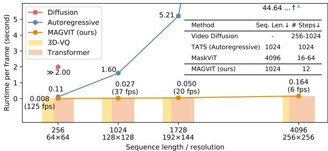  
Figure 5. Inference-time generation efficiency comparison. The average runtime for generating one frame is measured at different resolutions. The colored bars show the time breakdown between the 3D-VQ and the transformer. The embedded table compares the critical factors of inference efficiency for different methods at 16-frame $1 2 8 \times 1 2 8$ , except for Video Diffusion [33] at $6 4 \times 6 4$ .

The above results verify MAGVIT's compelling generation quality, including on the large Kinetics dataset.

# 4.3. Inference-Time Generation Efficiency

Video generation efficiency is an important metric in many applications. We conduct experiments to validate that MAGVIT offers top speed in video generation. Fig. 5 shows the processing time for each frame on a single V100 GPU at different resolutions. We compare MAGVIT-B with an autoregressive transformer of the same size and a diffusionbased model [33]. At $1 2 8 \times 1 2 8$ resolution, MAGVIT-B runs at 37 frames-per-second (fps). When running on a single TPUv4i [36], MAGVIT-B runs at 190 fps and MAGVIT-L runs at 65 fps.

Fig. 5 compares the sequence lengths and inference steps of these models. Diffusion models [33] typically require 256-1000 diffusion steps with a 3D U-Net [14]. Autoregressive models, such as TATS [21], decode visual tokens sequentially, which runs 60 times slower than MAGVIT at $1 2 8 \times 1 2 8$ . Compared to the recent non-autoregressive model MaskViT [26], MAGVIT is 4 to 16 times faster due to more efficient decoding on shorter sequences.

# 4.4. Multi-task Video Generation

To demonstrate the flexibility in multi-task video synthesis, we train a single MAGVIT model to perform eight tasks on BAIR or ten tasks on SSv2. We do not intend to compare with dedicated models trained on these tasks but to demonstrate a generic model for video synthesis.

Eight tasks on BAIR. We perform a multi-task evaluation on BAIR with eight self-supervised tasks. Tab. 4 lists the "debiased" FVD for each task, where the third column computes the average. We compare the multi-task models (MT) with two single-task baselines trained on unconditional generation (UNC) and frame prediction (FP).

As shown in Tab. 4, the multi-task models achieve better fidelity across all tasks. Single-task models perform considerably worse on the tasks unseen in training (gray values in Tab. 4), especially on the tasks that differ more from the training task. Compared to the single-task models in their training task, MT performs better with a small gain on FP with the same model size.

Ten tasks on SSv2. We evaluate on the large-scale SSv2 dataset, where MAGVIT needs to synthesize 174 basic actions with everyday objects. We evaluate a total of ten tasks, with two of them using class labels (CG and CFP), as shown on the right side of Tab. 4. We observe a pattern consistent with BAIR: multi-task models achieve better average FVD across all tasks. The above results substantiate model generalization trained with the proposed multi-task objective.

# 4.5. Ablation Study

Conditional MTM. We demonstrate the efficacy of COMMIT by comparing it with conventional MTM methdirectly unmasks tokens of the condition region at inference time, leads to poor generalization, especially for the multitask setup. Prefix condition produces a long sequence of variable length, making it less tractable for multi-task learning. In contrast, COMMIT yields a fixed-length sequence and better generalizability for both single- and multi-task setups.

V   

<table><tr><td>Method</td><td>Task</td><td>BAIR-MT8↓</td><td>FP</td><td>FI</td><td>OPC</td><td>OPV</td><td>OPH</td><td>OPD</td><td>IPC</td><td>IPD</td><td>SSV2-MT10↓</td><td>CG</td><td>CFP</td></tr><tr><td>MAGVIT-B-UNC</td><td>Single</td><td>150.6</td><td>74.0</td><td>71.4</td><td>119.0</td><td>46.7</td><td>55.9</td><td>389.3</td><td>145.0</td><td>303.2</td><td>258.8</td><td>107.7</td><td>279.0</td></tr><tr><td>MAGVIT-B-FP</td><td>Single</td><td>201.1</td><td>47.7</td><td>56.2</td><td>247.1</td><td>118.5</td><td>142.7</td><td>366.3</td><td>357.3</td><td>272.7</td><td>402.9</td><td>1780.0</td><td>59.3</td></tr><tr><td>MAGVIT-B-MT</td><td>Multi</td><td>32.8</td><td>47.2</td><td>36.0</td><td>28.1</td><td>29.0</td><td>27.8</td><td>32.1</td><td>31.1</td><td>31.0</td><td>43.4</td><td>94.7</td><td>59.3</td></tr><tr><td>MAGVIT-L-MT</td><td>Multi</td><td>22.8</td><td>31.4</td><td>26.4</td><td>21.3</td><td>21.2</td><td>19.5</td><td>20.9</td><td>21.3</td><td>20.3</td><td>27.3</td><td>79.1</td><td>28.5</td></tr></table>

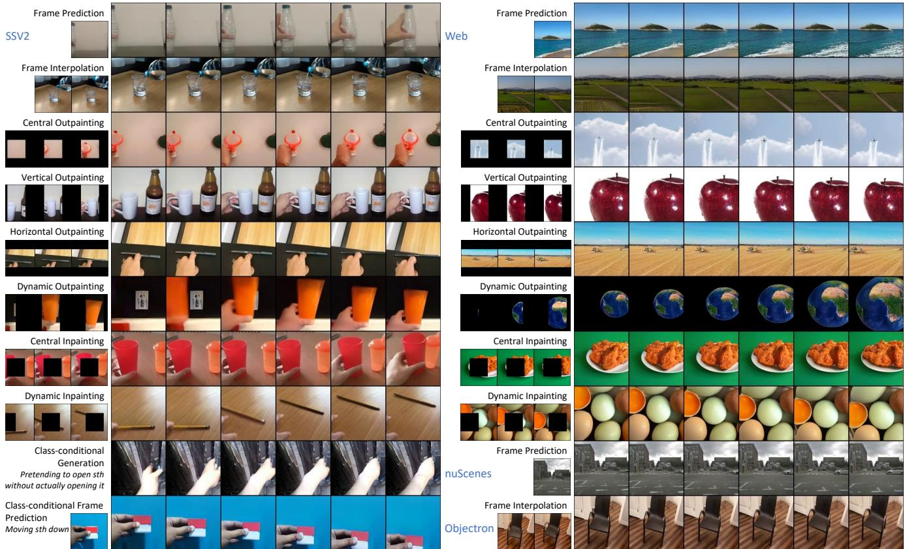  
F u

Table 5. Comparison of conditional masked token modeling on BAIR frame prediction (FP) and eight-task (MT8) benchmarks. - indicates we were not able to train to convergence.   

<table><tr><td colspan="2">Method</td><td>Seq. Length</td><td>FP FVD↓</td><td>MT8 FVD↓</td></tr><tr><td colspan="2">Latent masking in MaskGIT [12] Prefix condition</td><td>1024 1024-1792</td><td>74 55</td><td>151</td></tr><tr><td rowspan="3">COMMIT (ours)</td><td>Lmask</td><td rowspan="3">1024</td><td>388</td><td>- 143</td></tr><tr><td>Lmask + Lrecons</td><td></td><td>53</td></tr><tr><td>Lmask + Lrecons + Crefine</td><td>51 48</td><td>33</td></tr></table>

Training losses. The bottom section of Tab. 5 shows the contribution of the training loss components in Eq. (4).

ods, including the latent masking in MaskGIT for image synthesis [12] and the commonly-used prefix condition that prepends cropped condition tokens to the input sequence.

Tab. 5 compares these methods on the BAIR dataset where the same 3D-VQ tokenizer is used in all approaches. As discussed in Section 3.2, latent masking in [12], which

Decoding methods. Tab. 6 compares Algorithm 1 with existing autoregressive (AR) and non-autoregressive (NAR) decoding methods. We consider two NAR baselines, i.e., MaskGIT [12] for image and MaskViT [26] for video synthesis. We use the same 3D-VQ tokenizer for MaskGIT, AR, and MAGVIT. As shown, the proposed decoding algorithm produces the best quality with the 3D-VQ and has a $4 \times$ shorter sequence than the 2D-VQ. While the AR transformer obtains a reasonable FVD, it takes over $8 5 \times$ more steps at inference time.

Table 6. Comparison of decoding methods on BAIR frame prediction benchmark. The number of parameters is broken down as ${ \mathrm { V Q } } +$ Transformer. NAR is non-autoregressive and AR is autoregressive. FVD and debiased FVD (in parentheses) are reported. \* marks the quoted number from their paper.   

<table><tr><td>Decoding Method Tokenizer</td><td></td><td>Type</td><td>Param.</td><td>Seq. Len.↓ # Steps↓</td><td></td><td>FVD↓</td></tr><tr><td>MaskGIT [12]</td><td>2D-VQ</td><td>NAR</td><td>53M+87M</td><td>4096</td><td>12</td><td>222 (177)</td></tr><tr><td></td><td>3D-VQ</td><td>NAR</td><td>41M+87M</td><td>1024</td><td>12</td><td>122 (74)</td></tr><tr><td>MaskViT [26]</td><td>2D-VQ</td><td>NAR</td><td>53M+189M</td><td>4096</td><td>18</td><td>94*</td></tr><tr><td>AR</td><td>3D-VQ</td><td>AR</td><td>41M+87M</td><td>1024</td><td>1024</td><td>91 (56)</td></tr><tr><td>MAGVIT (ours)</td><td>3D-VQ</td><td>NAR</td><td>41M+87M</td><td>1024</td><td>12</td><td>76 (48)</td></tr></table>

Table 7. Comparison of tokenizer architectures and initialization methods on UCF-101 training set reconstruction results. The 2D-VQ compresses by $8 \times 8$ spatially and the 3D-VQ compresses by $4 \times 8 \times 8$ spatial-temporally.   

<table><tr><td rowspan="2">Tokenizer</td><td rowspan="2">From Scratch FVD↓</td><td rowspan="2">IS↑</td><td colspan="4">ImageNet [16] Initialization</td></tr><tr><td>FVD↓</td><td>IS↑</td><td>FVD↓</td><td>IS↑</td></tr><tr><td>MaskGIT | [12] 2D-VQ</td><td>240</td><td>80.9</td><td>216</td><td>82.6</td><td colspan="2"></td></tr><tr><td>TATS [21] 3D-VQ</td><td>162</td><td>80.6</td><td colspan="2">-</td><td colspan="2"></td></tr><tr><td></td><td></td><td></td><td></td><td>Average</td><td>Central</td><td></td></tr><tr><td>MAGVIT 3D-VQ-B (ours)</td><td>127</td><td>82.1</td><td>103</td><td>84.8</td><td>58</td><td>87.0</td></tr><tr><td>MAGVIT 3D-VQ-L (ours)</td><td>45</td><td>87.1</td><td>35</td><td>88.3</td><td>25</td><td>88.9</td></tr></table>

VQ architecture and training techniques. We evaluate the design options of our 3D-VQ model in MAGVIT. Tab. 7 lists the reconstruction FVD and IS metrics on the UCF-101 training set, which are different from the generation metrics as they measure the intermediate quantization. Nevertheless, reconstruction quality bounds the generation quality.

Tab. 7 compares the proposed 3D architecture with existing 2D [12] and 3D [21] VQ architectures. We train the MaskGIT [12] 2D-VQ and our 3D-VQ with the same protocol and evaluate the official TATS [21] 3D-VQ model. We compare two inflation methods for our 3D-vQ model, i.e., average [11] and central inflation.

The results show the following. First, 3D-VQ models, despite producing a higher compression rate, show better video reconstruction quality than 2D-VQ, even with fewer parameters. Second, the proposed VQ performs favorably against baseline architectures with a similar size and gets much better with a larger model. Third, ImageNet [16] initialization boosts the performance for 2D and 3D models, where the central inflation outperforms the average inflation. The results demonstrate the excellent reconstruction fidelity of our tokenizer design.

# 5. Related Work

GAN-based approaches. Early success in video synthesis has been made by GAN models [1, 6, 7, 15,27,37,48, 51,

55, 58, 65, 73]. Training instability and lack of generation diversity [12] are known issues of GAN models.

Autoregressive transformers. Inspired by the success of GPT [8], autoregressive transformers have been adapted for image [13,18,20,46,72] and video generation [4,34,68,69]. A focus for video is autoregressive modeling of visual dynamics. Studies have switched from modeling the raw pixels [13, 61] to the discrete codes in a latent space [45, 70]. The state-of-the-art model TATS [21] uses two hierarchical transformers to reduce the computation for long video generation, with tokens learned by a 3D-VQGAN [20]. Unlike prior works, we introduce a non-autoregressive transformer with higher efficiency and flexibility.

Non-autoregressive transformers. Concurrently, a few methods use non-autoregressive transformers for image synthesis [?, 12, 42, 75]. Section 2 reviews a state-of-theart model called MaskGIT [12]. Compared with these approaches [26, 28], we present an embedding mask to model multi-task video conditions with better quality.

Diffusion models. Diffusion models have recently received much attention for image synthesis. For example, the state-of-the-art video diffusion model [33] extends the image denoising diffusion model [3, 32, 52, 53, 59] by incorporating 3D U-Net [14] architectures and joint training on both images and videos. Despite its high-quality, sampling speed is a bottleneck hindering the application of diffusion models in video synthesis. We show a different solution to train a highly-efficient model that offers compelling quality.

Multi-task video synthesis. Multi-task video synthesis [28, 44, 69] is yet to be well-studied. Transframer [44] is the closest to our work, which adopts an imagelevel representation for autoregressive modeling of tasks based on frame prediction. We present an efficient nonautoregressive multi-task transformer, and verify the quality and efficiency on ten video generation tasks.

Text-to-video. All of our models are trained only on public benchmarks, except the Web video model. We leave the text-to-video task as future work. As shown in recent works [31, 50, 63], training such models requires large, and sometimes non-public, datasets of paired texts and images.

# 6. Conclusion

In this paper, we propose MAGVIT, a generic and efficient mask-based video generation model. We introduce a high-quality 3D-VQ tokenizer to quantize a video and design COMMIT for multi-task conditional masked token modeling. We conduct extensive experiments to demonstrate the video generation quality, efficiency, and flexibility for multi-task generation. Notably, MAGVIT establishes a new state-of-the-art quality for class conditional generation on UCF-101 and frame prediction on BAIR Robot Pushing and Kinetics-600 datasets.

# References

[1] Dinesh Acharya, Zhiwu Huang, Danda Pani Paudel, and Luc Van Gool. Towards high resolution video generation with progressive growing of sliced wasserstein gans. arXiv:1810.02419, 2018. 8   
[2] Adel Ahmadyan, Liangkai Zhang, Artsiom Ablavatski, Jianing Wei, and Matthias Grundmann. Objectron: A large scale dataset of object-centric videos in the wild with pose annotations. In CVPR, 2021. 2, 5, 7   
[3] Jacob Austin, Daniel Johnson, Jonathan Ho, Daniel Tarlow, and Rianne van den Berg. Structured denoising diffusion models in discrete state-spaces. In NeurIPS, 2021. 8   
[4] Mohammad Babaeizadeh, Mohammad Taghi Saffar, Suraj Nair, Sergey Levine, Chelsea Finn, and Dumitru Erhan. Fitvid: Overfitting in pixel-level video prediction. arXiv:2106.13195, 2021. 5, 8   
[5] James Bradbury, Roy Frostig, Peter Hawkins, Matthew James Johnson, Chris Leary, Dougal Maclaurin, George Necula, Adam Paszke, Jake VanderPlas, Skye Wanderman-Milne, and Qiao Zhang. JAX: composable transformations of Python+NumPy programs, 2018. 5   
[6] Andrew Brock, Jeff Donahue, and Karen Simonyan. Large scale gan training for high fidelity natural image synthesis. In ICLR, 2018. 8   
[7] Tim Brooks, Janne Hellsten, Miika Aittala, Ting-Chun Wang, Timo Aila, Jaakko Lehtinen, Ming-Yu Liu, Alexei A Efros, and Tero Karras. Generating long videos of dynamic scenes. arXiv:2206.03429, 2022. 8   
[8] Tom Brown, Benjamin Mann, Nick Ryder, Melanie Subbiah, Jared D Kaplan, Prafulla Dhariwal, Arvind Neelakantan, Pranav Shyam, Girish Sastry, Amanda Askell, et al. Language models are few-shot learners. In NeurIPS, 2020. 8   
[9] Holger Caesar, Varun Bankiti, Alex H Lang, Sourabh Vora, Venice Erin Liong, Qiang Xu, Anush Krishnan, Yu Pan, Giancarlo Baldan, and Oscar Beijbom. nuScenes: A multimodal dataset for autonomous driving. In CVPR, 2020. 2, 5, 7   
[10] Joao Carreira, Eric Noland, Andras Banki-Horvath, Chloe Hillier, and Andrew Zisserman. A short note about Kinetics600. arXiv:1808.01340, 2018. 2, 5   
[11] Joao Carreira and Andrew Zisserman. Quo vadis, action recognition? a new model and the Kinetics dataset. In CVPR, 2017. 3, 5, 8   
[12] Huiwen Chang, Han Zhang, Lu Jiang, Ce Liu, and William T Freeman. MaskGIT: Masked generative image transformer. In CVPR, 2022. 1, 2, 3, 4, 7, 8   
[13] Mark Chen, Alec Radford, Rewon Child, Jeffrey Wu, Heewoo Jun, David Luan, and Ilya Sutskever. Generative pretraining from pixels. In ICML, 2020. 8   
14] Özgün Ciçek, Ahmed Abdulkadir, Soeren S Lienkamp, Thomas Brox, and Olaf Ronneberger. 3D U-Net: learning dense volumetric segmentation from sparse annotation. In MICCAI, 2016. 6, 8   
[15] Aidan Clark, Jeff Donahue, and Karen Simonyan. Adversarial video generation on complex datasets. arXiv:1907.06571, 2019. 1, 5, 8   
[16] Jia Deng, Wei Dong, Richard Socher, Li-Jia Li, Kai Li, and Li Fei-Fei. ImageNet: A large-scale hierarchical image database. In CVPR, 2009. 8   
[17] Jacob Devlin, Ming-Wei Chang, Kenton Lee, and Kristina Toutanova. BERT: Pre-training of deep bidirectional transformers for language understanding. In NAACL, 2019. 2, 5   
[18] Ming Ding, Zhuoyi Yang, Wenyi Hong, Wendi Zheng, Chang Zhou, Da Yin, Junyang Lin, Xu Zou, Zhou Shao, Hongxia Yang, et al. CogView: Mastering text-to-image generation via transformers. In NeurIPS, 2021. 1, 8   
[19] Frederik Ebert, Chelsea Finn, Alex X Lee, and Sergey Levine. Self-supervised visual planning with temporal skip connections. In CoRL, 2017. 2, 5   
[20] Patrick Esser, Robin Rombach, and Bjorn Ommer. Taming transformers for high-resolution image synthesis. In CVPR, 2021. 1, 2, 3, 8   
[21] Songwei Ge, Thomas Hayes, Harry Yang, Xi Yin, Guan P David Jacobs, Jia-Bin Huang, and Devi Parik. Long video generation with time-agnostic VQGAN and timesensitive transformer. In ECCV, 2022. 1, 2, 3, 5, 6, 8   
[22] Marjan Ghazvininejad, Omer Levy, Yinhan Liu, and Luke Zettlemoyer. Mask-Predict: Parallel decoding of conditional masked language models. In EMNLP-IJCNLP, 2019. 2   
[23] Raghav Goyal, Samira Ebrahimi Kahou, Vincent Michalski, Joanna Materzynska, Susanne Westphal, Heuna Kim, Valentin Haenel, Ingo Fruend, Peter Yianilos, Moritz Mueller-Freitag, et al. The "something something" video database for learning and evaluating visual common sense. In ICCV, 2017. 2, 5, 7   
[24] Jiatao Gu and Xiang Kong. Fully non-autoregressive neural machine translation: Tricks of the trade. In ACL-IJCNLP Findings, 2021. 2   
[25] Shuyang Gu, Dong Chen, Jianmin Bao, Fang Wen, Bo Zhang, Dongdong Chen, Lu Yuan, and Baining Guo. Vector quantized diffusion model for text-to-image synthesis. In CVPR, 2022. 1, 2   
[26] Agrim Gupta, Stephen Tian, Yunzhi Zhang, Jiajun Wu, Roberto Martín-Martín, and Li Fei-Fei. MaskViT: Masked visual pre-training for video prediction. arXiv:2206.11894, 2022. 2, 3, 5, 6, 7, 8   
[27] Sonam Gupta, Arti Keshari, and Sukhendu Das. RV-GAN: Recurrent GAN for unconditional video generation. In CVPRW, 2022. 8   
[28] Ligong Han, Jian Ren, Hsin-Ying Lee, Francesco Barbieri, Kyle Olszewski, Shervin Minaee, Dimitris Metaxas, and Sergey Tulyakov. Show me what and tell me how: Video synthesis via multimodal conditioning. In CVPR, 2022. 2, 8   
[29] Kaiming He, Xiangyu Zhang, Shaoqing Ren, and Jian Sun. Deep residual learning for image recognition. In CVPR, 2016. 3   
[30] Jonathan Heek, Anselm Levskaya, Avital Oliver, Marvin Ritter, Bertrand Rondepierre, Andreas Steiner, and Marc van Zee. Flax: A neural network library and ecosystem for JAX, 2020.5   
[31] Jonathan Ho, William Chan, Chitwan Saharia, Jay Whang, Ruiqi Gao. Alexey Gritsenko. Diederik P Kingma. Ben Poole, Mohammad Norouzi, David J Fleet, et al. Imagen video: High definition video generation with diffusion models. arXiv:2210.02303, 2022. 8   
[32] Jonathan Ho, Ajay Jain, and Pieter Abbeel. Denoising diffusion probabilistic models. In NeurIPS, 2020. 8   
[33] Jonathan Ho, Tim Salimans, Alexey Gritsenko, William Chan, Mohammad Norouzi, and David J Fleet. Video diffusion models. In ICLR Workshops, 2022. 1, 2, 5, 6, 8   
[34] Wenyi Hong, Ming Ding, Wendi Zheng, Xinghan Liu, and Jie Tang. CogVideo: Large-scale pretraining for text-tovideo generation via transformers. arXiv:2205.15868, 2022. 5,8   
[35] Tobias Höppe, Arash Mehrjou, Stefan Bauer, Didrik Nielsen, and Andrea Dittadi. Diffusion models for video prediction and infilling. arXiv:2206.07696, 2022. 1, 2, 5   
[36] Norman P Jouppi, Doe Hyun Yoon, Matthew Ashcraft, Mark Gottscho, Thomas B Jablin, George Kurian, James Laudon, Sheng Li, Peter Ma, Xiaoyu Ma, et al. Ten lessons from three generations shaped google's TPUv4i. In ISCA, 2021. 2, 6   
[37] Emmanuel Kahembwe and Subramanian Ramamoorthy. Lower dimensional kernels for video discriminators. Neural Networks, 132:506520, 2020. 8   
[38] Tero Karras, Samuli Laine, and Timo Aila. A style-based generator architecture for generative adversarial networks. In CVPR, 2019. 3   
[39] Diederik P Kingma and Jimmy Ba. Adam: A method for stochastic optimization. arXiv:1412.6980, 2014. 5   
[40] Xiang Kong, Lu Jiang, Huiwen Chang, Han Zhang, Yuan Hao, Haifeng Gong, and Irfan Essa. BLT: Bidirectional layout transformer for controllable layout generation. In ECCV, 2022. 2   
[41] Guillaume Le Moing, Jean Ponce, and Cordelia Schmid. CCVS: Context-aware controllable video synthesis. In NeurIPS, 2021. 1, 3, 5, 6   
[42] José Lezama, Huiwen Chang, Lu Jiang, and Irfan Essa. Improved masked image generation with Token-Critic. In ECCV, 2022. 2, 8   
[43] Pauline Luc, Aidan Clark, Sander Dieleman, Diego de Las Casas, Yotam Doron, Albin Cassirer, and Karen Simonyan. Transformation-based adversarial video prediction on largescale data. arXiv:2003.04035, 2020. 1, 5   
[44] Charlie Nash, João Carreira, Jacob Walker, Iain Barr, Andrew Jaegle, Mateusz Malinowski, and Peter Battaglia. Transframer: Arbitrary frame prediction with generative models. arXiv:2203.09494, 2022. 1, 5, 8   
[45] Ruslan Rakhimov, Denis Volkhonskiy, Alexey Artemov, Denis Zorin, and Evgeny Burnaev. Latent video transformer. In VISIGRAPP (5: VISAPP), 2021. 1, 8   
[46] Aditya Ramesh, Mikhail Pavlov, Gabriel Goh, Scott Gray, Chelsea Voss, Alec Radford, Mark Chen, and Ilya Sutskever. Zero-shot text-to-image generation. In ICML, 2021. 1, 2, 8   
[47] Robin Rombach, Andreas Blattmann, Dominik Lorenz, Patrick Esser, and Björn Ommer. High-resolution image synthesis with latent diffusion models. In CVPR, 2022. 1   
[48] Masaki Saito, Eiichi Matsumoto, and Shunta Saito. Temporal generative adversarial nets with singular value clipping. I IC0v 2017 1 0 [49] Masaki Saito, Shunta Saito, Masanori Koyama, and Sosuke Kobayashi. Train sparsely, generate densely: Memoryefficient unsupervised training of high-resolution temporal gan. IJCV, 128(10):25862606, 2020. 1, 5 [50] Uriel Singer, Adam Polyak, Thomas Hayes, Xi Yin, Jie An, Songyang Zhang, Qiyuan Hu, Harry Yang, Oron Ashual, Oran Gafni, et al. Make-a-video: Text-to-video generation without text-video data. arXiv:2209.14792, 2022. 5, 8 [51] Ivan Skorokhodov, Sergey Tulyakov, and Mohamed Elhoseiny. StyleGAN-V: A continuous video generator with the price, image quality and perks of StyleGAN2. In CVPR,   
2022. 5, 8 [52] Jascha Sohl-Dickstein, Eric Weiss, Niru Maheswaranathan, and Surya Ganguli. Deep unsupervised learning using nonequilibrium thermodynamics. In ICML, 2015. 8 [53] Yang Song and Stefano Ermon. Generative modeling by estimating gradients of the data distribution. In NeurIPS, 2019.   
8 [54] Khurram Soomro, Amir Roshan Zamir, and Mubarak Shah. UCF101: A dataset of 101 human actions classes from videos in the wild. arXiv:1212.0402, 2012. 2, 3, 5 [55] Yu Tian, Jian Ren, Menglei Chai, Kyle Olszewski, Xi Peng, Dimitris N Metaxas, and Sergey Tulyakov. A good image generator is what you need for high-resolution video synthesis. In ICLR, 2021. 8 [56] Du Tran, Lubomir Bourdev, Rob Fergus, Lorenzo Torresani, and Manohar Paluri. Learning spatiotemporal features with   
3D convolutional networks. In ICCV, 2015. 5 [57] Hung-Yu Tseng, Lu Jiang, Ce Liu, Ming-Hsuan Yang, and Weilong Yang. Regularizing generative adversarial networks under limited data. In CVPR, 2021. 3 [58] Sergey Tulyakov, Ming-Yu Liu, Xiaodong Yang, and Jan Kautz. MoCoGAN: Decomposing motion and content for video generation. In CVPR, 2018. 1, 8 [59] Belinda Tzen and Maxim Raginsky. Neural stochastic differential equations: Deep latent gaussian models in the diffusion limit. arXiv:1905.09883, 2019. 8 [60] Thomas Unterthiner, Sjoerd van Steenkiste, Karol Kurach, Raphael Marinier, Marcin Michalski, and Sylvain Gelly. Towards accurate generative models of video: A new metric & challenges. arXiv:1812.01717, 2018. 1, 2, 5 [61] Aäron van den Oord, Nal Kalchbrenner, and Koray Kavukcuoglu. Pixel recurrent neural networks. In ICML,   
2016.8 [62] Aaron Van Den Oord, Oriol Vinyals, et al. Neural discrete representation learning. In NeurIPS, 2017. 2 [63] Ruben Villegas, Mohammad Babaeizadeh, Pieter-Jan Kindermans, Hernan Moraldo, Han Zhang, Mohammad Taghi Saffar, Santiago Castro, Julius Kunze, and Dumitru Erhan. Phenaki: Variable length video generation from open domain textual description. arXiv:2210.02399, 2022. 5, 8 [64] Vikram Voleti, Alexia Jolicoeur-Martineau, and Christopher Pal. Masked conditional video diffusion for prediction, generation, and interpolation. In NeurIPS, 2022. 1, 5 [65] Carl Vondrick, Hamed Pirsiavash, and Antonio Torralba. Generating videos with scene dynamics. In NeurIPS, 2016.   
1,8   
[66] Wenhui Wang, Hangbo Bao, Li Dong, Johan Bjorck, Zhiliang Peng, Qiang Liu, Kriti Aggarwal, Owais Khan Mohammed, Saksham Singhal, Subhojit Som, et al. Image as a foreign language: BEiT pretraining for all vision and visionlanguage tasks. arXiv:2208.10442, 2022. 2   
[67] Zhou Wang, Alan C Bovik, Hamid R Sheikh, and Eero P Simoncelli. Image quality assessment: from error visibility to structural similarity. IEEE TIP, 13(4):600612, 2004. 5   
[68] Dirk Weissenborn, Oscar Täckström, and Jakob Uszkoreit. Scaling autoregressive video models. In ICLR, 2019. 1, 8   
[69] Chenfei Wu, Jian Liang, Lei Ji, Fan Yang, Yuejian Fang, Daxin Jiang, and Nan Duan. NÜWA: Visual synthesis pretraining for neural visual world creation. In ECCV, 2022. 1, 5,8   
[70] Wilson Yan, Yunzhi Zhang, Pieter Abbeel, and Aravind Srinivas. VideoGPT: Video generation using vq-vae and transformers. arXiv:2104.10157, 2021. 2, 3, 8   
[71] Jiahui Yu, Xin Li, Jing Yu Koh, Han Zhang, Ruoming Pang, James Qin, Alexander Ku, Yuanzhong Xu, Jason Baldridge, and Yonghui Wu. Vector-quantized image modeling with improved VQGAN. In ICLR, 2022. 2   
[72] Jiahui Yu, Yuanzhong Xu, Jing Yu Koh, Thang Luong, Gunjan Baid, Zirui Wang, Vijay Vasudevan, Alexander Ku, Yinfei Yang, Burcu Karagol Ayan, et al. Scaling autoregressive models for content-rich text-to-image generation. arXiv:2206.10789, 2022. 1, 8   
[73] Sihyun Yu, Jihoon Tack, Sangwoo Mo, Hyunsu Kim, Junho Kim, Jung-Woo Ha, and Jinwoo Shin. Generating videos with dynamics-aware implicit generative adversarial networks. In ICLR, 2022. 5, 8   
[74] Richard Zhang, Phillip Isola, Alexei A Efros, Eli Shechtman, and Oliver Wang. The unreasonable effectiveness of deep features as a perceptual metric. In CVPR, 2018. 5   
[75] Zhu Zhang, Jianxin Ma, Chang Zhou, Rui Men, Zhikang Li, Ming Ding, Jie Tang, Jingren Zhou, and Hongxia Yang. M6- UFC: Unifying multi-modal controls for conditional image synthesis. arXiv:2105.14211, 2021. 2, 8

# MAGVIT: Masked Generative Video Transformer Supplementary Materials

# Acknowledgements

The authors would like to thank Tom Duerig, Victor Gomes, Paul Natsev along with the Multipod committee for sponsoring the computing resources. We appreciate valuable feedback and leadership support from David Salesin, Jay Yagnik, Tomas Izo, and Rahul Sukthankar thoughout the project. Special thanks to Wolfgang Macherey for supporting the project. We thank David Alexander Ross and Yu-Chuan Su for many helpful comments for improving the paper. We also give thanks to Sarah Laszlo and Hugh Williams for creating the MAGVIT model card, Bryan Seybold and Albert Shaw for extending the features, Jonathan Ho and Tim Salimans for providing the JAX code pointer for FVD computation, and the Scenic team for the infrastructure support. We are thankful to Wenhe Liu, Xinyu Yao, Mingzhi Cai, Yizhi Zhang, and Zhao Jin for proof reading the paper. This project is funded in part by Carnegie Mellon University's Mobility21 National University Transportation Center, which is sponsored by the US Department of Transportation.

# Appendix Overview

This supplementary document provides additional details to support our main manuscript, organized as follows:

• Appendix A presents the 3D-VQ architectures and the transformer models in MAGVIT.   
•Appendix B includes additional implementation details in training and evaluation.   
• Appendix C provides more quantitative evaluation results, which include: Comparisons to more published results on the three benchmarks in the paper: UCF-101 [31], BAIR [12, 35], and Kinetics-600 [6]. Multi-task results on Something-Something-v2 (SSv2) [14]. Results on three additional datasets: NuScenes [5], Objectron [3] and Web video datasets.   
•Appendix D shows more qualitative examples of the generated videos.

We present a demo video for MAGVIT and show more generated examples on this web page1

# A. MAGVIT Model Architecture

# A.1. 3D-VQ Tokenizer

Fig. 7 shows the architectures of the MAGVIT 3DVQ module and compares it with the 3D-VQ module in TATS [13] which held the previous state-of-the-art for video generation. Compared with TATS, the major design choices in MAGVIT 3D-VQ are listed below.

• Average pooling, instead of strided convolution, is used for down-sampling.   
• Nearest resizing and convolution are used for upsampling.   
• We use spatial down- and up-sampling layers near the latent space and spatial-temporal down- and upsampling layers near the pixel space, resulting in mirrored encoder-decoder architecture.   
• A single deeper 3D discriminator is designed rather than two shallow discriminators for 2D and 3D separately.   
•We quantize into a much smaller vocabulary of 1,024 as compared to 16,384.   
•We use group normalization [42] instead of batch normalization [20] and Swish [26] activation function instead of SiLU [16].   
•We use the LeCAM regularization [?] to improve the training stability and quality.

The quantitative comparison of the 3D-VQ from TATS and MAGVIT were presented in Table 6 of the main paper. In addition, Fig. 9 below qualitatively compares their reconstruction quality on UCF-101. Figs. 10 and 11 show MAGVIT's high-quality reconstruction on example YouTube videos.

We design two variants of the MAGVIT 3D-VQ module, i.e., the base (B) with 41M parameters and the large (L) with 158M parameters, excluding the discriminators.

# A.2. Transformer

MAGVIT uses the BERT transformer architecture [10] adapted from the Flaxformer implementation2. Following the transformer configurations in ViT [11], we use two variants of transformers, i.e., base (B) with 87M parameters and large (L) with 306M in all our experiments. Tab. 8 lists the detailed configurations for each variant. A huge $\mathrm { ( H ) }$ transformer is only used to train on the large Web video dataset and generate demo videos.

  
DVQ e  eeMAGVIT  he TTS [h  oc i of $1 2 8 \times 1 2 8$ resolution into $4 \times 1 6 \times 1 6$ tokens. The number of parameters in parentheses are broken down between VQVAE and discriminators.

# B. Implementation Details

# B.1. Task Definitions

We employ a total of ten tasks for multi-task video generation. Each task is characterized by a few adjustable settings such as interior condition shape, padding function, and optionally prefix condition. Fig. 8 illustrates the interior condition regions for each task under the above setup. Given a video of shape $T \times H \times W$ , we define the tasks as following:

Frame Prediction (FP) Interior condition: $t$ frames at the beginning; $t = 1$ . Padding: replicate the last given frame.   
Frame Interpolation (FI) Interior condition: $t _ { 1 }$ frames at the beginning and $t _ { 2 }$ frames at the end; $t _ { 1 } = 1$ , $t _ { 2 } = 1$ . Padding: linear interpolate between the last given

frame at the beginning and the first given frame at the end.

Central Outpainting (OPC) Interior condition: a rectangle at the center with height $h$ and width $w$ $h = 0 . 5 H$ , $w = 0 . 5 W$ . Padding: pad the nearest pixel for each location (edge padding).

Vertical Outpainting (OPV)

Interior condition: a centered vertical strip with width $w$ ; $w = 0 . 5 W$ .   
Padding: edge padding.

Horizontal Outpainting (OPH)

Interior condition: a centered horizontal strip with height $h$ ; $h = 0 . 5 H$ .   
Padding: edge padding.

Dynamic Outpainting (OPD)

Interior condition: a moving vertical strip with width $w$ ; $w = 0 . 5 W$ .   
Direction of movement: left to right.   
Padding: zero padding.

Table 8. Transformer architecture configurations used in MAGVIT.   

<table><tr><td>Model</td><td>Param.</td><td># heads</td><td># layers</td><td>Hidden size</td><td>MLP dim</td></tr><tr><td>MAGVIT-B</td><td>87M</td><td>12</td><td>12</td><td>768</td><td>3072</td></tr><tr><td>MAGVIT-L</td><td>305 M</td><td>16</td><td>24</td><td>1024</td><td>4096</td></tr><tr><td>MAGVIT-H</td><td>634 M</td><td>16</td><td>32</td><td>1280</td><td>5120</td></tr></table>

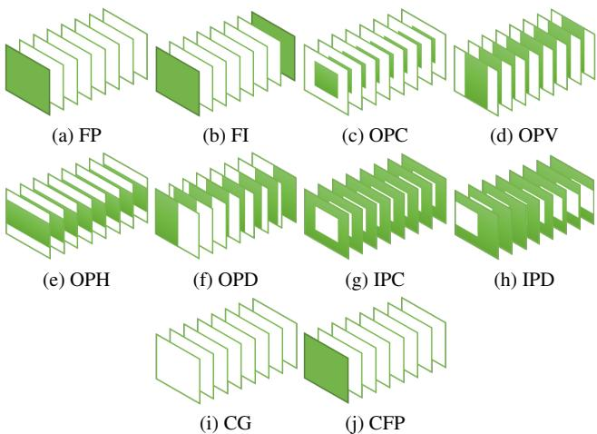  
Figure 8. Interior condition regions for each task, where green denotes valid pixels and white pixels denote the task-specific paddings discussed in Appendix B.1. The tasks are Frame Prediction (FP), Frame Interpolation (FI), Central Outpainting (OPC), Vertical Outpainting (OPV), Horizontal Outpainting (OPH), Dynamic Outpainting (OPD), Central Inpainting (IPC), Dynamic Inpainting (IPD), Class-conditional Generation (CG), and Classconditional Frame Prediction (CFP).

Central Inpainting (IPC)

Interior condition: everything but a rectangle at the center with height $h$ and width $w$ ; $h \ : = \ : 0 . 5 H$ , $w =$ $0 . 5 W$ .   
Padding: zero padding.

Dynamic Inpainting (IPD)

Interior condition: everything but a vertically centered moving rectangle with height $h$ and width $w$ $h \ =$ $0 . 5 H$ , $w = 0 . 5 W$ .   
Direction of movement: left to right.   
Padding: zero padding.

Class-conditional Generation (CG) Prefix condition: class label.

•Class-conditional Frame Prediction (CFP) Prefix condition: class label. Interior condition: $t$ frames at the beginning; $t = 1$ . Padding: replicate the last given frame.

# B.2. Training

MAGVIT is trained in two stages where we first train the 3D-VQ tokenizer and then train the transformer with a frozen tokenizer. We follow the same learning recipe across all datasets, with the only variation in the number of training epochs. Here are the training details for both stages:

3D-VQ:

Video: 16 frames, frame stride 1, $1 2 8 \times 1 2 8$ resolution. ( $6 4 \times 6 4$ resolution for BAIR)   
Base channels: 64 for B, 128 for L. VQVAE channel multipliers: 1, 2, 2, 4. (1, 2, 4 for $6 4 \times 6 4$ resolution).   
Discriminator channel multipliers: 2, 4, 4, 4, 4. (2, 4, 4, 4 for $6 4 \times 6 4$ resolution)   
Latent shape: $4 \times 1 6 \times 1 6$ .   
-Vocabulary size: 1,024.   
Embedding dimension: 256.   
Initialization: central inflation from a 2D-VQ trained on ImageNet with this setup.   
Peak learning rate: $1 0 ^ { - 4 }$ .   
Learning rate schedule: linear warm up and cosine decay. Optimizer: Adam with $\beta _ { 1 } = 0$ and $\beta _ { 2 } = 0 . 9 9$ . Generator loss type: Non-saturating. Generator adversarial loss weight: 0.1. Perceptual loss weight: 0.1. Discriminator gradient penalty: r1 with cost 10. EMA model decay rate: 0.999. Batch size: 128 for B, 256 for L.   
Speed: 0.41 steps/sec on 16 TPU-v2 chips for B, 0.56 steps/sec on 32 TPU-v4 chips for L.

Transformer: Sequence length: 1026. Hidden dropout rate: 0.1. Attention dropout rate: 0.1. Mask rate schedule: cosine. Peak learning rate: $1 0 ^ { - 4 }$ . Learning rate schedule: linear warm up and cosine decay. Optimizer: Adam with $\beta _ { 1 } = 0 . 9$ and $\beta _ { 2 } = 0 . 9 6$ . Weight decay 0.045. Label smoothing: $1 0 ^ { - 4 }$ . Max gradient norm: 1. Batch size: 256. Speed: 1.24 steps/sec on 16 TPU-v2 chips for B, 2.70 steps/sec on 32 TPU-v4 chips for L.

Using more hardware resources can speed up the training. We train MAGVIT models for each dataset separately.

Table 9. Training epochs for each dataset.   

<table><tr><td rowspan="2">Dataset</td><td colspan="2">3D-VQ</td><td colspan="2">Transformer</td></tr><tr><td>B</td><td>L</td><td>B</td><td>L</td></tr><tr><td>UCF-101</td><td>500</td><td>2000</td><td>2000</td><td>2000</td></tr><tr><td>BAIR</td><td>400</td><td>800</td><td>400</td><td>800</td></tr><tr><td>BAIR-MT</td><td>400</td><td>800</td><td>1200</td><td>1600</td></tr><tr><td>Kinetics-600</td><td>45</td><td>180</td><td>180</td><td>360</td></tr><tr><td>SSv2</td><td>135</td><td>400</td><td>720</td><td>1440</td></tr><tr><td>nuScenes</td><td>1280</td><td>5120</td><td>2560</td><td>10240</td></tr><tr><td>Objectron</td><td>1000</td><td>2000</td><td>1000</td><td>2000</td></tr><tr><td>Web</td><td>5</td><td>20</td><td>10</td><td>20</td></tr></table>

The training epochs for each dataset are listed in Tab. 9.

# B.3. Evaluation

Evaluation metrics. The FVD [35] is used as the primary evaluation metric. We follow the official implementation3 in extracting video features with an I3D model trained on Kinetics-400 [7]. We report Inception Score (IS) $\boldsymbol { [ 2 8 ] ^ { 4 } }$ on the UCF-101 dataset which is calculated with a C3D [33] model trained on UCF-101. We further include image quality metrics: PSNR, SSIM [39] and LPIPS [45] (computed by the VGG features) on the BAIR dataset.

Sampling protocols. We follow the sampling protocols from previous works [9, 13] when eveluating on the standard benchmarks, i.e. UCF-101, BAIR, and Kinetics-600. We sample 16-frame clips from each dataset without replacement to form the real distribution in FVD and extract condition inputs from them to feed to the model. We continuously run through all the samples required (e.g., 40,000 for UCF-101) with a single data loader and compute the mean and standard deviation for 4 folds. When evaluating on other datasets, due to the lack of prior works, we adapt the above protocol based on the dataset size to ensure sample diversity.

For our MAGVIT model, we use the following COMMIT decoding hyperparameters by default: cosine schedule, 12 steps, temperature 4.5. Below are detailed setups for each dataset:

UCF-101:

- Dataset: $9 . 5 \mathrm { K }$ videos for training, 101 classes.   
Number of samples: $1 0 { , } 0 0 0 { \times } 4$ .   
- Resolution: $1 2 8 \times 1 2 8$ .   
Real distribution: random clips from the training videos.

BAIR:

Dataset: 43K videos for training and 256 videos for evaluation.   
Number of samples: $2 5 { , } 6 0 0 { \times } 4$ .   
- Resolution: $6 4 \times 6 4$ .   
Real distribution: the first 16-frame clip from each evaluation video.   
- COMMIT decoding: exponential schedule, temperature 400.

Kinetics-600:

Dataset: 384K videos for training and 29K videos for evaluation.   
Number of samples: $5 0 { , } 0 0 0 { \times } 4$ .   
Generation resolution: $1 2 8 \times 1 2 8$ .   
Evaluation resolution: $6 4 \times 6 4$ , via central crop and bilinear resize.   
Real distribution: 6 sampled clips (2 temporal windows and 3 spatial crops) from each evaluation video.   
COMMIT decoding: uniform schedule, temperature 7.5.

SSv2:

Dataset: 169K videos for training and 24K videos for evaluation, 174 classes.   
Number of samples: $5 0 { , } 0 0 0 { \times } 4$ .   
- Resolution: $1 2 8 \times 1 2 8$ .   
Real distribution for the CG task: random clips from the training videos.   
Real distribution for the other tasks: 2 sampled clips (2 temporal windows and central crop) from each evaluation video.

nuScenes:

Dataset: 5.4K videos for training and 0.6K videos for evaluation, front camera only, 32 frames per video.   
Number of samples: $5 0 { , } 0 0 0 { \times } 4$ .   
- Resolution: $1 2 8 \times 1 2 8$ .   
Real distribution: 48 sampled clips (16 temporal windows and 3 spatial crops) from each evaluation video.

Objectron:

Dataset: 14.4K videos for training and 3.6K videos for evaluation.   
Number of samples: $5 0 { , } 0 0 0 { \times } 4$ .   
Resolution: $1 2 8 \times 1 2 8$ .   
Real distribution: 5 sampled clips (5 temporal windows and central crop) from each evaluation video.

Web videos:

- Dataset: ${ \sim } 1 2 \mathbf { M }$ videos for training and 26K videos for evaluation.   
Number of samples: $5 0 { , } 0 0 0 { \times } 4$ .   
Resolution: $1 2 8 \times 1 2 8$ .   
Real distribution: randomly sampled clips from evaluation videos.

For the "random clips" above, we refer to the combination of a random temporal window and a random spatial crop on a random video. For the fixed number of "temporal windows" or "spatial crops", deterministic uniform sampling is used.

Table 10. Generation performance on the UCF-101 dataset. Methods in gray are pretrained on additional large video data. Methods with $\checkmark$ in the Class column are class-conditional, while the others are unconditional. Methods marked with \* use custom resolutions, while the others are at $1 2 8 \times 1 2 8$ . Methods marked with #additionally used the test set in training.   

<table><tr><td>Extra Method Class Video</td></tr><tr><td>FVD↓ IS↑ 8.31±0.09</td></tr><tr><td>VGAN [38] TGAN [27] 11.85±0.07</td></tr><tr><td>MoCoGAN* [34] 12.42±0.07</td></tr><tr><td>ProgressiveVGAN [2] 14.56±0.05</td></tr><tr><td>TGAN [27] 15.83±0.18</td></tr><tr><td>RaMViD [19] 21.71±0.21</td></tr><tr><td>LDVD-GAN [21] 22.91±0.19</td></tr><tr><td>StyleGAN-V*# b [30] 23.94±0.73</td></tr><tr><td>VideoGPT [43] 24.69±0.30 -</td></tr><tr><td>TGANv2 [28] 1209±28 28.87±0.67</td></tr><tr><td>MoCoGAN-HD# [32] 838 32.36</td></tr><tr><td>DIGAN [44] 655±22 29.71±0.53</td></tr><tr><td>DIGAN# [44] 577±21 32.70±0.35</td></tr><tr><td>DVD-GAN# [9] √ 32.97±1.70</td></tr><tr><td>Video Diffusion*# [17] 57.00±0.62</td></tr><tr><td>TATS [13] 420±18 57.63±0.24</td></tr><tr><td>CCVS+StyleGAN# [22] 386±15 24.47±0.13</td></tr><tr><td>Make-A-Video* [29] 367 33.00 V</td></tr><tr><td>TATS [13] ✓ 332±18 79.28±0.38</td></tr><tr><td>CogVideo* [18] √ 626 50.46</td></tr><tr><td>Make-A-Video* [29] 81 82.55 √</td></tr><tr><td>MAGVIT-B-CG (ours) 159±2 ✓ 83.55±0.14 MAGVIT-L-CG (ours) ✓ 76±2 89.27±0.15</td></tr></table>

For the image quality metrics on BAIR in Table 3 of the main paper, CCVS [22] generates at $2 5 6 \times 2 5 6$ while the others are at $6 4 \times 6 4$ When calculating PSNR and SSIM, we follow [37] in using the best value from 100 trials for each evaluation video.

Debiased FVD on BAIR Computing FVD is difficult on the BAIR dataset due to its small evaluation target of only 256 16-frame clips. Following the standard evaluation protocol, we generate 100 predictions for each clip to create 256,00 samples [4].

The real distribution to compute FVD in this way is highly biased with the insufficient evaluation videos [35]. We can see this by a simple experiment where we compute the training FVD with only 256 training videos. We observe that this 256-sample training FVD (64) is far worse than the regular training FVD with all 43K videos (13), showing the biased FVD computation.

Table 11. Frame prediction performance on the BAIR and Kinetics-600 datasets. - marks that the value is unavailable in their paper or incomparable to others. The FVD in parentheses uses a debiased evaluation protocol on BAIR detailed in Appendix B.3. Methods marked with \* is pretrained on additional large video data.   

<table><tr><td>Method</td><td>K600 FVD↓</td><td>BAIR FVD↓</td></tr><tr><td>LVT [25]</td><td>224.7</td><td>126±3</td></tr><tr><td>Video Transformer [40]</td><td>170.0±5.0</td><td>94±2</td></tr><tr><td>CogVideo* [18]</td><td>109.2</td><td>-</td></tr><tr><td>DVD-GAN-FP [9]</td><td>69.1±1.2</td><td>110</td></tr><tr><td>CCVS [22]</td><td>55.0±1.0</td><td>99±2</td></tr><tr><td>Phenaki [36]</td><td>36.4±0.2</td><td>97</td></tr><tr><td>VideoGPT [43]</td><td>-</td><td>103</td></tr><tr><td>TrIVD-GAN-FP [23]</td><td>25.7±0.7</td><td>103</td></tr><tr><td>Transframer [24]</td><td>25.4</td><td>100</td></tr><tr><td>MaskViT [15]</td><td>-</td><td>94</td></tr><tr><td>FitVid [4]</td><td>-</td><td>94</td></tr><tr><td>MCVD [37]</td><td>-</td><td>90</td></tr><tr><td>NUWA [41]</td><td>-</td><td>87</td></tr><tr><td>RaMViD [19]</td><td>16.5</td><td>84</td></tr><tr><td>Video Diffusion [17]</td><td>16.2±0.3</td><td>-</td></tr><tr><td>MAGVIT-B-FP (ours)</td><td>24.5±0.9</td><td>76±0.1 (47±0.1)</td></tr><tr><td>MAGVIT-L-FP (ours)</td><td>9.9±0.3</td><td>62±0.1 (31±0.2)</td></tr></table>

To bridge the gap, we use uniformly sampled 16-frame clips from the 256 30-frame evaluation videos, which results in $2 5 6 \times 1 5 = 3 8 4 0$ clips. The uniform sampling yields a better representation of the evaluation set. Under this new protocol, MAGVIT-L-FP achieves FVD 31 instead of 62, which is more aligned with its training set performance $( \mathrm { F V D } { = } 8 )$ .

We report this "debiased FVD" in addition to the standard FVD computation on the BAIR dataset, with the default COMMIT decoding hyperparameters. We also use it for BAIR multi-task evaluation and ablation studies on BAIR.

# C. Additional Quantitative Evaluation

Class-conditional generation. Tab. 10 shows a detailed comparison with the previously published results on the UCF-101 [31] class-conditional video generation benchmark, where the numbers are quoted from the cited papers. Note that CogVideo [18] and Make-A-Video [29] are pretrained on additional 5-10M videos before finetuning on UCF-101, where Make-A-Video further uses a text-image prior trained on a billion text-image pairs. The remaining models, including MAGVIT, are only trained on 9.5K training videos of UCF-101, or 13.3K training and testing videos of UCF-101 for those marked with #. Fig. 12 provides a visual comparison to the baseline methods.

u training. The bottom two rows list the proportions of masked pixels and tokens for each task.   

<table><tr><td>Method</td><td>Task</td><td>Avg↓</td><td>FP</td><td>FI</td><td>OPC</td><td>OPV</td><td>OPH</td><td>OPD</td><td>IPC</td><td>IPD</td><td>CG</td><td>CFP</td></tr><tr><td>MAGVIT-B-UNC</td><td>Single</td><td>258.8</td><td>278.8</td><td>91.0</td><td>67.5</td><td>27.3</td><td>36.2</td><td>711.5</td><td>319.3</td><td>669.8</td><td>107.7</td><td>279.0</td></tr><tr><td>MAGVIT-B-FP</td><td>Single</td><td>402.9</td><td>59.3</td><td>76.2</td><td>213.2</td><td>81.2</td><td>86.3</td><td>632.7</td><td>343.1</td><td>697.9</td><td>1780.0</td><td>59.3</td></tr><tr><td>MAGVIT-B-MT</td><td>Multi</td><td>43.4</td><td>71.5</td><td>38.0</td><td>38.8</td><td>23.3</td><td>26.1</td><td>33.4</td><td>23.3</td><td>25.3</td><td>94.7</td><td>59.3</td></tr><tr><td>MAGVIT-L-MT</td><td>Multi</td><td>27.3</td><td>33.8</td><td>25.0</td><td>21.1</td><td>16.8</td><td>17.0</td><td>23.5</td><td>13.5</td><td>15.0</td><td>79.1</td><td>28.5</td></tr><tr><td>Masked pixel</td><td>-</td><td>-</td><td>94%</td><td>87%</td><td>75%</td><td>50%</td><td>50%</td><td>50%</td><td>25%</td><td>25%</td><td>100%</td><td>94%</td></tr><tr><td>Masked token</td><td>-</td><td>-</td><td>75%</td><td>50%</td><td>75%</td><td>50%</td><td>50%</td><td>50%</td><td>25%</td><td>25%</td><td>100%</td><td>75%</td></tr></table>

Table 13. Generation performance on NuScenes, Objectron, and Web videos evaluated by FVD.   

<table><tr><td>Method</td><td>nuScenes-FP</td><td>Objectron-FI</td><td>Web-MT8</td><td>FP</td><td>FI</td><td>OPC</td><td>OPV</td><td>OPH</td><td>OPD</td><td>IPC</td><td>IPD</td></tr><tr><td>MAGVIT-B</td><td>29.3</td><td>-</td><td>33.0</td><td>84.9</td><td>33.9</td><td>34.4</td><td>21.5</td><td>22.1</td><td>26.0</td><td>20.7</td><td>20.4</td></tr><tr><td>MAGVIT-L</td><td>20.6</td><td>26.7</td><td>21.6</td><td>45.5</td><td>30.9</td><td>19.9</td><td>15.3</td><td>14.5</td><td>20.2</td><td>12.0</td><td>14.7</td></tr></table>

As shown, even the smaller MAGVIT-B performs favorably against previous state-of-the-art model TATS [13] by a large margin. MAGVIT-L pushes both the FVD $3 3 2 $ 76, $\downarrow 7 7 \% )$ and IS $( 7 9 . 2 8 \ \to \ 8 9 . 2 7 , \uparrow \ 1 3 \% )$ to a new level, while outperforming the contemporary work MakeA-Video [29] which is pretrained on significantly large extra training data.

Frame prediction. For the frame prediction task on BAIR Robot Pushing [12, 35] (1-frame condition) and Kinetics-600 [6] (5-frame condition), Tab. 11 provides a detailed comparison with previously published results. We use "" to mark the FVDs that either is unavailable in their paper or incomparable to others. For example, Video Diffusion [17]'s FVD reported in their paper was on a different camera angle (top-down view image main5) and is hence incomparable to others.

MAGVIT achieves state-of-the-art quality in terms of FVD on both datasets, with a $3 9 \%$ relative improvement on the large-scale Kinetics benchmark than the highlycompetitive Video Diffusion baseline [17]. Fig. 13 and Fig. 14 below provide visual comparisons to the baseline methods on BAIR and Kinetics-600, respectively.

Multi-task video generation. Having verified single-task video generation, Tab. 12 shows per-task performance of the ten tasks on the large-scale Something-Something-v2 (SSv2) [14] dataset, with the proportions of masks in both pixel and token spaces. SSv2 is a challenging dataset commonly used for action recognition, whereas this work benchmarks video generation on it for the first time. On this dataset, a model needs to synthesize 174 basic actions with everyday objects. Fig. 15 shows examples of generated videos for each task on this dataset.

We compare the multi-task models (MT) with two single-task baselines trained on unconditional generation (UNC) and frame prediction (FP). The multi-task models show consistently better average FVD across all tasks compared with the single-task baselines.

Results on nuScenes, Objectron, and 12M Web Videos. Tab. 13 shows the generation performance on three additional datasets, i.e., nuScenes [5], Objectron [3], and 12M Web videos which contains 12 million videos we collected from the web. We evaluate our model on the frame prediction task on nuScenes, the frame interpolation task on Objectron, and the 8-task suite on the Web videos. Fig. 16 shows examples of generated videos for each task. The results substantiate the generalization performance of MAGVIT on videos from distinct visual domains and the multi-task learning recipe on large-scale data.

Tokenizer reconstruction. We report the image quality metrics (PSNR, SSIM, LPIPS) for the VQGAN reconstruction in Tab. 14. We compare MAGVIT 3D against the baseline MaskGIT 2D to highlight our 3D design while keeping the remaining components the same. As shown, the results in Tab. 14 are consistent with the findings by FVD in Tab. 6.

<table><tr><td rowspan="2">VQ Tokenizer</td><td colspan="4">From Scratch</td><td colspan="5">ImageNet Initialization</td></tr><tr><td>PSNR↑</td><td>SSIM↑</td><td>LPIPS↓</td><td>PSNR↑</td><td>SSIM↑</td><td>PIPS</td><td>PSNR↑</td><td>SSIM↑</td><td>LPIPS↓</td></tr><tr><td>MaskGIT 2D</td><td>21.4</td><td>0.667</td><td>0.139</td><td>21.5</td><td>0.685</td><td>0.114</td><td></td><td>-</td><td></td></tr><tr><td></td><td></td><td></td><td></td><td></td><td>Average</td><td></td><td></td><td>Central</td><td></td></tr><tr><td>MAGVIT 3D-L</td><td>21.8</td><td>0.690</td><td>0.113</td><td>21.9</td><td>0.697</td><td>0.103</td><td>22.0</td><td>0.701</td><td>0.099</td></tr></table>

Table 14. Image quality metrics of different tokenizers on UCF-101 training set reconstruction.

# D. Qualitative Examples

# D.1. High-Fidelity Tokenization

Comparison of tokenizers. Fig. 9 compares the reconstruction quality of the three VQ tokenizers on the UCF101, including the 2D-VQ from MaskGIT [8], the 3D-VQ from TATS [13], and MAGVIT 3D-VQ, where the videos are taken from the UCF-101 training set. We obtain the TATS model from their official release 6 We train the . MaskGIT 2D-VQ and MAGVIT 3D-VQ using the same protocol on the UCF-101 dataset.

We can see that the MaskGIT 2D-VQ produces a reasonable image quality, but falls short of frame consistency which causes significant flickering when played as a video (e.g., the curtain color in the first row and the wall color in the third row). TATS 3D-VQ has a better temporal consistency but loses details for moving objects (e.g., the woman's belly in the second row). In contrast, our 3D VQ produces consistent frames with greater details reconstructed for both static and moving pixels.

# D.2. Single-Task Generation Examples

Fig. 12 compares the generated samples from CCVS $^ +$ StyleGAN [22], the prior state-of-the-art TATS [13], and MAGVIT on the UCF-101 classconditional generation benchmark. As shown in Fig. 12, ${ \mathrm { C C V S } } +$ StyleGAN [22] gets a decent single-frame quality attributing to the pretrained StyleGAN, but yields little or no motion. TATS [13] generates some motion but with clear artifacts. In contrast, our model produces higher-quality frames with substantial motion.

Fig. 13 compares the generated samples between the state-of-the-art RaMViD [19] and MAGVIT on the BAIR frame prediction benchmark given 1-frame condition. As shown, the clips produced by MAGVIT maintaining a better visual consistency and spatial-temporal dynamics.

Fig. 14 compares the generated samples from RaMViD [19] and MAGVIT on the Kinetics-600 frame prediction benchmark given 5-frame condition. Note that RaMViD generates video in $6 4 \times 6 4$ and MAGVIT in $1 2 8 \times 1 2 8$ where the standard evaluation is carried out on $6 4 \times 6 4$ As shown, given the conditioned frames, MAGVIT generates plausible actions with greater details.

Scalable tokenization. Since the tokenizers are trained in an unsupervised manner, they exhibit remarkable generalization performances and can be scaled to big data as no labels are required. To demonstrate this, we train a large MAGVIT 3D-VQ on the large YouTube-8M [1] dataset while ignoring the labels, and use the model to quantize randomly sampled videos on YouTube.

Figs. 10 and 11 show the original and reconstructed videos from YouTube at $2 4 0 \mathrm { p }$ $( 2 4 0 \times 4 3 2 )$ resolution with arbitrary lengths (e.g. 4,096 frames). Although the tokenizer is only trained with 16-frame $1 2 8 \times 1 2 8$ videos, it produces high reconstruction fidelity for high spatial-temporal resolutions that are unseen in training. Our 3D-VQ model compresses the video by a factor of 4 temporally, by $8 \times 8$ spatially, and by 2.4 (24 bits $ 1 0$ bits) per element, yielding a $6 1 4 . 4 \times$ compression rate. Despite such high compression, the reconstructed results show stunning details and are almost indistinguishable from the real videos.

# D.3. Multi-Task Generation Examples

Fig. 15 shows multi-task generation results on 10 different tasks from a single model trained on SSv2. Fig. 16 shows multi-task samples for three other models trained on nuScenes, Objectron, and Web videos. These results substantiate the multi-task flexibility of MAGVIT.

The diverse video generation tasks that MAGVIT is capable of can enable many useful applications. For example, Figs. 17 and 18 show a few untrawide outpainting samples by repeatedly performing the vertical outpainting task. MAGVIT can easily generate nice large panorama videos given a small condition.

  
Figure 9.Comparison of tokenizers on UCF-101 training set reconstruction. Videos arereconstructed at 16 frames $6 4 \times 6 4$ resolution conrar 3D V produ consisentames weat dtailecnstucte or bo statianmoviel.

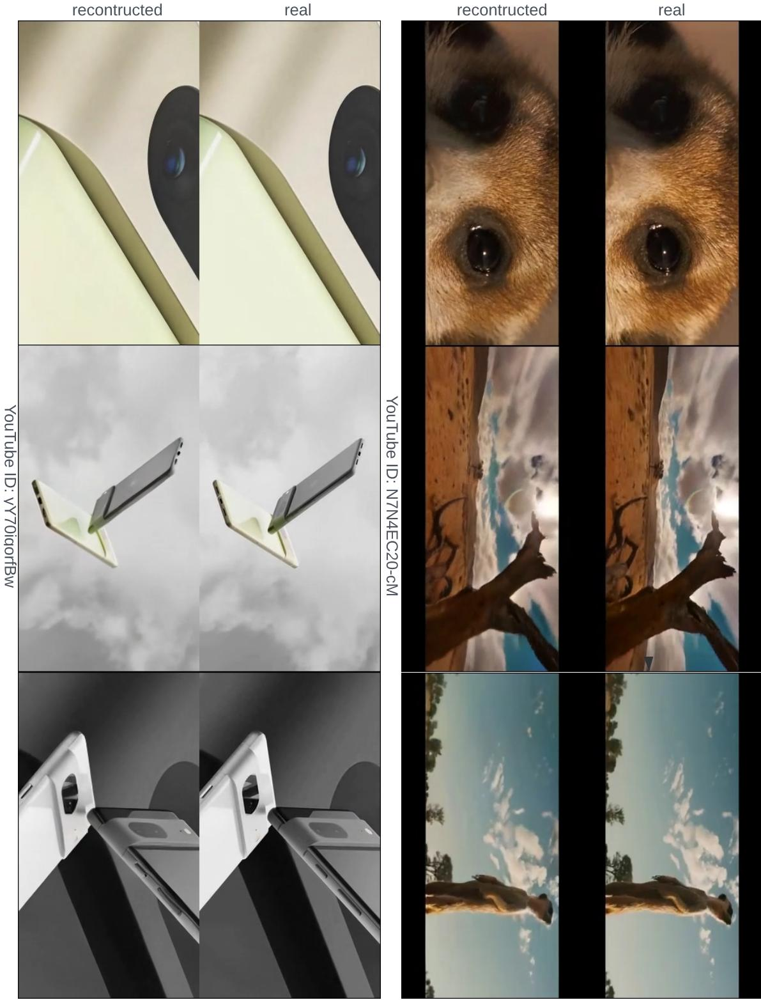  
in 240p $( 2 4 0 \times 4 3 2 )$ resolution with $N$ frames. Our 3D-Q modeepreents he vido $\frac { N } { 4 } \times 3 0 \times 5 4$ discrete tokens with a codebook of and are almost indistinguishable from the real videos.

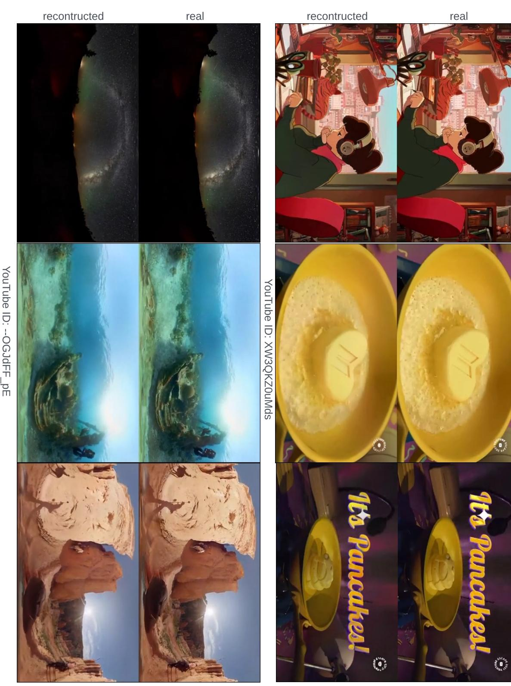  
in 240p $( 2 4 0 \times 4 3 2 )$ resolution with $N$ frames. Our 3D-Q modeepreents he vido $\frac { N } { 4 } \times 3 0 \times 5 4$ discrete tokens with a codebook of and are almost indistinguishable from the real videos.

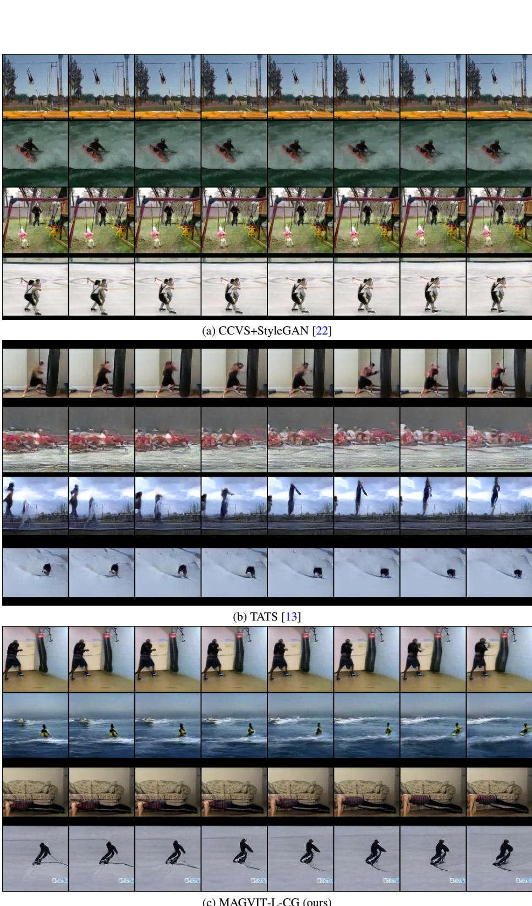  
Figure 1. Comparison of class-conditional generation samples on UCF-101. 16-frame videos are generated at $1 2 8 \times 1 2 8$ resolution . projects/tats/). $\mathrm { C C V S } { + } \mathrm { S }$ tyleGAN gets a decent single-frame quality attributing to the pretrained StyleGAN, but yields litle or motion.

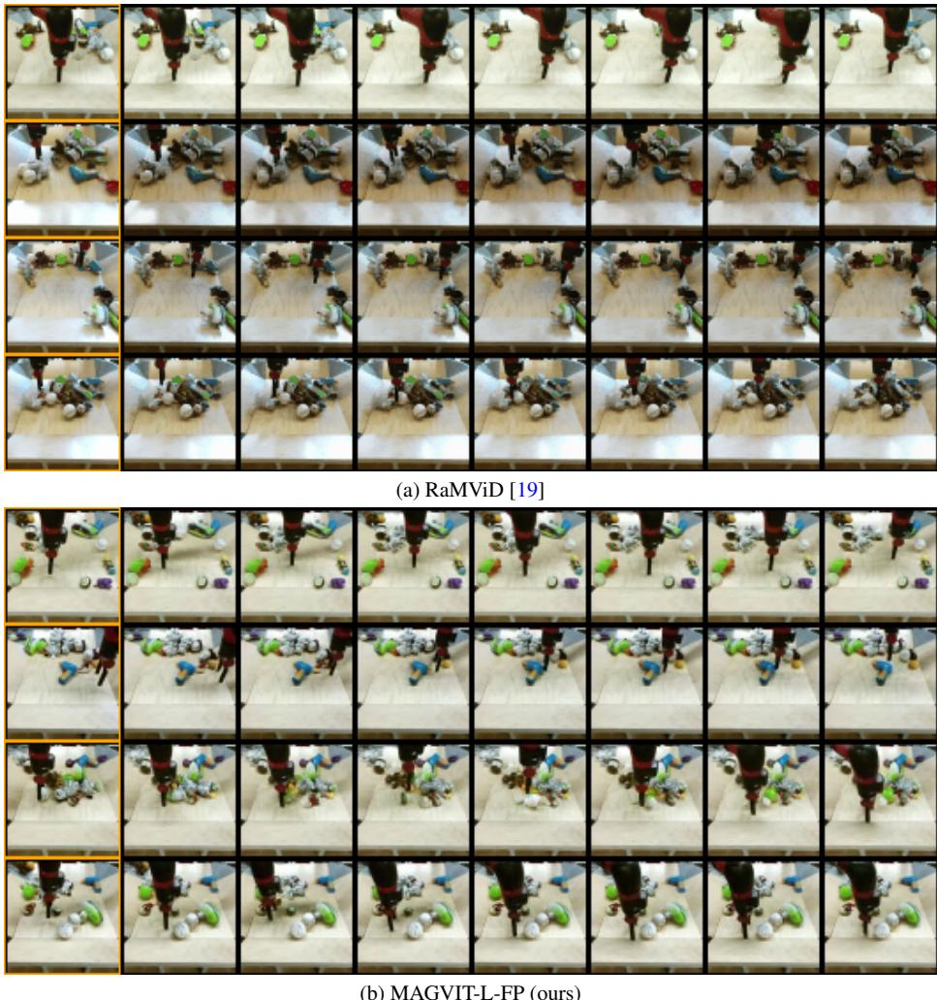  
Fiure .Comparisonframe prediction samples  BAIRnsee evaluation set. 1ramevideos are eat $6 4 \times 6 4$ resolution from theiroffcialrelease https://sites.google.com/view/video-diffusion-prediction).As shown, the clips produced by MAGVIT maintaining a better visual consistency and spatial-temporal dynamics.

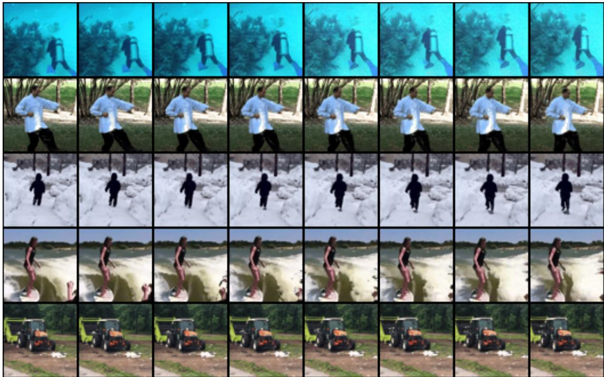  
(a) RaMViD [19] at $6 4 \times 6 4$ resolution, condition information is unavailable.

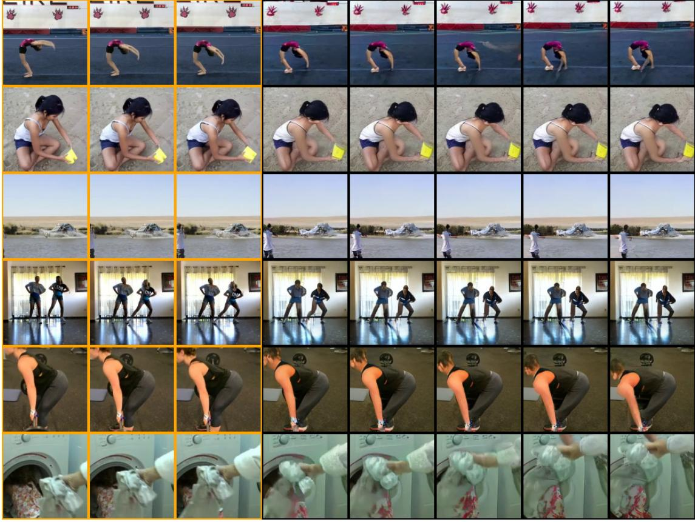  
(b) MAGVIT-L-FP (ours) at $1 2 8 \times 1 2 8$ resolution, condition frames are marked in orange.   
.s onvemeAGIT pus .

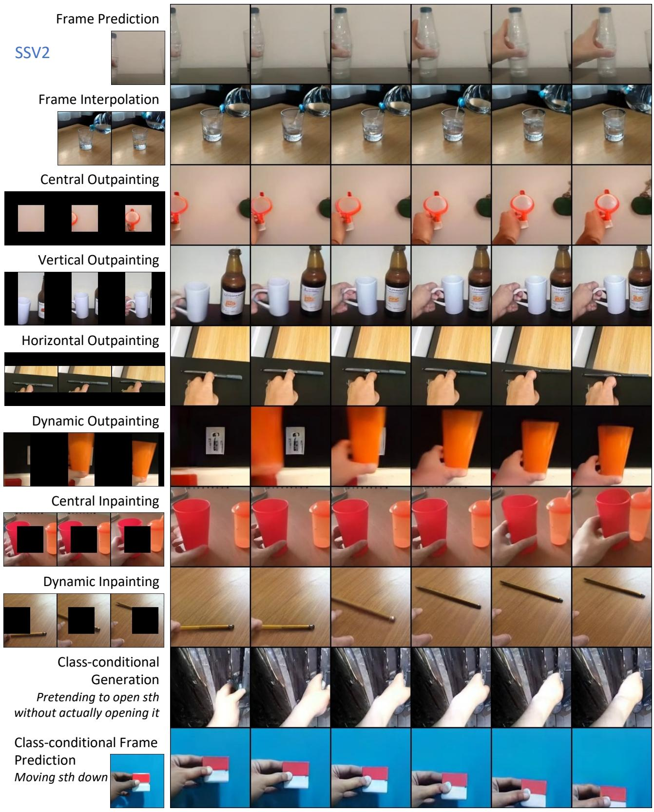  
F generate the shown videos are taken from the Something-Something-V2 evaluation videos.

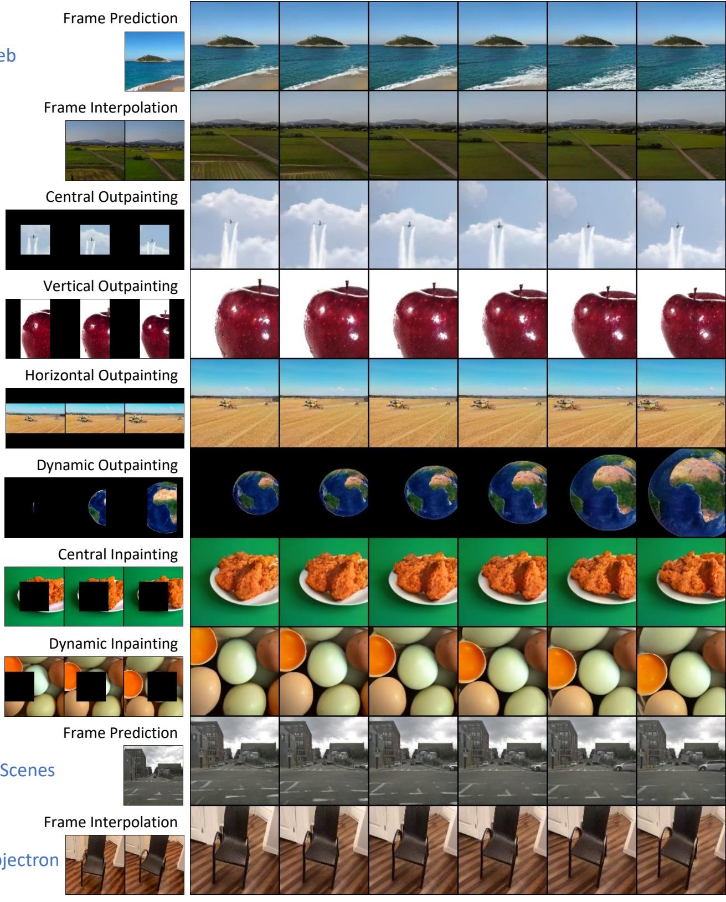  
F u condition used to generate the shown videos are taken from the evaluation set.

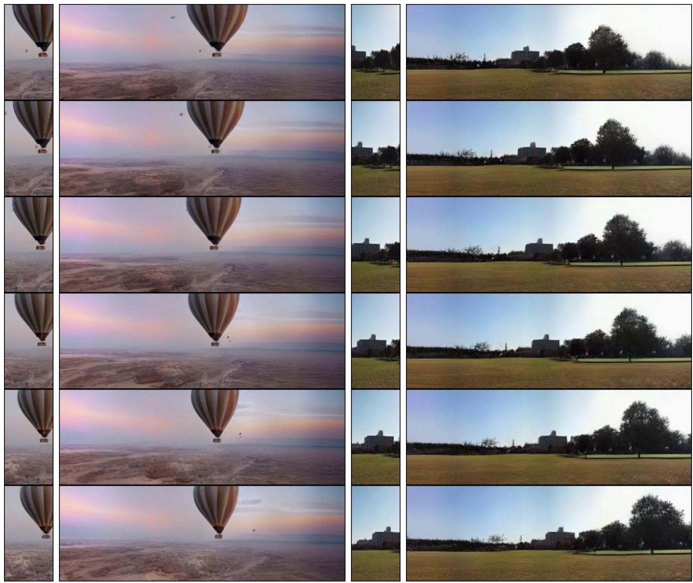  
Figure 17. Ultrawide outpainting results. Given a vertical slice $6 4 \times 1 2 8$ , MAGVIT expands it into a panorama video of $3 8 4 \times 1 2 8$ by doing vertical outpainting for 5 times on each side.

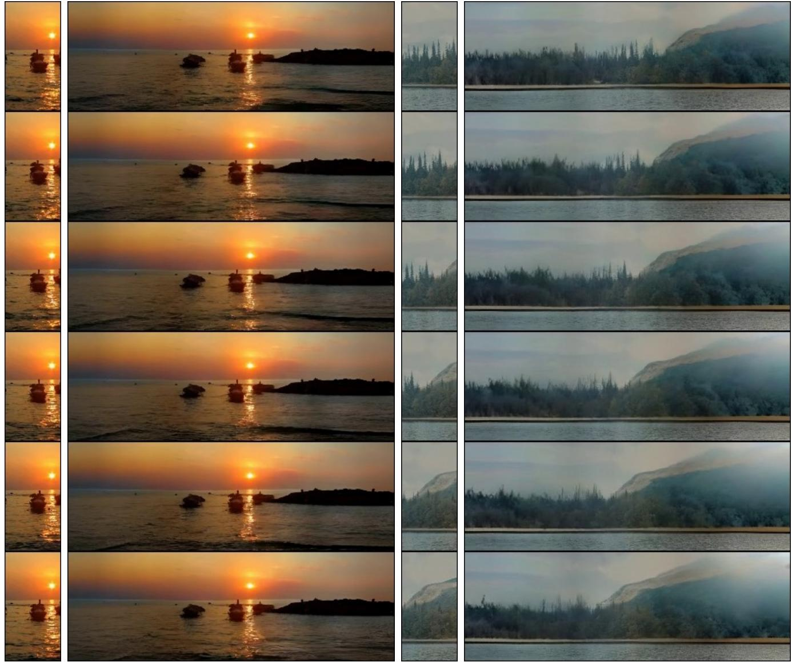  
Figure 18. Ultrawide outpainting results. Given a vertical slice of $6 4 \times 1 2 8$ , MAGVIT expands it into a panorama video of $3 8 4 \times 1 2 8$ by doing vertical outpainting for 5 times on each side.

# References

[1] Sami Abu-El-Haija, Nisarg Kothari, Joonseok Lee, Paul Natsev, George Toderici, Balakrishnan Varadarajan, and Sudheendra Vijayanarasimhan. Youtube $s \mathrm { m }$ : A largescale video classification benchmark. arXiv preprint arXiv:1609.08675, 2016. 18   
[2] Dinesh Acharya, Zhiwu Huang, Danda Pani Paudel, and Luc Van Gool. Towards high resolution video generation with progressive growing of sliced wasserstein gans. arXiv:1810.02419, 2018. 16   
[3] Adel Ahmadyan, Liangkai Zhang, Artsiom Ablavatski, Jianing Wei, and Matthias Grundmann. Objectron: A large scale dataset of object-centric videos in the wild with pose annotations. In CVPR, 2021. 12, 17, 26   
[4] Mohammad Babaeizadeh, Mohammad Taghi Saffar, Suraj Nair, Sergey Levine, Chelsea Finn, and Dumitru Erhan. Fitvid: Overfitting in pixel-level video prediction. arXiv:2106.13195, 2021. 16   
[5] Holger Caesar, Varun Bankiti, Alex H Lang, Sourabh Vora, Venice Erin Liong, Qiang Xu, Anush Krishnan, Yu Pan, Giancarlo Baldan, and Oscar Beijbom. nuScenes: A multimodal dataset for autonomous driving. In CVPR, 2020. 12, 17, 26   
[6] Joao Carreira, Eric Noland, Andras Banki-Horvath, Chloe Hillier, and Andrew Zisserman. A short note about Kinetics600. arXiv:1808.01340, 2018. 12, 17   
[7] Joao Carreira and Andrew Zisserman. Quo vadis, action recognition? a new model and the Kinetics dataset. In CVPR, 2017. 15   
[8] Huiwen Chang, Han Zhang, Lu Jiang, Ce Liu, and William T Freeman. MaskGIT: Masked generative image transformer. In CVPR, 2022. 18, 19   
[9] Aidan Clark, Jeff Donahue, and Karen Simonyan. Adversarial video generation on complex datasets. arXiv: 1907.06571, 2019. 15, 16   
[10] Jacob Devlin, Ming-Wei Chang, Kenton Lee, and Kristina Toutanova. BERT: Pre-training of deep bidirectional transformers for language understanding. In NAACL, 2019. 12   
[11] Alexey Dosovitskiy, Lucas Beyer, Alexander Kolesnikov, Dirk Weissenborn, Xiaohua Zhai, Thomas Unterthiner, Mostafa Dehghani, Matthias Minderer, Georg Heigold, Sylvain Gelly, et al. An image is worth 16x16 words: Transformers for image recognition at scale. In ICLR, 2020. 12   
[12] Frederik Ebert, Chelsea Finn, Alex X Lee, and Sergey Levine. Self-supervised visual planning with temporal skip connections. In CoRL, 2017. 12, 17   
[13] Songwei Ge, Thomas Hayes, Harry Yang, Xi Yin, Guan Pang, David Jacobs, Jia-Bin Huang, and Devi Parikh. Long video generation with time-agnostic VQGAN and timesensitive transformer. In ECCV, 2022. 12, 13, 15, 16, 17, 18, 19, 22   
[14] Raghav Goyal, Samira Ebrahimi Kahou, Vincent Michalski, Joanna Materzynska, Susanne Westphal, Heuna Kim, Valentin Haenel, Ingo Fruend, Peter Yianilos, Moritz Mueller-Freitag, et al. The "something something" video database for learning and evaluating visual common sense. In ICCV, 2017. 12, 17, 25   
[15] Agrim Gupta, Stephen Tian, Yunzhi Zhang, Jiajun Wu, Roberto Martín-Martín, and Li Fei-Fei. MaskViT: Masked visual pre-training for video prediction. arXiv:2206.11894, 2022. 16   
[16] Dan Hendrycks and Kevin Gimpel. Gaussian error linear units (gelus). arXiv:1606.08415, 2016. 12   
[17] Jonathan Ho, Tim Salimans, Alexey Gritsenko, William Chan, Mohammad Norouzi, and David J Fleet. Video diffusion models. In ICLR Workshops, 2022. 16, 17   
[18] Wenyi Hong, Ming Ding, Wendi Zheng, Xinghan Liu, and Jie Tang. CogVideo: Large-scale pretraining for text-tovideo generation via transformers. arXiv:2205.15868, 2022. 16   
[19] Tobias Höppe, Arash Mehrjou, Stefan Bauer, Didrik Nielsen, and Andrea Dittadi. Diffusion models for video prediction and infilling. arXiv:2206.07696, 2022. 16, 18, 23, 24   
[20] Sergey Ioffe and Christian Szegedy. Batch normalization: Accelerating deep network training by reducing internal covariate shift. In ICML, 2015. 12   
[21] Emmanuel Kahembwe and Subramanian Ramamoorthy. Lower dimensional kernels for video discriminators. Neural Networks, 132:506520, 2020. 16   
[22] Guillaume Le Moing, Jean Ponce, and Cordelia Schmid. CCVS: Context-aware controllable video synthesis. In NeurIPS, 2021. 16, 18, 22   
[23] Pauline Luc, Aidan Clark, Sander Dieleman, Diego de Las Casas, Yotam Doron, Albin Cassirer, and Karen Simonyan. Transformation-based adversarial video prediction on largescale data. arXiv:2003.04035, 2020. 16   
[24] Charlie Nash, João Carreira, Jacob Walker, Iain Barr, Andrew Jaegle, Mateusz Malinowski, and Peter Battaglia. Transframer: Arbitrary frame prediction with generative models. arXiv:2203.09494, 2022. 16   
[25] Ruslan Rakhimov, Denis Volkhonskiy, Alexey Artemov, Denis Zorin, and Evgeny Burnaev. Latent video transformer. In VISIGRAPP (5: VISAPP), 2021. 16   
[26] Prajit Ramachandran, Barret Zoph, and Quoc V Le. Searching for activation functions. In ICLR Workshops, 2018. 12   
[27] Masaki Saito, Eiichi Matsumoto, and Shunta Saito. Temporal generative adversarial nets with singular value clipping. In ICCV, 2017. 16   
[28] Masaki Saito, Shunta Saito, Masanori Koyama, and Sosuke Kobayashi. Train sparsely, generate densely: Memoryefficient unsupervised training of high-resolution temporal gan. IJCV, 128(10):25862606, 2020. 15, 16   
[29] Uriel Singer, Adam Polyak, Thomas Hayes, Xi Yin, Jie An, Songyang Zhang, Qiyuan Hu, Harry Yang, Oron Ashual, Oran Gafni, et al. Make-a-video: Text-to-video generation without text-video data. arXiv:2209.14792, 2022. 16, 17   
[30] Ivan Skorokhodov, Sergey Tulyakov, and Mohamed Elhoseiny. StyleGAN-V: A continuous video generator with the price, image quality and perks of StyleGAN2. In CVPR, 2022. 16   
[31] Khurram Soomro, Amir Roshan Zamir, and Mubarak Shah. UCF101: A dataset of 101 human actions classes from videos in the wild. arXiv:1212.0402, 2012. 12, 16   
[32] Yu Tian, Jian Ren, Menglei Chai, Kyle Olszewski, Xi Peng, Dimitris N Metaxas, and Sergey Tulyakov. A good image generator is what you need for high-resolution video synthesis. In ICLR, 2021. 16   
[33] Du Tran, Lubomir Bourdev, Rob Fergus, Lorenzo Torresani, and Manohar Paluri. Learning spatiotemporal features with 3D convolutional networks. In ICCV, 2015. 15   
[34] Sergey Tulyakov, Ming-Yu Liu, Xiaodong Yang, and Jan Kautz. MoCoGAN: Decomposing motion and content for video generation. In CVPR, 2018. 16   
[35] Thomas Unterthiner, Sjoerd van Steenkiste, Karol Kurach, Raphael Marinier, Marcin Michalski, and Sylvain Gelly. Towards accurate generative models of video: A new metric & challenges. arXiv:1812.01717, 2018. 12, 15, 16, 17   
[36] Ruben Villegas, Mohammad Babaeizadeh, Pieter-Jan Kindermans, Hernan Moraldo, Han Zhang, Mohammad Taghi Saffar, Santiago Castro, Julius Kunze, and Dumitru Erhan. Phenaki: Variable length video generation from open domain textual description. arXiv:2210.02399, 2022. 16   
[37] Vikram Voleti, Alexia Jolicoeur-Martineau, and Christopher Pal. Masked conditional video diffusion for prediction, generation, and interpolation. In NeurIPS, 2022. 16   
[38] Carl Vondrick, Hamed Pirsiavash, and Antonio Torralba. Generating videos with scene dynamics. In NeurIPS, 2016. 16   
[39] Zhou Wang, Alan C Bovik, Hamid R Sheikh, and Eero P Simoncelli. Image quality assessment: from error visibility to structural similarity. IEEE TIP, 13(4):600612, 2004. 15   
[40] Dirk Weissenborn, Oscar Täckström, and Jakob Uszkoreit. Scaling autoregressive video models. In ICLR, 2019. 16   
[41] Chenfei Wu, Jian Liang, Lei Ji, Fan Yang, Yuejian Fang, Daxin Jiang, and Nan Duan. NÜWA: Visual synthesis pretraining for neural visual world creation. In ECCV, 2022. 16   
[42] Yuxin Wu and Kaiming He. Group normalization. In ECCV, 2018. 12   
[43] Wilson Yan, Yunzhi Zhang, Pieter Abbeel, and Aravind Srinivas. VideoGPT: Video generation using vq-vae and transformers. arXiv:2104.10157, 2021. 16   
[44] Sihyun Yu, Jihoon Tack, Sangwoo Mo, Hyunsu Kim, Junho Kim, Jung-Woo Ha, and Jinwoo Shin. Generating videos with dynamics-aware implicit generative adversarial networks. In ICLR, 2022. 16   
[45] Richard Zhang, Phillip Isola, Alexei A Efros, Eli Shechtman, and Oliver Wang. The unreasonable effectiveness of deep features as a perceptual metric. In CVPR, 2018. 15