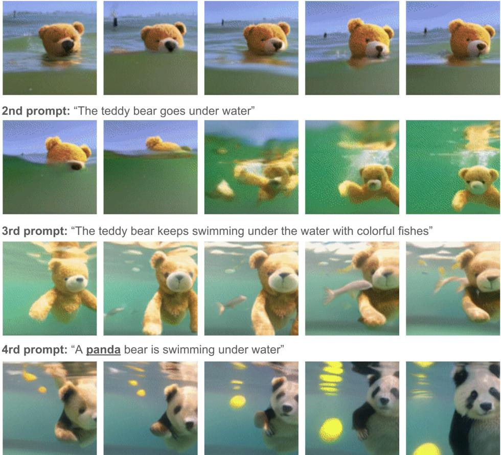
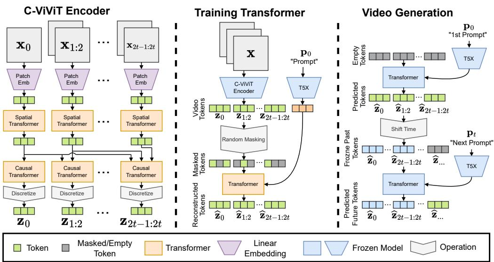
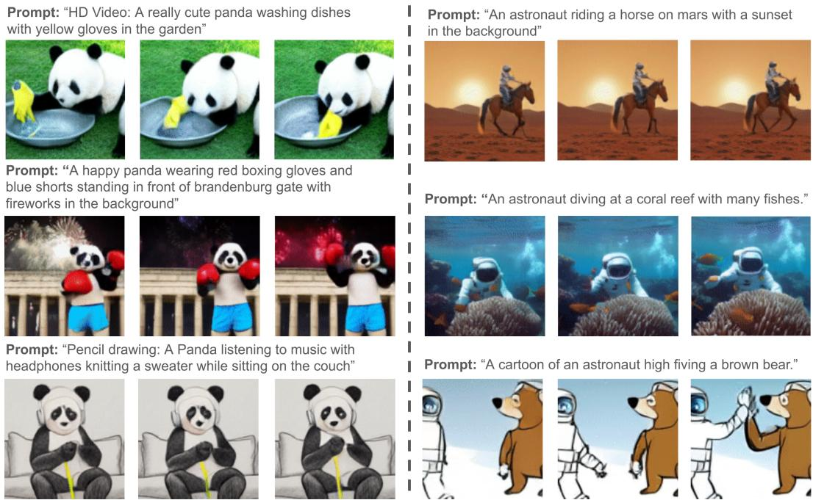
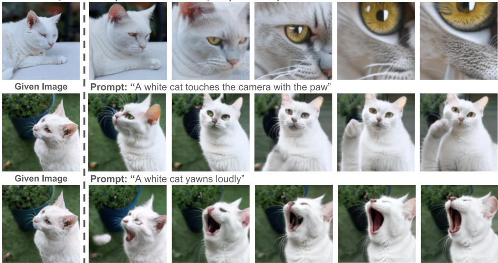
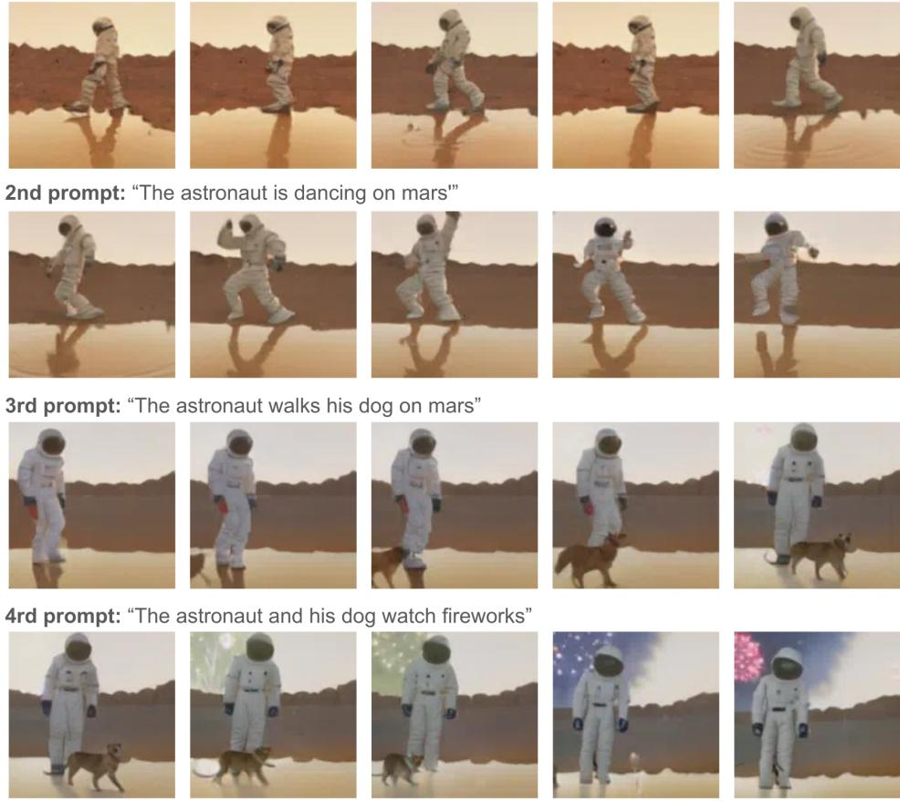

# PHENaKI: 从开放域文本描述生成可变长度视频

鲁本·维列加斯‡ 谷歌大脑 rubville@google.com 穆罕默德·巴巴伊扎德‡ 谷歌大脑 mbz@google.com 彼得-扬·金德曼斯‡ 谷歌大脑 pikinder@google.com 赫尔南·莫拉尔多 谷歌大脑 hmoraldo@google.com 汉·张 谷歌大脑 zhanghan@google.com 穆罕默德·塔吉·萨法尔 谷歌大脑 msaffar@google.com 圣地亚哥·卡斯特罗\* 密歇根大学 sacastro@umich.edu 朱利乌斯·昆策\* 伦敦大学学院 kjulius@google.com 杜米特鲁·埃尔汉 谷歌大脑 dumitru@google.com

# 摘要

我们提出了Phenaki，一个能够根据一系列文本提示生成真实感视频的模型。从文本生成视频特别具有挑战性，因为计算成本高，优质的文本-视频数据数量有限，且视频长度可变。为了解决这些问题，我们引入了一种新的视频表示学习模型，该模型将视频压缩为离散词元的小表示。这个分词器在时间上使用了因果注意力，使其能够处理可变长度的视频。为了从文本生成视频词元，我们使用了一个以预计算文本词元为条件的双向掩蔽变换器。生成的视频词元随后被去词元化以创建实际视频。为了应对数据问题，我们展示了如何在大量图像-文本对以及较少数量的视频-文本示例上进行联合训练，从而实现超越视频数据集中可用内容的泛化。与以往的视频生成方法相比，Phenaki能够在开放领域中根据一系列提示（即时间可变文本或故事）生成任意长度的视频。根据我们所知，这是首次研究从时间可变提示生成视频的论文。此外，与逐帧基准相比，所提出的视频编码器-解码器每个视频计算的词元更少，但在时空一致性方面表现更佳。

# 1 引言

现在可以根据描述生成逼真的高分辨率图像，但从文本生成高质量视频仍然具有挑战性。本质上，视频只是图像的序列，但这并不意味着生成一段连贯的长视频是简单的。实际上，这是一项更为艰巨的任务，因为可用的高质量数据少得多，计算需求也更加严苛。对于图像生成，存在着包含数十亿图像-文本对的数据集（如LAION-5B和JFT4B），而文本-视频数据集则小得多，例如WebVid包含约1千万个视频，考虑到开放域视频的更高复杂性，这个数量远远不够。在计算方面，训练当前最先进的图像生成模型已经在挑战最先进的计算能力，几乎没有空间用于生成视频，特别是可变长度的视频。

更糟糕的是，可以说单个简短文本提示不足以提供视频的完整描述（短片除外），相反，生成的视频必须以一系列提示或故事为条件，这些提示或故事叙述了随时间发生的事件。理想情况下，第一个提示：“一只逼真的泰迪熊在旧金山的海洋中游泳”，视频生成模型必须能够生成任意长度的视频，同时具备根据时间 $t$ 的提示对时间 $t$ 的生成帧进行条件化的能力，这些提示可以随时间变化。这样的能力显然可以将视频与“动态图像”区分开来，并为艺术、设计和内容创作等现实世界的创造性应用开辟道路。根据我们所知，基于故事的条件视频生成从未被探索过，这项研究是朝着这一目标迈出的第一步。传统的深度学习方法简单地从数据中学习这一任务是不可能的，因为没有基于故事的数据集可供学习。因此，为了实现这一目标，我们依赖于一个特别设计过具备这种能力的模型。

  
Figure 1. Time variable text (i.e. story) conditional video generation. The entire figure is one continuous video generated auto-regressively. We start by generating the video conditioned on the first prompt and then after a couple of frames we change the prompt to the next one. Each row contains a selected number of frames (from left to right in order) while the model was conditioned on that particular prompt. The model manages to preserve the temporal coherence of the video while adapting to the new prompt, usually taking the shortest path for the adaption (notice the morphing of the teddy bear to the panda). Please note that the generated video has complex visual features such as reflections, occlusions, interactions and scene transitions. Full video is available at phenaki.github.io.

在本文中，我们介绍了Phenaki，一种基于文本生成视频的模型，该模型同时在文本到视频和文本到图像的数据上进行训练，可以：生成时间上连贯且多样化的视频，能够根据开放领域的提示进行创作，即使提示是新概念的组合（见图3）。尽管模型是在1.4秒视频（以8帧每秒的速度）上训练的，但生成的视频可以很长（几分钟）。生成基于故事（即一系列提示）的视频，例如见图1和图5。

  
Figure 2. The architecture of Phenaki. Left: C-ViViT encoder architecture. The embeddings of images and video patches from raw frames x are processed by a spatial and then a causal transformer (auto-regressive in time) to generate video tokens z. Center: MaskGiT is trained to reconstruct masked tokens $\mathbf { z }$ predicted by a frozen C-ViViT encoder and conditioned on T5X tokens of a given prompt $\mathbf { p } _ { 0 }$ . Right: How Phenaki can generate arbitrary long videos by freezing the past token and generating the future tokens. The prompt can change over time to enable time-variable prompt (i.e. story) conditional generation. The subscripts represent time (i.e. frame number).

为了实现这些功能，我们不能依赖当前的视频编码器，因为它们要么只能解码固定大小的视频，要么独立编码帧。因此，我们提出了C-ViViT，这是一种新颖的编码器-解码器架构，具有以下特点：利用视频中的时间冗余，以改善相对于每帧模型的重建质量，同时将视频词元的数量压缩$40\%$或更多。允许根据其因果结构对可变长度的视频进行编码和解码。

# 2 PhenakI 模型

受到之前在自回归文本到图像和文本到视频方面的工作启发，Phenaki 设计了两个主要组件（见图 2）：一个编码器-解码器模型，该模型将视频压缩为离散嵌入（即词元），以及一个变换器模型，用于将文本嵌入转换为视频词元。为了获取文本嵌入，Phenaki 使用了预训练语言模型 T5X。我们将在接下来的小节中讨论每个组件。

# 2.1 编码器-解码器视频模型：C-VIVIT

生成视频的主要挑战之一是获取视频的压缩表示。之前的文本到视频的研究，要么使用逐帧图像编码器，例如VQ-GAN，要么使用固定长度的视频编码器，如VideoVQVAE。前者允许生成任意长度的视频，但在实际应用中，视频必须较短，因为编码器无法在时间上压缩视频，且连续帧中的词元高度冗余。后者在词元数量上更高效，但不允许生成可变长度的视频。在Phenaki中，我们的目标是生成可变长度的视频，同时将视频词元的数量保持到最小，以便在当前计算限制内能够使用变换器进行建模。为此，我们引入C-ViViT，这是一种ViViT的因果变体，具有额外的架构更改用于视频生成，能够在时间和空间维度上压缩视频，同时在时间上保持自回归。这种能力允许以自回归方式生成任意长度的视频。

编码器架构：如图2所示，我们从一个包含 $t _ { x } + 1$ 帧的视频序列开始，该序列的分辨率为 $w _ { x } \times h _ { x }$，通道数为 $c _ { x }$：$\mathbf { x } \in \mathbb { R } ^ { ( t _ { x } + 1 ) \times h _ { x } \times w _ { x } \times c _ { x } }$。该序列将被压缩为大小为 $( t _ { z } + 1 ) \times w _ { z } \times h _ { z }$ 的词元表示，其中前 $w _ { z } \times h _ { z }$ 个词元表示第一帧，且与视频的其余部分相互独立，剩余的词元表示在自回归方式下依赖于前帧的时空视频词元。为此，我们从第一帧中提取大小为 $w _ { p } \times h _ { p } \times c _ { p }$ 的非重叠图像块，从视频的其余部分提取大小为 $t _ { p } \times w _ { p } \times h _ { p } \times c _ { p }$ 的视频块。我们通常同时使用所有通道，因此有 $\begin{array} { r } { t _ { z } = \frac { t _ { x } } { t _ { p } } } \end{array}$、$\begin{array} { r } { w _ { z } = \frac { w _ { x } } { w _ { p } } } \end{array}$ 和 $\begin{array} { r } { h _ { z } = \frac { h _ { x } } { h _ { p } } } \end{array}$。每个图像块被展平并线性投影到 $d _ { z }$ 维空间。我们将空间维度结合起来，形成形状为 $( t _ { z } + 1 ) \times w _ { z } * h _ { z } \times d _ { z }$ 的张量，其中空间和时间维度是分开的。然后，在空间维度上应用多个变换器层，使用全对全的注意力机制。接下来，在时间维度上应用多个变换器层，使用因果注意力，使得每个空间词元仅观察来自前帧的空间词元，以自回归的方式进行编码。这种效果使得第一帧可以完全独立编码。这为将文本生成图像的训练自然嵌入到我们的视频模型中打开了可能性。第二个优势是我们可以根据多个起始帧对视频生成过程进行条件设置。得到的形状为 $t _ { z } \times w _ { z } \times h _ { z } \times d _ { z }$ 的块嵌入 $\mathbf { z }$ 随后通过向量量化被标记为学习到的代码字 $c _ { z }$。代码本的学习将在后面讨论，并与损失相关联。解码器架构：C-ViViT 解码器只是编码器的倒转版本。首先，词元被转化为嵌入。接着是时间变换器，然后是空间变换器。在空间变换器的输出后，我们应用一次线性投影且不使用激活函数，将词元映射回像素空间。

量化与损失：为了学习离散的潜在空间，我们通过向量量化（VQ）目标将编码器输出量化为学习到的代码本条目，在VQVAEs中，其中 $\operatorname { s g } ( x ) \equiv x$，并且 $\begin{array} { r } { { \frac { \mathrm { d } } { \mathrm { d } x } } \mathrm { s g } ( x ) \equiv 0 } \end{array}$，$\beta$ 和 $\mathbf { e }$ 是来自代码本 $\mathbf { E }$ 的代码本向量。离 $\mathbf { z }$ 最近的代码本向量的索引通过 $i = \underset { - } { \operatorname { a r g m i n } } _ { j } \lVert \mathbf { z } - \mathbf { E } _ { j } \rVert _ { 2 } ^ { 2 }$ 找到。除了VQ目标外，我们还采用ViT-VQGAN中的分解和 $\ell _ { 2 }$ 归一化编码，以提高代码本的使用效率和重建质量。

$$
L _ { V Q } = \lVert \mathbf { s g ( z ) } - \mathbf { e } \rVert _ { 2 } ^ { 2 } + \beta \lVert \mathbf { z } - s g ( \mathbf { e } ) \rVert _ { 2 } ^ { 2 } ,
$$

为了训练我们的模型，我们结合使用 $L _ { 2 }$ 损失、图像感知损失 $L _ { I P }$ [20, 61]、使用 I3D 网络 [6] 作为特征提取器的 视频感知损失 $L _ { V P }$，以及使用 StyleGAN 架构 [21] 的对抗损失 ${ \cal L } _ { A d \nu }$。作为训练目标，我们使用以下内容：

$$
L = L _ { V Q } + 0 . 1 \times L _ { A d \nu } + 0 . 1 \times L _ { I P } + 1 . 0 \times L _ { V P } + 1 . 0 \times L _ { 2 } .
$$

C-ViViT架构的创新：我们提出的C-ViViT架构受到ViViT中分解编码器的启发，但我们对其架构进行了修改，以支持从未标记视频中进行自监督学习。我们首先去除了空间和时间变换器中的[CLS]标记。接下来，我们对由空间编码器计算的所有空间标记应用时间变换器，而不是像ViViT中那样仅对[CLS]标记进行单次时间变换。最重要的是，ViViT编码器由于时间上的全对全注意力机制，需要固定长度的视频输入。因此，我们采用因果注意力机制，使得我们的C-ViViT编码器变得自回归，从而允许可变数量的输入帧，这对于从图像数据集学习是必要的，并且可以自回归地将视频或单帧向前推断。

# 2.2 基于双向变换器的文本到视频生成

在这个阶段，文本到视频的任务可以被表述为序列到序列的问题，以根据配对的文本嵌入预测视频词元。最近的大多数方法[34, 59, 54, 18]为这些序列到序列任务采用了transformer模型。在它们的模型中，使用了一种自回归transformer，该模型根据编码的文本特征顺序预测图像或视频词元。因此，采样时间随着序列长度呈线性增长，即使使用了缓存。这对于长视频序列生成而言变得不切实际。

掩码双向变换器：在本研究中，我们旨在通过固定的小的采样步长来减少采样时间，而忽略不同视频序列的长度。受到先前图像生成工作的启发，我们使用双向变换器，因为它可以同时预测不同的视频词元。在训练步骤 $i$ 中，我们首先从 0 到 1 中采样一个掩码比例 $\gamma _ { i }$，并随机用特殊词元 [MASK] 替换 $\lceil \gamma _ { i } \cdot N \rceil$ 个词元，其中 $N$ 为视频序列长度。然后，我们通过最小化给定编码文本嵌入和未掩码视频词元的掩码词元的交叉熵损失来学习模型参数。在推理时，我们首先将所有视频词元标记为特殊词元 [MASK]。然后，在每个推理步骤中，我们在文本嵌入和未掩码（已预测）视频词元的条件下并行预测所有掩码（未知）视频词元。我们在采样步骤 $i$ 中保留 $\beta _ { i }$ 的预测词元比例，其余词元将在下一个步骤中重新掩码和重新预测。正如 MaskGIT 所讨论的，掩码调度 $\gamma _ { i }$ 和采样调度 $\beta _ { i }$ 对样本质量有显著影响，因此我们遵循相同的策略。与自回归变换器相比，采样步骤的数量是数量级上更少的（通常我们使用 12 到 48 的值范围）。一般来说，更多的采样步骤可以提升质量。损失和训练策略：给定预训练的 C-ViViT，视频被编码为形状为 $( t _ { z } + 1 ) \times w _ { z } \times h _ { z }$ 的代码本 ID a，这些 ID 使用来自 [58] 的光栅顺序被展平为一个长向量。然后，我们使用掩码视觉词元建模（MVTM）来建模文本条件的视频词元分布。

$$
L _ { \mathrm { m a s k } } = - \sum _ { \forall i \in [ 1 , N ] , m _ { i } = 1 } \log p ( a _ { i } | \mathbf { a } _ { \bar { M } } , \mathbf { p } ) ,
$$

其中 $\mathbf { a } _ { \bar { M } }$ 表示 a 的掩码版本，$m _ { i }$ 是一个二进制变量，指示 $a _ { i }$ 是否被掩码，$N$ 是视频词元的数量，$\mathbf { p }$ 是文本条件嵌入。除了 MVTM 目标外，我们通过在训练期间 $10\%$ 的时间丢弃文本条件来使用无分类器引导进行训练 [16, 59]。最后，我们在训练过程中动态调整 MVTM 目标，以将图像和视频数据集作为一个大型数据集使用。我们通过仅在给定单帧时对前 $w _ { z } \times h _ { z }$ 个词元应用掩码比例和目标，或在给定完整视频时对所有视频词元进行应用，从而实现这一点。这种混合图像和视频数据集的训练策略使我们的模型能够学习仅存在于图像数据集中的概念，并将其转移到存在于视频数据集中的概念上（例如，图 3 中的熊猫铅笔画风格的视频）。长视频的推理和自回归生成：在推理时，我们通过与 [8] 中使用的相同迭代过程采样视频词元，同时使用无分类器引导的尺度 $\lambda$ 来控制生成与文本条件之间的对齐。一旦生成第一个视频，我们可以通过使用 C-ViViT 对最后一个视频中生成的最后 $K$ 帧进行编码，初始化 MaskGIT 以使用我们的 C-ViViT 编码器计算的词元，然后继续生成后续的视频词元，条件是某个文本输入。在视频外推过程中，文本条件可以相同或不同，这使我们的模型能够动态创建前一个和当前文本条件视觉内容之间的视觉过渡，有效生成由输入文本描述的视觉故事。

# 3 实验

为了评估Phenaki，我们在以下任务上进行了测试：1）文本条件视频生成，2）文本图像条件视频生成，3）时间变量文本条件视频生成（即故事模式），4）视频量化和5）图像条件视频生成，即视频预测。根据我们所知，3）时间变量文本条件视频生成在之前的研究中尚未被探索。考虑到视频的动态特性，我们强烈建议读者访问phenaki.github.io以查看生成的视频。该网站还包括与CogVideo论文[18]中部分提示的定性比较。尽管重点是文本到视频生成任务，但值得注意的是，尽管Phenaki并不是专门为这些传统视频任务开发的，它在这些任务中的竞争力仍然令人称道。我们在JAX [? ]中实现了Phenaki，并使用FLAX [? ]库。

Table 1. Text to video comparisons on Kinetics-400 [22].   

<table><tr><td>Method</td><td>FID Image →</td><td>FID Video V</td></tr><tr><td>T2V [25]</td><td>82.13 33.51</td><td>14.65 7.34</td></tr><tr><td>SC [5] TFGAN [5]</td><td>31.76</td><td>7.19</td></tr><tr><td>NUWA</td><td>28.46</td><td>7.05</td></tr><tr><td>Phenaki [0-Shot]</td><td>37.74</td><td>3.84</td></tr></table>

Table 2. Text to video and text to image results highlighting the importance of image datasets in video models. Text-to-image evaluation is done on ${ \sim } 4 0 \mathrm { K }$ images of LAION-400M [41].   

<table><tr><td>Data Split</td><td>Text to Video</td><td> Text to Image</td><td></td></tr><tr><td>Vid% / Img%</td><td>CLIP ↑ FID ↓</td><td>FVD</td><td>CLIP ↑ FID↓</td></tr><tr><td>100% / 0%</td><td>0.298 19.2</td><td>168.9</td><td>0.240 53.9</td></tr><tr><td>80% / 20%</td><td>0.303 21.4</td><td>198.4</td><td>0.289 29.4</td></tr><tr><td>50% / 50%</td><td>0.302 21.4</td><td>239.7</td><td>0.287 30.5</td></tr></table>

# 3.1 文本条件视频生成

目前尚无公认的基准用于评估文本到视频的方法。这使得将Phenaki与近期的方法如NUWA、CogVideo、NUWA-Infinity和视频扩散模型进行比较变得困难。除非另有说明，我们在约15万个文本视频对的语料库上训练了一个参数量为1.8B的Phenaki模型，帧率为8 FPS，同时混合了约5000万个文本图像对和约4亿对LAION-400M（更多细节见附录B.3）。本文中可视化部分使用的模型训练了100万个步骤，批量大小为512，训练耗时不到5天。在此设置下，80%的训练数据来自视频数据集，每个图像数据集贡献10%。定性评估：从该模型产生的样本可见于图3，更多样本可在phenaki.github.io上查阅。我们观察到，对于视频中的角色和背景动态具有很高的控制度。角色的外观和视频风格也可以通过文本提示进行调整（例如，普通视频、卡通或铅笔画）。在phenaki.github.io上，我们提供了在CogVideo演示中使用的提示的示例。由于这些方法之间存在显著差异，因此很难进行平等比较。举例来说，规模差异巨大：CogVideo为9B参数，我们的模型为1.8B。此外，训练数据也不同。最后，我们不知道CogVideo演示中的提示在CogVideo的一般性能中有多具代表性。定量比较：NUWA论文在Kinetics400上提供了定性评估。由于NUWA模型仅为0.9B参数，我们在此实验中也使用了相同规模的模型。我们的模型在50%的视频和50%的图像数据上进行训练。NUWA模型在Kinetics上进行了微调，而Phenaki模型没有：它是在零-shot设置下进行评估的。表1中的结果显示，在零-shot设置下，Phenaki实现了与之前在此数据集上训练或微调的文本到视频方法相当的生成质量。

关于联合文本到图像和文本到视频训练的重要性 尽管存在一些文本视频数据集，但在质量和数量上，文本图像数据集在互联网上占主导地位。因此，现有的视频数据不足以涵盖文本图像数据集中存在的所有概念。例如，仅使用我们的视频数据，无法学习到铅笔画或不同的绘画风格等概念。为了能够学习一个可以将视频动态与这些额外概念相结合的模型，我们必须结合对图像和视频数据的训练。在表2中，我们评估了使用不同视频和图像比例的性能。我们从仅视频的数据分割开始，逐步调整图像和视频数据集的比例，直到使用$50\%$图像和$50\%$视频数据集。在我们的结果中，我们发现仅用视频训练的模型（即，显著更好的FVD）与使用更多图像数据训练的模型（即，更好的文本视频和文本图像对齐，以及在图像数据集中显著更好的FID）之间存在性能权衡。在phenaki.github.io上，我们并排展示了不同模型的样本，其中可以看到内容控制和动态质量之间的权衡。我们相信，随着未来文本视频数据集的质量和规模的提高，概念与动态之间的权衡会得到改善。鉴于Phenaki可以同时以静态图像和文本为条件，一个有趣的实验设置是根据文本提示对现有图像进行动画处理。对于这个实验，我们使用第3.1节中的相同模型，但以未见过的图片（用我们的手机从本地对象拍摄）和相关提示为条件。正如图4所示，该模型可以从给定的图像生成连贯的视频，同时遵循给定的提示。

  
Figure 3. Text conditional video generation. Each row shows selected frames from a video generated given the prompt. The model is trained on a mix of images and videos. The video dataset does not include any stylized videos such as pencil drawings, however, the image dataset does. The model can generalize from still images to videos. This figure also demonstrate the capability of the model in generating new unseen compositions. Full videos are available at phenaki.github.io.

# 3.3 通过动态文本输入进行视觉故事讲述

Phenaki 的一个显著且有用的特性是其时间上的自回归性。这允许在提示随着时间变化的情况下生成长视频。时间变量的提示可以被视为一个故事；整个视频的叙述，其中每个提示对应视频中的一个场景。这使得能够创建动态变化的场景。根据我们所知，这篇论文是首次生成此类视频的作品。有关此点的示例可以在图 1 和 phenaki.github.io 上看到。其工作原理是，我们首先用第一个提示生成一个视频，然后通过对最后 $N$ 帧（通常为 5 帧）以及一个可能的新提示进行条件生成，将其在时间上进行扩展。

# 3.4 视频编码

为了评估 C-ViViT 的视频编码和重建性能，我们使用 Moments-in-Time (MiT) [29] 数据集。MiT 数据集包含大约 802,000 个训练视频、约 33,000 个验证视频和大约 67,000 个测试视频，帧率为 25 FPS。与其他公开可用的视频数据集相比，MiT 数据集是一个高质量的平衡数据集，具有高覆盖率和高密度的动词，描绘了几秒钟的瞬间 [29]。我们将 C-ViViT 与用于条件视频生成的视频量化器的基于逐帧图像的编码器-解码器进行比较 [57, 54, 18, 54, 18, 52]：一个 ViT [58] 和一个卷积 VQ-GAN [12]。实验的详细信息可以在附录 B.1 中找到。

  

图4. 基于提示动画生成图像。每一行展示了多个帧，生成的视频是基于给定的首帧和提示文本生成的。首帧是新的（由作者的手机拍摄），在训练过程中未曾观察到。模型在遵循提示的同时为给定图像进行动画化。完整视频可在 phenaki.github.io 上获取。

Table 3. Video reconstruction results on Moments-in-Time. The number of tokens is computed for 10 frames with the exception of C-ViViT which is for 11, due to the isolated initial frame.   

<table><tr><td>Method</td><td>FID ↓</td><td>FVD ↓</td><td>Number of Tokens ↓</td></tr><tr><td>Conv VQ-GAN [12]</td><td>7.5</td><td>306.1</td><td>2560</td></tr><tr><td>Conv VQ-GAN + Video loss</td><td>13.7</td><td>346.5</td><td>2560</td></tr><tr><td>ViT VQ-GAN [58]</td><td>3.4</td><td>166.6</td><td>2560</td></tr><tr><td>ViT VQ-GAN + Video loss</td><td>3.8</td><td>173.1</td><td>2560</td></tr><tr><td>C-ViViT VQ-GAN (Ours)</td><td>4.5</td><td>65.78</td><td>1536</td></tr></table>

如表 3 所示，我们使用 FID [15] 和 FVD [44] 评估视频重构质量。FID 和 FVD 都比较生成视频（或图像）的分布与真实分布。FID 忽略时间连贯性，而 FVD 则测量视频的时空动态重构的质量。表 3 中的结果表明，基于逐帧图像的方法略微优于我们的视频方法（C-ViViT 的 FID 略高），然而，它们在建模视频的时空动态方面表现不佳（C-ViViT 的 FVD 显著较低）。这是可以预期的，因为 C-ViViT 在每帧的补丁之间具有时空连接，允许同时建模空间和时间。此外，与基于图像的基线相比，CViViT 将视频压缩为更少的词元。这一点至关重要，因为词元的数量会显著影响下游任务中变换器的计算成本。此外，C-ViViT 的词元在时间上是自回归的，这使得能够使用相同的编码器建模可变长度的视频，这对于依赖于先前生成帧的视频外推非常重要。

# 3.5 图像条件视频生成即视频预测

为了评估C-ViViT所学习的视频表示不仅仅局限于重建，我们在帧条件视频生成任务上进行测试，此任务也通常称为视频预测。在该实验中，我们在BAIR机器人推送基准上测试Phenaki，任务是在给定单帧的条件下生成15帧。对于开放域视频，我们在Kinetics600上测试Phenaki，任务是根据5帧预测11帧。有关这些实验的更多详细信息，请参见附录B.2。表4和表5展示了这些实验的结果。注意到

Table 4. Video prediction on Kinetics-600 [7]. While Phenaki is not designed for video prediction it achieves comparable results with SOTA video prediction models.   

<table><tr><td>Method FVD ↓</td></tr><tr><td>Video Transformer [51] 170.0 ± 5.00 CogVideo [18] 109.2 DVD-GAN-FP [9] 69.1 ± 0.78</td></tr><tr><td>Video VQ-VAE [49] 64.3 ± 2.04 CCVS [28] 55.0 ± 1.00 TrIVD-GAN-FP [27] 25.7 ± 0.66</td></tr><tr><td>Transframer [31] 25.4 RaMViD [19] 16.5</td></tr><tr><td>Video Diffusion [17] 16.2 ± 0.34 Phenaki (Ours) 36.4 ± 0.19</td></tr></table>

Table 5. Video prediction on BAIR [11].   

<table><tr><td rowspan=1 colspan=1>Method                 FVD↓</td></tr><tr><td rowspan=1 colspan=1>DVD-GAN [9]            109.8</td></tr><tr><td rowspan=1 colspan=1>VideoGPT [55]            103.3</td></tr><tr><td rowspan=1 colspan=1>TrIVD-GAN [27]          103.3</td></tr><tr><td rowspan=1 colspan=1>Transframer [31]          100.0</td></tr><tr><td rowspan=1 colspan=1>HARP [57]                 99.3</td></tr><tr><td rowspan=1 colspan=1>CCVS [28]                 99.0</td></tr><tr><td rowspan=1 colspan=1>Video Transformer [51]     94.0</td></tr><tr><td rowspan=1 colspan=1>FitVid [3]                  93.6</td></tr><tr><td rowspan=1 colspan=1>MCVD [47]                89.5</td></tr><tr><td rowspan=1 colspan=1>NUWA [54]                86.9</td></tr><tr><td rowspan=1 colspan=1>RaMViD [19]              84.2</td></tr><tr><td rowspan=1 colspan=1>Phenaki (Ours)             97.0</td></tr></table>

Phenaki 并不是专门为视频预测设计的，因此缺乏 U-Net 中的跳跃连接等组件，这些组件已知可以提升视频预测方法的性能 [10, 46, 3]。尽管如此，我们的方法在这些基准测试中与最先进的视频预测方法具有竞争力。总体而言，这些实验表明，Phenaki 在建模视频动态方面表现出色，这对于从文本生成连贯的视频是必需的。

# 4 相关工作

本文与基于文本条件的自回归图像和视频生成方法密切相关。DALL-E [34] 将文本词元转换为使用 VQVAE [45] 学习到的离散图像嵌入。Parti [59] 具有类似架构，但通过使用 21B 参数的 transformer 从 ViT-VQGAN [58] 预测词元，从而生成更高质量的图像。类似的架构也被应用于视频生成。GODIVA [52] 使用 transformer 将文本词元映射到基于图像的 VQVAE 中的视频词元。由于多个帧的词元数量庞大，GODIVA 依赖于局部注意力机制。同样，NUWA [54] 和 NUWA-Infinity [53] 都采用自回归架构从文本生成视频和图像。NUWA 生成固定大小的输出，而 NUWA-Infinity 引入第二层自回归计算以支持可变大小的视频。同样，CogVideo [18] 指出低质量视频生成的主要原因是良好的文本-视频数据的稀缺，并试图利用预训练的文本到图像模型生成高质量视频。尽管 Phenaki 坚持相同的架构原则，但与以往的工作有重大区别。最值得注意的是，NUWA、NUWA-Infinity 和 CogVideo 将视频视为一系列独立的图像。这可能导致动态建模不佳，并生成运动伪影。为了解决这个问题，NUWA-Infinity 在解码过程中使用了前一帧的信息。在 Phenaki 中，我们进一步将视频视为图像的时间序列，这显著减少了由于视频生成的冗余而产生的视频词元数量，并导致训练成本大幅降低。Phenaki 的自回归特性也使我们能够有效地依据前几帧生成更长的视频，如第 2 节所述。扩散模型是另一类最近用于条件和非条件视频生成的模型，我们称之为 VDM [17]。在 VDM 中，作者建议用三维时空模型替代传统的 U-Net 架构进行二维图像建模，以便直接在像素上运行扩散过程。虽然这种方法为视频建模提供了有效的形式，但它仅限于固定大小的视频。为了解决这个问题，VDM 提供了一个自回归扩展，使模型能够生成更长的视频，但由于扩散模型的高采样时间，这通常不切实际。文本条件视频生成是一个相对较新的研究领域，尽管如此，基于图像的条件视频生成（通常称为视频预测）和非条件视频生成的研究则更加全面。这些论文包括使用递归和卷积网络的确定性方法 [36, 42, 13, 50]，基于变分的随机方法 [2, 10, 46, 3]，以及最近通过学习离散表示 [49, 3, 31]，自回归模型 [51, 55, 28, 57]，扩散模型 [47, 14, 56, 19]，基于流的模型 [24]，最后是基于对抗的方法 [48, 39, 43, 9, 40, 27]。这些研究大多考虑有限领域（如机器人视频）的预测/生成或短的固定大小片段。第 3 节提供了与其中一些模型的比较。

# 5 结论

我们介绍了Phenaki，一个能够根据一系列开放领域文本提示生成可变长度视频的模型。Phenaki使用C-ViViT作为视频编码器。C-ViViT是一种新模型，能够在时间上自回归的同时提供时空压缩。C-ViViT模型是Phenaki的关键组成部分，使其能够生成可变长度的视频。我们展示了图像和视频的联合训练如何提高生成质量和多样性，考虑到图像-文本数据集的规模更大，样本数量达到数量级的差异。Phenaki模型在视频预测方面表现良好，可以用于生成基于文本提示的长视频。此外，它还能够同时考虑文本和起始帧。最后，Phenaki不仅限于生成描绘单一概念或标题的视频。它实际上能够基于一系列文本提示生成更长的连贯视频故事。它能够可视化的更复杂叙事展现了这一点，表明它可以成为讲故事的一个极好的创意工具。

# 伦理声明

虽然我们尚未探索本研究中描述的生成模型的潜在下游应用，但我们相信 Phenaki 可以在各种创意场景中产生积极影响。一般来说，模型生成的许多样本可能与输入字幕或用户意图不完全对应；然而，即使只有一个生成样本与用户意图对齐，最终用户也可能获得显著的时间节省。因此，我们预见到 Phenaki 可以在一定程度上赋能用户，加速他们的创造力，特别是由于该模型能够快速生成视频。Phenaki 和类似模型将成为艺术家和非艺术家越来越广泛的工具集的一部分，为创作提供新的激动人心的表达方式。这种加速和易用性的反面是可能带来的有害影响，正如许多先前或并行的生成建模工作一样。像 Phenaki 这样易于使用的系统可能被重新用于生成恶意虚假内容，并使这种内容的传播变得更加容易。虽然 Phenaki 生成的视频质量尚未与真实视频完全无差别，但对于某一特定样本集达到这一标准在今天仍在可能范围内。如果 Phenaki 用于生成某个人在未获得其同意和知识的情况下的视频，这可能尤为有害。与 DALLE-2、Imagen、Parti 等其他模型一样，Phenaki 是在一组已知包含多种不良偏见的数据集上训练的。LAION-400M 特别存在暴力、色情和血腥等多种问题。尽管我们的主要图像和视频数据集具有最小化此类特征，但我们确实将 LAION-400M 纳入了训练，并观察到更好的结果。在当前训练的版本中，Phenaki 使用了一组最小化此类问题的数据集。综合来看，这些问题促成了我们决定目前不发布底层模型、代码、数据或互动演示。在我们能够做到之前，我们希望专注于更好地理解数据、提示和输出过滤。我们还希望更明确地衡量 Phenaki 输出中编码的偏见，以便我们可以在数据、模型或前后处理步骤中积极减轻这些偏见。

# 致谢

我们要感谢 Niki Parmar 进行的初步讨论。特别感谢 Gabriel Bender 和 Thang Luong 审阅论文并提供建设性反馈。我们感谢 Kevin Murphy 和 David Fleet 在项目中给予的指导和持续反馈。我们对 Evan Rapoport、Douglas Eck 和 Zoubin Ghahramani 在多个方面对这项工作的支持表示感谢。Tim Salimans 和 Chitwan Saharia 对我们进行头脑风暴和共同制定共享基准提供了帮助。Jason Baldridge 在点子碰撞方面起到了关键作用。Alex Rizkowsky 在保持工作有序方面给予了很大帮助，而 Erica Moreira 和 Victor Gomes 确保了项目资源的顺利调配。Sarah Laszlo 和 Kathy Meier-Hellstern 在将重要的负责任人工智能实践融入该项目方面给予了极大的帮助，我们对此深表感谢。最后，Blake Hechtman 和 Anselm Levskaya 在帮助我们调试多个 JAX 问题时给予了慷慨的支持。

# REFERENCES

[1] Anurag Arnab, Mostafa Dehghani, Georg Heigold, Chen Sun, Mario Lucic, and Cordelia Schmid. Vivit: A video vision transformer. In ICCV, 2021. [2] Mohammad Babaeizadeh, Chelsea Finn, Dumitru Erhan, Roy H Campbell, and Sergey Levine. Stochastic variational video prediction. ICLR, 2018. [3] Mohammad Babaeizadeh, Mohammad Taghi Saffar, Suraj Nair, Sergey Levine, Chelsea Finn, and Dumitru Erhan. Fitvid: Overfitting in pixel-level video prediction. arXiv preprint arXiv:2106.13195, 2020. [4] Max Bain, Arsha Nagrani, Gül Varol, and Andrew Zisserman. Frozen in time: A joint video and image encoder for end-to-end retrieval. In Proceedings of the IEEE/CVF International Conference on Computer Vision, pages 17281738, 2021. [5] Yogesh Balaji, Martin Renqiang Min, Bing Bai, Rama Chellappa, and Hans Peter Graf. Conditional gan with discriminative filter generation for text-to-video synthesis. In IJCAI, 2019. [6] Joao Carreira and Andrew Zisserman. Quo vadis, action recognition? a new model and the kinetics dataset. In CVPR, 2017.   
[7] Joao Carreira, Eric Noland, Andras Banki-Horvath, Chloe Hillier, and Andrew Zisserman. A short note about kinetics-600, 2018. [8] Huiwen Chang, Han Zhang, Lu Jiang, Ce Liu, and William T. Freeman. Maskgit: Masked generative image transformer. arXiv preprint arXiv:2202.04200, 2022. [9] Aidan Clark, Jeff Donahue, and Karen Simonyan. Adversarial video generation on complex datasets. arXiv preprint arXiv:1907.06571, 2019.   
[10] Emily Denton and Rob Fergus. Stochastic video generation with a learned prior. In Jennifer Dy and Andreas Krause, editors, Proceedings of the 35th International Conference on Machine Learning, volume 80 of Proceedings of Machine Learning Research, pages 11741183, 2018.   
[11] Frederik Ebert, Chelsea Finn, Alex X, Lee, and Sergey Levine. Self-supervised visual planning with temporal skip connections, 2017.   
[12] Patrick Esser, Robin Rombach, and Björn Ommer. Taming transformers for high-resolution image synthesis, 2020.   
[13] Chelsea Finn, Ian Goodfellow, and Sergey Levine. Unsupervised learning for physical interaction through video prediction. In Advances in neural information processing systems, pages 6472, 2016.   
[14] William Harvey, Saeid Naderiparizi, Vaden Masrani, Christian Weilbach, and Frank Wood. Flexible diffusion modeling of long videos. arXiv preprint arXiv:2205.11495, 2022.   
[15] Martin Heusel, Hubert Ramsauer, Thomas Unterthiner, Bernhard Nessler, and Sepp Hochreiter. Gans trained by a two time-scale update rule converge to a local nash equilibrium. Advances in neural information processing systems, 30, 2017.   
[16] Jonathan Ho and Tim Salimans. Classifier-free diffusion guidance, 2021.   
[17] Jonathan Ho, Tim Salimans, Alexey Gritsenko, William Chan, Mohammad Norouzi, and David J Fleet. Video diffusion models. arXiv preprint arXiv:2204.03458, 2022.   
[18] Wenyi Hong, Ming Ding, Wendi Zheng, Xinghan Liu, and Jie Tang. Cogvideo: Large-scale pretraining for text-to-video generation via transformers. arXiv preprint arXiv:2205.15868, 2022.   
[19] Tobias Höppe, Arash Mehrjou, Stefan Bauer, Didrik Nielsen, and Andrea Dittadi. Diffusion models for video prediction and infilling. arXiv preprint arXiv:2206.07696, 2022.   
[20] Justin Johnson, Alexandre Alahi, and Li Fei-Fei. Perceptual losses for real-time style transfer and super-resolution. arXiv preprint arXiv:1603.08155, 2016.   
[21] JTero Karras, Samuli Laine, Miika Aittala, Janne Hellsten, Jaakko Lehtinen, and Timo Aila. Analyzing and improving the image quality of stylegan. In CVPR, 2020.   
[22] Will Kay, Joao Carreira, Karen Simonyan, Brian Zhang, Chloe Hillier, Sudheendra Vijayanarasimhan, Fabio Viola, Tim Green, Trevor Back, Paul Natsev, Mustafa Suleyman, and Andrew Zisserman. The kinetics human action video dataset, 2017.   
[23] Diederik P. Kingma and Jimmy Ba. Adam: A method for stochastic optimization. In ICLR, 2015.   
[24] Manoj Kumar, Mohammad Babaeizadeh, Dumitru Erhan, Chelsea Finn, Sergey Levine, Laurent Dinh, and Durk Kingma. Videoflow: A flow-based generative model for video. arXiv preprint arXiv:1903.01434, 2019.   
[25] Yitong Li, Martin Min, Dinghan Shen, David Carlson, and Lawrence Carin. Video generation from text. In AAAI, 2018.   
[26] Ilya Loshchilov and Frank Hutter. Decoupled weight decay regularization. In ICLR, 2019.   
[27] Pauline Luc, Aidan Clark, Sander Dieleman, Diego de Las Casas, Yotam Doron, Albin Cassirer, and Karen Simonyan. Transformation-based adversarial video prediction on large-scale data. arXiv preprint arXiv:2003.04035, 2019.   
[28] Guillaume Le Moing, Jean Ponce, and Cordelia Schmid. CCVS: Context-aware controllable video synthesis. In NeurIPS, 2021.   
[29] Mathew Monfort, Alex Andonian, Bolei Zhou, Kandan Ramakrishnan, Sarah Adel Bargal, Tom Yan, Lisa Brown, Quanfu Fan, Dan Gutfruend, Carl Vondrick, et al. Moments in time dataset: one million videos for event understanding. IEEE Transactions on Pattern Analysis and Machine Intelligence, 2019.   
[30] Arsha Nagrani, Paul Hongsuck Seo, Bryan Andrew Seybold, Anja Hauth, Santiago Manen, Chen Sun, and Cordelia Schmid. Learning audio-video modalities from image captions. In ECCV, 2022.   
[31] Charlie Nash, João Carreira, Jacob Walker, Iain Barr, Andrew Jaegle, Mateusz Malinowski, and Peter Battaglia. Transframer: Arbitrary frame prediction with generative models. arXiv preprint arXiv:2203.09494, 2019.   
[32] Alex Nichol, Prafulla Dhariwal, Aditya Ramesh, Pranav Shyam, Pamela Mishkin, Bob McGrew, Ilya Sutskever, and Mark Chen. Glide: Towards photorealistic image generation and editing with text-guided diffusion models. arXiv preprint arXiv:2112.10741, 2021.   
[33] Ruslan Rakhimov, Denis Volkhonskiy, Alexey Artemov, Denis Zorin, and Evgeny Burnaev. Latent video transformer. arXiv preprint arXiv:2006.10704, 2020.   
[34] Aditya Ramesh, Mikhail Pavlov, Gabriel Goh, Scott Gray, Chelsea Voss, Alec Radford, Mark Chen, and Ilya Sutskever. Zero-shot text-to-image generation. In International Conference on Machine Learning, pages 88218831. PMLR, 2021.   
[35] Aditya Ramesh, Prafulla Dhariwal, Alex Nichol, Casey Chu, and Mark Chen. Hierarchical text-conditional image generation with clip latents. arXiv preprint arXiv:2204.06125, 2022.

[36] MarcAurelio Ranzato, Arthur Szlam, Joan Bruna, Michael Mathieu, Ronan Collobert, and Sumit Chopra. Video (language) modeling: a baseline for generative models of natural videos. arXiv preprint arXiv:1412.6604, 2014.

[37] Adam Roberts, Hyung Won Chung, Anselm Levskaya, Gaurav Mishra, James Bradbury, Daniel Andor, Sharan Narang, Brian Lester, Colin Gaffney, Afroz Mohiuddin, et al. Scaling up models and data with t5x and seqio. arXiv preprint arXiv:2203.17189, 2022.

[38] Chitwan Saharia, William Chan, Saurabh Saxena, Lala Li, Jay Whang, Emily Denton, Seyed Kamyar Seyed Ghasemipour, Burcu Karagol Ayan, S Sara Mahdavi, Rapha Gontijo Lopes, et al. Photorealistic text-to-image diffusion models with deep language understanding. arXiv preprint arXiv:2205.11487, 2022.

[39] Masaki Saito, Eiichi Matsumoto, and Shunta Saito. Temporal generative adversarial nets with singular value clipping. In Proceedings of the IEEE international conference on computer vision, pages 28302839, 2017.

[40] Masaki Saito, Shunta Saito, Masanori Koyama, and Sosuke Kobayashi. Train sparsely, generate densely: Memory-efficient unsupervised training of high-resolution temporal gan. International Journal of Computer Vision, 128(10):25862606, 2020.

[41] Christoph Schuhmann, Richard Vencu, Romain Beaumont, Robert Kaczmarczyk, Clayton Mullis, Aarush Katta, Theo Coombes, Jenia Jitsev, and Aran Komatsuzaki. Laion-400m: Open dataset of clip-filtered 400 million image-text pairs. arXiv preprint arXiv:2111.02114, 2021.

[42] Nitish Srivastava, Elman Mansimov, and Ruslan Salakhudinov. Unsupervised learning of video representations using lstms. In International Conference on Machine Learning, 2015.

[43] Sergey Tulyakov, Ming-Yu Liu, Xiaodong Yang, and Jan Kautz. Mocogan: Decomposing motion and content for video generation. In Proceedings of the IEEE conference on computer vision and pattern recognition, pages 15261535, 2018.

[44] Thomas Unterthiner, Sjoerd van Steenkiste, Karol Kurach, Raphael Marinier, Marcin Michalski, and Sylvain Gelly. Towards accurate generative models of video: A new metric & challenges. arXiv preprint arXiv:1812.01717, 2018.

[45] Aaron van den Oord, Oriol Vinyals, and Koray Kavukcuoglu. Neural discrete representation learning. In NeurIPS, 2018.

[46] Ruben Villegas, Arkanath Pathak, Harini Kannan, Dumitru Erhan, Quoc V Le, and Honglak Lee. High fidelity video prediction with large stochastic recurrent neural networks. In Advances in Neural Information Processing Systems, pages 8191, 2019.

[47] Vikram Voleti, Alexia Jolicoeur-Martineau, and Christopher Pal. Mcvd: Masked conditional video diffusion for prediction, generation, and interpolation. arXiv preprint arXiv:2205.09853, 2022.

[48] Carl Vondrick, Hamed Pirsiavash, and Antonio Torralba. Generating videos with scene dynamics. arXiv preprint arXiv:1609.02612, 2016.

[49] Jacob Walker, Ali Razavi, and Aäron van den Oord. Predicting video with vqvae. arXiv preprint arXiv:2103.01950, 2019.

[50] Yunbo Wang, Mingsheng Long, Jianmin Wang, Zhifeng Gao, and Philip S Yu. Predrnn: Recurrent neural networks for predictive learning using spatiotemporal lstms. Advances in neural information processing systems, 30, 2017.

[51] Dirk Weissenborn, Oscar Täckström, and Jakob Uszkoreit. Scaling autoregressive video models. In ICLR, 2020.

[52] Chenfei Wu, Lun Huang, Qianxi Zhang, Binyang Li, Lei Ji, Fan Yang, Guillermo Sapiro, and Nan Duan. Godiva: Generating open-domain videos from natural descriptions. arXiv preprint arXiv:2104.14806, 2021.

[53] Chenfei Wu, Jian Liang, Xiaowei Hu, Zhe Gan, Jianfeng Wang, Lijuan Wang, Zicheng Liu, Yuejian Fang, and Nan Duan. Nuwa-infinity: Autoregressive over autoregressive generation for infinite visual synthesis. arXiv preprint arXiv:2207.09814, 2022.   
[54] Chenfei Wu, Jian Liang, Lei Ji, Fan Yang, Yuejian Fang, Daxin Jiang, and Nan Duan. NÜwa: Visual synthesis pre-training for neural visual world creation. In ECCV, 2022.   
[55] Wilson Yan, Yunzhi Zhang, Pieter Abbeel, and Aravind Srinivas. Videogpt: Video generation using vq-vae and transformers. arXiv preprint arXiv:2104.10157, 2019.   
[56] Ruihan Yang, Prakhar Srivastava, and Stephan Mandt. Diffusion probabilistic modeling for video generation. arXiv preprint arXiv:2203.09481, 2022.   
[57] Fangchen Liu Stephen James Pieter Abbeel Younggyo Seo, Kimin Lee. Harp: Autoregressive latent video prediction with high-fidelity image generator. arXiv preprint arXiv:2209.07143, 2022.   
[58] Jiahui Yu, Xin Li, Jing Yu Koh, Han Zhang, Ruoming Pang, James Qin, Alexander Ku, Yuanzhong Xu, Jason Baldridge, and Yonghui Wu. Vector-quantized image modeling with improved vqgan. In ICLR, 2022.   
[59] Jiahui Yu, Yuanzhong Xu, Jing Yu Koh, Thang Luong, Gunjan Baid, Zirui Wang, Vijay Vasudevan, Alexander Ku, Yinfei Yang, Burcu Karagol Ayan, Ben Hutchinson, Wei Han, Zarana Parekh, Xin Li, Han Zhang, Jason Baldridge, and Yonghui Wu. Scaling autoregressive models for content-rich text-to-image generation. arXiv preprint arXiv:2206.10789, 2022.   
[60] Xiaohua Zhai, Alexander Kolesnikov, Neil Houlsby, and Lucas Beyer. Scaling vision transformers. In Proceedings of the IEEE/CVF Conference on Computer Vision and Pattern Recognition, pages 1210412113, 2022.   
[61] Richard Zhang, Phillip Isola, Alexei A Efros, Eli Shechtman, , and Oliver Wang. The unreasonable effectiveness of deep features as a perceptual metric. CVPR, 2018.

# A Hyper-ParaMeters

Table 6. Hyperparamters used for C-ViViT architecture and optimizer.   

<table><tr><td>Symbol</td><td>Value</td><td>Description</td></tr><tr><td>tx, ωx, hx, cx tp, ωp, hp, p tz,wz,hz hz dz |</td><td>11, 128, 128, 3 2, 8, 8, 3 6,16,16 512 32 4 4 2048 8192</td><td>Video dimensions Patches dimensions (all frames except the first one) Video tokens dimension (before linear projection) Hidden size in the transformer layer Embedding dimension (after linear projection) Number of layers for spatial transformer Number of layers for temporal transformer MLP size</td></tr><tr><td>|E| - β1 β2 </td><td>AdamW 0.9 0.99 1e-4 1e-4 Cosine decay 1M 100K 10 1028</td><td>Codebook size Optimizer first moment of gradient second moment of gradient Learning rate Weight decay Learning rate scheduler Target number of training steps for learning rate scheduler Warmup steps Gradient clipping magnitude</td></tr></table>

Table 7. Hyperparamters used for MaskGIT architecture and optimizer.   

<table><tr><td>Symbol</td><td>Value</td><td>Description</td></tr><tr><td>|z|</td><td>1536</td><td>Sequence Length</td></tr><tr><td></td><td>24</td><td>Number of layer</td></tr><tr><td></td><td>2048</td><td>Embedding dimension</td></tr><tr><td></td><td>8192</td><td>MLP dimension</td></tr><tr><td>-</td><td>32</td><td>Number of heads</td></tr><tr><td>-</td><td>AdamW</td><td>Optimizer</td></tr><tr><td>β1</td><td>0.9</td><td>first moment of gradient</td></tr><tr><td>β2</td><td>0.99</td><td>second moment of gradient</td></tr><tr><td>-</td><td>1e-4</td><td>Learning rate</td></tr><tr><td></td><td>1e-4</td><td>Weight decay</td></tr><tr><td></td><td>Cosine decay</td><td>Learning rate scheduler</td></tr><tr><td></td><td>4M</td><td>Target number of training steps for learning rate scheduler</td></tr><tr><td></td><td>10K</td><td>Warmup steps</td></tr><tr><td></td><td>10</td><td>Gradient clipping magnitude</td></tr><tr><td></td><td>512</td><td>Batch size</td></tr></table>

# B Details of Experiments

# B.1 VIdEo QuantizatiON

# B.1.1 NETWORK ARCHITECTURE

All encoder-decoder baselines have approximately 50M parameters. The Convolutional baseline encoder architecture consists of 5 convolutional blocks with channel multipliers of $[ 1 , 1 , 2 , 2 , 4 ]$ , 2 residual layers and 128 hidden units per block, and embedding dimension of 256. The ViT baseline encoder architecture consists of an image patchification step over non-overlapping $8 \times 8$ spatial patches which are linearly transformed into image tokens. Next, we follow with 8 transformer layers with 512 hidden units, 8 attention heads, $\mathrm { 2 0 4 8 \mathrm { m l p } }$ units, and embedding dimension of 32. C-ViViT encoder architecture patches the first frame to non-overlapping $8 \times 8$ patches, and then the rest of the frames to non-overlapping $2 \times 8 \times 8$ spatio-temporal patches which are linearly transformed into video embeddings. Next, C-ViViT encoder architecture consists of 4 spatial and 4 temporal transformer layers with 512 hidden units, 8 attention heads, $\mathrm { 2 0 4 8 \ m l p }$ hidden units, and embedding dimension of 32. The decoder architecture for all models is the same as the encoder but in reverse to put the latent embeddings back to image space. The VQ objective is trained with commitment loss of $\beta = 0 . 2 5$ and codebook size of 8192. The discriminator architecture is the StyleGAN [21] discriminator with blur resample, and channel multiplier of 1.

# B.1.2 TRAINING

We train all encoder-decoder baselines and with StyleGAN [21] discriminators with a batch size of 128 using Adam optimizer [23] with $\beta _ { 1 } = 0 . 9$ and $\beta _ { 2 } = 0 . 9 9$ .We use a linear learning rate warmup to a peak value of $\mathrm { \dot { 1 } \times 1 0 ^ { - 4 } }$ over 100, 000 steps and then decaying over the remaining 900, 000 steps with a cosine schedule, and use a decoupled weight decay [26] of $1 \times 1 0 ^ { - 4 }$ for the encoder-decoder and discriminator. To capture longer time horizons during training and better evaluate temporal coherence, we downsample the MiT dataset from 25 FPS to 6 FPS and evaluate on videos of 10 frames at spatial resolution of $1 2 8 \times 1 2 8$ .

# B.2 IMAGE CONDITIONAL VIDEO GENERATION

# B.2.1 BAIR ROBOT PUSH C-VIVIT ARCHITECTURE

We use a similar setup as in Section B.1, but the video tokenization step is done over $4 \times 4$ spatial patches on the first image and $2 \times 4 \times 4$ spatio-temporal patches in the rest of the video. The spatial encoder consists of 8 layers and the temporal encoder consists of 6 layers.

# B.2.2 KINETICS-600 C-VIVIT ARCHITECTURE

We use a similar setup as in Section B.2.1, but both the spatial encoder and temporal encoder consist of 8 layers.

# B.2.3 MASKGIT ARCHITECTURE

To perform video prediction in latent space in the BAIR Robot Push and Kinetics-600 datasets, we use an unconditional transformer architecture consisting of 24 layers, 768 hidden units, 16 attention heads, dropout and attention dropout rate of 0.1, 3072 mlp hidden units.

# B.2.4 TRAINING ANd InfERENCE

As described in Table 7, we train C-ViViT with the same optimizer setup as in Sec B.1, but we do not downsample the FPS of any of the datasets in this section for fair comparison with the video prediction baselines. We train MaskGIT on the video tokens extracted using C-ViViT in an unconditional setting, that is, we do not assume frames or text inputs to be given. During trainng, we use the Adam [23] optimizer with $\beta _ { 1 } = 0 . 9$ and $\beta _ { 2 } = 0 . 9 9$ We use a linear learning rate warmup up to a peak value of $1 ^ { \cdot } \times 1 0 ^ { - 4 }$ over 10, 000 steps, and constant learning rate schedule for ${ \sim } 2 M$ steps. At inference time, we initialize MaskGIT given a number of input frames, and predict the rest of the frames depending on the dataset on which we evaluate.

# B.3 TEXT CONDITIONAL VIDEO GENERATION

# B.3.1 ARCHITECTURE

In our text conditional video generation, we use the same C-ViViT architecture and training described in Section B.1. To train MaskGIT, we include a text conditioning in the form of T5X embeddings [37] which are used as input through the use of cross attention with the video tokens. We reduce the number of parameters of our base model for fairness in the quantitative comparisons against NUWA. The MaskGIT architecture used against NUWA consists of 20 transformer layers with 1536 hidden units, 24 attention heads, and 6144 MLP hidden units, resulting in 0.9B parameters similar to NUWA. For the main experiments in this paper, we use a larger architecture that consists of consists of 24 transformer layers with 2048 hidden units, 32 attention heads, and 8192 mlp hidden units, resulting in 1.8B parameters.

# B.3.2 TRAINING AND INFERENCE

For all our text-conditional video generation, we use the training parameters Table 7.

B.3.3 INFERENCE PARAMETERS AGAINST NUWA

We use $\lambda = 0 . 1$ , 12 MaskGIT iterations, and temperature of 4.0.

B.3.4 INFERENCE PARAMETERS FOR ABLATION OF IMAGE AND VIDEO DATA FOR TRAINING.

We use $\lambda = 6$ , 24 MaskGIT iterations, and temperature of 4.0.

B.3.5 INFERENCE PARAMETERS FOR ALL VIDEOS IN THE PAPER.

We use $\lambda = 1 2$ , 48 MaskGIT iterations, and temperature of 8.0.

1st prompt: "Side view of an astronaut is walking through a puddle on mars"

  
Figure 5. Another example of story conditional video generation. Full videos are available at phenaki.github.io.