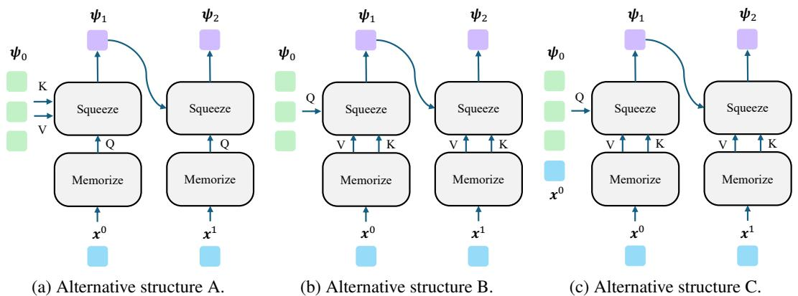
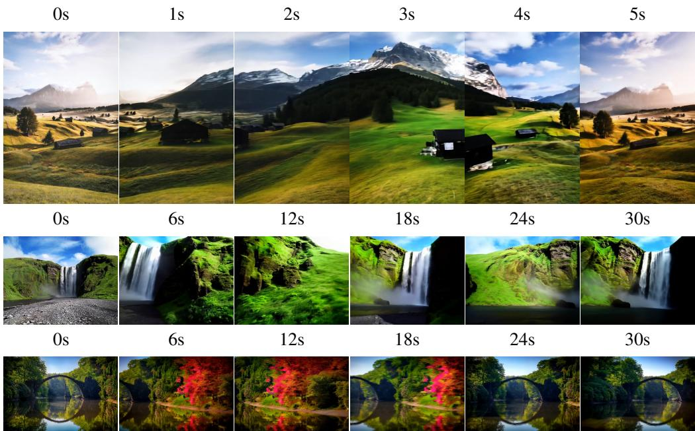
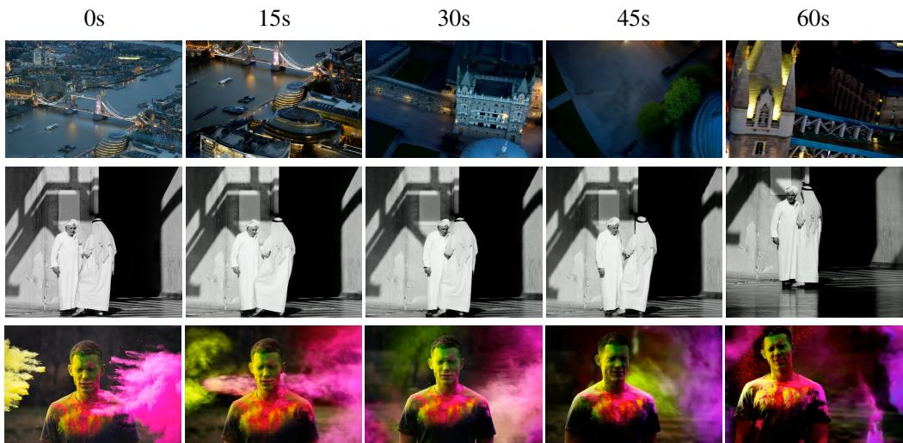

# 1. 论文基本信息

## 1.1. 标题
Pack and Force Your Memory: Long-form and Consistent Video Generation (打包并强制记忆：长时程和一致性视频生成)

## 1.2. 作者
Xiaofei Wu、Guozhen Zhang、Zhiyong Xu、Yuan Zhou、Qinglin Lu、Xuming He 等。作者隶属于上海科技大学（ShanghaiTech University）、腾讯混元（Tencent Hunyuan）和南京大学（Nanjing University）。

## 1.3. 发表期刊/会议
本文作为预印本（arXiv preprint）发布，旨在解决长时程视频生成中的核心挑战。arXiv 平台在计算机视觉和机器学习领域具有广泛影响力，是研究人员分享最新研究成果的重要渠道。

## 1.4. 发表年份
2025年。

## 1.5. 摘要
长时程视频生成面临双重挑战：模型需要捕捉长距离依赖，同时还要防止自回归解码中固有的错误累积。为应对这些挑战，本文做出了两项贡献。首先，在动态上下文建模方面，提出了 `MemoryPack`，这是一种可学习的上下文检索机制，它利用文本和图像信息作为全局指导，联合建模短期和长期依赖，实现了分钟级的时间一致性。这种设计能够优雅地随视频长度扩展，保持计算效率，并维持线性复杂度。其次，为了缓解错误累积，本文引入了 `Direct Forcing`，这是一种高效的单步近似策略，通过改进训练与推理的对齐，从而在推理过程中抑制错误传播。`MemoryPack` 和 `Direct Forcing` 共同显著增强了长时程视频生成的上下文一致性和可靠性，推动了自回归视频模型的实际可用性。

## 1.6. 原文链接
- 原文链接: https://arxiv.org/abs/2510.01784
- PDF 链接: https://arxiv.org/pdf/2510.01784v2.pdf
- 发布状态: 预印本（arXiv preprint）

# 2. 整体概括

## 2.1. 研究背景与动机
视频生成是生成建模领域的核心问题，在内容创作、具身智能（embodied intelligence）和互动游戏等应用中具有巨大潜力。近年来，`Diffusion Transformer (DiT)` 模型在捕获固定长度序列中的复杂时空依赖和角色交互方面表现出强大能力，能够生成逼真的视频片段。然而，长时程视频生成（minute-level 或更长）仍然极具挑战性。

**核心问题与现有挑战：**
1.  **计算复杂度高：** 长视频的令牌（token）数量庞大，导致基于 `DiT` 的二次复杂度架构在计算上难以承受。
2.  **长期依赖建模不足：** 缺乏有效的长期建模机制，导致随着视频长度增加，时间一致性漂移（drift）问题日益严重。现有方法通常通过保留最新帧或采用固定压缩策略来增强上下文一致性，但这些刚性机制主要依赖局部视觉信息，难以捕捉全局依赖，从而导致时间连贯性下降。
3.  <strong>错误累积（Error Accumulation）：</strong> 自回归生成中固有的训练-推理不匹配（training-inference mismatch）问题。训练时模型以真实（ground-truth）帧为条件，而推理时则依赖自身预测的输出，这导致错误在长序列中累积和传播。

**本文的切入点或创新思路：**
本文将长视频生成重新定义为一个长短期信息检索问题，模型必须有效检索持久的长期上下文和动态的短期线索来指导帧合成。同时，针对错误累积问题，提出了一种高效的训练-推理对齐策略。

## 2.2. 核心贡献/主要发现
本文提出了两项核心贡献来解决长时程视频生成中的主要挑战：
1.  **`MemoryPack` 机制：**
    *   提出了一种可学习的动态记忆机制 `MemoryPack`，它利用文本和图像作为全局指导来检索历史上下文，并利用相邻帧作为短期线索。
    *   该机制能够高效地建模分钟级的时间一致性，而无需依赖刚性压缩或对 `DiT` 核心框架进行修改。它以线性复杂度处理长视频，确保计算效率。
    *   通过将长视频生成重新表述为长短期信息检索问题，`MemoryPack` 有效地结合了长期叙事一致性（通过语义对齐）和短期运动/姿态保真度（通过相邻帧）。
2.  **`Direct Forcing` 策略：**
    *   引入了一种高效的单步近似策略 `Direct Forcing`，旨在对齐训练和推理过程，从而消除蒸馏（distillation）并减轻长时程生成中的错误累积。
    *   该策略基于整流流（rectified flow），通过预测向量场的单步逆向 `ODE` 计算来近似推理输出，无需额外计算开销，同时保持训练-推理一致性。
3.  **最先进的性能：**
    *   在 `VBenc` 基准测试中，本文方法在运动平滑度（Motion Smoothness）、背景一致性（Background Consistency）和主体一致性（Subject Consistency）等关键指标上实现了最先进（state-of-the-art）的性能，并增强了对错误累积的鲁棒性。
    *   实验结果表明，`MemoryPack` 和 `Direct Forcing` 有效地建模了长期上下文信息，并实现了卓越的一致性性能。

# 3. 预备知识与相关工作

## 3.1. 基础概念

### 3.1.1. 自回归模型 (Autoregressive Models)
在序列生成任务中，自回归模型是指模型在生成当前时间步的输出时，会以所有先前生成的输出为条件。例如，在视频生成中，生成第 $t$ 帧时，模型会参考第 `1` 帧到第 `t-1` 帧的内容。这种机制的优点是能够捕捉序列中的依赖关系，但缺点是在长序列生成中容易出现错误累积问题，即前面生成的错误会影响后续帧的生成。

### 3.1.2. Diffusion Transformer (DiT)
`Diffusion Transformer (DiT)` 是一种结合了扩散模型（Diffusion Models）和 Transformer 架构的生成模型。扩散模型通过逐步添加噪声来破坏数据结构，然后学习逆向过程以从噪声中恢复数据，从而生成高质量的样本。`Transformer` 架构因其强大的自注意力（`self-attention`）机制，在处理序列数据和捕捉长距离依赖方面表现出色。`DiT` 将 `Transformer` 用于扩散模型的去噪步骤，使其在图像和视频生成中取得了显著成果。
`DiT` 模型的关键在于其自注意力机制，其计算复杂度通常为输入序列长度的平方 $\mathcal{O}(L^2)$，其中 $L$ 是令牌数量。对于长视频（令牌数量巨大），这种二次复杂度会带来巨大的计算开销。

### 3.1.3. 整流流 (Rectified Flow)
整流流（Rectified Flow）是一种用于生成建模的连续深度生成模型，它将数据分布和简单的参考分布（如高斯噪声）之间的传输路径建模为一条直接的、直线型的常微分方程（ODE）轨迹。与传统的扩散模型不同，整流流的目标是学习一个从噪声到数据或从数据到噪声的直接映射，使得沿这条路径的任何点都可以被预测，并且积分（`integration`）过程可以更加高效。
在整流流中，数据 $\mathbf{x}$ 和噪声 $\boldsymbol{\epsilon}$ 之间的插值被定义为：
$$
\mathbf{x}_t = t\mathbf{x} + (1-t)\boldsymbol{\epsilon}, \quad t \in [0, 1]
$$
其中，$\mathbf{x}_t$ 是在时间步 $t$ 处的数据点。其瞬时速度（`instantaneous velocity`）为：
$$
\mathbf{u}_t = \frac{d\mathbf{x}_t}{dt} = \mathbf{x} - \boldsymbol{\epsilon}
$$
模型的目标是学习一个速度场 $v_\theta(\mathbf{x}_t, t)$ 来近似 $\mathbf{u}_t$，通过最小化流匹配损失（`flow matching loss`）进行优化。整流流的优点是其轨迹通常更直，使得单步或少步 `ODE` 求解器也能获得较好的生成效果，从而提高推理效率。

### 3.1.4. RoPE (Rotary Position Embedding)
`RoPE (Rotary Position Embedding)` 是一种用于 `Transformer` 模型的位置编码方法。传统的绝对位置编码（`absolute position embedding`）将位置信息直接添加到输入嵌入中，而相对位置编码（`relative position embedding`）则侧重于捕捉令牌之间的相对位置关系。`RoPE` 通过在自注意力机制中对查询（`query`）和键（`key`）向量应用旋转变换来编码相对位置。
具体来说，`RoPE` 在计算注意力分数时，通过旋转矩阵对查询和键向量进行变换，使得注意力分数天然地编码了相对位置信息：
$$
R_q(\mathbf{x}_q, m) R_k(\mathbf{x}_k, n) = R_g(\mathbf{x}_q, \mathbf{x}_k, n-m)
$$
其中，$R_q, R_k, R_g$ 分别表示查询、键和相对位置的旋转矩阵；$\mathbf{x}_q$ 和 $\mathbf{x}_k$ 是查询和键向量，$m$ 和 $n$ 是它们的位置索引。这种方法的好处是：
1.  **更好地捕捉长距离依赖：** 旋转变换能够更有效地处理序列中的相对位置信息，尤其是在长序列中。
2.  **泛化性更好：** 对于未见过长度的序列，`RoPE` 具有更好的泛化能力。
    在视频生成中，`RoPE` 可以用于处理跨视频片段的相对位置信息，避免由于片段划分导致的位置信息丢失，从而增强全局时间一致性。

## 3.2. 前人工作

### 3.2.1. 视频生成框架 (Framework for Video Generation)
现有的视频生成研究主要集中在秒级短视频片段。为了将模型扩展到分钟级长视频，研究者尝试了多种方法：
*   **自回归预测：** 例如 `Zhang and Agrawala [2025]` 和 `Teng et al. [2025]` 采用 `DiT` 作为骨干网络，通过对先前生成帧的条件进行迭代预测未来帧。然而，这些方法在建模长期依赖方面面临挑战，因为它们通常将模型限制为只关注最近的帧，这虽然提高了计算效率，但也不可避免地导致长期信息的丢失。
*   <strong>上下文混合 (Mixture of Contexts, MoC)：</strong> `Cai et al. [2025]` 引入 `MoC`，通过路由选择上下文信息。这种设计提高了利用上下文的灵活性，但它依赖于手动定义的选择规则，从而限制了模型自主确定相关信息的能力。

### 3.2.2. 高效长视频生成 (Efficient Accumulate for Long Video Generation)
由于大多数现有方法仍基于 `DiT` 框架，它们受到 $\mathcal{O}(L^2)$ 计算复杂度的限制，其中 $L$ 是上下文令牌的数量。为了解决这个问题，已提出了一些策略：
*   <strong>线性注意力（Linear Attention）：</strong> 引入线性注意力机制来替代原始的二次复杂度注意力，例如 `Cai et al., 2022`、`Gu and Dao, 2023b`、`Yang et al., 2024a`、`Wang et al., 2020`、`Peng et al., 2023`、`Gu and Dao, 2023a`。
*   <strong>测试时训练（Test-time Training）：</strong> 通过测试时训练来减轻训练成本 `Dalal et al., 2025`。
*   <strong>KV-缓存（KV-cache）：</strong> `Huang et al. [2025]` 通过 `KV-cache` 进行滚动更新来加速训练。
*   **训练无关方法：** `Xi et al. [2025] (SVG)` 利用 `3D` 全注意力的固有稀疏性进一步提高推理效率。

### 3.2.3. 错误累积缓解 (Error Accumulation Mitigation)
自回归视频生成中的错误累积是一个核心问题：训练时模型以真实（`ground-truth`）帧为条件，而推理时则依赖自身预测的输出。
*   **逆序生成：** `Zhang and Agrawala [2025]` 尝试通过逆序生成帧来缓解漂移，但对尾帧的依赖可能会降低长视频中的运动动态。
*   **基于生成输出的条件化：** `Huang et al. [2025]` 通过直接以生成输出为条件来解决此问题，但为了提高效率，需要进行分布蒸馏（`distribution distillation`），这引入了额外的计算成本，并可能导致生成质量下降。

## 3.3. 差异化分析
本文方法与上述相关工作的主要区别和创新点在于：
1.  **动态上下文建模：** `MemoryPack` 机制通过结合文本和图像作为全局指导，动态地检索和建模长短期依赖。这与仅依赖局部视觉信息或固定压缩策略的方法（如 `Teng et al., 2025`、`Zhang and Agrawala, 2025`）形成对比，能够更灵活、更全面地捕捉上下文信息，从而实现分钟级的时间一致性。
2.  **计算效率与复杂度：** `MemoryPack` 采用线性复杂度设计，解决了 `DiT` 模型在长视频生成中面临的二次复杂度计算瓶颈，使其能够优雅地扩展到更长的视频。
3.  **训练-推理对齐：** `Direct Forcing` 策略通过基于整流流的单步近似，直接对齐训练和推理过程，有效缓解了自回归生成中的错误累积。与需要分布蒸馏或引入额外计算的现有方法（如 `Huang et al., 2025`）相比，`Direct Forcing` 更加高效且无需额外的计算开销，同时保持生成质量。
4.  **全局语义感知：** `MemoryPack` 中的 `SemanticPack` 通过整合视觉特征与文本和图像指导，确保长期记忆具有全局感知和语义基础，这优于仅依赖视觉表示或手动选择规则的方法（如 `Cai et al., 2025`）。

# 4. 方法论

本文旨在解决长时程视频生成中的两大挑战：长距离依赖建模和错误累积。为此，提出了 `MemoryPack` 和 `Direct Forcing` 两种创新机制。整个框架建立在 `Diffusion Transformer (DiT)` 架构之上，以自回归方式生成未来视频片段。

给定 $n$ 个历史视频片段 $\{ \mathbf { x } ^ { 0 } , \dotsc , \mathbf { x } ^ { n - 1 } \}$ 、一个文本提示 $P$ 和一个条件图像 $I$，模型的目标是生成下一个视频片段 $\mathbf { x } ^ { n }$。这里，所有的视频片段都指其在隐空间（`latent-space`）中的表示。

整体架构如 Figure 1 所示。

![Figure 1: Overview of our framework. Given a text prompt, an input image, and history frames, the model autoregressively generates future frames. Prior to feeding data into MM-DiT, MemoryPack retrieves both long- and short-term context. In SemanticPack, visual features are extracted within local windows via self-attention, followed by cross-attention to align them with global textual and visual information to iteratively generate long-term dependencies $\\psi _ { n }$ . This design achieves linear computational complexity and substantially improves the efficiency of long-form video generation.](images/1.jpg)
*该图像是示意图，展示了提出的框架的结构。左侧部分展示了MM-DiT模型在生成未来帧过程中如何通过MemoryPack模块获取长期和短期的上下文信息。右侧部分详细介绍了SemanticPack模块的工作机制，包括自注意力和记忆机制的应用，以提取和加强长期依赖特征 $\psi_n$。该设计旨在实现线性计算复杂度，提高长视频生成的效率。*

<VLM_IMG_DESCRIPTION>
该图像是示意图，展示了提出的框架的结构。左侧部分展示了MM-DiT模型在生成未来帧过程中如何通过MemoryPack模块获取长期和短期的上下文信息。右侧部分详细介绍了SemanticPack模块的工作机制，包括自注意力和记忆机制的应用，以提取和加强长期依赖特征 $\psi_n$。该设计旨在实现线性计算复杂度，提高长视频生成的效率。
</VLM_IMG_DESCRIPTION>
以下是原文 Figure 1 的概述：
我们的框架概述。给定文本提示、输入图像和历史帧，模型自回归地生成未来帧。在将数据输入 `MM-DiT` 之前，`MemoryPack` 检索长短期上下文。在 `SemanticPack` 中，视觉特征通过自注意力在局部窗口内提取，然后通过交叉注意力将其与全局文本和视觉信息对齐，以迭代生成长期依赖 $\psi _ { n }$。这种设计实现了线性计算复杂度，并显著提高了长视频生成的效率。

## 4.1. MemoryPack：动态上下文建模
`MemoryPack` 是一个分层模块，它共同利用互补的短期和长期上下文进行视频生成。它由两个组件组成：`FramePack` 和 `SemanticPack`。

### 4.1.1. FramePack：短期上下文
`FramePack` 专注于短期上下文，通过固定压缩方案捕获外观和运动，从而强制执行短期一致性。然而，其固定的窗口大小和压缩比限制了它在长时间范围内动态传播信息的能力。本文在此基础上引入了 `SemanticPack` 来解决长期一致性问题。

### 4.1.2. SemanticPack：长期上下文与全局指导
为了保持全局时间连贯性，`SemanticPack` 将视觉特征与文本和图像指导相结合，这与以前仅依赖视觉表示的方法不同。它通过迭代更新长期记忆表示 $\psi$ 来实现。这个过程利用上下文视频片段 $\{ \mathbf { x } ^ { 0 } , \ldots , \mathbf { x } ^ { n - 1 } \}$ 、文本提示 $P$ 和参考图像 $I$。

`SemanticPack` 的核心操作包括：
1.  <strong>记忆（Memorize）：</strong> 在历史片段的窗口内应用自注意力（`self-attention`）来生成紧凑的嵌入。这种方法通过保留整体窗口级线索，缓解了处理长历史时二次复杂度的计算障碍。
2.  <strong>压缩（Squeeze）：</strong> 然后将文本和图像指导注入到这个视觉记忆中。遵循 `Wan et al., 2025` 的工作，这被实现为一个交叉注意力（`cross-attention`）层，其中 `Memorize` 的输出作为查询（`query`），而长期记忆表示 $\psi$ 作为键（`key`）和值（`value`）。这种对齐确保了长期记忆保持全局感知和语义基础。

    迭代更新长期记忆 $\psi$ 的公式如下：
$$
\psi _ { n + 1 } = \mathrm { S q u e e z e } \big ( \psi _ { n } , \mathrm { M e m o r i z e } ( \mathbf { x } ^ { n } ) \big )
$$
其中：
*   $\psi_n$ 表示在生成第 $n$ 个片段之前的长期记忆表示。
*   $\mathbf{x}^n$ 是当前正在处理的第 $n$ 个历史视频片段。
*   $\mathrm{Memorize}(\mathbf{x}^n)$ 表示对当前片段 $\mathbf{x}^n$ 进行自注意力处理后得到的紧凑视觉嵌入。
*   $\mathrm{Squeeze}(\cdot, \cdot)$ 函数执行交叉注意力，将 $\mathrm{Memorize}(\mathbf{x}^n)$ 的输出作为查询，将 $\psi_n$ 作为键和值。通过这种方式，当前片段的信息被整合并压缩到长期记忆中，并由文本和图像的全局指导进行调节。
*   $\psi_{n+1}$ 是更新后的长期记忆表示，用于指导后续片段的生成。

    **初始化：** 对于初始化，$\psi_0$ 被设置为提示特征和参考图像特征的拼接，这提供了一个语义先验（`semantic prior`），作为记忆轨迹的锚点。

**计算复杂度：** `SemanticPack` 的计算复杂度为 $\mathcal{O}(N)$，其中 $N$ 是历史帧的数量。这确保了可扩展性，防止成本随着历史帧数量的增加而急剧增长。

### 4.1.3. RoPE 一致性 (RoPE Consistency)
在基于 `DiT` 的自回归视频生成中，长视频通常在训练期间被分割成多个片段。这种分割会导致即使来自同一视频的相邻片段也被独立建模，从而导致跨片段位置信息的丢失，并引发闪烁（`flickering`）或时间不连续（`temporal discontinuities`）。

为了解决这个问题，本文将输入图像视为一个类似 `CLS` 的令牌，并结合 `RoPE (Rotary Position Embedding)` 来显式编码跨片段的相对位置。具体来说，在训练期间，对于每个视频片段，将图像分配为整个视频的初始索引，从而保留连贯性并增强全局时间一致性。

`RoPE` 的形式化定义满足：
$$
\begin{array} { r } { R _ { q } ( \mathbf { x } _ { q } , m ) R _ { k } ( \mathbf { x } _ { k } , n ) = R _ { g } ( \mathbf { x } _ { q } , \mathbf { x } _ { k } , n - m ) } \\ { \Theta _ { k } ( \mathbf { x } _ { k } , n ) - \Theta _ { q } ( \mathbf { x } _ { q } , m ) = \Theta _ { g } ( \mathbf { x } _ { q } , \mathbf { x } _ { k } , n - m ) } \end{array}
$$
其中：
*   $R_q, R_k, R_g$ 分别表示查询（`query`）、键（`key`）和相对位置的旋转矩阵。
*   $\Theta_q, \Theta_k, \Theta_g$ 分别表示相应的旋转角度。
*   $\mathbf{x}_q$ 和 $\mathbf{x}_k$ 是查询和键向量。
*   $m$ 和 $n$ 是它们的位置索引。
    通过将图像令牌分配为起始索引，序列可以共同捕获跨视频片段的绝对位置和每个片段内的相对依赖，从而缓解闪烁和不连续性。

## 4.2. Direct Forcing：错误累积缓解
自回归视频生成经常受到错误累积的困扰，这是由于训练和推理之间的差异造成的：在训练期间，模型以真实帧为条件，而在推理期间，它依赖于自己先前生成的输出。

为了缓解这种不匹配，本文提出了一种基于整流流（`rectified flow`）的单步近似策略，该策略直接对齐训练和推理轨迹，同时保持计算效率。

### 4.2.1. 基于整流流的训练 (Training with Rectified Flow)
根据 `Liu et al., 2022` 提出的整流流公式，我们定义了视频分布 $\mathbf { X }$ 和高斯噪声 $\boldsymbol { \epsilon } \sim \mathcal { N } ( 0 , I )$ 之间的线性插值。为了简化，我们省略了 $\mathbf { X }$ 的上标，并使用下标表示时间步 $t$：
$$
\mathbf { x } _ { t } = t \mathbf { x } + ( 1 - t ) { \boldsymbol { \epsilon } }, \quad t \in [ 0 , 1 ]
$$
其中：
*   $\mathbf{x}_t$ 是在时间步 $t$ 时的中间状态。
*   $\mathbf{x}$ 是目标视频分布中的真实样本。
*   $\boldsymbol{\epsilon}$ 是从标准正态分布 $\mathcal{N}(0, I)$ 中采样的噪声。
*   $t$ 是时间变量，从 `0` 变化到 `1`。

    沿此轨迹的瞬时速度（`instantaneous velocity`）为：
$$
{ \pmb u } _ { t } = \frac { d { \bf x } _ { t } } { d t } = { \bf x } - \epsilon
$$
其中：
*   $\mathbf{u}_t$ 是在时间步 $t$ 时的瞬时速度向量。
*   这个速度向量定义了一个常微分方程（`ODE`），引导 $\mathbf{x}_t$ 向目标 $\mathbf{x}$ 发展。
    模型的目标是预测一个速度场 $v _ { \theta } ( \mathbf { x } _ { t } , t )$，并通过最小化流匹配损失（`flow matching loss`）来优化参数 $\theta$：
$$
\mathcal { L } _ { \mathrm { F M } } ( \theta ) = \mathbb { E } _ { t , \mathbf { x } , \epsilon } \big [ | | v _ { \theta } ( \mathbf { x } _ { t } , t ) - { \mathbf { u } } _ { t } | | ^ { 2 } \big ]
$$
其中：
*   $\mathcal{L}_{\mathrm{FM}}(\theta)$ 是流匹配损失函数。
*   $\mathbb{E}_{t, \mathbf{x}, \epsilon}$ 表示对时间 $t$、真实数据 $\mathbf{x}$ 和噪声 $\boldsymbol{\epsilon}$ 的期望。
*   $v_\theta(\mathbf{x}_t, t)$ 是模型预测的速度场，参数为 $\theta$。
*   $||\cdot||^2$ 表示 L2 范数的平方。

### 4.2.2. 单步近似 (Single-Step Approximation)
在推理阶段，视频的生成是通过对从 $\mathbf { x } _ { 0 } \sim \mathcal { N } ( 0 , I )$ 开始的 `ODE` 进行逆向时间积分来生成 $\hat { \bf x } _ { 1 }$：
$$
\hat { \mathbf { x } } _ { 1 } = \int _ { 0 } ^ { 1 } v _ { \theta } ( \mathbf { x } _ { t } , t ) d t
$$
其中：
*   $\hat{\mathbf{x}}_1$ 是模型生成的最终视频片段（或帧）。
*   $\int_0^1 v_\theta(\mathbf{x}_t, t) dt$ 表示从时间 $t=0$ 到 $t=1$ 对模型预测的速度场进行积分。

    如 Figure 2 所示，`Student Forcing` 方法通过多步推理来近似 $\hat { \bf x } _ { 1 }$，但这会带来显著的计算开销并减慢训练收敛。

    ![Figure 2: Schematic illustration of the approximation process. In Student Forcing, multi-step inference is applied to approximate $\\hat { \\bf x } _ { 1 }$ , but this incurs substantial computational overhead and slows training convergence. In contrast, Direct Forcing applies a single-step transformation from $\\mathbf { x } _ { 1 }$ to $\\mathbf { x } _ { t }$ , followed by a denoising step that produces $\\tilde { \\mathbf { x } } _ { 1 }$ as an estimate of $\\hat { \\mathbf { x } } _ { 1 }$ . This approach incurs no additional computational burden, thereby enabling faster training.](images/2.jpg)
    *该图像是示意图，展示了两种推断方法：Student Forcing 和 Direct Forcing。左侧部分描绘了 Student Forcing 的过程，通过多步推断近似 $\hat{x}_1$，并引入逆高斯噪声；而右侧部分则展示了 Direct Forcing，仅需一步转换从 $x_1$ 到 $x_t$，并注入高斯噪声，通过近似得到估计值 $\tilde{x}_1$。该方法相较于 Student Forcing 更加高效，无额外计算负担。*

<VLM_IMG_DESCRIPTION>
该图像是示意图，展示了两种推断方法：Student Forcing 和 Direct Forcing。左侧部分描绘了 Student Forcing 的过程，通过多步推断近似 $\hat{x}_1$，并引入逆高斯噪声；而右侧部分则展示了 Direct Forcing，仅需一步转换从 $x_1$ 到 $x_t$，并注入高斯噪声，通过近似得到估计值 $\tilde{x}_1$。该方法相较于 Student Forcing 更加高效，无额外计算负担。
</VLM_IMG_DESCRIPTION>
以下是原文 Figure 2 的概述：
近似过程示意图。在 `Student Forcing` 中，多步推理被应用于近似 $\hat { \bf x } _ { 1 }$，但这会带来显著的计算开销并减慢训练收敛。相反，`Direct Forcing` 应用从 $\mathbf { x } _ { 1 }$ 到 $\mathbf { x } _ { t }$ 的单步转换，然后通过去噪步骤产生 $\tilde { \mathbf { x } } _ { 1 }$ 作为 $\hat { \mathbf { x } } _ { 1 }$ 的估计。这种方法没有额外的计算负担，从而实现更快的训练。

基于 Eq. 7，本文通过单步近似轨迹来对齐训练和推理，而无需承担高计算成本：
$$
\tilde { \mathbf { x } } _ { 1 } = \mathbf { x } _ { t } + \Delta _ { t } * v _ { \theta } ( \mathbf { x } _ { t } , t ) \approx \hat { \mathbf { x } } _ { 1 }, \quad \Delta _ { t } = 1 - t
$$
其中：
*   $\tilde{\mathbf{x}}_1$ 是对最终生成视频片段 $\hat{\mathbf{x}}_1$ 的单步近似。
*   $\mathbf{x}_t$ 是在时间步 $t$ 时的中间状态。
*   $v_\theta(\mathbf{x}_t, t)$ 是模型预测的速度场。
*   $\Delta_t = 1-t$ 是从当前时间步 $t$ 到目标时间步 `1` 的时间差。
    直观上，由于整流流保证了更直接的 `ODE` 轨迹，$\mathbf{x}_t + \Delta_t v_\theta(\mathbf{x}_t, t)$ 可以作为生成分布的有效单步近似，从而弥合了训练和推理之间的差距。具体而言，模型首先使用真实数据 $\mathbf{X}^{i-1}$ 和 `Eq. 7` 来获得单步近似 $\tilde{\mathbf{x}}^{i-1}$。然后，这个近似作为条件输入，用于在训练期间生成 $\mathbf{x}^i$，从而使模型暴露在类推理条件下，有效缓解了分布不匹配并减少了错误累积。

### 4.2.3. 优化策略 (Optimization Strategy)
在实践中，本文利用 `Direct Forcing` 按时间顺序从同一视频中采样片段，并将其用作迭代训练的条件输入。与先前独立训练片段的方法（如 `Dalal et al., 2025`、`Zhao et al., 2024`）不同，这种设计明确强化了跨片段的时间连续性。

然而，在每一步都应用反向传播（`backpropagation`）与优化器更新可能会扰乱学习到的分布，并损害训练期间跨片段输入分布的一致性。为了缓解这个问题，本文采用了梯度累积（`gradient accumulation`）策略：在执行单个参数更新之前，将多个片段的梯度累积起来。这种策略稳定了优化，并且实验表明，它显著提高了生成视频的跨片段一致性和长期时间连贯性。

# 5. 实验设置

## 5.1. 数据集
训练数据集主要来源于 `Mira [Ju et al., 2024]` 和 `Sekai [Li et al., 2025b]`，包含约16,000个视频片段，总时长为150小时，涵盖了各种场景。`Mira` 和 `Sekai` 中最长的视频都长达一分钟。为了确保数据质量，对所有样本应用了动态性和镜头剪切过滤（`dynamism and shot-cut filtering`）。

## 5.2. 评估指标
本文遵循既定的评估协议 `[Huang et al., 2024a, Zheng et al., 2025]`，使用六个定量指标以及暴露偏差（`exposure bias`）和人工评估来评估生成的视频。为了区分模型在不同时间尺度上的生成能力，视频被分为三类时长：短视频（10秒）、中等长度视频（30秒）和长视频（1分钟）。

### 5.2.1. 图像质量 (Imaging Quality)
**概念定义：** 该指标衡量生成帧中的失真，包括过度曝光、噪声和模糊。
**数学公式：** 该论文未直接给出成像质量的计算公式，但说明使用了 `MUSIQ [Ke et al., 2021]` 图像质量预测器，该预测器在 `SPAQ [Fang et al., 2020]` 数据集上训练。`MUSIQ` (Multi-scale Image Quality Transformer) 通常通过一个预训练的 `Transformer` 模型，将图像的多尺度特征映射到人类感知的质量分数。`SPAQ` (Smartphone Photography Quality) 是一个包含智能手机拍摄照片及其感知质量分数的基准数据集。因此，`Imaging Quality` 的评估实际上是 `MUSIQ` 模型的输出分数。
$$
\text{Quality Score} = \text{MUSIQ\_Predictor}(\text{Image})
$$
**符号解释：**
*   $\text{Quality Score}$：由 `MUSIQ` 模型预测的图像质量分数，通常分数越高表示质量越好。
*   $\text{MUSIQ\_Predictor}(\cdot)$：基于 `Transformer` 的图像质量预测模型。
*   $\text{Image}$：待评估的生成视频中的单帧图像。

### 5.2.2. 美学质量 (Aesthetic Quality)
**概念定义：** 该指标评估每个视频帧的美学质量，考虑构图、色彩丰富度和和谐度、照片真实感、自然度以及整体艺术价值等因素。
**数学公式：** 论文未直接给出美学质量的计算公式，但说明使用了 `LAION aesthetic predictor [Schuhmann et al., 2022]`。`LAION aesthetic predictor` 是一个预训练模型，用于预测图像的美学分数，通常基于大量人类标注数据进行训练。
$$
\text{Aesthetic Score} = \text{LAION\_Aesthetic\_Predictor}(\text{Image})
$$
**符号解释：**
*   $\text{Aesthetic Score}$：由 `LAION aesthetic predictor` 预测的图像美学分数，通常分数越高表示美学质量越好。
*   $\text{LAION\_Aesthetic\_Predictor}(\cdot)$：基于 `LAION-5B` 数据集训练的图像美学预测模型。
*   $\text{Image}$：待评估的生成视频中的单帧图像。

### 5.2.3. 动态程度 (Dynamic Degree)
**概念定义：** 该指标衡量合成视频中运动的程度。
**数学公式：** 论文说明使用了 `RAFT [Teed and Deng, 2020]` 来估计运动程度。`RAFT` (Recurrent All-Pairs Field Transforms) 是一种用于光流（`optical flow`）估计的模型，它能够计算视频帧之间像素级别的运动向量。通常，动态程度可以通过计算帧间光流矢量的大小或平均范数来量化。
$$
\text{Dynamic Degree} = \frac{1}{T-1} \sum_{t=1}^{T-1} ||\text{OpticalFlow}(\text{Frame}_t, \text{Frame}_{t+1})||_2
$$
**符号解释：**
*   $\text{Dynamic Degree}$：视频的动态程度，数值越大表示运动越剧烈。
*   $T$：视频的总帧数。
*   $\text{Frame}_t$：视频在时间 $t$ 的帧。
*   $\text{OpticalFlow}(\text{Frame}_t, \text{Frame}_{t+1})$：由 `RAFT` 模型计算的从 $\text{Frame}_t$ 到 $\text{Frame}_{t+1}$ 的光流场。
*   $||\cdot||_2$：L2 范数，表示光流向量的大小。

### 5.2.4. 运动平滑度 (Motion Smoothness)
**概念定义：** 该指标评估视频运动的流畅性。
**数学公式：** 论文说明利用了 `VBenc` 中采用的视频帧插值模型 `[Li et al., 2023]` 的运动先验（`motion priors`）来评估运动平滑度。运动平滑度通常通过分析帧间运动的连贯性和预测的运动轨迹的平滑性来衡量。具体计算可能涉及插值帧与真实帧的差异，或运动矢量场的平滑度。
$$
\text{Motion Smoothness} = \text{Smoothness\_Metric}(\text{MotionPriors}(\text{Video}))
$$
**符号解释：**
*   $\text{Motion Smoothness}$：视频的运动平滑度，通常数值越高表示运动越平滑。
*   $\text{MotionPriors}(\text{Video})$：从视频帧插值模型中提取的运动先验信息。
*   $\text{Smoothness\_Metric}(\cdot)$：基于运动先验计算平滑度的函数。

### 5.2.5. 背景一致性 (Background Consistency)
**概念定义：** 该指标通过计算 `CLIP` 特征相似度来衡量背景场景的时间一致性。
**数学公式：** 遵循 `VBenc` 的方法，背景一致性通过计算连续帧的 `CLIP [Radford et al., 2021]` 特征的余弦相似度（`cosine similarity`）来衡量。
$$
\text{Background Consistency} = \frac{1}{T-1} \sum_{t=1}^{T-1} \text{CosineSim}(\text{CLIP\_Feature}(\text{Background}_t), \text{CLIP\_Feature}(\text{Background}_{t+1}))
$$
**符号解释：**
*   $\text{Background Consistency}$：背景一致性，数值越高表示背景越稳定、一致。
*   $T$：视频的总帧数。
*   $\text{Background}_t$：视频在时间 $t$ 的背景区域。
*   $\text{CLIP\_Feature}(\cdot)$：`CLIP` 模型提取的图像特征。
*   $\text{CosineSim}(A, B) = \frac{A \cdot B}{||A||_2 ||B||_2}$：计算两个向量 $A$ 和 $B$ 之间的余弦相似度。

### 5.2.6. 主体一致性 (Subject Consistency)
**概念定义：** 该指标通过计算 `DINO` 特征相似度来评估序列中主体外观的一致性。
**数学公式：** 通过计算连续帧的 `DINO [Caron et al., 2021]` 特征的余弦相似度来评估主体一致性。
$$
\text{Subject Consistency} = \frac{1}{T-1} \sum_{t=1}^{T-1} \text{CosineSim}(\text{DINO\_Feature}(\text{Subject}_t), \text{DINO\_Feature}(\text{Subject}_{t+1}))
$$
**符号解释：**
*   $\text{Subject Consistency}$：主体一致性，数值越高表示主体外观在视频中越稳定、一致。
*   $T$：视频的总帧数。
*   $\text{Subject}_t$：视频在时间 $t$ 的主体区域。
*   $\text{DINO\_Feature}(\cdot)$：`DINO` 模型提取的图像特征。
*   $\text{CosineSim}(A, B)$：计算两个向量 $A$ 和 $B$ 之间的余弦相似度。

### 5.2.7. 暴露偏差指标 (Exposure Bias Metric)
**概念定义：** 遵循 `Zhang and Agrawala [2025]`，该指标用于评估长时程视频在生成过程中，由于错误累积导致性能（如图像质量、美学质量）随时间下降的程度。它通过比较视频起始部分和结束部分的指标差异来量化这种偏差。
**数学公式：** 衡量长时程视频 $V$ 在指标 $M$（例如，图像质量、美学质量）上的暴露偏差 $\Delta _ { \mathrm { d r i f t } } ^ { M }$：
$$
\Delta _ { \mathrm { d r i f t } } ^ { M } ( V ) = \big | M ( V _ { \mathrm { s t a r t } } ) - M ( V _ { \mathrm { e n d } } ) \big |
$$
其中：
*   $\Delta_{\mathrm{drift}}^M(V)$：视频 $V$ 在指标 $M$ 上的漂移量或暴露偏差。数值越低越好。
*   $M(\cdot)$：用于评估视频某个指标（如图像质量、美学质量）的函数。
*   $V_{\mathrm{start}}$：代表视频的前 $15\%$ 帧。
*   $V_{\mathrm{end}}$：代表视频的后 $15\%$ 帧。
*   **重要说明：** 为了准确测量模型的长时程生成能力，`V_end` 选取的是模型自身生成的最后一帧，而不是用户获取的视频的最终帧，以聚焦于模型的生成能力和外推能力。

### 5.2.8. 人工评估 (Human Assessment)
**概念定义：** 通过 `A/B` 测试收集人类偏好。
**评估方式：** 生成160个视频，随机打乱顺序，分发给评估者以确保无偏评估。报告 `ELO-K32` 分数和相应的排名。`ELO` 评分系统是一种衡量玩家相对技能水平的方法，在此处用于衡量生成视频的相对质量。

## 5.3. 对比基线
本文方法与以下基线模型进行了比较：
*   `FramePack-F0`
*   `FramePack-F1 [Zhang and Agrawala, 2025]`
*   `Magi-1 [Teng et al., 2025]`

    这些基线模型都是近期在视频生成领域，特别是长视频生成方面具有代表性的工作。`FramePack-F0` 和 `FramePack-F1` 基于 `DiT` 框架，并通过关注最近帧来提高计算效率，但可能在长期依赖建模上存在不足。`Magi-1` 是一个大规模自回归视频生成模型。通过与这些基线进行比较，可以全面评估本文方法在保持时间一致性、缓解错误累积和提升生成质量方面的优势。

# 6. 实验结果与分析

## 6.1. 核心结果分析
实验将本文方法与 `FramePack-F0`、`FramePack-F1` 和 `Magi-1` 进行了比较。评估了160个视频，包括60个10秒视频、60个30秒视频和40个60秒视频，均以 480p 分辨率和 24 帧每秒生成。所有图像均来自 `VBenc [Hu et al., 2024b]`，提示词使用 $Qwen2.5-V1 [Bai et al., 2025]$ 重写。

### 6.1.1. 定性结果 (Qualitative results)
Figure 3 和 Figure 4 展示了有代表性的30秒和60秒视频示例。

*该图像是插图，展示了比较不同方法生成30秒视频的效果。每列展示不同时间点的画面，清晰体现了各种方法在蔬菜加入锅中时的流动性和互动性，包括真实图像及三种生成方法（f0、f1及ours）的表现。*

<VLM_IMG_DESCRIPTION>
该图像是插图，展示了比较不同方法生成30秒视频的效果。每列展示不同时间点的画面，清晰体现了各种方法在蔬菜加入锅中时的流动性和互动性，包括真实图像及三种生成方法（f0、f1及ours）的表现。
</VLM_IMG_DESCRIPTION>
以下是原文 Figure 3 的概述：
30秒视频可视化，比较了所有方法在一致性保持和交互能力方面的表现。提示词：蔬菜被加入一个大银锅中炖煮的特写镜头，绿叶蔬菜和茎秆在冒泡的液体中生动地旋转。升腾的蒸汽传达着温暖和运动，背景中模糊的厨房元素和自然光营造出一种温馨而充满活力的烹饪氛围。

![Figure 4: Visualization of a 60-second video illustrating the accumulation of errors. Our method maintains image quality comparable to the first frame even over minute-long sequences. Prompt: The sun sets over a serene lake nestled within majestic mountains, casting a warm, golden glow that softens at the horizon. The sky is a vibrant canvas of orange, pink, and purple, with wispy clouds catching the last light. Calm and reflective, the lake's surface mirrors the breathtaking colors of the sky in a symphony of light and shadow. In the foreground, lush greenery and rugged rocks frame the tranquil scene, adding a sense of life and stillness. Majestic, misty mountains rise in the background, creating an overall atmosphere of profound peace and tranquility.](images/4.jpg)
*该图像是展示了一个60秒的视频生成质量的示意图，展示了在不同时间点（0s, 15s, 30s, 45s和60s）中，采用不同方法生成图像的效果。我们的算法维持了与首帧相当的图像质量，即使在长达一分钟的序列中，也有效控制了错误积累。*

<VLM_IMG_DESCRIPTION>
该图像是展示了一个60秒的视频生成质量的示意图，展示了在不同时间点（0s, 15s, 30s, 45s和60s）中，采用不同方法生成图像的效果。我们的算法维持了与首帧相当的图像质量，即使在长达一分钟的序列中，也有效控制了错误积累。
</VLM_IMG_DESCRIPTION>
以下是原文 Figure 4 的概述：
60秒视频可视化，展示了错误累积。我们的方法即使在长达一分钟的序列中也能保持与第一帧相当的图像质量。提示词：太阳在雄伟群山环抱的宁静湖泊上落下，金色的余晖在天边柔和地散开。天空是橙色、粉色和紫色的鲜艳画卷，缕缕轻云捕捉着最后的霞光。平静而反光的湖面映照着令人惊叹的天空色彩，光影交织成一曲交响乐。前景中，郁郁葱葱的绿植和崎岖的岩石构成了宁静的画面，增添了一丝生机和静谧。背景中，雄伟迷蒙的群山升起，营造出一种深沉的宁静氛围。

本文方法与 `FramePack-F1` 和 `Magi-1` 相比，时间身份漂移和几何失真更少。虽然 `FramePack-F0` 在 Figure 3 中保持了视觉保真度，但其帧间动态性较弱，这与它的定量指标一致。值得注意的是，随着视频长度的增加，竞争方法会遭受更严重的错误累积，而本文方法能保持视频质量，包括美学和角色一致性。这些结果凸显了 `Direct Forcing` 在增强长时程视频生成方面的有效性。

### 6.1.2. 定量结果 (Quantitative results)
以下是原文 Table 1 的结果：

<table>
<thead>
<tr>
<td rowspan="2">Method</td>
<td colspan="6">Global Metrics</td>
<td colspan="4">Error Accumulation</td>
<td colspan="2">Human Evaluation</td>
</tr>
<tr>
<td>Imaging Quality ↑</td>
<td>Aesthetic Quality ↑</td>
<td>Dynamic Degree ↑</td>
<td>Motion Smoothness ↑</td>
<td>Background Consistency ↑</td>
<td>Subject Consistency ↑</td>
<td>ΔImaging Quality ↓</td>
<td>ΔAesthetic Quality ↓</td>
<td>ΔBackground Consistency ↓</td>
<td>ΔSubject Consistency ↓</td>
<td>ELO ↑</td>
<td>Rank ↓</td>
</tr>
</thead>
<tbody>
<tr>
<td>Magi-1</td>
<td>54.64%</td>
<td>53.98%</td>
<td>67.5%</td>
<td>99.17%</td>
<td>89.30%</td>
<td>82.33%</td>
<td>4.19%</td>
<td>5.02%</td>
<td>1.53%</td>
<td>0.97%</td>
<td>1434</td>
<td>4</td>
</tr>
<tr>
<td>FramePack-F0</td>
<td>68.06%</td>
<td>62.89%</td>
<td>15.38%</td>
<td>99.27%</td>
<td>92.22%</td>
<td>90.03%</td>
<td>2.34%</td>
<td>2.45%</td>
<td>2.68%</td>
<td>2.99%</td>
<td>1459</td>
<td>3</td>
</tr>
<tr>
<td>FramePack-F1</td>
<td>67.06%</td>
<td>59.11%</td>
<td>53.85%</td>
<td>99.12%</td>
<td>90.21%</td>
<td>83.48%</td>
<td>2.71%</td>
<td>4.57%</td>
<td>1.59%</td>
<td>1.08%</td>
<td>1537</td>
<td>2</td>
</tr>
<tr>
<td>Ours</td>
<td><b>67.55%</b></td>
<td><b>59.75%</b></td>
<td><b>48.37%</b></td>
<td><b>99.31%</b></td>
<td><b>93.25%</b></td>
<td><b>91.16%</b></td>
<td><b>2.51%</b></td>
<td><b>3.25%</b></td>
<td><b>1.21%</b></td>
<td><b>0.76%</b></td>
<td><b>1568</b></td>
<td><b>1</b></td>
</tr>
</tbody>
</table>

表 1: 不同方法在全球指标、错误累积指标和人工评估上的比较。最优结果以粗体显示。

如 Table 1 所示，本文方法在背景一致性（`Background Consistency`）、主体一致性（`Subject Consistency`）和运动平滑度（`Motion Smoothness`）方面取得了最佳性能，这表明它在保持长期时间连贯性和生成平滑运动方面具有强大能力。虽然 `FramePack-F0` 获得了更高的图像质量（`Imaging Quality`）和美学质量（`Aesthetic Quality`），但其帧间动态性较弱，这归因于其抗漂移采样策略。相反，`Magi-1` 产生了更强的动态性，但时间一致性和主体一致性有所下降。在人工评估中，本文方法凭借 `ELO-32K` 评分仍然取得了最佳的整体性能。这些发现也得到了 Figure 3 和 Figure 4 定性结果的进一步证实。重要的是，本文方法还实现了最低的错误累积（`Error Accumulation`），这突显了其在长时程视频生成中的稳定性。

## 6.2. 消融实验/参数分析
以下是原文 Table 2 的结果：

<table>
<thead>
<tr>
<td rowspan="2">Method</td>
<td colspan="6">Global Metrics</td>
<td colspan="4">Error Accumulation</td>
</tr>
<tr>
<td>Imaging Quality ↑</td>
<td>Aesthetic Quality ↑</td>
<td>Dynamic Degree ↑</td>
<td>Motion Smoothness ↑</td>
<td>Background Consistency ↑</td>
<td>Subject Consistency ↑</td>
<td>ΔImaging Quality ↓</td>
<td>ΔAesthetic Quality ↓</td>
<td>ΔBackground Consistency ↓</td>
<td>ΔSubject Consistency ↓</td>
</tr>
</thead>
<tbody>
<tr>
<td>F1 w/CT</td>
<td>54.33%</td>
<td>53.07%</td>
<td>56.77%</td>
<td>98.81%</td>
<td>85.32%</td>
<td>85.64%</td>
<td>4.32%</td>
<td>7.18%</td>
<td>3.22%</td>
<td>1.32%</td>
</tr>
<tr>
<td>MemoryPack</td>
<td>55.31%</td>
<td>60.69%</td>
<td>51.13%</td>
<td>98.86%</td>
<td>88.21%</td>
<td>86.77%</td>
<td>2.47%</td>
<td>4.99%</td>
<td>2.31%</td>
<td>1.88%</td>
</tr>
<tr>
<td>zero-MemoryPack</td>
<td>57.37%</td>
<td>51.91%</td>
<td>62.71%</td>
<td>98.85%</td>
<td>87.31%</td>
<td>86.21%</td>
<td>8.32%</td>
<td>6.31%</td>
<td>2.43%</td>
<td>3.10%</td>
</tr>
<tr>
<td>Student forcing</td>
<td>49.32%</td>
<td>52.33%</td>
<td>59.88%</td>
<td>98.96%</td>
<td>85.32%</td>
<td>82.41%</td>
<td>3.17%</td>
<td>5.11%</td>
<td>2.02%</td>
<td>1.12%</td>
</tr>
<tr>
<td>All</td>
<td>57.65%</td>
<td>55.75%</td>
<td>55.37%</td>
<td>99.11%</td>
<td>87.17%</td>
<td>88.77%</td>
<td>3.21%</td>
<td>4.77%</td>
<td>2.02%</td>
<td>0.99%</td>
</tr>
</tbody>
</table>

表 2: 不同模型结构和策略的消融研究。

如 Table 2 所示，所有实验结果均使用训练数据的一个子集，以节省计算资源。

1.  **`FramePack-F1` 与本文数据集：** 首先，对 `FramePack-F1`（标记为 $F1 w/CT$，即 `F1 with our training dataset`）在本文数据集上进行了微调。这略微提高了动态程度（`Dynamic Degree`）指标，但在其他评估方面性能下降，这证明了本文提出的 `MemoryPack` 和 `Direct Forcing` 的有效性。

2.  **`MemoryPack` 的语义贡献：** 为了进一步检验 `MemoryPack` 的语义贡献，将全局记忆 $\psi_0$ 初始化为零向量（`zero-MemoryPack`）。这导致错误累积指标的性能更差，这归因于缺乏语义指导，导致一致性降低。这些发现表明语义指导稳定了长时程视频生成。

3.  **`Direct Forcing` 的有效性：** 还对 `Direct Forcing` 进行了消融实验，通过将模型的实际采样过程作为输入来训练模型（即 `Student forcing`）。为了平衡训练效率，采样步数设置为5。然而，由此产生的性能仍然远不如 `Direct Forcing`，这突显了其在长时程视频生成中的有效性。

4.  <strong>`All` (所有组件)：</strong> 当所有组件（`MemoryPack` 和 `Direct Forcing`）都包含在内时，模型在多项指标上表现出最佳性能，特别是在主体一致性（`Subject Consistency`）和错误累积指标上取得了显著优势。

### 6.2.1. 一致性可视化 (Consistency visualization)
Figure 5 展示了物体长时间消失后的重建情况。

![Figure 5: Consistency evaluation on a 60-second video shows that when an object ID is heavily occluded for an extended period, reconstruction remains challenging. Both F0 and F1 fail to follow the prompt and exhibit noticeable error accumulation. Although MAGI-1 follows the prompt, it is unable to maintain temporal consistency. Prompt: On the peaceful, sun-drenched sandy beach, a small crab first retreats into its burrow before reemerging. The lens captures its shimmering shell and discreet stride under the low sun angle. As it slowly crawls outward, the crab leaves a faint trail behind, while its elongated shadow adds a cinematic texture to this tranquil scene.](images/5.jpg)
*该图像是一个视频生成结果的比较图，展示了在60秒视频中不同方法（mage、f0、f1及ours）对同一场景的处理效果。场景描述为一只小螃蟹在阳光明媚的沙滩上先退入洞中再重新出现。尽管f0和f1未能保持一致性，ours方法显示了更好的时间一致性。*

<VLM_IMG_DESCRIPTION>
该图像是一个视频生成结果的比较图，展示了在60秒视频中不同方法（mage、f0、f1及ours）对同一场景的处理效果。场景描述为一只小螃蟹在阳光明媚的沙滩上先退入洞中再重新出现。尽管f0和f1未能保持一致性，ours方法显示了更好的时间一致性。
</VLM_IMG_DESCRIPTION>
以下是原文 Figure 5 的概述：
对60秒视频的一致性评估显示，当一个物体 ID 长时间被严重遮挡时，重建仍然具有挑战性。`F0` 和 `F1` 都未能遵循提示并表现出明显的错误累积。尽管 `MAGI-1` 遵循提示，但它无法保持时间一致性。提示词：在阳光普照的宁静沙滩上，一只小螃蟹先退入洞穴，然后重新出现。镜头捕捉到它闪闪发光的壳和在低角度阳光下谨慎的步态。当它缓慢爬出时，螃蟹留下了一道淡淡的轨迹，而它拉长的影子为这宁静的场景增添了电影般的质感。

在一个60秒的序列中，本文方法能够准确地重建长时间未出现的物体。值得注意的是，即使主体因遮挡暂时消失，模型也能在长时间间隔后重建并生成具有一致身份和 `2D` 结构的物体。这些结果表明，`MemoryPack` 有效地保留了长期上下文信息，从而为扩展视频生成提供了稳定的记忆。

## 6.3. SemanticPack 模型验证 (Validation of SemanticPack Models)

本文在附录中进一步对 `SemanticPack` 模型进行了验证。为了评估网络捕捉长期依赖的能力，对 `Squeeze` 操作进行了进一步的消融研究。

以下是原文 Figure 6 的概述：

*该图像是示意图，展示了三种不同的结构替代方案A、B和C，分别用于MemoryPack的实现。图中包括了Squeeze和Memorize模块的相互连接，以及输入和输出节点的关系，清晰地展示了不同结构在信息传递中的作用。*

<VLM_IMG_DESCRIPTION>
该图像是示意图，展示了三种不同的结构替代方案A、B和C，分别用于MemoryPack的实现。图中包括了Squeeze和Memorize模块的相互连接，以及输入和输出节点的关系，清晰地展示了不同结构在信息传递中的作用。
</VLM_IMG_DESCRIPTION>

设计了三种融合方案：
*   <strong>(a) 结构 A：</strong> 文本和图像特征用作键（$K$）和值（$V$）的激活向量，而视觉表示用作查询（$Q$）。
*   <strong>(b) 结构 B：</strong> 文本和图像特征用作查询（$Q$），视觉表示用作键（$K$）和值（$V$）。
*   <strong>(c) 结构 C：</strong> 为了丰富查询，将文本和图像特征与第一个窗口的视觉表示拼接起来，然后后续步骤与结构 B 相同。

    以下是原文 Table 3 的结果：

    <table>
    <thead>
    <tr>
    <td rowspan="2">Method</td>
    <td colspan="6">Global Metrics</td>
    </tr>
    <tr>
    <td>Imaging Quality ↑</td>
    <td>Aesthetic Quality ↑</td>
    <td>Dynamic Degree ↑</td>
    <td>Motion Smoothness ↑</td>
    <td>Background Consistency ↑</td>
    <td>Subject Consistency ↑</td>
    </tr>
    </thead>
    <tbody>
    <tr>
    <td>C</td>
    <td>48.31%</td>
    <td>53.15%</td>
    <td>28.98%</td>
    <td>97.72%</td>
    <td>83.27%</td>
    <td>83.74%</td>
    </tr>
    <tr>
    <td>B</td>
    <td>50.11%</td>
    <td>50.71%</td>
    <td>32.78%</td>
    <td>98.91%</td>
    <td>87.11%</td>
    <td>80.56%</td>
    </tr>
    <tr>
    <td>A</td>
    <td><b>55.31%</b></td>
    <td><b>60.69%</b></td>
    <td><b>51.13%</b></td>
    <td><b>98.86%</b></td>
    <td><b>88.21%</b></td>
    <td><b>86.77%</b></td>
    </tr>
    </tbody>
    </table>

表 3: 不同模型结构和策略的消融研究。在所有变体中，结构 A 实现了最佳的整体性能。

Table 3 中的定量结果显示，结构 B 和 C 导致视觉质量显著下降和时间动态性大幅降低。这归因于：
*   **结构 B：** 文本和图像令牌的数量远小于结构 A 中查询令牌的数量，这不足以捕获足够的视觉表示，从而损害了模型建模动态的能力。
*   **结构 C：** 尽管将初始窗口整合到查询中增加了令牌数量，但也引入了多模态信息，从而增加了训练难度。

    Figure 7 的可视化实验也证实了这些结论：

    ![Figure 7: Prompt: In a field of golden marigolds, a man and woman stood entwined, their faces glowing with intricate sugar skull makeup beneath the setting sun. The woman, crowned with fiery orange blossoms, gazed at him with tender devotion. He met her eyes, the bold black-and-white patterns on his face striking against his chestnut jacket, his hands gently interlaced with hers. Turning briefly toward the camera, he then lowered his head to kiss her. Behind them, hiltops crowned with golden-domed buildings shimmered beneath a sky of soft blues and pinks, completing the serene, magical scene.](images/7.jpg)
    *该图像是一个视频生成过程的示例，展示了在不同时间点上人物和背景的动态变化。画面中的人物身穿多彩服饰，周围是金色的万寿菊，背景则是由辉煌建筑和柔和天空构成的迷人画面。该图像清晰地体现了长时间的视频生成能力，通过不同的时间帧展示了逐渐变化的场景特征。*

<VLM_IMG_DESCRIPTION>
该图像是一个视频生成过程的示例，展示了在不同时间点上人物和背景的动态变化。画面中的人物身穿多彩服饰，周围是金色的万寿菊，背景则是由辉煌建筑和柔和天空构成的迷人画面。该图像清晰地体现了长时间的视频生成能力，通过不同的时间帧展示了逐渐变化的场景特征。
</VLM_IMG_DESCRIPTION>
以下是原文 Figure 7 的概述：
提示词：在金盏花田里，一对男女缠绕在一起，在落日余晖下，他们的脸上闪耀着精致的糖骷髅妆。女人头戴火红的橙色花朵，深情地凝视着他。他与她目光交汇，脸上大胆的黑白图案与栗色夹克形成鲜明对比，双手轻轻交织在一起。他短暂地转向镜头，然后低下头亲吻她。他们身后，山顶上的金色圆顶建筑在柔和的蓝色和粉色天空下闪烁，构成了宁静而神奇的场景。

结果表明，结构 A 保持了相对稳定的运动和连贯的帧间过渡，而结构 B 和 C 则表现出明显的时间动态性下降。特别是，B 和 C 都随着时间的推移出现明显的模糊物体边界，这表明它们保持长距离依赖的能力有限。此外，它们累积的暴露偏差远高于结构 A，这进一步放大了时间漂移并损害了整体视频保真度。

## 6.4. Direct Forcing 训练细节 (Direct Forcing Training Details)
对于 `Direct Forcing`，本文采用数据采样器来标准化视频片段并确保顺序训练。由于所有片段都通过梯度累积（`gradient accumulation`）进行累积，因此有效的优化步骤数量变得有限。为了缓解这个问题，本文采用课程学习策略（`curriculum learning strategy`），根据视频长度对视频进行排序。具体来说，首先训练包含单个片段的视频，这有效地将任务简化为图像到视频的设置，并降低了训练难度。然后逐步增加累积片段的数量，使模型能够逐渐对齐训练和推理，同时自然地扩展到自回归生成范式。这种分阶段的进展有效地增强了训练稳定性。

在可训练参数方面，本文将更新限制在最终的归一化层和输出线性层。其基本原理是，训练和推理之间的差异主要源于少量累积错误，这些错误最终导致漂移；因此，仅调整最终层足以纠正这种不匹配。

## 6.5. 额外的可视化 (Additional Visualizations)
Figure 8 和 Figure 9 提供了额外的一致性可视化。

*该图像是一个示意图，展示了不同时间点（0s、1s、2s、3s、4s、5s、6s、12s、18s、24s、30s）下生成的视频帧，用于评估模型在长时间序列中的一致性。每行分别展示了不同场景下的视频演变，强调模型在长时间生成中的连贯性。*

<VLM_IMG_DESCRIPTION>
该图像是一个示意图，展示了不同时间点（0s、1s、2s、3s、4s、5s、6s、12s、18s、24s、30s）下生成的视频帧，用于评估模型在长时间序列中的一致性。每行分别展示了不同场景下的视频演变，强调模型在长时间生成中的连贯性。
</VLM_IMG_DESCRIPTION>
以下是原文 Figure 8 的概述：
长期一致性可视化。模型在5秒和30秒的视频上进行评估，以评估其保持连贯性的能力。

*该图像是一个展示60秒视频生成的可视化效果，分为0秒、15秒、30秒、45秒和60秒五个阶段。每个阶段展现了不同的场景与变化，从城市夜景到人物动态，表现出随着时间推移的丰富细节与色彩。*

<VLM_IMG_DESCRIPTION>
该图像是一个展示60秒视频生成的可视化效果，分为0秒、15秒、30秒、45秒和60秒五个阶段。每个阶段展现了不同的场景与变化，从城市夜景到人物动态，表现出随着时间推移的丰富细节与色彩。
</VLM_IMG_DESCRIPTION>
以下是原文 Figure 9 的概述：
60秒视频可视化。

结果显示，本文模型在扩展序列中保持了长期连贯性，并成功恢复了被复杂摄像机运动（如摇摄和变焦）扰乱的空间布局。此外，分钟级可视化突出显示了模型在长时间内保持场景结构、维持主体完整性并避免时间漂移的能力。

# 7. 总结与思考

## 7.1. 结论总结
本文提出了 `MemoryPack` 和 `Direct Forcing` 两种创新机制，显著提升了长时程视频生成的上下文一致性和可靠性。
`MemoryPack` 作为一种轻量级机制，能够联合建模来自视觉输入和文本提示的长期和短期记忆。它无需 `3D` 先验、手工启发式规则或对核心 `DiT` 框架的修改，即可学习长距离依赖，并以线性计算复杂度实现分钟级的时间一致性。
`Direct Forcing` 则是一种高效的单步近似策略，通过对齐训练和推理过程，有效缓解了自回归视频生成中的错误累积，且无需额外的训练成本或计算开销。
实验结果表明，`MemoryPack` 和 `Direct Forcing` 共同降低了错误累积，增强了身份保持一致性，并减轻了暴露偏差，为下一代长时程视频生成模型奠定了基础。

## 7.2. 局限性与未来工作
作者指出了本研究的以下局限性：
1.  **`MemoryPack` 的局限性：** 尽管 `MemoryPack` 在建模长短期记忆方面表现出色，其中 `SemanticPack` 采用了滑动窗口 `Transformer` 骨干网络来实现线性计算复杂度，但在高度动态的场景中仍然会引入伪影（`artifacts`）。此外，其在小时级视频中保持长期一致性的能力仍然有限。
2.  **`Direct Forcing` 的局限性：** `Direct Forcing` 采用简单高效的单步近似策略，但其有效性高度依赖于预训练模型。目前，训练过程需要多阶段进行，如何将其集成到单阶段管道中仍是一个悬而未决的问题。

    未来的研究方向包括：
*   改进 `MemoryPack`，以更好地处理高度动态场景，并将其能力扩展到生成更长时间（例如小时级）的视频。
*   探索将 `Direct Forcing` 整合到单阶段训练管道中的方法，以进一步简化和优化训练过程。

## 7.3. 个人启发与批判
### 7.3.1. 个人启发
1.  **分层记忆管理：** `MemoryPack` 的设计思路，即区分和联合建模长期（`SemanticPack`）和短期（`FramePack`）记忆，对于处理长序列信息具有通用启发意义。这种分层处理不仅提高了效率，还能更好地平衡全局连贯性与局部细节，这在长文本生成、长期规划等领域也可能适用。
2.  **训练-推理对齐的重要性：** `Direct Forcing` 强调了自回归模型中训练和推理不匹配的根本问题。通过单步近似来主动缓解这种不匹配，而不是通过蒸馏等引入额外计算或质量妥协的方法，为解决类似问题提供了一个优雅且高效的思路。
3.  **结合多模态指导：** `SemanticPack` 利用文本和图像作为全局指导来强化长期记忆，这表明在复杂生成任务中，整合多种模态的输入可以提供更丰富、更稳定的上下文信息，从而提高生成质量和一致性。这对于多模态 `LLM` 等领域也有借鉴意义。
4.  **计算效率的考量：** 文章强调了线性计算复杂度的重要性，这在处理大规模数据（如长视频）时是至关重要的。在设计任何大规模模型时，对计算效率的考量应与性能提升并重。

### 7.3.2. 批判
1.  **`MemoryPack` 的动态性与通用性：** 虽然 `MemoryPack` 被称为“动态上下文建模”，但其 `SemanticPack` 中的“记忆”更新机制仍是基于预定义的交叉注意力，可能缺乏真正意义上的“记忆遗忘”或“记忆强化”的动态过程。对于更复杂的、场景迅速变化的视频，其鲁棒性可能仍有待验证。未来的工作可以探索更灵活的记忆更新或淘汰机制，例如基于显著性或相关性的记忆选择。
2.  **`Direct Forcing` 的通用性与预训练依赖：** `Direct Forcing` 的有效性高度依赖于预训练模型，这可能限制了其在没有良好预训练基础的领域或任务中的直接应用。此外，多阶段训练的必要性也增加了一定的复杂性。如果能实现单阶段训练，将极大地简化模型的使用和开发。
3.  **指标的局限性：** 尽管使用了多种定量指标和人工评估，但视频质量的评估仍然是一个主观且复杂的任务。例如，动态程度（`Dynamic Degree`）和运动平滑度（`Motion Smoothness`）有时存在权衡，过分强调某一方面可能牺牲另一方面。未来可以探索更全面的、能够捕捉人类感知的多维度评估指标。
4.  <strong>“线性复杂度”</strong>的实际影响： 尽管理论上实现了线性复杂度，但在实际应用中，常数因子（`constant factor`）可能仍然很大。对于超长视频（例如几小时），实际的训练和推理成本是否真的能够负担得起，还需要进一步的实证研究。
5.  **对 `DiT` 核心框架的依赖：** 本文虽然没有修改 `DiT` 核心框架，但其创新点都是作为外围模块或训练策略存在。这表明 `DiT` 本身可能存在固有的长时程建模瓶颈，本文的工作是在现有骨干网络下做出的优化。如果能够直接从 `DiT` 架构层面进行创新以更好地支持长序列，可能带来更大的突破。