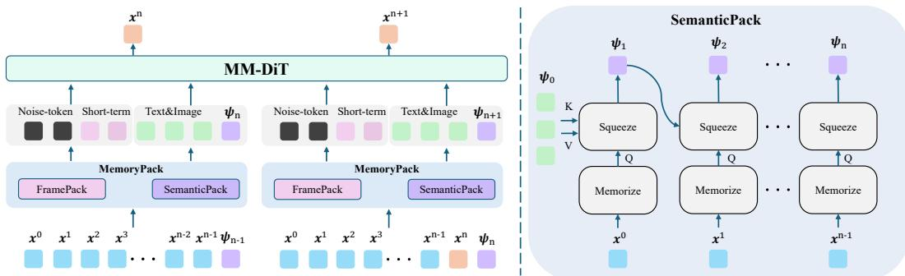
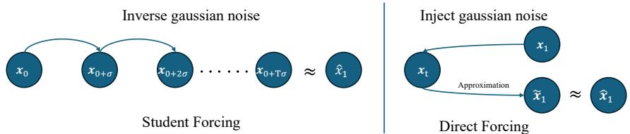
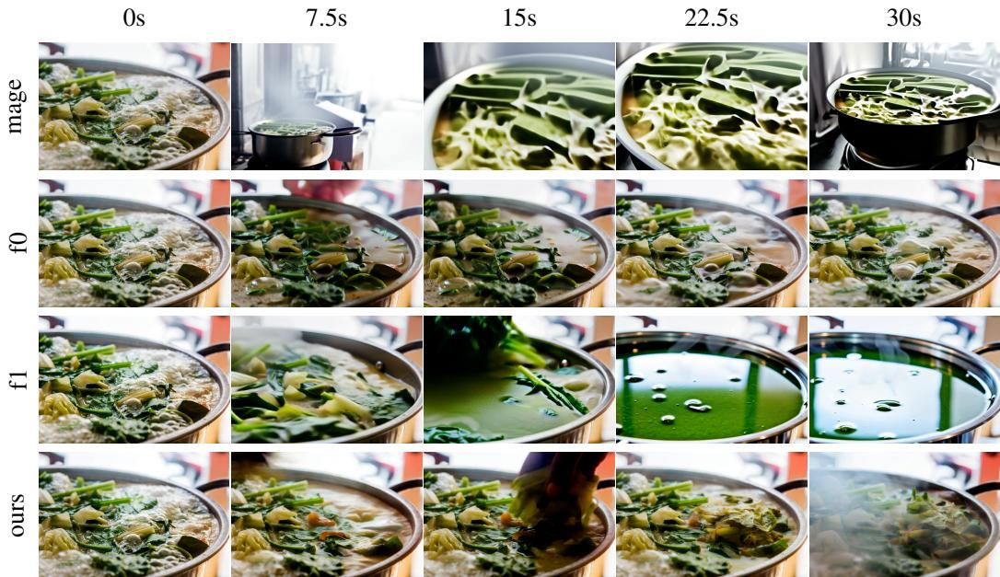
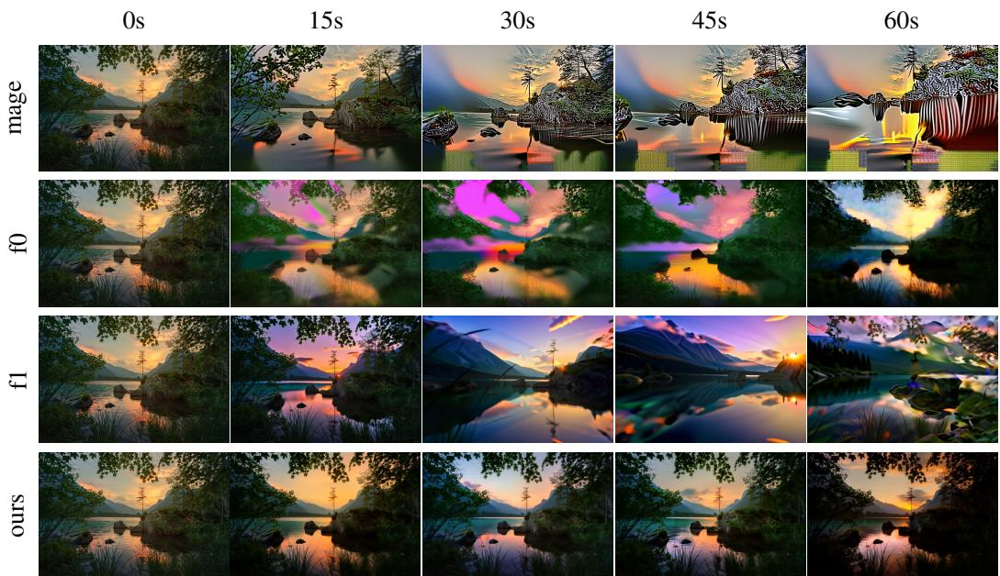
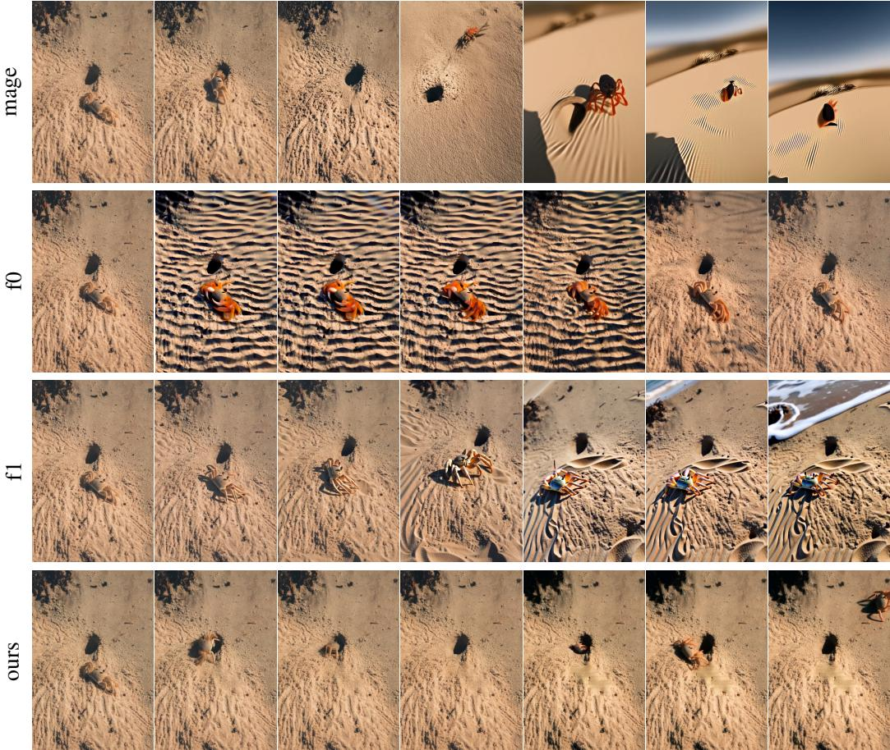
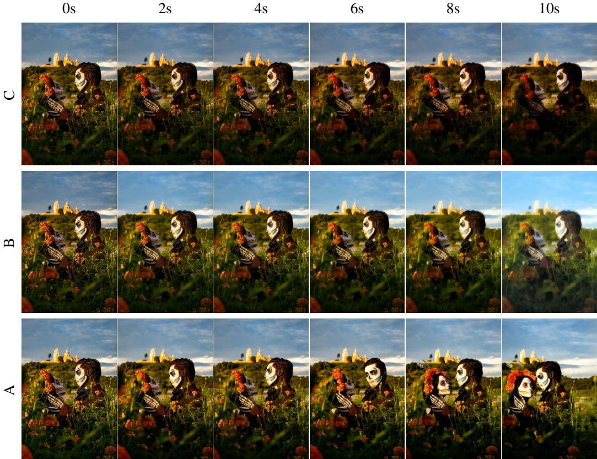

# Pack and Force Your Memory: Long-form and Consistent Video Generation

Xiaofei $\mathbf { W _ { u } } ^ { 1 , 2 , * }$ Guozhen Zhang3,2, \* Zhiyong Xu2 Yuan Zhou2, † Qinglin Lu2

Xuming He1, ‡

1 ShanghaiTech University 2 Tencent Hunyuan 3 Nanjing University

# Abstract

Long-form video generation presents a dual challenge: models must capture longrange dependencies while preventing the error accumulation inherent in autoregressive decoding. To address these challenges, we make two contributions. First, for dynamic context modeling, we propose MemoryPack, a learnable context-retrieval mechanism that leverages both textual and image information as global guidance to jointly model short- and long-term dependencies, achieving minute-level temporal consistency. This design scales gracefully with video length, preserves computational efficiency, and maintains linear complexity. Second, to mitigate error accumulation, we introduce Direct Forcing, an efficient single-step approximating strategy that improves traininginference alignment and thereby curtails error propagation during inference. Together, MemoryPack and Direct Forcing substantially enhance the context consistency and reliability of long-form video generation, advancing the practical usability of autoregressive video models. Project website: https://wuxiaofei01.github.io/PFVG/.

# 1 Introduction

Video generation has emerged as a central problem in generative modeling, enabling applications in content creation [Chen et al., 2025], embodied intelligence [Wu et al., 2023, Liu et al., 2024, Cheang e al, 2024, Wu et al., 2024], and interactive gaming [Team, 2025, Yu et al., 2025a, Li et al., 2025a, Yu et al., 2025b]. Recent Diffusion Transformer (DiT) models [Kong et al., 2024, Wan et al., 2025, Gao et al., 2025, Zhang et al., 2025b] demonstrate strong capabilities in capturing complex spatiotemporal dependencies and character interactions within fixed-length sequences, producing realistic video clips. However, long-form video generation remains challenging: the substantially larger token count of videos renders end-to-end modeling with quadratic-complexity DiT architectures computationally prohibitive, and the lack of effective long-term modeling leads to increasingly severe drift as video length grows. These factors pose significant challenges for generating minute-scale or longer videos while maintaining temporal coherence and computational efficiency.

Existing approaches [Teng et al., 2025, Zhang and Agrawala, 2025] typically enhance context consistency by retaining only the most recent frames or applying fixed compression strategies to select key frames. However, due to the limited window size and aggressive token compression, these rigid mechanisms rely primarily on local visual information and fail to capture global dependencies. In long-form video generation, the absence of global context inevitably degrades temporal coherence.

We address this challenge by reformulating long video generation as a long-short term information retrieval problem, where the model must effectively retrieve both persistent long-term context and dynamic short-term cues to guide frame synthesis. Specifically, we introduce MemoryPack, a linearcomplexity dynamic memory mechanism that leverages textual and image information as global guidance. MemoryPack retrieves long-term video context that is semantically aligned with the overall narrative to reinforce temporal coherence, while simultaneously exploiting adjacent frames as shortterm cues to enhance motion and pose fidelity. In contrast to methods based on fixed compression or frame selection, MemoryPack enables flexible associations between historical information and future frame generation.

Another central challenge in long-form video generation is error accumulation caused by the training inference mismatch: during training, models condition on ground-truth frames, whereas at inference they rely on self-predictions, causing errors to compound over long horizons. Although Zhang and Agrawala [2025] attempts to mitigate drift by generating frames in reverse order, the reliance on tail frames may reduce motion dynamics in long videos, limiting its effectiveness. Huang et al. [2025] addresses this by conditioning directly on generated outputs, but to improve efficiency it requires distribution distillation, which introduces extra computation and, due to the inherent limitations of distillation, the generation quality is degraded, and consequently, incorporating previously generated results into the training process introduces additional noise.

To address this issue, we introduce Direct Forcing, an efficient strategy that aligns training with the model's inference in a single step. Building on rectified flow [Liu et al., 2022], we perform one-step backward ODE computation in the predicted vector field to approximate inference outputs. This method incurs no additional overhead, requires no distillation, preserves traininference consistency, and mitigates error accumulation.

Our method achieves state-of-the-art performance on VBench [Huang et al., 2024a] across key metrics, including Motion Smoothness, Background Consistency, and Subject Consistency, while further enhancing robustness against error accumulation. Experimental results demonstrate that MemoryPack and Direct Forcing effectively model long-term contextual information and achieve superior consistency performance.

In summary, our contributions are threefold:

• MemoryPack: a dynamic memory mechanism that leverages text and image as global guidance to retrieve historical context, while exploiting adjacent frames as short-term cues. This design enables efficient modeling of minute-level temporal consistency without relying on rigid compression.

•Direct Forcing: a single-step approximating strategy that aligns training with inference efficiently, eliminating distillation and mitigating error accumulation in long-horizon generation.

•State-of-the-Art Performance: extensive evaluations demonstrate that our approach achieves state-of-the-art results in long-term consistency metrics.

# 2 RELATED WORKS

# 2.1 Efficient Accumulate for Long Video Generation

Long video generation remains an open problem. Since most existing approaches are still built upon the DiT framework, they suffer from the $\mathcal { O } ( L ^ { 2 } )$ computational complexity, where $L$ denotes the number of context tokens, which becomes prohibitively large for long sequences. To address this issue, several strategies have been proposed. Some works replace the original mechanism with linear attention [Cai et al., 2022, Gu and Dao, 2023b, Yang et al., 2024a, Wang et al., 2020, Peng et al., 2023, Gu and Dao, 2023a] to improve efficiency. Dalal et al. [2025] alleviates training costs through test-time training, while Huang et al. [2025] accelerates training by employing a KV-cache for rolling updates. In addition, a training-free approach, Xi et al. [2025] (SVG), exploits the inherent sparsity of 3D full attention to further enhance inference efficiency.

  
Figure 1: Overview of our framework. Given a text prompt, an input image, and history frames, the model autoregressively generates future frames. Prior to feeding data into MM-DiT, MemoryPack retrieves both long- and short-term context. In SemanticPack, visual features are extracted within local windows via self-attention, followed by cross-attention to align them with global textual and visual information to iteratively generate long-term dependencies $\psi _ { n }$ . This design achieves linear computational complexity and substantially improves the efficiency of long-form video generation.

# 2.2 Framework for Video Generation

Current video generation research [Zhang et al., 2025a, Gao et al., 2025, Zhang et al., 2025b, Wan et al., 2025, Kong et al., 2024, Yang et al., 2024b, Zheng et al., 2024, Peng et al., 2025] has primarily focused on short clips at the second level. Recently, several studies have explored extending such models to generate minute-long videos. For example, Zhang and Agrawala [2025] and Teng et al. [2025] adopt DiT as the backbone network and iteratively predict future frames conditioned on previously generated ones. However, these approaches face challenges in modeling long-term dependencies. In particular, they restrict the model to attend only to the most recent frames, which improves computational efficiency but inevitably leads to the loss of long-range information. In contrast, Cai et al. [2025] introduces the Mixture of Contexts (MoC), which selects contextual information through routing. While this design improves flexibility in leveraging context, it relies on manually defined selection rules, thereby limiting the model's ability to autonomously determine relevant information.

# 3 Method

Given $n$ historical segments $\{ \mathbf { x } ^ { 0 } , \dotsc , \mathbf { x } ^ { n - 1 } \}$ , along with a textual prompt $P$ and a conditional image $I$ , our objective is to generate the subsequent segment $\mathbf { x } ^ { n }$ . We formulate this as an autoregressive image-to-video generation task, enabling the synthesis of arbitrarily long video sequences from both textual and image inputs. Unless otherwise specified, all references to segments in this paper denote their latent-space representations. Our approach builds upon the Diffusion Transformer (DiT) architecture [Peebles and Xie, 2023, Kong et al., 2024] to create an autoregressive model for future segments generation, with its overall architecture illustrated in Figure 1. To enhance temporal consistency and mitigate error acumulation—inherent challenges in autoregressive generation—we introduce two key innovations: (i) MemoryPack, a hierarchical and efficient fusion module that leverages the text prompt and image as a global guide to model both long- and short-term temporal dependencies (Sec. 3.1); and (i) the Direct Forcing strategy, which aligns the training process with inference by employing single-step approximation. This approach mitigates the discrepancy between conditioning on ground-truth segments during training and on model-generated segments during inference (Sec. 3.2).

# 3.1 MemoryPack

Generating long-form videos requires balancing high-fidelity, smooth local motion with semantic coherence across the global narrative. Previous works [Teng et al., 2025, Lin et al., 2025] typically $\{ \mathbf { x } ^ { n - k } , \dotsc , \mathbf { x } ^ { n - 1 } \}$ together with a text prompt $P$ and a conditional image $I$ . While such methods excel at preserving local motion, they often fail to capture long-range dependencies, including object identities and scene layouts.

Conversely, models focusing solely on distant context may lose track of fine-grained motion cues, leading to artifacts and temporal discontinuities.

To address these challenges, we introduce MemoryPack, a hierarchical module that jointly leverages complementary short-term and long-term contexts for video generation. It consists of two components: FramePack [Zhang and Agrawala, 2025] and SemanticPack.

FramePack focuses on short-term context by capturing appearance and motion through a fixed compression scheme, thereby enforcing short-term consistency. However, its fixed window size and compression ratio constrain its ability to dynamically propagate information over long time horizons.

To maintain global temporal coherence, SemanticPack integrates visual features with textual and image guidance, unlike prior methods [Cai et al., 2025] that rely solely on visual representations. This is achieved by iteratively updating a long-term memory representation $\psi$ using contextual video segments $\{ \mathbf { x } ^ { 0 } , \ldots , \mathbf { x } ^ { n - 1 } \}$ , a text prompt $P$ , and a reference image $I$ The process consists of two structured operations: (1) Memorize, which applies self-attention within windows of historical segments to produce compact embeddings. This approach mitigates the prohibitive quadratic complexity of attending to long histories while retaining holistic window-level cues. (2) Squeeze, which then injects the textual and image guidance into this visual memory. Following prior work [Wan et al., 2025], we implement this as a cross-attention layer where the output of Memorize serves as the query, and the representation $\psi$ acts as the key and value. This alignment ensures the long-term memory remains globally aware and semantically grounded:

$$
\psi _ { n + 1 } = \mathrm { S q u e e z e } \big ( \psi _ { n } , \mathrm { M e m o r i z e } ( \mathbf { x } ^ { n } ) \big ) .
$$

For initialization ${ \bf \nabla } _ { n } = 0$ ), we set $\psi _ { 0 }$ as the concatenation of the prompt feature and the reference image feature, providing a semantic prior that anchors the memory trajectory. Importantly, the computational complexity of SemanticPack is ${ \mathcal { O } } ( n )$ , ensuring scalability by preventing costs from growing prohibitively with the number of historical frames. By integrating both short-(FramePack) and longteSemanticPack) context, MemoryPack retains iormation rom distant frames while prei temporal and motion consistency with high computational efficiency. Additional experiments on SemanticPack are provided in the appendix.

RoPE Consistency In DiT-based autoregressive video generation, long videos are typically partitioned into multiple segments during training. However, this segmentation causes even adjacent segments from the same video to be modeled independently, leading to the loss of cross-segment positional information and resulting in flickering or temporal discontinuities. To address this issue, we treat the input image as a CLS-like token and incorporate RoPE [Su et al., 2024] to explicitly encode relative positions across segments. Specifically, during training, for each video clip, we assign the image the initial index of the entire video, thereby preserving coherence and enhancing global temporal consistency. Formally, RoPE satisfies

$$
\begin{array} { r } { R _ { q } ( \mathbf { x } _ { q } , m ) R _ { k } ( \mathbf { x } _ { k } , n ) = R _ { g } ( \mathbf { x } _ { q } , \mathbf { x } _ { k } , n - m ) , \quad \Theta _ { k } ( \mathbf { x } _ { k } , n ) - \Theta _ { q } ( \mathbf { x } _ { q } , m ) = \Theta _ { g } ( \mathbf { x } _ { q } , \mathbf { x } _ { k } , n - m ) , } \end{array}
$$

where $R _ { q } , R _ { k } , R _ { g }$ denote the rotation matrices for query, key, and relative position, respectively; $\Theta _ { q } , \Theta _ { k } , \Theta _ { g }$ denote the corresponding rotation angles. $\scriptstyle { \pmb { x } } _ { q }$ and $\scriptstyle { \mathbf { { \mathit { x } } } } _ { k }$ are the query and key vectors, with $m$ and $n$ being their position indices.By assigning the image token an index of start, the sequence can jointly capture absolute positions across video segments and relative dependencies within each segment, thereby mitigating flickering and discontinuities.

# 3.2 Direct Forcing

Autoregressive video generation often suffers from error accumulation caused by the discrepancy between training and inference: during training, the model is conditioned on ground-truth frames, whereas during inference it relies on its own previously generated outputs.

To mitigate this mismatch, we propose a rectified-flow-based single-step approximation strategy that directly aligns training and inference trajectories while preserving computational efficiency.

Training with Rectified Flow. Following the rectified flow formulation Liu et al. [2022], we define a linear interpolation between the video distribution $\mathbf { X }$ and Gaussian noise $\epsilon \sim \mathcal { N } ( 0 , I )$ . For simplicity, we omit the superscript of $\mathbf { X }$ and use the subscript to indicate timestep $t$

$$
\mathbf { x } _ { t } = t \mathbf { x } + ( 1 - t ) { \boldsymbol { \epsilon } } , \quad t \in [ 0 , 1 ] .
$$

  
Figure 2: Schematic illustration of the approximation process. In Student Forcing, multi-step inference is applied to approximate $\hat { \bf x } _ { 1 }$ , but this incurs substantial computational overhead and slows training convergence. In contrast, Direct Forcing applies a single-step transformation from $\mathbf { x } _ { 1 }$ to $\mathbf { x } _ { t }$ , followed by a denoising step that produces $\tilde { \mathbf { x } } _ { 1 }$ as an estimate of $\hat { \mathbf { x } } _ { 1 }$ . This approach incurs no additional computational burden, thereby enabling faster training.

The instantaneous velocity along this trajectory is given by

$$
{ \pmb u } _ { t } = \frac { d { \bf x } _ { t } } { d t } = { \bf x } - \epsilon ,
$$

which defines an ordinary differential equation (ODE) guiding $\mathbf { X } _ { t }$ toward the target $\mathbf { X }$ The model predicts a velocity field $\dot { v } _ { \theta } ( \mathbf { x } _ { t } , t )$ , and parameters are optimized by minimizing the flow matching loss:

$$
\mathcal { L } _ { \mathrm { F M } } ( \theta ) = \mathbb { E } _ { t , \mathbf { x } , \epsilon } \big [ | | v _ { \theta } ( \mathbf { x } _ { t } , t ) - { \mathbf { u } } _ { t } | | ^ { 2 } \big ] .
$$

Single-Step Approximation. During inference, a video is generated by reverse-time integration of the ODE starting from $\mathbf { x } _ { 0 } \sim \mathcal { N } ( 0 , I )$ to generated $\hat { \bf x } _ { 1 }$ :

$$
\hat { \mathbf { x } } _ { 1 } = \int _ { 0 } ^ { 1 } v _ { \theta } ( \mathbf { x } _ { t } , t ) d t .
$$

As illustrated in Fig. 2, Student Forcing [Bengio et al., 2015], through multi-step inference in Eq. 6 as an approximation of $\hat { \bf x } _ { 1 }$ , would incur significant computational costs. Based on Eq. 7, we align training with inference without incurring high computational costs by approximating the trajectory in a single step:

$$
\tilde { \mathbf { x } } _ { 1 } = \mathbf { x } _ { t } + \Delta _ { t } * v _ { \theta } ( \mathbf { x } _ { t } , t ) \approx \hat { \mathbf { x } } _ { 1 } , \quad \Delta _ { t } = 1 - t
$$

Intuitively, since rectified flow guarantees a more direct ODE trajectory, $\mathbf { x } _ { t } + \Delta _ { t } v _ { \theta } ( \mathbf { x } _ { t } , t )$ serves as an effective single-step approximation of the generated distribution, thereby bridging the gap between training and inference. Concretely, the model first uses the ground-truth data $\mathbf { X } ^ { i - 1 }$ and Eq. 7 to obtain a one-step approximation $\tilde { \mathbf { x } } ^ { i - 1 }$ . This approximation then serves as the conditional input for generating $\mathbf { x } ^ { i }$ during training, thereby exposing the model to inference-like conditions and effectively mitigating distribution mismatch while reducing error accumulation.

Optimization Strategy In practice, we leverage Direct Forcing to sample clips from the same video in chronological order and use them as conditional inputs for iterative training. Unlike prior approaches [Dalal et al., 2025, Zhao et al., 2024] that train clips independently, this design explicitly reinforces temporal continuity across segments. However, applying backpropagation with an optimizer update at every step can perturb the learned distribution and impair the consistency of input distributions across clips during training. To mitigate this issue, we adopt gradient accumulation: gradients are aggregated over multiple clips before performing a single parameter update. This strategy stabilizes optimization and, as our experiments show, substantially improves cross-clip consistency and long-range temporal coherence in generated videos.

# 4 Experiment

# 4.1 Implementation Details

We adopt Framepack-F1 as the backbone model for the image-to-video generation task. The training dataset is primarily sourced from Mira [Ju et al., 2024] and Sekai [Li et al., 2025b], comprising approximately 16,000 video clips with a total duration of 150 hours across diverse scenarios. The longest videos in both Mira and Sekai extend up to one minute. To ensure data quality, we apply dynamism and shot-cut filtering to all samples. Training is conducted in parallel on GPU clusters (96GB memory each) with a batch size of 1 for approximately five days. We employ the AdamW optimizer with an initial learning rate of $1 0 ^ { - 5 }$ The training procedure consists of two stages. In the first stage, we apply teacher forcing to train the entire network, which accelerates convergence and mitigates instability caused by sampling bias. In the second stage, we only fine-tune the output layer with Direct Forcing, which could stabilize the backbone and align training with inference, thereby substantially reducing error accumulation in autoregressive generation.

# 4.2 Evaluation Metrics

Following established evaluation protocols [Huang et al., 2024a, Zheng et al., 2025], we assess the generated videos using six quantitative metrics: (1) imaging quality, (2) aesthetic quality, (3) dynamic degree, (4) motion smoothness, (5) background consistency, and (6) subject consistency. In addition, we conduct exposure bias and human evaluation to provide complementary subjective assessments. To distinguish the model's generation capability across different temporal scales, we categorize videos into three duration ranges: short (10 seconds), medium-length (30 seconds), and long (1 minute).

Imaging Quality: This metric captures distortions in generated frames, including over-exposure, noise, and blur. We measure it using the MUSIQ [Ke et al., 2021] image quality predictor trained on the SPAQ [Fang et al., 2020] dataset.

Aesthetic Quality: We evaluate the aesthetic quality of each video frame using the LAION aesthetic predictor [Schuhmann et al., 2022], which considers factors such as composition, color richness and harmony, photorealism, naturalness, and overall artistic value.

Dynamic Degree: We employ RAFT [Teed and Deng, 2020] to estimate the extent of motion in synthesized videos.

Motion Smoothness: We leverage motion priors from the video frame interpolation model [Li et al., 2023], as adapted by VBench, to evaluate motion smoothness.

Background Consistency: Following VBench, we measure the temporal consistency of background scenes by computing CLIP [Radford et al., 2021] feature similarity across frames.

Subject Consistency: We compute DINO [Caron et al., 2021] feature similarity between frames to assess the consistency of a subject's appearance throughout the sequence.

Exposure Bias Metric: Following Zhang and Agrawala [2025], we evaluate long-horizon video $\Delta _ { \mathrm { d r i f t } } ^ { M }$ $M$ (e.g., imaging quality, aesthetic quality).

$$
\Delta _ { \mathrm { d r i f t } } ^ { M } ( V ) = \big | M ( V _ { \mathrm { s t a r t } } ) - M ( V _ { \mathrm { e n d } } ) \big | ,
$$

Where V is the tested video, $V _ { \mathrm { s t a r t } }$ t represents the first $15 \%$ of frames, and $V _ { e n d }$ represents the last $15 \%$ of frames.To accurately measure the model's long-horizon generation capability, we take the last frame generated by the model itself as $V _ { \mathrm { e n d } }$ , rather than the final frame of the user-obtained video. Our rationale is that the evaluation should focus on the model's capability, and thus extrapolation ought to be defined with respect to the model's own outputs.

Human Assessment: We collect human preferences through A/B testing. Specifically, we generate 160 videos, randomly shuffle their order, and distribute them to evaluators to ensure unbiased assessments. Following Zhang and Agrawala [2025], we report ELO-K32 scores along with the corresponding rankings.

# 4.3 Generation Performance

We compare our method with FramePack-F0, FramePack-F1 [Zhang and Agrawala, 2025], and Magi-1 [Teng et al., 2025]. Evaluation is conducted on 160 videos: 60 of 10 seconds, 60 of 30 sns, and 0 of 60 onds, al at 480p and  fps. Allages ae sur from Vench [Hu et al., 2024b], and prompts are rewritten using Qwen2.5-V1 [Bai et al., 2025]. Quantitative results are reported in Table 1 and Table 2, while qualitative comparisons are shown in Fig. 3, Fig. 4, and Fig. 5.

Table 1: Comparison of different methods on Global Metrics, Error Accumulation Metrics, and Human Evaluation. The best results are highlighted in bold.   

<table><tr><td rowspan="2">Method</td><td colspan="6">Global Metrics</td><td colspan="4">Error Accumulation</td><td colspan="2">Human Evaluation</td></tr><tr><td>Imaging</td><td>Aesthetic</td><td>Dynamic</td><td>Motion</td><td>Background</td><td>Subject</td><td>ΔImaging</td><td>ΔAesthetic</td><td>ΔBackground</td><td>ΔSubject</td><td>ELO</td><td>Rank</td></tr><tr><td></td><td>Quality ↑</td><td>Quality ↑</td><td>Degree ↑</td><td>Smoothness ↑</td><td>Consistency ↑</td><td>Consistency ↑</td><td>Quality ↓</td><td>Quality ↓</td><td>Consistency ↓</td><td>Consistency ↓</td><td>↑</td><td>↓</td></tr><tr><td>Magi-1</td><td>54.64%</td><td>53.98%</td><td>67.5%</td><td>99.17%</td><td>89.30%</td><td>82.33%</td><td>4.19%</td><td>5.02%</td><td>1.53%</td><td>0.97%</td><td>1434</td><td>4</td></tr><tr><td>FramePack-F0</td><td>68.06%</td><td>62.89%</td><td>15.38%</td><td>99.27%</td><td>92.22%</td><td>90.03%</td><td>2.34%</td><td>2.45%</td><td>2.68%</td><td>2.99%</td><td>1459</td><td> $</td></tr><tr><td>FramePack-F1</td><td>67.06%</td><td>59.11%</td><td>53.85% 48.37%</td><td>99.12% 99.31%</td><td>90.21% 93.25%</td><td>83.48% 91.16%</td><td>2.71% 2.51%</td><td>4.57% 3.25%</td><td>1.59%</td><td>1.08% 0.76%</td><td>1537 1568</td><td></td></tr><tr><td>Ours</td><td>67.55%</td><td>59.75%</td><td></td><td></td><td></td><td></td><td></td><td></td><td>1.21%</td><td></td><td></td><td>1</td></tr></table>

  
Figure 3: Visualization of 30-second videos comparing all methods in terms of consistency preservation and interaction capability. Prompt: Close-up view of vegetables being added into a large silver pot of simmering broth, with leafy greens and stems swirling vividly in the bubbling liquid. Rising steam conveys warmth and motion, while blurred kitchen elements and natural light in the background create a homely yet dynamic culinary atmosphere.

Qualitative results. Representative 30-second and 60-second examples are shown in Fig. 3 and Fig. 4. For brevity, we simplify the prompts associated with generated videos. Our method exhibits fewer temporal identity shifts and geometric distortions compared to FramePack-F1 and Magi-1. While FramePack-F0 preserves visual fidelity in Fig. 3, it demonstrates reduced inter-frame dynamics, consistent with its quantitative metrics. Notably, as video length increases, competing methods suffer from more severe error accumulation, whereas our approach maintains video quality, including aesthetics and character consistency. These results highlight the effectiveness of Direct Forcing in enhancing long-term video generation.

Quantitative results. As reported in Table 1, our method achieves the best performance on Background Consistency, Subject Consistency, and Motion Smoothness, demonstrating a strong ability to preserve long-term temporal coherence and generate smooth motion. While FramePack-F0 attains higher Image Quality and Aesthetic Quality, it exhibits weaker inter-frame dynamics, which we attribute to its anti-drift sampling strategy. Conversely, Magi-1 produces stronger dynamics but suffers from degraded temporal and subject consistency. In human evaluation, our method with ELO-32K still achieves the best overall performance. These findings are further corroborated by the qualitative results in Fig. 3 and Fig. 4. Importantly, our approach also achieves the lowest Error Accumulation, underscoring its stability in long-term video generation.

Ablation study. As reported in Table 2, all experimental results were obtained using a subset of the training data to conserve computational resources. To assess the influence of the training dataset, we first fine-tuned FramePack-F1 (F1 with CT) on our dataset. This slightly improved the Dynamic

Table 2: Ablation Study on Different Model Structures and Strategies.   

<table><tr><td rowspan="2">Method</td><td colspan="6">Global Metrics</td><td colspan="4">Error Accumulation</td></tr><tr><td>Imaging</td><td>Aesthetic</td><td>Dynamic Degree ↑</td><td>Motion Smoothness ↑</td><td>Background Consistency ↑</td><td>Subject Consistency ↑</td><td>ΔImaging</td><td>ΔAesthetic</td><td>ΔBackground</td><td>ΔSubject</td></tr><tr><td>F1 w/CT</td><td>Quality ↑ 54.33%</td><td>Quality ↑ 53.07%</td><td>56.77%</td><td>98.81%</td><td>85.32%</td><td>85.64%</td><td>Quality ↓ 4.32%</td><td>Quality ↓ 7.18%</td><td>Consistency ↓ 3.22%</td><td>Consistency ↓ 1.32%</td></tr><tr><td>MemoryPack</td><td>55.31%</td><td>60.69%</td><td>51.13%</td><td>98.86%</td><td>88.21%</td><td>86.77%</td><td>2.47%</td><td>4.99%</td><td>2.31%</td><td>1.88%</td></tr><tr><td>zero-MemoryPack</td><td>57.37%</td><td>51.91%</td><td>62.71%</td><td>98.85%</td><td>87.31%</td><td>86.21%</td><td>8.32%</td><td>6.31%</td><td>2.43%</td><td>3.10%</td></tr><tr><td>Student forcing</td><td>49.32%</td><td>52.33%</td><td>59.88%</td><td>98.96%</td><td>85.32%</td><td>82.41%</td><td>3.17%</td><td>5.11%</td><td>2.02%</td><td>1.12%</td></tr><tr><td>All</td><td>57.65%</td><td>55.75%</td><td>55.37%</td><td>99.11%</td><td>87.17%</td><td>88.77%</td><td>3.21%</td><td>4.77%</td><td>2.02%</td><td>0.99%</td></tr></table>

  
Figure 4: Visualization of a 60-second video illustrating the accumulation of errors. Our method maintains image quality comparable to the first frame even over minute-long sequences. Prompt: The sun sets over a serene lake nestled within majestic mountains, casting a warm, golden glow that softens at the horizon. The sky is a vibrant canvas of orange, pink, and purple, with wispy clouds catching the last light. Calm and reflective, the lake's surface mirrors the breathtaking colors of the sky in a symphony of light and shadow. In the foreground, lush greenery and rugged rocks frame the tranquil scene, adding a sense of life and stillness. Majestic, misty mountains rise in the background, creating an overall atmosphere of profound peace and tranquility.

Degree metric but degraded performance on other evaluations, demonstrating the effectiveness of our proposed MemoryPack and Direct Forcing.

To further examine the semantic contribution of MemoryPack, we initialized the global memory $\psi _ { 0 }$ with a zero vector (zero-MemoryPack). This led to worse performance on error-accumulation metrics, which we attribute to the absence of semantic guidance, resulting in reduced consistency. These findings indicate that semantic guidance stabilizes long-term video generation.

We also ablated Direct Forcing by training the model with its actual sampling process as input. To balance training efficiency, we set the sampling step to 5; however, the resulting performance remained substantially inferior to Direct Forcing, underscoring its effectiveness for long-term video generation.

Consistency visualization. Figure 5 illustrates object reconstruction after prolonged disappearance. Over a 60-second sequence, our method accurately reconstructs objects that remain absent for extended periods. Notably, even when subjects temporarily vanish due to occlusion, the model reconstructs and generates objects with consistent identity and 2D structure after long intervals. These results demonstrate that MemoryPack effectively preserves long-term contextual information, enabling stable memory for extended video generation.

  
Figure 5: Consistency evaluation on a 60-second video shows that when an object ID is heavily occluded for an extended period, reconstruction remains challenging. Both F0 and F1 fail to follow the prompt and exhibit noticeable error accumulation. Although MAGI-1 follows the prompt, it is unable to maintain temporal consistency. Prompt: On the peaceful, sun-drenched sandy beach, a small crab first retreats into its burrow before reemerging. The lens captures its shimmering shell and discreet stride under the low sun angle. As it slowly crawls outward, the crab leaves a faint trail behind, while its elongated shadow adds a cinematic texture to this tranquil scene.

# 5 Conclusion

We propose MemoryPack, a lightweight mechanism that jointly models long- and short-term memory from visual inputs and text prompts, enabling the learning of long-range dependencies without requiring 3D priors, handcrafted heuristics, or modifications to the core DiT framework. We further iFov  t - ancy in autoregressive video generation, which incurs no additional training cost or computational overhead. Experimental results show that MemoryPack and Direct Forcing reduce error accumulation, enhance identity-preservation consistency, and alleviate exposure bias. Together, these contributions pave the way for next-generation long-form video generation models.

Limitation : This work explores MemoryPack for modeling both long- and short-term memory. In contrast, SemanticPack employs a sliding-window Transformer backbone to capture long-term information. This design achieves linear computational complexity and enables efficient training and inference. However, it still introduces artifacts in highly dynamic scenarios, and its ability to maintain long-term consistency in hour-long videos remains limited. Similarly, Direct Forcing adopts a simple and efficient single-step approximation strategy, yet its effectiveness is highly dependent on the pre-trained model. As a result, training currently requires multiple stages, and whether this ftting strategy can be integrated into a single-stage pipeline remains an open question. We leave these directions for future work.

# 6 Ethics Statement

This work focuses on algorithmic advances in long-form video generation. Our study does not involve sensitive personal data, or copyrighted materials. The datasets used (e.g., Li et al. [2025b], Ju et al. [2024]) are publicly available benchmarks that comply with community standards. our research is centered on methodological improvements in temporal coherence and computational efficiency. We encourage responsible use of the proposed techniques and recommend safeguards such as watermarking and content moderation in downstream applications.

# 7 Reproducibility Statement

We have made substantial efforts to ensure the reproducibility of our work. Detailed descriptions of the proposed MemoryPack and Direct Forcing mechanisms are provided in Sections 3.1 and 3.2, respectively. To further support reproducibility, we will release source code, configuration files, and pretrained checkpoints upon publication. These resources will enable researchers to replicate our experiments under the same settings and adapt the framework to new datasets or tasks with minimal modifications. Comprehensive documentation and usage guidelines will also be provided to lower the barrier to reproduction and extension. We hope these efforts will not only validate our findings but also foster future research in long-term video generation.

# References

Shuai Bai, Keqin Chen, Xuejing Liu, Jialin Wang, Wenbin Ge, Sibo Song, Kai Dang, Peng Wang, Shijie Wang, Jun Tang, Humen Zhong, Yuanzhi Zhu, Mingkun Yang, Zhaohai Li, Jianqiang Wan, Pei Wang, Wei Ding, Zheren Fu, Yiheng Xu, Jiabo Ye, Xi Zhang, Tianbao Xie, Zesen Cheng, Hang Zhang, Zhibo Yang, Haiyang Xu, and Junyang Lin. Qwen2.5-vl technical report. arXiv preprint arXiv:2502.13923, 2025.   
Samy Bengio, Oriol Vinyals, Navdeep Jaitly, and Noam Shazeer. Scheduled sampling for sequence prediction with recurrent neural networks. Advances in neural information processing systems, 28, 2015.   
Han Cai, Junyan Li, Muyan Hu, Chuang Gan, and Song Han. Effcientvit: Multi-scale linear attention for high-resolution dense prediction. arXiv preprint arXiv:2205.14756, 2022.   
Shengqu Cai, Ceyuan Yang, Lymin Zhang, Yuwei Guo, Junfei Xiao, Ziyan Yang, Yinghao Xu, Zhenheng Yang, Alan Yuille, Leonidas Guibas, et al. Mixture f contexts for longvideo generaion. arXiv preprint arXiv:2508.21058, 2025.   
Mathilde Caron, Hugo Touvron, Ishan Misra, Hervé Jégou, Julien Mairal, Piotr Bojanowski, and Armand Joulin. Emerging properties in self-supervised vision transformers. In Proceedings of the IEEE/CVF international conference on computer vision, pages 96509660, 2021.   
Chi-Lam Cheang, Guangzeng Chen, Ya Jing, Tao Kong, Hang Li, Yifeng Li, Yuxiao Liu, Hongtao Wu, Jiafeng Xu, Yichu Yang, et al. Gr-2: A generative video-language-action model with web-scale knowledge for robot manipulation. arXiv preprint arXiv:2410.06158, 2024.   
Yi Chen, Sen Liang, Zixiang Zhou, Ziyao Huang, Yifeng Ma, Junshu Tang, Qin Lin, Yuan Zhou, and Qinglin Lu. Hunyuanvideo-avatar: High-fidelity audio-driven human animation for multiple characters, 2025. URL https://arxiv.org/pdf/2505.20156.   
Karan Dalal, Daniel Koceja, Jiarui Xu, Yue Zhao, Shihao Han, Ka Chun Cheung, Jan Kautz, Yejin Choi, Yu Sun, and Xiaolong Wang. One-minute video generation with test-time training. In Proceedings of the Computer Vision and Pattern Recognition Conference, pages 1770217711, 2025.

Yuming Fang, Hanwei Zhu, Yan Zeng, Kede Ma, and Zhou Wang. Perceptual quality assessment of smartphone photography. In Proceedings of the IEEE/CVF conference on computer vision and pattern recognition, pages 36773686, 2020.

Yu Gao, Haoyuan Guo, Tuyen Hoang, Weilin Huang, Lu Jiang, Fangyuan Kong, Huixia Li, Jiashi Li, Liang Li, Xiaojie Li, et al. Seedance 1.0: Exploring the boundaries of video generation models. arXiv preprint arXiv:2506.09113, 2025.

Albert Gu and Tri Dao. Mamba: Linear-time sequence modeling with selective state spaces. arXiv preprint arXiv:2312.00752, 2023a.

Albert Gu and Tri Dao. Mamba: Linear-time sequence modeling with selective state spaces. arXiv preprint arXiv:2312.00752, 2023b.

Xun Huang, Zhengqi Li, Guande He, Mingyuan Zhou, and Eli Shechtman. Self forcing: Bridging the train-test gap in autoregressive video diffusion. arXiv preprint arXiv:2506.08009, 2025.

Ziqi Huang, Yinan He, Jiashuo Yu, Fan Zhang, Chenyang Si, Yuming Jiang, Yuanhan Zhang, Tianxing Wu, Qingyang Jin, Nattapol Chanpaisit, Yaohui Wang, Xinyuan Chen, Limin Wang, Dahua Lin, Yu Qiao, and Ziwei Liu. VBench: Comprehensive benchmark suite for video generative models. In Proceedings of the IEEE/CVF Conference on Computer Vision and Pattern Recognition, 2024a.

Ziqi Huang, Fan Zhang, Xiaojie Xu, Yinan He, Jiashuo Yu, Ziyue Dong, Qianli Ma, Nattapol Chanpaisit, Chenyang Si, Yuming Jiang, Yaohui Wang, Xinyuan Chen, Ying-Cong Chen, Limin Wang, Dahua Lin, Yu Qiao, and Ziwei Liu. Vbench++: Comprehensive and versatile benchmark suite for video generative models. arXiv preprint arXiv:2411.13503, 2024b.

Xuan Ju, Yiming Gao, Zhaoyang Zhang, Ziyang Yuan, Xintao Wang, Ailing Zeng, Yu Xiong, Qiang Xu, and Ying Shan. Miradata: A large-scale video dataset with long durations and structured captions. Advances in Neural Information Processing Systems, 37:4895548970, 2024.

Junjie Ke, Qifei Wang, Yilin Wang, Peyman Milanfar, and Feng Yang. Musiq: Multi-scale image quality transformer. In Proceedings of the IEEE/CVF international conference on computer vision, pages 51485157, 2021.

Weijie Kong, Qi Tian, Zijian Zhang, Rox Min, Zuozhuo Dai, Jin Zhou, Jiangfeng Xiong, Xin Li, Bo Wu, Jianwei Zhang, et al. Hunyuanvideo: A systematic framework for large video generative models. arXiv preprint arXiv:2412.03603, 2024.

Jiaqi Li, Junshu Tang, Zhi-Ting Xu, Longhuang Wu, Yuan Zhou, Shuai Shao, Tianbao Yu, Zhiguo Cao, and Qinglin Lu. Hunyuan-gamecraft: High-dynamic interactive game video generation with hybrid history condition. ArXiv, abs/2506.17201, 2025a. URL https : / /api . semanticscholar. org/CorpusID:279465382.

Zhen Li, Zuo-Liang Zhu, Ling-Hao Han, Qibin Hou, Chun-Le Guo, and Ming-Ming Cheng. Amt: All-pairs multi-feld transforms for efficient frame interpolation. In Proceedings of the IEEE/CVF Conference on Computer Vision and Pattern Recognition, pages 98019810, 2023.

Zhen Li, Chuanhao Li, Xiaofeng Mao, Shaoheng Lin, Ming Li, Shitian Zhao, Zhaopan Xu, Xinyue Li, Yukang Feng, Jianwen Sun, et al. Sekai: A video dataset towards world exploration. arXiv preprint arXiv:2506.15675, 2025b.

Shanchuan Lin, Ceyuan Yang, Hao He, Jianwen Jiang, Yuxi Ren, Xin Xia, Yang Zhao, Xuefeng Xiao, and Lu Jiang. Autoregressive adversarial post-training for real-time interactive video generation. arXiv preprint arXiv:2506.09350, 2025.

Xingchao Liu, Chengyue Gong, and Qiang Liu. Flow straight and fast: Learning to generate and transfer data with rectified flow. arXiv preprint arXiv:2209.03003, 2022.

Yumeng Liu, Yaxun Yang, Youzhuo Wang, Xiaofei Wu, Jiamin Wang, Yichen Yao, Sören Schwertfeger, Sibei Yang, Wenping Wang, Jingyi Yu, et al. Realdex: Towards human-like grasping for robotic dexterous hand. arXiv preprint arXiv:2402.13853, 2024.

William Peebles and Saining Xie. Scalable diffusion models with transformers. In Proceedings of the IEEE/CVF international conference on computer vision, pages 41954205, 2023.

Bo Peng, Eric Alcaide, Quentin Anthony, Alon Albalak, Samuel Arcadinho, Stella Biderman, Huanqi Cao, Xin Cheng, Michael Chung, Matteo Grella, et al. Rwkv: Reinventing rnns for the transformer era. arXiv preprint arXiv:2305.13048, 2023.

Xiangyu Peng, Zangwei Zheng, Chenhui Shen, Tom Young, Xinying Guo, Binluo Wang, Hang Xu, Hongxin Liu, Mingyan Jiang, Wenjun Li, et al. Open-sora 2.0: Training a commercial-level video generation model in $2 0 0 \mathrm { k }$ .arXiv preprint arXiv:2503.09642, 2025.

Alec Radford, Jong Wook Kim, Chris Hallacy, Aditya Ramesh, Gabriel Goh, Sandhini Agarwal, Girish Sastry, Amanda Askell, Pamela Mishkin, Jack Clark, et al. Learning transferable visual models from natural language supervision. In International conference on machine learning, pages 87488763. PmLR, 2021.

Christoph Schuhmann, Romain Beaumont, Richard Vencu, Cade Gordon, Ross Wightman, Mehdi Cherti, Theo Coombes, Aarush Katta, Clayton Mullis, Mitchell Wortsman, et al. Laion-5b: An open large-scale dataset for training next generation image-text models. Advances in neural information processing systems, 35:2527825294, 2022.

Jianlin Su, Murtadha Ahmed, Yu Lu, Shengfeng Pan, Wen Bo, and Yunfeng Liu. Roformer: Enhanced transformer with rotary position embedding. Neurocomputing, 568:127063, 2024.

Yan Team. Yan: Foundational interactive video generation. arXiv preprint arXiv:2508.08601, 2025.

Zachary Teed and Jia Deng. Raft: Recurrent all-pairs field transforms for optical flow. In European conference on computer vision, pages 402419. Springer, 2020.

Hansi Teng, Hongyu Jia, Lei Sun, Lingzhi Li, Maolin Li, Mingqiu Tang, Shuai Han, Tianning Zhang, WQ Zhang, Weifeng Luo, et al. Magi-1: Autoregressive video generation at scale. arXiv preprint arXiv:2505.13211, 2025.

Team Wan, Ang Wang, Baole Ai, Bin Wen, Chaojie Mao, Chen-Wei Xie, Di Chen, Feiwu Yu, Haiming Zhao, Jianxiao Yang, et al. Wan: Open and advanced large-scale video generative models. arXiv preprint arXiv:2503.20314, 2025.

Sinong Wang, Belinda Z Li, Madian Khabsa, Han Fang, and Hao Ma. Linformer: Self-attention with linear complexity. arXiv preprint arXiv:2006.04768, 2020.

Hongtao Wu, Ya Jing, Chilam Cheang, Guangzeng Chen, Jiafeng Xu, Xinghang Li, Minghuan Liu, Hang Li, and Tao Kong. Unleashing large-scale video generative pre-training for visual robot manipulation. arXiv preprint arXiv:2312.13139, 2023.

Xiaofei Wu, Tao Liu, Caoji Li, Yuexin Ma, Yujiao Shi, and Xuming He. Fastgrasp: Efficient grasp synthesis with diffusion. 2024. URL https://api.semanticscholar . org/CorpusID: 274192568.

Haocheng Xi, Shuo Yang, Yilong Zhao, Chenfeng Xu, Muyang Li, Xiuyu Li, Yujun Lin, Han Cai, Jintao Zhang, Dacheng Li, et al. Sparse videogen: Accelerating video diffusion transformers with spatial-temporal sparsity. arXiv preprint arXiv:2502.01776, 2025.

Songlin Yang, Jan Kautz, and Ali Hatamizadeh. Gated delta networks: Improving mamba2 with delta rule. arXiv preprint arXiv:2412.06464, 2024a.

Zhuoyi Yang, Jiayan Teng, Wendi Zheng, Ming Ding, Shiyu Huang, Jiazheng Xu, Yuanming Yang, Wenyi Hong, Xiaohan Zhang, Guanyu Feng, et al. Cogvideox: Text-to-video diffusion models with an expert transformer. arXiv preprint arXiv:2408.06072, 2024b.

Jiwen Yu, Jianhong Bai, Yiran Qin, Quande Liu, Xintao Wang, Pengfei Wan, Di Zhang, and Xihui Liu. Context as memory: Scene-consistent interactive long video generation with memory retrieval. arXiv preprint arXiv:2506.03141, 2025a.

Jiwen Yu, Yiran Qin, Xintao Wang, Pengfei Wan, Di Zhang, and Xihui Liu. Gamefactory: Creating new games with generative interactive videos. arXiv preprint arXiv:2501.08325, 2025b.

Guozhen Zhang, Yuhan Zhu, Yutao Cui, Xiaotong Zhao, Kai Ma, and Limin Wang. Motion-aware generative frame interpolation. arXiv preprint arXiv:2501.03699, 2025a.   
Lvmin Zhang and Maneesh Agrawala. Packing input frame context in next-frame prediction models for video generation. arXiv preprint arXiv:2504.12626, 2025.   
Yifu Zhang, Hao Yang, Yuqi Zhang, Yifei Hu, Fengda Zhu, Chuang Lin, Xiaofeng Mei, Yi Jiang, Zehuan Yuan, and Bingyue Peng. Waver: Wave your way to lifelike video generation. arXiv preprint arXiv:2508.15761, 2025b.   
Bowen Zhao, Hannaneh Hajishirzi, and Qingqing Cao. Apt: Adaptive pruning and tuning pretrained language models for efficient training and inference. arXiv preprint arXiv:2401.12200, 2024.   
Dian Zheng, Ziqi Huang, Hongbo Liu, Kai Zou, Yinan He, Fan Zhang, Yuanhan Zhang, Jingwen He, Wei-Shi Zheng, Yu Qiao, and Ziwei Liu. VBench-2.0: Advancing video generation benchmark suite for intrinsic faithfulness. arXiv preprint arXiv:2503.21755, 2025.   
Zangwei Zheng, Xiangyu Peng, Tianji Yang, Chenhui Shen, Shenggui Li, Hongxin Liu, Yukun Zhou, Tianyi Li, and Yang You. Open-sora: Democratizing efficient video production for all. arXiv preprint arXiv:2412.20404, 2024.

# A Appendix

We provide additional experimental details and visualizations in this section. In Sec. A.1, we present the optional structures of SemanticPack, where we conduct both qualitative and quantitative evaluations to analyze their impact on modeling efficiency, representation capacity, and overall consistency performance. Sec. A.2 describes the training setup of Direct Forcing, including implementation details, hyperparameter configurations, and training dynamics, to facilitate reproducibility and provide deeper insight into its effectiveness. In Sec. A.3, we provide consistency visualizations, including minute-level examples, to evaluate the model's ability to reconstruct historical information under long-term sequences and severe occlusions, while preserving spatial layouts, maintaining subject fidelity, and mitigating temporal drifting.

# A.1 Validation of SemanticPack Models

Weconducte urthe ablati sudi agains Sue o evaluate henetwrk'capaciy or captur long-term dependencies. As shown in Fig. 6, we designed three fusion schemes: (a) text and image features are used as activation vectors for $K$ and $V$ , while the visual representation serves as the query; (b) text and image features are used as the query, with the visual representation as key/value; (c) to enrich the query, we concatenate text and image features with the visual representation from the first window, and then follow the same setting as (b) for subsequent steps.

  
Figure 6: Illustration of the optional architecture of SemanticPack.

In Tab. 3, we present quantitative results. We observe that structures B and C cause a notable degradation in visual quality and a substantial reduction in temporal dynamics. We attribute these effects to the following reasons: in structure B, the number of text and image tokens is considerably smaller than the number of query tokens in structure A, which is insufficient to capture adequate visual representations, thereby impairing the model's ability to model dynamics. In structure C, although incorporating the initial windows into the query increases the token count, it also introduces multi-modal information, thereby increasing training difficulty.

<table><tr><td rowspan="2">Method</td><td colspan="6">Global Metrics</td></tr><tr><td>Imaging</td><td>Aesthetic</td><td>Dynamic</td><td>Motion</td><td>Background</td><td>Subject</td></tr><tr><td></td><td>Quality ↑</td><td>Quality ↑</td><td>Degree ↑</td><td>Smoothness ↑</td><td>Consistency ↑</td><td>Consistency ↑</td></tr><tr><td>C</td><td>48.31%</td><td>53.15%</td><td>28.98%</td><td>97.72%</td><td>83.27%</td><td>83.74%</td></tr><tr><td>B</td><td>50.11%</td><td>50.71%</td><td>32.78%</td><td>98.91%</td><td>87.11%</td><td>80.56%</td></tr><tr><td>A</td><td>55.31%</td><td>60.69%</td><td>51.13%</td><td>98.86%</td><td>88.21%</td><td>86.77%</td></tr></table>

Table 3: Ablation Study on Different Model Structures and Strategies. Among all variants, structure A achieves the best overall performance.

To further validate our conclusions, we conduct visualization experiments for the three structures presented in Fig. 7. The results reveal clear differences in temporal consistency: while structure A maintains relatively stable motion and coherent frame-to-frame transitions, structures B and C exhibit a pronounced degradation in temporal dynamics. In particular, both B and C suffer from noticeable blurred object boundaries over time, indicating their limited capacity to preserve longrange dependencies. Moreover, they accumulate substantially higher exposure bias compared to structure A, which further amplifies temporal drift and undermines overall video fidelity.

  
Figure 7: Prompt: In a field of golden marigolds, a man and woman stood entwined, their faces glowing with intricate sugar skull makeup beneath the setting sun. The woman, crowned with fiery orange blossoms, gazed at him with tender devotion. He met her eyes, the bold black-and-white patterns on his face striking against his chestnut jacket, his hands gently interlaced with hers. Turning briefly toward the camera, he then lowered his head to kiss her. Behind them, hiltops crowned with golden-domed buildings shimmered beneath a sky of soft blues and pinks, completing the serene, magical scene.

# A.2 Direct Forcing Training Details

For Direct Forcing, we employ a data sampler to standardize video clips and ensure sequential training. Since all clips are accumulated through gradient accumulation, the effective number of optimization steps becomes limited. To mitigate this issue, we adopt a curriculum learning strategy by sorting videos according to their length. Specifically, we begin training on videos containing a single clip, which effectively reduces the task to an image-to-video setting and lowers the training difficulty. We then progressively increase the number of accumulated clips, enabling the model to gradually align training with inference, while naturally extending to the autoregressive generation paradigm. This staged progression effectively enhances training stability. In terms of trainable parameters, we restrict updates to the final normalization layers and the output linear layer. Our rationale is that the discrepancy between training and inference primarily arises from a small number of accumulated errors, which eventually lead to drift; hence, adapting only the final layers is sufficient to correct this mismatch.

  
Figure 8: Visualization of long-term consistency. The model is evaluated on videos of $5 \mathrm { ~ s ~ }$ and $3 0 \mathrm { s }$ to assess its ability to maintain coherence.

  
Figure 9: Visualization of 60s videos.

# A.3 Visulization

We provide additional visualizations of consistency in Fig. 8. The results show that our model maintains long-term coherence across extended sequences and successfully recovers spatial layouts that are often disrupted by complex camera motion, such as panning and zooming. Furthermore, we present additional minute-level visualizations in Fig. 9, which highlight the model's ability to preserve scene structure, maintain subject integrity, and avoid temporal drift over extended durations.

# A.4 The Use of Large Language Models (LLMs)

This thesis employs large language models (LLMs) to polish the writing and correct grammatical errors.