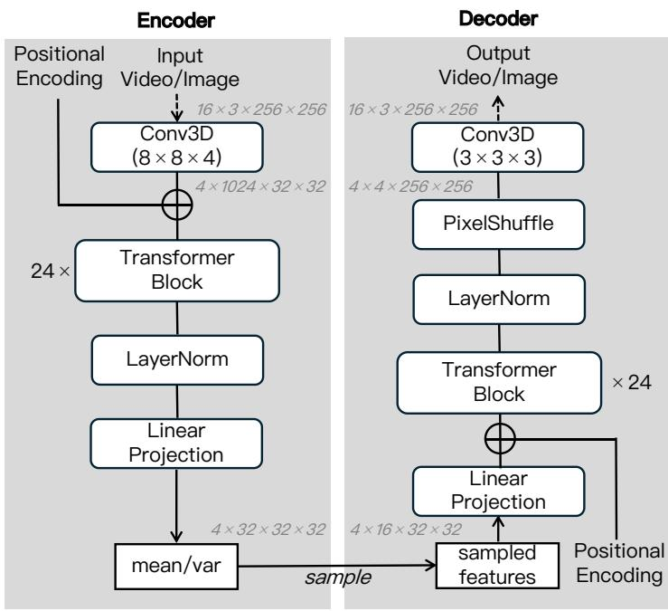
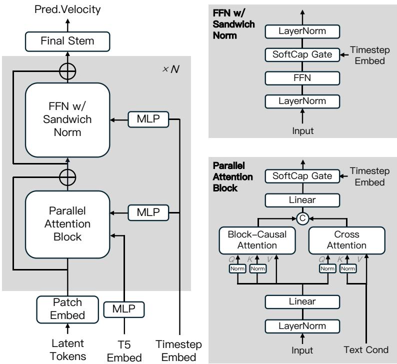
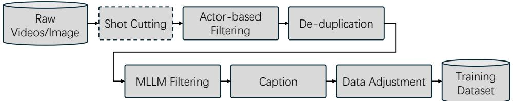
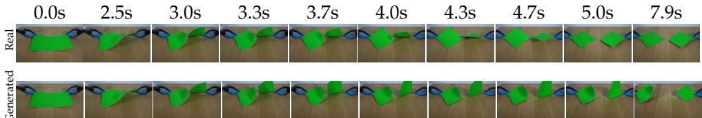

# 1. Bibliographic Information

## 1.1. Title
MAGI-1: Autoregressive Video Generation at Scale

## 1.2. Authors
The paper is authored by **Sand AI research team**. Specific individual authors are not listed in the provided text, only the collective group email: `research@sand.ai`.

## 1.3. Journal/Conference
**Source:** arXiv Preprint
**Published Date:** May 19, 2025 (UTC)
**Status:** The paper is currently a preprint available on arXiv.

## 1.4. Abstract
The paper introduces **MAGI-1**, a large-scale "world model" for video generation. Unlike traditional video models that generate all frames simultaneously, MAGI-1 generates video **autoregressively** (step-by-step) in chunks. Each chunk is a fixed-length segment of frames. The model is trained to remove noise from these chunks sequentially, where noise levels increase over time (later chunks are noisier than earlier ones during the process). This approach allows for:
1.  **Causal Temporal Modeling:** Ensuring logical consistency where past events influence future ones.
2.  **Streaming Generation:** Videos can be played while being generated.
3.  **Infinite Generation:** Theoretically unlimited video length via memory-efficient processing.

    The largest model has **24 billion parameters** and supports a context length of up to **4 million tokens**. It achieves state-of-the-art performance on Image-to-Video (I2V) benchmarks like VBench and Physics-IQ.

## 1.5. Original Source Link
*   **ArXiv:** https://arxiv.org/abs/2505.13211v1
*   **PDF:** https://arxiv.org/pdf/2505.13211v1.pdf

# 2. Executive Summary

## 2.1. Background & Motivation
**The Core Problem:** High-quality video generation is computationally expensive and difficult to scale. Existing state-of-the-art models (like Sora or Kling) typically use **bi-directional global denoising**. This means they try to generate the entire video sequence (e.g., 5 seconds) at once.
*   **Limitation 1:** They require access to the full sequence during inference, making "streaming" (playing the start while generating the end) impossible.
*   **Limitation 2:** They struggle with very long videos because computational cost grows quadratically or significantly with length.
*   **Limitation 3:** They often disregard the "causal" nature of time (physics moves from past to future, not both ways).

    **The Innovation:** MAGI-1 proposes a **Chunk-wise Autoregressive** approach. Instead of generating a whole video, it generates a small "chunk" (e.g., 1 second), then uses that to generate the next chunk, and so on. This combines the high visual quality of diffusion models with the logical consistency and scalability of autoregressive models (like GPT for text).

## 2.2. Main Contributions & Findings
1.  **Architecture:** A 24-billion parameter DiT (Diffusion Transformer) designed for autoregressive video generation using a novel "Block-Causal Attention" mechanism.
2.  **Infrastructure:** Development of **MagiAttention**, a distributed attention system that scales linearly, enabling training on sequences with millions of tokens.
3.  **Unified Capabilities:** A single model handles Text-to-Video (T2V), Image-to-Video (I2V), and Video Continuation without task-specific fine-tuning.
4.  **Performance:** Superior performance on physics understanding (Physics-IQ benchmark) and strong results on visual quality (VBench), surpassing models like Runway Gen-3 and Pika 1.0 in specific metrics.
5.  **Efficiency:** Constant peak memory usage during inference regardless of video length, enabling generation of indefinitely long videos on consumer hardware (e.g., RTX 4090).

# 3. Prerequisite Knowledge & Related Work

## 3.1. Foundational Concepts
To understand MAGI-1, several key concepts in AI must be clarified:

*   **Variational Autoencoder (VAE):** A model used to compress data.
    *   **Encoder:** Compresses a heavy video (pixels) into a lightweight mathematical representation called a "latent space" (code).
    *   **Decoder:** Reconstructs the video from this latent code. MAGI-1 performs all its generation in this compressed latent space to save computation.
*   **Diffusion Models & Flow Matching:**
    *   **Diffusion:** A generative method that starts with random noise and gradually "denoises" it to form an image or video.
    *   **Flow Matching:** A mathematical framework (an alternative to standard diffusion) that models the generation process as a smooth path (a "flow") transforming noise into data over time. It uses Ordinary Differential Equations (ODEs) to predict the "velocity" (direction and speed) needed to move from noise to a clear image.
*   **Autoregressive (AR) Modeling:** The standard method for text generation (like ChatGPT). It predicts the next piece of data based on previous pieces.
    *   **Causal Masking:** A technique in Attention mechanisms that prevents the model from "cheating" by looking at future tokens when predicting the current one.
*   **KV Cache:** A memory optimization technique used in AR models. Instead of re-calculating the representations (Key and Value matrices) for past data every time a new step is generated, the system saves (caches) them to reuse, significantly speeding up inference.

## 3.2. Previous Works
*   **Bi-directional Denoising Models:** Models like **Sora**, **OpenSora**, and **Stable Video Diffusion (SVD)**. These treat video generation as a single block of 3D data (Height $\times$ Width $\times$ Time) and denoise everything together.
    *   *Drawback:* Hard to extend video length indefinitely; non-causal.
*   **Autoregressive Video Models:** Models like **VideoPoet**. These tokenize video into discrete codes and predict them like text.
    *   *Drawback:* Often struggle with high-fidelity visual details compared to diffusion models.
*   **DiT (Diffusion Transformer):** The backbone architecture used by MAGI-1 (and Sora). It replaces the traditional U-Net in diffusion models with a Transformer, allowing for better scaling with more data and parameters.

## 3.3. Differentiation Analysis
MAGI-1 sits at the intersection of these fields. It uses **Diffusion (Flow Matching)** for high visual quality but structures the generation process **Autoregressively** (chunk-by-chunk).
*   **Unlike Sora:** It generates sequentially, allowing for streaming and infinite length.
*   **Unlike VideoPoet:** It uses continuous latent diffusion (Flow Matching) rather than discrete token classification, resulting in smoother motion and better realism.

# 4. Methodology

## 4.1. Principles
MAGI-1 operates on the principle of **Chunk-wise Autoregressive Denoising**.
1.  **Chunking:** The video is sliced into fixed-length segments called chunks (e.g., 24 frames).
2.  **Monotonic Noise:** During training, noise is added such that earlier chunks are "cleaner" (less noisy) than later chunks. The model learns to denoise a specific chunk while looking at the clean versions of previous chunks.
3.  **Pipeline Generation:** As soon as Chunk $N$ is partially denoised, the model can start working on Chunk $N+1$, allowing for parallel processing.

    The following figure (Figure 1 from the original paper) illustrates this process:

    
    *该图像是示意图，展示了MAGI-1在视频生成过程中如何执行逐块的自回归去噪。每个块包含24帧视频，左侧展示了不同块之间的相互关系，以及块达到去噪水平后的生成过程。右侧展示了块因果注意力掩码，以确保块之间的时间因果关系。*

## 4.2. Core Methodology In-depth

### 4.2.1. Transformer-based VAE
Before generation, video pixels are compressed. MAGI-1 uses a novel **Transformer-based VAE** instead of the standard CNN-based VAE (like in Stable Diffusion).
*   **Why?** Transformers are faster on modern GPUs and scale better.
*   **Structure:**
    *   **Encoder:** 3D Convolution $\rightarrow$ 24 Transformer Blocks $\rightarrow$ Linear Projection. Compresses spatial dims by $8\times$ and temporal by $4\times$.
    *   **Decoder:** Inverse process to reconstruct pixels.
*   **Performance:** It achieves the fastest decoding speed among open-source VAEs (12.28ms vs 17-140ms for others) while maintaining high visual quality (PSNR 36.55).

    The architecture is shown below (Figure 2 from the original paper):

    
    *该图像是一个示意图，展示了MAGI-1模型的编码器和解码器架构。左侧为编码器部分，包含位置编码、3D卷积、转换块等，右侧为解码器部分，通过PixelShuffle等步骤生成输出视频。图中结构的重复层数为24次，并在编码和解码中分别计算均值和方差。*

### 4.2.2. Autoregressive Flow Matching Training
MAGI-1 uses **Flow Matching** as its learning objective.

**Step 1: Noise Interpolation**
For a specific chunk $i$, we define a path between pure noise $x_i^0$ and clean data $x_i^1$. The state at time $t$ (where $t \in [0, 1]$) is a linear interpolation:
\$
x_i^t = (1 - t)x_i^0 + t x_i^1
\$
*   $x_i^t$: The noisy latent representation of chunk $i$ at timestep $t$.
*   $x_i^0$: Sampled Gaussian noise.
*   $x_i^1$: The ground-truth clean latent code.

**Step 2: Velocity Definition**
The model aims to predict the "velocity" $v$, which is the rate of change from noise to data. The ground truth velocity is simply the difference between clean data and noise:
\$
v^*(x_i^t) = \frac{dx_i^t}{dt} = x_i^1 - x_i^0
\$

**Step 3: Autoregressive Constraint**
In MAGI-1, we assume earlier chunks ($j < i$) are already processed. We assign a noise timestep $t_i$ to the current chunk and ensure it is "noisier" or behind previous chunks in the process, though practically, previous chunks are treated as conditions.
The training objective is to minimize the difference between the model's predicted velocity $v$ and the ground truth velocity $v^*$:
\$
\mathbb{E}_{c, X_T} \parallel v(x_i^{t_i} | t_i, c, \{x_{j < i}^{t_j}\}; \theta) - v^*(x_i^{t_i}) \parallel^2
\$
*   $v(\cdot; \theta)$: The neural network (MAGI-1).
*   $c$: Text condition (prompt).
*   $\{x_{j < i}^{t_j}\}$: The set of all previous chunks, which acts as the history context.
*   **Crucial Difference:** Standard diffusion models condition on the *whole* video at the *same* noise level. MAGI-1 conditions on *previous* chunks to predict the *current* one, enforcing causality.

### 4.2.3. Model Architecture (DiT Backbone)
The core model is a Diffusion Transformer (Figure 3 from the original paper) with specific modifications:

1.  **Block-Causal Attention:** The model uses full attention *within* a chunk (spatial-temporal mixing) but strict causal attention *across* chunks (Chunk 2 attends to Chunk 1, but Chunk 1 cannot see Chunk 2).
2.  **3D RoPE:** Rotary Positional Embeddings generalized to 3D (Height, Width, Time) to handle video position.
3.  **QK-Norm & GQA:** Queries and Keys are normalized (for stability), and Grouped-Query Attention is used (to save memory), similar to LLMs like LLaMA-2.
4.  **Softcap Modulation:** Instead of standard Adaptive LayerNorm (adaLN) which can explode values in large models, they use a `tanh` gating mechanism to keep modulation values between $[-1, 1]$.

    
    *该图像是自回归去噪模型的架构示意图，展示了多个重要组件，包括最终干stem、并行注意力模块以及带有Sandwich Norm的前馈神经网络。该结构在处理时间步嵌入和文本条件时，优化了输入信息的传递和计算效率。*

### 4.2.4. Inference & Guidance Strategy
During generation (inference), the model needs guidance to stick closely to the text prompt and maintain continuity with previous chunks.

**Classifier-Free Guidance (CFG) for AR:**
The paper derives a specific formula for guiding the autoregressive process. The "score" (gradient direction to move towards clean data) is adjusted by two weights: $w_{prev}$ (weight for previous chunks) and $w_{text}$ (weight for text).

The guided score $\nabla_{x_i} \log p_{guided}$ is calculated as:
\$
\begin{array} { r l } { \nabla _ { x _ { i } } \log p _ { \mathrm { g u i d e d } } ( x _ { i } \mid x _ { < i } , c _ { \mathrm { t e x t } } ) = } & { ( 1 - w _ { \mathrm { p r e v } } ) \cdot \nabla _ { x _ { i } } \log p ( x _ { i } ) } \\ { + } & { ( w _ { \mathrm { p r e v } } - w _ { \mathrm { t e x t } } ) \cdot \nabla _ { x _ { i } } \log p ( x _ { i } \mid x _ { < i } ) } \\ { + } & { w _ { \mathrm { t e x t } } \cdot \nabla _ { x _ { i } } \log p ( x _ { i } \mid x _ { < i } , c _ { \mathrm { t e x t } } ) } \end{array}
\$
*   **Term 1:** Unconditional prior (pure video structure).
*   **Term 2:** Context-conditional (coherence with past frames).
*   **Term 3:** Text-conditional (adherence to prompt).

**Dynamic Guidance:**
The authors found that strong guidance is only needed early in the denoising process (when $t < 0.3$, i.e., high noise).
*   **Strategy:** When the image is mostly formed ($t > 0.3$), they set $w_{text}=0$ and reduce $w_{prev}$. This prevents "burn-in" artifacts and saturation in long videos.

### 4.2.5. Distillation with Shortcut Models
To speed up generation, they "distill" the model. Instead of taking many small steps to solve the ODE, a **Shortcut Model** predicts where the sample will be after a larger time jump $\Delta t$.
*   **Formula:** $\hat{x}_i^{t+\Delta t} = x_i^t + \Delta t \cdot v(x_i^t, t, s)$.
*   This allows the model to generate high-quality chunks in just 8 to 16 steps, rather than 64+, enabling real-time performance.

## 4.3. Infrastructure Methodology

### 4.3.1. MagiAttention
To train on 4 million tokens, standard attention is impossible due to memory limits.
*   **Context Parallelism (CP):** Splits the sequence across multiple GPUs.
*   **Flex-Flash-Attention:** A custom kernel extending FlashAttention-3. It supports "AttnSlice" to handle the complex "Block-Causal" masks efficiently.
*   **Load Balancing:** A greedy algorithm distributes data so every GPU has roughly the same amount of work, preventing "bubbles" (idle time).

### 4.3.2. Inference Optimization
*   **KV Cache:** Like in LLMs, representations of previous video chunks are cached so they don't need re-computation.
*   **SmoothQuant:** Weights and activations are quantized to **FP8** (8-bit floating point), reducing memory by ~50% with negligible quality loss.
*   **Context Shuffle Overlap (CSO):** A communication strategy for consumer GPUs (RTX 4090) to hide data transfer latency behind computation.

# 5. Experimental Setup

## 5.1. Datasets
*   **Scale:** Tens of petabytes of raw video and images.
*   **Processing:**
    *   **Shot Detection:** PySceneDetect splits videos into single shots.
    *   **Filtering:** Aesthetic scoring (LAION), Motion strength (Optical flow), Text/Logo removal (OCR/Detection).
    *   **Captioning:** A Multi-Modal LLM (MLLM) generates detailed captions. For AR training, it generates "second-by-second" captions describing changes (e.g., "1st second: A woman holds lipstick... 2nd second: Her head tilts slightly").
    *   An overview of the pipeline is shown below (Figure 13 from original paper):

        
        *该图像是一个示意图，展示了我们的数据处理流水线，包括原始视频/图像的获取、镜头切割、基于演员的过滤、重复数据删除以及最终的数据调整，生成训练数据集。这一流程旨在优化视频数据的处理和准备。*

## 5.2. Evaluation Metrics
1.  **VBench (I2V Track):** An automated benchmark for video generation.
    *   **Metrics:** Subject Consistency, Motion Smoothness, Aesthetic Quality, Dynamic Degree.
    *   **Formula:** VBench uses various learned models (like CLIP, BLIP) to compute scores. For example, *Subject Consistency* measures the cosine similarity between the embedding of the input image and generated frames:
        $ \text{Score} = \frac{1}{N} \sum_{i=1}^N \text{sim}(E_{img}, E_{frame_i}) $
        (Note: While the paper does not list the specific VBench formulas, this is the standard definition).
2.  **Physics-IQ:** A benchmark measuring physical realism.
    *   **Task:** Given the first 3 seconds of a physics video (e.g., a ball rolling), predict the next 5 seconds.
    *   **Metric:** Comparing the predicted trajectory/pixels with the ground truth.
3.  **Human Evaluation:** Double-blind side-by-side comparison.
    *   **Criteria:** Motion Quality, Instruction Following, Visual Quality.

## 5.3. Baselines
*   **Proprietary:** Sora (OpenAI), Kling 1.6, Gen-3 (Runway), Hailuo.
*   **Open Source:** OpenSoraPlan, CogVideoX, HunyuanVideo, Wan-2.1.

# 6. Results & Analysis

## 6.1. Core Results Analysis
MAGI-1 demonstrates that autoregressive modeling can match or beat global denoising models.

**Perceptual Quality (Human Eval):**
As seen in the chart below (Figure 16 from original paper), MAGI-1 (Red bars) wins or ties significantly against most competitors, particularly in "Instruction Following" and "Motion Quality". It performs slightly below Kling 1.6 but beats HunyuanVideo and Hailuo.

![Figure 16: Comparative evaluation of our model against leading open-source and proprietary video generation models across multiple metrics. Each bar is divided into three sections: red, gray, and blue, representing Win-Tie-Loss percentages for each comparison. Blue sections indicate where users preferred the competitor model, gray sections represent ties, and red sections show where users preferred our model. The evaluation includes both API-based assessments like Kling1.6 (HD) (Kuaishou, 2024) and Hailuo (i2v01) (MiniMax, 2024) and locally deployed models like Wan-2.1 (Wang et al., 2025a) and HunyuanVideo (Kong et al., 2024)), providing a comprehensive comparison across various implementation environments.](images/23.jpg)

**Physical Understanding (Physics-IQ):**
MAGI-1 dominates in physical reasoning, especially when conditioned on video history (V2V).
The following are the results from **Table 10** of the original paper:

<table>
<thead>
<tr>
<th rowspan="2">Model</th>
<th>Phys.IQ Score</th>
<th>Spatial IoU ↑</th>
<th>SpatioTemporal ↑</th>
<th>Weighted Spatial IoU ↑</th>
<th>MSE ↓</th>
</tr>
</thead>
<tbody>
<tr>
<td><strong>MAGI-1 (V2V)</strong></td>
<td><strong>56.02</strong></td>
<td><strong>0.367</strong></td>
<td><strong>0.270</strong></td>
<td><strong>0.304</strong></td>
<td><strong>0.005</strong></td>
</tr>
<tr>
<td>VideoPoet (V2V)</td>
<td>29.50</td>
<td>0.204</td>
<td>0.164</td>
<td>0.137</td>
<td>0.010</td>
</tr>
<tr>
<td>Lumiere (V2V)</td>
<td>23.00</td>
<td>0.170</td>
<td>0.155</td>
<td>0.093</td>
<td>0.013</td>
</tr>
<tr>
<td colspan="6"><em>Image-to-Video (I2V) Comparison</em></td>
</tr>
<tr>
<td><strong>MAGI-1 (I2V)</strong></td>
<td><strong>30.23</strong></td>
<td><strong>0.203</strong></td>
<td><strong>0.151</strong></td>
<td><strong>0.154</strong></td>
<td><strong>0.012</strong></td>
</tr>
<tr>
<td>Kling1.6 (I2V)</td>
<td>23.64</td>
<td>0.197</td>
<td>0.126</td>
<td>0.086</td>
<td>0.025</td>
</tr>
<tr>
<td>Sora (I2V)</td>
<td>10.00</td>
<td>0.138</td>
<td>0.047</td>
<td>0.063</td>
<td>0.030</td>
</tr>
</tbody>
</table>

**Analysis:** MAGI-1 (V2V) scores **56.02**, nearly double the previous state-of-the-art (VideoPoet at 29.50). This proves that the autoregressive approach effectively captures causal physical dynamics (velocity, momentum) better than global denoising methods.

## 6.2. VBench Evaluation
The following are the results from **Table 9** of the original paper:

<table>
<thead>
<tr>
<th rowspan="2">Metric (VBench I2V)</th>
<th>MAGI-1 (2× decoder)</th>
<th>MAGI-1 (1× decoder)</th>
<th>VisualPi</th>
<th>StepFun (TI2V)</th>
</tr>
</thead>
<tbody>
<tr>
<td>I2V-Subject</td>
<td>98.39</td>
<td>98.36</td>
<td>98.67</td>
<td>98.98</td>
</tr>
<tr>
<td>Motion Smooth.</td>
<td>99.24</td>
<td>99.00</td>
<td>98.83</td>
<td>99.18</td>
</tr>
<tr>
<td>Dynamic Degree</td>
<td><strong>70.44</strong></td>
<td>93.96</td>
<td>69.68</td>
<td>72.86</td>
</tr>
<tr>
<td>Aesthetic Quality</td>
<td><strong>62.29</strong></td>
<td>64.74</td>
<td>61.89</td>
<td>61.91</td>
</tr>
<tr>
<td><strong>Total Score</strong></td>
<td><strong>89.28</strong></td>
<td>88.88</td>
<td>89.08</td>
<td>88.36</td>
</tr>
</tbody>
</table>

**Analysis:** MAGI-1 achieves the highest Total Score. Notably, it maintains high **Motion Smoothness (99.24)** while achieving a competitive **Dynamic Degree**, balancing the trade-off where videos are often either static-but-pretty or dynamic-but-distorted.

## 6.3. Qualitative Capabilities
*   **Video Continuation:** Unlike I2V models that only see the last frame, MAGI-1 sees the whole history (via KV Cache). This allows it to understand hidden velocity (e.g., a rotating pen continues rotating correctly).
*   **Shot Transitions:** By manipulating the KV cache (e.g., clearing it for high-noise steps), users can force "Shot Transitions" where the scene changes but the character identity is preserved (Figure 12 in paper).
*   **Physics Failure Cases:** While strong, it still fails on complex material properties (e.g., a balloon not popping when touched by fire, but bending instead).

    The following figure (Figure 17 from original paper) shows physics simulation results:

    
    *该图像是一个示意图，展示了MAGI-1模型生成视频的效果对比，顶部为真实视频帧，底部为生成的视频帧。时间标签标示了每帧的生成时刻，从0.0秒到7.9秒，显示出生成帧与真实帧的时间一致性和流畅性。*

# 7. Conclusion & Reflections

## 7.1. Conclusion Summary
MAGI-1 successfully demonstrates that **Autoregressive Diffusion** is a viable and scalable path for high-end video generation. By treating video as a sequence of chunks, it solves the "memory explosion" problem of long-video generation and enforces physical causality. The 24B parameter model, supported by the **MagiAttention** infrastructure, sets new standards in physical consistency (Physics-IQ) and enables real-time streaming on standard hardware.

## 7.2. Limitations & Future Work
*   **Architecture Coupling:** The paper notes that a single model handles both high-level planning (semantics) and low-level pixel generation. This is inefficient.
*   **Inference Latency:** The massive 24B model is called repeatedly.
*   **Future Direction:** Decoupling the architecture (e.g., a "Brain" model for planning and a "Painter" model for rendering) to improve speed and controllability.

## 7.3. Personal Insights & Critique
*   **Innovation:** The "Chunk-wise" approach is a brilliant middle ground between frame-by-frame generation (too unstable) and whole-video generation (too heavy). It mirrors how humans perceive time—in short, coherent windows that flow into the next.
*   **Infrastructure as a Moat:** The detailed section on **MagiAttention** and **Distributed Packing** highlights that in 2025, the *system engineering* (how to train) is just as innovative as the *algorithm* (what to train). The ability to train on 4M context length is a massive engineering feat.
*   **Formula Rigor:** The explicit derivation of the "Guided Score for Autoregressive Denoising" (Eq 8-10) is theoretically sound and provides a solid mathematical justification for their "dynamic guidance" heuristic.
*   **Potential Issue:** While "infinite generation" is claimed, autoregressive models often suffer from "drift" (quality degrades over time). The paper mentions adjusting guidance to fix saturation, but long-term semantic drift (e.g., the character slowly changing clothes) remains a classic AR challenge that needs verifying in very long (minute-plus) videos.