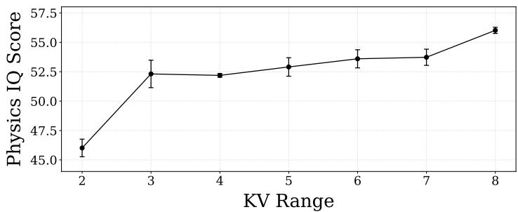

# 1. 论文基本信息

## 1.1. 标题
**MAGI-1: Autoregressive Video Generation at Scale**
(MAGI-1：大规模自回归视频生成)

## 1.2. 作者
**Sand AI Research Team**
(Sand AI 研究团队)
*注：这是一个来自 Sand AI 机构的研究团队，具体作者列表以“Sand AI research”署名。*

## 1.3. 发表期刊/会议
**arXiv Preprint**
(arXiv 预印本)

## 1.4. 发表年份
**2025年** (发布时间：2025-05-19)

## 1.5. 摘要
本文介绍了 **MAGI-1**，这是一个基于<strong>世界模型 (World Model)</strong> 理念构建的视频生成系统。与通过一次性处理整个视频序列的传统方法不同，MAGI-1 采用<strong>自回归 (Autoregressive)</strong> 的方式，逐个预测视频的“块 (Chunks)”（即固定长度的连续帧片段）。该模型通过训练去除随时间单调增加的噪声，实现了符合因果律的时间建模，并天然支持流式生成 (Streaming Generation)。得益于算法创新（如分块提示、Shortcut 蒸馏）和专用的基础设施（如 MagiAttention），MAGI-1 在图像生成视频 (I2V) 任务上表现出极高的时间一致性和可扩展性。其最大的 240亿参数 (24B) 版本支持长达 400万词元 (Tokens) 的上下文，能够实现实时、内存高效的推理。

## 1.6. 原文链接
[https://arxiv.org/abs/2505.13211v1](https://arxiv.org/abs/2505.13211v1) (状态：预印本)

---

# 2. 整体概括

## 2.1. 研究背景与动机
*   **核心问题:** 视频生成旨在合成既具光维真实感又具时间连贯性的序列。目前，基于扩散模型 (Diffusion Models) 的视频生成虽然取得了巨大成功（如 Sora），但大多采用<strong>双向 (Bi-directional) 去噪架构</strong>。
*   **现有挑战:**
    *   **非因果性:** 双向模型在推理时需要一次性访问整个视频序列，忽略了时间的因果结构（即未来不应影响过去）。
    *   **不支持流式生成:** 由于需要全序列访问，这些模型难以支持像直播一样的实时流式生成。
    *   **计算与内存瓶颈:** 生成长视频时，内存和计算成本随长度显著增加。
*   **本文思路:** 既然物理世界是因果的（由过去决定未来），视频生成模型也应遵循这一规律。作者提出将<strong>自回归 (Autoregressive, AR)</strong> 机制与**扩散去噪**相结合，通过“分块 (Chunk-wise)”的方式逐步生成视频。

## 2.2. 核心贡献与主要发现
1.  **分块自回归去噪架构:** 提出了 MAGI-1，通过逐块（Chunk-by-Chunk）生成视频，既保留了局部的高质量去噪能力，又实现了全局的时间因果建模。
2.  **统一任务框架:** 在同一个预训练过程中，通过调整“干净块 (Clean Chunks)”的比例，统一了<strong>文本生视频 (T2V)</strong>、<strong>图像生视频 (I2V)</strong> 和<strong>视频续写 (Video Continuation)</strong> 三大任务，无需针对特定任务微调。
3.  **MagiAttention 注意力机制:** 设计了一种支持超长上下文（4M tokens）的分布式注意力机制，解决了长视频生成中的显存和计算扩展性问题。
4.  **高效推理基础设施:** 实现了恒定的峰值推理成本（与视频总长度无关），支持实时流式视频生成。
5.  **卓越的物理理解能力:** 在 Physics-IQ 基准测试中，MAGI-1 在模拟物理动态方面显著优于现有模型，证明了自回归架构在捕捉因果物理规律方面的优势。

    下图（原文 Figure 1）展示了 MAGI-1 的核心工作流程：左侧显示视频被切分为多个块，按顺序去噪；右侧显示了“块因果注意力掩码”，确保生成当前块时只能看到过去的块。

    
    *该图像是示意图，展示了MAGI-1在视频生成过程中如何执行逐块的自回归去噪。每个块包含24帧视频，左侧展示了不同块之间的相互关系，以及块达到去噪水平后的生成过程。右侧展示了块因果注意力掩码，以确保块之间的时间因果关系。*

---

# 3. 预备知识与相关工作

为了深入理解 MAGI-1，初学者需要掌握以下基础概念。

## 3.1. 基础概念

### 3.1.1. 扩散模型与流匹配 (Flow Matching)
扩散模型通过将噪声逐步还原为数据来生成图像或视频。<strong>流匹配 (Flow Matching)</strong> 是扩散模型的一种更通用的数学形式，它直接学习从噪声分布到数据分布的变换轨迹（向量场）。
*   **直觉:** 想象一滴墨水（数据）滴入水中扩散成浑水（噪声）。生成过程就是学习如何“逆转”这个过程，把浑水变回墨水。
*   **关键公式:** 通常定义数据 $x_1$ 和噪声 $x_0$ 之间的线性插值路径：$x_t = (1-t)x_0 + t x_1$。模型的目标是预测这个变换的速度（Velocity）。

### 3.1.2. 自回归建模 (Autoregressive Modeling)
这是大语言模型 (如 GPT) 的核心原理。
*   **定义:** 根据已有的序列（历史）预测下一个元素。
*   <strong>因果性 (Causality):</strong> 在预测第 $t$ 个元素时，模型只能“看到”第 `1` 到 `t-1` 个元素，不能看到未来。这通常通过<strong>注意力掩码 (Attention Mask)</strong> 来实现，遮挡住未来的信息。

### 3.1.3. 变分自编码器 (VAE)
视频数据量极大（像素多）。直接在像素空间生成视频太慢。
*   **作用:** VAE 将高维的像素视频压缩成低维的<strong>潜变量 (Latent)</strong> 表示。MAGI-1 在这个压缩的潜空间中进行生成，然后再解码回视频。

### 3.1.4. 键值缓存 (KV Cache)
在自回归生成中，生成第 10 帧时需要用到第 1-9 帧的信息。如果每次都重新计算前 9 帧的特征，效率极低。
*   **作用:** 将前序步骤计算出的 Key 和 Value 矩阵缓存起来，下次直接调用。这在 LLM 推理中很常见，MAGI-1 将其引入视频生成以加速推理。

## 3.2. 前人工作与差异
*   <strong>双向去噪模型 (如 Sora, Open-Sora):</strong> 它们将视频视为一个整体 3D 块进行去噪。
    *   *缺点:* 难以生成无限长视频，推理显存随长度爆炸。
*   <strong>纯自回归模型 (如 VideoPoet):</strong> 将视频量化为离散的 Token，像生成文本一样生成视频 Token。
    *   *缺点:* 离散化通常会损失视频的细腻纹理质量。
*   **MAGI-1 的差异:** MAGI-1 结合了两者。它在**潜空间**是连续的（保证质量），在**时间上**是分块自回归的（保证因果性和长度扩展性）。

    ---

# 4. 方法论

## 4.1. 整体架构设计
MAGI-1 的核心思想是**分块自回归去噪**。视频被切分为多个固定长度的“块 (Chunk)”。每个块包含 $K$ 帧（例如 24 帧）。生成过程就像接力赛：
1.  生成第 1 块（基于文本或图像条件）。
2.  生成第 2 块（基于文本和已生成的第 1 块）。
3.  以此类推...

### 4.1.1. 基于 Transformer 的 VAE
为了提高效率，MAGI-1 首先使用 VAE 将视频压缩。
*   **创新点:** 不同于常见的基于 CNN (如 U-Net) 的 VAE，MAGI-1 使用了**基于 Transformer 的 VAE**。
*   **优势:** 在现代 GPU 上，Transformer 架构的推理速度比 CNN 更快，且更容易扩展模型规模。
*   **压缩率:** 空间上压缩 8 倍，时间上压缩 4 倍。

    下图（原文 Figure 2）展示了该 VAE 的架构，使用了 3D 卷积进行嵌入，随后是多层 Transformer 块。

    
    *该图像是一个示意图，展示了MAGI-1模型的编码器和解码器架构。左侧为编码器部分，包含位置编码、3D卷积、转换块等，右侧为解码器部分，通过PixelShuffle等步骤生成输出视频。图中结构的重复层数为24次，并在编码和解码中分别计算均值和方差。*

## 4.2. 自回归去噪模型详解

### 4.2.1. 训练目标：流匹配 (Flow Matching)
MAGI-1 使用流匹配作为核心训练目标。

*   **插值公式:**
    给定一个视频块 $i$，其干净数据为 $x_i^1$，采样的高斯噪声为 $x_i^0$。我们在时间步 $t \in [0, 1]$ 定义插值：
    $x_i^t = (1-t)x_i^0 + t x_i^1$
    这里，$t=0$ 代表纯噪声，$t=1$ 代表干净数据。

*   <strong>速度场 (Velocity Field):</strong>
    该插值路径的理想变化速度（**真实标注数据 Ground Truth**）为：
    $$
    v^*(x_i^t) = \frac{dx_i^t}{dt} = x_i^1 - x_i^0
    $$
    直观理解：这就是从噪声指向数据的方向向量。

*   **自回归约束:**
    MAGI-1 的关键在于**噪声时间步的单调性**。对于第 $i$ 个块和第 $j$ 个块，如果 $i < j$（即 $i$ 在前），则必须满足噪声水平 $t_i > t_j$（注意：原文公式中 $t$ 代表去噪程度，$t$ 越大越干净，原文表述是 "noise timestep... $t_i < t_j$"，这里需仔细辨析原文定义。原文写道 "Specifically, $t$ denotes the denoising timestep... $x^1$ denotes latent... $x^0$ is Gaussian noise"。且原文说 "earlier chunks are cleaner"。这意味着对于 $i < j$，第 $i$ 块应该更接近 $x^1$ (大 $t$)，第 $j$ 块更接近 $x^0$ (小 $t$)。但原文公式 3 后的文字写的是 "assign to each chunk as $t_i$, and impose the constraint $t_i < t_j$ whenever $i < j$"。结合上下文 "Monotonically increasing noise"，这通常意味着后面的块噪声更大。如果 $t=0$ 是噪声，$t=1$ 是数据，那么噪声大意味着 $t$ 小。**这里原文可能存在符号定义的反直觉之处，或者 $t$ 指的是扩散时间步（Diffusion Timestep，通常 0 是数据，T 是噪声）。让我们依据原文公式 1：$x^t = (1-t)x^0 + t x^1$。当 $t=0$ 是噪声，$t=1$ 是数据。如果 "earlier chunks are cleaner"，那么 $t_{early}$ 应该接近 1，$t_{late}$ 应该接近 0。原文的 "$t_i < t_j$" 约束似乎与此矛盾，除非 $t$ 定义反转。但在 Flow Matching 文献中，$t$ 通常指 flow time。让我们看 Figure 4。Figure 4 显示前面的块是白色的（Clean），后面的块是黑色的（Noisy）。这确认了前面的块更干净。我们暂且理解为：前面的块已经完成了大部分去噪，而后面的块还处于高噪状态。**

*   <strong>损失函数 (Loss Function):</strong>
    模型 $v(\cdot; \theta)$ 需要预测上述速度场。重要的是，预测第 $i$ 块的速度时，条件不仅包括当前块 $x_i^{t_i}$ 和文本 $c$，还包括**所有之前的块** $\{x_{j<i}^{t_j}\}$。
    $$
    \mathcal{L} = \mathbb{E}_{c, X_T} \left\| v(x_i^{t_i} | t_i, c, \{x_{j<i}^{t_j}\}; \theta) - v^*(x_i^{t_i}) \right\|^2
    $$
    *   **解读:** 这是一个均方误差 (MSE) 损失。模型试图让其预测的去噪方向 $v$ 尽可能接近真实方向 $v^*$。关键区别在于 $v$ 的输入包含了历史块 $\{x_{j<i}\}$，这使得模型能够利用历史信息来保持连贯性。

        下图（原文 Figure 3）展示了自回归去噪模型的架构，包括 Patch Embedding、改良的注意力机制（Block-Causal Attention）和前馈网络。

        
        *该图像是自回归去噪模型的架构示意图，展示了多个重要组件，包括最终干stem、并行注意力模块以及带有Sandwich Norm的前馈神经网络。该结构在处理时间步嵌入和文本条件时，优化了输入信息的传递和计算效率。*

### 4.2.2. 统一多任务训练
MAGI-1 的一个巧妙设计是通过**数据配置**统一不同任务。
*   **原理:** 既然模型是根据“前序块”预测“当前块”，那么任务的区别仅仅在于“前序块”的状态。
    *   <strong>文本生视频 (T2V):</strong> 前序块全是噪声（或者不存在）。
    *   <strong>视频续写 (Continuation):</strong> 前序块是干净的（已知的历史视频）。
    *   <strong>图像生视频 (I2V):</strong> 第一个块的第一帧是干净的（输入图像），其余是噪声。
*   **优势:** 这种统一使得模型只需训练一个权重，就能处理多种任务，无需专门微调。见下图（原文 Figure 4）。

    ![Figure 4: The figure shows how different tasks can be unified by varying the proportion of clean chunks. Each vertical bar represents a latent frame in a chunk, with darker bars indicating higher noise levels and the white bars denoting clean frames. The first row illustrates the early inference stage of T2V generation, starting from a single fully noisy chunk and progressing to multiple noisy chunks, before any clean chunk has been produced. The middle row depicts the case of I2V generation, treated as a special case of continuation in which only the first frame of the first chunk is clean. The last row describes a general stage where clean chunks are already available, applicable to video continuation and other scenarios involving prior denoised content.](images/4.jpg)
    *该图像是示意图，展示了通过变化干净片段的比例来统一不同任务的过程。每个竖条表示一个处理阶段的潜在帧，深色条表示较高的噪声水平，白色条则表示干净帧。第一行显示了文本到视频生成的早期推理阶段，第二行展示了图像到视频生成的特例，最后一行描述了视频续流的通用阶段。*

## 4.3. 推理策略

### 4.3.1. 分类器无关引导 (Classifier-Free Guidance, CFG) 的扩展
为了增强生成内容对文本和历史的遵循度，MAGI-1 扩展了 CFG 公式。
*   **标准 CFG:** $\nabla \log p(x|c) \approx \nabla \log p(x) + w (\nabla \log p(x|c) - \nabla \log p(x))$。
*   **MAGI-1 的引导:** 引入了两个权重：$w_{\text{prev}}$ (历史引导强度) 和 $w_{\text{text}}$ (文本引导强度)。
    $$
    \begin{aligned}
    \text{Score} = & (1 - w_{\text{prev}}) \cdot \nabla \log p(x_i) \\
    + & (w_{\text{prev}} - w_{\text{text}}) \cdot \nabla \log p(x_i | x_{<i}) \\
    + & w_{\text{text}} \cdot \nabla \log p(x_i | x_{<i}, c_{\text{text}})
      \end{aligned}
    $$
*   **作用:**
    *   $w_{\text{text}}$ 控制视频是否符合文字描述。
    *   $w_{\text{prev}}$ 控制视频是否与前一段视频连贯。作者发现设置 $w_{\text{prev}}=1.5$ 能显著减少块与块之间的闪烁和不连贯（见原文 Figure 7）。

### 4.3.2. Shortcut 模型蒸馏
标准的流匹配生成需要几十步（如 64 步）迭代，推理太慢。
*   **方法:** 使用 **Shortcut Distillation** 技术。训练一个小模型（或原模型的一个头）来预测未来 $\Delta t$ 时间步后的状态，从而允许更大的步长。
*   **结果:** 能够将推理步数减少到 8-16 步，且支持动态调整步数（在质量和速度间权衡）。

## 4.4. 基础设施：MagiAttention
为了训练长达 4M token 的序列，标准注意力机制内存会爆炸。
*   **问题:** 视频数据不仅长，而且采用了“Packing and Padding”（将多个短视频拼成一个长序列训练），导致注意力掩码 (Mask) 非常复杂。
*   **MagiAttention:**
    1.  **Flex-Flash-Attention:** 扩展了 FlashAttention-3，支持任意复杂的块状掩码。
    2.  <strong>上下文并行 (Context Parallelism, CP):</strong> 将长序列切分到多个 GPU 上计算。
    3.  **负载均衡:** 设计了贪心算法来平衡不同 GPU 的计算量，避免有的 GPU 忙死，有的闲死。
    4.  **零冗余通信:** 优化了 GPU 间的 KV 传输，只传输必要的块。

        下图（原文 Figure 14）展示了 MagiAttention 的系统概览。

        ![Figure 14: Overview of MagiAttention: (1) Flex-Flash-Attention(FFA), an efficient attention supports flexible mask patterns and native considers distribution requirements; (2) The dispatch solver shards and dispatches packed data with ultra-long contexts and heterogeneous masks, ensuring load-balanced computation; (3) Group-Cast and Group-Reduce primitives eliminate redundant communication; (4) The adaptive multi-stage overlap strategy effectively hides communication latency; (5) Forward and backward timelines of MagiAttention. With all techniques together, MagiAttention reach linear scalability under diverse scenarios.](images/21.jpg)
        *该图像是示意图，展示了MagiAttention的关键技术细节，包括灵活的Flash注意力内核、负载平衡计算、零冗余通信原语及自适应多阶段重叠策略。图中展示了前向和反向时间线，以及如何通过这些技术实现线性可扩展性。*

---

# 5. 实验设置

## 5.1. 数据集
*   **来源:** 收集了数千万亿字节 (Petabytes) 的原始视频和图像。
*   **处理流水线:** 包含非常复杂的清洗流程（见原文 Figure 13），包括：
    *   <strong>切镜 (Shot Cutting):</strong> 保证每个片段只有一个镜头。
    *   **美学评分:** 过滤丑图。
    *   **运动评分:** 过滤静止画面或运动过快画面。
    *   **文本/Logo检测:** 移除带水印或大量文字的视频。
    *   **MLLM 标注:** 使用多模态大模型为视频生成详细的描述（Caption）。

## 5.2. 评估指标

### 5.2.1. VBench-I2V (感知质量)
*   **概念定义:** 一个综合性的视频生成评估基准，包含多个维度。
*   **关键指标:**
    *   <strong>Subject Consistency (主体一致性):</strong> 视频中的物体是否保持长相不变。
    *   <strong>Motion Smoothness (运动平滑度):</strong> 动作是否流畅，无抖动。
    *   <strong>Aesthetic Quality (美学质量):</strong> 画面是否好看。
    *   **I2V Score:** 综合得分。

### 5.2.2. Physics-IQ (物理规律)
*   **概念定义:** 评估模型是否理解物理世界（如重力、碰撞）。给定视频前 3 秒，预测后 5 秒，与<strong>真实标注数据 (Ground Truth)</strong> 对比。
*   **数学公式:**
    *   <strong>MSE (均方误差):</strong> $\text{MSE} = \frac{1}{N} \sum (I_{\text{pred}} - I_{\text{GT}})^2$。衡量像素级差异。
    *   **Spatial IoU:** 衡量物体位置预测的重叠度。

## 5.3. 对比基线
*   **闭源/商业模型:** Kling 1.6 (可灵), Gen-3 (Runway), Hailuo (海螺/MiniMax).
*   **开源模型:** Wan-2.1, HunyuanVideo (混元), Open-Sora.
*   **学术界模型:** VideoPoet, Lumiere.

    ---

# 6. 实验结果与分析

## 6.1. 核心结果分析：I2V 生成质量
MAGI-1 在图像生成视频任务上表现强劲。

以下是原文 **Table 9** 的结果（VBench-I2V 基准）：

<table>
<thead>
<tr>
<th rowspan="2"></th>
<th colspan="3" rowspan="2">Metric (VBench I2V)</th>
<th colspan="1">MAGI-1 (2× decoder)</th>
<th colspan="1">MAGI-1 (1× decoder)</th>
<th colspan="1">VisualPi</th>
<th colspan="1">StepFun (TI2V)</th>
</tr>
</thead>
<tbody>
<tr>
<td><b>89.28</b></td>
<td>88.88</td>
<td>89.08</td>
<td>88.36</td>
</tr>
<tr>
<td rowspan="8">Quality Metrics</td>
<td colspan="3">I2V-Camera</td>
<td>50.85</td>
<td>50.77</td>
<td>51.20</td>
<td>49.23</td>
</tr>
<tr>
<td colspan="3">I2V-Subject</td>
<td><b>98.39</b></td>
<td>98.36</td>
<td>98.67</td>
<td>97.86</td>
</tr>
<tr>
<td colspan="3">I2V-Background</td>
<td>99.00</td>
<td>98.98</td>
<td>98.87</td>
<td>98.63</td>
</tr>
<tr>
<td colspan="3">Subject Cons.</td>
<td>93.96</td>
<td>94.28</td>
<td>96.87</td>
<td>96.02</td>
</tr>
<tr>
<td colspan="3">Motion Smooth.</td>
<td>98.68</td>
<td>98.83</td>
<td><b>99.18</b></td>
<td><b>99.24</b></td>
</tr>
<tr>
<td colspan="3">Imaging Quality</td>
<td>69.71</td>
<td>69.68</td>
<td>72.86</td>
<td>70.44</td>
</tr>
<tr>
<td colspan="3">Dynamic Degree</td>
<td>68.21</td>
<td>63.41</td>
<td>49.93</td>
<td>48.78</td>
</tr>
<tr>
<td colspan="3">Background Cons.</td>
<td>96.74</td>
<td>96.90</td>
<td>97.50</td>
<td>97.06</td>
</tr>
<tr>
<td colspan="3">Aesthetic Quality</td>
<td>64.74</td>
<td>61.89</td>
<td>61.91</td>
<td>62.29</td>
</tr>
<tr>
<td rowspan="2">Agg. Scores</td>
<td colspan="3">Quality Score</td>
<td>82.44</td>
<td>81.67</td>
<td>81.95</td>
<td>81.22</td>
</tr>
<tr>
<td colspan="3">I2V Score</td>
<td>96.12</td>
<td>96.08</td>
<td>96.21</td>
<td>95.50</td>
</tr>
</tbody>
</table>

*   **分析:** MAGI-1 (2x decoder) 取得了 **89.28** 的最高总分。特别是在 <strong>Dynamic Degree (动态程度)</strong> 上得分为 68.21，远超 VisualPi (49.93)，说明 MAGI-1 生成的视频运动幅度更大、更丰富，这通常是自回归模型相对于保守的双向模型的优势。

## 6.2. 核心结果分析：物理规律理解
这是本文最亮眼的结果。在 Physics-IQ 基准上，MAGI-1 展现了对物理世界的深刻理解。

以下是原文 **Table 10** 的结果：

<table>
<thead>
<tr>
<th colspan="2">Model</th>
<th>Phys.IQ Score ↑</th>
<th>Spatial IoU ↑</th>
<th>SpatioTemporal ↑</th>
<th>Weighted Spatial IoU ↑</th>
<th>MSE ↓</th>
</tr>
</thead>
<tbody>
<tr>
<td rowspan="3" colspan="2">MAGI-1 (V2V) VideoPoet (V2V) Lumiere (V2V)</td>
<td><b>56.02</b></td>
<td><b>0.367</b></td>
<td><b>0.270</b></td>
<td><b>0.304</b></td>
<td><b>0.005</b></td>
</tr>
<tr>
<td>29.50</td>
<td>0.204</td>
<td>0.164</td>
<td>0.137</td>
<td>0.010</td>
</tr>
<tr>
<td>23.00</td>
<td>0.170</td>
<td>0.155</td>
<td>0.093</td>
<td>0.013</td>
</tr>
<tr>
<td rowspan="9" colspan="2">MAGI-1 (I2V) Kling1.6 (I2V) VideoPoet (I2V) Gen 3 (I2V) Wan2.1 (I2V) Lumiere (I2V) SVD (I2V) Pika 1.0 (I2V) Sora (I2V)</td>
<td><b>30.23</b></td>
<td><b>0.203</b></td>
<td>0.151</td>
<td><b>0.154</b></td>
<td><b>0.012</b></td>
</tr>
<tr>
<td>23.64</td>
<td>0.197</td>
<td>0.086</td>
<td>0.144</td>
<td>0.025</td>
</tr>
<tr>
<td>20.30</td>
<td>0.141</td>
<td>0.126</td>
<td>0.087</td>
<td>0.012</td>
</tr>
<tr>
<td>22.80</td>
<td>0.201</td>
<td>0.115</td>
<td>0.116</td>
<td>0.015</td>
</tr>
<tr>
<td>20.89</td>
<td>0.153</td>
<td>0.100</td>
<td>0.112</td>
<td>0.023</td>
</tr>
<tr>
<td>-</td>
<td>0.113</td>
<td>0.061</td>
<td>0.173</td>
<td>0.016</td>
</tr>
<tr>
<td>-</td>
<td>0.132</td>
<td>0.076</td>
<td>0.073</td>
<td>0.021</td>
</tr>
<tr>
<td>13.00</td>
<td>0.140</td>
<td>0.041</td>
<td>0.078</td>
<td>0.014</td>
</tr>
<tr>
<td>10.00</td>
<td>0.138</td>
<td>0.047</td>
<td>0.063</td>
<td>0.030</td>
</tr>
<tr>
<td colspan="2">Ground Truth</td>
<td>100.0</td>
<td>0.678</td>
<td>0.535</td>
<td>0.577</td>
<td>0.002</td>
</tr>
</tbody>
</table>

*   **分析:**
    *   在 V2V 设置下（输入前 3 秒视频），MAGI-1 的得分高达 **56.02**，几乎是第二名 VideoPoet (29.50) 的两倍。这强有力地证明了 MAGI-1 的**自回归+去噪**架构在捕捉时间连续性和因果物理规律方面具有压倒性优势。
    *   在 I2V 设置下（仅输入第 3 秒的一张图），MAGI-1 依然以 **30.23** 分位列第一，超过了 Kling (23.64) 和 Sora (10.00)。

## 6.3. 消融实验：KV Cache 历史长度的影响
作者研究了在推理时，模型“回头看”多长时间的历史对物理预测最有利。
*   **结果:** 见下图（原文 Figure 18）。随着 KV Range（历史长度）增加，Physics-IQ 分数上升。但只要 KV Range = 2（即看前两个块），性能就有巨大提升。这说明短期的历史信息对于维持物理连续性至关重要。

    
    *该图像是图表，展示了物理 IQ 分数与历史上下文的关系。随着 KV 范围值的增加，物理 IQ 分数呈现逐渐上升的趋势，表明历史信息对性能的影响。*

---

# 7. 总结与思考

## 7.1. 结论总结
MAGI-1 成功证明了**自回归扩散模型**是视频生成的一条可行且优越的路径。
1.  **可扩展性:** 24B 参数、4M 上下文、恒定推理显存，使其能够生成无限长的视频。
2.  **一致性:** 逐块自回归的设计天然符合物理因果律，在物理模拟和动作连贯性上超越了当前的 SOTA 模型。
3.  **实用性:** 统一了多任务训练，且支持流式输出，非常适合实际产品部署（如直播、实时交互）。

## 7.2. 局限性与未来工作
*   **架构耦合:** 目前模型同时负责高层的语义理解（理解“一只猫在跑”）和低层的像素去噪（画出猫的毛发）。作者认为这种耦合可能限制了性能，未来可以探索将“理解”与“生成”解耦的架构。
*   **首块延迟:** 虽然流式生成中后续块很快，但第一个块的生成（Time to First Chunk）仍然受限于 VAE 解码和 T5 文本编码的速度，有待优化。

## 7.3. 个人启发与批判
*   **因果性的回归:** 在图像生成领域，双向去噪（如 Stable Diffusion）统治了一切。但在视频领域，MAGI-1 告诉我们，**时间是单向的**。尊重这一物理本质的自回归模型，在处理复杂动态和长视频时，比试图“上帝视角”一次性生成全视频的双向模型更具优势。这可能是通往真正的“世界模拟器 (World Simulator)”的必经之路。
*   **从生成到模拟:** MAGI-1 在 Physics-IQ 上的惊人表现暗示，视频生成模型不仅仅是“画画”，它正在学习这个世界的物理引擎。这对于机器人学习、自动驾驶模拟等领域具有深远意义。