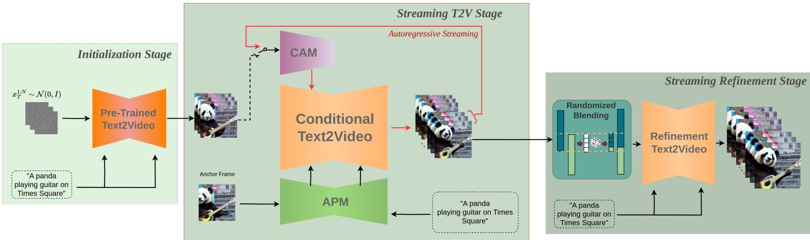
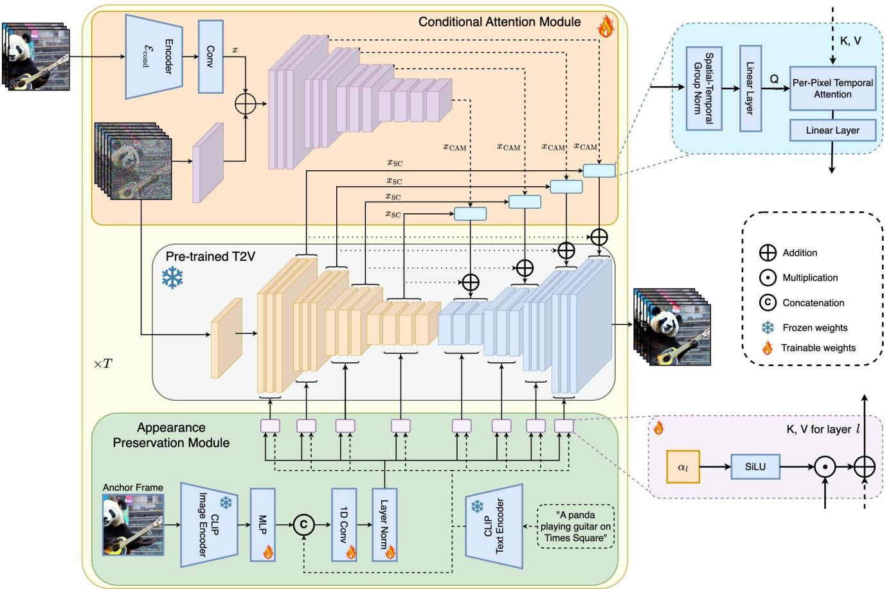
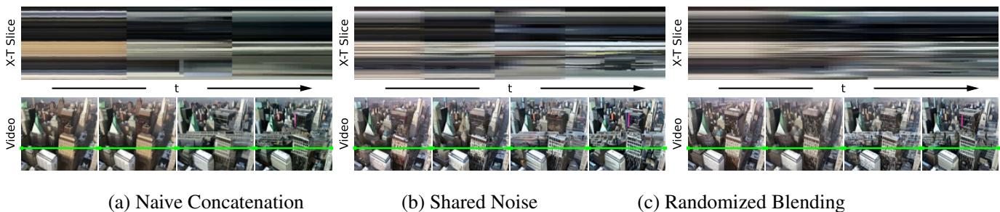
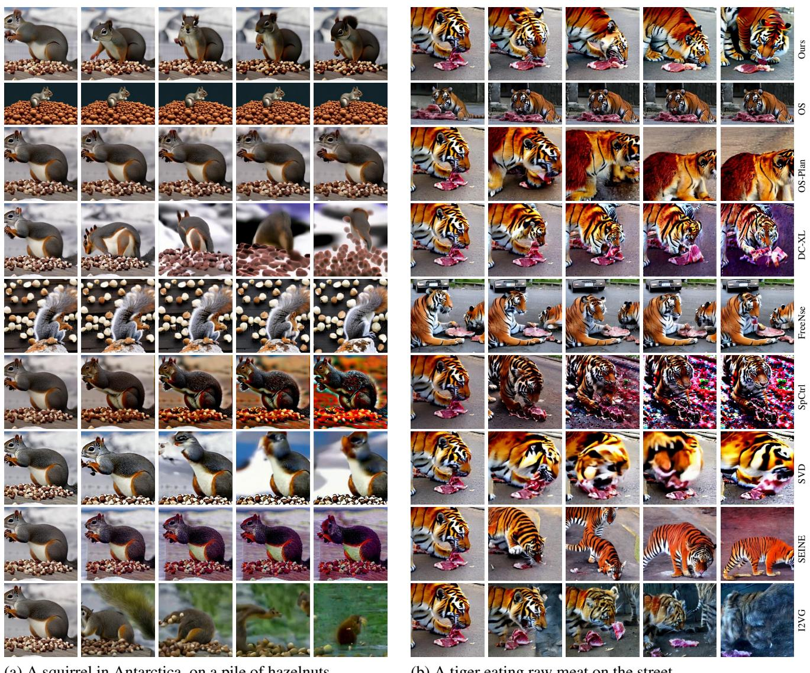
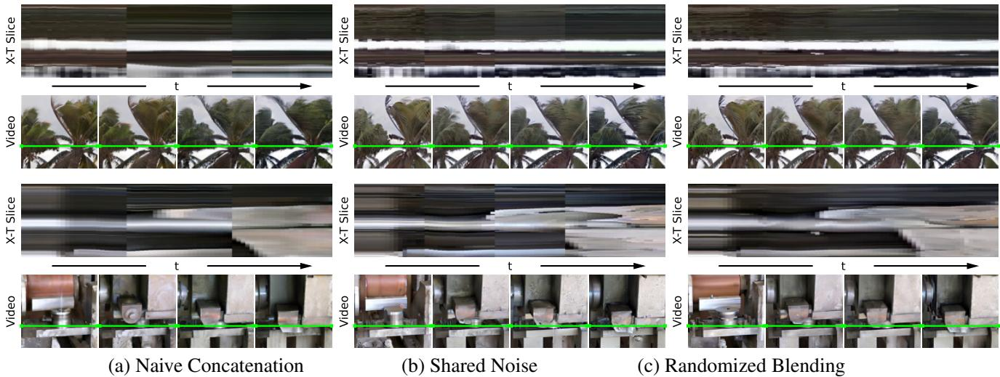

# 1. 论文基本信息

## 1.1. 标题
**StreamingT2V: Consistent, Dynamic, and Extendable Long Video Generation from Text**
(StreamingT2V：一致、动态且可扩展的文本生成长视频方法)

## 1.2. 作者
**Roberto Henschel**, Levon Khachatryan, Hayk Poghosyan, Daniil Hayrapetyan, Vahram Tadevosyan, Zhangyang Wang, Shant Navasardyan, Humphrey Shi
*   **隶属机构:** Picsart AI Research (PAIR), UT Austin, Georgia Tech

## 1.3. 发表期刊/会议
**Published at (UTC): 2024-03-21** (根据格式推测为预印本发布或会议录用时间，原文链接指向 arXiv)

## 1.4. 发表年份
2024

## 1.5. 摘要
本论文提出了一种名为 **StreamingT2V** 的自回归（Autoregressive）长视频生成方法。现有的文本生成视频（Text-to-Video, T2V）模型通常只能生成高质量的短视频（约 16 到 24 帧），当试图简单地延长视频时，往往会出现画面停滞或生硬的场景切换。StreamingT2V 通过引入<strong>短期记忆模块（CAM）</strong>来保证帧之间的平滑过渡，引入<strong>长期记忆模块（APM）</strong>来防止模型遗忘初始场景特征，并提出了一种<strong>随机混合（Randomized Blending）</strong>技术用于视频增强。实验表明，该方法能够生成 2 分钟甚至更长（1200+ 帧）的高质量、动态且连贯的视频，优于现有的图像到视频（Image-to-Video）基线方法。

## 1.6. 原文链接
*   **原文链接:** [https://arxiv.org/abs/2403.14773](https://arxiv.org/abs/2403.14773)
*   **PDF 链接:** [https://arxiv.org/pdf/2403.14773v2.pdf](https://arxiv.org/pdf/2403.14773v2.pdf)

# 2. 整体概括

## 2.1. 研究背景与动机
*   **核心问题:** 目前的扩散模型在生成短视频方面表现出色，但无法直接生成长视频。
*   **现有挑战:**
    *   **计算成本:** 直接训练生成长视频（如 1200 帧）的模型计算量过大，不切实际。
    *   **自回归生成的缺陷:** 现有的“自回归”方法（即一段一段地生成视频，后一段基于前一段）通常简单地将前一段的最后几帧作为条件。这种简单的拼接（Concatenation）或基于 CLIP 图像编码的条件机制太弱，导致生成的视频出现<strong>硬切（Hard-cuts，场景不连贯）</strong>或<strong>停滞（Stagnation，画面静止不动）</strong>。
    *   **遗忘问题:** 随着视频不断生成，模型容易“忘记”最初生成的物体长什么样，导致物体外观发生严重变形。

## 2.2. 核心贡献/主要发现
StreamingT2V 提出了一套完整的长视频生成流程，包含三个核心创新点：
1.  <strong>条件注意力模块 (Conditional Attention Module, CAM):</strong> 这是一个**短期记忆**机制。它通过注意力机制将前一个视频块（Chunk）的信息传递给当前生成的块，确保了块与块之间的过渡非常平滑，消除了硬切。
2.  <strong>外观保持模块 (Appearance Preservation Module, APM):</strong> 这是一个**长期记忆**机制。它提取第一个视频块的高级特征（作为锚点），并在后续所有生成步骤中作为条件输入，防止模型遗忘初始场景和物体的特征。
3.  <strong>随机混合 (Randomized Blending):</strong> 针对高分辨率视频增强阶段，提出了一种在重叠帧之间进行随机拼接的方法，解决了增强过程中的块间不一致问题。

    下图（原文 Figure 2）展示了 StreamingT2V 的整体架构，包括初始化、流式生成（Streaming T2V Stage）和流式增强（Refinement Stage）三个阶段：

    
    *该图像是一个示意图，展示了StreamingT2V方法的三个阶段：初始化阶段、Streaming T2V阶段和Streaming Refinement阶段。初始化阶段使用预训练模型生成初始特征，通过条件注意模块（CAM）和外观保持模块（APM）进行短期和长期的特征提取，确保生成视频的一致性与流畅度。*

# 3. 预备知识与相关工作

## 3.1. 基础概念
为了理解本文，初学者需要掌握以下概念：

*   <strong>文本到视频扩散模型 (Text-to-Video Diffusion Models):</strong> 这类模型学习如何从高斯噪声中逐步“去噪”，最终生成符合文本描述的视频。它们通常基于潜在扩散模型（Latent Diffusion Models, LDM），即在压缩的潜在空间（Latent Space）而非像素空间进行计算，以降低成本。
*   <strong>自回归生成 (Autoregressive Generation):</strong> 类似于语言模型生成文本（预测完这一个词，将其作为输入预测下一个词）。在视频生成中，自回归意味着先生成第 1-16 帧，然后基于第 16 帧生成第 17-32 帧，以此类推，从而生成无限长的视频。
*   **CLIP (Contrastive Language-Image Pre-training):** 一个通过图文对训练的模型。通常用于将文本或图像转换成向量（Embedding）。在视频生成中，常用 CLIP 的图像编码器来提取参考图像的特征，指导视频生成。

## 3.2. 前人工作与技术演进
*   **短视频生成:** ModelScope、SVD (Stable Video Diffusion) 等模型能生成高质量的短视频，但无法直接生成长视频。
*   **长视频尝试:**
    *   **Text2Video-Zero:** 使用现有的文生图模型，通过注意力控制生成视频，但动作僵硬。
    *   **SparseCtrl:** 试图通过添加稀疏控制来生成视频，但需要填充零帧，导致输入不一致和场景切换生硬。
    *   **基于 CLIP 的条件方法:** 许多方法（如 I2VGen-XL）使用 CLIP 图像编码作为条件。本文指出，CLIP 编码丢失了重建帧所需的关键细节信息，导致长视频生成时质量下降严重。

## 3.3. 差异化分析
本文的 **StreamingT2V** 与上述方法的本质区别在于：
1.  它不依赖简单的拼接或 CLIP 编码来做短期过渡，而是设计了专门的注意力模块（CAM）来“借用”前一帧的特征。
2.  它引入了独立的长期记忆（APM），解决了其他自回归方法中常见的“特征漂移”或“遗忘”问题。

# 4. 方法论

## 4.1. 方法原理
StreamingT2V 的核心思想是将长视频生成分解为三个阶段：
1.  <strong>初始化阶段 (Initialization Stage):</strong> 使用预训练模型生成第一个视频块（Chunk，例如 16 帧）。
2.  <strong>流式生成阶段 (Streaming T2V Stage):</strong> 自回归地生成后续的视频块。利用 **CAM** 确保与上一块的衔接平滑，利用 **APM** 确保物体外观不走样。
3.  <strong>流式精炼阶段 (Streaming Refinement Stage):</strong> 使用高分辨率模型对生成的长视频进行增强（Upscaling），利用 **随机混合** 技术消除块与块之间的拼接痕迹。

    下图（原文 Figure 3）详细展示了 CAM 和 APM 模块的内部结构：

    
    *该图像是StreamingT2V论文中的示意图，展示了Conditional Attention Module和Appearance Preservation Module的结构。图中表示了不同模块之间的数据流动和处理方式，明确地显示了如何将条件注意力机制应用于视频生成的过程。*

## 4.2. 条件注意力模块 (Conditional Attention Module, CAM)
CAM 的作用是充当**短期记忆**。它让当前生成的视频块能够“看到”并利用前一个视频块的最后几帧信息，从而保证动作的连贯性。

### 4.2.1. 特征提取与注入
CAM 的设计灵感来源于 ControlNet，但针对视频任务进行了改进。
1.  **特征提取:** 使用一个图像编码器 $\mathcal{E}_{cond}$ 处理前一个视频块的最后 $F_{cond}=8$ 帧。这些特征随后通过一个与主模型（Video-LDM）结构相似的编码器层。
2.  <strong>特征注入 (Feature Injection):</strong> 提取的特征并非通过简单的加法注入，而是通过<strong>时间多头注意力 (Temporal Multi-Head Attention, T-MHA)</strong> 注入到主模型 UNet 的跳跃连接（Skip Connection）中。

### 4.2.2. 核心公式：特征注入
让 $x_{SC}$ 表示主模型 UNet 中的跳跃连接特征，$x_{CAM}$ 表示 CAM 提取的特征。

首先，通过线性映射 $P_Q, P_K, P_V$ 生成查询（Query）、键（Key）和值（Value）。注意，查询来自主模型特征，而键和值来自 CAM 特征，这意味着主模型在“查询”前一帧的信息：
$$
Q = P_Q(x_{SC}'), \quad K = P_K(x_{CAM}), \quad V = P_V(x_{CAM})
$$
然后，应用时间注意力机制：
$$
x_{SC}'' = \mathrm{T\text{-}MHA}(Q, K, V)
$$
最后，将注意力输出经过线性映射 $P_{out}$ 和重塑操作 $R$ 后，加回到原始的跳跃连接特征中：
$$
x_{SC}''' = x_{SC} + R(P_{out}(x_{SC}''))
$$
*   **符号解释:**
    *   $x_{SC}$: 主模型 UNet 当前层的特征。
    *   $x_{CAM}$: CAM 模块提取的前一个视频块的特征。
    *   `Q, K, V`: 注意力机制的三要素。这里 `K, V` 携带了前一帧的信息。
    *   $P_{out}$: 输出投影层，初始化为零，确保训练初期 CAM 不影响主模型（类似于 ControlNet 的零卷积策略）。

        这种设计使得模型可以灵活地从前一帧借用信息，而不是被强制约束，从而实现了比 SparseCtrl 等方法更平滑的过渡。

## 4.3. 外观保持模块 (Appearance Preservation Module, APM)
APM 的作用是充当**长期记忆**。自回归生成容易导致“电话传话”效应，即误差累积导致物体逐渐变形。APM 通过始终参考第一帧（Anchor Frame）来解决这个问题。

### 4.3.1. 混合条件嵌入
APM 不仅仅使用 CLIP 图像编码，而是将其与文本指令混合。
1.  提取锚点帧（Anchor Frame）的 CLIP 图像 Token。
2.  通过一个 MLP 层将图像 Token 扩展为 $k=16$ 个 Token。
3.  将这些图像 Token 与文本 Prompt 的 Token 拼接（Concatenate）。

### 4.3.2. 核心公式：交叉注意力加权
在主模型的交叉注意力（Cross-Attention）层中，通常只使用文本特征 $x_{text}$。APM 引入了一个加权机制来融合锚点帧信息：
$$
x_{cross} = \mathrm{SiLU}(\alpha_l) x_{mixed} + x_{text}
$$
*   **符号解释:**
    *   $x_{cross}$: 最终输入到交叉注意力层的条件特征。
    *   $x_{mixed}$: 包含锚点帧图像信息和文本信息的混合特征。
    *   $x_{text}$: 原始的文本指令特征。
    *   $\alpha_l$: 一个可学习的标量参数，初始化为 0。
    *   $\mathrm{SiLU}$: 激活函数。

        通过这种方式，模型在生成过程中会同时关注“文本描述”和“初始图像的样子”，从而在长视频中保持物体身份一致。

## 4.4. 自动回归视频增强与随机混合 (Randomized Blending)
为了生成高清视频（如 $720 \times 720$），StreamingT2V 使用一个视频增强模型（Refiner Video-LDM）对生成的低分辨率长视频进行分块增强。

### 4.4.1. 核心挑战与解决方案
如果简单地分块增强然后拼接，块与块的边界会有明显的接缝。
<strong>解决方案：随机混合 (Randomized Blending)</strong>。
在增强过程中，对两个连续的视频块（Chunk `i-1` 和 Chunk $i$），它们有 $\mathcal{O}=8$ 帧的重叠。我们不直接取平均，而是在每一步去噪时，随机选择一个分割点进行拼接。

### 4.4.2. 核心公式：随机拼接
假设 $x_L$ 是前一个块在重叠区域的潜在变量（Latent Code），$x_R$ 是当前块在重叠区域的潜在变量。我们随机采样一个帧索引 $f_{thr}$（从 `0` 到 $\mathcal{O}$），然后在此处“切开”并拼接：
$$
x_{LR} := \mathrm{concat}([x_L^{1:F-f_{thr}}, x_R^{f_{thr}+1:F}], \mathrm{dim}=0)
$$
*   **符号解释:**
    *   $x_{LR}$: 混合后的重叠区域潜在变量。
    *   $x_L$: 左侧（前一个）块的潜在变量。
    *   $x_R$: 右侧（当前）块的潜在变量。
    *   $f_{thr}$: 随机选定的分割帧索引。
    *   $\mathrm{concat}$: 在时间维度（帧维度）上进行拼接。

        在实际操作中，对于重叠区域的第 $f$ 帧，使用左侧块信息的概率为 $1 - \frac{f}{\mathcal{O}+1}$。这种概率性的混合策略有效地消除了拼接痕迹。

下图（原文 Figure 4）对比了不同拼接策略的效果，(c) 为随机混合，可见其过渡最为平滑：

*该图像是一个示意图，展示了三种视频生成方法的对比：左侧是简单拼接方法（Naive Concatenation），中间是共享噪声方法（Shared Noise），右侧是随机混合方法（Randomized Blending）。图中以横向时间切片（XT Slice）和视频帧对比，显示了不同方法在生成长视频时的效果差异。*

# 5. 实验设置

## 5.1. 数据集
*   **训练数据:** 使用内部数据集进行训练。
*   **测试集:** 为了公平对比，作者构建了一个包含 50 个 Prompt 的测试集（详见附录），涵盖不同的动作、物体和场景（如“骆驼在雪地里跑”、“宇航员骑马”等）。
*   **视频规格:** 生成长度为 240 帧、600 帧甚至 1200 帧的视频用于评估。

## 5.2. 评估指标
为了全面评估长视频质量，作者使用了以下三个关键指标：

1.  <strong>场景切换检测 (SCuts):</strong>
    *   **概念定义:** 使用 AdaptiveDetector 检测视频中不自然的场景突变次数。对于生成单镜头长视频的任务，SCuts 越低越好（理想情况接近 0）。
    *   **工具:** Pyscenedetect。

2.  <strong>运动感知扭曲误差 (Motion Aware Warp Error, MAWE):</strong>
    *   **概念定义:** 这是一个作者新提出的指标，用于同时评估**时间一致性**和**运动量**。许多模型（如 FreeNoise）生成的视频几乎是静止的，这会导致误差很低，但并不是好的视频。MAWE 惩罚那些静止的视频。
    *   **数学公式:**
        $$
        \mathrm{MAWE}(\mathcal{V}) := \frac{W(\mathcal{V})}{\mathrm{OFS}(\mathcal{V})}
        $$
    *   **符号解释:**
        *   $W(\mathcal{V})$: 平均扭曲误差 (Mean Warp Error)，衡量帧与帧之间的一致性（越低越好）。
        *   $\mathrm{OFS}(\mathcal{V})$: 光流得分 (Optical Flow Score)，衡量视频的运动幅度（越高越好）。
    *   **意义:** 如果视频运动大（分母大）且一致性好（分子小），MAWE 就会非常低，这是最理想的情况。

3.  <strong>CLIP 得分 (CLIP Score):</strong>
    *   **概念定义:** 衡量视频帧与文本 Prompt 之间的语义一致性。
    *   **计算:** 计算所有帧的 CLIP 图像 Embedding 与文本 Embedding 的余弦相似度均值。

## 5.3. 对比基线
作者将 StreamingT2V 与以下几类最先进的方法进行了对比：
*   <strong>图像到视频 (I2V) 方法 (自回归模式):</strong> I2VGen-XL, SVD (Stable Video Diffusion), DynamiCrafter-XL, SEINE。这些模型本身生成短视频，作者将其改为自回归模式进行长视频生成。
*   **视频到视频 / 特定长视频方法:** SparseCtrl, FreeNoise, OpenSora, OpenSoraPlan。

# 6. 实验结果与分析

## 6.1. 核心结果分析
实验结果表明，StreamingT2V 在保持高运动量的同时，实现了最佳的时间一致性和文本对齐度。

**定量对比:**
StreamingT2V 在 MAWE（一致性与动态性的平衡）和 CLIP（文本对齐）指标上均取得了最佳成绩。虽然 FreeNoise 的 SCuts（场景切断）分数更低，但这主要是因为它生成的视频几乎是静止的。

下图（原文 Table 1）展示了定量对比结果：

| Method | ↓MAWE | ↓SCuts | ↑CLIP |
| :--- | :--- | :--- | :--- |
| SparseCtrl [11] | 6069.7 | 5.48 | 29.32 |
| I2VGenXL [47] | 2846.4 | 0.4 | 27.28 |
| DynamiCrafterXL [42] | 176.7 | 1.3 | 27.79 |
| SEINE [6] | 718.9 | 0.28 | 30.13 |
| SVD [3] | 857.2 | 1.1 | 23.95 |
| FreeNoise [25] | 1298.4 | 0 | 31.55 |
| OpenSora [48] | 1165.7 | 0.16 | 31.54 |
| OpenSoraPlan [24] | 72.9 | 0.24 | 29.34 |
| **StreamingT2V (Ours)** | **52.3** | **0.04** | **31.73** |

*   **结果解读:** StreamingT2V 的 MAWE 仅为 52.3，远低于第二名 OpenSoraPlan 的 72.9，这说明它在拥有丰富动态的同时，画面极其连贯。而 SparseCtrl 的 MAWE 高达 6000+，说明其生成质量极不稳定。

## 6.2. 定性结果展示
视觉效果上，StreamingT2V 避免了其他方法的两个极端：画面停滞（Stagnation）和画面崩坏（Degradation）。

下图（原文 Figure 5）展示了不同方法的生成效果对比：
*   **StreamingT2V (Ours)** 生成的松鼠和老虎动作连贯，场景保持一致。
*   **I2VGen-XL** 和 **SEINE** 随着时间推移，画质明显下降或出现色彩失真。
*   **FreeNoise** 的画面几乎是静止的。

    
    *该图像是示意图，左侧展示了一只在南极的松鼠在一堆榛子上的多个生成实例，右侧则呈现了一只在街道上吃生肉的老虎的不同生成效果。各个实例展示了不同方法对图像生成质量的影响。*

## 6.3. 消融实验
作者验证了各个组件的重要性（详见原文 Appendix）：
*   **移除 CAM:** 视频块之间的过渡变得生硬，SCuts 分数显著升高。证明 CAM 对于平滑过渡至关重要。下图（原文 Figure 16）展示了用于对比的 Add-Cond 基线模型示意图：

    
    *该图像是示意图，展示了三种视频生成方法的对比：上行展示了使用 'Naive Concatenation'（a）、'Shared Noise'（b）和 'Randomized Blending'（c）方法生成视频的效果，比较不同方法在 XT 切片上的平滑性与一致性。*

*   **移除 APM:** 视频生成后期，人物的脸部特征和衣着风格发生改变（例如从夹克变成了其他衣服），证明 APM 有效防止了遗忘。

# 7. 总结与思考

## 7.1. 结论总结
StreamingT2V 成功解决了一致性长视频生成的难题。它通过 <strong>CAM（短期记忆）</strong> 实现了无缝的视频块拼接，通过 <strong>APM（长期记忆）</strong> 保持了长期的内容一致性，并通过 **随机混合** 技术实现了高质量的视频增强。实验证明，该方法在动态性、一致性和文本对齐度上均优于现有的开源解决方案。

## 7.2. 局限性与未来工作
*   **局限性:** 该框架仍然依赖于一个基础的文生视频模型（如 ModelScope）。如果基础模型的生成能力有限（例如无法生成某种复杂的动作），StreamingT2V 的效果也会受限。
*   **未来工作:** 作者提到该方法具有很好的通用性，可以扩展到 Transformer 架构的模型（如 DiT 架构的 OpenSora）上。原文 Figure 6 展示了将该方法应用于 OpenSora 的初步结果，证明了其泛化潜力。

    
    *该图像是示意图，展示了使用 OpenSora 作为基础模型的 StreamingT2V 生成的视频效果。图中包含多个帧，呈现出连续播放的长视频效果，展示了模型在保持场景一致性方面的能力。*

## 7.3. 个人启发与批判
*   **启发:** 这篇论文非常清晰地展示了解决长序列生成问题的经典思路：**分解长序列依赖**。它将依赖关系拆解为“短期连续性”（由 CAM 负责）和“长期一致性”（由 APM 负责）。这种“短期+长期”记忆模块的设计思路，对于其他序列生成任务（如长文本生成、长音频生成）也有很强的借鉴意义。
*   **批判:**
    *   虽然提出了 MAWE 指标，但对长视频内容的“叙事性”评估仍然缺乏。目前的评估更多关注画面不崩坏、动作流畅，但长达 2 分钟的视频是否符合逻辑上的叙事发展（例如先走路再坐下），目前的方法似乎还没涉及到高层的语义规划。
    *   APM 依赖于第一帧作为 Anchor。如果第一帧生成得不好，或者视频中间发生了场景的剧烈转换（例如从室内走到室外），死板地参考第一帧可能会成为一种阻碍。未来的研究可能需要动态更新 Anchor Frame。