# StreamingT2V: Consistent, Dynamic, and Extendable Long Video Generation from Text

Roberto Henschel1\*†, Levon Khachatryan1\*, Hayk Poghosyan1\*, Daniil Hayrapetyan1\*, Vahram Tadevosyan1‡, Zhangyang Wang1,2, Shant Navasardyan1, Humphrey Shi1,3 1Picsart AI Resarch (PAIR) 2UT Austin 3Georgia Tech https://github.com/Picsart-AI-Research/StreamingT2V

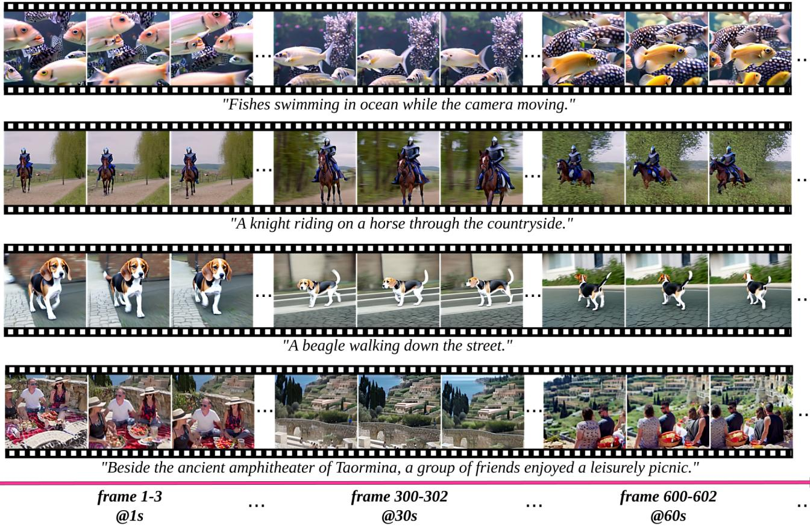  
used, indicating potential for even higher-quality with improved base models.

# Abstract

Text-to-video diffusion models enable the generation of high-quality videos that follow text instructions, simplifying the process of producing diverse and individual content. Current methods excel in generating short videos (up to 16s), but produce hard-cuts when naively extended to long video synthesis. To overcome these limitations, we present StreamingT2V, an autoregressive method that generates long videos of up to 2 minutes or longer with seamless transitions. The key components are: (i) a short-term memory block called conditional attention module (CAM), which conditions the current generation on the features extracted from the preceding chunk via an attentional mechanism, leading to consistent chunk transitions, (ii) a longterm memory block called appearance preservation module (APM), which extracts high-level scene and object features from the first video chunk to prevent the model from forgetting the initial scene, and (iii) a randomized blending approach that allows for the autoregressive application of a video enhancer on videos of indefinite length, ensuring consistency across chunks. Experiments show that StreamingT2V produces more motion, while competing methods suffer from video stagnation when applied naively in an autoregressive fashion. Thus, we propose with StreamingT2V a high-quality seamless text-to-long video generator, surpassing competitors in both consistency and motion.

# 1. Introduction

The emergence of diffusion models [14, 27, 29, 34] has sparked significant interest in text-guided image synthesis and manipulation. Building on the success in image generation, they have been extended to text-guided video generation [3, 4, 6, 1012, 16, 17, 20, 32, 37, 39, 44].

Despite the impressive generation quality and text alignment, the majority of existing approaches such as [3, 4, 16, 24, 39, 44, 48] are mostly focused on generating short frame sequences (typically of 16, 24, or recently 384 framelength). However, short videos generators are limited in real-world use-cases such as ad making, storytelling, etc.

The naïve approach of training video generators on long videos $( e . g . \ge 1 2 0 0$ frames) is usually impractical. Even for generating short sequences, it typically requires expensive training (e.g. $2 6 0 K$ steps and $4 . 5 K$ batch size in order to generate 16 frames [39]).

Some approaches [4, 16, 23, 48] thus extend baselines by autoregressively generating short videos based on the last frame(s) of the preceding chunk. Yet, simply concatenating the noisy latents of a video chunk with the last frame(s) of the preceding chunk leads to poor conditioning with inconsistent scene transitions (see Sec. A.3). Some works [3, 7, 40, 42, 47] integrate also CLIP [26] image embeddings of the last frame of the preceding chunk, which slightly improves consistency. However, they are still prone to inconsistencies across chunks (see Fig. A.7) due to the CLIP image encoder losing crucial information necessary for accurately reconstructing the conditional frames. The concurrent work SparseCtrl [11] utilizes a sparse encoder for conditioning. To match the size of the inputs, its architecture requires to concatenate additional zero-filled frames to the conditioning frames before being plugged into sparse encoder. However, this inconsistency in the input leads to inconsistencies in the output (see Sec. 5.2).

Our experiments (see Sec. 5.2) reveal that in fact all assessed image-to-video methods produce video stagnation or strong quality degradation when applied autoregressively by conditioning on the last frame of the preceding chunk.

To overcome the weaknesses of current works, we propose StreamingT2V, an autoregressive text-to-video method equipped with long/short-term memory blocks that generates long videos without temporal inconsistencies.

To this end, we propose the Conditional Attention Module (CAM) which, due to its attentional nature, effectively borrows the content information from the previous frames to generate new ones, while not restricting their motion by the previous structures/shapes. Thanks to CAM, our results are smooth and with artifact-free video chunk transitions.

Current methods not only exhibit temporal inconsistencies and video stagnation, but also experience alterations in object appearance/characteristics (see e.g. SEINE [6] in Fig. A.4) and a decline in video quality over time (see e.g. SVD [3] in Fig. 5). This occurs as only the last frame(s) of the preceding chunk are considered, thus overlooking longterm dependencies in the autoregressive process. To address this issue we design an Appearance Preservation Module (APM) that extracts object and global scene details from an initial image, to condition the video generation with that information, ensuring consistency in object and scene features throughout the autoregressive process.

To further enhance the quality and resolution of our long video generation, we adapt a video enhancement model for autoregressive generation. To this end, we apply the SDEdit [22] approach on a high-resolution text-to-video model and enhance consecutive 24-frame chunks (overlapping with 8 frames) of our video. To make the chunk enhancement transitions smooth, we design a randomized blending approach for seamless merging of overlapping chunks.

Experiments show that StreamingT2V generates long and temporal consistent videos from text without video stagnation. To summarize, our contributions are three-fold:

•We introduce StreamingT2V, an autoregressive approach for seamless synthesis of extended video content using short and long-term dependencies.   
•Our Conditional Attention Module (CAM) and Appearance Preservation Module (APM) ensure the natural continuity of the global scene and object characteristics of generated videos.   
• We seamlessly enhance generated long videos by introducing our randomized blending approach of consecutive overlapping chunks.

# 2. Related Work

Text-Guided Video Diffusion Models. Generating videos from text instructions using Diffusion Models [14, 33] is a newly established and actively researched field introduced by Video Diffusion Models (VDM) [16]. The method can generate only low-resolution videos (up to $1 2 8 \mathbf { x } 1 2 8 ) ,$ with a maximum of 16 frames (without autoregression), imposing significant limitations, while requiring massive training resources. Several methods thus employ spatial/temporal upsampling [4, 15, 16, 32], using cascades with up to 7 enhancer modules [15]. While this leads to high-resolution and long videos, the generated content is still limited by the content depicted in the key frames.

Towards generating longer videos (i.e. more keyframes), Text-To-Video-Zero (T2V0) [17] and ART-V [41] utilize a text-to-image diffusion model. Thus, they can generate only simple motions. T2V0 conditions on its first frame via cross-frame attention and ART-V on an anchor frame. The lack of global reasoning leads to unnatural or repetitive motions. MTVG [23] and FIFO-Diffusion [18] transforms a text-to-video model into an autoregressive method through a training-free approach. As it uses strong consistency priors within and between chunks, it results in low motion amount, and mostly near-static background. FreeNoise [25] samples a small set of noise vectors, re-uses them for the generation of all frames, while temporal attention is performed on local windows. As temporal attention is invariant to such frame shuffling, it leads to high similarity between frames, almost always static global motion and near-constant videos. Gen-L [38] generates overlapping short videos and combines them via temporal co-denoising, which can lead to quality degradation with video stagnation. Recent transformed-based diffusion models [24, 48] operate in the latent space of a 3D autoencoder, enabling the generation of up to 384 frames. Despite extensive training, these models produce videos with limited motion, often resulting in near-constant videos.

Image-Guided Video Diffusion Models as Long Video Generators. Several works condition the video generation by a driving image or video [3, 57, 9, 11, 21, 28, 40, 42, 43, 47]. They can thus be turned into an autoregressive method by conditioning on the frame(s) of the preceding chunk.

VideoDrafter [21] takes an anchor frames (from a textto-image model) and conditions a video diffusion model on it to generate independently multiple videos that share the same high-level context. However, this leads to drastic scene cuts as no consistency among video chunks is enforced. StoryDiffusion [49] conditions on video frames that have been linearly propagated from key frames, which leads to severe quality degradation. Several works [6, 7, 43] concatenate the (encoded) conditionings (e.g. input frame(s)) with an additional mask (indicating the provided frame(s)) to the input of the video diffusion model.

In addition to concatenating the conditioning to the input of the diffusion model, several works [3, 40, 47] replace the text embeddings in the cross-attentions of the diffusion model by CLIP [26] image embeddings of the conditional frames. However, according to our experiments, their applicability for long video generation is limited. SVD [3] shows severe quality degradation over time (see Fig. 5), and both, I2VGen-XL [47] and SVD [3] generate often inconsistencies between chunks, still indicating that the conditioning mechanism is too weak.

Some works [5, 42] such as DynamiCrafter-XL [42] thus add to each text cross-attention an image cross-attention, which leads to better quality, but still to frequent inconsistencies between chunks.

The concurrent work SparseCtrl [11] adds a ControlNet [45] like branch to the model, using as input the conditional frames and a frame-mask. By design, it requires to append additional black frames to the conditional frames. This inconsistency is difficult to compensate for the model, leading to frequent and severe scene cuts between frames.

# 3. Preliminaries

Diffusion Models. Our text-to-video model, which we term StreamingT2V, is a diffusion model that operates in the latent space of the VQ-GAN [8, 35] autoencoder $\mathcal { D } ( \mathcal { E } ( \cdot ) )$ , where $\mathcal { E }$ and $\mathcal { D }$ are the corresponding encoder and decoder, respectively. Given a video $\mathcal { V } \in \bar { \mathbb { R } } ^ { F \times H \times W \times 3 }$ , composed of $F$ frames with spatial resolution $H \times W$ , its latent code $x _ { 0 } \in \mathbb { R } ^ { F \times h \times w \times c }$ is obtained through frame-wise application of the encoder. More precisely, by identifying each tensor $\boldsymbol { x } ~ \in ~ \mathbb { R } ^ { F \times \hat { h } \times \hat { w } \times \hat { c } }$ as a sequence $( x ^ { f } ) _ { f = 1 } ^ { F }$ with $\boldsymbol { x } ^ { f } \in \mathbb { R } ^ { \hat { h } \times \hat { w } \times \hat { c } }$ weta the aen c $x _ { 0 } ^ { f } : = \mathcal { E } ( \mathcal { V } ^ { f } )$ for all $f = 1 , \ldots , F$ .The diffusion forward process gradually adds Gaussian noise $\epsilon \sim \mathcal { N } ( 0 , I )$ to the signal $x _ { 0 }$ :

$$
\begin{array} { r } { q ( x _ { t } | x _ { t - 1 } ) = \mathcal { N } ( x _ { t } ; \sqrt { 1 - \beta _ { t } } x _ { t - 1 } , \beta _ { t } I ) , t = 1 , \dots , T } \end{array}
$$

where $q \big ( x _ { t } | x _ { t - 1 } \big )$ is the conditional density of $x _ { t }$ given $x _ { t - 1 }$ , and $\{ \beta _ { t } \} _ { t = 1 } ^ { T }$ are hyperparameters. A high value for $T$ is chosen such that the forward process completely destroys the initial signal $x _ { 0 }$ resulting in $x _ { T } \sim \mathcal { N } ( 0 , I )$ . The goal of a diffusion model is then to learn a backward process

$$
p _ { \theta } ( x _ { t - 1 } | x _ { t } ) = \mathcal { N } ( x _ { t - 1 } ; \mu _ { \theta } ( x _ { t } , t ) , \Sigma _ { \theta } ( x _ { t } , t ) )
$$

for $t = T , \dots , 1$ (see DDPM [14]), which allows to generate a valid signal $x _ { 0 }$ from standard Gaussian noise $x _ { T }$ . Once $x _ { 0 }$ is obtained from $x _ { T }$ , the generated video is obtained by applying the decoder frame-wise: $\widetilde { \mathbf V } ^ { f } : = \mathcal { D } ( x _ { 0 } ^ { f } )$ , for all $f = 1 , \ldots , F$ . Yet, instead of learning a predictor for mean and variance in Eq. 2, we learn a model $\epsilon _ { \theta } ( x _ { t } , t )$ to predict the Gaussian noise $\epsilon$ that was used to form $x _ { t }$ from input signal $x _ { 0 }$ (a common reparametrization [14]).

For text-guided video generation, we use a neural network with learnable weights $\theta$ as noise predictor $\epsilon _ { \theta } ( x _ { t } , t , \tau )$ that is conditioned on the textual prompt $\tau$ .We train it on the denoising task:

$$
\operatorname* { m i n } _ { \theta } \mathbb { E } _ { t , ( x _ { 0 } , \tau ) \sim p _ { d a t a } , \epsilon \sim \mathcal { N } ( 0 , I ) } | | \epsilon - \epsilon _ { \theta } ( x _ { t } , t , \tau ) | | _ { 2 } ^ { 2 } ,
$$

  
short-video model with a randomized blending approach.

using the data distribution $p _ { d a t a }$ . To simplify notation, we will denote by $x _ { t } ^ { r : s } : = ( x _ { t } ^ { j } ) _ { j = r } ^ { s }$ the latent sequence of $x _ { t }$ from frame $r$ to frame $s$ , for all $r , t , s \in \mathbb { N }$ .

Text-To-Video Models. Text-to-video models [4, 10, 15, 32, 39] typically expand pre-trained text-to-image models [27, 29] by adding new layers that operate on the temporal axis. Modelscope (MS) [39] follows this approach by extending the UNet-like [30] architecture of Stable Diffusion [29] with temporal convolutional and attentional layers. It was trained in a large-scale setup to generate videos with 3 $\mathrm { F P S } @ 2 5 6 \mathrm { x } 2 5 6$ and 16 frames.

# 4. Method

In this section, we introduce our method for high-resolution text-to-long video generation. We first generate $2 5 6 ~ \times$ 256 resolution long videos (240 frames, or 1200 frames), then enhance them to higher resolution $( 7 2 0 \times 7 2 0 )$ . The overview of the whole pipeline is provided in Fig. 2. The long video generation process comprises three stages: the Initialization Stage, where the first 16-frame chunk is synthesized by a pre-trained text-to-video model (e.g. Modelscope [39]), the Streaming T2V Stage where new content for subsequent frames is generated autoregressively. To ensure seamless transitions between chunks, we introduce (see Fig. 3) our conditional attention module (CAM), which utilizes short-term information from the last $F _ { c o n d } = 8$ frames and our appearance preservation module (APM), which extracts long-term information from an anchor frame to maintain object appearance and scene details during the autoregressive process. After generating a long video (e.g. 240, 1200 frames or more), the Streaming Refinement Stage enhances the video using a high-resolution text-to-shortvideo model (e.g. MS-Vid2Vid-XL [47]) autoregressively with our randomized blending approach for seamless chunk processing. This step does not require additional training, making our approach cost-effective.

# 4.1. Conditional Attention Module

For training a conditional network in our Streaming T2V stage, we leverage the capabilities of a pre-trained textto-video model (e.g. Modelscope [39]) as a prior for autoregressive long video generation. Subsequently, we will denote this pre-trained text-to-(short)video model as Video-LDM. To condition Video-LDM autoregressively with short-term information from the preceding chunk (see Fig. 2, mid), we introduce the Conditional Attention Module $( C A M )$ . CAM consists of a feature extractor and a feature injector into the Video-LDM UNet, inspired by ControlNet [45]. The feature extractor utilizes a frame-wise image encoder $\mathcal { E } _ { \mathrm { c o n d } }$ , followed by the same encoder layers that the Video-LDM UNet uses up to its middle layer (initialized with the UNet's weights). For the feature injection, we let each long-range skip connection in the UNet attend to corresponding features generated by CAM via cross-attention.

Let $x$ denote the output of ${ \mathcal E } _ { \mathrm { c o n d } }$ after zero-convolution. We use addition to fuse $x$ with the output of the first temporal transformer block of CAM. For the injection of CAM's features into the Video-LDM Unet, we consider the UNet's skip-connection features $x _ { \mathrm { S C } } \in \mathbb { R } ^ { b \times F \times h \times w \times c }$ (see Fig. 3) with batch size $b$ We apply spatio-temporal group norm, and a linear map $P _ { \mathrm { i n } }$ on $x _ { \mathrm { S C } }$ Let $x _ { \mathrm { S C } } ^ { \prime } \in \mathbb { R } ^ { ( b \cdot \bar { w } \cdot h ) \times F \times c }$ be the resulting eno r hapig We c $x _ { \mathrm { S C } } ^ { \prime }$ on the corresponding CAM feature $x _ { \mathrm { C A M } } \in \mathbb { R } ^ { ( b \cdot w \cdot h ) \times F _ { \mathrm { c o n d } } ^ { \sim } \times c }$ (see Fig. 3), where $F _ { \mathrm { c o n d } }$ is the number of conditioning frames, via temporal multi-head attention (T-MHA) [36], i.e. independently for each spatial position (and batch). Using learnable linear maps $P _ { Q } , P _ { K } , P _ { V }$ , for queries, keys, and values, we apply T-MHA using keys and values from $x _ { \mathrm { C A M } }$ and queries from $x _ { \mathrm { S C } } ^ { \prime }$ ,i.e. with $Q = P _ { Q } ( x _ { \mathrm { S C } } ^ { \prime } ) , K =$

  
Feve chunk using a frame encoder $\mathcal { E } _ { \mathrm { c o n d } }$ . CAM's attentional mechanism enables smooth transitions between chunks and high motion. APM features during the autoregression.

$$
\begin{array} { r l } { P _ { K } ( x _ { \mathrm { C A M } } ) , V = P _ { V } ( x _ { \mathrm { C A M } } ) , } & { } \\ { x _ { \mathrm { S C } } ^ { \prime \prime } = \mathrm { T } \mathbf { \mathrm { - } } \mathbf { M } \mathbf { H } \mathbf { A } \left( Q , K , V \right) } & { } \end{array}
$$

Finally, we use a linear map $P _ { o u t }$ and a reshaping operation $R$ , the output of CAM is added to the skip connection (as in ControlNet [45]):

$$
\begin{array} { r } { x _ { \mathrm { S C } } ^ { \prime \prime \prime } = x _ { \mathrm { S C } } + R ( P _ { \mathrm { o u t } } ( x _ { \mathrm { S C } } ^ { \prime \prime } ) ) , } \end{array}
$$

and $x _ { \mathrm { S C } } ^ { \prime \prime \prime }$ initialize $P _ { \mathrm { o u t } }$ , so that CAM initially does not affect the base model's output, which improves convergence.

The design of CAM enables conditioning the $F$ frames of the base model on the $F _ { \mathrm { c o n d } }$ frames of the preceding chunk. In contrast, sparse encoder [11] employs convolution for feature injection, thus needs additional $F - F _ { \mathrm { c o n d } }$ zero-valued frames (and a mask) as input, in order to add the output to the $F$ frames of the base model. These inconsistencies in the input lead to severe inconsistencies in the output (see Sec. A.3.1 and Sec. 5.2).

# 4.2. Appearance Preservation Module

Autoregressive video generators typically suffer from forgetting initial object and scene features, leading to severe appearance changes. To tackle this issue, we incorporate long-term memory by leveraging the information contained in a fixed anchor frame of the very first chunk using our proposed Appearance Preservation Module (APM). This helps to maintain scene and object features across video chunk generations (see Fig. A.8).

To enable APM to balance guidance from the anchor frame and the text instructions, we propose (see Fig. 3): (i) We combine the CLIP [26] image token of the anchor frame with the CLIP text tokens from the textual instruction by expanding the clip image token to $k = 1 6$ tokens using an MLP layer, concatenating the text and image encodings at the token dimension, and utilizing a projection block, leading to $x _ { \mathrm { m i x e d } } \in \mathbb { R } ^ { b \times 7 7 \times 1 0 2 4 }$ ; (iiFor each cross-ttention layer $l$ , we introduce a weight $\alpha _ { l } \in \mathbb { R }$ (initialized as 0) to perform cross-attention using keys and values derived from a weighted sum $x _ { \mathrm { m i x e d } }$ , and the usual CLIP text encoding of the text instructions $x _ { \mathrm { t e x t } }$ :

$$
x _ { \mathrm { c r o s s } } = \mathrm { S i L U } ( \alpha _ { l } ) x _ { \mathrm { m i x e d } } + x _ { \mathrm { t e x t } } .
$$

The experiments in Sec. A.3.2 show that the light-weight APM module helps to keep scene and identity features across the autoregressive process (see Fig. A.8).

# 4.3. Auto-regressive Video Enhancement

To further enhance quality and resolution of our text-tovideo results, we use a high-resolution $( 1 2 8 0 \times 7 2 0 )$ textto-(short)video model (Refiner Video-LDM, see Fig. 2), e.g. MS-Vid2Vid-XL [40, 47], to autoregressively improve 24- frame video chunks. To this end, we add noise to each video chunk and denoise it using Refiner Video-LDM (SDEdit approach [22]). Specifically, we upscale each low-resolution 24-frame video chunk to $7 2 0 \times 7 2 0$ using bilinear interpolation [2], zero-pad to $1 2 8 0 \times 7 2 0$ , encode the frames with the image encoder $\mathcal { E }$ to get a latent code $x _ { 0 }$ , apply $T ^ { \prime } < T$ forward diffusion steps (see Eq. 1) so that $x _ { T ^ { \prime } }$ still contains signal information, and denoise it with Refiner Video-LDM.

Naively enhancing each chunk independently leads to inconsistent transitions (see Fig. 4 (a)). To overcome this shortcoming, we introduce shared noise and a randomized blending technique. We divide a low-resolution long video into $m$ chunks $\mathcal { V } _ { 1 } , \ldots , \mathcal { V } _ { m }$ of $F = 2 4$ frames, each with an $\mathcal { O } = 8$ frames overlap between consecutive chunks. For each denoising step, we must sample noise (see Eq. 2). We combine that noise with the noise already sampled for the overlapping frames of the preceding chunk to form shared noise. Specifically, for chunk $\nu _ { i }$ , $i = 1$ , we sample noise $\epsilon _ { 1 } \sim \mathcal { N } ( 0 , I )$ with $\epsilon _ { 1 } \in \mathbb { R } ^ { F \times h \times w \times c }$ For $i > 1$ , we sample noise $\hat { \epsilon } _ { i } \sim \mathcal { N } ( 0 , I )$ with $\hat { \epsilon } _ { i } \in \mathbb { R } ^ { ( F - \mathcal { O } ) \times h \times w \times c }$ and concatenate it with $\epsilon _ { i - 1 } ^ { ( F - \mathcal { O } ) : F }$ (alrdy mpled  pei chunk) along the frame dimension to obtain $\epsilon _ { i }$ i.e.:

$$
\epsilon _ { i } : = \mathrm { c o n c a t } ( [ \epsilon _ { i - 1 } ^ { ( F - \mathcal { O } ) : F } , \hat { \epsilon } _ { i } ] , \dim = 0 ) .
$$

At diffusion step $t$ (starting from $T ^ { \prime }$ ), we perform one denoising step using $\epsilon _ { i }$ and obtain for chunk $\nu _ { i }$ the latent code $x _ { t - 1 } ( i )$ . Despite these efforts, transition misalignment persists (see Fig. 4 (b)).

To significantly improve consistency, we introduce randomized blending. Consider the latent codes $\begin{array} { r l } { x _ { L } } & { { } : = } \end{array}$ $x _ { t - 1 } ( i - 1 )$ and $x _ { R } : = x _ { t - 1 } ( i )$ of two consecutive chunks $\nu _ { i - 1 } , \nu _ { i }$ at denoising step $t - 1$ .The latent code $x _ { L }$ of chunk $\ \nu _ { i - 1 }$ possesses a smooth transition from its first frames to the overlapping frames, while the latent code $x _ { R }$ possesses a smooth transition from the overlapping frames to the subsequent frames. Thus, we combine the two latent codes via concatenation at a randomly chosen overlap position, by randomly sampling a frame index $f _ { \mathrm { t h r } }$ from $\{ 0 , \ldots , O \}$ according to which we merge the two latents $x _ { L }$ and $x _ { R }$ :

Table 1. Quantitative comparison to state-of-the-art open-source text-to-long-video generators. Best performing metrics are highlighted in red, second best in blue. Our method performs best in MAWE and CLIP score. Only in SCuts, StreamingT2V scores second best, as FreeNoise generates near-constant videos.   

<table><tr><td>Method</td><td>↓MAWE</td><td>↓SCuts</td><td>↑CLIP</td></tr><tr><td>SparseCtrl [11]</td><td>6069.7</td><td>5.48</td><td>29.32</td></tr><tr><td>I2VGenXL [47]</td><td>2846.4</td><td>0.4</td><td>27.28</td></tr><tr><td>DynamiCrafterXL [42]</td><td>176.7</td><td>1.3</td><td>27.79</td></tr><tr><td>SEINE [6]</td><td>718.9</td><td>0.28</td><td>30.13</td></tr><tr><td>SVD [3]</td><td>857.2</td><td>1.1</td><td>23.95</td></tr><tr><td>FreeNoise [25]</td><td>1298.4</td><td>0</td><td>31.55</td></tr><tr><td>OpenSora [48]</td><td>1165.7</td><td>0.16</td><td>31.54</td></tr><tr><td>OpenSoraPlan [24]</td><td>72.9</td><td>0.24</td><td>29.34</td></tr><tr><td>StreamingT2V (Ours)</td><td>52.3</td><td>0.04</td><td>31.73</td></tr></table>

$$
x _ { L R } : = \mathrm { c o n c a t } ( [ x _ { L } ^ { 1 : F - f _ { \mathrm { t h r } } } , x _ { R } ^ { f _ { \mathrm { t h r } } + 1 : F } ] , \mathrm { d i m } = 0 ) .
$$

Then, we update the latent code of the entire long video $x _ { t - 1 }$ on the overlapping frames and perform the next denoising step. Accordingly, for a frame $f \in \{ 1 , \ldots , \mathcal { O } \}$ of the overlap, the latent code of chunk $\nu _ { i - 1 }$ is used with probability $1 \textstyle { \dot { - } } \ { \frac { f } { { \mathcal { O } } + 1 } }$ .This probabilistic mixture of latents in overlapping regions effectively diminishes inconsistencies between chunks (see Fig. 4(c)). The importance of randomized blending is further assessed in an ablation study in the appendix (see Sec. A.3)

# 5. Experiments

We present qualitative and quantitative evaluations. Implementation details and ablation studies showing the importance of our contributios are provided in the appendix, (Sec. A.3 and Sec. A.4)

# 5.1. Metrics

For quantitative evaluation, we measure temporal consistency, text-alignment, and per-frame quality.

For temporal consistency, we introduce SCuts, which counts the number of detected scene cuts in a video using the AdaptiveDetector [1] with default parameters. In addition, we propose a new metric called motion aware warp error (MAWE), which coherently assesses motion amount and warp error, and yields a low value when a video exhibits both consistency and a substantial amount of motion (exact definition in the appendix, Sec. A.6). For the metrics involving optical flow, computations are conducted by resizing all videos to $7 2 0 \times 7 2 0$ resolution.

  
smooth chunk transitions, while both baselines have clearly visible, severe inconsistencies between chunks.

For video-textual-alignment, we employ the CLIP [26] text image similarity score (CLIP). CLIP computes for a video sequence the cosine similarity from the CLIP text encoding to the CLIP image encodings for all video frames.

All metrics are computed per video first and then averaged over all videos, all videos are generated with 240 frames for quantitative analysis.

# 5.2. Comparison with Baselines

Benchmark. To assess the effectiveness of StreamingT2V, we created a test set composed of 50 prompts with different actions, objects and scenes (listed in Sec. A.5). We compare against recent methods with code available: image-tovideo methods I2VGen-XL [47], SVD [3], DynamiCrafterXL [42], OpenSoraPlan v1.2 [24] and SEINE [6] used autoregressively, video-to-video methods SparseControl [11], OpenSora v1.2 [48], and FreeNoise [25].

For all methods, we use their released model weights and hyperparameters. To have a fair comparison and insightful analysis on the performance of the methods for the autoregressive generation, and make the analysis independent on the employed initial frame generator, we use the same Video-LDM model to generate the first chunk consisting of 16 frames, given a text prompt and enhance it to $7 2 0 \mathrm { x } 7 2 0$ resolution using the same Refiner Video-LDM. Then, we generate the videos, while we start all autoregressive methods by conditioning on the last frame(s) of that chunk. For methods working on different spatial resolution, we apply zero padding to the initial frame(s). All evaluations are conducted on 240-frames video generations.

Automatic Evaluation. Our quantitative evaluation on the test set shows that StreamingT2V clearly performs best regarding seamless chunk transitions and motion consistency (see Tab. 1). Our MAWE score significantly excels all competing methods (e.g. nearly $30 \%$ lower than the second best score by OpenSoraPlan). Likewise, our method achieves the second lowest SCuts score among all competitors. Only FreeNoise achieves a slightly lower, perfect score. However, FreeNoise produces near-static videos (see also Fig. 5), leading automatically to low SCuts scores.

OpenSoraPlan frequently produces scene cuts, leading to a 6 times higher SCuts score than our method. SparseControl follows a ControlNet approach, but leads to 100 times more scene cuts compared to StreamingT2V. This shows the advantage of our attentional CAM block over SparseControl, where the conditional frames need to be pad with zeros, so that inconsistency in the input lead to severe scene cuts.

Interestingly, all competing methods that incorporate CLIP image encodings are prone to misalignment (measured in low CLIP scores), i.e. SVD and DynamiCrafterXL and I2VGen-XL. We hypothesize that this is due to a domain shift; the CLIP image encoder is trained on natural images, but in an autoregressive setup, it is applied on generated images. With our long-term memory, APM reminds the network about the domain of real images, as we use a fixed anchor frame, so that it does not degrade, and remains well-aligned to the textual prompt. So, StreamingT2V gets the highest CLIP score among all evaluated methods.

To assess the stability of the metrics over time, we computed them from 120 to 220 frames in 20 frame steps. The results are as follows: MAWE score: (43.25, 46.92, 46.79, 45.79, 45.84, 45.84), and CLIP score: (32.45, 32.30, 32.16, 32.02, 31.89, 31.79). These results indicate that the metrics remain relatively stable over time.

Qualitative Evaluation. Finally, we present corresponding visual results on the test set in Fig. 5 (and in Sec. A.2). The high similarity of the frames depicted for competitors shows that all competing methods suffer from video stagnation, where the background and the camera is frozen, and nearly no object motion is generated. Our method is generating smooth and consistent videos without leading to standstill. I2VG, SVD, SparseCtrl, SEINE, OpenSoraPlan and DynamiCrafter-XL are prone to severe quality degradation, e.g. wrong colors and distorted frames, and inconsistencies, showing that their conditioning via CLIP image encoder and concatenation is too weak and heavily amplifies errors. In contrast, thanks to the more powerful CAM mechanism, StreamingT2V leads to smooth chunk transitions. APM conditions on a fixed anchor frame, so that StreamingT2V does not suffer from error accumulation.

  
(b) A tiger eating raw meat on the street.

(a) A squirrel in Antarctica, on a pile of hazelnuts.

contrast to other methods, StreamingT2V generates long videos without suffering from motion stagnation.

  
Figure 6. StreamingT2V results using OpenSora as base model.

# 6. Conclusion and Future Work

In this paper, we tackled the challenge of generating long videos from textual prompts. We observed that all existing methods produce long videos either with temporal inconsistencies or severe stagnation up to standstill. To overcome these limitations, we proposed StreamingT2V, which incorporates short- and long-term dependencies to ensure smooth continuation of video chunks with high motion amount while preserving scene features. We proposed a randomized blending approach enabling to use a video enhancer within the autoregressive process. Experiments show that StreamingT2V outperforms competitors, generating long videos from text prompts without content stagnation.

We also noticed that our method can be generalized to the DiT architectures as well, e.g. for OpenSora (OS) [48], we added the CAM module by allowing the last 14 transformer blocks of OS to attend to the previous chunk information via CAM's attention mechanism. The APM module is connected to the cross attentions, as in StreamingT2V. After adding our framework to OS, the visual inspection of the results confirmed the generalization ability of the method (see Fig. 6) enabling the future research to focus on conducting a detailed analysis of this direction.

# References

[1] Pyscenedetect. https://www.scenedetect.com/. Accessed: 2024-03-03. 6 [2] Isaac Amidror. Scattered data interpolation methods for electronimaging ystes:urvey Joural lectroiing, 11(2):157176, 2002. 6 [3] Andreas Blattmann, Tim Dockhorn, Sumith Kulal, Daniel Mendelevitch, Maciej Kilian, Dominik Lorenz, Yam Levi, Zion English, Vikram Voleti, Adam Letts, et al. Stable video diffusion: Scaling latent video diffusion models to large datasets. arXiv preprint arXiv:2311.15127, 2023. 2, 3, 6, 7   
[4] Andreas Blattmann, Robin Rombach, Huan Ling, Tim Dockhorn, Seung Wook Kim, Sanja Fidler, and Karsten Kreis. Align your latents: High-resolution video synthesis with latent diffusion models. In Proceedings of the IEEE/CVF Conference on Computer Vision and Pattern Recognition, pages 2256322575, 2023. 2, 3, 4   
[5] Xi Chen, Zhiheng Liu, Mengting Chen, Yutong Feng, Yu Liu, Yujun Shen, and Hengshuang Zhao. Livephoto: Real image animation with text-guided motion control. arXiv preprint arXiv:2312.02928, 2023. 3   
[6] Xinyuan Chen, Yaohui Wang, Lingjun Zhang, Shaobin Zhuang, Xin Ma, Jiashuo Yu, Yali Wang, Dahua Lin, Yu Qiao, and Ziwei Liu. Seine: Short-to-long video diffusion model for generative transition and prediction. In The Twelfth International Conference on Learning Representations, 2023. 2, 3, 6, 7   
[7] Zuozhuo Dai, Zhenghao Zhang, Yao Yao, Bingxue Qiu, Siyu Zhu, Long Qin, and Weizhi Wang. Animateanything: Finegrained open domain image animation with motion guidance, 2023. 2, 3   
[8] Patrick Esser, Robin Rombach, and Bjorn Ommer. Taming transformers for high-resolution image synthesis. In Proceedings of the IEEE/CVF conference on computer vision and pattern recognition, pages 1287312883, 2021. 3   
[9] Patrick Esser, Johnathan Chiu, Parmida Atighehchian, Jonathan Granskog, and Anastasis Germanidis. Structure and content-guided video synthesis with diffusion models. In Proceedings of the IEEE/CVF International Conference on Computer Vision, pages 73467356, 2023. 3, 21   
[10] Rohit Girdhar, Mannat Singh, Andrew Brown, Quentin Duval, Samaneh Azadi, Sai Saketh Rambhatla, Akbar Shah, Xi Yin, Devi Parikh, and Ishan Misra. Emu video: Factorizing text-to-video generation by explicit image conditioning. arXiv preprint arXiv:2311.10709, 2023. 2, 4   
[11] Yuwei Guo, Ceyuan Yang, Anyi Rao, Maneesh Agrawala, Dahua Lin, and Bo Dai. Sparsectrl: Adding sparse controls to text-to-video diffusion models. arXiv preprint arXiv:2311.16933, 2023. 2, 3, 5, 6, 7   
[12] Yuwei Guo, Ceyuan Yang, Anyi Rao, Zhengyang Liang, Yaohui Wang, Yu Qiao, Maneesh Agrawala, Dahua Lin, and Bo Dai. Animatediff: Animate your personalized textto-image diffusion models without specific tuning. In The Twelfth International Conference on Learning Representations, 2023.2   
[13] Jonathan Ho and Tim Salimans. Classifier-free diffusion guidance. In NeurIPS 2021 Workshop on Deep Generative Models and Downstream Applications, 2021. 21   
[14] Jonathan Ho, Ajay Jain, and Pieter Abbeel. Denoising diffusion probabilistic models. Advances in Neural Information Processing Systems, 33:68406851, 2020. 2, 3   
[15] Jonathan Ho, William Chan, Chitwan Saharia, Jay Whang, Ruiqi Gao, Alexey Gritsenko, Diederik P Kingma, Ben Poole, Mohammad Norouzi, David J Fleet, et al. Imagen video: High definition video generation with diffusion models. arXiv preprint arXiv:2210.02303, 2022. 3, 4   
[16] Jonathan Ho, Tim Salimans, Alexey Gritsenko, William Chan, Mohammad Norouzi, and David J Fleet. Video diffusion models. arXiv preprint arXiv:2204.03458, 2022. 2, 3   
[17] Levon Khachatryan, Andranik Movsisyan, Vahram Tadevosyan, Roberto Henschel, Zhangyang Wang, Shant Navasardyan, and Humphrey Shi. Text2video-zero: Textto-image diffusion models are zero-shot video generators. In Proceedings of the IEEE/CVF International Conference on Computer Vision (ICCV), pages 1595415964, 2023. 2, 3   
[18] Jihwan Kim, Junoh Kang, Jinyoung Choi, and Bohyung Han. Fifo-diffusion: Generating infinite videos from text without training. In NeurIPS, 2024. 3   
[19] Wei-Sheng Lai, Jia-Bin Huang, Oliver Wang, Eli Shechtman, Ersin Yumer, and Ming-Hsuan Yang. Learning blind video temporal consistency. In Proceedings of the European conference on computer vision (ECCV), pages 170185, 2018. 23   
[20] Xin Li, Wenqing Chu, Ye Wu, Weihang Yuan, Fanglong Liu, Qi Zhang, Fu Li, Haocheng Feng, Errui Ding, and Jingdong Wang. Videogen: A reference-guided latent diffusion approach for high definition text-to-video generation. arXiv preprint arXiv:2309.00398, 2023. 2   
[21] Fuchen Long, Zhaofan Qiu, Ting Yao, and Tao Mei. Videodrafter: Content-consistent multi-scene video generation with llm. arXiv preprint arXiv:2401.01256, 2024. 3   
[22] Chenlin Meng, Yang Song, Jiaming Song, Jiajun Wu, JunYan Zhu, and Stefano Ermon. SDEdit: Guided image synthesis and editing with stochastic differential equations. In International Conference on Learning Representations, 2022. 2, 6   
[23] Gyeongrok Oh, Jaehwan Jeong, Sieun Kim, Wonmin Byeon, Jinkyu Kim, Sungwoong Kim, Hyeokmin Kwon, and Sangpil Kim. Mtvg: Multi-text video generation with text-tovideo models. arXiv preprint arXiv:2312.04086, 2023. 2, 3   
[24] PKU-Yuan-Lab and Tuzhan-AI. Open-sora-plan, 2024. 2, 3, 6,7   
[25] Haonan Qiu, Menghan Xia, Yong Zhang, Yingqing He, XingSan d Zi e free longer video diffusion via noise rescheduling. In The Twelfth International Conference on Learning Representations, 2024. 3, 6, 7   
[26] Alec Radford, Jong Wook Kim, Chris Hallacy, Aditya Ramesh, Gabriel Goh, Sandhini Agarwal, Girish Sastry, Amadske,mMisi, JacCark L transferable visual models from natural language supervision. In International conference on machine learning, pages 87488763. PMLR, 2021. 2, 3, 5, 7   
[27] Aditya Ramesh, Prafulla Dhariwal, Alex Nichol, Casey Chu, and Mark Chen. Hierarchical text-conditional image generation with clip latents. arXiv preprint arXiv:2204.06125, 2022. 2, 4   
[28] Weiming Ren, Harry Yang, Ge Zhang, Cong Wei, Xinrun Du, Stephen Huang, and Wenhu Chen. Consisti2v: Enhancing visual consistency for image-to-video generation. arXiv preprint arXiv:2402.04324, 2024. 3   
[29] Robin Rombach, Andreas Blattmann, Dominik Lorenz, Patrick Esser, and Björn Ommer. High-resolution image synthesis with latent diffusion models. In Proceedings of the IEEE/CVF Conference on Computer Vision and Pattern Recognition, pages 1068410695, 2022. 2, 4   
[30] Olaf Ronneberger, Philipp Fischer, and Thomas Brox. Unet: Convolutional networks for biomedical image segmentation. In Medical Image Computing and Computer-Assisted InterventionMICCAI 2015: 18th International Conference, Munich, Germany, October 5-9, 2015, Proceedings, Part III 18, pages 234241. Springer, 2015. 4   
[31] Florian Schroff, Dmitry Kalenichenko, and James Philbin. Facenet: A unified embedding for face recognition and clustering. In Proceedings of the IEEE conference on computer vision and pattern recognition, pages 815823, 2015. 20   
[32] Uriel Singer, Adam Polyak, Thomas Hayes, Xi Yin, Jie An, Songyang Zhang, Qiyuan Hu, Harry Yang, Oron Ashual, Oran Gafni, et al.Make-a-video:Text-to-video generation without text-video data. In The Eleventh International Conference on Learning Representations, 2022. 2, 3, 4   
[33] Jascha Sohl-Dickstein, Eric Weiss, Niru Maheswaranathan, and Surya Ganguli. Deep unsupervised learning using nonequilibrium thermodynamics. In International conference on machine learning, pages 22562265. PMLR, 2015. 2   
[34] Jiaming Song, Chenlin Meng, and Stefano Ermon. Denoising diffusion implicit models. In International Conference on Learning Representations, 2020. 2   
[35] Aaron Van Den Oord, Oriol Vinyals, et al. Neural discrete representation learning. Advances in neural information processing systems, 30, 2017. 3   
[36] Ashish Vaswani, Noam Shazeer, Niki Parmar, Jakob Uszkoreit, Llion Jones, Aidan N Gomez, Lukasz Kaiser, and Illia Polosukhin. Attention is all you need. Advances in neural information processing systems, 30, 2017. 4   
[37] Ruben Villegas, Mohammad Babaeizadeh, Pieter-Jan Kindermans, Hernan Moraldo, Han Zhang, Mohammad Taghi Saffar, Santiago Castro, Julius Kunze, and Dumitru Erhan. Phenaki: Variable length video generation from open domain textual descriptions. In International Conference on Learning Representations, 2022. 2   
[38] Fu-Yun Wang, Wenshuo Chen, Guanglu Song, Han-Jia Ye, Yu Liu, and Hongsheng Li. Gen-l-video: Multi-text to long video generation via temporal co-denoising. arXiv preprint arXiv:2305.18264, 2023. 3   
[39] Jiuniu Wang, Hangjie Yuan, Dayou Chen, Yingya Zhang, Xiang Wang, and Shiwei Zhang. Modelscope text-to-video technical report. arXiv preprint arXiv:2308.06571, 2023. 2,   
4, 23 [40] Xiang Wang, Hangjie Yuan, Shiwei Zhang, Dayou Chen, Jiuniu Wang, Yingya Zhang, Yujun Shen, Deli Zhao, and Jingren Zhou. Videocomposer: Compositional video synthesis with motion controllability. Advances in Neural Information Processing Systems, 36, 2024. 2, 3, 6 [41] Wenming Weng, Ruoyu Feng, Yanhui Wang, Qi Dai, Chunyu Wang, Dacheng Yin, Zhiyuan Zhao, Kai Qiu, Jianmin Bao, Yuhui Yuan, Chong Luo, Yueyi Zhang, and Zhiwei Xiong. Art•v: Auto-regressive text-to-video generation with diffusion models. arXiv preprint arXiv:2311.18834, 2023. 3 [42] Jinbo Xing, Menghan Xia, Yong Zhang, Haoxin Chen, Xintao Wang, Tien-Tsin Wong, and Ying Shan. Dynamicrafter: Animating open-domain images with video diffusion priors. arXiv preprint arXiv:2310.12190, 2023. 2, 3, 6, 7, 21 [43] Yan Zeng, Guoqiang Wei, Jiani Zheng, Jiaxin Zou, Yang Wei, Yuchen Zhang, and Hang Li. Make pixels dance: Highdynamic video generation. arXiv:2311.10982, 2023. 3 [44] David Junhao Zhang, Jay Zhangjie Wu, Jia-Wei Liu, Rui Zhao, Lingmin Ran, Yuchao Gu, Difei Gao, and Mike Zheng Shou. Show-1: Marrying pixel and latent diffusion models for text-to-video generation. arXiv preprint arXiv:2309.15818, 2023. 2 [45] Lvmin Zhang, Anyi Rao, and Maneesh Agrawala. Adding conditional control to text-to-image diffusion models. In Proceedings of the IEEE/CVF International Conference on Computer Vision, pages 38363847, 2023. 3, 4, 5, 14 [46] Richard Zhang, Phillip Isola, Alexei A Efros, Eli Shechtman, and Oliver Wang. The unreasonable effectiveness of deep features as a perceptual metric. In CVPR, 2018. 14 [47] Shiwei Zhang, Jiayu Wang, Yingya Zhang, Kang Zhao, Hangjie Yuan, Zhiwu Qing, Xiang Wang, Deli Zhao, and Jingren Zhou. I2vgen-xl: High-quality image-to-video synthesis via cascaded diffusion models. 2023. 2, 3, 4, 6, 7 [48] Zangwei Zheng, Xiangyu Peng, Tianji Yang, Chenhui Shen, Shenggui Li, Hongxin Liu, Yukun Zhou, Tianyi Li, and Yang You. Open-sora: Democratizing efficient video production for all, 2024. 2, 3, 6, 7, 8 [49] Yupeng Zhou, Daquan Zhou, Ming-Ming Cheng, Jiashi Feng, and Qibin Hou. Storydiffusion: Consistent selfattention for long-range image and video generation. 2024.   
3

# Appendix

This appendix complements our main paper with experiments, in which we further investigate the text-to-video generation quality of StreamingT2V, demonstrate even longer sequences than those assessed in the main paper, and provide additional information on the implementation of StreamingT2V and the experiments carried out.

In Sec. 7, a user study is conducted on the test set, in which all text-to-video methods under consideration are evaluated by humans to determine the user preferences.

Sec. 8 supplements our main paper by additional qualitative results of StreamingT2V for very long video generation, and qualitative comparisons with competing methods.

In Sec. 9, we present ablation studies to show the effectiveness of our proposed components CAM, APM and randomized blending.

In Sec. 10, implementation and training details, including hyperparameters used in StreamingT2V, and implementation details of our ablated models are provided.

Sec. 11 provides the prompts that compose our testset.

Finally, in Sec. 12, the exact definition of the motion aware warp error (MAWE) is provided.

# 7. User Study

We conduct a user study comparing our StreamingT2V method with prior work using the video results generated for the benchmark of Sec. 5.3 main paper. To remove potential biases, we resize and crop all videos to align them. The user study is structured as a one vs one comparison between our StreamingT2V method and competitors where participants are asked to answer three questions for each pair of videos:

Which model has better motion? •Which model has better text alignment? Which model has better overall quality?

We accept exactly one of the following three answers for each question: preference for the left model, preference for the right model, or results are considered equal. To ensure fairness, we randomize the order of the videos presented in each comparison, and the sequence of comparisons. Fig. 6 shows the preference score obtained from the user study as the percentage of votes devoted to the respective answer.

Across all comparisons to competing methods, StreamingT2V is significantly more often preferred than the competing method, which demonstrates that StreamingT2V clearly improves upon state-of-the-art for long video generation. For instance in motion quality, as the results of StreamingT2V are non-stagnating videos, temporal consistent and possess seamless transitions between chunks, $6 5 \%$ of the votes were preferring StreamingT2V, compared to $1 7 \%$ of the votes preferring SEINE.

Competing methods are much more affected by quality degradation over time, which is reflected in the preference for StreamingT2V in terms of text alignment and overall quality.

# 8. Qualitative Results

Complementing our visual results shown in the main paper (see Fig 5 main paper) , we present additional qualitative results of StreamingsT2V on our test set on very long video generation, and further qualitative comparisons to prior works on 240 frames.

# 8.1. Very Long Video Generation

Supplementing our main paper, we show that StreamingT2V can be used for very long video generation. To this end, we generate and show videos consisting of 1200 frames, thus spanning 2 minutes, which is 5 times longer than the ones produced for the experiments in our main paper. Fig. 7 show these text-to-video results of StreamingT2V for different actions, e.g. dancing, running, or camera moving, and different characters like bees or jellyfish. We can observe that scene and object features are kept across each video generation (see e.g. Fig. 7(a)&(e)), thanks to our proposed APM module. Our proposed CAM module ensures that generated videos are temporally smooth, with seamless transitions between video chunks, and not stagnating (see e.g. Fig. 7(f)&(k)).

# 8.2. More Qualitative Evaluations.

The visual comparisons shown in Fig. 8, 9, 10, 11 demonstrate that StreamingT2V significantly excels the generation quality of all competing methods. StreamingT2V shows non-stagnating videos with good motion quality, in particular seamless transitions between chunks and temporal consistency.

Videos generated by DynamiCrafter-XL eventually possess severe image quality degradation. For instance, we observe in Fig. 8 eventually wrong colors at the beagle's face and the background pattern heavily deteriorates. The quality degradation also heavily deteriorates the textual alignment (see the result of DynamiCrafter-XL in Fig. 10). Across all visual results, the method SVD is even more susceptible to these issues.

The methods SparseControl and FreeNoise eventually lead to almost stand-still, and are thus not able to perform the action described in a prompt, e.g. "zooming out" in Fig. 11. Likewise, also SEINE is not following this camera instructions (see Fig. 11).

OpenSora is mostly not generating any motion, leading either to complete static results (Fig. 8), or some image warping without motion (Fig. 10). OpenSoraPlan is loosing initial object details and suffers heavily from quality degradation through the autoregressive process, e.g. the dog is hardly recognizable at the of the video generation (see Fig. 8), showing again that a sophisticated conditioning mechanism is necessary.

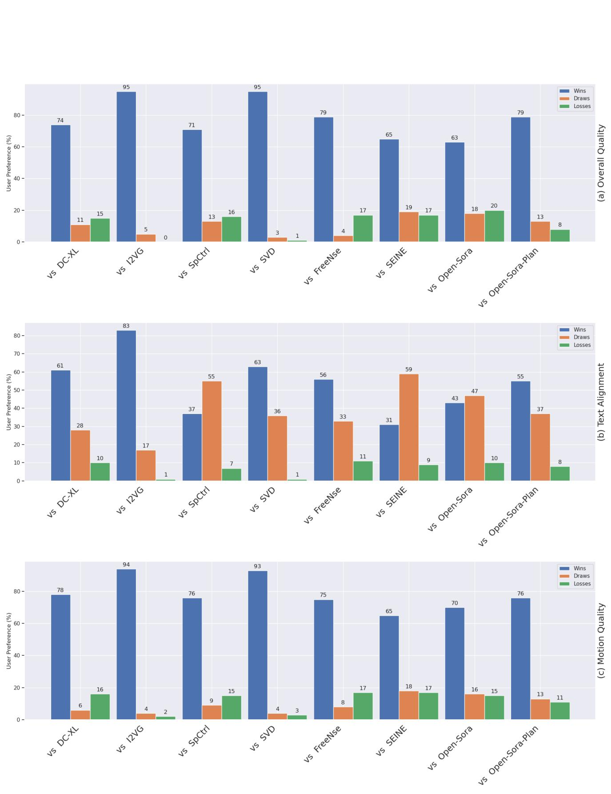  
methods as equal (i.e. draws).

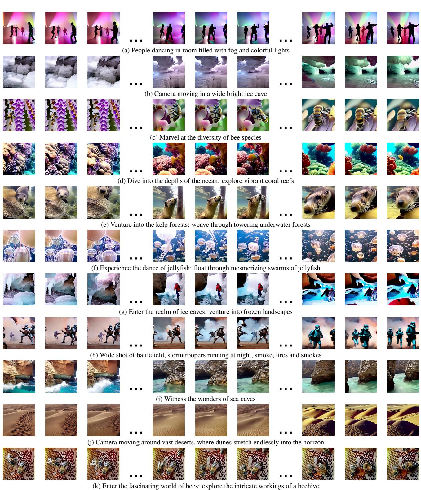  
Figure 7. Qualitative results of StreamingT2V for different prompts. Each video has 1200 frames.

quality degradation, leading eventually to frames that are weakly aligned to the textual instructions.

I2VGen-XL shows low motion amount, and eventually

We further analyse visually the chunk transitions using an X-T slice visualization in Fig. 12. We can observe that StreamingT2V leads to smooth transitions. In contrast, we observe that conditioning via CLIP or concatenation may lead to strong inconsistencies between chunks.

# 9. Ablation Studies

To assess the importance of our proposed components, we conduct several ablation studies on a randomly sampled set of 75 prompts from our validation set that we used during training.

Specifically, we compare CAM against established conditioning approaches in Sec. 9.1, analyse the impact of our long-term memory APM in Sec. 9.2, and ablate on our modifications for the video enhancer in Sec. 9.3.

# 9.1. Conditional Attention Module.

To analyse the importance of CAM, we compare CAM (w/o APM) with two baselines (baseline details in Sec. 9.1.1): (i) Connect the features of CAM with the skip-connection of the UNet via zero convolution, followed by addition. We zero-pad the condition frame and concatenate it with a frame-indicating mask to form the input for the modified CAM, which we denote as Add-Cond. (ii) We append the conditional frames and a frame-indicating mask to input of Video-LDM's Unet along the channel dimension, but do not use CAM, which we denote as Conc-Cond. We train our method with CAM and the baselines on the same dataset. Architectural details (including training) of these baselines are provided in the appendix.

We obtain an SCuts score of 0.24, 0.284 and 0.03 for Conc-Cond, Add-Cond and Ours (w/o APM), respectively. This shows that the inconsistencies in the input caused by the masking leads to frequent inconsistencies in the generated videos and that concatenation to the Unet's input is a too weak conditioning. In contrast, our CAM generates consistent videos with a SCuts score that is $8 8 \%$ lower than the baselines.

# 9.1.1. Ablation models

For the ablation of CAM, we considered two baselines that we compare with CAM. Here we provide additional implementation details of these baselines.

The ablated model Add-Cond applies to the features of CAM (i.e. the outputs of the encoder and middle layer of the ControlNet part in Fig 3 from main paper) zero-convolution, and uses addition to fuse it with the features of the skipconnection of the UNet (similar to ControlNet [45]) (see Fig. 16). We provide here additional details to construct this model. Given a video sample $\mathcal { V } \in \mathbb { R } ^ { F \times H \times W \times 3 }$ with $F =$ 16 frames, we construct a mask $M \ \in \ \{ 0 , 1 \} ^ { F \times H \times W \times 3 }$ that indicates which frame we use for conditioning, i.e. $M ^ { f } [ i , j , k ] = M ^ { f } [ i ^ { \prime } , j ^ { \prime } , k ^ { \prime } ] $ for all frames $f = 1 , \ldots , F$ and for all $i , j , k , i ^ { \prime } , j ^ { \prime } , k ^ { \prime }$ . We require that exactly $F { - } F _ { \mathrm { c o n d } }$

frames are masked, i.e.

$$
\sum _ { f = 1 } ^ { F } M ^ { f } [ i , j , k ] = F - F _ { \mathrm { c o n d } } , { \mathrm { f o r ~ a l l ~ } } i , j , k .
$$

We concatenate $[ \nu \odot M , M ]$ along the channel dimension and use it as input for the image encoder $\mathcal { E } _ { \mathrm { c o n d } }$ , where $\odot$ denotes element-wise multiplication.

During training, we randomly set the mask $M$ .During inference, we set the mask for the first 8 frames to zero, and for the last 8 frames to one, so that the model conditions on the last 8 frames of the previous chunk.

For the ablated model Conc-Cond, we start from our Video-LDM's UNet, and modify its first convolution. Like for Add-Cond, we consider a video $\nu$ of length $F = 1 6$ and a mask $M$ that encodes which frames are overwritten by zeros. Now the Unet takes $[ z _ { t } , \mathcal { E } ( \mathcal { V } ) \odot M , M ]$ as input, where we concatenate along the channel dimension. As with AddCond, we randomly set $M$ during training so that the information of 8 frames is used, while during inference, we set it such that the last 8 frames of the previous chunk are used. Here $\mathcal { E }$ denotes the VQ-GAN encoder (see Sec. 3).

# 9.2. Appearance Preservation Module

We analyse the impact of utilizing long-term memory in the context of long video generation. Fig. 14 shows that long-term memory greatly helps keeping the object and scene features across autoregressive generations. Thanks to the usage of long-term information via our proposed APM module, identity and scene features are preserved throughout the video. For instance, the face of the woman in Fig. 14 (including all its tiny details) are consistent1 across the video generation. Also, the style of the jacket and the bag are correctly generated throughout the video. Without having access to a long-term memory, these object and scene features are changing over time.

This is also supported quantitatively. We utilize a person re-identification score to measure feature preservation (definition in Sec. 9.2.1), and obtain scores of 93.42 and 94.95 for Ours w/o APM, and Ours, respectively. Our APM module thus improves the identity/appearance preservation. Also the scene information is better kept, as we observe an image distance score in terms of LPIPS [46] of 0.192 and 0.151 for Ours w/o APM and Ours, respectively. We thus have an improvement in terms of scene preservation of more than $20 \%$ when APM is used.

# 9.2.1. Measuring Feature Preservation.

We employ a person re-identification score as a proxy to measure feature preservation. To this end, let $P _ { n } = \{ p _ { i } ^ { n } \}$ be all face patches extracted from frame $n$ using an off-theshelf head detector [31] and let $F _ { i } ^ { n }$ be the corresponding facial feature of $p _ { i } ^ { n }$ , which we obtain from an off-the-shelf face recognition network [31]. Then, for frame $n$ , $n _ { 1 } : =$ $| P _ { n } | , n _ { 2 } : = | P _ { n + 1 } |$ , we define the re-id score re-id $( n )$ for frame $n$ as

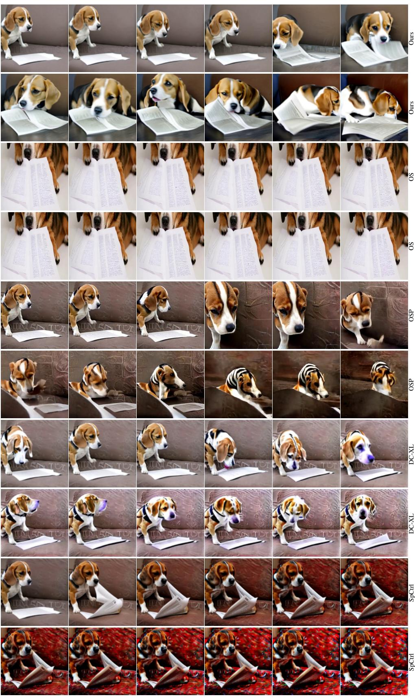  
the image sequence of its first row is continued by the image in the leftmost column of the following row.

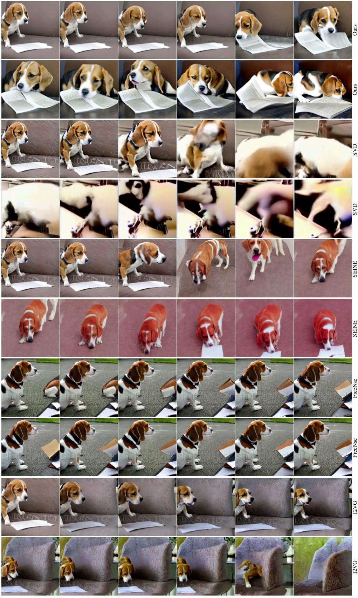  
the image sequence of its first row is continued by the image in the leftmost column o the following row.

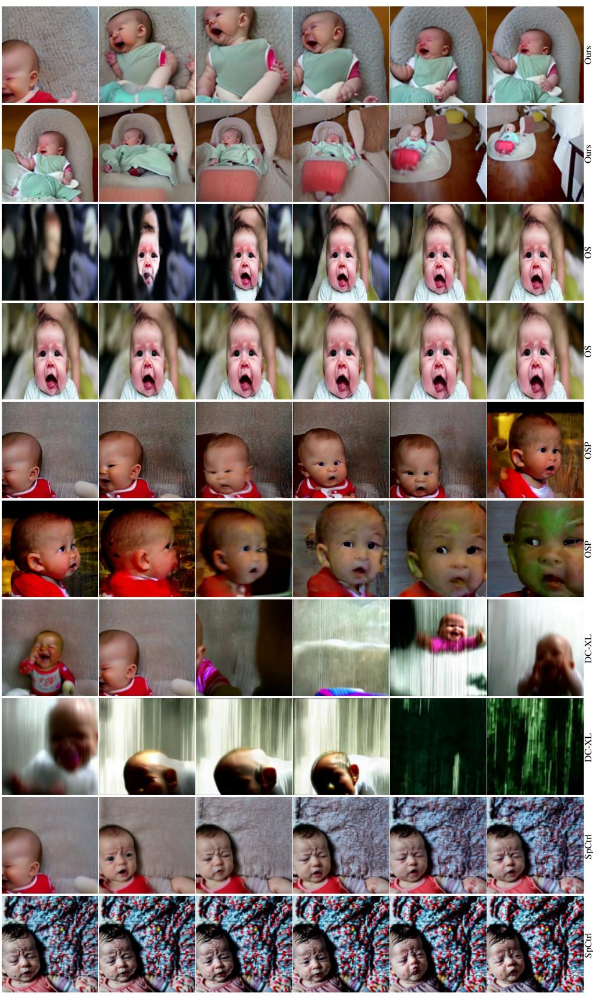

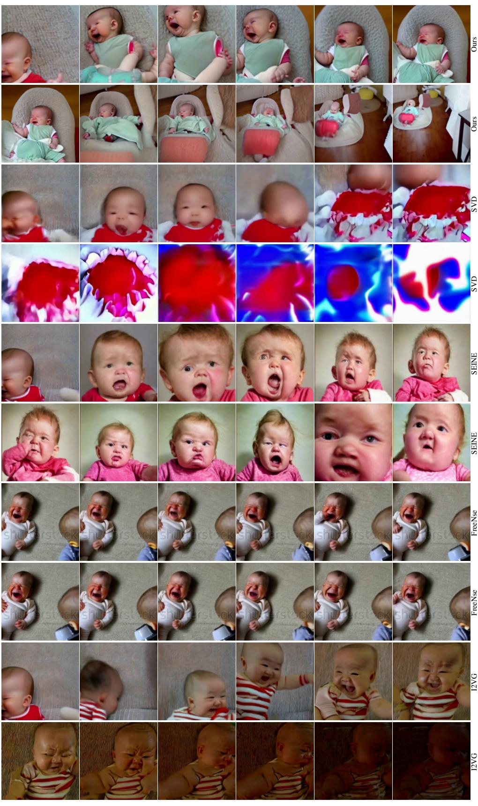

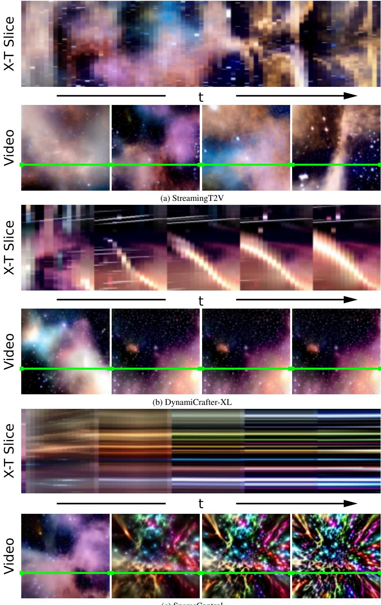  
Fu oC repetitive motions. In contrast, our method shows seamless transitions and evolving content.

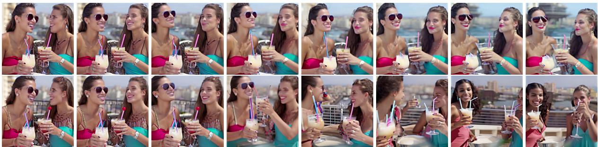

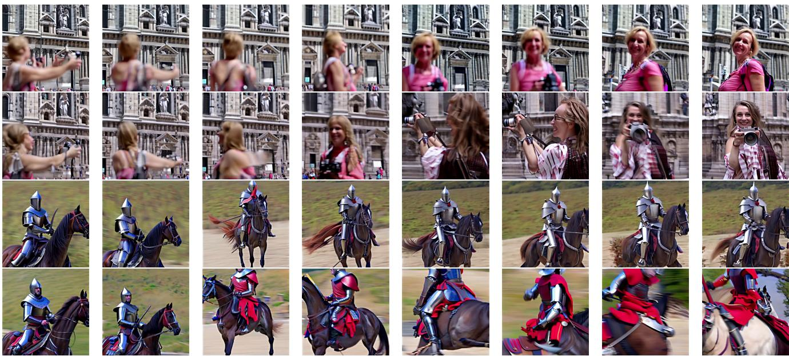  
w/o APM.

$$
\begin{array} { r } { \operatorname { r e - i d } ( n ) : = \left\{ \begin{array} { l l } { \operatorname* { m a x } _ { i , j } \cos \Theta ( F _ { i } ^ { n } , F _ { j } ^ { n + 1 } ) , } & { n _ { 1 } , n _ { 2 } > 0 } \\ { 0 } & { \mathrm { o t h e r w i s e } . } \end{array} \right. } \end{array}
$$

where $\cos \Theta$ is the cosine similarity. Finally, we obtain the re-ID score of a video by averaging over all frames, where the two consecutive frames have face detections, i.e. with $m : = | \{ n \in \{ 1 , . . , N \} : | P _ { n } | > 0 \} |$ , we compute the weighted sum:

$$
\mathrm { r e - i d } : = \frac { 1 } { m } \sum _ { n = 1 } ^ { N - 1 } \mathrm { r e - i d } ( n ) ,
$$

where $N$ denotes the number of frames.

# 9.3. Randomized Blending.

We assess our randomized blending approach by comparing against two baselines. (B) enhances each video chunk independently, and $\left( \mathrm { B } { + } \mathrm { S } \right)$ uses shared noise for consecutive chunks, with an overlap of 8 frames, but not randomized blending. We compute per sequence the standard deviation of the optical flow magnitudes between consecutive frames and average over all frames and sequences, which indicates temporal smoothness. We obtain the scores 8.72, 6.01 and 3.32 for B, $\mathbf { B } { + } \mathbf { S }$ , and StreamingT2V, respectively. Thus, noise sharing improves chunk consistency (by $3 1 \%$ vs B), but it is significantly further improved by randomized blending (by $6 2 \%$ vs B).

These findings are supported visually. Fig. 15 shows ablated results on our randomized blending approach. From the X-T slice visualizations we can see that the randomized blending leads to smooth chunk transitions, confirming our observations and quantitative evaluations. In contrast, when naively concatenating enhanced video chunks, or using shared noise, the resulting videos possess visible inconsistencies between chunks.

# 10. Implementation detail

We generate $F ~ = ~ 1 6$ frames, condition on $F _ { \mathrm { c o n d } } ~ =$ 8 frames, and display videos with 10 FPS. Training is conducted using an internal dataset. We sample with $3 \mathrm { F P S } @ 2 5 6 \mathrm { x } 2 5 6 \ 1 6$ frames (during CAM training) and 32 frames (during CAM+APM training).

CAM training: we freeze the weights of the pre-trained Video-LDM and train the new layers of CAM with batch size 8 and learning rate $5 \cdot 1 0 ^ { - 5 }$ for 400K steps.

$\mathbf { C A M + A P M }$ training: After the CAM training, we freeze the CLIP encoder and the temporal layers of the main branch, and train the remaining layers for 1K steps.

The image encoder $\mathcal { E } _ { \mathrm { c o n d } }$ used in CAM is composed of stacked 2D convolutions, layer norms and SiLU activations. For the video enhancer, we diffuse an input video using $T ^ { \prime } = 6 0 0$ steps.

In order to train the APM module, we randomly sample an anchor frame out of the first 16 frames. For the conditioning and denoising, we use the frames $1 7 - 2 4$ and $1 7 - 3 2$ , respectively. This aligns training with inference, where there is a large time gap between the conditional frames and the anchor frame. In addition, by randomly sampling an anchor frame, the model can leverage the CLIP information only for the extraction of high-level semantic information, as we do not provide a frame index to the model.

# 10.1. Streaming T2V Stage

For the StreamingT2V stage, we use classifier free guidance [9, 13] from text and the anchor frame. More precisely, let $\boldsymbol { \epsilon } _ { \theta } ( \boldsymbol { x } _ { t } , t , \tau , a )$ denote the noise prediction in the StreamingT2V stage for latent code $x _ { t }$ at diffusion step $t$ , text $\tau$ and anchor frame $a$ . For text guidance and guidance by the anchor frame, we introduce weights $\omega _ { \mathrm { t e x t } }$ and $\omega _ { \mathrm { a n c h o r } }$ , respectively. Let $\tau _ { \mathrm { n u l l } }$ and $a _ { \mathrm { n u l l } }$ denote the empty string, and the image with all pixel values set to zero, respectively. Then, we obtain the multi-conditioned classifier-free-guided noise prediction $\hat { \epsilon } _ { \theta }$ (similar to DynamiCrafter-XL [42]) from the noise predictor $\epsilon$ via

$$
\begin{array} { r l } & { \hat { \epsilon } _ { \boldsymbol { \theta } } ( x _ { t } , t , \tau , a ) = \epsilon _ { \boldsymbol { \theta } } ( x _ { t } , t , \tau _ { \mathrm { n u l l } } , a _ { \mathrm { n u l l } } ) } \\ & { ~ + \omega _ { \mathrm { t e x t } } \big ( \epsilon _ { \boldsymbol { \theta } } ( x _ { t } , t , \tau , a _ { \mathrm { n u l l } } ) } \\ & { ~ - \epsilon _ { \boldsymbol { \theta } } \big ( x _ { t } , t , \tau _ { \mathrm { n u l l } } , a _ { \mathrm { n u l l } } \big ) \big ) } \\ & { ~ + \omega _ { \mathrm { a n c h o r } } \big ( \epsilon _ { \boldsymbol { \theta } } ( x _ { t } , t , \tau , a ) } \\ & { ~ - \epsilon _ { \boldsymbol { \theta } } \big ( x _ { t } , t , \tau , a _ { \mathrm { n u l l } } \big ) \big ) . } \end{array}
$$

We then use $\hat { \epsilon } _ { \theta }$ for denoising. In our experiments, we set $\omega _ { \mathrm { t e x t } } = \omega _ { \mathrm { a n c h o r } } = 7 . 5$ During training, we randomly replace $\tau$ with $\tau _ { \mathrm { n u l l } }$ with $5 \%$ likelihood, the anchor frame $a$ with $a _ { \mathrm { n u l l } }$ with $5 \%$ likelihood, and we replace at the same time $\tau$ with $\tau _ { \mathrm { n u l l } }$ and $a$ with $a _ { \mathrm { n u l l } }$ with $5 \%$ likelihood.

Additional hyperparameters for the architecture, training and inference of the Streaming T2V stage are presented in Tab. 12, where Per-Pixel Temporal Attention refers to the attention module used in CAM (see Fig. 3)

# 11. Test set prompts

1. A camel resting on the snow field. 2. Camera following a pack of crows flying in the sky. 3.A knight riding on a horse through the countryside. 4. A gorilla eats a banana in Central Park. 5.Men walking in the rain. 6. Ants, beetles and centipede nest. 7.A squirrel on a table full of big nuts. 8.Close flyover over a large wheat field in the early morning sunlight. 9. A squirrel watches with sweet eyes into the camera. 10. Santa Claus is dancing. 11. Chemical reaction. 12. Camera moving in a wide bright ice cave, cyan. 13. Prague, Czech Republic. Heavy rain on the street. 14. Time-lapse of stormclouds during thunderstorm. 15. People dancing in room filled with fog and colorful lights. 16. Big celebration with fireworks. 17. Aerial view of a large city. 18. Wide shot of battlefield, stormtroopers running at night, fires and smokes and explosions in background. 19. Explosion. 20.Drone flythrough of a tropical jungle with many birds. 21. A camel running on the snow field. 22. Fishes swimming in ocean camera moving.

  
smooth chunk transitions, while both baselines have clearly visible, severe inconsistencies between chunks.

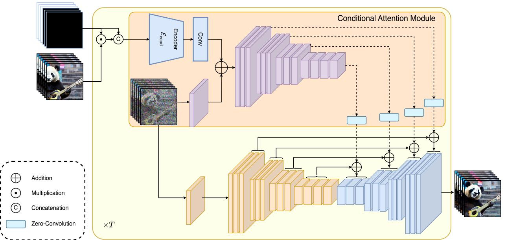  
Figure 16. Illustration of the Add-Cond baseline, which is used in Sec. 9.1.

23. A squirrel in Antarctica, on a pile of hazelnuts cinematic.   
24. Fluids mixing and changing colors, closeup.   
25. A horse eating grass on a lawn.   
26. The fire in the car is extinguished by heavy rain.   
27. Camera is zooming out and the baby starts to cry.   
28. Flying through nebulas and stars.   
29. A kitten resting on a ball of wool.   
30. A musk ox grazing on beautiful wildflowers.   
31. A hummingbird flutters among colorful flowers, its   
wings beating rapidly.   
32. A knight riding a horse, pointing with his lance to the   
sky.   
33. steampunk robot looking at the camera.   
34. Drone fly to a mansion in a tropical forest.   
35. Top-down footage of a dirt road in forest.   
36. Camera moving closely over beautiful roses blooming   
time-lapse.   
37. A tiger eating raw meat on the street.   
38. A beagle looking in the Louvre at a painting.   
39. A beagle reading a paper.   
40. A panda playing guitar on Times Square.   
41. A young girl making selfies with her phone in a crowded   
street.   
42. Aerial: flying above a breathtaking limestone structure

Table 12. Hyperparameters of Streaming T2V Stage. Additional architectural hyperparameters are provided by the Modelsope report [39].   

<table><tr><td>Per-Pixel Temporal Attention Sequence length Q Sequence length K,V Token dimensions Appearance Preservation Module</td><td>16 8 320, 640, 1280</td></tr><tr><td>CLIP Image Embedding Dim</td><td>1024</td></tr><tr><td>CLIP Image Embedding Tokens</td><td>1 1</td></tr><tr><td>MLP hidden layers</td><td></td></tr><tr><td>MLP inner dim</td><td>1280</td></tr><tr><td>MLP output tokens</td><td>16</td></tr><tr><td>MLP output dim</td><td>1024</td></tr><tr><td>1D Conv input tokens</td><td>93</td></tr><tr><td>1D Conv output tokens</td><td>77</td></tr><tr><td>1D Conv output dim</td><td>1024 77</td></tr><tr><td>Cross attention sequence length Training</td><td></td></tr><tr><td>Parametrization</td><td>e</td></tr><tr><td>Diffusion Setup</td><td></td></tr><tr><td>Diffusion steps</td><td>1000</td></tr><tr><td>Noise scheduler</td><td>Linear</td></tr><tr><td>β0</td><td>0.0085</td></tr><tr><td>βT</td><td>0.0120</td></tr><tr><td>Sampling Parameters</td><td></td></tr><tr><td>Sampler</td><td>DDIM</td></tr><tr><td>Steps</td><td>50</td></tr><tr><td>η</td><td>1.0</td></tr><tr><td></td><td>7.5</td></tr><tr><td>Wtext</td><td></td></tr><tr><td>ωanchor</td><td>7.5</td></tr></table>

on a serene and exotic island.

43. Aerial: Hovering above a picturesque mountain range on a peaceful and idyllic island getaway.   
44. A time-lapse sequence illustrating the stages of growth in a flourishing field of corn.   
45. Documenting the growth cycle of vibrant lavender flowers in a mesmerizing time-lapse.   
46. Around the lively streets of Corso Como, a fearless urban rabbit hopped playfully, seemingly unfazed by the fashionable surroundings.   
47. Beside the Duomo's majestic spires, a fearless falcon soared, riding the currents of air above the iconic cathedral.   
48. A graceful heron stood poised near the reflecting pools of the Duomo, adding a touch of tranquility to the vibrant surroundings.   
49. A woman with a camera in hand joyfully skipped along the perimeter of the Duomo, capturing the essence of the moment.   
50. Beside the ancient amphitheater of Taormina, a group of

For MAWE, we measure the motion amount using OFS (optical flow score), which computes for a video the mean of the squared magnitudes of all optical flow vectors between any two consecutive frames. Furthermore, for a video $\nu$ we consider the mean warp error [19] $W ( \nu )$ , which measures the average squared L2 pixel distance from a frame to its warped subsequent frame, excluding occluded regions. Finally, MAWE is defined as:

# 12. MAWE Definition

friends enjoyed a leisurely picnic, taking in the breathtaking views.

$$
\mathrm { M A W E } ( \mathcal { V } ) : = \frac { W ( \mathcal { V } ) } { \mathrm { O F S } ( \mathcal { V } ) } ,
$$

which we found to be well-aligned with human perception. For MAWE, we measure the motion amount using OFS (optical flow score), which computes for a video the mean of the squared magnitudes of all optical flow vectors between any two consecutive frames. Furthermore, for a video $\nu$ , we consider the mean warp error [19] $W ( \nu )$ , which measures the average squared L2 pixel distance from a frame to its warped subsequent frame, excluding occluded regions. Finally, MAWE is defined as:

$$
\mathrm { M A W E } ( \mathcal { V } ) : = \frac { W ( \mathcal { V } ) } { \mathrm { O F S } ( \mathcal { V } ) } ,
$$

which we found to be well-aligned with human perception.