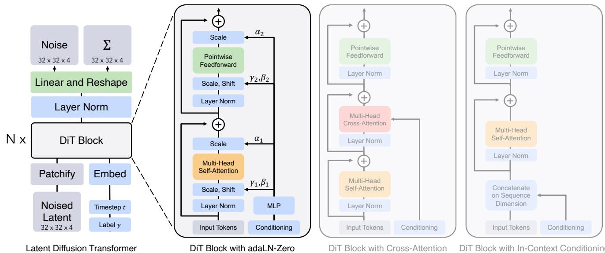
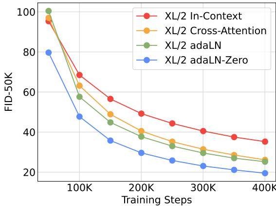
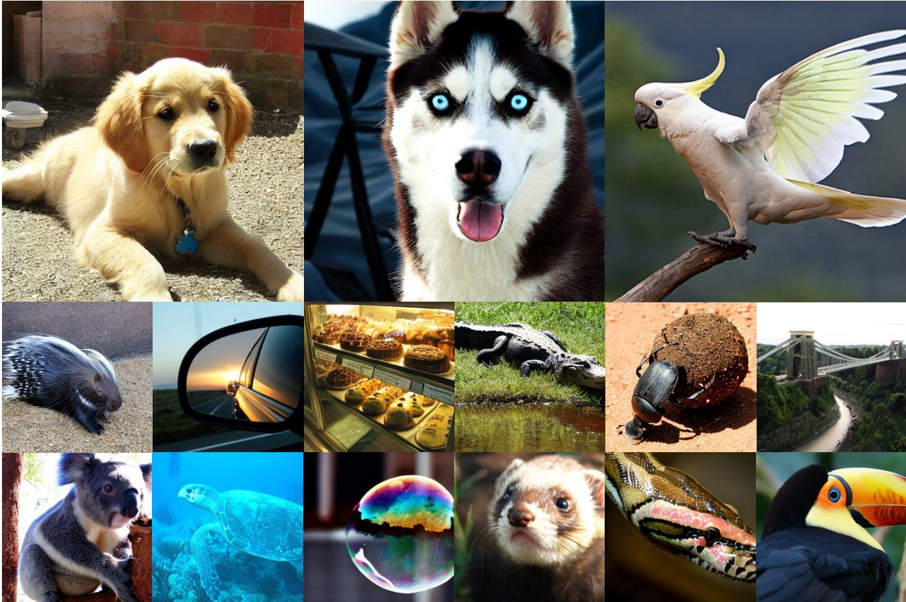
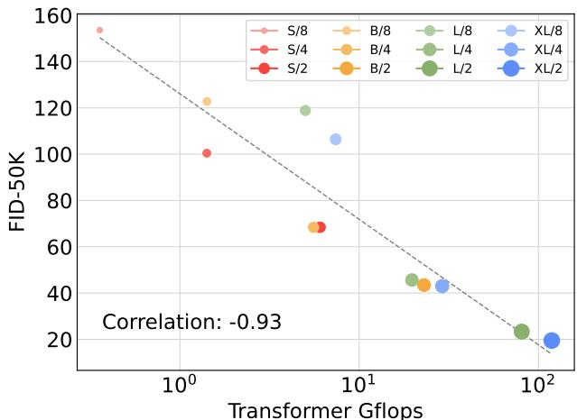
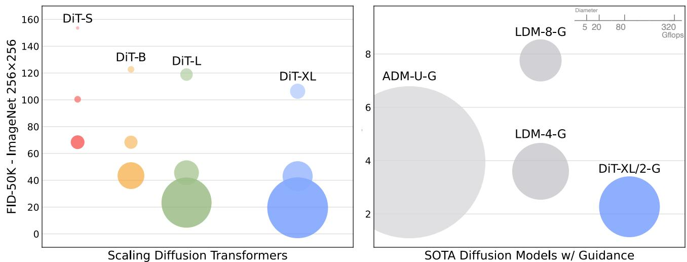

# 1. 论文基本信息

## 1.1. 标题
**Scalable Diffusion Models with Transformers** (基于 Transformer 的可扩展扩散模型)

## 1.2. 作者
**William Peebles** (UC Berkeley), **Saining Xie** (New York University)

## 1.3. 发表期刊/会议
该论文发表于计算机视觉领域的顶级会议 **ICCV (International Conference on Computer Vision)**，并在当时引发了广泛关注。文中所述工作是后续如 Sora、Stable Diffusion 3 等先进视频/图像生成模型的核心架构基础。

## 1.4. 发表年份
2023 年 (预印本发布于 2022 年 12 月)

## 1.5. 摘要
本文提出了一种基于 Transformer 架构的新型扩散模型类别——**Diffusion Transformers (DiTs)**。作者不再使用传统的 U-Net 作为图像潜在扩散模型 (Latent Diffusion Models) 的主干网络，而是将其替换为处理潜在块 (latent patches) 的 Transformer。研究通过前向传递的复杂度 (Gflops) 分析了 DiT 的可扩展性，发现增加 Transformer 的深度/宽度或增加输入词元 (token) 的数量（即更高的 Gflops）能持续降低 FID 值（提升图像质量）。其中，最大的 DiT-XL/2 模型在 ImageNet 512x512 和 256x256 基准测试中优于所有先前的扩散模型，实现了 2.27 的最先进 (SOTA) FID。

## 1.6. 原文链接
*   **ArXiv:** https://arxiv.org/abs/2212.09748
*   **PDF:** https://arxiv.org/pdf/2212.09748v2.pdf
*   **状态:** 已发表

    ---

# 2. 整体概括

## 2.1. 研究背景与动机
*   **核心问题:** 在图像生成领域，尽管 Transformer 架构已经在自然语言处理 (NLP) 和其他视觉任务中占据主导地位，但扩散模型 (Diffusion Models) 的主干网络 (Backbone) 仍然主要依赖于卷积神经网络，特别是 **U-Net** 架构。
*   **现有挑战:** U-Net 虽然效果显著，但其设计包含大量特定于卷积的归纳偏置 (Inductive Bias)，且架构设计空间复杂（如下采样、上采样、跳跃连接等），这使得研究架构本身的可扩展性变得困难。
*   **创新思路:** 作者试图解构扩散模型的架构选择，探究卷积 U-Net 的归纳偏置是否是必须的。论文提出将扩散模型与 Transformer 的可扩展性相结合，旨在证明标准的 Transformer 架构可以直接用于扩散模型，并表现出良好的 Scaling Laws (缩放定律)。

## 2.2. 核心贡献/主要发现
1.  <strong>架构创新 (DiT):</strong> 提出了 **Diffusion Transformer (DiT)**，一种基于标准 Vision Transformer (ViT) 的扩散模型架构，成功替换了传统的 U-Net 主干。
2.  **缩放定律验证:** 发现 DiT 模型遵循缩放定律，即图像生成的质量（由 FID 衡量）与模型的计算复杂度（Gflops）呈现强烈的负相关关系。简单地增加模型大小或减小 Patch Size (增加 Token 数量) 就能提升性能。
3.  **SOTA 性能:** 在 ImageNet 类条件生成任务上，DiT-XL/2 模型击败了包括 ADM、LDM 在内的所有先前模型，刷新了 FID 记录。

    ---

# 3. 预备知识与相关工作

## 3.1. 基础概念
为了理解本文，需要掌握以下三个核心概念：

1.  <strong>扩散模型 (Diffusion Models / DDPM):</strong>
    这是一个生成模型框架。它包含两个过程：
    *   **前向过程:** 逐步向真实图像添加高斯噪声，直到图像变成纯噪声。
    *   **反向过程:** 训练一个神经网络预测噪声，从而一步步去除噪声，从纯噪声中还原出图像。
    *   **核心公式:** 扩散模型通常训练一个网络 $\epsilon_\theta$ 来预测添加的噪声 $\epsilon$。损失函数通常是预测噪声与真实噪声之间的均方误差：
        $$
        \mathcal{L}_{simple} = || \epsilon_\theta(x_t, t) - \epsilon ||^2_2
        $$
        其中 $x_t$ 是时刻 $t$ 的含噪图像。

2.  <strong>潜在扩散模型 (Latent Diffusion Models, LDM):</strong>
    直接在像素空间进行扩散计算量巨大。LDM 先利用一个预训练的 <strong>VAE (变分自编码器)</strong> 将图像压缩到一个低维的“潜在空间 (Latent Space)”，在这个空间进行扩散训练，最后再解码回图像。这大大降低了计算成本。本文的 DiT 就是在 LDM 的框架下工作的。

3.  <strong>Vision Transformer (ViT) 与 Patchify:</strong>
    Transformer 最初用于处理文本序列。ViT 将图像切割成一个个小方块 (Patches)，将每个方块展平并线性映射为一个向量，视作一个“词元 (Token)”，从而使图像可以像文本一样被 Transformer 处理。

## 3.2. 前人工作与差异
*   **U-Net 主导时代:** 自 Ho et al. (DDPM) 和 Dhariwal & Nichol (ADM) 以来，U-Net 一直是扩散模型的标配。U-Net 包含下采样、上采样和长跳跃连接，设计复杂。
*   **Transformer 的尝试:** 之前有一些工作尝试在生成模型中使用 Transformer (如 VQGAN, DALL-E 1)，但大多是自回归模型或离散编码。
*   **本文差异:** DiT 并不改变扩散模型的训练目标或采样算法，仅仅是**替换了去噪网络的主干架构**。它证明了去掉了 U-Net 的复杂设计（如下采样/上采样），仅用标准的 Transformer 堆叠也能取得更好的效果。

    ---

# 4. 方法论

## 4.1. 方法原理
DiT 的核心设计哲学是**极简主义**和**忠实于 ViT**。它不引入针对扩散任务的特殊复杂模块，而是尽可能保留标准 Transformer 的特性，以便利用其强大的可扩展性。

下图（原文 Figure 3）展示了 DiT 的完整架构。它接收潜在变量 (Latent) 作为输入，经过分块 (Patchify)、一系列 DiT 块的处理，最后解码回噪声预测。

*该图像是展示Diffusion Transformers (DiTs) 结构的示意图，包括基本的Latent Diffusion Transformer和不同类型的DiT Block，如带有adaLN-Zero、Cross-Attention和In-Context Conditioning的模块。图中详细描述了各个部分的功能和数据流动。*

## 4.2. 核心方法详解 (逐层深入)

### 4.2.1. 输入处理：Patchify (分块化)
DiT 在潜在空间 (Latent Space) 运行。假设 VAE 编码后的潜在表示为 $z$，其形状为 $I \times I \times C$（例如 $32 \times 32 \times 4$）。

1.  **分块:** 将空间输入 $z$ 切分为大小为 $p \times p$ 的块。
2.  **序列化:** 将这些块展平为序列。生成的词元 (Token) 数量 $T$ 计算如下：
    $T = (I / p)^2$
    *符号解释:* $I$ 是输入特征图的空间分辨率，$p$ 是 Patch 大小。
    *分析:* $p$ 越小，$T$ 越大，计算量 (Gflops) 增加，但模型能捕捉更细微的细节。作者在设计空间中探索了 $p=2, 4, 8$。
3.  **位置编码:** 既然图像变成了序列，就需要加入位置信息。DiT 使用标准的正弦余弦位置嵌入 (sine-cosine positional embeddings) 并加到所有 Token 上。

    下图（原文 Figure 4）直观地展示了 Patchify 的过程及其对序列长度的影响：

    
    *该图像是DiT Block的示意图。图中展示了输入令牌的维度 `T imes d` 和噪声潜在表示的形状 `1 imes I imes C`，以及分块后生成的序列长度 $T = (I/p)^{2}$，其中较小的块大小 $p$ 会导致更长的序列长度，进而增加Gflops。*

### 4.2.2. DiT Block 架构 (条件注入机制)
这是论文最关键的创新点之一。扩散模型是条件生成的（依赖时间步 $t$ 和类别标签 $c$）。如何将这些条件信息注入到 Transformer 中？作者对比了多种方案，最终提出了 **adaLN-Zero** 模块。

**DiT Block 的标准流程:**
输入 Token 序列 $x$ 进入 Block，依次经过：
1.  层归一化 (Layer Norm)
2.  自注意力机制 (Self-Attention)
3.  层归一化 (Layer Norm)
4.  多层感知机 (MLP / Pointwise Feedforward)

<strong>关键创新：adaLN-Zero (Adaptive Layer Norm with Zero Initialization)</strong>
作者没有使用标准的 Layer Norm，而是使用<strong>自适应层归一化 (adaLN)</strong>。

*   **原理:** 根据条件信息（时间步 $t$ 和 类别 $c$）动态生成 Layer Norm 的参数。
*   **计算步骤:**
    1.  将 $t$ 和 $c$ 的嵌入向量相加，输入到一个多层感知机 (MLP)。
    2.  该 MLP 输出 6 个缩放和平移参数：$\gamma_1, \beta_1, \alpha_1, \gamma_2, \beta_2, \alpha_2$。
    3.  **应用公式:**
        在 Self-Attention 之前：
        $$
        x = \mathrm{Attention}(\mathrm{scale}(x, \gamma_1, \beta_1)) + x
        $$
        实际上，DiT 引入了更精细的门控机制。对于残差连接前的操作，公式如下：
        $$
        \mathrm{Block}(x, c) = x + \alpha_1 \cdot \mathrm{Attention}(\mathrm{adaLN}(x, \gamma_1, \beta_1)) + \alpha_2 \cdot \mathrm{MLP}(\mathrm{adaLN}(x', \gamma_2, \beta_2))
        $$
        其中 $\mathrm{adaLN}(h, \gamma, \beta) = \gamma \cdot \mathrm{Norm}(h) + \beta$。
    4.  <strong>Zero Initialization (零初始化):</strong>
        这是 **adaLN-Zero** 的精髓。作者将回归 $\gamma, \beta, \alpha$ 的 MLP 的最后一层初始化为 0。
        *   这意味着在训练初始阶段，$\alpha_1 = \alpha_2 = 0$。
        *   因此，整个 DiT Block 在初始时表现为<strong>恒等映射 (Identity Function)</strong>（即输出等于输入）。这极大地稳定了训练过程，使得模型可以像 ResNet 一样训练极深的网络。

            下图（原文 Figure 5）对比了不同的调节机制，结果显示 **adaLN-Zero** (红色曲线) 收敛最快且 FID 最低：

            
            *该图像是一个示意图，比较了不同条件策略在训练过程中对FID-50K的影响。图中展示了XL/2在不同训练步骤下的表现，其中adaLN-Zero在所有训练阶段均优于其他策略，表明其在模型训练中的优势。*

### 4.2.3. Transformer Decoder
经过 $N$ 个 DiT Block 处理后，输出的序列需要变回原来的空间形状。
1.  使用一个标准的线性解码器 (Linear Decoder) 将每个 Token 映射回 $p \times p \times C$ 的形状。
2.  将序列重新排列 (Rearrange) 为 $I \times I \times C$ 的空间布局。
3.  输出预测的噪声和协方差。

### 4.2.4. 模型配置 (Model Configurations)
作者参照 ViT 的配置，设计了四种不同规模的模型：**DiT-S, DiT-B, DiT-L, DiT-XL**。这涵盖了从 0.3 到 118.6 Gflops 的计算范围。

---

# 5. 实验设置

## 5.1. 数据集
*   **ImageNet:** 使用 ImageNet 数据集进行类条件图像生成 (Class-conditional Image Generation)。
*   **分辨率:** 主要在 $256 \times 256$ 和 $512 \times 512$ 两个分辨率下进行测试。
*   **潜在空间:** 使用 Stable Diffusion 开源的预训练 VAE (KL-f8)。即 $256 \times 256$ 的图像被压缩为 $32 \times 32 \times 4$ 的潜在特征。

    下图（原文 Figure 1）展示了 DiT-XL/2 在 ImageNet 上生成的样本，涵盖了多种类别：

    
    *该图像是多个动物和自然场景的拼贴，包括金毛犬、乌鸦、考拉、海龟等，展示了自然界的多样性和美丽。*

## 5.2. 评估指标
论文主要使用 **FID** 作为核心指标。

1.  **FID (Fréchet Inception Distance):**
    *   **概念定义:** FID 用于衡量生成图像分布与真实图像分布之间的距离。它计算两个分布在 Inception v3 网络特征空间中的统计差异。FID 越低，表示生成图像越接近真实图像，质量越高且多样性越好。
    *   **数学公式:**
        $$
        \mathrm{FID} = || \mu_r - \mu_g ||^2 + \mathrm{Tr}(\Sigma_r + \Sigma_g - 2(\Sigma_r \Sigma_g)^{1/2})
        $$
    *   **符号解释:**
        *   $\mu_r, \Sigma_r$: 真实图像 (Real) 特征的均值向量和协方差矩阵。
        *   $\mu_g, \Sigma_g$: 生成图像 (Generated) 特征的均值向量和协方差矩阵。
        *   $\mathrm{Tr}$: 矩阵的迹 (Trace)。

2.  **Gflops (Giga Floating-point Operations per Second):**
    *   **概念定义:** 每秒十亿次浮点运算数。在本文中，它用于衡量模型前向传播的理论计算复杂度。作者用它来量化模型的“规模 (Scale)”。

3.  **Inception Score (IS), sFID, Precision/Recall:** 辅助指标，用于补充评估生成质量和多样性。

## 5.3. 对比基线
*   **ADM (Ablated Diffusion Model):** OpenAI 提出的基于 U-Net 的强基线，曾是该领域的 SOTA。
*   **LDM (Latent Diffusion Models):** Stable Diffusion 的基础，基于 U-Net 的潜在扩散模型。
*   **StyleGAN-XL:** GAN 家族的最强代表之一。

    ---

# 6. 实验结果与分析

## 6.1. 核心结果分析：缩放定律 (Scaling Laws)
实验结果有力地证明了 DiT 的可扩展性。
*   **模型深度/宽度:** 增加层数 (N) 或隐藏层维度 (d)（即从 DiT-S 到 DiT-XL），FID 显著降低。
*   **Patch Size:** 减小 Patch Size (例如从 8 减小到 2)，会增加 Token 数量，进而增加 Gflops，这同样显著降低了 FID。

    下图（原文 Figure 8）展示了 Gflops 与 FID 之间的强相关性。可以看出，无论通过何种方式（增加模型大小或增加 Token 数）增加 Gflops，FID 都会沿着一条平滑的曲线下降。

    
    *该图像是一个图表，展示了Transformer模型的Gflops与FID-50K之间的强相关性。图中的点表示不同DiT模型的Gflops与对应的FID值，相关性为-0.93，表明Gflops增大时FID值显著降低。*

## 6.2. SOTA 性能对比
DiT-XL/2 在 256x256 分辨率下取得了惊人的效果。

以下是原文 **Table 2** 的完整结果，展示了 DiT 与其他 SOTA 模型的对比：

<table>
<thead>
<tr>
<th colspan="6">Class-Conditional ImageNet 256×256</th>
</tr>
<tr>
<th>Model</th>
<th>FID↓</th>
<th>sFID↓</th>
<th>IS↑</th>
<th>Precision↑</th>
<th>Recall↑</th>
</tr>
</thead>
<tbody>
<tr>
<td>BigGAN-deep</td>
<td>6.95</td>
<td>7.36</td>
<td>171.4</td>
<td>0.87</td>
<td>0.28</td>
</tr>
<tr>
<td>StyleGAN-XL</td>
<td>2.30</td>
<td>4.02</td>
<td>265.12</td>
<td>0.78</td>
<td>0.53</td>
</tr>
<tr>
<td>ADM</td>
<td>10.94</td>
<td>6.02</td>
<td>100.98</td>
<td>0.69</td>
<td>0.63</td>
</tr>
<tr>
<td>ADM-U</td>
<td>7.49</td>
<td>5.13</td>
<td>127.49</td>
<td>0.72</td>
<td>0.63</td>
</tr>
<tr>
<td>ADM-G</td>
<td>4.59</td>
<td>5.25</td>
<td>186.70</td>
<td>0.82</td>
<td>0.52</td>
</tr>
<tr>
<td>ADM-G, ADM-U</td>
<td>3.94</td>
<td>6.14</td>
<td>215.84</td>
<td>0.83</td>
<td>0.53</td>
</tr>
<tr>
<td>CDM</td>
<td>4.88</td>
<td>-</td>
<td>158.71</td>
<td>-</td>
<td>-</td>
</tr>
<tr>
<td>LDM-8</td>
<td>15.51</td>
<td>-</td>
<td>79.03</td>
<td>0.65</td>
<td>0.63</td>
</tr>
<tr>
<td>LDM-8-G</td>
<td>7.76</td>
<td>-</td>
<td>209.52</td>
<td>0.84</td>
<td>0.35</td>
</tr>
<tr>
<td>LDM-4</td>
<td>10.56</td>
<td>-</td>
<td>103.49</td>
<td>0.71</td>
<td>0.62</td>
</tr>
<tr>
<td>LDM-4-G (cfg=1.25)</td>
<td>3.95</td>
<td>-</td>
<td>178.22</td>
<td>0.81</td>
<td>0.55</td>
</tr>
<tr>
<td>LDM-4-G (cfg=1.50)</td>
<td>3.60</td>
<td>-</td>
<td>247.67</td>
<td>0.87</td>
<td>0.48</td>
</tr>
<tr>
<td>DiT-XL/2</td>
<td>9.62</td>
<td>6.85</td>
<td>121.50</td>
<td>0.67</td>
<td>0.67</td>
</tr>
<tr>
<td>DiT-XL/2-G (cfg=1.25)</td>
<td>3.22</td>
<td>5.28</td>
<td>201.77</td>
<td>0.76</td>
<td>0.62</td>
</tr>
<tr>
<td><strong>DiT-XL/2-G (cfg=1.50)</strong></td>
<td><strong>2.27</strong></td>
<td><strong>4.60</strong></td>
<td><strong>278.24</strong></td>
<td><strong>0.83</strong></td>
<td><strong>0.57</strong></td>
</tr>
</tbody>
</table>

**结果分析:**
*   DiT-XL/2 (cfg=1.50) 达到了 **2.27** 的 FID，优于之前的 SOTA LDM-4-G (3.60) 和 StyleGAN-XL (2.30)。
*   这证明了 Transformer 架构在生成任务上的上限极高。

    下图（原文 Figure 2 右侧）形象地展示了 DiT-XL/2 在计算效率和性能上的优势。相比于基于 U-Net 的 ADM 和 LDM，DiT 位于左下角（计算量更低或相当，但 FID 更低）。

    
    *该图像是一个图表，展示了不同扩散变换器（DiTs）模型在ImageNet 256x256上的FID成绩。左侧的散点图显示了DiT-S、DiT-B、DiT-L和DiT-XL模型的性能，右侧的图表则比较了状态-of-the-art（SOTA）扩散模型及其引导性能，展示了DiT-XL/2-G模型的优越性。*

## 6.3. 模型计算量 vs. 采样计算量
作者提出了一个深刻的问题：<strong>如果小模型在采样时多跑几步（增加采样计算量），能否赶上大模型的效果？</strong>

下图（原文 Figure 10）展示了这一分析：
*   即使让小模型采样更多步数（增加了推理时的 Gflops），其 FID 依然无法达到大模型仅用少量步数的效果。
*   **结论:** 模型本身的容量 (Model Compute) 是决定生成质量的关键，推理时的计算量增加无法弥补模型容量的不足。

    ![Figure 10. Scaling-up sampling compute does not compensate for a lack of model compute. For each of our DiT models trained for 400K iterations, we compute FID-10K using \[16, 32, 64, 128, 256, 1000\] sampling steps. For each number of steps, we plot the FID as well as the Gflops used to sample each image. Small models cannot close the performance gap with our large models, even if they sample with more test-time Gflops than the large models.](images/10.jpg)
    *该图像是一个图表，展示了不同采样计算（Gflops）与FID-10K的关系。数据点表明，尽管小模型在测试时的Gflops可能更高，但它们无法弥补与大模型之间的性能差距。*

---

# 7. 总结与思考

## 7.1. 结论总结
这篇论文是扩散模型发展史上的一个里程碑。它成功地将 **Transformer** 引入到扩散模型的主干网络中，提出了 **DiT** 架构。
1.  **去魅 U-Net:** 证明了复杂的 U-Net 并非扩散模型的必要条件。
2.  **扩展性验证:** 展示了 DiT 具有极佳的可扩展性 (Scaling Properties)，模型越大、Token 越多，效果越好。
3.  **技术贡献:** 提出了 **adaLN-Zero** 模块，这成为后续许多基于 Transformer 的扩散模型的标准配置。

## 7.2. 局限性与未来工作
*   **计算成本:** 虽然 DiT 效果好，但要达到 SOTA 需要训练非常大的模型 (XL)，且 Patch Size 为 2 时计算开销巨大。如何进一步优化 Transformer 在高分辨率下的计算效率（例如使用线性注意力机制）是未来的方向。
*   **训练数据:** 本文主要在 ImageNet 上训练。未来工作可以探索在更大的数据集（如 LAION）上的表现，以及在文本生成图像 (Text-to-Image) 任务中的应用。

## 7.3. 个人启发与批判
*   **架构融合的趋势:** 这篇论文再次印证了深度学习领域的“大一统”趋势。Transformer 正在逐渐吞噬 CV 和 NLP 的边界。对于研究者来说，这意味着掌握 Transformer 的调优和改进（如 RoPE, SwiGLU 等在 LLM 中的技术）可能直接迁移到视觉生成领域。
*   **简单即是美:** DiT 的设计非常简洁，去掉了 U-Net 中许多凭经验设计的模块。这种简洁性使得模型的缩放行为更容易预测，这对于大规模工程化落地（如 OpenAI 的 Sora）至关重要。Sora 的技术报告中也明确提到了它是一种 Diffusion Transformer，可见 DiT 的深远影响。
*   **潜在问题:** 尽管 Patchify 降低了维度，但对于极高分辨率视频或图像，序列长度 $T$ 仍会呈平方级增长。这可能限制了 DiT 在无需级联模型情况下的超高分辨率生成能力。