# 直接对齐完整扩散轨迹与细粒度人类偏好

Xiangwei Shen1,2,*，Zhimin $_{ \mathrm { L i ^ { 1 , * } } }$，Z hantao Yang1，Shiyi Zhang3，Yingfang Zhang1，Donghao $\mathrm { L i ^ { 1 } }$，Chunyu Wang1，Qinglin $\mathrm { L u ^ { 1 } }$，Yansong Tang3,§ 1汇源，腾讯 2香港中文大学（深圳）科学与工程学院 3清华大学深圳国际研究生院

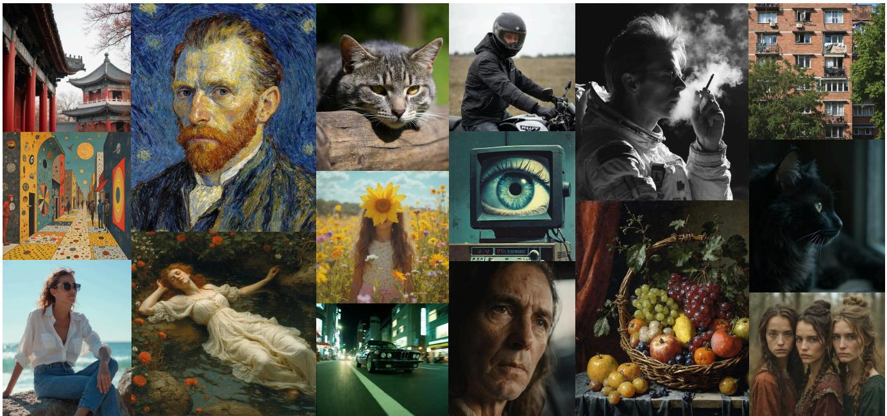  
FXea remarkable training efficiency-converging in just 10 minutes using 32 NVIDIA H20 GPUs.

# 摘要

最近的研究证明了使用可微分奖励直接将扩散模型与人类偏好对齐的有效性。然而，它们面临两个主要挑战：(1) 依赖于多步骤去噪和梯度计算进行奖励评分，这在计算上非常昂贵，因此优化只能限制在少数几个扩散步骤内；(2) 通常需要持续的离线适应奖励模型，以实现所需的美学质量，例如照片现实主义或精确的光照效果。为了解决多步骤去噪的限制，我们提出了Direct-Align，这是一种预定义噪声的方法，通过插值有效恢复任意时间步的原始图像，利用扩散状态是噪声与目标图像之间的插值的方程，有效避免了在后期时间步中的过度优化。此外，我们引入了语义相对偏好优化（SRPO），在该方法中，奖励被构建为文本条件信号。这种方法使得能够根据正负提示增强在线调整奖励，从而减少对离线奖励微调的依赖。通过使用优化后的去噪和在线奖励调整对FLUX.1.dev模型进行微调，我们将其人类评估的真实感和美学质量提高了超过3倍。

# 1. 引言

在线强化学习（Online-RL）方法通过可微分奖励进行直接梯度更新，展示出了与人类偏好对齐扩散模型的巨大潜力。与基于策略的方法相比，这些方法使用解析梯度而非策略梯度，从而更有效地拟合奖励偏好。然而，它们面临两大挑战。首先，它们将优化限制在少量的扩散步骤，使其更容易受到奖励操控的影响，即模型为低质量图像获得高奖励分数的现象。其次，它们缺乏在线调整奖励的机制，在进行强化学习之前需要昂贵的离线准备，以调校期望的美学特性，如逼真性或精确的光照效果。

第一个局限性源于将生成进程与奖励模型对齐的传统过程。现有的方法通常通过标准的多步采样器[11, 28]（如DDIM）回传梯度。然而，这些框架不仅计算开销大，还容易出现严重的优化不稳定性，例如梯度爆炸。当通过早期扩散时间步的长计算图回传梯度时，这一问题尤为明显，迫使这些方法将优化限制在轨迹的后期阶段。然而，这种对后期时间步的狭隘关注使得模型容易出现对奖励的过拟合，正如我们的实验所示（见图7）。这种过拟合表现为奖励黑客行为，使得模型利用流行奖励模型的已知偏差。例如，HPSv2 [32] 对红色调形成偏好，PickScore [12] 偏好紫色图像，而ImageReward [33] 则偏好过曝区域。之前的研究[3, 15]也发现这些模型倾向于偏好低细节的平滑图像。为了解决这一局限性，我们的方法首先向干净图像中注入预定义的噪声，使得模型能够从任何给定时间步直接插值回原始图像。

第二个挑战是缺乏在线奖励调整机制，以适应现实场景不断变化的需求。为了实现更优的视觉质量，研究界和工业界通常在强化学习之前进行离线调整。例如，现有的研究如ICTHP [3]和Flux.1 Krea [15]表明，现有的奖励模型往往偏向于低美学复杂度的图像。ICTHP通过收集大量高质量数据集来微调奖励模型，解决了这一问题，而其他研究如DRaFT [5]和DanceGRPO [34]则寻找合适的奖励系统，以调节图像的亮度和饱和度等属性。相较之下，我们提出将奖励视为文本条件信号，通过提示增强实现在线调整，而不需要额外的数据。为进一步缓解奖励操控，我们通过使用相对奖励对之间的相对差异来规范奖励信号，这些奖励对由施加在相同样本上的预定义正负关键词定义，作为目标函数。这种方法有效过滤掉与语义指导无关的信息。因此，我们引入了一个基于Direct-Align构建的强化学习框架，称为语义相对偏好优化（SRPO）。

在我们的实验中，我们首先利用 SRPO 调整标准奖励模型，以关注两个关键但常被忽视的方面：图像真实感和纹理细节。接下来，我们在 FLUX.1.dev 上将 SRPO 严格地与几种最先进的基于在线强化学习的方法进行比较，包括 ReFL [33]、DRaFT [5]、DanceGRPO [34]，并使用多个不同的评估指标，如 Aesthetic predictor 2.5 [1]、Pickscore [12]、ImageReward [33]、GenEval [9] 和人类评估。值得注意的是，我们的方法在人工评估指标上显示出显著的改善。具体而言，与基线 FLUX.1.dev [13] 模型相比，我们的方法在感知真实感上大约提高了 3.7 倍，在美学质量上提高了 3.1 倍。最后，我们强调了我们方法的效率。通过将 SRPO 应用到 FLUX.1.dev 并仅在 HPDv2 数据集 [32] 上训练 10 分钟，我们的方法使模型的性能超越了 HPDv2 基准上的最新版本 FLUX.1.Krea [15]。总之，主要贡献如下： • 减少奖励黑客攻击：所提出的框架有效地减轻了奖励黑客攻击。具体而言，它消除了以往方法只能在扩散过程后期训练的限制。此外，我们引入了一种语义相对偏好机制，通过评估每个样本的正向和负向提示条件偏好来对奖励信号进行正则化。 • 在线奖励调整：我们将奖励信号重新表述为基于文本的条件偏好，使得通过用户提供的提示增强动态控制奖励模型成为可能。这种方法减少了对奖励系统或奖励模型微调的依赖，从而更好地适应下游任务的要求。 • 最先进的性能：大量评估表明，我们的方法达到了最先进的结果。 • 效率突破：我们的方法显著提升了大规模流匹配模型的真实感，而无需额外的数据，且在仅 10 分钟的训练内实现收敛。

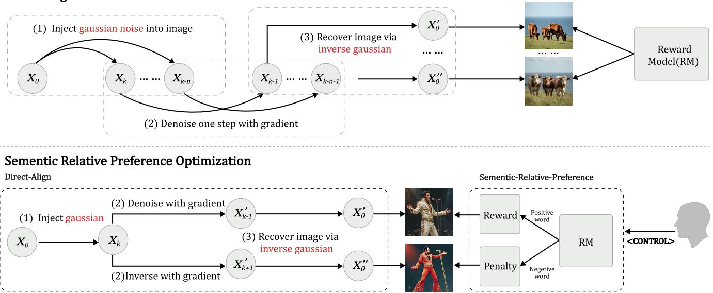  
training; (1) inject noise into image; (2) perform one-step denoise/inversion; (3) recover image.

# 2. 相关研究

在扩散时间步的优化方面，近期的研究表明，扩散模型和流匹配方法可以统一在一个连续时间的随机微分方程/常微分方程框架下，其中图像通过渐进轨迹生成，早期阶段建模低频结构，而后续步骤则细化高频细节，如纹理和颜色。最新研究表明，优化早期时间步可以提高训练效率和生成质量。然而，标准的直接反向传播与奖励方法在早期阶段优化中面临困难，因为过多的噪声损害了奖励梯度。为此，我们提出一种新颖的采样策略，能够在单步中从高噪声输入中恢复干净图像，进而在早期扩散阶段实现有效的基于奖励的优化。 对人类偏好的奖励模型进行精细化调整。将扩散模型与人类偏好对齐的一个核心挑战是奖励劫持，这通常源于现有奖励模型与真实人类偏好之间的不匹配。这一差异主要可以归因于两个方面。首先，建模本质上主观的人类美学是一个重大挑战，正如先前报告中较低的注释者间一致性所示：ImageReward测试集的相似度为65.7%，HPDv2为59.7%。其次，当前的奖励模型通常在有限的标准和过时的模型代上进行训练，仅捕捉到粗粒度的偏好，这些偏好是从其训练数据中学习到的，例如ImageReward中的Fielidy和文本到图像的对齐，通常在强化学习前需要离线调整，以便与更先进的生成架构和更高的美学要求对齐。例如，ICTHP强调了奖励模型对低细节和低美学图像的偏见，而HPSv3通过使用先进模型和真实图像来训练奖励来解决这一问题，MPS则引入了更细粒度的训练标准。相比之下，我们的工作专注于在强化学习过程中如何利用奖励信号，采用文本条件偏好使奖励归属与目标属性对齐，并过滤掉非必要的偏见。这使得我们的方法具有强大的泛化能力，并提供不同的奖励，显著提高了最新FLUX.1.dev模型在使用标准奖励（如HPSv2）时的视觉质量，而无需复杂或专门微调的替代方案。

# 3. 方法

本研究提出了一种新颖的在线强化学习框架用于文本到图像生成。第3.1节首先识别了当前直接反向传播方法中的一个关键局限，并引入了一种改进的强化学习算法，提出了一种新的优化流程以解决这一约束。随后，我们分析了现有的奖励反馈机制和在线奖励调整方法。第3.2节则提出了我们专门为强化学习优化设计的奖励公式。

# 3.1. 直接对齐

现有方法的局限性。现有的直接反向传播算法通过最大化在生成样本上评估的奖励函数来优化扩散模型。目前的方法通常采用两阶段过程：（1）无梯度地采样噪声以获得中间状态 $x _ { k }$，然后（2）进行可微分预测以生成图像。这使得奖励信号的梯度能够通过图像生成过程进行反向传播。这些方法的最终目标可以分为两类：

$$
\begin{array} { r l } { \mathrm { D r a f t \mathrm { - } l i k e } { : } } & { { } r = R ( \mathrm { s a m p l e } ( \mathbf { x _ { t } } , \mathbf { c } ) ) } \\ { \mathrm { R e F L } { \mathrm { - } } \mathrm { l i k e } { : } } & { { } r = R ( \frac { \mathbf { x _ { t } } - \sigma _ { t } \epsilon _ { \theta } ( \mathbf { x _ { t } } , t , \mathbf { c } ) } { \alpha _ { t } } ) } \end{array}
$$

DRaFT [5] 在整个过程中进行规律的噪声采样，包括最后的几个步骤甚至最后一步，因为当步骤数超过五时，多步骤采样会导致显著的计算成本和不稳定的训练，这一点在原始工作中已有报道。同样，ReFL [33] 也选择在执行一步预测以获得 $x _ { 0 }$ 之前较晚的 $k$ 值，因为一步预测在早期时间步上往往会失去准确性。这两种方法都将强化学习过程限制在采样的后期。单步图像恢复。为了解决上述限制，准确的单步预测是必不可少的。我们的关键见解受到扩散模型中前向公式的启发，该公式表明，可以直接从中间噪声图像和高斯噪声重建干净图像，如公式（4）所示。在此见解的基础上，我们提出了一种方法，首先向图像注入真实高斯噪声先验，将其放置在特定时间步骤 $t$ 上以启动优化。这种方法的一个主要优势是存在一个闭式解，该解来源于公式 4，可以直接从当前的噪声状态恢复干净图像。这个解析解消除了迭代采样的需要，从而避免了其常见的缺陷，如梯度爆炸，同时在早期高噪声时间步骤中仍能保持高准确性（见图 3）。

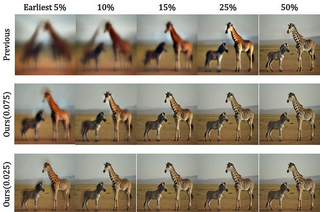  
Figure 3. Comparison on one-step prediction at early timestep The values 0.075 and 0.025 denote the weight of the model prediction term used for method, respectively. The earliest $5 \%$ represent state with $9 5 \%$ noise from an unshifted timestep. By constructing a Gaussian prior, our one-step sampling method achieves highquality results at early timesteps, even when the input image is highly noised.

奖励聚合框架。我们的框架（图 2）生成干净的图像 $x _ { 0 }$ 并在单一步骤中注入噪声。为了增强稳定性，我们对同一 $x _ { 0 }$ 执行多次噪声注入，从而生成一系列图像 $\{ x _ { k } , \ldots , x _ { k - n } \}$。随后，我们对序列中的每个图像应用去噪和恢复过程，允许计算中间奖励。这些奖励随后通过梯度累积使用衰减折扣因子进行聚合，从而帮助减少后续时间步的奖励操控。

$$
\begin{array} { r } { r ( { \bf x _ { t } } ) = \lambda ( t ) \cdot \sum _ { k } ^ { k - n } r ( x _ { i } - \epsilon _ { \theta } ( { \bf x _ { i } } , i , { \bf c } ) , { \bf c } ) } \end{array}
$$

# 3.2. 语义相对偏好优化

语义引导偏好。现代在线强化学习用于文本生成图像时，采用奖励模型来评估输出质量并指导优化。这些模型通常结合图像编码器 $f _ { i m g }$ 和文本编码器 $f _ { t x t }$ 来计算相似性，遵循 CLIP 架构 [26]：

$$
\begin{array} { r l } & { \mathbf { x _ { t } } = \alpha _ { t } \mathbf { x _ { 0 } } + \sigma _ { t } \epsilon _ { g t } } \\ & { \mathbf { x _ { 0 } } = \frac { \mathbf { x _ { t } } - \sigma _ { t } \epsilon _ { g t } } { \alpha _ { t } } } \end{array}
$$

如公式 2-5 所示，我们的方法利用真实标注数据向量去噪大部分扩散链，从而减轻模型预测引入的误差累积。这一策略在过程的早期阶段有助于实现更准确的奖励分配。

$$
r = r ( \frac { \mathbf { x _ { t } } - \Delta \sigma _ { t } \epsilon _ { \theta } ( \mathbf { x _ { t } } , t , \mathbf { c } ) - ( \sigma _ { t } - \Delta \sigma ) \epsilon } { \alpha _ { t } } )
$$

$$
r ( \mathbf { x } ) = R M ( \mathbf { x } , \mathbf { p } ) \propto f _ { i m g } ( \mathbf { x } ) ^ { T } \cdot f _ { t x t } ( \mathbf { p } )
$$

在我们的实验中，我们观察到奖励可以被解释为一个由文本嵌入参数化的图像依赖函数，用 $C$ 表示。重要的是，我们发现通过战略性地用魔法控制词扩展提示 $p$，即 $p _ { c }$，可以通过修改语义嵌入来引导奖励特征。因此，我们提出了语义引导偏好（SGP），通过文本条件改变奖励偏好。

$$
r _ { S G P } ( \mathbf { x } ) = R M ( \mathbf { x } , ( \mathbf { p _ { c } } , \mathbf { p } ) ) \propto f _ { i m g } ( \mathbf { x } ) ^ { T } \cdot \mathbf { C _ { ( p _ { c } , p ) } }
$$

虽然这种方法实现了受控偏好，但它仍然继承了原始奖励模型的偏见。为了解决这一局限性，我们进一步提出了语义相对偏好机制。

语义相关偏好。现有方法通常结合多个奖励模型，以防止对任何单一偏好信号的过拟合。尽管这可以平衡相反的偏差（例如，利用 CLIPScore 的不足曝光来抵消 HPSv2.1 的过饱和倾向）。如图 7 所示，这只是调整奖励的大小，而不是对优化方向进行对齐，导致妥协的权衡，而不是真正的偏差减轻。基于奖励偏差主要源于图像分支的洞察（因为文本分支不进行梯度反向传播），我们引入了一种通过提示增强从单一图像生成一对相对立的奖励信号的技术，便于负梯度的传播以实现有效的正则化。这种方法有效地通过负梯度中和一般偏差，同时保留语义差异中的特定偏好。在我们的实验中，为了平衡训练效率和正则化强度，可以将缩放系数应用于正面和负面奖励。或者，可以使用类似于无分类器引导的方式设计奖励公式。

$$
\begin{array} { r l } & { r _ { S R P } ( \mathbf { x } ) = r _ { 1 } - r _ { 2 } } \\ & { ~ = f _ { i m g } ( \mathbf { x } ) ^ { T } \cdot ( \mathbf { C } _ { 1 } - \mathbf { C } _ { 2 } ) } \\ & { r _ { C F G } ( \mathbf { x } ) = f _ { i m g } ( \mathbf { x } ) ^ { T } \cdot ( ( 1 - k ) \cdot \mathbf { C } _ { 2 } + k \cdot \mathbf { C } _ { 1 } ) } \end{array}
$$

其中 $C _ { 1 }$ 表示期望属性（例如，真实感），而 $C _ { 2 }$ 编码不希望出现的特征。此公式明确地优化目标特性，同时惩罚不需要的特征。为实现此目的，我们简单地将控制短语添加到提示中（例如，<control>. <prompt>），保持评分的句法结构，同时确保与现有方法的公平比较。基于反演的正则化。与需要通过基于模型的预测进行图像重建的先前方法相比，因此只能沿去噪链进行优化，我们提出的直接对齐方法提供了一个关键特性。具体而言，直接对齐通过预定的先验常数重建图像，从而将重建过程与计算图方向解耦。因此，我们的方法本质上支持在反演方向上的优化。我们简化了去噪（方程 12）和反演（方程 13）过程的奖励公式。因此，去噪过程执行梯度上升，从而将模型与奖励优选分布对齐，而反演过程则执行梯度下降，产生相反的效果。

$$
\begin{array} { l } { r _ { 1 } = r _ { 1 } \left( \frac { \mathbf { a } - \Delta \sigma _ { t } \epsilon _ { \theta } \left( \mathbf { x _ { t } } , t , \mathbf { c } \right) } { \alpha _ { t } } \right) } \\ { r _ { 2 } = r _ { 2 } \left( \frac { \mathbf { b } + \Delta \sigma _ { t } \epsilon _ { \theta } \left( \mathbf { x _ { t } } , t , \mathbf { c } \right) } { \alpha _ { t } } \right) } \end{array}
$$

经验分析表明，奖励黑客行为主要发生在高频时间步。通过采用反演机制，我们将不同时间步的惩罚项和奖励项从语义相对偏好中解耦，从而增强优化过程的鲁棒性。

# 4. 实验

# 4.1. 实现细节

我们使用 FLUX.1.dev [13] 作为我们的基础模型来评估在线强化学习算法，该模型是一个最先进的开源模型，此后称为 FLUX。所有方法都使用 HPS [32]（HPSv2.1 的缩写）作为奖励模型，并在包含来自 DiffusionDB [31] 的四个视觉概念的人类偏好数据集 v2 [32] 上进行训练。直接传播方法在 32 个 NVIDIA H20 GPU 上运行。对于 DanceGRPO [34]，我们在 16 个 NVIDIA H20 GPU 上遵循官方的 FLUX 配置。对于直接传播方法，我们使用 25 次采样步骤以保持梯度准确性，在推理过程中使用 50 次采样步骤，以确保与原始 FLUX.1.dev 的公平比较。我们还将 Krea [15] 的最新开源 FLUX.1 版本与我们的微调 FLUX.1.dev 模型进行了比较。对于 Krea 版本，我们使用其默认配置（28 次采样步骤）。

# 4.2. 评估协议。

自动指标。我们使用在 HPDv2 基准上（3,200 个提示）建立的指标来评估图像质量。我们的评价结合了四个标准度量：Aesthetic Score v2.5 [1, 27]、PickScore [12]、ImageReward [33] 和 HPSv2.1 [32]，这些指标共同评估了美学质量和语义一致性。此外，我们引入了 SGP-HPS，该指标量化了通过 HPSv2.1 从以“真实照片”$( C _ { 1 } )$ 和“CG 渲染”$( C _ { 2 } )$ 为前缀的提示中提取的分数之间的差异。为了进行全面评估，我们使用 GenEval [9] 来评估语义一致性，使用 DeQA [35] 来评估降解。

人工评价。我们进行了一项全面的人类评价研究，比较生成模型，采用精心设计的评估框架。评价涉及10名经过培训的标注员和3名领域专家，以确保统计显著性和专业验证。我们的数据集包括500个提示（每个HPD基准中的四个子类别各125个提示）。每个提示由五名不同的标注员在一个完全交叉的实验设计中进行评估。评估集中于图像质量的四个关键维度：（1）文本-图像对齐（语义一致性），（2）真实感和伪影存在，（3）细节复杂性和丰富性，以及（4）美学构图和吸引力。每个维度使用四级序数评分标准进行评估：优秀（完全符合标准）、良好（轻微偏差）、及格（中等问题）和不合格（显著缺陷）。为了保持评估可靠性，我们实施了多阶段质量控制过程：（1）专家培训和校准标注员，（2）系统解决评分差异，以及（3）持续验证评估标准。

<table><tr><td></td><td colspan="5">Reward</td><td colspan="2">Other Metrics</td><td colspan="3">Human Eval</td><td rowspan="2">GPU hours(H20)</td></tr><tr><td>Method</td><td>Aes</td><td>Pick</td><td>ImageReward</td><td>HPS</td><td>SGP-HPS</td><td>GenEval</td><td>DeQA</td><td>Real</td><td>Aesth</td><td>Overall</td></tr><tr><td>FLUX</td><td>5.867</td><td>22.671</td><td>1.115</td><td>0.289</td><td>0.463</td><td>0.678</td><td>4.292</td><td>8.2</td><td>9.8</td><td>5.3</td><td>−</td></tr><tr><td>ReFL*</td><td>5.903</td><td>22.975</td><td>1.195</td><td>0.298</td><td>0.470</td><td>0.656</td><td>4.299</td><td>5.5</td><td>6.6</td><td>3.1</td><td>16</td></tr><tr><td>DRaFT-LV*</td><td>5.729</td><td>22.932</td><td>1.178</td><td>0.296</td><td>0.458</td><td>0.636</td><td>4.236</td><td>8.3</td><td>9.7</td><td>4.7</td><td>24</td></tr><tr><td>DanceGRPO</td><td>6.022</td><td>22.803</td><td>1.218</td><td>0.297</td><td>0.414</td><td>0.585</td><td>4.353</td><td>5.3</td><td>8.5</td><td>3.7</td><td>480</td></tr><tr><td>Direct-Align</td><td>6.032</td><td>23.030</td><td>1.223</td><td>0.294</td><td>0.448</td><td>0.668</td><td>4.373</td><td>5.9</td><td>8.7</td><td>3.9</td><td>16</td></tr><tr><td>SRPO</td><td>6.194</td><td>23.040</td><td>1.118</td><td>0.289</td><td>0.505</td><td>0.665</td><td>4.275</td><td>38.9</td><td>40.5</td><td>29.4</td><td>5.3</td></tr></table>

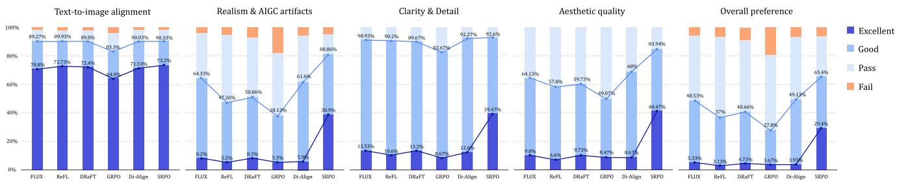  
Crhu aluaresur Vani LUX,ReFL DRa L, DanceGRPO DrecAl SRPO substantial reduction in AIGC artifacts.

# 4.3. 主要结果

自动评估结果。我们的方法在使用 HPSv2.1 进行训练时展示出三大关键优势（表 1）：(1) 对 HPSv2.1 分数因过拟合而膨胀的免疫能力；(2) 较 SOTA 方法在多项奖励指标上的优越表现；(3) 比 DanceGRPO 的训练效率高出 $7 5 \times$，同时在图像质量上与所有在线强化学习基线相当或更佳。人工评估结果。我们的办法达到了最先进（SOTA）的性能，如图 4 所示。包括 Direct-Align 在内的直接针对奖励偏好的优化方法，在真实感方面表现不佳，甚至在奖励黑客的影响下落后于基线 FLUX 模型。在图 5 中，我们展示了 DanceGRPO 和我们方法的视觉比较。完整的模型可视化集在附录中提供。尽管 DanceGRPO 能够提高美学质量并在强化学习后获得相对较高的分数，但它常常引入不想要的伪影，例如过度光泽（第 2 行，第 1 列）和明显的边缘高光（第 2 行，第 6 列）。为了进一步验证真实感的提升，我们从基准数据集中选择了前 200 个与照片相关的提示。我们通过在普通 FLUX 输入前添加与真实感相关的词汇来增强这些提示。图 9 (b) 显示，我们主模型的直接生成显著优于涉及光照和真实感相关风格词汇的 FLUX.1.dev。相比之下，我们的 SRPO 在真实感、美学和整体用户偏好上显著改善了 FLUX。据我们所知，这是首次在大规模扩散模型中全面增强真实感，优秀率从 $8 . 2 \%$ 提升至 $3 8 . 9 \%$，且不需要额外的训练数据。此外，如图 9 (a) 所示，我们通过 SRPO 增强的 FLUX.1.dev 超越了最新的开源 FLUX.1.krea，在 HPDv2 基准测试中的表现更佳。

# 4.4. 奖励模型的比较分析

我们使用了三种基于 CLIP 的奖励模型对我们的方法进行评估：CLIP ViT-H/14、PickScore 和 HPSv2.1，如图 6 所示。我们的方法在所有模型中，包括 CLIP，一致地增强了图像的真实感和细节复杂性，尽管由于 CLIP 缺乏人类偏好对齐，其改进仍然有限。值得注意的是，PickScore 的收敛速度比 HPS 更快且更稳定，而两者的视觉质量相当。重要的是，我们的方法未观察到任何奖励黑客行为，突显了 Direct-Align 设计的有效性（图 6 (c)），在优化过程中有效解耦了奖励特定偏见，同时保持与用户目标的一致性。此外，我们还验证了我们的方法对单模态奖励的泛化能力（例如，美学评分 2.5 [1]），更多扩展内容将在附录中讨论。

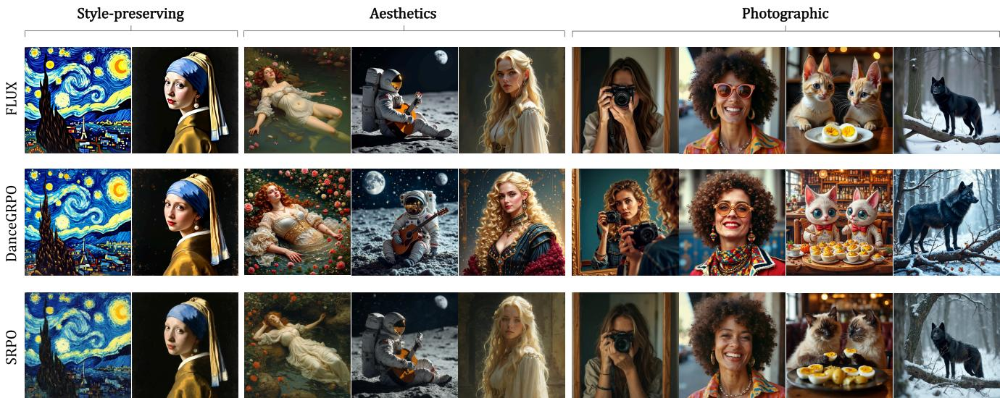  
Quala pUX, anRPOn RPO  sme pupe mance in realism and detail complexity.

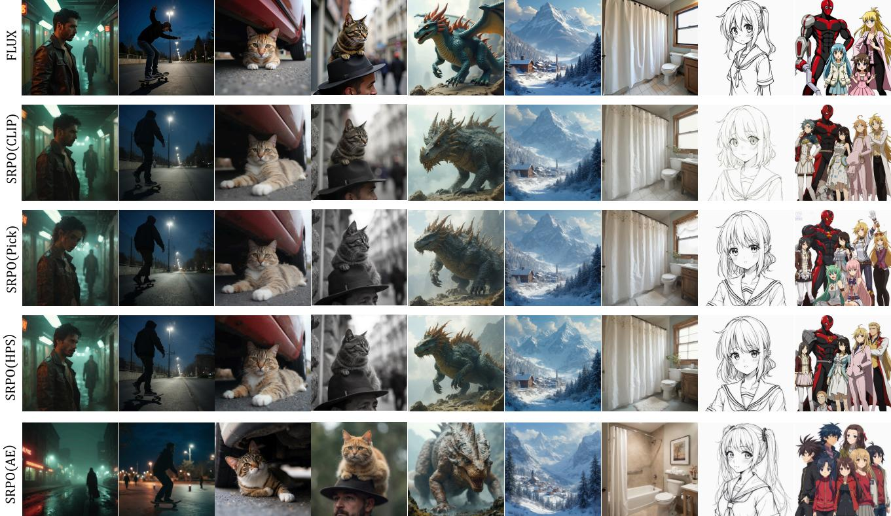  
Figure 6. Cross-reward results of SRPO.

# 4.5. 分析

去噪效率。我们比较了先前方法中使用的标准一步采样生成的最终图像[11][33]，该方法直接利用模型预测，与我们的方法在早期时间步生成的图像。如图3所示，标准一步采样在去噪过程的很大一部分仍然表现出明显的伪影。相比之下，Direct-Align主要依赖真实标注噪声进行预测，即使在最初的$5 \%$时间步也能恢复图像的粗略结构，并且在$25 \%$时生成的结果与原始图像几乎无法区分。此外，我们调查了在总去噪轨迹中模型预测步骤的比例对最终图像质量的影响（如图中从0.075到0.025的两行所示）。我们的结果表明，预测步骤比例较短会导致更高的最终图像质量。这些发现展示了Direct-Align在去噪过程初期阶段的优化能力。

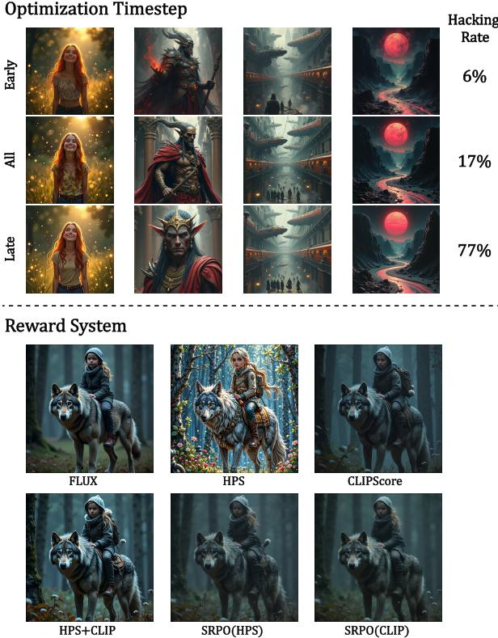  
Figure 7. Comparison of Optimization Effects of Different timestpe Intervals & Comparison of Reward-System and SRPO on Direct-Align. (1) Hacking Rate: Annotators compare three outputs and select the one that is least detailed or most overprocessed, labeling it as hacking (2) The prompt is A young girl riding a gray wolf in a dark forest. Reward-System can only adjusts scale of rewards, resulting in trade-offs between two rewards effect. In contrast, SRPO penalizes out irrelevant directions from the reward, effectively preventing reward hacking and enhancing image texture.

优化时间步。我们比较了使用无延迟时间步折扣的 Direct-Align 和 PickScore 三个训练间隔，如图 7 所示：早期（前 25% 的噪声水平），所有（整个训练间隔）和晚期（最后 25% 的噪声水平）。我们从 HPD 测试集中随机选择了 200 个提示进行人工评估。评估人员被问到：这三幅图像中有显示黑客伪影吗，例如过饱和、过平滑或缺乏图像细节？将最糟糕的一幅标记为被黑。我们观察到，仅在晚期间隔上训练会显著增加被黑率，可能是由于过拟合于 PickScore 对平滑图像的偏好。当在整个间隔上进行训练时，被黑率依然相当可观，因为该方案仍然包含晚期时间步区域。

Direct-Align 的有效性。Direct-Align 的核心贡献在于其解决了之前仅优化后期时间步长的方案的局限性。Direct-Align 引入了两个关键组件：早期时间步长优化和后期时间步长折扣。在图 9 (d) 中，我们对 Direct-Align 中的这些组件进行了消融实验。如公式 2 和 5 所示，去掉早期时间步长优化会使得奖励结构类似于 ReFL，导致现实感降低并增加对奖励黑客的脆弱性，例如过饱和和视觉伪影。类似地，去掉 $\lambda ( t )$ 折扣使得模型容易受到奖励黑客攻击，导致过饱和和不自然的纹理。这些发现证实了我们的方法在克服后期时间步长优化局限性方面的重要性。图 9 (d) 还比较了反演与如公式 10 中直接构建奖励的使用。尽管直接构建的现实感和纹理复杂性略低于反演，但结果仍然具有竞争力。这些结果突显了 SRPO 奖励公式在未来无法支持反演或非可微奖励的其他在线强化学习算法中的潜力。

细粒度人类偏好优化。SRPO的主要贡献在于其通过操控控制词有效引导强化学习（RL）方向的能力。通过涉及多样控制词的综合实验，我们发现，在奖励训练集中出现频率较高的形容词，或那些更易被其基础的视觉-语言模型（VLM）主干识别的词，表现出显著更强的可控性。关于HPDv2中高频词的详细统计数据见附录。在图8中，我们展示了在HPDv2和HPSv2.1上进行RL微调的简单控制，包括亮度调整（第13列）和将输出分布转向漫画或概念艺术。对于奖励训练集中稀有或未见的风格（例如文艺复兴），在推理时必须添加风格词以确保正确生成。此外，由于我们的奖励是基于图像-文本相似性，预先添加目标风格提示到HPD训练集中可以使得RL在训练图像中增加所需风格的出现，提高微调效率。为了进行定量评估，我们进行了用户研究，以比较训练前后使用风格词的模型。在用户研究中，我们选择了照片类别的前200个提示，因为这些提示简单且不包含明确的风格术语。每个提示都添加了一个风格词，以生成每个提示的两个图像。然后，评估者对每对图像进行评估，以检查其对预期风格的遵循程度，在风格忠实度相等的情况下，整体美感被用作决胜因素。如图9 (c)所示，我们的方法能够实现更有效的风格控制，并改善FLUX在某些风格上的表现。然而，改进的程度取决于奖励模型识别特定风格术语的能力；对于赛博朋克风格，尽管SRPO增强了现实感和氛围，如图8 (第8列)所示，但其在训练数据中相对不频繁，导致奖励模型难以识别该风格，从而产生网格状伪影。因此，人类评估中的整体改善有限，大多数分数与原始FLUX相当。

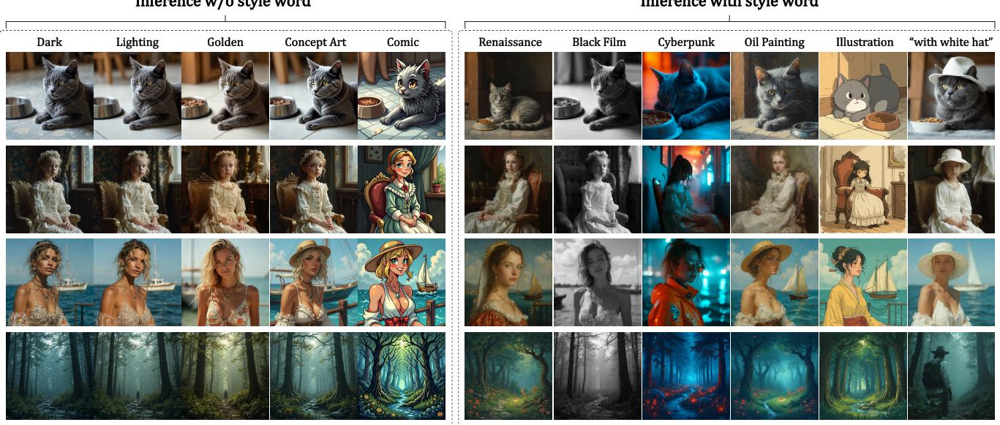

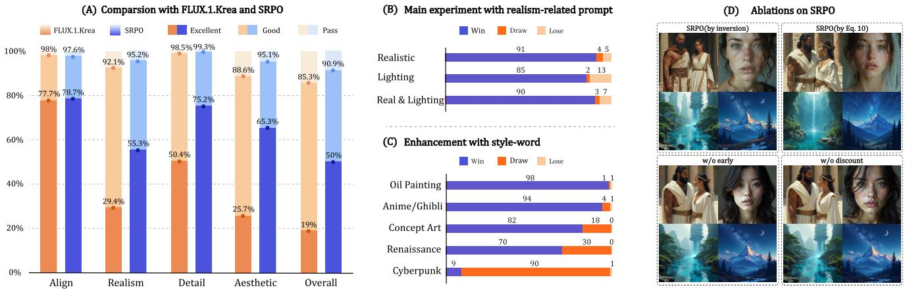  
Figure 8. Visualization of SRPO-controlled results for different style words   
ve a style-word conditioning. D: Ablation study on the main components of SRPO.

离线 SRPO。在我们的实验中，我们观察到 Direct-Align 具有类似于监督微调（SFT）的特性，展现出拟合来自在线推演的图像的能力。基于这一发现，我们用离线真实世界的照片替代了在线推演，这使得 FLUX 模型的现实感得到了另一个显著提升。为了将我们的方法与纯 SFT 区分开来，我们使用原始 CLIP 奖励和人类偏好对齐奖励（如 PickScore 和 HPSv2.1）进行了测试。这一比较强调了我们的方法是一种综合的强化学习方法，结合了数据拟合和人类偏好信号。支持的可视化结果可以在附录的最后一节中找到。

# 5. 结论

在此项工作中，我们提出了一种新颖的强化学习（RL）框架，用于将文本生成图像（T2I）模型与细粒度的人类偏好对齐，能够在不需要微调奖励的情况下进行细粒度的偏好调整。我们的方法解决了现有方法的两个主要限制。首先，我们克服了采样瓶颈，使得RL算法可以应用于干净图像的后期生成之外。第二，我们重新审视了奖励信号的设计，以实现更灵活和有效的偏好调节。通过全面的实验评估，我们证明了我们的方法在图像真实感和与人类美学偏好的对齐方面优于最先进的方法（SOTA）。与DanceGRPO相比，我们的框架在训练效率上实现了超过 $7 5 \times$ 的提升。此外，据我们所知，这是首次系统性地增强大规模扩散模型的真实感。局限性与未来工作。本研究有两个主要局限性。首先，在可控性方面，我们的控制机制和某些控制标记在现有奖励模型的领域之外，可能导致效果降低。其次，在可解释性方面，由于我们的方法依赖于潜在空间中的相似性进行强化学习，一些控制文本的效果在经过编码器映射后，可能与预期的RL方向不一致。在未来的工作中，我们的目标是（1）开发更系统的控制策略或结合可学习标记，以及（2）微调一个对控制词和提示系统显著响应的视觉语言模型（VLM）奖励。此外，SRPO框架可以扩展到其他在线强化学习算法。我们预计这些改进将进一步增强SRPO在实际应用中的可控性和泛化能力。

# References

[1] Aesthetic predictor v2.5. https: / / github.com/ discus0434/aesthetic-predictor-v2-5,2025. Accessed: 2025-06-10. 2, 5, 7   
[2] Michael S Albergo, Nicholas M Boffi, and Eric VandenEijnden. Stochastic interpolants: A unifying framework for flows and diffusions. arXiv preprint arXiv:2303.08797, 2023. 3   
[3] Ying Ba, Tianyu Zhang, Yalong Bai, Wenyi Mo, Tao Liang, Bing Su, and Ji-Rong Wen. Enhancing reward models for high-quality image generation: Beyond text-image alignment. arXiv preprint arXiv:2507.19002, 2025. 2, 3   
[4] Kevin Black, Michael Janner, Yilun Du, Ilya Kostrikov, and Sergey Levine. Training diffusion models with reinforcement learning. arXiv preprint arXiv:2305.13301, 2023. 2 [5] Kevin Clark, Paul Vicol, Kevin Swersky, and David J Fleet. Directly fine-tuning diffusion models on differentiable rewards. arXiv preprint arXiv:2309.17400, 2023. 2, 3, 4 [6] Carles Domingo-Enrich, Michal Drozdzal, Brian Karrer, and Ricky TQ Chen. Adjoint matching: Fine-tuning flow and diffusion generative models with memoryless stochastic optimal control. arXiv preprint arXiv:2409.08861, 2024. 2,   
3 [7] Ying Fan and Kangwook Lee. Optimizing ddpm sampling with shortcut fine-tuning. arXiv preprint arXiv:2301.13362,   
2023.2 [8] Ying Fan, Olivia Watkins, Yuqing Du, Hao Liu, Moonkyung Ryu, Craig Boutilier, Pieter Abbeel, Mohammad Ghavamzadeh, Kangwook Lee, and Kimin Lee. Dpok: Reinforcement learning for fine-tuning text-to-image diffusion models. Advances in Neural Information Processing Systems, 36:7985879885, 2023. 2 [9] Dhruba Ghosh, Hannaneh Hajishirzi, and Ludwig Schmidt. Geneval: An object-focused framework for evaluating textto-image alignment. Advances in Neural Information Processing Systems, 36:5213252152, 2023. 2, 5 [10] Jonathan Ho and Tim Salimans. Classifier-free diffusion guidance. arXiv preprint arXiv:2207.12598, 2022. 5 [11] Jonathan Ho, Ajay Jain, and Pieter Abbeel. Denoising diffusion probabilistic models. Advances in neural information processing systems, 33:68406851, 2020. 2, 3, 7 [12] Yuval Kirstain, Adam Polyak, Uriel Singer, Shahbuland Matiana, Joe Penna, and Omer Levy. Pick-a-pic: An open dataset of user preferences for text-to-image generation. Advances in Neural Information Processing Systems, 36:   
3665236663, 2023. 2, 3, 5 [13] Black Forest Labs. Flux. https: / / github. com/ black-forest-labs/flux,2024. 2,5 [14] Kimin Lee, Hao Liu, Moonkyung Ryu, Olivia Watkins, Yuqing Du, Craig Boutilier, Pieter Abbeel, Mohammad Ghavamzadeh, and Shixiang Shane Gu. Aligning textto-image models using human feedback. arXiv preprint arXiv:2302.12192, 2023. 2 [15] Sangwu Lee, Titus Ebbecke, Erwann Millon, Will Beddow, Le Zhuo, Iker García-Ferrero, Liam Esparraguera, Mihai Petrescu, Gian SaB, Gabriel Menezes, and Victor Perez. Flux.1 krea [dev]. https://github.com/krea-ai/fluxkrea, 2025. 2, 5 [16] Zhimin Li, Jianwei Zhang, Qin Lin, Jiangfeng Xiong, Yanxin Long, Xinchi Deng, Yingfang Zhang, Xingchao Liu, Minbin Huang, Zedong Xiao, et al. Hunyuan-dit: A powerful multi-resolution diffusion transformer with fine-grained chinese understanding. arXiv preprint arXiv:2405.08748, 2024.   
3 [17] Zhanhao Liang, Yuhui Yuan, Shuyang Gu, Bohan Chen, Tiankai Hang, Mingxi Cheng, Ji Li, and Liang Zheng. Aesthetic post-training diffusion models from generic preferences with step-by-step preference optimization. In Proceedings of the Computer Vision and Pattern Recognition Conference, pages 1319913208, 2025. 3   
[18] Yaron Lipman, Ricky TQ Chen, Heli Ben-Hamu, Maximilian Nickel, and Matt Le. Flow matching for generative modeling. arXiv preprint arXiv:2210.02747, 2022. 3   
[19] Jie Liu, Gongye Liu, Jiajun Liang, Yangguang Li, Jiaheng Liu, Xintao Wang, Pengfei Wan, Di Zhang, and Wanli Ouyang. Flow-grpo: Training flow matching models via online rl. arXiv preprint arXiv:2505.05470, 2025. 2   
[20] Xingchao Liu, Chengyue Gong, and Qiang Liu. Flow straight and fast: Learning to generate and transfer data with rectified flow. arXiv preprint arXiv:2209.03003, 2022. 3   
[21] Nanye Ma, Mark Goldstein, Michael S Albergo, Nicholas M Boff, Eric Vanden-Eijnden, and Saining Xie. Sit: Exploring flow and diffusion-based generative models with scalable interpolant transformers. In European Conference on Computer Vision, pages 2340. Springer, 2024. 3   
[22] Yuhang Ma, Xiaoshi Wu, Keqiang Sun, and Hongsheng Li. Hpsv3: Towards wide-spectrum human preference score. arXiv preprint arXiv:2508.03789, 2025. 3   
[23] Alexander Pan, Kush Bhatia, and Jacob Steinhardt. The effects of reward misspecification: Mapping and mitigating misaligned models. arXiv preprint arXiv:2201.03544, 2022. 2   
[24] Mihir Prabhudesai, Anirudh Goyal, Deepak Pathak, and Katerina Fragkiadaki. Aligning text-to-image diffusion models with reward backpropagation. 2023. 2, 3, 4   
[25] Mihir Prabhudesai, Russell Mendonca, Zheyang Qin, Katerina Fragkiadaki, and Deepak Pathak. Video diffusion alignment via reward gradients. arXiv preprint arXiv:2407.08737, 2024. 2, 3, 4   
[26] Alec Radford, Jong Wook Kim, Chris Hallacy, Aditya Ramesh, Gabriel Goh, SandhiniAgarwal, Girish Sastry, Amanda Askell, Pamela Mishkin, Jack Clark, et al. Learning transferable visual models from natural language supervision. In International conference on machine learning, pages 87488763. PmLR, 2021. 4   
[27] Christoph Schuhmann. Laion-aesthetics. https:/ laion.ai/blog/laion-aesthetics/,2022. Accessed: 2023-11-10. 3, 5   
[28] Jiaming Song, Chenlin Meng, and Stefano Ermon. Denoising diffusion implicit models. arXiv preprint arXiv:2010.02502, 2020. 2, 3   
[29] Yang Song, Jascha Sohl-Dickstein, Diederik P Kingma, Abhishek Kumar, Stefano Ermon, and Ben Poole. Score-based generative modeling through stochastic differential equations. arXiv preprint arXiv:2011.13456, 2020. 3   
[30] Yibin Wang, Zhimin Li, Yuhang Zang, Yujie Zhou, Jiazi Bu, Chunyu Wang, Qinglin Lu, Cheng Jin, and Jiaqi Wang. Pref-grpo: Pairwise preference reward-based grpo for stable text-to-image reinforcement learning. arXiv preprint arXiv:2508.20751, 2025. 2   
[31] Zijie J Wang, Evan Montoya, David Munechika, Haoyang Yang, Benjamin Hoover, and Duen Horng Chau. Diffusiondb: A large-scale prompt gallery dataset for text-toimage generative models. arXiv preprint arXiv:2210.14896, 2022.5   
[32] Xiaoshi Wu, Keqiang Sun, Feng Zhu, Rui Zhao, and Hongsheng Li. Human preference score: Better aligning textto-image models with human preference. In Proceedings of the IEEE/CVF International Conference on Computer Vision, pages 20962105, 2023. 2, 3, 5   
[33] Jiazheng Xu, Xiao Liu, Yuchen Wu, Yuxuan Tong, Qinkai Li, Ming Ding, Jie Tang, and Yuxiao Dong. Imagereward: Learning and evaluating human preferences for textto-image generation. Advances in Neural Information Processing Systems, 36:1590315935, 2023. 2, 3, 4, 5, 8   
[34] Zeyue Xue, Jie Wu, Yu Gao, Fangyuan Kong, Lingting Zhu, Mengzhao Chen, Zhiheng Liu, Wei Liu, Qiushan Guo, Weilin Huang, et al. Dancegrpo: Unleashing grpo on visual generation. arXiv preprint arXiv:2505.07818, 2025. 2, 5   
[35] Zhiyuan You, Xin Cai, Jinjin Gu, Tianfan Xue, and Chao Dong. Teaching large language models to regress accurate image quality scores using score distribution. arXiv preprint arXiv:2501.11561, 2025. 5   
[36] Sixian Zhang, Bohan Wang, Junqiang Wu, Yan Li, Tingting Gao, Di Zhang, and Zhongyuan Wang. Learning multidimensional human preference for text-to-image generation. In Proceedings of the IEEE/CVF Conference on Computer Vision and Pattern Recognition, pages 80188027, 2024. 3   
[37] Tao Zhang, Cheng Da, Kun Ding, Huan Yang, Kun Jin, Yan Li, Tingting Gao, Di Zhang, Shiming Xiang, and Chunhong Pan. Diffusion model as a noise-aware latent reward model for step-level preference optimization. arXiv preprint arXiv:2502.01051, 2025. 3

# Directly Aligning the Full Diffusion Trajectory with Fine-Grained Human Preference

Supplementary Material

# S1. Extension to Aesthetic Models

While SRPO primarily operates on the text branch and thus cannot explicitly control purely image-based aesthetic models, relative reward can still be achieved through data processing techniques. Specifically, we introduce small amounts of noise to the images generated by the model and compute the aesthetic reward for both the noised and the original clean images. This setup naturally forms positive and negative optimization gradients. Although the reward scores for noisy images may not be accurate, they serve to penalize the overall bias in the reward model. Our experiments demonstrate that this approach remains effective in mitigating reward hacking phenomena as show in Fig. S1

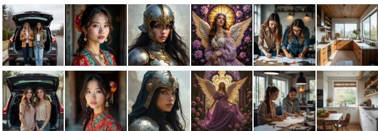  
Figure S1. Extension to the Aesthetic Model. The first row is trained with Direct-Align using the original Aesthetic Predictor 2.5, while the second row is trained using SRPO with Aesthetic Predictor 2.5.

# S2. Comparison to GRPO

Our approach is inspired by the group relativity mechanism in GRPO. Similar to GRPO, our method first samples clean images without gradients and then injects noise back into the corresponding intermediate to train. However, our method offers several key advantages over GRPO. First, we apply direct propagation on the reward signal, in contrast to the policy optimization used in GRPO; this leads to significantly improved convergence speed. For example, during FLUX training, we observe that methods based on direct propagation yield noticeable image changes within 30 steps, whereas GRPO requires over 100 steps for comparable results. Second, our approach computes semantic-relative advantages, requiring only a single sample for each update and relying solely on the original ODE. This eliminates the reliance on the diversity of the generative model or sampler. Third, unlike GRPO, which often necessitates additional KL regularization and a reference model to prevent over-optimization, our method directly constrains the optimization by propagating the negative reward signal, thus obviating the need for auxiliary constraints.

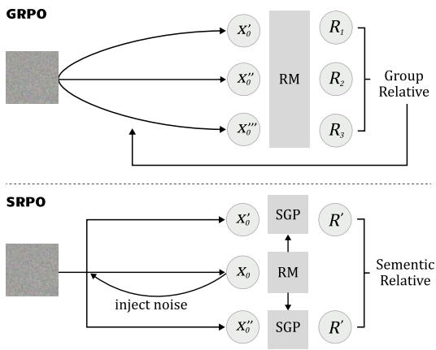

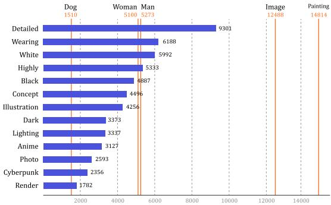  
Figure S2. Comparison on GRPO and SRPO.   
Figure S3. High-frequency Word Statistics (part) in HPDv2 Training Set.

# S3. High-frequency Word Statistics in HPDv2 Training Set

We found that the effectiveness of our method depends on the reward model's ability to perceive control words. Here, we briefly present the word frequency statistics in the HPDv2.1 training set. As discussed in Section Sec. 4.5, painting is the most frequent word and achieves the best experimental results, while the less frequent word Cyberpunk yields weaker enhancement effects. Furthermore, we observed that low-frequency words can benefit from being combined with high-frequency words. For example, the Comic column in our experiment uses a combination of anime, comi c, and digital paint ing. Similarly, Renaissance is constructed by combining Renaissance-style and oil painting.

# S4. Visualization Comparsion

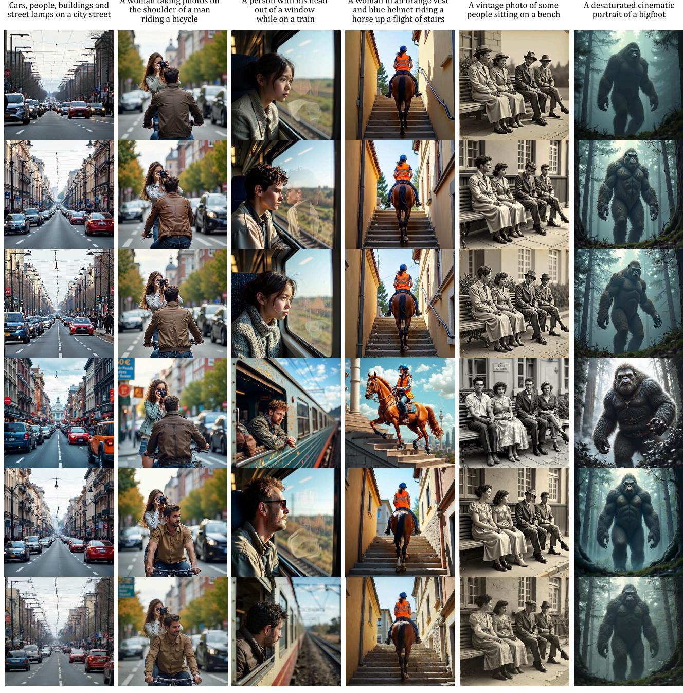  
A woman taking photos on   
l and detail complexity.

<table><tr><td>Criterion Realism&amp;AI</td><td>Description Evaluates whether the</td><td>Key Points</td></tr><tr><td>artifacts</td><td>image looks real and free of AI artifacts compared to other images</td><td>Whether deformation artifacts appear in the image Whether the text is correct (if the image contains text ) Oily surface or over-saturated colors on objects •Abnormal highlights on object edges or unnatural transition to background •Whether the object&#x27;s texture is overly simple or even •Scoring: For each key point issue compared to other images, downgrade the rating by one level (e.g., from Excellent to Good,</td></tr><tr><td>Detail Complexity:</td><td>Whether the main subject of the image is clear and detailed. textures compared to other images.</td><td>Whether there is obvious blurriness in the image. Whether the main subject of the image is intuitively presented (i.e., not blurry). Whether there are any watermarks or garbled text in the image that affect its presentation. •Whether the texture of the image is complex, for example, whether the texture of leaves is distinguishable. •Whether the lighting and shadows in the image are prominent, and whether the light source is identifiable. •Scoring: For each key point issue compared to other images,</td></tr><tr><td>Image-Text Alignment</td><td>Measures Image-Text Alignment by grading</td><td>Failed. • Excellent: Over 90% of the elements match the prompt, and the style is fully consistent. If there is text, it should be fully generated and naturally embedded in the image. • Good: 70%90% of the elements match the prompt. Minor errors in the text are allowed. •Pass: 50%70% of the elements match the prompt. Most key elements are present, or the image generally looks similar to the prompt at first glance.</td></tr><tr><td>Aesthetic Quality</td><td>No need to reference the prompt; evaluate the aesthetic appeal of each image based on composition, lighting, color, etc.</td><td>•Excellent: The image has a strong atmosphere and is highly visually appealing. Only images that make you want to save them as wallpapers or share them with others qualify for this rating. Good: The image stands out in at least one as- pect—composition, lighting, or color—making it comfortable to view or eye-catching. Pass: The image has no obvious flaws, but its aesthetic appeal</td></tr><tr><td>Overall Quality</td><td>Comprehensively evaluate the overall preference for the image.</td><td>•Failed: The image is unattractive or even unpleasant to look at. • Excellent: All dimensions are rated as Excellent. •Good: At least half of the dimensions are rated as Excellent. • Pass: No dimension is rated as Failed •Failed: Any dimension is rated as Failed.</td></tr></table>

A grey tabby cat   
with yellow eyes rests on a weathered woden log under bright sunlight.   
A traditional   
Chinese building   
with red pillars   
and an ornate   
roof, with a   
pagoda visible   
inn the   
background.   
A black bird   
perches on a   
corrugated metal   
fence with   
skyscrapers in the   
background under   
a be sky.

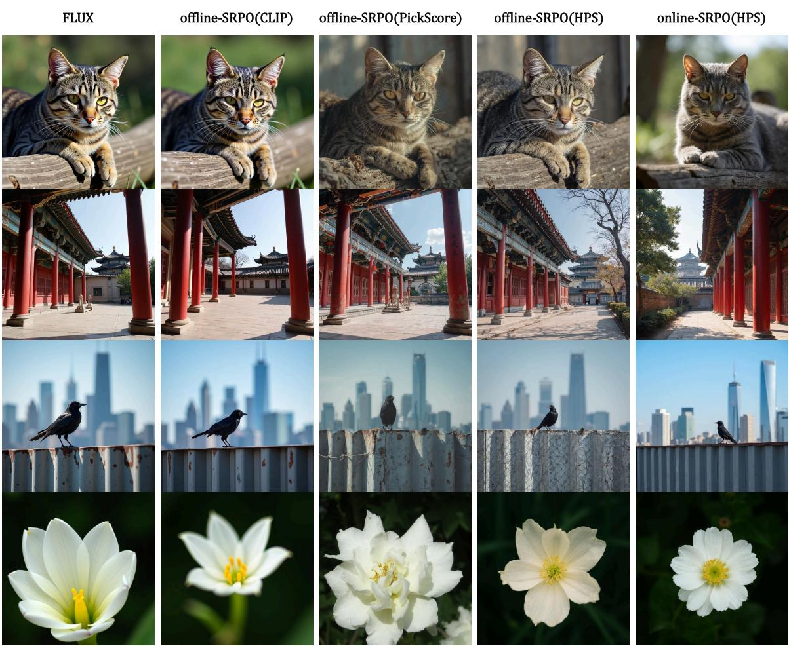  
Figure S5. Qualitative Comparison on offine-SRPO and online-SRPO

A close-up of a white flower with yellow stamens against a dark green, blurred background.