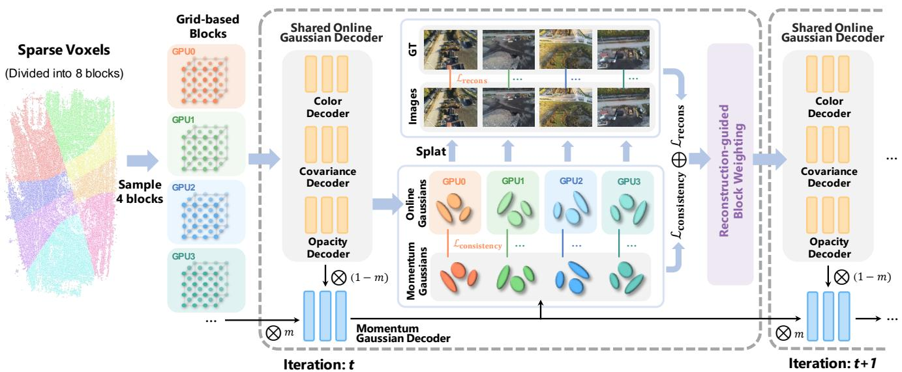
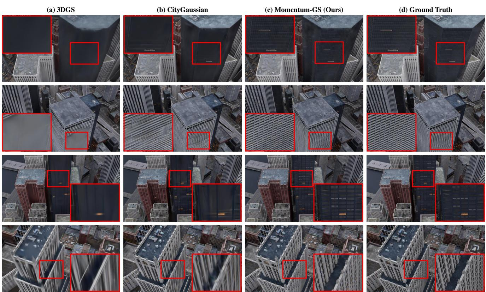

# 1. 论文基本信息

## 1.1. 标题
Momentum-GS: Momentum Gaussian Self-Distillation for High-Quality Large Scene Reconstruction
中文翻译：Momentum-GS：用于高质量大场景重建的动量高斯自蒸馏

## 1.2. 作者
- Jixuan Fan, Yifei Han, Tianru Dai, Yansong Tang (清华大学深圳国际研究生院, 清华大学)
- Wanhua Li (哈佛大学)

  这些作者来自学术界顶尖机构，尤其在计算机视觉和图形学领域有深厚的研究背景。

## 1.3. 发表期刊/会议
该论文是一篇于 2024 年 12 月提交到 arXiv 的预印本 (Preprint)。arXiv 是一个开放获取的学术论文存档网站，允许研究者在正式同行评审前分享他们的研究成果。虽然预印本未经正式评审，但它通常代表了该领域最新的研究进展。

## 1.4. 发表年份
2024

## 1.5. 摘要
3D高斯溅射 (3D Gaussian Splatting) 在大规模场景重建中取得了显著成功，但高昂的训练内存消耗和存储开销仍然是挑战。结合了隐式和显式特征的混合表示法 (Hybrid representations) 提供了一种缓解这些限制的方法。然而，当应用于并行的分块式训练时，出现了两个关键问题：(1) 独立训练每个块会因数据多样性减少而导致重建精度下降；(2) 并行训练将划分的块数限制在可用的 GPU 数量上。为解决这些问题，论文提出了 `Momentum-GS`，一种新颖的方法，它利用基于动量的自蒸馏来促进块间的一致性和准确性，同时将块的数量与物理 GPU 数量解耦。该方法维护一个通过动量更新的**教师高斯解码器**，以确保训练过程中的稳定参考。该教师以自蒸馏的方式为每个块提供全局指导，促进重建的空间一致性。为了进一步确保块间的一致性，论文引入了**块加权**机制，根据每个块的重建精度动态调整其权重。在大型场景上的大量实验表明，该方法始终优于现有技术，在LPIPS指标上比 `CityGaussian` 提高了 12.8%，同时使用的分块数量要少得多，并建立了新的最先进 (state-of-the-art) 水平。

## 1.6. 原文链接
- **原文链接:** [https://arxiv.org/abs/2412.04887](https://arxiv.org/abs/2412.04887)
- **PDF 链接:** [https://arxiv.org/pdf/2412.04887v2.pdf](https://arxiv.org/pdf/2412.04887v2.pdf)
- **发布状态:** 预印本 (Preprint)

  ---

# 2. 整体概括

## 2.1. 研究背景与动机
- **核心问题:** 如何在保持高质量重建的同时，高效、可扩展地重建大规模三维场景。
- <strong>现有挑战 (Gap):</strong>
    1.  <strong>3D高斯溅射 (3D-GS) 的局限性:</strong> 虽然 `3D-GS` 在重建质量和渲染速度上表现优异，但其显式表示（存储数百万个高斯点）导致巨大的内存和存储开销，限制了其在超大场景中的应用。
    2.  <strong>分块训练 (Divide-and-Conquer) 的困境:</strong> 为了处理大场景，现有方法通常采用“分而治之”策略，将场景切分成多个块独立或并行训练。但这带来了新的问题：
        *   **不一致性:** 独立训练每个块会忽略块与块之间的关联，导致在块边界出现明显的接缝、光照突变等不一致现象（如 `CityGaussian` 所示）。
        *   **可扩展性受限:** 如果采用共享模型参数的并行训练来增强一致性，那么可以同时训练的块数将严格受限于可用的 GPU 数量，这极大地限制了方法处理超大规模场景的可扩展性。
- **切入点与创新思路:**
  论文认为，结合了隐式和显式特征的<strong>混合表示法 (Hybrid Representations)</strong> 是解决 `3D-GS` 内存瓶颈的关键。然而，为了解决分块训练带来的<strong>“一致性 vs. 可扩展性”</strong>的矛盾，论文提出了一个巧妙的训练框架 `Momentum-GS`。其核心思路是：
    *   **解耦 GPU 与块数:** 通过一种**轮换训练**机制，让有限的 GPU 能够在大量的块之间切换训练，从而打破了 GPU 数量对场景划分规模的限制。
    *   **动量自蒸馏:** 为了在轮换训练中保持全局信息的一致性，引入一个更新缓慢的<strong>教师模型 (teacher model)</strong>。这个教师模型通过动量更新，综合了所有块在历史训练中的信息，形成一个稳定的“全局知识库”。训练中的<strong>学生模型 (student model)</strong> 在学习重建任务的同时，还要模仿教师模型的输出，从而保证了即使在训练不同块时，也能获得来自整个场景的、一致的指导。

## 2.2. 核心贡献/主要发现
1.  <strong>提出场景动量自蒸馏 (Scene Momentum Self-Distillation):</strong> 引入了一个教师-学生框架，其中教师高斯解码器通过动量更新，为分块训练提供了稳定的全局指导。这不仅增强了高斯解码器的性能，还成功地**将分块数量与 GPU 数量解耦**，实现了可扩展的并行训练。
2.  <strong>提出重建引导的块加权 (Reconstruction-guided Block Weighting):</strong> 设计了一种动态加权机制，在训练中自动为重建质量较差的块分配更高的权重。这使得模型能够集中精力“补短板”，从而提升场景的整体一致性和最终质量。
3.  **验证了混合表示法在大场景重建中的潜力:** 通过 `Momentum-GS` 的成功，论文证明了混合表示法结合巧妙的训练策略，可以达到甚至超越纯显式方法（如 `CityGaussian`）的重建质量，同时在内存和存储上更具优势，为大规模场景重建提供了新的最先进 (state-of-the-art) 方案。

    ---

# 3. 预备知识与相关工作

## 3.1. 基础概念
### 3.1.1. 3D高斯溅射 (3D Gaussian Splatting, 3D-GS)
`3D-GS` 是一种用于三维场景表示和渲染的新技术。与传统的神经辐射场 (NeRF) 不同，它不使用神经网络来查询每个点的颜色和密度，而是用成千上万个三维高斯“雪球”（即三维高斯分布）来表示整个场景。
- <strong>表示 (Representation):</strong> 场景由一组三维高斯函数组成。每个高斯函数由以下参数定义：
    *   <strong>位置 ($\mu$)</strong>: 高斯函数的中心点坐标。
    *   <strong>协方差矩阵 ($\Sigma$)</strong>: 决定了高斯函数的形状、大小和方向（例如，是球形、椭球形还是扁平的盘状）。
    *   <strong>颜色 ($c$)</strong>: 通常用球谐函数 (Spherical Harmonics) 表示，使其颜色可以随观察方向变化。
    *   <strong>不透明度 ($\alpha$)</strong>: 控制高斯函数的透明程度。
- <strong>渲染 (Rendering):</strong> 渲染一幅图像时，`3D-GS` 首先将场景中所有的三维高斯函数投影到二维图像平面上（变成二维高斯“斑点”），然后将这些斑点按照从前到后的顺序进行<strong>alpha混合 (alpha blending)</strong>，最终计算出每个像素的颜色。这个过程因为是解析的（不需要像 NeRF 那样沿光线密集采样），所以渲染速度极快。

### 3.1.2. 混合表示法 (Hybrid Representations)
混合表示法是一种结合了<strong>显式表示 (Explicit Representation)</strong> 和<strong>隐式表示 (Implicit Representation)</strong> 的三维场景表示方法，旨在取长补短。
- **显式表示:** 如体素网格 (Voxel Grids) 或点云，直接存储场景的几何或外观信息。其优点是查询速度快，但缺点是内存占用随分辨率或场景规模急剧增加。`3D-GS` 中的高斯点云就是一种显式表示。
- **隐式表示:** 如 NeRF 中使用的多层感知机 (MLP)，将场景信息编码在神经网络的权重中。它通过一个函数（如坐标到颜色的映射）来表示场景。其优点是内存占用固定，与场景复杂度无关，能表示连续、平滑的表面。缺点是查询速度慢，因为每次查询都需要一次网络前向传播。
- **混合:** `Momentum-GS` 借鉴了 `Scaffold-GS` 的思想，使用一种混合表示。它在场景中放置一些稀疏的<strong>锚点 (anchors)</strong>（显式结构），每个锚点带有一个特征向量。然后，使用一个轻量级的 MLP（隐式网络），即<strong>高斯解码器 (Gaussian Decoder)</strong>，来根据观察视角动态地从这些锚点特征中“解码”出完整的高斯参数（位置、形状、颜色等）。这样既利用了显式结构的快速索引，又通过隐式网络大大减少了需要直接存储的参数量。

## 3.2. 前人工作
- <strong>神经辐射场 (Neural Radiance Fields, NeRF):</strong> `NeRF` 使用一个 MLP 将三维坐标和观察方向映射为颜色和密度，通过体积渲染合成新视角图像。虽然质量很高，但其沿光线密集采样的过程导致训练和渲染都非常缓慢。后续工作如 `Mip-NeRF`、`Zip-NeRF` 等致力于提升其渲染质量和效率。
- **大规模场景的 NeRF:** 为了将 `NeRF` 应用于大场景，研究者们提出了分块策略。例如，`Block-NeRF` 和 `Mega-NeRF` 将大场景划分为多个独立的 `NeRF` 模型进行训练，但在块与块之间可能存在不一致的问题。`Switch-NeRF` 尝试用混合专家模型来改善这个问题。
- **大规模场景的 3D-GS:** 近期工作开始将 `3D-GS` 的分块策略用于大场景重建。
    *   **VastGaussian** 和 **CityGaussian:** 采用“分而治之”的策略，将场景划分为多个独立的块进行并行训练。这种方法保证了训练的收敛，但由于块之间没有信息交互，容易在边界产生伪影和不一致性。
    *   **DOGS:** 提出了一种分布式训练方法，通过交替方向乘子法 (ADMM) 来加速训练，但其重点在于加速而非优化高斯表示本身以适应大规模场景。

## 3.3. 技术演进
三维重建技术从传统的运动恢复结构 (Structure-from-Motion, SfM) 和多视图立体匹配 (Multi-View Stereo, MVS) 方法，演进到基于神经网络的隐式表示（以 NeRF 为代表），再到最新的显式与混合表示（以 `3D-GS` 为代表）。
1.  **传统方法:** SfM/MVS 能生成点云和网格，但真实感和细节不足。
2.  **NeRF 时代:** NeRF 实现了前所未有的照片级真实感新视角合成，但速度是其主要瓶颈。
3.  **3D-GS 时代:** `3D-GS` 实现了与 NeRF 相媲美的质量和实时渲染速度，成为当前的热点。
4.  **大规模场景挑战:** 当场景从物体级扩展到城市级时，`3D-GS` 的内存问题凸显，催生了如 `CityGaussian` 等分块方法。
5.  **本文位置:** `Momentum-GS` 正是站在这一技术脉络的前沿，它试图解决分块 `3D-GS` 方法中存在的<strong>“一致性-可扩展性”</strong>核心矛盾，通过引入新颖的训练范式，推动混合表示法在大规模场景重建中的应用。

## 3.4. 差异化分析
`Momentum-GS` 与之前工作的主要区别如下表所示：

| 方法 | 核心思想 | 优点 | 缺点 |
| :--- | :--- | :--- | :--- |
| **CityGaussian** | 分块独立训练，每个块是一个独立的 `3D-GS` 模型。 | 易于并行，可扩展性强。 | 块之间无信息交互，边界易产生不一致；模型无法合并，渲染复杂。 |
| **标准并行训练** | 分块并行训练，所有块共享一个高斯解码器。 | 块之间有信息交互，一致性较好；模型可合并。 | **可扩展性差**，分块数量受限于 GPU 数量。 |
| <strong>Momentum-GS (本文)</strong> | 分块轮换训练，共享学生解码器，并引入动量教师解码器进行自蒸馏。 | **兼具可扩展性和一致性**；分块数量与 GPU 解耦；通过块加权进一步提升质量。 | 训练流程相对更复杂。 |

下图（原文 Figure 2）直观地对比了这三种策略：

![Figure 2. Comparison of three approaches for using hybrid representations to reconstruct large-scale scenes in a divideand-conquer manner. Examples with two blocks: (a) Independent training of each block, resulting in separate models that cannot be merged due to independent Gaussian Decoders, complicating rendering; (b) Parallel training with a shared Gaussian decoder, allowing merged output but limited by GPU count; (c) Our approach with a Momentum Gaussian Decoder, providing global guidance to each block and improving consistency across blocks.](images/2.jpg)
*该图像是示意图，展示了三种使用混合表示法重建大规模场景的方法对比，包括独立训练（a）、并行训练（b）和我们的动量自蒸馏训练（c）。其中通过动量教师高斯解码器为每个块提供全局指导，有助于提高块之间的一致性和重建准确性。*

- <strong>(a) 独立训练:</strong> 每个块有自己的解码器，模型无法合并，渲染时需要复杂的处理。
- <strong>(b) 并行训练:</strong> 所有块共享一个解码器，模型可以合并，但块的数量不能超过 GPU 的数量。
- **(c) Momentum-GS:** 通过一个动量更新的教师解码器，为所有块提供统一的全局指导，解决了 (a) 的不一致和 (b) 的扩展性问题。

  ---

# 4. 方法论

## 4.1. 方法原理
`Momentum-GS` 的核心思想是设计一个能够**兼顾可扩展性与一致性**的分块训练框架。它通过**动量自蒸馏**机制，让一个更新缓慢的“教师”模型来指导一个快速更新的“学生”模型，即使在不同块上交替训练，也能保证学生模型始终朝向一个全局一致的目标优化。同时，通过**动态块加权**，让模型更关注那些“学得不好”的区域，实现整体质量的均衡提升。

下图（原文 Figure 3）展示了 `Momentum-GS` 的详细架构。

*该图像是示意图，展示了Momentum-GS方法在大规模场景重建中的工作流程。左侧展示了将稀疏体素划分为8个块的过程，右侧则展示了共享在线高斯解码器与动量高斯解码器的交互，以及在不同GPU上进行的训练过程。中间部分强调了重建一致性和动态调整块权重的机制，以提高重建精度。整体结构展示了方法如何解决块间一致性与资源利用的问题。*

## 4.2. 核心方法详解 (逐层深入)

### 4.2.1. 3D-GS 基础回顾
在深入 `Momentum-GS` 之前，我们先回顾 `3D-GS` 的核心数学表示，这构成了方法的基础。

场景中的每个点被建模为一个三维高斯函数 `G(x)`，其中心为 $\mu$，形状和方向由协方差矩阵 $\Sigma$ 定义。其数学表达式为：
$$
G ( x ) = e ^ { - { \frac { 1 } { 2 } } ( x - \mu ) ^ { \top } \Sigma ^ { - 1 } ( x - \mu ) }
$$
- $x$: 空间中的一个三维点坐标。
- $\mu$: 高斯函数的中心点坐标。
- $\Sigma$: 一个 $3 \times 3$ 的协方差矩阵，描述了高斯函数的分布形状。

  在渲染时，每个三维高斯被投影到二维图像平面上，然后通过 alpha 混合累积颜色。对于图像上的一个像素 $\mathbf{x}'$，其最终颜色 $C(\mathbf{x}')$ 的计算方式如下：
$$
C ( \mathbf { x } ^ { \prime } ) = \sum _ { i \in N } c _ { i } \sigma _ { i } \prod _ { j = 1 } ^ { i - 1 } ( 1 - \sigma _ { j } )
$$
- $N$: 影响像素 $\mathbf{x}'$ 的所有高斯函数的集合（按深度排序）。
- $c_i$: 第 $i$ 个高斯函数贡献的颜色，通常由视角相关的球谐函数计算得出。
- $\sigma_i$: 第 $i$ 个高斯函数在像素 $\mathbf{x}'$ 处的贡献度，由其可学习的不透明度 $\alpha_i$ 和其二维投影高斯函数在该像素的值 $G'_i(\mathbf{x}')$ 相乘得到，即 `\sigma_i = \alpha_i G'_i(\mathbf{x}')`。

### 4.2.2. 场景动量自蒸馏 (Scene-Aware Momentum Self-Distillation)
这是 `Momentum-GS` 的核心创新，旨在解决分块训练中的一致性与可扩展性难题。

**1. 训练策略与解耦**

- <strong>共享学生解码器 ($D_s$):</strong> 所有块共享一个高斯解码器，称为学生解码器。在训练的每一步，从每个正在训练的块中随机抽取一个视角，使用 $D_s$ 预测高斯参数，然后渲染图像并计算与真实图像的差异。
- **轮换训练:** 假设有 $n$ 个块和 $k$ 个 GPU（其中 $n > k$）。系统会周期性地从 $n$ 个块中采样 $k$ 个，分配给 $k$ 个 GPU 进行训练。这样，即使只有少量 GPU，也能处理任意数量的块，从而**将分块数量与硬件资源解耦**。
- **重建损失:** 基础的重建损失 $\mathcal{L}_{\mathrm{recons}}$ 由 L1 损失和 SSIM 损失组成，旨在使渲染图像在像素和结构上都接近真实图像。
  $$
\mathcal { L } _ { \mathrm { r e con s } } = \mathcal { L } _ { 1 } + \lambda _ { \mathrm { S S I M } } \mathcal { L } _ { \mathrm { S S I M } }
$$
    - $\mathcal{L}_1$: 渲染图像与真实图像之间的 L1 像素差。
    - $\mathcal{L}_{\mathrm{SSIM}}$: 结构相似性指数 (Structural Similarity Index) 损失。
    - $\lambda_{\mathrm{SSIM}}$: 平衡两项损失的权重系数。

<strong>2. 动量教师解码器 ($D_t$)</strong>

- **稳定全局参考:** 由于块是轮换训练的，学生解码器 $D_s$ 的参数会根据当前训练的块而快速变化。为了提供一个稳定的、代表整个场景平均知识的参考，论文引入了另一个解码器，称为教师解码器 $D_t$。
- **动量更新:** $D_t$ 的参数 $\theta_t$ **不通过梯度下降直接优化**。相反，它是学生解码器参数 $\theta_s$ 的一个“慢动作”版本，通过动量更新（moving average）得到：
  $$
\theta _ { t } \leftarrow m \cdot \theta _ { t } + ( 1 - m ) \cdot \theta _ { s }
$$
    - $\theta_t$: 教师解码器 $D_t$ 的参数。
    - $\theta_s$: 学生解码器 $D_s$ 的参数。
    - $m$: 动量系数，一个接近 1 的值（论文中设为 0.9）。这表示教师每次只吸收一小部分来自学生的新知识，从而保持了高度的稳定性。

**3. 自蒸馏与一致性损失**

- **知识蒸馏:** 在训练学生解码器 $D_s$ 时，除了要最小化重建损失外，还要求其输出尽可能与稳定的教师解码器 $D_t$ 的输出保持一致。这种“学生向老师学习”的过程称为自蒸馏。
- <strong>一致性损失 ($\mathcal{L}_{\mathrm{consistency}}$):</strong> 通过计算学生和教师解码器对相同输入（锚点特征 $f_b$ 和相对视角 $v_b$）所预测的高斯参数之间的均方误差来实现。
  $$
\mathcal { L } _ { \mathrm { c o n s i s t e n c y } } = \| D _ { m } ( f _ { b } , v _ { b } ; \theta _ { t } ) - D _ { o } ( f _ { b } , v _ { b } ; \theta _ { s } ) \| _ { 2 }
$$
    - 注意：原文中 $D_m$ 和 $D_o$ 分别代表教师解码器和学生解码器（可能是 $D_{\text{momentum}}$ 和 $D_{\text{online}}$ 的缩写，或笔误）。
    - $f_b, v_b$: 块 $B$ 内的锚点特征和相对视角信息。
    - 该损失项迫使学生解码器 $D_s$ 的行为与全局稳定的教师解码器 $D_t$ 对齐，从而促进了跨块的重建一致性。

**4. 总损失函数**

最终，模型的总损失函数是重建损失和一致性损失的加权和：
$$
\mathcal { L } = \mathcal { L } _ { 1 } + \lambda _ { \mathrm { S S I M } } \mathcal { L } _ { \mathrm { S S I M } } + \lambda _ { \mathrm { c o n s i s t e n c y } } \mathcal { L } _ { \mathrm { c o n s i s t e n c y } }
$$
- $\lambda_{\mathrm{consistency}}$: 控制一致性损失重要性的权重系数。

### 4.2.3. 重建引导的块加权 (Reconstruction-guided Block Weighting)
为了解决不同块训练进度不均的问题，该方法引入了一种动态加权策略。

- **目标:** 优先训练那些重建质量较差的块，帮助模型“补齐短板”，提升整体场景的一致性。
- **流程:**
    1.  **性能监控:** 系统为每个块维护其重建质量指标，主要是 PSNR 和 SSIM，并使用动量平滑来获得稳定的性能度量。
    2.  **确定基准:** 找到当前所有块中性能最好的一个，其 PSNR 和 SSIM 值被记为 $\mathrm{PSNR}_{\max}$ 和 $\mathrm{SSIM}_{\max}$。
    3.  **计算偏差:** 对于每个块 $i$，计算其与最佳块的性能偏差 $\delta_p = \mathrm{PSNR}_{\max} - \mathrm{PSNR}_i$ 和 $\delta_s = \mathrm{SSIM}_{\max} - \mathrm{SSIM}_i$。
    4.  **计算权重:** 使用一个类高斯函数来计算每个块的权重 $w_i$。偏差越大的块（即性能越差的块），其权重越高。
        $$
    w _ { i } = 2 - \exp \left( \frac { \delta _ { p } ^ { 2 } + \lambda \cdot \delta _ { s } ^ { 2 } } { - 2 \sigma ^ { 2 } } \right)
    $$
        - $\delta_p, \delta_s$: PSNR 和 SSIM 的偏差。
        - $\lambda$: 平衡 PSNR 和 SSIM 偏差影响的超参数。
        - $\sigma^2$: 控制权重分布宽度的超参数。
        - **设计解读:** 这个公式的设计很巧妙。当偏差为0时（即块 $i$ 是表现最好的块），指数项为 $\exp(0) = 1$，权重 $w_i = 2 - 1 = 1$。随着偏差增大，指数项趋近于0，权重 $w_i$ 趋近于 $2-0=2$。这样，权重被限制在一个合理的范围（大约 1 到 2 之间），既能突出重点，又不会因权重过大导致训练不稳定。

          这个权重 $w_i$ 会被用于调整该块在优化过程中的损失贡献，从而引导共享的解码器更多地关注表现不佳的区域。

---

# 5. 实验设置

## 5.1. 数据集
实验在三个大规模航拍数据集的六个场景上进行：
- **Mill19 [55]:** 包含 `Building` 和 `Rubble` 两个场景。
- **UrbanScene3D [30]:** 包含 `Campus`, `Residence`, `Sci-Art` 三个场景。
- **MatrixCity [27]:** 包含一个名为 `Small City` 的超大规模城市场景，覆盖 2.7 平方公里。

  所有场景的图像都经过降采样处理以进行训练和测试，以保证实验的可行性。选择这些数据集是因为它们规模大、场景复杂、视角众多，能够充分考验重建算法的性能和可扩展性。

## 5.2. 评估指标
论文使用了三个标准的图像质量评估指标来衡量新视角合成的质量。指标越高（↑）或越低（↓）表示性能越好。

### 5.2.1. 峰值信噪比 (Peak Signal-to-Noise Ratio, PSNR) ↑
- **概念定义:** PSNR 是衡量图像失真或噪声水平最常用的指标。它通过计算重建图像与真实图像之间像素级别的均方误差 (MSE) 得出。PSNR 值越高，表示重建图像与真实图像越接近，失真越小。它对像素级别的精确对齐非常敏感。
- **数学公式:**
  $$
  \mathrm{PSNR} = 10 \cdot \log_{10}\left(\frac{\mathrm{MAX}_I^2}{\mathrm{MSE}}\right)
  $$
  其中，均方误差 (MSE) 的计算公式为：
  $$
  \mathrm{MSE} = \frac{1}{H \times W} \sum_{i=1}^{H} \sum_{j=1}^{W} [I(i, j) - K(i, j)]^2
  $$
- **符号解释:**
    - $\mathrm{MAX}_I$: 图像像素值的最大可能值（例如，对于 8 位图像，是 255）。
    - `H, W`: 图像的高度和宽度。
    - `I(i, j)`: 真实图像在像素 `(i, j)` 处的像素值。
    - `K(i, j)`: 重建图像在像素 `(i, j)` 处的像素值。

### 5.2.2. 结构相似性指数 (Structural Similarity Index, SSIM) ↑
- **概念定义:** 与 PSNR 只关注像素误差不同，SSIM 旨在从人类视觉感知的角度衡量两幅图像的相似度。它综合比较图像的亮度、对比度和结构信息。SSIM 的取值范围为 -1 到 1，越接近 1 表示两幅图像在结构上越相似。
- **数学公式:**
  $$
  \mathrm{SSIM}(x, y) = \frac{(2\mu_x\mu_y + c_1)(2\sigma_{xy} + c_2)}{(\mu_x^2 + \mu_y^2 + c_1)(\sigma_x^2 + \sigma_y^2 + c_2)}
  $$
- **符号解释:**
    - `x, y`: 分别代表真实图像和重建图像的局部窗口。
    - $\mu_x, \mu_y$: 图像窗口 $x$ 和 $y$ 的像素均值。
    - $\sigma_x^2, \sigma_y^2$: 图像窗口 $x$ 和 $y$ 的像素方差。
    - $\sigma_{xy}$: 图像窗口 $x$ 和 $y$ 的协方差。
    - $c_1, c_2$: 用于维持稳定性的常数。

### 5.2.3. 学习感知图像块相似度 (Learned Perceptual Image Patch Similarity, LPIPS) ↓
- **概念定义:** LPIPS 是一种更先进的、基于深度学习的图像相似度度量指标。它通过计算两幅图像在预训练深度神经网络（如 VGG, AlexNet）中提取的特征图之间的距离来衡量它们的感知相似度。LPIPS 分数越低，表示两幅图像在人类看来长得越像，即使它们在像素上并不完全相同。它能很好地捕捉到模糊、伪影等结构性失真。
- **数学公式:** LPIPS 没有简单的封闭形式公式，其计算过程如下：
  $$
  d(x, x_0) = \sum_l \frac{1}{H_l W_l} \sum_{h,w} || w_l \odot ( \hat{y}_{hw}^l - \hat{y}_{0hw}^l ) ||_2^2
  $$
- **符号解释:**
    - $d(x, x_0)$: 图像 $x$ 和 $x_0$ 之间的 LPIPS 距离。
    - $l$: 神经网络的第 $l$ 个卷积层。
    - $\hat{y}^l, \hat{y}_0^l$: 从图像 $x$ 和 $x_0$ 的第 $l$ 层提取的特征图。
    - $H_l, W_l$: 第 $l$ 层特征图的高度和宽度。
    - $w_l$: 一个可学习的权重，用于缩放不同通道的重要性。

## 5.3. 对比基线
论文将 `Momentum-GS` 与一系列具有代表性的方法进行了比较，涵盖了基于 NeRF 和基于 3D-GS 的主流大规模场景重建技术：
- **NeRF-based:** `Mega-NeRF`, `Switch-NeRF`
- **GS-based:** `3D-GS` (原始版本), `VastGaussian`, `CityGaussian`, `DOGS`

  这些基线代表了当前解决大规模场景重建问题的不同技术路线，为全面评估 `Momentum-GS` 的性能提供了坚实的基准。

---

# 6. 实验结果与分析

## 6.1. 核心结果分析
论文通过大量的定量和定性实验，证明了 `Momentum-GS` 的优越性。

### 6.1.1. 定量结果
以下是原文 Table 1 的结果，比较了不同方法在五个场景上的性能。由于表格包含合并单元格，这里使用 HTML 格式精确还原。

<table>
<thead>
<tr>
<th rowspan="2">Scene</th>
<th colspan="3">Building</th>
<th colspan="3">Rubble</th>
<th colspan="3">Campus</th>
<th colspan="3">Residence</th>
<th colspan="3">Sci-Art</th>
</tr>
<tr>
<th>PSNR ↑</th>
<th>SSIM ↑</th>
<th>LPIPS ↓</th>
<th>PSNR ↑</th>
<th>SSIM ↑</th>
<th>LPIPS ↓</th>
<th>PSNR ↑</th>
<th>SSIM ↑</th>
<th>LPIPS ↓</th>
<th>PSNR ↑</th>
<th>SSIM ↑</th>
<th>LPIPS ↓</th>
<th>PSNR ↑</th>
<th>SSIM ↑</th>
<th>LPIPS ↓</th>
</tr>
</thead>
<tbody>
<tr>
<td>Mega-NeRF [55]</td>
<td>20.93</td>
<td>0.547</td>
<td>0.504</td>
<td>24.06</td>
<td>0.553</td>
<td>0.516</td>
<td>23.42</td>
<td>0.537</td>
<td>0.636</td>
<td>22.08</td>
<td>0.628</td>
<td>0.489</td>
<td>25.60</td>
<td>0.770</td>
<td>0.390</td>
</tr>
<tr>
<td>Switch-NeRF [37]</td>
<td>21.54</td>
<td>0.579</td>
<td>0.474</td>
<td>24.31</td>
<td>0.562</td>
<td>0.496</td>
<td>23.62</td>
<td>0.541</td>
<td>0.616</td>
<td>22.57</td>
<td>0.654</td>
<td>0.457</td>
<td><b>26.52</b></td>
<td>0.795</td>
<td>0.360</td>
</tr>
<tr>
<td>3D-GS [20]</td>
<td>22.53</td>
<td>0.738</td>
<td>0.214</td>
<td>25.51</td>
<td>0.725</td>
<td>0.316</td>
<td>23.67</td>
<td>0.688</td>
<td>0.347</td>
<td>22.36</td>
<td>0.745</td>
<td>0.247</td>
<td>24.13</td>
<td>0.791</td>
<td>0.262</td>
</tr>
<tr>
<td>VastGaussian [29]</td>
<td>21.80</td>
<td>0.728</td>
<td>0.225</td>
<td>25.20</td>
<td>0.742</td>
<td>0.264</td>
<td>23.82</td>
<td>0.695</td>
<td>0.329</td>
<td>21.01</td>
<td>0.699</td>
<td>0.261</td>
<td>22.64</td>
<td>0.761</td>
<td>0.261</td>
</tr>
<tr>
<td>CityGaussian [33]</td>
<td>22.70</td>
<td>0.774</td>
<td>0.246</td>
<td>26.45</td>
<td>0.809</td>
<td>0.232</td>
<td>22.80</td>
<td>0.662</td>
<td>0.437</td>
<td>23.35</td>
<td>0.822</td>
<td>0.211</td>
<td>24.49</td>
<td>0.843</td>
<td>0.232</td>
</tr>
<tr>
<td>DOGS [9]</td>
<td>22.73</td>
<td>0.759</td>
<td>0.204</td>
<td>25.78</td>
<td>0.765</td>
<td>0.257</td>
<td>24.01</td>
<td>0.681</td>
<td>0.377</td>
<td>21.94</td>
<td>0.740</td>
<td>0.244</td>
<td>24.42</td>
<td>0.804</td>
<td>0.219</td>
</tr>
<tr>
<td><b>Momentum-GS (Ours)</b></td>
<td><b>23.65</b></td>
<td><b>0.813</b></td>
<td><b>0.194</b></td>
<td><b>26.66</b></td>
<td><b>0.826</b></td>
<td><b>0.200</b></td>
<td><b>24.34</b></td>
<td><b>0.760</b></td>
<td><b>0.290</b></td>
<td><b>23.37</b></td>
<td><b>0.828</b></td>
<td><b>0.196</b></td>
<td>25.06</td>
<td><b>0.860</b></td>
<td><b>0.204</b></td>
</tr>
</tbody>
</table>

**分析:**
- **全面领先:** `Momentum-GS` 在几乎所有场景的所有指标上都取得了最佳或次佳的成绩。尤其是在衡量感知质量的 **LPIPS** 指标上，`Momentum-GS` 的优势尤为明显，这表明其生成的图像更自然、伪影更少。
- **超越 CityGaussian:** 与同样采用分块策略的 `CityGaussian` 相比，`Momentum-GS` 在取得更高质量的同时，使用了**更少的分块**（例如，`Momentum-GS` 用8个块，而 `CityGaussian` 在 `MatrixCity` 场景用了32个块），这证明了其动量自蒸馏机制在促进块间一致性方面的有效性。
- **与 NeRF 的比较:** 在 `Sci-Art` 场景中，NeRF-based 方法（如 `Switch-NeRF`）在 PSNR 上得分更高。论文解释说，这可能是因为该场景的源图像本身就比较模糊，而 NeRF 生成的结果也偏向平滑，从而在像素级别上与模糊的真实图像更匹配。然而，在 SSIM 和 LPIPS 上，`Momentum-GS` 仍然胜出，说明其在结构和感知质量上更优。

  以下是原文 Table 2 在超大规模 `MatrixCity` 场景上的结果：

  | Method | PSNR ↑ | SSIM ↑ | LPIPS ↓ |
  | :--- | :--- | :--- | :--- |
  | 3D-GS [20] | 27.36 | 0.818 | 0.237 |
  | VastGaussian [29] | 28.33 | 0.835 | 0.220 |
  | CityGaussian [33] | 28.61 | 0.868 | 0.205 |
  | DOGS [9] | 28.58 | 0.847 | 0.219 |
  | **Momentum-GS (Ours)** | **29.11** | **0.881** | **0.180** |

**分析:** 在这个极具挑战性的城市场景中，`Momentum-GS` 的优势更加突出，所有指标均达到最先进水平。特别是在 LPIPS 上，比 `CityGaussian` 提升了约 12.2%（(0.205-0.180)/0.205）。

### 6.1.2. 效率与资源分析
以下是原文 Table 3 在 `MatrixCity` 场景的渲染帧率 (FPS) 和显存占用 (Mem) 比较：

| Method | 3D-GS | VastGaussian | CityGaussian | DOGS | Momentum-GS (Ours) |
| :--- | :--- | :--- | :--- | :--- | :--- |
| **FPS ↑** | 45.57 | 40.04 | 26.10 | 48.34 | **59.91** |
| **Mem ↓** | 6.31 | 6.99 | 14.68 | 5.82 | **4.62** |

**分析:** `Momentum-GS` 不仅质量高，而且效率惊人。
- **渲染速度最快:** 其 FPS 远超其他所有方法，这得益于混合表示法在推理时的高效性。
- **显存占用最低:** 在实现高质量重建的同时，其显存占用是所有方法中最低的，这充分展示了混合表示法在节约资源方面的巨大优势，使其非常适合在资源受限的设备上进行实时渲染。

### 6.1.3. 定性结果
下图（原文 Figure 4 和 Figure 5）展示了视觉效果的对比。

**分析:**
- **细节保留:** 从放大区域可以看出，`Momentum-GS` 能够重建出更清晰、更锐利的细节（如建筑物的窗户、纹理），而其他方法（尤其是 NeRF-based）的结果则相对模糊。
- **一致性:** `Momentum-GS` 生成的图像在光照和颜色上表现出更好的一致性，避免了 `CityGaussian` 等方法可能在块边界出现的突兀变化。

## 6.2. 消融实验/参数分析
消融实验验证了 `Momentum-GS` 各个组件的有效性。实验在 `Building` 场景上进行。

以下是原文 Table 5，分析了不同训练策略的效果：

| Training strategy | #Block | PSNR ↑ | SSIM ↑ | LPIPS ↓ |
| :--- | :--- | :--- | :--- | :--- |
| (a) baseline (单块) | 1 | 22.25 | 0.742 | 0.272 |
| (b) w/ Parallel training | 4 | 23.10 | 0.790 | 0.221 |
| (c) w/ Independent training | 4 | 22.85 | 0.781 | 0.229 |
| (d) w/ Independent training | 8 | 23.23 | 0.796 | 0.211 |
| (e) w/ momentum self-distill. | 8 | 23.56 | 0.806 | 0.205 |
| (f) Full (完整模型) | 8 | **23.65** | **0.813** | **0.194** |

**分析:**
- **(b) vs. (c):** 对比4个块的情况，共享解码器的并行训练 (b) 优于独立训练 (c)，证明了数据多样性对解码器性能的重要性。
- **(b) vs. (d):** 独立训练可以通过增加块数（从4到8）来进一步提升性能 (d)，但并行训练 (b) 受限于 GPU 数量无法这样做。这暴露了标准并行训练的扩展性瓶颈。
- **(d) vs. (e):** 在同样使用8个块的情况下，引入了动量自蒸馏的 (e) 显著优于独立训练的 (d)，证明了**动量自蒸馏**在促进一致性和提升质量方面的核心作用。
- **(e) vs. (f):** 在 (e) 的基础上加入**块加权**机制后，所有指标都得到进一步提升，证明了动态关注“难点区域”策略的有效性。

  以下是原文 Table 6，分析了方法的可扩展性（在 `MatrixCity` 场景，使用4个 GPU）：

  | Method | #Block | PSNR ↑ | SSIM ↑ | LPIPS ↓ |
  | :--- | :--- | :--- | :--- | :--- |
  | CityGaussian | 32 | 28.61 | 0.868 | 0.205 |
  | Momentum-GS (Ours) | 4 | 28.93 | 0.870 | 0.203 |
  | Momentum-GS (Ours) | 8 | 29.11 | 0.881 | 0.180 |
  | Momentum-GS (Ours) | 16 | **29.15** | **0.884** | **0.172** |

**分析:** 在 GPU 数量固定的情况下，`Momentum-GS` 的性能随着分块数量的增加而持续提升。这有力地证明了其**成功解耦了分块数量与 GPU 数量**，具有优秀的可扩展性。仅用4个块，`Momentum-GS` 就已超越使用32个块的 `CityGaussian`。

---

# 7. 总结与思考

## 7.1. 结论总结
`Momentum-GS` 是一篇针对大规模三维场景重建问题的高质量工作。它直面了现有分块式 `3D-GS` 方法中存在的**一致性与可扩展性**的根本矛盾，并提出了一个创新且有效的解决方案。
- **主要贡献:**
    1.  通过**动量自蒸馏**，巧妙地利用一个稳定的教师解码器来指导分块训练，既保证了全局一致性，又打破了 GPU 数量对场景划分规模的限制。
    2.  通过**重建引导的块加权**，实现了自适应的训练策略，进一步提升了整体重建质量。
- **主要发现:**
    - 实验证明，`Momentum-GS` 在多个大规模数据集上均取得了最先进的重建质量，尤其在感知指标 LPIPS 上优势显著。
    - 该方法在实现高质量的同时，还表现出极高的渲染效率和极低的资源占用，充分展示了混合表示法在该领域的巨大潜力。

## 7.2. 局限性与未来工作
尽管论文取得了显著成功，但仍可从以下几个方面进行思考：
- **论文指出的局限性:** 原文没有明确章节讨论局限性。
- **潜在的局限性:**
    1.  **初始化的依赖:** 该方法与许多其他重建方法一样，依赖于 `COLMAP` 提供的初始稀疏点云和相机位姿。`COLMAP` 在处理大规模、纹理重复或光照变化剧烈的场景时可能会失败，这将直接影响 `Momentum-GS` 的效果。
    2.  **训练复杂性:** 引入的教师-学生框架和块加权机制虽然有效，但也增加了训练流程的复杂性和需要调整的超参数数量（如动量系数 $m$，损失权重 $\lambda_{consistency}$ 等）。
    3.  **静态场景假设:** 该方法主要针对静态场景。如何将其扩展到包含动态物体（如行人、车辆）的大规模城市场景是一个更具挑战性的问题。

- **未来工作方向:**
    1.  **端到端训练:** 探索不依赖预计算相机位姿的端到端大规模场景重建框架。
    2.  **动态场景建模:** 将动量自蒸馏的思想扩展到 4D 场景，用于处理动态内容。
    3.  **更优的混合表示:** 探索除锚点之外更高效、更具表达能力的混合表示方案，进一步优化内存与质量的平衡。

## 7.3. 个人启发与批判
- **跨领域思想的迁移:** 这篇论文最令我启发的一点是，它成功地将<strong>动量对比学习 (Momentum Contrast, MoCo)</strong> 的核心思想（即用动量更新的编码器提供稳定参考）从自监督表示学习领域迁移到了三维场景重建领域。在这里，动量更新不再是用于构建对比学习的负样本队列，而是用于在**时空维度**上（不同训练迭代、不同空间区块）维持一个稳定的全局知识表示。这展示了跨领域借鉴思想的巨大威力。
- **简单而有效的机制:** “块加权”机制本质上是一种非常直观的自适应学习策略，它让模型“哪里不会点哪里”。这种简单但有效的设计哲学值得借鉴。它提醒我们，在复杂的深度学习系统中，一些源于直觉的简单机制有时能带来意想不到的效果。
- **对“分而治之”的深刻反思:** 本文深刻地揭示了“分而治之”策略的内在矛盾，并提供了一个优雅的解决方案。它不是简单地在“独立”和“共享”之间做选择，而是通过“动量共享”开辟了第三条道路。这对于处理任何需要分解的大规模问题都具有普遍的指导意义：在分解任务的同时，如何设计一个有效的机制来维持全局信息的一致性，是成功的关键。
- **批判性视角:** 论文在 `Sci-Art` 场景的分析中，将 NeRF 的高 PSNR 归因于其输出模糊，这虽然合理，但也从侧面反映出 PSNR 这一指标本身的局限性。`Momentum-GS` 在 LPIPS 上的巨大优势，恰恰说明了**追求感知质量而非像素完美匹配**在真实感渲染任务中的重要性。这篇论文本身就是对“唯 PSNR 论”的一个有力反驳。