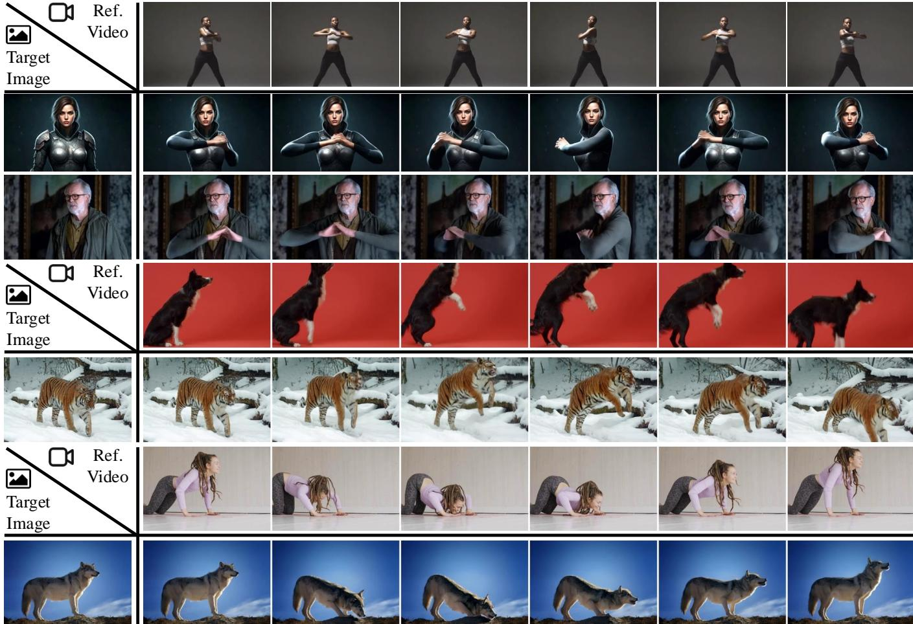
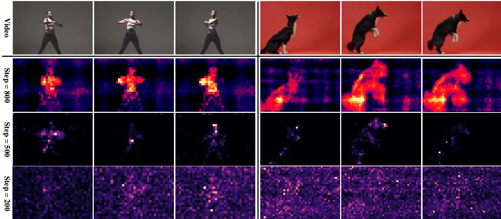
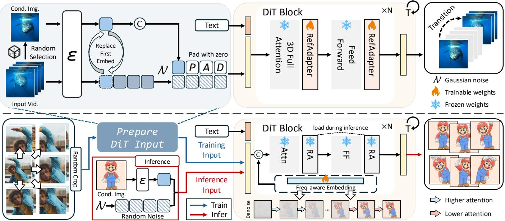
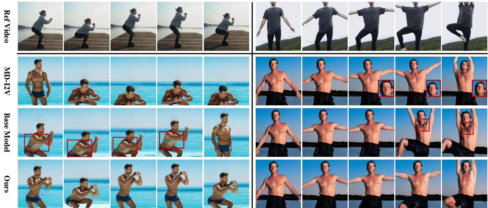
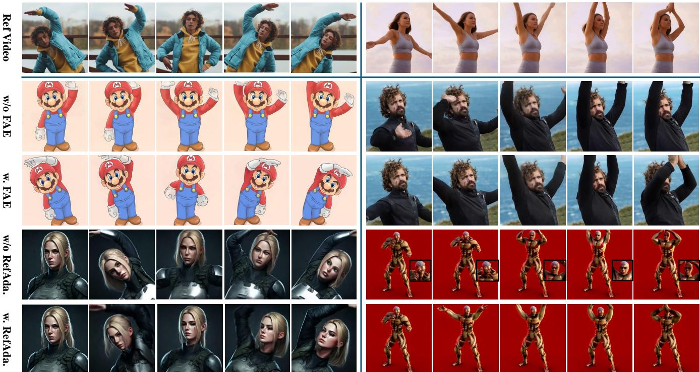
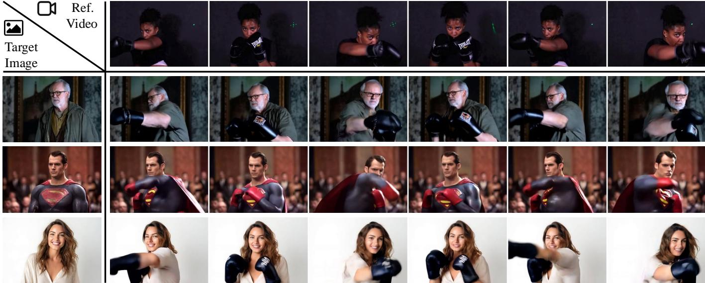
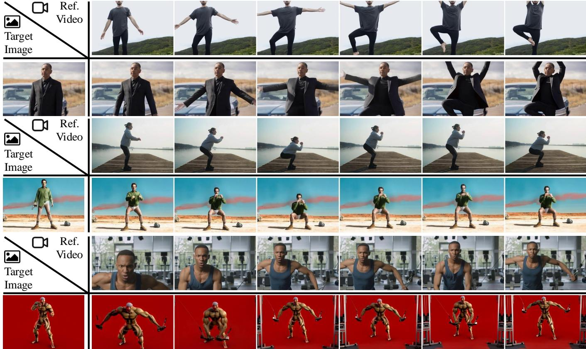
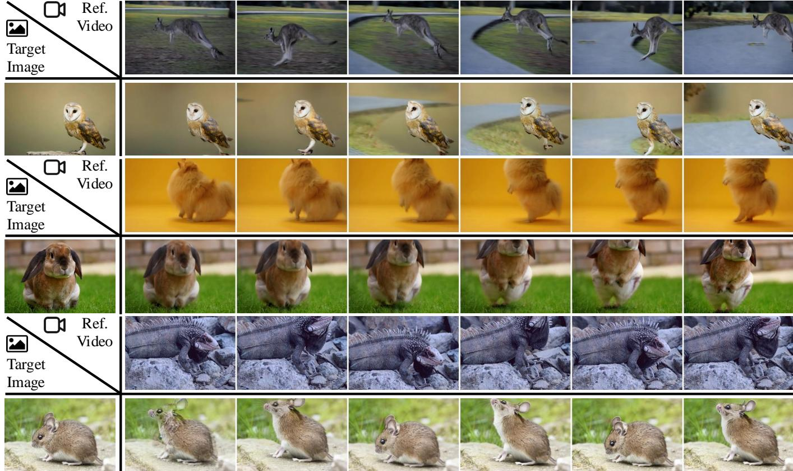
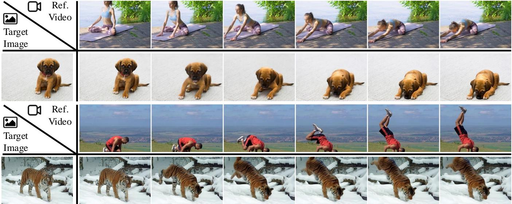
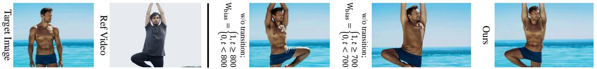

# FlexiAct：面向异构场景的灵活动作控制

张世毅\*, 清华大学深圳国际研究生院，中国 庄俊豪\*, 清华大学深圳国际研究生院，中国 张照洋†, 腾讯ARC实验室，中国 单莹†, 腾讯ARC实验室，中国 唐焱松‡, 清华大学深圳国际研究生院，中国

  
.

动作定制涉及生成视频，其中主体执行由输入控制信号指示的动作。目前的方法使用基于姿态或全局运动的定制，但受到空间结构（如布局、骨架和视角一致性）的严格限制，降低了在多样主体和场景中的适应性。为克服这些限制，我们提出了FlexiAct，它可以将动作从参考视频转移到任意目标图像。与现有方法不同，FlexiAct允许参考视频与目标图像之间布局、视角和骨架结构的变化，同时保持身份一致性。实现这一点需要精准的动作控制、空间结构适应和一致性保持。为此，我们引入了RefAdapter，这是一种轻量级的图像条件适配器，擅长空间适应和一致性保持，在平衡外观一致性和结构灵活性方面超越了现有方法。此外，基于我们的观察，去噪过程在不同时间步对运动（低频）和外观细节（高频）的关注程度各异。因此，我们提出了FAE（频率感知动作提取），与现有依赖独立时空架构的方法不同，FAE在去噪过程中直接实现动作提取。实验表明，我们的方法有效地将动作转移到具有不同布局、骨架和视角的主体上。我们释放了我们的代码和模型权重，以支持FlexiAct的进一步研究。CCS 概念：$\cdot$ 计算方法 计算机视觉。附加关键词和短语：人工智能生成内容、计算机视觉、视频定制。

# ACM 引用格式：

Shiyi Zhang\*, Junhao Zhuang, Zhaoyang Zhang, Ying Shan, 和 Yansong Tang. 2025. FlexiAct: 面向异构场景中的灵活动作控制. 在计算机图形学与交互技术特别兴趣小组会议论文集（SIGGRAPH 会议论文 '25），2025年8月10日至14日，加拿大不列颠哥伦比亚省温哥华. ACM, 纽约, NY, 美国, 11 页. https://doi.org/10.1145/3721238.3730683

# 1 引言

动作转移涉及将特定动作应用于目标对象，广泛用于电影、游戏和动画中。然而，这通常需要大量的财务和人力资源。例如，专业动作捕捉系统的成本可达数万美元，并且需要专业技术人员。同样，以每秒12帧的速度制作30秒的动画可能需要六位专业动画师大约20个工作日。这些高昂的成本带来了显著的挑战，限制了许多潜在创作者的参与。

针对这些局限性，已经进行了显著努力以实现视频生成中的运动控制，这些努力大致可以分为两种主要方法：（1）使用姿态和深度图等信号的预定义信号方法，如 AnymateAnyone $\left[ \mathrm { H u } \ 2 0 2 4 \right]$ 和 StableAnimator [Tu et al. 2024b]；（2）全局运动方法，如 Motion Director [Zhao et al. 2023] 和 Motion Inversion [Wang et al. 2024b]。尽管取得了进展，这些方法仍表现出显著的局限性。预定义信号方法需要目标图像和参考视频之间在空间结构（例如形状、骨架、视点）上的严格对齐，这在现实场景中往往不可行。同时，它们还难以获取非人类对象的姿态信息。相反，全局运动方法通常生成固定布局的运动，不能跨不同主题转移运动。一些方法 [Zhao et al. 2023] 针对动画采用特定身份的低秩适应（LoRA）[Hu et al. 2021]，但在外观一致性和灵活性方面遇到困难。为此，我们提出了 FlexiAct，一个用于异构场景灵活动作定制的图像到视频（I2V）框架。给定一个参考视频和任意目标图像，我们的方法在不对齐布局、形状或视点的情况下，将参考视频中的动作转移到目标图像，同时保留动作动态和外观细节。FlexiAct 基于 CogVideoXI2V [Yang et al. 2024]，进行两阶段训练，涉及两个新组件：RefAdapter 和频率感知动作提取（FAE），解决以下挑战：（1）空间结构适应：将动作适应于具有不同姿态、布局或视点的目标图像。（2）精确的动作提取和控制：准确解耦并复制来自参考视频的动作。RefAdapter 解决了第一个挑战，它是一种图像条件架构，能够根据输入图像生成视频。它结合了 I2V 框架的准确性与条件注入架构（如 IP-Adapter [Ye et al. 2023a]）的灵活性，确保视频与条件图像之间的外观一致性，同时避免对第一帧视频的严格限制。这使得 FlexiAct 能够使用任意帧作为图像条件，将参考运动适应于各种空间结构。RefAdapter 只需较低的训练成本，微调一小组 LoRA，避免了 ReferenceNet $\left[ \mathrm { H u } \ 2 0 2 4 \right]$ 和 ControlNet [Zhang et al. 2023] 中的大量参数复制。为了实现精确的动作控制，我们提出了频率感知动作提取（FAE）。该方法引入一组可学习嵌入，在训练过程中捕获来自参考视频的纠缠视频信息。如图 2 所示，我们观察到这些嵌入在去噪时间步中动态调整其对不同频率分量的关注。具体而言，它们在早期时间步优先关注运动信息（低频特征），而在后期时间步则转向外观细节（ 高频特征）。利用这一特性，FAE 在去噪过程中直接执行动作提取，通过调节不同时间步的注意力权重，消除了对单独时空架构的需求。为了验证 FlexiAct 的有效性，我们为异构场景建立了基准。实验表明 FlexiAct 灵活且通用的动作转移能力。如图 1 所示，FlexiAct 能够准确地将行动从参考视频转移到具有不同布局、视点、形状，甚至领域的对象，同时保持外观一致性。总之，我们的论文做出了以下关键贡献：•我们提出了 FlexiAct，这是一种灵活的动作转移方法，能够先将参考动作适应于具有多样空间结构的任意对象，同时确保动作和外观一致性。我们介绍了 RefAdapter ，它通过少量可训练参数实现空间结构适应和外观一致性。我们提出了频率感知动作提取，该方法在抽样期间精确提取动作并控制视频合成。我们的广泛实验展示了 FlexiAct 在各种场景中的能力，包括不同对象和领域。

# 2 相关工作

# 2.1 全球运动定制

全球运动定制关注于将参考视频中的整体运动动态（例如摄像机移动、物体轨迹和动作）转移到生成具有一致全球运动模式的视频中。[Jeong et al. 2024, 2023; Ling et al. 2024; Yatim et al. 2023; Zhao et al. 2023]。该任务的挑战在于有效提取参考视频中的运动。最近的研究如运动导演 [Zhao et al. 2023] 通过采用时空 LoRA [Hu et al. 2021] 实现了外观和运动的解耦。同时，扩散运动转移 [Yatim et al. 2023] 在推理过程中通过手工设计的损失函数提取运动。另一方面，视频运动定制 [Jeong et al. 2023] 将运动直接编码到文本到视频模型中。运动反转 [Wang et al. 2024b] 引入了两种嵌入类型以解耦外观和运动。然而，这些方法大多未能将运动适应特定对象，因为它们主要集中在生成接近参考视频布局的视频。相反，我们提出了一个框架，可以处理异构场景中的动作转移。此外，受到 [Lin et al. 2024; Lu et al. 2024; Qiu et al. 2023; Si et al. 2024; Wu et al. 2023b] 中关于噪声调度的见解以及我们对不同去噪时间步的观察的启发，我们提出了第一个基于去噪过程的动作提取框架。

# 2.2 基于预定义信号的动作定制

基于预定义信号（如姿势、深度和边缘）进行的动作定制方法，将这些信号的运动转移到目标图像以进行动画制作[Esser et al. 2023；He et al. 2022；Wang et al. 2023d]。它们集中于如何通过预定义信号精确控制具有相同空间结构的对象。早期的方法[Huang et al. 2021；Siarohin et al. 2019, 2021]主要利用GANs[Goodfellow et al. 2020]进行参考动画。近年来的进展转向了扩散模型，Disco[Wang et al. 2024a]开创性地推动了这一转变，用于图像动画。随后的研究，如MagicAnimate[Xu et al. 2024]和AnimateAnyone[Hu 2024]，采用ReferenceNet和姿势网络来解耦姿势和外观建模。进一步的创新包括Champ[Zhu et al. 2024]，它整合了3D SMPL信号以增强可控性，以及Unianimate[Wang et al. 2024c]，它将Mamba[Dao 和 Gu 2024]引入扩散模型以提高效率。此外，MimicMotion[Zhang et al. 2024a]引入区域损失以减轻失真，而ControlNeXt[Pang et al. 2024]则用轻量级卷积基础姿势网络替代了计算密集型的ControlNet[Zhang et al. 2023]。然而，这些方法仍然在很大程度上依赖于预定义信号，当目标图像和参考视频存在显著空间差异（例如形状或姿势的变化）时，这限制了它们的有效性。此外，在非人类场景中，这些方法也面临挑战，预定义运动信号往往不可用或难以获得。相比之下，我们的方法不依赖于带有许多约束的预定义信号，使其能够处理更一般的场景，例如在具有不同形状、骨架、视角甚至跨域的对象之间转移动作。2.3 通过条件注入定制视频生成 随着文本到视频模型的进展[Bar-Tal et al. 2024；Blattmann et al. 2023；Brooks et al. 2024；Chen et al. 2023b, 2024；

根据Esser等（2023）；Guo等（2023）；Ma等（2024）；Wang等（2023c,b,a）；Yang等（2024）；Yuan等（2024）；Zhang等（2024b）；Zhou等（2024），定制视频生成已成为一个关键且高度活跃的研究课题。在这些方法中，有些侧重于通过条件注入将控制信号注入视频生成过程，通常可以分为两类：一类基于交叉注意力注入，例如IP-Adapter[Ye等，2023b]；另一类基于模块复制以进行逐层注入，例如ReferenceNet $\left[ \mathrm{H u } 2 0 2 4 \right]$。虽然交叉注意力方法轻量级，但由于粗粒度表示（例如，CLIP图像特征[Radford等，2021年]）通常无法确保外观一致性。模块复制使得更细致的控制成为可能，但由于参数复制而带来高昂的训练成本。相比之下，我们的RefAdapter基于I2V模型，实现了ReferenceNet级别的细粒度外观控制，同时仅需要较少的训练参数。此外，RefAdapter还可以减少I2V模型对首帧的严格依赖。

# 3 方法

# 3.1 概述

如图3所示，FlexiAct基于CogVideoX-I2V进行两阶段训练，涉及两个组件：RefAdapter和频率感知动作提取（FAE）。RefAdapter促进动作适应于具有不同空间结构的对象，同时保持外观一致性。FAE动态调整不同去噪时间步长下的注意力权重，以实现对频率感知嵌入的有效动作提取。这两个组件分别训练，以确保动作提取不会干扰RefAdapter的一致性保持。第3.1节介绍了FlexiAct的基础模型。第3.3节介绍了RefAdapter及其训练方法。第3.4节详细说明了FAE的训练和推理过程。最后，第3.5节概述了FlexiAct的训练和推理流程。

  
dynamically adjusted based on timesteps, facilitating action extraction.

# 3.2 基础图像到视频扩散模型

我们使用 CogVideoX-I2V [Yang et al. 2024] 作为我们的基础图像到视频（I2V）模型。CogVideoX-I2V 是一种基于 MMDiT 的 [Esser et al. 2024] 视频扩散模型，该模型在潜在空间中操作。给定一个图像 $\mathbf{I} \in \mathbb{R}^{H \times W \times 3}$，CogVideoX-I2V 生成一个视频 $\mathbf{V} \in \mathbb{R}^{T \times H \times W \times 3}$。该模型将图像和视频条件化到潜在空间中。对于视频输入，3D VAE 编码器（图 3 中的 $\epsilon$）同时压缩时间和空间信息，得到 $L_{video} \in \mathbb{R}^{\frac{T}{4} \times \frac{H}{8} \times \frac{W}{8} \times C}$，其中 $C$ 表示通道数。对于图像输入（$T = 1$），编码器 $L_{image} \in \mathbb{R}^{1 \times \frac{H}{8} \times \frac{W}{8} \times C}$，然后在时间维度上进行零填充，以匹配 $L_{video}$ 的形状 $\begin{array}{r}{(1 \stackrel{-}{ }\frac{T}{4}.}\end{array}$ 在推理过程中，这个填充后的 $L_{image}$ 被 $N \in \mathbb{R}^{\frac{T}{4} \times \frac{H}{8} \times \frac{W}{8} \times C}$ 按通道维度局部化，以进行后续的去噪过程。在训练过程中，真实视频的第一帧作为输入图像；它的填充 $L_{image}$ 与有噪声的 $L_{video}$ 在通道维度上进行连接，以预测所添加的噪声。这个过程通过最小均方误差（MSE）损失进行优化，损失函数计算添加噪声与预测噪声之间的一致性，符合经典的扩散模型 [Ho et al. 2020]。

# 3.3 参考适配器

图3的上部分展示了RefAdapter的训练过程。我们注意到，直接使用I2V进行空间结构适配是具有挑战性的，因为：(1) 动作提取过程妨碍了I2V模型的一致性保持，以及(2) I2V是一个强约束的图像条件框架。在训练过程中，I2V使用第一个视频帧作为条件图像，确保视频一致性，但如果初始空间结构与参考视频不同，可能会阻碍动作的平滑转移。

为了解决这个问题，我们在训练过程中通过使用未编辑视频中随机采样的一帧作为条件图像，来引入条件图像与初始空间结构之间的差距。具体而言，我们提出了RefAdapter，该模块在CogVideoX-I2V的MMDiT层中注入了LoRA。RefAdapter在[Ju et al. 2024]的42,000个视频上进行了一次性40,000步的训练。RefAdapter的训练过程大部分遵循CogVideoXI2V，但有以下几个关键区别：（1）条件图像是从整个未剪辑视频中随机选择，而不是第一帧，从而最大化空间结构的差异。（2）我们用$L _ { i m a g e }$替换了$L _ { v i d e o }$在时间维度上的第一个嵌入，使得模型可以将第一个嵌入作为指导视频生成的参考，而不是将其限制为视频的起始点。如果不进行此替换，生成视频的初始状态将被限制为匹配条件图像。

# 3.4 频率感知的动作提取

为了从参考视频中提取动作信息，一种简单的方法是训练运动嵌入来适应运动信息，这类似于Genie [Bruce等，2024]或文本反演[Gal等，2022]。然而，我们对这种方法的初步尝试产生了次优结果。受到[Lin等，2024；Lu等，2024；Qiu等，2023；Si等，2024；Wu等，2023b]的启发，我们深入研究了嵌入与动作信息在去噪过程中的关系。通过检查不同去噪时间步之间的运动嵌入与视频词元的注意力图，如图2所示，我们观察到在早期阶段，嵌入主要集中于低频动作信息，随后逐渐将注意力转向高频细节。基于这一洞察，我们提出了频率感知的动作提取（Frequency-aware Action Extraction）。具体来说，图3的下部分展示了FAE的训练和推理过程。我们为每个参考视频训练频率感知嵌入，该嵌入包括连接到MMDiT层输入的可学习参数。这种训练与CogVideoX-I2V不同，通过对输入视频进行随机裁剪，以防止频率感知嵌入集中于参考视频的布局。在此训练过程中，RefAdapter没有加载，以保护其条件能力。训练后，频率感知嵌入捕捉了参考视频中的运动和外观。在推理过程中，FAE提取动作信息并将其适应于目标图像。如图2所示，频率感知嵌入与视频词元之间的注意力图表明，在较大的时间步（例如，步骤$= 8 0 0$）时，嵌入专注于运动信息（低频），对主体的移动部分给予了高度关注。在中间时间步（例如，步骤$\scriptstyle \phantom { = } 5 0 0$）时，注意力转向了主体的细粒度细节。在后期时间步（例如，步骤$\scriptstyle 1 = 2 0 0$）时，注意力分布于整个图像，显示出对背景等全局细节的关注。基于这一观察，在推理过程中，我们在较大型时间步上增加视频词元在频率感知嵌入中的注意力权重，而在其他时间步上保持原始权重。这增强了生成视频感知和复制参考视频运动的能力。FAE的重加权策略可以表述为：

$$
W _ { b i a s } = \left\{ \begin{array} { l l } { \alpha , } & { t _ { l } \le t \le T } \\ { \displaystyle \frac { \alpha } { 2 } \left[ \cos \left( \displaystyle \frac { \pi } { t _ { h } - t _ { l } } ( x - t _ { l } ) \right) + 1 \right] , } & { t _ { h } \le t < t _ { l } } \\ { 0 , } & { 0 \le t < t _ { h } } \end{array} \right.
$$

其中 $W_{ \mathrm { b i a s } }$ 表示应用于原始注意力权重的偏置值。$t$ 表示去噪时间步。参数 $\alpha$ 控制偏置的强度，而 $t_{ l }$ 和 $t_{ h }$ 分别表示低频和高频时间步。在这些时间步之间采用了一个过渡函数，以平滑地将 $W_{ \mathrm { b i a s } }$ 从低频时间步逐渐变化到高频时间步。在推理过程中，视频标记对频率感知嵌入的注意力权重动态调整为 $W_{ \mathrm { a t t n } } = W_{ o r i } + W_{ \mathrm { b i a s } }$，适用于所有 DiT 层。实验结果表明，注意力再加权策略提高了生成视频重现参考动作的能力。实际上，我们设定 $\alpha = 1$，$t_{ h } = 700$，和 $t_{ l } = 800$，并在图 11 中展示了过渡函数对生成结果的影响。没有过渡函数时，在 $t = 700$ 处改变偏置会导致模型从参考视频中学习外观信息（例如，图 11 中的服装），而在 $t = 800$ 处改变偏置则会导致运动不准确。这表明在 $t = 700$ 和 $t = 800$ 之间存在过渡过程是实现外观与运动之间平衡的必要条件。

# 3.5 FlexiAct 的训练与推理流水线

如图3所示，我们首先在一个更广泛的数据集上训练RefAdapter（上部）。随后，我们基于单个参考视频训练频率感知嵌入。RefAdapter并不参与该训练过程。在推理阶段，加载RefAdapter，并提供任意目标图像。FAE

  
Fig. 4. Results of transferring "turning" action to the target image using the pose-based method and the animation version of the global motion method. dynamically adjusts the generated video's attention to Frequencyaware Embedding according to denoising timesteps, transferring actions from the reference video to the target image.

# 4 实验

# 4.1 实施细节

评估数据集。我们在一个包含250对视频-图像配对的评估数据集上进行实验，涵盖25种不同的动作类别。每个动作被转移到10张不同的目标图像上，涉及广泛的人类动作（例如瑜伽、健身锻炼）和动物动作（例如跳跃、奔跑）。目标图像包括真实的人类、动物、动画角色和游戏角色。这种多样性确保我们的数据集涵盖了广泛的场景，从而为我们方法的泛化能力提供了全面的评估。 比较方法。目前，基于预定义信号和全局运动的动作转移方法存在。预定义信号方法对于非人类实体或具有显著骨骼差异的对象效率不高，如图4所示。因此，我们使用最近提出的全局运动转移方法MotionDirector [Tu et al. 2024a]作为我们的基线。为了公平比较，我们在更强的CogVideoX-I2V主干网络上（称为MD-I2V）重新实现了MotionDirector，并使用与我们方法相同的训练设置。此外，我们实现了一个基础模型，通过标准可学习的动作嵌入直接学习动作，而不使用RefAdapter和FAE（称为BaseModel）。 训练细节。针对RefAdapter的训练，我们在Miradata [Ju et al. 2024]上进行了一次性40,000步的训练，学习率为1e-5，批次大小为8，使用AdamW优化器。RefAdapter引入了6600万参数，占CogVideoX-I2V总参数的$5 \%$。频率感知嵌入在每个参考视频上需要1,500到3,000步的训练，具体取决于动作的复杂性。相比之下，Motion Director需要3,000步的时间LoRA和300步的空间LoRA。

# 4.2 定量评估

自动评估。根据[Jeong et al. 2023; Wang et al. 2024b; Yatim et al. 2023]，我们采用文本相似度、运动保真度和时间一致性来评估生成视频的语义准确性、与参考视频的运动对齐程度以及时间连贯性。此外，我们引入外观一致性以评估生成视频与目标图像之间的外观一致性。以下是这些指标的简要概述。

  
image and motion fidelity to the reference video compared to other approaches.

<table><tr><td rowspan="2">Method</td><td colspan="4">Automatic Evaluations</td><td colspan="3">Human Evaluations</td></tr><tr><td>Text Similarity ↑</td><td>Motion Fidelity</td><td>Temporal Consistency</td><td>Appearance Consistency</td><td></td><td>Motion Consistency</td><td>Appearance Consistency</td></tr><tr><td>MD-I2V [Zhao et al. 2023] Base Model</td><td>0.2446</td><td>0.3496</td><td>0.9276</td><td>0.8963</td><td>v.s. Base Model</td><td>47.2 v.s. 52.8</td><td>53.1 v.s. 46.9</td></tr><tr><td>w/o FAE</td><td>0.2541 0.2675</td><td>0.3562 0.3614</td><td>0.9283 0.9255</td><td>0.8951 0.9134</td><td>v.s. Base Model</td><td>- 59.7 v.s. 40.3</td><td>- 76.4 v.s. 23.6</td></tr><tr><td>w/o RefAdapter</td><td>0.2640</td><td>0.3856</td><td>0.9217</td><td>0.9021</td><td>v.s. Base Model</td><td>68.6 v.s. 31.4</td><td>52.2 v.s. 47.8</td></tr><tr><td>Ours</td><td>0.2732</td><td>0.4103</td><td>0.9342</td><td>0.9162</td><td>v.s. Base Model</td><td>79.5 v.s. 20.5</td><td>78.3 v.s. 21.7</td></tr><tr><td></td><td></td><td></td><td></td><td></td><td></td><td></td><td></td></tr></table>

在不结合 RefAdapter 和 FAE 的情况下，采用一组可学习嵌入。${ } ^ { \cdot } p _ { 1 }$ 与 ${ p _ { 2 } } " 表示 $\pmb { \mathit { p } } _ { 1 } \%$ 的第一次方法的结果更受偏好。文本相似度。它通过 CLIP [Radford et al. 2021] 进行框架到文本的相似度计算，反映输出视频与提示之间的语义对齐程度。运动保真度。由 [Yatim et al. 2023] 提出的，利用由跟踪模型 [Karaev et al. 2023] 计算的轨迹，测量未对齐视频中运动轨迹的相似度。时间一致性。它测量视频序列的平滑性和连贯性 [Chen et al. 2023a; Jeong et al. 2023; Wu et al. 2023a; Zhao et al. 2023]，通过输出视频中所有帧对的 CLIP 图像特征的平均相似度来量化。外观一致性。它反映输出视频与目标图像之间的外观一致性，计算为输出视频第一帧与其余帧之间的 CLIP 相似度的平均值。人类评估。根据 [Zhao et al. 2023]，我们进行了一项人类评估，有 5 位评审对每个生成的视频在外观一致性与目标图像和运动一致性与参考视频方面进行了评估。每位参与者比较 50 对随机选择的视频，每对包含一个由随机方法生成的视频和一个由基础模型生成的视频。根据 [Zhao et al. 2023]，所有方法与基础模型进行比较，基础模型由于其与 MD-I2V 的可比性能而成为一个稳固的基线。在表 1 中，${ } ^ { \mathfrak { s } } p _ { 1 }$ 与 $\mathcal { P } 2$ " 表示 $\displaystyle p _ { 1 } \%$ 的第一次方法的结果比 $\mathcal { P } 2 \%$ 第二次方法的结果更受偏好。结果。正如表 1 所示，我们的方法在运动保真度和外观一致性方面显著优于基线方法。这强调了异构场景中动作迁移的挑战，并证明了我们的方法在平衡动作准确性与外观一致性方面的有效性。值得注意的是，我们的运动保真度得分通常低于全局运动任务的得分，因为它们受到布局一致性的影响，而全局运动任务涉及将运动转移到具有相同布局的场景，因此与异构场景中的动作迁移并不直接可比。

# 4.3 定性评估

图5展示了与基线方法的定性比较。MD-I2V在准确复制参考视频的动作方面表现不佳。在第一个示例中，那个男子在下蹲后未能成功站起，手臂的动作与原始视频不匹配。在第二个示例中，他没有像参考中那样抬腿，后续画面中一只眼睛闭合。基线模型在动作准确性和外观一致性方面同样存在问题。在第一个示例中，男子穿上衣服，偏离了原始图像，最终的动作与参考不同。在第二个示例中，他的抬腿动作被夸大，最后画面中出现了类似衣物的褶皱。相比之下，我们的方法在动作准确性和外观一致性方面表现优异。

# 4.4 消融研究

表1和图6展示了我们的消融研究结果。定量数据表明，去除FAE显著降低了运动保真度，突显了其在提高运动生成质量中的作用。定性结果也证实了这一点，当两种不同的动作转移到不同角色时，缺乏FAE会出现不一致性。例如，在一个伸展动作中，角色仅仅抬起手而没有适当的弯曲或伸展，偏离了参考视频。在第二个例子中，类似的不匹配进一步强调了FAE在运动一致性中的重要性。我们还考察了去除RefAdapter的影响。定量结果显示，外观一致性和运动保真度均明显下降，因为RefAdapter确保了对不同空间结构的适应性。没有它，模型难以将动作适应于具有不同空间布局的目标图像，从而削弱了外观一致性。图6中的定性结果支持了这一点：在第一个例子中，角色的面部和衣物之间的差异在使用RefAdapter后得以解决。在第二个例子中，缺乏RefAdapter，输出视频无法完全伸展手臂，手臂保持弯曲，面部细节也存在显著差异，强调了RefAdapter在保持运动和外观一致性方面的作用。

# 5 讨论

在本文中，我们研究了异构场景中的动作迁移，主要难点在于实现具有不同空间结构的主体之间的精确动作迁移，同时保持外观一致性。我们提出了FlexiAct，一种灵活且多功能的方法，超越了现有方法。我们的RefAdapter能够适应各种空间结构，并确保外观一致性，而基于频率的动作提取则允许在去噪过程中精确提取动作。大量实验证明，FlexiAct在不同空间结构和领域之间有效地平衡了动作准确性和外观一致性。尽管实现了动作和外观一致性的精确性，但像[Jeong et al. 2023; Wang et al. 2024b; Yatim et al. 2023; Zhao et al. 2023]一样，我们的方法要求对每个参考视频进行优化。为异构场景开发前馈运动转移方法是未来研究的一个关键方向。致谢。本研究得到了广东省自然科学基金杰出青年学者资助（编号：2025B1515020012）。

  
the reference video.

  
Fig. 8. Examples of human action transfer using FlexiAct.

  
Fig. 9. Examples of action transfer between animals using FlexiAct.

  
Fig. 10. Examples of action transfer from humans to animals using FlexiAct.

  
Fig. 11. Ablation of bias transition.

# REFERENCES

Omer Bar-Tal, Hila Cheter, Omer Tov, Charles Herrmann, Roni Paiss, Shiran Zada, Ariel Ephrat, Junhwa Hur, Guanghui Liu, Amit Raj, et al. 2024. Lumiere: A space-time   
Andreas Blattmann, Robin Rombach, Huan Ling, Tim Dockhorn, Seung Wook Kim, Sanja Fidler, and Karsten Kreis. 2023. Align your Latents: High-Resolution Video Synthesis with Latent Diffusion Models. In Proc. CVPR.   
Tim Brooks, Bill Peebles, Connor Holmes, Will DePue, Yufei Guo, Li Jing, David Schnurr, Joe Taylor, Troy Luhman, Eric Luhman, Clarence Ng, Ricky Wang, and Aditya Ramesh. 2024. Video generation models as world simulators. (2024). https: //openai.com/research/video-generation-models-as-world-simulators   
Jake Bruce, Michael D Dennis, Ashley Edwards, Jack Parker-Holder, Yuge Shi, Edward Hughes, Matthew Lai, Aditi Mavalankar, Richie Steigerwald, Chris Apps, et al. 2024. Genie: Generative interactive environments. In Forty-first International Conference on Machine Learning.   
Haoxin Chen, Menghan Xia, Yingqing He, Yong Zhang, Xiaodong Cun, Shaoshu Yang, Jinbo Xing, Yaofang Liu, Qifeng Chen, Xintao Wang, et al. 2023b. VideoCrafter1: Open Diffusion Models for High-Quality Video Generation. arXiv preprint arXiv:2310.19512 (2023).   
Haoxin Chen, Yong Zhang, Xiadong Cun, Menghan Xia, Xinto Wang, Chao Weng, video diffusion models. In Proc. CVPR. 7310-7320.   
When J Wu, an Xie, He Wu, Js Xin i, Xue Xio Lin. 2023a. Control-A-Video: Controllable Text-to-Video Generation with Diffusion Models. arXiv preprint arXiv:2305.13840 (2023).   
Tri Dao and Albert Gu. 2024. Transformers are SSMs: Generalized Models and Efficient Algorithms Through Structured State Space Duality. In ICML.   
sis Germanidis. 2023. Structure and content-guided video synthesis with diffusion models. In Proc. ICCV. 73467356.   
Patrick Esser, Sumith Kulal, Andreas Blattman, Rahim Entezari, Jonas Müller, Harry Saini, Yam Levi, Dominik Lorenz, Axel Sauer, Frederic Boesel, et al. 2024. Scalinternational conference on machine learning.   
Rinon Gal, Yuval Alaluf, Yuval Atzmon, Or Patashnik, Amit H Bermano, Gal Chechik, Danl CeO    o o lizi image generation using textual inversion. arXiv preprint arXiv:2208.01618 (2022).   
Ian Goodfellow, Jean Pouget-Abadie, Mehdi Mirza, Bing Xu, David Warde-Farley, Sherjil Ozair, Aaron Courville, and Yoshua Bengio. 2020. Generative adversarial networks. Commun. ACM (2020).   
Yuwei Guo, Ceyuan Yang, Anyi Rao, Yaohui Wang, Yu Qiao, Dahua Lin, and Bo Dai. 2023. Animatediff: Animate your personalized text-to-image diffusion models without specific tuning. arXiv preprint arXiv:2307.04725 (2023).   
Yingqing He, Tianyu Yang, Yong Zhang, Ying Shan, and Qifeng Chen. 2022. LaarXiv:2211.13221 [cs.CV]   
Jonathan Ho, Ajay Jain, and Pieter Abbeel. 2020. Denoising diffusion probabilistic models. Proc. NeurIPS 33 (2020), 68406851.   
Hu, Y eilWal Zleu e , W models. arXiv preprint arXiv:2106.09685 (2021).   
Li Hu. 2024. Animate anyone: Consistent and controllable image-to-video synthesis for character animation. In Proc. CVPR. 81538163.   
Zhichao Huang, Xintong Han, Jia Xu, and Tong Zhang. 2021. Few-shot human motion transfer by personalized geometry and texture modeling. In CVPR.   
Hyeonho Jeong, Jinho Chang, Geon Yeong Park, and Jong Chul Ye. 2024. DreamMotion: -Tim  Sco sto  oo dn preprint arXiv:2403.12002 (2024).   
Hyeonho Jeong, Geon Yeong Park, and Jong Chul Ye. 2023. VMC: Video Motion Customization using Temporal Attention Adaption for Text-to-Video Diffusion Models.arXiv preprint arXiv:2312.0085 0   
Xuan Ju, Yiming Gao, Zhaoyang Zhang, Ziyang Yuan, Xintao Wang, Ailing Zeng, Yu Xiong, Qiang Xu, and Ying Shan. 2024. Miradata: A large-scale video dataset with long durations and structured captions. arXiv preprint arXiv:2407.06358 (2024).   
Nikita Karaev, Ignacio Rocco, Benjamin Graham, Natalia Neverova, Andrea Vedaldi, and Christian Rupprecht. 2023. Cotracker: It is better to track together. arXiv preprint arXiv:2307.07635 (2023).   
Shanchuan Lin, Bingchen Liu, Jiashi Li, and Xiao Yang. 2024. Common diffusion noise schedules and sample steps are flawed. In Proceedings of the IEEE/CVF winter conference on applications of computer vision. 54045411.   
Pengyang Ling, Jiazi Bu, Pan Zhang, Xiaoyi Dong, Yuhang Zang, Tong Wu, Huaian C  Wag, d  Ji  Moto Tree Moi Con or Controllable Video Generation. arXiv preprint arXiv:2406.05338 (2024).   
Yu Lu, Yuanzhi Liang, Linchao Zhu, and i Yang. 2024. Freelong: Training-free lo i on wh eblen oal tton. arYi:2407 10018 (2024)   
Xin Ma, Yaohui Wang, Gengyun Jia, Xinyuan Chen, Ziwei Liu, Yuan-Fang Li, Cunjian Chen, and Yu Qiao. 2024. Latte: Latent diffusion transformer for video generation. arXiv preprint arXiv:2401.03048 (2024).   
Bohao Peng, Jian Wang, Yuechen Zhang, Wenbo Li, Ming-Chang Yang, and Jiaya Jia. 2024. ControlNeXt: Powerful and Efficient Control for Image and Video Generation. arXiv preprint arXiv:2408.06070 (2024).   
Haonan Qiu, Menghan Xia, Yong Zhang, Yingqing He, Xintao Wang, Ying Shan, and Ziwe Liu. 2023. Freenoise: Tuning-free longervideodiffusion via noise rescheduling. arXiv preprint arXiv:2310.15169 (2023).   
Alec Radford, Jong Wook Kim, Chris Hallacy, Aditya Ramesh, Gabriel Goh, Sandhini Agarwal, Girish Sastry, Amanda Askell, Pamela Mishkin, Jack Clark, et al. 2021. Learning transferable visual models from natural language supervision. In Proc. ICML. PMLR, 87488763.   
Chenyang Si, Ziqi Huang, Yuming Jiang, and Ziwei Liu. 2024. Freeu: Free lunch in diffusion u-net. In Proceedings of the IEEE/CVF Conference on Computer Vision and Pattern Recognition. 47334743.   
Aliaksandr Siarohin, Stéphane Lathuilière, Sergey Tulyakov, Elisa Ricci, and Nicu Sebe. 2019. First Order Motion Model for Image Animation. In NeurIPS.   
Aliaksandr Siarohin, Oliver J Woodford, Jian Ren, Menglei Chai, and Sergey Tulyakov. 2021. Motion representations for articulated animation. In CVPR.   
San u,  ai Zhi-iCheg, Han Hu, Xinog Han, Zux Wu, andu-Gng Jiang. 2024a. Motioneditor: Editing video motion via content-aware diffusion. In CVPR.   
Shuyuan Tu, Zhen Xing, Xintong Han, Zhi-Qi Cheng, Qi Dai, Chong Luo, and Zuxuan Wu. 2024b. StableAnimator: High-Quality Identity-Preserving Human Image Animation. arXiv preprint arXiv:2411.17697 (2024).   
Jiuniu Wang, Hangjie Yuan, Dayou Chen, Yingya Zhang, Xiang Wang, and Shiwei Zhang. 2023c. Modelscope text-to-video technical report. arXiv preprint arXiv:2308.06571 (2023).   
Yijun Li, and Yingcong Chen. 2024b. Motion inversion for video customization. arXiv preprint arXiv:2403.20193 (2024).   
, Hanwang Zhang, Zicheng Liu, and Lijuan Wang. 2024a. Disco: Disentangled control for realistic human dance generation. In CVPR.   
Wenjing Wang, Huan Yang, Zixi Tuo, Huiguo He, Junchen Zhu, Jianlong Fu, and Jiaying Liu. 2023b. VideoFactory: Swap Attention in Spatiotemporal Diffusions for eo Xi:0   
Xiang Wang, Hangjie Yuan, Shiwei Zhang, Dayou Chen, Jiuniu Wang, Yingya Zhang, Yujun Shen, Deli Zhao0, and Jingren Zhou. 2023d. VideoComposer: Compositional Video Synthesis with Motion Controllability. arXiv preprint arXiv:2306.02018 (2023).   
Xa Wg hi Zaai o g X Zou, Y a, Luxin Yan, and Nong Sang. 2024c. UniAnimate: Taming Unified Video Diffusion Models for Consistent Human Image Animation. arXiv preprint arXiv:2406.01188 (2024).   
Yaohui Wang, Xinyuan Chen, Xin Ma, Shangchen Zhou, Ziqi Huang, Yi Wang, Ceyuan Yan, Yinan He, Jiashuo Yu, Peiqing Yang, et al. 2023a. LAVIE: High-Quality Video Generation with Cascaded Latent Diffusion Models. arXiv preprint arXiv:2309.15103 (2023).   
Jay Zhangjie Wu, Yixiao Ge, Xintao Wang, Stan Weixian Lei, Yuchao Gu, Yufei Shi, Wynne Hsu, Ying Shan, Xiaohu Qie, and Mike Zheng Shou. 2023a. Tune-a-video: One-shot tuning of image diffusion models for text-to-video generation. In Proceedings of the IEEE/CVF International Conference on Computer Vision. 76237633.   
Tianxing Wu, Chenyang Si, Yuming Jiang, Ziqi Huang, and Ziwei Liu. 2023b. Freeinit: (2023).   
Zhongcong Xu, Jianfeng Zhang, Jun Hao Liew, Hanshu Yan, Jia-Wei Liu, Chenxu Zhang, Jiashi Feng, and Mike Zheng Shou. 2024. Magicanimate: Temporally consistent human image animation using diffusion model. In CVPR.   
Zhuoyi Yang, Jiayan Teng, Wendi Zheng, Ming Ding, Shiyu Huang, Jiazheng Xu, Yuanming Yang, Wenyi Hong, Xiaohan Zhang, Guanyu Feng, et al. 2024. CogVideoX: Text-to-Video Diffusion Models with An Expert Transformer. arXiv preprint arXiv:2408.06072 (2024).   
Danah Yatim, Rafail Fridman, Omer Bar Tal, Yoni Kasten, and Tali Dekel. 2023. SpaceTime Diffusion Features for Zero-Shot Text-Driven Motion Transfer. arXiv preprint arXiv:2311.17009 (2023).   
Hu Ye, Jun Zhang, Sibo Liu, Xiao Han, and Wei Yang. 2023a. IP-Adapter: Text Comarxiv:2308.06721 (2023).   
Hu Ye, Jun Zhang, Sibo Liu, Xiao Han, and Wei Yang. 2023b. Ip-adapter: Text compatible image prompt adapter for text-to-image diffusion models." arXiv preprint arXiv:2308.06721 (2023).   
Hangjie Yuan, Shiwei Zhang, Xiang Wang, Yujie Wei, Tao Feng, Yining Pan, Yingya Z, Zi L, Sm Aba, d Do Ni. 0. InscVdo ins video diffusion models with human feedback. In Proc. CVPR. 64636474.

David Junhao Zhang, Jay Zhangjie Wu, Jia-Wei Liu, Rui Zhao, Lingmin Ran, Yuchao Gu, Difei Gao, and Mike Zheng Shou. 2024b. Show-1: Marrying pixel and latent diffusion models for text-to-video generation. Int. J. Comput. Vis. (2024), 115. Lvmin Zhang, Anyi Rao, and Maneesh Agrawala. 2023. Adding conditional control to text-to-image diffusion models. In Proc. ICCV. 38363847. Yuang Zhang, Jiaxi Gu, Li-Wen Wang, Han Wang, Junqi Cheng, Yuefeng Zhu, and Fangyuan Zou. 2024a. Mimicmotion: High-quality human motion video generation with confidence-aware pose guidance. arXiv preprint arXiv:2406.19680 (2024).

Rui Zhao, Yuchao Gu, Jay Zhangjie Wu, David Junhao Zhang, Jiawei Liu, Weijia Wu, Jussi Keppo, and Mike Zheng Shou. 2023. MotionDirector: Motion Customization of Text-to-Video Diffusion Models. arXiv:2310.08465 [cs.CV]   
Yuan Zhou, Qiuyue Wang, Yuxuan Cai, and Huan Yang. 2024. Allegro: Open the Black Box of Commercial-Level Video Generation Model. arXiv preprint arXiv:2410.15458 (2024).   
Shenhao Zhu, Junming Leo Chen, Zuozhuo Dai, Yinghui Xu, Xun Cao, Yao Yao, Hao Zhu, and Siyu Zhu. 2024. Champ: Controllable and Consistent Human Image Animation with 3D Parametric Guidance. In EECV.