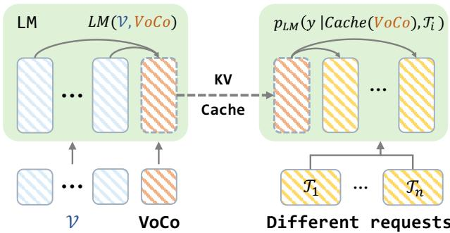

# 1. 论文基本信息

## 1.1. 标题

**VoCo-LLaMA: Towards Vision Compression with Large Language Models**

中文可译为：**VoCo-LLaMA：利用大语言模型实现视觉压缩**

论文标题直接点明了研究的核心：使用<strong>大语言模型 (Large Language Models, LLMs)</strong> 作为工具，来解决<strong>视觉信息压缩 (Vision Compression)</strong> 的问题。`VoCo` 是作者提出的新概念，即 <strong>视觉压缩 (Vision Compression)</strong> 的缩写。

## 1.2. 作者

- <strong>Xubing Ye (叶旭冰)</strong>: 清华大学深圳国际研究生院
- <strong>Yukang Gan (甘宇亢)</strong>: 腾讯 PCG ARC 实验室
- <strong>Xiaoke Huang (黄小可)</strong>: 加州大学圣克鲁兹分校
- <strong>Yixiao Ge (葛艺潇)</strong>: 腾讯 PCG ARC 实验室 (通讯作者)
- <strong>Yansong Tang (唐雁嵩)</strong>: 清华大学深圳国际研究生院 (通讯作者)

  该研究由清华大学和腾讯公司的研究人员主导，通讯作者分别来自学术界和工业界，表明这项工作兼具学术创新和产业应用潜力。

## 1.3. 发表期刊/会议

该论文是一篇预印本 (Preprint)，提交到了 arXiv 平台。arXiv 是一个开放获取的学术论文存档网站，研究者可以在正式同行评审前分享他们的研究成果。虽然预印本未经正式的同行评审，但它是快速传播最新研究思想的重要渠道。

## 1.4. 发表年份

2024年6月18日。

## 1.5. 摘要

多模态大模型 (Vision-Language Models, VLMs) 在处理高分辨率图像和视频时，常受到有限<strong>上下文窗口 (context window)</strong> 和高昂计算成本的限制。<strong>视觉压缩 (Vision compression)</strong> 通过减少视觉信息的词元 (token) 数量来缓解此问题。然而，以往的方法通常使用**外部模块**来压缩视觉词元，这会导致视觉信息丢失，并且没有充分利用大语言模型 (LLM) 自身对视觉词元的理解能力。

为解决此问题，论文提出了 **VoCo-LLaMA**，这是**首个利用 LLM 自身能力进行视觉压缩的方法**。具体而言，该方法在视觉指令微调阶段引入了特殊的<strong>视觉压缩 (Vision Compression, VoCo) 词元</strong>，并利用<strong>注意力蒸馏 (attention distillation)</strong> 的思想，将 LLM 理解原始视觉词元的方式“蒸馏”到其对 VoCo 词元的处理过程中。

**主要成果包括：**
1.  **高压缩率与性能保持**: VoCo-LLaMA 实现了高达 **576倍** 的压缩率，同时性能损失极小，推理过程中的浮点运算量 (FLOPs) 最多可减少 **94.8%**，推理时间最多可加速 **69.6%**。
2.  **视频理解能力**: 通过对视频帧的压缩词元序列进行连续训练，VoCo-LLaMA 能够理解时间上的关联性，在多个主流的视频问答基准测试上超越了以往方法。
3.  **应用前景**: 该方法为充分利用 VLM 的上下文窗口提供了一条有前景的路径，有助于开发更具扩展性的多模态应用。

## 1.6. 原文链接

- <strong>原文链接 (arXiv):</strong> https://arxiv.org/abs/2406.12275
- **PDF 链接:** https://arxiv.org/pdf/2406.12275v2.pdf
- **发布状态:** 预印本 (Preprint)，版本为 v2。

# 2. 整体概括

## 2.1. 研究背景与动机

### 2.1.1. 核心问题

当前的大型视觉语言模型 (VLMs)，如 LLaVA，在处理视觉输入时，通常会将图像或视频帧分割成许多小图块 (patches)，然后将每个图块编码成一个或多个<strong>视觉词元 (vision tokens)</strong>。这种做法虽然能让模型捕捉丰富的细节，但也带来了两个严峻的挑战：

1.  <strong>上下文窗口瓶颈 (Context Window Bottleneck):</strong> 大语言模型 (LLMs) 的上下文窗口长度是有限的。当输入高分辨率图像或长视频时，成千上万的视觉词元会迅速占满这个窗口，留给文本指令或对话的空间所剩无几。例如，LLaVA-1.6 处理一张 `672x672` 分辨率的图像会产生 2880 个视觉词元，这已超过很多模型上下文长度的一半。
2.  <strong>高计算成本 (High Computational Cost):</strong> LLM 的核心组件——注意力机制 (Attention Mechanism) 的计算复杂度与输入序列长度的平方成正比。大量的视觉词元会急剧增加模型的计算量（FLOPs）、内存占用（特别是 KV 缓存）和推理时间，使得部署和使用成本高昂。

### 2.1.2. 现有研究的空白 (Gap)

为了解决上述问题，研究人员提出了<strong>视觉压缩 (vision compression)</strong> 的思路，即在将视觉信息送入 LLM 之前，先将其压缩成数量更少的词元。以往的方法主要分为两类：

*   <strong>基于可学习查询 (Query-based):</strong> 如 `Q-Former` (BLIP-2 中使用)，通过一组可学习的查询向量 (queries) 与视觉特征进行交互，将视觉信息“总结”到这些查询向量中，输出固定数量的压缩词元。
*   <strong>基于池化 (Pooling-based):</strong> 如 `LLaMA-VID` 中的平均池化，通过对视觉词元特征进行池化操作（如平均），然后通过一个线性层进行变换，得到压缩后的词元。

    这些方法的共同**缺陷**在于：它们都依赖一个**外部模块**来执行压缩。这个压缩过程与 LLM 的主干部分是分离的。LLM 只是被动地接收这些被“强行”压缩后的信息。这导致了两个问题：
1.  **信息损失严重:** 外部模块无法知晓 LLM 在理解图像时到底“关注”什么，因此压缩过程可能是盲目的，容易丢弃 LLM 认为重要的视觉细节。
2.  **LLM 能力未被利用:** LLM 本身已经通过大量的指令微调学会了如何理解未经压缩的视觉词元。这种强大的理解能力在压缩阶段完全没有被利用，是一种巨大的浪费。

### 2.1.3. 本文的切入点

VoCo-LLaMA 的核心创新思路是：**让 LLM 自己学会如何压缩视觉信息**。作者认为，既然 LLM 能理解原始的视觉词元，那么它也应该有潜力学习如何将这些词元中的关键信息提炼出来，浓缩到少数几个代表性词元中。

这个想法颠覆了以往“外部压缩，内部理解”的模式，转变为“**内部压缩，内部理解**”的统一框架。其核心思想是，通过一种巧妙的**注意力机制设计**，在模型训练过程中，引导 LLM 将其对大量原始视觉词元的“理解”过程，<strong>蒸馏 (distill)</strong> 到对少数几个特殊 `VoCo` 词元的处理过程中。

## 2.2. 核心贡献/主要发现

1.  **提出了 VoCo-LLaMA 框架:** 这是**首个**利用 LLM 自身能力进行视觉压缩的方法，无需任何外部压缩模块（如 `Q-Former` 或池化层）。它通过引入 `VoCo` 词元和定制化的注意力掩码 (attention mask) 实现。

2.  **高效的视觉压缩:** VoCo-LLaMA 能够在几乎不损失模型性能的情况下实现极高的压缩率。实验表明，将 576 个视觉词元压缩到仅 1 个 `VoCo` 词元（压缩率 576x），模型在多个基准测试上平均仍能保持 **83.7%** 的原始性能。

3.  **显著的推理效率提升:** 由于视觉词元数量大幅减少，该方法极大地提升了推理效率。与基线相比，KV缓存存储减少了 **99.8%**，计算量 (FLOPs) 减少了 **94.8%**，推理时间减少了 **69.6%**。

4.  **强大的视频理解扩展能力:** 该方法可以自然地扩展到视频领域。通过逐帧压缩视频，模型可以在有限的上下文窗口内容纳多达 **200 倍**的视频帧数，并有效学习视频中的时间依赖关系，在视频问答任务上取得了领先的性能。

# 3. 预备知识与相关工作

## 3.1. 基础概念

### 3.1.1. 视觉语言模型 (Vision-Language Models, VLMs)

VLM 是一种能够同时处理和理解图像/视频（视觉）与文本（语言）两种模态信息的人工智能模型。其典型结构如下：
1.  <strong>视觉编码器 (Vision Encoder):</strong> 通常是一个预训练好的视觉模型，如 `CLIP-ViT`。它负责将输入的图像分割成多个小图块 (patches)，并将每个图块转换成一个高维向量，这些向量序列就是<strong>视觉词元 (vision tokens)</strong>。
2.  <strong>大语言模型 (Large Language Model, LLM):</strong> 模型的语言处理核心，如 `LLaMA`、`Vicuna` 等。它负责处理文本输入和视觉词元，并生成文本输出。
3.  <strong>连接模块 (Projection Layer):</strong> 通常是一个简单的线性层，用于将视觉词元的维度映射到与 LLM 的词嵌入空间相同的维度，使得 LLM 可以“读取”这些视觉词元。

    训练过程一般分为两个阶段：**预训练**（让模型学会关联视觉和文本）和<strong>指令微调 (Instruction Tuning)</strong>（让模型学会遵循人类指令完成多模态任务，如看图问答、图像描述等）。

### 3.1.2. 注意力机制与 KV 缓存 (Attention Mechanism & KV Cache)

注意力机制是 Transformer 架构（LLM 的基础）的核心。在自注意力 (self-attention) 中，输入序列中的每个词元都会计算与其他所有词元的“相关性得分”，并根据这些得分加权聚合其他词元的信息来更新自己。

- **Q, K, V (Query, Key, Value):** 在计算中，每个词元的嵌入向量会通过线性变换生成三个向量：查询 (Query)、键 (Key) 和值 (Value)。词元 $i$ 的 $Q_i$ 会与所有词元 $j$ 的 $K_j$ 计算点积，得到注意力得分。
- **KV 缓存:** 在自回归生成文本（即逐词生成）时，为了避免重复计算，模型会将已经处理过的词元的键 (K) 和值 (V) 向量缓存起来。在生成下一个新词元时，只需计算新词元的 Q，并与缓存中所有历史词元的 K、V 进行注意力计算即可，从而大大提高生成效率。KV 缓存的大小与序列长度成正比，因此输入序列越长，KV 缓存占用的显存就越多。

### 3_1_3_ 知识蒸馏 (Knowledge Distillation)

知识蒸馏是一种模型压缩技术，其核心思想是让一个小的“学生模型”去模仿一个大的“教师模型”的行为。通常，学生模型不仅学习去拟合真实标签 (hard labels)，还会学习去拟合教师模型的输出概率分布 (soft labels)。本文中的“注意力蒸馏”思想与此类似，但并非模型间的蒸馏，而是在**同一模型内部**，将对一组词元（原始视觉词元）的处理知识，迁移到对另一组词元（`VoCo` 词元）上。

## 3.2. 前人工作

论文将相关工作分为两类：LLMs 与文本压缩，以及 VLMs 与视觉压缩。

### 3.2.1. LLMs 与文本压缩

LLM 的上下文窗口有限，这促使了对长文本压缩的研究。一些工作通过将长文本信息蒸馏到更短的提示或专门的压缩词元中来实现。例如，`Gist Tokens` [40] 学习生成概括性词元来压缩提示信息。本文的思想与这些文本压缩工作有相通之处，但创新地将其应用于多模态领域的视觉信息压缩。

### 3.2.2. VLMs 与视觉压缩

这是与本文最直接相关的领域。如前所述，大部分现有方法都依赖外部模块进行压缩。
*   <strong>Q-Former (如 BLIP-2 [25]):</strong> `Q-Former` 使用一个 Transformer 结构和一组可学习的查询词元 (learnable queries) 来与视觉编码器输出的特征进行交互。这个过程通过交叉注意力机制实现，最终将丰富的视觉信息“提取”并浓缩到这组固定数量的查询词元中。这些压缩后的词元随后被送入 LLM。
*   <strong>Average Pooling (如 LLaMA-VID [28]):</strong> 这种方法更为直接。它将视觉编码器输出的所有视觉词元特征进行平均池化，得到一个单一的向量。这个向量再通过一个可学习的线性层进行变换，生成一个或多个“内容词元” (`content tokens`)。

## 3.3. 技术演进

视觉压缩的技术演进路径可以看作是从**外部、独立压缩**向**内部、协同压缩**的探索。
1.  <strong>早期/主流方法 (外部压缩):</strong> 使用与 LLM 分离的独立模块（如 `Q-Former`）进行压缩。压缩模块的设计和优化是独立的，LLM 只能被动接受压缩结果。
2.  <strong>VoCo-LLaMA (内部压缩):</strong> 将压缩任务**内化**到 LLM 自身。LLM 不仅是信息的最终消费者，也是压缩过程的主导者。这使得压缩过程可以更好地服务于 LLM 的最终理解任务。

## 3.4. 差异化分析

VoCo-LLaMA 与之前方法的**核心区别**在于**谁来执行压缩**。

*   **Previous Methods (e.g., Q-Former, Avg. Pooling):**
    *   **架构:** 视觉编码器 -> **外部压缩模块** -> LLM。
    *   **信息流:** 压缩过程在 LLM 之外完成。LLM 无法影响压缩质量，只能被动接收。
    *   **知识来源:** 压缩模块通过自身训练学习如何压缩，但它不知道 LLM 的“偏好”。
    *   **图示:** 如下图（原文 Figure 1(a)）所示，外部模块像一个信息瓶颈，视觉信息先被它过滤，再送给 LLM。

*   **VoCo-LLaMA:**
    *   **架构:** 视觉编码器 -> **LLM (with VoCo tokens)**。
    *   **信息流:** 原始视觉词元和 `VoCo` 词元同时进入 LLM。压缩过程通过 LLM 内部的注意力机制动态完成。
    *   **知识来源:** 利用 LLM 在指令微调中已经学到的对视觉词元的理解能力，将其“蒸馏”到 `VoCo` 词元上。
    *   **图示:** 如下图（原文 Figure 1(b)）所示，LLM 主动地从原始视觉词元中“提取精华”并注入到 `VoCo` 词元中。

        ![Figure 1. (a) Previous methods exploit external module, such as Q-Former \[25\] or average pooling \[28\], to "compress" vision tokens with substantial loss. (b) Illustration of VoCo-LLaMA, which empowers LLM to compress vision tokens and understand compressed tokens via intrinsic token distillation.](images/1.jpg)
        *该图像是示意图，展示了两种不同的视觉令牌压缩方法。上半部分描述了传统方法，通过外部模块（如Q-Former）进行压缩，但会导致显著的信息损失。下半部分展示了VoCo-LLaMA方法，它通过内在的令牌蒸馏（distillation）来压缩视觉令牌，并使语言模型理解压缩后的令牌，强化了视觉和文本令牌间的关联。*

# 4. 方法论

本节将详细拆解 VoCo-LLaMA 的技术实现。

## 4.1. 方法原理

VoCo-LLaMA 的核心思想是**通过注意力机制的引导，让 LLM 学会自我压缩视觉信息**。它不引入新的外部模块，而是巧妙地在输入序列中插入几个特殊的 `VoCo` 词元，并修改注意力掩码 (attention mask)，创造出一条特定的信息流动路径：

**原始视觉词元 → `VoCo` 词元 → 文本词元**

这条路径强制要求文本词元只能通过 `VoCo` 词元来“看到”视觉信息，从而迫使 LLM 必须将所有与任务相关的视觉信息都浓缩到 `VoCo` 词元中。

## 4.2. 核心方法详解 (逐层深入)

### 4.2.1. VoCo-LLaMA 模型结构与训练

VoCo-LLaMA 的训练过程可以被看作是一种知识蒸馏。教师是标准 VLM 理解原始视觉词元的方式，学生是 VoCo-LLaMA 理解压缩后 `VoCo` 词元的方式。

#### **4.2.1.1. 理论目标：知识蒸馏**

我们首先定义一个**教师模型** $LM_o$，它是一个标准的、未经修改的 VLM（如 LLaVA）。当给定视觉词元 $\mathcal{V}$ 和文本词元 $\mathcal{T}$ 时，它会预测输出 $y$，其概率分布为 $p_{LM_o}(y | \mathcal{V}, \mathcal{T})$。

我们的目标是训练一个**压缩模型**（即 VoCo-LLaMA）$LM_c$，它使用一组数量更少的压缩词元 $\mathcal{C}$ 来代表 $\mathcal{V}$。我们希望 $LM_c$ 在给定相同的文本词元 $\mathcal{T}$ 时，能产生与教师模型 $LM_o$ 非常相似的输出。其输出概率分布为 $p_{LM_c}(y | \mathcal{C}, \mathcal{T})$。

优化的目标是最小化这两个概率分布之间的 <strong>KL 散度 (Kullback-Leibler Divergence)</strong>，这等价于让学生模型的输出分布尽可能接近教师模型的输出分布。这个优化目标在原文中被表述为：

$$
E _ { \mathcal { V } , \mathcal { T } } [ D _ { K L } ( p _ { L M _ { o } } ( y | \mathcal { V } , \mathcal { T } ) \parallel p _ { L M _ { c } } ( y \mid \mathcal { C } , \mathcal { T } ) ) ]
$$

- **$E_{\mathcal{V}, \mathcal{T}}$**: 表示对所有可能的视觉-文本对 $(\mathcal{V}, \mathcal{T})$ 取期望。
- **$D_{KL}(\cdot \| \cdot)$**: KL 散度，衡量两个概率分布的差异。
- **$p_{LM_o}(y | \mathcal{V}, \mathcal{T})$**: 教师模型（标准 VLM）的输出分布。
- **$p_{LM_c}(y | \mathcal{C}, \mathcal{T})$**: 学生模型（VoCo-LLaMA）的输出分布。

  在实践中，由于教师模型 $LM_o$ 和学生模型 $LM_c$ 的骨干 LLM 是相同的，并且训练数据直接来自 VLM 的指令微调数据（文本标签是确定的），这个目标可以简化为标准的监督学习损失（如交叉熵损失），即让模型在特定注意力机制下预测正确的文本输出。

#### **4.2.1.2. 输入序列构建**

与标准 VLM 不同，VoCo-LLaMA 的输入序列结构被重新设计。假设原始视觉词元序列为 $\mathcal{V} = \{V_1, \dots, V_n\}$，文本词元序列为 $\mathcal{T} = \{T_1, \dots, T_m\}$，我们引入一个或多个特殊的 `VoCo` 词元。输入给 LLM 的完整序列是这三部分的拼接：

$$
(\mathcal{V}, VoCo, \mathcal{T}) = (V_1, \dots, V_n, VoCo, T_1, \dots, T_m)
$$

如下图（原文 Figure 2）所示，`VoCo` 词元被放置在视觉词元和文本词元之间。

*该图像是示意图，展示了两种不同的视觉语言模型结构：左侧为传统的视觉语言模型（VLMs），右侧为VoCo-LLaMA模型。图中展示了如何将视觉tokens $V$ 和文本tokens $T$ 与压缩后的视觉tokens（VoCo）结合，以优化语言模型的处理过程。*

#### <strong>4.2.1.3. 核心机制：两阶段注意力掩码 (Two-stage Attention Mechanism)</strong>

这是实现 VoCo-LLaMA 的关键。通过修改 Transformer 的注意力掩码，模型内部的信息流被精确地控制：

1.  <strong>第一阶段 (视觉信息 → VoCo 词元):</strong>
    *   `VoCo` 词元可以**关注** (attend to) 所有的原始视觉词元 $\mathcal{V}$。
    *   由于 Transformer 的自回归特性（causal attention），`VoCo` 词元后面的文本词元 $\mathcal{T}$ 无法影响 `VoCo` 词元。
    *   因此，在处理 `VoCo` 词元时，LLM 会聚合和提炼来自所有视觉词元 $\mathcal{V}$ 的信息，并将结果编码到 `VoCo` 词元的隐状态中。

2.  <strong>第二阶段 (VoCo 词元 → 文本词元):</strong>
    *   文本词元 $\mathcal{T}$ 被**强制要求只能关注** `VoCo` 词元。
    *    crucially, 文本词元被**明确禁止关注**任何原始视觉词元 $\mathcal{V}$。
    *   这样一来，文本词元获取视觉信息的**唯一途径**就是通过 `VoCo` 词元。这迫使模型必须在第一阶段将所有必要的视觉信息都“注入”到 `VoCo` 词元中。

        这个过程可以用一个修改后的注意力掩码矩阵 $\mathbf{M}$ 来形式化地描述。假设矩阵 $\mathbf{M} \in \mathbb{R}^{(n+1+m) \times (n+1+m)}$，其中 $n$ 是视觉词元数，1 是 `VoCo` 词元数（以单个为例），$m$ 是文本词元数。如果词元 $i$ 可以关注词元 $j$，则 $M_{ij} = True$，否则为 `False`。VoCo-LLaMA 的掩码定义如下：

$$
M _ { i j } = \left\{ \begin{array} { l l } { T r u e , } & { \text { if } i \in \mathcal { T } \text { and } j \in VoCo, } \\ { F a l s e , } & { \text { if } i \in \mathcal { T } \text { and } j \in \mathcal { V } , } \\ { T r u e , } & { \text { otherwise } . } \end{array} \right.
$$

- **$M_{ij}$**: 注意力掩码矩阵中第 $i$ 行第 $j$ 列的值。
- **$i \in \mathcal{T}$ and $j \in VoCo$**: 当查询词元 $i$ 来自文本序列 $\mathcal{T}$，键词元 $j$ 是 `VoCo` 词元时，允许关注 (`True`)。
- **$i \in \mathcal{T}$ and $j \in \mathcal{V}$**: 当查询词元 $i$ 来自文本序列 $\mathcal{T}$，键词元 $j$ 来自视觉序列 $\mathcal{V}$ 时，**禁止**关注 (`False`)。这是实现信息瓶颈的核心。
- **otherwise**: 其他情况（如视觉词元关注视觉词元，`VoCo` 词元关注视觉词元，文本词元关注文本词元等）遵循标准的因果注意力规则 (`True`)。

  通过这种方式，VoCo-LLaMA 的学习目标可以更精确地定义为：

$$
E_{\mathcal{V}, \mathcal{T}} [ D_{KL} ( p_{LM_o} ( y | \mathcal{V}, \mathcal{T} ) \| p_{VoCo-LLaMA} ) ]
$$

其中，
$$
p_{VoCo-LLaMA} = p_{LM} ( y | LM(\mathcal{V}, VoCo), \mathcal{T} )
$$

- **$LM(\mathcal{V}, VoCo)$**: 表示 LLM 处理视觉词元 $\mathcal{V}$ 和 `VoCo` 词元后，在 `VoCo` 词元位置上生成的 Transformer 激活（即隐状态）。这可以看作是压缩后的视觉表示。
- **$p_{LM}(\cdot)$**: VoCo-LLaMA 模型的输出概率分布。

### 4.2.2. 推理阶段：两阶段前向传播与 VoCo 缓存复用

VoCo-LLaMA 的设计在推理阶段带来了巨大的效率优势。推理过程被分为两个阶段，如下图（原文 Figure 4）所示：

*该图像是示意图，展示了VoCo-LLaMA在推理过程中的两阶段前向操作及KV缓存机制。图中左侧展示了LM如何处理输入的图像和VoCo缓存，右侧则表示LM根据缓存生成不同请求的输出。该模型展示了如何高效利用缓存优化处理流程。*

1.  **第一阶段：视觉压缩与缓存**
    *   **输入:** `[vision tokens, VoCo tokens]`。
    *   **过程:** 模型执行一次前向传播。在这个过程中，LLM 的每一层都会计算并生成 `VoCo` 词元的 Transformer 激活，即键 (K) 和值 (V) 向量。
    *   **输出:** `VoCo` 词元对应的 **KV 缓存**。这个缓存非常小，因为它只包含少数几个 `VoCo` 词元的信息，而不是成百上千个原始视觉词元。

2.  **第二阶段：任务执行**
    *   **输入:** `[text tokens]` (例如，用户的提问)。
    *   **过程:** 模型在执行这次前向传播时，会加载第一阶段生成的 `VoCo` KV 缓存。这意味着文本词元在进行注意力计算时，可以直接利用已经压缩好的视觉信息，而无需再次处理原始的视觉词元。
    *   **输出:** 任务的答案。

        这种设计的**巨大优势**在于：
- <strong>缓存复用 (Reuse of VoCo Cache):</strong> 对于同一张图片，第一阶段的压缩过程只需执行一次。生成的 `VoCo` 缓存可以被**无限次复用**，以回答关于这张图片的不同问题。这避免了每次提问都要重新编码和处理图像的巨大开销。
- **存储高效:** 相比于缓存所有 576 个视觉词元的 KV 缓存（`full caching`），只缓存 1 个 `VoCo` 词元的 KV 缓存，存储需求可以减少几个数量级 (实验中为 99.8%)。

### 4.2.3. 扩展到视频：时序建模 (Temporal Modeling)

VoCo-LLaMA 的压缩能力使其非常适合处理视频数据。一个长视频包含大量帧，如果将所有帧的视觉词元全部输入 LLM，上下文长度会立刻爆炸。VoCo-LLaMA 通过逐帧压缩来解决此问题。

如下图（原文 Figure 3）所示，处理流程如下：

*该图像是示意图，展示了传统视觉语言模型（a）与VoCo-LLaMA方法（b）在视频输入处理上的差异。通过引入VoCo压缩标记，VoCo-LLaMA提高了计算效率，显著减少了计算量（压缩比为`576`）并加速了推理时间（最高`69.6 ext{ extperthousand}`）。*

1.  **逐帧压缩:** 对于视频中的每一帧 $\gamma_t$，使用 VoCo-LLaMA 的第一阶段推理过程，将其压缩成对应的 `VoCo` 缓存 $Cache(VoCo_t)$。
    $$
    Cache(VoCo_t) = LM(\mathcal{V}_t, VoCo_t)
    $$
    其中 $\mathcal{V}_t$ 是第 $t$ 帧的视觉词元。

2.  **构建时序缓存序列:** 将所有帧的 `VoCo` 缓存按时间顺序拼接起来，形成一个时序缓存序列 $\mathcal{F} = \{Cache(VoCo_1), \dots, Cache(VoCo_k)\}$。由于每个 $Cache(VoCo_t)$ 都非常小，所以即使视频很长（包含很多帧），整个序列 $\mathcal{F}$ 的长度也可以被控制在 LLM 的上下文窗口内。

3.  **时序理解:** 将这个时序缓存序列 $\mathcal{F}$ 和文本问题 $\mathcal{T}$ 一起输入到 LLM 中，模型通过关注这个序列来理解视频中的时间动态和事件关系，并生成答案。模型的学习目标是拟合分布 $p(y | \mathcal{F}, \mathcal{T})$。

    训练上，模型在具备图像压缩能力的基础上，使用视频-文本对数据进行<strong>连续训练 (continue training)</strong>，使其学会在压缩表示的基础上进行时序建模。

# 5. 实验设置

## 5.1. 数据集

### 5.1.1. 图像任务数据集

为了评估视觉压缩带来的信息损失，论文在多个主流的图像理解基准上进行了测试：
*   **GQA [21]:** 一个侧重于场景理解和组合式推理的视觉问答数据集。
*   **MMBench (MMB) [35]:** 一个全面的多模态评测基准，涵盖多种认知能力。
*   **MME [15]:** 另一个综合性多模态大模型评测基准，评估感知和认知能力。
*   **POPE [27]:** 专门用于评估模型是否存在“物体幻觉” (hallucination) 的数据集，即模型是否会生成图像中不存在的物体。
*   **SEED-Bench [24]:** 一个生成式多模态理解基准。
*   **ScienceQA (SQAI) [36]:** 一个科学问答数据集，其中的图像部分需要模型具备多模态推理能力。
*   **VQA v2 [17]:** 一个经典的视觉问答数据集。

    选择这些多样化的数据集，可以全面地衡量模型在压缩后，在常识问答、细粒度识别、推理、幻觉抑制等方面的能力保持情况。

### 5.1.2. 视频任务数据集

为了评估模型的视频理解和时序建模能力，论文在三个视频问答 (VideoQA) 基准上进行了零样本 (zero-shot) 评测：
*   **MSVD-QA [53]:** 基于微软研究院视频描述语料库构建的视频问答数据集。
*   **MSRVTT-QA [53]:** 一个大规模视频问答数据集，包含场景复杂的视频。
*   **ActivityNet-QA [56]:** 基于 ActivityNet 数据集构建，包含关于复杂网络视频的问答对。

## 5.2. 评估指标

### 5.2.1. 图像任务指标

论文中大部分图像任务的指标是准确率 (Accuracy)，或特定数据集的标准评分脚本计算出的分数。例如：
*   **GQA / VQA v2 / MMBench:** 通常使用<strong>准确率 (Accuracy)</strong>。
*   **POPE:** 使用基于回答的**F1分数、准确率、Yes比例**等综合评估幻觉。
*   **MME:** 报告一个综合<strong>得分 (Score)</strong>。

    为了统一衡量压缩带来的性能损失，论文提出了一个自定义指标：<strong>压缩保持率 (Compression Retention Rate)</strong>。

1.  <strong>概念定义 (Conceptual Definition):</strong> 该指标衡量了 VoCo-LLaMA 的性能在“理想情况”和“最差情况”之间所处的位置。它量化了模型在压缩后保留了多少原始（未压缩）模型的性能。100% 表示性能完全无损，0% 表示性能下降到与随机压缩相当的水平。

2.  <strong>数学公式 (Mathematical Formula):</strong>
    $$
    \text{Retention Rate} = \frac{\text{Result}_{\text{VoCo-LLaMA}} - \text{Result}_{\text{Lower Bound}}}{\text{Result}_{\text{Upper Bound}} - \text{Result}_{\text{Lower Bound}}} \times 100\%
    $$

3.  <strong>符号解释 (Symbol Explanation):</strong>
    *   `Result_VoCo-LLaMA`: VoCo-LLaMA 模型（使用压缩词元）在特定基准上的得分。
    *   `Result_Upper Bound`: **性能上界**模型。该模型使用**未压缩**的全部原始视觉词元 (576个) 进行推理。它代表了不进行压缩所能达到的最佳性能。
    *   `Result_Lower Bound`: **性能下界**模型。该模型在训练时与 `VoCo-LLaMA` 设置相同，但在推理时，文本词元被限制只能看到 `VoCo` 词元，而这个 `VoCo` 词元并未经过专门的注意力蒸馏训练来压缩信息。这代表了**盲目压缩**（或随机压缩）所导致的性能，即最差情况。

### 5.2.2. 视频任务指标

*   <strong>准确率 (Accuracy, Acc):</strong> 在视频问答任务中，衡量模型生成的答案与标准答案匹配的百分比。
*   <strong>得分 (Score):</strong> 一些基准（如 ActivityNet-QA）可能会使用更复杂的评分方法，结合了如 BLEU、METEOR、ROUGE-L 和 CIDEr 等多个文本生成指标，或使用 GPT-4 进行辅助打分，得出一个综合分数。

## 5.3. 对比基线

论文将 VoCo-LLaMA 与以下几类模型进行了比较：

1.  <strong>性能边界模型 (Boundary Models):</strong>
    *   **Upper Bound:** 使用全部 576 个视觉词元的 LLaVA 模型，代表性能天花板。
    *   **Lower Bound:** 未经有效压缩训练的模型，代表性能地板。

2.  **其他视觉压缩方法:**
    *   **Q-Former [25]:** 将查询数量设为1，与 VoCo-LLaMA 的单 `VoCo` 词元设置对齐。
    *   **Average Pooling + Linear [28]:** 实现了 LLaMA-VID [28] 中提出的平均池化压缩策略，同样压缩到1个词元。

3.  **视频理解模型:**
    *   **不使用压缩的方法:** 如 Video-ChatGPT [39], Chat-UniVi [23] 等，它们通常将每一帧编码为大量的视觉词元。
    *   **使用压缩的方法:** **LLaMA-VID [28]** 是最主要的对比对象，它使用平均池化将每帧压缩成少量“内容词元”。

# 6. 实验结果与分析

## 6.1. 核心结果分析

### 6.1.1. 图像压缩性能 (Table 1)

以下是原文 Table 1 的结果，展示了将 576 个视觉词元压缩到 **1 个** VoCo 词元的性能：

<table>
<thead>
<tr>
<th>Method</th>
<th>Token</th>
<th>GQA</th>
<th>MMB</th>
<th>MME</th>
<th>POPE</th>
<th>SEED</th>
<th>SQAI</th>
<th>VQAv2</th>
<th>Avg. Retention</th>
</tr>
</thead>
<tbody>
<tr>
<td>Upper Bound</td>
<td>576</td>
<td>61.1 (100%)</td>
<td>64.0 (100%)</td>
<td>1487.2 (100%)</td>
<td>85.0 (100%)</td>
<td>57.9 (100%)</td>
<td>66.5 (100%)</td>
<td>77.7 (100%)</td>
<td>- (100%)</td>
</tr>
<tr>
<td><b>VoCo-LLaMA</b></td>
<td><b>1</b></td>
<td><b>57.0 (82.5%)</b></td>
<td><b>58.8 (87.5%)</b></td>
<td><b>1323.3 (81.2%)</b></td>
<td><b>81.4 (88.4%)</b></td>
<td><b>53.7 (80.0%)</b></td>
<td><b>65.4 (81.0%)</b></td>
<td><b>72.3 (85.2%)</b></td>
<td><b>- (83.7%)</b></td>
</tr>
<tr>
<td>Avg. Pool [28] + Linear</td>
<td>1</td>
<td>52.9 (65.0%)</td>
<td>55.5 (79.6%)</td>
<td>1210.3 (68.1%)</td>
<td>79.1 (81.0%)</td>
<td>50.3 (63.8%)</td>
<td>62.2 (25.8%)</td>
<td>65.0 (65.2%)</td>
<td>- (64.1%)</td>
</tr>
<tr>
<td>Q-Former [25]</td>
<td>1</td>
<td>51.1 (57.3%)</td>
<td>51.7 (70.5%)</td>
<td>1079.7 (53.2%)</td>
<td>77.3 (75.2%)</td>
<td>47.2 (49.0%)</td>
<td>62.7 (34.5%)</td>
<td>63.4 (60.8%)</td>
<td>- (57.2%)</td>
</tr>
<tr>
<td>Lower Bound</td>
<td>1</td>
<td>37.7 (0%)</td>
<td>22.3 (0%)</td>
<td>617.3 (0%)</td>
<td>53.9 (0%)</td>
<td>36.9 (0%)</td>
<td>60.7 (0%)</td>
<td>41.2 (0%)</td>
<td>- (0%)</td>
</tr>
</tbody>
</table>

**分析:**
*   **VoCo-LLaMA 表现出色:** 在 576 倍的极端压缩率下，VoCo-LLaMA 在所有基准上都取得了非常接近 Upper Bound 的性能，平均性能保持率高达 **83.7%**。这证明了其**让 LLM 自我压缩**的策略非常有效，能够在压缩过程中最大限度地保留关键视觉信息。
*   **显著优于其他压缩方法:** 与 `Avg. Pool` 和 `Q-Former` 相比，VoCo-LLaMA 的优势是压倒性的。例如，在平均保持率上，VoCo-LLaMA (83.7%) 比 `Avg. Pool` (64.1%) 高出近 20 个百分点，比 `Q-Former` (57.2%) 高出超过 26 个百分点。这表明，**外部模块在单 token 这种极端压缩场景下信息损失严重**，而 VoCo-LLaMA 的内部蒸馏机制则强大得多。
*   **远超性能下界:** 所有结果都远高于 Lower Bound，说明 VoCo-LLaMA 的性能提升确实来自于其独特的注意力蒸馏训练，而非其他因素。

### 6.1.2. 推理效率分析 (Table 7)

以下是原文 Table 7 的结果，分析了在缓存复用场景下的推理效率：

<table>
<thead>
<tr>
<th>Method</th>
<th>Token</th>
<th>KV Cache Length</th>
<th>Storage Memory (MB)</th>
<th>∆</th>
<th>CUDA Time (ms) ↓</th>
<th>∆</th>
<th>FLOPs (T) ↓</th>
<th>∆</th>
</tr>
</thead>
<tbody>
<tr>
<td>Baseline</td>
<td>576</td>
<td>-</td>
<td>-</td>
<td>-</td>
<td>440.5</td>
<td>-</td>
<td>9.6</td>
<td>-</td>
</tr>
<tr>
<td>Full Caching</td>
<td>576</td>
<td>576</td>
<td>302.4</td>
<td>-</td>
<td>154.9</td>
<td>64.8%</td>
<td>1.2</td>
<td>87.5%</td>
</tr>
<tr>
<td><b>VoCo-LLaMA</b></td>
<td><b>1</b></td>
<td><b>1</b></td>
<td><b>0.525</b></td>
<td><b>99.8%</b></td>
<td><b>134.0</b></td>
<td><b>69.6%</b></td>
<td><b>0.5</b></td>
<td><b>94.8%</b></td>
</tr>
</tbody>
</table>

**分析:**
*   <strong>Baseline (无缓存):</strong> 每次推理都需要完整处理图像和文本，耗时最长 (440.5ms)，计算量最大 (9.6 TFLOPs)。
*   <strong>Full Caching (缓存全部视觉词元):</strong> 缓存了 576 个视觉词元的 KV 缓存。虽然相比 Baseline 大幅提升了效率，但需要巨大的存储空间 (302.4 MB)。
*   <strong>VoCo-LLaMA (缓存 VoCo 词元):</strong>
    *   **存储优势:** KV 缓存存储仅需 **0.525 MB**，相比 `Full Caching` 减少了 **99.8%**！这是一个巨大的优势，使得在设备上缓存大量图片信息成为可能。
    *   **速度和计算量优势:** VoCo-LLaMA 的推理时间 (134.0ms) 和计算量 (0.5 TFLOPs) 甚至比 `Full Caching`还要低。这是因为在第二阶段推理时，文本词元只需要与 **1 个** `VoCo` 词元进行注意力计算，而 `Full Caching` 则需要与 **576 个**缓存词元进行计算，计算量更小。
    *   **综合优势:** 相比 Baseline，VoCo-LLaMA 将推理时间加快了 **69.6%**，计算量减少了 **94.8%**。

### 6.1.3. 视频理解性能

以下是原文 Table 8 的部分结果，展示了 VoCo-LLaMA 在视频问答基准上的表现：

<table>
<thead>
<tr>
<th rowspan="2">Method</th>
<th rowspan="2">Visual Encoder</th>
<th rowspan="2">LLM</th>
<th rowspan="2">Res.</th>
<th rowspan="2">Image Token</th>
<th colspan="2">MSVD-QA</th>
<th colspan="2">MSRVTT-QA</th>
<th rowspan="2">ActivityNet-QA Score</th>
</tr>
<tr>
<th>Acc</th>
<th>Score</th>
<th>Acc</th>
<th>Score</th>
</tr>
</thead>
<tbody>
<tr>
<td colspan="10"><b>Methods w/ Vision Compression</b></td>
</tr>
<tr>
<td>LLaMA-VID [28]</td>
<td>EVA-G</td>
<td>Vicuna-7B</td>
<td>224</td>
<td>2</td>
<td>69.7</td>
<td>3.7</td>
<td>57.7</td>
<td>3.2</td>
<td>47.4</td>
</tr>
<tr>
<td rowspan="4"><b>VoCo-LLaMA</b></td>
<td rowspan="4">CLIP-L</td>
<td rowspan="4">Vicuna-7B</td>
<td>224</td>
<td>2</td>
<td><b>72.3</b></td>
<td><b>3.9</b></td>
<td><b>61.1</b></td>
<td><b>3.5</b></td>
<td><b>47.9</b></td>
</tr>
<tr>
<td>336</td>
<td>2</td>
<td>72.6</td>
<td>3.9</td>
<td>61.2</td>
<td>3.5</td>
<td>47.9</td>
</tr>
<tr>
<td>224</td>
<td>8</td>
<td>73.4</td>
<td>3.9</td>
<td>62.0</td>
<td>3.5</td>
<td>48.5</td>
</tr>
<tr>
<td>336</td>
<td>8</td>
<td><b>73.5</b></td>
<td><b>3.9</b></td>
<td><b>62.3</b></td>
<td><b>3.5</b></td>
<td><b>48.6</b></td>
</tr>
</tbody>
</table>

**分析:**
*   **超越其他压缩方法:** 在相同的压缩设置下（每帧压缩为 2 个词元），VoCo-LLaMA 全面超越了 LLaMA-VID。特别是在 MSRVTT-QA 数据集上，准确率提升了 3.4% (61.1 vs 57.7)，这是一个显著的进步。
*   **与非压缩方法竞争:** VoCo-LLaMA (2 token/帧) 的性能甚至超过了许多使用 256 token/帧的非压缩方法（如 Video-ChatGPT, Video-LLaMA）。这证明了其压缩表示的质量非常高。
*   **扩展性:** 将每帧压缩的词元数从 2 增加到 8，模型的性能持续提升。这表明 VoCo-LLaMA 能够有效利用更多的压缩词元来编码更丰富的视觉细节，具有良好的可扩展性。

## 6.2. 消融实验/参数分析

### 6.2.1. VoCo 词元数量的影响 (Table 2)

以下是原文 Table 2 的结果，展示了不同 VoCo 词元数量对性能的影响：

<table>
<thead>
<tr>
<th>Token</th>
<th>MMB</th>
<th>GQA</th>
<th>VQAv2</th>
<th>SEED</th>
<th>Avg. Retention</th>
</tr>
</thead>
<tbody>
<tr>
<td>576 (Upper Bound)</td>
<td>64.0</td>
<td>61.1</td>
<td>77.7</td>
<td>57.9</td>
<td>100%</td>
</tr>
<tr>
<td>128</td>
<td>61.0</td>
<td>59.8</td>
<td>76.9</td>
<td>59.1</td>
<td><b>97.7%</b></td>
</tr>
<tr>
<td>64</td>
<td>60.5</td>
<td>60.4</td>
<td>75.4</td>
<td>56.3</td>
<td>93.7%</td>
</tr>
<tr>
<td>32</td>
<td>59.4</td>
<td>60.2</td>
<td>75.3</td>
<td>56.2</td>
<td>92.6%</td>
</tr>
<tr>
<td>16</td>
<td>58.6</td>
<td>59.4</td>
<td>75.4</td>
<td>56.2</td>
<td>91.3%</td>
</tr>
<tr>
<td>8</td>
<td>58.7</td>
<td>59.2</td>
<td>75.3</td>
<td>56.3</td>
<td>91.3%</td>
</tr>
<tr>
<td>4</td>
<td>60.4</td>
<td>58.4</td>
<td>74.5</td>
<td>56.0</td>
<td>90.4%</td>
</tr>
<tr>
<td>2</td>
<td>60.1</td>
<td>57.7</td>
<td>73.5</td>
<td>55.0</td>
<td>87.8%</td>
</tr>
<tr>
<td>1</td>
<td>58.8</td>
<td>57.0</td>
<td>72.3</td>
<td>53.7</td>
<td>83.8%</td>
</tr>
<tr>
<td>1 (Lower Bound)</td>
<td>22.3</td>
<td>37.7</td>
<td>41.2</td>
<td>36.9</td>
<td>0%</td>
</tr>
</tbody>
</table>

**分析:**
*   **性能与词元数正相关:** 随着 `VoCo` 词元数量的增加，模型的性能稳步提升，越来越接近 Upper Bound。当 `VoCo` 词元数达到 128 时，性能保持率已高达 **97.7%**，几乎无损。
*   **边际效益递减:** 性能提升最显著的区间是在 `VoCo` 词元数较少时（如从 1 到 16）。当词元数继续增加，性能提升的幅度逐渐减小。这表明少数几个 `VoCo` 词元已经能够捕获大部分关键视觉信息。
*   **有趣的发现:** 在 SEED-Bench 上，使用 128 个 `VoCo` 词元的模型性能（59.1）甚至**超过了** Upper Bound（57.9）。作者推测这可能是因为 `VoCo` 词元的压缩过程起到了一种“去噪”或“正则化”的作用，过滤掉了一些无关或误导性的视觉细节，反而帮助模型更好地泛化。

# 7. 总结与思考

## 7.1. 结论总结

VoCo-LLaMA 提出了一种新颖且高效的视觉压缩范式。它通过以下贡献，为解决 VLM 的上下文窗口瓶颈和高计算成本问题提供了强有力的解决方案：

1.  **创新的“内部压缩”方法:** 首次实现了让 LLM 自身学习如何压缩视觉信息，摒弃了传统的外部压缩模块。这种方法通过巧妙设计的注意力引导机制，将 LLM 对视觉的理解能力提炼到少数几个 `VoCo` 词元中。
2.  **卓越的压缩效率与性能:** 实验证明，该方法可以在实现高达 576 倍压缩率的同时，保持 83.7% 的原始模型性能，并大幅降低推理时的计算、存储和时间成本。
3.  **强大的可扩展性:** 该方法不仅在图像任务上表现优异，还能无缝扩展到视频领域，通过逐帧压缩有效处理长视频，并在视频问答任务上取得了 state-of-the-art 的性能。

    总而言之，VoCo-LLaMA 为开发更高效、更具扩展性的多模态大模型铺平了道路，展示了充分挖掘 LLM 自身潜力的巨大价值。

## 7.2. 局限性与未来工作

尽管论文取得了显著成果，但仍有一些潜在的局限性和值得探索的未来方向：

*   **对细粒度任务的挑战:** 论文虽然在 REG/REC 等细粒度任务上进行了实验并取得了不错的性能保持率，但超高倍率的压缩理论上仍可能丢失一些对特定细粒度任务（如OCR文字识别、微小物体定位）至关重要的像素级细节。未来的工作可以探索如何在保持高压缩率的同时，更好地保留这些细微信息。
*   **训练成本:** 虽然推理效率极高，但 VoCo-LLaMA 的训练阶段需要处理完整的视觉词元序列，计算成本依然不低。探索更高效的训练策略可能是未来的一个方向。
*   **动态压缩率:** 目前的 VoCo-LLaMA 在训练时使用固定数量的 `VoCo` 词元。虽然实验表明模型对推理时词元数量的变化有一定适应性，但开发能够根据图像复杂度和任务需求**动态调整**压缩率的模型会更有价值。

## 7.3. 个人启发与批判

这篇论文给我最大的启发是**思维范式的转变**。面对 LLM 带来的挑战（如上下文窗口限制），我们不应总是寻求“外挂”式的解决方案，而应更多地思考如何**挖掘和引导 LLM 自身的内在潜力**来解决问题。VoCo-LLaMA 就是一个绝佳的例子，它没有设计复杂的外部模块，而是通过对 LLM 内部信息流的“微操”，就四两拨千斤地实现了强大的视觉压缩能力。

**批判性思考:**

*   <strong>“蒸馏”</strong>的本质是什么？ 论文将其描述为“注意力蒸馏”，这很直观。但从机理上看，这更像是一种“**有监督的表征学习**”。模型被“告知”：你必须用这几个 `VoCo` 词元的表征来完成后续任务，因此它被迫学习如何将完成任务所需的所有信息都编码到这些表征里。这与自编码器 (Autoencoder) 中的“瓶颈层” (bottleneck layer) 思想有异曲同工之妙，但 VoCo-LLaMA 将这个“瓶颈”无缝地嵌入到了 LLM 的 Transformer 层中，并用下游任务的监督信号直接驱动其学习。
*   **可解释性问题:** `VoCo` 词元究竟学到了什么？它们是否像 `Q-Former` 的 query 一样，各自对应了图像的某个区域或概念？还是它们变成了一种更抽象、更 holistic 的表征？对 `VoCo` 词元的可视化和可解释性分析，将是理解其工作机制的有趣方向。
*   **应用潜力巨大:** VoCo-LLaMA 的缓存复用机制对于**交互式多模态应用**（如与一张图片进行多轮对话）的价值是巨大的。它使得这类应用的响应速度可以媲美纯文本对话，极大地改善了用户体验。此外，在处理海量图像/视频检索和分析的场景下，将庞大的视觉数据预先压缩成轻量的 `VoCo` 缓存库，将极大节省存储和计算资源。